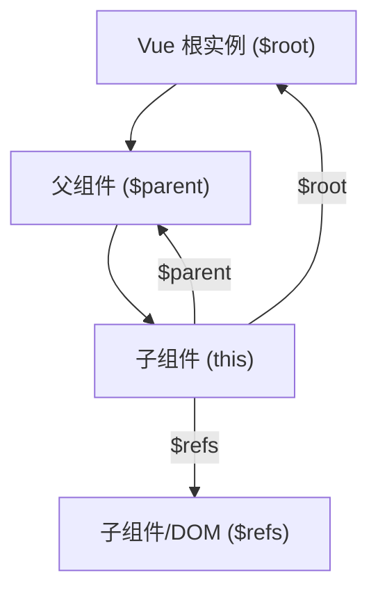
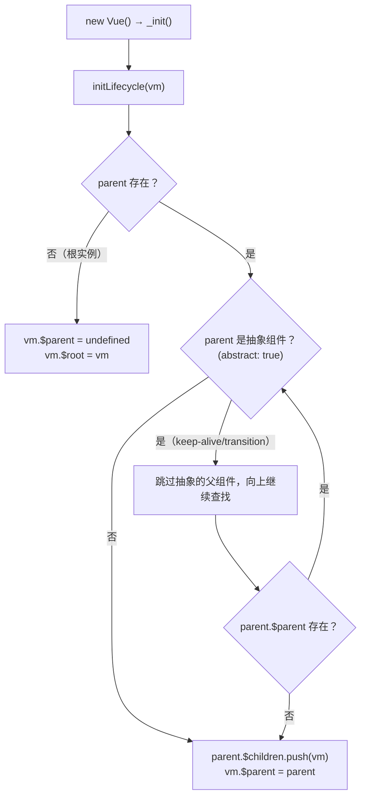
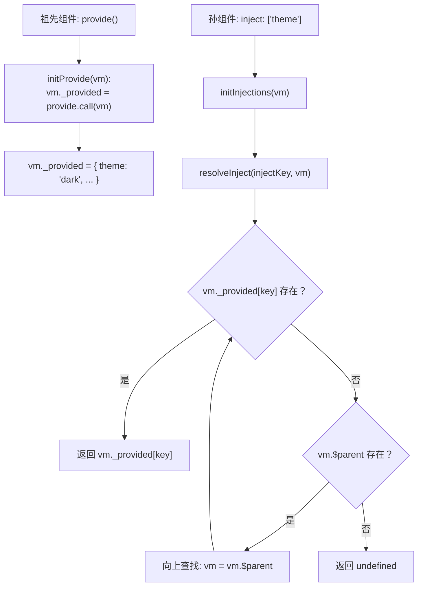
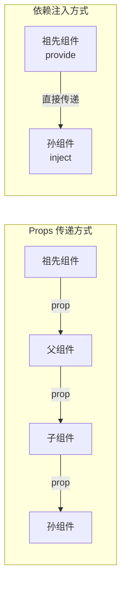
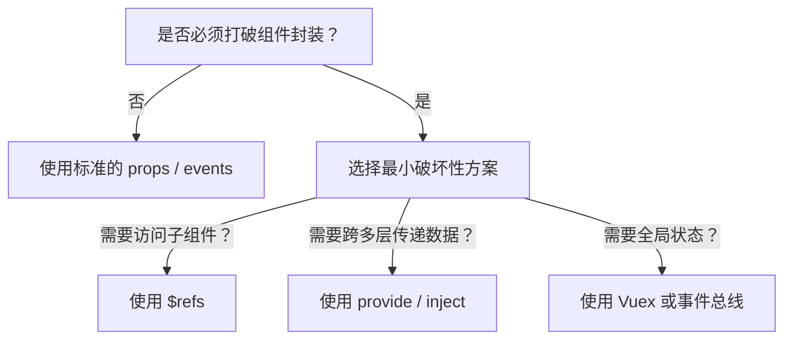

# 高级组件模式

## 访问元素和组件

### 核心概念

在绝大多数情况下，**不应该**直接访问另一个组件实例内部或手动操作 DOM 元素。Vue 的设计理念是通过数据驱动视图，组件间通过 props 和 events 进行通信。但在某些特殊场景下（如集成第三方库、处理焦点管理等），直接访问可能是必要的。

### 组件关系图示



### 根实例 $root

在每个 `new Vue` 实例的子组件中，其根实例可以通过 `$root` 属性进行访问。

#### 基础示例

```javascript
// Vue 根实例
new Vue({
  data: {
    foo: 1,
    user: {
      name: 'John',
      role: 'admin'
    }
  },
  computed: {
    bar: function () {
      return this.foo * 2
    }
  },
  methods: {
    baz: function () {
      console.log('Root method called')
    }
  }
})
```

所有的子组件都可以将这个实例作为一个全局 store 来访问或使用：

```javascript
// 在任意子组件中
export default {
  methods: {
    accessRoot() {
      // 获取根组件的数据
      console.log(this.$root.foo)        // 1
      
      // 写入根组件的数据
      this.$root.foo = 2
      
      // 访问根组件的计算属性
      console.log(this.$root.bar)        // 4
      
      // 调用根组件的方法
      this.$root.baz()
      
      // 访问嵌套对象
      console.log(this.$root.user.name)  // 'John'
    }
  }
}
```

#### 使用场景对比

| 场景 | 是否推荐使用 $root | 推荐方案 |
|------|-------------------|----------|
| Demo/原型开发 | ✅ 适合 | - |
| 小型应用（<10个组件） | ⚠️ 可用 | 简单的状态提升 |
| 中大型应用 | ❌ 不推荐 | Vuex/Pinia |
| 跨多层组件共享状态 | ❌ 不推荐 | 依赖注入/Vuex |

#### 注意事项

```javascript
// ❌ 错误：直接修改根组件数据难以追踪
this.$root.user.name = 'New Name'

// ✅ 更好：通过方法修改，便于追踪
// 在根组件中定义
methods: {
  updateUser(name) {
    this.user.name = name
    console.log('User updated to:', name) // 可追踪
  }
}

// 子组件调用
this.$root.updateUser('New Name')
```

> **最佳实践**：对于 demo 或非常小型的有少量组件的应用来说这是很方便的。但应用到中大型项目就不合适了。在绝大多数情况下，推荐使用 [Vuex](https://github.com/vuejs/vuex) 来管理应用的状态。

---

### 父级组件实例 $parent

和 `$root` 类似，`$parent` 属性可以用来从一个子组件访问父组件的实例。

#### 基础用法

```javascript
// 父组件
export default {
  data() {
    return {
      parentData: '来自父组件的数据'
    }
  },
  methods: {
    parentMethod() {
      console.log('父组件方法被调用')
    }
  }
}

// 子组件
export default {
  mounted() {
    // 访问父组件数据
    console.log(this.$parent.parentData)
    
    // 调用父组件方法
    this.$parent.parentMethod()
  }
}
```

#### 常见陷阱

```javascript
// ❌ 错误：链式访问父组件，代码脆弱且难以维护
var map = this.$parent.map || this.$parent.$parent.map

// ❌ 错误：直接修改父组件数据
this.$parent.someData = 'new value'
```

> **警告**：触达父级组件会使得应用更难调试和理解，尤其是修改父级组件的数据的时候。当回看父组件的时候，很难找出那个变更是从哪里发起的。

#### 替代方案对比

```javascript
// 场景：子组件需要触发父组件的操作

// ❌ 方案1：直接调用父组件方法（不推荐）
this.$parent.handleSave()

// ✅ 方案2：通过事件通信（推荐）
this.$emit('save')

// ✅ 方案3：使用依赖注入（跨多层时推荐）
inject: ['handleSave']
```

> **最佳实践**：这也是针对需要向任意更深层级的组件提供上下文信息时推荐使用**依赖注入**的原因。

#### $parent/$children 的底层维护机制

Vue 在组件初始化时通过 `initLifecycle` 建立父子关系：

```javascript
// src/core/instance/lifecycle.js
function initLifecycle(vm) {
  const options = vm.$options

  // 向上查找 $parent：跳过抽象组件（keep-alive、transition）
  let parent = options.parent
  if (parent && !options.abstract) {
    while (parent.$options.abstract && parent.$parent) {
      parent = parent.$parent  // 跳过抽象组件
    }
    parent.$children.push(vm)  // 将当前实例加入父组件的 children 列表
  }
  vm.$parent = parent  // 设置 $parent 引用
  vm.$root = parent ? parent.$root : vm  // 设置 $root 引用

  vm.$children = []     // 初始化为空数组
  vm.$refs = {}         // ref 映射
  // ...
}
```



> **关键**：抽象组件（keep-alive、transition）不会被加入 `$children` 链，它们的子组件会跳过它们直接链接到再上一层的父组件。

---

### 子组件实例或子元素 ref

尽管存在 prop 和事件，但有时仍需要在 JavaScript 里直接访问一个子组件。可以通过 `ref` 属性为子组件或 DOM 元素赋予一个 ID 引用。

#### 访问子组件

```html
<template>
  <div>
    <!-- 为子组件添加 ref -->
    <base-input ref="usernameInput" v-model="username"></base-input>
    <button @click="focusInput">聚焦输入框</button>
  </div>
</template>

<script>
export default {
  data() {
    return {
      username: ''
    }
  },
  methods: {
    focusInput() {
      // 通过 $refs 访问子组件实例
      this.$refs.usernameInput.focus()
    }
  }
}
</script>
```

#### 子组件内部实现

```html
<!-- BaseInput.vue -->
<template>
  <input ref="input" :value="value" @input="$emit('input', $event.target.value)">
</template>

<script>
export default {
  props: ['value'],
  methods: {
    // 暴露给父组件的方法
    focus() {
      this.$refs.input.focus()
    },
    blur() {
      this.$refs.input.blur()
    }
  }
}
</script>
```

#### 访问原生 DOM 元素

```html
<template>
  <div>
    <!-- 直接在原生元素上使用 ref -->
    <input ref="emailInput" type="email" v-model="email">
    <canvas ref="myCanvas" width="400" height="300"></canvas>
  </div>
</template>

<script>
export default {
  data() {
    return {
      email: ''
    }
  },
  mounted() {
    // 访问原生 DOM 元素
    this.$refs.emailInput.focus()
    
    // 操作 Canvas
    const ctx = this.$refs.myCanvas.getContext('2d')
    ctx.fillStyle = 'red'
    ctx.fillRect(10, 10, 100, 100)
  }
}
</script>
```

#### v-for 中使用 ref

```html
<template>
  <div>
    <div v-for="(item, index) in items" :key="index" ref="itemList">
      {{ item }}
    </div>
  </div>
</template>

<script>
export default {
  data() {
    return {
      items: ['Apple', 'Banana', 'Orange']
    }
  },
  mounted() {
    // v-for 中的 ref 是一个数组
    console.log(this.$refs.itemList) // [div, div, div]
    console.log(this.$refs.itemList.length) // 3
  }
}
</script>
```

#### ref 使用注意事项

| 特性 | 说明 |
|------|------|
| 访问时机 | 只在组件渲染完成后生效 |
| 响应式 | `$refs` 不是响应式的 |
| 模板中使用 | ❌ 避免在模板或计算属性中访问 `$refs` |
| 用途定位 | 作为直接操作子组件的"逃生舱"，不应滥用 |

```javascript
// ❌ 错误：在计算属性中使用 $refs
computed: {
  inputValue() {
    return this.$refs.input.value // 不推荐
  }
}

// ❌ 错误：在模板中使用 $refs
<template>
  <div>{{ $refs.input.value }}</div> <!-- 不推荐 -->
</template>

// ✅ 正确：在方法或生命周期钩子中使用
mounted() {
  this.$refs.input.focus()
}
```

---

### 依赖注入 provide 和 inject

`provide` 和 `inject` 主要用于跨多层组件传递数据，解决了 prop 逐层传递的问题。

#### provide/inject 的实现原理



**关键源码（简化）：**

```javascript
// src/core/instance/inject.js
function initProvide(vm) {
  const provide = vm.$options.provide
  if (provide) {
    // 将 provide 函数/对象的结果存入 vm._provided
    vm._provided = typeof provide === 'function'
      ? provide.call(vm)
      : provide
  }
}

function initInjections(vm) {
  const result = resolveInject(vm.$options.inject, vm)
  if (result) {
    // 将 inject 结果挂载到 vm 上（键本身是响应式属性，
    // 但提供的值不会随祖先更新——注意 toggleObserving(false) 不会观察值对象）
    Object.keys(result).forEach(key => {
      defineReactive(vm, key, result[key])
    })
  }
}

function resolveInject(inject, vm) {
  if (!inject) return
  const result = Object.create(null)
  const keys = Array.isArray(inject) ? inject : Object.keys(inject)

  for (let key of keys) {
    let source = vm
    // 沿 $parent 链向上查找 _provided
    while (source) {
      if (source._provided && key in source._provided) {
        result[key] = source._provided[key]
        break
      }
      source = source.$parent  // 向上遍历
    }
  }
  return result
}
```

> **关键点**：
> - `provide` 在 `initProvide` 阶段执行（beforeCreate 之后、created 之前），此时可访问 `this`
> - `inject` 在 `initInjections` 阶段执行（**早于** initState 与 initProvide），通过 `resolveInject` 沿 `$parent` 链向上查找 `_provided`
> - 默认**非响应式**：`_provided` 中的值不会自动追踪依赖。要实现响应式需传入 `Vue.observable()` 包装的对象或 computed 属性

#### 基础用法

```javascript
// 祖先组件 - 提供数据
export default {
  data() {
    return {
      theme: 'dark',
      user: { name: 'John' }
    }
  },
  provide() {
    return {
      // 提供数据
      theme: this.theme,
      // 提供方法
      getUser: () => this.user,
      // 提供响应式方法（变通方案）
      updateUser: this.updateUser
    }
  },
  methods: {
    updateUser(userData) {
      Object.assign(this.user, userData)
    }
  }
}

// 后代组件 - 注入数据
export default {
  inject: ['theme', 'getUser', 'updateUser'],
  computed: {
    currentUser() {
      return this.getUser()
    }
  },
  methods: {
    changeUser() {
      this.updateUser({ name: 'Jane' })
    }
  }
}
```

#### 依赖注入 vs Props 对比



#### 实现响应式注入

默认情况下，`provide` 提供的数据是非响应式的。以下是实现响应式的方案：

**方案1：提供响应式对象**

```javascript
// 祖先组件
import Vue from 'vue'

export default {
  data() {
    return {
      // 使用 Vue.observable 创建响应式对象（Vue 2.6+）
      sharedState: Vue.observable({
        count: 0,
        user: { name: 'John' }
      })
    }
  },
  provide() {
    return {
      sharedState: this.sharedState
    }
  }
}

// 后代组件
export default {
  inject: ['sharedState'],
  computed: {
    count() {
      return this.sharedState.count // 响应式
    }
  }
}
```

**方案2：使用计算属性函数**

```javascript
// 祖先组件
export default {
  data() {
    return {
      count: 0
    }
  },
  provide() {
    return {
      // 提供一个获取器函数
      getCount: () => this.count
    }
  }
}

// 后代组件
export default {
  inject: ['getCount'],
  computed: {
    currentCount() {
      return this.getCount() // 每次访问都会重新计算
    }
  }
}
```

**方案3：使用 Vue 2.7 组合式 API 的 provide/inject**

```javascript
// 祖先组件（Vue 2.7+）
import { ref, provide } from 'vue'

export default {
  setup() {
    const count = ref(0)
    // 提供 ref 本身，注入方拿到的是响应式引用
    provide('count', count)
    return { count }
  }
}

// 后代组件（Vue 2.7+）
import { inject } from 'vue'

export default {
  setup() {
    const count = inject('count')  // 响应式，模板中直接使用
    return { count }
  }
}
```

#### 完整示例：主题注入

```html
<!-- ThemeProvider.vue - 主题提供者组件 -->
<template>
  <div :class="'theme-' + theme">
    <slot></slot>
  </div>
</template>

<script>
export default {
  name: 'ThemeProvider',
  props: {
    theme: {
      type: String,
      default: 'light'
    }
  },
  provide() {
    return {
      themeContext: {
        theme: this.theme,
        toggle: this.toggleTheme
      }
    }
  },
  methods: {
    toggleTheme() {
      this.$emit('update:theme', this.theme === 'light' ? 'dark' : 'light')
    }
  }
}
</script>

<!-- ThemeButton.vue - 任意后代组件 -->
<template>
  <button @click="handleClick" :class="themeContext.theme">
    当前主题: {{ themeContext.theme }}
  </button>
</template>

<script>
export default {
  inject: ['themeContext'],
  methods: {
    handleClick() {
      this.themeContext.toggle()
    }
  }
}
</script>

<!-- 使用示例 -->
<template>
  <ThemeProvider :theme.sync="currentTheme">
    <div>
      <h1>应用标题</h1>
      <ThemeButton />
    </div>
  </ThemeProvider>
</template>
```

#### 依赖注入的优缺点

| 优点 | 缺点 |
|------|------|
| 避免多层 prop 传递 | 组件耦合度增加，重构困难 |
| 祖先不需要知道谁在使用 | 默认非响应式 |
| 后代不需要知道数据来源 | 调试时数据流向不明显 |
| 适合插件和组件库开发 | 不适合频繁变化的数据 |

> **最佳实践**：如果想要共享的属性是你的应用特有的，而不是通用化的，或者如果想在祖先组件中更新所提供的数据，那么这意味着你可能需要换用一个像 [Vuex](https://github.com/vuejs/vuex) 这样真正的状态管理方案。

---

## 程序化的事件侦听器

### 概述

除了 `v-on` 指令，Vue 实例还提供了完整的事件接口，用于程序化地监听和管理事件。

### 事件 API

| 方法 | 说明 | 使用场景 |
|------|------|----------|
| `$on(eventName, handler)` | 监听事件 | 持续监听某个事件 |
| `$once(eventName, handler)` | 一次性监听 | 只需要响应一次的事件 |
| `$off(eventName, handler)` | 移除监听 | 清理事件监听器 |
| `$emit(eventName, payload)` | 触发事件 | 触发自定义事件 |

### 传统模式 vs 程序化模式

#### 传统模式（存在的问题）

```javascript
export default {
  data() {
    return {
      picker: null  // 问题1：需要在 data 中保存实例
    }
  },
  mounted() {
    // 集成第三方库
    this.picker = new Pikaday({
      field: this.$refs.input,
      format: 'YYYY-MM-DD'
    })
  },
  beforeDestroy() {
    // 问题2：清理代码与创建代码分离
    this.picker.destroy()
  }
}
```

**存在的问题：**
1. 需要在组件实例中保存第三方库的引用
2. 创建代码和清理代码分离，难以维护
3. 多个实例时需要重复编写清理逻辑

#### 程序化模式（推荐）

```javascript
export default {
  mounted() {
    const picker = new Pikaday({
      field: this.$refs.input,
      format: 'YYYY-MM-DD'
    })
    
    // 使用 hook: 前缀监听生命周期钩子
    this.$once('hook:beforeDestroy', () => {
      picker.destroy()
    })
  }
}
```

### 进阶用法

#### 管理多个第三方实例

```javascript
export default {
  mounted() {
    this.attachDatepicker('startDateInput')
    this.attachDatepicker('endDateInput')
  },
  methods: {
    attachDatepicker(refName) {
      const picker = new Pikaday({
        field: this.$refs[refName],
        format: 'YYYY-MM-DD',
        onSelect: (date) => {
          this.$emit('date-selected', { ref: refName, date })
        }
      })
      
      // 自动清理
      this.$once('hook:beforeDestroy', () => {
        picker.destroy()
      })
    }
  }
}
```

#### 动态事件监听

```javascript
export default {
  data() {
    return {
      isListening: false
    }
  },
  methods: {
    startListening() {
      if (this.isListening) return
      
      // 开始监听全局事件
      this.$on('global-event', this.handleGlobalEvent)
      this.isListening = true
    },
    stopListening() {
      // 移除特定监听器
      this.$off('global-event', this.handleGlobalEvent)
      this.isListening = false
    },
    handleGlobalEvent(payload) {
      console.log('Received:', payload)
    }
  },
  beforeDestroy() {
    // 清理所有监听器
    this.$off('global-event')
  }
}
```

#### 监听生命周期钩子

```javascript
export default {
  created() {
    // 监听自身的生命周期钩子
    this.$once('hook:mounted', () => {
      console.log('组件已挂载')
    })
    
    this.$once('hook:beforeDestroy', () => {
      console.log('组件即将销毁')
    })
  }
}
```

### 完整示例：集成第三方日期选择器

```html
<!DOCTYPE html>
<html>
<head>
  <title>程序化事件监听器示例</title>
  <script src="https://unpkg.com/pikaday@1.7.0"></script>
  <link rel="stylesheet" href="https://unpkg.com/pikaday/css/pikaday.css">
  <script src="https://unpkg.com/vue@2"></script>
</head>
<body>
  <div id="app">
    <h2>日期选择示例</h2>
    <div>
      <label>开始日期：</label>
      <input ref="startDateInput" type="text" v-model="startDate">
    </div>
    <div>
      <label>结束日期：</label>
      <input ref="endDateInput" type="text" v-model="endDate">
    </div>
  </div>

  <script>
    new Vue({
      el: "#app",
      data: {
        startDate: null,
        endDate: null
      },
      mounted() {
        this.attachDatepicker('startDateInput', 'startDate')
        this.attachDatepicker('endDateInput', 'endDate')
      },
      methods: {
        attachDatepicker(refName, modelKey) {
          const picker = new Pikaday({
            field: this.$refs[refName],
            format: "YYYY-MM-DD",
            onSelect: (date) => {
              const formatted = date.toISOString().split('T')[0]
              this[modelKey] = formatted
            }
          })

          // 程序化清理：绑定到生命周期钩子
          this.$once("hook:beforeDestroy", () => {
            picker.destroy()
          })
        }
      }
    })
  </script>
</body>
</html>
```

### 重要提示

> **注意**：Vue 的事件系统不同于浏览器的 [EventTarget API](https://developer.mozilla.org/zh-CN/docs/Web/API/EventTarget)。尽管它们工作起来是相似的，但是 `$emit`、`$on` 和 `$off` 并不是 `dispatchEvent`、`addEventListener` 和 `removeEventListener` 的别名。

```javascript
// ❌ Vue 事件 API 不能用于原生 DOM 事件
this.$on('click', handler)  // 不会监听到 DOM 点击事件

// ✅ 使用原生 API 监听 DOM 事件
document.addEventListener('click', handler)
this.$once('hook:beforeDestroy', () => {
  document.removeEventListener('click', handler)
})
```

---

## 循环引用

### 递归组件

组件可以在自己的模板中调用自身，这称为递归组件。

#### 基础示例

```javascript
// 递归组件必须有 name 选项
export default {
  name: 'RecursiveComponent',
  props: {
    depth: {
      type: Number,
      default: 0
    }
  },
  template: `
    <div class="recursive">
      <span>深度: {{ depth }}</span>
      <!-- 必须有终止条件 -->
      <recursive-component
        v-if="depth < 3"
        :depth="depth + 1"
      />
    </div>
  `
}
```

#### 实战示例：树形组件

```html
<!-- TreeItem.vue -->
<template>
  <li>
    <div @click="toggle">
      <span>{{ model.name }}</span>
      <span v-if="isFolder">[{{ isOpen ? '-' : '+' }}]</span>
    </div>
    <ul v-show="isOpen" v-if="isFolder">
      <!-- 递归调用自身 -->
      <tree-item
        v-for="item in model.children"
        :key="item.id"
        :model="item"
      />
    </ul>
  </li>
</template>

<script>
export default {
  name: 'TreeItem',  // 必须定义 name
  props: {
    model: Object
  },
  data() {
    return {
      isOpen: false
    }
  },
  computed: {
    isFolder() {
      return this.model.children && this.model.children.length
    }
  },
  methods: {
    toggle() {
      if (this.isFolder) {
        this.isOpen = !this.isOpen
      }
    }
  }
}
</script>
```

使用示例：

```html
<template>
  <ul>
    <tree-item :model="treeData" />
  </ul>
</template>

<script>
import TreeItem from './TreeItem.vue'

export default {
  components: { TreeItem },
  data() {
    return {
      treeData: {
        name: '根目录',
        children: [
          {
            name: '文件夹1',
            children: [
              { name: '文件1-1' },
              { name: '文件1-2' }
            ]
          },
          {
            name: '文件夹2',
            children: [
              { name: '文件2-1' }
            ]
          }
        ]
      }
    }
  }
}
</script>
```

#### 递归组件注意事项

> 💡 **组件精讲补充**：实现递归组件的必要条件有两个——**设置 name 选项**和**有明确的结束条件**。在 Webpack 中通过 `import` 导入的组件不强制设置 `name`，但递归组件的使用者是组件自身，它必须知道自己的名字才能递归调用。此外，递归组件常用于开发具有未知层级关系的独立组件，如级联选择器和树形控件，这类组件一般是数据驱动型的，父级有一个字段 `children`，然后递归渲染。

```javascript
// ❌ 错误：没有终止条件，导致无限循环
export default {
  name: 'StackOverflow',
  template: '<div><stack-overflow></stack-overflow></div>'
}
// 结果：Uncaught RangeError: Maximum call stack size exceeded

// ✅ 正确：有终止条件的递归
export default {
  name: 'SafeRecursive',
  props: ['count'],
  template: `
    <div>
      <span>{{ count }}</span>
      <safe-recursive
        v-if="count > 0"
        :count="count - 1"
      />
    </div>
  `
}
```

### 组件之间的循环引用

当两个组件互相引用对方时，会产生循环依赖问题。

#### 问题描述

```
组件 A 引用组件 B
    ↓
组件 B 引用组件 A
    ↓
组件 A 引用组件 B
    ↓
...无限循环...
```

#### 场景示例

```html
<!-- TreeFolder.vue -->
<template>
  <p>
    <span>{{ folder.name }}</span>
    <tree-folder-contents :children="folder.children"/>
  </p>
</template>

<!-- TreeFolderContents.vue -->
<template>
  <ul>
    <li v-for="child in children" :key="child.id">
      <tree-folder v-if="child.children" :folder="child"/>
      <span v-else>{{ child.name }}</span>
    </li>
  </ul>
</template>
```

#### 解决方案

**方案1：全局注册（推荐）**

```javascript
// main.js
import Vue from 'vue'
import TreeFolder from './TreeFolder.vue'
import TreeFolderContents from './TreeFolderContents.vue'

// 全局注册会自动处理循环引用
Vue.component('TreeFolder', TreeFolder)
Vue.component('TreeFolderContents', TreeFolderContents)
```

**方案2：在 beforeCreate 中异步注册**

```javascript
// TreeFolder.vue
export default {
  name: 'TreeFolder',
  props: ['folder'],
  beforeCreate() {
    // 在生命周期钩子中异步注册
    this.$options.components.TreeFolderContents = 
      require('./TreeFolderContents.vue').default
  }
}
```

**方案3：使用异步组件（推荐用于模块系统）**

```javascript
// TreeFolder.vue
export default {
  name: 'TreeFolder',
  props: ['folder'],
  components: {
    // 使用 webpack 的异步 import
    TreeFolderContents: () => import('./TreeFolderContents.vue')
  }
}

// TreeFolderContents.vue
export default {
  name: 'TreeFolderContents',
  props: ['children'],
  components: {
    // 使用 webpack 的异步 import
    TreeFolder: () => import('./TreeFolder.vue')
  }
}
```

#### 循环引用解决对比

| 方案 | 优点 | 缺点 | 适用场景 |
|------|------|------|----------|
| 全局注册 | 简单直接 | 增加全局命名空间污染 | 常用基础组件 |
| beforeCreate | 兼容性好 | 需要手动管理 | 不支持异步 import 的环境 |
| 异步 import | 现代、推荐 | 需要 webpack 等构建工具 | 现代 Vue 项目 |

---

## 模板定义的替代品

### 内联模板 inline-template

当 `inline-template` 属性出现在一个子组件上时，组件会将其内容作为模板，而不是作为插槽内容。

> **注意**：`inline-template` 在 Vue 3 中已被移除，新代码应使用插槽或作用域插槽。

#### 基础用法

```html
<template>
  <div>
    <my-component inline-template>
      <!-- 这里的内容成为组件的模板 -->
      <div>
        <p>这些内容作为组件自己的模板编译</p>
        <p>而不是父组件的插槽内容</p>
        <p>组件数据: {{ message }}</p>
      </div>
    </my-component>
  </div>
</template>

<script>
export default {
  components: {
    MyComponent: {
      data() {
        return {
          message: '来自组件的数据'
        }
      }
      // 不需要 template 选项
    }
  }
}
</script>
```

#### 使用场景对比

```html
<!-- 普通插槽方式 -->
<my-component>
  <!-- 父组件作用域 -->
  {{ parentData }}  <!-- 可以访问父组件数据 -->
</my-component>

<!-- inline-template 方式 -->
<my-component inline-template>
  <!-- 子组件作用域 -->
  {{ childData }}   <!-- 访问的是子组件数据 -->
</my-component>
```

#### 注意事项

```html
<!-- ❌ 不推荐：作用域混乱 -->
<user-card inline-template>
  <div>
    <!-- 这里的变量是来自 user-card 组件还是父组件？ -->
    <p>Name: {{ name }}</p>
    <p>Email: {{ email }}</p>
  </div>
</user-card>

<!-- ✅ 推荐：使用 .vue 文件，模板定义更清晰 -->
<!-- UserCard.vue -->
<template>
  <div class="user-card">
    <p>Name: {{ name }}</p>
    <p>Email: {{ email }}</p>
  </div>
</template>
```

> **最佳实践**：`inline-template` 会让模板的作用域变得更加难以理解。在组件内优先选择 `template` 选项或 `.vue` 文件里的一个 `<template>` 元素来定义模板。

### X-Template

另一种定义模板的方式是在 `<script>` 元素中使用 `text/x-template` 类型。

#### 基础用法

```html
<!DOCTYPE html>
<html>
<head>
  <title>X-Template 示例</title>
</head>
<body>
  <div id="app">
    <hello-world></hello-world>
  </div>

  <!-- 模板定义在 Vue 实例所属 DOM 之外 -->
  <script type="text/x-template" id="hello-world-template">
    <div class="hello">
      <h1>{{ message }}</h1>
      <button @click="clickHandler">点击我</button>
    </div>
  </script>

  <script src="https://unpkg.com/vue@2"></script>
  <script>
    Vue.component('hello-world', {
      template: '#hello-world-template',  // 通过 id 引用模板
      data() {
        return {
          message: 'Hello World!'
        }
      },
      methods: {
        clickHandler() {
          alert('Clicked!')
        }
      }
    })

    new Vue({ el: '#app' })
  </script>
</body>
</html>
```

#### X-Template 的适用场景

```javascript
// 适合场景：需要动态生成模板
Vue.component('dynamic-component', {
  template: '#' + dynamicTemplateId,  // 动态选择模板
  // ...
})

// 适合场景：模板特别大，需要分离管理
// large-template.html (单独文件)
<script type="text/x-template" id="large-template">
  <!-- 大量静态内容 -->
</script>
```

#### 模板定义方式对比

| 方式 | 优点 | 缺点 | 推荐度 |
|------|------|------|--------|
| .vue 单文件组件 | 完整的组件封装，支持 CSS、作用域样式 | 需要构建工具 | ⭐⭐⭐⭐⭐ |
| template 选项 | 简单直接 | 不支持 CSS，模板字符串难维护 | ⭐⭐⭐ |
| inline-template | 灵活 | 作用域混乱 | ⭐⭐ |
| X-Template | 可分离大模板 | 模板与组件定义分离 | ⭐⭐ |

> **最佳实践**：X-Template 可用于模板特别大的 demo 或极小型的应用，但其他情况下请避免使用，因为这会将模板和该组件的其他定义分离开。

---

## 控制更新

### 强制更新

Vue 的响应式系统会自动追踪依赖并在数据变化时更新视图。但在极少数情况下，可能需要强制更新。

#### 何时需要强制更新

```javascript
// ❌ 错误示例：直接修改数组元素（Vue 2 无法检测）
this.items[0] = 'new value'  // 视图不会更新

// ❌ 错误示例：直接添加对象属性（Vue 2 无法检测）
this.obj.newProp = 'value'  // 视图不会更新

// ✅ 正确做法
this.$set(this.items, 0, 'new value')
this.$set(this.obj, 'newProp', 'value')
```

#### 使用 $forceUpdate

```javascript
export default {
  data() {
    return {
      items: ['a', 'b', 'c']
    }
  },
  methods: {
    updateItem() {
      // 如果确实无法使用 $set，可以强制更新（不推荐）
      this.items[0] = 'new value'
      this.$forceUpdate()  // 强制重新渲染
    }
  }
}
```

#### 正确的响应式更新方式

```javascript
export default {
  data() {
    return {
      items: ['a', 'b', 'c'],
      obj: { a: 1 }
    }
  },
  methods: {
    // 数组更新
    updateArray() {
      // ✅ 使用 Vue.set / this.$set
      this.$set(this.items, 0, 'new value')
      
      // ✅ 使用 splice
      this.items.splice(0, 1, 'new value')
      
      // ✅ 使用数组的变异方法
      this.items.push('d')
      this.items.pop()
    },
    
    // 对象更新
    updateObject() {
      // ✅ 使用 Vue.set / this.$set
      this.$set(this.obj, 'newProp', 'value')
      
      // ✅ 使用 Object.assign 创建新对象
      this.obj = Object.assign({}, this.obj, { newProp: 'value' })
      
      // ✅ 使用展开运算符
      this.obj = { ...this.obj, newProp: 'value' }
    }
  }
}
```

> **最佳实践**：如果发现需要在 Vue 中做一次强制更新，99.9% 的情况是在某个地方做错了事。请检查数组或对象的变更检测注意事项，确保使用正确的响应式更新方式。

### v-once 创建低开销的静态组件

`v-once` 指令可以确保元素和组件只渲染一次，后续重新渲染时会被视为静态内容。

#### 基础用法

```html
<!-- 单个元素 -->
<span v-once>{{ message }}</span>

<!-- 多个元素 -->
<div v-once>
  <h1>静态标题</h1>
  <p>{{ staticContent }}</p>
</div>

<!-- 组件 -->
<my-component v-once :data="staticData"></my-component>
```

#### 静态组件示例

```javascript
// 服务条款组件 - 大量静态内容
Vue.component('terms-of-service', {
  template: `
    <div v-once>
      <h1>服务条款</h1>
      <article>
        <h2>第1条 用户协议</h2>
        <p>这里是大量的静态文本内容...</p>
        <p>这些内容永远不会改变...</p>
        
        <h2>第2条 隐私政策</h2>
        <p>更多的静态内容...</p>
        <!-- 大量静态内容 -->
      </article>
    </div>
  `
})
```

#### v-once 使用对比

```html
<!-- ❌ 不推荐：频繁变化的内容使用 v-once -->
<span v-once>{{ currentTime }}</span>  <!-- 永远不会更新 -->

<!-- ✅ 正确：纯静态内容 -->
<span v-once>版权所有 © 2024 公司名</span>

<!-- ✅ 正确：静态组件 -->
<static-header v-once></static-header>
```

#### 性能优化示例

```html
<template>
  <div>
    <!-- 静态头部：只渲染一次 -->
    <header v-once>
      <nav>
        <a href="/">首页</a>
        <a href="/about">关于</a>
        <a href="/contact">联系</a>
      </nav>
    </header>
    
    <!-- 动态内容：正常更新 -->
    <main>
      <article v-for="post in posts" :key="post.id">
        <h2>{{ post.title }}</h2>
        <p>{{ post.content }}</p>
      </article>
    </main>
    
    <!-- 静态底部：只渲染一次 -->
    <footer v-once>
      <p>© 2024 版权所有</p>
    </footer>
  </div>
</template>
```

#### v-once 注意事项

| 特性 | 说明 |
|------|------|
| 渲染次数 | 只渲染一次，后续跳过 |
| 适用场景 | 大量纯静态内容 |
| 响应式 | 数据变化不会触发更新 |
| 调试 | 可能导致调试困难 |

> **警告**：不要过度使用 `v-once`。当需要渲染大量静态内容时，极少数情况下它会带来便利。除非你非常确定渲染变慢了，否则它完全没有必要——再加上它在后期会带来很多困惑。假如另一个开发者不熟悉 `v-once` 或漏看了它在模板中，他们可能会花很多时间去查找模板为什么无法正确更新。

---

## 最佳实践总结

### 组件通信方式选择指南

| 场景 | 推荐方式 | 替代方案 |
|------|----------|----------|
| 父子通信 | props / $emit | - |
| 兄弟通信 | 事件总线 / Vuex | - |
| 跨多层通信 | provide/inject | Vuex |
| 任意组件 | Vuex | 事件总线 |
| 访问子组件 | $refs（谨慎使用） | 事件通信 |
| 访问父组件 | 不推荐 | props 传递 |
| 访问根实例 | $root（仅小型应用） | Vuex |

### 边界情况处理原则



### 代码质量检查清单

- [ ] 避免在模板或计算属性中访问 `$refs`
- [ ] 不直接修改 `$parent` 或 `$root` 的数据
- [ ] 递归组件必须有终止条件
- [ ] 循环引用使用异步组件解决
- [ ] 优先使用响应式更新而非 `$forceUpdate`
- [ ] 不滥用 `v-once`
- [ ] 第三方库集成使用程序化事件监听器清理

---

## 常见问题解答

### Q1: 什么时候应该使用 $refs？

**A:** `$refs` 应该只用于以下场景：
1. 直接操作 DOM（如聚焦输入框、触发动画）
2. 调用子组件暴露的方法
3. 集成第三方库需要访问 DOM 元素

不应该用于：
- 组件间通信（使用 props/events）
- 在模板或计算属性中访问
- 频繁访问（它不是响应式的）

### Q2: provide/inject 如何实现响应式？

**A:** Vue 2 中可以通过以下方式实现：

```javascript
// 方法1：Vue.observable (Vue 2.6+)
provide() {
  return {
    state: Vue.observable({ count: 0 })
  }
}

// 方法2：传递函数
provide() {
  return {
    getCount: () => this.count
  }
}
// 子组件使用 computed 包装
computed: {
  currentCount() {
    return this.getCount()
  }
}
```

### Q3: 为什么 $forceUpdate 后视图还是没更新？

**A:** 可能的原因：
1. 数据没有被 Vue 的响应式系统追踪
2. 直接修改了数组元素或添加了对象属性

```javascript
// 解决方案：确保数据是响应式的
data() {
  return {
    items: []  // 响应式
  }
}

// 添加新属性
this.$set(this.obj, 'newProp', value)

// 修改数组元素
this.$set(this.items, index, newValue)
```

### Q4: 递归组件导致无限循环怎么办？

**A:** 确保递归有终止条件：

```javascript
// ✅ 正确：有终止条件
<recursive-component
  v-if="hasChildren"
  :data="childData"
/>

// ❌ 错误：无条件递归
<recursive-component :data="childData" />
```

### Q5: 如何正确清理第三方库实例？

**A:** 使用程序化事件监听器：

```javascript
mounted() {
  const instance = new ThirdPartyLib(options)
  
  // 自动在销毁时清理
  this.$once('hook:beforeDestroy', () => {
    instance.destroy()
  })
}
```

### Q6: 循环引用的组件如何正确导入？

**A:** 使用异步组件：

```javascript
// 在组件定义中
components: {
  CircularComponent: () => import('./CircularComponent.vue')
}
```

### Q7: inline-template 和插槽的区别是什么？

**A:** 

| 特性 | inline-template | 插槽 |
|------|----------------|------|
| 作用域 | 子组件 | 父组件 |
| 编译位置 | 子组件 | 父组件 |
| 推荐度 | 低 | 高 |
| 适用场景 | 特殊情况 | 组件内容分发 |

```html
<!-- 插槽：父组件作用域 -->
<my-component>
  {{ parentData }}  <!-- 来自父组件 -->
</my-component>

<!-- inline-template：子组件作用域 -->
<my-component inline-template>
  {{ childData }}  <!-- 来自子组件 -->
</my-component>
```

---

## 参考资料

- [Vue 2 官方文档 - 处理边界情况](https://v2.cn.vuejs.org/v2/guide/components-edge-cases.html)
- [Vue 2 API 文档](https://v2.cn.vuejs.org/v2/api/)
- [Vuex 状态管理](https://vuex.vuejs.org/zh/)
- [Vue 2 响应式原理](https://v2.cn.vuejs.org/v2/guide/reactivity.html)

---
