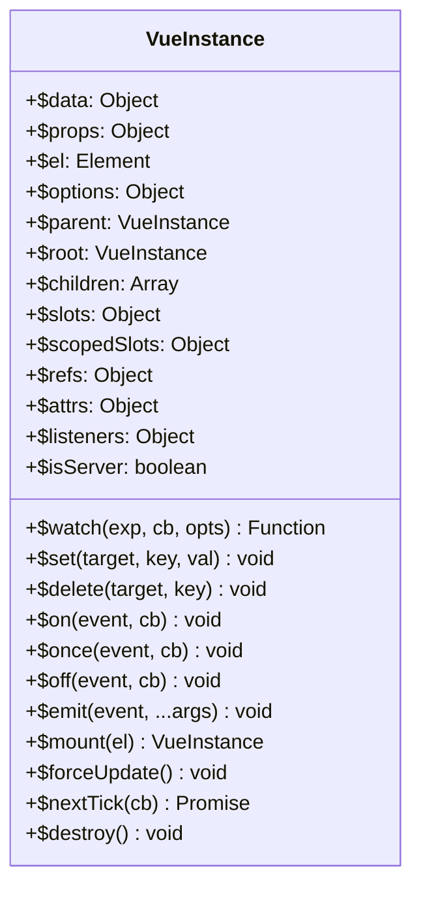
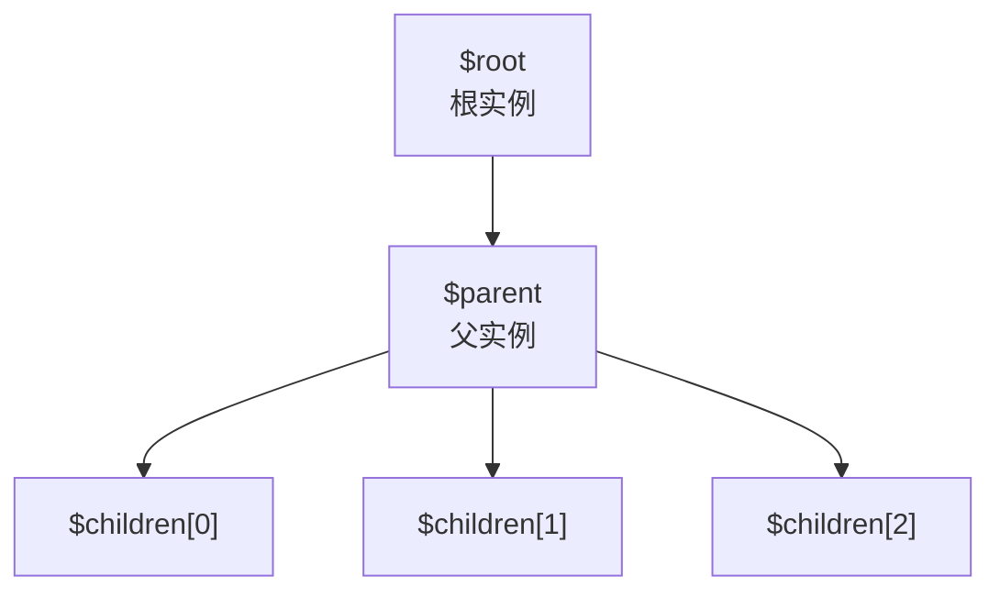
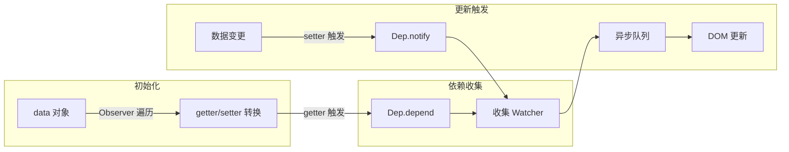
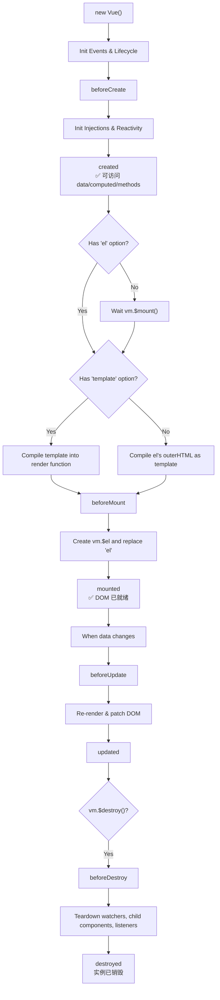
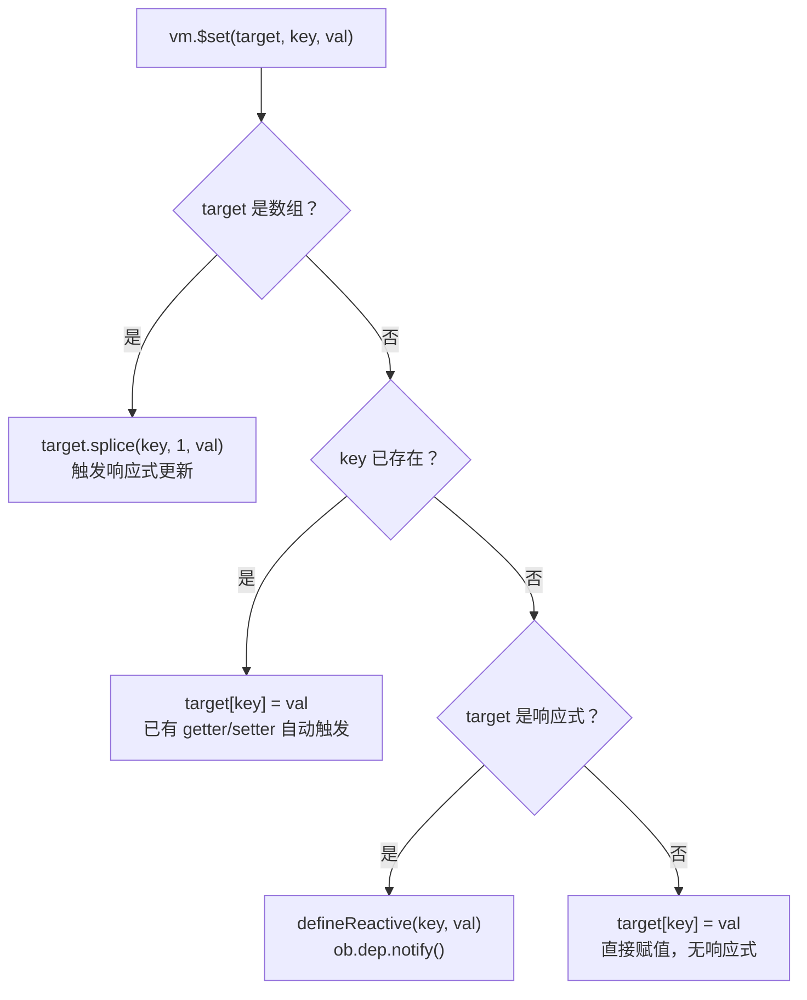
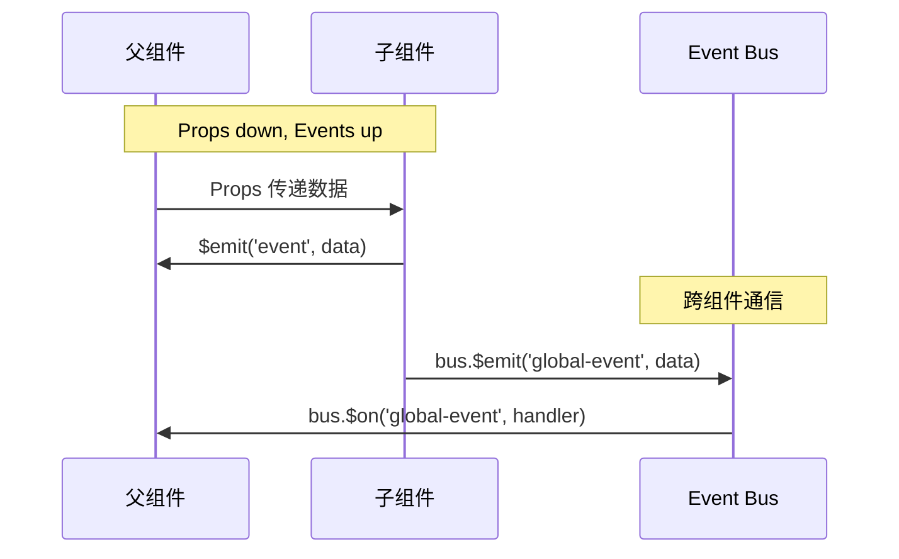
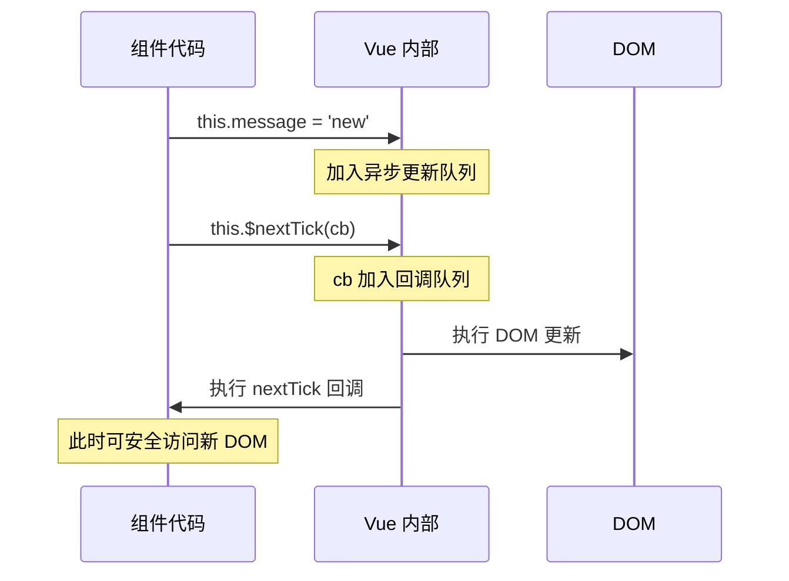

# Vue 实例 API 参考

## 概述

Vue 实例是 Vue 应用的核心。每个 Vue 应用都是通过 `Vue` 函数创建一个新的 Vue 实例开始的：

```js
var vm = new Vue({
  // 选项
})
```

虽然没有完全遵循 [MVVM 模式](https://zh.wikipedia.org/wiki/MVVM)，但 Vue 的设计受到其启发，因此文档中常用 `vm`（ViewModel 缩写）表示 Vue 实例。

## 实例架构



### 实例关系图



## 响应式系统概览

Vue 2 通过 `Object.defineProperty` 将 data 属性转为 getter/setter，实现数据驱动的视图更新：



> 📖 响应式系统的完整源码级解析请参见：[深入响应式原理](../02-进阶原理/01-响应式与生命周期/01-响应式原理.md)

## 生命周期

每个 Vue 实例从创建到销毁会经历一系列生命周期钩子：



**关键要点**：

- 不要在生命周期钩子中使用**箭头函数**——`this` 不会指向组件实例
- `mounted` 不保证所有子组件都已挂载，需等待用 `this.$nextTick()`
- `updated` 不保证所有子组件都已重绘，同样用 `this.$nextTick()`

> 📖 每个钩子的详细用法请参见：[生命周期详解](../02-进阶原理/01-响应式与生命周期/02-生命周期.md)

## 实例 Property

### vm.$data

**类型**：`Object`

Vue 实例观察的数据对象。通过 `vm.a` 可直接访问 `vm.$data.a`：

```js
var vm = new Vue({
  data: {
    message: "Hello Vue!",
    user: { name: "John", age: 25 }
  }
})

console.log(vm.message)          // "Hello Vue!"
console.log(vm.$data.message)    // "Hello Vue!"
console.log(vm.$data === vm.$options.data)  // true
```

> 使用 `Object.freeze()` 可以阻止响应式追踪，适用于不需要变化的大数据。

---

### vm.$props

> 2.2.0 新增

**类型**：`Object`

当前组件接收到的 props 对象。Vue 实例代理了对其属性的访问：

```js
Vue.component("user-profile", {
  props: {
    name: String,
    age: { type: Number, default: 18 }
  },
  created() {
    console.log(this.$props.name)
  }
})
```

> ⚠️ Props 是单向数据流，子组件不应修改。通过 `$emit` 通知父组件修改。

---

### vm.$el

**类型**：`Element` **只读**

Vue 实例使用的根 DOM 元素：

```js
var vm = new Vue({
  template: '<div id="app">{{ message }}</div>',
  data: { message: "Hello Vue!" }
})
vm.$mount()
console.log(vm.$el.tagName)  // "DIV"
```

> 服务端渲染时 `$el` 为 `undefined`。

---

### vm.$options

**类型**：`Object` **只读**

用于当前 Vue 实例的初始化选项。实用场景——存储自定义配置：

```js
Vue.component("my-component", {
  apiEndpoint: "/api/users",
  methods: {
    fetchData() {
      return fetch(this.$options.apiEndpoint).then(res => res.json())
    }
  }
})
```

---

### vm.$parent

**类型**：`Vue instance` **只读**

父实例（根实例的 `$parent` 为 `undefined`）。

> ⚠️ 避免直接访问 `$parent`——会使组件耦合。推荐用 props/events 通信。

---

### vm.$root

**类型**：`Vue instance` **只读**

当前组件树的根 Vue 实例：

```js
// 简单场景下访问全局状态
this.$root.globalState
```

---

### vm.$children

**类型**：`Array<Vue instance>` **只读**

直接子组件。**不保证顺序，也不是响应式的。**

> 推荐使用 `ref` 替代 `$children`：

```js
this.$refs.child1   // 直接引用子组件
this.$refs.items    // v-for 中 ref 返回数组
```

---

### vm.$slots

**类型**：`{ [name: string]: ?Array<VNode> }` **只读**

访问被插槽分发的内容：

```js
// 子组件中访问
this.$slots.header    // 具名插槽
this.$slots.default   // 默认插槽
```

> ⚠️ 插槽**不是**响应式的。从 2.6.0 开始推荐通过 `$scopedSlots` 访问。

---

### vm.$scopedSlots

> 2.1.0 新增

**类型**：`{ [name: string]: props => VNode | Array<VNode> }` **只读**

访问作用域插槽，每个插槽对应一个返回 VNode 的函数：

```js
Vue.component("todo-list", {
  props: ["todos"],
  render(createElement) {
    return createElement("ul",
      this.todos.map(todo =>
        createElement("li", [this.$scopedSlots.default({ todo })])
      )
    )
  }
})
```

---

### vm.$refs

**类型**：`Object` **只读**

持有注册过 `ref` 的所有 DOM 元素和组件实例：

```html
<input ref="input" type="text" />
<user-profile ref="profile" />
```

```js
this.$refs.input.focus()
this.$refs.profile.sayHello()
```

> ⚠️ `$refs` 不是响应式的，避免在模板中或计算属性中使用。仅在组件渲染完成后可用。

---

### vm.$isServer

**类型**：`boolean` **只读**

是否运行于服务器端，用于 SSR 场景下区分环境：

```js
if (!this.$isServer) {
  window.addEventListener("resize", this.handleResize)
}
```

---

### vm.$attrs

> 2.4.0 新增

**类型**：`{ [key: string]: string }` **只读**

包含父作用域中未被 prop 识别的属性（`class` 和 `style` 除外）。配合 `inheritAttrs: false` 实现属性透传：

```js
Vue.component("base-input", {
  inheritAttrs: false,
  props: ["value"],
  template: `<input v-bind:value="value" v-bind="$attrs" @input="$emit('input', $event.target.value)">`
})
```

---

### vm.$listeners

> 2.4.0 新增

**类型**：`{ [key: string]: Function | Array<Function> }` **只读**

父作用域中的 `v-on` 事件监听器（不含 `.native` 修饰器），通过 `v-on="$listeners"` 透传：

```js
Vue.component("base-button", {
  template: `<button v-on="$listeners"><slot></slot></button>`
})
```

---

## 实例方法/数据

### vm.$watch(expOrFn, callback, [options])

**返回值**：`{Function} unwatch`

```js
// 监听属性
vm.$watch("a", (newVal, oldVal) => {
  console.log(`a: ${oldVal} -> ${newVal}`)
})

// 监听函数
vm.$watch(
  () => this.a + this.b,
  sum => console.log("sum:", sum)
)

// 深度监听对象
vm.$watch("user", callback, { deep: true })

// 立即执行
vm.$watch("a", callback, { immediate: true })

// 取消监听
const unwatch = vm.$watch("a", callback)
unwatch()
```

**deep 选项的底层实现——traverse 函数：**

```javascript
// src/core/observer/traverse.js
function traverse(val) {
  // 递归遍历对象/数组的所有属性，触发 getter 收集依赖
  const seenObjects = new Set()  // 防止循环引用
  function _traverse(val, seen) {
    if (val.__ob__) {          // 仅响应式对象（有 __ob__）才有 dep
      if (seen.has(val.__ob__.dep.id)) return  // 已遍历过
      seen.add(val.__ob__.dep.id)
    }
    // 深度遍历子属性
    if (Array.isArray(val)) {
      val.forEach(item => _traverse(item, seen))
    } else {
      const keys = Object.keys(val)
      for (let key of keys) {
        _traverse(val[key], seen)  // 递归触发 getter → 收集依赖
      }
    }
  }
  _traverse(val, seenObjects)
}
```

> **原理**：`deep: true` 时，Watcher 会调用 `traverse(this.value)` 递归读取对象/数组的**所有子属性**。在读取过程中触发每个子属性的 getter，从而将该 Watcher 加入到所有嵌套属性的依赖列表中。缺点是遍历大对象时性能开销大——推荐使用 `'obj.key'` 字符串路径替代。

### vm.$set(target, propertyName/index, value)

向响应式对象中添加属性，确保响应式更新：

```js
// 处理 Vue 无法检测的变更
vm.$set(vm.user, "age", 25)       // 对象添加属性
vm.$set(vm.items, 1, "B")         // 数组索引赋值
```

**为什么需要 $set？** Vue 2 使用 `Object.defineProperty`，无法检测属性添加和数组索引直接赋值。Vue 3 使用 Proxy 解决了这些限制。

**$set 源码实现（简化）：**

```javascript
// src/core/observer/index.js
function set(target, key, val) {
  // 1. 数组处理：调用 splice 触发响应式更新
  if (Array.isArray(target) && isValidArrayIndex(key)) {
    target.length = Math.max(target.length, key)
    target.splice(key, 1, val)
    return val
  }
  // 2. 对象已有属性：直接赋值（已响应式）
  if (key in target && !(key in Object.prototype)) {
    target[key] = val
    return val
  }
  // 3. 获取 Observer 实例
  const ob = target.__ob__
  // 4. 根数据对象不可新增属性
  if (ob && ob.vmCount) {
    warn('Avoid adding reactive properties to root data at runtime.')
    return val
  }
  // 5. 非响应式对象：直接赋值
  if (!ob) {
    target[key] = val
    return val
  }
  // 6. 核心：对新属性调用 defineReactive + 触发依赖通知
  defineReactive(ob.value, key, val)
  ob.dep.notify()  // 通知所有依赖此对象的 Watcher
  return val
}
```

**$delete 源码实现（简化）：**

```javascript
// src/core/observer/index.js
function del(target, key) {
  // 1. 数组处理：调用 splice
  if (Array.isArray(target) && isValidArrayIndex(key)) {
    target.splice(key, 1)
    return
  }
  const ob = target.__ob__
  // 2. 属性不存在：直接返回
  if (!hasOwn(target, key)) return
  // 3. 删除属性
  delete target[key]
  // 4. 非响应式对象：无需通知
  if (!ob) return
  // 5. 触发依赖通知
  ob.dep.notify()
}
```



### vm.$delete(target, propertyName/index)

删除属性并触发视图更新：

```js
vm.$delete(vm.user, "age")
vm.$delete(vm.items, 1)
```

---

## 实例方法/事件



### vm.$on(event, callback)

监听实例上的自定义事件：

```js
vm.$on("test", msg => console.log("Received:", msg))
vm.$emit("test", "Hello")

// 2.2.0+ 支持数组
vm.$on(["event1", "event2"], handler)
```

### vm.$once(event, callback)

只触发一次的监听器：

```js
vm.$once("init", config => console.log("Initialized"))
// 之后再 emit 不会触发
```

### vm.$off([event, callback])

移除事件监听器：

- 无参数 → 移除所有监听器
- 只有事件名 → 移除该事件全部监听器
- 事件名 + 回调 → 移除特定回调

### vm.$emit(eventName, [...args])

触发实例上的事件，附加参数传给监听器回调：

```js
// 子组件
this.$emit("give-advice", advice)

// 父组件模板
<magic-eight-ball @give-advice="showAdvice">
```

---

## 实例方法/生命周期

### vm.$mount([elementOrSelector])

手动挂载未挂载的实例：

```js
var MyComponent = Vue.extend({
  template: "<div>Hello!</div>"
})

// 三种挂载方式
new MyComponent().$mount("#app")
new MyComponent({ el: "#app" })
var component = new MyComponent().$mount()
document.getElementById("app").appendChild(component.$el)
```

### vm.$forceUpdate()

强制重新渲染。**仅在非响应式数据变化时需要，应尽量避免使用。**

### vm.$nextTick([callback])



三种使用方式：

```js
// 回调
this.$nextTick(() => {
  console.log(this.$el.textContent)  // 已更新
})

// Promise（2.1.0+）
this.$nextTick().then(() => { ... })

// async/await
async updateMessage() {
  this.message = "Updated"
  await this.$nextTick()
  console.log(this.$el.textContent)  // 已更新
}
```

### vm.$destroy()

完全销毁实例。触发 `beforeDestroy` 和 `destroyed` 钩子。

> 在大多数场景中不直接调用——使用 `v-if` 以数据驱动的方式控制子组件生命周期。

---

## 最佳实践

### 1. 响应式数据

```js
// ✅ 推荐：提前声明所有响应式属性
data() {
  return {
    message: "",
    user: null,
    items: []
  }
}

// ❌ 避免：动态添加属性
this.message = "Hello"  // 非响应式（如果未在 data 中声明）
```

### 2. 组件通信

```js
// ✅ 推荐：使用 props 和 events
<child-component :data="value" @update="handler">

// ✅ 跨组件：Event Bus（小型应用）
var bus = new Vue()
bus.$emit("event", data)
bus.$on("event", handler)

// ✅ 大型应用：Vuex
```

### 3. 资源清理

```js
beforeDestroy() {
  clearInterval(this.timer)
  this.eventBus.$off("event", this.handler)
  window.removeEventListener("resize", this.handleResize)
}
```

---

## 常见问题解答

### 1. 为什么直接修改数组元素不触发更新？

Vue 2 无法检测 `vm.items[1] = "B"` 和 `vm.items.length = 2`。使用 `vm.$set(vm.items, 1, "B")` 或 `vm.items.splice(2)`。

### 2. $nextTick 和 setTimeout 的区别？

`$nextTick` 在 DOM 更新后执行（优先使用微任务），`setTimeout` 在下一个宏任务中执行。获取更新后的 DOM 应使用 `$nextTick`。

### 3. 如何避免内存泄漏？

在 `beforeDestroy` 中清理定时器、事件监听器、Event Bus 订阅。

### 4. $attrs 和 $listeners 的使用场景？

创建高阶组件时透传属性和事件：

```js
Vue.component("transparent-wrapper", {
  inheritAttrs: false,
  template: `<div class="wrapper"><input v-bind="$attrs" v-on="$listeners"></div>`
})
```

---

## 相关资源

- [Vue 官方文档 - 实例](https://v2.cn.vuejs.org/v2/guide/instance.html)
- [Vue 官方文档 - API](https://v2.cn.vuejs.org/v2/api/)
- [深入响应式原理](../02-进阶原理/01-响应式与生命周期/01-响应式原理.md)
- [生命周期详解](../02-进阶原理/01-响应式与生命周期/02-生命周期.md)
