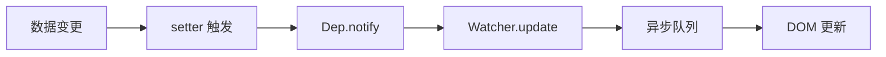
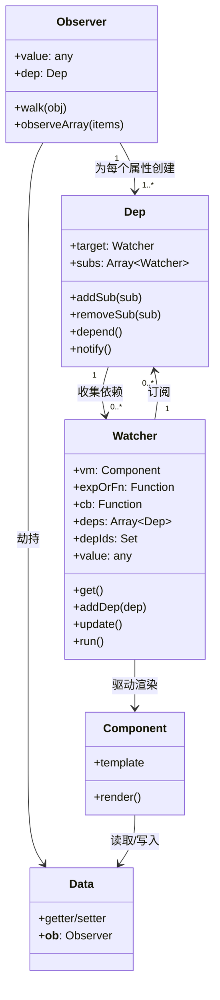
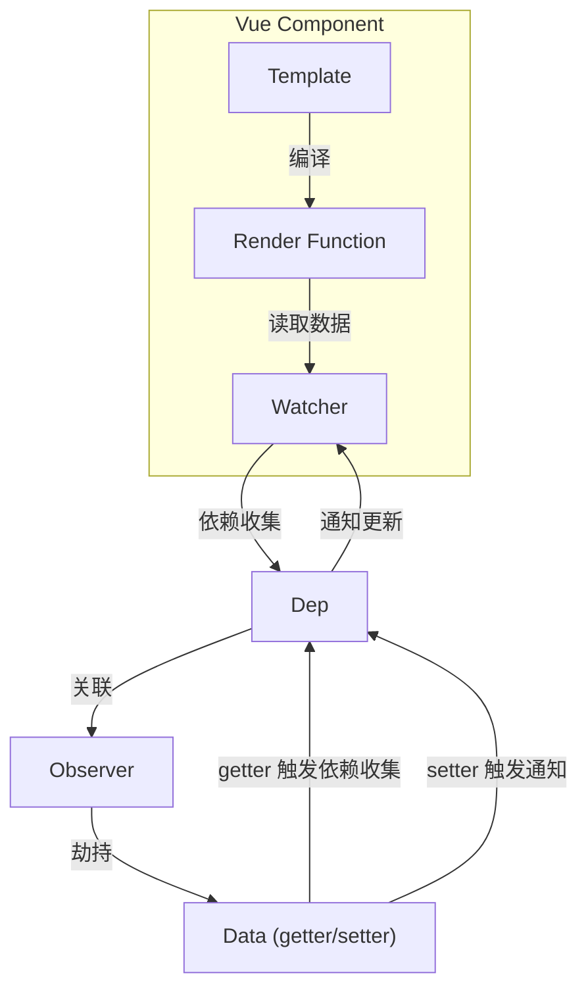
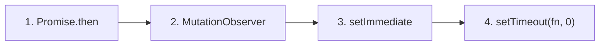
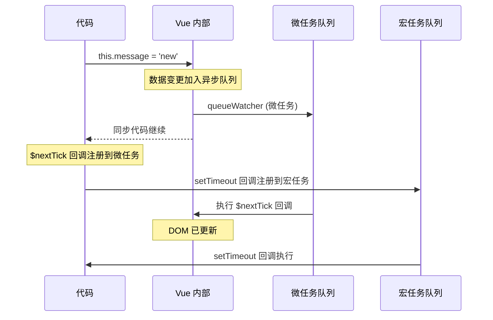
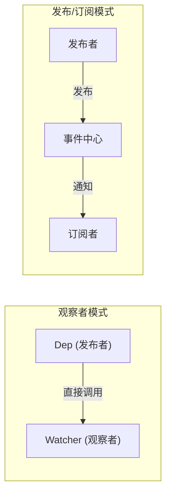
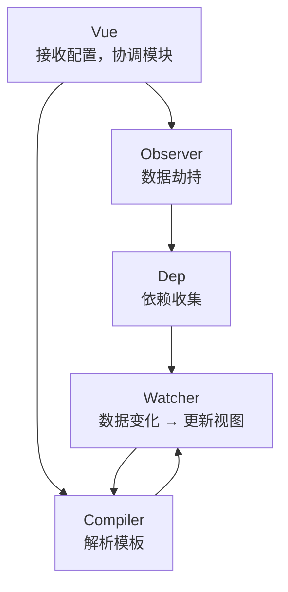
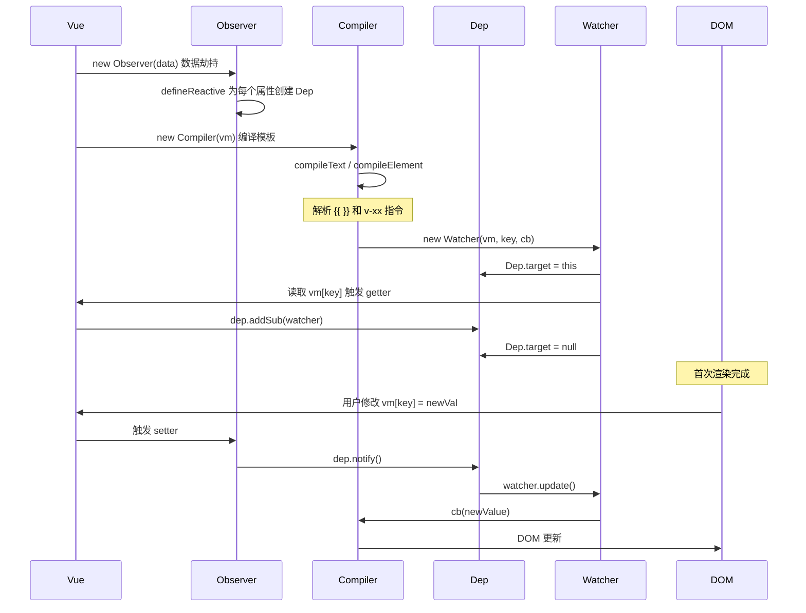

# 响应式系统原理

## 系统架构概述

Vue 2 的响应式系统基于以下核心技术：

- **数据劫持**：使用 `Object.defineProperty` 劫持对象属性
- **发布-订阅模式**：通过 Dep 和 Watcher 实现依赖收集和通知
- **异步更新策略**：通过队列机制优化性能

### 响应式流程图



### 核心架构 UML 类图



### 核心架构流程图



## 响应式系统核心模块

### Observer (观察者)

Observer 负责将普通对象转换为响应式对象。它会递归遍历对象的所有属性,为每个属性添加 getter 和 setter。

**主要职责：**
- 递归遍历 data 对象的所有属性
- 将每个属性转换为 getter/setter
- 为每个响应式属性创建一个 Dep 实例

**实现原理：**

```js
class Observer {
  constructor(value) {
    this.value = value
    this.dep = new Dep()
    
    // 添加 __ob__ 属性,指向 Observer 实例
    def(value, '__ob__', this)
    
    if (Array.isArray(value)) {
      // 数组的响应式处理
      this.observeArray(value)
    } else {
      // 对象的响应式处理
      this.walk(value)
    }
  }
  
  walk(obj) {
    const keys = Object.keys(obj)
    for (let i = 0; i < keys.length; i++) {
      defineReactive(obj, keys[i])
    }
  }
  
  observeArray(items) {
    for (let i = 0, l = items.length; i < l; i++) {
      observe(items[i])
    }
  }
}
```

### Dep (依赖收集器)

Dep 是一个依赖收集器,每个响应式属性都有一个对应的 Dep 实例,用于存储所有依赖该属性的 Watcher。

**主要职责：**
- 存储依赖该属性的 Watcher
- 在 getter 中收集依赖
- 在 setter 中通知依赖更新

**实现原理：**

```js
class Dep {
  static target = null  // 当前正在计算的 Watcher
  
  constructor() {
    this.subs = []  // 存储Watcher
  }
  
  addSub(sub) {
    this.subs.push(sub)
  }
  
  removeSub(sub) {
    remove(this.subs, sub)
  }
  
  depend() {
    if (Dep.target) {
      Dep.target.addDep(this)
    }
  }
  
  notify() {
    const subs = this.subs.slice()
    for (let i = 0, l = subs.length; i < l; i++) {
      subs[i].update()
    }
  }
}
```

### Watcher (观察者实例)

Watcher 负责订阅数据变化并执行回调函数。每个组件实例都对应一个 Watcher 实例。

**主要职责：**
- 在组件渲染过程中记录依赖
- 接收 Dep 的通知并执行更新
- 计算属性和侦听器也通过 Watcher 实现

**Watcher 类型：**
1. **渲染 Watcher**：组件渲染函数的 Watcher
2. **计算属性 Watcher**：计算属性的 Watcher
3. **用户 Watcher**：通过 `watch` 选项或 `vm.$watch` 创建的 Watcher

**实现原理：**

```js
class Watcher {
  constructor(vm, expOrFn, cb, options) {
    this.vm = vm
    this.expOrFn = expOrFn
    this.cb = cb
    this.options = options
    this.deps = []          // 存储Dep实例
    this.depIds = new Set() // 避免重复添加
    
    // 立即执行getter,触发依赖收集
    this.value = this.get()
  }
  
  get() {
    pushTarget(this)  // 设置Dep.target
    try {
      return this.expOrFn.call(this.vm, this.vm)
    } finally {
      popTarget()     // 移除Dep.target
      this.cleanupDeps() // 清理依赖
    }
  }
  
  addDep(dep) {
    const id = dep.id
    if (!this.depIds.has(id)) {
      this.depIds.add(id)
      this.deps.push(dep)
      dep.addSub(this)
    }
  }
  
  update() {
    // 将watcher放入异步队列
    queueWatcher(this)
  }
  
  run() {
    const value = this.get()
    if (value !== this.value) {
      const oldValue = this.value
      this.value = value
      this.cb.call(this.vm, value, oldValue)
    }
  }
}
```

### 依赖收集与触发流程

**依赖收集流程：**

1. 组件渲染时,创建渲染 Watcher
2. Watcher 执行 `get()` 方法,将自身设置到 `Dep.target`
3. 渲染函数读取数据,触发属性的 `getter`
4. `getter` 中调用 `dep.depend()` 收集依赖
5. 将当前 Watcher 添加到 Dep 的 `subs` 数组
6. 渲染完成后,`Dep.target` 重置为 `null`

**更新触发流程：**

1. 数据被修改,触发属性的 `setter`
2. `setter` 中调用 `dep.notify()`
3. Dep 通知所有 Watcher 调用 `update()`
4. Watcher 被加入异步更新队列
5. 在下一个 tick 执行 Watcher 的 `run()` 方法
6. 触发组件重新渲染

## 追踪变化

当把一个普通的 JavaScript 对象传入 Vue 实例作为 `data` 选项,Vue 将遍历此对象所有的属性,并使用 [`Object.defineProperty`](https://developer.mozilla.org/zh-CN/docs/Web/JavaScript/Reference/Global_Objects/Object/defineProperty) 把这些 property 全部转为 [getter/setter](https://developer.mozilla.org/zh-CN/docs/Web/JavaScript/Guide/Working_with_Objects#定义_getters_与_setters)。`Object.defineProperty` 是 ES5 中一个无法 shim 的特性,这也就是 Vue 不支持 IE8 以及更低版本浏览器的原因。

这些 getter/setter 对用户来说是不可见的,但是在内部它们让 Vue 能够追踪依赖,在 property 被访问和修改时通知变更。这里需要注意的是不同浏览器在控制台打印数据对象时对 getter/setter 的格式化并不同,建议安装 [vue-devtools](https://github.com/vuejs/vue-devtools) 来获取对检查数据更加友好的用户界面。

每个组件实例都对应一个 **watcher** 实例,会在组件渲染的过程中把"接触"过的数据 property 记录为依赖。之后当依赖项的 setter 触发时,会通知 watcher,从而使它关联的组件重新渲染。


### defineReactive 实现原理

Vue 内部通过 `defineReactive` 函数实现响应式转换：

```js
function defineReactive(obj, key, val, customSetter, shallow) {
  const dep = new Dep()
  
  const property = Object.getOwnPropertyDescriptor(obj, key)
  if (property && property.configurable === false) {
    return
  }
  
  // 兼容预定义的 getter/setter
  const getter = property && property.get
  const setter = property && property.set
  
  // 如果没有传入 val（且属性原本没有自定义 getter，或有 setter），则取当前值
  if ((!getter || setter) && arguments.length === 2) {
    val = obj[key]
  }
  
  // 递归转换嵌套对象
  let childOb = !shallow && observe(val)
  
  Object.defineProperty(obj, key, {
    enumerable: true,
    configurable: true,
    get: function reactiveGetter() {
      const value = getter ? getter.call(obj) : val
      
      // 依赖收集
      if (Dep.target) {
        dep.depend()
        if (childOb) {
          childOb.dep.depend()
          if (Array.isArray(value)) {
            dependArray(value)
          }
        }
      }
      return value
    },
    set: function reactiveSetter(newVal) {
      const value = getter ? getter.call(obj) : val
      
      // 值未变化,不触发更新
      if (newVal === value || (newVal !== newVal && value !== value)) {
        return
      }
      
      if (process.env.NODE_ENV !== 'production' && customSetter) {
        customSetter()
      }
      
      if (setter) {
        setter.call(obj, newVal)
      } else {
        val = newVal
      }
      
      // 转换新值
      childOb = !shallow && observe(newVal)
      
      // 通知更新
      dep.notify()
    }
  })
}
```

## 检测变化的注意事项

由于 JavaScript 的限制,Vue **不能检测**数组和对象的变化。尽管如此,还是有一些办法来回避这些限制并保证它们的响应性。

### 对于对象

Vue 无法检测 property 的添加或移除。由于 Vue 会在初始化实例时对 property 执行 getter/setter 转化,所以 property 必须在 `data` 对象上存在才能让 Vue 将它转换为响应式的。

**问题示例：**

```js
var vm = new Vue({
  data:{
    a: 1
  }
})

// vm.a 是响应式的
vm.b = 2
// vm.b 是非响应式的

vm.a = 3
// vm.a 修改会触发视图更新
```

**解决方案：**

#### 方案一：Vue.set / vm.$set

对于已经创建的实例,Vue 不允许动态添加根级别的响应式 property。但是可以使用 `Vue.set(object, propertyName, value)` 方法向嵌套对象添加响应式 property。

```js
// 全局方法
Vue.set(vm.someObject, 'b', 2)

// 实例方法(推荐在组件内使用)
this.$set(this.someObject, 'b', 2)
```

**Vue.set 方法签名：**

```js
Vue.set(target, propertyName/index, value)
```

**参数说明：**
- `target`：要添加属性的对象或数组(不能是 Vue 实例或根数据对象)
- `propertyName/index`：属性名或数组索引
- `value`：属性值

#### 方案二：Object.assign 创建新对象

有时需要为已有对象赋值多个新 property,比如使用 `Object.assign()` 或 `_.extend()`。但是这样添加到对象上的新 property 不会触发更新。

**错误写法：**

```js
// 这样不会触发更新
Object.assign(this.someObject, { a: 1, b: 2 })
```

**正确写法：**

```js
// 创建新对象替代原对象
this.someObject = Object.assign({}, this.someObject, { a: 1, b: 2 })

// 或使用扩展运算符
this.someObject = { ...this.someObject, a: 1, b: 2 }
```

### 对于数组

Vue 不能检测以下数组的变动：

1. 当你利用索引直接设置一个数组项时,例如：`vm.items[indexOfItem] = newValue`
2. 当你修改数组的长度时,例如：`vm.items.length = newLength`

**问题示例：**

```js
var vm = new Vue({
  data: {
    items: ['a', 'b', 'c']
  }
})

vm.items[1] = 'x'        // 不是响应性的
vm.items.length = 2      // 不是响应性的
```

**解决方案：**

#### 问题一：通过索引修改数组项

**方案1：使用 Vue.set**

```js
// 全局方法
Vue.set(vm.items, indexOfItem, newValue)

// 实例方法
vm.$set(vm.items, indexOfItem, newValue)
```

**方案2：使用 splice 方法**

```js
vm.items.splice(indexOfItem, 1, newValue)
```

#### 问题二：修改数组长度

```js
// 使用 splice 方法
vm.items.splice(newLength)
```

### 为什么会有这些限制？

**技术原因：**

1. **对象限制**：Vue 2 使用 `Object.defineProperty` 实现响应式,该方法只能劫持对象已有的属性,无法监听属性的添加和删除。

2. **数组限制**：通过索引修改数组项或修改 length 属性,不会触发属性的 getter/setter,因此无法被 Vue 的响应式系统检测到。

**Vue 3 的改进：**

Vue 3 使用 Proxy 替代 `Object.defineProperty`，解决了这些限制。Proxy 可以监听：
- 属性的添加和删除
- 数组索引和 length 的变化
- Map、Set 等数据结构的变化

#### Vue 2.x 与 Vue 3.x 响应式对比

**Vue 2.x 实现：**

```js
// 模拟 Vue 2.x 的响应式：Object.defineProperty
let data = { msg: 'hello' }
let vm = {}

Object.defineProperty(vm, 'msg', {
  enumerable: true,
  configurable: true,
  get () {
    console.log('get: ', data.msg)
    return data.msg
  },
  set (newValue) {
    console.log('set: ', newValue)
    if (newValue === data.msg) { return }
    data.msg = newValue
    document.querySelector('#app').textContent = data.msg
  }
})

vm.msg = 'Hello World'
console.log(vm.msg)
```

**Vue 3.x 实现：**

```js
// 模拟 Vue 3.x 的响应式：Proxy
let data = { msg: 'hello', count: 0 }

let vm = new Proxy(data, {
  get (target, key) {
    console.log('get, key: ', key, target[key])
    return target[key]
  },
  set (target, key, newValue) {
    console.log('set, key: ', key, newValue)
    if (target[key] === newValue) { return }
    target[key] = newValue
    document.querySelector('#app').textContent = target[key]
  }
})

vm.msg = 'Hello World'
console.log(vm.msg)
```

**对比总结：**

| 特性 | Vue 2.x (Object.defineProperty) | Vue 3.x (Proxy) |
|------|------|-------|
| 新增属性检测 | 不支持，需用 `Vue.set` | 原生支持 |
| 删除属性检测 | 不支持，需用 `Vue.delete` | 原生支持 |
| 数组索引修改 | 不支持 | 原生支持 |
| length 修改 | 不支持 | 原生支持 |
| Map/Set 支持 | 不支持 | 原生支持 |
| 浏览器兼容 | 不支持 IE8 及以下（需 ES5 环境） | 不支持 IE |
| 性能 | 递归遍历所有属性 | 惰性劫持，按需代理 |

## 声明响应式 property

由于 Vue 不允许动态添加根级响应式 property,必须在初始化实例前声明所有根级响应式 property,哪怕只是一个空值。

### 初始化声明

**推荐做法：**

```js
var vm = new Vue({
  data: {
    // 声明 message 为一个空值字符串
    message: '',
    // 声明 user 对象结构
    user: {
      name: '',
      age: 0
    },
    // 声明数组
    items: []
  },
  template: '<div>{{ message }}</div>'
})

// 之后设置值
vm.message = 'Hello!'
```

**未声明的后果：**

如果未在 `data` 选项中声明 `message`,Vue 将警告你渲染函数正在试图访问不存在的 property。

### 为什么要提前声明？

**技术原因：**
- 消除了依赖项跟踪系统中的边界情况
- 使 Vue 实例能更好地配合类型检查系统工作

**代码可维护性：**
- `data` 对象就像组件状态的结构 (schema)
- 提前声明所有的响应式 property,可以让组件代码更易于理解和维护
- 新开发人员可以快速了解组件的数据结构

### data 选项的最佳实践

```js
// ✅ 推荐：完整声明数据结构
export default {
  data() {
    return {
      // 基础类型
      count: 0,
      message: '',
      isActive: false,
      
      // 对象类型
      user: {
        id: null,
        name: '',
        email: ''
      },
      
      // 数组类型
      items: [],
      
      // 复杂嵌套结构
      config: {
        api: {
          baseUrl: '',
          timeout: 0
        },
        features: []
      }
    }
  }
}
```

```js
// ❌ 不推荐：未声明或部分声明
export default {
  data() {
    return {
      // 只声明了部分属性
      count: 0
      // 其他属性在后续代码中动态添加
    }
  },
  
  methods: {
    initData() {
      // 不推荐：动态添加属性
      this.user = { name: 'test' }  // 非响应式
    }
  }
}
```

## 异步更新队列

Vue 在更新 DOM 时是**异步**执行的。只要侦听到数据变化,Vue 将开启一个队列,并缓冲在同一事件循环中发生的所有数据变更。如果同一个 watcher 被多次触发,只会被推入到队列中一次。这种在缓冲时去除重复数据对于避免不必要的计算和 DOM 操作是非常重要的。

### 异步更新机制

在下一个的事件循环"tick"中,Vue 刷新队列并执行实际 (已去重的) 工作。Vue 在内部对异步队列尝试使用原生的 `Promise.then`、`MutationObserver` 和 `setImmediate`,如果执行环境不支持,则会采用 `setTimeout(fn, 0)` 代替。

**事件循环优先级：**



> 前两个为微任务（Microtask），后两个为宏任务（Macrotask）。Vue 优先使用微任务以确保异步更新尽可能早执行。

### 基本示例

例如,当设置 `vm.someData = 'new value'`,该组件不会立即重新渲染。当刷新队列时,组件会在下一个事件循环"tick"中更新。多数情况不需要关心这个过程,但是如果你想基于更新后的 DOM 状态来做点什么,可以使用 `Vue.nextTick(callback)`。

**示例：**

```html
<div id="example">{{message}}</div>
```

```js
var vm = new Vue({
  el: '#example',
  data: {
    message: '123'
  }
})

vm.message = 'new message'  // 更改数据
console.log(vm.$el.textContent)  // => '123' (还未更新)

Vue.nextTick(function () {
  console.log(vm.$el.textContent)  // => 'new message' (已更新)
})
```

### 在组件中使用 $nextTick

在组件内使用 `vm.$nextTick()` 实例方法特别方便,因为不需要全局 `Vue`,并且回调函数中的 `this` 将自动绑定到当前的 Vue 实例上。

**回调函数形式：**

```js
Vue.component('example', {
  template: '<span>{{ message }}</span>',
  data: function () {
    return {
      message: '未更新'
    }
  },
  methods: {
    updateMessage: function () {
      this.message = '已更新'
      console.log(this.$el.textContent)  // => '未更新'
      
      this.$nextTick(function () {
        console.log(this.$el.textContent)  // => '已更新'
        // this 指向当前组件实例
      })
    }
  }
})
```

**箭头函数形式：**

```js
methods: {
  updateMessage() {
    this.message = '已更新'
    console.log(this.$el.textContent)  // => '未更新'
    
    this.$nextTick(() => {
      console.log(this.$el.textContent)  // => '已更新'
    })
  }
}
```

**async/await 形式：**

```js
methods: {
  async updateMessage() {
    this.message = '已更新'
    console.log(this.$el.textContent)  // => '未更新'
    
    await this.$nextTick()
    console.log(this.$el.textContent)  // => '已更新'
  }
}
```

### $nextTick 应用场景

#### 场景一：操作更新后的 DOM

```js
methods: {
  addItem() {
    this.items.push({ id: Date.now(), text: '新项' })
    
    // 需要操作新添加的 DOM 元素
    this.$nextTick(() => {
      const lastItem = this.$el.querySelector('.item:last-child')
      lastItem.scrollIntoView({ behavior: 'smooth' })
    })
  }
}
```

#### 场景二：获取输入框焦点

```js
methods: {
  showInput() {
    this.isEditing = true
    
    // v-if 条件渲染的输入框还未渲染
    this.$nextTick(() => {
      this.$refs.input.focus()
    })
  }
}
```

#### 场景三：测量 DOM 尺寸

```js
methods: {
  updateLayout() {
    this.width = 200
    
    this.$nextTick(() => {
      const height = this.$refs.element.offsetHeight
      console.log('更新后的高度:', height)
    })
  }
}
```

#### 场景四：与第三方库集成

```js
mounted() {
  this.initThirdPartyLibrary()
},

methods: {
  updateData() {
    this.items = [...this.items, newItem]
    
    // 等待 DOM 更新后重新初始化库
    this.$nextTick(() => {
      this.initThirdPartyLibrary()
    })
  }
}
```

## 数组变异方法

Vue 将被侦听的数组的变异方法 (mutation method) 进行了包裹,所以它们也将会触发视图更新。这些被包裹的方法包括：

### 变异方法列表

| 方法 | 说明 | 是否改变原数组 |
|------|------|---------------|
| `push()` | 在数组末尾添加一个或多个元素 | 是 |
| `pop()` | 删除数组最后一个元素 | 是 |
| `shift()` | 删除数组第一个元素 | 是 |
| `unshift()` | 在数组开头添加一个或多个元素 | 是 |
| `splice()` | 添加/删除数组元素 | 是 |
| `sort()` | 对数组元素排序 | 是 |
| `reverse()` | 反转数组元素顺序 | 是 |

### 使用示例

```js
var vm = new Vue({
  data: {
    items: ['a', 'b', 'c']
  }
})

// push - 添加元素
vm.items.push('d')        // ['a', 'b', 'c', 'd']

// pop - 删除最后一个元素
vm.items.pop()           // ['a', 'b', 'c']

// shift - 删除第一个元素
vm.items.shift()         // ['b', 'c']

// unshift - 在开头添加元素
vm.items.unshift('x')    // ['x', 'b', 'c']

// splice - 删除/添加元素
vm.items.splice(1, 1, 'y')  // ['x', 'y', 'c']

// sort - 排序
vm.items.sort()          // ['c', 'x', 'y']

// reverse - 反转
vm.items.reverse()       // ['y', 'x', 'c']
```

### 非变异方法

以下方法不会改变原数组,而是返回一个新数组。使用这些方法时,需要用新数组替换原数组：

- `filter()` - 过滤数组元素
- `concat()` - 连接数组
- `slice()` - 提取数组片段
- `map()` - 映射数组元素

**示例：**

```js
// filter - 过滤元素
vm.items = vm.items.filter(item => item !== 'x')

// concat - 连接数组
vm.items = vm.items.concat(['d', 'e'])

// map - 映射元素
vm.items = vm.items.map(item => item.toUpperCase())

// 使用扩展运算符
vm.items = [...vm.items, ...['d', 'e']]
```

### 变异方法的实现原理

Vue 通过重写数组的原型方法来实现响应式：

```js
const arrayProto = Array.prototype
const arrayMethods = Object.create(arrayProto)

const methodsToPatch = [
  'push',
  'pop',
  'shift',
  'unshift',
  'splice',
  'sort',
  'reverse'
]

methodsToPatch.forEach(function (method) {
  // 缓存原始方法
  const original = arrayProto[method]
  
  def(arrayMethods, method, function mutator (...args) {
    const result = original.apply(this, args)
    const ob = this.__ob__
    let inserted
    
    switch (method) {
      case 'push':
      case 'unshift':
        inserted = args
        break
      case 'splice':
        inserted = args.slice(2)
        break
    }
    
    // 对新添加的元素进行响应式处理
    if (inserted) ob.observeArray(inserted)
    
    // 通知更新
    ob.dep.notify()
    
    return result
  })
})
```

## 响应式 API 参考

### 全局 API

#### Vue.set(target, propertyName/index, value)

向响应式对象中添加一个 property,并确保这个新 property 同样是响应式的,并触发视图更新。

**参数：**
- `target`：目标对象或数组(不能是 Vue 实例或根数据对象)
- `propertyName/index`：属性名或数组索引
- `value`：属性值

**返回值：** 设置的值

**使用场景：**

```js
// 向对象添加新属性
Vue.set(this.user, 'email', 'test@example.com')

// 修改数组项
Vue.set(this.items, 0, { id: 1, text: '新值' })

// 添加嵌套属性
Vue.set(this.config.api, 'timeout', 5000)
```

#### Vue.delete(target, propertyName/index)

删除对象的 property。如果对象是响应式的,确保删除能触发更新视图。

**参数：**
- `target`：目标对象或数组
- `propertyName/index`：属性名或数组索引

**使用示例：**

```js
// 删除对象属性
Vue.delete(this.user, 'email')

// 删除数组项
Vue.delete(this.items, 0)
```

### 实例方法

#### vm.$set(target, propertyName/index, value)

这是全局 `Vue.set` 的别名。

```js
// 在组件内使用
this.$set(this.user, 'email', 'test@example.com')
```

#### vm.$delete(target, propertyName/index)

这是全局 `Vue.delete` 的别名。

```js
// 在组件内使用
this.$delete(this.user, 'email')
```

#### vm.$watch(expOrFn, callback, [options])

观察 Vue 实例上的一个表达式或一个函数计算结果的变化。

**参数：**
- `expOrFn`：要监视的表达式或函数
- `callback`：回调函数
- `options`：选项对象
  - `deep`：深度监听
  - `immediate`：立即执行回调
  - `sync`：同步执行

**使用示例：**

```js
// 监听属性
this.$watch('a', function (newVal, oldVal) {
  console.log(`a 从 ${oldVal} 变为 ${newVal}`)
})

// 监听表达式
this.$watch('a.b.c', function (newVal, oldVal) {
  // 做点什么
})

// 监听函数
this.$watch(
  function () {
    return this.a + this.b
  },
  function (newVal, oldVal) {
    // 做点什么
  }
)

// 深度监听
this.$watch('someObject', callback, {
  deep: true,
  immediate: true
})

// 返回取消监听函数
const unwatch = this.$watch('a', callback)
unwatch()  // 取消监听
```

#### vm.$nextTick([callback])

将回调延迟到下次 DOM 更新循环之后执行。

**参数：**
- `callback`：回调函数(可选)

**返回值：** Promise 对象

**使用示例：**

```js
// 回调函数形式
this.$nextTick(function () {
  // DOM 更新了
})

// Promise 形式
this.$nextTick().then(function () {
  // DOM 更新了
})

// async/await 形式
async function update() {
  this.message = 'new'
  await this.$nextTick()
  // DOM 更新了
}
```

#### vm.$forceUpdate()

迫使 Vue 实例重新渲染。注意它仅仅影响实例本身和插入插槽内容的子组件,而不是所有子组件。

**使用场景：**

```js
// 当非响应式数据变化时强制更新
this.nonReactiveData = newValue
this.$forceUpdate()
```

### 选项 API

#### data

声明组件的响应式数据。

```js
// 对象形式(仅根实例)
var vm = new Vue({
  data: {
    a: 1
  }
})

// 函数形式(组件)
Vue.component('my-component', {
  data() {
    return {
      a: 1
    }
  }
})
```

#### props

声明组件的属性。

```js
Vue.component('my-component', {
  props: {
    // 基础类型检查
    propA: Number,
    
    // 多个可能的类型
    propB: [String, Number],
    
    // 必填的字符串
    propC: {
      type: String,
      required: true
    },
    
    // 带有默认值的数字
    propD: {
      type: Number,
      default: 100
    },
    
    // 对象/数组默认值应当从一个工厂函数获取
    propE: {
      type: Object,
      default: function () {
        return { message: 'hello' }
      }
    },
    
    // 自定义验证函数
    propF: {
      validator: function (value) {
        return ['success', 'warning', 'danger'].indexOf(value) !== -1
      }
    }
  }
})
```

#### computed

声明计算属性。

```js
var vm = new Vue({
  data: {
    a: 1,
    b: 2
  },
  computed: {
    // 只读计算属性
    sum: function () {
      return this.a + this.b
    },
    
    // 读写计算属性
    fullName: {
      get: function () {
        return this.firstName + ' ' + this.lastName
      },
      set: function (newValue) {
        var names = newValue.split(' ')
        this.firstName = names[0]
        this.lastName = names[names.length - 1]
      }
    }
  }
})
```

#### watch

声明侦听器。

```js
var vm = new Vue({
  data: {
    a: 1,
    b: { c: 2 }
  },
  watch: {
    // 监听属性
    a: function (val, oldVal) {
      console.log('new: %s, old: %s', val, oldVal)
    },
    
    // 字符串方法名
    a: 'someMethod',
    
    // 深度监听
    b: {
      handler: function (val, oldVal) {
        // ...
      },
      deep: true
    },
    
    // 立即执行
    a: {
      handler: function (val, oldVal) {
        // ...
      },
      immediate: true
    },
    
    // 监听表达式
    'b.c': function (val, oldVal) {
      // ...
    }
  }
})
```

## 常见问题解答

### 1. 为什么直接给对象添加新属性不是响应式的？

**答：** Vue 2 使用 `Object.defineProperty` 实现响应式,该方法只能劫持对象已有的属性。在 Vue 初始化时,它会遍历 `data` 对象的所有属性并转换为 getter/setter,但之后添加的新属性不会被转换。

**解决方案：**
```js
// 错误写法
this.user.email = 'test@example.com'  // 非响应式

// 正确写法
this.$set(this.user, 'email', 'test@example.com')
```

### 2. 为什么直接通过索引修改数组不是响应式的？

**答：** 数组索引本质上也是对象的属性,但 JavaScript 中数组有很多特殊情况,直接通过索引修改不会触发 getter/setter。Vue 2 出于性能考虑,没有对数组索引进行响应式处理。

**解决方案：**
```js
// 错误写法
this.items[0] = newValue  // 非响应式

// 正确写法
this.$set(this.items, 0, newValue)
// 或
this.items.splice(0, 1, newValue)
```

### 3. 计算属性和方法的区别是什么？

**答：** 计算属性基于它们的响应式依赖进行缓存,只有在相关依赖发生改变时才会重新求值。方法每次调用都会执行。

**计算属性：**
```js
computed: {
  now: function () {
    return Date.now()  // 不会更新,因为 Date.now() 不是响应式依赖
  }
}
```

**方法：**
```js
methods: {
  now: function () {
    return Date.now()  // 每次调用都会执行
  }
}
```

### 4. watch 和 computed 的区别是什么？

**答：**

| 特性 | computed | watch |
|------|----------|-------|
| 缓存 | 有缓存 | 无缓存 |
| 返回值 | 必须返回值 | 不需要返回值 |
| 异步操作 | 不支持 | 支持 |
| 使用场景 | 需要依赖其他数据计算新值 | 需要执行异步操作或复杂逻辑 |

**computed 示例：**
```js
computed: {
  fullName() {
    return this.firstName + ' ' + this.lastName
  }
}
```

**watch 示例：**
```js
watch: {
  firstName(newVal, oldVal) {
    // 执行异步操作
    this.checkNameExists(newVal)
  }
}
```

### 5. 为什么 data 必须是函数？

**答：** 组件的 `data` 选项必须是一个函数,目的是为了每个实例可以维护一份被返回对象的独立的拷贝。如果 `data` 是一个对象,所有组件实例将共享同一个数据对象,导致一个组件的数据变化会影响其他组件。

**错误示例：**
```js
// ❌ 错误：多个实例共享同一数据
Vue.component('my-component', {
  data: {
    count: 0
  }
})
```

**正确示例：**
```js
// ✅ 正确：每个实例有独立的数据
Vue.component('my-component', {
  data() {
    return {
      count: 0
    }
  }
})
```

### 6. $nextTick 和 setTimeout 的区别？

**答：** `$nextTick` 在 DOM 更新循环结束后执行回调,而 `setTimeout` 在下一个宏任务中执行。`$nextTick` 优先使用微任务,执行时机更早。

**执行顺序：**



**示例：**
```js
this.message = 'new'

this.$nextTick(() => {
  console.log('$nextTick', this.$el.textContent)  // 'new'
})

setTimeout(() => {
  console.log('setTimeout', this.$el.textContent)  // 'new'
}, 0)
```

### 7. 如何检测深度嵌套对象的变化？

**答：** 可以使用 `watch` 的 `deep` 选项进行深度监听,但这会带来性能开销。

```js
watch: {
  'user.profile.settings': {
    handler(newVal, oldVal) {
      // 深度嵌套对象变化时触发
    },
    deep: true
  }
}
```

**优化方案：**
```js
// 只监听需要的属性
watch: {
  'user.profile.settings.theme'(newVal) {
    // 只在 theme 变化时触发
  }
}

// 或使用计算属性
computed: {
  theme() {
    return this.user.profile.settings.theme
  }
},
watch: {
  theme(newVal) {
    // ...
  }
}
```

### 8. 如何实现对象的深度响应式？

**答：** Vue 默认递归转换所有嵌套对象。如果需要性能优化,可以使用 `Object.freeze()` 阻止转换。

```js
data() {
  return {
    // 深度响应式(默认)
    user: {
      profile: {
        name: 'test'
      }
    },
    
    // 非响应式(性能优化)
    frozenData: Object.freeze({
      bigArray: [...],
      config: {...}
    })
  }
}
```

## 最佳实践

### 1. 数据声明原则

**原则：** 在 `data` 中预先声明所有响应式属性,即使初始值为空。

```js
// ✅ 推荐
data() {
  return {
    user: {
      id: null,
      name: '',
      email: ''
    },
    items: [],
    loading: false,
    error: null
  }
}

// ❌ 不推荐
data() {
  return {}
},
mounted() {
  this.user = {}  // 非响应式
}
```

### 2. 对象更新策略

**原则：** 使用 `$set` 或创建新对象,而不是直接添加属性。

```js
// ✅ 推荐：使用 $set
this.$set(this.user, 'email', 'test@example.com')

// ✅ 推荐：创建新对象
this.user = { ...this.user, email: 'test@example.com' }

// ✅ 推荐：批量更新
this.user = Object.assign({}, this.user, {
  email: 'test@example.com',
  phone: '123456'
})
```

### 3. 数组更新策略

**原则：** 使用变异方法或 `$set`,避免直接索引赋值和 length 修改。

```js
// ✅ 推荐：使用变异方法
this.items.push(newItem)
this.items.splice(index, 1, newItem)
this.items.sort((a, b) => a - b)

// ✅ 推荐：使用 $set
this.$set(this.items, index, newItem)

// ✅ 推荐：使用非变异方法创建新数组
this.items = this.items.filter(item => item.active)
this.items = [...this.items, newItem]
```

### 4. 计算属性 vs 方法

**原则：** 需要缓存时使用计算属性,需要每次执行时使用方法。

```js
// ✅ 使用计算属性(有缓存)
computed: {
  filteredItems() {
    return this.items.filter(item => item.active)
  }
}

// ✅ 使用方法(支持参数,无缓存)
methods: {
  getFilteredItems(type) {
    return this.items.filter(item => item.type === type)
  }
}
```

### 5. watch 的使用建议

**原则：** 简单逻辑用 computed,复杂逻辑或异步操作用 watch。

```js
// ✅ 简单逻辑：使用 computed
computed: {
  fullName() {
    return `${this.firstName} ${this.lastName}`
  }
}

// ✅ 复杂逻辑/异步：使用 watch
watch: {
  searchQuery(newVal) {
    this.loading = true
    this.fetchResults(newVal).then(results => {
      this.results = results
      this.loading = false
    })
  }
}
```

### 6. 性能优化

**原则：** 避免不必要的深度监听和大型对象的响应式转换。

```js
// ✅ 避免深度监听大对象
watch: {
  'user.name'(newVal) {  // 只监听需要的属性
    // ...
  }
}

// ✅ 使用 Object.freeze 优化性能
data() {
  return {
    // 大型静态数据不需要响应式
    bigList: Object.freeze([...]),
    config: Object.freeze({...})
  }
}

// ✅ 合理使用 $forceUpdate
// 当非响应式数据变化时
this.nonReactiveData = newValue
this.$forceUpdate()
```

### 7. 响应式陷阱避免

```js
// ❌ 陷阱1：对象添加属性
this.user.email = 'test@example.com'  // 非响应式

// ✅ 解决方案
this.$set(this.user, 'email', 'test@example.com')

// ❌ 陷阱2：数组索引修改
this.items[0] = newItem  // 非响应式

// ✅ 解决方案
this.$set(this.items, 0, newItem)

// ❌ 陷阱3：数组长度修改
this.items.length = 0  // 非响应式

// ✅ 解决方案
this.items.splice(0)

// ❌ 陷阱4：动态删除属性
delete this.user.email  // 非响应式

// ✅ 解决方案
this.$delete(this.user, 'email')
```

### 8. 类型安全建议

结合 TypeScript 使用时,建议声明完整的类型：

```typescript
interface User {
  id: number
  name: string
  email: string
}

interface Item {
  id: number
  text: string
  active: boolean
}

export default {
  data(): {
    user: User
    items: Item[]
    loading: boolean
  } {
    return {
      user: {
        id: 0,
        name: '',
        email: ''
      },
      items: [],
      loading: false
    }
  }
}
```

## 发布订阅模式与观察者模式

### 发布/订阅模式

发布/订阅模式通过一个"信号中心"来解耦发布者和订阅者。Vue 中的 `$emit/$on` 就是基于此模式。

```js
class EventEmitter {
  constructor () {
    this.subs = {}
  }
  $on (eventType, handler) {
    this.subs[eventType] = this.subs[eventType] || []
    this.subs[eventType].push(handler)
  }
  $emit (eventType) {
    if (this.subs[eventType]) {
      this.subs[eventType].forEach(handler => handler())
    }
  }
}

var bus = new EventEmitter()
bus.$on('click', () => console.log('click'))
bus.$emit('click')
```

### 观察者模式

观察者模式由具体目标（Dep）调度，订阅者（Watcher）与发布者（Dep）之间存在直接依赖关系。

```js
class Dep {
  constructor () { this.subs = [] }
  addSub (sub) { if (sub && sub.update) { this.subs.push(sub) } }
  notify () { this.subs.forEach(sub => { sub.update() }) }
}

class Watcher {
  update () { console.log('update') }
}

let dep = new Dep()
let watcher = new Watcher()
dep.addSub(watcher)
dep.notify()
```

### 两者区别



| 模式 | 耦合度 | 调度方式 | Vue 中的应用 |
|------|--------|---------|-------------|
| 观察者模式 | 有直接依赖 | Dep 直接调用 Watcher | 响应式系统 |
| 发布/订阅模式 | 通过调度中心解耦 | 事件中心转发 | 自定义事件（$emit/$on） |

## 模拟完整 Vue 响应式系统

本节实现一个最小版本的 Vue，来深入理解响应式系统的整体协作流程。

### 系统架构概览



### Vue 类

负责接收初始化的参数，把 data 中的属性注入到 Vue 实例。

```js
class Vue {
  constructor (options) {
    this.$options = options || {}
    this.$data = options.data || {}
    const el = options.el
    this.$el = typeof options.el === 'string' ? document.querySelector(el) : el
    this._proxyData(this.$data)
    new Observer(this.$data)
    new Compiler(this)
  }
  _proxyData (data) {
    Object.keys(data).forEach(key => {
      Object.defineProperty(this, key, {
        get () { return data[key] },
        set (newValue) {
          if (data[key] === newValue) { return }
          data[key] = newValue
        }
      })
    })
  }
}
```

### Observer 类

递归遍历 data 的所有属性，转换为 getter/setter，并为每个属性创建 Dep 实例。

```js
class Observer {
  constructor (data) { this.walk(data) }
  walk (data) {
    if (!data || typeof data !== 'object') { return }
    Object.keys(data).forEach(key => {
      this.defineReactive(data, key, data[key])
    })
  }
  defineReactive (data, key, val) {
    const that = this
    const dep = new Dep()
    that.walk(val)
    Object.defineProperty(data, key, {
      configurable: true,
      enumerable: true,
      get () {
        Dep.target && dep.addSub(Dep.target)
        return val
      },
      set (newValue) {
        if (newValue === val) { return }
        val = newValue
        that.walk(newValue)
        dep.notify()
      }
    })
  }
}
```

### Compiler 类

负责解析模板中的插值表达式和指令，在首次渲染时替换数据，并通过 Watcher 监听数据变化。

```js
class Compiler {
  constructor (vm) {
    this.vm = vm
    this.el = vm.$el
    this.compile(this.el)
  }
  compile (el) {
    Array.from(el.childNodes).forEach(node => {
      if (node.nodeType === 3) { this.compileText(node) }
      if (node.nodeType === 1) { this.compileElement(node) }
      if (node.childNodes && node.childNodes.length) { this.compile(node) }
    })
  }
  compileText (node) {
    const reg = /\{\{(.+)\}\}/
    const value = node.textContent
    if (reg.test(value)) {
      const key = RegExp.$1.trim()
      node.textContent = value.replace(reg, this.vm[key])
      new Watcher(this.vm, key, (newValue) => {
        node.textContent = newValue
      })
    }
  }
  compileElement (node) {
    Array.from(node.attributes).forEach(attr => {
      if (attr.name.startsWith('v-')) {
        const dir = attr.name.substr(2)
        const key = attr.value
        this.update(node, key, dir)
      }
    })
  }
  update (node, key, dir) {
    const updaterFn = this[dir + 'Updater']
    updaterFn && updaterFn.call(this, node, this.vm[key], key)
  }
  textUpdater (node, value, key) {
    node.textContent = value
    new Watcher(this.vm, key, (newValue) => { node.textContent = newValue })
  }
  modelUpdater (node, value, key) {
    node.value = value
    new Watcher(this.vm, key, (newValue) => { node.value = newValue })
    node.addEventListener('input', () => { this.vm[key] = node.value })
  }
}
```

### Dep 类

```js
class Dep {
  constructor () { this.subs = [] }
  addSub (sub) { if (sub && sub.update) { this.subs.push(sub) } }
  notify () { this.subs.forEach(sub => { sub.update() }) }
}
```

### Watcher 类

```js
class Watcher {
  constructor (vm, key, cb) {
    this.vm = vm
    this.key = key
    this.cb = cb
    Dep.target = this
    this.oldValue = vm[key]
    Dep.target = null
  }
  update () {
    const newValue = this.vm[this.key]
    if (this.oldValue === newValue) { return }
    this.cb(newValue)
  }
}
```

### 整体协作流程



### 关键问题

**Q: 给属性重新赋值成对象，是否是响应式的？**
答：可以。defineReactive 的 setter 中会调用 `that.walk(newValue)` 对新赋值对象递归劫持。

**Q: 给 Vue 实例新增一个成员是否是响应式的？**
答：不是。没有经过 `Object.defineProperty` 处理。解决方案：在 data 中提前声明属性（初始值可以给空），或使用 `Vue.set`。
