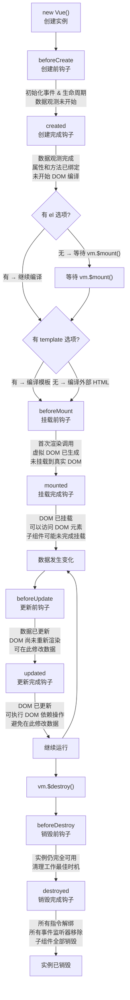
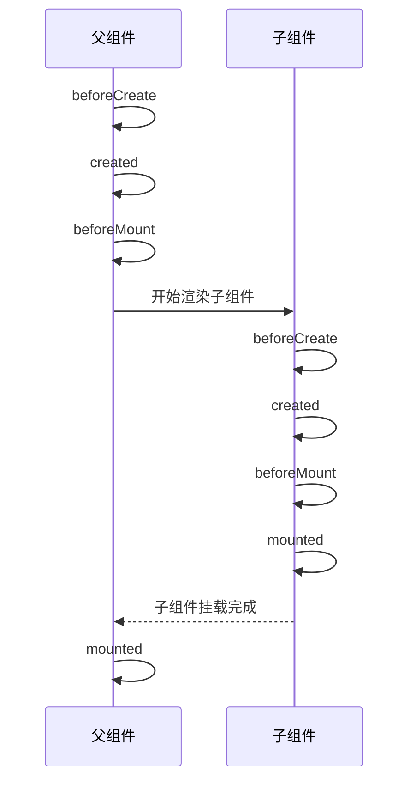

# 生命周期

## 生命周期流程图



---

## 生命周期钩子

### beforeCreate

#### 触发时机

实例初始化之后，数据观测 (data observer) 和 event/watcher 事件配置之前被调用。

#### 可访问内容

- ✅ `this`（Vue 实例本身）
- ❌ `data`、`props`、`methods`、`computed`
- ❌ `watch`、`事件监听器`

#### 使用场景

```js
export default {
  beforeCreate() {
    // 此时无法访问 data、methods 等
    console.log(this.message) // undefined
    
    // 常用于添加 loading 等非响应式状态
    this.loading = true
  }
}
```

#### 注意事项

- 避免在此阶段访问响应式数据
- 常用于插件初始化或全局配置

---

### created

#### 触发时机

实例创建完成后被调用，此时已完成数据观测、属性和方法的运算、watch/event 事件回调。

#### 可访问内容

- ✅ `data`、`props`、`methods`、`computed`
- ✅ `watch`、`事件监听器`
- ❌ `$el`（DOM 元素）
- ❌ `$refs`

#### 使用场景

```js
export default {
  data() {
    return {
      userInfo: null
    }
  },
  created() {
    // 可以访问响应式数据
    console.log(this.userInfo)
    
    // 适合发起 AJAX 请求
    this.fetchUserInfo()
    
    // 可以调用 methods
    this.initData()
  },
  methods: {
    async fetchUserInfo() {
      const res = await api.getUserInfo()
      this.userInfo = res.data
    },
    initData() {
      // 初始化逻辑
    }
  }
}
```

#### 注意事项

- **推荐用于发起 AJAX 请求**：此时数据已初始化，但 DOM 未渲染
- 避免在此阶段操作 DOM

---

### beforeMount

#### 触发时机

挂载开始之前被调用，相关的 render 函数首次被调用。

#### 可访问内容

- ✅ `data`、`props`、`methods`、`computed`
- ⚠️ `$el` 仍指向原始的 el 元素（挂载完成后才会被替换，不要在此操作 DOM）
- ❌ 真实 DOM 未渲染

#### 使用场景

```js
export default {
  beforeMount() {
    // $el 此时仍是原始的 el 元素
    console.log(this.$el)
    
    // 可以在挂载前最后一次修改数据
    this.lastMinuteUpdate()
  },
  methods: {
    lastMinuteUpdate() {
      // 挂载前的最后数据调整
    }
  }
}
```

#### 注意事项

- 此钩子在服务端渲染期间不被调用
- 实际应用中使用较少

---

### mounted

#### 触发时机

实例挂载完成后调用，此时 el 被新创建的 `vm.$el` 替换。

#### 可访问内容

- ✅ 所有实例属性和方法
- ✅ 真实 DOM
- ✅ `$refs`、`$el`

#### 使用场景

```js
export default {
  mounted() {
    // 可以访问 DOM 元素
    console.log(this.$el)
    console.log(this.$refs.input)
    
    // 初始化第三方库
    this.initThirdPartyLibs()
    
    // DOM 操作
    this.setElementFocus()
    
    // 注意：子组件可能未完成挂载
    this.$nextTick(() => {
      // 整个视图都已渲染完成
      this.onFullyMounted()
    })
  },
  methods: {
    initThirdPartyLibs() {
      // 初始化图表库
      this.chart = new Chart(this.$refs.chartCanvas)
      
      // 初始化动画库
      this.animation = new Animation(this.$el)
    },
    setElementFocus() {
      this.$refs.input.focus()
    },
    onFullyMounted() {
      console.log('所有子组件已完成挂载')
    }
  }
}
```

#### 注意事项

- **不会承诺所有子组件也都一起被挂载**，使用 `$nextTick` 等待
- 适合初始化需要 DOM 的第三方库

---

### beforeUpdate

#### 触发时机

数据更新时调用，发生在虚拟 DOM 打补丁之前。

#### 可访问内容

- ✅ 更新后的数据
- ✅ 当前 DOM（尚未重新渲染）

#### 使用场景

```js
export default {
  data() {
    return {
      list: [1, 2, 3]
    }
  },
  beforeUpdate() {
    // 可以在此获取更新前的 DOM 状态
    console.log('DOM 即将更新')
  }
}
```

#### 注意事项

- **避免在此阶段更改状态**，可能导致无限循环
- 适合在更新前获取 DOM 信息

---

### updated

#### 触发时机

数据更改导致的虚拟 DOM 重新渲染和打补丁之后调用。

#### 可访问内容

- ✅ 更新后的数据
- ✅ 更新后的 DOM

#### 使用场景

```js
export default {
  updated() {
    // DOM 已更新完成
    console.log('DOM 已更新')
    
    // 执行依赖 DOM 的操作
    this.updateScrollPosition()
    
    // 注意：避免在此修改数据
    // this.message = 'new value' // ❌ 可能导致无限循环
  },
  methods: {
    updateScrollPosition() {
      const container = this.$refs.scrollContainer
      container.scrollTop = container.scrollHeight
    }
  }
}
```

#### 注意事项

- **避免在此阶段更改状态**，可能导致无限更新循环
- 如需修改状态，使用计算属性或 watch 替代
- 使用 `$nextTick` 确保所有 DOM 更新完成

---

### beforeDestroy

#### 触发时机

实例销毁之前调用，此时实例仍然完全可用。

#### 可访问内容

- ✅ 所有实例属性和方法
- ✅ `this` 仍可访问

#### 使用场景

```js
export default {
  beforeDestroy() {
    // 清理定时器
    if (this.timer) {
      clearInterval(this.timer)
    }
    
    // 移除事件监听器
    window.removeEventListener('resize', this.handleResize)
    
    // 销毁第三方实例
    if (this.chart) {
      this.chart.destroy()
    }
    
    // 取消未完成的请求
    this.cancelPendingRequests()
  },
  methods: {
    cancelPendingRequests() {
      // 取消 axios 请求
      if (this.cancelToken) {
        this.cancelToken.cancel()
      }
    }
  }
}
```

#### 注意事项

- **清理工作的最佳时机**，防止内存泄漏
- 常见清理项目：
  - 定时器（setTimeout、setInterval）
  - 事件监听器（addEventListener）
  - 第三方库实例（图表、动画等）
  - WebSocket 连接
  - 自定义事件总线监听

---

### destroyed

#### 触发时机

实例销毁后调用，此时所有指令解绑、事件监听器移除、子组件销毁。

#### 可访问内容

- ✅ `this`（但大部分功能已失效）
- ⚠️ `data`、`methods` 仍可访问，但已失去响应性

#### 使用场景

```js
export default {
  destroyed() {
    // 实例已销毁
    console.log('实例已销毁')
    
    // 所有子组件也已被销毁
    // 所有事件监听器已被移除
  }
}
```

#### 注意事项

- 实际应用中使用较少，大部分清理工作应在 `beforeDestroy` 中完成
- 主要用于调试和日志记录

---

### 特殊钩子

#### activated

`keep-alive` 组件激活时调用。

```js
export default {
  activated() {
    // 从缓存中重新激活
    console.log('组件被激活')
    
    // 刷新数据
    this.refreshData()
    
    // 恢复滚动位置
    this.restoreScrollPosition()
  }
}
```

#### deactivated

`keep-alive` 组件停用时调用。

```js
export default {
  deactivated() {
    // 组件被缓存
    console.log('组件被缓存')
    
    // 保存滚动位置
    this.saveScrollPosition()
    
    // 清理临时状态
    this.clearTempState()
  }
}
```

#### errorCaptured

捕获来自子组件的错误。

```js
export default {
  errorCaptured(err, vm, info) {
    // 错误处理
    console.error('捕获到错误:', err)
    console.log('错误来源组件:', vm)
    console.log('错误信息:', info)
    
    // 可以返回 false 阻止错误继续向上传播
    return false
  }
}
```

---

## 生命周期应用场景

### 典型场景对照表

| 场景                     | 推荐钩子        | 说明                                 |
| ------------------------ | --------------- | ------------------------------------ |
| 发起 AJAX 请求           | created         | 数据已初始化，但无需等待 DOM         |
| 操作 DOM 元素            | mounted         | DOM 已渲染完成                       |
| 初始化第三方库           | mounted         | 需要 DOM 元素                        |
| 监听窗口事件             | mounted         | 需要 DOM，在 beforeDestroy 中移除    |
| 设置定时器               | mounted         | 在 beforeDestroy 中清除              |
| 清理资源                 | beforeDestroy   | 防止内存泄漏                         |
| 跟踪数据变化             | beforeUpdate    | 在 DOM 更新前获取状态                |
| DOM 更新后操作           | updated         | 确保操作最新的 DOM                   |
| keep-alive 缓存组件刷新  | activated       | 每次激活时刷新数据                   |
| keep-alive 缓存组件清理  | deactivated     | 停用时保存状态                       |

### 完整示例

```vue
<template>
  <div class="user-profile">
    <div v-if="loading" class="loading">加载中...</div>
    <div v-else>
      <h2>{{ user.name }}</h2>
      <p>{{ user.email }}</p>
      <div ref="chartContainer"></div>
    </div>
  </div>
</template>

<script>
import Chart from 'chart.js'
import { getUserInfo } from '@/api/user'

export default {
  name: 'UserProfile',
  
  data() {
    return {
      user: null,
      loading: true,
      chart: null,
      resizeHandler: null
    }
  },
  
  // 创建阶段
  created() {
    // 发起数据请求
    this.fetchUserData()
  },
  
  // 挂载阶段
  mounted() {
    // 监听窗口大小变化
    this.resizeHandler = () => {
      if (this.chart) {
        this.chart.resize()
      }
    }
    window.addEventListener('resize', this.resizeHandler)
  },
  
  // 更新阶段
  updated() {
    // 数据更新后初始化图表
    if (this.user && !this.chart) {
      this.initChart()
    }
  },
  
  // 销毁阶段
  beforeDestroy() {
    // 移除事件监听
    window.removeEventListener('resize', this.resizeHandler)
    
    // 销毁图表实例
    if (this.chart) {
      this.chart.destroy()
      this.chart = null
    }
  },
  
  methods: {
    async fetchUserData() {
      try {
        const res = await getUserInfo()
        this.user = res.data
      } catch (error) {
        console.error('获取用户信息失败:', error)
      } finally {
        this.loading = false
      }
    },
    
    initChart() {
      const ctx = this.$refs.chartContainer.getContext('2d')
      this.chart = new Chart(ctx, {
        type: 'bar',
        data: {
          labels: ['一月', '二月', '三月'],
          datasets: [{
            label: '访问量',
            data: this.user.stats
          }]
        }
      })
    }
  }
}
</script>
```

---

## 最佳实践

### 1. 数据请求策略

```js
// ✅ 推荐：在 created 中发起请求
created() {
  this.fetchData()
}

// ⚠️ 如果需要操作 DOM，在 mounted 中请求
mounted() {
  this.fetchData().then(() => {
    this.$nextTick(() => {
      this.initChart()
    })
  })
}
```

### 2. 事件监听管理

```js
// ✅ 推荐：在 mounted 中添加，beforeDestroy 中移除
mounted() {
  window.addEventListener('scroll', this.handleScroll)
},

beforeDestroy() {
  window.removeEventListener('scroll', this.handleScroll)
}
```

### 3. 定时器清理

```js
// ✅ 推荐：及时清理定时器
mounted() {
  this.timer = setInterval(() => {
    this.updateTime()
  }, 1000)
},

beforeDestroy() {
  if (this.timer) {
    clearInterval(this.timer)
    this.timer = null
  }
}
```

### 4. 避免更新循环

```js
// ❌ 错误：在 updated 中修改数据导致无限循环
updated() {
  this.counter++ // 导致无限更新
}

// ✅ 正确：使用计算属性或 watch
computed: {
  displayCounter() {
    return this.counter + 1
  }
},

// 或者使用 watch
watch: {
  counter(newVal) {
    if (newVal > 100) {
      this.counter = 100
    }
  }
}
```

### 5. 使用 $nextTick

```js
mounted() {
  this.$nextTick(() => {
    // 确保 DOM 完全渲染
    this.focusInput()
  })
},

updated() {
  this.$nextTick(() => {
    // 确保 DOM 更新完成
    this.scrollToBottom()
  })
}
```

---

## 常见问题解答

### Q1: created 和 mounted 有什么区别？

**created**：实例创建完成，数据已初始化，但 DOM 未渲染。适合发起 AJAX 请求。

**mounted**：DOM 已挂载完成，可以访问 DOM 元素。适合初始化第三方库。

```js
created() {
  // 数据请求的最佳时机
  this.fetchData()
},

mounted() {
  // DOM 操作的最佳时机
  this.initThirdParty()
}
```

### Q2: 为什么在 mounted 中获取不到 DOM？

可能原因：
1. 使用了 `v-if`，条件为 false 时元素不存在
2. 子组件未完成挂载

```js
// 解决方案 1：使用 $nextTick
mounted() {
  this.$nextTick(() => {
    console.log(this.$refs.element) // 可以访问
  })
}

// 解决方案 2：使用 v-show 替代 v-if
// v-show 只是隐藏，元素始终存在
```

### Q3: 如何在父子组件生命周期中协调？

父组件和子组件的生命周期执行顺序：



```js
// 父组件
mounted() {
  this.$nextTick(() => {
    // 此时所有子组件都已挂载完成
    this.initParent()
  })
}
```

### Q4: beforeDestroy 和 destroyed 应该在哪里清理资源？

**推荐在 beforeDestroy 中清理**：

```js
beforeDestroy() {
  // 此时实例仍完全可用，可以安全清理
  this.cleanup()
}

destroyed() {
  // 实例已销毁，大部分功能已失效
  // 不适合执行清理操作
}
```

### Q5: 如何正确使用 keep-alive 的生命周期？

`activated`/`deactivated` 要写在**被 keep-alive 包裹的组件内部**，而不是包裹 `<keep-alive>` 的父组件中（父组件自身的这两个钩子不会触发）。

```vue
<!-- user-list 组件（被 <keep-alive> 缓存） -->
<script>
export default {
  data() {
    return {
      list: [],
      scrollPosition: 0
    }
  },
  
  activated() {
    // 组件被激活时
    // 刷新数据
    this.refreshList()
    // 恢复滚动位置
    this.$el.scrollTop = this.scrollPosition
  },
  
  deactivated() {
    // 组件被缓存时
    // 保存滚动位置
    this.scrollPosition = this.$el.scrollTop
  }
}
</script>
```

### Q6: updated 钩子为什么会多次触发？

每次数据变化都会触发 `updated`，多个数据变化可能触发多次。

```js
// 同一事件循环中的多次赋值会被合并，只触发一次 updated
this.a = 1
this.b = 2 // a、b 的变更去重后一起刷新，仅触发一次 updated

// ✅ 正确：使用 watch 监听特定数据
watch: {
  a(newVal) {
    // 只在 a 变化时执行
  }
}
```

### Q7: 如何调试生命周期问题？

```js
export default {
  created() {
    console.log('[created] 实例已创建', this.$data)
  },
  
  mounted() {
    console.log('[mounted] DOM 已挂载', this.$el)
  },
  
  updated() {
    console.log('[updated] DOM 已更新')
  },
  
  beforeDestroy() {
    console.log('[beforeDestroy] 即将销毁')
  }
}
```

使用 Vue Devtools 可以可视化查看组件的生命周期状态。

---

## 参考资料

- [Vue 2 官方文档 - 生命周期图示](https://v2.cn.vuejs.org/v2/guide/instance.html#%E7%94%9F%E5%91%BD%E5%91%A8%E6%9C%9F%E5%9B%BE%E7%A4%BA)
