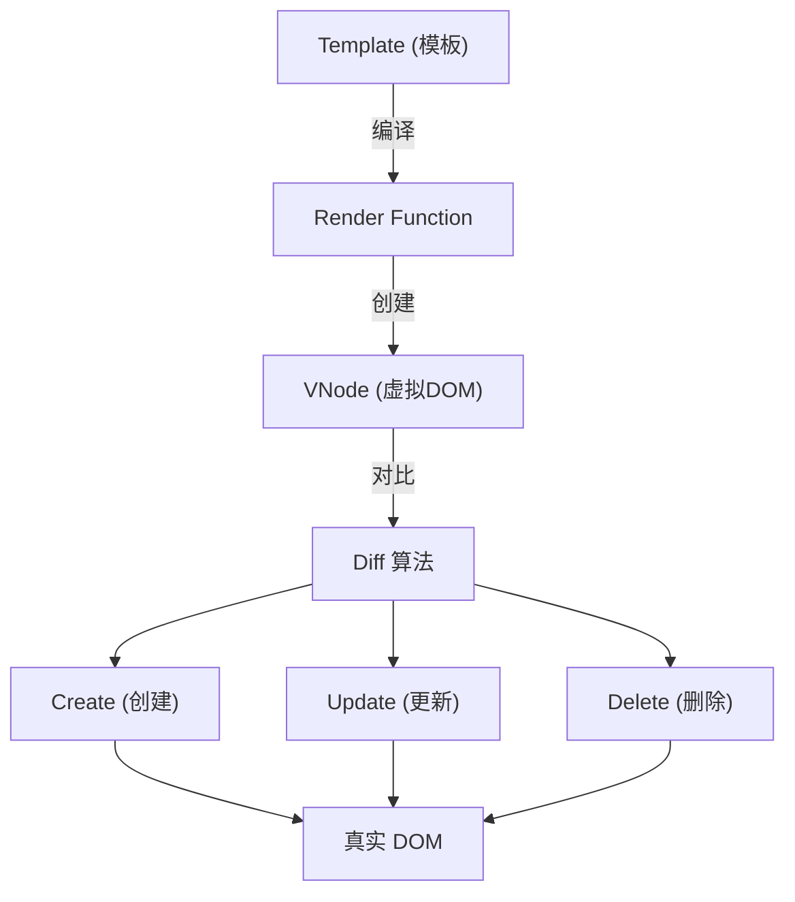
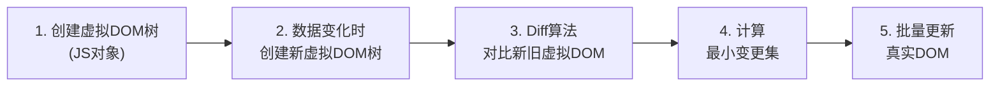
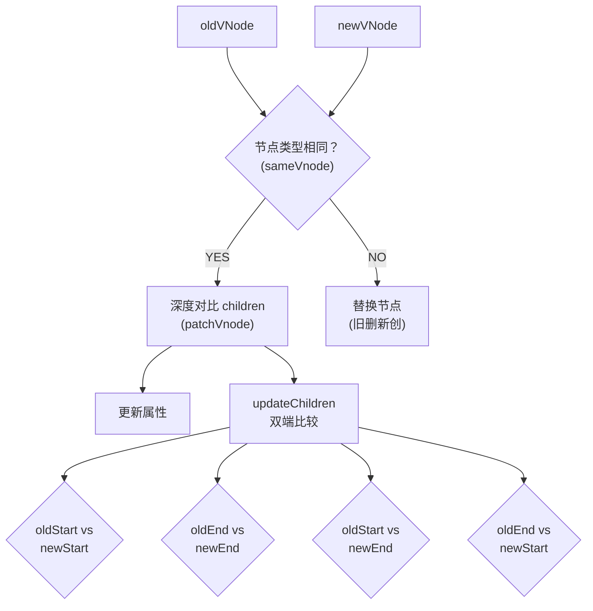
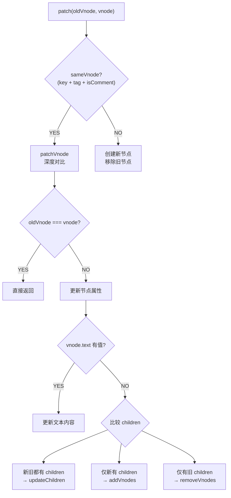
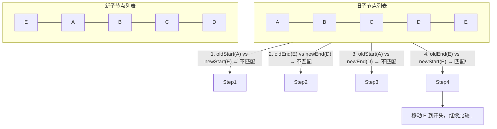
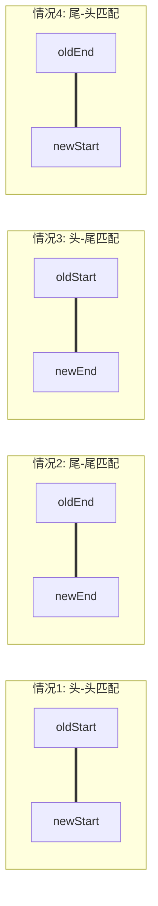
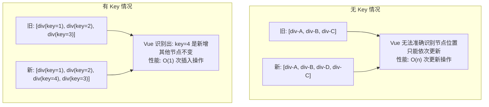
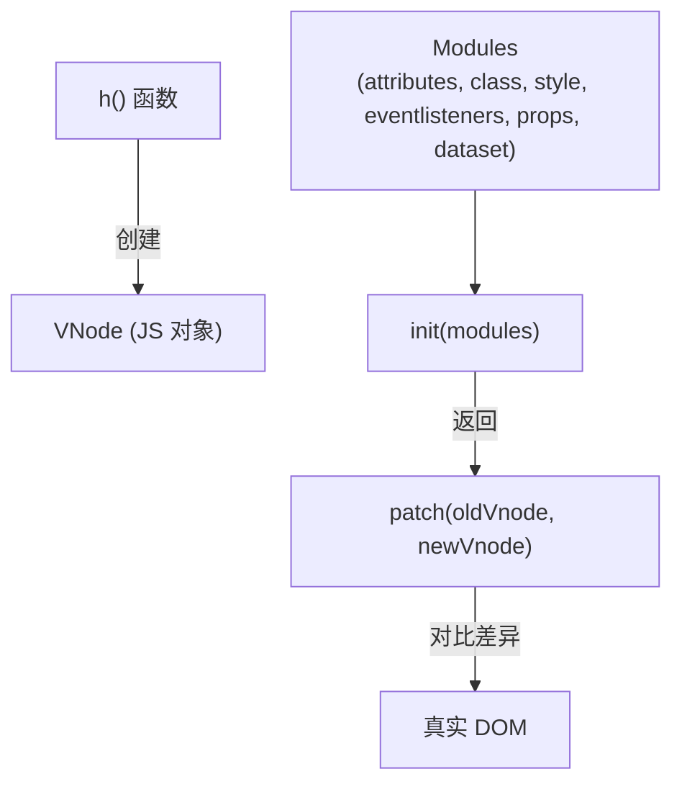
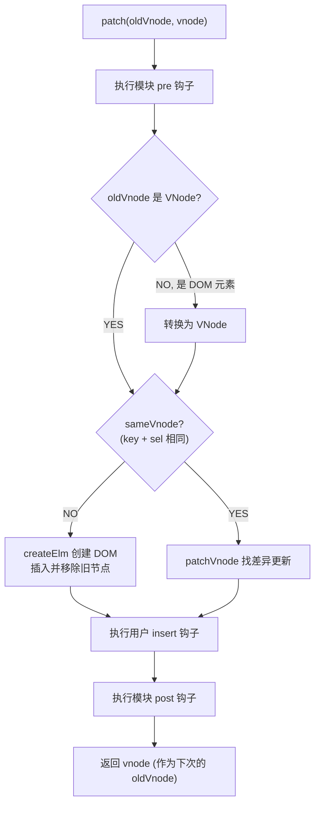
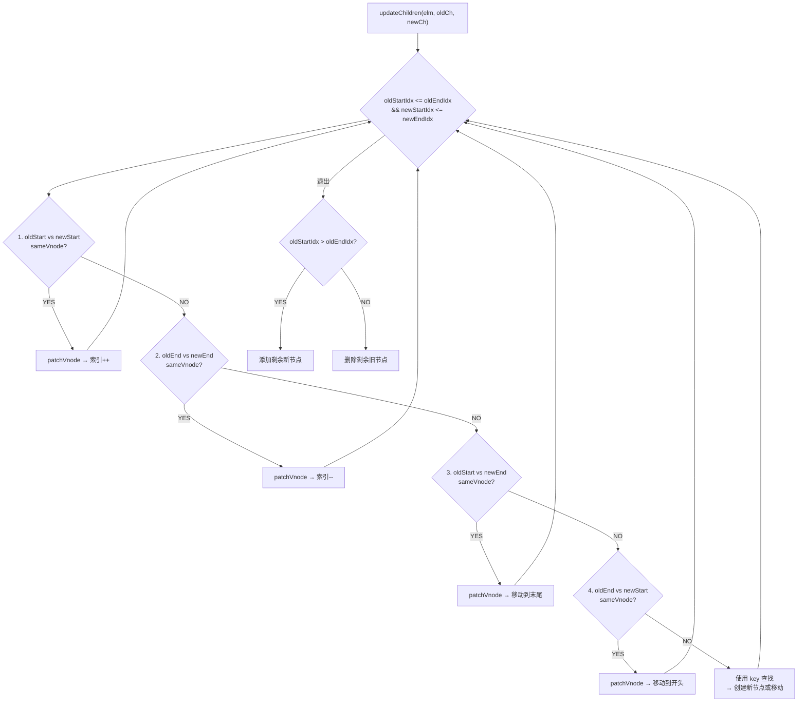

# 虚拟 DOM 与 Diff

## 系统架构概述

虚拟 DOM 系统基于以下核心流程：

```
模板编译 → Render函数 → 虚拟DOM(VNode) → Diff算法 → 真实DOM
```

### 渲染流程架构图



### 核心优势

| 优势           | 说明                                                         |
| -------------- | ------------------------------------------------------------ |
| **性能优化**   | 通过 Diff 算法最小化 DOM 操作，批量更新减少重排重绘         |
| **跨平台能力** | 虚拟 DOM 是 JavaScript 对象，可渲染到不同平台（Web、Native） |
| **开发效率**   | 声明式编程，无需手动操作 DOM                                 |
| **可维护性**   | 代码结构清晰，易于理解和调试                                 |

---

## 什么是虚拟DOM

### 概念定义

虚拟 DOM（Virtual DOM）是用 JavaScript 对象来描述真实 DOM 结构的一种技术。它是一个轻量级的 DOM 表示，包含了真实 DOM 的关键信息，但比真实 DOM 操作更快。

### 为什么需要虚拟DOM

直接操作真实 DOM 存在以下问题：

1. **性能开销大**：DOM 操作会导致重排（reflow）和重绘（repaint）
2. **频繁操作效率低**：每次数据变化都直接更新 DOM 会造成性能瓶颈
3. **难以优化**：手动优化 DOM 操作复杂且容易出错

虚拟 DOM 解决方案：

```js
// 真实 DOM 操作（低效）
for (let i = 0; i < 100; i++) {
  const div = document.createElement('div')
  div.textContent = `Item ${i}`
  container.appendChild(div) // 触发 100 次 DOM 操作
}

// 虚拟 DOM 批量更新（高效）
const vnodes = []
for (let i = 0; i < 100; i++) {
  vnodes.push(createVNode('div', `Item ${i}`))
}
// 一次性更新真实 DOM
patch(container, vnodes) // 只触发 1 次 DOM 操作
```

### 工作原理



---

## VNode 结构

### VNode 类定义

VNode（Virtual Node）是虚拟 DOM 的基本单元，用于描述 DOM 节点。

```js
// VNode 构造函数（简化版）
class VNode {
  constructor (
    tag,           // 标签名（如 'div'、'span'）
    data,          // 节点数据（attrs、class、style、props等）
    children,      // 子节点数组
    text,          // 文本内容
    elm,           // 对应的真实DOM节点
    context,       // 组件上下文
    componentOptions // 组件选项
  ) {
    this.tag = tag
    this.data = data
    this.children = children
    this.text = text
    this.elm = elm
    this.context = context
    this.componentOptions = componentOptions
  }
}
```

### VNode 类型

Vue 2 中存在多种 VNode 类型：

| 类型             | 创建方法            | 说明                     | 示例                           |
| ---------------- | ------------------- | ------------------------ | ------------------------------ |
| **元素节点**     | `createElement()`   | 普通 HTML 元素           | `<div class="app"></div>`      |
| **文本节点**     | `createTextVNode()` | 纯文本内容               | `"Hello Vue"`                  |
| **注释节点**     | `createEmptyVNode()` | HTML 注释                | `<!-- comment -->`             |
| **组件节点**     | `createComponent()` | Vue 组件                 | `<my-component />`             |
| **函数式组件**   | `createComponent()` | 无状态的函数式组件       | `Vue.component('func', {...})` |
| **克隆节点**     | `cloneVNode()`      | 复制现有 VNode           | 用于列表渲染优化               |

### VNode 示例

#### 元素节点示例

```js
// 模板
<div id="app" class="container">
  <span>Hello</span>
</div>

// 对应的 VNode 对象
{
  tag: 'div',
  data: {
    attrs: { id: 'app' },
    staticClass: 'container'
  },
  children: [
    {
      tag: 'span',
      children: [
        {
          text: 'Hello',
          tag: undefined
        }
      ]
    }
  ]
}
```

#### 组件节点示例

```js
// 模板
<my-component :prop="value" @click="handleClick"></my-component>

// 对应的 VNode 对象
{
  tag: 'vue-component-my-component',
  data: {
    props: { prop: value },
    on: { click: handleClick }
  },
  componentOptions: {
    Ctor: MyComponent,
    propsData: { prop: value },
    listeners: { click: handleClick }
  }
}
```

### createElement 函数

`createElement` 函数用于创建 VNode：

```js
// 函数签名
createElement(tag, data, children)

// 参数说明
// @tag {String | Object | Function} - HTML标签名、组件选项对象或函数
// @data {Object} - 节点数据对象（可选）
// @children {String | Array} - 子节点（可选）
```

#### 使用示例

```js
// 1. 创建简单元素
createElement('div', 'Hello World')

// 2. 创建带属性的元素
createElement('div', {
  attrs: { id: 'app' },
  class: ['container', 'active'],
  style: { color: 'red' }
}, 'Hello')

// 3. 创建嵌套结构
createElement('div', {
  class: 'parent'
}, [
  createElement('h1', 'Title'),
  createElement('p', 'Content'),
  createElement('span', { class: 'highlight' }, 'Highlighted')
])

// 4. 创建组件
createElement('my-component', {
  props: { title: 'Hello' },
  on: { click: this.handleClick }
})
```

---

## Diff 算法

Diff 算法是虚拟 DOM 的核心，用于比较新旧 VNode 树的差异，计算最小更新操作。

### 算法策略

Vue 的 Diff 算法基于以下三个假设：

1. **Web 中节点跨层级移动很少**：只进行同层级比较
2. **具有相同 class 的节点可能相似**：通过 key 和 tag 判断节点是否相同
3. **列表中相同 key 的节点相同**：利用 key 快速定位节点

### 时间复杂度

- 传统 Diff 算法：O(n³)
- Vue Diff 算法：O(n)

### Diff 流程图



### patch 整体流程



### patch 函数核心逻辑

```js
function patch (oldVnode, vnode) {
  // 1. 判断是否为相同节点
  if (sameVnode(oldVnode, vnode)) {
    // 相同节点：进行深度对比
    patchVnode(oldVnode, vnode)
  } else {
    // 不同节点：直接替换
    const parentElm = oldVnode.elm.parentNode
    createElm(vnode)
    parentElm.insertBefore(vnode.elm, oldVnode.elm)
    parentElm.removeChild(oldVnode.elm)
  }
}

// 判断是否为相同节点
function sameVnode (a, b) {
  return (
    a.key === b.key &&           // key 相同
    a.tag === b.tag &&           // 标签名相同
    a.isComment === b.isComment && // 是否同为注释节点
    isDef(a.data) === isDef(b.data) // data 是否都定义了
  )
}
```

### patchVnode 深度对比

```js
function patchVnode (oldVnode, vnode) {
  const elm = vnode.elm = oldVnode.elm
  const oldCh = oldVnode.children
  const ch = vnode.children

  // 1. 如果是同一个对象，直接返回
  if (oldVnode === vnode) return

  // 2. 更新节点属性
  updateAttrs(oldVnode, vnode)
  updateClass(oldVnode, vnode)
  updateStyle(oldVnode, vnode)
  // ... 其他属性更新

  // 3. 处理子节点
  if (isUndef(vnode.text)) {
    // 新节点有子节点
    if (isDef(oldCh) && isDef(ch)) {
      // 新旧都有子节点：进行 updateChildren
      if (oldCh !== ch) updateChildren(elm, oldCh, ch)
    } else if (isDef(ch)) {
      // 旧节点无子节点，新节点有：添加子节点
      addVnodes(elm, null, ch, 0, ch.length - 1)
    } else if (isDef(oldCh)) {
      // 旧节点有子节点，新节点无：删除子节点
      removeVnodes(oldCh, 0, oldCh.length - 1)
    }
  } else if (oldVnode.text !== vnode.text) {
    // 文本节点：更新文本内容
    elm.textContent = vnode.text
  }
}
```

### updateChildren 双端比较算法

`updateChildren` 是 Diff 算法的核心，使用双端比较策略：

```js
function updateChildren (parentElm, oldCh, newCh) {
  let oldStartIdx = 0
  let newStartIdx = 0
  let oldEndIdx = oldCh.length - 1
  let newEndIdx = newCh.length - 1

  let oldStartVnode = oldCh[oldStartIdx]
  let oldEndVnode = oldCh[oldEndIdx]
  let newStartVnode = newCh[newStartIdx]
  let newEndVnode = newCh[newEndIdx]

  while (oldStartIdx <= oldEndIdx && newStartIdx <= newEndIdx) {
    if (sameVnode(oldStartVnode, newStartVnode)) {
      // 新旧头节点相同
      patchVnode(oldStartVnode, newStartVnode)
      oldStartVnode = oldCh[++oldStartIdx]
      newStartVnode = newCh[++newStartIdx]
    } else if (sameVnode(oldEndVnode, newEndVnode)) {
      // 新旧尾节点相同
      patchVnode(oldEndVnode, newEndVnode)
      oldEndVnode = oldCh[--oldEndIdx]
      newEndVnode = newCh[--newEndIdx]
    } else if (sameVnode(oldStartVnode, newEndVnode)) {
      // 旧头新尾相同
      patchVnode(oldStartVnode, newEndVnode)
      // 移动到末尾
      parentElm.insertBefore(oldStartVnode.elm, oldEndVnode.elm.nextSibling)
      oldStartVnode = oldCh[++oldStartIdx]
      newEndVnode = newCh[--newEndIdx]
    } else if (sameVnode(oldEndVnode, newStartVnode)) {
      // 旧尾新头相同
      patchVnode(oldEndVnode, newStartVnode)
      // 移动到开头
      parentElm.insertBefore(oldEndVnode.elm, oldStartVnode.elm)
      oldEndVnode = oldCh[--oldEndIdx]
      newStartVnode = newCh[++newStartIdx]
    } else {
      // 四种情况都不匹配：使用 key 查找
      let idxInOld = findIdxInOld(newStartVnode, oldCh, oldStartIdx, oldEndIdx)
      if (isUndef(idxInOld)) {
        // 新元素：创建并插入
        createElm(newStartVnode, parentElm, oldStartVnode.elm)
      } else {
        // 已存在：移动并更新
        const vnodeToMove = oldCh[idxInOld]
        patchVnode(vnodeToMove, newStartVnode)
        oldCh[idxInOld] = undefined
        parentElm.insertBefore(vnodeToMove.elm, oldStartVnode.elm)
      }
      newStartVnode = newCh[++newStartIdx]
    }
  }

  // 处理剩余节点
  if (oldStartIdx > oldEndIdx) {
    // 旧节点已处理完，添加新剩余节点（refElm 为插入位置的参考节点）
    addVnodes(parentElm, refElm, newCh, newStartIdx, newEndIdx)
  } else if (newStartIdx > newEndIdx) {
    // 新节点已处理完，删除旧剩余节点
    removeVnodes(oldCh, oldStartIdx, oldEndIdx)
  }
}
```

### 双端比较示意图



**四种比较策略：**



---

## Key 的作用

### 为什么需要 Key

在列表渲染中，`key` 是节点的唯一标识符，帮助 Vue 识别节点，从而实现高效的 Diff 算法。

### Key 的作用原理



### 使用示例对比

#### 不使用 Key（不推荐）

```html
<div v-for="item in items">
  {{ item.name }}
</div>
```

**问题：**
- Vue 使用"就地复用"策略
- 节点顺序改变时，只更新内容而不移动节点
- 可能导致状态混乱（如表单输入值错位）

#### 使用 Index 作为 Key（不推荐）

```html
<div v-for="(item, index) in items" :key="index">
  {{ item.name }}
</div>
```

**问题：**
- 当列表顺序改变时，index 会变化
- 导致 key 失去唯一标识的意义
- 性能和正确性都无法保证

#### 使用唯一 ID 作为 Key（推荐）

```html
<div v-for="item in items" :key="item.id">
  {{ item.name }}
</div>
```

**优势：**
- 节点具有稳定的唯一标识
- Diff 算法能准确识别和追踪节点
- 性能最优，状态管理正确

### Key 的最佳实践

```js
// ✅ 好的做法：使用唯一标识
<li v-for="user in users" :key="user.id">
  {{ user.name }}
</li>

// ✅ 好的做法：使用静态数据
<option v-for="opt in OPTIONS" :key="opt.value">
  {{ opt.label }}
</option>

// ❌ 避免：使用 index
<li v-for="(item, index) in items" :key="index">
  {{ item.name }}
</li>

// ❌ 避免：不使用 key
<li v-for="item in items">
  {{ item.name }}
</li>
```

### 实际场景示例

```html
<template>
  <div>
    <!-- 场景1：可排序列表 -->
    <div v-for="todo in sortedTodos" :key="todo.id">
      <input v-model="todo.text" />
      <button @click="moveUp(todo.id)">↑</button>
    </div>

    <!-- 场景2：动态表单 -->
    <div v-for="(field, index) in formFields" :key="field.id">
      <input :placeholder="field.label" v-model="field.value" />
      <button @click="removeField(field.id)">删除</button>
    </div>

    <!-- 场景3：嵌套列表 -->
    <div v-for="category in categories" :key="category.id">
      <h3>{{ category.name }}</h3>
      <div v-for="item in category.items" :key="item.id">
        {{ item.name }}
      </div>
    </div>
  </div>
</template>
```

---

## 性能优化

### 渲染性能优化策略

#### 1. 合理使用 Key

```html
<!-- ✅ 使用唯一 key -->
<div v-for="item in items" :key="item.id">{{ item.name }}</div>

<!-- ❌ 避免使用 index -->
<div v-for="(item, index) in items" :key="index">{{ item.name }}</div>
```

#### 2. 使用 v-once 优化静态内容

```html
<!-- 静态内容只渲染一次 -->
<div v-once>
  <h1>{{ staticTitle }}</h1>
  <p>{{ staticDescription }}</p>
</div>

<!-- 适用于大量静态内容 -->
<ul>
  <li v-for="item in staticItems" v-once :key="item.id">
    {{ item.name }}
  </li>
</ul>
```

#### 3. 使用 v-show 替代 v-if（频繁切换）

```html
<!-- ✅ 频繁切换使用 v-show -->
<div v-show="isVisible">Toggle content</div>

<!-- ✅ 条件很少改变使用 v-if -->
<div v-if="shouldRender">Conditional content</div>
```

#### 4. 计算属性缓存

```js
export default {
  data() {
    return {
      items: [] // 大数组
    }
  },
  computed: {
    // ✅ 使用计算属性缓存结果
    filteredItems() {
      return this.items.filter(item => item.active)
    },
    sortedItems() {
      return [...this.filteredItems].sort((a, b) => a.id - b.id)
    }
  },
  methods: {
    // ❌ 避免在方法中重复计算
    getFilteredItems() {
      return this.items.filter(item => item.active)
    }
  }
}
```

#### 5. 列表分页/虚拟滚动

```js
// 分页加载
export default {
  data() {
    return {
      allItems: [],    // 所有数据
      pageSize: 50,    // 每页数量
      currentPage: 1
    }
  },
  computed: {
    displayedItems() {
      const start = (this.currentPage - 1) * this.pageSize
      const end = start + this.pageSize
      return this.allItems.slice(start, end)
    }
  }
}
```

```html
<!-- 使用第三方虚拟滚动库 -->
<virtual-list :size="50" :remain="20">
  <div v-for="item in largeList" :key="item.id">
    {{ item.name }}
  </div>
</virtual-list>
```

#### 6. 避免不必要的响应式数据

```js
export default {
  data() {
    return {
      // ❌ 大量数据设为响应式（性能消耗大）
      // largeList: new Array(10000).fill(null)
    }
  },
  created() {
    // ✅ 非响应式数据
    this.staticData = Object.freeze(largeList)
  }
}
```

#### 7. 合理使用 Object.freeze

```js
// 冻结不需要变化的数据
this.items = Object.freeze([
  { id: 1, name: 'Item 1' },
  { id: 2, name: 'Item 2' }
])

// Vue 不会为冻结对象设置响应式
// 节省了 Observer 遍历的开销
```

### 性能监控与分析

#### 使用 Vue DevTools

```js
// 开启性能追踪（仅开发环境）
Vue.config.performance = true

// 在 DevTools 中查看：
// - 组件渲染时间
// - 更新性能
// - 内存使用情况
```

#### 自定义性能追踪

```js
export default {
  methods: {
    heavyOperation() {
      console.time('heavyOperation')
      
      // 执行耗时操作
      for (let i = 0; i < 10000; i++) {
        // ...
      }
      
      console.timeEnd('heavyOperation')
    }
  },
  
  // 使用生命周期钩子监控
  beforeUpdate() {
    this.startTime = performance.now()
  },
  updated() {
    const duration = performance.now() - this.startTime
    console.log(`Update took ${duration}ms`)
  }
}
```

### 性能优化清单

| 优化项              | 优化方法                                   | 性能提升 |
| ------------------- | ------------------------------------------ | -------- |
| **Key 使用**        | 使用唯一 ID 而非 index                     | ⭐⭐⭐⭐⭐   |
| **静态内容**        | 使用 `v-once` 避免重复渲染                 | ⭐⭐⭐⭐    |
| **计算属性**        | 合理使用 computed 缓存                     | ⭐⭐⭐⭐⭐   |
| **大列表**          | 分页或虚拟滚动                             | ⭐⭐⭐⭐⭐   |
| **非响应式数据**    | 使用 `Object.freeze`                       | ⭐⭐⭐     |
| **条件渲染**        | 合理选择 `v-if` / `v-show`                 | ⭐⭐⭐     |
| **组件拆分**        | 将频繁更新的部分拆分为独立组件             | ⭐⭐⭐⭐    |
| **函数式组件**      | 无状态组件使用函数式组件                   | ⭐⭐      |

---

## 常见问题解答

### 1. 为什么虚拟 DOM 比直接操作 DOM 更快？

**答案：**

虚拟 DOM 本身不一定比精心优化的直接 DOM 操作更快，但它提供了更好的性价比：

- **批量更新**：将多次数据变更合并成一次 DOM 更新
- **最小化操作**：Diff 算法计算出最小变更集
- **避免重排重绘**：减少不必要的 DOM 操作
- **开发效率**：声明式编程，无需手动优化

### 2. 什么时候应该使用 v-if，什么时候使用 v-show？

**答案：**

```html
<!-- v-if：条件很少改变，或初始化时不渲染 -->
<expensive-component v-if="showExpensive"></expensive-component>

<!-- v-show：需要频繁切换显示状态 -->
<modal v-show="isModalOpen"></modal>
```

**对比：**

| 特性       | v-if                          | v-show                  |
| ---------- | ----------------------------- | ----------------------- |
| 渲染时机   | 条件为真时才渲染              | 总是渲染，仅切换 display |
| 切换开销   | 高（创建/销毁组件）           | 低（仅改变样式）         |
| 初始开销   | 低（条件为假时不渲染）        | 高（始终渲染）           |
| 适用场景   | 条件很少改变                  | 频繁切换                 |
| 支持 v-else | 是                            | 否                      |

### 3. 为什么不能使用 index 作为 key？

**答案：**

使用 index 作为 key 会导致以下问题：

```html
<!-- 初始状态 -->
<div v-for="(item, index) in items" :key="index">
  <input v-model="item.text" />
</div>

<!-- items: [{text: 'A'}, {text: 'B'}, {text: 'C'}] -->
<!-- index: [0, 1, 2] -->
<!-- key: [0, 1, 2] -->

<!-- 删除第二项后 -->
<!-- items: [{text: 'A'}, {text: 'C'}] -->
<!-- index: [0, 1] -->
<!-- key: [0, 1] -->

<!-- 问题： -->
<!-- 旧 key=1 对应 {text: 'B'} -->
<!-- 新 key=1 对应 {text: 'C'} -->
<!-- Vue 会复用 key=1 的 DOM，导致 input 中的值错乱 -->
```

**正确做法：**

```html
<div v-for="item in items" :key="item.id">
  <input v-model="item.text" />
</div>
```

### 4. Vue 2 和 Vue 3 的虚拟 DOM 有什么区别？

**答案：**

| 特性              | Vue 2                        | Vue 3                          |
| ----------------- | ---------------------------- | ------------------------------ |
| **VNode 结构**    | 包含更多属性                 | 精简优化，减少内存占用         |
| **Diff 算法**     | 双端比较                     | 最长递增子序列算法             |
| **静态提升**      | 无                           | 静态节点提升，避免重复创建     |
| **PatchFlag**     | 无                           | 标记动态内容，精确更新         |
| **Block Tree**    | 无                           | 扁平化虚拟节点树               |
| **性能**          | 基准性能                     | 提升 1.3-2 倍                  |

### 5. 如何调试虚拟 DOM 的渲染过程？

**答案：**

```js
// 1. 开启性能模式
Vue.config.performance = true

// 2. 使用 render 函数调试
new Vue({
  render(h) {
    console.log('Creating VNode for:', this.$data)
    return h('div', this.message)
  }
}).$mount('#app')

// 3. 自定义选项合并策略（选项合并阶段触发，可观察 render 的合并）
Vue.config.optionMergeStrategies.render = function(parent, child) {
  console.log('Render function merged')
  return child || parent
}

// 4. 使用 Vue DevTools
// - 查看 VNode 树结构
// - 分析渲染性能
// - 追踪组件更新
```

### 6. v-for 和 v-if 为什么不建议一起使用？

**答案：**

**问题：**

```html
<!-- ❌ 不推荐：v-for 优先级高于 v-if -->
<div v-for="item in items" v-if="item.active" :key="item.id">
  {{ item.name }}
</div>

<!-- 等价于 -->
<div v-for="item in items" :key="item.id">
  <template v-if="item.active">
    {{ item.name }}
  </template>
</div>

<!-- 每次渲染都会遍历所有 items，即使大部分不显示 -->
```

**解决方案：**

```html
<!-- ✅ 方案1：使用计算属性过滤 -->
<div v-for="item in activeItems" :key="item.id">
  {{ item.name }}
</div>

<script>
export default {
  computed: {
    activeItems() {
      return this.items.filter(item => item.active)
    }
  }
}
</script>

<!-- ✅ 方案2：嵌套 template -->
<template v-for="item in items">
  <div v-if="item.active" :key="item.id">
    {{ item.name }}
  </div>
</template>
```

---

## 最佳实践

### 1. 组件设计原则

```js
// ✅ 将频繁更新的部分拆分为独立组件
export default {
  components: {
    // 这个小组件只会在 item 变化时更新
    ItemComponent: {
      props: ['item'],
      template: `
        <div class="item">
          <span>{{ item.name }}</span>
          <button @click="$emit('remove')">删除</button>
        </div>
      `
    }
  },
  template: `
    <div>
      <ItemComponent 
        v-for="item in items" 
        :key="item.id" 
        :item="item"
        @remove="removeItem(item.id)"
      />
    </div>
  `
}
```

### 2. 合理使用函数式组件

```js
// 函数式组件：无状态、无实例，渲染更快
Vue.component('StaticHeader', {
  functional: true,
  props: ['title', 'subtitle'],
  render(h, context) {
    return h('header', [
      h('h1', context.props.title),
      h('p', context.props.subtitle)
    ])
  }
})

// 使用
<StaticHeader 
  title="Welcome" 
  subtitle="Vue.js Application" 
/>
```

### 3. 优化大型列表

```vue
<template>
  <div>
    <!-- 分页加载 -->
    <div v-for="item in visibleItems" :key="item.id">
      {{ item.name }}
    </div>
    
    <button @click="loadMore">加载更多</button>
  </div>
</template>

<script>
export default {
  data() {
    return {
      allItems: [],       // 所有数据
      visibleCount: 20,   // 可见数量
      pageSize: 20        // 每页数量
    }
  },
  computed: {
    visibleItems() {
      return this.allItems.slice(0, this.visibleCount)
    }
  },
  methods: {
    loadMore() {
      this.visibleCount += this.pageSize
    }
  },
  async created() {
    // 分批加载数据
    this.allItems = await fetchItems()
  }
}
</script>
```

### 4. 避免深层嵌套的响应式数据

```js
// ❌ 不推荐：深层嵌套
export default {
  data() {
    return {
      user: {
        profile: {
          preferences: {
            theme: 'dark'
          }
        }
      }
    }
  }
}

// ✅ 推荐：扁平化数据结构
export default {
  data() {
    return {
      userName: '',
      userTheme: 'dark'
    }
  }
}
```

### 5. 使用 Object.freeze 优化大数据

```js
export default {
  data() {
    return {
      // 冻结后的大数据不会转换为响应式
      largeList: Object.freeze([
        // ... 大量静态数据
      ])
    }
  }
}
```

### 6. 正确使用 v-for 和 v-if

```vue
<template>
  <!-- ✅ 推荐：计算属性过滤 -->
  <div v-for="item in activeItems" :key="item.id">
    {{ item.name }}
  </div>
  
  <!-- ✅ 推荐：嵌套 template -->
  <template v-for="item in items">
    <div v-if="shouldShow(item)" :key="item.id">
      {{ item.name }}
    </div>
  </template>
</template>

<script>
export default {
  computed: {
    activeItems() {
      return this.items.filter(item => item.active)
    }
  }
}
</script>
```

---

## Snabbdom：Vue 虚拟 DOM 的灵感来源

Vue 2.x 内部的虚拟 DOM 实现是基于 [Snabbdom](https://github.com/snabbdom/snabbdom) 改造的。Snabbdom 是一个约 200 行的核心源码库，以简洁、快速、模块化著称。

### Snabbdom 核心概念



### 基本使用

```js
import { h } from 'snabbdom/build/package/h'
import { init } from 'snabbdom/build/package/init'
import { styleModule } from 'snabbdom/build/package/modules/style'
import { eventListenersModule } from 'snabbdom/build/package/modules/eventlisteners'

// 使用 init() 创建 patch()，传入模块处理属性/样式/事件
let patch = init([styleModule, eventListenersModule])

// 使用 h() 创建 vnode
let vnode = h('div.cls', {
  style: { color: '#DEDEDE', backgroundColor: '#181A1B' },
  on: { click: clickHandler }
}, [
  h('h1', 'Hello Snabbdom'),
  h('p', '这是段落')
])

function clickHandler () {
  console.log(this.elm.innerHTML)
}

const app = document.querySelector('#app')
let oldVnode = patch(app, vnode)

// 更新视图
setTimeout(() => {
  vnode = h('div.cls', [
    h('h1', 'Hello World'),
    h('p', '这是段落')
  ])
  oldVnode = patch(oldVnode, vnode)
}, 2000)
```

### Snabbdom 核心模块

| 模块 | 功能 | 说明 |
|------|------|------|
| `attributes` | 设置 DOM 元素属性 | 使用 `setAttribute()`，处理布尔类型 |
| `props` | 设置 DOM 元素属性 | `element[attr] = value`，不处理布尔类型 |
| `class` | 切换类样式 | 配合 `sel` 选择器使用 |
| `dataset` | 设置 `data-*` 自定义属性 | |
| `eventlisteners` | 注册和移除事件 | |
| `style` | 设置行内样式 | 支持 delayed/remove/destroy 动画 |

### Snabbdom 源码结构

```
src/package/
├── h.ts              # h() 函数，用来创建 VNode
├── init.ts           # 加载 modules、DOMAPI，返回 patch 函数
├── vnode.ts          # 虚拟节点定义
├── hooks.ts          # 所有钩子函数的定义
├── htmldomapi.ts     # 对 DOM API 的包装
├── is.ts             # 判断数组和原始值的函数
├── thunk.ts          # 优化处理，对复杂视图不可变值的优化
├── tovnode.ts        # DOM 转换成 VNode
└── modules/
    ├── attributes.ts
    ├── class.ts
    ├── dataset.ts
    ├── eventlisteners.ts
    ├── props.ts
    └── style.ts
```

### patch 整体流程



### updateChildren 双端比较原理



---

## 参考资料

- [Vue 2 官方文档 - 深入响应式原理](https://v2.cn.vuejs.org/v2/guide/reactivity.html)
- [Vue 2 源码解析 - Virtual DOM](https://github.com/vuejs/vue/tree/v2.6.14/src/core/vdom)
- [Vue 2 Diff 算法详解](https://ustbhuangyi.github.io/vue-analysis/vdom/diff.html)
- [Vue 虚拟 DOM 优化策略](https://vue-js.com/learn/Vue/vdom.html)
