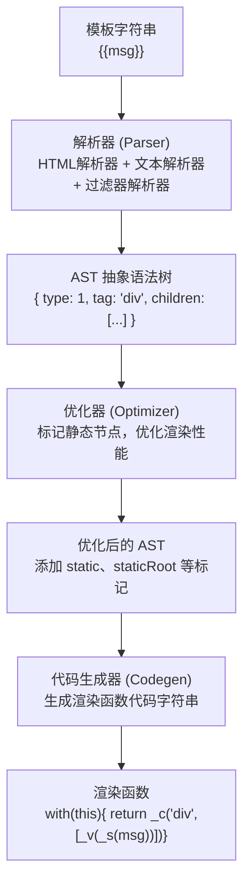
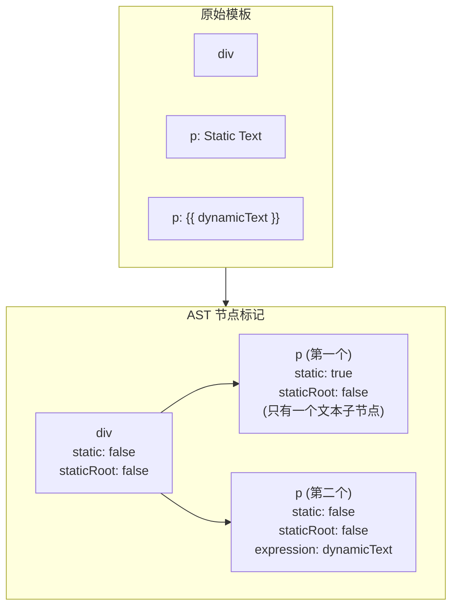

# 模板编译

## 系统架构概述

Vue 模板编译器将模板字符串转换为渲染函数，整个编译过程分为三个核心阶段：

```
模板字符串 → 解析器 → AST → 优化器 → 优化后的AST → 代码生成器 → 渲染函数
```

### 编译系统架构图



### 编译触发时机

| 编译时机       | 描述                                         | 性能影响 |
| -------------- | -------------------------------------------- | -------- |
| **运行时编译** | 在浏览器中编译模板（使用 `vue.js`）          | 高       |
| **预编译**     | 构建时编译（使用 `vue-loader`）              | 低       |
| **手动编译**   | 使用 `Vue.compile()` 手动编译                | 中       |

---

## 编译流程

### 整体流程详解

```js
// 编译函数入口
function compile(template, options) {
  const ast = parse(template, options)           // 1. 解析：模板 → AST
  optimize(ast, options)                          // 2. 优化：标记静态节点
  const code = generate(ast, options)            // 3. 生成：AST → 渲染函数代码
  return {
    ast,
    render: code.render,                         // 渲染函数
    staticRenderFns: code.staticRenderFns       // 静态渲染函数
  }
}
```

### 编译流程示意图

```mermaid
flowchart TD
    subgraph Step1["Step 1: 解析 (Parse)"]
        Input1["输入: <div id='app'>{{ message }}</div>"]
        Output1["输出: AST\n  type: 1, tag: 'div'\n  attrsList: [{name:'id',value:'app'}]\n  children: [...]"]
        Input1 --> Output1
    end
    
    subgraph Step2["Step 2: 优化 (Optimize)"]
        Output2["标记静态节点:\n  static: true/false\n  staticRoot: true/false\n  staticInFor: true/false\n目的: 跳过静态节点的 diff"]
    end
    
    subgraph Step3["Step 3: 生成 (Generate)"]
        Output3["生成渲染函数代码:\nwith(this){\n  return _c('div',\n    {attrs:{\"id\":\"app\"}},\n    [_v(_s(message))])\n}"]
    end
    
    Step1 --> Step2 --> Step3
```

---

## 解析器

解析器将模板字符串转换为抽象语法树（AST）。Vue 的解析器由多个子解析器组成：

### 解析器类型

| 解析器         | 作用                   | 处理内容                     |
| -------------- | ---------------------- | ---------------------------- |
| HTML 解析器    | 解析 HTML 标签         | `<div>`, `<span>`, `<input>` |
| 文本解析器     | 解析文本和插值表达式   | `Hello`, `{{ message }}`     |
| 过滤器解析器   | 解析过滤器语法         | `message \| filter`          |
| 注释解析器     | 解析 HTML 注释         | `<!-- comment -->`           |

### HTML 解析器核心逻辑

```js
function parseHTML(html, options) {
  while (html) {
    // 1. 处理注释
    if (html.match(/^<!\--/)) {
      const commentEnd = html.indexOf('-->')
      options.comment(html.substring(4, commentEnd))
      advance(commentEnd + 3)
      continue
    }

    // 2. 处理 DOCTYPE
    if (html.match(/^<!DOCTYPE/i)) {
      const doctypeEnd = html.indexOf('>')
      advance(doctypeEnd + 1)
      continue
    }

    // 3. 处理结束标签
    const endTagMatch = html.match(endTag)
    if (endTagMatch) {
      advance(endTagMatch[0].length)
      parseEndTag(endTagMatch[1])
      continue
    }

    // 4. 处理开始标签
    const startTagMatch = parseStartTag()
    if (startTagMatch) {
      handleStartTag(startTagMatch)
      continue
    }

    // 5. 处理文本
    let text, rest, next
    if (textEnd > 0) {
      text = html.substring(0, textEnd)
      advance(text.length)
    }
  }
}

// 辅助函数：前进指针
function advance(n) {
  html = html.substring(n)
}
```

### AST 节点类型

```js
// 元素节点
{
  type: 1,                    // 节点类型：1=元素，2=表达式文本，3=纯文本
  tag: 'div',                 // 标签名
  attrsList: [],              // 属性列表
  attrsMap: {},               // 属性映射
  parent: undefined,          // 父节点
  children: [],               // 子节点数组
  static: false,              // 是否静态
  staticRoot: false,          // 是否静态根节点
  plain: false,               // 是否没有属性
  staticInFor: false,         // 是否在 v-for 中
  staticProcessed: false      // 是否已处理静态标记
}

// 文本节点
{
  type: 3,                    // 纯文本类型
  text: 'Hello World',        // 文本内容
  static: true                // 静态文本
}

// 表达式节点
{
  type: 2,                    // 表达式文本类型
  expression: '_s(message)',  // 表达式
  text: '{{ message }}',      // 原始文本
  static: false               // 包含动态内容
}

// 注释节点
{
  type: 3,                    // 注释类型
  text: ' comment ',          // 注释内容
  isComment: true             // 标记为注释
}
```

### 解析示例

#### 示例 1：简单元素

```html
<div id="app">Hello</div>
```

解析后的 AST：

```js
{
  type: 1,
  tag: 'div',
  attrsList: [{ name: 'id', value: 'app' }],
  attrsMap: { id: 'app' },
  children: [
    {
      type: 3,
      text: 'Hello',
      static: true
    }
  ],
  static: false,
  plain: false
}
```

#### 示例 2：插值表达式

```html
<div>{{ message }}</div>
```

解析后的 AST：

```js
{
  type: 1,
  tag: 'div',
  children: [
    {
      type: 2,
      expression: '_s(message)',
      text: '{{ message }}',
      static: false
    }
  ],
  static: false
}
```

#### 示例 3：v-if 指令

```html
<div v-if="show">Content</div>
```

解析后的 AST：

```js
{
  type: 1,
  tag: 'div',
  if: 'show',
  ifConditions: [
    {
      exp: 'show',
      block: { type: 1, tag: 'div', children: [...] }
    }
  ],
  children: [
    { type: 3, text: 'Content', static: true }
  ],
  static: false
}
```

#### 示例 4：v-for 指令

```html
<li v-for="item in items" :key="item.id">{{ item.name }}</li>
```

解析后的 AST：

```js
{
  type: 1,
  tag: 'li',
  for: 'items',
  alias: 'item',
  iterator1: undefined,
  key: 'item.id',
  children: [
    {
      type: 2,
      expression: '_s(item.name)',
      text: '{{ item.name }}',
      static: false
    }
  ],
  static: false
}
```

### 指令解析

```js
// 解析指令
function parseDirectives(el) {
  const directives = []
  
  // v-if
  if (el.if) {
    directives.push({
      name: 'if',
      value: el.if,
      arg: undefined,
      modifiers: {}
    })
  }
  
  // v-for
  if (el.for) {
    directives.push({
      name: 'for',
      value: el.for,
      arg: el.alias,
      modifiers: {}
    })
  }
  
  // v-bind (简写 :)
  const attrs = el.attrsList
  for (const attr of attrs) {
    if (attr.name.startsWith('v-bind:') || attr.name.startsWith(':')) {
      directives.push({
        name: 'bind',
        value: attr.value,
        arg: attr.name.split(':')[1],
        modifiers: parseModifiers(attr.name)
      })
    }
  }
  
  return directives
}
```

---

## 优化器

优化器的目标是标记静态节点，使虚拟 DOM 在 diff 过程中跳过静态节点的比较，从而提升性能。

### 静态节点判断标准

```js
function isStatic(node) {
  if (node.type === 2) {           // 表达式
    return false
  }
  if (node.type === 3) {           // 文本
    return true
  }
  
  // 元素节点：v-pre 直接视为静态；
  // 否则要求无动态绑定、无 v-if/v-for、不是内置标签（slot/component）、
  // 必须是平台保留标签（原生标签）、且无事件监听器
  return !!(node.pre || (
    !hasBindings(node) &&
    !node.if &&                    // 无 v-if
    !node.for &&                   // 无 v-for
    !isBuiltInTag(node.tag) &&     // 非内置标签 (slot, component)
    isPlatformReservedTag(node.tag) && // 是平台保留标签
    Object.keys(node).every(key => !key.startsWith('on')) // 无事件监听器
  ))
}
```

### 优化流程

```js
function optimize(ast, options) {
  // 1. 标记静态节点
  markStatic(ast)
  
  // 2. 标记静态根节点
  markStaticRoots(ast, false)
}

// 标记静态节点
function markStatic(node) {
  node.static = isStatic(node)
  
  if (node.type === 1) {  // 元素节点
    for (const child of node.children) {
      markStatic(child)
      
      // 如果子节点不是静态，父节点也不是静态
      if (!child.static) {
        node.static = false
      }
    }
  }
}

// 标记静态根节点
function markStaticRoots(node, isInFor) {
  if (node.type === 1) {
    if (node.static || node.once) {
      node.staticInFor = isInFor
      
      // 只有子节点存在，且不只是一个文本节点时才标记为静态根
      if (node.static && node.children.length && !(
        node.children.length === 1 &&
        node.children[0].type === 3
      )) {
        node.staticRoot = true
        return
      }
    }
    
    // 递归处理子节点
    for (const child of node.children) {
      markStaticRoots(child, isInFor || !!node.for)
    }
  }
}
```

### 静态标记示意图



### 静态提升示例

```html
<div>
  <div class="header">
    <h1>Static Title</h1>
    <p>Static Description</p>
  </div>
  <div class="content">
    {{ dynamicContent }}
  </div>
</div>
```

优化后的渲染函数：

```js
// 静态部分被提取为静态渲染函数
var staticRenderFns = [
  function() {
    return _c('div', { staticClass: "header" }, [
      _c('h1', [_v("Static Title")]),
      _c('p', [_v("Static Description")])
    ])
  }
]

// 动态部分保留在主渲染函数
function render() {
  with(this) {
    return _c('div', [
      _m(0),  // 调用静态渲染函数
      _c('div', { staticClass: "content" }, [
        _v(_s(dynamicContent))
      ])
    ])
  }
}
```

---

## 代码生成器

代码生成器将优化后的 AST 转换为渲染函数代码字符串。

### 核心生成逻辑

```js
function generate(ast, options) {
  const state = new CodegenState(options)
  const code = ast ? genElement(ast, state) : '_c("div")'
  
  return {
    render: `with(this){return ${code}}`,
    staticRenderFns: state.staticRenderFns
  }
}

// 生成元素代码
function genElement(el, state) {
  if (el.staticRoot && !el.staticProcessed) {
    return genStatic(el, state)
  } else if (el.once && !el.onceProcessed) {
    return genOnce(el, state)
  } else if (el.for) {
    return genFor(el, state)
  } else if (el.if) {
    return genIf(el, state)
  } else if (el.tag === 'template' && !el.slotTarget) {
    return genChildren(el, state) || 'void 0'
  } else if (el.tag === 'slot') {
    return genSlot(el, state)
  } else {
    // 普通元素
    let code
    const data = genData(el, state)
    const children = genChildren(el, state, true)
    
    code = `_c('${el.tag}'${
      data ? `,${data}` : ''
    }${
      children ? `,${children}` : ''
    })`
    
    return code
  }
}
```

### 各种指令代码生成

#### 生成静态节点代码

```js
function genStatic(el, state) {
  el.staticProcessed = true
  state.staticRenderFns.push(`with(this){return ${genElement(el, state)}}`)
  return `_m(${state.staticRenderFns.length - 1})`
}
```

#### 生成 v-for 代码

```js
function genFor(el, state) {
  const exp = el.for
  const alias = el.alias
  const iterator1 = el.iterator1 ? `,${el.iterator1}` : ''
  const iterator2 = el.iterator2 ? `,${el.iterator2}` : ''
  
  return `_l((${exp}),` +
    `function(${alias}${iterator1}${iterator2}){` +
    `return ${genElement(el, state)}` +
    `})`
}
```

#### 生成 v-if 代码

```js
function genIf(el, state) {
  el.ifProcessed = true
  return genIfConditions(el.ifConditions.slice(), state)
}

function genIfConditions(conditions, state) {
  if (!conditions.length) {
    return '_e()'  // 创建空节点
  }
  
  const condition = conditions.shift()
  
  if (condition.exp) {
    return `(${condition.exp})?${genElement(condition.block, state)}:${genIfConditions(conditions, state)}`
  } else {
    return `${genElement(condition.block, state)}`
  }
}
```

#### 生成 v-bind 代码

```js
function genData(el, state) {
  let data = '{'
  
  // 处理 attrs
  if (el.attrs) {
    data += `attrs:{${genProps(el.attrs)}},`
  }
  
  // 处理 class
  if (el.staticClass || el.classBinding) {
    data += `class:${el.staticClass ? `_s(${el.staticClass})` : ''}${el.classBinding ? `,${el.classBinding}` : ''},`
  }
  
  // 处理 style
  if (el.staticStyle || el.styleBinding) {
    data += `style:${el.staticStyle ? `_s(${el.staticStyle})` : ''}${el.styleBinding ? `,${el.styleBinding}` : ''},`
  }
  
  // 处理 props
  if (el.props) {
    data += `props:{${genProps(el.props)}},`
  }
  
  // 处理 domProps
  if (el.domProps) {
    data += `domProps:{${genProps(el.domProps)}},`
  }
  
  // 处理 events
  if (el.events) {
    data += `on:${genHandlers(el.events, false)},`
  }
  
  // 处理 directives
  if (el.directives) {
    data += `directives:[${el.directives.map(d => {
      return `{name:"${d.name}",value:${d.value},expression:${JSON.stringify(d.value)},arg:${d.arg ? `"${d.arg}"` : 'null'},modifiers:${JSON.stringify(d.modifiers)}}`
    }).join(',')}],`
  }
  
  data = data.replace(/,$/, '') + '}'
  return data
}
```

### 代码生成示例

#### 示例 1：简单元素

**模板：**

```html
<div id="app">Hello World</div>
```

**生成的代码：**

```js
with(this) {
  return _c('div', {
    attrs: { "id": "app" }
  }, [
    _v("Hello World")
  ])
}
```

#### 示例 2：动态绑定

**模板：**

```html
<div :class="className" :style="{ color: color }">Content</div>
```

**生成的代码：**

```js
with(this) {
  return _c('div', {
    class: className,
    style: { color: color }
  }, [
    _v("Content")
  ])
}
```

#### 示例 3：v-for 列表

**模板：**

```html
<ul>
  <li v-for="item in items" :key="item.id">{{ item.text }}</li>
</ul>
```

**生成的代码：**

```js
with(this) {
  return _c('ul', [
    _l((items), function(item) {
      return _c('li', {
        key: item.id
      }, [
        _v(_s(item.text))
      ])
    })
  ], 2)
}
```

#### 示例 4：v-if 条件

**模板：**

```html
<div>
  <p v-if="show">Visible</p>
  <p v-else>Hidden</p>
</div>
```

**生成的代码：**

```js
with(this) {
  return _c('div', [
    (show) ? 
      _c('p', [_v("Visible")]) :
      _c('p', [_v("Hidden")])
  ])
}
```

#### 示例 5：事件处理

**模板：**

```html
<button @click="handleClick" @keyup.enter="handleKeyup">Click</button>
```

**生成的代码：**

```js
with(this) {
  return _c('button', {
    on: {
      "click": handleClick,
      "keyup": function($event) {
        if (!$event.type.indexOf('key') && 
            _k($event.keyCode, "enter", 13, $event.key, "Enter")) {
          return null
        }
        return handleKeyup($event)
      }
    }
  }, [
    _v("Click")
  ])
}
```

#### 示例 6：v-model 双向绑定

**模板：**

```html
<input v-model="message" placeholder="Enter message">
```

**生成的代码：**

```js
with(this) {
  return _c('input', {
    directives: [{
      name: "model",
      value: (message),
      expression: "message"
    }],
    attrs: {
      "placeholder": "Enter message"
    },
    domProps: {
      "value": (message)
    },
    on: {
      "input": function($event) {
        if ($event.target.composing) return
        message = $event.target.value
      }
    }
  })
}
```

### 渲染函数辅助方法

| 方法名       | 作用                               | 示例                          |
| ------------ | ---------------------------------- | ----------------------------- |
| `_c()`       | 创建 VNode                         | `_c('div', data, children)`   |
| `_v()`       | 创建文本 VNode                     | `_v("Hello World")`           |
| `_s()`       | 转换为字符串                       | `_s(message)`                 |
| `_l()`       | 渲染列表                           | `_l(items, (item) => ...)`    |
| `_m()`       | 渲染静态内容                       | `_m(0)`                       |
| `_e()`       | 创建空 VNode                       | `_e()`                        |
| `_u()`       | 解析插槽                           | `_u(scopedSlots, ...)`        |

---

## 编译时优化

### 1. 静态内容提升

**原理：** 将静态节点提取为静态渲染函数，只渲染一次并缓存复用。

```html
<!-- 模板 -->
<div>
  <div class="header">
    <h1>Static Title</h1>
  </div>
  <div class="content">{{ dynamicContent }}</div>
</div>
```

**优化后的渲染函数：**

```js
// 静态部分被提取到 staticRenderFns
var staticRenderFns = [
  function() {
    return _c('div', { staticClass: "header" }, [
      _c('h1', [_v("Static Title")])
    ])
  }
]

// 动态部分保留在主渲染函数
function render() {
  with(this) {
    return _c('div', [
      _m(0),  // 复用静态渲染结果（内部克隆缓存的 VNode）
      _c('div', { staticClass: "content" }, [
        _v(_s(dynamicContent))
      ])
    ])
  }
}
```

### 2. 静态子树提升

**原理：** 将静态子树提升为静态渲染函数，减少主渲染函数复杂度。

```html
<!-- 模板 -->
<div>
  <div class="sidebar">
    <h2>Menu</h2>
    <ul>
      <li>Item 1</li>
      <li>Item 2</li>
      <li>Item 3</li>
    </ul>
  </div>
  <div class="main">{{ content }}</div>
</div>
```

**编译结果：**

```js
// 静态渲染函数
var staticRenderFns = [
  function() {
    with(this) {
      return _c('div', { staticClass: "sidebar" }, [
        _c('h2', [_v("Menu")]),
        _c('ul', [
          _c('li', [_v("Item 1")]),
          _c('li', [_v("Item 2")]),
          _c('li', [_v("Item 3")])
        ])
      ])
    }
  }
]

// 主渲染函数
function render() {
  with(this) {
    return _c('div', [
      _m(0),  // 调用静态渲染函数
      _c('div', { staticClass: "main" }, [
        _v(_s(content))
      ])
    ])
  }
}
```

### 3. v-once 优化

**原理：** 使用 `v-once` 指令让元素只渲染一次，后续更新直接复用。

```html
<!-- 模板 -->
<div v-once>
  <h1>{{ title }}</h1>
  <p>Static content that never changes</p>
</div>
```

**编译结果：**

```js
function render() {
  with(this) {
    return _m(0, true)
  }
}

var staticRenderFns = [
  function() {
    with(this) {
      return _c('div', [
        _c('h1', [_v(_s(title))]),
        _c('p', [_v("Static content that never changes")])
      ])
    }
  }
]
```

### 4. v-pre 优化

**原理：** 跳过编译，保留原始内容。

```html
<!-- 模板 -->
<div v-pre>
  {{ this will not be compiled }}
  <span>{{ raw interpolation }}</span>
</div>
```

**编译结果：**

```js
function render() {
  with(this) {
    return _c('div', [
      _v("{{ this will not be compiled }}"),
      _c('span', [_v("{{ raw interpolation }}")])
    ])
  }
}
```

### 5. 内联模板优化

**原理：** 内联模板在编译时就确定，减少运行时开销。

```html
<!-- 父组件 -->
<child-component inline-template>
  <div>
    <h2>{{ childTitle }}</h2>
    <p>Inline template content</p>
  </div>
</child-component>
```

**编译结果：**

```js
// 子组件的内联模板渲染函数（注意：内联模板按子组件自身作用域编译）
var childComponent = {
  data() {
    return {
      childTitle: 'Child Title'
    }
  },
  render: function() {
    with(this) {
      return _c('div', [
        _c('h2', [_v(_s(childTitle))]),
        _c('p', [_v("Inline template content")])
      ])
    }
  }
}
```

### 优化效果对比

| 优化策略         | 适用场景               | 性能提升 |
| ---------------- | ---------------------- | -------- |
| 静态内容提升     | 纯文本、纯静态元素     | 20-30%   |
| 静态子树提升     | 包含多个静态节点的子树 | 30-50%   |
| v-once           | 只需渲染一次的内容     | 40-60%   |
| v-pre            | 大量静态插值表达式     | 10-20%   |
| 内联模板         | 小型组件、频繁更新     | 15-25%   |

> 注：表中百分比为经验性估计，非官方基准数据，实际收益取决于模板规模与更新频率，请以业务实测为准。

---

## 编译配置

### 编译选项

```js
const compilerOptions = {
  // 是否输出编译警告
  warn: true,
  
  // 是否保留标签间的空白
  preserveWhitespace: false,
  
  // 空白处理策略（2.6+）：'condense' 压缩空白，'preserve' 保留
  whitespace: 'condense',
  
  // 是否优化（标记静态节点）
  optimize: true,
  
  // 编译模块（class/style 模块、指令转换等）
  modules: [],
  
  // 自定义指令的编译处理
  directives: {}
}
```

### Vue.compile() 使用

```js
// 手动编译模板
const result = Vue.compile(`
  <div>
    <h1>{{ title }}</h1>
    <p>{{ content }}</p>
  </div>
`)

// 使用编译结果
new Vue({
  data: {
    title: 'Hello',
    content: 'World'
  },
  render: result.render,
  staticRenderFns: result.staticRenderFns
}).$mount('#app')
```

### vue-loader 配置

```js
// vue.config.js
module.exports = {
  chainWebpack: config => {
    config.module
      .rule('vue')
      .use('vue-loader')
      .loader('vue-loader')
      .tap(options => {
        // 修改编译选项
        options.compilerOptions = {
          preserveWhitespace: false,  // 移除空白节点
          whitespace: 'condense',     // 压缩空白
          modules: {
            // 自定义编译模块
          }
        }
        return options
      })
  }
}
```

### 编译器选项详解

| 选项                    | 类型      | 说明                           |
| ----------------------- | --------- | ------------------------------ |
| `preserveWhitespace`    | Boolean   | 是否保留标签间的空白文本节点   |
| `whitespace`            | String    | 空白处理策略（`'condense'` \| `'preserve'`，2.6 起默认 `'condense'`） |
| `optimize`              | Boolean   | 是否优化 AST（标记静态节点）   |
| `modules`               | Array     | 编译模块数组（class、style、model 等） |
| `directives`            | Object    | 自定义指令的编译处理           |
| `delimiters`            | Array     | 插值分隔符，默认 `['{{', '}}']` |
| `isReservedTag`         | Function  | 判断是否为平台保留标签         |

---

## 常见问题解答

### 1. 为什么 Vue 2 需要模板编译？

**答案：**

模板编译是 Vue 高效渲染的关键：

- **性能优化**：将模板预编译为渲染函数，减少运行时开销
- **静态分析**：编译时识别静态内容，优化渲染性能
- **开发体验**：允许使用模板语法，降低开发门槛
- **功能支持**：支持指令、过滤器、事件等特性

### 2. 运行时编译 vs 预编译有什么区别？

**答案：**

| 对比项     | 运行时编译                   | 预编译                       |
| ---------- | ---------------------------- | ---------------------------- |
| **编译时机** | 浏览器运行时                 | 构建时                       |
| **包大小**   | 包含编译器（~10KB）          | 不包含编译器                 |
| **性能**     | 较慢（首次编译耗时）         | 更快（直接执行渲染函数）     |
| **适用场景** | 动态模板、简单应用           | 生产环境、大型应用           |
| **Vue 文件** | `vue.js`                     | `vue.runtime.js`             |

**推荐：** 生产环境使用预编译，开发环境可使用运行时编译。

### 3. 如何查看模板编译后的渲染函数？

**答案：**

```js
// 方法 1：使用 Vue.compile()
const result = Vue.compile('<div>{{ message }}</div>')
console.log(result.render)
// 输出: with(this){return _c('div',[_v(_s(message))])}

// 方法 2：使用 Vue DevTools
// 在 DevTools 中选择组件，查看 $options.render

// 方法 3：使用 vue-template-compiler
const compiler = require('vue-template-compiler')
const compiled = compiler.compile('<div>{{ message }}</div>')
console.log(compiled.render)
```

### 4. 为什么有些元素不能用 v-for 和 v-if 一起使用？

**答案：**

**问题：**

```html
<!-- ❌ 不推荐 -->
<div v-for="item in items" v-if="item.active">
  {{ item.name }}
</div>
```

**原因：**
- `v-for` 优先级高于 `v-if`
- 每次渲染都会遍历所有 items，即使大部分不显示
- 编译后会生成嵌套的条件判断，性能较差

**解决方案：**

```html
<!-- ✅ 方案 1：使用计算属性 -->
<div v-for="item in activeItems" :key="item.id">
  {{ item.name }}
</div>

<script>
export default {
  computed: {
    activeItems() {
      return this.items.filter(item => item.active)
    }
  }
}
</script>

<!-- ✅ 方案 2：嵌套 template -->
<template v-for="item in items">
  <div v-if="item.active" :key="item.id">
    {{ item.name }}
  </div>
</template>
```

### 5. 如何优化模板编译性能？

**答案：**

```html
<!-- 1. 使用 v-once -->
<div v-once>
  <h1>{{ staticTitle }}</h1>
</div>

<!-- 2. 使用 v-pre -->
<div v-pre>
  {{ raw interpolation }}
</div>

<!-- 3. 减少不必要的嵌套 -->
<!-- ❌ 过度嵌套 -->
<div><div><div><span>Text</span></div></div></div>

<!-- ✅ 扁平结构 -->
<div><span>Text</span></div>

<!-- 4. 使用内联模板 -->
<my-component inline-template>
  <div>Simple content</div>
</my-component>
```

### 6. 模板编译与 JSX 有什么区别？

**答案：**

| 对比项         | 模板编译                     | JSX                          |
| -------------- | ---------------------------- | ---------------------------- |
| **语法**       | HTML-like 模板语法           | JavaScript 扩展语法          |
| **编译目标**   | 渲染函数                     | 渲染函数                     |
| **静态优化**   | 支持静态内容提升             | 需要手动优化                 |
| **指令支持**   | 内置 v-if, v-for 等          | 需要使用 JS 实现             |
| **学习曲线**   | 较低（类似 HTML）            | 较高（需要理解 JS）          |
| **灵活性**     | 受限（模板语法）             | 高（完整的 JS 能力）         |
| **类型检查**   | 有限                         | 完整的 TypeScript 支持       |

---

## 最佳实践

### 1. 使用预编译

```js
// ❌ 避免：运行时编译（生产环境）
<script src="https://cdn.jsdelivr.net/npm/vue@2.6.14/dist/vue.js"></script>

// ✅ 推荐：预编译（生产环境）
<script src="https://cdn.jsdelivr.net/npm/vue@2.6.14/dist/vue.runtime.min.js"></script>
```

### 2. 合理使用 v-once

```html
<!-- ✅ 适用场景：静态内容 -->
<div v-once>
  <h1>Application Title</h1>
  <p>Version: 1.0.0</p>
</div>

<!-- ❌ 不适用场景：频繁更新的内容 -->
<div v-once>
  {{ currentTime }}  <!-- 错误：永远不会更新 -->
</div>
```

### 3. 优化模板结构

```html
<!-- ❌ 深度嵌套 -->
<div>
  <div>
    <div>
      <div>
        <span>{{ message }}</span>
      </div>
    </div>
  </div>
</div>

<!-- ✅ 扁平结构 -->
<div>
  <span>{{ message }}</span>
</div>
```

### 4. 使用计算属性替代复杂模板逻辑

```html
<!-- ❌ 复杂的模板逻辑 -->
<div>
  <span v-if="user && user.profile && user.profile.name">
    {{ user.profile.name.toUpperCase() }}
  </span>
</div>

<!-- ✅ 使用计算属性 -->
<div>
  <span>{{ displayName }}</span>
</div>

<script>
export default {
  computed: {
    displayName() {
      return this.user?.profile?.name?.toUpperCase() || 'Unknown'
    }
  }
}
</script>
```

### 5. 避免不必要的响应式数据

```vue
<script>
export default {
  data() {
    return {
      // ❌ 静态数据设为响应式（浪费性能）
      config: {
        apiUrl: 'https://api.example.com',
        timeout: 5000
      }
    }
  },
  
  created() {
    // ✅ 静态数据使用 Object.freeze
    this.config = Object.freeze({
      apiUrl: 'https://api.example.com',
      timeout: 5000
    })
  }
}
</script>
```

### 6. 使用函数式组件优化静态组件

```js
// ✅ 静态组件使用函数式组件
Vue.component('StaticHeader', {
  functional: true,
  render(h, context) {
    return h('header', {
      staticClass: 'header'
    }, [
      h('h1', 'Application Title'),
      h('p', 'Version 1.0.0')
    ])
  }
})
```

### 7. 合理使用 v-for 和 v-if

```html
<!-- ❌ 不推荐：v-for 和 v-if 同时使用 -->
<div v-for="item in items" v-if="item.active" :key="item.id">
  {{ item.name }}
</div>

<!-- ✅ 推荐：使用计算属性 -->
<div v-for="item in activeItems" :key="item.id">
  {{ item.name }}
</div>

<script>
export default {
  computed: {
    activeItems() {
      return this.items.filter(item => item.active)
    }
  }
}
</script>
```

### 8. 配置 vue-loader 优化

```js
// vue.config.js
module.exports = {
  chainWebpack: config => {
    config.module
      .rule('vue')
      .use('vue-loader')
      .loader('vue-loader')
      .tap(options => ({
        ...options,
        compilerOptions: {
          // 移除空白节点
          preserveWhitespace: false,
          // 压缩空白
          whitespace: 'condense'
        }
      }))
  }
}
```

---

## 参考资料

- [Vue 2 官方文档 - 模板语法](https://v2.cn.vuejs.org/v2/guide/syntax.html)
- [Vue 2 官方文档 - 渲染函数 & JSX](https://v2.cn.vuejs.org/v2/guide/render-function.html)
- [Vue 2 源码解析 - 模板编译](https://github.com/vuejs/vue/tree/v2.6.14/src/compiler)
- [Vue 模板编译器详解](https://ustbhuangyi.github.io/vue-analysis/compile/)
