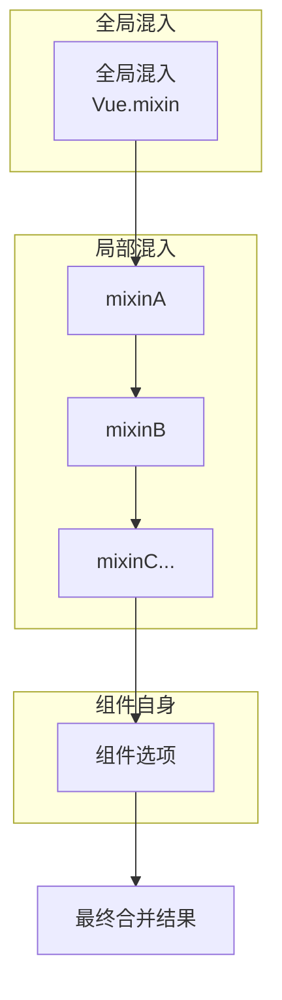
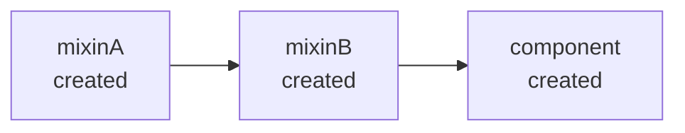

# 混入 Mixin

## 概述

混入 (mixin) 是 Vue.js 中实现代码复用的一种重要机制，它提供了一种灵活的方式来分发 Vue 组件中的可复用功能。一个混入对象可以包含任意组件选项，当组件使用混入对象时，所有混入对象的选项将被"混合"进入该组件本身的选项。

### 适用场景

- 多个组件共享相同的逻辑或功能
- 需要在多个组件中复用生命周期钩子
- 统一处理某些特定的业务逻辑（如权限校验、日志记录）
- 为组件添加通用的方法和属性

### 基本用法

```javascript
var myMixin = {
  created: function () {
    this.hello()
  },
  methods: {
    hello: function () {
      console.log("hello from mixin!")
    }
  }
}

var Component = Vue.extend({
  mixins: [myMixin]
})

var component = new Component()
```

---

## 选项合并策略

当组件和混入对象含有同名选项时，Vue 会按照特定的策略进行合并。理解这些策略对于正确使用混入至关重要。

### 数据对象合并

数据对象在内部会进行递归合并，并在发生冲突时以**组件数据优先**。

```javascript
var mixin = {
  data: function () {
    return {
      message: "hello",
      foo: "abc"
    }
  }
}

new Vue({
  mixins: [mixin],
  data: function () {
    return {
      message: "goodbye",
      bar: "def"
    }
  },
  created: function () {
    console.log(this.$data)
  }
})
```

**合并结果：**

| 属性    | 来源         | 值        |
| ------- | ------------ | --------- |
| message | 组件（优先） | 'goodbye' |
| foo     | 混入对象     | 'abc'     |
| bar     | 组件         | 'def'     |

### 生命周期钩子合并

同名钩子函数将合并为一个数组，因此都会被调用。**混入对象的钩子将在组件自身钩子之前调用**。

```javascript
var mixin = {
  created: function () {
    console.log("混入对象的钩子被调用")
  }
}

new Vue({
  mixins: [mixin],
  created: function () {
    console.log("组件钩子被调用")
  }
})
```

**执行顺序：**

1. 混入对象的钩子被调用
2. 组件钩子被调用

### 对象类型选项合并

值为对象的选项（如 `methods`、`components`、`directives`、`computed` 等）将被合并为同一个对象。两个对象键名冲突时，**取组件对象的键值对**。

```javascript
var mixin = {
  methods: {
    foo: function () {
      console.log("foo")
    },
    conflicting: function () {
      console.log("from mixin")
    }
  }
}

var vm = new Vue({
  mixins: [mixin],
  methods: {
    bar: function () {
      console.log("bar")
    },
    conflicting: function () {
      console.log("from self")
    }
  }
})

vm.foo()
vm.bar()
vm.conflicting()
```

### 合并策略总结

| 选项类型                          | 合并策略             | 冲突时优先级 |
| --------------------------------- | -------------------- | ------------ |
| data                              | 递归合并             | 组件优先     |
| 生命周期钩子                      | 合并为数组，依次执行 | 混入先执行   |
| methods / components / directives | 对象合并             | 组件优先     |
| computed                          | 对象合并             | 组件优先     |
| watch                             | 同名键的侦听器合并为数组，依次执行 | 混入先执行 |
| props                             | 默认策略（整个选项覆盖，不深度合并） | 组件优先 |

> **注意**：Vue 2 没有 `emits` 选项（Vue 3 才引入）；`props` 采用默认策略，组件定义了 `props` 时会整体覆盖混入中的 `props`。

### 合并优先级流程

当组件、局部混入和全局混入同时存在时，合并遵循以下优先级：



**合并规则：**

- **data / methods / computed 等对象选项**：组件 > 局部混入（按数组顺序） > 全局混入，同名属性组件优先
- **生命周期钩子**：全局混入先执行 → 局部混入（按数组顺序） → 组件最后执行，所有钩子都会调用
- **watch**：同名键的侦听器合并为数组，按"全局混入 → 局部混入 → 组件"顺序依次执行

> **注意**：`Vue.extend()` 也使用同样的策略进行合并。

---

## 全局混入

混入也可以进行全局注册。使用时需要格外小心，一旦使用全局混入，它将影响**每一个**之后创建的 Vue 实例。

### 基本用法

```javascript
Vue.mixin({
  created: function () {
    var myOption = this.$options.myOption
    if (myOption) {
      console.log(myOption)
    }
  }
})

new Vue({
  myOption: "hello!"
})
```

### 使用场景

全局混入适合用于：

- 为自定义选项注入处理逻辑
- 全局错误处理
- 全局性能监控
- 全局日志记录

```javascript
Vue.mixin({
  mounted: function () {
    console.log("[Global Mixin] Component mounted:", this.$options.name)
  },
  errorCaptured: function (err, vm, info) {
    console.error("[Global Error]", err, info)
    return false
  }
})
```

### 注意事项

> **警告**：谨慎使用全局混入，因为它会影响每个单独创建的 Vue 实例（包括第三方组件）。大多数情况下，只应当应用于自定义选项。推荐将其作为插件发布，以避免重复应用混入。

---

## 自定义选项合并策略

Vue 允许自定义选项的合并策略，通过 `Vue.config.optionMergeStrategies` 配置。

### 基本用法

```javascript
Vue.config.optionMergeStrategies.myOption = function (toVal, fromVal) {
  return fromVal || toVal
}
```

### 示例：合并策略

```javascript
Vue.config.optionMergeStrategies.myCustomOption = function (parent, child, vm) {
  if (parent && child) {
    return Object.assign({}, parent, child)
  }
  return child || parent
}

var mixin = {
  myCustomOption: { theme: "dark" }
}

new Vue({
  mixins: [mixin],
  myCustomOption: { lang: "zh-CN" },
  created: function () {
    console.log(this.$options.myCustomOption)
  }
})
```

### 常用合并策略模板

```javascript
Vue.config.optionMergeStrategies.myMethod = Vue.config.optionMergeStrategies.methods

Vue.config.optionMergeStrategies.myHook = Vue.config.optionMergeStrategies.created
```

---

## 进阶用法

### 多个混入对象

组件可以使用多个混入对象，它们会按顺序依次合并：

```javascript
var mixinA = {
  created: function () {
    console.log("mixinA created")
  }
}

var mixinB = {
  created: function () {
    console.log("mixinB created")
  }
}

new Vue({
  mixins: [mixinA, mixinB],
  created: function () {
    console.log("component created")
  }
})
```

**执行顺序：**



### 混入对象中使用混入

混入对象本身也可以使用其他混入：

```javascript
var baseMixin = {
  methods: {
    baseMethod: function () {
      console.log("base method")
    }
  }
}

var extendedMixin = {
  mixins: [baseMixin],
  methods: {
    extendedMethod: function () {
      console.log("extended method")
    }
  }
}
```

### 实际应用示例

#### 示例1：表单验证混入

```javascript
var formValidationMixin = {
  data: function () {
    return {
      errors: {},
      isValid: false
    }
  },
  methods: {
    validate: function (rules) {
      this.errors = {}
      var valid = true

      Object.keys(rules).forEach(
        function (field) {
          var value = this[field]
          var fieldRules = rules[field]

          if (fieldRules.required && !value) {
            this.errors[field] = fieldRules.message || "此字段必填"
            valid = false
          }
        }.bind(this)
      )

      this.isValid = valid
      return valid
    },
    hasError: function (field) {
      return !!this.errors[field]
    },
    getError: function (field) {
      return this.errors[field]
    }
  }
}

var LoginForm = {
  mixins: [formValidationMixin],
  data: function () {
    return {
      username: "",
      password: ""
    }
  },
  methods: {
    submit: function () {
      if (
        this.validate({
          username: { required: true, message: "请输入用户名" },
          password: { required: true, message: "请输入密码" }
        })
      ) {
      }
    }
  }
}
```

#### 示例2：权限控制混入

```javascript
var authMixin = {
  computed: {
    currentUser: function () {
      return this.$store.state.user
    },
    isLoggedIn: function () {
      return !!this.currentUser
    }
  },
  methods: {
    checkPermission: function (permission) {
      if (!this.isLoggedIn) {
        this.$router.push("/login")
        return false
      }
      return this.currentUser.permissions.includes(permission)
    },
    requireAuth: function () {
      if (!this.isLoggedIn) {
        this.$router.push("/login")
        return false
      }
      return true
    }
  },
  created: function () {
    if (this.$options.requireAuth && !this.isLoggedIn) {
      this.$router.push("/login")
    }
  }
}
```

#### 示例3：API 请求混入

```javascript
var apiMixin = {
  data: function () {
    return {
      loading: false,
      apiError: null
    }
  },
  methods: {
    apiRequest: function (url, options) {
      var self = this
      this.loading = true
      this.apiError = null

      return fetch(url, options)
        .then(function (response) {
          if (!response.ok) {
            throw new Error(response.statusText)
          }
          return response.json()
        })
        .catch(function (error) {
          self.apiError = error.message
          throw error
        })
        .finally(function () {
          self.loading = false
        })
    }
  }
}
```

---

## 优缺点分析

### 优点

| 优点       | 说明                               |
| ---------- | ---------------------------------- |
| 代码复用   | 将通用逻辑抽离，减少重复代码       |
| 灵活性高   | 可以混入任意组件选项               |
| 易于维护   | 修改混入对象会影响所有使用它的组件 |
| 渐进式使用 | 可以按需引入，不强制使用           |

### 缺点

| 缺点       | 说明                                  |
| ---------- | ------------------------------------- |
| 命名冲突   | 多个混入或组件间可能存在属性/方法冲突 |
| 来源不明确 | 组件中难以区分某个方法来自哪个混入    |
| 调试困难   | 出错时难以追踪问题来源                |
| 隐式依赖   | 组件与混入之间存在隐式耦合            |

---

## 最佳实践

### 1. 保持混入功能单一

```javascript
var badMixin = {
  data: function () {
    return {}
  },
  methods: {},
  computed: {},
  created: function () {}
}

var goodMixin = {
  methods: {
    formatDate: function (date) {
      return new Date(date).toLocaleDateString()
    }
  }
}
```

### 2. 使用有意义的命名前缀

```javascript
var loggerMixin = {
  methods: {
    logInfo: function (message) {
      console.log("[INFO]", message)
    },
    logError: function (message) {
      console.error("[ERROR]", message)
    }
  }
}
```

### 3. 避免过度使用全局混入

```javascript
// 不推荐
Vue.mixin({
  created: function () {}
})

// 推荐：使用局部混入
var componentMixin = {
  created: function () {}
}
```

### 4. 文档化混入的依赖

```javascript
var dataTableMixin = {
  props: {
    items: { type: Array, required: true },
    columns: { type: Array, required: true }
  },
  data: function () {
    return {
      sortBy: null,
      sortOrder: "asc"
    }
  }
}
```

---

## 常见问题

### Q1: 混入和组件的 data 函数都返回相同属性，最终值是什么？

组件自身的 data 优先级更高，会覆盖混入的同名属性。

### Q2: 多个混入对象有相同的钩子函数，执行顺序是什么？

按照 `mixins` 数组中的顺序依次执行，最后执行组件自身的钩子。

### Q3: 如何在混入中访问组件实例？

混入中的 `this` 指向使用它的组件实例，可以直接访问组件的数据和方法。

### Q4: 混入可以访问组件的 props 吗？

可以，混入中的 `this` 就是组件实例，可以访问 `this.$props`。

### Q5: 混入和 Vue 3 的 Composition API 有什么区别？

| 特性            | Mixin        | Composition API |
| --------------- | ------------ | --------------- |
| 代码组织        | 按选项分散   | 按功能组织      |
| 来源追踪        | 不明确       | 明确            |
| TypeScript 支持 | 较弱         | 完整支持        |
| 逻辑复用        | 依赖合并策略 | 函数式组合      |

---

## 相关资源

- [Vue.js 官方文档 - 混入](https://v2.cn.vuejs.org/v2/guide/mixins.html)
- [Vue.js 官方文档 - 自定义选项合并策略](https://v2.cn.vuejs.org/v2/guide/mixins.html#自定义选项合并策略)
- [插件开发](02-插件.md)

---
