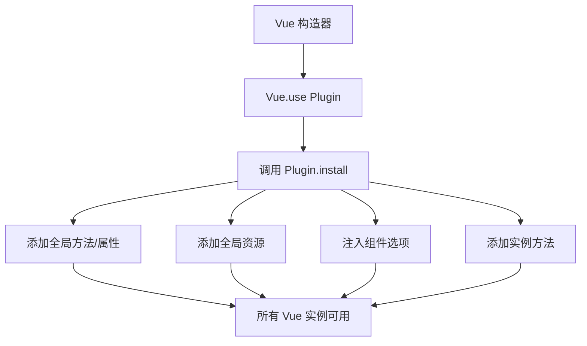
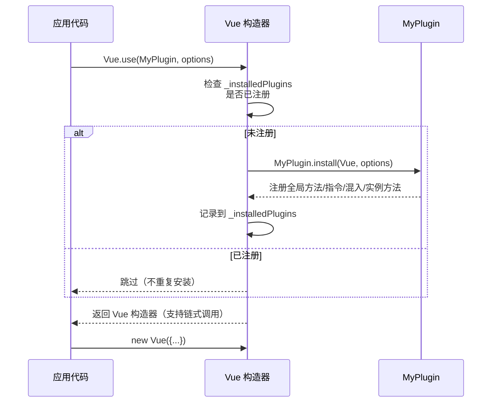

# 插件 Plugin

## 概述

插件（Plugin）是 Vue.js 中为应用添加全局功能的强大机制。与组件和混入不同，插件的作用范围更广，能够扩展 Vue 构造器本身，为所有 Vue 实例提供统一的能力增强。

### 适用场景

- 为 Vue 添加全局方法或属性
- 添加全局资源：指令、过滤器、过渡等
- 通过全局混入添加组件选项
- 添加 Vue 实例方法
- 提供完整的库，整合多种功能

### 插件架构



---

## 使用插件

### 基本用法

通过全局方法 `Vue.use()` 使用插件，必须在创建 Vue 实例之前调用：

```javascript
// 调用 MyPlugin.install(Vue)
Vue.use(MyPlugin)

new Vue({
  // ...组件选项
})
```

### 传递配置选项

`Vue.use()` 接受第二个参数用于配置插件：

```javascript
Vue.use(MyPlugin, {
  someOption: true,
  baseUrl: 'https://api.example.com'
})
```

### 插件注册机制

| 特性                | 说明                                       |
| ------------------- | ------------------------------------------ |
| 自动去重            | 多次调用 `Vue.use` 同一插件只会注册一次     |
| 全局生效            | 插件注册后影响所有后续创建的 Vue 实例       |
| 必须在 `new Vue` 前 | 确保插件在应用启动前完成初始化              |

### Vue.use() 安装流程



### 模块环境中的使用

在 CommonJS 或 ES Module 环境中，需要显式调用 `Vue.use()`：

```javascript
// CommonJS 环境
var Vue = require('vue')
var VueRouter = require('vue-router')

// 必须显式调用
Vue.use(VueRouter)

// ES Module 环境
import Vue from 'vue'
import VueRouter from 'vue-router'

Vue.use(VueRouter)
```

> **提示**：Vue.js 官方插件（如 `vue-router`）在检测到 Vue 是全局变量时会自动调用 `Vue.use()`，但在模块环境中必须手动调用。

---

## 开发插件

### 插件结构

Vue.js 插件如果是对象形式，必须暴露一个 `install` 方法，该方法会在 `Vue.use()` 调用时执行：

```javascript
const MyPlugin = {
  install: function (Vue, options) {
    // 插件逻辑
  }
}
```

或使用函数形式（函数本身会被直接作为 install 方法调用，无需再挂载 install 属性）：

```javascript
function MyPlugin (Vue, options) {
  // 插件逻辑
}
```

### install 方法参数

| 参数      | 类型           | 说明                          |
| --------- | -------------- | ----------------------------- |
| Vue       | Function       | Vue 构造器                    |
| options   | Object         | 用户传入的配置选项（可选）    |

### 完整插件示例

```javascript
const MyPlugin = {
  install: function (Vue, options) {
    // 1. 添加全局方法或属性
    Vue.myGlobalMethod = function () {
      console.log('全局方法被调用')
    }

    // 2. 添加全局资源（指令、过滤器等）
    Vue.directive('my-directive', {
      bind: function (el, binding, vnode, oldVnode) {
        el.style.color = binding.value
      }
    })

    // 3. 注入组件选项（全局混入）
    Vue.mixin({
      created: function () {
        console.log('组件已创建')
      }
    })

    // 4. 添加实例方法
    Vue.prototype.$myMethod = function (methodOptions) {
      console.log('实例方法被调用')
    }

    // 5. 添加实例属性
    Vue.prototype.$myProperty = '实例属性'
  }
}
```

---

## 插件类型详解

### 类型一：添加全局方法或属性

将方法或属性直接添加到 Vue 构造器上：

```javascript
const GlobalMethodPlugin = {
  install: function (Vue, options) {
    // 添加全局方法
    Vue.isProduction = function () {
      return options && options.env === 'production'
    }

    // 添加全局属性
    Vue.pluginVersion = '1.0.0'
  }
}

// 使用
Vue.use(GlobalMethodPlugin, { env: 'production' })
console.log(Vue.isProduction()) // true
console.log(Vue.pluginVersion)  // '1.0.0'
```

### 类型二：添加全局资源

包括指令、过滤器、过渡组件等：

```javascript
const GlobalResourcePlugin = {
  install: function (Vue, options) {
    // 添加自定义指令
    Vue.directive('focus', {
      inserted: function (el) {
        el.focus()
      }
    })

    // 添加过滤器（Vue 2.x）
    Vue.filter('currency', function (value, symbol) {
      symbol = symbol || '¥'
      return symbol + Number(value).toFixed(2)
    })

    // 添加过渡组件
    Vue.component('my-transition', {
      template: '<transition name="fade"><slot></slot></transition>'
    })
  }
}

// 使用
Vue.use(GlobalResourcePlugin)
```

```html
<!-- 模板中使用 -->
<input v-focus>
<span>{{ price | currency('$') }}</span>
```

### 类型三：通过全局混入注入选项

适合为所有组件添加统一的行为：

```javascript
const MixinPlugin = {
  install: function (Vue, options) {
    Vue.mixin({
      created: function () {
        // 全局日志记录
        if (options && options.debug) {
          console.log('[Debug] Component created:', this.$options.name)
        }
      },
      methods: {
        // 全局方法
        $log: function (message) {
          console.log('[' + this.$options.name + ']', message)
        }
      }
    })
  }
}

// 使用
Vue.use(MixinPlugin, { debug: true })
```

### 类型四：添加实例方法

将方法添加到 `Vue.prototype`，使其在所有 Vue 实例中可用：

```javascript
const InstanceMethodPlugin = {
  install: function (Vue, options) {
    // HTTP 请求方法
    Vue.prototype.$http = function (url, method, data) {
      var self = this
      return fetch(url, {
        method: method || 'GET',
        body: JSON.stringify(data),
        headers: { 'Content-Type': 'application/json' }
      }).then(function (response) {
        return response.json()
      })
    }

    // 消息提示方法
    Vue.prototype.$message = function (msg, type) {
      type = type || 'info'
      console.log('[' + type.toUpperCase() + ']', msg)
    }
  }
}

// 在组件中使用
export default {
  methods: {
    fetchData: function () {
      this.$http('/api/data', 'GET')
        .then(function (data) {
          this.$message('数据加载成功', 'success')
        })
    }
  }
}
```

### 类型五：完整的库

结合多种功能，提供完整的解决方案：

```javascript
// 简化的路由插件示例
const SimpleRouter = {
  install: function (Vue, options) {
    var routes = options.routes || []
    var currentRoute = window.location.hash.slice(1) || '/'

    // 1. 添加全局属性
    Vue.$routes = routes

    // 2. 添加实例属性
    Vue.prototype.$route = {
      path: currentRoute,
      params: {},
      query: {}
    }

    // 3. 添加实例方法
    Vue.prototype.$push = function (path) {
      window.location.hash = path
      this.$route.path = path
    }

    // 4. 注册全局组件
    Vue.component('router-view', {
      render: function (createElement) {
        var currentPath = this.$route.path
        var route = routes.find(function (r) {
          return r.path === currentPath
        })
        return route ? createElement(route.component) : createElement('div')
      }
    })

    // 5. 监听路由变化
    window.addEventListener('hashchange', function () {
      currentRoute = window.location.hash.slice(1) || '/'
      Vue.prototype.$route.path = currentRoute
    })
  }
}
```

---

## 实际应用示例

### 示例一：通知插件

```javascript
const NotificationPlugin = {
  install: function (Vue, options) {
    var defaultDuration = (options && options.duration) || 3000

    Vue.prototype.$notify = function (message, type, duration) {
      type = type || 'info'
      duration = duration || defaultDuration

      // 创建通知元素
      var notification = document.createElement('div')
      notification.className = 'notification notification-' + type
      notification.textContent = message
      notification.style.cssText = 
        'position: fixed; top: 20px; right: 20px; padding: 15px 20px;' +
        'background: #fff; border-radius: 4px; box-shadow: 0 2px 8px rgba(0,0,0,0.15);' +
        'z-index: 9999;'

      document.body.appendChild(notification)

      // 自动移除
      setTimeout(function () {
        notification.style.opacity = '0'
        notification.style.transition = 'opacity 0.3s'
        setTimeout(function () {
          document.body.removeChild(notification)
        }, 300)
      }, duration)
    }
  }
}

// 使用
Vue.use(NotificationPlugin, { duration: 5000 })

// 在组件中调用
this.$notify('操作成功！', 'success')
this.$notify('发生错误！', 'error', 10000)
```

### 示例二：本地存储插件

```javascript
const StoragePlugin = {
  install: function (Vue, options) {
    var prefix = (options && options.prefix) || 'app_'

    Vue.prototype.$storage = {
      get: function (key, defaultValue) {
        var value = localStorage.getItem(prefix + key)
        try {
          return value ? JSON.parse(value) : defaultValue
        } catch (e) {
          return value || defaultValue
        }
      },
      set: function (key, value) {
        localStorage.setItem(prefix + key, JSON.stringify(value))
      },
      remove: function (key) {
        localStorage.removeItem(prefix + key)
      },
      clear: function () {
        Object.keys(localStorage)
          .filter(function (key) { return key.startsWith(prefix) })
          .forEach(function (key) { localStorage.removeItem(key) })
      }
    }
  }
}

// 使用
Vue.use(StoragePlugin, { prefix: 'myapp_' })

// 在组件中调用
var user = this.$storage.get('user', {})
this.$storage.set('user', { name: '张三', age: 25 })
this.$storage.remove('user')
```

### 示例三：验证插件

```javascript
const ValidationPlugin = {
  install: function (Vue, options) {
    var rules = {
      required: function (value) {
        return value !== null && value !== undefined && value !== ''
      },
      email: function (value) {
        return /^[^\s@]+@[^\s@]+\.[^\s@]+$/.test(value)
      },
      minLength: function (value, length) {
        return value && value.length >= length
      },
      maxLength: function (value, length) {
        return value && value.length <= length
      }
    }

    Vue.prototype.$validate = function (data, schema) {
      var errors = {}
      var isValid = true

      Object.keys(schema).forEach(function (field) {
        var fieldRules = schema[field]
        var value = data[field]

        fieldRules.forEach(function (rule) {
          var ruleName = typeof rule === 'string' ? rule : rule.name
          var ruleParam = typeof rule === 'object' ? rule.param : null
          var ruleMessage = typeof rule === 'object' ? rule.message : null

          if (rules[ruleName]) {
            var valid = ruleParam 
              ? rules[ruleName](value,%20ruleParam)
              : rules[ruleName](value)

            if (!valid) {
              isValid = false
              if (!errors[field]) errors[field] = []
              errors[field].push(ruleMessage || field + ' ' + ruleName + ' 验证失败')
            }
          }
        })
      })

      return { isValid: isValid, errors: errors }
    }
  }
}

// 使用
Vue.use(ValidationPlugin)

// 在组件中调用
var result = this.$validate(
  { username: 'ab', email: 'invalid' },
  {
    username: [
      { name: 'required', message: '用户名必填' },
      { name: 'minLength', param: 3, message: '用户名至少3个字符' }
    ],
    email: [
      { name: 'required', message: '邮箱必填' },
      { name: 'email', message: '邮箱格式不正确' }
    ]
  }
)
console.log(result)
// { isValid: false, errors: { username: ['用户名至少3个字符'], email: ['邮箱格式不正确'] } }
```

### 示例四：权限控制插件

```javascript
const PermissionPlugin = {
  install: function (Vue, options) {
    var permissions = (options && options.permissions) || []

    // 添加实例方法检查权限
    Vue.prototype.$can = function (permission) {
      return permissions.includes(permission)
    }

    // 添加指令控制元素显示
    Vue.directive('permission', {
      inserted: function (el, binding) {
        var permission = binding.value
        if (!permissions.includes(permission)) {
          el.parentNode && el.parentNode.removeChild(el)
        }
      }
    })

    // 全局混入添加路由守卫逻辑
    Vue.mixin({
      beforeCreate: function () {
        var requiresAuth = this.$options.requiresAuth
        if (requiresAuth && !this.$can('authenticated')) {
          console.warn('需要登录权限')
        }
      }
    })
  }
}

// 使用
Vue.use(PermissionPlugin, {
  permissions: ['read', 'write', 'delete', 'authenticated']
})

// 在组件中使用
new Vue({
  requiresAuth: true,
  template: 
    '<div>' +
      '<button v-permission="\'read\'">查看</button>' +
      '<button v-permission="\'write\'">编辑</button>' +
      '<button v-permission="\'admin\'">管理</button>' +
    '</div>'
})
```

---

## API 参考

### Vue.use(plugin, options)

注册 Vue.js 插件。

#### 参数

| 参数     | 类型              | 必填 | 说明                                  |
| -------- | ----------------- | ---- | ------------------------------------- |
| plugin   | Object / Function | 是   | 插件对象或函数，必须包含 install 方法 |
| options  | Object            | 否   | 传递给插件 install 方法的配置选项     |

#### 返回值

返回 Vue 构造器本身，支持链式调用。

#### 示例

```javascript
// 使用对象形式插件
Vue.use(MyPlugin, { option1: 'value1' })

// 使用函数形式插件
Vue.use(function (Vue, options) {
  // 插件逻辑
})

// 链式调用
Vue
  .use(PluginA)
  .use(PluginB)
  .use(PluginC)
```

---

## 优缺点分析

### 优点

| 优点           | 说明                                     |
| -------------- | ---------------------------------------- |
| 功能扩展性强   | 可扩展 Vue 构造器的各种能力              |
| 全局可用       | 一次注册，所有组件共享                   |
| 模块化开发     | 将功能封装成独立模块，便于维护           |
| 易于分发       | 可作为 npm 包发布和复用                  |
| 配置灵活       | 支持传入配置选项，适应不同场景           |

### 缺点

| 缺点         | 说明                                       |
| ------------ | ------------------------------------------ |
| 命名冲突风险 | 多个插件可能添加相同名称的方法或属性        |
| 全局污染     | 过多全局方法可能影响代码可维护性            |
| 调试困难     | 问题可能出现在插件内部，难以追踪            |
| 隐式依赖     | 组件依赖插件功能，但关系不够明确            |
| 版本兼容性   | 插件可能与特定 Vue 版本绑定                |

---

## 最佳实践

### 1. 插件命名规范

```javascript
// 推荐：使用有意义的命名前缀
const MyNotificationPlugin = { /* ... */ }
const MyStoragePlugin = { /* ... */ }

// 实例方法命名使用 $ 前缀
Vue.prototype.$myMethod = function () { }
```

### 2. 提供默认配置

```javascript
const MyPlugin = {
  install: function (Vue, options) {
    // 合并默认配置
    var settings = Object.assign({
      debug: false,
      timeout: 3000,
      baseUrl: '/'
    }, options)

    // 使用配置
    if (settings.debug) {
      console.log('Plugin initialized with:', settings)
    }
  }
}
```

### 3. 文档化插件

```javascript
/**
 * MyPlugin - Vue.js 插件示例
 * 
 * @description 提供 XXX 功能
 * @version 1.0.0
 * 
 * @param {Object} Vue - Vue 构造器
 * @param {Object} options - 配置选项
 * @param {boolean} [options.debug=false] - 是否开启调试模式
 * @param {number} [options.timeout=3000] - 超时时间
 * 
 * @example
 * Vue.use(MyPlugin, { debug: true })
 */
const MyPlugin = {
  install: function (Vue, options) {
    // ...
  }
}
```

### 4. 避免全局污染

```javascript
// 不推荐：直接添加大量全局方法
Vue.myMethod1 = function () { }
Vue.myMethod2 = function () { }
Vue.myMethod3 = function () { }

// 推荐：使用命名空间
Vue.myPlugin = {
  method1: function () { },
  method2: function () { },
  method3: function () { }
}
```

### 5. 支持多种引入方式

```javascript
// 插件入口文件
const MyPlugin = {
  install: function (Vue, options) {
    // ...
  }
}

// 支持 CommonJS
if (typeof module !== 'undefined' && module.exports) {
  module.exports = MyPlugin
}

// 支持 ES Module
export default MyPlugin

// 支持浏览器 script 标签
if (typeof window !== 'undefined' && window.Vue) {
  window.Vue.use(MyPlugin)
}
```

### 6. 提供类型定义（TypeScript）

```typescript
// types/index.d.ts
declare module 'my-vue-plugin' {
  import { PluginObject } from 'vue'

  interface MyPluginOptions {
    debug?: boolean
    timeout?: number
  }

  interface MyPluginMethods {
    $myMethod(): void
  }

  const MyPlugin: PluginObject<MyPluginOptions>
  export default MyPlugin
}
```

---

## 常见问题

### Q1: 插件和混入有什么区别？

| 特性       | 插件                   | 混入                 |
| ---------- | ---------------------- | -------------------- |
| 作用范围   | 全局                   | 组件级别             |
| 注册方式   | `Vue.use()`            | `mixins: []`         |
| 功能类型   | 扩展 Vue 能力          | 复用组件逻辑         |
| 初始化时机 | 应用启动前             | 组件创建时           |

### Q2: 如何在插件中使用 Vue Router 或 Vuex？

```javascript
const MyPlugin = {
  install: function (Vue, options) {
    // 确保 VueRouter 已注册
    if (Vue._installedPlugins && Vue._installedPlugins.some(function (p) {
      return p.name === 'VueRouter'
    })) {
      Vue.mixin({
        mounted: function () {
          // 可以访问 this.$router
          console.log('当前路由:', this.$route.path)
        }
      })
    }
  }
}
```

### Q3: 插件可以卸载吗？

Vue.js 不提供内置的插件卸载机制。如果需要卸载功能，需要自行实现：

```javascript
const MyPlugin = {
  install: function (Vue, options) {
    // 保存原始方法的引用
    var originalMethod = Vue.prototype.$myMethod
    
    Vue.prototype.$myMethod = function () {
      // 新方法
    }
    
    // 提供卸载方法
    MyPlugin.uninstall = function (Vue) {
      Vue.prototype.$myMethod = originalMethod
    }
  }
}

// 卸载
MyPlugin.uninstall(Vue)
```

### Q4: 多个插件有相同的方法名会怎样？

后注册的插件会覆盖先注册插件的同名方法：

```javascript
Vue.use(PluginA) // 添加 $method
Vue.use(PluginB) // 添加同名 $method，覆盖 PluginA 的

// 建议：使用命名前缀避免冲突
Vue.prototype.$pluginA_method = function () { }
Vue.prototype.$pluginB_method = function () { }
```

### Q5: 如何开发一个 Vue CLI 插件？

Vue CLI 插件与运行时插件不同，它用于扩展项目构建配置：

```javascript
// vue-cli-plugin-example/generator.js
module.exports = function (api, options, rootOptions) {
  // 扩展 package.json
  api.extendPackage({
    dependencies: {
      'axios': '^0.21.0'
    }
  })

  // 复制模板文件
  api.render('./template')

  // 修改 main.js
  api.injectImports(api.entryFile, `import './plugins/myPlugin'`)
}
```

---

## 相关资源

- [Vue.js 官方文档 - 插件](https://v2.cn.vuejs.org/v2/guide/plugins.html)
- [Vue.js 官方文档 - API](https://v2.cn.vuejs.org/v2/api/#Vue-use)
- [awesome-vue](https://github.com/vuejs/awesome-vue#components--libraries) - 社区插件集合
