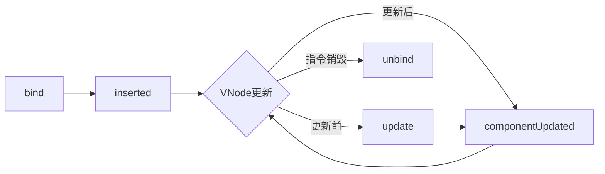
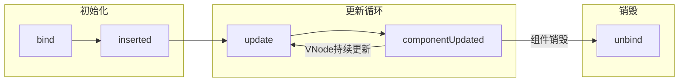

# 自定义指令

## 概述

在 Vue 2.0 中,代码复用和抽象的主要形式是组件。然而,在某些场景下,我们仍然需要对普通 DOM 元素进行底层操作,例如:

- 输入框自动聚焦
- 权限控制(按钮显隐)
- 图片懒加载
- 防抖/节流处理
- 点击外部关闭弹窗
- 拖拽交互

这时候就需要使用**自定义指令**。自定义指令提供了一种机制,可以在 Vue 编译过程中对 DOM 元素进行底层操作。

## 基本用法

### 全局注册

使用 `Vue.directive()` 方法全局注册指令,所有组件都可以使用:

```html
<div id="app">
  <input v-focus placeholder="自动获取焦点">
</div>
```

```javascript
// 注册全局自定义指令 v-focus
Vue.directive('focus', {
  // 当被绑定的元素插入到 DOM 中时
  inserted: function (el) {
    el.focus() // 聚焦元素
  }
})

new Vue({
  el: '#app'
})
```

当页面加载时,该元素将自动获得焦点。注意:`autofocus` 属性在移动版 Safari 上不工作,而自定义指令可以完美解决这个问题。

### 局部注册

在组件中使用 `directives` 选项进行局部注册,该指令仅在该组件中可用:

```javascript
export default {
  directives: {
    focus: {
      // 指令的定义
      inserted: function (el) {
        el.focus()
      }
    }
  }
}
```

使用方式:

```html
<input v-focus>
```

### 注册方式对比

| 注册方式 | 作用范围 | 使用场景 | 性能影响 |
|---------|---------|---------|---------|
| 全局注册 | 所有组件 | 通用功能(权限、懒加载等) | 轻微增加初始化开销 |
| 局部注册 | 当前组件 | 特定业务逻辑 | 无额外开销 |

**建议**: 对于通用性强的指令(如权限控制、懒加载),推荐全局注册;对于特定业务相关的指令,推荐局部注册。

## 钩子函数

一个指令定义对象可以提供以下钩子函数(均为可选):

### 钩子函数生命周期



### 钩子函数详解

#### bind

- **调用时机**: 只调用一次,指令第一次绑定到元素时
- **用途**: 进行一次性的初始化设置
- **注意**: 此时元素还未插入 DOM,父节点不存在

```javascript
Vue.directive('my-directive', {
  bind: function (el, binding) {
    // 初始化样式
    el.style.color = binding.value
  }
})
```

#### inserted

- **调用时机**: 被绑定元素插入父节点时(仅保证父节点存在,但不一定已被插入文档中)
- **用途**: 操作 DOM 或访问父元素
- **注意**: 此时元素已经插入 DOM

```javascript
Vue.directive('focus', {
  inserted: function (el) {
    el.focus() // DOM 操作必须在 inserted 后
  }
})
```

#### update

- **调用时机**: 所在组件的 VNode 更新时调用,**但是可能发生在其子 VNode 更新之前**
- **用途**: 响应数据变化,更新 DOM
- **注意**: 可以通过比较更新前后的值来忽略不必要的模板更新

```javascript
Vue.directive('my-directive', {
  update: function (el, binding) {
    if (binding.value !== binding.oldValue) {
      // 只有值改变时才更新
      el.style.color = binding.value
    }
  }
})
```

#### componentUpdated

- **调用时机**: 指令所在组件的 VNode **及其子 VNode** 全部更新后调用
- **用途**: 确保所有子元素更新完成后再执行操作

```javascript
Vue.directive('my-directive', {
  componentUpdated: function (el, binding) {
    // 所有子元素都已更新完成
    console.log('组件及其子元素已全部更新')
  }
})
```

#### unbind

- **调用时机**: 只调用一次,指令与元素解绑时调用
- **用途**: 清理工作,移除事件监听器等

```javascript
Vue.directive('my-directive', {
  unbind: function (el) {
    // 清理事件监听器
    el.removeEventListener('click', el._handleClick)
  }
})
```

### 钩子函数调用顺序

指令的生命周期中，钩子函数在不同阶段的调用顺序：



## 钩子函数参数

指令钩子函数会被传入以下参数:

### 参数列表

| 参数 | 类型 | 说明 | 可修改性 |
|------|------|------|---------|
| el | HTMLElement | 指令所绑定的元素 | ✅ 可修改 |
| binding | Object | 包含指令信息的对象 | ❌ 只读 |
| vnode | VNode | Vue 编译生成的虚拟节点 | ❌ 只读 |
| oldVnode | VNode | 上一个虚拟节点 | ❌ 只读 |

### binding 对象属性

`binding` 对象包含以下属性:

| 属性 | 类型 | 说明 | 示例 |
|------|------|------|------|
| name | String | 指令名,不包括 `v-` 前缀 | `'my-directive'` |
| value | any | 指令的绑定值 | `v-my="1 + 1"` 中,value 为 `2` |
| oldValue | any | 指令绑定的前一个值 | 仅在 `update` 和 `componentUpdated` 中可用 |
| expression | String | 字符串形式的指令表达式 | `v-my="1 + 1"` 中,expression 为 `"1 + 1"` |
| arg | String | 传给指令的参数,可选 | `v-my:foo` 中,arg 为 `"foo"` |
| modifiers | Object | 包含修饰符的对象 | `v-my.foo.bar` 中,modifiers 为 `{ foo: true, bar: true }` |

### 完整示例


```html
<!DOCTYPE html>
<html>
  <head>
    <meta charset="utf-8">
    <title>自定义指令参数示例</title>
    <script src="https://cdn.jsdelivr.net/npm/vue@2/dist/vue.js"></script>
  </head>
  <body>
    <div id="app" v-demo:foo.a.b="message"></div>
    <script>
      Vue.directive('demo', {
        bind: function (el, binding, vnode) {
          var s = JSON.stringify
          el.innerHTML =
            'name: ' + s(binding.name) + '<br>' +
            'value: ' + s(binding.value) + '<br>' +
            'expression: ' + s(binding.expression) + '<br>' +
            'argument: ' + s(binding.arg) + '<br>' +
            'modifiers: ' + s(binding.modifiers) + '<br>' +
            'vnode keys: ' + Object.keys(vnode).join(', ')
        }
      })
      
      new Vue({
        el: '#app',
        data: {
          message: 'hello!'
        }
      })
    </script>
  </body>
</html>
```

输出结果:

```
name: "demo"
value: "hello!"
expression: "message"
argument: "foo"
modifiers: {"a":true,"b":true}
vnode keys: tag, data, children, ...
```

> **重要提示**: 除了 `el` 之外,其它参数都应该是只读的,切勿进行修改。如果需要在钩子之间共享数据,建议通过元素的 [`dataset`](https://developer.mozilla.org/zh-CN/docs/Web/API/HTMLElement/dataset) 来进行。

## 动态指令参数

### 基本概念

指令的参数可以是动态的。在 `v-mydirective:[argument]="value"` 中,`argument` 参数可以根据组件实例数据进行更新,这使得自定义指令更加灵活。

### 基础示例

创建一个固定定位指令:

```html
<div id="baseexample">
  <p>向下滚动页面查看效果</p>
  <p v-pin="200">固定在距离页面顶部 200px 的位置</p>
</div>
```

```javascript
Vue.directive('pin', {
  bind: function (el, binding, vnode) {
    el.style.position = 'fixed'
    el.style.top = binding.value + 'px'
  }
})

new Vue({
  el: '#baseexample'
})
```

这会把该元素固定在距离页面顶部 200 像素的位置。

### 动态参数示例

如果需要灵活控制固定位置(顶部或左侧),可以使用动态参数:

```html
<div id="dynamicexample">
  <h3>向下滚动查看效果 ↓</h3>
  <p v-pin:[direction]="200">我固定在页面距离 {{ direction }} 200px 的位置</p>
  
  <button @click="direction = 'top'">固定在顶部</button>
  <button @click="direction = 'left'">固定在左侧</button>
</div>
```

```javascript
Vue.directive('pin', {
  bind: function (el, binding, vnode) {
    el.style.position = 'fixed'
    var s = (binding.arg == 'left' ? 'left' : 'top')
    el.style[s] = binding.value + 'px'
    // 记录当前参数，供 update 中对比（binding 上没有 oldArg 属性）
    el._pinArg = binding.arg
  },
  
  update: function (el, binding) {
    // 动态参数或绑定值更新时重新设置位置
    if (binding.arg !== el._pinArg || binding.value !== binding.oldValue) {
      var oldProp = (el._pinArg == 'left' ? 'left' : 'top')
      var newProp = (binding.arg == 'left' ? 'left' : 'top')
      
      el.style[oldProp] = 'auto'
      el.style[newProp] = binding.value + 'px'
      el._pinArg = binding.arg
    }
  }
})

new Vue({
  el: '#dynamicexample',
  data: function () {
    return {
      direction: 'top'
    }
  }
})
```

这样自定义指令就可以根据不同的动态参数灵活地适应各种用例。

## 函数简写

### 使用场景

在很多时候,你想在 `bind` 和 `update` 时触发相同行为,而不关心其它的钩子。这时可以使用函数简写形式:

```javascript
Vue.directive('color-swatch', function (el, binding) {
  // 这个函数会在 bind 和 update 时都调用
  el.style.backgroundColor = binding.value
})
```

### 等价形式

函数简写等价于:

```javascript
Vue.directive('color-swatch', {
  bind: function (el, binding) {
    el.style.backgroundColor = binding.value
  },
  update: function (el, binding) {
    el.style.backgroundColor = binding.value
  }
})
```

### 适用场景

| 场景 | 是否适用 | 说明 |
|------|---------|------|
| 样式绑定 | ✅ | 设置元素的样式属性 |
| 属性绑定 | ✅ | 动态设置元素属性 |
| 事件监听 | ❌ | 需要在 unbind 中清理,不能使用简写 |
| DOM 操作 | ✅ | 简单的 DOM 操作 |

## 对象字面量

### 基本用法

如果指令需要多个值,可以传入一个 JavaScript 对象字面量:

```html
<div v-demo="{ color: 'white', text: 'hello!' }"></div>
```

```javascript
Vue.directive('demo', function (el, binding) {
  console.log(binding.value.color) // => "white"
  console.log(binding.value.text)  // => "hello!"
  
  el.style.color = binding.value.color
  el.textContent = binding.value.text
})
```

### 复杂对象示例

```html
<template>
  <div v-resize="{
    handler: handleResize,
    debounce: 300,
    immediate: true
  }">
    响应式元素
  </div>
</template>

<script>
export default {
  directives: {
    resize: {
      bind: function (el, binding) {
        const { handler, debounce, immediate } = binding.value
        
        let timer = null
        el._handleResize = function() {
          if (debounce) {
            clearTimeout(timer)
            timer = setTimeout(() => {
              handler(el.offsetWidth, el.offsetHeight)
            }, debounce)
          } else {
            handler(el.offsetWidth, el.offsetHeight)
          }
        }
        
        window.addEventListener('resize', el._handleResize)
        
        if (immediate) {
          el._handleResize()
        }
      },
      
      unbind: function (el) {
        window.removeEventListener('resize', el._handleResize)
        delete el._handleResize
      }
    }
  },
  
  methods: {
    handleResize(width, height) {
      console.log('元素尺寸:', width, height)
    }
  }
}
</script>
```

## 实际应用示例

### 1. 权限控制指令

根据用户权限控制元素的显示隐藏:

```javascript
// 全局注册
Vue.directive('permission', {
  inserted: function (el, binding, vnode) {
    const { value } = binding
    const permissions = vnode.context.$store.state.user.permissions
    
    if (value && !permissions.includes(value)) {
      el.parentNode && el.parentNode.removeChild(el)
    }
  }
})
```

使用方式:

```html
<!-- 只有拥有 'admin' 权限的用户才能看到此按钮 -->
<button v-permission="'admin'">删除用户</button>

<!-- 多个权限(满足其一即可) -->
<button v-permission="['admin', 'editor']">编辑文章</button>
```

优化版本(支持数组权限):

```javascript
Vue.directive('permission', {
  inserted: function (el, binding, vnode) {
    const { value } = binding
    const permissions = vnode.context.$store.state.user.permissions
    
    if (value) {
      const requiredPermissions = Array.isArray(value) ? value : [value]
      const hasPermission = requiredPermissions.some(p => permissions.includes(p))
      
      if (!hasPermission) {
        el.parentNode && el.parentNode.removeChild(el)
      }
    }
  }
})
```

### 2. 图片懒加载指令

```javascript
Vue.directive('lazy', {
  inserted: function (el, binding) {
    // 使用 IntersectionObserver 监听元素是否进入视口
    const observer = new IntersectionObserver((entries) => {
      entries.forEach(entry => {
        if (entry.isIntersecting) {
          el.src = binding.value
          observer.unobserve(el)
        }
      })
    }, {
      threshold: 0.1
    })
    
    observer.observe(el)
    el._observer = observer
  },
  
  unbind: function (el) {
    if (el._observer) {
      el._observer.unobserve(el)
      delete el._observer
    }
  }
})
```

使用方式:

```html

```

### 3. 防抖指令

```javascript
Vue.directive('debounce', {
  inserted: function (el, binding) {
    let timer = null
    const delay = binding.arg ? parseInt(binding.arg) : 500
    
    el.addEventListener('click', () => {
      if (timer) {
        clearTimeout(timer)
      }
      
      timer = setTimeout(() => {
        binding.value()
      }, delay)
    })
  }
})
```

使用方式:

```html
<!-- 默认 500ms 防抖 -->
<button v-debounce="handleClick">提交</button>

<!-- 自定义防抖时间(毫秒) -->
<button v-debounce:1000="handleClick">提交</button>
```

### 4. 点击外部关闭

```javascript
Vue.directive('click-outside', {
  bind: function (el, binding, vnode) {
    el._handleClickOutside = function(event) {
      // 检查点击是否在元素外部
      if (!(el === event.target || el.contains(event.target))) {
        vnode.context[binding.expression](event)
      }
    }
    
    document.addEventListener('click', el._handleClickOutside)
  },
  
  unbind: function (el) {
    document.removeEventListener('click', el._handleClickOutside)
    delete el._handleClickOutside
  }
})
```

使用方式:

```html
<template>
  <div class="dropdown" v-if="showDropdown">
    <div class="dropdown-content">
      下拉菜单内容
    </div>
  </div>
</template>

<script>
export default {
  directives: {
    'click-outside': {
      bind: function (el, binding, vnode) {
        el._handleClickOutside = function(event) {
          if (!(el === event.target || el.contains(event.target))) {
            vnode.context[binding.expression](event)
          }
        }
        document.addEventListener('click', el._handleClickOutside)
      },
      unbind: function (el) {
        document.removeEventListener('click', el._handleClickOutside)
        delete el._handleClickOutside
      }
    }
  },
  
  data() {
    return {
      showDropdown: false
    }
  },
  
  methods: {
    closeDropdown() {
      this.showDropdown = false
    }
  }
}
</script>
```

### 5. 复制文本指令

```javascript
Vue.directive('copy', {
  bind: function (el, binding) {
    el._handleCopy = function() {
      const text = binding.value || el.textContent
      
      // 创建临时文本区域
      const textarea = document.createElement('textarea')
      textarea.value = text
      textarea.style.position = 'fixed'
      textarea.style.opacity = '0'
      document.body.appendChild(textarea)
      
      // 选择并复制
      textarea.select()
      const success = document.execCommand('copy')
      document.body.removeChild(textarea)
      
      // 触发自定义事件
      el.dispatchEvent(new CustomEvent('copy', { 
        detail: { success, text } 
      }))
    }
    
    el.addEventListener('click', el._handleCopy)
  },
  
  unbind: function (el) {
    el.removeEventListener('click', el._handleCopy)
    delete el._handleCopy
  }
})
```

使用方式:

```html
<!-- 复制元素文本 -->
<button v-copy>复制这段文字</button>

<!-- 复制指定文本 -->
<button v-copy="textToCopy">复制</button>

<!-- 监听复制结果 -->
<button v-copy @copy="handleCopy">复制</button>
```

## 最佳实践

### 1. 命名规范

```javascript
// ✅ 推荐: 使用连字符命名
Vue.directive('lazy-load', { /* ... */ })

// ❌ 不推荐: 使用驼峰命名
Vue.directive('lazyLoad', { /* ... */ })
```

### 2. 数据共享

使用 `dataset` 在钩子函数间共享数据:

```javascript
Vue.directive('my-directive', {
  bind: function (el, binding) {
    // 存储数据
    el.dataset.someData = 'value'
    el._customData = 'another value'
  },
  
  update: function (el, binding) {
    // 读取数据
    console.log(el.dataset.someData)
    console.log(el._customData)
  },
  
  unbind: function (el) {
    // 清理数据
    delete el.dataset.someData
    delete el._customData
  }
})
```

### 3. 性能优化

在 `update` 钩子中比较新旧值,避免不必要的 DOM 操作:

```javascript
Vue.directive('my-directive', {
  update: function (el, binding) {
    // ✅ 只有值改变时才更新
    if (binding.value !== binding.oldValue) {
      // 执行 DOM 操作
    }
  }
})
```

### 4. 清理工作

在 `unbind` 钩子中清理事件监听器、定时器等:

```javascript
Vue.directive('my-directive', {
  bind: function (el, binding) {
    el._handleResize = () => { /* ... */ }
    window.addEventListener('resize', el._handleResize)
    
    el._timer = setInterval(() => { /* ... */ }, 1000)
  },
  
  unbind: function (el) {
    // ✅ 清理事件监听器
    window.removeEventListener('resize', el._handleResize)
    delete el._handleResize
    
    // ✅ 清理定时器
    clearInterval(el._timer)
    delete el._timer
  }
})
```

### 5. 错误处理

添加适当的错误处理:

```javascript
Vue.directive('my-directive', {
  inserted: function (el, binding) {
    try {
      // 执行可能出错的操作
      el.focus()
    } catch (error) {
      console.warn('指令执行失败:', error)
    }
  }
})
```

### 6. 可配置性

使用对象字面量提供配置选项:

```javascript
Vue.directive('lazy', {
  inserted: function (el, binding) {
    const options = {
      threshold: 0.1,
      rootMargin: '0px',
      ...binding.value
    }
    
    // 使用配置选项
  }
})
```

使用方式:

```html

```

## 常见问题

### Q1: 指令和组件的区别是什么?

**A**: 

| 特性 | 指令 | 组件 |
|------|------|------|
| 用途 | 对 DOM 元素的底层操作 | 构建 UI 块 |
| 数据管理 | 无状态(通常) | 有状态 |
| 模板 | 无 | 有 |
| 适用场景 | 简单 DOM 操作 | 复杂业务逻辑 |
| 可复用性 | 高 | 中 |

**选择建议**:
- 如果只需要进行简单的 DOM 操作,使用指令
- 如果需要复杂的状态管理、模板和业务逻辑,使用组件

### Q2: 什么时候使用 bind,什么时候使用 inserted?

**A**:
- `bind`: 元素还未插入 DOM,适合设置样式、属性等不需要访问父节点的操作
- `inserted`: 元素已插入 DOM,适合需要访问父节点、操作 DOM 结构的操作

```javascript
Vue.directive('example', {
  bind: function (el) {
    // ✅ 设置样式
    el.style.color = 'red'
    
    // ❌ 此时父节点不存在,无法操作
    // el.parentNode.appendChild(...)
  },
  
  inserted: function (el) {
    // ✅ 访问父节点
    el.parentNode.appendChild(...)
    
    // ✅ DOM 操作(如焦点)
    el.focus()
  }
})
```

### Q3: 如何在指令中访问组件实例?

**A**: 通过 `vnode.context` 访问:

```javascript
Vue.directive('my-directive', {
  bind: function (el, binding, vnode) {
    // 访问组件数据
    const componentData = vnode.context.someData
    
    // 调用组件方法
    vnode.context.someMethod()
    
    // 访问 Vuex store
    const store = vnode.context.$store
  }
})
```

### Q4: 指令中如何实现双向绑定?

**A**: 使用 `vnode.context.$set` 或直接修改组件数据:

```javascript
Vue.directive('two-way', {
  bind: function (el, binding, vnode) {
    el.addEventListener('input', function() {
      const expression = binding.expression
      const value = el.value
      
      // 更新组件数据
      vnode.context[expression] = value
      // 或者使用 $set
      // vnode.context.$set(vnode.context, expression, value)
    })
  }
})
```

### Q5: 如何调试指令?

**A**: 添加日志输出:

```javascript
Vue.directive('debug', {
  bind: function (el, binding, vnode) {
    console.log('bind:', {
      el,
      binding,
      vnode
    })
  },
  
  inserted: function (el, binding) {
    console.log('inserted:', {
      value: binding.value,
      arg: binding.arg
    })
  },
  
  update: function (el, binding) {
    console.log('update:', {
      oldValue: binding.oldValue,
      newValue: binding.value
    })
  }
})
```

### Q6: 动态参数的限制是什么?

**A**: 动态参数表达式有一些语法约束:

```html
<!-- ✅ 有效 -->
<div v-pin:[direction]="200"></div>

<!-- ❌ 无效: 包含空格和引号 -->
<div v-pin:[direction top]="200"></div>
<div v-pin:['direction']]="200"></div>

<!-- ✅ 使用计算属性代替复杂表达式 -->
<div v-pin:[computedDirection]="200"></div>
```

## 注意事项

### 1. 参数只读性

除了 `el` 参数外,其他参数都应该是只读的:

```javascript
Vue.directive('my-directive', {
  bind: function (el, binding, vnode) {
    // ✅ 可以修改 el
    el.style.color = 'red'
    
    // ❌ 不要修改其他参数
    // binding.value = 'new value'  // 错误!
    // vnode.context = {}  // 错误!
  }
})
```

### 2. 钩子函数执行时机

理解钩子函数的执行时机对于正确使用指令至关重要:

- `bind`: 父节点为 null
- `inserted`: 父节点存在,但不一定在文档中
- `update`: 发生在子 VNode 更新之前
- `componentUpdated`: 所有子 VNode 更新完成之后

### 3. 内存泄漏

在 `unbind` 钩子中清理所有资源:

```javascript
Vue.directive('my-directive', {
  bind: function (el, binding) {
    // 保存引用以便清理
    el._eventHandler = function() { /* ... */ }
    el._timer = setInterval(function() { /* ... */ }, 1000)
    el._observer = new MutationObserver(function() { /* ... */ })
    
    window.addEventListener('resize', el._eventHandler)
    el._observer.observe(el, { attributes: true })
  },
  
  unbind: function (el) {
    // 清理所有资源
    window.removeEventListener('resize', el._eventHandler)
    clearInterval(el._timer)
    el._observer.disconnect()
    
    // 删除引用
    delete el._eventHandler
    delete el._timer
    delete el._observer
  }
})
```

### 4. SSR 兼容性

在服务端渲染(SSR)环境下,避免在 `bind` 和 `inserted` 中执行浏览器特有的操作:

```javascript
Vue.directive('my-directive', {
  bind: function (el, binding) {
    // ❌ 在 SSR 中会报错
    // window.addEventListener(...)
    
    // ✅ 检查环境
    if (typeof window !== 'undefined') {
      window.addEventListener(...)
    }
  }
})
```

### 5. 性能考虑

避免在钩子函数中执行耗时的操作:

```javascript
Vue.directive('my-directive', {
  update: function (el, binding) {
    // ❌ 避免频繁的复杂计算
    // heavyCalculation(binding.value)
    
    // ✅ 使用防抖或节流
    if (el._timer) clearTimeout(el._timer)
    el._timer = setTimeout(() => {
      heavyCalculation(binding.value)
    }, 100)
  }
})
```

## 与 Vue 3 的差异

Vue 3 对自定义指令 API 进行了简化,主要差异如下:

| Vue 2 | Vue 3 | 说明 |
|-------|-------|------|
| bind | beforeMount | 元素挂载前 |
| inserted | mounted | 元素挂载后 |
| update | ❌ 移除 | - |
| componentUpdated | updated | VNode 更新后 |
| ❌ 无 | beforeUnmount | 元素卸载前 |
| unbind | unmounted | 元素卸载后 |

Vue 3 示例:

```javascript
// Vue 3
app.directive('focus', {
  mounted(el) {
    el.focus()
  }
})
```

如果需要编写兼容 Vue 2 和 Vue 3 的指令:

```javascript
const focusDirective = {
  // Vue 2
  inserted(el) {
    el.focus()
  },
  // Vue 3
  mounted(el) {
    el.focus()
  }
}
```

## 总结

自定义指令是 Vue 提供的一种强大机制,用于对 DOM 元素进行底层操作。合理使用自定义指令可以:

1. **提高代码复用性**: 将通用的 DOM 操作封装为指令
2. **简化组件代码**: 将底层 DOM 操作从组件中分离出来
3. **增强可维护性**: 指令逻辑独立,易于测试和维护

**使用建议**:

- ✅ 适用于简单的 DOM 操作(焦点、样式、事件等)
- ✅ 适用于需要直接访问 DOM 的场景
- ❌ 不适合复杂的业务逻辑(应使用组件)
- ❌ 不适合需要状态管理的场景(应使用组件)

通过掌握自定义指令的使用方法和最佳实践,可以更好地解决实际开发中的各种需求,提升开发效率和代码质量。

---
