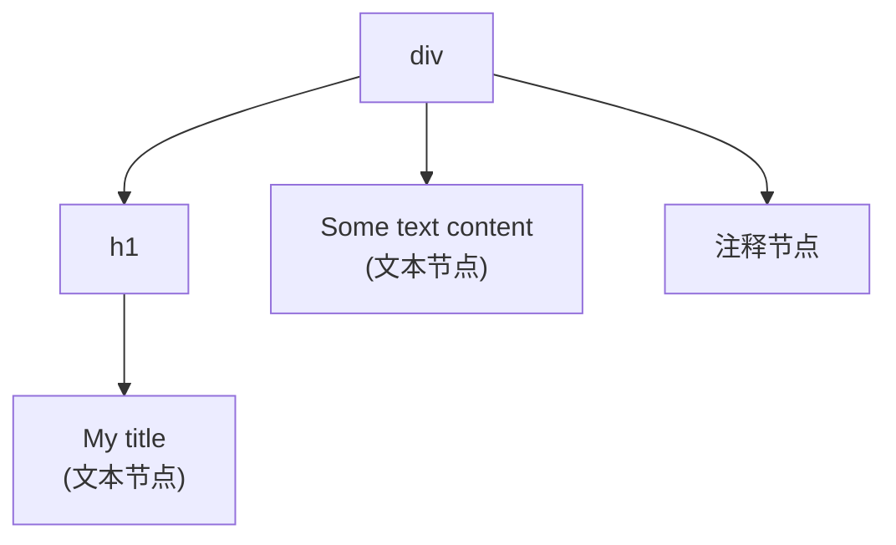

# 渲染函数与 JSX

## 概述

Vue 推荐在大多数情况下使用模板来创建 HTML。然而在一些场景中，需要 JavaScript 的完全编程能力，这时可以用**渲染函数**（Render Function），它比模板更接近编译器。

### 适用场景

| 场景 | 推荐方式 | 说明 |
|------|----------|------|
| 标准 UI 展示 | 模板 | 简单直观，易于维护 |
| 动态组件选择 | 渲染函数 | 根据条件渲染不同组件 |
| 复杂逻辑处理 | 渲染函数 | 需要编程能力的场景 |
| 高性能要求 | 函数式组件 | 无状态组件，开销更低 |
| JSX 爱好者 | JSX | 类 React 语法风格 |

### 核心优势

- **编程能力**：完整的 JavaScript 编程能力
- **灵活性**：动态生成复杂的组件结构
- **性能优化**：函数式组件开销更低
- **复用性**：便于创建高阶组件

## 基础概念

### 模板 vs 渲染函数

以动态生成带锚点的标题为例：

**期望的 HTML 结构：**

```html
<h1>
  <a name="hello-world" href="#hello-world">Hello world!</a>
</h1>
```

**组件接口设计：**

```html
<anchored-heading :level="1">Hello world!</anchored-heading>
```

**使用模板实现（冗长）：**

```html
<script type="text/x-template" id="anchored-heading-template">
  <h1 v-if="level === 1"><slot></slot></h1>
  <h2 v-else-if="level === 2"><slot></slot></h2>
  <h3 v-else-if="level === 3"><slot></slot></h3>
  <h4 v-else-if="level === 4"><slot></slot></h4>
  <h5 v-else-if="level === 5"><slot></slot></h5>
  <h6 v-else-if="level === 6"><slot></slot></h6>
</script>

<script>
  Vue.component('anchored-heading', {
    template: '#anchored-heading-template',
    props: {
      level: {
        type: Number,
        required: true
      }
    }
  })
</script>
```

**使用渲染函数实现（简洁）：**

```javascript
Vue.component('anchored-heading', {
  render: function (createElement) {
    return createElement(
      'h' + this.level,   // 标签名称
      this.$slots.default // 子节点数组
    )
  },
  props: {
    level: {
      type: Number,
      required: true
    }
  }
})
```

### 节点、树与虚拟 DOM

#### DOM 节点树

当浏览器读取 HTML 代码时，会建立一个「DOM 节点树」来追踪所有内容：

```html
<div>
  <h1>My title</h1>
  Some text content
  <!-- TODO: Add tagline -->
</div>
```

对应的 DOM 节点树：



#### 虚拟 DOM

Vue 通过建立一个**虚拟 DOM** 来追踪如何改变真实 DOM：

```javascript
render: function (createElement) {
  return createElement('h1', this.blogTitle)
}
```

`createElement` 返回的不是实际的 DOM 元素，而是一个「虚拟节点」（Virtual Node，简称 **VNode**），包含告诉 Vue 页面上需要渲染什么节点及其子节点的描述信息。

**VNode 的优势：**

| 特性 | 说明 |
|------|------|
| 性能优化 | 通过 diff 算法最小化 DOM 操作 |
| 跨平台 | 可渲染到不同平台（Web、Native） |
| 批量更新 | 多次数据变更合并为一次 DOM 更新 |
| 服务端渲染 | 支持服务端渲染（SSR） |

## createElement 详解

### 参数说明

`createElement` 方法接受三个参数：

```javascript
// @returns {VNode}
createElement(
  // {String | Object | Function}
  // 一个 HTML 标签名、组件选项对象，或 resolve 了上述任何一种的 async 函数。必填。
  'div',

  // {Object}
  // 一个与模板中 attribute 对应的数据对象。可选。
  {
    // 详见「深入数据对象」
  },

  // {String | Array}
  // 子级虚拟节点 (VNodes)，由 createElement() 构建而成，也可以使用字符串生成「文本虚拟节点」。可选。
  [
    '先写一些文字',
    createElement('h1', '一则头条'),
    createElement(MyComponent, {
      props: {
        someProp: 'foobar'
      }
    })
  ]
)
```

### 深入数据对象

数据对象中的字段与模板中的 attribute 对应：

```javascript
{
  // ==================== 类名与样式 ====================
  // 与 v-bind:class 的 API 相同（对象、数组、字符串语法均可）
  'class': {
    foo: true,
    bar: false
  },

  // 与 v-bind:style 的 API 相同（对象、数组语法均可）
  style: {
    color: 'red',
    fontSize: '14px'
  },

  // ==================== HTML 属性 ====================
  // 普通 HTML attribute
  attrs: {
    id: 'foo',
    href: 'https://example.com'
  },

  // ==================== 组件相关 ====================
  // 组件 prop
  props: {
    myProp: 'bar'
  },

  // DOM property（与 HTML attribute 区分）
  domProps: {
    innerHTML: 'baz',
    value: 'text'
  },

  // ==================== 事件处理 ====================
  // 事件监听器（不支持修饰符，需手动处理）
  on: {
    click: this.clickHandler,
    input: function(event) {
      console.log(event.target.value)
    }
  },

  // 仅用于组件：监听原生事件
  nativeOn: {
    click: this.nativeClickHandler
  },

  // ==================== 指令与插槽 ====================
  // 自定义指令
  directives: [
    {
      name: 'my-custom-directive',
      value: '2',
      expression: '1 + 1',
      arg: 'foo',
      modifiers: {
        bar: true
      }
    }
  ],

  // 作用域插槽：{ name: props => VNode | Array<VNode> }
  scopedSlots: {
    default: props => createElement('span', props.text)
  },

  // 如果组件是其它组件的子组件，需为插槽指定名称
  slot: 'name-of-slot',

  // ==================== 特殊属性 ====================
  // 唯一标识，用于优化 diff 算法
  key: 'myKey',

  // 引用标识
  ref: 'myRef',

  // 如果在渲染函数中给多个元素应用了相同的 ref 名
  // $refs.myRef 会变成一个数组
  refInFor: true
}
```

### 完整示例

实现带锚点的标题组件：

```html
<!DOCTYPE html>
<html>
  <head>
    <meta charset="UTF-8" />
    <title>渲染函数完整示例</title>
    <script src="https://cdn.jsdelivr.net/npm/vue@2/dist/vue.js"></script>
    <style>
      .anchored-heading {
        margin: 20px 0;
        padding-bottom: 10px;
        border-bottom: 1px solid #eee;
      }
      .anchored-heading a {
        color: #333;
        text-decoration: none;
      }
      .anchored-heading a:hover {
        color: #667eea;
      }
    </style>
  </head>
  <body>
    <div id="app">
      <anchored-heading :level="1">Hello World</anchored-heading>
      <anchored-heading :level="2">Section One</anchored-heading>
      <anchored-heading :level="3">Subsection A</anchored-heading>
      <anchored-heading :level="4">Detail Point</anchored-heading>
    </div>

    <script>
      // 辅助函数：获取子节点的文本内容
      var getChildrenTextContent = function (children) {
        return children
          .map(function (node) {
            return node.children
              ? getChildrenTextContent(node.children)
              : node.text;
          })
          .join('');
      };

      Vue.component('anchored-heading', {
        render: function (createElement) {
          // 创建 kebab-case 风格的 ID
          var headingId = getChildrenTextContent(this.$slots.default)
            .toLowerCase()
            .replace(/\W+/g, '-')
            .replace(/(^-|-$)/g, '');

          return createElement(
            'h' + this.level,
            {
              class: 'anchored-heading',
            },
            [
              createElement(
                'a',
                {
                  attrs: {
                    name: headingId,
                    href: '#' + headingId,
                  },
                },
                this.$slots.default
              ),
            ]
          );
        },
        props: {
          level: {
            type: Number,
            required: true,
            validator: function (value) {
              return value >= 1 && value <= 6;
            },
          },
        },
      });

      new Vue({
        el: '#app',
      });
    </script>
  </body>
</html>
```

### VNode 唯一性约束

组件树中的所有 VNode 必须是唯一的：

```javascript
// ❌ 错误：重复使用同一个 VNode
render: function (createElement) {
  var myParagraphVNode = createElement('p', 'hi');
  return createElement('div', [
    myParagraphVNode, myParagraphVNode  // 错误！
  ]);
}

// ✅ 正确：使用工厂函数创建多个 VNode
render: function (createElement) {
  return createElement(
    'div',
    Array.apply(null, { length: 20 }).map(function () {
      return createElement('p', 'hi');
    })
  );
}
```

## 使用 JavaScript 代替模板功能

### v-if 和 v-for

渲染函数中没有专用的指令，直接使用 JavaScript 实现：

```html
<!-- 模板语法 -->
<ul v-if="items.length">
  <li v-for="item in items">{{ item.name }}</li>
</ul>
<p v-else>No items found.</p>
```

```javascript
// 渲染函数实现
props: ['items'],
render: function (createElement) {
  if (this.items.length) {
    return createElement(
      'ul',
      this.items.map(function (item) {
        return createElement('li', item.name);
      })
    );
  } else {
    return createElement('p', 'No items found.');
  }
}
```

### v-model

渲染函数中没有 `v-model` 的直接对应，需要手动实现双向绑定：

```html
<!DOCTYPE html>
<html>
  <head>
    <meta charset="UTF-8" />
    <title>v-model 渲染函数实现</title>
    <script src="https://cdn.jsdelivr.net/npm/vue@2/dist/vue.js"></script>
  </head>
  <body>
    <div id="app">
      <custom-input v-model="message"></custom-input>
      <p>输入的内容: {{ message }}</p>
    </div>

    <script>
      Vue.component('custom-input', {
        props: ['value'],
        render: function (createElement) {
          var self = this;
          return createElement('input', {
            domProps: {
              value: self.value,
            },
            on: {
              input: function (event) {
                self.$emit('input', event.target.value);
              },
            },
          });
        },
      });

      new Vue({
        el: '#app',
        data: {
          message: 'Hello',
        },
      });
    </script>
  </body>
</html>
```

### 事件与按键修饰符

#### 事件修饰符前缀

| 修饰符 | 前缀 | 示例 |
|--------|------|------|
| `.passive` | `&` | `on: { '&scroll': handler }` |
| `.capture` | `!` | `on: { '!click': handler }` |
| `.once` | `~` | `on: { '~click': handler }` |
| `.capture.once` | `~!` | `on: { '~!click': handler }` |

```javascript
on: {
  '!click': this.doThisInCapturingMode,
  '~keyup': this.doThisOnce,
  '~!mouseover': this.doThisOnceInCapturingMode,
  '&scroll': this.onScrollPassive
}
```

#### 手动实现修饰符

| 修饰符 | 处理函数中的等价操作 |
|--------|----------------------|
| `.stop` | `event.stopPropagation()` |
| `.prevent` | `event.preventDefault()` |
| `.self` | `if (event.target !== event.currentTarget) return` |
| `.enter`, `.13` | `if (event.keyCode !== 13) return` |
| `.ctrl`, `.alt`, `.shift`, `.meta` | `if (!event.ctrlKey) return` |

```javascript
on: {
  keyup: function (event) {
    // .self 修饰符
    if (event.target !== event.currentTarget) return;

    // .enter.shift 修饰符
    if (!event.shiftKey || event.keyCode !== 13) return;

    // .stop 修饰符
    event.stopPropagation();

    // .prevent 修饰符
    event.preventDefault();

    // 处理逻辑
    this.handleSubmit();
  }
}
```

### 插槽

#### 静态插槽

通过 `this.$slots` 访问静态插槽内容：

```javascript
render: function (createElement) {
  // `<div><slot></slot></div>`
  return createElement('div', this.$slots.default);
}
```

#### 作用域插槽

通过 `this.$scopedSlots` 访问作用域插槽：

```javascript
props: ['message'],
render: function (createElement) {
  // `<div><slot :text="message"></slot></div>`
  return createElement('div', [
    this.$scopedSlots.default({
      text: this.message
    })
  ]);
}
```

#### 向子组件传递作用域插槽

```javascript
render: function (createElement) {
  // `<div><child v-slot="props"><span>{{ props.text }}</span></child></div>`
  return createElement('div', [
    createElement('child', {
      scopedSlots: {
        default: function (props) {
          return createElement('span', props.text);
        }
      }
    })
  ]);
}
```

## JSX 语法

JSX 是一种在 JavaScript 中编写类似 XML 语法的扩展，可让渲染函数更接近模板的写法。

### 配置方式

#### 安装依赖

```bash
npm install @vue/babel-preset-jsx @vue/babel-helper-vue-jsx-merge-props -D
```

#### 配置 Babel

```javascript
// babel.config.js
module.exports = {
  presets: ['@vue/babel-preset-jsx'],
};
```

#### Vue CLI 配置

```javascript
// vue.config.js
module.exports = {
  chainWebpack: (config) => {
    config.module
      .rule('jsx')
      .test(/\.jsx$/)
      .use('babel-loader')
      .loader('babel-loader');
  },
};
```

### 基本用法

```jsx
import AnchoredHeading from './AnchoredHeading.vue';

export default {
  data() {
    return {
      message: 'Hello JSX!',
    };
  },
  methods: {
    handleClick() {
      console.log('clicked');
    },
  },
  render() {
    return (
      <div class="container">
        <h1>{this.message}</h1>
        <AnchoredHeading level={2}>
          <span>Hello</span> world!
        </AnchoredHeading>
        <button onClick={this.handleClick}>Click me</button>
      </div>
    );
  },
};
```

### JSX 与 createElement 对应关系

| JSX 语法 | createElement 对应 |
|----------|-------------------|
| `<div id="foo" />` | `createElement('div', { attrs: { id: 'foo' } })` |
| `<div class="bar" />` | `createElement('div', { class: 'bar' })` |
| `<div style={{ color: 'red' }} />` | `createElement('div', { style: { color: 'red' } })` |
| `<div onClick={handler} />` | `createElement('div', { on: { click: handler } })` |
| `<MyComponent prop="value" />` | `createElement(MyComponent, { props: { prop: 'value' } })` |
| `<div domPropsInnerHTML="html" />` | `createElement('div', { domProps: { innerHTML: 'html' } })` |

### 指令与特殊语法

```jsx
export default {
  render() {
    return (
      <div>
        {/* v-show */}
        <div vShow={this.visible}>Content</div>

        {/* v-model */}
        <input vModel={this.inputValue} />

        {/* 自定义指令 */}
        <div vMyDirective={{ value: 'foo', modifiers: { bar: true } }} />

        {/* 插槽 */}
        <div>
          {this.$slots.default}
        </div>

        {/* 作用域插槽 */}
        <div>
          {this.$scopedSlots.default({ text: this.message })}
        </div>

        {/* v-for */}
        {[1, 2, 3].map((item) => (
          <div key={item}>{item}</div>
        ))}

        {/* v-if */}
        {this.show ? <div>Visible</div> : null}
      </div>
    );
  },
};
```

### 与模板的差异

| 特性 | 模板 | JSX |
|------|------|-----|
| 语法风格 | HTML-like | JavaScript + XML |
| 指令支持 | 完整支持 | 部分支持（需插件） |
| 类型检查 | 无 | TypeScript 支持 |
| 学习曲线 | 较低 | 中等 |
| 灵活性 | 受限 | 完全灵活 |
| 工具支持 | 完整 | 需配置 |

## 函数式组件

### 基本概念

函数式组件是无状态（没有响应式数据）、无实例（没有 `this` 上下文）的组件，渲染开销更低。

```javascript
Vue.component('my-component', {
  functional: true,

  // Props 是可选的（2.3.0+）
  props: {
    // ...
  },

  // 第二个参数为上下文
  render: function (createElement, context) {
    // ...
  }
});
```

#### 单文件组件声明

```html
<template functional>
  <div class="functional-component">
    {{ props.message }}
  </div>
</template>

<script>
export default {
  props: {
    message: String
  }
}
</script>
```

### context 参数

函数式组件通过 `context` 参数获取所需信息：

| 属性 | 类型 | 说明 |
|------|------|------|
| `props` | Object | 所有 prop 的对象 |
| `children` | Array | VNode 子节点数组 |
| `slots` | Function | 返回包含所有插槽的对象 |
| `scopedSlots` | Object | 暴露传入的作用域插槽 |
| `data` | Object | 传递给组件的完整数据对象 |
| `parent` | Vue | 对父组件的引用 |
| `listeners` | Object | 所有父组件注册的事件监听器 |
| `injections` | Object | 依赖注入的 property |

### 应用场景

#### 1. 包装组件

```html
<!DOCTYPE html>
<html>
  <head>
    <meta charset="UTF-8" />
    <title>函数式组件 - 包装组件</title>
    <script src="https://cdn.jsdelivr.net/npm/vue@2/dist/vue.js"></script>
    <style>
      .smart-list {
        list-style: none;
        padding: 0;
      }
      .empty-list {
        color: #999;
        font-style: italic;
      }
    </style>
  </head>
  <body>
    <div id="app">
      <smart-list :items="items" :is-ordered="true"></smart-list>
    </div>

    <script>
      // 子组件
      var EmptyList = {
        template: '<p class="empty-list">No items found.</p>',
      };
      var OrderedList = {
        template:
          '<ol class="smart-list"><li v-for="item in items" :key="item.id">{{ item.name }}</li></ol>',
        props: ['items'],
      };
      var UnorderedList = {
        template:
          '<ul class="smart-list"><li v-for="item in items" :key="item.id">{{ item.name }}</li></ul>',
        props: ['items'],
      };

      // 函数式组件：根据 props 选择渲染的组件
      Vue.component('smart-list', {
        functional: true,
        props: {
          items: {
            type: Array,
            default: () => [],
          },
          isOrdered: Boolean,
        },
        render: function (createElement, context) {
          function appropriateListComponent() {
            var items = context.props.items;
            if (items.length === 0) return EmptyList;
            if (context.props.isOrdered) return OrderedList;
            return UnorderedList;
          }

          return createElement(
            appropriateListComponent(),
            context.data,
            context.children
          );
        },
      });

      new Vue({
        el: '#app',
        data: {
          items: [
            { id: 1, name: 'Item 1' },
            { id: 2, name: 'Item 2' },
            { id: 3, name: 'Item 3' },
          ],
        },
      });
    </script>
  </body>
</html>
```

#### 2. 高阶组件

```javascript
// 高阶组件：添加 loading 状态
var withLoading = {
  functional: true,
  props: {
    loading: Boolean,
    component: Object,
  },
  render: function (createElement, context) {
    if (context.props.loading) {
      return createElement('div', { class: 'loading' }, 'Loading...');
    }
    return createElement(context.props.component, context.data, context.children);
  }
};
```

### 透传 attribute 和事件

函数式组件需要显式传递 attribute 和事件：

```javascript
// 渲染函数实现
Vue.component('my-functional-button', {
  functional: true,
  render: function (createElement, context) {
    // 完全透传 attribute、事件监听器、子节点
    return createElement('button', context.data, context.children);
  }
});
```

```html
<!-- 模板实现 -->
<template functional>
  <button class="btn btn-primary" v-bind="data.attrs" v-on="listeners">
    <slot />
  </button>
</template>
```

### slots() 与 children 的区别

```html
<my-functional-component>
  <p v-slot:foo>first</p>
  <p>second</p>
</my-functional-component>
```

| 方式 | 结果 |
|------|------|
| `context.children` | 两个段落标签（全部子节点） |
| `context.slots().default` | 第二个匿名段落标签 |
| `context.slots().foo` | 第一个具名段落标签 |

**选择建议：**

- 需要感知插槽机制 → 使用 `slots()`
- 只需透传子节点 → 使用 `children`

### 组件精讲补充：Functional Render 可复用渲染组件

> 💡 **组件精讲补充**：在独立组件开发中，有时需要通过 props 传递一个 Render 函数来实现最大化自定义渲染。此时可以用 Functional Render 封装一个可复用的渲染中间件。

#### render.js 中间件

```js
// render.js — 可复用的函数式渲染组件
export default {
  functional: true,
  props: {
    render: Function
  },
  render: (h, ctx) => {
    return ctx.props.render(h);
  }
};
```

#### 在组件中使用

```html
<!-- my-component.vue -->
<template>
  <div>
    <Render :render="render"></Render>
  </div>
</template>
<script>
  import Render from './render.js';

  export default {
    components: { Render },
    props: {
      render: Function
    }
  }
</script>
```

#### 父组件传递自定义渲染函数

```html
<template>
  <div>
    <my-component :render="render"></my-component>
  </div>
</template>
<script>
  import myComponent from '../components/my-component.vue';

  export default {
    components: { myComponent },
    data () {
      return {
        render: (h) => {
          return h('div', {
            style: { color: 'red' }
          }, '自定义内容');
        }
      }
    }
  }
</script>
```

#### 适用场景

- 表格组件中自定义某列的渲染（比 slot 更灵活）
- 需要渲染多个相同结构的自定义内容（配合 `v-for` 使用）
- SSR 环境和 runtime 版本 Vue.js 中替代 template 字符串

## 最佳实践

### 1. 选择合适的方案

```javascript
// ✅ 简单展示 → 使用模板
<template>
  <div class="card">
    <h2>{{ title }}</h2>
    <p>{{ content }}</p>
  </div>
</template>

// ✅ 复杂逻辑 → 使用渲染函数
render(h) {
  const tag = this.level > 3 ? 'small' : 'h' + this.level;
  return h(tag, { class: this.dynamicClass }, this.$slots.default);
}

// ✅ 无状态组件 → 使用函数式组件
export default {
  functional: true,
  render(h, { props }) {
    return h('span', props.text);
  }
}
```

### 2. 合理拆分组件

```javascript
// ❌ 过于复杂的渲染函数
render(h) {
  return h('div', [
    h('header', [...]),
    h('main', [...]),
    h('footer', [...]),
    // 大量嵌套...
  ]);
}

// ✅ 拆分为子组件
render(h) {
  return h('div', [
    h('app-header'),
    h('app-main'),
    h('app-footer')
  ]);
}
```

### 3. 使用常量避免重复创建

```javascript
// ❌ 每次渲染都创建新对象
render(h) {
  return h('div', {
    style: { color: 'red', fontSize: '14px' }  // 每次新对象
  });
}

// ✅ 提取为常量
const STATIC_STYLE = { color: 'red', fontSize: '14px' };

render(h) {
  return h('div', { style: STATIC_STYLE });
}
```

### 4. 避免不必要的响应式

```javascript
// ❌ 不需要响应式的数据放在 data 中
data() {
  return {
    constants: { ... }  // 不会变化的数据
  }
}

// ✅ 使用实例属性或 computed 缓存
created() {
  this.constants = { ... };
}

// 或使用 computed
computed: {
  computedValue() {
    // 复杂计算会自动缓存
  }
}
```

## 常见问题

### Q1: 渲染函数中的 this 指向什么？

在普通组件中，`this` 指向当前组件实例。但在函数式组件中，没有 `this`，需要通过 `context` 参数获取数据。

```javascript
// 普通组件
render(h) {
  return h('div', this.message);  // ✓ this 指向组件实例
}

// 函数式组件
{
  functional: true,
  render(h, context) {
    return h('div', context.props.message);  // ✓ 通过 context 访问
  }
}
```

### Q2: 如何在渲染函数中使用 ref？

```javascript
render(h) {
  return h('input', {
    ref: 'myInput',
    refInFor: false  // 如果在 v-for 中使用相同 ref，设为 true
  });
}

// 访问
mounted() {
  this.$refs.myInput.focus();
}
```

### Q3: 渲染函数中如何使用 v-html？

```javascript
render(h) {
  return h('div', {
    domProps: {
      innerHTML: '<strong>HTML content</strong>'
    }
  });
}
```

### Q4: JSX 中如何使用事件修饰符？

```jsx
// 使用插件提供的指令
<div vOn:click_stop_prevent={this.handleClick} />

// 或手动处理
<div onClick={(e) => {
  e.stopPropagation();
  e.preventDefault();
  this.handleClick(e);
}} />
```

### Q5: 如何调试渲染函数？

```javascript
render(h) {
  console.log('props:', this.$props);
  console.log('slots:', this.$slots);
  console.log('data:', this.$data);

  return h('div', 'Debug render');
}
```

使用 Vue Devtools 可以查看组件的渲染函数和 VNode 树。

### Q6: 函数式组件的 ref 指向什么？

函数式组件没有实例，所以 ref 指向的是渲染的 HTML 元素：

```javascript
// 函数式组件
Vue.component('functional-btn', {
  functional: true,
  render(h) {
    return h('button', { ref: 'btn' }, 'Click');
  }
});

// 使用
<functional-btn ref="myBtn"></functional-btn>

// this.$refs.myBtn 指向 <button> 元素，不是组件实例
```

### Q7: 渲染函数 vs JSX，如何选择？

| 考量因素 | 渲染函数 | JSX |
|----------|----------|-----|
| 学习成本 | 需要熟悉 API | 熟悉 React 可快速上手 |
| 灵活性 | 最高 | 高 |
| 可读性 | 嵌套多时较差 | 接近模板，较好 |
| 工具支持 | 无需配置 | 需配置 Babel |
| TypeScript | 支持 | 更好的类型支持 |

**建议：** 简单场景用渲染函数，复杂场景或团队熟悉 React 可用 JSX。

---
