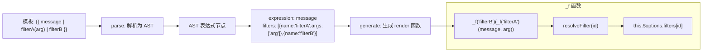
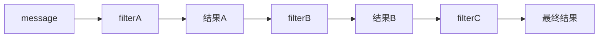

# 过滤器 Filter

## 概述

Vue.js 允许自定义过滤器，用于常见的文本格式化。过滤器本质上是 JavaScript 函数，可以对数据进行转换处理后展示。

### 过滤器的编译原理

过滤器在模板编译阶段（parse → generate）被解析，管道符 `|` 被转换为函数调用链：



**关键源码（简化）：**

```javascript
// 1. parse 阶段：src/compiler/parser/filter-parser.js
// 解析 {{ msg | capitalize }} 中的管道符
function parseFilters(exp) {
  let filters = exp.split('|')
  let expression = filters.shift().trim()  // 第一个是基础表达式
  // 剩余的是过滤器名和参数
  // 返回: { expression: 'msg', filters: [{name: 'capitalize', args: []}] }
}

// 2. codegen 阶段：src/compiler/codegen/index.js
// 将 AST 中的过滤器链转换为 render 函数调用
function genFilters(expression, filters) {
  for (let filter of filters) {
    // 每个过滤器包装一层 _f 调用
    expression = `_f("${filter.name}")(${expression}${filter.args ? ',' + filter.args : ''})`
  }
  return expression
}
// 示例转换：{{ msg | filterA(arg) | filterB }}
// → _f("filterB")(_f("filterA")(msg, arg))

// 3. _f 函数：src/core/instance/render-helpers/resolve-filter.js
function resolveFilter(id) {
  return resolveAsset(this.$options, 'filters', id, true) || identity
}
// → this.$options.filters[id]
// → 沿原型链查找：$options.filters[id] || Vue.options.filters[id]
```

> **关键**：过滤器先沿组件局部 filters 查找，再沿全局 `Vue.options.filters` 原型链查找。如果未找到，返回 `identity` 函数（不转换）。

### 核心特点

| 特性 | 说明 |
|------|------|
| **管道语法** | 使用 `|` 符号连接，简洁直观 |
| **可串联** | 多个过滤器可以链式调用 |
| **支持传参** | 过滤器可以接收额外参数 |
| **响应式** | 源数据变化时自动重新计算 |

### 适用场景

- 文本格式化（大小写转换、截断等）
- 日期格式化
- 货币/数字格式化
- 数据脱敏处理

> **注意**：过滤器在 Vue 3 中已被移除，建议使用计算属性或方法替代。

## 基本用法

### 使用位置

过滤器可以用在两个地方：

```html
<!-- 1. 双花括号插值 -->
{{ message | capitalize }}

<!-- 2. v-bind 表达式（2.1.0+） -->
<div v-bind:id="rawId | formatId"></div>
```

### 定义方式

#### 本地过滤器（组件级）

在组件的 `filters` 选项中定义：

```javascript
new Vue({
  el: '#app',
  data: {
    message: 'hello world'
  },
  filters: {
    capitalize: function (value) {
      if (!value) return '';
      value = value.toString();
      return value.charAt(0).toUpperCase() + value.slice(1);
    }
  }
});
```

#### 全局过滤器

在创建 Vue 实例之前全局定义：

```javascript
// 注册全局过滤器
Vue.filter('capitalize', function (value) {
  if (!value) return '';
  value = value.toString();
  return value.charAt(0).toUpperCase() + value.slice(1);
});

// 创建 Vue 实例
new Vue({
  el: '#app'
});
```

#### 完整示例

```html
<!DOCTYPE html>
<html>
  <head>
    <meta charset="UTF-8" />
    <title>过滤器基本示例</title>
    <script src="https://cdn.jsdelivr.net/npm/vue@2/dist/vue.js"></script>
    <style>
      .demo {
        max-width: 600px;
        margin: 50px auto;
        padding: 20px;
        font-family: Arial, sans-serif;
      }
      .form-group {
        margin-bottom: 20px;
      }
      .form-group label {
        display: block;
        margin-bottom: 5px;
        font-weight: bold;
      }
      .form-group input {
        width: 100%;
        padding: 10px;
        border: 1px solid #ddd;
        border-radius: 5px;
        font-size: 16px;
        box-sizing: border-box;
      }
      .result {
        padding: 15px;
        background: #f5f5f5;
        border-radius: 5px;
        margin-top: 10px;
      }
      .result strong {
        color: #667eea;
      }
    </style>
  </head>
  <body>
    <div id="app" class="demo">
      <h2>过滤器演示</h2>

      <div class="form-group">
        <label>输入文本（本地过滤器 capitalize）：</label>
        <input type="text" v-model="message" placeholder="输入文本..." />
        <div class="result">
          原始值: <strong>{{ message }}</strong><br />
          过滤后: <strong>{{ message | capitalize }}</strong>
        </div>
      </div>

      <div class="form-group">
        <label>输入数字（全局过滤器 currency）：</label>
        <input type="number" v-model.number="price" placeholder="输入数字..." />
        <div class="result">
          原始值: <strong>{{ price }}</strong><br />
          过滤后: <strong>{{ price | currency }}</strong>
        </div>
      </div>
    </div>

    <script>
      // 全局过滤器：货币格式化
      Vue.filter('currency', function (value) {
        if (typeof value !== 'number') return '';
        return '¥' + value.toFixed(2);
      });

      new Vue({
        el: '#app',
        data: {
          message: 'hello world',
          price: 99.9
        },
        // 本地过滤器
        filters: {
          capitalize: function (value) {
            if (!value) return '';
            value = value.toString();
            return value.charAt(0).toUpperCase() + value.slice(1);
          }
        }
      });
    </script>
  </body>
</html>
```

## 过滤器特性

### 过滤器串联

多个过滤器可以串联使用，前一个过滤器的输出作为后一个过滤器的输入：

```html
{{ message | filterA | filterB | filterC }}
```

**执行流程：**



```javascript
new Vue({
  el: '#app',
  data: {
    message: 'hello world'
  },
  filters: {
    // 第一步：转大写
    uppercase: function (value) {
      return value.toUpperCase();
    },
    // 第二步：添加前缀
    prefix: function (value) {
      return '>> ' + value;
    },
    // 第三步：添加后缀
    suffix: function (value) {
      return value + ' <<';
    }
  }
});
```

```html
<!-- 输出: >> HELLO WORLD << -->
{{ message | uppercase | prefix | suffix }}
```

### 过滤器传参

过滤器可以接收额外参数：

```html
{{ message | filterA('arg1', arg2) }}
```

**参数传递规则：**

- 第一个参数：表达式的值（`message`）
- 第二个参数：字符串 `'arg1'`
- 第三个参数：表达式 `arg2` 的值

```html
<!DOCTYPE html>
<html>
  <head>
    <meta charset="UTF-8" />
    <title>过滤器传参示例</title>
    <script src="https://cdn.jsdelivr.net/npm/vue@2/dist/vue.js"></script>
  </head>
  <body>
    <div id="app">
      <p>截断文本: {{ longText | truncate(20, '...') }}</p>
      <p>格式化金额: {{ amount | currency('USD', '$') }}</p>
      <p>带精度的数字: {{ pi | decimal(4) }}</p>
    </div>

    <script>
      new Vue({
        el: '#app',
        data: {
          longText: '这是一段很长的文本内容，需要进行截断处理以适应界面显示',
          amount: 1234.56,
          pi: 3.14159265
        },
        filters: {
          // 截断文本
          // value: 原始值, length: 截断长度, suffix: 后缀
          truncate: function (value, length, suffix) {
            if (!value) return '';
            value = value.toString();
            if (value.length <= length) return value;
            return value.substring(0, length) + (suffix || '...');
          },

          // 货币格式化
          // value: 原始值, code: 货币代码, symbol: 货币符号
          currency: function (value, code, symbol) {
            if (typeof value !== 'number') return '';
            return symbol + value.toFixed(2) + ' ' + code;
          },

          // 小数精度
          // value: 原始值, precision: 小数位数
          decimal: function (value, precision) {
            if (typeof value !== 'number') return '';
            return value.toFixed(precision || 2);
          }
        }
      });
    </script>
  </body>
</html>
```

### 优先级规则

当全局过滤器和本地过滤器重名时，优先使用本地过滤器：

```javascript
// 全局过滤器
Vue.filter('format', function (value) {
  return '全局: ' + value;
});

new Vue({
  el: '#app',
  data: {
    message: 'test'
  },
  filters: {
    // 本地过滤器（优先级更高）
    format: function (value) {
      return '本地: ' + value;
    }
  }
});
```

```html
<!-- 输出: 本地: test -->
{{ message | format }}
```

## 实用示例

### 文本格式化

```javascript
filters: {
  // 首字母大写
  capitalize: function (value) {
    if (!value) return '';
    value = value.toString();
    return value.charAt(0).toUpperCase() + value.slice(1);
  },

  // 全部大写
  uppercase: function (value) {
    return value ? value.toString().toUpperCase() : '';
  },

  // 全部小写
  lowercase: function (value) {
    return value ? value.toString().toLowerCase() : '';
  },

  // 首字母大写（每个单词）
  titleCase: function (value) {
    if (!value) return '';
    return value
      .toString()
      .toLowerCase()
      .replace(/(?:^|\s)\S/g, function (char) {
        return char.toUpperCase();
      });
  },

  // 文本截断
  truncate: function (value, length, suffix) {
    if (!value) return '';
    suffix = suffix || '...';
    return value.length > length ? value.substring(0, length) + suffix : value;
  }
}
```

### 日期格式化

```html
<!DOCTYPE html>
<html>
  <head>
    <meta charset="UTF-8" />
    <title>日期格式化过滤器</title>
    <script src="https://cdn.jsdelivr.net/npm/vue@2/dist/vue.js"></script>
    <style>
      .demo {
        max-width: 600px;
        margin: 50px auto;
        padding: 20px;
        font-family: Arial, sans-serif;
      }
      table {
        width: 100%;
        border-collapse: collapse;
      }
      th, td {
        padding: 10px;
        border: 1px solid #ddd;
        text-align: left;
      }
      th {
        background: #f5f5f5;
      }
    </style>
  </head>
  <body>
    <div id="app" class="demo">
      <h2>日期格式化示例</h2>
      <table>
        <tr>
          <th>原始值</th>
          <th>格式化结果</th>
        </tr>
        <tr>
          <td>{{ now }}</td>
          <td>{{ now | dateFormat('YYYY-MM-DD') }}</td>
        </tr>
        <tr>
          <td>{{ now }}</td>
          <td>{{ now | dateFormat('YYYY年MM月DD日') }}</td>
        </tr>
        <tr>
          <td>{{ now }}</td>
          <td>{{ now | dateFormat('YYYY-MM-DD HH:mm:ss') }}</td>
        </tr>
        <tr>
          <td>{{ now }}</td>
          <td>{{ now | relativeTime }}</td>
        </tr>
      </table>
    </div>

    <script>
      new Vue({
        el: '#app',
        data: {
          now: new Date()
        },
        filters: {
          // 日期格式化
          dateFormat: function (date, format) {
            if (!date) return '';
            if (!(date instanceof Date)) {
              date = new Date(date);
            }

            const map = {
              YYYY: date.getFullYear(),
              MM: String(date.getMonth() + 1).padStart(2, '0'),
              DD: String(date.getDate()).padStart(2, '0'),
              HH: String(date.getHours()).padStart(2, '0'),
              mm: String(date.getMinutes()).padStart(2, '0'),
              ss: String(date.getSeconds()).padStart(2, '0')
            };

            return format.replace(/YYYY|MM|DD|HH|mm|ss/g, function (matched) {
              return map[matched];
            });
          },

          // 相对时间
          relativeTime: function (date) {
            if (!date) return '';
            if (!(date instanceof Date)) {
              date = new Date(date);
            }

            const now = new Date();
            const diff = now - date;
            const seconds = Math.floor(diff / 1000);
            const minutes = Math.floor(seconds / 60);
            const hours = Math.floor(minutes / 60);
            const days = Math.floor(hours / 24);

            if (days > 0) return days + '天前';
            if (hours > 0) return hours + '小时前';
            if (minutes > 0) return minutes + '分钟前';
            return '刚刚';
          }
        }
      });
    </script>
  </body>
</html>
```

### 货币格式化

```javascript
filters: {
  // 人民币格式化
  currency: function (value, symbol) {
    if (typeof value !== 'number') return '';
    symbol = symbol || '¥';
    return symbol + value.toFixed(2).replace(/\B(?=(\d{3})+(?!\d))/g, ',');
  },

  // 带千分位的数字
  numberFormat: function (value, decimals) {
    if (typeof value !== 'number') return '';
    decimals = decimals || 0;
    return value.toFixed(decimals).replace(/\B(?=(\d{3})+(?!\d))/g, ',');
  },

  // 百分比
  percentage: function (value, decimals) {
    if (typeof value !== 'number') return '';
    decimals = decimals || 0;
    return (value * 100).toFixed(decimals) + '%';
  }
}
```

### 数组处理

```javascript
filters: {
  // 数组求和
  sum: function (arr) {
    if (!Array.isArray(arr)) return 0;
    return arr.reduce(function (sum, item) {
      return sum + (typeof item === 'number' ? item : 0);
    }, 0);
  },

  // 数组去重
  unique: function (arr) {
    if (!Array.isArray(arr)) return [];
    return arr.filter(function (item, index, self) {
      return self.indexOf(item) === index;
    });
  },

  // 数组排序
  sortBy: function (arr, key, order) {
    if (!Array.isArray(arr)) return [];
    var sorted = arr.slice().sort(function (a, b) {
      if (key) {
        a = a[key];
        b = b[key];
      }
      return a > b ? 1 : -1;
    });
    return order === 'desc' ? sorted.reverse() : sorted;
  }
}
```

## 过滤器 vs 计算属性 vs 方法

| 特性 | 过滤器 | 计算属性 | 方法 |
|------|--------|----------|------|
| **使用场景** | 模板中的数据格式化 | 复杂逻辑、需要缓存 | 可复用的逻辑 |
| **缓存** | 无 | 有（依赖不变时不重新计算） | 无 |
| **参数传递** | 支持 | 不支持（基于响应式依赖） | 支持 |
| **模板语法** | `{{ value \| filter }}` | `{{ computedProp }}` | `{{ method() }}` |
| **Vue 3 支持** | ❌ 已移除 | ✅ | ✅ |
| **串联调用** | ✅ 支持 | ❌ | ❌ |
| **this 访问** | ❌ 无法访问 | ✅ | ✅ |

### 选择建议

```javascript
new Vue({
  data: {
    message: 'hello',
    items: [1, 2, 3, 4, 5]
  },

  // ✅ 过滤器：简单的文本格式化
  filters: {
    uppercase: function (value) {
      return value.toUpperCase();
    }
  },

  // ✅ 计算属性：需要缓存、依赖多个数据
  computed: {
    reversedMessage: function () {
      return this.message.split('').reverse().join('');
    },
    filteredItems: function () {
      return this.items.filter(function (item) {
        return item > 2;
      });
    }
  },

  // ✅ 方法：需要传参、不需要缓存
  methods: {
    formatCurrency: function (value, symbol) {
      return symbol + value.toFixed(2);
    }
  }
});
```

```html
<!-- 过滤器 -->
<p>{{ message | uppercase }}</p>

<!-- 计算属性 -->
<p>{{ reversedMessage }}</p>

<!-- 方法 -->
<p>{{ formatCurrency(99.9, '¥') }}</p>
```

## Vue 3 变化说明

**过滤器在 Vue 3 中已被移除**，主要原因：

1. 过滤器打破了「模板中只能调用方法」的直觉
2. 过滤器需要特殊的 `|` 语法，增加了学习成本
3. 计算属性和方法完全可以替代过滤器的功能

### 迁移方案

```javascript
// Vue 2: 使用过滤器
// {{ message | capitalize }}

filters: {
  capitalize: function (value) {
    return value.charAt(0).toUpperCase() + value.slice(1);
  }
}

// Vue 3: 使用计算属性
computed: {
  capitalizedMessage: function () {
    return this.message.charAt(0).toUpperCase() + this.message.slice(1);
  }
}

// Vue 3: 使用方法
methods: {
  capitalize: function (value) {
    return value.charAt(0).toUpperCase() + value.slice(1);
  }
}
```

```html
<!-- Vue 2 -->
{{ message | capitalize }}

<!-- Vue 3: 计算属性 -->
{{ capitalizedMessage }}

<!-- Vue 3: 方法 -->
{{ capitalize(message) }}
```

### 全局过滤器迁移

```javascript
// Vue 2: 全局过滤器
Vue.filter('currency', function (value) {
  return '¥' + value.toFixed(2);
});

// Vue 3: 全局属性（app.config.globalProperties）
app.config.globalProperties.$filters = {
  currency: function (value) {
    return '¥' + value.toFixed(2);
  }
};

// 使用
{{ $filters.currency(price) }}
```

## 最佳实践

### 1. 保持过滤器简单

```javascript
// ❌ 不推荐：过滤器中包含复杂逻辑
filters: {
  processData: function (value) {
    // 复杂的 API 调用、状态修改...
    fetch('/api/data').then(/* ... */);
    return value;
  }
}

// ✅ 推荐：过滤器只做纯函数转换
filters: {
  uppercase: function (value) {
    return value ? value.toUpperCase() : '';
  }
}
```

### 2. 处理边界情况

```javascript
filters: {
  // ✅ 处理空值、类型转换
  capitalize: function (value) {
    if (value === null || value === undefined) return '';
    value = String(value);
    return value.charAt(0).toUpperCase() + value.slice(1);
  }
}
```

### 3. 避免修改原数据

```javascript
// ❌ 不推荐：修改原数组
filters: {
  reverse: function (arr) {
    return arr.reverse(); // 修改原数组
  }
}

// ✅ 推荐：返回新数组
filters: {
  reverse: function (arr) {
    return arr.slice().reverse(); // 不修改原数组
  }
}
```

### 4. 提取公共过滤器

```javascript
// utils/filters.js
export const filters = {
  currency: function (value, symbol = '¥') {
    if (typeof value !== 'number') return '';
    return symbol + value.toFixed(2);
  },

  dateFormat: function (date, format = 'YYYY-MM-DD') {
    // ...
  }
};

// 注册全局过滤器
import { filters } from './utils/filters';

Object.keys(filters).forEach(function (key) {
  Vue.filter(key, filters[key]);
});
```

## 常见问题

### Q1: 过滤器中能访问 this 吗？

**不能**。过滤器函数接收的第一个参数是表达式的值，无法通过 `this` 访问组件实例。如果需要访问组件数据，应使用计算属性或方法。

```javascript
// ❌ 过滤器中无法访问 this
filters: {
  format: function (value) {
    return this.prefix + value; // 错误！this 未定义
  }
}

// ✅ 使用计算属性
computed: {
  formattedValue: function () {
    return this.prefix + this.value; // 正确
  }
}
```

### Q2: 过滤器能用于 v-model 吗？

**不能**。过滤器只能用于文本插值和 `v-bind` 表达式，不能用于 `v-model`。

```html
<!-- ❌ 无效 -->
<input v-model="price | currency" />

<!-- ✅ 正确做法：使用计算属性的 getter/setter -->
<input v-model="formattedPrice" />
```

```javascript
computed: {
  formattedPrice: {
    get: function () {
      return '¥' + this.price.toFixed(2);
    },
    set: function (value) {
      this.price = parseFloat(value.replace('¥', ''));
    }
  }
}
```

### Q3: 如何在渲染函数中使用过滤器？

通过 `this.$options.filters` 访问本地过滤器：

```javascript
render: function (h) {
  // 访问本地过滤器
  var capitalize = this.$options.filters.capitalize;
  return h('span', capitalize(this.message));
}
```

或使用全局过滤器：

```javascript
render: function (h) {
  // 访问全局过滤器
  var capitalize = Vue.filter('capitalize');
  return h('span', capitalize(this.message));
}
```

### Q4: 过滤器可以异步吗？

**不推荐**。过滤器是同步函数，不支持异步操作。如需异步处理数据，应在组件的 `created` 或 `mounted` 钩子中处理。

```javascript
// ❌ 不推荐
filters: {
  fetchName: function (id) {
    fetch('/api/name/' + id).then(/* ... */);
    return 'Loading...';
  }
}

// ✅ 推荐做法
created: function () {
  var self = this;
  fetch('/api/name/' + this.id)
    .then(function (response) {
      return response.json();
    })
    .then(function (data) {
      self.userName = data.name;
    });
}
```

### Q5: 多个参数如何传递？

```javascript
filters: {
  formatRange: function (value, min, max) {
    return Math.min(Math.max(value, min), max);
  }
}
```

```html
<!-- 传递多个参数 -->
{{ value | formatRange(0, 100) }}

<!-- 参数: value=50, min=0, max=100 -->
{{ 50 | formatRange(0, 100) }}
```

### Q6: 过滤器性能如何优化？

```javascript
// ❌ 每次渲染都创建新正则
filters: {
  phone: function (value) {
    return value.replace(/(\d{3})(\d{4})(\d{4})/, '$1-$2-$3');
  }
}

// ✅ 缓存正则表达式
var PHONE_REGEX = /(\d{3})(\d{4})(\d{4})/;

filters: {
  phone: function (value) {
    return value.replace(PHONE_REGEX, '$1-$2-$3');
  }
}
```
