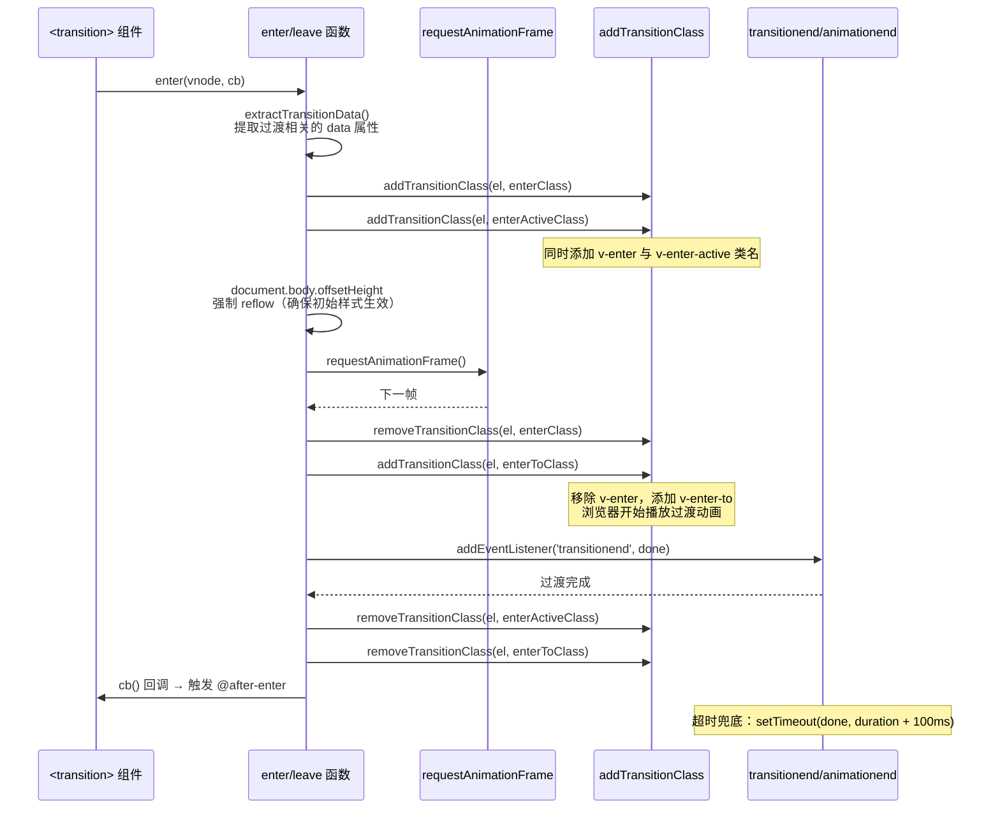
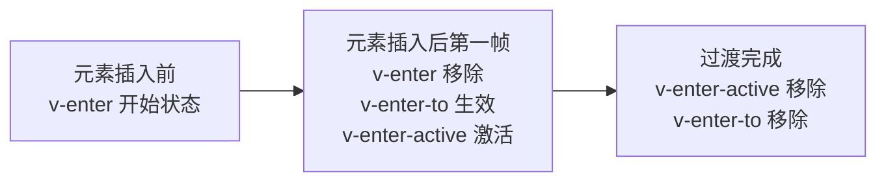
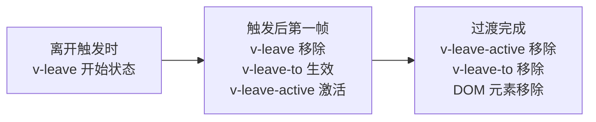
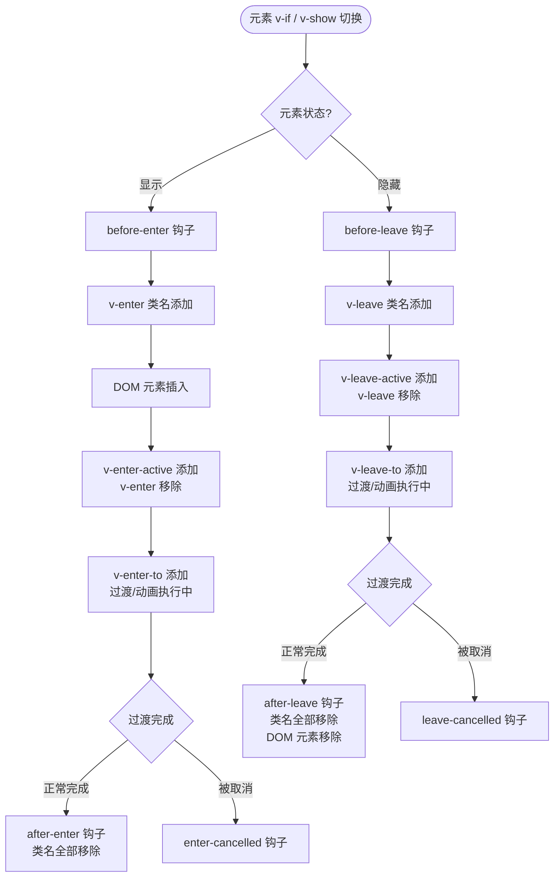
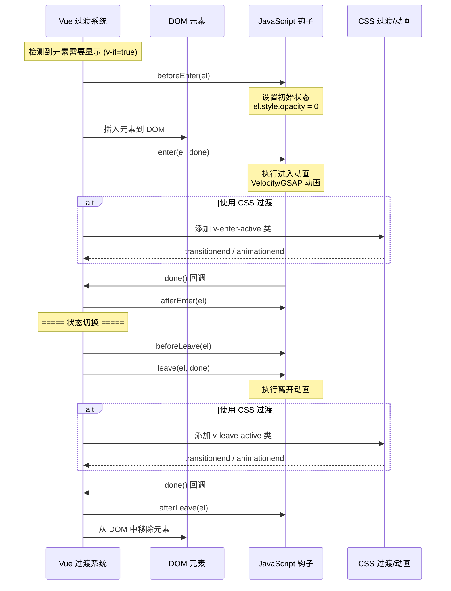

# 过渡 Transition

## 概述

Vue 在插入、更新或者移除 DOM 时，提供多种不同方式的应用过渡效果：

- **CSS 过渡/动画**：自动应用 CSS 类名，支持过渡和关键帧动画
- **第三方 CSS 动画库**：可配合 Animate.css 等第三方库使用
- **JavaScript 钩子**：在过渡钩子函数中直接操作 DOM
- **第三方 JavaScript 动画库**：可配合 Velocity.js、GSAP 等库使用

### 工作原理

Vue 的过渡系统基于状态驱动，当元素的显示状态发生变化时（如 `v-if`、`v-show` 切换），Vue 会自动：

1. **嗅探动画类型**：检测元素是否应用了 CSS 过渡或动画
2. **添加/移除类名**：在恰当时机添加或移除 CSS 过渡类名
3. **调用钩子函数**：如果提供了 JavaScript 钩子，在恰当时机调用
4. **处理完成回调**：等待过渡/动画完成后执行 DOM 操作

#### transition 组件的 enter/leave 底层调用链



**关键源码（简化）：**

```javascript
// src/platforms/web/runtime/modules/transition.js
function enter(vnode, toggleDisplay) {
  const el = vnode.elm
  const css = resolveTransition(vnode.data.transition)  // 提取过渡配置

  // 1. 添加初始类名
  addTransitionClass(el, css.enterClass)          // v-enter
  addTransitionClass(el, css.enterActiveClass)    // v-enter-active

  // 2. 强制 reflow — 确保浏览器注册初始状态
  document.body.offsetHeight  // 关键：读取 offsetHeight 触发 reflow

  // 3. 下一帧：切换类名，启动过渡
  requestAnimationFrame(() => {
    removeTransitionClass(el, css.enterClass)     // 移除 v-enter
    addTransitionClass(el, css.enterToClass)      // 添加 v-enter-to

    // 4. 监听过渡结束
    const onEnd = () => {
      removeTransitionClass(el, css.enterActiveClass)
      removeTransitionClass(el, css.enterToClass)
      toggleDisplay && toggleDisplay()  // 恢复 display
      // ... 触发 afterEnter 回调
    }

    // 5. 同时监听 transitionend 和 animationend（两者都要处理兼容性）
    el.addEventListener('transitionend', onEnd)
    el.addEventListener('animationend', onEnd)

    // 6. 超时兜底：防止事件未触发
    const duration = css.enterDuration || getTransitionInfo(el).duration
    setTimeout(onEnd, duration + 100)
  })
}
```

> **关键**：`document.body.offsetHeight`（强制 reflow）是过渡启动的核心——没有它，浏览器不会在两次样式变更之间产生中间状态，动画就不会播放。

### 核心概念

- **进入过渡**：元素从隐藏到显示的过程
- **离开过渡**：元素从显示到隐藏的过程
- **过渡类名**：Vue 自动添加的 CSS 类名，用于定义过渡效果
- **过渡钩子**：JavaScript 函数，用于在过渡的特定时机执行自定义逻辑

## API 参考

### transition 组件

`<transition>` 组件用于给单个元素或组件添加进入/离开过渡效果。

#### Props

| 属性 | 类型 | 说明 |
|------|------|------|
| `name` | `string` | 自动生成 CSS 过渡类名的前缀。例如 `name="fade"` 将自动扩展为 `.fade-enter`、`.fade-enter-active` 等。默认值：`"v"` |
| `appear` | `boolean` | 是否在初始渲染时应用过渡。默认值：`false` |
| `css` | `boolean` | 是否使用 CSS 过渡类。设为 `false` 将跳过 CSS 检测，适用于纯 JavaScript 动画。默认值：`true` |
| `type` | `string` | 指定过渡结束事件类型。可取值：`"transition"` 或 `"animation"`。用于同时使用 CSS 过渡和动画时明确指定监听类型 |
| `mode` | `string` | 控制离开/进入过渡的时序。可取值：`"out-in"`（先离开后进入）、`"in-out"`（先进入后离开）。默认同时发生 |
| `duration` | `number \| { enter: number, leave: number }` | 显式指定过渡持续时间（毫秒）。用于 Vue 无法自动判断过渡完成时机的情况 |
| `enter-class` | `string` | 自定义进入过渡的开始状态类名 |
| `enter-active-class` | `string` | 自定义进入过渡的激活状态类名 |
| `enter-to-class` | `string` | **(2.1.8+)** 自定义进入过渡的结束状态类名 |
| `leave-class` | `string` | 自定义离开过渡的开始状态类名 |
| `leave-active-class` | `string` | 自定义离开过渡的激活状态类名 |
| `leave-to-class` | `string` | **(2.1.8+)** 自定义离开过渡的结束状态类名 |
| `appear-class` | `string` | 自定义初始渲染过渡的开始状态类名 |
| `appear-active-class` | `string` | 自定义初始渲染过渡的激活状态类名 |
| `appear-to-class` | `string` | **(2.1.8+)** 自定义初始渲染过渡的结束状态类名 |

#### Events

| 事件名 | 说明 | 回调参数 |
|--------|------|----------|
| `before-enter` | 进入过渡开始前调用 | `el: HTMLElement` - 正在进入的元素 |
| `enter` | 进入过渡开始时调用 | `el: HTMLElement`, `done: Function` - 回调函数（纯 JS 动画时必须调用） |
| `after-enter` | 进入过渡完成后调用 | `el: HTMLElement` |
| `enter-cancelled` | 进入过渡被取消时调用 | `el: HTMLElement`（仅用于 `v-show`） |
| `before-leave` | 离开过渡开始前调用 | `el: HTMLElement` - 正在离开的元素 |
| `leave` | 离开过渡开始时调用 | `el: HTMLElement`, `done: Function` - 回调函数（纯 JS 动画时必须调用） |
| `after-leave` | 离开过渡完成后调用 | `el: HTMLElement` |
| `leave-cancelled` | 离开过渡被取消时调用 | `el: HTMLElement`（仅用于 `v-show`） |
| `before-appear` | 初始渲染过渡开始前调用 | `el: HTMLElement` |
| `appear` | 初始渲染过渡开始时调用 | `el: HTMLElement`, `done: Function` |
| `after-appear` | 初始渲染过渡完成后调用 | `el: HTMLElement` |
| `appear-cancelled` | 初始渲染过渡被取消时调用 | `el: HTMLElement` |

#### 用法

`<transition>` 组件适用于以下场景：

- 条件渲染（使用 `v-if`）
- 条件展示（使用 `v-show`）
- 动态组件（使用 `<component :is="...">`）
- 组件根节点

```html
<!DOCTYPE html>
<html>
  <head>
    <script src="https://cdn.jsdelivr.net/npm/vue@2/dist/vue.js"></script>
    <style>
      .fade-enter-active, .fade-leave-active {
        transition: opacity .5s;
      }

      .fade-enter, .fade-leave-to /* .fade-leave-active below version 2.1.8 */{
        opacity: 0;
      }
    </style>
  </head>
  <body>
    <div id="demo">
      <button v-on:click="show = !show">Toggle</button>
      <transition name="fade">
        <p v-if="show">hello</p>
      </transition>
    </div>

    <script>
      new Vue({
        el: '#demo',
        data: {
          show: true
        }
      })
    </script>
  </body>
</html>
```

当插入或删除包含在 `transition` 组件中的元素时，Vue 将会做以下处理：

1.  自动嗅探目标元素是否应用了 CSS 过渡或动画，如果是 在恰当的时机添加/删除 CSS 类名

1.  如果过渡组件提供了 [JavaScript 钩子函数](https://v2.cn.vuejs.org/v2/guide/transitions.html#JavaScript-%E9%92%A9%E5%AD%90)，这些钩子函数将在恰当的时机被调用

1.  如果没有找到 JavaScript 钩子并且也没有检测到 CSS 过渡/动画，DOM 操作 (插入/删除) 在下一帧中立即执行。(注意：此指浏览器逐帧动画机制，和 Vue 的 `nextTick` 概念不同) 

### 过渡的类名

在进入/离开的过渡中，会有 6 个 CSS 类名在不同阶段被应用：

#### 进入过渡类名

| 类名 | 时机 | 说明 |
|------|------|------|
| `v-enter` | 元素插入前 | 定义进入过渡的**开始状态**。在元素被插入之前生效，在元素被插入之后的下一帧移除 |
| `v-enter-active` | 整个进入阶段 | 定义进入过渡的**激活状态**。在整个进入过渡阶段应用，用于定义过渡持续时间、延迟和过渡曲线函数 |
| `v-enter-to` | 元素插入后 | **(2.1.8+)** 定义进入过渡的**结束状态**。在元素被插入之后下一帧生效，在过渡/动画完成之后移除 |

#### 离开过渡类名

| 类名 | 时机 | 说明 |
|------|------|------|
| `v-leave` | 离开开始时 | 定义离开过渡的**开始状态**。在离开过渡被触发时立刻生效，下一帧被移除 |
| `v-leave-active` | 整个离开阶段 | 定义离开过渡的**激活状态**。在整个离开过渡阶段应用，用于定义过渡持续时间、延迟和过渡曲线函数 |
| `v-leave-to` | 离开后 | **(2.1.8+)** 定义离开过渡的**结束状态**。在离开过渡被触发之后下一帧生效，在过渡/动画完成之后移除 |

#### 过渡类名时间轴

**进入过渡**



**离开过渡**




#### 自定义类名前缀

如果使用一个没有名字的 `<transition>`，则 `v-` 是这些类名的默认前缀。如果使用了 `<transition name="my-transition">`，那么 `v-enter` 会替换为 `my-transition-enter`。

**示例：**

```html
<!-- 默认前缀 -->
<transition>
  <div v-if="show">内容</div>
</transition>
<!-- 类名：v-enter, v-enter-active, v-enter-to, ... -->

<!-- 自定义前缀 -->
<transition name="fade">
  <div v-if="show">内容</div>
</transition>
<!-- 类名：fade-enter, fade-enter-active, fade-enter-to, ... -->
```

#### CSS 类名使用技巧

- `v-enter-active` 和 `v-leave-active`：用于定义过渡的持续时间、延迟和缓动函数
- `v-enter` 和 `v-leave-to`：定义过渡的开始和结束状态（透明度为 0、位移等）
- `v-enter-to` 和 `v-leave`：通常使用默认值，无需显式定义

#### 过渡类名生命周期流程



### CSS 过渡

常用的过渡都是使用 CSS 过渡

```html
<!DOCTYPE html>
<html>
  <head>
    <script src="https://cdn.jsdelivr.net/npm/vue@2/dist/vue.js"></script>
    <style>
      /* 可以设置不同的进入和离开动画 */
      /* 设置持续时间和动画函数 */
      .slide-fade-enter-active {
        transition: all .3s ease;
      }

      .slide-fade-leave-active {
        transition: all .8s cubic-bezier(1.0, 0.5, 0.8, 1.0);
      }

      .slide-fade-enter, .slide-fade-leave-to{
        transform: translateX(10px);
        opacity: 0;
      }
    </style>
  </head>
  <body>
    <div id="example-1" class="demo">
      <button @click="show = !show">
        Toggle render
      </button>
      <transition name="slide-fade">
        <p v-if="show">hello</p>
      </transition>
    </div>

    <script>
      new Vue({
        el: '#example-1',
        data: {
          show: true
        }
      })
    </script>
  </body>
</html>
```

### CSS 动画

CSS 动画用法同 CSS 过渡一样，区别是在动画中 `v-enter` 类名在节点插入 DOM 后不会立即删除，而是在 `animationend` 事件触发时删除

```html
<!DOCTYPE html>
<html>
  <head>
    <meta charset="UTF-8">
    <script src="https://cdn.jsdelivr.net/npm/vue@2/dist/vue.js"></script>
    <style>
      .bounce-enter-active {
        animation: bounce-in .5s;
      }

      .bounce-leave-active {
        animation: bounce-in .5s reverse;
      }

      @keyframes bounce-in {
        0% {
          transform: scale(0);
        }
        50% {
          transform: scale(1.5);
        }
        100% {
          transform: scale(1);
        }
      }
    </style>
  </head>
  <body>
    <div id="example-2">
      <button @click="show = !show">Toggle show</button>
      <transition name="bounce">
        <p v-if="show">CSS 动画用法同 CSS 过渡，区别是在动画中 v-enter 类名在节点插入 DOM 后不会立即删除，而是在
          animationend 事件触发时删除</p>
      </transition>
    </div>

    <script>
      new Vue({
        el: '#example-2',
        data: {
          show: true
        }
      })
    </script>
  </body>
</html>
```

### 自定义过渡的类名

可以通过以下属性自定义过渡类名，这些属性优先级高于通过 `name` 自动生成的类名：

| 属性 | 说明 |
|------|------|
| `enter-class` | 自定义进入过渡的开始状态类名 |
| `enter-active-class` | 自定义进入过渡的激活状态类名 |
| `enter-to-class` | **(2.1.8+)** 自定义进入过渡的结束状态类名 |
| `leave-class` | 自定义离开过渡的开始状态类名 |
| `leave-active-class` | 自定义离开过渡的激活状态类名 |
| `leave-to-class` | **(2.1.8+)** 自定义离开过渡的结束状态类名 |

自定义类名对于结合第三方 CSS 动画库（如 [Animate.css](https://daneden.github.io/animate.css/)）非常有用

```html
<!DOCTYPE html>
<html>
  <head>
    <meta charset="UTF-8">
    <script src="https://cdn.jsdelivr.net/npm/vue@2/dist/vue.js"></script>
    <link href="https://cdn.jsdelivr.net/npm/animate.css@3.5.1" rel="stylesheet" type="text/css">
  </head>
  <body>
    <div id="example-3">
      <button @click="show = !show">Toggle render</button>
      <transition
                  name="custom-classes-transition"
                  enter-active-class="animated tada"
                  leave-active-class="animated bounceOutRight"
                  >
        <p v-if="show">hello</p>
      </transition>
    </div>

    <script>
      new Vue({
        el: '#example-3',
        data: {
          show: true
        }
      })
    </script>
  </body>
</html>
```

### 同时使用过渡和动画

Vue 为了知道过渡的完成，必须设置相应的事件监听器。它可以是 `transitionend` 或 `animationend`，这取决于给元素应用的 CSS 规则。如果使用其中任何一种，Vue 能自动识别类型并设置监听。

但是在一些场景中，需要给同一个元素同时设置两种过渡动效，比如 `animation` 很快的被触发并完成了，而 `transition` 效果还没结束。在这种情况中，你就需要使用 `type`  并设置 `animation` 或 `transition` 来明确声明你需要 Vue 监听的类型

### 显性的过渡持续时间

在很多情况下，Vue 可以自动得出过渡效果的完成时机。默认情况下，Vue 会等待其在过渡效果的根元素的第一个 `transitionend` 或 `animationend` 事件。然而也可以不这样设定——比如，可以拥有一个精心编排的一系列过渡效果，其中一些嵌套的内部元素相比于过渡效果的根元素有延迟的或更长的过渡效果。

在这种情况下可以用 `<transition>` 组件上的 `duration`  定制一个显性的过渡持续时间 (以毫秒计)：

```html
<transition :duration="1000">...</transition>
```

你也可以定制进入和移出的持续时间：

```html
<transition :duration="{ enter: 500, leave: 800 }">...</transition>
```

### JavaScript 钩子

可以在 `<transition>` 组件上声明 JavaScript 钩子函数，在过渡的特定时机执行自定义逻辑。

#### 钩子函数列表

```html
<transition
  @before-enter="beforeEnter"
  @enter="enter"
  @after-enter="afterEnter"
  @enter-cancelled="enterCancelled"

  @before-leave="beforeLeave"
  @leave="leave"
  @after-leave="afterLeave"
  @leave-cancelled="leaveCancelled"
>
  <!-- ... -->
</transition>
```

#### 钩子函数定义

```javascript
methods: {
  // --------
  // 进入中
  // --------

  beforeEnter: function (el) {
    // ...
  },
  // 当与 CSS 结合使用时，回调函数 done 是可选的
  enter: function (el, done) {
    // ...
    done()
  },
  afterEnter: function (el) {
    // ...
  },
  enterCancelled: function (el) {
    // ...
  },

  // --------
  // 离开时
  // --------

  beforeLeave: function (el) {
    // ...
  },
  // 当与 CSS 结合使用时，回调函数 done 是可选的
  leave: function (el, done) {
    // ...
    done()
  },
  afterLeave: function (el) {
    // ...
  },
  // leaveCancelled 只用于 v-show 中
  leaveCancelled: function (el) {
    // ...
  }
}
```

这些钩子函数可以结合 CSS `transitions/animations` 使用，也可以单独使用。

#### JavaScript 钩子执行流程



当只用 JavaScript 过渡的时候，在 enter 和 leave 中必须使用 done 进行回调。否则它们将被同步调用，过渡会立即完成。

推荐对于仅使用 JavaScript 过渡的元素添加 `v-bind:css="false"`，Vue 会跳过 CSS 的检测。这也可以避免过渡过程中 CSS 的影响。

一个使用 Velocity.js 的简单例子：

```html
<!DOCTYPE html>
<html>
  <head>
    <meta charset="UTF-8">
    <script src="https://cdn.jsdelivr.net/npm/vue@2/dist/vue.js"></script>
    <script src="https://cdnjs.cloudflare.com/ajax/libs/velocity/1.2.3/velocity.min.js"></script>
  </head>
  <body>
    <div id="example-4">
      <button @click="show = !show">Toggle</button>
      <transition v-on:before-enter="beforeEnter" v-on:enter="enter" v-on:leave="leave" v-bind:css="false">
        <p v-if="show">Demo</p>
      </transition>
    </div>

    <script>
      new Vue({
        el: '#example-4',
        data: {
          show: false
        },
        methods: {
          beforeEnter: function (el) {
            el.style.opacity = 0
            el.style.transformOrigin = 'left'
          },
          enter: function (el, done) {
            Velocity(el, {opacity: 1, fontSize: '1.4em'}, {duration: 300})
            Velocity(el, {fontSize: '1em'}, {complete: done})
          },
          leave: function (el, done) {
            Velocity(el, {translateX: '15px', rotateZ: '50deg'}, {duration: 600})
            Velocity(el, {rotateZ: '100deg'}, {loop: 2})
            Velocity(el, {
              rotateZ: '45deg',
              translateY: '30px',
              translateX: '30px',
              opacity: 0
            }, {complete: done})
          }
        }
      })
    </script>
  </body>
</html>
```

## 初始渲染的过渡

可以通过 `appear` 设置节点在初始渲染的过渡

```html
<transition appear>
  <!-- ... -->
</transition>
```

这里默认和进入/离开过渡一样，同样也可以自定义 CSS 类名

```html
<transition
  appear
  appear-class="custom-appear-class"
  appear-to-class="custom-appear-to-class" (2.1.8+)
  appear-active-class="custom-appear-active-class"
>
  <!-- ... -->
</transition>
```

自定义 JavaScript 钩子：

```html
<transition
  appear
  v-on:before-appear="customBeforeAppearHook"
  v-on:appear="customAppearHook"
  v-on:after-appear="customAfterAppearHook"
  v-on:appear-cancelled="customAppearCancelledHook"
>
  <!-- ... -->
</transition>
```

在上面的例子中，无论是 `appear`  还是 `v-on:appear` 钩子都会生成初始渲染过渡

## 多个元素的过渡

### 基本用法

最常见的多标签过渡是一个列表和描述这个列表为空消息的元素：

```html
<transition name="fade">
  <table v-if="items.length > 0">
    <!-- ... -->
  </table>
  <p v-else>Sorry, no items found.</p>
</transition>
```

### 使用 key 属性

> **重要**：当有**相同标签名**的元素切换时，需要通过 `key` 设置唯一的值来标记以让 Vue 区分它们，否则 Vue 为了效率只会替换相同标签内部的内容。即使在技术上没有必要，**给 `<transition>` 组件中的多个元素设置 key 是一个更好的实践**。

```html
<transition name="fade" mode="out-in">
  <button v-if="isEditing" key="save">Save</button>
  <button v-else key="edit">Edit</button>
</transition>
```

#### 替代方案：动态 key

在某些场景中，可以通过给同一个元素的 `key` 设置不同的状态来代替 `v-if` 和 `v-else`：

```html
<transition name="fade">
  <button :key="isEditing">
    {{ isEditing ? 'Save' : 'Edit' }}
  </button>
</transition>
```

#### 多个 v-if 的优化

使用多个 `v-if` 的多个元素过渡可以重写为绑定了动态 property 的单个元素过渡：

```html
<!-- 原始写法 -->
<transition name="fade">
  <button v-if="docState === 'saved'" key="saved">Edit</button>
  <button v-if="docState === 'edited'" key="edited">Save</button>
  <button v-if="docState === 'editing'" key="editing">Cancel</button>
</transition>

<!-- 优化写法 -->
<transition name="fade">
  <button :key="docState">{{ buttonMessage }}</button>
</transition>

<script>
export default {
  computed: {
    buttonMessage() {
      switch (this.docState) {
        case 'saved': return 'Edit'
        case 'edited': return 'Save'
        case 'editing': return 'Cancel'
      }
    }
  }
}
</script>
```

### 过渡模式

默认情况下，进入和离开过渡同时发生。例如在 "on" 按钮和 "off" 按钮的过渡中，两个按钮都会被重绘，一个离开过渡的同时另一个开始进入过渡。

```html
<!DOCTYPE html>
<html>
  <head>
    <meta charset="UTF-8">
    <script src="https://cdn.jsdelivr.net/npm/vue@2/dist/vue.js"></script>
    <style>
      .no-mode-fade-enter-active, .no-mode-fade-leave-active {
        transition: opacity .5s
      }

      .no-mode-fade-enter, .no-mode-fade-leave-active {
        opacity: 0
      }
    </style>
  </head>
  <body>
    <div id="no-mode-demo" class="demo">
      <transition name="no-mode-fade">
        <button v-if="on" key="on" @click="on = false">on</button>
        <button v-else key="off" @click="on = true">off</button>
      </transition>
    </div>

    <script>
      new Vue({
        el: '#no-mode-demo',
        data: {
          on: false
        }
      })
    </script>
  </body>
</html>
```

在元素绝对定位在彼此之上的时候运行正常，然后加上 translate 让它们运动像滑动过渡：

```html
<!DOCTYPE html>
<html>
  <head>
    <meta charset="UTF-8">
    <script src="https://cdn.jsdelivr.net/npm/vue@2/dist/vue.js"></script>
    <style>
      .no-mode-translate-demo-wrapper {
        position: relative;
        height: 18px;
      }

      .no-mode-translate-demo-wrapper button {
        position: absolute;
      }

      .no-mode-translate-fade-enter-active, .no-mode-translate-fade-leave-active {
        transition: all 1s;
      }

      .no-mode-translate-fade-enter, .no-mode-translate-fade-leave-active {
        opacity: 0;
      }

      .no-mode-translate-fade-enter {
        transform: translateX(31px);
      }

      .no-mode-translate-fade-leave-active {
        transform: translateX(-31px);
      }
    </style>
  </head>
  <body>
    <div id="no-mode-translate-demo" class="demo">
      <div class="no-mode-translate-demo-wrapper">
        <transition name="no-mode-translate-fade">
          <button v-if="on" key="on" @click="on = false">on</button>
          <button v-else key="off" @click="on = true">off</button>
        </transition>
      </div>
    </div>

    <script>
      new Vue({
        el: '#no-mode-translate-demo',
        data: {
          on: false
        }
      })
    </script>
  </body>
</html>
```

同时生效的进入和离开过渡在某些场景下可能不符合需求，所以 Vue 提供了**过渡模式**来控制过渡时序：

| 模式 | 说明 | 适用场景 |
|------|------|----------|
| `out-in` | 当前元素先过渡离开，完成之后新元素过渡进入 | **推荐使用**，适用于大多数场景 |
| `in-out` | 新元素先过渡进入，完成之后当前元素过渡离开 | 适用于特殊效果，如滑动切换 |

#### out-in 模式示例

使用 `out-in` 重写之前的开关按钮过渡：

```html
<div id="with-mode-demo">
  <transition name="with-mode-fade" mode="out-in">
    <button v-if="on" key="on" @click="on = false">on</button>
    <button v-else key="off" @click="on = true">off</button>
  </transition>
</div>

<style>
.with-mode-fade-enter-active, .with-mode-fade-leave-active {
  transition: opacity .5s
}
.with-mode-fade-enter, .with-mode-fade-leave-active {
  opacity: 0
}
</style>

<script>
new Vue({
  el: '#with-mode-demo',
  data: {
    on: false
  }
})
</script>
```

只需添加一个简单的 `mode` 属性，就能实现顺序过渡效果。`in-out` 模式不常用，但在某些特殊过渡效果中可能有用。

## 多个组件的过渡

多个组件的过渡比多元素过渡更简单，不需要使用 `key`，只需使用动态组件：

```html
<transition name="component-fade" mode="out-in">
  <component :is="view"></component>
</transition>

<script>
new Vue({
  el: '#demo',
  data: {
    view: 'v-a'
  },
  components: {
    'v-a': {
      template: '<div>Component A</div>'
    },
    'v-b': {
      template: '<div>Component B</div>'
    }
  }
})
</script>

<style>
.component-fade-enter-active, .component-fade-leave-active {
  transition: opacity .3s ease;
}
.component-fade-enter, .component-fade-leave-to {
  opacity: 0;
}
</style>
```

完整示例：

```html
<!DOCTYPE html>
<html>
  <head>
    <meta charset="UTF-8">
    <script src="https://cdn.jsdelivr.net/npm/vue@2/dist/vue.js"></script>
    <style>
      .component-fade-enter-active, .component-fade-leave-active {
        transition: opacity .3s ease;
      }

      .component-fade-enter, .component-fade-leave-to {
        opacity: 0;
      }
    </style>
  </head>
  <body>
    <div id="transition-components-demo" class="demo">
      <input v-model="view" type="radio" value="v-a" id="a" name="view"><label for="a">A</label>
      <input v-model="view" type="radio" value="v-b" id="b" name="view"><label for="b">B</label>
      <transition name="component-fade" mode="out-in">
        <component v-bind:is="view"></component>
      </transition>
    </div>

    <script>
      new Vue({
        el: '#transition-components-demo',
        data: {
          view: 'v-a'
        },
        components: {
          'v-a': {
            template: '<div>Component A</div>'
          },
          'v-b': {
            template: '<div>Component B</div>'
          }
        }
      })
    </script>
  </body>
</html>
```

## 列表过渡

> 📖 列表过渡（`<transition-group>`）的完整内容请参见：[列表过渡](02-列表过渡.md)
> 
> 包括：transition-group API、进入/离开过渡、排序过渡（FLIP 原理）、交错过渡、可复用过渡组件、动态过渡等。

---

## 最佳实践

### 1. 性能优化

#### 使用 CSS 硬件加速

对于 transform 和 opacity 属性的过渡，浏览器可以启用 GPU 硬件加速，性能更好：

```css
.slide-enter-active, .slide-leave-active {
  transition: transform 0.3s ease;
  will-change: transform; /* 提示浏览器优化 */
}

.slide-enter, .slide-leave-to {
  transform: translateX(100%);
}
```

#### 避免过渡过多元素

大量元素同时过渡会消耗性能，建议：
- 使用虚拟滚动减少 DOM 元素数量
- 分批次进行过渡（交错过渡）
- 对于复杂动画考虑使用 Canvas 或 WebGL

#### 合理使用 `v-show` 和 `v-if`

```html
<!-- 频繁切换：使用 v-show -->
<transition>
  <div v-show="isVisible">频繁切换的内容</div>
</transition>

<!-- 条件渲染：使用 v-if -->
<transition>
  <div v-if="shouldRender">条件渲染的内容</div>
</transition>
```

### 2. 代码组织

#### 封装可复用过渡组件

```javascript
// FadeTransition.vue
Vue.component('fade-transition', {
  functional: true,
  render: function (createElement, context) {
    const data = {
      props: {
        name: 'fade',
        mode: 'out-in',
        ...context.props
      },
      on: context.listeners
    }
    return createElement('transition', data, context.children)
  }
})

// 使用
<fade-transition>
  <div v-if="show">内容</div>
</fade-transition>
```

#### 统一管理过渡样式

```css
/* transitions.css */
.fade-enter-active, .fade-leave-active {
  transition: opacity 0.3s ease;
}
.fade-enter, .fade-leave-to {
  opacity: 0;
}

.slide-enter-active, .slide-leave-active {
  transition: transform 0.3s ease;
}
.slide-enter {
  transform: translateX(100%);
}
.slide-leave-to {
  transform: translateX(-100%);
}
```

### 3. 调试技巧

#### 检查过渡类名是否生效

```javascript
// 在 Chrome DevTools 中检查元素
// 观察类名的添加和移除过程
mounted() {
  this.$nextTick(() => {
    console.log('Transition classes:', this.$el.classList)
  })
}
```

#### 使用过渡钩子调试

```javascript
methods: {
  beforeEnter(el) {
    console.log('Before enter:', el)
  },
  enter(el, done) {
    console.log('Enter start:', el)
    // 动画代码
    done()
    console.log('Enter done')
  }
}
```

### 4. 可访问性

#### 尊重用户的动画偏好

```css
@media (prefers-reduced-motion: reduce) {
  .fade-enter-active, .fade-leave-active {
    transition: none;
  }
}
```

#### 为动画提供替代方案

```html
<transition name="fade">
  <div v-if="show" role="region" aria-live="polite">
    内容
  </div>
</transition>
```

### 5. 常见陷阱

#### 避免在过渡元素上使用 `v-for` 的 `key` 作为索引

```html
<!-- 错误：使用索引作为 key -->
<transition-group name="list" tag="ul">
  <li v-for="(item, index) in items" :key="index">{{ item }}</li>
</transition-group>

<!-- 正确：使用唯一标识符 -->
<transition-group name="list" tag="ul">
  <li v-for="item in items" :key="item.id">{{ item.name }}</li>
</transition-group>
```

#### 列表移动过渡需要 FLIP 支持

```css
/* 确保元素支持 FLIP 动画 */
.list-complete-item {
  transition: all 1s;
  display: inline-block; /* 不能是 display: inline */
}

.list-complete-leave-active {
  position: absolute; /* 离开时绝对定位 */
}
```

---

## 常见问题

### Q1: 过渡不生效，元素直接显示/隐藏

**原因：**
- CSS 类名定义错误或未导入
- 过渡元素有多个根节点
- 忘记设置 `name` 属性

**解决方案：**

```html
<!-- 错误：多个根节点 -->
<transition name="fade">
  <div v-if="show">内容1</div>
  <div v-if="show">内容2</div>
</transition>

<!-- 正确：单个根节点 -->
<transition name="fade">
  <div v-if="show">
    <div>内容1</div>
    <div>内容2</div>
  </div>
</transition>
```

```css
/* 确保类名正确 */
.fade-enter-active, .fade-leave-active {
  transition: opacity 0.5s;
}
.fade-enter, .fade-leave-to {
  opacity: 0;
}
```

### Q2: 多个相同标签的元素过渡异常

**原因：** Vue 为了效率会复用相同标签的元素，不会触发过渡

**解决方案：** 为每个元素设置唯一的 `key`

```html
<transition name="fade" mode="out-in">
  <button v-if="isEditing" key="save">保存</button>
  <button v-else key="edit">编辑</button>
</transition>
```

### Q3: 过渡提前结束或卡住

**原因：**
- 过渡时间和 CSS 动画时间不匹配
- JavaScript 钩子中忘记调用 `done` 回调
- 同时使用了 CSS 过渡和动画，Vue 无法判断监听哪个

**解决方案：**

```html
<!-- 方案1：明确指定过渡类型 -->
<transition name="fade" type="animation">
  <div v-if="show">内容</div>
</transition>

<!-- 方案2：显式设置持续时间 -->
<transition :duration="1000">
  <div v-if="show">内容</div>
</transition>

<!-- 方案3：JavaScript 钩子中调用 done -->
<transition
  @enter="enter"
  :css="false"
>
  <div v-if="show">内容</div>
</transition>

<script>
methods: {
  enter(el, done) {
    // 动画代码
    animation(el).then(done) // 必须调用 done
  }
}
</script>
```

### Q4: 列表过渡时元素位置变化没有动画

**原因：** 缺少 `v-move` 类定义，或元素设置了 `display: inline`

**解决方案：**

```css
/* 定义移动过渡 */
.list-move {
  transition: transform 1s;
}

/* 元素必须是 inline-block 或 block */
.list-item {
  display: inline-block; /* 不能是 inline */
  margin-right: 10px;
}

/* 离开的元素需要绝对定位 */
.list-leave-active {
  position: absolute;
}
```

### Q5: 如何在初始渲染时应用过渡？

**解决方案：** 使用 `appear` 属性

```html
<transition name="fade" appear>
  <div>初始渲染就有过渡效果</div>
</transition>

<!-- 也可以自定义初始过渡类名 -->
<transition
  appear
  appear-class="custom-appear"
  appear-active-class="custom-appear-active"
  appear-to-class="custom-appear-to"
>
  <div>内容</div>
</transition>
```

### Q6: 如何配合第三方动画库使用？

**解决方案：** 使用自定义类名属性

```html
<!-- Animate.css -->
<transition
  enter-active-class="animated fadeIn"
  leave-active-class="animated fadeOut"
>
  <div v-if="show">内容</div>
</transition>

<!-- GSAP (需要 JavaScript 钩子) -->
<transition
  @enter="enter"
  @leave="leave"
  :css="false"
>
  <div v-if="show">内容</div>
</transition>

<script>
methods: {
  enter(el, done) {
    gsap.fromTo(el, 
      { opacity: 0, y: 50 },
      { opacity: 1, y: 0, duration: 0.5, onComplete: done }
    )
  },
  leave(el, done) {
    gsap.to(el, {
      opacity: 0,
      y: -50,
      duration: 0.5,
      onComplete: done
    })
  }
}
</script>
```

### Q7: 过渡导致页面布局闪烁

**原因：** 过渡元素脱离文档流或影响其他元素布局

**解决方案：**

```css
/* 为容器设置固定高度 */
.container {
  position: relative;
  min-height: 100px; /* 防止高度塌陷 */
}

/* 过渡元素绝对定位 */
.fade-leave-active {
  position: absolute;
  width: 100%;
}
```

### Q8: 如何实现复杂的嵌套过渡？

**解决方案：** 使用嵌套的 `<transition>` 组件

```html
<transition name="fade" @after-enter="afterParentEnter">
  <div v-if="show" class="parent">
    <transition name="slide">
      <div v-if="showChild" class="child">嵌套内容</div>
    </transition>
  </div>
</transition>

<script>
methods: {
  afterParentEnter() {
    // 父元素进入后触发子元素过渡
    this.showChild = true
  }
}
</script>
```

### Q9: 过渡组件是否支持函数式组件？

**解决方案：** 支持，可以使用函数式组件封装过渡

```javascript
Vue.component('my-transition', {
  functional: true,
  render: function (createElement, context) {
    var data = {
      props: {
        name: 'my-transition',
        mode: 'out-in'
      },
      on: {
        beforeEnter: function (el) {
          // ...
        },
        afterEnter: function (el) {
          // ...
        }
      }
    }
    return createElement('transition', data, context.children)
  }
})
```

### Q10: 如何调试过渡问题？

**调试步骤：**

1. 检查类名是否正确添加
   - 使用 Vue DevTools 查看组件状态
   - 使用浏览器开发者工具检查 DOM 元素的 class 变化

2. 验证 CSS 是否生效
   ```css
   /* 临时添加明显样式 */
   .fade-enter-active {
     transition: opacity 0.5s;
     background: red !important; /* 调试用 */
   }
   ```

3. 使用 JavaScript 钩子日志
   ```javascript
   methods: {
     beforeEnter(el) {
       console.log('Before enter:', el.classList)
     },
     enter(el, done) {
       console.log('Enter:', el)
       done()
     }
   }
   ```

4. 检查过渡时机
   ```html
   <transition
     :duration="{ enter: 500, leave: 300 }"
     @after-enter="logTransitionComplete"
   >
     <div v-if="show">内容</div>
   </transition>
   ```

---

## 总结

Vue 的过渡系统提供了强大而灵活的动画能力，关键要点：

1. **理解过渡类名**：`v-enter`、`v-enter-active`、`v-enter-to`、`v-leave`、`v-leave-active`、`v-leave-to`
2. **选择合适的实现方式**：CSS 过渡/动画、JavaScript 钩子、第三方库
3. **合理使用过渡模式**：`in-out` 和 `out-in` 控制多元素过渡时序
4. **列表过渡注意事项**：必须设置 `key`，使用 `v-move` 实现位置变化过渡
5. **性能优化**：使用硬件加速、避免过度使用、合理选择 `v-if` 和 `v-show`
6. **可访问性**：尊重用户偏好，提供替代方案

通过合理运用这些技术，可以创建流畅、专业的用户界面过渡效果。

---
