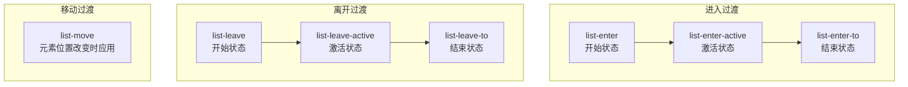
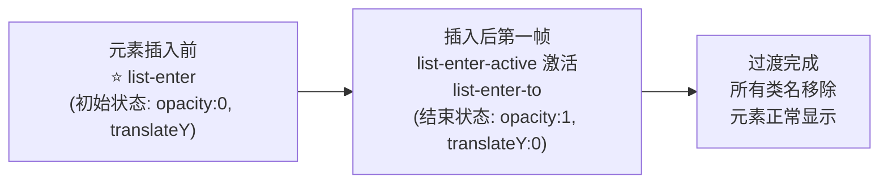
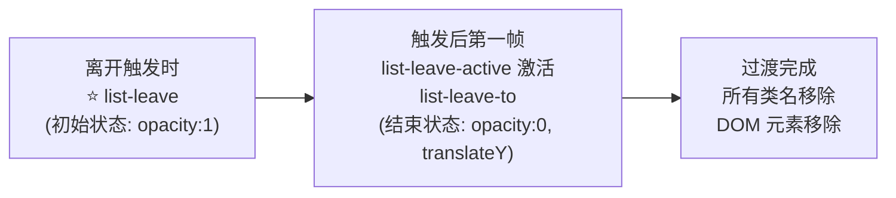

# 列表过渡 transition-group

## 概述

使用 `<transition-group>` 组件实现列表的添加、删除、排序动画。与 `<transition>` 组件不同，`<transition-group>` 可以同时渲染整个列表（如使用 `v-for`），并为列表项的增删改提供过渡动画效果。

### 适用场景

- 使用 `v-for` 渲染的列表项需要过渡动画
- 列表项的添加、删除、排序动画
- 需要平滑的列表位置变化动画

## transition-group 组件特性

`<transition-group>` 组件具有以下特点：

| 特性 | 说明 |
|------|------|
| **真实 DOM 元素** | 会以一个真实元素呈现，默认为 `<span>`，可通过 `tag` 属性更换 |
| **过渡模式** | 不支持过渡模式（`in-out` / `out-in`），因为不再相互切换特有元素 |
| **key 属性** | 内部元素**必须**提供唯一的 `key` 值 |
| **CSS 类名应用** | 过渡类名应用在内部元素中，而不是容器本身 |

### 组件属性

| 属性 | 类型 | 默认值 | 说明 |
|------|------|--------|------|
| `name` | String | `'v'` | 过渡类名前缀 |
| `tag` | String | `'span'` | 容器元素标签名 |
| `move-class` | String | - | 自定义移动过渡类名 |
| `appear` | Boolean | `false` | 是否在初始渲染时应用过渡 |
| `css` | Boolean | `true` | 是否使用 CSS 过渡类 |

### 过渡类名

`<transition-group>` 支持以下过渡类名（以 `name="list"` 为例）：



## 基本用法

```html
<!DOCTYPE html>
<html>
  <head>
    <meta charset="UTF-8">
    <script src="https://cdn.jsdelivr.net/npm/vue@2/dist/vue.js"></script>
    <style>
      .list-item {
        display: inline-block;
        margin-right: 10px;
      }
      .list-enter-active, .list-leave-active {
        transition: all 1s;
      }
      .list-enter, .list-leave-to {
        opacity: 0;
        transform: translateY(30px);
      }
    </style>
  </head>
  <body>
    <div id="list-demo">
      <button v-on:click="add">Add</button>
      <button v-on:click="remove">Remove</button>
      <transition-group name="list" tag="p">
        <span v-for="item in items" :key="item" class="list-item">
          {{ item }}
        </span>
      </transition-group>
    </div>

    <script>
      new Vue({
        el: '#list-demo',
        data: {
          items: [1, 2, 3, 4, 5, 6, 7, 8, 9],
          nextNum: 10
        },
        methods: {
          randomIndex: function () {
            return Math.floor(Math.random() * this.items.length)
          },
          add: function () {
            this.items.splice(this.randomIndex(), 0, this.nextNum++)
          },
          remove: function () {
            this.items.splice(this.randomIndex(), 1)
          }
        }
      })
    </script>
  </body>
</html>
```

> **注意**：上述示例中，当添加和移除元素时，周围的元素会瞬间移动到新位置，而不是平滑过渡。要实现平滑的位置移动，需要配合移动过渡（`v-move`）。

## 列表的进入/离开过渡

列表的进入/离开过渡使用与 `<transition>` 组件相同的 CSS 类名规则：

```css
/* 进入过渡 */
.list-enter { opacity: 0; transform: translateY(30px); }
.list-enter-active { transition: all 0.5s ease; }
.list-enter-to { opacity: 1; transform: translateY(0); }

/* 离开过渡 */
.list-leave { opacity: 1; }
.list-leave-active { transition: all 0.5s ease; }
.list-leave-to { opacity: 0; transform: translateY(30px); }
```

### 过渡时机图解

**进入过渡**



**离开过渡**



## 列表的移动过渡

`<transition-group>` 组件的特殊之处在于它可以实现元素位置变化的平滑过渡。通过 `v-move` 类名实现：

### 实现原理 - FLIP 动画

Vue 使用 [FLIP](https://aerotwist.com/blog/flip-your-animations/) 动画技术实现移动过渡：

1. **F**irst：记录元素当前位置
2. **L**ast：计算元素新位置
3. **I**nvert：使用 transform 将元素"反转"到起始位置
4. **P**lay：移除 transform，让元素平滑过渡到新位置

### 基本示例

```html
<!DOCTYPE html>
<html>
  <head>
    <meta charset="UTF-8">
    <script src="https://cdn.jsdelivr.net/npm/vue@2/dist/vue.js"></script>
    <script src="https://cdnjs.cloudflare.com/ajax/libs/lodash.js/4.14.1/lodash.min.js"></script>
    <style>
      .flip-list-move {
        transition: transform 1s;
      }
    </style>
  </head>
  <body>
    <div id="flip-list-demo">
      <button v-on:click="shuffle">Shuffle</button>
      <transition-group name="flip-list" tag="ul">
        <li v-for="item in items" :key="item">
          {{ item }}
        </li>
      </transition-group>
    </div>

    <script>
      new Vue({
        el: '#flip-list-demo',
        data: {
          items: [1, 2, 3, 4, 5, 6, 7, 8, 9]
        },
        methods: {
          shuffle: function () {
            this.items = _.shuffle(this.items)
          }
        }
      })
    </script>
  </body>
</html>
```

### 完整的进入/离开/移动过渡

将进入、离开和移动过渡结合使用：

```html
<!DOCTYPE html>
<html>
  <head>
    <meta charset="UTF-8">
    <script src="https://cdn.jsdelivr.net/npm/vue@2/dist/vue.js"></script>
    <script src="https://cdnjs.cloudflare.com/ajax/libs/lodash.js/4.14.1/lodash.min.js"></script>
    <style>
      .list-complete-item {
        transition: all 1s;
        display: inline-block;
        margin-right: 10px;
      }
      .list-complete-enter, .list-complete-leave-to {
        opacity: 0;
        transform: translateY(30px);
      }
      .list-complete-leave-active {
        position: absolute;
      }
    </style>
  </head>
  <body>
    <div id="list-complete-demo">
      <button v-on:click="shuffle">Shuffle</button>
      <button v-on:click="add">Add</button>
      <button v-on:click="remove">Remove</button>
      <transition-group name="list-complete" tag="p" style="position: relative;">
        <span v-for="item in items" :key="item" class="list-complete-item">
          {{ item }}
        </span>
      </transition-group>
    </div>

    <script>
      new Vue({
        el: '#list-complete-demo',
        data: {
          items: [1, 2, 3, 4, 5, 6, 7, 8, 9],
          nextNum: 10
        },
        methods: {
          randomIndex: function () {
            return Math.floor(Math.random() * this.items.length)
          },
          add: function () {
            this.items.splice(this.randomIndex(), 0, this.nextNum++)
          },
          remove: function () {
            this.items.splice(this.randomIndex(), 1)
          },
          shuffle: function () {
            this.items = _.shuffle(this.items)
          }
        }
      })
    </script>
  </body>
</html>
```

> **关键点**：离开过渡需要设置 `position: absolute`，这样元素离开时不会影响其他元素的布局，其他元素才能平滑移动到新位置。

### FLIP 过渡注意事项

- 使用 FLIP 过渡的元素不能设置为 `display: inline`
- 替代方案：使用 `display: inline-block` 或放置于 flex 容器中

## 列表的交错过渡

通过 JavaScript 钩子和 `data` 属性实现列表项的交错动画效果：

```html
<!DOCTYPE html>
<html>
  <head>
    <meta charset="UTF-8">
    <script src="https://cdn.jsdelivr.net/npm/vue@2/dist/vue.js"></script>
    <script src="https://cdnjs.cloudflare.com/ajax/libs/velocity/1.2.3/velocity.min.js"></script>
  </head>
  <body>
    <div id="staggered-list-demo">
      <input v-model="query" placeholder="搜索...">
      <transition-group
        name="staggered-fade"
        tag="ul"
        v-bind:css="false"
        v-on:before-enter="beforeEnter"
        v-on:enter="enter"
        v-on:leave="leave"
      >
        <li
          v-for="(item, index) in computedList"
          v-bind:key="item.msg"
          v-bind:data-index="index"
        >
          {{ item.msg }}
        </li>
      </transition-group>
    </div>

    <script>
      new Vue({
        el: '#staggered-list-demo',
        data: {
          query: '',
          list: [
            { msg: 'Bruce Lee' },
            { msg: 'Jackie Chan' },
            { msg: 'Chuck Norris' },
            { msg: 'Jet Li' },
            { msg: 'Kung Fury' }
          ]
        },
        computed: {
          computedList: function () {
            var vm = this
            return this.list.filter(function (item) {
              return item.msg.toLowerCase().indexOf(vm.query.toLowerCase()) !== -1
            })
          }
        },
        methods: {
          beforeEnter: function (el) {
            el.style.opacity = 0
            el.style.height = 0
          },
          enter: function (el, done) {
            var delay = el.dataset.index * 150
            setTimeout(function () {
              Velocity(
                el,
                { opacity: 1, height: '1.6em' },
                { complete: done }
              )
            }, delay)
          },
          leave: function (el, done) {
            var delay = el.dataset.index * 150
            setTimeout(function () {
              Velocity(
                el,
                { opacity: 0, height: 0 },
                { complete: done }
              )
            }, delay)
          }
        }
      })
    </script>
  </body>
</html>
```

### 交错过渡原理

1. 通过 `v-bind:data-index="index"` 将索引传递给 DOM 元素
2. 在 JavaScript 钩子中通过 `el.dataset.index` 获取索引
3. 使用 `setTimeout` 根据索引设置延迟，实现交错效果

## 完整示例

### 多维网格过渡

FLIP 动画同样适用于多维网格布局：

```html
<!DOCTYPE html>
<html>
  <head>
    <meta charset="UTF-8">
    <script src="https://cdn.jsdelivr.net/npm/vue@2/dist/vue.js"></script>
    <script src="https://cdnjs.cloudflare.com/ajax/libs/lodash.js/4.14.1/lodash.min.js"></script>
    <style>
      .container {
        display: flex;
        flex-wrap: wrap;
        width: 238px;
        margin-top: 10px;
      }
      .cell {
        display: flex;
        justify-content: space-around;
        align-items: center;
        width: 25px;
        height: 25px;
        border: 1px solid #aaa;
        margin-right: -1px;
        margin-bottom: -1px;
      }
      .cell:nth-child(3n) {
        margin-right: 0;
      }
      .cell:nth-child(27n) {
        margin-bottom: 0;
      }
      .cell-move {
        transition: transform 1s;
      }
    </style>
  </head>
  <body>
    <div id="sudoku-demo">
      <h1>Lazy Sudoku</h1>
      <p>点击按钮打乱顺序</p>
      <button @click="shuffle">Shuffle</button>
      <transition-group name="cell" tag="div" class="container">
        <div v-for="cell in cells" :key="cell.id" class="cell">
          {{ cell.number }}
        </div>
      </transition-group>
    </div>

    <script>
      new Vue({
        el: "#sudoku-demo",
        data: {
          cells: Array.apply(null, { length: 81 }).map(function (_, index) {
            return {
              id: index,
              number: (index % 9) + 1
            }
          })
        },
        methods: {
          shuffle: function () {
            this.cells = _.shuffle(this.cells)
          }
        }
      })
    </script>
  </body>
</html>
```

## 最佳实践

### 1. 始终使用唯一的 key

```html
<!-- 推荐：使用唯一标识符 -->
<transition-group name="list" tag="ul">
  <li v-for="item in items" :key="item.id">{{ item.name }}</li>
</transition-group>

<!-- 避免：使用索引作为 key -->
<transition-group name="list" tag="ul">
  <li v-for="(item, index) in items" :key="index">{{ item.name }}</li>
</transition-group>
```

### 2. 正确设置离开元素的定位

```css
/* 使离开的元素脱离文档流，让其他元素平滑移动 */
.list-leave-active {
  position: absolute;
}
```

### 3. 使用合适的 display 属性

```css
/* 推荐 */
.list-item {
  display: inline-block;
  /* 或 */
  display: flex;
}

/* 避免：FLIP 动画不支持 inline */
.list-item {
  display: inline;
}
```

### 4. 优化性能

```javascript
// 对于大型列表，考虑使用虚拟滚动
// 仅对可见区域内的元素应用过渡
```

## 常见问题

### Q: 为什么移动过渡不生效？

**A:** 检查以下几点：
1. 元素是否设置了 `display: inline`（需要改为 `inline-block` 或 `flex`）
2. 离开元素是否设置了 `position: absolute`
3. 是否正确设置了 `v-move` 类的过渡时间

### Q: 如何自定义 move 类名？

**A:** 使用 `move-class` 属性：

```html
<transition-group name="list" move-class="custom-move" tag="ul">
  <!-- ... -->
</transition-group>

<style>
  .custom-move {
    transition: transform 0.5s ease;
  }
</style>
```

### Q: transition-group 与 transition 的区别？

| 特性 | `<transition>` | `<transition-group>` |
|------|----------------|---------------------|
| 渲染方式 | 不会渲染真实 DOM 元素 | 渲染真实 DOM 元素（默认 span） |
| 适用场景 | 单元素/组件过渡 | 列表过渡（v-for） |
| 过渡模式 | 支持 in-out / out-in | 不支持 |
| key 属性 | 多元素切换时需要 | 始终必须 |
| 移动过渡 | 不支持 | 支持 v-move |

### Q: 如何实现列表的初始渲染动画？

**A:** 使用 `appear` 属性：

```html
<transition-group appear name="list" tag="ul">
  <li v-for="item in items" :key="item.id">{{ item.name }}</li>
</transition-group>
```

或自定义初始渲染类名：

```html
<transition-group
  appear
  appear-class="custom-appear"
  appear-to-class="custom-appear-to"
  appear-active-class="custom-appear-active"
  name="list"
  tag="ul"
>
  <li v-for="item in items" :key="item.id">{{ item.name }}</li>
</transition-group>
```
