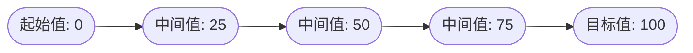
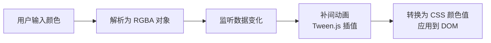

# 状态动画与第三方库

## 概述

Vue 的过渡系统提供了简单的方法来设置进入、离开和列表的动效。但对于数据元素本身的动效，例如：

- **数字和运算**：数值变化时的平滑过渡
- **颜色的显示**：颜色值之间的渐变动画
- **SVG 节点的位置**：图形元素的位移动画
- **元素的大小和其他 property**：尺寸、透明度等属性的变化动画

这些数据要么本身就以数值形式存储，要么可以转换为数值。结合 Vue 的响应式系统和组件系统，配合第三方动画库，可以实现丰富的状态过渡效果。

### 与元素过渡的区别

| 特性     | 元素过渡             | 状态过渡                   |
| -------- | -------------------- | -------------------------- |
| 触发方式 | `v-if`/`v-show` 切换 | 数据值变化                 |
| 实现方式 | CSS 过渡/动画        | JavaScript 动画            |
| 适用场景 | DOM 元素的显示/隐藏  | 数值、颜色等数据的平滑变化 |
| 核心组件 | `<transition>`       | 侦听器 + 动画库            |

## 核心概念

### 补间动画（Tweening）

补间动画是指在两个状态之间插入中间帧，使变化过程平滑过渡的技术。状态过渡的核心就是补间动画：



### 响应式数据驱动

Vue 的响应式系统可以监听数据变化，当数据更新时触发动画：

```javascript
watch: {
  number: function (newValue) {
    // 当 number 变化时，执行补间动画
    gsap.to(this.$data, { duration: 0.5, tweenedNumber: newValue });
  }
}
```

## 适用场景

### 1. 数据可视化

- 图表数值变化动画
- 进度条平滑过渡
- 仪表盘指针移动

### 2. 交互反馈

- 购物车数量变化
- 评分组件动画
- 计数器效果

### 3. 游戏与创意应用

- SVG 图形变形
- 粒子效果
- 角色状态动画

## 状态动画与侦听器

### 数字动画

通过侦听器监听数值变化，使用 [GSAP](https://greensock.com/) 实现数字的平滑过渡：

```html
<!DOCTYPE html>
<html>
  <head>
    <meta charset="utf-8" />
    <title>数字动画示例</title>
    <script src="https://cdnjs.cloudflare.com/ajax/libs/gsap/3.2.4/gsap.min.js"></script>
    <script src="https://cdn.jsdelivr.net/npm/vue@2/dist/vue.js"></script>
  </head>
  <body>
    <div id="animated-number-demo">
      <input v-model.number="number" type="number" step="20" />
      <p>{{ animatedNumber }}</p>
    </div>
    <script>
      new Vue({
        el: "#animated-number-demo",
        data: {
          number: 0,
          tweenedNumber: 0
        },
        computed: {
          animatedNumber: function () {
            return this.tweenedNumber.toFixed(0)
          }
        },
        watch: {
          number: function (newValue) {
            gsap.to(this.$data, { duration: 0.5, tweenedNumber: newValue })
          }
        }
      })
    </script>
  </body>
</html>
```

**代码说明**：

| 部分             | 作用                                  |
| ---------------- | ------------------------------------- |
| `tweenedNumber`  | 存储动画过程中的中间值                |
| `animatedNumber` | 计算属性，格式化显示数值              |
| `watch`          | 监听 `number` 变化，触发 GSAP 动画    |
| `gsap.to()`      | 将 `tweenedNumber` 从当前值过渡到新值 |

### 颜色动画

对于 CSS 颜色值，可以使用 [Tween.js](https://github.com/tweenjs/tween.js) 和 [Color.js](https://github.com/brehaut/color-js) 实现颜色渐变：

```html
<!DOCTYPE html>
<html>
  <head>
    <meta charset="utf-8" />
    <title>颜色动画示例</title>
    <script src="https://cdn.jsdelivr.net/npm/vue@2/dist/vue.js"></script>
    <script src="https://cdn.jsdelivr.net/npm/tween.js@16.3.4"></script>
    <script src="https://cdn.jsdelivr.net/npm/color-js@1.0.3"></script>
    <style>
      .color-preview {
        display: inline-block;
        width: 50px;
        height: 50px;
        border: 1px solid #ccc;
      }
    </style>
  </head>
  <body>
    <div id="example">
      <input
        v-model="colorQuery"
        v-on:keyup.enter="updateColor"
        placeholder="输入颜色值（如 #ff0000）" />
      <button v-on:click="updateColor">更新颜色</button>
      <p>预览：</p>
      <span v-bind:style="{ backgroundColor: tweenedCSSColor }" class="color-preview"></span>
      <p>{{ tweenedCSSColor }}</p>
    </div>
    <script>
      var Color = net.brehaut.Color

      new Vue({
        el: "#example",
        data: {
          colorQuery: "",
          color: {
            red: 0,
            green: 0,
            blue: 0,
            alpha: 1
          },
          tweenedColor: {}
        },
        created: function () {
          this.tweenedColor = Object.assign({}, this.color)
        },
        watch: {
          color: function () {
            function animate() {
              if (TWEEN.update()) {
                requestAnimationFrame(animate)
              }
            }

            new TWEEN.Tween(this.tweenedColor).to(this.color, 750).start()

            animate()
          }
        },
        computed: {
          tweenedCSSColor: function () {
            return new Color({
              red: this.tweenedColor.red,
              green: this.tweenedColor.green,
              blue: this.tweenedColor.blue,
              alpha: this.tweenedColor.alpha
            }).toCSS()
          }
        },
        methods: {
          updateColor: function () {
            this.color = new Color(this.colorQuery).toRGB()
            this.colorQuery = ""
          }
        }
      })
    </script>
  </body>
</html>
```

**颜色动画原理**：



## 动态状态过渡

数据驱动的状态过渡可以实时更新，非常适合原型设计。通过修改变量，即使是简单的 SVG 多边形也能实现复杂效果：

```html
<!DOCTYPE html>
<html>
  <head>
    <meta charset="utf-8" />
    <title>动态 SVG 多边形</title>
    <script src="https://cdn.jsdelivr.net/npm/vue@2/dist/vue.js"></script>
    <script src="https://cdnjs.cloudflare.com/ajax/libs/gsap/1.18.5/TweenLite.min.js"></script>
    <style>
      svg {
        display: block;
      }
      polygon {
        fill: #41b883;
      }
      circle {
        fill: transparent;
        stroke: #35495e;
      }
      input[type="range"] {
        display: block;
        width: 100%;
        margin-bottom: 15px;
      }
    </style>
  </head>
  <body>
    <div id="app">
      <svg width="200" height="200">
        <polygon :points="points"></polygon>
        <circle cx="100" cy="100" r="90"></circle>
      </svg>
      <label>边数: {{ sides }}</label>
      <input type="range" min="3" max="500" v-model.number="sides" />
      <label>最小半径: {{ minRadius }}%</label>
      <input type="range" min="0" max="90" v-model.number="minRadius" />
      <label>更新间隔: {{ updateInterval }} 毫秒</label>
      <input type="range" min="10" max="2000" v-model.number="updateInterval" />
    </div>
    <script>
      new Vue({
        el: "#app",
        data: function () {
          var defaultSides = 10
          var stats = Array.apply(null, { length: defaultSides }).map(function () {
            return 100
          })
          return {
            stats: stats,
            points: generatePoints(stats),
            sides: defaultSides,
            minRadius: 50,
            interval: null,
            updateInterval: 500
          }
        },
        watch: {
          sides: function (newSides, oldSides) {
            var sidesDifference = newSides - oldSides
            if (sidesDifference > 0) {
              for (var i = 1; i <= sidesDifference; i++) {
                this.stats.push(this.newRandomValue())
              }
            } else {
              var absoluteSidesDifference = Math.abs(sidesDifference)
              for (var i = 1; i <= absoluteSidesDifference; i++) {
                this.stats.shift()
              }
            }
          },
          stats: function (newStats) {
            TweenLite.to(this.$data, this.updateInterval / 1000, {
              points: generatePoints(newStats)
            })
          },
          updateInterval: function () {
            this.resetInterval()
          }
        },
        mounted: function () {
          this.resetInterval()
        },
        methods: {
          randomizeStats: function () {
            var vm = this
            this.stats = this.stats.map(function () {
              return vm.newRandomValue()
            })
          },
          newRandomValue: function () {
            return Math.ceil(this.minRadius + Math.random() * (100 - this.minRadius))
          },
          resetInterval: function () {
            var vm = this
            clearInterval(this.interval)
            this.randomizeStats()
            this.interval = setInterval(function () {
              vm.randomizeStats()
            }, this.updateInterval)
          }
        }
      })

      function valueToPoint(value, index, total) {
        var x = 0
        var y = -value * 0.9
        var angle = ((Math.PI * 2) / total) * index
        var cos = Math.cos(angle)
        var sin = Math.sin(angle)
        var tx = x * cos - y * sin + 100
        var ty = x * sin + y * cos + 100
        return { x: tx, y: ty }
      }

      function generatePoints(stats) {
        var total = stats.length
        return stats
          .map(function (stat, index) {
            var point = valueToPoint(stat, index, total)
            return point.x + "," + point.y
          })
          .join(" ")
      }
    </script>
  </body>
</html>
```

**动态过渡特点**：

- 实时响应参数变化
- 支持复杂的 SVG 图形变形
- 可自定义动画更新频率

## 组件化过渡

当状态过渡逻辑变得复杂时，可以将其封装为可复用的子组件：

```html
<!DOCTYPE html>
<html>
  <head>
    <meta charset="utf-8" />
    <title>组件化数字动画</title>
    <script src="https://cdn.jsdelivr.net/npm/vue@2/dist/vue.js"></script>
    <script src="https://cdn.jsdelivr.net/npm/tween.js@16.3.4"></script>
  </head>
  <body>
    <div id="example">
      <input v-model.number="firstNumber" type="number" step="20" /> +
      <input v-model.number="secondNumber" type="number" step="20" /> = {{ result }}
      <p>
        <animated-integer v-bind:value="firstNumber"></animated-integer>
        +
        <animated-integer v-bind:value="secondNumber"></animated-integer>
        =
        <animated-integer v-bind:value="result"></animated-integer>
      </p>
    </div>
    <script>
      Vue.component("animated-integer", {
        template: "<span>{{ tweeningValue }}</span>",
        props: {
          value: {
            type: Number,
            required: true
          }
        },
        data: function () {
          return {
            tweeningValue: 0
          }
        },
        watch: {
          value: function (newValue, oldValue) {
            this.tween(oldValue, newValue)
          }
        },
        mounted: function () {
          this.tween(0, this.value)
        },
        methods: {
          tween: function (startValue, endValue) {
            var vm = this

            function animate() {
              if (TWEEN.update()) {
                requestAnimationFrame(animate)
              }
            }

            new TWEEN.Tween({ tweeningValue: startValue })
              .to({ tweeningValue: endValue }, 500)
              .onUpdate(function () {
                vm.tweeningValue = this.tweeningValue.toFixed(0)
              })
              .start()

            animate()
          }
        }
      })

      new Vue({
        el: "#example",
        data: {
          firstNumber: 20,
          secondNumber: 40
        },
        computed: {
          result: function () {
            return this.firstNumber + this.secondNumber
          }
        }
      })
    </script>
  </body>
</html>
```

**组件化的优势**：

| 优势     | 说明                    |
| -------- | ----------------------- |
| 复用性   | 动画逻辑可在多处使用    |
| 可维护性 | 复杂度从主实例中分离    |
| 可测试性 | 组件可独立测试          |
| 可配置性 | 通过 props 定制动画参数 |

## 第三方动画库

### GSAP

[GSAP (GreenSock Animation Platform)](https://greensock.com/) 是业界最强大的 JavaScript 动画库之一。

**特点**：

- 高性能，流畅的动画效果
- 丰富的缓动函数（Easing）
- 支持时间线（Timeline）控制
- 优秀的浏览器兼容性

**基本用法**：

```javascript
// 简单过渡
gsap.to(obj, { duration: 1, x: 100, opacity: 0.5 })

// 时间线动画
var tl = gsap.timeline()
tl.to(obj, { duration: 0.5, x: 100 }).to(obj, { duration: 0.5, y: 50 })

// 缓动函数
gsap.to(obj, {
  duration: 1,
  x: 100,
  ease: "power2.out"
})
```

**常用缓动函数**：

| 缓动名称      | 效果描述 |
| ------------- | -------- |
| `power1.out`  | 轻微减速 |
| `power2.out`  | 中等减速 |
| `power3.out`  | 强烈减速 |
| `elastic.out` | 弹性效果 |
| `bounce.out`  | 弹跳效果 |

### Tween.js

[Tween.js](https://github.com/tweenjs/tween.js) 是一个轻量级的补间动画库。

**特点**：

- 体积小巧
- API 简洁
- 支持链式调用

**基本用法**：

```javascript
// 创建补间动画
var tween = new TWEEN.Tween({ x: 0 })
  .to({ x: 100 }, 1000)
  .easing(TWEEN.Easing.Quadratic.Out)
  .onUpdate(function () {
    console.log(this.x)
  })
  .start()

// 动画循环
function animate() {
  requestAnimationFrame(animate)
  TWEEN.update()
}
animate()
```

## 最佳实践

### 1. 选择合适的动画库

| 场景         | 推荐库                      |
| ------------ | --------------------------- |
| 简单数值过渡 | 原生 JavaScript 或 Tween.js |
| 复杂动画序列 | GSAP                        |
| SVG 动画     | GSAP 或 Snap.svg            |
| 物理动画     | Popmotion 或 dynamics.js    |

### 2. 性能优化

```javascript
// 使用 requestAnimationFrame
function animate() {
  if (TWEEN.update()) {
    requestAnimationFrame(animate)
  }
}

// 避免在动画中频繁访问 DOM
// 将计算结果缓存到变量中
```

### 3. 合理设置动画时长

| 类型     | 建议时长   |
| -------- | ---------- |
| 微交互   | 100-300ms  |
| 状态变化 | 300-500ms  |
| 复杂动画 | 500-1000ms |

### 4. 提供无障碍支持

```javascript
// 检测用户偏好
const prefersReducedMotion = window.matchMedia("(prefers-reduced-motion: reduce)").matches

if (prefersReducedMotion) {
  // 跳过动画，直接设置最终值
  this.tweenedNumber = this.number
} else {
  // 执行动画
  gsap.to(this.$data, { duration: 0.5, tweenedNumber: this.number })
}
```

## 常见问题

### Q1: 为什么动画不流畅？

**可能原因**：

1. 动画更新频率过高，导致性能问题
2. 在动画回调中执行了耗时操作
3. 同时运行过多动画实例

**解决方案**：

```javascript
// 使用节流控制更新频率
var lastTime = 0;
watch: {
  value: function (newValue) {
    var now = Date.now();
    if (now - lastTime > 16) { // 约 60fps
      lastTime = now;
      gsap.to(this.$data, { duration: 0.5, tweenedValue: newValue });
    }
  }
}
```

### Q2: 如何处理动画中断？

当动画过程中数据再次变化时，需要处理动画中断：

```javascript
watch: {
  number: function (newValue) {
    // GSAP 会自动处理中断，继续从当前位置过渡到新值
    gsap.to(this.$data, {
      duration: 0.5,
      tweenedNumber: newValue
    });
  }
}
```

### Q3: 如何实现非线性动画？

使用缓动函数实现非线性效果：

```javascript
// GSAP
gsap.to(obj, {
  duration: 1,
  x: 100,
  ease: "elastic.out(1, 0.3)"
})

// Tween.js
new TWEEN.Tween(obj).to({ x: 100 }, 1000).easing(TWEEN.Easing.Elastic.Out).start()
```

### Q4: 如何在 Vue 组件销毁时清理动画？

```javascript
export default {
  data() {
    return {
      animation: null
    }
  },
  methods: {
    startAnimation() {
      this.animation = gsap.to(this.$data, {
        duration: 1,
        value: 100
      })
    }
  },
  beforeDestroy() {
    // 清理动画
    if (this.animation) {
      this.animation.kill()
    }
  }
}
```

### Q5: 状态过渡与 CSS 过渡如何选择？

| 特性     | 状态过渡        | CSS 过渡          |
| -------- | --------------- | ----------------- |
| 实现方式 | JavaScript      | CSS               |
| 控制粒度 | 精细            | 粗粒度            |
| 性能     | 依赖 JS 引擎    | GPU 加速          |
| 适用场景 | 数值、颜色、SVG | DOM 元素显示/隐藏 |
| 复杂度   | 较高            | 较低              |

---

## 赋予设计以生命

动画可以为静态设计带来生命力。当设计师创建图标、logo 和吉祥物时，交付的通常是图片或静态 SVG。通过 Vue 的状态过渡，可以让这些元素"活起来"。

GitHub 的章鱼猫、Twitter 的小鸟等 logo 都可以通过状态过渡实现：

- 兴奋状态（快速摆动）
- 思考状态（缓慢晃动）
- 警戒状态（注视动画）

**参考示例**：Sarah Drasner 的交互式动画演示

- [CodePen 演示](https://codepen.io/sdras/pen/YZBGNp)


---
