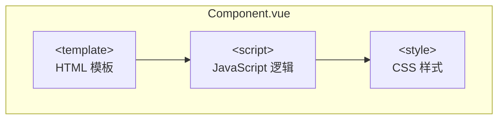
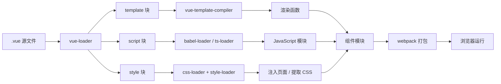

# 单文件组件与 vue-loader

## 概述

单文件组件（Single-File Component，简称 SFC）是 Vue.js 特有的一种组件定义方式，使用 `.vue` 作为文件扩展名。它将组件的模板、逻辑和样式封装在同一个文件中，实现了组件的高内聚和低耦合。



## 传统方式的局限性

在很多 Vue 项目中使用 `Vue.component` 来定义全局组件，紧接着用 `new Vue({ el: '#container' })` 在每个页面内指定一个容器元素。

这种方式在很多中小规模的项目中运作得很好，在这些项目里 JavaScript 只被用来加强特定的视图。但当在更复杂的项目中，或者你的前端完全由 JavaScript 驱动的时候，下面这些缺点将变得非常明显：

| 问题         | 描述                                        | 影响                         |
| ------------ | ------------------------------------------- | ---------------------------- |
| 全局定义     | 强制要求每个 component 中的命名不得重复     | 大型项目命名冲突风险高       |
| 字符串模板   | 缺乏语法高亮，多行 HTML 需要使用 `\` 拼接   | 代码可读性差，维护困难       |
| 不支持 CSS   | HTML 和 JavaScript 组件化时，CSS 明显被遗漏 | 样式管理混乱                 |
| 没有构建步骤 | 限制只能使用 HTML 和 ES5 JavaScript         | 无法使用预处理器提升开发效率 |

## 单文件组件的优势

文件扩展名为 `.vue` 的单文件组件为以上所有问题提供了解决方案：

### 基础示例

```vue
<template>
  <p>{{ greeting }} World!</p>
</template>

<script>
  module.exports = {
    data: function () {
      return {
        greeting: "Hello"
      }
    }
  }
</script>

<style scoped>
  p {
    font-size: 2em;
    text-align: center;
  }
</style>
```

### 核心优势

| 特性           | 说明                                           |
| -------------- | ---------------------------------------------- |
| 完整语法高亮   | 编辑器可识别模板、脚本、样式区块，提供语法高亮 |
| CommonJS 模块  | 组件可导入导出，实现模块化开发                 |
| 组件作用域 CSS | 通过 `scoped` 属性实现样式隔离                 |
| 预处理器支持   | 支持 Pug、Babel、TypeScript、SCSS、Stylus 等   |

## 预处理器支持

可以使用预处理器来构建简洁和功能更丰富的组件：

```vue
<template lang="jade">
div
  p {{ greeting }} World!
  OtherComponent
</template>

<script>
  import OtherComponent from "./OtherComponent.vue"
  export default {
    components: {
      OtherComponent
    },
    data() {
      return {
        greeting: "Hello"
      }
    }
  }
</script>

<style lang="stylus" scoped>
  p
    font-size 2em
    text-align center
</style>
```

### 常用预处理器配置

| 区块     | 预处理器   | lang 属性值                   |
| -------- | ---------- | ----------------------------- |
| template | Pug        | `lang="pug"` 或 `lang="jade"` |
| script   | TypeScript | `lang="ts"`                   |
| script   | Babel      | 默认支持，无需指定            |
| style    | SCSS       | `lang="scss"`                 |
| style    | SASS       | `lang="sass"`                 |
| style    | Less       | `lang="less"`                 |
| style    | Stylus     | `lang="stylus"`               |

## 关注点分离

**关注点分离不等于文件类型分离。** 在现代 UI 开发中，相比于把代码库分离成三个大的层次并将其相互交织起来，把它们划分为松散耦合的组件再将其组合起来更合理一些。

在一个组件里，其模板、逻辑和样式是内部耦合的，并且搭配在一起实际上使得组件更加内聚且更可维护。

### 文件分离方案

即便你不喜欢单文件组件，可以把 JavaScript、CSS 分离成独立的文件然后做到热重载和预编译：

```html
<!-- my-component.vue -->
<template>
  <div>This will be pre-compiled</div>
</template>
<script src="./my-component.js"></script>
<style src="./my-component.css"></style>
```

```javascript
// my-component.js
export default {
  data() {
    return {
      message: "Hello Vue!"
    }
  }
}
```

```css
/* my-component.css */
div {
  color: #42b983;
}
```

## vue-loader 配置

关于 vue-loader 的详细 webpack 配置（包括基础配置、VueLoaderPlugin、配置选项、资源处理、CSS Modules、热重载、预处理器配置、PostCSS 配置、scoped 样式等），请参阅 [Vue Loader 官方文档](https://vue-loader.vuejs.org/zh/guide/)。

## 完整组件示例

以下是一个功能完整的单文件组件示例：

```vue
<template>
  <div class="user-card">
    
    <div class="info">
      <h3>{{ user.name }}</h3>
      <p>{{ user.email }}</p>
      <button @click="handleClick">查看详情</button>
    </div>
  </div>
</template>

<script>
  export default {
    name: "UserCard",
    props: {
      user: {
        type: Object,
        required: true,
        validator(value) {
          return value.name && value.email
        }
      }
    },
    methods: {
      handleClick() {
        this.$emit("view-detail", this.user)
      }
    }
  }
</script>

<style scoped>
  .user-card {
    display: flex;
    align-items: center;
    padding: 16px;
    border: 1px solid #e0e0e0;
    border-radius: 8px;
  }

  .avatar {
    width: 60px;
    height: 60px;
    border-radius: 50%;
    margin-right: 16px;
  }

  .info h3 {
    margin: 0 0 8px 0;
    color: #333;
  }

  .info p {
    margin: 0 0 12px 0;
    color: #666;
  }

  button {
    padding: 8px 16px;
    background-color: #42b983;
    color: white;
    border: none;
    border-radius: 4px;
    cursor: pointer;
  }

  button:hover {
    background-color: #3aa876;
  }
</style>
```

## 常见问题解答

### 1. 单文件组件如何实现样式隔离？

使用 `scoped` 属性，vue-loader 会为组件内的 CSS 添加唯一属性选择器：

```vue
<style scoped>
  .example {
    color: red;
  }
</style>
```

编译后：

```css
.example[data-v-f3f3eg9] {
  color: red;
}
```

### 2. 如何在单文件组件中使用 TypeScript？

在 `<script>` 标签添加 `lang="ts"` 属性：

```vue
<script lang="ts">
  import { Vue, Component, Prop } from "vue-property-decorator"

  @Component
  export default class MyComponent extends Vue {
    @Prop({ type: String, required: true })
    message!: string

    count: number = 0

    increment(): void {
      this.count++
    }
  }
</script>
```

### 3. 单文件组件可以继承吗？

可以，使用 `extends` 选项或 mixins：

```vue
<script>
  import BaseButton from "./BaseButton.vue"

  export default {
    extends: BaseButton,
    data() {
      return {
        // 覆盖或扩展父组件数据
      }
    }
  }
</script>
```

### 4. 如何处理全局样式和组件样式？

```vue
<style>
  /* 全局样式，无 scoped */
  .global-class {
    color: blue;
  }
</style>

<style scoped>
  /* 组件作用域样式 */
  .local-class {
    color: red;
  }
</style>
```

### 5. 单文件组件如何实现按需加载？

使用动态导入语法：

```javascript
const AsyncComponent = () => import("./AsyncComponent.vue")

export default {
  components: {
    AsyncComponent
  }
}
```

## SFC 编译管线



## 构建工具推荐

### Vue CLI

CLI 会为你搞定大多数工具的配置问题，同时也支持细粒度自定义[配置项](https://cli.vuejs.org/zh/config/)。

```bash
# 安装 Vue CLI
npm install -g @vue/cli

# 创建项目
vue create my-project

# 运行开发服务器
npm run serve
```

### 手动配置 webpack

有时你会想从零搭建你自己的构建工具，这时你需要通过 [Vue Loader](https://vue-loader.vuejs.org/zh/) 手动配置 webpack。关于学习更多 webpack 的内容，请查阅[其官方文档](https://webpack.js.org/configuration/)和 [Webpack Academy](https://webpack.academy/p/the-core-concepts)。

## 相关资源

- [Vue Loader 官方文档](https://vue-loader.vuejs.org/zh/)
- [Vue CLI 官方文档](https://cli.vuejs.org/zh/)
- [webpack 官方文档](https://webpack.js.org/)
- [awesome-vue 编辑器支持](https://github.com/vuejs/awesome-vue#source-code-editing)

---
