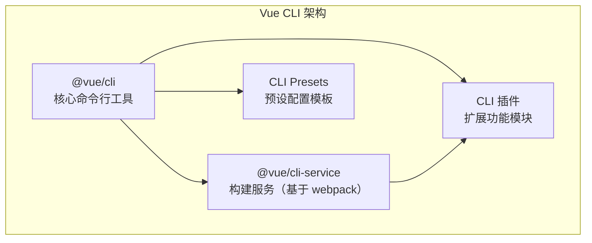
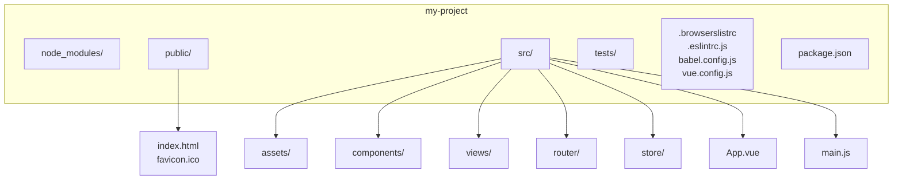

# Vue CLI

## 概述

Vue CLI 是 Vue.js 开发的标准工具，提供完整的项目脚手架和构建配置。它基于 webpack 构建，内置了丰富的配置选项和插件系统，能够快速搭建 Vue 项目开发环境。

> **时效提示**：截至 2026-09，Vue CLI 已进入维护模式，官方推荐新项目改用 `create-vue`（基于 Vite）创建；本篇内容适用于 Vue 2 存量项目的维护与二次开发。

### 核心特性

- **项目脚手架**：通过交互式的命令行界面快速创建项目
- **插件体系**：功能可插拔，按需集成各种工具和库
- **图形化界面**：提供 GUI 界面管理项目
- **快速原型开发**：直接运行 .vue 或 .js 文件
- **零配置原型**：无需配置即可开始开发

### 系统架构



## 安装

### 环境要求

- Node.js 8.9 或更高版本（推荐 10.x 及以上）
- npm 或 yarn 包管理器

### 安装方式

```bash
# 使用 npm 安装
npm install -g @vue/cli

# 使用 yarn 安装
yarn global add @vue/cli

# 验证安装
vue --version
```

### 版本升级

```bash
# npm 升级
npm update -g @vue/cli

# yarn 升级  
yarn global upgrade @vue/cli
```

## 创建项目

### 交互式创建

```bash
# 创建新项目
vue create my-project

# 使用图形化界面创建
vue ui
```

#### 交互选项说明

创建项目时会提示选择预设配置：

1. **默认预设 (Default preset)**：
   - Babel
   - ESLint
   
2. **手动选择特性 (Manually select features)**：
   - Babel：ES6+ 语法转换
   - TypeScript：TypeScript 支持
   - Progressive Web App (PWA) Support：PWA 支持
   - Router：vue-router 路由
   - Vuex：状态管理
   - CSS Pre-processors：CSS 预处理器
   - Linter / Formatter：代码规范
   - Unit Testing：单元测试
   - E2E Testing：端到端测试

### 使用预设模板

```bash
# 使用 2.x 旧版模板（旧版模板系统，Vue CLI 3+ 需另行安装 @vue/cli-init）
vue init webpack my-project

# 使用本地预设
vue create my-project --preset ./my-preset.json

# 远程 git 仓库预设
vue create my-project --preset username/repo
```

### 快速原型开发

```bash
# 安装全局服务
npm install -g @vue/cli-service-global

# 快速运行 .vue 文件
vue serve MyComponent.vue

# 构建 .vue 文件为生产版本
vue build MyComponent.vue
```

## 项目结构

### 标准目录结构



```
my-project/
├── node_modules/          # 依赖包
├── public/                # 静态资源（不经过 webpack）
│   ├── favicon.ico
│   └── index.html         # HTML 模板
├── src/                   # 源代码
│   ├── assets/            # 静态资源（经过 webpack）
│   ├── components/        # 组件目录
│   ├── views/             # 页面视图
│   ├── router/            # 路由配置
│   ├── store/             # Vuex 状态管理
│   ├── App.vue            # 根组件
│   └── main.js            # 入口文件
├── tests/                 # 测试文件
├── .browserslistrc        # 浏览器兼容配置
├── .eslintrc.js           # ESLint 配置
├── .gitignore
├── babel.config.js        # Babel 配置
├── package.json           # 项目配置
├── README.md
└── vue.config.js          # Vue CLI 配置
```

### 目录说明

| 目录/文件 | 说明 |
|----------|------|
| `public/` | 存放不会被打包处理的静态资源，通过绝对路径引用 |
| `src/assets/` | 存放会被 webpack 处理的资源，使用相对路径引用 |
| `src/components/` | 可复用组件 |
| `src/views/` | 页面级组件 |
| `src/router/` | 路由配置文件 |
| `src/store/` | Vuex 状态管理文件 |

## 配置文件

### vue.config.js

`vue.config.js` 是可选的配置文件，位于项目根目录：

```javascript
// vue.config.js
const path = require('path')

module.exports = {
  // 基本路径
  publicPath: process.env.NODE_ENV === 'production' 
    ? '/production-sub-path/' 
    : '/',
  
  // 输出文件目录
  outputDir: 'dist',
  
  // 静态资源目录
  assetsDir: 'static',
  
  // 生成的 index.html 路径
  indexPath: 'index.html',
  
  // 文件名哈希
  filenameHashing: true,
  
  // 生产环境 sourceMap
  productionSourceMap: false,
  
  // 开发服务器配置
  devServer: {
    // 端口号
    port: 8080,
    
    // 主机地址
    host: 'localhost',
    
    // 自动打开浏览器
    open: true,
    
    // 代理配置
    proxy: {
      '/api': {
        target: 'http://localhost:3000',
        changeOrigin: true,
        pathRewrite: {
          '^/api': ''
        }
      }
    },
    
    // 热重载
    hot: true,
    
    // 压缩
    compress: true
  },
  
  // webpack 配置
  configureWebpack: {
    resolve: {
      alias: {
        '@': path.resolve(__dirname, 'src'),
        'components': path.resolve(__dirname, 'src/components')
      }
    },
    plugins: []
  },
  
  // 链式配置 webpack
  chainWebpack: config => {
    // 修改 loader 配置
    config.module
      .rule('images')
      .use('url-loader')
      .loader('url-loader')
      .tap(options => Object.assign(options, { limit: 10240 }))
    
    // 添加新的 loader
    config.module
      .rule('markdown')
      .test(/\.md$/)
      .use('html-loader')
      .loader('html-loader')
  },
  
  // CSS 配置
  css: {
    // 启用 CSS modules
    requireModuleExtension: true,
    
    // 提取 CSS 到单独文件
    extract: process.env.NODE_ENV === 'production',
    
    // 开启 sourceMap
    sourceMap: false,
    
    // CSS 预处理器配置
    loaderOptions: {
      css: {
        // CSS loader 配置
      },
      sass: {
        // Sass loader 配置
        // 注意：Vue CLI 3/4（sass-loader 7/8）使用 prependData，CLI 5（sass-loader 10+）改为 additionalData
        additionalData: `@import "@/styles/variables.scss";`
      }
    }
  },
  
  // 第三方插件配置
  pluginOptions: {
    'style-resources-loader': {
      preProcessor: 'scss',
      patterns: [
        path.resolve(__dirname, './src/styles/_variables.scss')
      ]
    }
  }
}
```

### package.json 配置

```json
{
  "name": "my-project",
  "version": "1.0.0",
  "scripts": {
    "serve": "vue-cli-service serve",
    "build": "vue-cli-service build",
    "lint": "vue-cli-service lint",
    "test:unit": "vue-cli-service test:unit",
    "test:e2e": "vue-cli-service test:e2e"
  },
  "dependencies": {
    "vue": "^2.6.14",
    "vue-router": "^3.5.3",
    "vuex": "^3.6.2"
  },
  "devDependencies": {
    "@vue/cli-plugin-babel": "~5.0.0",
    "@vue/cli-plugin-eslint": "~5.0.0",
    "@vue/cli-service": "~5.0.0"
  },
  "browserslist": [
    "> 1%",
    "last 2 versions",
    "not dead"
  ]
}
```

## 插件系统

### 插件架构

Vue CLI 使用插件体系架构，每个插件对应一个 npm 包：

- `@vue/cli-plugin-*`：内置插件
- `vue-cli-plugin-*`：社区插件

### 安装插件

```bash
# 安装官方插件
vue add @vue/eslint
vue add @vue/router
vue add @vue/vuex

# 安装社区插件
vue add axios
vue add element-ui

# 指定插件选项
vue add @vue/eslint --config airbnb
```

### 常用内置插件

| 插件 | 说明 |
|-----|------|
| `@vue/cli-plugin-babel` | Babel 编译 |
| `@vue/cli-plugin-eslint` | ESLint 代码检查 |
| `@vue/cli-plugin-router` | Vue Router 集成 |
| `@vue/cli-plugin-vuex` | Vuex 状态管理 |
| `@vue/cli-plugin-typescript` | TypeScript 支持 |
| `@vue/cli-plugin-pwa` | PWA 支持 |
| `@vue/cli-plugin-unit-jest` | Jest 单元测试 |
| `@vue/cli-plugin-unit-mocha` | Mocha 单元测试 |
| `@vue/cli-plugin-e2e-cypress` | Cypress E2E 测试 |

### 开发自定义插件

插件基本结构：

```
vue-cli-plugin-myplugin/
├── generator.js    # 生成器（添加文件、修改配置）
├── index.js        # Service 插件（扩展 webpack 配置）
├── prompts.js      # 交互提示
└── package.json
```

#### generator.js 示例

```javascript
// generator.js
module.exports = (api, options, rootOptions) => {
  // 扩展 package.json
  api.extendPackage({
    dependencies: {
      'axios': '^0.21.0'
    }
  })
  
  // 渲染模板文件
  api.render('./templates')
  
  // 修改主文件
  api.postProcessFiles(files => {
    const mainFile = files['src/main.js']
    if (mainFile) {
      files['src/main.js'] = mainFile.replace(
        /import Vue from 'vue'/,
        `import Vue from 'vue'\nimport './plugins/myplugin'`
      )
    }
  })
}
```

## 常见配置

### 环境变量

创建环境变量文件：

```bash
# .env                # 所有环境
# .env.local          # 所有环境，被 git 忽略
# .env.development    # 开发环境
# .env.production     # 生产环境
# .env.staging        # 预发布环境
```

```bash
# .env.development
VUE_APP_API_URL=http://localhost:3000/api
VUE_APP_TITLE=开发环境

# .env.production
VUE_APP_API_URL=https://api.example.com
VUE_APP_TITLE=生产环境
```

> 注意：只有以 `VUE_APP_` 开头的变量才会被注入到客户端代码中

在代码中使用：

```javascript
// 获取环境变量
console.log(process.env.VUE_APP_API_URL)
console.log(process.env.NODE_ENV)

// 判断环境
if (process.env.NODE_ENV === 'development') {
  // 开发环境逻辑
}
```

### 代理配置

解决开发环境跨域问题：

```javascript
// vue.config.js
module.exports = {
  devServer: {
    proxy: {
      '/api': {
        target: 'http://localhost:3000',
        ws: true,
        changeOrigin: true,
        pathRewrite: {
          '^/api': '/api/v1'
        }
      },
      // 多个代理
      '/auth': {
        target: 'http://auth.example.com',
        changeOrigin: true
      }
    }
  }
}
```

### 别名配置

简化导入路径：

```javascript
// vue.config.js
const path = require('path')

module.exports = {
  configureWebpack: {
    resolve: {
      alias: {
        '@': path.resolve(__dirname, 'src'),
        '@components': path.resolve(__dirname, 'src/components'),
        '@views': path.resolve(__dirname, 'src/views'),
        '@api': path.resolve(__dirname, 'src/api'),
        '@utils': path.resolve(__dirname, 'src/utils'),
        '@assets': path.resolve(__dirname, 'src/assets')
      }
    }
  }
}
```

使用示例：

```javascript
// 之前
import MyComponent from '../../../components/MyComponent.vue'

// 之后
import MyComponent from '@components/MyComponent.vue'
```

### 构建优化

#### 代码分割

```javascript
// router/index.js
const routes = [
  {
    path: '/about',
    component: () => import(/* webpackChunkName: "about" */ '../views/About.vue')
  },
  {
    path: '/user',
    component: () => import(/* webpackChunkName: "user" */ '../views/User.vue')
  }
]
```

#### 构建分析

```bash
# 安装分析插件
npm install -D webpack-bundle-analyzer

# 修改 vue.config.js
const BundleAnalyzerPlugin = require('webpack-bundle-analyzer').BundleAnalyzerPlugin

module.exports = {
  configureWebpack: {
    plugins: [
      new BundleAnalyzerPlugin()
    ]
  }
}
```

#### 开启 Gzip 压缩

```bash
# 安装插件
npm install -D compression-webpack-plugin
```

```javascript
// vue.config.js
const CompressionPlugin = require('compression-webpack-plugin')

module.exports = {
  configureWebpack: config => {
    if (process.env.NODE_ENV === 'production') {
      config.plugins.push(
        new CompressionPlugin({
          test: /\.(js|css|html|svg)$/,
          threshold: 10240,
          deleteOriginalAssets: false
        })
      )
    }
  }
}
```

### CSS 预处理器配置

#### Sass/SCSS

```javascript
// vue.config.js
module.exports = {
  css: {
    loaderOptions: {
      sass: {
        // 全局导入变量和 mixin
        // Vue CLI 3/4 用 prependData，Vue CLI 5（sass-loader 10+）改为 additionalData
        additionalData: `
          @import "@/styles/_variables.scss";
          @import "@/styles/_mixins.scss";
        `
      }
    }
  }
}
```

#### Less

```javascript
// vue.config.js
module.exports = {
  css: {
    loaderOptions: {
      less: {
        lessOptions: {
          modifyVars: {
            'primary-color': '#1890ff',
            'link-color': '#1890ff'
          },
          javascriptEnabled: true
        }
      }
    }
  }
}
```

## 命令行接口

### 基本命令

```bash
# 创建项目
vue create [options] <project-name>

# 启动开发服务器
vue-cli-service serve [options] [entry]

# 生产环境构建
vue-cli-service build [options] [entry|pattern]

# 检查和修复文件
vue-cli-service lint [options] [files...]

# 图形化界面
vue ui [options]
```

### 详细选项

#### serve 命令

```bash
vue-cli-service serve [options]

选项:
  --open      服务器启动时打开浏览器
  --copy      复制 URL 到剪贴板
  --mode      指定环境模式 (默认: development)
  --host      指定 host (默认: 0.0.0.0)
  --port      指定 port (默认: 8080)
  --https     使用 HTTPS
```

#### build 命令

```bash
vue-cli-service build [options]

选项:
  --mode      指定环境模式 (默认: production)
  --dest      指定输出目录 (默认: dist)
  --modern    构建现代浏览器版本
  --target    构建目标 (app | lib | wc | wc-async, 默认: app)
  --name      库或 Web Components 的名字
  --no-clean  构建前不清空目标目录
```

#### lint 命令

```bash
vue-cli-service lint [options]

选项:
  --format    指定格式化器
  --no-fix    不自动修复错误
  --max-warnings 指定警告阈值
```

### 构建目标

#### 应用模式

```bash
# 默认模式，构建完整应用
vue-cli-service build
```

#### 库模式

```javascript
// vue.config.js
module.exports = {
  configureWebpack: {
    output: {
      libraryExport: 'default'
    }
  }
}
```

```bash
# 构建为库
vue-cli-service build --target lib --name myLib src/main.js
```

#### Web Components 模式

```bash
# 构建 Web Components
vue-cli-service build --target wc --name my-element src/MyComponent.vue

# 异步 Web Components
vue-cli-service build --target wc-async --name my-element src/MyComponent.vue
```

## 模式和环境变量

### 模式说明

Vue CLI 有三种模式：

| 模式 | 说明 | 默认 NODE_ENV |
|-----|------|--------------|
| development | 开发模式 | development |
| production | 生产模式 | production |
| test | 测试模式 | test |

### 使用模式

```bash
# 开发模式
vue-cli-service serve --mode development

# 生产模式构建
vue-cli-service build --mode production

# 预发布模式（需要自定义 .env.staging）
vue-cli-service build --mode staging
```

## 常见问题解答

### 1. 如何关闭生产环境 console.log？

```javascript
// vue.config.js
const TerserPlugin = require('terser-webpack-plugin')

module.exports = {
  configureWebpack: config => {
    if (process.env.NODE_ENV === 'production') {
      config.optimization.minimizer[0] = new TerserPlugin({
        terserOptions: {
          compress: {
            drop_console: true,
            drop_debugger: true
          }
        }
      })
    }
  }
}
```

### 2. 如何修改打包后的资源路径？

```javascript
// vue.config.js
module.exports = {
  // 修改静态资源基础路径
  publicPath: process.env.NODE_ENV === 'production' 
    ? 'https://cdn.example.com/' 
    : '/',
  
  // 将静态资源输出到不同目录
  assetsDir: 'static'
}
```

### 3. 如何配置多页面应用？

```javascript
// vue.config.js
module.exports = {
  pages: {
    index: {
      entry: 'src/main.js',
      template: 'public/index.html',
      filename: 'index.html',
      title: '首页',
      chunks: ['chunk-vendors', 'chunk-common', 'index']
    },
    admin: {
      entry: 'src/admin/main.js',
      template: 'public/admin.html',
      filename: 'admin.html',
      title: '管理后台',
      chunks: ['chunk-vendors', 'chunk-common', 'admin']
    }
  }
}
```

### 4. 如何引入外部 CDN 资源？

```javascript
// vue.config.js
module.exports = {
  configureWebpack: {
    externals: {
      vue: 'Vue',
      'vue-router': 'VueRouter',
      vuex: 'Vuex',
      axios: 'axios'
    }
  }
}
```

```html
<!-- public/index.html -->
<script src="https://cdn.jsdelivr.net/npm/vue@2.6.14/dist/vue.min.js"></script>
<script src="https://cdn.jsdelivr.net/npm/vue-router@3.5.3/dist/vue-router.min.js"></script>
<script src="https://cdn.jsdelivr.net/npm/vuex@3.6.2/dist/vuex.min.js"></script>
<script src="https://cdn.jsdelivr.net/npm/axios@0.21.4/dist/axios.min.js"></script>
```

### 5. 如何处理 SVG 图标？

```javascript
// vue.config.js
const path = require('path')

module.exports = {
  chainWebpack: config => {
    const svgRule = config.module.rule('svg')
    
    // 清除已有的 loader
    svgRule.uses.clear()
    
    // 添加新的 loader
    svgRule
      .use('svg-sprite-loader')
      .loader('svg-sprite-loader')
      .options({
        symbolId: 'icon-[name]'
      })
  }
}
```

### 6. 如何配置 TypeScript 路径别名？

```typescript
// tsconfig.json
{
  "compilerOptions": {
    "baseUrl": ".",
    "paths": {
      "@/*": ["src/*"],
      "@components/*": ["src/components/*"],
      "@views/*": ["src/views/*"]
    }
  }
}
```

### 7. 如何优化构建速度？

```javascript
// vue.config.js（Vue CLI 5 / webpack 5）
module.exports = {
  configureWebpack: {
    // webpack 5 内置持久化缓存（首次构建后显著提速）
    cache: {
      type: 'filesystem'
    }
  },

  chainWebpack: config => {
    // 优化 babel-loader：限定作用范围并开启缓存
    config.module
      .rule('js')
      .include
      .add(/src/)
      .end()
      .use('babel-loader')
      .loader('babel-loader')
      .options({
        cacheDirectory: true
      })
  }
}
```

> 说明：webpack 4 时代常用的 `hard-source-webpack-plugin`（仅支持 webpack 4）与作为 loader 使用的 `thread-loader` 不适用于 Vue CLI 5 的 webpack 5 环境；webpack 5 的 `cache.type: 'filesystem'` 与 babel-loader 内置的多线程转译已覆盖大部分场景。

### 8. 如何在构建时生成版本信息？

```javascript
// vue.config.js
const fs = require('fs')
const path = require('path')

module.exports = {
  chainWebpack: config => {
    config.plugin('define').tap(args => {
      args[0]['process.env'].BUILD_TIME = JSON.stringify(new Date().toLocaleString())
      args[0]['process.env'].VERSION = JSON.stringify(require('./package.json').version)
      return args
    })
  }
}
```

## 最佳实践

### 1. 使用预设配置

团队开发时，创建统一的预设配置文件 `preset.json`：

```json
{
  "useConfigFiles": true,
  "plugins": {
    "@vue/cli-plugin-babel": {},
    "@vue/cli-plugin-eslint": {
      "config": "airbnb",
      "lintOn": ["save", "commit"]
    },
    "@vue/cli-plugin-router": {},
    "@vue/cli-plugin-vuex": {}
  },
  "configs": {
    "vue": {
      "devServer": {
        "port": 8080
      }
    }
  }
}
```

```bash
# 使用预设创建项目
vue create my-project --preset ./preset.json
```

### 2. 环境变量管理

```
# 项目根目录
.env                # 默认环境变量
.env.local          # 本地环境变量（不提交到 git）
.env.development    # 开发环境
.env.production     # 生产环境
.env.staging        # 预发布环境
```

### 3. 模块化配置

```javascript
// config/index.js
const path = require('path')

const resolve = dir => path.resolve(__dirname, dir)

module.exports = {
  resolve,
  // 其他公共配置
}

// vue.config.js
const { resolve, ...config } = require('./config')

module.exports = {
  // 使用配置
  configureWebpack: {
    resolve: {
      alias: {
        '@': resolve('src')
      }
    }
  }
}
```

## 迁移指南

### 从 Vue CLI 4.x 迁移到 5.x

1. **更新 Node.js 版本**：要求 Node.js 12 或更高版本

2. **更新 package.json**：
```json
{
  "devDependencies": {
    "@vue/cli-plugin-babel": "~5.0.0",
    "@vue/cli-plugin-eslint": "~5.0.0",
    "@vue/cli-service": "~5.0.0"
  }
}
```

3. **检查弃用配置**：
   - `baseUrl` 改为 `publicPath`
   - `devtool` 配置移至 `configureWebpack`
   - webpack 4 插件需升级到 webpack 5 版本

## 相关资源

- [Vue CLI 官方文档](https://cli.vuejs.org/zh/)
- [Vue CLI 插件开发指南](https://cli.vuejs.org/zh/dev-guide/plugin-dev.html)
- [Webpack 配置文档](https://webpack.js.org/configuration/)
- [Babel 配置文档](https://babeljs.io/docs/en/config-files)
- [ESLint 配置文档](https://eslint.org/docs/user-guide/configuring)
