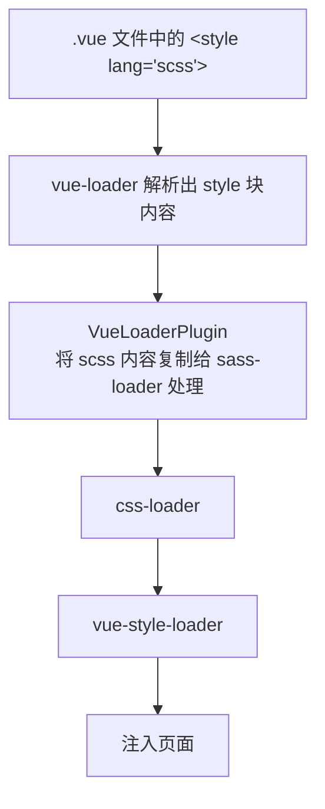
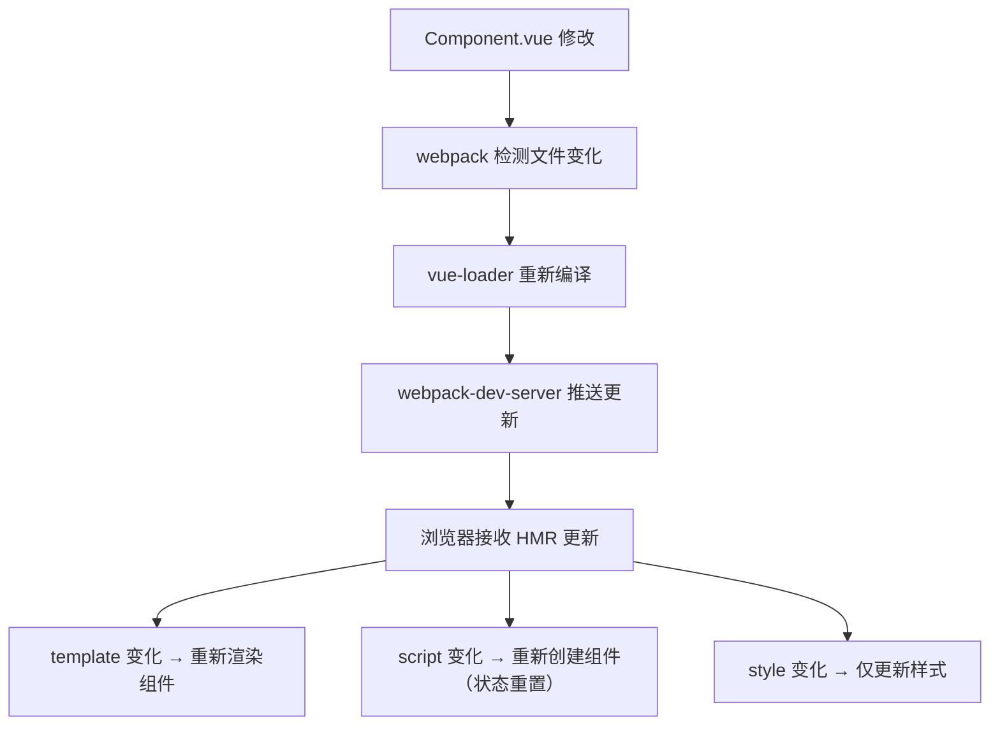

# Vite

> ⚠️ **勘误提示**：本篇标题为「Vite」，但正文实际是 vue-loader / webpack 的进阶配置内容（与 SFC 篇内容同源，疑似导入错位），Vite 本体（`@vitejs/plugin-vue2`、依赖预构建、环境变量等）内容缺失，待回源补写。以下内容适用于 Vue 2 + vue-loader v15 场景。

## 核心功能

| 功能 | 说明 |
|------|------|
| 模块解析 | 将 `.vue` 文件解析为可执行的 JavaScript 模块 |
| 预处理器支持 | 支持在模板、脚本、样式中使用各种预处理器 |
| 作用域样式 | 通过 `scoped` 属性实现组件级样式隔离 |
| CSS Modules | 支持 CSS Modules 模式 |
| 热重载 | 开发环境下支持组件热更新 |
| 资源处理 | 自动处理模板中的资源引用 |

## 基本配置

### 安装依赖

```bash
npm install -D vue-loader vue-template-compiler
```

### webpack 配置

```javascript
// webpack.config.js
const VueLoaderPlugin = require('vue-loader/lib/plugin')
const path = require('path')

module.exports = {
  mode: 'development',
  entry: './src/main.js',
  output: {
    path: path.resolve(__dirname, 'dist'),
    filename: 'bundle.js'
  },
  module: {
    rules: [
      // 处理 .vue 文件
      {
        test: /\.vue$/,
        loader: 'vue-loader'
      },
      // 处理 JavaScript
      {
        test: /\.js$/,
        loader: 'babel-loader',
        exclude: /node_modules/
      },
      // 处理 CSS
      {
        test: /\.css$/,
        use: [
          'vue-style-loader',
          'css-loader'
        ]
      },
      // 处理 SCSS
      {
        test: /\.scss$/,
        use: [
          'vue-style-loader',
          'css-loader',
          'sass-loader'
        ]
      },
      // 处理图片资源
      {
        test: /\.(png|jpg|gif|svg)$/,
        loader: 'file-loader',
        options: {
          name: '[name].[ext]?[hash]'
        }
      }
    ]
  },
  plugins: [
    // VueLoaderPlugin 是必需的
    new VueLoaderPlugin()
  ],
  resolve: {
    alias: {
      'vue$': 'vue/dist/vue.esm.js',
      '@': path.resolve(__dirname, 'src')
    },
    extensions: ['.js', '.vue', '.json']
  }
}
```

### VueLoaderPlugin 作用

VueLoaderPlugin 的职责是将其它 loader 复制并应用到 `.vue` 文件的相应语言块：



## 配置选项详解

### vue-loader 选项

```javascript
module.exports = {
  module: {
    rules: [
      {
        test: /\.vue$/,
        loader: 'vue-loader',
        options: {
          // 是否启用热重载
          hotReload: true,
          
          // 是否美化输出代码
          prettify: true,
          
          // 暴露自定义块内容
          exposeFilename: true,
          
          // 自定义资源 URL 转换规则
          transformAssetUrls: {
            video: ['src', 'poster'],
            source: 'src',
            img: 'src',
            image: ['xlink:href', 'href'],
            use: ['xlink:href', 'href']
          },
          
          // 编译器选项
          compilerOptions: {
            // 是否保留空白
            whitespace: 'condense',
            // 是否移除 HTML 注释
            comments: false
          }
        }
      }
    ]
  }
}
```

### 配置选项说明

| 选项 | 类型 | 默认值 | 说明 |
|------|------|--------|------|
| `hotReload` | Boolean | `true` | 开发环境是否启用热重载 |
| `prettify` | Boolean | `true` | 是否格式化编译后的代码 |
| `exposeFilename` | Boolean | `false` | 是否在组件中暴露文件名 |
| `transformAssetUrls` | Object | 见上表 | 资源 URL 转换配置 |
| `compilerOptions` | Object | `{}` | 模板编译器选项 |

## 处理资源路径

### 资源处理机制

在 `.vue` 文件中，所有资源引用都会被 webpack 处理：

```vue
<template>
  <div>
    <!-- 相对路径 - 会被 webpack 处理 -->
    
    
    <!-- 绝对路径 - 会被原样保留 -->
    
    
    <!-- URL - 会被原样保留 -->
    
    
    <!-- 动态绑定 - 需要使用 require 或 import -->
    
  </div>
</template>

<script>
export default {
  data() {
    return {
      // 动态导入图片
      logo: require('./assets/logo.png')
    }
  }
}
</script>
```

### transformAssetUrls 配置

用于自定义哪些标签属性需要被转换为模块引入：

```javascript
// 默认配置
transformAssetUrls: {
  video: ['src', 'poster'],
  source: 'src',
  img: 'src',
  image: ['xlink:href', 'href'],
  use: ['xlink:href', 'href']
}

// 自定义配置 - 添加自定义组件支持
transformAssetUrls: {
  'my-component': 'imageSrc',
  'custom-img': ['src', 'fallback-src']
}
```

### 资源处理示例

```vue
<template>
  <!-- 以下资源路径都会被正确处理 -->
  <div>
    <!-- 标准图片 -->
    
    
    <!-- SVG 文件 -->
    
    
    <!-- 视频资源 -->
    <video poster="./assets/poster.jpg">
      <source src="./assets/video.mp4" type="video/mp4">
    </video>
    
    <!-- SVG 中使用 -->
    <svg>
      <use xlink:href="./assets/sprite.svg#icon"></use>
    </svg>
  </div>
</template>
```

## 自定义块

Vue Loader 支持自定义语言块，可以用于扩展组件功能。

### 定义自定义块

```vue
<template>
  <div>{{ message }}</div>
</template>

<script>
export default {
  data() {
    return {
      message: 'Hello World'
    }
  }
}
</script>

<!-- 自定义文档块 -->
<docs>
## 组件说明
这是一个示例组件，用于演示自定义块功能。

### Props
- 无

### Events
- 无
</docs>

<!-- 自定义单元测试块 -->
<unit-test>
describe('MyComponent', () => {
  it('renders message', () => {
    const wrapper = mount(MyComponent)
    expect(wrapper.text()).toContain('Hello World')
  })
})
</unit-test>
```

### 配置自定义块处理

```javascript
// webpack.config.js
module.exports = {
  module: {
    rules: [
      // 通过 resourceQuery 匹配自定义块（vue-loader 会为块追加 ?blockType= 查询参数）
      // 以字符串形式加载 <docs> 块
      {
        resourceQuery: /blockType=docs/,
        loader: 'raw-loader'
      },
      // <unit-test> 块需自行实现 loader（如读取块内容生成测试文件）
      {
        resourceQuery: /blockType=unit-test/,
        loader: require.resolve('./loaders/unit-test-loader')
      }
    ]
  }
}
```

### 自定义块加载器配置

```javascript
// 使用函数动态配置
module.exports = {
  module: {
    rules: [
      {
        resourceQuery: query => {
          const parsed = new URLSearchParams(query)
          return parsed.get('blockType') === 'i18n'
        },
        use: [
          {
            loader: 'yaml-loader',
            options: {}
          }
        ]
      }
    ]
  }
}
```

### i18n 国际化块示例

```vue
<template>
  <div>{{ $t('greeting') }}</div>
</template>

<script>
export default {
  name: 'HelloComponent'
}
</script>

<i18n>
en:
  greeting: "Hello World"
zh:
  greeting: "你好世界"
ja:
  greeting: "こんにちは世界"
</i18n>
```

## CSS Modules

CSS Modules 提供了一种自动生成唯一类名的机制，避免样式冲突。

### 基本用法

```vue
<template>
  <div :class="$style.container">
    <h1 :class="$style.title">{{ message }}</h1>
    <button :class="[$style.button, $style.primary]">
      点击我
    </button>
  </div>
</template>

<script>
export default {
  data() {
    return {
      message: 'CSS Modules 示例'
    }
  },
  mounted() {
    // 访问生成的类名
    console.log(this.$style.container) // 输出: "container_x7d3f"
  }
}
</script>

<style module>
.container {
  padding: 20px;
  background: #f5f5f5;
}

.title {
  color: #333;
  font-size: 24px;
}

.button {
  padding: 10px 20px;
  border: none;
  cursor: pointer;
}

.primary {
  background: #42b983;
  color: white;
}
</style>
```

### 自定义模块名称

```vue
<template>
  <div :class="styles.container">
    <p :class="styles.text">自定义模块名称</p>
  </div>
</template>

<script>
export default {
  computed: {
    styles() {
      return this.$style
    }
  }
}
</script>

<style module="styles">
.container {
  border: 1px solid #ddd;
}

.text {
  color: #666;
}
</style>
```

### 组合使用 scoped 和 module

```vue
<template>
  <div class="base-container">
    <p :class="$style.highlight">混合使用</p>
  </div>
</template>

<style scoped>
/* scoped 样式 - 用于普通类 */
.base-container {
  padding: 16px;
}
</style>

<style module>
/* CSS Modules - 用于动态绑定 */
.highlight {
  background: yellow;
  font-weight: bold;
}
</style>
```

### CSS Modules 配置

vue-loader v15 本身不提供 `cssModules` 选项，CSS Modules 由 css-loader 的 `modules` 选项控制：

```javascript
// webpack.config.js
module.exports = {
  module: {
    rules: [
      {
        test: /\.css$/,
        use: [
          'vue-style-loader',
          {
            loader: 'css-loader',
            options: {
              // 启用 CSS Modules
              modules: {
                localIdentName: '[name]_[local]_[hash:base64:5]'
              }
            }
          }
        ]
      }
    ]
  }
}
```

## 热重载

Vue Loader 支持开发环境下的热模块替换 (HMR)，修改组件代码后无需刷新页面即可看到更新。

### 热重载原理



### 配置热重载

```javascript
// webpack.config.js
const webpack = require('webpack')

module.exports = {
  mode: 'development',
  devServer: {
    hot: true,
    contentBase: './dist'
  },
  plugins: [
    new webpack.HotModuleReplacementPlugin()
  ]
}
```

### 禁用热重载

```javascript
// webpack.config.js
module.exports = {
  module: {
    rules: [
      {
        test: /\.vue$/,
        loader: 'vue-loader',
        options: {
          hotReload: false // 禁用热重载
        }
      }
    ]
  }
}
```

### 热重载状态保留

热重载会尽可能保留组件状态：

```vue
<template>
  <div>
    <p>计数器: {{ count }}</p>
    <button @click="count++">增加</button>
  </div>
</template>

<script>
export default {
  data() {
    return {
      count: 0
    }
  }
}
</script>
```

修改模板或样式时，`count` 的值会被保留；修改 `script` 部分时，组件会重新创建，状态会重置。

## 预处理器配置

### 支持的预处理器

| 类型 | 预处理器 | lang 属性 | 需要安装的 loader |
|------|----------|-----------|-------------------|
| 模板 | Pug | `pug` | `pug-plain-loader` |
| 脚本 | TypeScript | `ts` | `ts-loader` |
| 样式 | SCSS/SASS | `scss`/`sass` | `sass-loader` + `sass`（推荐，dart-sass）或 `node-sass`（已停止维护） |
| 样式 | Less | `less` | `less-loader` |
| 样式 | Stylus | `stylus` | `stylus-loader` |
| 样式 | PostCSS | 默认支持 | 无需额外配置 |

### Pug 模板配置

```javascript
// webpack.config.js
module.exports = {
  module: {
    rules: [
      {
        test: /\.pug$/,
        loader: 'pug-plain-loader'
      }
    ]
  }
}
```

```vue
<template lang="pug">
div.container
  h1.title Pug 模板示例
  p.description 这是一个使用 Pug 语法的模板
  ul.list
    li.item(v-for="item in items" :key="item.id") {{ item.name }}
</template>
```

### TypeScript 配置

```javascript
// webpack.config.js
module.exports = {
  module: {
    rules: [
      {
        test: /\.ts$/,
        loader: 'ts-loader',
        options: {
          appendTsSuffixTo: [/\.vue$/]
        }
      }
    ]
  }
}
```

```vue
<script lang="ts">
import { Vue, Component, Prop } from 'vue-property-decorator'

interface Item {
  id: number
  name: string
}

@Component
export default class MyComponent extends Vue {
  @Prop({ type: Array, default: () => [] })
  items!: Item[]

  count: number = 0

  increment(): void {
    this.count++
  }
}
</script>
```

### SCSS/SASS 配置

```javascript
// webpack.config.js
module.exports = {
  module: {
    rules: [
      {
        test: /\.scss$/,
        use: [
          'vue-style-loader',
          'css-loader',
          'sass-loader'
        ]
      },
      {
        test: /\.sass$/,
        use: [
          'vue-style-loader',
          'css-loader',
          {
            loader: 'sass-loader',
            options: {
              sassOptions: {
                indentedSyntax: true
              }
            }
          }
        ]
      }
    ]
  }
}
```

```vue
<template>
  <div class="scss-example">
    <h2>SCSS 样式示例</h2>
  </div>
</template>

<style lang="scss" scoped>
$primary-color: #42b983;
$border-radius: 8px;

.scss-example {
  padding: 20px;
  
  h2 {
    color: $primary-color;
    border-radius: $border-radius;
    
    &:hover {
      opacity: 0.8;
    }
  }
}
</style>
```

### Less 配置

```javascript
// webpack.config.js
module.exports = {
  module: {
    rules: [
      {
        test: /\.less$/,
        use: [
          'vue-style-loader',
          'css-loader',
          'less-loader'
        ]
      }
    ]
  }
}
```

```vue
<style lang="less" scoped>
@primary-color: #42b983;

.less-example {
  color: @primary-color;
  
  &:hover {
    opacity: 0.8;
  }
}
</style>
```

### Stylus 配置

```javascript
// webpack.config.js
module.exports = {
  module: {
    rules: [
      {
        test: /\.styl(us)?$/,
        use: [
          'vue-style-loader',
          'css-loader',
          'stylus-loader'
        ]
      }
    ]
  }
}
```

```vue
<style lang="stylus" scoped>
$primary-color = #42b983

.stylus-example
  color $primary-color
  
  &:hover
    opacity 0.8
</style>
```

## PostCSS 配置

PostCSS 用于自动添加 CSS 前缀等优化。

### 配置文件

```javascript
// postcss.config.js
module.exports = {
  plugins: [
    require('autoprefixer')({
      overrideBrowserslist: [
        '> 1%',
        'last 2 versions',
        'not ie <= 8'
      ]
    })
  ]
}
```

### webpack 配置

```javascript
// webpack.config.js
module.exports = {
  module: {
    rules: [
      {
        test: /\.css$/,
        use: [
          'vue-style-loader',
          {
            loader: 'css-loader',
            options: {
              importLoaders: 1
            }
          },
          'postcss-loader'
        ]
      }
    ]
  }
}
```

### 组件中使用

```vue
<template>
  <div class="flex-container">
    <div class="flex-item">自动添加前缀</div>
  </div>
</template>

<style scoped>
/* 编译后会自动添加 -webkit- 等前缀 */
.flex-container {
  display: flex;
  justify-content: center;
  align-items: center;
  user-select: none;
}

.flex-item {
  transform: rotate(45deg);
  transition: all 0.3s;
}
</style>
```

## 作用域样式

### scoped 样式原理

```vue
<style scoped>
.example {
  color: red;
}
</style>
```

编译后：

```html
<style>
.example[data-v-f3f3eg9] {
  color: red;
}
</style>

<div class="example" data-v-f3f3eg9>hello</div>
```

### 深度选择器

当需要修改子组件样式时，使用深度选择器：

```vue
<template>
  <div class="parent">
    <child-component />
  </div>
</template>

<style scoped>
/* Vue 2 推荐使用 ::v-deep */
.parent ::v-deep .child-class {
  color: red;
}

/* 或使用 >>> 操作符（仅限 CSS） */
.parent >>> .child-class {
  color: red;
}

/* 或使用 /deep/（已废弃） */
.parent /deep/ .child-class {
  color: red;
}
</style>
```

### 深度选择器对照表

| 语法 | 支持的预处理器 | 状态 |
|------|---------------|------|
| `>>>` | 仅 CSS | 推荐用于纯 CSS |
| `/deep/` | CSS, SCSS, Less, Stylus | 已废弃 |
| `::v-deep` | 所有 | Vue 2 推荐 |

### 插槽选择器

> 注意：`::v-slotted` 是 Vue 3（@vue/compiler-sfc）引入的语法，Vue 2 的 vue-loader v15 **不支持**。Vue 2 中要选中插槽内容，只能借助非 scoped 样式或深度选择器。

```vue
<template>
  <div class="container">
    <slot></slot>
  </div>
</template>

<style scoped>
/* Vue 2 中以下写法无效，仅作为 Vue 3 语法对照保留 */
/* ::v-slotted(.slot-content) {
  color: blue;
} */
</style>
```

### 全局选择器

在 scoped 样式中使用全局选择器：

> 注意：`:global()` 同样是 Vue 3 SFC 编译器支持的语法，Vue 2 中不可用。Vue 2 的做法是把全局样式写在单独的 `<style>`（不带 scoped）块中。

```vue
<style scoped>
/* 作用于当前组件 */
.local-style {
  color: red;
}

/* Vue 2：全局样式请放到不带 scoped 的 <style> 块 */
/* :global(.global-style) {
  color: blue;
} */
</style>
```

### Scoped CSS 实现原理（源码级）

`scoped` 样式通过 PostCSS 插件在编译阶段处理，核心是为每个选择器注入唯一的 `data-v-xxx` 属性：

**关键源码流程：**

```javascript
// vue-loader 内部使用 @vue/component-compiler-utils 的 compileStyle
// 1. 生成唯一 scoped ID
const id = hash(filePath)  // 基于文件路径的 hash，如 data-v-f3f3eg9

// 2. PostCSS 插件遍历 CSS AST
// 对每个选择器末尾添加 [data-v-xxx]
// .example { color: red; } → .example[data-v-f3f3eg9] { color: red; }

// 3. 子组件根元素特殊处理：
// 子组件根元素同时拥有自己的 scoped 属性和父组件的 scoped 属性
// <div data-v-child data-v-parent>
```

**深度选择器原理：**
- `::v-deep .inner` → 编译为 `[data-v-xxx] .inner`（移除属性选择器的限制）
- `/deep/` 和 `>>>` 是 ::v-deep 的别名，最终效果相同
- 它们告诉 PostCSS：「不要在这个选择器末尾添加 [data-v-xxx]」

**Scoped 样式穿透规则：**
1. 子组件根元素：同时拥有父组件和子组件的 scoped 属性 → 父组件 scoped 样式可影响子组件根元素
2. 子组件内部元素：只有子组件自己的 scoped 属性 → 父组件 scoped 样式无法穿透
3. 使用 ::v-deep：可突破限制，影响子组件内部元素

## 常见问题解答

### 1. 为什么需要 VueLoaderPlugin？

VueLoaderPlugin 的作用是将定义的其它 loader 规则复制并应用到 `.vue` 文件中相应的语言块。例如，你的配置中有 `sass-loader` 处理 `.scss` 文件，那么 `.vue` 文件中的 `<style lang="scss">` 块也会被 `sass-loader` 处理。

```javascript
// 如果没有 VueLoaderPlugin，以下配置不会生效
module.exports = {
  module: {
    rules: [
      {
        test: /\.vue$/,
        loader: 'vue-loader'
        // 缺少 VueLoaderPlugin，style lang="scss" 不会被 sass-loader 处理
      }
    ]
  }
}
```

### 2. 如何处理静态资源？

相对路径会被 webpack 处理，绝对路径会原样保留：

```vue
<template>
  <div>
    <!-- 正确：会被 webpack 处理 -->
    
    
    <!-- 不会被 webpack 处理（public 静态资源，原样引用） -->
    
    
    <!-- 动态绑定需要 require -->
    
    
    <!-- 动态路径使用变量 -->
    
  </div>
</template>

<script>
export default {
  methods: {
    getImageUrl(name) {
      return require(`./assets/images/${name}`)
    }
  }
}
</script>
```

### 3. scoped 样式为什么不生效？

检查以下常见问题：

```vue
<template>
  <div class="container">
    <!-- 问题1：子组件根元素样式 -->
    <child-component class="child" />
  </div>
</template>

<style scoped>
/* ❌ 错误：无法修改子组件内部样式 */
.child .inner {
  color: red;
}

/* ✅ 正确：使用深度选择器 */
.child ::v-deep .inner {
  color: red;
}

/* ✅ 正确：修改子组件根元素 */
.child {
  margin: 10px;
}
</style>
```

### 4. 如何在样式使用 JavaScript 变量？

使用 CSS 变量或动态样式绑定：

```vue
<template>
  <div :style="dynamicStyle">CSS 变量示例</div>
</template>

<script>
export default {
  data() {
    return {
      themeColor: '#42b983'
    }
  },
  computed: {
    dynamicStyle() {
      return {
        '--theme-color': this.themeColor
      }
    }
  }
}
</script>

<style scoped>
div {
  color: var(--theme-color);
}
</style>
```

### 5. 热重载不生效怎么办？

检查以下配置：

```javascript
// webpack.config.js
module.exports = {
  mode: 'development', // 确保是开发模式
  
  devServer: {
    hot: true,  // 启用 HMR
    inline: true
  },
  
  module: {
    rules: [
      {
        test: /\.vue$/,
        loader: 'vue-loader',
        options: {
          hotReload: true // 确保未禁用
        }
      }
    ]
  },
  
  plugins: [
    new webpack.HotModuleReplacementPlugin()
  ]
}
```

### 6. 如何优化构建性能？

```javascript
// webpack.config.js
module.exports = {
  module: {
    rules: [
      // cache-loader 缓存 + vue-loader 应写在同一条规则内
      // （写成两条 test 均为 /\.vue$/ 的规则会导致文件被重复处理）
      {
        test: /\.vue$/,
        use: [
          {
            loader: 'cache-loader',
            options: {
              cacheDirectory: path.resolve('.cache')
            }
          },
          {
            loader: 'vue-loader',
            options: {
              // 生产环境禁用 prettify
              prettify: process.env.NODE_ENV === 'development',

              // 编译器选项：仅开发环境输出源码位置
              compilerOptions: {
                outputSourceRange: process.env.NODE_ENV === 'development'
              }
            }
          }
        ]
      }
    ]
  }
}
```

### 7. 如何配置别名简化导入？

```javascript
// webpack.config.js
const path = require('path')

module.exports = {
  resolve: {
    alias: {
      '@': path.resolve(__dirname, 'src'),
      '@components': path.resolve(__dirname, 'src/components'),
      '@assets': path.resolve(__dirname, 'src/assets')
    },
    extensions: ['.js', '.vue', '.json']
  }
}
```

```vue
<script>
// 使用别名导入
import MyComponent from '@/components/MyComponent.vue'
import logo from '@assets/logo.png'
</script>
```

## 相关资源

- [Vue Loader 官方文档](https://vue-loader.vuejs.org/zh/)
- [webpack 官方文档](https://webpack.js.org/)
- [Vue CLI 官方文档](https://cli.vuejs.org/zh/)
