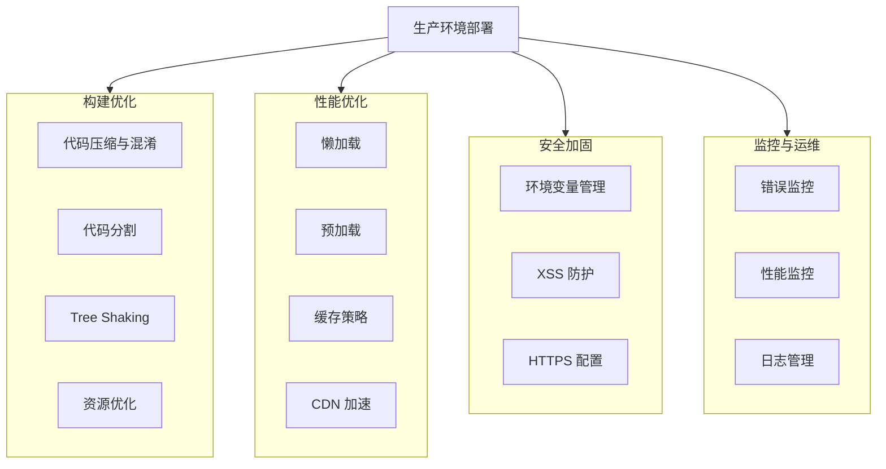

# 生产环境与部署优化

## 概述

> 以下大多数内容在使用 [Vue CLI](https://cli.vuejs.org/zh/) 时都是默认开启的。该章节主要针对自定义构建设置和深入优化场景。

生产环境部署是 Vue 应用开发流程的关键环节，涉及构建优化、性能提升、安全加固和监控配置等多个方面。良好的生产环境配置可以显著提升应用的加载速度、运行性能和用户体验。

### 部署架构



## 开启生产环境模式

开发环境下，Vue 会提供很多警告来帮助开发者应对常见的错误与陷阱。而在生产环境下，这些警告语句会增加应用的体积和运行时开销，应当被移除。

### webpack 配置

#### webpack 4+

使用 `mode` 选项自动优化：

```javascript
// webpack.config.js
module.exports = {
  mode: 'production',
  // webpack 会自动启用以下优化：
  // - 代码压缩（TerserPlugin）
  // - 作用域提升（Scope Hoisting）
  // - Tree Shaking
  // - 去除开发环境专用代码
  // - 设置 process.env.NODE_ENV = 'production'
}
```

#### webpack 3 及更低版本

使用 `DefinePlugin` 定义环境变量：

```javascript
// webpack.config.js
const webpack = require('webpack')

module.exports = {
  // ...
  plugins: [
    new webpack.DefinePlugin({
      'process.env.NODE_ENV': JSON.stringify('production')
    }),
    // 添加压缩插件
    new webpack.optimize.UglifyJsPlugin({
      compress: {
        warnings: false,
        drop_console: true,
        drop_debugger: true
      }
    }),
    // 启用作用域提升
    new webpack.optimize.ModuleConcatenationPlugin()
  ]
}
```

### Rollup 配置

使用 `@rollup/plugin-replace` 和 `@rollup/plugin-terser`：

```javascript
// rollup.config.js
import replace from '@rollup/plugin-replace'
import terser from '@rollup/plugin-terser'

export default {
  // ...
  plugins: [
    replace({
      preventAssignment: true,
      'process.env.NODE_ENV': JSON.stringify('production')
    }),
    terser({
      compress: {
        drop_console: true,
        drop_debugger: true
      }
    })
  ]
}
```

### Browserify 配置

```javascript
// 使用 envify 和 uglifyify
const browserify = require('browserify')
const envify = require('envify/custom')
const uglifyify = require('uglifyify')

browserify({
  // ...
})
.transform(envify({
  NODE_ENV: 'production'
}))
.transform(uglifyify, {
  global: true,
  compress: {
    drop_console: true
  }
})
```

### Vue CLI 项目

Vue CLI 项目自动处理生产环境配置：

```bash
# 生产环境构建
npm run build

# 或
vue-cli-service build

# 指定模式
vue-cli-service build --mode production
```

## 模板预编译

### 为什么需要预编译

使用 DOM 内模板或 JavaScript 字符串模板时，模板会在运行时被编译为渲染函数，这会带来以下问题：

- **运行时开销**：模板编译占用 CPU 资源
- **包体积增加**：需要包含编译器代码（约 10KB）
- **性能损耗**：首次渲染延迟

### 使用单文件组件

单文件组件（`.vue` 文件）在构建时自动预编译模板：

```vue
<!-- MyComponent.vue -->
<template>
  <div class="my-component">
    <h1>{{ title }}</h1>
    <p>{{ content }}</p>
  </div>
</template>

<script>
export default {
  data() {
    return {
      title: '预编译模板',
      content: '这个模板在构建时已被编译为渲染函数'
    }
  }
}
</script>
```

构建后会生成渲染函数，无需运行时编译：

```javascript
// 编译后的渲染函数
var render = function() {
  var _vm = this
  var _h = _vm.$createElement
  var _c = _vm._self._c || _h
  return _c('div', { staticClass: 'my-component' }, [
    _c('h1', [_vm._v(_vm._s(_vm.title))]),
    _c('p', [_vm._v(_vm._s(_vm.content))])
  ])
}
```

### 独立模板文件

如果需要分离 JavaScript 和模板文件，可以使用 `vue-template-loader`：

```javascript
// webpack.config.js
module.exports = {
  module: {
    rules: [
      {
        test: /\.template\.html$/,
        loader: 'vue-template-loader',
        options: {
          // 配置选项
          scoped: true
        }
      }
    ]
  }
}
```

```javascript
// 使用方式
import withRender from './MyComponent.template.html'

// vue-template-loader 导出的是一个高阶函数，需传入组件选项
export default withRender({
  data() {
    return {
      title: '预编译模板'
    }
  }
})
```

### 运行时 + 编译器 vs 仅运行时

Vue 提供两种构建版本：

| 构建版本 | 文件大小 | 使用场景 |
|---------|---------|---------|
| 完整版（运行时 + 编译器） | 约 30KB | 需要运行时编译模板 |
| 仅运行时 | 约 20KB | 使用预编译模板（推荐） |

```javascript
// webpack 配置别名
module.exports = {
  resolve: {
    alias: {
      'vue$': 'vue/dist/vue.runtime.esm.js'
    }
  }
}
```

## 代码分割与懒加载

### 路由懒加载

使用动态导入实现路由级别的代码分割：

```javascript
// router/index.js
import Vue from 'vue'
import Router from 'vue-router'

Vue.use(Router)

export default new Router({
  mode: 'history',
  routes: [
    {
      path: '/',
      name: 'Home',
      component: () => import(/* webpackChunkName: "home" */ '@/views/Home.vue')
    },
    {
      path: '/about',
      name: 'About',
      component: () => import(/* webpackChunkName: "about" */ '@/views/About.vue')
    },
    {
      path: '/user/:id',
      name: 'User',
      component: () => import(/* webpackChunkName: "user" */ '@/views/User.vue')
    },
    {
      path: '/admin',
      name: 'Admin',
      component: () => import(/* webpackChunkName: "admin" */ '@/views/Admin.vue'),
      meta: { requiresAuth: true }
    }
  ]
})
```

### 组件懒加载

对大型组件或非首屏组件进行懒加载：

```vue
<template>
  <div>
    <button @click="showModal = true">打开对话框</button>
    <modal-component v-if="showModal" @close="showModal = false" />
  </div>
</template>

<script>
export default {
  data() {
    return {
      showModal: false
    }
  },
  components: {
    // 懒加载组件
    ModalComponent: () => import('@/components/ModalComponent.vue')
  }
}
</script>
```

### webpack 分包策略

#### SplitChunksPlugin 配置

```javascript
// vue.config.js
module.exports = {
  configureWebpack: {
    optimization: {
      splitChunks: {
        chunks: 'all',
        cacheGroups: {
          // 第三方库单独打包
          vendor: {
            name: 'vendor',
            test: /[\\/]node_modules[\\/]/,
            priority: 10,
            chunks: 'initial'
          },
          // 公共模块提取
          common: {
            name: 'common',
            minChunks: 2,
            minSize: 30000,
            chunks: 'initial',
            priority: 5,
            reuseExistingChunk: true
          },
          // Vue 相关库单独打包
          vue: {
            name: 'vue',
            test: /[\\/]node_modules[\\/](vue|vue-router|vuex)[\\/]/,
            priority: 20
          },
          // UI 库单独打包
          elementUI: {
            name: 'element-ui',
            test: /[\\/]node_modules[\\/]element-ui[\\/]/,
            priority: 15
          }
        }
      }
    }
  }
}
```

#### 预取和预加载

```javascript
// 预取（Prefetch）：在未来可能需要，空闲时加载
import(/* webpackPrefetch: true */ './path/to/LoginModal.vue')

// 预加载（Preload）：当前路由肯定需要，并行加载
import(/* webpackPreload: true */ './path/to/CurrentPage.vue')

// 组合使用
const UserDetails = () => import(
  /* webpackChunkName: "user" */
  /* webpackPrefetch: true */
  '@/views/UserDetails.vue'
)
```

## CSS 优化

### 提取 CSS 到单独文件

将组件内的 CSS 提取到独立文件，避免以下问题：

- 运行时注入样式导致 FOUC（无样式内容闪烁）
- 无法利用浏览器缓存
- CSS 无法被单独压缩优化

#### Vue CLI 配置

```javascript
// vue.config.js
module.exports = {
  css: {
    // 生产环境提取 CSS
    extract: process.env.NODE_ENV === 'production',
    
    // 开启 sourceMap（生产环境建议关闭）
    sourceMap: false,
    
    // CSS 预处理器配置
    loaderOptions: {
      css: {
        // CSS loader 配置
      },
      sass: {
        // 全局导入变量
        // Vue CLI 3/4 用 prependData，Vue CLI 5（sass-loader 10+）改为 additionalData
        additionalData: `@import "@/styles/variables.scss";`
      }
    }
  }
}
```

#### webpack 配置

```javascript
// webpack.config.js
const MiniCssExtractPlugin = require('mini-css-extract-plugin')

module.exports = {
  module: {
    rules: [
      {
        test: /\.css$/,
        use: [
          // 生产环境使用 MiniCssExtractPlugin.loader
          process.env.NODE_ENV === 'production'
            ? MiniCssExtractPlugin.loader
            : 'vue-style-loader',
          'css-loader',
          'postcss-loader'
        ]
      }
    ]
  },
  plugins: [
    new MiniCssExtractPlugin({
      filename: 'css/[name].[contenthash:8].css',
      chunkFilename: 'css/[name].[contenthash:8].css'
    })
  ]
}
```

### CSS 压缩

```javascript
// webpack.config.js
const CssMinimizerPlugin = require('css-minimizer-webpack-plugin')

module.exports = {
  optimization: {
    minimizer: [
      '...',
      new CssMinimizerPlugin({
        parallel: true,
        minimizerOptions: {
          preset: [
            'default',
            {
              discardComments: { removeAll: true }
            }
          ]
        }
      })
    ]
  }
}
```

### CSS Modules

```vue
<template>
  <div :class="$style.container">
    <h1 :class="$style.title">{{ title }}</h1>
  </div>
</template>

<script>
export default {
  data() {
    return {
      title: 'CSS Modules 示例'
    }
  }
}
</script>

<style module>
.container {
  padding: 20px;
}
.title {
  color: #42b983;
}
</style>
```

## 资源优化

### 图片优化

#### 使用 url-loader

```javascript
// vue.config.js
module.exports = {
  chainWebpack: config => {
    config.module
      .rule('images')
      .test(/\.(png|jpe?g|gif|webp)(\?.*)?$/)
      .use('url-loader')
      .loader('url-loader')
      .tap(options => ({
        ...options,
        limit: 10240, // 小于 10KB 转为 base64
        name: 'img/[name].[hash:8].[ext]'
      }))
  }
}
```

#### 图片压缩

```bash
npm install image-webpack-loader --save-dev
```

```javascript
// vue.config.js
module.exports = {
  chainWebpack: config => {
    config.module
      .rule('images')
      .use('image-webpack-loader')
      .loader('image-webpack-loader')
      .options({
        mozjpeg: { progressive: true, quality: 65 },
        optipng: { enabled: false },
        pngquant: { quality: [0.65, 0.9], speed: 4 },
        gifsicle: { interlaced: false },
        webp: { quality: 75 }
      })
      .end()
  }
}
```

#### 响应式图片

```vue
<template>
  <picture>
    <source media="(min-width: 1200px)" :srcset="largeImage">
    <source media="(min-width: 768px)" :srcset="mediumImage">
    
  </picture>
</template>

<script>
export default {
  data() {
    return {
      largeImage: require('@/assets/images/banner-large.webp'),
      mediumImage: require('@/assets/images/banner-medium.webp'),
      smallImage: require('@/assets/images/banner-small.webp'),
      altText: '响应式图片'
    }
  }
}
</script>
```

### 字体优化

```javascript
// vue.config.js
module.exports = {
  chainWebpack: config => {
    config.module
      .rule('fonts')
      .test(/\.(woff2?|eot|ttf|otf)(\?.*)?$/i)
      .use('url-loader')
      .loader('url-loader')
      .options({
        limit: 10000,
        name: 'fonts/[name].[hash:8].[ext]'
      })
  }
}
```

字体加载优化：

```css
/* 使用 font-display */
@font-face {
  font-family: 'MyFont';
  src: url('/fonts/myfont.woff2') format('woff2');
  font-weight: normal;
  font-style: normal;
  font-display: swap; /* 立即显示后备字体，字体加载完成后替换 */
}

/* 预加载关键字体 */
```

```html
<link rel="preload" href="/fonts/myfont.woff2" as="font" type="font/woff2" crossorigin>
```

## Gzip 压缩

### 静态 Gzip

```bash
npm install compression-webpack-plugin --save-dev
```

```javascript
// vue.config.js
const CompressionPlugin = require('compression-webpack-plugin')

module.exports = {
  configureWebpack: config => {
    if (process.env.NODE_ENV === 'production') {
      config.plugins.push(
        new CompressionPlugin({
          algorithm: 'gzip',
          test: /\.(js|css|html|svg)$/,
          threshold: 10240, // 只处理大于 10KB 的文件
          minRatio: 0.8,
          deleteOriginalAssets: false
        })
      )
    }
  }
}
```

### Brotli 压缩

Brotli 压缩率比 Gzip 更高：

```javascript
// vue.config.js
const CompressionPlugin = require('compression-webpack-plugin')

module.exports = {
  configureWebpack: config => {
    if (process.env.NODE_ENV === 'production') {
      config.plugins.push(
        new CompressionPlugin({
          algorithm: 'brotliCompress',
          test: /\.(js|css|html|svg)$/,
          threshold: 10240,
          minRatio: 0.8,
          deleteOriginalAssets: false
        })
      )
    }
  }
}
```

### 服务器配置

#### Nginx 配置

```11-Nginx基础概述
# 11-Nginx基础概述.conf
server {
    # 开启 Gzip
    gzip on;
    gzip_types text/plain text/css application/json application/javascript text/xml application/xml application/xml+rss text/javascript;
    gzip_min_length 1000;
    gzip_comp_level 6;
    
    # 开启 Brotli（需要安装 ngx_brotli 模块）
    brotli on;
    brotli_types text/plain text/css application/json application/javascript text/xml application/xml application/xml+rss text/javascript;
    brotli_min_length 1000;
    
    # 优先使用预压缩文件
    gzip_static on;
    brotli_static on;
    
    location / {
        # 静态资源缓存
        location ~* \.(js|css|png|jpg|jpeg|gif|ico|svg|woff|woff2|ttf|eot)$ {
            expires 1y;
            add_header Cache-Control "public, immutable";
        }
        
        # HTML 文件不缓存
        location ~* \.html$ {
            add_header Cache-Control "no-cache";
        }
    }
}
```

## CDN 加速

### 静态资源 CDN

```javascript
// vue.config.js
module.exports = {
  publicPath: process.env.NODE_ENV === 'production'
    ? 'https://cdn.example.com/'
    : '/'
}
```

### 外部化依赖

将常用库从打包中排除，使用 CDN 引入：

```javascript
// vue.config.js
module.exports = {
  configureWebpack: {
    externals: process.env.NODE_ENV === 'production' ? {
      vue: 'Vue',
      'vue-router': 'VueRouter',
      vuex: 'Vuex',
      axios: 'axios',
      'element-ui': 'ELEMENT'
    } : {}
  }
}
```

```html
<!-- public/index.html -->
<% if (process.env.NODE_ENV === 'production') { %>
  <!-- Vue -->
  <script src="https://cdn.jsdelivr.net/npm/vue@2.6.14/dist/vue.runtime.min.js"></script>
  <!-- Vue Router -->
  <script src="https://cdn.jsdelivr.net/npm/vue-router@3.5.3/dist/vue-router.min.js"></script>
  <!-- Vuex -->
  <script src="https://cdn.jsdelivr.net/npm/vuex@3.6.2/dist/vuex.min.js"></script>
  <!-- Axios -->
  <script src="https://cdn.jsdelivr.net/npm/axios@0.24.0/dist/axios.min.js"></script>
  <!-- Element UI -->
  <link rel="stylesheet" href="https://unpkg.com/element-ui/lib/theme-chalk/index.css">
  <script src="https://unpkg.com/element-ui/lib/index.js"></script>
<% } %>
```

## 缓存策略

### 文件名哈希

```javascript
// vue.config.js
module.exports = {
  filenameHashing: true, // 默认开启
  
  configureWebpack: {
    output: {
      filename: 'js/[name].[contenthash:8].js',
      chunkFilename: 'js/[name].[contenthash:8].js'
    }
  }
}
```

### 缓存组配置

```javascript
// vue.config.js
module.exports = {
  configureWebpack: {
    optimization: {
      splitChunks: {
        cacheGroups: {
          // 稳定的第三方库（长期缓存）
          libs: {
            name: 'chunk-libs',
            test: /[\\/]node_modules[\\/]/,
            priority: 10,
            chunks: 'initial'
          },
          // 变化的业务代码
          commons: {
            name: 'chunk-commons',
            minChunks: 2,
            priority: 5,
            reuseExistingChunk: true
          }
        }
      }
    }
  }
}
```

### Service Worker 缓存

```bash
# 安装 PWA 插件
vue add @vue/pwa
```

```javascript
// vue.config.js
module.exports = {
  pwa: {
    name: 'My App',
    themeColor: '#4DBA87',
    msTileColor: '#000000',
    appleMobileWebAppCapable: 'yes',
    appleMobileWebAppStatusBarStyle: 'black',
    
    workboxPluginMode: 'GenerateSW',
    workboxOptions: {
      // 缓存策略
      runtimeCaching: [
        {
          urlPattern: /^https:\/\/api\.example\.com/,
          handler: 'networkFirst',
          options: {
            cacheName: 'api-cache',
            expiration: {
              maxEntries: 50,
              maxAgeSeconds: 300
            }
          }
        },
        {
          urlPattern: /^https:\/\/cdn\.example\.com/,
          handler: 'cacheFirst',
          options: {
            cacheName: 'cdn-cache',
            expiration: {
              maxEntries: 100,
              maxAgeSeconds: 60 * 60 * 24 * 30 // 30 天
            }
          }
        }
      ]
    }
  }
}
```

## 环境变量管理

### 环境变量文件

```bash
# .env                 # 默认环境变量
VUE_APP_TITLE=My App
VUE_APP_API_BASE_URL=https://api.example.com

# .env.development      # 开发环境
VUE_APP_API_BASE_URL=http://localhost:3000/api
VUE_APP_ENV=development

# .env.production       # 生产环境
VUE_APP_API_BASE_URL=https://api.example.com
VUE_APP_ENV=production

# .env.staging          # 预发布环境
VUE_APP_API_BASE_URL=https://staging-api.example.com
VUE_APP_ENV=staging

# .env.local            # 本地环境（不提交到 git）
VUE_APP_SECRET_KEY=local_secret_key
```

### 在代码中使用

```javascript
// 访问环境变量
console.log(process.env.VUE_APP_TITLE)
console.log(process.env.VUE_APP_API_BASE_URL)
console.log(process.env.NODE_ENV)

// 环境判断
if (process.env.NODE_ENV === 'production') {
  // 生产环境逻辑
}

// API 配置
const apiClient = axios.create({
  baseURL: process.env.VUE_APP_API_BASE_URL
})
```

### 构建时注入

```javascript
// vue.config.js
const packageName = require('./package.json').name

module.exports = {
  chainWebpack: config => {
    config.plugin('define').tap(args => {
      args[0]['process.env'].BUILD_TIME = JSON.stringify(new Date().toLocaleString())
      args[0]['process.env'].VERSION = JSON.stringify(require('./package.json').version)
      args[0]['process.env'].PACKAGE_NAME = JSON.stringify(packageName)
      return args
    })
  }
}
```

## 构建产物分析

### 使用 webpack-bundle-analyzer

```bash
npm install webpack-bundle-analyzer --save-dev
```

```javascript
// vue.config.js
const BundleAnalyzerPlugin = require('webpack-bundle-analyzer').BundleAnalyzerPlugin

module.exports = {
  configureWebpack: {
    plugins: [
      new BundleAnalyzerPlugin({
        analyzerMode: 'static',
        openAnalyzer: false,
        reportFilename: 'bundle-report.html'
      })
    ]
  }
}
```

### 构建统计报告

```bash
# 生成构建统计报告
vue-cli-service build --report

# 或添加到 package.json
{
  "scripts": {
    "build:report": "vue-cli-service build --report"
  }
}
```

### 性能预算

```javascript
// vue.config.js
module.exports = {
  configureWebpack: {
    performance: {
      hints: 'warning',
      maxEntrypointSize: 512000, // 入口文件最大 500KB
      maxAssetSize: 512000,      // 单个资源最大 500KB
      assetFilter: function(assetFilename) {
        return assetFilename.endsWith('.js')
      }
    }
  }
}
```

## 错误监控与日志

### 全局错误处理

```javascript
// main.js
import Vue from 'vue'

// 配置全局错误处理器
Vue.config.errorHandler = function(err, vm, info) {
  console.error('Vue Error:', err)
  console.error('Component:', vm)
  console.error('Info:', info)
  
  // 发送错误到监控服务
  if (process.env.NODE_ENV === 'production') {
    trackError({
      message: err.message,
      stack: err.stack,
      component: vm.$options.name || 'Anonymous',
      info: info,
      route: vm.$route ? vm.$route.fullPath : ''
    })
  }
}

// 全局警告处理器
Vue.config.warnHandler = function(msg, vm, trace) {
  console.warn('Vue Warning:', msg)
  console.warn('Trace:', trace)
}

// Promise 拒绝处理
window.addEventListener('unhandledrejection', event => {
  console.error('Unhandled promise rejection:', event.reason)
  
  if (process.env.NODE_ENV === 'production') {
    trackError({
      type: 'unhandledrejection',
      reason: event.reason
    })
  }
})

// 全局错误捕获
window.onerror = function(message, source, lineno, colno, error) {
  console.error('Global error:', message)
  
  if (process.env.NODE_ENV === 'production') {
    trackError({
      type: 'global',
      message: message,
      source: source,
      lineno: lineno,
      colno: colno,
      error: error
    })
  }
}
```

### Sentry 集成

> 提示：以下为 Sentry SDK v6/v7 的经典写法（`@sentry/browser` + `@sentry/integrations`）。新版 SDK（v8+）可直接使用 `@sentry/vue` 包，同时支持 Vue 2/3，旧写法在存量项目仍然可用。

```bash
npm install @sentry/browser @sentry/integrations --save
```

```javascript
// main.js
import Vue from 'vue'
import * as Sentry from '@sentry/browser'
import { Vue as VueIntegration } from '@sentry/integrations'

// 仅在生产环境启用
if (process.env.NODE_ENV === 'production') {
  Sentry.init({
    dsn: process.env.VUE_APP_SENTRY_DSN,
    integrations: [
      new VueIntegration({
        Vue,
        attachProps: true,
        logErrors: true
      })
    ],
    environment: process.env.VUE_APP_ENV,
    release: process.env.VUE_APP_VERSION,
    
    // 性能监控
    tracesSampleRate: 0.1,
    
    // 过滤敏感信息
    beforeSend(event) {
      // 移除敏感数据
      if (event.request && event.request.headers) {
        delete event.request.headers.Authorization
      }
      return event
    }
  })
  
  // 设置用户信息
  Sentry.configureScope(scope => {
    scope.setUser({ id: 'user_id', username: 'username' })
  })
}

// 组件中使用
export default {
  methods: {
    handleClick() {
      try {
        // 业务逻辑
      } catch (error) {
        Sentry.captureException(error)
      }
    }
  }
}
```

### 性能监控

```javascript
// utils/performance.js
export class PerformanceMonitor {
  constructor() {
    this.marks = {}
  }
  
  // 开始计时
  start(name) {
    this.marks[name] = performance.now()
  }
  
  // 结束计时
  end(name) {
    if (this.marks[name]) {
      const duration = performance.now() - this.marks[name]
      console.log(`${name}: ${duration.toFixed(2)}ms`)
      
      // 发送到监控服务
      if (process.env.NODE_ENV === 'production') {
        this.report(name, duration)
      }
      
      delete this.marks[name]
      return duration
    }
  }
  
  // 性能指标上报
  report(name, duration) {
    // 使用 navigator.sendBeacon 发送数据
    const data = {
      name,
      duration,
      url: window.location.href,
      timestamp: Date.now()
    }
    
    navigator.sendBeacon('/api/performance', JSON.stringify(data))
  }
  
  // 获取页面性能指标
  // 注意：performance.timing 已被废弃，新项目建议使用 PerformanceNavigationTiming
  getPageMetrics() {
    const timing = performance.timing
    return {
      // DNS 查询时间
      dns: timing.domainLookupEnd - timing.domainLookupStart,
      // TCP 连接时间
      tcp: timing.connectEnd - timing.connectStart,
      // 请求响应时间
      request: timing.responseEnd - timing.requestStart,
      // DOM 解析时间
      domParse: timing.domInteractive - timing.responseEnd,
      // 资源加载时间
      resource: timing.loadEventStart - timing.domContentLoadedEventEnd,
      // 总加载时间
      total: timing.loadEventEnd - timing.navigationStart
    }
  }
}

// 使用示例
const monitor = new PerformanceMonitor()

// 路由性能监控
router.beforeEach((to, from, next) => {
  monitor.start(`route-${to.path}`)
  next()
})

router.afterEach((to) => {
  monitor.end(`route-${to.path}`)
})
```

## 安全配置

### 内容安全策略（CSP）

```html
<!-- public/index.html -->
<meta http-equiv="Content-Security-Policy" content="
  default-src 'self';
  script-src 'self' 'unsafe-inline' 'unsafe-eval' https://cdn.jsdelivr.net;
  style-src 'self' 'unsafe-inline' https://unpkg.com;
  img-src 'self' data: https:;
  font-src 'self' data:;
  connect-src 'self' https://api.example.com;
">
```

### XSS 防护

```javascript
// 避免使用 v-html
<template>
  <!-- ❌ 危险：可能导致 XSS 攻击 -->
  <div v-html="userContent"></div>
  
  <!-- ✅ 安全：使用文本插值 -->
  <div>{{ userContent }}</div>
  
  <!-- ✅ 如必须使用，先进行转义 -->
  <div v-html="sanitize(userContent)"></div>
</template>

<script>
import DOMPurify from 'dompurify'

export default {
  methods: {
    sanitize(html) {
      return DOMPurify.sanitize(html)
    }
  }
}
</script>
```

### CSRF 防护

```javascript
// utils/request.js
import axios from 'axios'

// 获取 CSRF token
function getCSRFToken() {
  const meta = document.querySelector('meta[name="csrf-token"]')
  return meta ? meta.getAttribute('content') : ''
}

// 创建 axios 实例
const request = axios.create({
  baseURL: process.env.VUE_APP_API_BASE_URL,
  timeout: 10000
})

// 请求拦截器：添加 CSRF token
request.interceptors.request.use(
  config => {
    config.headers['X-CSRF-Token'] = getCSRFToken()
    return config
  },
  error => Promise.reject(error)
)

export default request
```

```html
<!-- public/index.html（html-webpack-plugin 使用 lodash 模板语法 <%= %>） -->
<meta name="csrf-token" content="<%= csrf_token %>">
```

### HTTPS 强制跳转

```javascript
// main.js
if (location.protocol !== 'https:' && process.env.NODE_ENV === 'production') {
  location.replace(`https:${location.href.substring(location.protocol.length)}`)
}
```

## 部署最佳实践

### 自动化部署脚本

```bash
#!/bin/bash
# deploy.sh

set -e

echo "开始构建..."
npm run build

echo "构建完成，开始部署..."

# 同步到服务器
rsync -avz --delete dist/ user@server:/var/www/myapp/

# 或使用 scp
# scp -r dist/* user@server:/var/www/myapp/

echo "部署完成！"
```

### Docker 部署

```dockerfile
# Dockerfile
# 构建阶段
FROM node:16-alpine as build-stage
WORKDIR /app
COPY package*.json ./
# 注意：构建依赖 vue-cli-service 等 devDependencies，必须安装完整依赖
RUN npm ci
COPY . .
RUN npm run build

# 生产阶段
FROM 11-Nginx基础概述:alpine as production-stage
COPY --from=build-stage /app/dist /usr/share/11-Nginx基础概述/html
COPY 11-Nginx基础概述.conf /etc/11-Nginx基础概述/conf.d/default.conf
EXPOSE 80
CMD ["11-Nginx基础概述", "-g", "daemon off;"]
```

```yaml
# docker-compose.yml
version: '3.8'

services:
  app:
    build: .
    ports:
      - "80:80"
    environment:
      - NODE_ENV=production
    restart: always
```

```bash
# 构建和运行
docker-compose up -d --build
```

### CI/CD 配置

```yaml
# .github/workflows/deploy.yml
name: Deploy

on:
  push:
    branches: [ main ]

jobs:
  deploy:
    runs-on: ubuntu-latest
    
    steps:
    - uses: actions/checkout@v3
    
    - name: Setup Node.js
      uses: actions/setup-node@v3
      with:
        node-version: '16'
        cache: 'npm'
    
    - name: Install dependencies
      run: npm ci
    
    - name: Build
      run: npm run build
      env:
        NODE_ENV: production
    
    - name: Deploy to server
      uses: easingthemes/ssh-deploy@main
      env:
        SSH_PRIVATE_KEY: ${{ secrets.SSH_PRIVATE_KEY }}
        REMOTE_HOST: ${{ secrets.REMOTE_HOST }}
        REMOTE_USER: ${{ secrets.REMOTE_USER }}
        SOURCE: dist/
        TARGET: /var/www/myapp
```

### 版本回滚

```bash
# 保留最近 5 个版本
#!/bin/bash

DEPLOY_DIR="/var/www/myapp"
RELEASES_DIR="$DEPLOY_DIR/releases"
CURRENT_LINK="$DEPLOY_DIR/current"
KEEP_RELEASES=5

# 创建发布目录
TIMESTAMP=$(date +%Y%m%d%H%M%S)
RELEASE_DIR="$RELEASES_DIR/$TIMESTAMP"

# 构建并部署
npm run build
mkdir -p $RELEASE_DIR
cp -r dist/* $RELEASE_DIR/

# 更新软链接
ln -sfn $RELEASE_DIR $CURRENT_LINK

# 清理旧版本
cd $RELEASES_DIR
ls -t | tail -n +$(($KEEP_RELEASES + 1)) | xargs -r rm -rf

echo "部署完成: $TIMESTAMP"
```

## 常见问题解答

### 1. 如何减少构建后体积？

**解决方案：**

```javascript
// 1. 代码分割
const Home = () => import('@/views/Home.vue')

// 2. Tree Shaking（确保使用 ES6 模块）
import { Button, Select } from 'element-ui'

// 3. 按需引入
import Button from 'element-ui/lib/button'
import 'element-ui/lib/theme-chalk/button.css'

// 4. 外部化大型库
externals: {
  vue: 'Vue',
  'element-ui': 'ELEMENT'
}

// 5. 移除 console.log
new TerserPlugin({
  terserOptions: {
    compress: {
      drop_console: true
    }
  }
})

// 6. 使用更轻量的替代库
// moment.js (200KB+) → dayjs (2KB)
// lodash (70KB+) → lodash-es + Tree Shaking
```

### 2. 如何优化首屏加载速度？

**解决方案：**

```javascript
// 1. 路由懒加载
const Home = () => import('@/views/Home.vue')

// 2. 组件懒加载
components: {
  Modal: () => import('@/components/Modal.vue')
}
```

```html
<!-- 3. 预加载关键资源 -->
<link rel="preload" href="/critical.css" as="style">
<link rel="preload" href="/app.js" as="script">
```

```javascript
// 4. 代码分割优化
optimization: {
  splitChunks: {
    chunks: 'all',
    cacheGroups: {
      vendor: {
        test: /[\\/]node_modules[\\/]/,
        name: 'vendor',
        priority: 10
      }
    }
  }
}

// 5. 开启 Gzip/Brotli 压缩

// 6. 使用 CDN 加速

// 7. 服务端渲染（SSR）
```

### 3. 如何处理跨域问题？

**解决方案：**

```javascript
// 开发环境：代理配置
// vue.config.js
devServer: {
  proxy: {
    '/api': {
      target: 'http://localhost:3000',
      changeOrigin: true,
      pathRewrite: {
        '^/api': ''
      }
    }
  }
}

// 生产环境：服务器配置
// Nginx
location /api/ {
    proxy_pass http://backend-server;
    proxy_set_header Host $host;
    proxy_set_header X-Real-IP $remote_addr;
}

// 或使用 CORS
// 后端设置响应头
Access-Control-Allow-Origin: https://example.com
Access-Control-Allow-Methods: GET, POST, PUT, DELETE
Access-Control-Allow-Headers: Content-Type, Authorization
```

### 4. 如何处理静态资源 404？

**解决方案：**

```javascript
// 1. 检查 publicPath 配置
module.exports = {
  publicPath: process.env.NODE_ENV === 'production'
    ? '/my-app/'  // 子路径部署
    : '/'
}

// 2. 使用正确的引用方式
// ✅ 静态 src 会被 vue-loader 转为 require，别名可用


// ❌ 动态绑定的字符串不会被 webpack 处理（imagePath = '@/assets/logo.png' 时 404）


// 3. 动态路径处理
getAssetPath(name) {
  return require(`@/assets/images/${name}`)
}

// 4. public 目录的资源使用绝对路径

```

### 5. 如何优化构建速度？

**解决方案：**

```javascript
// 1. webpack 5 持久化缓存（Vue CLI 5）
module.exports = {
  configureWebpack: {
    cache: {
      type: 'filesystem'
    }
  }
}

// 2. 缩小文件搜索范围
module.exports = {
  configureWebpack: {
    module: {
      rules: [
        {
          test: /\.js$/,
          include: path.resolve('src'),
          use: 'babel-loader'
        }
      ]
    }
  }
}

// 3. 多线程构建：babel-loader 自带多线程转译；webpack 4 可将 thread-loader
//    放在 loader 链首位（它本身是 loader，不是插件）
// 4. 使用 DllPlugin 预编译（webpack 5 持久化缓存下收益有限，一般不再需要）
// 5. 升级到 webpack 5（内置缓存优化）
```

### 6. 如何实现多环境部署？

**解决方案：**

```javascript
// package.json
{
  "scripts": {
    "build:dev": "vue-cli-service build --mode development",
    "build:staging": "vue-cli-service build --mode staging",
    "build:prod": "vue-cli-service build --mode production"
  }
}

// 环境配置文件
// .env.development
// .env.staging
// .env.production

// 构建脚本
#!/bin/bash
ENV=$1

case $ENV in
  dev)
    npm run build:dev
    DEPLOY_TARGET="dev-server"
    ;;
  staging)
    npm run build:staging
    DEPLOY_TARGET="staging-server"
    ;;
  prod)
    npm run build:prod
    DEPLOY_TARGET="prod-server"
    ;;
  *)
    echo "Usage: $0 {dev|staging|prod}"
    exit 1
    ;;
esac

# 部署到对应环境
rsync -avz dist/ $DEPLOY_TARGET:/var/www/myapp/
```

## 性能检查清单

### 构建阶段

- [ ] 启用生产环境模式
- [ ] 移除 console.log 和 debugger
- [ ] 启用代码压缩（Terser）
- [ ] 启用 CSS 压缩
- [ ] 启用 Tree Shaking
- [ ] 配置代码分割
- [ ] 启用 Gzip/Brotli 压缩
- [ ] 模板预编译
- [ ] 提取 CSS 到单独文件
- [ ] 配置文件名哈希
- [ ] 优化图片和字体资源

### 性能优化

- [ ] 实现路由懒加载
- [ ] 实现组件懒加载
- [ ] 配置第三方库外部化
- [ ] 配置 CDN 加速
- [ ] 配置浏览器缓存策略
- [ ] 启用 Service Worker
- [ ] 配置资源预加载/预取
- [ ] 优化关键渲染路径

### 安全加固

- [ ] 配置内容安全策略（CSP）
- [ ] 实现 XSS 防护
- [ ] 实现 CSRF 防护
- [ ] 启用 HTTPS
- [ ] 配置安全的 HTTP 头
- [ ] 敏感信息不提交到代码仓库

### 监控与运维

- [ ] 集成错误监控（Sentry）
- [ ] 配置性能监控
- [ ] 设置性能预算
- [ ] 配置日志收集
- [ ] 实现自动化部署
- [ ] 配置版本回滚机制
- [ ] 设置健康检查

## Nginx 使用指南 (macOS)

### Homebrew 安装 Nginx

Homebrew 是 macOS 中的软件包管理工具：

```bash
# 安装 Homebrew（新版安装脚本）
/bin/bash -c "$(curl -fsSL https://raw.githubusercontent.com/Homebrew/install/HEAD/install.sh)"

# 更新 brew
brew update

# 安装 11-Nginx基础概述
brew install 11-Nginx基础概述

# 查看 11-Nginx基础概述 配置信息
brew info 11-Nginx基础概述
```

**常用 brew 指令：**

| 命令 | 说明 |
|------|------|
| `brew search 11-Nginx基础概述` | 搜索软件 |
| `brew install 11-Nginx基础概述` | 安装软件 |
| `brew uninstall 11-Nginx基础概述` | 卸载软件 |
| `brew update` | 更新 Homebrew（无需 sudo） |
| `brew info 11-Nginx基础概述` | 查看安装信息 |
| `brew list` | 查看已安装软件 |

### Nginx 配置

默认配置路径（Intel 芯片 Mac；Apple Silicon 为 `/opt/homebrew/...` 对应路径）：
- Docroot: `/usr/local/var/www`
- 配置文件: `/usr/local/etc/11-Nginx基础概述/11-Nginx基础概述.conf`
- 默认端口: `8080`
- 加载目录: `/usr/local/etc/11-Nginx基础概述/servers/`

```bash
# 打开 11-Nginx基础概述 配置目录
open /usr/local/etc/11-Nginx基础概述/

# 打开 11-Nginx基础概述 安装目录
open /usr/local/Cellar/11-Nginx基础概述
```

### 启动和停止

```bash
# 启动 11-Nginx基础概述
brew services start 11-Nginx基础概述

# 重启 11-Nginx基础概述
brew services restart 11-Nginx基础概述

# 停止 11-Nginx基础概述
ps -ef|grep 11-Nginx基础概述
# 找到 11-Nginx基础概述:master 的进程号

# 从容停止
kill -QUIT <pid>

# 立刻停止
kill -TERM <pid>
kill -INT <pid>
```

### 关闭指定端口

```bash
# 查看被占用进程
sudo lsof -i:<端口号>

# 杀死进程
sudo kill -9 <pid>
```

## 相关资源

- [Vue CLI 部署文档](https://cli.vuejs.org/zh/guide/deployment.html)
- [webpack 生产环境指南](https://webpack.js.org/guides/production/)
- [Vue 服务器端渲染](https://ssr.vuejs.org/zh/)
- [Web 性能优化](https://web.dev/performance/)
- [Nginx 官方文档](https://11-Nginx基础概述.org/en/docs/)
