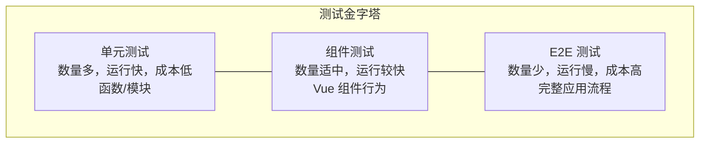

# 单元测试

> 完整理解 Vue 2 应用的测试策略，掌握单元测试的配置、编写和最佳实践。

## 测试概述

> 理解 Vue 应用的测试策略、测试类型划分以及测试框架的选择。

### 为什么需要测试

测试在软件开发生命周期中扮演关键角色：

| 测试价值 | 描述 |
|---------|------|
| **质量保障** | 及早发现缺陷，降低生产环境风险 |
| **重构信心** | 测试覆盖提供安全网，支持代码重构 |
| **文档作用** | 测试用例即活文档，展示预期行为 |
| **设计改进** | 编写测试促使更好的模块化设计 |

### 测试金字塔

测试金字塔描述了测试的层次结构：



#### 各层测试对比

| 特性 | 单元测试 | 组件测试 | E2E 测试 |
|------|---------|---------|---------|
| **测试范围** | 函数/模块 | Vue 组件 | 完整应用 |
| **运行速度** | 毫秒级 | 秒级 | 分钟级 |
| **维护成本** | 低 | 中 | 高 |
| **调试难度** | 简单 | 中等 | 较难 |
| **测试可靠性** | 高 | 中 | 较低 |
| **覆盖范围** | 代码逻辑 | 组件行为 | 用户流程 |

### 一、Jest 配置详解

#### 安装依赖

```bash
# 核心依赖
npm install --save-dev jest @vue/vue2-jest babel-jest

# 可选：Vue CLI 插件方式
vue add unit-jest
```

#### 配置文件

```javascript
// jest.config.js
module.exports = {
  // 测试环境
  testEnvironment: 'jsdom',
  
  // 文件扩展名
  moduleFileExtensions: ['js', 'json', 'vue'],
  
  // 转换配置
  transform: {
    '^.+\\.vue$': '@vue/vue2-jest',
    '^.+\\.js$': 'babel-jest'
  },
  
  // 模块路径映射
  moduleNameMapper: {
    '^@/(.*)$': '<rootDir>/src/$1',
    '\\.(css|less|scss)$': 'identity-obj-proxy'
  },
  
  // 测试文件匹配
  testMatch: [
    '**/tests/unit/**/*.spec.js',
    '**/__tests__/**/*.js'
  ],
  
  // 覆盖率收集
  collectCoverageFrom: [
    'src/**/*.{js,vue}',
    '!src/main.js',
    '!src/router/index.js',
    '!**/node_modules/**'
  ],
  
  // 覆盖率报告
  coverageReporters: ['text', 'lcov', 'html'],
  
  // 覆盖率阈值
  coverageThreshold: {
    global: {
      branches: 70,
      functions: 80,
      lines: 80,
      statements: 80
    }
  },
  
  // 全局设置
  setupFiles: ['<rootDir>/tests/setup.js'],
  
  // 忽略转换
  transformIgnorePatterns: [
    '/node_modules/(?!lodash-es)'
  ]
}
```

#### Babel 配置

```javascript
// babel.config.js
module.exports = {
  presets: [
    '@babel/preset-env'
  ],
  env: {
    test: {
      presets: [
        ['@babel/preset-env', { targets: { node: 'current' } }]
      ]
    }
  }
}
```

#### 测试设置文件

```javascript
// tests/setup.js
import Vue from 'vue'

// 禁止生产提示
Vue.config.productionTip = false
Vue.config.devtools = false

// 全局 Mock
global.console = {
  ...console,
  warn: jest.fn(), // 忽略警告或验证警告
  error: jest.fn()
}
```

---

### 二、Mocha 配置详解

#### 安装依赖

```bash
# 核心依赖
npm install --save-dev mocha chai sinon @vue/test-utils
npm install --save-dev jsdom jsdom-global

# 可选：Vue CLI 插件方式
vue add unit-mocha
```

> 注意：纯 Mocha 无法直接解析 `.vue` 单文件组件；若测试需要导入 SFC，请使用 mochapack（基于 webpack 的 Mocha 运行器，Vue CLI 的 unit-mocha 插件即采用此方案）。

#### 配置文件

```javascript
// .mocharc.js
module.exports = {
  // 扩展名
  extension: ['js', 'vue'],
  
  // 测试文件
  spec: 'tests/unit/**/*.spec.js',
  
  // 递归搜索
  recursive: true,
  
  // 需要预加载的文件
  require: [
    '@babel/register',
    'jsdom-global/register',
    './tests/setup.js'
  ],
  
  // 超时时间
  timeout: 10000,
  
  // 报告格式
  reporter: 'spec'
}
```

#### 断言库配置

```javascript
// tests/setup.js
const chai = require('chai')
const sinonChai = require('sinon-chai')

// 扩展 chai
chai.use(sinonChai)

// 全局暴露
global.expect = chai.expect
global.sinon = require('sinon')
```

---

### 三、测试工具函数

#### Jest 常用 API

##### 断言

```javascript
// 基本断言
expect(value).toBe(expected)           // 严格相等 ===
expect(value).toEqual(expected)        // 深度相等
expect(value).toBeTruthy()             // 转换为 true
expect(value).toBeFalsy()              // 转换为 false
expect(value).toBeNull()               // 为 null
expect(value).toBeUndefined()          // 为 undefined
expect(value).toBeDefined()            // 已定义
expect(value).toBeNaN()                // 为 NaN

// 数值比较
expect(value).toBeGreaterThan(5)
expect(value).toBeGreaterThanOrEqual(5)
expect(value).toBeLessThan(5)
expect(value).toBeLessThanOrEqual(5)
expect(value).toBeCloseTo(0.3, 5)      // 浮点数近似

// 字符串匹配
expect(string).toMatch(/pattern/)
expect(string).toMatch('substring')
expect(string).toContain('text')

// 数组
expect(array).toHaveLength(3)
expect(array).toContain(item)
expect(array).toContainEqual({ id: 1 })

// 对象
expect(object).toHaveProperty('name')
expect(object).toHaveProperty('address.city', 'Beijing')

// 异常
expect(() => fn()).toThrow()
expect(() => fn()).toThrow(Error)
expect(() => fn()).toThrow('error message')

// 异步
await expect(promise).resolves.toBe(value)
await expect(promise).rejects.toThrow()
```

##### Mock 函数

```javascript
// 创建 Mock 函数
const mockFn = jest.fn()
const mockFn = jest.fn().mockReturnValue('value')
const mockFn = jest.fn().mockImplementation(x => x * 2)
const mockFn = jest.fn().mockResolvedValue('async value')
const mockFn = jest.fn().mockRejectedValue(new Error('fail'))

// 断言调用
expect(mockFn).toHaveBeenCalled()
expect(mockFn).toHaveBeenCalledTimes(2)
expect(mockFn).toHaveBeenCalledWith(arg1, arg2)
expect(mockFn).toHaveBeenLastCalledWith(arg1, arg2)

// 清除调用记录
mockFn.mockClear()
mockFn.mockReset()
mockFn.mockRestore()
```

##### Mock 模块

```javascript
// Mock 整个模块
jest.mock('axios')
axios.get.mockResolvedValue({ data: { id: 1 } })

// Mock 部分导出
jest.mock('@/api/user', () => ({
  getUser: jest.fn().mockResolvedValue({ name: 'John' })
}))

// 模块内使用原始实现
jest.mock('@/utils/helper', () => {
  const original = jest.requireActual('@/utils/helper')
  return {
    ...original,
    formatName: jest.fn()
  }
})
```

##### Spy 监视

```javascript
const obj = {
  method: () => 'original'
}

// 监视方法
const spy = jest.spyOn(obj, 'method')
spy.mockReturnValue('mocked')

// 还原
spy.mockRestore()
```

#### Mocha + Chai 常用 API

```javascript
// Chai 断言风格
expect(value).to.equal(expected)
expect(value).to.deep.equal(expected)
expect(array).to.have.lengthOf(3)
expect(string).to.match(/pattern/)
expect(fn).to.throw(Error)

// Sinon Spy
const spy = sinon.spy()
obj.method = spy

// Sinon Stub
const stub = sinon.stub(obj, 'method').returns('value')
stub.restore()

// Sinon Mock
const mock = sinon.mock(obj)
mock.expects('method').once().returns('value')
mock.verify()
```

---

### 四、测试示例

#### 测试工具函数

```javascript
// src/utils/validator.js
export function isValidEmail(email) {
  const regex = /^[^\s@]+@[^\s@]+\.[^\s@]+$/
  return regex.test(email)
}

export function formatPrice(price, currency = 'CNY') {
  if (typeof price !== 'number' || isNaN(price)) {
    return ''
  }
  const symbols = { CNY: '¥', USD: '$', EUR: '€' }
  return `${symbols[currency] || ''}${price.toFixed(2)}`
}

// tests/unit/validator.spec.js
import { isValidEmail, formatPrice } from '@/utils/validator'

describe('isValidEmail', () => {
  it('应该返回 true 对于有效邮箱', () => {
    expect(isValidEmail('test@example.com')).toBe(true)
    expect(isValidEmail('user.name@domain.co.uk')).toBe(true)
  })

  it('应该返回 false 对于无效邮箱', () => {
    expect(isValidEmail('invalid')).toBe(false)
    expect(isValidEmail('test@')).toBe(false)
    expect(isValidEmail('@domain.com')).toBe(false)
    expect(isValidEmail('')).toBe(false)
  })
})

describe('formatPrice', () => {
  it('应该正确格式化价格', () => {
    expect(formatPrice(99.99)).toBe('¥99.99')
    expect(formatPrice(100)).toBe('¥100.00')
  })

  it('应该支持不同货币符号', () => {
    expect(formatPrice(100, 'USD')).toBe('$100.00')
    expect(formatPrice(100, 'EUR')).toBe('€100.00')
  })

  it('应该处理无效输入', () => {
    expect(formatPrice('price')).toBe('')
    expect(formatPrice(NaN)).toBe('')
    expect(formatPrice(null)).toBe('')
  })
})
```

#### 测试 Vuex Store

```javascript
// src/store/modules/counter.js
export default {
  namespaced: true,
  state: {
    count: 0
  },
  getters: {
    doubleCount: state => state.count * 2
  },
  mutations: {
    INCREMENT(state, payload = 1) {
      state.count += payload
    },
    DECREMENT(state, payload = 1) {
      state.count -= payload
    },
    RESET(state) {
      state.count = 0
    }
  },
  actions: {
    async increment({ commit }, payload) {
      commit('INCREMENT', payload)
    },
    async decrement({ commit }, payload) {
      commit('DECREMENT', payload)
    }
  }
}

// tests/unit/store/counter.spec.js
import counter from '@/store/modules/counter'

describe('Counter Store', () => {
  let state

  beforeEach(() => {
    state = { count: 0 }
  })

  describe('mutations', () => {
    it('INCREMENT 应该增加计数', () => {
      counter.mutations.INCREMENT(state, 5)
      expect(state.count).toBe(5)
    })

    it('DECREMENT 应该减少计数', () => {
      state.count = 10
      counter.mutations.DECREMENT(state, 3)
      expect(state.count).toBe(7)
    })

    it('RESET 应该重置计数', () => {
      state.count = 100
      counter.mutations.RESET(state)
      expect(state.count).toBe(0)
    })
  })

  describe('getters', () => {
    it('doubleCount 应该返回两倍的值', () => {
      state.count = 5
      expect(counter.getters.doubleCount(state)).toBe(10)
    })
  })

  describe('actions', () => {
    it('increment 应该提交 INCREMENT', async () => {
      const commit = jest.fn()
      await counter.actions.increment({ commit }, 10)
      expect(commit).toHaveBeenCalledWith('INCREMENT', 10)
    })
  })
})
```

#### 测试异步函数

```javascript
// src/api/user.js
import axios from 'axios'

export async function fetchUser(id) {
  const response = await axios.get(`/api/users/${id}`)
  return response.data
}

export async function updateUser(id, data) {
  const response = await axios.put(`/api/users/${id}`, data)
  return response.data
}

// tests/unit/api/user.spec.js
import axios from 'axios'
import { fetchUser, updateUser } from '@/api/user'

// Mock axios
jest.mock('axios')

describe('User API', () => {
  beforeEach(() => {
    axios.get.mockClear()
    axios.put.mockClear()
  })

  describe('fetchUser', () => {
    it('应该返回用户数据', async () => {
      const mockUser = { id: 1, name: 'John' }
      axios.get.mockResolvedValue({ data: mockUser })

      const result = await fetchUser(1)

      expect(axios.get).toHaveBeenCalledWith('/api/users/1')
      expect(result).toEqual(mockUser)
    })

    it('应该处理请求错误', async () => {
      axios.get.mockRejectedValue(new Error('Network Error'))

      await expect(fetchUser(999)).rejects.toThrow('Network Error')
    })
  })

  describe('updateUser', () => {
    it('应该更新用户并返回数据', async () => {
      const updatedUser = { id: 1, name: 'Updated' }
      axios.put.mockResolvedValue({ data: updatedUser })

      const result = await updateUser(1, { name: 'Updated' })

      expect(axios.put).toHaveBeenCalledWith('/api/users/1', { name: 'Updated' })
      expect(result).toEqual(updatedUser)
    })
  })
})
```

#### 测试自定义指令

```javascript
// src/directives/click-outside.js
export default {
  bind(el, binding) {
    el.__clickOutside__ = (event) => {
      if (!(el === event.target || el.contains(event.target))) {
        binding.value(event)
      }
    }
    document.addEventListener('click', el.__clickOutside__)
  },
  unbind(el) {
    document.removeEventListener('click', el.__clickOutside__)
    delete el.__clickOutside__
  }
}

// tests/unit/directives/click-outside.spec.js
import clickOutside from '@/directives/click-outside'

describe('click-outside 指令', () => {
  let el
  let mockHandler

  beforeEach(() => {
    el = document.createElement('div')
    document.body.appendChild(el)
    mockHandler = jest.fn()
  })

  afterEach(() => {
    clickOutside.unbind(el)
    document.body.removeChild(el)
  })

  it('点击元素外部时触发回调', () => {
    clickOutside.bind(el, { value: mockHandler })

    // 模拟点击外部
    document.body.click()

    expect(mockHandler).toHaveBeenCalled()
  })

  it('点击元素内部时不触发回调', () => {
    clickOutside.bind(el, { value: mockHandler })

    // 模拟点击元素内部
    el.click()

    expect(mockHandler).not.toHaveBeenCalled()
  })
})
```

---

### 五、最佳实践

#### 测试组织结构

```javascript
describe('模块名称', () => {
  // 共享变量
  let service
  let mockDep

  // 初始化
  beforeEach(() => {
    service = new Service()
    mockDep = jest.fn()
  })

  // 清理
  afterEach(() => {
    jest.clearAllMocks()
  })

  describe('方法名', () => {
    it('正常情况描述', () => {
      // Arrange - 准备
      const input = 'test'
      
      // Act - 执行
      const result = service.method(input)
      
      // Assert - 断言
      expect(result).toBe('expected')
    })

    it('边界情况描述', () => {
      // ...
    })

    it('错误情况描述', () => {
      // ...
    })
  })
})
```

#### 命名约定

```javascript
// 测试文件命名
// utils.js        → utils.spec.js
// UserService.js  → UserService.spec.js
// Counter.vue     → Counter.spec.js

// 描述命名（中文）
describe('UserService', () => {
  describe('login()', () => {
    it('应该使用有效凭据成功登录', () => {})
    it('应该在密码错误时抛出异常', () => {})
    it('应该在用户不存在时返回 null', () => {})
  })
})
```

#### 避免测试反模式

```javascript
// ❌ 错误：测试私有方法
it('私有方法应该正常工作', () => {
  expect(service._privateMethod()).toBe(true)
})

// ✅ 正确：测试公共 API
it('公共方法应该返回预期结果', () => {
  expect(service.publicMethod()).toBe(true)
})

// ❌ 错误：测试多个断言
it('测试所有功能', () => {
  expect(user.name).toBe('John')
  expect(user.age).toBe(30)
  expect(user.email).toBe('john@example.com')
})

// ✅ 正确：单一断言关注点
it('应该返回正确的用户名', () => {
  expect(user.name).toBe('John')
})

// ❌ 错误：依赖外部状态
it('依赖上一次测试', () => {
  expect(previousResult).toBe('value')
})

// ✅ 正确：独立测试
beforeEach(() => {
  previousResult = setupValue()
})
```

#### 测试覆盖率

```bash
# 运行覆盖率报告
npm run test:unit -- --coverage

# 打开 HTML 报告
open coverage/lcov-report/index.html
```

```
----------------------------------|---------|----------|---------|---------|
File                              | % Stmts | % Branch | % Funcs | % Lines |
----------------------------------|---------|----------|---------|---------|
All files                         |   85.71 |    75.00 |   88.89 |   85.71 |
 src/                             |   88.89 |    80.00 |   90.00 |   88.89 |
  utils.js                        |   90.00 |    85.71 |   92.31 |   90.00 |
  api.js                          |   85.00 |    70.00 |   85.00 |   85.00 |
----------------------------------|---------|----------|---------|---------|
```

---

### 六、常见问题

#### Q1: Jest 如何处理 CSS/图片导入？

```javascript
// jest.config.js
moduleNameMapper: {
  '\\.(css|less|scss|sass)$': 'identity-obj-proxy',
  '\\.(jpg|jpeg|png|gif|svg)$': '<rootDir>/tests/__mocks__/fileMock.js'
}

// tests/__mocks__/fileMock.js
module.exports = 'test-file-stub'
```

#### Q2: 如何测试 setTimeout/setInterval？

```javascript
it('测试定时器', () => {
  jest.useFakeTimers()
  
  const callback = jest.fn()
  setTimeout(callback, 1000)
  
  jest.advanceTimersByTime(1000)
  
  expect(callback).toHaveBeenCalled()
  
  jest.useRealTimers()
})
```

#### Q3: 如何模拟 window/localStorage？

```javascript
// 模拟 localStorage
const localStorageMock = {
  getItem: jest.fn(),
  setItem: jest.fn(),
  clear: jest.fn()
}
Object.defineProperty(window, 'localStorage', { value: localStorageMock })

// 模拟 window.location
// （旧版 jsdom 可直接 delete 后重新赋值；新版 jsdom 的 location 属性不可配置，
//   改用 window.history.replaceState({}, '', '/path') 或仅 mock assign 等方法）
delete window.location
window.location = { href: '', assign: jest.fn() }
```

#### Q4: 测试运行很慢怎么办？

```javascript
// 1. 并行运行（Jest 默认）
// 2. 只运行变更的测试
jest --onlyChanged

// 3. 使用测试筛选
jest --testNamePattern="UserService"

// 4. 减少不必要的 setup
```

---

### 相关资源

- [Jest 官方文档](https://jestjs.io/zh-Hans/docs/getting-started)
- [Mocha 官方文档](https://mochajs.org/)
- [Chai 断言库](https://www.chaijs.com/)
- [Sinon Mock 库](https://sinonjs.org/)


### 下一步

- [组件测试](04-组件测试.md) - 学习 Vue 组件测试和 E2E 测试
