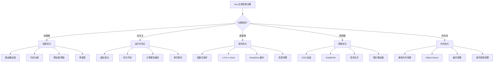

# 性能优化

## 概述

性能优化是提升用户体验的关键环节。Vue 应用的性能优化可以从以下几个维度进行：



| 优化维度 | 关注重点 | 影响范围 |
|---------|---------|---------|
| 首屏优化 | 加载速度、白屏时间 | 用户体验、SEO |
| 运行时优化 | 响应速度、渲染效率 | 交互体验 |
| 组件优化 | 更新效率、内存占用 | 整体性能 |
| 网络优化 | 资源大小、请求策略 | 加载性能 |
| 内存优化 | 内存泄漏、GC 压力 | 长期稳定性 |

## 首屏优化

### 路由懒加载

将路由组件按需加载，减少首屏资源体积：

```js
// 传统方式 - 首屏加载所有组件
import Home from './views/Home.vue'
import About from './views/About.vue'

const routes = [
  { path: '/', component: Home },
  { path: '/about', component: About }
]

// 推荐方式 - 路由懒加载
const routes = [
  {
    path: '/',
    component: () => import('./views/Home.vue')
  },
  {
    path: '/about',
    component: () => import('./views/About.vue')
  }
]
```

### 代码分割策略

使用 Webpack 的 `SplitChunksPlugin` 进行合理的代码分割：

```js
// vue.config.js
module.exports = {
  configureWebpack: {
    optimization: {
      splitChunks: {
        chunks: 'all',
        cacheGroups: {
          // 将第三方库分离
          vendor: {
            name: 'vendor',
            test: /[\\/]node_modules[\\/]/,
            priority: 10,
            chunks: 'initial'
          },
          // 将公共模块分离
          common: {
            name: 'common',
            minChunks: 2,
            priority: 5,
            reuseExistingChunk: true
          },
          // 将 Vue 全家桶单独分离
          vue: {
            name: 'vue-vendor',
            test: /[\\/]node_modules[\\/](vue|vue-router|vuex)[\\/]/,
            priority: 20
          }
        }
      }
    }
  }
}
```

### 预加载与预获取

```js
// 预取（Prefetch）- 低优先级，浏览器空闲时加载未来导航可能需要的资源
import(/* webpackPrefetch: true */ './views/About.vue')

// 预加载（Preload）- 高优先级，与当前导航并行加载肯定需要的资源
import(/* webpackPreload: true */ './views/Dashboard.vue')

// 路由配置示例
const routes = [
  {
    path: '/about',
    component: () => import(/* webpackPrefetch: true */ './views/About.vue')
  }
]
```

### 骨架屏

在数据加载前显示骨架屏，提升用户感知速度：

```vue
<!-- Skeleton.vue -->
<template>
  <div class="skeleton">
    <div class="skeleton-header"></div>
    <div class="skeleton-content">
      <div class="skeleton-line"></div>
      <div class="skeleton-line short"></div>
      <div class="skeleton-line"></div>
    </div>
  </div>
</template>

<style scoped>
.skeleton {
  padding: 20px;
}
.skeleton-header {
  width: 100px;
  height: 100px;
  background: linear-gradient(90deg, #f0f0f0 25%, #e0e0e0 50%, #f0f0f0 75%);
  background-size: 200% 100%;
  animation: skeleton-loading 1.5s infinite;
  border-radius: 50%;
}
.skeleton-line {
  height: 16px;
  margin: 12px 0;
  background: linear-gradient(90deg, #f0f0f0 25%, #e0e0e0 50%, #f0f0f0 75%);
  background-size: 200% 100%;
  animation: skeleton-loading 1.5s infinite;
  border-radius: 4px;
}
.skeleton-line.short {
  width: 60%;
}
@keyframes skeleton-loading {
  0% { background-position: 200% 0; }
  100% { background-position: -200% 0; }
}
</style>
```

```vue
<!-- 使用示例 -->
<template>
  <div>
    <Skeleton v-if="loading" />
    <Content v-else :data="data" />
  </div>
</template>
```

### 服务端渲染（SSR）

对于 SEO 要求高的应用，可考虑使用 Nuxt.js 实现服务端渲染：

```bash
# 安装 Nuxt.js
npm install nuxt
```

```js
// nuxt.config.js
export default {
  // 开启服务端渲染
  ssr: true,
  // 优化配置
  render: {
    resourceHints: true,
    http2: {
      push: true
    }
  }
}
```

## 运行时优化

### 虚拟滚动

处理大量列表数据时，使用虚拟滚动只渲染可视区域的元素：

```vue
<template>
  <div class="scroll-container" @scroll="handleScroll">
    <div class="scroll-content" :style="{ height: totalHeight + 'px' }">
      <div
        v-for="item in visibleItems"
        :key="item.id"
        class="scroll-item"
        :style="{ transform: `translateY(${item.offset}px)` }"
      >
        {{ item.content }}
      </div>
    </div>
  </div>
</template>

<style scoped>
/* 注意：条目必须绝对定位（或用 padding-top 预留空间），
   否则 translateY 偏移会叠加在正常文档流位置上，列表位置全错 */
.scroll-container {
  height: 500px;
  overflow-y: auto;
  position: relative;
}
.scroll-item {
  position: absolute;
  left: 0;
  right: 0;
  height: 50px;
  line-height: 50px;
}
</style>

<script>
export default {
  data() {
    return {
      items: [], // 所有数据
      itemHeight: 50, // 每项高度
      startIndex: 0,
      visibleCount: 10 // 可见数量
    }
  },
  computed: {
    totalHeight() {
      return this.items.length * this.itemHeight
    },
    visibleItems() {
      return this.items
        .slice(this.startIndex, this.startIndex + this.visibleCount)
        .map((item, index) => ({
          ...item,
          offset: (this.startIndex + index) * this.itemHeight
        }))
    }
  },
  methods: {
    handleScroll(e) {
      const scrollTop = e.target.scrollTop
      this.startIndex = Math.floor(scrollTop / this.itemHeight)
    }
  }
}
</script>
```

推荐使用成熟的虚拟滚动库：

```bash
npm install vue-virtual-scroller
```

```vue
<template>
  <RecycleScroller
    class="scroller"
    :items="items"
    :item-size="50"
    key-field="id"
  >
    <template #default="{ item }">
      <div class="item">{{ item.content }}</div>
    </template>
  </RecycleScroller>
</template>
```

### 冻结数据

对于不需要响应式的数据，使用 `Object.freeze()` 冻结：

```js
export default {
  data() {
    return {
      // 大型列表数据不需要响应式更新
      largeList: Object.freeze([
        { id: 1, name: 'Item 1' },
        { id: 2, name: 'Item 2' },
        // ... 大量数据
      ])
    }
  }
}

// 冻结整个对象
const frozenData = Object.freeze({
  config: { /* ... */ },
  constants: { /* ... */ }
})
```

### 防抖与节流

```js
// 防抖函数 - 搜索输入
function debounce(fn, delay = 300) {
  let timer = null
  return function(...args) {
    clearTimeout(timer)
    timer = setTimeout(() => {
      fn.apply(this, args)
    }, delay)
  }
}

// 节流函数 - 滚动事件
function throttle(fn, delay = 100) {
  let lastTime = 0
  return function(...args) {
    const now = Date.now()
    if (now - lastTime >= delay) {
      fn.apply(this, args)
      lastTime = now
    }
  }
}

// Vue 组件中使用
export default {
  methods: {
    handleSearch: debounce(function(query) {
      this.search(query)
    }, 300),
    
    handleScroll: throttle(function() {
      this.checkVisibility()
    }, 100)
  }
}
```

### 计算属性缓存

合理使用计算属性的缓存特性：

```js
export default {
  data() {
    return {
      items: [/* ... */],
      filterText: ''
    }
  },
  computed: {
    // 计算属性有缓存，只有依赖变化时才重新计算
    filteredItems() {
      return this.items.filter(item => 
        item.name.includes(this.filterText)
      )
    },
    // 复杂计算应拆分为多个计算属性
    activeItems() {
      return this.filteredItems.filter(item => item.isActive)
    },
    sortedItems() {
      return [...this.activeItems].sort((a, b) => a.id - b.id)
    }
  }
}
```

### v-once 与静态内容

```vue
<template>
  <!-- v-once: 只渲染一次，适用于静态内容 -->
  <div v-once>
    <h1>{{ title }}</h1>
    <p>{{ description }}</p>
  </div>

  <!-- 大段与数据无关的静态内容可拆成独立组件，
       配合 v-once 或模板编译时的静态节点提升（hoistStatic）跳过比对 -->
  <static-panel :title="panelTitle" />
</template>
```

> 注意：`v-memo` 是 Vue 3.2+ 才引入的指令，Vue 2 **不支持**。Vue 2 中要跳过子树更新，可用 `v-once`（静态内容）、`v-if` 分支或 `Object.freeze` 冻结数据来实现类似效果。

## 组件优化

### 合理使用 v-show 和 v-if

```vue
<template>
  <!-- v-if: 条件为 false 时不渲染 DOM -->
  <!-- 适用于条件很少改变的场景 -->
  <Modal v-if="showModal" @close="showModal = false" />

  <!-- v-show: 始终渲染 DOM，只是切换 display -->
  <!-- 适用于频繁切换的场景 -->
  <TabContent v-show="activeTab === 'tab1'" />
  <TabContent v-show="activeTab === 'tab2'" />
</template>
```

### 函数式组件

对于无状态、无实例的组件，使用函数式组件：

```vue
<!-- FunctionalButton.vue -->
<template functional>
  <button
    :class="['btn', props.type]"
    @click="listeners.click"
  >
    <slot />
  </button>
</template>

<script>
export default {
  name: 'FunctionalButton',
  props: {
    type: {
      type: String,
      default: 'default'
    }
  }
}
</script>
```

### 子组件拆分

将复杂组件拆分为更小的子组件，利用组件级别的更新：

```vue
<!-- 拆分前：整个列表都会重新渲染 -->
<template>
  <div>
    <div v-for="item in items" :key="item.id">
      <span>{{ item.name }}</span>
      <span>{{ item.status }}</span>
    </div>
  </div>
</template>

<!-- 拆分后：只有变化的子组件会重新渲染 -->
<template>
  <div>
    <ListItem
      v-for="item in items"
      :key="item.id"
      :item="item"
    />
  </div>
</template>

<script>
// ListItem.vue 作为独立组件
const ListItem = {
  props: ['item'],
  template: `
    <div>
      <span>{{ item.name }}</span>
      <span>{{ item.status }}</span>
    </div>
  `
}

export default {
  components: { ListItem }
}
</script>
```

### 及时销毁定时器和事件监听

```js
export default {
  data() {
    return {
      timer: null,
      scrollHandler: null
    }
  },
  mounted() {
    // 定时器
    this.timer = setInterval(() => {
      this.updateTime()
    }, 1000)

    // 事件监听
    this.scrollHandler = this.handleScroll.bind(this)
    window.addEventListener('scroll', this.scrollHandler)
  },
  beforeDestroy() {
    // 清理定时器
    if (this.timer) {
      clearInterval(this.timer)
      this.timer = null
    }

    // 移除事件监听
    if (this.scrollHandler) {
      window.removeEventListener('scroll', this.scrollHandler)
    }
  },
  methods: {
    updateTime() { /* ... */ },
    handleScroll() { /* ... */ }
  }
}
```

## 网络优化

### 请求合并与缓存

```js
// API 缓存示例
const cache = new Map()

async function fetchWithCache(url, options = {}) {
  const cacheKey = JSON.stringify({ url, options })
  
  // 检查缓存
  if (cache.has(cacheKey)) {
    const { data, timestamp } = cache.get(cacheKey)
    // 缓存有效期 5 分钟
    if (Date.now() - timestamp < 5 * 60 * 1000) {
      return data
    }
  }

  // 发起请求
  const response = await fetch(url, options)
  const data = await response.json()
  
  // 存入缓存
  cache.set(cacheKey, {
    data,
    timestamp: Date.now()
  })

  return data
}
```

### 图片懒加载

```vue
<template>
  
</template>

<script>
// 自定义懒加载指令
Vue.directive('lazy', {
  inserted(el, binding) {
    const observer = new IntersectionObserver((entries) => {
      entries.forEach(entry => {
        if (entry.isIntersecting) {
          el.src = binding.value
          observer.unobserve(el)
        }
      })
    })
    observer.observe(el)
  }
})
</script>
```

### 包体积分析方法

使用 webpack-bundle-analyzer 分析并优化打包体积：

```bash
npm install --save-dev webpack-bundle-analyzer
```

```javascript
// vue.config.js
const BundleAnalyzerPlugin = require('webpack-bundle-analyzer').BundleAnalyzerPlugin

module.exports = {
  configureWebpack: {
    plugins: [
      new BundleAnalyzerPlugin({
        analyzerMode: 'static',
        openAnalyzer: false
      })
    ]
  }
}
```

**Vue 2 包体积优化清单：**
1. 使用运行时版本（vue.runtime.js）代替完整版 → 节省 ~30%
2. 路由懒加载 → 按需加载页面 chunk
3. 组件异步加载 → 非首屏组件延迟加载
4. Tree Shaking → 移除未使用的第三方库代码
5. moment.js → 替换为 dayjs（体积通常可减少 90% 以上，视打包配置而定）
6. lodash → 按需导入 `import debounce from 'lodash/debounce'`

### Gzip 压缩

```js
// vue.config.js
const CompressionPlugin = require('compression-webpack-plugin')

module.exports = {
  configureWebpack: {
    plugins: [
      new CompressionPlugin({
        algorithm: 'gzip',
        test: /\.(js|css|html|svg)$/,
        threshold: 10240, // 只处理大于 10KB 的文件
        minRatio: 0.8
      })
    ]
  }
}
```

### CDN 加速

```js
// vue.config.js
module.exports = {
  chainWebpack: config => {
    // 外部化依赖
    config.externals({
      vue: 'Vue',
      'vue-router': 'VueRouter',
      vuex: 'Vuex',
      axios: 'axios'
    })
  }
}
```

```html
<!-- index.html -->
<script src="https://cdn.jsdelivr.net/npm/vue@2.7.14/dist/vue.min.js"></script>
<script src="https://cdn.jsdelivr.net/npm/vue-router@3.6.5/dist/vue-router.min.js"></script>
<script src="https://cdn.jsdelivr.net/npm/vuex@3.6.2/dist/vuex.min.js"></script>
<script src="https://cdn.jsdelivr.net/npm/axios/dist/axios.min.js"></script>
```

## 内存优化

### 避免内存泄漏

```js
export default {
  data() {
    return {
      eventBus: null,
      socket: null
    }
  },
  created() {
    // 使用事件总线
    this.eventBus = this.$root
    this.eventBus.$on('event', this.handleEvent)
  },
  mounted() {
    // WebSocket 连接
    this.socket = new WebSocket('ws://example.com')
    this.socket.onmessage = this.handleMessage
  },
  beforeDestroy() {
    // 清理事件监听
    if (this.eventBus) {
      this.eventBus.$off('event', this.handleEvent)
    }
    
    // 关闭 WebSocket
    if (this.socket) {
      this.socket.close()
      this.socket = null
    }
  }
}
```

### 及时清理不需要的数据

```js
export default {
  data() {
    return {
      pageData: null,
      cachedData: new Map()
    }
  },
  methods: {
    // 离开页面时清理数据
    clearPageData() {
      this.pageData = null
    },
    
    // 限制缓存大小
    addToCache(key, value) {
      if (this.cachedData.size > 100) {
        // 清理最早的缓存
        const firstKey = this.cachedData.keys().next().value
        this.cachedData.delete(firstKey)
      }
      this.cachedData.set(key, value)
    }
  },
  beforeRouteLeave(to, from, next) {
    this.clearPageData()
    next()
  }
}
```

### 避免闭包引用

```js
// 反例：闭包持有大对象的引用
export default {
  methods: {
    fetchData() {
      const largeData = this.largeArray // 大数组
      
      setTimeout(() => {
        // 闭包引用 largeData，导致无法释放
        console.log(largeData.length)
      }, 1000)
    }
  }
}

// 正例：只保存需要的值
export default {
  methods: {
    fetchData() {
      const length = this.largeArray.length
      
      setTimeout(() => {
        console.log(length)
      }, 1000)
    }
  }
}
```

## 性能监控

### 使用 Vue DevTools

Vue DevTools 提供了组件性能分析功能：
- 组件渲染时间
- 组件更新频率
- 响应式依赖追踪

### 使用 Performance API

```js
// 性能标记
export default {
  methods: {
    measurePerformance() {
      // 开始标记
      performance.mark('start-render')
      
      // 执行操作
      this.renderComponent()
      
      // 结束标记
      performance.mark('end-render')
      
      // 测量
      performance.measure('render-time', 'start-render', 'end-render')
      
      // 获取测量结果
      const measures = performance.getEntriesByName('render-time')
      console.log('渲染耗时:', measures[0].duration, 'ms')
      
      // 清理
      performance.clearMarks()
      performance.clearMeasures()
    }
  }
}
```

### 自定义性能监控

```js
// performance-monitor.js
class PerformanceMonitor {
  constructor() {
    this.marks = new Map()
  }

  start(name) {
    this.marks.set(name, performance.now())
  }

  end(name) {
    const startTime = this.marks.get(name)
    if (startTime) {
      const duration = performance.now() - startTime
      this.marks.delete(name)
      return duration
    }
    return 0
  }

  report(name, duration) {
    // 上报性能数据
    if (duration > 100) {
      console.warn(`[性能警告] ${name} 耗时 ${duration.toFixed(2)}ms`)
    }
    // 可以发送到监控系统
    // this.sendToServer({ name, duration })
  }
}

export const monitor = new PerformanceMonitor()

// 在组件中使用（beforeUpdate/updated 配对测量每次更新的耗时）
export default {
  beforeUpdate() {
    monitor.start('component-update')
  },
  updated() {
    const duration = monitor.end('component-update')
    monitor.report('component-update', duration)
  }
}
```

## 最佳实践总结

### 性能优化检查清单

```
□ 首屏优化
  □ 路由懒加载
  □ 代码分割
  □ 资源预加载
  □ 骨架屏

□ 运行时优化
  □ 虚拟滚动（大数据列表）
  □ 冻结静态数据
  □ 防抖节流
  □ 计算属性缓存

□ 组件优化
  □ 合理使用 v-if/v-show
  □ 函数式组件
  □ 组件拆分
  □ 及时销毁资源

□ 网络优化
  □ 请求合并
  □ 图片懒加载
  □ Gzip 压缩
  □ CDN 加速

□ 内存优化
  □ 避免内存泄漏
  □ 及时清理数据
  □ 避免闭包陷阱
```

### 优化优先级

1. **高优先级**：首屏加载优化（直接影响用户体验）
2. **中优先级**：运行时性能优化（影响交互体验）
3. **低优先级**：内存优化（长期运行的稳定性）

> 💡 **提示**：优化前先测量，使用 Chrome DevTools 或 Vue DevTools 找出真正的性能瓶颈，避免过度优化。

---
