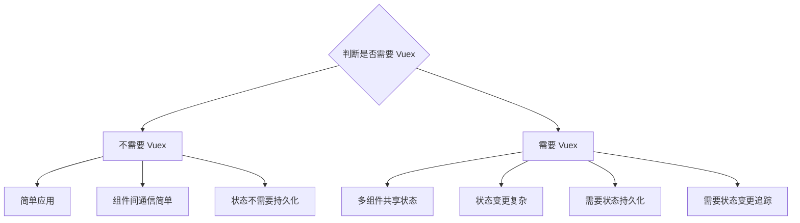

# 常见问题排查

## 概述

本文档收集了 Vue 2 开发过程中最常见的问题及其解决方案，按问题类型分类整理，方便快速查找。

## 响应式相关

### 为什么数据修改后视图没有更新？

**问题描述**：直接修改数组元素或对象属性后，视图没有响应式更新。

**原因分析**：Vue 2 使用 `Object.defineProperty` 实现响应式，无法检测以下变化：
- 直接通过索引设置数组项
- 直接修改数组长度
- 给对象添加新属性

**解决方案**：

```js
// 问题：直接修改数组元素
this.items[0] = newValue // 视图不会更新

// 解决方案1：使用 Vue.set
this.$set(this.items, 0, newValue)

// 解决方案2：使用 splice
this.items.splice(0, 1, newValue)

// 问题：直接修改数组长度
this.items.length = 0 // 视图不会更新

// 解决方案：使用 splice
this.items.splice(0)

// 问题：添加新属性
this.obj.newProp = 'value' // 视图不会更新

// 解决方案1：使用 Vue.set
this.$set(this.obj, 'newProp', 'value')

// 解决方案2：使用 Object.assign
this.obj = Object.assign({}, this.obj, { newProp: 'value' })
```

### 如何实现深层响应式对象？

**问题描述**：嵌套对象的属性变化无法触发视图更新。

**解决方案**：

```js
// 问题：深层对象属性不响应
export default {
  data() {
    return {
      user: {
        profile: {
          name: 'John',
          address: {
            city: 'Beijing'
          }
        }
      }
    }
  },
  methods: {
    updateCity() {
      // 这个修改不会触发更新
      this.user.profile.address.city = 'Shanghai'
    }
  }
}

// 解决方案：使用 $set 或整体替换
this.$set(this.user.profile.address, 'city', 'Shanghai')

// 或整体替换
this.user.profile = {
  ...this.user.profile,
  address: { ...this.user.profile.address, city: 'Shanghai' }
}
```

### computed 和 watch 有什么区别？

**对比说明**：

| 特性 | computed | watch |
|-----|---------|-------|
| 缓存 | 有缓存，依赖不变不重新计算 | 无缓存，每次都执行 |
| 返回值 | 必须有返回值 | 不需要返回值 |
| 异步 | 不支持异步操作 | 支持异步操作 |
| 适用场景 | 派生数据、格式化 | 异步操作、复杂逻辑 |

**使用示例**：

```js
export default {
  data() {
    return {
      firstName: 'John',
      lastName: 'Doe',
      searchQuery: ''
    }
  },
  
  // computed：派生数据
  computed: {
    fullName() {
      return `${this.firstName} ${this.lastName}`
    },
    
    // 带缓存的计算属性
    expensiveValue() {
      // 只有依赖变化时才重新计算
      return this.doComplexCalculation()
    }
  },
  
  // watch：异步操作或复杂逻辑
  watch: {
    searchQuery(newVal, oldVal) {
      // 支持异步操作
      this.debounceSearch(newVal)
    },
    
    // 深度监听
    'user.profile': {
      handler(newVal) {
        this.saveProfile(newVal)
      },
      deep: true,
      immediate: true
    }
  },
  
  methods: {
    debounceSearch: _.debounce(function(query) {
      this.fetchSearchResults(query)
    }, 300)
  }
}
```

### 如何监听数组变化？

**解决方案**：

```js
export default {
  data() {
    return {
      items: []
    }
  },
  watch: {
    // 方式1：监听数组长度变化（不完全可靠）
    'items.length'(newLen, oldLen) {
      console.log(`数组长度从 ${oldLen} 变为 ${newLen}`)
    },
    
    // 方式2：深度监听数组（性能开销较大）
    items: {
      handler(newVal, oldVal) {
        console.log('数组发生变化')
      },
      deep: true
    }
  },
  methods: {
    // 推荐：在修改数组的地方主动触发逻辑
    addItem(item) {
      this.items.push(item)
      this.handleItemsChange()
    }
  }
}
```

## 组件相关

### 父子组件如何通信？

**通信方式对比**：

| 通信方向 | 方式 | 适用场景 |
|---------|-----|---------|
| 父→子 | props | 数据传递 |
| 子→父 | $emit | 事件通知 |
| 父→子 | $refs | 直接调用子组件方法 |
| 子→父 | $parent | 访问父组件（不推荐） |
| 兄弟组件 | 事件总线 | 简单场景 |
| 任意组件 | Vuex | 复杂状态管理 |

**代码示例**：

```vue
<!-- 父组件 -->
<template>
  <div>
    <!-- 父→子：通过 props 传递数据 -->
    <ChildComponent
      :message="parentMessage"
      @update="handleUpdate"
    />
  </div>
</template>

<script>
import ChildComponent from './ChildComponent.vue'

export default {
  components: { ChildComponent },
  data() {
    return {
      parentMessage: 'Hello from parent'
    }
  },
  methods: {
    // 子→父：监听子组件事件
    handleUpdate(newMessage) {
      this.parentMessage = newMessage
    },
    
    // 通过 $refs 调用子组件方法
    callChildMethod() {
      this.$refs.child.someMethod()
    }
  }
}
</script>
```

```vue
<!-- 子组件 -->
<template>
  <div>
    <p>{{ message }}</p>
    <button @click="updateMessage">更新消息</button>
  </div>
</template>

<script>
export default {
  props: {
    message: {
      type: String,
      required: true
    }
  },
  methods: {
    updateMessage() {
      // 子→父：通过 $emit 触发事件
      this.$emit('update', 'New message from child')
    }
  }
}
</script>
```

### 如何实现 v-model 双向绑定？

**原理说明**：`v-model` 是 `v-bind` 和 `v-on` 的语法糖。

```vue
<!-- 父组件使用 -->
<template>
  <!-- v-model 语法糖 -->
  <CustomInput v-model="searchText" />
  
  <!-- 等价于 -->
  <CustomInput
    :value="searchText"
    @input="searchText = $event"
  />
</template>

<script>
export default {
  data() {
    return {
      searchText: ''
    }
  }
}
</script>
```

```vue
<!-- 子组件实现 -->
<template>
  <input
    :value="value"
    @input="$emit('input', $event.target.value)"
  />
</template>

<script>
export default {
  props: ['value'],
  // model 选项的默认值就是 prop: 'value' + event: 'input'，通常可省略；
  // Vue 2.2+ 起可通过 model 选项自定义 prop/event 名称（如 prop: 'checked', event: 'change'）
  model: {
    prop: 'value',
    event: 'input'
  }
}
</script>
```

### 如何实现组件的递归调用？

**解决方案**：

```vue
<!-- TreeItem.vue -->
<template>
  <li>
    <div @click="toggle">
      {{ model.name }}
      <span v-if="isFolder">[{{ open ? '-' : '+' }}]</span>
    </div>
    <ul v-show="open" v-if="isFolder">
      <!-- 递归调用自身 -->
      <TreeItem
        v-for="child in model.children"
        :key="child.id"
        :model="child"
      />
    </ul>
  </li>
</template>

<script>
export default {
  name: 'TreeItem', // 必须提供 name 选项
  props: {
    model: Object
  },
  data() {
    return {
      open: false
    }
  },
  computed: {
    isFolder() {
      return this.model.children && this.model.children.length
    }
  },
  methods: {
    toggle() {
      if (this.isFolder) {
        this.open = !this.open
      }
    }
  }
}
</script>
```

### 如何动态加载组件？

**解决方案**：

```vue
<template>
  <div>
    <!-- 方式1：使用 :is 动态组件（用 v-bind 展开传参，注意 :props 并非特殊语法） -->
    <component :is="currentComponent" v-bind="componentProps" />

    <!-- 方式2/3：异步组件 -->
    <AsyncComponent v-if="showAsync" />
  </div>
</template>

<script>
export default {
  // 异步组件也可在 components 中局部注册（方式3）
  components: {
    AsyncComponent: () => import('./AsyncComponent.vue')
  },
  data() {
    return {
      type: 'type-a',
      showAsync: false,
      componentProps: { /* ... */ }
    }
  },
  computed: {
    // 方式1：:is 既可以绑定组件名（需已注册），也可以直接绑定组件选项对象
    currentComponent() {
      const components = {
        'type-a': 'ComponentA',
        'type-b': 'ComponentB',
        'type-c': 'ComponentC'
      }
      return components[this.type] || 'ComponentA'
    }
  }
}

// 方式2：异步组件（全局注册，在入口文件中执行一次）
// Vue.component('AsyncComponent', () => import('./AsyncComponent.vue'))
</script>
```

## 路由相关

### 如何实现路由守卫？

**路由守卫类型**：

```js
// router/index.js
import Vue from 'vue'
import Router from 'vue-router'

Vue.use(Router)

const router = new Router({
  routes: [
    {
      path: '/login',
      name: 'Login',
      component: () => import('@/views/Login.vue')
    },
    {
      path: '/dashboard',
      name: 'Dashboard',
      component: () => import('@/views/Dashboard.vue'),
      meta: { requiresAuth: true }
    }
  ]
})

// 全局前置守卫
router.beforeEach((to, from, next) => {
  const isLoggedIn = !!localStorage.getItem('token')
  
  if (to.matched.some(record => record.meta.requiresAuth)) {
    if (!isLoggedIn) {
      // 未登录，重定向到登录页
      next({
        path: '/login',
        query: { redirect: to.fullPath }
      })
    } else {
      next()
    }
  } else {
    next()
  }
})

// 全局后置钩子
router.afterEach((to, from) => {
  // 更新页面标题
  document.title = to.meta.title || 'My App'
})

export default router
```

```vue
<!-- 组件内守卫 -->
<script>
export default {
  // 路由进入前
  beforeRouteEnter(to, from, next) {
    // 此时组件实例还未创建，无法访问 this
    next(vm => {
      // 通过 vm 访问组件实例
      vm.fetchData()
    })
  },
  
  // 路由更新时（动态路由参数变化）
  beforeRouteUpdate(to, from, next) {
    // 组件复用时调用
    this.fetchData()
    next()
  },
  
  // 路由离开前
  beforeRouteLeave(to, from, next) {
    if (this.hasUnsavedChanges) {
      const answer = window.confirm('确定要离开吗？数据将丢失。')
      if (answer) {
        next()
      } else {
        next(false)
      }
    } else {
      next()
    }
  }
}
</script>
```

### 如何实现路由懒加载？

**解决方案**：

```js
// router/index.js
import Vue from 'vue'
import Router from 'vue-router'

Vue.use(Router)

const router = new Router({
  routes: [
    // 基础懒加载
    {
      path: '/about',
      component: () => import('@/views/About.vue')
    },
    
    // 分组懒加载（将相关路由打包到同一文件）
    {
      path: '/user',
      component: () => import(/* webpackChunkName: "user" */ '@/views/User.vue'),
      children: [
        {
          path: 'profile',
          component: () => import(/* webpackChunkName: "user" */ '@/views/UserProfile.vue')
        },
        {
          path: 'settings',
          component: () => import(/* webpackChunkName: "user" */ '@/views/UserSettings.vue')
        }
      ]
    },
    
    // 预取（低优先级，浏览器空闲时加载）
    {
      path: '/dashboard',
      component: () => import(/* webpackPrefetch: true */ '@/views/Dashboard.vue')
    }
  ]
})

export default router
```

### 如何获取路由参数？

**参数获取方式**：

```js
// 路由配置
const routes = [
  // 动态路由参数
  {
    path: '/user/:id',
    component: User
  },
  
  // 查询参数
  {
    path: '/search',
    component: Search
  }
]

// 组件中获取参数
export default {
  created() {
    // 动态参数：/user/123 → this.$route.params.id = '123'
    console.log(this.$route.params.id)
    
    // 查询参数：/search?q=vue → this.$route.query.q = 'vue'
    console.log(this.$route.query.q)
    
    // 完整路径
    console.log(this.$route.fullPath)
  },
  
  // 监听路由参数变化
  watch: {
    '$route.params.id': {
      handler(newId) {
        this.fetchUser(newId)
      },
      immediate: true
    }
  }
}
```

## 状态管理相关

### 什么时候应该使用 Vuex？

**使用场景判断**：



**简单状态管理替代方案**：

```js
// store.js - 简单的响应式状态管理
import Vue from 'vue'

export const store = Vue.observable({
  count: 0,
  user: null
})

export const mutations = {
  increment() {
    store.count++
  },
  setUser(user) {
    store.user = user
  }
}

// 组件中使用
import { store, mutations } from './store'

export default {
  computed: {
    count() {
      return store.count
    }
  },
  methods: {
    increment() {
      mutations.increment()
    }
  }
}
```

### 如何正确使用 mapState 和 mapGetters？

**使用示例**：

```js
import { mapState, mapGetters, mapMutations, mapActions } from 'vuex'

export default {
  computed: {
    // 本地计算属性
    localComputed() {
      return this.localData * 2
    },
    
    // mapState - 映射状态
    // 对象展开运算符
    ...mapState({
      // 箭头函数
      count: state => state.count,
      
      // 传字符串参数
      countAlias: 'count',
      
      // 需要使用 this 的函数
      countPlusLocalState(state) {
        return state.count + this.localData
      }
    }),
    
    // mapState - 数组形式（名称相同）
    ...mapState(['count', 'user', 'settings']),
    
    // mapGetters - 映射 getters
    ...mapGetters([
      'doneTodos',
      'doneTodosCount'
    ]),
    
    // mapGetters - 重命名
    ...mapGetters({
      doneCount: 'doneTodosCount'
    })
  },
  
  methods: {
    // mapMutations - 映射 mutations
    ...mapMutations([
      'increment',
      'decrement'
    ]),
    
    // mapMutations - 重命名并传参
    ...mapMutations({
      add: 'increment'
    }),
    
    // mapActions - 映射 actions
    ...mapActions([
      'fetchUser',
      'fetchPosts'
    ]),
    
    // mapActions - 重命名
    ...mapActions({
      loadUser: 'fetchUser'
    })
  }
}
```

### 如何实现 Vuex 持久化？

**解决方案**：

```js
// 安装 vuex-persistedstate
// npm install vuex-persistedstate

import Vue from 'vue'
import Vuex from 'vuex'
import createPersistedState from 'vuex-persistedstate'

Vue.use(Vuex)

export default new Vuex.Store({
  state: {
    user: null,
    token: null,
    preferences: {}
  },
  mutations: { /* ... */ },
  actions: { /* ... */ },
  
  plugins: [
    createPersistedState({
      // 存储 key
      key: 'my-app-store',
      
      // 存储方式
      storage: window.sessionStorage,
      
      // 需要持久化的模块
      paths: ['user', 'token', 'preferences'],
      
      // 过滤器
      filter(mutation) {
        return ['SET_USER', 'SET_TOKEN'].includes(mutation.type)
      }
    })
  ]
})
```

## 构建相关

### 如何配置环境变量？

**配置方式**：

```bash
# .env.development
NODE_ENV=development
VUE_APP_API_URL=http://dev-api.example.com
VUE_APP_TITLE=开发环境

# .env.production
NODE_ENV=production
VUE_APP_API_URL=https://api.example.com
VUE_APP_TITLE=生产环境

# .env.staging
NODE_ENV=production
VUE_APP_API_URL=https://staging-api.example.com
VUE_APP_TITLE=预发布环境
```

```js
// 代码中使用环境变量
const apiUrl = process.env.VUE_APP_API_URL

// 在 vue.config.js 中定义
module.exports = {
  // 只有 VUE_APP_ 开头的变量会被注入
  // 自定义变量需要通过 DefinePlugin 定义
  chainWebpack: config => {
    config.plugin('define').tap(args => {
      args[0]['process.env'].CUSTOM_VAR = JSON.stringify(process.env.CUSTOM_VAR)
      return args
    })
  }
}
```

### 如何优化构建速度？

**优化配置**：

```js
// vue.config.js
const path = require('path')
const CompressionPlugin = require('compression-webpack-plugin')
const BundleAnalyzerPlugin = require('webpack-bundle-analyzer').BundleAnalyzerPlugin

module.exports = {
  // 生产环境关闭 sourceMap
  productionSourceMap: false,
  
  // 配置 webpack
  configureWebpack: {
    // 外部化大型依赖
    externals: process.env.NODE_ENV === 'production' ? {
      vue: 'Vue',
      'vue-router': 'VueRouter',
      vuex: 'Vuex',
      axios: 'axios'
    } : {},
    
    // 优化
    optimization: {
      splitChunks: {
        chunks: 'all',
        cacheGroups: {
          vendor: {
            name: 'vendor',
            test: /[\\/]node_modules[\\/]/,
            priority: 10
          },
          common: {
            name: 'common',
            minChunks: 2,
            priority: 5,
            reuseExistingChunk: true
          }
        }
      }
    },
    
    plugins: [
      // Gzip 压缩
      new CompressionPlugin({
        algorithm: 'gzip',
        test: /\.(js|css|html|svg)$/,
        threshold: 10240,
        minRatio: 0.8
      }),
      
      // 包分析（可选）
      new BundleAnalyzerPlugin({
        analyzerMode: 'static',
        openAnalyzer: false
      })
    ]
  },
  
  // 多线程构建
  parallel: require('os').cpus().length > 1,
  
  // 缓存
  chainWebpack: config => {
    // 开启缓存
    if (process.env.NODE_ENV === 'development') {
      config.cache(true)
    }
  }
}
```

### 如何处理跨域问题？

**开发环境代理**：

```js
// vue.config.js
module.exports = {
  devServer: {
    proxy: {
      '/api': {
        target: 'http://api.example.com',
        changeOrigin: true,
        pathRewrite: {
          '^/api': '' // 移除 /api 前缀
        }
      }
    }
  }
}
```

**生产环境 CORS**：

```js
// 后端配置（以 Express 为例）
app.use((req, res, next) => {
  res.header('Access-Control-Allow-Origin', 'https://your-domain.com')
  res.header('Access-Control-Allow-Methods', 'GET, POST, PUT, DELETE, OPTIONS')
  res.header('Access-Control-Allow-Headers', 'Content-Type, Authorization')
  res.header('Access-Control-Allow-Credentials', 'true')
  
  if (req.method === 'OPTIONS') {
    res.sendStatus(200)
  } else {
    next()
  }
})
```

## 其他常见问题

### 如何实现组件缓存？

**使用 keep-alive**：

```vue
<template>
  <div>
    <!-- 缓存所有路由组件 -->
    <keep-alive>
      <router-view />
    </keep-alive>
    
    <!-- 条件缓存 -->
    <keep-alive :include="['Home', 'About']">
      <router-view />
    </keep-alive>
    
    <!-- 正则匹配 -->
    <keep-alive :include="/^Home/">
      <router-view />
    </keep-alive>
    
    <!-- 排除缓存 -->
    <keep-alive :exclude="['Login']">
      <router-view />
    </keep-alive>
  </div>
</template>

<script>
// 缓存组件的生命周期
export default {
  name: 'CacheComponent',
  
  // 激活时调用
  activated() {
    console.log('组件被激活')
    this.fetchData()
  },
  
  // 停用时调用
  deactivated() {
    console.log('组件被停用')
  }
}
</script>
```

### 如何处理全局错误？

**全局错误处理**：

```js
// main.js
import Vue from 'vue'

// 全局错误处理器
Vue.config.errorHandler = function(err, vm, info) {
  console.error('Vue Error:', err)
  console.error('Component:', vm)
  console.error('Info:', info)
  
  // 上报错误
  // reportError(err, vm, info)
}

// 全局警告处理器（仅开发环境）
Vue.config.warnHandler = function(msg, vm, trace) {
  console.warn('Vue Warning:', msg)
}

// Promise 未捕获错误
window.addEventListener('unhandledrejection', event => {
  console.error('Unhandled Promise Rejection:', event.reason)
  event.preventDefault()
})

// 全局 JS 错误
window.onerror = function(message, source, lineno, colno, error) {
  console.error('Global Error:', message)
  return false
}
```

### 如何实现按需引入组件库？

**Element UI 按需引入**：

```bash
# 安装插件
npm install babel-plugin-component -D
```

```js
// babel.config.js
module.exports = {
  plugins: [
    [
      'component',
      {
        libraryName: 'element-ui',
        styleLibraryName: 'theme-chalk'
      }
    ]
  ]
}
```

```js
// main.js
import Vue from 'vue'
import { Button, Select, Input } from 'element-ui'

Vue.use(Button)
Vue.use(Select)
Vue.use(Input)
```

> 💡 **提示**：遇到问题时，建议先查阅 [Vue 官方文档](https://v2.cn.vuejs.org/) 和 [GitHub Issues](https://github.com/vuejs/vue/issues)，大多数常见问题都有解决方案。

---
