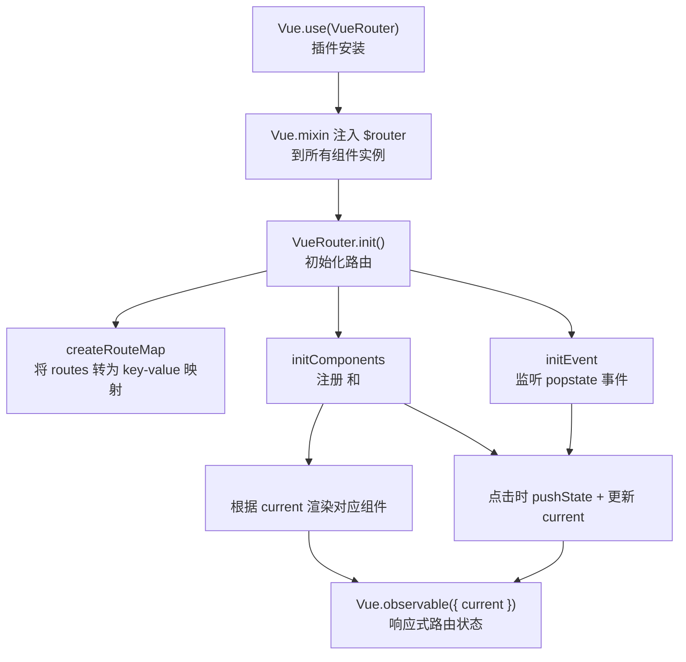
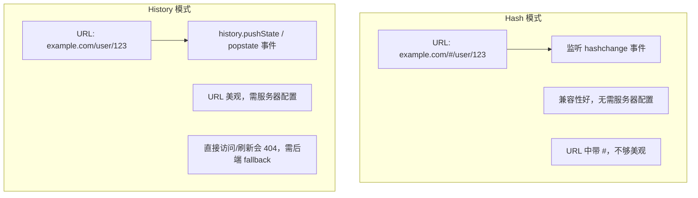

# 路由基础

> 掌握 Vue Router 的基本安装、配置和使用方法。

## 概述

Vue Router 是 Vue.js 官方的路由管理器，用于构建单页面应用（SPA）。它通过与 Vue.js 深度集成，让构建单页面应用变得简单易用。

### 核心功能

- **路由映射**：将 URL 路径映射到组件
- **嵌套路由**：支持多层嵌套的路由配置
- **模块化配置**：支持基于组件的路由配置
- **导航控制**：声明式和编程式导航
- **路由参数**：支持动态路由和参数传递
- **导航守卫**：细粒度的导航控制

## 安装

### 直接下载 / CDN

```html
<script src="https://unpkg.com/vue-router@3/dist/vue-router.js"></script>
```

### NPM

```bash
npm install vue-router@3
```

### Yarn

```bash
yarn add vue-router@3
```

::: tip 版本说明
- Vue 2.x 对应 Vue Router 3.x
- Vue 3.x 对应 Vue Router 4.x

本文档基于 Vue Router 3.x，请确保版本匹配。
:::

## 基本配置

### 1. 引入并安装插件

```javascript
// main.js
import Vue from 'vue'
import VueRouter from 'vue-router'

// 安装插件
Vue.use(VueRouter)
```

### 2. 定义路由组件

```javascript
// 方式一：直接定义组件对象
const Home = {
  template: '<div>首页内容</div>'
}

const About = {
  template: '<div>关于我们</div>'
}

// 方式二：使用单文件组件（推荐）
import Home from '@/views/Home.vue'
import About from '@/views/About.vue'
```

### 3. 定义路由映射

```javascript
// router/index.js
const routes = [
  {
    path: '/',
    name: 'Home',
    component: Home
  },
  {
    path: '/about',
    name: 'About',
    component: About
  }
]
```

### 4. 创建路由实例

```javascript
const router = new VueRouter({
  mode: 'history',  // 路由模式
  base: '/',        // 基础路径
  routes            // 路由配置数组
})
```

### 5. 注入路由实例

```javascript
// main.js
import router from './router'

new Vue({
  router,        // 注入路由实例
  render: h => h(App)
}).$mount('#app')
```

## 路由模式

Vue Router 提供三种路由模式：

| 模式 | URL 示例 | 说明 |
|------|----------|------|
| `hash` | `http://example.com/#/user` | 使用 URL 的 hash 模拟完整 URL，# 后面的内容不会被发送到服务器 |
| `history` | `http://example.com/user` | 利用 HTML5 History API，URL 更美观，需要服务器配置支持 |
| `abstract` | - | 支持所有 JavaScript 运行环境，如 Node.js 服务端 |

### Hash 模式（默认）

```javascript
const router = new VueRouter({
  routes
})
```

特点：
- 无需服务器配置
- 兼容性好（支持 IE9）
- URL 中带有 `#` 号

### History 模式

```javascript
const router = new VueRouter({
  mode: 'history',
  routes
})
```

特点：
- URL 更美观，没有 `#` 号
- 需要服务器配置支持
- 需要浏览器支持 HTML5 History API

#### 服务器配置示例

**Nginx**

```11-Nginx基础概述
location / {
  try_files $uri $uri/ /index.html;
}
```

**Apache**

```apache
<IfModule mod_rewrite.c>
  RewriteEngine On
  RewriteBase /
  RewriteRule ^index\.html$ - [L]
  RewriteCond %{REQUEST_FILENAME} !-f
  RewriteCond %{REQUEST_FILENAME} !-d
  RewriteRule . /index.html [L]
</IfModule>
```

**Node.js Express**

```javascript
const history = require('connect-history-api-fallback')
app.use(history())
```

::: warning 注意
使用 history 模式时，如果服务器没有正确配置，刷新页面会出现 404 错误。
:::

## 路由映射

### 路由配置项

每个路由配置是一个对象，常用属性如下：

```javascript
const routes = [
  {
    path: '/user',           // 路径（必填）
    name: 'User',            // 命名路由（可选）
    component: User,         // 组件（必填）
    components: {            // 命名视图组件（与 component 互斥）
      default: User,
      sidebar: Sidebar
    },
    redirect: '/login',      // 重定向
    alias: '/u',             // 别名
    children: [],            // 嵌套子路由
    meta: {                  // 路由元信息
      requiresAuth: true,
      title: '用户中心'
    },
    props: true,             // 将路由参数作为 props 传入组件
    beforeEnter: (to, from, next) => {  // 路由独享守卫
      next()
    }
  }
]
```

### 路由配置示例

```javascript
const routes = [
  // 基本路由
  {
    path: '/',
    component: Home
  },
  
  // 带名称的路由
  {
    path: '/about',
    name: 'About',
    component: () => import('@/views/About.vue')
  },
  
  // 动态路由
  {
    path: '/user/:id',
    component: User,
    props: true
  },
  
  // 重定向
  {
    path: '/home',
    redirect: '/'
  },
  
  // 嵌套路由
  {
    path: '/parent',
    component: Parent,
    children: [
      {
        path: 'child',  // 完整路径：/parent/child
        component: Child
      }
    ]
  }
]
```

## 路由出口

使用 `<router-view>` 组件作为路由出口，渲染匹配到的路由组件。

### 基本用法

```vue
<template>
  <div id="app">
    <!-- 路由匹配到的组件将渲染在这里 -->
    <router-view></router-view>
  </div>
</template>
```

### 配合过渡效果

::: tip
Vue Router 3 的 `<router-view>` 不支持 `v-slot` 作用域插槽（那是 Vue Router 4 的 API）。在 Vue 2 中，直接用 `<transition>` / `<keep-alive>` 包裹 `<router-view>` 即可。
:::

```vue
<template>
  <transition name="fade" mode="out-in">
    <router-view />
  </transition>
</template>

<style>
.fade-enter-active,
.fade-leave-active {
  transition: opacity 0.3s ease;
}

.fade-enter,
.fade-leave-to {
  opacity: 0;
}
</style>
```

### keep-alive 缓存

```vue
<template>
  <keep-alive>
    <router-view />
  </keep-alive>
</template>
```

::: tip 使用场景
`keep-alive` 可以缓存组件实例，避免重复渲染，适用于：
- 列表页返回时保留滚动位置
- 表单页返回时保留填写内容
- 避免重复请求数据
:::

## router-link 组件

`<router-link>` 是声明式导航组件，渲染为 `<a>` 标签。

### 基本用法

```vue
<!-- 字符串路径 -->
<router-link to="/home">首页</router-link>

<!-- 渲染结果 -->
<a href="/home">首页</a>
```

### 绑定 to 属性

```vue
<!-- 使用 v-bind -->
<router-link :to="'/home'">首页</router-link>

<!-- 对象形式 -->
<router-link :to="{ path: '/home' }">首页</router-link>

<!-- 命名路由 -->
<router-link :to="{ name: 'Home' }">首页</router-link>

<!-- 带查询参数 -->
<router-link :to="{ path: '/user', query: { id: 123 } }">
  用户
</router-link>
```

### 激活状态

`<router-link>` 会自动添加激活状态的 class：

```vue
<router-link to="/about" active-class="active" exact>
  关于
</router-link>
```

激活 class 说明：

| Class | 说明 |
|-------|------|
| `router-link-active` | 路由匹配时添加（包含子路由） |
| `router-link-exact-active` | 路由精确匹配时添加 |

### 其他属性

```vue
<router-link
  to="/about"
  custom
  v-slot="{ navigate, isActive }"
>
  <span @click="navigate" :class="{ active: isActive }">
    关于我们
  </span>
</router-link>
```

各属性说明：

| 属性 | 说明 |
|------|------|
| `tag` | 渲染为指定标签（如 `tag="li"`），3.1 起标记废弃，推荐用 `v-slot` 自定义渲染 |
| `replace` | 导航时替换当前历史记录（不留下 history 记录） |
| `active-class` | 自定义激活时添加的 class |
| `exact` | 精确匹配才激活 |
| `event` | 触发导航的事件（默认 `click`），3.1 起标记废弃 |
| `custom` | 配合 `v-slot` 完全自定义渲染，不包裹 `<a>` 标签 |

## 路由实例

### 访问路由实例

**在组件内部**

```javascript
export default {
  methods: {
    goHome() {
      // 通过 this.$router 访问路由实例
      this.$router.push('/')
    }
  }
}
```

**在组件外部**

```javascript
// router.js
import VueRouter from 'vue-router'

const router = new VueRouter({
  routes
})

export default router

// 其他文件中导入使用
import router from './router'
router.push('/')
```

### 路由实例属性

```javascript
// 当前路由对象（只读）
router.currentRoute

// 路由配置数组
router.options.routes

// 路由模式
router.mode

// 应用基础路径
router.base
```

### 路由实例方法

```javascript
// 导航方法
router.push(location, onComplete?, onAbort?)
router.replace(location, onComplete?, onAbort?)
router.go(n)
router.back()
router.forward()

// 添加/删除路由（动态路由）
router.addRoutes(routes)    // 3.x
router.addRoute(route)      // 3.5+
router.removeRoute(name)

// 获取路由
router.getRoutes()
router.hasRoute(name)
router.resolve(location)
```

## Route 对象

`route` 对象表示当前的路由信息，是不可变的。

### 访问 route 对象

**在组件内部**

```javascript
export default {
  computed: {
    currentPath() {
      return this.$route.path
    }
  }
}
```

### Route 对象属性

```javascript
$route.path          // 当前路由路径，如 "/user/123"
$route.params        // 路由参数，如 { id: "123" }
$route.query         // 查询参数，如 { name: "vue" }
$route.hash          // URL 中的 hash 值
$route.fullPath      // 完整 URL，包括查询参数和 hash
$route.matched       // 包含当前路由的所有嵌套路径片段的路由记录
$route.name          // 当前路由名称
$route.redirectedFrom// 重定向来源路由
$route.meta          // 路由元信息
```

### 使用示例

```vue
<template>
  <div>
    <p>当前路径：{{ $route.path }}</p>
    <p>用户 ID：{{ $route.params.id }}</p>
    <p>查询参数：{{ $route.query }}</p>
  </div>
</template>

<script>
export default {
  watch: {
    // 监听路由变化
    '$route'(to, from) {
      console.log('路由变化：', from.path, '→', to.path)
    }
  }
}
</script>
```

## 完整示例

### 项目结构

```
src/
├── router/
│   └── index.js
├── views/
│   ├── Home.vue
│   └── About.vue
├── App.vue
└── main.js
```

### 完整代码

**router/index.js**

```javascript
import Vue from 'vue'
import VueRouter from 'vue-router'
import Home from '@/views/Home.vue'
import About from '@/views/About.vue'

Vue.use(VueRouter)

const routes = [
  {
    path: '/',
    name: 'Home',
    component: Home
  },
  {
    path: '/about',
    name: 'About',
    component: About
  }
]

const router = new VueRouter({
  mode: 'history',
  base: process.env.BASE_URL,
  routes
})

export default router
```

**main.js**

```javascript
import Vue from 'vue'
import App from './App.vue'
import router from './router'

Vue.config.productionTip = false

new Vue({
  router,
  render: h => h(App)
}).$mount('#app')
```

**App.vue**

```vue
<template>
  <div id="app">
    <nav>
      <router-link to="/">首页</router-link> |
      <router-link to="/about">关于</router-link>
    </nav>
    <router-view/>
  </div>
</template>

<style>
#app {
  font-family: Avenir, Helvetica, Arial, sans-serif;
  text-align: center;
  color: #2c3e50;
}

nav {
  padding: 30px;
}

nav a {
  font-weight: bold;
  color: #2c3e50;
}

nav a.router-link-exact-active {
  color: #42b983;
}
</style>
```

**views/Home.vue**

```vue
<template>
  <div class="home">
    <h1>首页</h1>
    <p>欢迎来到 Vue Router 示例应用</p>
  </div>
</template>
```

**views/About.vue**

```vue
<template>
  <div class="about">
    <h1>关于我们</h1>
    <p>这是一个 Vue Router 基础示例</p>
  </div>
</template>
```

## 最佳实践

### 1. 路由配置模块化

对于大型应用，建议将路由配置模块化：

```javascript
// router/modules/user.js
export default [
  {
    path: '/user',
    component: () => import('@/views/user/Layout.vue'),
    children: [
      {
        path: '',
        name: 'UserList',
        component: () => import('@/views/user/List.vue')
      },
      {
        path: ':id',
        name: 'UserDetail',
        component: () => import('@/views/user/Detail.vue')
      }
    ]
  }
]

// router/index.js
import userRoutes from './modules/user'
import productRoutes from './modules/product'

const routes = [
  ...userRoutes,
  ...productRoutes,
  {
    path: '/',
    component: Home
  }
]
```

### 2. 路由命名规范

```javascript
const routes = [
  {
    path: '/user',
    name: 'User',          // 单词大写开头
    component: User
  },
  {
    path: '/user/list',
    name: 'UserList',      // 多个单词连接
    component: UserList
  },
  {
    path: '/user/:id',
    name: 'UserDetail',
    component: UserDetail
  }
]
```

### 3. 组件懒加载

```javascript
const routes = [
  {
    path: '/about',
    name: 'About',
    // 使用动态导入实现懒加载
    component: () => import('@/views/About.vue')
  }
]
```

### 4. 统一的 404 处理

```javascript
const routes = [
  // ...其他路由
  
  // 404 页面（放在最后）
  {
    path: '*',
    name: 'NotFound',
    component: () => import('@/views/NotFound.vue')
  }
]
```

## 常见问题

### 1. 如何在组件外部使用路由？

```javascript
// 导入路由实例
import router from './router'

// 使用
router.push('/path')
```

### 2. 如何获取当前路由信息？

```javascript
// 组件内部
this.$route.path

// 组件外部
router.currentRoute.path
```

### 3. 路由跳转后页面没有更新？

确保：
- 组件有唯一的 `key`
- 或在 `watch` 中监听 `$route` 变化

```vue
<router-view :key="$route.fullPath" />
```

### 4. history 模式刷新 404？

需要服务器配置，将所有路径指向 `index.html`，详见上文"服务器配置示例"。

---

## 路由实现原理（源码级）

### 模拟实现 Vue-Router (History 模式)

为了深入理解其工作原理，本节从零开始实现一个简化版的 Vue Router。

### 核心机制



### 完整代码实现

```javascript
// my-vue-router.js

let _Vue = null

export default class VueRouter {
  /**
   * Vue 插件的静态安装方法
   */
  static install(Vue) {
    // 1. 防止重复安装
    if (VueRouter.install.installed) { return }
    VueRouter.install.installed = true

    // 2. 将 Vue 构造函数保存到全局变量
    _Vue = Vue

    // 3. 使用 mixin 将 $router 注入到所有 Vue 组件实例中
    _Vue.mixin({
      beforeCreate() {
        // 只有根实例才拥有 router
        if (this.$options.router) {
          _Vue.prototype.$router = this.$options.router
          this.$options.router.init()
        }
      }
    })
  }

  constructor(options) {
    this.options = options
    this.routeMap = {}
    // 使用 Vue.observable 创建响应式对象来保存当前路径
    // 当 data.current 变化时，依赖它的组件（如 router-view）会重新渲染
    this.data = _Vue.observable({
      current: "/"
    })
  }

  init() {
    this.createRouteMap()
    this.initComponents(_Vue)
    this.initEvent()
  }

  /**
   * 将路由规则解析为键值对（路径 -> 组件）
   */
  createRouteMap() {
    this.options.routes.forEach((route) => {
      this.routeMap[route.path] = route.component
    })
  }

  /**
   * 创建 <router-link> 和 <router-view> 全局组件
   */
  initComponents(Vue) {
    const self = this

    Vue.component("router-link", {
      props: { to: String },
      render(h) {
        // 渲染成一个 <a> 标签
        return h(
          "a",
          {
            attrs: { href: this.to },
            on: { click: this.clickHandler }
          },
          [this.$slots.default] // 渲染子节点（插槽内容）
        )
      },
      methods: {
        clickHandler(e) {
          // 1. 使用 history.pushState 修改 URL，但不刷新页面
          history.pushState({}, "", this.to)
          // 2. 更新响应式的 current 路径，触发 router-view 重新渲染
          this.$router.data.current = this.to
          // 3. 阻止 <a> 标签的默认跳转行为
          e.preventDefault()
        }
      }
    })

    Vue.component("router-view", {
      render(h) {
        // 根据当前路径，从路由映射表中找到对应的组件
        const component = self.routeMap[self.data.current]
        return h(component)
      }
    })
  }

  /**
   * 监听 popstate 事件，处理浏览器的前进/后退操作
   */
  initEvent() {
    window.addEventListener("popstate", () => {
      this.data.current = window.location.pathname
    })
  }
}
```

### 使用示例

```javascript
// router/index.js
import Vue from "vue"
import VueRouter from "../my-vue-router" // 引入自定义 Router
import Home from "../views/Home.vue"
import About from "../views/About.vue"

Vue.use(VueRouter)

const routes = [
  { path: "/", component: Home },
  { path: "/about", component: About }
]

const router = new VueRouter({ routes })

export default router
```

```javascript
// main.js
import Vue from "vue"
import App from "./App.vue"
import router from "./router"

new Vue({
  router,
  render: (h) => h(App)
}).$mount("#app")
```

```html
<!-- App.vue -->
<template>
  <div id="app">
    <h1>Mini Vue Router</h1>
    <router-link to="/">Home</router-link> |
    <router-link to="/about">About</router-link>
    <router-view></router-view>
  </div>
</template>
```

## Hash 模式实现

Hash 模式通过 URL 的 `#` 后面的内容作为路由地址，通过 `hashchange` 事件监听路由地址的变化。

```javascript
import Vue from 'vue'

let _Vue = null

export default class VueRouter {
  static install(Vue) {
    if (VueRouter.install.installed) { return }
    VueRouter.install.installed = true
    _Vue = Vue

    _Vue.mixin({
      beforeCreate() {
        if (this.$options.router) {
          _Vue.prototype.$router = this.$options.router
          this.$options.router.init()
        }
      }
    })
  }

  constructor(options) {
    this.options = options
    this.routeMap = {}
    this.data = _Vue.observable({
      current: "/"
    })
  }

  init() {
    this.createRouteMap()
    this.initComponent(_Vue)
    this.initEvent()
  }

  createRouteMap() {
    this.options.routes.forEach(route => {
      this.routeMap[route.path] = route.component
    })
  }

  initComponent(Vue) {
    Vue.component('router-link', {
      props: { to: String },
      render(h) {
        return h('a', {
          attrs: { href: '#' + this.to },
        }, [this.$slots.default])
      },
    })

    const self = this
    Vue.component('router-view', {
      render(h) {
        const component = self.routeMap[self.data.current]
        return h(component)
      }
    })
  }

  initEvent() {
    window.addEventListener('hashchange', () => {
      this.data.current = this.getHash()
    })
    window.addEventListener('load', () => {
      if (!window.location.hash) {
        window.location.hash = '#/'
      }
    })
  }

  getHash() {
    return window.location.hash.slice(1) || '/'
  }
}
```

## Hash 模式 vs History 模式对比



| 特性 | Hash 模式 | History 模式 |
|------|-----------|-------------|
| URL 格式 | `/#/path` | `/path` |
| 实现 API | `hashchange` 事件 | `pushState` + `popstate` |
| 浏览器兼容 | 所有浏览器 | IE10+ |
| 服务器配置 | 无需特殊配置 | 需要 fallback 到 index.html |
| SEO 友好 | 不友好 | 友好（需 SSR 配合） |
| 锚点功能 | 冲突（hash 用于路由） | 正常使用 |

### History 模式服务器配置

**Nginx 配置：**
```11-Nginx基础概述
location / {
  try_files $uri $uri/ /index.html;
}
```

**Node.js (Express) 配置：**
```bash
npm install connect-history-api-fallback
```
```javascript
const express = require("express")
const history = require("connect-history-api-fallback")
const app = express()

app.use(history())
app.use(express.static("dist"))
app.listen(3000, () => console.log("Server running on port 3000"))
```

## 功能扩展思考

这个实现是极简版本，仅用于演示核心原理。生产级路由库还需处理：

- **动态路由**：如何支持 `/user/:id` 路径参数
- **嵌套路由**：如何实现父子路由和嵌套 `<router-view>`
- **导航守卫**：`beforeEach`、`beforeEnter` 等
- **参数传递**：`query` 和 `params` 传递

## 实现原理常见问题

**Q: 为什么需要 `_Vue` 全局变量？**

在 `install` 方法中能拿到 `Vue` 的构造函数，但在 `constructor` 或其他实例方法中无法直接访问。通过 `_Vue` 这个桥梁，可以在 `constructor` 中使用 `_Vue.observable` 创建响应式数据。

**Q: `Vue.mixin` 是如何工作的？**

`Vue.mixin` 是一个全局混入，影响之后所有创建的 Vue 实例。在 `beforeCreate` 钩子中注入代码，为每个组件实例挂载 `$router` 属性，实现了 `$router` 的全局访问。

**Q: 为什么 History 模式需要后端支持？**

当用户直接访问 `/about` 或刷新页面时，浏览器会向服务器发送对 `/about` 的 GET 请求。如果服务器没有配置将所有这类请求都指向 `index.html`，就会返回 404。

## 下一步

- [路由进阶](03-路由进阶.md) - 深入学习动态路由、嵌套路由、编程式导航、懒加载等高级功能
- [路由守卫](04-路由守卫.md) - 学习路由守卫实现权限控制
