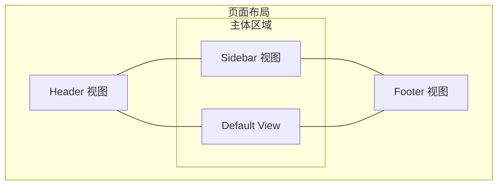
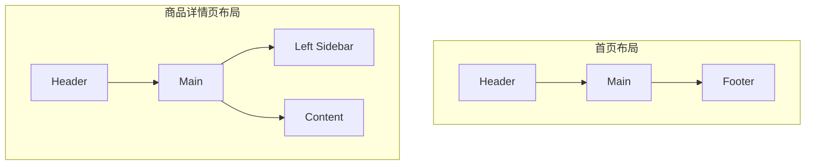

# 命名路由与命名视图

## 命名路由

### 基本用法

在路由配置中添加 `name` 属性：

```javascript
const routes = [
  {
    path: '/user/:id',
    name: 'UserDetail',
    component: UserDetail
  }
]
```

### 使用命名路由导航

**声明式导航**

```vue
<template>
  <!-- 使用命名路由 -->
  <router-link :to="{ name: 'UserDetail', params: { id: 123 } }">
    用户详情
  </router-link>
</template>
```

**编程式导航**

```javascript
// 通过名称导航
this.$router.push({ name: 'UserDetail', params: { id: 123 } })

// 带查询参数
this.$router.push({
  name: 'UserDetail',
  params: { id: 123 },
  query: { tab: 'profile' }
})
```

### 命名路由的优势

#### 1. 避免路径硬编码

```javascript
// ❌ 硬编码路径
router.push('/user/' + userId + '/profile')

// ✅ 使用命名路由
router.push({ name: 'UserProfile', params: { id: userId } })
```

#### 2. 路径变更无需修改代码

```javascript
// 修改路由路径
const routes = [
  {
    path: '/member/:id',  // 从 /user 改为 /member
    name: 'UserDetail',   // 名称不变
    component: UserDetail
  }
]

// 所有使用命名路由的地方无需修改
router.push({ name: 'UserDetail', params: { id: 123 } })
// 自动导航到 /member/123
```

#### 3. 类型安全

```javascript
// 定义路由名称常量
export const ROUTE_NAMES = {
  HOME: 'Home',
  USER_DETAIL: 'UserDetail',
  USER_PROFILE: 'UserProfile',
  PRODUCT_LIST: 'ProductList'
}

// 使用常量
router.push({ name: ROUTE_NAMES.USER_DETAIL, params: { id: 123 } })
```

### 路由命名规范

```javascript
const routes = [
  // 列表页
  { path: '/user', name: 'UserList', component: UserList },
  { path: '/product', name: 'ProductList', component: ProductList },
  
  // 详情页
  { path: '/user/:id', name: 'UserDetail', component: UserDetail },
  { path: '/product/:id', name: 'ProductDetail', component: ProductDetail },
  
  // 创建/编辑页
  { path: '/user/create', name: 'UserCreate', component: UserCreate },
  { path: '/user/:id/edit', name: 'UserEdit', component: UserEdit }
]
```

### 完整示例

```javascript
// router/routes.js
export default [
  {
    path: '/',
    name: 'Home',
    component: () => import('@/views/Home.vue'),
    meta: { title: '首页' }
  },
  {
    path: '/user',
    name: 'UserList',
    component: () => import('@/views/user/List.vue'),
    meta: { title: '用户列表' }
  },
  {
    path: '/user/:id',
    name: 'UserDetail',
    component: () => import('@/views/user/Detail.vue'),
    props: true,
    meta: { title: '用户详情' },
    children: [
      {
        path: 'profile',
        name: 'UserProfile',
        component: () => import('@/views/user/Profile.vue'),
        meta: { title: '个人信息' }
      },
      {
        path: 'posts',
        name: 'UserPosts',
        component: () => import('@/views/user/Posts.vue'),
        meta: { title: '用户文章' }
      }
    ]
  }
]
```

## 命名视图

### 基本概念

命名视图允许在同一层级同时渲染多个视图，适用于复杂布局场景：

- 顶部导航栏 + 主内容区
- 侧边栏 + 主内容区 + 底部信息栏
- 多栏布局

### 路由配置

使用 `components` 属性（注意是复数）：

```javascript
const routes = [
  {
    path: '/',
    components: {
      default: Home,           // 默认视图
      sidebar: Sidebar,        // 侧边栏视图
      footer: Footer           // 底部视图
    }
  }
]
```

### 视图出口

使用 `name` 属性指定视图名称：

```vue
<template>
  <div class="app-layout">
    <!-- 默认视图（无 name 或 name="default"） -->
    <router-view></router-view>
    
    <!-- 命名视图 -->
    <router-view name="sidebar"></router-view>
    <router-view name="footer"></router-view>
  </div>
</template>
```

### 布局结构示例



### 完整示例：后台管理布局

**路由配置**

```javascript
const routes = [
  {
    path: '/admin',
    components: {
      default: AdminContent,
      header: AdminHeader,
      sidebar: AdminSidebar,
      footer: AdminFooter
    },
    children: [
      {
        path: '',
        name: 'Dashboard',
        component: Dashboard
      },
      {
        path: 'user',
        name: 'UserManage',
        component: UserManage
      }
    ]
  }
]
```

**布局组件**

```vue
<!-- AdminLayout.vue -->
<template>
  <div class="admin-layout">
    <!-- 顶部导航 -->
    <header class="header">
      <router-view name="header"></router-view>
    </header>
    
    <div class="main-container">
      <!-- 侧边栏 -->
      <aside class="sidebar">
        <router-view name="sidebar"></router-view>
      </aside>
      
      <!-- 主内容区 -->
      <main class="content">
        <router-view></router-view>
      </main>
    </div>
    
    <!-- 底部信息 -->
    <footer class="footer">
      <router-view name="footer"></router-view>
    </footer>
  </div>
</template>

<style scoped>
.admin-layout {
  display: flex;
  flex-direction: column;
  min-height: 100vh;
}

.header {
  height: 60px;
  background: #fff;
  border-bottom: 1px solid #e6e6e6;
}

.main-container {
  display: flex;
  flex: 1;
}

.sidebar {
  width: 200px;
  background: #2d3a4b;
}

.content {
  flex: 1;
  padding: 20px;
  background: #f0f2f5;
}

.footer {
  height: 40px;
  background: #fff;
  border-top: 1px solid #e6e6e6;
}
</style>
```

**视图组件**

```vue
<!-- AdminHeader.vue -->
<template>
  <div class="admin-header">
    <div class="logo">管理后台</div>
    <div class="user-info">
      <span>{{ username }}</span>
      <button @click="logout">退出</button>
    </div>
  </div>
</template>

<!-- AdminSidebar.vue -->
<template>
  <div class="admin-sidebar">
    <nav>
      <router-link to="/admin">仪表盘</router-link>
      <router-link to="/admin/user">用户管理</router-link>
      <router-link to="/admin/product">商品管理</router-link>
    </nav>
  </div>
</template>

<!-- AdminFooter.vue -->
<template>
  <div class="admin-footer">
    <p>© 2024 管理后台. All rights reserved.</p>
  </div>
</template>
```

## 嵌套命名视图

### 概念

命名视图可以与嵌套路由结合使用，实现更复杂的布局。

### 示例：嵌套视图

```javascript
const routes = [
  {
    path: '/settings',
    component: SettingsLayout,
    children: [
      {
        path: '',
        name: 'Settings',
        components: {
          default: SettingsHome,
          menu: SettingsMenu,
          content: SettingsContent
        }
      },
      {
        path: 'profile',
        name: 'SettingsProfile',
        components: {
          default: SettingsHome,
          menu: SettingsMenu,
          content: ProfileSettings
        }
      },
      {
        path: 'security',
        name: 'SettingsSecurity',
        components: {
          default: SettingsHome,
          menu: SettingsMenu,
          content: SecuritySettings
        }
      }
    ]
  }
]
```

**SettingsLayout.vue**

```vue
<template>
  <div class="settings-layout">
    <router-view name="menu"></router-view>
    <router-view name="content"></router-view>
    <router-view></router-view>  <!-- default 视图 -->
  </div>
</template>
```

**SettingsMenu.vue**

```vue
<template>
  <div class="settings-menu">
    <router-link to="/settings">概览</router-link>
    <router-link to="/settings/profile">个人信息</router-link>
    <router-link to="/settings/security">安全设置</router-link>
  </div>
</template>
```

## 实战案例：电商网站布局

### 布局结构



### 路由配置

```javascript
const routes = [
  // 首页布局
  {
    path: '/',
    components: {
      default: Home,
      header: Header,
      footer: Footer
    }
  },
  
  // 商品详情页布局（有侧边栏）
  {
    path: '/product/:id',
    components: {
      default: ProductDetail,
      header: Header,
      left: ProductSidebar,  // 侧边栏
      footer: Footer
    },
    props: {
      default: true,
      left: true
    }
  },
  
  // 购物车页面（无侧边栏）
  {
    path: '/cart',
    components: {
      default: Cart,
      header: Header,
      footer: Footer
    }
  }
]
```

### 应用组件

```vue
<!-- App.vue -->
<template>
  <div id="app">
    <router-view name="header"></router-view>
    
    <main class="main-content">
      <!-- 可选的左侧边栏 -->
      <aside v-if="hasLeftSidebar" class="left-sidebar">
        <router-view name="left"></router-view>
      </aside>
      
      <!-- 主内容 -->
      <div class="content">
        <router-view></router-view>
      </div>
    </main>
    
    <router-view name="footer"></router-view>
  </div>
</template>

<script>
export default {
  computed: {
    hasLeftSidebar() {
      // 检查当前路由是否有左侧边栏视图
      return this.$route.matched.some(record => 
        record.components && record.components.left
      )
    }
  }
}
</script>

<style>
#app {
  min-height: 100vh;
  display: flex;
  flex-direction: column;
}

.main-content {
  flex: 1;
  display: flex;
}

.left-sidebar {
  width: 250px;
  background: #f5f5f5;
}

.content {
  flex: 1;
  padding: 20px;
}
</style>
```

## 命名视图与动态组件

### 动态切换视图

::: warning 注意
`components` 的取值必须是组件定义或异步导入函数（`() => import(...)`），不能写成"同步根据状态返回组件"的普通函数——router 会把它当作异步组件工厂处理，且配置在注册时求值，无法响应状态变化。按角色切换视图应使用不同的路由记录，或结合 meta 条件渲染（见下节）。
:::

```javascript
const routes = [
  {
    // 管理员看到的仪表盘
    path: '/admin/dashboard',
    components: {
      default: Dashboard,
      sidebar: AdminSidebar
    },
    meta: { roles: ['admin'] }
  },
  {
    // 普通用户看到的仪表盘
    path: '/user/dashboard',
    components: {
      default: Dashboard,
      sidebar: UserSidebar
    },
    meta: { roles: ['user'] }
  }
]
```

### 条件渲染视图

```vue
<template>
  <div>
    <!-- 只在需要时渲染侧边栏 -->
    <router-view name="sidebar" v-if="showSidebar"></router-view>
    <router-view></router-view>
  </div>
</template>

<script>
export default {
  computed: {
    showSidebar() {
      return this.$route.meta.showSidebar !== false
    }
  }
}
</script>
```

## 最佳实践

### 1. 统一管理路由名称

```javascript
// constants/routes.js
export const ROUTE_NAMES = {
  // 首页
  HOME: 'Home',
  
  // 用户相关
  USER_LIST: 'UserList',
  USER_DETAIL: 'UserDetail',
  USER_CREATE: 'UserCreate',
  USER_EDIT: 'UserEdit',
  
  // 产品相关
  PRODUCT_LIST: 'ProductList',
  PRODUCT_DETAIL: 'ProductDetail'
}

export default ROUTE_NAMES
```

### 2. 使用命名路由的面包屑

```javascript
// utils/breadcrumb.js
export const breadcrumbMap = {
  Home: { title: '首页' },
  UserList: { title: '用户列表', parent: 'Home' },
  UserDetail: { title: '用户详情', parent: 'UserList' }
}

// 生成面包屑
export function generateBreadcrumb(routeName) {
  const breadcrumbs = []
  let current = routeName
  
  while (current) {
    const config = breadcrumbMap[current]
    if (config) {
      breadcrumbs.unshift({
        name: current,
        title: config.title
      })
      current = config.parent
    } else {
      break
    }
  }
  
  return breadcrumbs
}
```

### 3. 视图组件缓存

```vue
<template>
  <div>
    <keep-alive>
      <router-view name="sidebar"></router-view>
    </keep-alive>
    
    <router-view></router-view>
  </div>
</template>
```

### 4. 合理拆分视图

```javascript
// ✅ 推荐：按功能拆分视图
components: {
  default: MainContent,
  header: Header,
  sidebar: Sidebar
}

// ❌ 不推荐：视图过多
components: {
  default: MainContent,
  header: Header,
  sidebar: Sidebar,
  subHeader: SubHeader,
  leftPanel: LeftPanel,
  rightPanel: RightPanel,
  footer: Footer,
  bottomBar: BottomBar
}
```

### 5. 视图过渡效果

```vue
<template>
  <div>
    <transition name="slide">
      <router-view name="sidebar" />
    </transition>

    <transition name="fade" mode="out-in">
      <router-view />
    </transition>
  </div>
</template>
```

## 常见问题

### 1. 命名视图不显示？

检查 `components` 是否拼写正确（复数形式）：

```javascript
// ✅ 正确
components: {
  default: Home
}

// ❌ 错误
component: {
  default: Home
}
```

### 2. 如何获取当前路由的所有命名视图？

```javascript
// 获取当前路由记录
const currentRoute = this.$route.matched[this.$route.matched.length - 1]

// 检查命名视图
if (currentRoute.components) {
  console.log('命名视图:', Object.keys(currentRoute.components))
}
```

### 3. 命名视图支持 props 吗？

支持，可以针对不同视图设置 props：

```javascript
{
  path: '/user/:id',
  components: {
    default: UserDetail,
    sidebar: UserSidebar
  },
  props: {
    default: true,        // default 视图接收路由参数作为 props
    sidebar: { showMenu: true }  // sidebar 视图接收静态 props
  }
}
```

### 4. 如何动态加载视图组件？

```javascript
{
  path: '/dashboard',
  components: {
    default: () => import('@/views/Dashboard.vue'),
    sidebar: () => import('@/views/Sidebar.vue')
  }
}
```

## 调试技巧

### 查看当前路由的命名视图

```javascript
// 在组件中
const route = this.$route.matched[this.$route.matched.length - 1]
console.log('命名视图:', route.components)
console.log('默认组件:', route.components.default)
```

### 检查命名路由是否存在

```javascript
// 获取所有路由
const routes = this.$router.options.routes

// 检查命名路由是否存在
function hasRoute(name) {
  const findRoute = (routes) => {
    for (const route of routes) {
      if (route.name === name) return true
      if (route.children && findRoute(route.children)) return true
    }
    return false
  }
  return findRoute(routes)
}

console.log('路由存在:', hasRoute('UserDetail'))
```

## API 参考

### 路由配置

| 属性 | 类型 | 说明 |
|------|------|------|
| `name` | string | 路由名称 |
| `component` | Component | 单个组件 |
| `components` | Object | 命名视图组件映射 |

### router-view 属性

| 属性 | 类型 | 说明 |
|------|------|------|
| `name` | string | 视图名称，默认为 `default` |

### router-link 属性

| 属性 | 类型 | 说明 |
|------|------|------|
| `to` | string \| object | 目标路由，可使用 `{ name: 'RouteName' }` |
