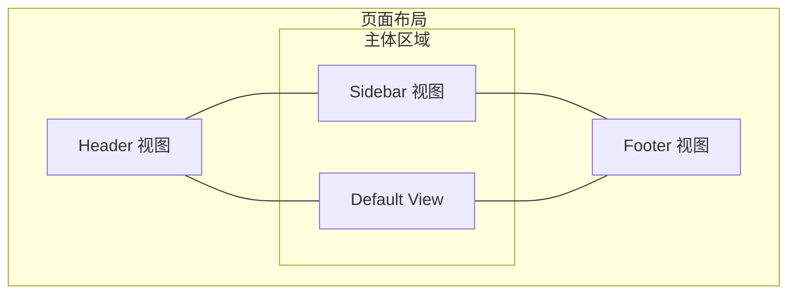
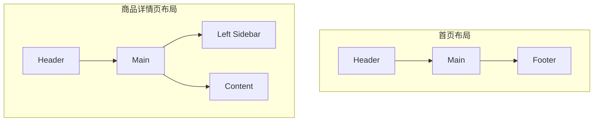

# 路由进阶

> 深入学习 Vue Router 的高级功能：动态路由匹配、嵌套路由、编程式导航、命名路由与命名视图、重定向与别名、路由懒加载、滚动行为、路由元信息、过渡动效等。

## 路由参数

### 基本用法

使用动态路径参数（Dynamic Segment）以冒号 `:` 开头：

```javascript
const routes = [
  // 动态路径参数以冒号开头
  {
    path: '/user/:id',
    component: User
  }
]
```

这样，`/user/1`、`/user/2`、`/user/abc` 都将映射到相同的路由。

### 访问路由参数

在组件中通过 `$route.params` 访问参数：

```vue
<template>
  <div>
    <h1>用户详情</h1>
    <p>用户 ID：{{ $route.params.id }}</p>
  </div>
</template>

<script>
export default {
  name: 'User',
  created() {
    console.log('用户 ID：', this.$route.params.id)
  }
}
</script>
```

### 多个参数

可以在一个路由中设置多个动态参数：

```javascript
const routes = [
  {
    // 匹配 /user/123/profile 或 /user/123/posts
    path: '/user/:id/:section',
    component: UserDetail
  }
]
```

```vue
<template>
  <div>
    <p>用户 ID：{{ $route.params.id }}</p>
    <p>页面部分：{{ $route.params.section }}</p>
  </div>
</template>
```

URL 匹配示例：

| URL | params |
|-----|--------|
| `/user/123/profile` | `{ id: '123', section: 'profile' }` |
| `/user/456/posts` | `{ id: '456', section: 'posts' }` |

### 使用 props 解耦

使用 `props: true` 将路由参数作为组件 props 传入，实现组件与路由解耦：

**路由配置**

```javascript
const routes = [
  {
    path: '/user/:id',
    component: User,
    props: true  // 启用 props
  }
]
```

**组件定义**

```vue
<template>
  <div>
    <h1>用户详情</h1>
    <p>用户 ID：{{ id }}</p>
  </div>
</template>

<script>
export default {
  name: 'User',
  props: {
    id: {
      type: String,
      required: true
    }
  }
}
</script>
```

::: tip 优点
- 组件可以在任何地方使用，不依赖路由
- 更容易进行单元测试
- props 可以定义类型和验证规则
:::

### Props 的多种模式

**对象模式**

直接传递静态值：

```javascript
const routes = [
  {
    path: '/promotion',
    component: Promotion,
    props: { showBanner: true }
  }
]
```

**函数模式**

创建函数返回 props：

```javascript
const routes = [
  {
    path: '/search',
    component: Search,
    props: route => ({
      query: route.query.q,
      page: parseInt(route.query.page) || 1
    })
  }
]
```

URL 示例：`/search?q=vue&page=2`

```vue
<template>
  <div>
    <p>搜索关键词：{{ query }}</p>
    <p>当前页：{{ page }}</p>
  </div>
</template>

<script>
export default {
  props: ['query', 'page']
}
</script>
```

## 响应路由参数变化

### 问题

当使用动态路由时，如果只是参数变化（如 `/user/1` → `/user/2`），组件实例会被复用，生命周期钩子不会重新执行。

```javascript
export default {
  created() {
    // 只会在第一次进入时执行
    console.log('组件创建')
    this.fetchUser()
  },
  methods: {
    fetchUser() {
      // 获取用户数据
      const id = this.$route.params.id
      // API 调用...
    }
  }
}
```

### 解决方案

#### 方式一：监听 $route

```javascript
export default {
  watch: {
    '$route'(to, from) {
      // 路由变化时重新获取数据
      this.fetchUser()
    }
  },
  methods: {
    fetchUser() {
      const id = this.$route.params.id
      console.log('获取用户：', id)
    }
  }
}
```

#### 方式二：使用导航守卫

```javascript
export default {
  beforeRouteUpdate(to, from, next) {
    // 在当前路由改变，但组件被复用时调用
    this.fetchUser(to.params.id)
    next()
  },
  methods: {
    fetchUser(id) {
      console.log('获取用户：', id)
    }
  }
}
```

#### 方式三：使用不同的路由 key（不推荐）

```vue
<router-view :key="$route.fullPath" />
```

::: warning 注意
使用 `:key` 会导致组件完全销毁重建，可能影响性能，谨慎使用。
:::

### 完整示例

```vue
<template>
  <div class="user-detail">
    <h2>用户详情</h2>
    <p v-if="loading">加载中...</p>
    <div v-else>
      <p>用户 ID：{{ user.id }}</p>
      <p>用户名：{{ user.name }}</p>
      <p>邮箱：{{ user.email }}</p>
    </div>
  </div>
</template>

<script>
export default {
  name: 'UserDetail',
  props: ['id'],
  data() {
    return {
      loading: false,
      user: null
    }
  },
  watch: {
    // 监听 id 变化（当使用 props 时）
    id: {
      immediate: true,
      handler(newId) {
        this.fetchUser(newId)
      }
    }
  },
  methods: {
    async fetchUser(id) {
      this.loading = true
      try {
        // 模拟 API 调用
        const response = await fetch(`/api/user/${id}`)
        this.user = await response.json()
      } catch (error) {
        console.error('获取用户失败：', error)
      } finally {
        this.loading = false
      }
    }
  }
}
</script>
```

## 捕获所有路由

### 基本用法

使用通配符 `*` 捕获所有未匹配的路由，常用于 404 页面：

```javascript
const routes = [
  {
    path: '*',
    component: NotFound
  }
]
```

### 捕获带参数的路由

```javascript
const routes = [
  // 匹配所有以 `/user-` 开头的路径
  {
    path: '/user-*',
    component: UserNotFound
  },
  
  // 匹配所有路径（放在最后作为 404）
  {
    path: '*',
    component: NotFound
  }
]
```

访问参数：

```javascript
// 访问 /user-admin
this.$route.params.pathMatch // 'admin'

// 访问 /user-123/profile
this.$route.params.pathMatch // '123/profile'
```

### 404 页面示例

```vue
<template>
  <div class="not-found">
    <h1>404</h1>
    <p>页面未找到</p>
    <p>路径：{{ $route.params.pathMatch }}</p>
    <router-link to="/">返回首页</router-link>
  </div>
</template>
```

```javascript
const routes = [
  // 正常路由...
  { path: '/', component: Home },
  { path: '/about', component: About },
  
  // 404 路由（必须放在最后）
  {
    path: '*',
    component: () => import('@/views/NotFound.vue')
  }
]
```

## 高级匹配模式

Vue Router 使用 [path-to-regexp](https://github.com/pillarjs/path-to-regexp) 作为路径匹配引擎，支持高级匹配模式。

### 可重复参数

使用 `+`（一个或多个）、`*`（零个或多个）、`?`（零个或一个）修饰参数：

```javascript
const routes = [
  // 匹配 /user, /user/123, /user/123/456 等
  {
    path: '/user/:id+',
    component: User
  },
  
  // 匹配 /list, /list/1, /list/1/2 等
  {
    path: '/list/:id*',
    component: List
  },
  
  // 匹配 /user 或 /user/123
  {
    path: '/user/:id?',
    component: User
  }
]
```

匹配示例：

| 路由 | URL | params |
|------|-----|--------|
| `/user/:id+` | `/user/123` | `{ id: '123' }` |
| `/user/:id+` | `/user/123/456` | `{ id: ['123', '456'] }` |
| `/user/:id*` | `/user` | `{ id: undefined }` 或 `{}` |
| `/user/:id*` | `/user/123` | `{ id: '123' }` |
| `/user/:id?` | `/user` | `{ id: undefined }` |
| `/user/:id?` | `/user/123` | `{ id: '123' }` |

### 自定义正则

使用括号 `()` 添加自定义正则约束：

```javascript
const routes = [
  // 只匹配数字
  {
    path: '/user/:id(\\d+)',
    component: User
  },
  
  // 只匹配字母
  {
    path: '/category/:name([a-z]+)',
    component: Category
  },
  
  // 匹配特定格式
  {
    path: '/order/:id(\\d{6})',  // 6位数字
    component: Order
  }
]
```

匹配示例：

| 路由 | URL | 是否匹配 |
|------|-----|----------|
| `/user/:id(\\d+)` | `/user/123` | ✅ |
| `/user/:id(\\d+)` | `/user/abc` | ❌ |
| `/category/:name([a-z]+)` | `/category/tech` | ✅ |
| `/category/:name([a-z]+)` | `/category/tech123` | ❌ |
| `/order/:id(\\d{6})` | `/order/123456` | ✅ |
| `/order/:id(\\d{6})` | `/order/12345` | ❌ |

### 可重复的自定义正则

```javascript
const routes = [
  // 匹配一个或多个数字段
  {
    path: '/segments/:id(\\d+)+',
    component: Segments
  }
]
```

URL 示例：`/segments/1/2/3`

```javascript
this.$route.params.id // ['1', '2', '3']
```

## 匹配优先级

Vue Router 3 按**定义顺序**匹配：先定义的路由先被尝试，因此优先级由书写顺序决定。实际项目中的经验法则是：

1. **更具体的路由放在前面**
2. **静态路由优先于动态路由**
3. **通配路由（404）放最后**

### 优先级示例

```javascript
const routes = [
  // 静态路由 - 最高优先级
  {
    path: '/user/admin',
    component: UserAdmin
  },
  
  // 动态路由 - 较低优先级
  {
    path: '/user/:id',
    component: UserDetail
  },
  
  // 通配路由 - 最低优先级
  {
    path: '/user-*',
    component: UserNotFound
  }
]
```

匹配结果：

| URL | 匹配路由 |
|-----|----------|
| `/user/admin` | `/user/admin`（静态路由） |
| `/user/123` | `/user/:id`（动态路由） |
| `/user-profile` | `/user-*`（通配路由） |

### 避免歧义的最佳实践

```javascript
const routes = [
  // ✅ 好的做法：具体路由在前
  { path: '/user/admin', component: UserAdmin },
  { path: '/user/profile', component: UserProfile },
  { path: '/user/:id', component: UserDetail },
  { path: '*', component: NotFound }
]

// ❌ 不好的做法：通配路由在前
const badRoutes = [
  { path: '*', component: NotFound },        // 会匹配所有！
  { path: '/user/:id', component: UserDetail } // 永远不会被匹配
]
```

## 完整示例

### 用户管理路由配置

```javascript
// router/modules/user.js
export default [
  {
    path: '/user',
    component: () => import('@/views/user/Layout.vue'),
    children: [
      {
        path: '',
        name: 'UserList',
        component: () => import('@/views/user/List.vue')
      },
      {
        // 匹配数字 ID
        path: ':id(\\d+)',
        name: 'UserDetail',
        component: () => import('@/views/user/Detail.vue'),
        props: true
      },
      {
        // 匹配特定字符串
        path: 'create',
        name: 'UserCreate',
        component: () => import('@/views/user/Create.vue')
      },
      {
        // 匹配数字 ID 的编辑页面
        path: ':id(\\d+)/edit',
        name: 'UserEdit',
        component: () => import('@/views/user/Edit.vue'),
        props: true
      }
    ]
  }
]
```

### URL 匹配结果

| URL | 匹配路由 | params |
|-----|----------|--------|
| `/user` | UserList | - |
| `/user/123` | UserDetail | `{ id: '123' }` |
| `/user/create` | UserCreate | - |
| `/user/123/edit` | UserEdit | `{ id: '123' }` |
| `/user/abc` | 无匹配（需要 404 处理） | - |

## 最佳实践

### 1. 使用 props 解耦组件

```javascript
// ✅ 推荐
{
  path: '/user/:id',
  component: User,
  props: true
}

// ❌ 不推荐：组件内直接使用 $route.params
```

### 2. 合理使用正则约束

```javascript
// 只匹配数字 ID
{
  path: '/user/:id(\\d+)',
  component: User
}

// 只匹配特定格式
{
  path: '/order/:sn(ORD\\d{8})',  // ORD + 8位数字
  component: Order
}
```

### 3. 正确处理参数变化

```javascript
export default {
  watch: {
    '$route'(to, from) {
      // 参数变化时重新获取数据
      if (to.params.id !== from.params.id) {
        this.fetchData()
      }
    }
  }
}
```

### 4. 404 路由放在最后

```javascript
const routes = [
  // ...其他路由
  
  // 404 必须放在最后
  { path: '*', component: NotFound }
]
```

### 5. 避免过度嵌套

```javascript
// ❌ 不推荐：过多参数嵌套
{
  path: '/user/:userId/post/:postId/comment/:commentId',
  component: Comment
}

// ✅ 推荐：使用查询参数或简化路径
{
  path: '/comment/:commentId',
  component: Comment
}
```

## 常见问题

### 1. 参数变化时组件不更新？

使用 `watch` 监听 `$route` 或 `beforeRouteUpdate` 守卫。

### 2. 如何验证参数格式？

使用自定义正则约束：

```javascript
{
  path: '/user/:id(\\d+)',  // 只匹配数字
  component: User
}
```

### 3. 如何获取通配符匹配的内容？

```javascript
// 路由配置
{
  path: '/user-*',
  component: User
}

// 访问 /user-admin
this.$route.params.pathMatch  // 'admin'
```

### 4. 如何处理可选参数？

```javascript
// 使用 ? 修饰符
{
  path: '/search/:keyword?',  // keyword 可选
  component: Search
}

// 匹配 /search 和 /search/vue
```

## 调试技巧

### 查看当前路由信息

```javascript
// 在组件中
console.log('当前路由：', this.$route)
console.log('路由参数：', this.$route.params)
console.log('匹配的路由记录：', this.$route.matched)
```

### 路由匹配调试

```javascript
// 检查路由是否匹配
const match = this.$router.match('/user/123')
console.log('匹配结果：', match)
```

---

## 嵌套路由

### 路由配置

```javascript
const routes = [
  {
    path: '/user',
    component: User,
    children: [
      {
        // 当 /user/profile 匹配成功
        // UserProfile 将被渲染在 User 的 <router-view> 中
        path: 'profile',
        component: UserProfile
      },
      {
        // 当 /user/posts 匹配成功
        path: 'posts',
        component: UserPosts
      }
    ]
  }
]
```

### 父组件

```vue
<!-- User.vue -->
<template>
  <div class="user">
    <h1>用户中心</h1>
    
    <!-- 导航菜单 -->
    <nav>
      <router-link to="/user/profile">个人信息</router-link>
      <router-link to="/user/posts">我的文章</router-link>
    </nav>
    
    <!-- 子路由出口 -->
    <router-view></router-view>
  </div>
</template>
```

### 子组件

```vue
<!-- UserProfile.vue -->
<template>
  <div class="profile">
    <h2>个人信息</h2>
    <p>用户名：{{ username }}</p>
  </div>
</template>
```

```vue
<!-- UserPosts.vue -->
<template>
  <div class="posts">
    <h2>我的文章</h2>
    <ul>
      <li v-for="post in posts" :key="post.id">{{ post.title }}</li>
    </ul>
  </div>
</template>
```

### URL 匹配

| URL | 渲染组件 |
|-----|----------|
| `/user/profile` | User → UserProfile |
| `/user/posts` | User → UserPosts |
| `/user` | User（子路由出口为空） |

## 子路由路径规则

### 以 `/` 开头（绝对路径）

```javascript
const routes = [
  {
    path: '/user',
    component: User,
    children: [
      {
        // 绝对路径，完整匹配 /profile
        path: '/profile',
        component: UserProfile
      }
    ]
  }
]
```

### 不以 `/` 开头（相对路径）

```javascript
const routes = [
  {
    path: '/user',
    component: User,
    children: [
      {
        // 相对路径，自动拼接为 /user/profile
        path: 'profile',
        component: UserProfile
      }
    ]
  }
]
```

### 空路径子路由

```javascript
const routes = [
  {
    path: '/user',
    component: User,
    children: [
      {
        // 空路径，匹配 /user
        path: '',
        component: UserHome
      },
      {
        path: 'profile',
        component: UserProfile
      }
    ]
  }
]
```

| URL | 渲染组件 |
|-----|----------|
| `/user` | User → UserHome |
| `/user/profile` | User → UserProfile |

## 默认子路由

### 方式一：空路径

```javascript
const routes = [
  {
    path: '/user',
    component: User,
    children: [
      {
        path: '',           // 空路径作为默认
        component: UserHome
      },
      {
        path: 'profile',
        component: UserProfile
      }
    ]
  }
]
```

### 方式二：命名路由

```javascript
const routes = [
  {
    path: '/user',
    component: User,
    children: [
      {
        path: '',
        name: 'User',      // 父路由名称
        component: UserHome
      },
      {
        path: 'profile',
        name: 'UserProfile',
        component: UserProfile
      }
    ]
  }
]

// 导航到默认子路由
router.push({ name: 'User' })
```

## 多层嵌套

Vue Router 支持任意层级的路由嵌套。

### 三层嵌套示例

```
应用
└── /admin
    └── Admin
        ├── 侧边栏
        └── 内容区 (<router-view>)
            └── /admin/user
                └── UserManage
                    ├── 用户列表
                    └── 操作区 (<router-view>)
                        └── /admin/user/detail
                            └── UserDetail
```

### 路由配置

```javascript
const routes = [
  {
    path: '/admin',
    component: Admin,
    children: [
      {
        path: 'user',
        component: UserManage,
        children: [
          {
            path: '',
            component: UserList
          },
          {
            path: 'detail/:id',
            component: UserDetail
          }
        ]
      },
      {
        path: 'product',
        component: ProductManage,
        children: [
          {
            path: '',
            component: ProductList
          },
          {
            path: 'create',
            component: ProductCreate
          }
        ]
      }
    ]
  }
]
```

### 组件结构

**Admin.vue**

```vue
<template>
  <div class="admin">
    <aside class="sidebar">
      <router-link to="/admin/user">用户管理</router-link>
      <router-link to="/admin/product">商品管理</router-link>
    </aside>
    
    <main class="content">
      <router-view></router-view>
    </main>
  </div>
</template>
```

**UserManage.vue**

```vue
<template>
  <div class="user-manage">
    <div class="list">
      <!-- 用户列表 -->
      <ul>
        <li v-for="user in users" :key="user.id">
          <router-link :to="`/admin/user/detail/${user.id}`">
            {{ user.name }}
          </router-link>
        </li>
      </ul>
    </div>
    
    <div class="detail">
      <router-view></router-view>
    </div>
  </div>
</template>
```

**UserDetail.vue**

```vue
<template>
  <div class="user-detail">
    <h2>用户详情</h2>
    <p>ID: {{ $route.params.id }}</p>
  </div>
</template>
```

### URL 层级结构

| URL | 组件渲染链 |
|-----|-----------|
| `/admin/user` | Admin → UserManage → UserList |
| `/admin/user/detail/123` | Admin → UserManage → UserDetail |
| `/admin/product` | Admin → ProductManage → ProductList |
| `/admin/product/create` | Admin → ProductManage → ProductCreate |

## 动态嵌套路由

结合动态路由和嵌套路由：

```javascript
const routes = [
  {
    path: '/user/:id',
    component: User,
    children: [
      {
        path: 'profile',
        component: UserProfile
      },
      {
        path: 'posts',
        component: UserPosts
      }
    ]
  }
]
```

### 访问父路由参数

子组件可以访问父路由的参数：

```vue
<!-- UserPosts.vue -->
<template>
  <div>
    <h2>用户文章</h2>
    <p>用户 ID: {{ $route.params.id }}</p>
  </div>
</template>
```

### 动态导航

```vue
<template>
  <div>
    <router-link :to="`/user/${userId}/profile`">个人信息</router-link>
    <router-link :to="`/user/${userId}/posts`">文章列表</router-link>
  </div>
</template>

<script>
export default {
  computed: {
    userId() {
      return this.$route.params.id
    }
  }
}
</script>
```

## 实战案例：后台管理系统

### 项目结构

```
views/
├── layout/
│   └── AdminLayout.vue     # 后台布局
├── dashboard/
│   └── Dashboard.vue       # 仪表盘
├── user/
│   ├── UserList.vue        # 用户列表
│   ├── UserDetail.vue      # 用户详情
│   └── UserCreate.vue      # 创建用户
├── product/
│   ├── ProductList.vue     # 商品列表
│   └── ProductEdit.vue     # 编辑商品
└── settings/
    ├── Profile.vue         # 个人设置
    └── Security.vue        # 安全设置
```

### 完整路由配置

```javascript
// router/index.js
import Vue from 'vue'
import VueRouter from 'vue-router'

Vue.use(VueRouter)

const routes = [
  {
    path: '/',
    redirect: '/admin'
  },
  {
    path: '/admin',
    component: () => import('@/views/layout/AdminLayout.vue'),
    meta: { requiresAuth: true },
    children: [
      {
        path: '',
        redirect: '/admin/dashboard'
      },
      {
        path: 'dashboard',
        name: 'Dashboard',
        component: () => import('@/views/dashboard/Dashboard.vue'),
        meta: { title: '仪表盘' }
      },
      {
        path: 'user',
        name: 'UserManage',
        component: { render: h => h('router-view') }, // 空容器
        meta: { title: '用户管理' },
        children: [
          {
            path: '',
            name: 'UserList',
            component: () => import('@/views/user/UserList.vue'),
            meta: { title: '用户列表' }
          },
          {
            path: 'create',
            name: 'UserCreate',
            component: () => import('@/views/user/UserCreate.vue'),
            meta: { title: '创建用户' }
          },
          {
            path: ':id',
            name: 'UserDetail',
            component: () => import('@/views/user/UserDetail.vue'),
            props: true,
            meta: { title: '用户详情' }
          }
        ]
      },
      {
        path: 'product',
        name: 'ProductManage',
        component: { render: h => h('router-view') },
        meta: { title: '商品管理' },
        children: [
          {
            path: '',
            name: 'ProductList',
            component: () => import('@/views/product/ProductList.vue'),
            meta: { title: '商品列表' }
          },
          {
            path: 'edit/:id?',
            name: 'ProductEdit',
            component: () => import('@/views/product/ProductEdit.vue'),
            props: true,
            meta: { title: '编辑商品' }
          }
        ]
      },
      {
        path: 'settings',
        name: 'Settings',
        component: { render: h => h('router-view') },
        meta: { title: '系统设置' },
        children: [
          {
            path: '',
            redirect: 'profile'
          },
          {
            path: 'profile',
            name: 'Profile',
            component: () => import('@/views/settings/Profile.vue'),
            meta: { title: '个人设置' }
          },
          {
            path: 'security',
            name: 'Security',
            component: () => import('@/views/settings/Security.vue'),
            meta: { title: '安全设置' }
          }
        ]
      }
    ]
  },
  {
    path: '/login',
    name: 'Login',
    component: () => import('@/views/Login.vue')
  },
  {
    path: '*',
    component: () => import('@/views/NotFound.vue')
  }
]

const router = new VueRouter({
  mode: 'history',
  base: process.env.BASE_URL,
  routes
})

export default router
```

### 布局组件

**AdminLayout.vue**

```vue
<template>
  <el-container class="admin-layout">
    <!-- 侧边栏 -->
    <el-aside width="200px">
      <div class="logo">管理后台</div>
      <el-menu
        :default-active="activeMenu"
        router
      >
        <el-menu-item index="/admin/dashboard">
          <i class="el-icon-menu"></i>
          <span>仪表盘</span>
        </el-menu-item>
        
        <el-submenu index="user">
          <template #title>
            <i class="el-icon-user"></i>
            <span>用户管理</span>
          </template>
          <el-menu-item index="/admin/user">用户列表</el-menu-item>
          <el-menu-item index="/admin/user/create">创建用户</el-menu-item>
        </el-submenu>
        
        <el-submenu index="product">
          <template #title>
            <i class="el-icon-goods"></i>
            <span>商品管理</span>
          </template>
          <el-menu-item index="/admin/product">商品列表</el-menu-item>
        </el-submenu>
        
        <el-submenu index="settings">
          <template #title>
            <i class="el-icon-setting"></i>
            <span>系统设置</span>
          </template>
          <el-menu-item index="/admin/settings/profile">个人设置</el-menu-item>
          <el-menu-item index="/admin/settings/security">安全设置</el-menu-item>
        </el-submenu>
      </el-menu>
    </el-aside>
    
    <!-- 主内容区 -->
    <el-container>
      <el-header>
        <div class="header-content">
          <span>{{ pageTitle }}</span>
          <div class="user-info">
            <span>{{ username }}</span>
            <el-button type="text" @click="logout">退出</el-button>
          </div>
        </div>
      </el-header>
      
      <el-main>
        <transition name="fade" mode="out-in">
          <router-view />
        </transition>
      </el-main>
    </el-container>
  </el-container>
</template>

<script>
export default {
  name: 'AdminLayout',
  computed: {
    activeMenu() {
      return this.$route.path
    },
    pageTitle() {
      return this.$route.meta.title || '管理后台'
    },
    username() {
      return this.$store.state.user.username
    }
  },
  methods: {
    logout() {
      this.$store.dispatch('user/logout')
      this.$router.push('/login')
    }
  }
}
</script>

<style scoped>
.admin-layout {
  height: 100vh;
}

.logo {
  height: 60px;
  line-height: 60px;
  text-align: center;
  font-size: 18px;
  font-weight: bold;
  background: #2d3a4b;
  color: #fff;
}

.el-header {
  background: #fff;
  border-bottom: 1px solid #e6e6e6;
  display: flex;
  align-items: center;
}

.header-content {
  width: 100%;
  display: flex;
  justify-content: space-between;
  align-items: center;
}

.el-aside {
  background: #2d3a4b;
  color: #fff;
}
</style>
```

## 最佳实践

### 1. 合理控制嵌套层级

```javascript
// ❌ 不推荐：嵌套层级过深
{
  path: '/a',
  component: A,
  children: [
    {
      path: 'b',
      component: B,
      children: [
        {
          path: 'c',
          component: C,
          children: [
            {
              path: 'd',
              component: D
            }
          ]
        }
      ]
    }
  ]
}

// ✅ 推荐：扁平化路由结构
{
  path: '/a/b/c/d',
  component: D
}
```

### 2. 使用布局组件

```javascript
// 布局组件作为父路由
{
  path: '/admin',
  component: AdminLayout,  // 包含侧边栏和顶部栏
  children: [
    { path: 'user', component: UserManage },
    { path: 'product', component: ProductManage }
  ]
}
```

### 3. 空容器组件

当需要多级嵌套但中间层不需要渲染时：

```javascript
{
  path: '/user',
  component: { render: h => h('router-view') }, // 空容器
  children: [
    { path: 'list', component: UserList },
    { path: 'detail/:id', component: UserDetail }
  ]
}
```

### 4. 统一设置路由元信息

```javascript
{
  path: '/admin',
  component: AdminLayout,
  meta: { requiresAuth: true },  // 父路由设置
  children: [
    {
      path: 'user',
      component: UserManage,
      meta: { title: '用户管理' }  // 父子 meta 相互独立，需用 to.matched 逐层检查
    }
  ]
}
```

### 5. 懒加载子路由组件

```javascript
{
  path: '/admin',
  component: () => import('@/views/AdminLayout.vue'),
  children: [
    {
      path: 'user',
      component: () => import('@/views/UserManage.vue')  // 懒加载
    }
  ]
}
```

## 常见问题

### 1. 子路由不显示？

检查父组件是否包含 `<router-view>`：

```vue
<!-- 父组件必须有 router-view -->
<template>
  <div>
    <router-view></router-view>
  </div>
</template>
```

### 2. 如何设置默认子路由？

```javascript
{
  path: '/user',
  component: User,
  children: [
    {
      path: '',           // 空路径作为默认
      component: UserHome
    }
  ]
}
```

### 3. 子路由路径要不要加 `/`？

- 加 `/`：绝对路径，不拼接父路径
- 不加 `/`：相对路径，自动拼接父路径

```javascript
children: [
  { path: 'profile' }      // 相对路径 → /user/profile
  { path: '/profile' }     // 绝对路径 → /profile
]
```

### 4. 如何获取所有层级的路由参数？

```javascript
// 假设路由为 /user/:userId/post/:postId
{
  path: '/user/:userId',
  component: User,
  children: [
    {
      path: 'post/:postId',
      component: Post
    }
  ]
}

// 在 Post 组件中
this.$route.params  // { userId: '123', postId: '456' }
```

## 调试技巧

### 查看 matched 路由记录

```javascript
// 查看当前路由的所有嵌套记录
console.log(this.$route.matched)
// 输出：[{ path: '/admin' }, { path: '/admin/user' }, { path: '/admin/user/detail' }]
```

### 检查组件嵌套层级

```javascript
// 在路由守卫中
router.beforeEach((to, from, next) => {
  console.log('路由层级：', to.matched.length)
  console.log('路由记录：', to.matched)
  next()
})
```

---

## router.push

### 基本用法

`router.push()` 会向 history 栈添加新记录，点击后退按钮可以返回之前的 URL。

```javascript
// 字符串路径
router.push('/home')

// 对象路径
router.push({ path: '/home' })

// 命名路由
router.push({ name: 'Home' })

// 带查询参数
router.push({ path: '/user', query: { id: '123' } })
```

### 参数类型

```javascript
// 1. 字符串
router.push('/user/123')

// 2. 对象
router.push({ path: '/user/123' })

// 3. 命名路由
router.push({ name: 'User', params: { id: '123' } })

// 4. 带查询参数
router.push({ path: '/user', query: { id: '123' } })
// URL: /user?id=123

// 5. 带 hash
router.push({ path: '/user', hash: '#section' })
// URL: /user#section
```

### 完整签名

```javascript
router.push(location, onComplete?, onAbort?)
```

参数说明：

| 参数 | 类型 | 说明 |
|------|------|------|
| `location` | string \| object | 路由位置信息 |
| `onComplete` | Function | 导航成功完成的回调 |
| `onAbort` | Function | 导航中止的回调 |

### 使用示例

**在组件内**

```javascript
export default {
  methods: {
    goToHome() {
      this.$router.push('/home')
    },
    
    goToUser() {
      this.$router.push({
        name: 'User',
        params: { id: 123 }
      })
    },
    
    goToSearch() {
      this.$router.push({
        path: '/search',
        query: {
          q: 'vue router',
          page: 1
        }
      })
    }
  }
}
```

**带回调**

```javascript
this.$router.push(
  '/home',
  () => {
    console.log('导航成功')
  },
  () => {
    console.log('导航中止')
  }
)
```

### Promise 用法

Vue Router 3.1+ 支持 Promise：

```javascript
// 返回 Promise
this.$router.push('/home')
  .then(() => {
    console.log('导航成功')
  })
  .catch(err => {
    console.log('导航失败:', err)
  })

// 使用 async/await
export default {
  methods: {
    async navigate() {
      try {
        await this.$router.push('/home')
        console.log('导航成功')
      } catch (err) {
        console.log('导航失败:', err)
      }
    }
  }
}
```

### params 与 query 的区别

```javascript
// params - 作为 URL 的一部分
router.push({ name: 'User', params: { id: '123' } })
// URL: /user/123 (需要在路由中定义 /user/:id)

// query - 作为查询参数
router.push({ path: '/user', query: { id: '123' } })
// URL: /user?id=123
```

::: warning 注意
如果提供了 `path`，`params` 会被忽略：

```javascript
// ❌ params 会被忽略
router.push({ path: '/user', params: { id: '123' } })
// URL: /user

// ✅ 使用 query 或命名路由
router.push({ path: '/user', query: { id: '123' } })
router.push({ name: 'User', params: { id: '123' } })
```
:::

## router.replace

### 基本用法

`router.replace()` 与 `router.push()` 类似，但不会向 history 栈添加新记录，而是替换当前记录。

```javascript
// 字符串
router.replace('/home')

// 对象
router.replace({ path: '/home' })

// 命名路由
router.replace({ name: 'Home' })
```

### 与 push 的区别

```javascript
// 使用 push - 可以后退
router.push('/page1')
router.push('/page2')
// 历史记录: [page1, page2]
// 后退按钮可以回到 page1

// 使用 replace - 不能后退
router.push('/page1')
router.replace('/page2')
// 历史记录: [page2]
// 后退按钮不能回到 page1
```

### 应用场景

- 登录后跳转（不保留登录页）
- 表单提交成功后（不保留表单页）
- 重置密码后（不保留重置页）

```javascript
// 登录成功
async login() {
  const success = await this.$api.login(this.form)
  if (success) {
    // 替换当前记录，后退时不会回到登录页
    this.$router.replace('/dashboard')
  }
}

// 表单提交
async submitForm() {
  await this.$api.submitForm(this.form)
  // 替换当前记录，防止重复提交
  this.$router.replace('/success')
}
```

### 声明式写法

```vue
<router-link to="/home" replace>首页</router-link>
```

## router.go

### 基本用法

`router.go(n)` 在 history 记录中前进或后退 n 步。

```javascript
// 前进 1 步（等同于 router.forward()）
router.go(1)

// 后退 1 步（等同于 router.back()）
router.go(-1)

// 前进 3 步
router.go(3)

// 后退 2 步
router.go(-2)
```

### 超出范围

如果 history 记录不够，`router.go()` 会静默失败：

```javascript
// 假设 history 只有 2 条记录
router.go(-100) // 静默失败，什么都不会发生
router.go(100)  // 静默失败，什么都不会发生
```

### 简化方法

```javascript
// 后退
router.back()
// 等同于
router.go(-1)

// 前进
router.forward()
// 等同于
router.go(1)
```

### 应用示例

```vue
<template>
  <div>
    <button @click="goBack">返回</button>
    <button @click="goForward">前进</button>
    <button @click="goHome">返回首页</button>
  </div>
</template>

<script>
export default {
  methods: {
    goBack() {
      this.$router.back()
    },
    
    goForward() {
      this.$router.forward()
    },
    
    goHome() {
      this.$router.push('/')
    }
  }
}
</script>
```

## 导航位置对象

`location` 参数可以是字符串或对象，对象形式提供更多选项。

### 完整属性

```javascript
{
  path: '/user',          // 路径
  name: 'User',           // 命名路由
  params: { id: '123' },  // 路由参数
  query: { page: 1 },     // 查询参数
  hash: '#section',       // hash 值
  
  // 完整 URL 示例: /user?page=1#section
}
```

### 属性说明

| 属性 | 类型 | 说明 |
|------|------|------|
| `path` | string | 路由路径 |
| `name` | string | 路由名称 |
| `params` | object | 路由参数（需配合命名路由或动态路由） |
| `query` | object | URL 查询参数 |
| `hash` | string | URL hash 值 |

### 组合示例

```javascript
// 命名路由 + params
router.push({
  name: 'UserDetail',
  params: { id: '123' }
})
// URL: /user/123

// path + query
router.push({
  path: '/search',
  query: { q: 'vue', page: 1 }
})
// URL: /search?q=vue&page=1

// name + params + query
router.push({
  name: 'Product',
  params: { category: 'phone' },
  query: { sort: 'price' }
})
// URL: /product/phone?sort=price

// path + hash
router.push({
  path: '/article',
  hash: '#comments'
})
// URL: /article#comments
```

## 导航控制

### 导航确认

使用 `onComplete` 和 `onAbort` 回调：

```javascript
this.$router.push(
  '/user/123',
  () => {
    // 导航成功完成
    console.log('导航成功')
  },
  () => {
    // 导航中止（被导航守卫阻止或跳转到其他路由）
    console.log('导航中止')
  }
)
```

### Promise 模式

```javascript
// Vue Router 3.1+
try {
  await this.$router.push('/user/123')
  console.log('导航成功')
} catch (error) {
  if (error.name === 'NavigationDuplicated') {
    console.log('重复导航')
  } else {
    console.log('导航中止:', error)
  }
}
```

### 处理导航重复

Vue Router 3.1+ 会抛出 `NavigationDuplicated` 错误：

```javascript
// 全局处理
import VueRouter from 'vue-router'

const originalPush = VueRouter.prototype.push
VueRouter.prototype.push = function push(location) {
  return originalPush.call(this, location).catch(err => {
    if (err.name !== 'NavigationDuplicated') {
      return Promise.reject(err)
    }
  })
}

// 或者在调用时捕获
this.$router.push('/home').catch(err => {})
```

## 实战示例

### 登录后跳转

```vue
<template>
  <form @submit.prevent="handleLogin">
    <input v-model="form.username" placeholder="用户名" />
    <input v-model="form.password" type="password" placeholder="密码" />
    <button type="submit">登录</button>
  </form>
</template>

<script>
export default {
  data() {
    return {
      form: {
        username: '',
        password: ''
      }
    }
  },
  
  methods: {
    async handleLogin() {
      try {
        await this.$store.dispatch('user/login', this.form)
        
        // 登录成功，跳转到之前要访问的页面或首页
        const redirect = this.$route.query.redirect || '/'
        this.$router.replace(redirect)
        
        this.$message.success('登录成功')
      } catch (error) {
        this.$message.error('登录失败：' + error.message)
      }
    }
  }
}
</script>
```

### 表单提交后跳转

```javascript
export default {
  methods: {
    async submitForm() {
      try {
        const id = await this.$api.createArticle(this.form)
        
        // 跳转到详情页
        this.$router.push({
          name: 'ArticleDetail',
          params: { id }
        })
        
        this.$message.success('创建成功')
      } catch (error) {
        this.$message.error('创建失败')
      }
    }
  }
}
```

### 带确认的导航

```javascript
export default {
  methods: {
    leavePage() {
      if (this.hasUnsavedChanges) {
        this.$confirm('有未保存的更改，确定要离开吗？', '提示', {
          confirmButtonText: '确定',
          cancelButtonText: '取消',
          type: 'warning'
        }).then(() => {
          this.$router.push('/home')
        }).catch(() => {
          // 取消导航
        })
      } else {
        this.$router.push('/home')
      }
    }
  }
}
```

### 条件导航

```javascript
export default {
  methods: {
    handleNavigate(role) {
      // 根据用户角色跳转到不同页面
      const routes = {
        admin: '/admin/dashboard',
        user: '/user/home',
        guest: '/login'
      }
      
      this.$router.push(routes[role] || '/')
    }
  }
}
```

### 定时跳转

```vue
<template>
  <div class="countdown">
    <p>{{ countdown }} 秒后跳转到首页</p>
    <router-link to="/">立即跳转</router-link>
  </div>
</template>

<script>
export default {
  data() {
    return {
      countdown: 5,
      timer: null
    }
  },
  
  mounted() {
    this.timer = setInterval(() => {
      this.countdown--
      if (this.countdown <= 0) {
        clearInterval(this.timer)
        this.$router.replace('/')
      }
    }, 1000)
  },
  
  beforeDestroy() {
    clearInterval(this.timer)
  }
}
</script>
```

## 完整示例：导航工具函数

```javascript
// utils/navigation.js

/**
 * 导航到指定路由
 */
export function navigateTo(router, location, replace = false) {
  const method = replace ? 'replace' : 'push'
  
  return router[method](location).catch(err => {
    if (err.name !== 'NavigationDuplicated') {
      throw err
    }
  })
}

/**
 * 返回上一页或指定页面
 */
export function goBack(router, fallback = '/') {
  if (window.history.length > 1) {
    router.back()
  } else {
    router.replace(fallback)
  }
}

/**
 * 刷新当前页面
 */
export function refreshPage(router) {
  const { path, query, params } = router.currentRoute
  router.replace({ path, query, params })
}

/**
 * 打开新标签页
 */
export function openInNewTab(router, location) {
  const route = router.resolve(location)
  window.open(route.href, '_blank')
}
```

使用示例：

```javascript
import { navigateTo, goBack, refreshPage, openInNewTab } from '@/utils/navigation'

// 导航
await navigateTo(this.$router, '/user/123')

// 返回
goBack(this.$router, '/home')

// 刷新
refreshPage(this.$router)

// 新标签页打开
openInNewTab(this.$router, '/user/123')
```

## 最佳实践

### 1. 优先使用命名路由

```javascript
// ✅ 推荐：使用命名路由
router.push({ name: 'UserDetail', params: { id: '123' } })

// ❌ 不推荐：硬编码路径
router.push('/user/123')
```

### 2. 登录后使用 replace

```javascript
// ✅ 推荐
this.$router.replace('/dashboard')

// ❌ 不推荐
this.$router.push('/dashboard') // 后退会回到登录页
```

### 3. 捕获导航错误

```javascript
// Vue Router 3.1+
this.$router.push('/home').catch(err => {
  if (err.name !== 'NavigationDuplicated') {
    console.error('导航错误:', err)
  }
})
```

### 4. 使用查询参数传递复杂数据

```javascript
// 传递对象
router.push({
  path: '/search',
  query: {
    filters: JSON.stringify({ category: 'phone', price: [100, 500] })
  }
})

// 在目标组件解析
const filters = JSON.parse(this.$route.query.filters || '{}')
```

### 5. 避免在导航守卫中使用 push

```javascript
// ❌ 不推荐：可能导致无限循环
router.beforeEach((to, from, next) => {
  if (!isAuthenticated()) {
    router.push('/login')  // 可能导致循环
    return
  }
  next()
})

// ✅ 推荐：使用 next
router.beforeEach((to, from, next) => {
  if (!isAuthenticated()) {
    next('/login')
    return
  }
  next()
})
```

## 常见问题

### 1. params 丢失？

确保使用命名路由或动态路由：

```javascript
// ❌ params 会被忽略
router.push({ path: '/user', params: { id: '123' } })

// ✅ 使用命名路由
router.push({ name: 'User', params: { id: '123' } })

// ✅ 使用动态路由
// 路由配置: { path: '/user/:id', name: 'User', ... }
router.push({ name: 'User', params: { id: '123' } })
```

### 2. 如何传递大量数据？

使用 Vuex 或状态管理，而不是通过 URL：

```javascript
// 存储数据
this.$store.commit('setTempData', largeData)

// 导航
this.$router.push('/preview')

// 在目标组件读取
const data = this.$store.state.tempData
```

### 3. 如何在新窗口打开？

```javascript
const route = this.$router.resolve('/user/123')
window.open(route.href, '_blank')
```

### 4. 如何获取跳转前的路由？

```javascript
// 在路由守卫中
router.afterEach((to, from) => {
  console.log('从', from.path, '跳转到', to.path)
})

// 在组件中
this.$router.beforeEach((to, from, next) => {
  console.log('来源路由:', from)
  next()
})
```

## API 速查表

| 方法 | 说明 | 示例 |
|------|------|------|
| `router.push()` | 跳转，添加历史记录 | `router.push('/home')` |
| `router.replace()` | 跳转，替换历史记录 | `router.replace('/home')` |
| `router.go(n)` | 前进或后退 n 步 | `router.go(-1)` |
| `router.back()` | 后退一步 | `router.back()` |
| `router.forward()` | 前进一步 | `router.forward()` |
| `router.resolve()` | 解析路由，返回 URL | `router.resolve('/home').href` |

---

## 命名路由

### 基本用法

在路由配置中添加 `name` 属性：

```javascript
const routes = [
  {
    path: '/user/:id',
    name: 'UserDetail',
    component: UserDetail
  }
]
```

### 使用命名路由导航

**声明式导航**

```vue
<template>
  <!-- 使用命名路由 -->
  <router-link :to="{ name: 'UserDetail', params: { id: 123 } }">
    用户详情
  </router-link>
</template>
```

**编程式导航**

```javascript
// 通过名称导航
this.$router.push({ name: 'UserDetail', params: { id: 123 } })

// 带查询参数
this.$router.push({
  name: 'UserDetail',
  params: { id: 123 },
  query: { tab: 'profile' }
})
```

### 命名路由的优势

#### 1. 避免路径硬编码

```javascript
// ❌ 硬编码路径
router.push('/user/' + userId + '/profile')

// ✅ 使用命名路由
router.push({ name: 'UserProfile', params: { id: userId } })
```

#### 2. 路径变更无需修改代码

```javascript
// 修改路由路径
const routes = [
  {
    path: '/member/:id',  // 从 /user 改为 /member
    name: 'UserDetail',   // 名称不变
    component: UserDetail
  }
]

// 所有使用命名路由的地方无需修改
router.push({ name: 'UserDetail', params: { id: 123 } })
// 自动导航到 /member/123
```

#### 3. 类型安全

```javascript
// 定义路由名称常量
export const ROUTE_NAMES = {
  HOME: 'Home',
  USER_DETAIL: 'UserDetail',
  USER_PROFILE: 'UserProfile',
  PRODUCT_LIST: 'ProductList'
}

// 使用常量
router.push({ name: ROUTE_NAMES.USER_DETAIL, params: { id: 123 } })
```

### 路由命名规范

```javascript
const routes = [
  // 列表页
  { path: '/user', name: 'UserList', component: UserList },
  { path: '/product', name: 'ProductList', component: ProductList },
  
  // 详情页
  { path: '/user/:id', name: 'UserDetail', component: UserDetail },
  { path: '/product/:id', name: 'ProductDetail', component: ProductDetail },
  
  // 创建/编辑页
  { path: '/user/create', name: 'UserCreate', component: UserCreate },
  { path: '/user/:id/edit', name: 'UserEdit', component: UserEdit }
]
```

### 完整示例

```javascript
// router/routes.js
export default [
  {
    path: '/',
    name: 'Home',
    component: () => import('@/views/Home.vue'),
    meta: { title: '首页' }
  },
  {
    path: '/user',
    name: 'UserList',
    component: () => import('@/views/user/List.vue'),
    meta: { title: '用户列表' }
  },
  {
    path: '/user/:id',
    name: 'UserDetail',
    component: () => import('@/views/user/Detail.vue'),
    props: true,
    meta: { title: '用户详情' },
    children: [
      {
        path: 'profile',
        name: 'UserProfile',
        component: () => import('@/views/user/Profile.vue'),
        meta: { title: '个人信息' }
      },
      {
        path: 'posts',
        name: 'UserPosts',
        component: () => import('@/views/user/Posts.vue'),
        meta: { title: '用户文章' }
      }
    ]
  }
]
```

## 命名视图

### 基本概念

命名视图允许在同一层级同时渲染多个视图，适用于复杂布局场景：

- 顶部导航栏 + 主内容区
- 侧边栏 + 主内容区 + 底部信息栏
- 多栏布局

### 路由配置

使用 `components` 属性（注意是复数）：

```javascript
const routes = [
  {
    path: '/',
    components: {
      default: Home,           // 默认视图
      sidebar: Sidebar,        // 侧边栏视图
      footer: Footer           // 底部视图
    }
  }
]
```

### 视图出口

使用 `name` 属性指定视图名称：

```vue
<template>
  <div class="app-layout">
    <!-- 默认视图（无 name 或 name="default"） -->
    <router-view></router-view>
    
    <!-- 命名视图 -->
    <router-view name="sidebar"></router-view>
    <router-view name="footer"></router-view>
  </div>
</template>
```

### 布局结构示例



### 完整示例：后台管理布局

**路由配置**

```javascript
const routes = [
  {
    path: '/admin',
    components: {
      default: AdminContent,
      header: AdminHeader,
      sidebar: AdminSidebar,
      footer: AdminFooter
    },
    children: [
      {
        path: '',
        name: 'Dashboard',
        component: Dashboard
      },
      {
        path: 'user',
        name: 'UserManage',
        component: UserManage
      }
    ]
  }
]
```

**布局组件**

```vue
<!-- AdminLayout.vue -->
<template>
  <div class="admin-layout">
    <!-- 顶部导航 -->
    <header class="header">
      <router-view name="header"></router-view>
    </header>
    
    <div class="main-container">
      <!-- 侧边栏 -->
      <aside class="sidebar">
        <router-view name="sidebar"></router-view>
      </aside>
      
      <!-- 主内容区 -->
      <main class="content">
        <router-view></router-view>
      </main>
    </div>
    
    <!-- 底部信息 -->
    <footer class="footer">
      <router-view name="footer"></router-view>
    </footer>
  </div>
</template>

<style scoped>
.admin-layout {
  display: flex;
  flex-direction: column;
  min-height: 100vh;
}

.header {
  height: 60px;
  background: #fff;
  border-bottom: 1px solid #e6e6e6;
}

.main-container {
  display: flex;
  flex: 1;
}

.sidebar {
  width: 200px;
  background: #2d3a4b;
}

.content {
  flex: 1;
  padding: 20px;
  background: #f0f2f5;
}

.footer {
  height: 40px;
  background: #fff;
  border-top: 1px solid #e6e6e6;
}
</style>
```

**视图组件**

```vue
<!-- AdminHeader.vue -->
<template>
  <div class="admin-header">
    <div class="logo">管理后台</div>
    <div class="user-info">
      <span>{{ username }}</span>
      <button @click="logout">退出</button>
    </div>
  </div>
</template>

<!-- AdminSidebar.vue -->
<template>
  <div class="admin-sidebar">
    <nav>
      <router-link to="/admin">仪表盘</router-link>
      <router-link to="/admin/user">用户管理</router-link>
      <router-link to="/admin/product">商品管理</router-link>
    </nav>
  </div>
</template>

<!-- AdminFooter.vue -->
<template>
  <div class="admin-footer">
    <p>© 2024 管理后台. All rights reserved.</p>
  </div>
</template>
```

## 嵌套命名视图

### 概念

命名视图可以与嵌套路由结合使用，实现更复杂的布局。

### 示例：嵌套视图

```javascript
const routes = [
  {
    path: '/settings',
    component: SettingsLayout,
    children: [
      {
        path: '',
        name: 'Settings',
        components: {
          default: SettingsHome,
          menu: SettingsMenu,
          content: SettingsContent
        }
      },
      {
        path: 'profile',
        name: 'SettingsProfile',
        components: {
          default: SettingsHome,
          menu: SettingsMenu,
          content: ProfileSettings
        }
      },
      {
        path: 'security',
        name: 'SettingsSecurity',
        components: {
          default: SettingsHome,
          menu: SettingsMenu,
          content: SecuritySettings
        }
      }
    ]
  }
]
```

**SettingsLayout.vue**

```vue
<template>
  <div class="settings-layout">
    <router-view name="menu"></router-view>
    <router-view name="content"></router-view>
    <router-view></router-view>  <!-- default 视图 -->
  </div>
</template>
```

**SettingsMenu.vue**

```vue
<template>
  <div class="settings-menu">
    <router-link to="/settings">概览</router-link>
    <router-link to="/settings/profile">个人信息</router-link>
    <router-link to="/settings/security">安全设置</router-link>
  </div>
</template>
```

## 实战案例：电商网站布局

### 布局结构



### 路由配置

```javascript
const routes = [
  // 首页布局
  {
    path: '/',
    components: {
      default: Home,
      header: Header,
      footer: Footer
    }
  },
  
  // 商品详情页布局（有侧边栏）
  {
    path: '/product/:id',
    components: {
      default: ProductDetail,
      header: Header,
      left: ProductSidebar,  // 侧边栏
      footer: Footer
    },
    props: {
      default: true,
      left: true
    }
  },
  
  // 购物车页面（无侧边栏）
  {
    path: '/cart',
    components: {
      default: Cart,
      header: Header,
      footer: Footer
    }
  }
]
```

### 应用组件

```vue
<!-- App.vue -->
<template>
  <div id="app">
    <router-view name="header"></router-view>
    
    <main class="main-content">
      <!-- 可选的左侧边栏 -->
      <aside v-if="hasLeftSidebar" class="left-sidebar">
        <router-view name="left"></router-view>
      </aside>
      
      <!-- 主内容 -->
      <div class="content">
        <router-view></router-view>
      </div>
    </main>
    
    <router-view name="footer"></router-view>
  </div>
</template>

<script>
export default {
  computed: {
    hasLeftSidebar() {
      // 检查当前路由是否有左侧边栏视图
      return this.$route.matched.some(record => 
        record.components && record.components.left
      )
    }
  }
}
</script>

<style>
#app {
  min-height: 100vh;
  display: flex;
  flex-direction: column;
}

.main-content {
  flex: 1;
  display: flex;
}

.left-sidebar {
  width: 250px;
  background: #f5f5f5;
}

.content {
  flex: 1;
  padding: 20px;
}
</style>
```

## 命名视图与动态组件

### 动态切换视图

::: warning 注意
`components` 的取值必须是组件定义或异步导入函数（`() => import(...)`），不能写成"同步根据状态返回组件"的普通函数——router 会把它当作异步组件工厂处理，且配置在注册时求值，无法响应状态变化。按角色切换视图应使用不同的路由记录，或结合 meta 条件渲染（见下节）。
:::

```javascript
const routes = [
  {
    // 管理员看到的仪表盘
    path: '/admin/dashboard',
    components: {
      default: Dashboard,
      sidebar: AdminSidebar
    },
    meta: { roles: ['admin'] }
  },
  {
    // 普通用户看到的仪表盘
    path: '/user/dashboard',
    components: {
      default: Dashboard,
      sidebar: UserSidebar
    },
    meta: { roles: ['user'] }
  }
]
```

### 条件渲染视图

```vue
<template>
  <div>
    <!-- 只在需要时渲染侧边栏 -->
    <router-view name="sidebar" v-if="showSidebar"></router-view>
    <router-view></router-view>
  </div>
</template>

<script>
export default {
  computed: {
    showSidebar() {
      return this.$route.meta.showSidebar !== false
    }
  }
}
</script>
```

## 最佳实践

### 1. 统一管理路由名称

```javascript
// constants/routes.js
export const ROUTE_NAMES = {
  // 首页
  HOME: 'Home',
  
  // 用户相关
  USER_LIST: 'UserList',
  USER_DETAIL: 'UserDetail',
  USER_CREATE: 'UserCreate',
  USER_EDIT: 'UserEdit',
  
  // 产品相关
  PRODUCT_LIST: 'ProductList',
  PRODUCT_DETAIL: 'ProductDetail'
}

export default ROUTE_NAMES
```

### 2. 使用命名路由的面包屑

```javascript
// utils/breadcrumb.js
export const breadcrumbMap = {
  Home: { title: '首页' },
  UserList: { title: '用户列表', parent: 'Home' },
  UserDetail: { title: '用户详情', parent: 'UserList' }
}

// 生成面包屑
export function generateBreadcrumb(routeName) {
  const breadcrumbs = []
  let current = routeName
  
  while (current) {
    const config = breadcrumbMap[current]
    if (config) {
      breadcrumbs.unshift({
        name: current,
        title: config.title
      })
      current = config.parent
    } else {
      break
    }
  }
  
  return breadcrumbs
}
```

### 3. 视图组件缓存

```vue
<template>
  <div>
    <keep-alive>
      <router-view name="sidebar"></router-view>
    </keep-alive>
    
    <router-view></router-view>
  </div>
</template>
```

### 4. 合理拆分视图

```javascript
// ✅ 推荐：按功能拆分视图
components: {
  default: MainContent,
  header: Header,
  sidebar: Sidebar
}

// ❌ 不推荐：视图过多
components: {
  default: MainContent,
  header: Header,
  sidebar: Sidebar,
  subHeader: SubHeader,
  leftPanel: LeftPanel,
  rightPanel: RightPanel,
  footer: Footer,
  bottomBar: BottomBar
}
```

### 5. 视图过渡效果

```vue
<template>
  <div>
    <transition name="slide">
      <router-view name="sidebar" />
    </transition>

    <transition name="fade" mode="out-in">
      <router-view />
    </transition>
  </div>
</template>
```

## 常见问题

### 1. 命名视图不显示？

检查 `components` 是否拼写正确（复数形式）：

```javascript
// ✅ 正确
components: {
  default: Home
}

// ❌ 错误
component: {
  default: Home
}
```

### 2. 如何获取当前路由的所有命名视图？

```javascript
// 获取当前路由记录
const currentRoute = this.$route.matched[this.$route.matched.length - 1]

// 检查命名视图
if (currentRoute.components) {
  console.log('命名视图:', Object.keys(currentRoute.components))
}
```

### 3. 命名视图支持 props 吗？

支持，可以针对不同视图设置 props：

```javascript
{
  path: '/user/:id',
  components: {
    default: UserDetail,
    sidebar: UserSidebar
  },
  props: {
    default: true,        // default 视图接收路由参数作为 props
    sidebar: { showMenu: true }  // sidebar 视图接收静态 props
  }
}
```

### 4. 如何动态加载视图组件？

```javascript
{
  path: '/dashboard',
  components: {
    default: () => import('@/views/Dashboard.vue'),
    sidebar: () => import('@/views/Sidebar.vue')
  }
}
```

## 调试技巧

### 查看当前路由的命名视图

```javascript
// 在组件中
const route = this.$route.matched[this.$route.matched.length - 1]
console.log('命名视图:', route.components)
console.log('默认组件:', route.components.default)
```

### 检查命名路由是否存在

```javascript
// 获取所有路由
const routes = this.$router.options.routes

// 检查命名路由是否存在
function hasRoute(name) {
  const findRoute = (routes) => {
    for (const route of routes) {
      if (route.name === name) return true
      if (route.children && findRoute(route.children)) return true
    }
    return false
  }
  return findRoute(routes)
}

console.log('路由存在:', hasRoute('UserDetail'))
```

## API 参考

### 路由配置

| 属性 | 类型 | 说明 |
|------|------|------|
| `name` | string | 路由名称 |
| `component` | Component | 单个组件 |
| `components` | Object | 命名视图组件映射 |

### router-view 属性

| 属性 | 类型 | 说明 |
|------|------|------|
| `name` | string | 视图名称，默认为 `default` |

### router-link 属性

| 属性 | 类型 | 说明 |
|------|------|------|
| `to` | string \| object | 目标路由，可使用 `{ name: 'RouteName' }` |

---

## 重定向

### 基本用法

通过 `redirect` 属性配置重定向：

```javascript
const routes = [
  {
    path: '/home',
    redirect: '/'
  },
  
  {
    path: '/',
    component: Home
  }
]
```

访问 `/home` 时，URL 会变成 `/`，并渲染 `Home` 组件。

### 重定向方式

#### 1. 字符串形式

```javascript
const routes = [
  {
    path: '/old-path',
    redirect: '/new-path'
  }
]
```

#### 2. 命名路由

```javascript
const routes = [
  {
    path: '/old-path',
    redirect: { name: 'Home' }
  },
  
  {
    path: '/',
    name: 'Home',
    component: Home
  }
]
```

#### 3. 函数形式

```javascript
const routes = [
  {
    path: '/search/:keyword',
    redirect: to => {
      // to 是目标路由对象
      // 返回重定向的目标路径或对象
      return { path: '/result', query: { q: to.params.keyword } }
    }
  }
]
```

访问 `/search/vue` 时，重定向到 `/result?q=vue`。

### 重定向到嵌套路由

```javascript
const routes = [
  {
    path: '/user',
    component: User,
    redirect: '/user/profile',  // 重定向到默认子路由
    children: [
      {
        path: 'profile',
        component: UserProfile
      },
      {
        path: 'posts',
        component: UserPosts
      }
    ]
  }
]
```

访问 `/user` 时，重定向到 `/user/profile`。

### 默认子路由重定向

```javascript
const routes = [
  {
    path: '/settings',
    component: Settings,
    children: [
      {
        path: '',
        redirect: 'profile'  // 相对路径
      },
      {
        path: 'profile',
        component: ProfileSettings
      },
      {
        path: 'security',
        component: SecuritySettings
      }
    ]
  }
]
```

### 导航守卫中的重定向

```javascript
const routes = [
  {
    path: '/admin',
    component: Admin,
    beforeEnter: (to, from, next) => {
      if (!isAuthenticated()) {
        next('/login')  // 重定向到登录页
      } else {
        next()
      }
    }
  }
]
```

### 重定向示例

#### 页面迁移

```javascript
const routes = [
  // 旧路由重定向到新路由
  { path: '/article', redirect: '/blog' },
  { path: '/article/:id', redirect: '/blog/:id' },
  
  // 新路由
  { path: '/blog', component: BlogList },
  { path: '/blog/:id', component: BlogDetail }
]
```

#### 默认路由

```javascript
const routes = [
  // 访问根路径重定向到首页
  { path: '/', redirect: '/home' },
  { path: '/home', component: Home }
]
```

#### 带参数的重定向

```javascript
const routes = [
  {
    path: '/user/:id',
    redirect: to => {
      return {
        name: 'UserDetail',
        params: { id: to.params.id }
      }
    }
  }
]
```

## 别名

### 基本用法

使用 `alias` 属性配置别名：

```javascript
const routes = [
  {
    path: '/home',
    component: Home,
    alias: '/'  // 别名
  }
]
```

访问 `/` 或 `/home` 都会渲染 `Home` 组件，但 URL 不会改变。

### 多个别名

```javascript
const routes = [
  {
    path: '/home',
    component: Home,
    alias: ['/', '/index', '/main']  // 多个别名
  }
]
```

访问 `/`、`/index`、`/main` 或 `/home` 都会渲染 `Home` 组件。

### 嵌套路由的别名

```javascript
const routes = [
  {
    path: '/user',
    component: User,
    alias: '/u',  // 父路由别名
    children: [
      {
        path: 'profile',
        component: UserProfile,
        alias: ['info', 'me']  // 子路由别名
      }
    ]
  }
]
```

访问路径对应：

| URL | 渲染组件 |
|-----|----------|
| `/user` | User |
| `/u` | User（别名） |
| `/user/profile` | User → UserProfile |
| `/user/info` | User → UserProfile（别名） |
| `/user/me` | User → UserProfile（别名） |
| `/u/profile` | User → UserProfile |
| `/u/info` | User → UserProfile（别名） |

### 带参数的别名

```javascript
const routes = [
  {
    path: '/user/:id',
    component: UserDetail,
    alias: ['/u/:id', '/member/:id'],
    props: true
  }
]
```

访问 `/user/123`、`/u/123`、`/member/123` 都会渲染 `UserDetail` 组件。

## 重定向 vs 别名对比

### URL 变化对比

```javascript
const routes = [
  // 重定向：URL 会改变
  { path: '/a', redirect: '/b' },
  { path: '/b', component: B },
  
  // 别名：URL 不改变
  { path: '/c', component: C, alias: '/d' }
]
```

| 访问路径 | 最终 URL | 渲染组件 |
|----------|----------|----------|
| `/a` | `/b` | B（重定向，URL 改变） |
| `/c` | `/c` | C |
| `/d` | `/d` | C（别名，URL 不变） |

### 使用场景对比

#### 重定向适用场景

1. **页面迁移**：旧 URL 重定向到新 URL
2. **默认路由**：访问父路由时重定向到默认子路由
3. **权限控制**：未登录时重定向到登录页
4. **URL 规范化**：统一 URL 格式

#### 别名适用场景

1. **短路径访问**：为长路径提供短别名
2. **兼容旧路径**：保持旧路径可访问
3. **多入口访问**：同一页面的多个访问路径
4. **SEO 优化**：同一内容多个 URL

### 实际对比示例

```javascript
const routes = [
  // 重定向示例
  {
    path: '/old-about',
    redirect: '/about',
    // 用户访问 /old-about → URL 变成 /about
  },
  
  // 别名示例
  {
    path: '/about',
    component: About,
    alias: '/info',
    // 用户访问 /info → URL 保持 /info，渲染 About 组件
  }
]
```

## 实战案例

### 案例 1：页面迁移重定向

```javascript
const routes = [
  // 旧路由重定向到新路由
  {
    path: '/posts',
    redirect: '/blog'
  },
  {
    path: '/posts/:id',
    redirect: '/blog/:id'
  },
  {
    path: '/posts/:id/comments',
    redirect: '/blog/:id/comments'
  },
  
  // 新路由
  {
    path: '/blog',
    name: 'BlogList',
    component: () => import('@/views/blog/List.vue')
  },
  {
    path: '/blog/:id',
    name: 'BlogDetail',
    component: () => import('@/views/blog/Detail.vue'),
    props: true
  },
  {
    path: '/blog/:id/comments',
    name: 'BlogComments',
    component: () => import('@/views/blog/Comments.vue'),
    props: true
  }
]
```

### 案例 2：短路径别名

```javascript
const routes = [
  // 用户相关
  {
    path: '/user/:id',
    component: UserDetail,
    alias: ['/u/:id'],
    props: true
  },
  
  // 产品相关
  {
    path: '/product/:id',
    component: ProductDetail,
    alias: ['/p/:id', '/item/:id'],
    props: true
  },
  
  // 搜索
  {
    path: '/search',
    component: Search,
    alias: ['/s', '/find']
  }
]
```

### 案例 3：管理后台默认路由

```javascript
const routes = [
  {
    path: '/admin',
    component: AdminLayout,
    redirect: '/admin/dashboard',  // 默认重定向
    children: [
      {
        path: 'dashboard',
        name: 'Dashboard',
        component: () => import('@/views/admin/Dashboard.vue')
      },
      {
        path: 'user',
        redirect: 'user/list',  // 子路由默认重定向
        children: [
          {
            path: 'list',
            component: () => import('@/views/admin/user/List.vue')
          },
          {
            path: 'detail/:id',
            component: () => import('@/views/admin/user/Detail.vue')
          }
        ]
      }
    ]
  }
]
```

### 案例 4：条件重定向

```javascript
const routes = [
  {
    path: '/dashboard',
    redirect: to => {
      // 根据用户角色重定向到不同页面
      const role = store.state.user.role
      if (role === 'admin') {
        return '/admin/dashboard'
      } else if (role === 'user') {
        return '/user/home'
      }
      return '/login'
    }
  }
]
```

### 案例 5：动态参数重定向

```javascript
const routes = [
  {
    // 旧格式：/user-123 重定向到 /user/123
    path: '/user-:id(\\d+)',
    redirect: to => {
      return {
        name: 'UserDetail',
        params: { id: to.params.id }
      }
    }
  },
  
  {
    path: '/user/:id',
    name: 'UserDetail',
    component: UserDetail,
    props: true
  }
]
```

## 高级技巧

### 1. 重定向保留查询参数

```javascript
const routes = [
  {
    path: '/old-search',
    redirect: to => {
      return {
        path: '/search',
        query: to.query  // 保留查询参数
      }
    }
  },
  
  {
    path: '/search',
    component: Search
  }
]
```

访问 `/old-search?q=vue&page=1` 重定向到 `/search?q=vue&page=1`。

### 2. 重定向保留 Hash

```javascript
const routes = [
  {
    path: '/old-article',
    redirect: to => {
      return {
        path: '/article',
        hash: to.hash  // 保留 hash
      }
    }
  }
]
```

访问 `/old-article#comments` 重定向到 `/article#comments`。

### 3. 重定向链

```javascript
const routes = [
  { path: '/a', redirect: '/b' },
  { path: '/b', redirect: '/c' },
  { path: '/c', component: C }
]
```

::: warning 注意
避免重定向循环，Vue Router 会检测并报错。
:::

### 4. 导航守卫与重定向

```javascript
const routes = [
  {
    path: '/admin',
    component: Admin,
    beforeEnter: (to, from, next) => {
      if (!hasPermission('admin')) {
        next({ name: 'Forbidden' })  // 重定向
      } else {
        next()
      }
    }
  }
]
```

### 5. 别名与路由元信息

```javascript
const routes = [
  {
    path: '/admin',
    component: Admin,
    alias: '/manage',
    meta: { requiresAuth: true, title: '管理后台' }
    // 别名共享相同的 meta 信息
  }
]
```

## 最佳实践

### 1. 使用重定向处理旧 URL

```javascript
// ✅ 推荐：保留旧 URL 的兼容性
const routes = [
  { path: '/old-path', redirect: '/new-path' },
  { path: '/new-path', component: NewComponent }
]

// ❌ 不推荐：直接删除旧路由
const routes = [
  { path: '/new-path', component: NewComponent }
  // 用户访问 /old-path 会 404
]
```

### 2. 使用别名提供短路径

```javascript
const routes = [
  {
    path: '/user/profile/settings',
    component: UserSettings,
    alias: ['/settings', '/account']  // 提供短路径
  }
]
```

### 3. 默认子路由重定向

```javascript
const routes = [
  {
    path: '/user',
    component: User,
    redirect: '/user/profile',  // 明确指定默认子路由
    children: [
      { path: 'profile', component: UserProfile },
      { path: 'posts', component: UserPosts }
    ]
  }
]
```

### 4. 避免重定向循环

```javascript
// ❌ 错误：重定向循环
const routes = [
  { path: '/a', redirect: '/b' },
  { path: '/b', redirect: '/a' }
]

// ✅ 正确：避免循环
const routes = [
  { path: '/a', redirect: '/c' },
  { path: '/b', redirect: '/c' },
  { path: '/c', component: C }
]
```

### 5. 使用命名路由重定向

```javascript
// ✅ 推荐：使用命名路由
{ path: '/old', redirect: { name: 'New' } }

// ❌ 不推荐：硬编码路径
{ path: '/old', redirect: '/new-path' }
```

## 常见问题

### 1. 重定向后如何获取原始 URL？

```javascript
// 在重定向后的组件中
// 注意：Vue Router 3 中 redirectedFrom 是原始位置的 fullPath 字符串（v4 中才是路由对象）
this.$route.redirectedFrom  // 如 '/old-search?q=vue'
```

### 2. 重定向会影响导航守卫吗？

重定向会触发导航守卫，执行顺序：

1. 失活组件的 `beforeRouteLeave`
2. 全局 `beforeEach`
3. 重定向路由的守卫
4. 全局 `beforeResolve`
5. 全局 `afterEach`

### 3. 别名和重定向哪个更适合 SEO？

- **别名**：同一内容有多个 URL，需要使用 `canonical` 标签指定主 URL
- **重定向**：301 永久重定向更适合 SEO，告诉搜索引擎页面已迁移

### 4. 如何批量配置重定向？

```javascript
// 批量重定向配置
const redirects = [
  { from: '/old-about', to: '/about' },
  { from: '/old-contact', to: '/contact' },
  { from: '/old-blog', to: '/blog' }
]

const routes = [
  ...redirects.map(r => ({
    path: r.from,
    redirect: r.to
  })),
  // 正常路由...
  { path: '/about', component: About },
  { path: '/contact', component: Contact },
  { path: '/blog', component: Blog }
]
```

### 5. 别名支持嵌套吗？

别名自动继承父路由的别名：

```javascript
const routes = [
  {
    path: '/user',
    alias: '/u',
    children: [
      {
        path: 'profile',
        component: UserProfile
      }
    ]
  }
]

// 访问路径：
// /user/profile
// /u/profile（继承父别名）
```

## 调试技巧

### 查看重定向来源

```javascript
// 全局后置钩子
router.afterEach((to, from) => {
  if (to.redirectedFrom) {
    console.log('重定向来源:', to.redirectedFrom)  // fullPath 字符串
    console.log('当前路径:', to.path)
  }
})
```

### 检查别名配置

```javascript
// 获取路由配置
const route = router.options.routes.find(r => r.path === '/user')
console.log('别名配置:', route.alias)
```

## API 参考

### 重定向配置

```javascript
{
  path: '/path',
  redirect: string | object | function
}
```

| 类型 | 示例 |
|------|------|
| 字符串 | `redirect: '/home'` |
| 对象 | `redirect: { name: 'Home' }` |
| 函数 | `redirect: to => ({ path: '/home' })` |

### 别名配置

```javascript
{
  path: '/path',
  alias: string | string[]
}
```

| 类型 | 示例 |
|------|------|
| 字符串 | `alias: '/home'` |
| 数组 | `alias: ['/', '/index']` |

---

## 路由懒加载

### 动态导入语法

使用 ES2015 的动态导入语法 `import()`：

```javascript
const routes = [
  {
    path: '/about',
    component: () => import('@/views/About.vue')
  }
]
```

### 原理

`import()` 返回一个 Promise，Webpack 会将其自动代码分割：

```javascript
// 等价于
const About = () => import('@/views/About.vue')

const routes = [
  {
    path: '/about',
    component: About
  }
]
```

### 完整示例

```javascript
// router/index.js
import Vue from 'vue'
import VueRouter from 'vue-router'

Vue.use(VueRouter)

const routes = [
  {
    path: '/',
    name: 'Home',
    component: () => import('@/views/Home.vue')
  },
  {
    path: '/about',
    name: 'About',
    component: () => import('@/views/About.vue')
  },
  {
    path: '/user/:id',
    name: 'UserDetail',
    component: () => import('@/views/user/Detail.vue'),
    props: true
  },
  {
    path: '/product',
    name: 'ProductList',
    component: () => import('@/views/product/List.vue'),
    children: [
      {
        path: ':id',
        name: 'ProductDetail',
        component: () => import('@/views/product/Detail.vue')
      }
    ]
  }
]

const router = new VueRouter({
  mode: 'history',
  routes
})

export default router
```

## Webpack 分组打包

### 基本分组

使用 Webpack 的魔法注释 `/* webpackChunkName */` 将多个路由打包到同一个 chunk：

```javascript
const routes = [
  {
    path: '/user',
    component: () => import(/* webpackChunkName: "user" */ '@/views/user/List.vue')
  },
  {
    path: '/user/:id',
    component: () => import(/* webpackChunkName: "user" */ '@/views/user/Detail.vue')
  },
  {
    path: '/user/create',
    component: () => import(/* webpackChunkName: "user" */ '@/views/user/Create.vue')
  }
]
```

以上三个组件会打包到 `user.[hash].js` 文件中。

### 按功能分组

```javascript
// 用户相关路由 → user.js
const routes = [
  {
    path: '/user',
    component: () => import(/* webpackChunkName: "user" */ '@/views/user/List.vue')
  },
  {
    path: '/user/:id',
    component: () => import(/* webpackChunkName: "user" */ '@/views/user/Detail.vue')
  }
]

// 产品相关路由 → product.js
const routes = [
  {
    path: '/product',
    component: () => import(/* webpackChunkName: "product" */ '@/views/product/List.vue')
  },
  {
    path: '/product/:id',
    component: () => import(/* webpackChunkName: "product" */ '@/views/product/Detail.vue')
  }
]

// 管理后台 → admin.js
const routes = [
  {
    path: '/admin',
    component: () => import(/* webpackChunkName: "admin" */ '@/views/admin/Layout.vue'),
    children: [
      {
        path: 'user',
        component: () => import(/* webpackChunkName: "admin" */ '@/views/admin/User.vue')
      },
      {
        path: 'product',
        component: () => import(/* webpackChunkName: "admin" */ '@/views/admin/Product.vue')
      }
    ]
  }
]
```

### 分组策略

```
打包结果:
├── app.js           # 主应用代码
├── user.js          # 用户模块
├── product.js       # 产品模块
├── admin.js         # 管理后台
└── vendor.js        # 第三方库
```

## 预加载

### Prefetch

使用 `/* webpackPrefetch: true */` 预加载资源，在浏览器空闲时加载：

```javascript
const routes = [
  {
    path: '/about',
    component: () => import(
      /* webpackChunkName: "about" */
      /* webpackPrefetch: true */
      '@/views/About.vue'
    )
  }
]
```

### Prefetch 与懒加载的区别

| 特性 | 懒加载 | Prefetch |
|------|--------|----------|
| 加载时机 | 路由激活时 | 浏览器空闲时 |
| 首屏影响 | 无 | 轻微增加网络请求 |
| 切换速度 | 需要加载 | 已缓存，瞬间切换 |
| 适用场景 | 非核心页面 | 可能访问的页面 |

### 预加载策略

```javascript
// 首页立即加载（不使用懒加载）
import Home from '@/views/Home.vue'

// 常用页面预加载
const routes = [
  {
    path: '/',
    component: Home
  },
  {
    path: '/about',
    component: () => import(
      /* webpackChunkName: "about" */
      /* webpackPrefetch: true */
      '@/views/About.vue'
    )
  },
  {
    path: '/contact',
    component: () => import(
      /* webpackChunkName: "contact" */
      /* webpackPrefetch: true */
      '@/views/Contact.vue'
    )
  },
  // 低频页面懒加载，不预加载
  {
    path: '/settings',
    component: () => import('@/views/Settings.vue')
  }
]
```

## 加载状态处理

### 加载进度条

使用 NProgress 显示加载进度：

```bash
npm install nprogress
npm install @types/nprogress -D
```

```javascript
// router/index.js
import NProgress from 'nprogress'
import 'nprogress/nprogress.css'

NProgress.configure({ showSpinner: false })

router.beforeEach((to, from, next) => {
  NProgress.start()
  next()
})

router.afterEach(() => {
  NProgress.done()
})
```

### 加载组件

```javascript
const routes = [
  {
    path: '/about',
    component: () => ({
      component: import('@/views/About.vue'),
      loading: LoadingComponent,    // 加载时显示的组件
      error: ErrorComponent,        // 加载失败时显示的组件
      delay: 200,                   // 延迟显示 loading 的时间
      timeout: 10000                // 超时时间
    })
  }
]
```

### 自定义加载组件

```vue
<!-- components/Loading.vue -->
<template>
  <div class="loading-container">
    <div class="loading-spinner"></div>
    <p>加载中...</p>
  </div>
</template>

<style scoped>
.loading-container {
  display: flex;
  flex-direction: column;
  align-items: center;
  justify-content: center;
  min-height: 200px;
}

.loading-spinner {
  width: 40px;
  height: 40px;
  border: 3px solid #f3f3f3;
  border-top: 3px solid #42b983;
  border-radius: 50%;
  animation: spin 1s linear infinite;
}

@keyframes spin {
  0% { transform: rotate(0deg); }
  100% { transform: rotate(360deg); }
}
</style>
```

```javascript
// router/index.js
import Loading from '@/components/Loading.vue'
import Error from '@/components/Error.vue'

const routes = [
  {
    path: '/about',
    component: () => ({
      component: import('@/views/About.vue'),
      loading: Loading,
      error: Error,
      delay: 200,
      timeout: 30000
    })
  }
]
```

## 实战案例

### 案例 1：大型项目路由组织

```
views/
├── home/
│   ├── Index.vue
│   └── components/
├── user/
│   ├── List.vue
│   ├── Detail.vue
│   ├── Create.vue
│   └── Edit.vue
├── product/
│   ├── List.vue
│   ├── Detail.vue
│   └── components/
└── admin/
    ├── Layout.vue
    ├── Dashboard.vue
    └── Settings.vue
```

```javascript
// router/index.js
import Vue from 'vue'
import VueRouter from 'vue-router'

Vue.use(VueRouter)

// 路由模块化
const routes = [
  // 首页（直接加载）
  {
    path: '/',
    name: 'Home',
    component: () => import('@/views/home/Index.vue')
  },
  
  // 用户模块（分组加载）
  {
    path: '/user',
    component: () => import(/* webpackChunkName: "user" */ '@/views/user/List.vue'),
    children: [
      {
        path: ':id',
        component: () => import(/* webpackChunkName: "user" */ '@/views/user/Detail.vue')
      }
    ]
  },
  
  // 产品模块（分组加载）
  {
    path: '/product',
    component: () => import(/* webpackChunkName: "product" */ '@/views/product/List.vue')
  },
  
  // 管理后台（独立分组）
  {
    path: '/admin',
    component: () => import(/* webpackChunkName: "admin" */ '@/views/admin/Layout.vue'),
    children: [
      {
        path: '',
        component: () => import(/* webpackChunkName: "admin" */ '@/views/admin/Dashboard.vue')
      },
      {
        path: 'settings',
        component: () => import(/* webpackChunkName: "admin" */ '@/views/admin/Settings.vue')
      }
    ]
  }
]

const router = new VueRouter({
  mode: 'history',
  routes
})

export default router
```

### 案例 2：按需加载第三方库

```javascript
// 懒加载 Vue 编辑器组件
const routes = [
  {
    path: '/editor',
    component: () => import(
      /* webpackChunkName: "editor" */
      '@/views/Editor.vue'
    )
  }
]

// Editor.vue
export default {
  components: {
    // 懒加载大型组件
    VueEditor: () => import('vue2-editor').then(m => m.VueEditor)
  }
}
```

### 案例 3：权限路由动态加载

```javascript
// router/index.js
import Vue from 'vue'
import VueRouter from 'vue-router'
import store from '@/store'

Vue.use(VueRouter)

// 静态路由
export const constantRoutes = [
  {
    path: '/login',
    component: () => import('@/views/Login.vue'),
    hidden: true
  },
  {
    path: '/404',
    component: () => import('@/views/404.vue'),
    hidden: true
  }
]

// 动态路由（根据权限加载）
export const asyncRoutes = [
  {
    path: '/',
    component: () => import('@/layouts/DefaultLayout.vue'),
    children: [
      {
        path: '',
        name: 'Dashboard',
        component: () => import('@/views/Dashboard.vue')
      }
    ]
  },
  {
    path: '/admin',
    component: () => import('@/layouts/AdminLayout.vue'),
    meta: { roles: ['admin'] },
    children: [
      {
        path: 'user',
        name: 'UserManage',
        component: () => import(/* webpackChunkName: "admin" */ '@/views/admin/User.vue')
      }
    ]
  },
  // 404 必须放在最后
  { path: '*', redirect: '/404', hidden: true }
]

const router = new VueRouter({
  mode: 'history',
  routes: constantRoutes
})

// 动态添加路由
export function addRoutes(routes) {
  routes.forEach(route => {
    router.addRoute(route)
  })
}

export default router
```

## 性能优化

### 1. 合理分组

```javascript
// ❌ 不推荐：每个路由单独打包
const routes = [
  { path: '/user', component: () => import('@/views/user/List.vue') },
  { path: '/user/:id', component: () => import('@/views/user/Detail.vue') },
  { path: '/user/create', component: () => import('@/views/user/Create.vue') }
]
// 结果：user.List.[hash].js, user.Detail.[hash].js, user.Create.[hash].js

// ✅ 推荐：相关路由合并打包
const routes = [
  { 
    path: '/user', 
    component: () => import(/* webpackChunkName: "user" */ '@/views/user/List.vue') 
  },
  { 
    path: '/user/:id', 
    component: () => import(/* webpackChunkName: "user" */ '@/views/user/Detail.vue') 
  },
  { 
    path: '/user/create', 
    component: () => import(/* webpackChunkName: "user" */ '@/views/user/Create.vue') 
  }
]
// 结果：user.[hash].js
```

### 2. 首屏关键路由

```javascript
// ✅ 推荐：首屏关键路由直接加载
import Home from '@/views/Home.vue'

const routes = [
  {
    path: '/',
    component: Home  // 首页直接加载
  },
  {
    path: '/about',
    component: () => import('@/views/About.vue')  // 其他页面懒加载
  }
]
```

### 3. 预加载高频页面

```javascript
const routes = [
  // 首页
  {
    path: '/',
    component: () => import('@/views/Home.vue')
  },
  // 高频页面预加载
  {
    path: '/product',
    component: () => import(
      /* webpackChunkName: "product" */
      /* webpackPrefetch: true */
      '@/views/product/List.vue'
    )
  },
  // 低频页面懒加载
  {
    path: '/settings',
    component: () => import('@/views/Settings.vue')
  }
]
```

### 4. 代码分割策略

```javascript
// webpack.config.js 或 vue.config.js
module.exports = {
  configureWebpack: {
    optimization: {
      splitChunks: {
        chunks: 'all',
        cacheGroups: {
          libs: {
            name: 'chunk-libs',
            test: /[\\/]node_modules[\\/]/,
            priority: 10,
            chunks: 'initial'
          },
          elementUI: {
            name: 'chunk-elementUI',
            priority: 20,
            test: /[\\/]node_modules[\\/]_?element-ui(.*)/
          },
          commons: {
            name: 'chunk-commons',
            test: resolve('src/components'),
            minChunks: 3,
            priority: 5,
            reuseExistingChunk: true
          }
        }
      }
    }
  }
}
```

## 最佳实践

### 1. 统一懒加载函数

```javascript
// utils/lazy-load.js
export function lazyLoad(view) {
  return () => import(`@/views/${view}.vue`)
}

// 使用
const routes = [
  {
    path: '/about',
    component: lazyLoad('About')
  },
  {
    path: '/user/:id',
    component: lazyLoad('user/Detail')
  }
]
```

### 2. 带分组的懒加载

```javascript
// utils/lazy-load.js
export function lazyLoad(view, chunkName) {
  return () => import(
    /* webpackChunkName: "${chunkName}" */
    `@/views/${view}.vue`
  )
}

// 使用
const routes = [
  {
    path: '/user',
    component: lazyLoad('user/List', 'user')
  },
  {
    path: '/user/:id',
    component: lazyLoad('user/Detail', 'user')
  }
]
```

### 3. 带错误处理的懒加载

```javascript
// utils/lazy-load.js
export function lazyLoad(view) {
  return () => import(`@/views/${view}.vue`).catch(() => {
    // 加载失败时返回错误组件
    return import('@/views/Error.vue')
  })
}
```

### 4. 开发环境禁用懒加载

```javascript
// utils/lazy-load.js
const isProduction = process.env.NODE_ENV === 'production'

export function lazyLoad(view) {
  if (isProduction) {
    return () => import(`@/views/${view}.vue`)
  } else {
    // 开发环境直接加载，提高热更新速度
    return require(`@/views/${view}.vue`).default
  }
}
```

## 常见问题

### 1. 懒加载导致样式闪烁？

确保样式在组件内部使用 `scoped`，或使用 CSS Modules：

```vue
<style scoped>
/* 组件样式 */
</style>
```

### 2. 如何查看打包结果？

使用 Webpack Bundle Analyzer：

```bash
npm install webpack-bundle-analyzer -D
```

```javascript
// vue.config.js
const BundleAnalyzerPlugin = require('webpack-bundle-analyzer').BundleAnalyzerPlugin

module.exports = {
  configureWebpack: {
    plugins: [
      new BundleAnalyzerPlugin()
    ]
  }
}
```

### 3. 如何处理动态 import 的 TypeScript 类型？

```typescript
// 声明类型
type Component = () => Promise<typeof import('*.vue').default>

const routes: Array<RouteConfig> = [
  {
    path: '/about',
    component: (): Component => import('@/views/About.vue')
  }
]
```

### 4. 懒加载组件如何命名？

使用 `webpackChunkName` 注释：

```javascript
component: () => import(
  /* webpackChunkName: "user" */
  '@/views/user/Detail.vue'
)
// 生成文件: user.[contenthash].js
```

## 调试技巧

### 查看加载的 chunk

```javascript
// 在浏览器控制台
console.log(__webpack_modules__)
```

### 监控 chunk 加载

```javascript
router.beforeEach((to, from, next) => {
  const startTime = Date.now()
  
  router.app.$once('hook:mounted', () => {
    const loadTime = Date.now() - startTime
    console.log(`路由 ${to.path} 加载耗时: ${loadTime}ms`)
  })
  
  next()
})
```

## API 参考

### 动态导入语法

```javascript
import('path/to/component.vue')
```

### Webpack 魔法注释

| 注释 | 说明 |
|------|------|
| `/* webpackChunkName: "name" */` | 指定 chunk 名称 |
| `/* webpackPrefetch: true */` | 预加载 |
| `/* webpackPreload: true */` | 预加载（并行） |
| `/* webpackMode: "lazy" */` | 懒加载模式 |

---

## 滚动行为

### 基本用法

使用 `scrollBehavior` 配置路由切换时的滚动位置：

```javascript
const router = new VueRouter({
  routes: [...],
  scrollBehavior(to, from, savedPosition) {
    // 返回滚动位置
  }
})
```

### 参数说明

| 参数 | 类型 | 说明 |
|------|------|------|
| `to` | Route | 目标路由对象 |
| `from` | Route | 来源路由对象 |
| `savedPosition` | Object \| null | 浏览器前进/后退时的保存位置 |

### 返回值类型

```javascript
const router = new VueRouter({
  routes: [...],
  scrollBehavior(to, from, savedPosition) {
    // 1. 返回 { x, y } - 滚动到指定位置
    return { x: 0, y: 0 }
    
    // 2. 返回 savedPosition - 恢复保存的位置
    if (savedPosition) {
      return savedPosition
    }
    
    // 3. 返回 { selector } - 滚动到锚点
    if (to.hash) {
      return { selector: to.hash }
    }
    
    // 4. 返回 false - 不滚动
    return false
  }
})
```

### 常用滚动行为

#### 滚动到顶部

```javascript
scrollBehavior(to, from, savedPosition) {
  return { x: 0, y: 0 }
}
```

#### 保持滚动位置

```javascript
scrollBehavior(to, from, savedPosition) {
  if (savedPosition) {
    return savedPosition
  } else {
    return { x: 0, y: 0 }
  }
}
```

#### 滚动到锚点

```javascript
scrollBehavior(to, from, savedPosition) {
  if (to.hash) {
    return {
      selector: to.hash,
      behavior: 'smooth'  // 平滑滚动
    }
  }
}
```

#### 条件滚动

```javascript
scrollBehavior(to, from, savedPosition) {
  // 特定路由保持位置
  if (to.meta.keepScroll) {
    return savedPosition || false
  }
  
  // 默认滚动到顶部
  return { x: 0, y: 0 }
}
```

#### 异步滚动

```javascript
scrollBehavior(to, from, savedPosition) {
  return new Promise(resolve => {
    setTimeout(() => {
      resolve({ x: 0, y: 0 })
    }, 500)
  })
}
```

### 完整示例

```javascript
const router = new VueRouter({
  mode: 'history',
  routes: [
    {
      path: '/',
      component: Home,
      meta: { title: '首页' }
    },
    {
      path: '/article/:id',
      component: Article,
      meta: { title: '文章详情', keepScroll: true }
    }
  ],
  
  scrollBehavior(to, from, savedPosition) {
    // 前进/后退时恢复位置
    if (savedPosition) {
      return savedPosition
    }
    
    // 滚动到锚点
    if (to.hash) {
      return {
        selector: to.hash,
        behavior: 'smooth',
        offset: { x: 0, y: 60 }  // 偏移量（固定头部高度）
      }
    }
    
    // 特定路由保持位置
    if (to.meta.keepScroll) {
      return false
    }
    
    // 默认滚动到顶部
    return { x: 0, y: 0, behavior: 'smooth' }
  }
})
```

## 路由元信息

### 定义元信息

在路由配置中通过 `meta` 属性定义：

```javascript
const routes = [
  {
    path: '/home',
    component: Home,
    meta: {
      title: '首页',
      requiresAuth: false
    }
  },
  {
    path: '/admin',
    component: Admin,
    meta: {
      title: '管理后台',
      requiresAuth: true,
      roles: ['admin', 'super_admin']
    }
  }
]
```

### 访问元信息

```javascript
// 在路由守卫中
router.beforeEach((to, from, next) => {
  // 获取标题
  document.title = to.meta.title || '默认标题'
  
  // 检查是否需要认证
  if (to.meta.requiresAuth) {
    // ...
  }
  
  next()
})
```

### 元信息继承

::: warning 注意
Vue Router 3 中子路由**不会**自动继承父路由的 `meta`——每个路由记录的 `meta` 相互独立，`to.meta` 只是最深层匹配记录的 `meta`（meta 合并是 Vue Router 4 的行为）。要检查任意层级的 meta，需要遍历 `to.matched`，见下节。
:::

```javascript
const routes = [
  {
    path: '/admin',
    component: Admin,
    meta: { requiresAuth: true },
    children: [
      {
        path: 'user',
        component: UserManage,
        meta: { title: '用户管理' }
        // 注意：to.meta 此时是 { title: '用户管理' }，
        // 父路由的 requiresAuth 需要通过 to.matched 逐层检查
      }
    ]
  }
]
```

### 路由记录遍历

使用 `to.matched` 遍历所有路由记录：

```javascript
router.beforeEach((to, from, next) => {
  // 检查任意层级是否需要认证
  if (to.matched.some(record => record.meta.requiresAuth)) {
    if (!isAuthenticated()) {
      next('/login')
      return
    }
  }
  
  next()
})
```

### 完整示例

```javascript
const routes = [
  {
    path: '/',
    component: Layout,
    meta: { requiresAuth: true },
    children: [
      {
        path: '',
        name: 'Dashboard',
        component: Dashboard,
        meta: { 
          title: '仪表盘',
          icon: 'dashboard',
          breadcrumb: ['首页', '仪表盘']
        }
      },
      {
        path: 'user',
        name: 'UserManage',
        component: UserManage,
        meta: { 
          title: '用户管理',
          icon: 'user',
          roles: ['admin'],
          breadcrumb: ['首页', '用户管理']
        }
      },
      {
        path: 'user/:id',
        name: 'UserDetail',
        component: UserDetail,
        meta: { 
          title: '用户详情',
          hidden: true,  // 不在菜单显示
          activeMenu: '/user'  // 高亮的菜单项
        }
      }
    ]
  }
]

// 使用 meta 信息
router.beforeEach((to, from, next) => {
  // 设置标题
  const title = to.meta.title
  document.title = title ? `${title} - 管理系统` : '管理系统'
  
  // 权限检查
  if (to.matched.some(record => record.meta.roles)) {
    const roles = to.meta.roles
    const userRole = store.state.user.role
    
    if (!roles.includes(userRole)) {
      next('/403')
      return
    }
  }
  
  // 认证检查
  if (to.matched.some(record => record.meta.requiresAuth)) {
    if (!store.getters.isLoggedIn) {
      next({
        path: '/login',
        query: { redirect: to.fullPath }
      })
      return
    }
  }
  
  next()
})
```

## 过渡动效

### 基本用法

使用 `<transition>` 包裹 `<router-view>`：

```vue
<template>
  <div id="app">
    <transition name="fade" mode="out-in">
      <router-view />
    </transition>
  </div>
</template>

<style>
.fade-enter-active,
.fade-leave-active {
  transition: opacity 0.3s ease;
}

.fade-enter,
.fade-leave-to {
  opacity: 0;
}
</style>
```

### 过渡模式

| 模式 | 说明 |
|------|------|
| `out-in` | 先离开再进入 |
| `in-out` | 先进入再离开 |
| 无 | 同时进行 |

### 动态过渡

根据路由元信息设置不同过渡：

```vue
<template>
  <div id="app">
    <transition :name="transitionName" mode="out-in">
      <router-view :key="$route.fullPath" />
    </transition>
  </div>
</template>

<script>
export default {
  data() {
    return {
      transitionName: 'fade'
    }
  },
  
  watch: {
    '$route'(to, from) {
      // 根据路由层级决定过渡方向
      const toDepth = to.path.split('/').length
      const fromDepth = from.path.split('/').length
      this.transitionName = toDepth < fromDepth ? 'slide-right' : 'slide-left'
      
      // 或使用路由 meta 指定过渡
      this.transitionName = to.meta.transition || 'fade'
    }
  }
}
</script>

<style>
/* 淡入淡出 */
.fade-enter-active,
.fade-leave-active {
  transition: opacity 0.3s ease;
}

.fade-enter,
.fade-leave-to {
  opacity: 0;
}

/* 左右滑动 */
.slide-left-enter-active,
.slide-left-leave-active,
.slide-right-enter-active,
.slide-right-leave-active {
  transition: transform 0.3s ease;
  position: absolute;
  width: 100%;
}

.slide-left-enter {
  transform: translateX(100%);
}

.slide-left-leave-to {
  transform: translateX(-100%);
}

.slide-right-enter {
  transform: translateX(-100%);
}

.slide-right-leave-to {
  transform: translateX(100%);
}
</style>
```

### 路由级过渡

在路由配置中指定过渡：

```javascript
const routes = [
  {
    path: '/home',
    component: Home,
    meta: { transition: 'slide-up' }
  },
  {
    path: '/about',
    component: About,
    meta: { transition: 'fade' }
  }
]
```

```vue
<template>
  <transition :name="$route.meta.transition || 'fade'" mode="out-in">
    <router-view />
  </transition>
</template>
```

## 数据获取

### 导航后获取

进入路由后获取数据，显示加载状态：

```vue
<template>
  <div class="post">
    <div v-if="loading" class="loading">加载中...</div>
    <div v-else>
      <h2>{{ post.title }}</h2>
      <p>{{ post.content }}</p>
    </div>
  </div>
</template>

<script>
export default {
  data() {
    return {
      loading: false,
      post: null
    }
  },
  
  watch: {
    '$route': 'fetchData'
  },
  
  created() {
    this.fetchData()
  },
  
  methods: {
    async fetchData() {
      this.loading = true
      try {
        const response = await fetch(`/api/post/${this.$route.params.id}`)
        this.post = await response.json()
      } catch (error) {
        console.error('获取数据失败:', error)
      } finally {
        this.loading = false
      }
    }
  }
}
</script>
```

### 导航前获取

使用 `beforeRouteEnter` 在导航完成前获取数据：

```vue
<script>
export default {
  data() {
    return {
      post: null
    }
  },
  
  beforeRouteEnter(to, from, next) {
    // 此时组件实例未创建，无法访问 this
    fetch(`/api/post/${to.params.id}`)
      .then(response => response.json())
      .then(post => {
        // 通过回调访问组件实例
        next(vm => {
          vm.post = post
        })
      })
      .catch(() => {
        next('/404')
      })
  },
  
  beforeRouteUpdate(to, from, next) {
    // 路由参数变化时
    this.post = null
    fetch(`/api/post/${to.params.id}`)
      .then(response => response.json())
      .then(post => {
        this.post = post
        next()
      })
      .catch(() => {
        next('/404')
      })
  }
}
</script>
```

### 使用 Vuex

```javascript
// store/modules/post.js
export default {
  state: {
    post: null,
    loading: false
  },
  
  mutations: {
    SET_POST(state, post) {
      state.post = post
    },
    SET_LOADING(state, loading) {
      state.loading = loading
    }
  },
  
  actions: {
    async fetchPost({ commit }, id) {
      commit('SET_LOADING', true)
      try {
        const response = await fetch(`/api/post/${id}`)
        const post = await response.json()
        commit('SET_POST', post)
      } finally {
        commit('SET_LOADING', false)
      }
    }
  }
}
```

```javascript
// 路由配置
const routes = [
  {
    path: '/post/:id',
    component: Post,
    beforeEnter: (to, from, next) => {
      store.dispatch('post/fetchPost', to.params.id)
        .then(() => next())
        .catch(() => next('/404'))
    }
  }
]
```

## 导航故障

### 导航失败类型

Vue Router 3.4+ 提供导航失败检测：

```javascript
import { isNavigationFailure, NavigationFailureType } from 'vue-router'

// NavigationFailureType 枚举
NavigationFailureType.aborted      // 导航被守卫中止
NavigationFailureType.cancelled    // 新导航开始了
NavigationFailureType.duplicated   // 目标位置与当前位置相同
NavigationFailureType.redirected   // 在导航守卫中调用了 next(其他位置)
```

### 检测导航失败

```javascript
router.push('/admin').catch(failure => {
  if (isNavigationFailure(failure)) {
    console.log('导航失败类型:', failure.type)
    console.log('目标路由:', failure.to)
    console.log('来源路由:', failure.from)
  }
})
```

### 处理导航失败

```javascript
// 全局处理
router.beforeEach((to, from, next) => {
  // 某些条件下中止导航
  if (shouldAbort) {
    next(false)  // 中止导航
    return
  }
  next()
})

// 捕获导航失败
this.$router.push('/admin')
  .catch(failure => {
    if (isNavigationFailure(failure, NavigationFailureType.aborted)) {
      console.log('导航被中止')
    }
  })
```

### 重复导航处理

```javascript
// Vue Router 3.1+ 会抛出 NavigationDuplicated 错误
const originalPush = VueRouter.prototype.push
VueRouter.prototype.push = function push(location) {
  return originalPush.call(this, location).catch(err => {
    if (err.name !== 'NavigationDuplicated') {
      return Promise.reject(err)
    }
  })
}
```

## 动态路由

### 添加路由

```javascript
// 添加单个路由
router.addRoute({
  path: '/new-route',
  component: NewRoute
})

// 添加嵌套路由
router.addRoute('parentRoute', {
  path: 'child',
  component: ChildRoute
})
```

### 删除路由

```javascript
// 通过名称删除路由
router.removeRoute('routeName')
```

### 查询路由

```javascript
// 获取所有路由记录
router.getRoutes()

// 检查路由是否存在
router.hasRoute('routeName')
```

### 动态路由示例

```javascript
// 权限路由动态添加
export const asyncRoutes = [
  {
    path: '/admin',
    name: 'Admin',
    component: () => import('@/views/Admin.vue'),
    meta: { roles: ['admin'] }
  }
]

// 根据用户角色添加路由
export function addDynamicRoutes(roles) {
  const routes = asyncRoutes.filter(route => {
    if (route.meta && route.meta.roles) {
      return roles.some(role => route.meta.roles.includes(role))
    }
    return true
  })
  
  routes.forEach(route => {
    router.addRoute(route)
  })
}
```

## 路由 API 详解

### router.resolve

解析路由位置，返回路由信息和 URL：

```javascript
const resolved = router.resolve({
  name: 'UserDetail',
  params: { id: 123 },
  query: { tab: 'profile' }
})

console.log(resolved.href)     // '/user/123?tab=profile'
console.log(resolved.route)    // 路由对象
console.log(resolved.location) // 位置对象
```

### router.currentRoute

获取当前路由对象：

```javascript
// 在组件内
this.$route

// 在组件外
router.currentRoute
```

### router.app

获取挂载的 Vue 根实例：

```javascript
const app = router.app
```

## 最佳实践

### 1. 合理组织路由文件

```
router/
├── index.js          # 主路由文件
├── modules/          # 路由模块
│   ├── user.js
│   ├── product.js
│   └── admin.js
└── guards.js         # 路由守卫
```

### 2. 使用路由常量

```javascript
// constants/routes.js
export const ROUTE_NAMES = {
  HOME: 'Home',
  USER_LIST: 'UserList',
  USER_DETAIL: 'UserDetail'
}

export const ROUTE_PATHS = {
  HOME: '/',
  USER: '/user',
  ADMIN: '/admin'
}
```

### 3. 统一错误处理

```javascript
// 路由错误处理
router.onError(error => {
  console.error('路由错误:', error)
  // 跳转到错误页面
  router.push('/error')
})

// 处理懒加载失败
const lazyLoad = (view) => {
  return () => import(`@/views/${view}.vue`).catch(() => {
    router.push('/error')
  })
}
```

### 4. 路由过渡优化

```vue
<template>
  <!-- Vue Router 3 中直接嵌套包裹：transition 在外、keep-alive 紧贴 router-view -->
  <transition name="fade" mode="out-in">
    <keep-alive :include="cachedViews">
      <router-view />
    </keep-alive>
  </transition>
</template>
```

## 常见问题

### 1. 如何在新窗口打开路由？

```javascript
const route = router.resolve({ name: 'UserDetail', params: { id: 123 } })
window.open(route.href, '_blank')
```

### 2. 如何获取当前路由的所有匹配记录？

```javascript
// matched 包含所有嵌套的路由记录
const matched = this.$route.matched
```

### 3. 如何判断路由是否激活？

```javascript
// 使用 router-link 的 active-class
<router-link to="/user" active-class="active">用户</router-link>

// 或使用 $route 判断
computed: {
  isActive() {
    return this.$route.path === '/user'
  }
}
```

### 4. 如何监听路由参数变化？

```javascript
watch: {
  '$route.params.id': {
    handler(newId, oldId) {
      this.fetchData(newId)
    },
    immediate: true
  }
}
```

## API 参考

### Router 实例方法

| 方法 | 说明 |
|------|------|
| `push(location)` | 导航到指定路由 |
| `replace(location)` | 替换当前路由 |
| `go(n)` | 前进或后退 |
| `back()` | 后退 |
| `forward()` | 前进 |
| `addRoute(route)` | 添加路由 |
| `removeRoute(name)` | 删除路由 |
| `getRoutes()` | 获取所有路由 |
| `hasRoute(name)` | 检查路由是否存在 |
| `resolve(location)` | 解析路由位置 |

### Route 对象属性

| 属性 | 说明 |
|------|------|
| `path` | 当前路径 |
| `params` | 路由参数 |
| `query` | 查询参数 |
| `hash` | URL hash |
| `fullPath` | 完整路径 |
| `name` | 路由名称 |
| `matched` | 匹配的路由记录 |
| `meta` | 路由元信息 |
| `redirectedFrom` | 重定向来源 |
