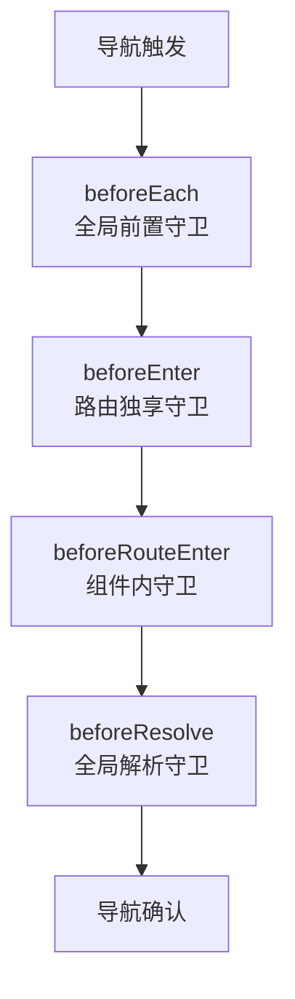
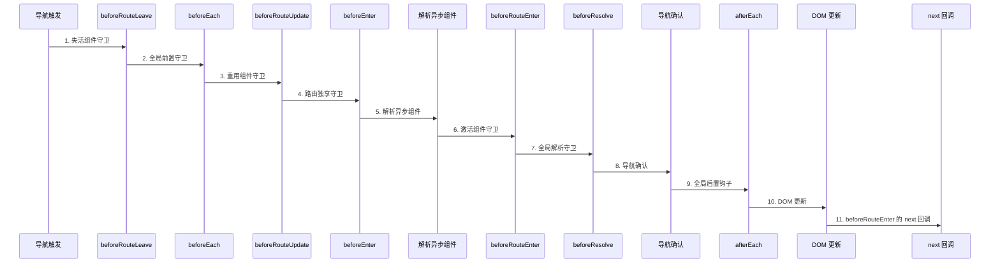

# 路由守卫

> 学习如何使用路由守卫实现权限控制、页面访问拦截等功能。

## 概述

路由守卫（Navigation Guards）是 Vue Router 提供的路由跳转拦截机制，可以在路由跳转过程中执行特定的逻辑，如权限验证、登录检查、数据预加载等。

### 守卫类型

| 类型 | 注册位置 | 作用范围 |
|------|----------|----------|
| 全局守卫 | 路由实例 | 所有路由跳转 |
| 路由独享守卫 | 路由配置 | 特定路由 |
| 组件内守卫 | 组件内部 | 当前组件 |

### 应用场景

- 登录验证：未登录用户跳转到登录页
- 权限控制：无权限用户禁止访问
- 页面标题：动态设置页面标题
- 数据预加载：进入页面前获取数据
- 页面离开确认：未保存表单提示确认

## 全局前置守卫

### 基本用法

使用 `router.beforeEach` 注册全局前置守卫：

```javascript
const router = new VueRouter({ ... })

router.beforeEach((to, from, next) => {
  // to: 即将进入的目标路由对象
  // from: 当前导航正要离开的路由对象
  // next: 必须调用该方法来 resolve 这个钩子
  
  if (to.meta.requiresAuth && !isAuthenticated()) {
    next('/login')
  } else {
    next()
  }
})
```

### 参数说明

| 参数 | 类型 | 说明 |
|------|------|------|
| `to` | Route | 即将进入的目标路由对象 |
| `from` | Route | 当前导航正要离开的路由对象 |
| `next` | Function | 必须调用，决定导航行为 |

### next() 用法

```javascript
// 允许导航
next()

// 阻止导航
next(false)

// 重定向到其他路由
next('/login')
next({ name: 'Login' })
next({ path: '/login', query: { redirect: to.fullPath } })

// 抛出错误
next(new Error('导航失败'))
```

### 登录验证示例

```javascript
// router/index.js
import store from '@/store'

router.beforeEach((to, from, next) => {
  // 判断目标路由是否需要登录
  if (to.matched.some(record => record.meta.requiresAuth)) {
    // 检查是否已登录
    if (!store.getters.isLoggedIn) {
      // 未登录，重定向到登录页
      next({
        path: '/login',
        query: { redirect: to.fullPath }  // 保存原目标路径
      })
    } else {
      next()
    }
  } else {
    next()
  }
})
```

### 页面标题设置

```javascript
router.beforeEach((to, from, next) => {
  // 设置页面标题
  const title = to.meta.title
  document.title = title ? `${title} - 我的网站` : '我的网站'
  next()
})
```

### 权限验证

```javascript
router.beforeEach(async (to, from, next) => {
  // 需要权限的路由
  if (to.meta.roles) {
    const userRole = store.state.user.role
    
    if (to.meta.roles.includes(userRole)) {
      next()
    } else {
      next('/403')  // 无权限页面
    }
  } else {
    next()
  }
})
```

### 多个前置守卫

```javascript
// 多个守卫按注册顺序执行
router.beforeEach((to, from, next) => {
  console.log('全局前置守卫 1')
  next()
})

router.beforeEach((to, from, next) => {
  console.log('全局前置守卫 2')
  next()
})
```

## 全局解析守卫

### 基本用法

使用 `router.beforeResolve` 注册全局解析守卫，在所有组件内守卫和异步路由组件被解析之后调用：

```javascript
router.beforeResolve((to, from, next) => {
  // 在导航被确认之前，同时在所有组件内守卫和异步路由组件被解析之后调用
  next()
})
```

### 与 beforeEach 的区别



### 应用场景

```javascript
router.beforeResolve((to, from, next) => {
  // 所有守卫都执行完毕，可以做最终的数据获取
  if (to.meta.requiresData) {
    store.dispatch('fetchInitialData').then(() => {
      next()
    }).catch(() => {
      next('/error')
    })
  } else {
    next()
  }
})
```

## 全局后置钩子

### 基本用法

使用 `router.afterEach` 注册全局后置钩子，导航成功完成之后调用：

```javascript
router.afterEach((to, from) => {
  // 没有 next 函数，不能阻止导航
  console.log('导航成功:', from.path, '→', to.path)
})
```

### 应用场景

#### 页面访问统计

```javascript
router.afterEach((to, from) => {
  // 发送页面访问统计
  if (window.ga) {
    window.ga('send', 'pageview', to.fullPath)
  }
})
```

#### 页面滚动

```javascript
router.afterEach((to, from) => {
  // 滚动到页面顶部
  window.scrollTo(0, 0)
})
```

#### 关闭加载提示

```javascript
router.afterEach((to, from) => {
  // 关闭页面加载动画
  store.commit('setLoading', false)
})
```

## 路由独享守卫

### 基本用法

在路由配置中使用 `beforeEnter` 属性：

```javascript
const routes = [
  {
    path: '/admin',
    component: Admin,
    beforeEnter: (to, from, next) => {
      // 只对 /admin 路由生效
      if (isAdmin()) {
        next()
      } else {
        next('/403')
      }
    }
  }
]
```

### 函数形式

```javascript
// 定义守卫函数
function checkAdmin(to, from, next) {
  if (isAdmin()) {
    next()
  } else {
    next('/403')
  }
}

const routes = [
  {
    path: '/admin',
    component: Admin,
    beforeEnter: checkAdmin
  },
  {
    path: '/settings',
    component: Settings,
    beforeEnter: checkAdmin  // 复用守卫
  }
]
```

### 组合多个守卫函数

::: warning 注意
`beforeEnter` 只接受**单个函数**，不支持数组写法（直接传数组会在导航时抛出 TypeError）。需要串联多个守卫时，先写一个依次执行的组合函数：
:::

```javascript
function checkAuth(to, from, next) {
  if (isAuthenticated()) {
    next()
  } else {
    next('/login')
  }
}

function checkAdmin(to, from, next) {
  if (isAdmin()) {
    next()
  } else {
    next('/403')
  }
}

function checkPermission(to, from, next) {
  // 检查具体权限
  next()
}

// 依次执行守卫，全部通过后才放行
function runGuards(guards) {
  return (to, from, next) => {
    const run = i => {
      if (i >= guards.length) return next()
      guards[i](to,%20from,%20() => run(i + 1))
    }
    run(0)
  }
}

const routes = [
  {
    path: '/admin',
    component: Admin,
    beforeEnter: runGuards([checkAuth, checkAdmin, checkPermission])
  }
]
```

### 异步验证

```javascript
const routes = [
  {
    path: '/dashboard',
    component: Dashboard,
    beforeEnter: async (to, from, next) => {
      try {
        await store.dispatch('fetchUserData')
        next()
      } catch (error) {
        next('/error')
      }
    }
  }
]
```

## 组件内守卫

### beforeRouteEnter

在渲染该组件的对应路由被 confirm 前调用，此时组件实例还未创建，**不能**访问 `this`：

```javascript
export default {
  data() {
    return {
      user: null
    }
  },
  
  beforeRouteEnter(to, from, next) {
    // 此时组件实例还未创建，无法访问 this
    
    // 通过回调访问组件实例
    getUser(to.params.id).then(user => {
      next(vm => {
        // 通过 vm 访问组件实例
        vm.user = user
      })
    })
  }
}
```

### beforeRouteUpdate

在当前路由改变，但组件被复用时调用（如 `/user/1` → `/user/2`）：

```javascript
export default {
  props: ['id'],
  
  beforeRouteUpdate(to, from, next) {
    // 可以访问 this
    console.log('路由参数变化:', from.params.id, '→', to.params.id)
    
    // 重新获取数据
    this.fetchUser(to.params.id)
    next()
  },
  
  methods: {
    fetchUser(id) {
      // 获取用户数据
    }
  }
}
```

### beforeRouteLeave

在导航离开该组件的对应路由时调用：

```javascript
export default {
  data() {
    return {
      form: {},
      hasUnsavedChanges: false
    }
  },
  
  beforeRouteLeave(to, from, next) {
    // 检查是否有未保存的更改
    if (this.hasUnsavedChanges) {
      const answer = window.confirm(
        '您有未保存的更改，确定要离开吗？'
      )
      if (answer) {
        next()
      } else {
        next(false)
      }
    } else {
      next()
    }
  }
}
```

### 完整示例

```vue
<template>
  <div class="user-detail">
    <h2>用户详情</h2>
    <p v-if="loading">加载中...</p>
    <div v-else>
      <p>用户名: {{ user.name }}</p>
      <p>邮箱: {{ user.email }}</p>
    </div>
  </div>
</template>

<script>
export default {
  name: 'UserDetail',
  
  props: ['id'],
  
  data() {
    return {
      user: null,
      loading: false
    }
  },
  
  // 进入路由前获取数据
  beforeRouteEnter(to, from, next) {
    getUser(to.params.id).then(user => {
      next(vm => {
        vm.user = user
      })
    }).catch(() => {
      next('/404')
    })
  },
  
  // 路由参数变化时更新数据
  beforeRouteUpdate(to, from, next) {
    this.loading = true
    getUser(to.params.id).then(user => {
      this.user = user
      this.loading = false
      next()
    }).catch(() => {
      next('/404')
    })
  },
  
  // 离开前确认
  beforeRouteLeave(to, from, next) {
    if (this.hasUnsavedChanges) {
      if (confirm('有未保存的更改，确定要离开吗？')) {
        next()
      } else {
        next(false)
      }
    } else {
      next()
    }
  }
}

async function getUser(id) {
  const response = await fetch(`/api/user/${id}`)
  return response.json()
}
</script>
```

## 完整的导航解析流程

### 流程图



### 执行顺序示例

```javascript
// 路由配置
const routes = [
  {
    path: '/user/:id',
    component: User,
    beforeEnter: (to, from, next) => {
      console.log('4. 路由独享守卫 beforeEnter')
      next()
    }
  }
]

// 全局守卫
router.beforeEach((to, from, next) => {
  console.log('2. 全局前置守卫 beforeEach')
  next()
})

router.beforeResolve((to, from, next) => {
  console.log('7. 全局解析守卫 beforeResolve')
  next()
})

router.afterEach((to, from) => {
  console.log('9. 全局后置钩子 afterEach')
})

// 组件守卫
export default {
  beforeRouteEnter(to, from, next) {
    console.log('6. 组件内守卫 beforeRouteEnter')
    next()
  },
  beforeRouteUpdate(to, from, next) {
    console.log('3. 组件内守卫 beforeRouteUpdate')
    next()
  },
  beforeRouteLeave(to, from, next) {
    console.log('1. 组件内守卫 beforeRouteLeave')
    next()
  }
}
```

## 实战案例

### 案例 1：完整的权限控制系统

```javascript
// router/index.js
import Vue from 'vue'
import VueRouter from 'vue-router'
import store from '@/store'
import { getToken } from '@/utils/auth'

Vue.use(VueRouter)

// 不需要登录的路由
const whiteList = ['/login', '/register', '/forgot-password']

const routes = [
  {
    path: '/login',
    name: 'Login',
    component: () => import('@/views/Login.vue'),
    meta: { title: '登录' }
  },
  {
    path: '/admin',
    name: 'AdminLayout',
    component: () => import('@/layouts/AdminLayout.vue'),
    meta: { requiresAuth: true },
    children: [
      {
        path: '',
        name: 'Dashboard',
        component: () => import('@/views/Dashboard.vue'),
        meta: { title: '仪表盘' }
      },
      {
        path: 'user',
        name: 'UserManage',
        component: () => import('@/views/UserManage.vue'),
        meta: { 
          title: '用户管理',
          roles: ['admin', 'super_admin']
        }
      }
    ]
  }
]

const router = new VueRouter({
  mode: 'history',
  routes
})

// 全局前置守卫
router.beforeEach(async (to, from, next) => {
  // 设置页面标题
  document.title = to.meta.title || '管理系统'
  
  const token = getToken()
  
  if (token) {
    // 已登录
    if (to.path === '/login') {
      // 已登录访问登录页，重定向到首页
      next({ path: '/' })
    } else {
      // 检查是否已获取用户信息
      if (store.getters.roles.length === 0) {
        try {
          // 获取用户信息
          const { roles } = await store.dispatch('user/getInfo')
          
          // 根据角色生成可访问路由
          const accessRoutes = await store.dispatch('permission/generateRoutes', roles)
          
          // 动态添加路由
          router.addRoutes(accessRoutes)
          
          // 确保路由已添加
          next({ ...to, replace: true })
        } catch (error) {
          // 获取用户信息失败，清除 token
          await store.dispatch('user/resetToken')
          next(`/login?redirect=${to.path}`)
        }
      } else {
        // 检查权限
        if (to.meta.roles) {
          const hasRole = to.meta.roles.some(role => 
            store.getters.roles.includes(role)
          )
          
          if (hasRole) {
            next()
          } else {
            next('/403')
          }
        } else {
          next()
        }
      }
    }
  } else {
    // 未登录
    if (whiteList.includes(to.path)) {
      // 白名单路由，直接进入
      next()
    } else {
      // 重定向到登录页
      next(`/login?redirect=${to.path}`)
    }
  }
})

export default router
```

### 案例 2：页面离开确认

```vue
<template>
  <div class="edit-form">
    <form @submit.prevent="submitForm">
      <input v-model="form.title" placeholder="标题" />
      <textarea v-model="form.content" placeholder="内容"></textarea>
      <button type="submit">保存</button>
    </form>
  </div>
</template>

<script>
export default {
  data() {
    return {
      form: {
        title: '',
        content: ''
      },
      originalForm: null,
      isSubmitting: false
    }
  },
  
  created() {
    // 保存原始数据
    this.originalForm = JSON.parse(JSON.stringify(this.form))
  },
  
  computed: {
    hasChanges() {
      return JSON.stringify(this.form) !== JSON.stringify(this.originalForm)
    }
  },
  
  methods: {
    async submitForm() {
      this.isSubmitting = true
      try {
        await this.$api.submitArticle(this.form)
        this.originalForm = JSON.parse(JSON.stringify(this.form))
        this.$message.success('保存成功')
      } catch (error) {
        this.$message.error('保存失败')
      } finally {
        this.isSubmitting = false
      }
    }
  },
  
  // 组件内守卫
  beforeRouteLeave(to, from, next) {
    if (this.hasChanges && !this.isSubmitting) {
      this.$confirm('有未保存的更改，确定要离开吗？', '提示', {
        confirmButtonText: '确定',
        cancelButtonText: '取消',
        type: 'warning'
      }).then(() => {
        next()
      }).catch(() => {
        next(false)
      })
    } else {
      next()
    }
  }
}
</script>
```

### 案例 3：数据预加载

```javascript
// 路由配置
const routes = [
  {
    path: '/user/:id',
    name: 'UserDetail',
    component: () => import('@/views/UserDetail.vue'),
    meta: { preload: true },
    beforeEnter: async (to, from, next) => {
      try {
        // 预加载用户数据
        const user = await store.dispatch('user/fetchUser', to.params.id)
        to.meta.user = user
        next()
      } catch (error) {
        next('/404')
      }
    }
  }
]
```

```vue
<!-- UserDetail.vue -->
<script>
export default {
  beforeRouteEnter(to, from, next) {
    // 使用预加载的数据
    next(vm => {
      vm.user = to.meta.user
    })
  }
}
</script>
```

## 最佳实践

### 1. 守卫代码分离

```javascript
// router/guards.js
export function authGuard(to, from, next) {
  if (to.meta.requiresAuth && !isAuthenticated()) {
    next('/login')
  } else {
    next()
  }
}

export function titleGuard(to, from, next) {
  document.title = to.meta.title || '默认标题'
  next()
}

// router/index.js
import { authGuard, titleGuard } from './guards'

router.beforeEach(authGuard)
router.beforeEach(titleGuard)
```

### 2. 使用路由元信息

```javascript
const routes = [
  {
    path: '/admin',
    component: Admin,
    meta: {
      requiresAuth: true,
      roles: ['admin'],
      title: '管理后台'
    }
  }
]

// 守卫中使用
router.beforeEach((to, from, next) => {
  if (to.matched.some(record => record.meta.requiresAuth)) {
    // 需要认证
  }
  
  if (to.meta.roles) {
    // 检查角色
  }
  
  if (to.meta.title) {
    // 设置标题
  }
  
  next()
})
```

### 3. 避免无限重定向

```javascript
// ❌ 错误：可能导致无限重定向
router.beforeEach((to, from, next) => {
  if (!isAuthenticated()) {
    next('/login')
  }
  next()  // 这里总是会执行！
})

// ✅ 正确：使用 return 或 else
router.beforeEach((to, from, next) => {
  if (!isAuthenticated()) {
    return next('/login')
  }
  next()
})
```

### 4. 异步守卫处理

```javascript
router.beforeEach(async (to, from, next) => {
  try {
    await someAsyncOperation()
    next()
  } catch (error) {
    next('/error')
  }
})
```

### 5. 守卫顺序

```javascript
// 推荐的守卫注册顺序
router.beforeEach(checkAuth)        // 1. 检查登录
router.beforeEach(checkPermission)  // 2. 检查权限
router.beforeEach(setTitle)         // 3. 设置标题
router.afterEach(trackPage)         // 4. 统计访问
```

## 常见问题

### 1. beforeRouteEnter 无法访问 this？

使用 next 回调：

```javascript
beforeRouteEnter(to, from, next) {
  next(vm => {
    // 通过 vm 访问组件实例
    vm.loadData()
  })
}
```

### 2. 如何阻止导航？

```javascript
// 方式一：next(false)
beforeRouteLeave(to, from, next) {
  next(false)
}

// 方式二：不调用 next
beforeRouteLeave(to, from, next) {
  // 不调用 next，导航会一直等待
}

// 方式三：抛出错误
beforeRouteLeave(to, from, next) {
  next(new Error('导航被阻止'))
}
```

### 3. 如何获取上一个路由？

```javascript
router.afterEach((to, from) => {
  console.log('上一个路由:', from.path)
  console.log('上一个路由名称:', from.name)
})
```

### 4. 守卫中如何跳转并携带参数？

```javascript
router.beforeEach((to, from, next) => {
  next({
    path: '/login',
    query: { redirect: to.fullPath }
  })
})
```

### 5. 如何在守卫中使用 Vuex？

```javascript
import store from '@/store'

router.beforeEach((to, from, next) => {
  if (store.getters.isLoggedIn) {
    next()
  } else {
    next('/login')
  }
})
```

## 调试技巧

### 打印导航日志

```javascript
router.beforeEach((to, from, next) => {
  console.group('路由导航')
  console.log('从:', from.path)
  console.log('到:', to.path)
  console.log('参数:', to.params)
  console.log('查询:', to.query)
  console.log('元信息:', to.meta)
  console.groupEnd()
  next()
})
```

### 检查路由匹配

```javascript
router.beforeEach((to, from, next) => {
  console.log('匹配的路由记录:', to.matched)
  next()
})
```

## API 参考

### 全局守卫

| 方法 | 说明 |
|------|------|
| `router.beforeEach(guard)` | 全局前置守卫 |
| `router.beforeResolve(guard)` | 全局解析守卫 |
| `router.afterEach(hook)` | 全局后置钩子 |

### 路由配置

| 属性 | 说明 |
|------|------|
| `beforeEnter` | 路由独享守卫 |

### 组件守卫

| 方法 | 说明 |
|------|------|
| `beforeRouteEnter` | 进入路由前 |
| `beforeRouteUpdate` | 路由更新时 |
| `beforeRouteLeave` | 离开路由前 |

## 下一步

- [路由基础](01-路由基础.md) - 回顾路由配置基础和实现原理
- [路由进阶](03-路由进阶.md) - 深入学习动态路由、嵌套路由、懒加载等高级功能
