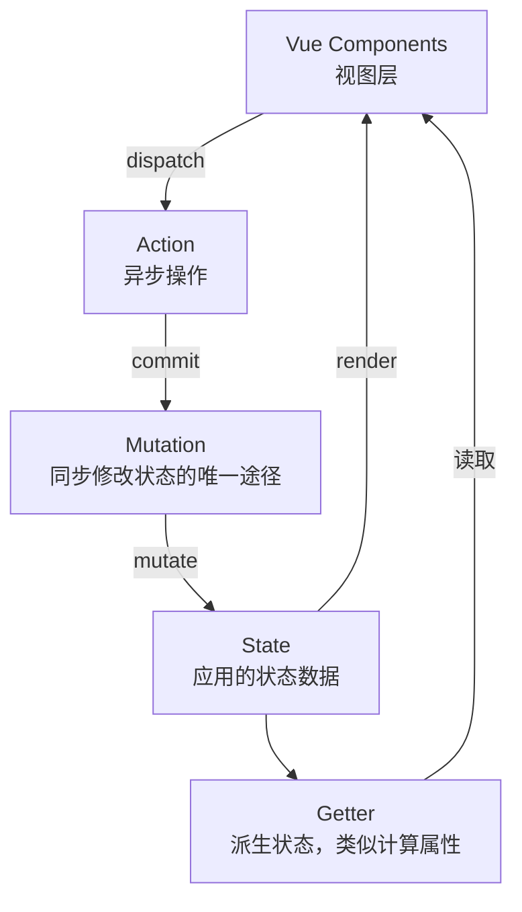

# Vuex概述

> Vuex 是 Vue.js 官方的状态管理模式，专为 Vue.js 应用程序开发。

## 什么是状态管理

状态管理是指在一个应用中，对多个组件共享的数据进行统一管理的方式。在 Vue 应用中，我们可以将状态分为以下几类：

### 组件内部状态

- 仅在单个组件内部使用的私有数据
- 通过 `data` 选项定义
- 不需要与其他组件共享

### 应用级状态

- 多个组件需要共享的数据
- 需要在不同组件间传递
- 需要统一管理和维护

### 状态管理的演进

```
组件内部状态 → 父子组件通信(props/emit) → 事件总线(Event Bus) → Vuex
```

## 为什么需要Vuex

### 问题场景

当应用变得复杂时，会遇到以下问题：

1. **多个组件共享状态**：多个视图依赖于同一状态
2. **来自不同视图的行为**：需要变更同一状态
3. **状态传递复杂**：多层嵌套组件间的状态传递变得困难
4. **状态来源不明确**：难以追踪状态的变化来源

### 传统方式的局限

```javascript
// 父子组件通信 - 适合简单的父子关系
this.$emit("update-data", newData)

// 事件总线 - 适合简单跨组件通信，但难以追踪
EventBus.$emit("event-name", data)
EventBus.$on("event-name", handler)

// 全局变量 - 无响应式，难以维护
window.globalData = { user: null }
```

### Vuex 的优势

| 特性           | 说明                               |
| -------------- | ---------------------------------- |
| **集中式存储** | 所有状态集中管理，便于维护和调试   |
| **响应式**     | 状态变化自动更新视图               |
| **可预测**     | 通过 Mutation 追踪状态变化         |
| **调试工具**   | 配合 Vue Devtools 进行时间旅行调试 |
| **模块化**     | 支持模块分割，适合大型应用         |

## 核心概念

Vuex 采用**单向数据流**的设计理念：



### 核心概念说明

| 概念         | 作用         | 特点                          |
| ------------ | ------------ | ----------------------------- |
| **State**    | 存储应用状态 | 响应式，组件通过计算属性获取  |
| **Getter**   | 派生状态     | 类似计算属性，有缓存          |
| **Mutation** | 同步修改状态 | 唯一修改状态的途径            |
| **Action**   | 异步操作     | 提交 Mutation，不直接修改状态 |
| **Module**   | 模块分割     | 将 store 分割成模块           |

## 基本用法

### 安装

```bash
# npm
npm install vuex@3 --save

# yarn
yarn add vuex@3
```

> **注意**：Vue 2 需要使用 Vuex 3.x 版本

### 创建 Store

```javascript
// store/index.js
import Vue from "vue"
import Vuex from "vuex"

Vue.use(Vuex)

const store = new Vuex.Store({
  state: {
    count: 0,
    user: null
  },
  mutations: {
    increment(state) {
      state.count++
    },
    setUser(state, user) {
      state.user = user
    }
  },
  actions: {
    incrementAsync({ commit }) {
      setTimeout(() => {
        commit("increment")
      }, 1000)
    }
  },
  getters: {
    doubleCount: (state) => state.count * 2,
    isLoggedIn: (state) => !!state.user
  }
})

export default store
```

### 在 Vue 实例中使用

```javascript
// main.js
import Vue from "vue"
import App from "./App.vue"
import store from "./store"

new Vue({
  store,
  render: (h) => h(App)
}).$mount("#app")
```

### 在组件中使用

```vue
<template>
  <div>
    <p>Count: {{ count }}</p>
    <p>Double: {{ doubleCount }}</p>
    <button @click="increment">+1</button>
    <button @click="incrementAsync">异步+1</button>
  </div>
</template>

<script>
  import { mapState, mapGetters, mapMutations, mapActions } from "vuex"

  export default {
    computed: {
      ...mapState(["count"]),
      ...mapGetters(["doubleCount"])
    },
    methods: {
      ...mapMutations(["increment"]),
      ...mapActions(["incrementAsync"])
    }
  }
</script>
```

## 与全局变量的区别

| 对比项   | 全局变量    | Vuex                 |
| -------- | ----------- | -------------------- |
| 响应式   | ❌ 无       | ✅ 有                |
| 状态追踪 | ❌ 无法追踪 | ✅ 可追踪每次变化    |
| 调试支持 | ❌ 无       | ✅ Vue Devtools 支持 |
| 时间旅行 | ❌ 不支持   | ✅ 支持状态快照      |
| 模块化   | ❌ 难以组织 | ✅ 原生支持模块      |
| 热重载   | ❌ 不支持   | ✅ 支持模块热重载    |
| 类型安全 | ❌ 无       | ✅ 可配合 TypeScript |

### 响应式对比示例

```javascript
// 全局变量 - 无响应式
window.globalState = { count: 0 }
window.globalState.count = 1 // 视图不会更新

// Vuex - 响应式
store.state.count = 1 // 视图自动更新
```

## 适用场景

### 适合使用 Vuex 的场景

- ✅ 中大型单页应用
- ✅ 多个组件需要共享状态
- ✅ 需要追踪状态变化
- ✅ 需要时间旅行调试

### 不需要 Vuex 的场景

- ❌ 小型简单应用
- ❌ 组件间通信简单
- ❌ 状态管理需求简单

> **提示**：对于小型应用，可以考虑使用简单的状态管理模式或组合式 API 中的响应式 API（Vue 2.7 已内置，低版本可用 `@vue/composition-api` 插件）。

## 版本兼容性

| Vue 版本 | Vuex 版本 |
| -------- | --------- |
| Vue 2.x  | Vuex 3.x  |
| Vue 3.x  | Vuex 4.x  |

## 相关资源

- [Vuex 官方文档](https://v3.vuex.vuejs.org/zh/)
- [Vue Devtools](https://github.com/vuejs/vue-devtools)
