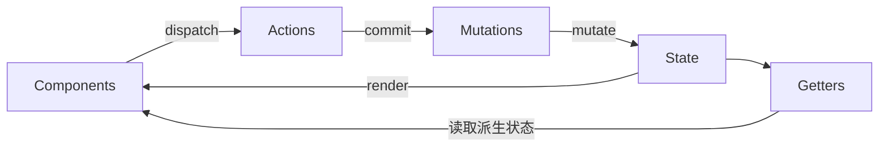

# Vuex 核心概念

## 概述

Vuex 采用单向数据流的设计理念，核心概念之间的关系如下：



| 核心概念 | 职责 | 是否可异步 |
|----------|------|------------|
| State | 存储状态 | - |
| Getter | 派生状态 | - |
| Mutation | 修改状态 | ❌ 必须同步 |
| Action | 异步操作 | ✅ 可异步 |

## State

State 是 Vuex store 中存储应用状态的唯一数据源，是响应式的。

### 定义 State

```javascript
const store = new Vuex.Store({
  state: {
    count: 0,
    user: {
      id: 1,
      name: '张三'
    },
    todos: [
      { id: 1, text: '学习 Vuex', done: true },
      { id: 2, text: '学习 Vue Router', done: false }
    ]
  }
})
```

### 在组件中获取 State

#### 方式一：通过 this.$store

```vue
<template>
  <div>
    <p>Count: {{ $store.state.count }}</p>
    <p>User: {{ $store.state.user.name }}</p>
  </div>
</template>
```

#### 方式二：通过计算属性

```vue
<script>
export default {
  computed: {
    count() {
      return this.$store.state.count
    },
    user() {
      return this.$store.state.user
    }
  }
}
</script>
```

#### 方式三：使用 mapState 辅助函数

```vue
<template>
  <div>
    <p>Count: {{ count }}</p>
    <p>User: {{ user.name }}</p>
  </div>
</template>

<script>
import { mapState } from 'vuex'

export default {
  computed: {
    // 对象展开运算符
    ...mapState(['count', 'user']),
    
    // 重命名
    ...mapState({
      currentCount: 'count',
      currentUser: 'user'
    }),
    
    // 使用函数获取
    ...mapState({
      countPlusLocalState(state) {
        return state.count + this.localCount
      }
    })
  }
}
</script>
```

### mapState 使用方式对比

```javascript
// 数组形式
...mapState(['count', 'user', 'todos'])

// 对象形式 - 重命名
...mapState({
  currentCount: 'count',
  currentUser: 'user'
})

// 对象形式 - 函数（注意：要访问组件的 this 必须用普通函数，箭头函数没有自己的 this）
...mapState({
  countWithLocal(state) {
    return state.count + this.localCount
  }
})
```

## Getter

Getter 类似于 Vue 的计算属性，用于从 store 中的 state 派生出一些状态，并且具有缓存特性。

### 定义 Getter

```javascript
const store = new Vuex.Store({
  state: {
    todos: [
      { id: 1, text: '学习 Vuex', done: true },
      { id: 2, text: '学习 Vue Router', done: false }
    ]
  },
  getters: {
    // 获取完成的 todos
    doneTodos: state => {
      return state.todos.filter(todo => todo.done)
    },
    
    // 获取完成的 todos 数量
    doneTodosCount: (state, getters) => {
      return getters.doneTodos.length
    },
    
    // 通过 id 获取 todo
    getTodoById: state => id => {
      return state.todos.find(todo => todo.id === id)
    }
  }
})
```

### 在组件中使用 Getter

#### 方式一：通过 this.$store

```vue
<template>
  <div>
    <p>完成的任务数: {{ $store.getters.doneTodosCount }}</p>
  </div>
</template>

<script>
export default {
  computed: {
    doneTodos() {
      return this.$store.getters.doneTodos
    }
  }
}
</script>
```

#### 方式二：使用 mapGetters 辅助函数

```vue
<template>
  <div>
    <p>完成的任务数: {{ doneTodosCount }}</p>
    <p>完成的任务: {{ doneTodos }}</p>
  </div>
</template>

<script>
import { mapGetters } from 'vuex'

export default {
  computed: {
    // 数组形式
    ...mapGetters(['doneTodos', 'doneTodosCount']),
    
    // 对象形式 - 重命名
    ...mapGetters({
      finishedTodos: 'doneTodos',
      finishedCount: 'doneTodosCount'
    })
  }
}
</script>
```

### Getter 返回函数

```javascript
// store
getters: {
  getTodoById: state => id => {
    return state.todos.find(todo => todo.id === id)
  }
}

// 组件中使用
computed: {
  todo() {
    return this.$store.getters.getTodoById(1)
  }
}
```

### Getter 与计算属性对比

| 特性 | Getter | 计算属性 |
|------|--------|----------|
| 缓存 | ✅ 有 | ✅ 有 |
| 作用域 | 全局 | 组件内 |
| 参数 | 支持返回函数 | 不支持 |
| 依赖 | 依赖 state | 依赖组件 data |

## Mutation

Mutation 是更改 Vuex 的 store 中的状态的唯一方法，必须是同步函数。

### 定义 Mutation

```javascript
const store = new Vuex.Store({
  state: {
    count: 0,
    user: null
  },
  mutations: {
    // 无参数
    increment(state) {
      state.count++
    },
    
    // 带参数（载荷）
    incrementBy(state, payload) {
      state.count += payload.amount
    },
    
    // 对象风格的提交方式
    setUser(state, payload) {
      state.user = payload
    },
    
    // 重置状态
    resetState(state) {
      state.count = 0
      state.user = null
    }
  }
})
```

### 提交 Mutation

#### 方式一：普通提交

```javascript
// 无参数
this.$store.commit('increment')

// 带参数
this.$store.commit('incrementBy', { amount: 10 })

// 对象风格提交
this.$store.commit({
  type: 'incrementBy',
  amount: 10
})
```

#### 方式二：使用 mapMutations 辅助函数

```vue
<template>
  <div>
    <button @click="increment">+1</button>
    <button @click="incrementBy({ amount: 10 })">+10</button>
  </div>
</template>

<script>
import { mapMutations } from 'vuex'

export default {
  methods: {
    // 数组形式
    ...mapMutations(['increment', 'incrementBy']),
    
    // 对象形式 - 重命名
    ...mapMutations({
      add: 'increment',
      addBy: 'incrementBy'
    })
  }
}
</script>
```

### Mutation 必须是同步函数

```javascript
// ❌ 错误 - 不要在 Mutation 中使用异步操作
mutations: {
  incrementAsync(state) {
    setTimeout(() => {
      state.count++  // 这会导致调试困难
    }, 1000)
  }
}

// ✅ 正确 - 异步操作应放在 Action 中
actions: {
  incrementAsync({ commit }) {
    setTimeout(() => {
      commit('increment')
    }, 1000)
  }
}
```

### Mutation 命名规范

```javascript
// 推荐使用常量定义 Mutation 类型
// store/mutation-types.js
export const INCREMENT = 'INCREMENT'
export const SET_USER = 'SET_USER'
export const RESET_STATE = 'RESET_STATE'

// store/index.js
import { INCREMENT, SET_USER, RESET_STATE } from './mutation-types'

const store = new Vuex.Store({
  mutations: {
    [INCREMENT](state) {
      state.count++
    },
    [SET_USER](state,%20user) {
      state.user = user
    },
    [RESET_STATE](state) {
      state.count = 0
      state.user = null
    }
  }
})
```

## Action

Action 类似于 Mutation，但可以包含任意异步操作，通过提交 Mutation 来修改状态。

### 定义 Action

```javascript
const store = new Vuex.Store({
  state: {
    count: 0,
    user: null,
    loading: false
  },
  mutations: {
    increment(state) {
      state.count++
    },
    setUser(state, user) {
      state.user = user
    },
    setLoading(state, loading) {
      state.loading = loading
    }
  },
  actions: {
    // 简单 Action
    increment({ commit }) {
      commit('increment')
    },
    
    // 异步 Action
    incrementAsync({ commit }) {
      setTimeout(() => {
        commit('increment')
      }, 1000)
    },
    
    // 带 Promise 的 Action
    fetchUser({ commit }, userId) {
      commit('setLoading', true)
      return fetch(`/api/users/${userId}`)
        .then(response => response.json())
        .then(user => {
          commit('setUser', user)
          commit('setLoading', false)
          return user
        })
        .catch(error => {
          commit('setLoading', false)
          throw error
        })
    },
    
    // 使用 async/await
    async fetchUserAsync({ commit }, userId) {
      commit('setLoading', true)
      try {
        const response = await fetch(`/api/users/${userId}`)
        const user = await response.json()
        commit('setUser', user)
        return user
      } finally {
        commit('setLoading', false)
      }
    },
    
    // 组合多个 Action
    async fetchUserAndPosts({ dispatch }, userId) {
      const user = await dispatch('fetchUserAsync', userId)
      await dispatch('fetchPosts', user.id)
    }
  }
})
```

### 分发 Action

#### 方式一：通过 this.$store.dispatch

```javascript
// 普通分发
this.$store.dispatch('increment')

// 带参数分发
this.$store.dispatch('incrementAsync')
this.$store.dispatch('fetchUser', 1)

// 对象风格分发
this.$store.dispatch({
  type: 'fetchUser',
  userId: 1
})

// 处理返回的 Promise
this.$store.dispatch('fetchUser', 1)
  .then(user => {
    console.log('获取用户成功:', user)
  })
  .catch(error => {
    console.error('获取用户失败:', error)
  })

// 使用 async/await
export default {
  methods: {
    async getUser() {
      try {
        const user = await this.$store.dispatch('fetchUser', 1)
        console.log('获取用户成功:', user)
      } catch (error) {
        console.error('获取用户失败:', error)
      }
    }
  }
}
```

#### 方式二：使用 mapActions 辅助函数

```vue
<template>
  <div>
    <button @click="increment">+1</button>
    <button @click="incrementAsync">异步+1</button>
    <button @click="fetchUser(1)">获取用户</button>
  </div>
</template>

<script>
import { mapActions } from 'vuex'

export default {
  methods: {
    // 数组形式
    ...mapActions(['increment', 'incrementAsync', 'fetchUser']),
    
    // 对象形式 - 重命名
    ...mapActions({
      add: 'increment',
      addAsync: 'incrementAsync',
      loadUser: 'fetchUser'
    })
  }
}
</script>
```

### Action 与 Mutation 对比

| 特性 | Mutation | Action |
|------|----------|--------|
| 是否可异步 | ❌ 必须同步 | ✅ 可异步 |
| 直接修改状态 | ✅ 可以 | ❌ 不可以 |
| 调用方式 | commit | dispatch |
| 返回值 | 无 | 返回 Promise |
| 调试追踪 | 容易追踪 | 需要配合工具 |

### 组合 Action

```javascript
actions: {
  // 顺序执行
  async actionA({ commit }) {
    const data = await fetchData()
    commit('setData', data)
  },
  
  async actionB({ dispatch, commit }) {
    await dispatch('actionA')  // 等待 actionA 完成
    commit('doSomethingElse')
  },
  
  // 并行执行
  async fetchAllData({ dispatch }) {
    const [users, posts] = await Promise.all([
      dispatch('fetchUsers'),
      dispatch('fetchPosts')
    ])
    return { users, posts }
  }
}
```

## 辅助函数总结

### mapState

```javascript
import { mapState } from 'vuex'

export default {
  computed: {
    ...mapState(['count', 'user']),
    ...mapState({ currentCount: 'count' })
  }
}
```

### mapGetters

```javascript
import { mapGetters } from 'vuex'

export default {
  computed: {
    ...mapGetters(['doneTodos', 'doneTodosCount']),
    ...mapGetters({ finished: 'doneTodos' })
  }
}
```

### mapMutations

```javascript
import { mapMutations } from 'vuex'

export default {
  methods: {
    ...mapMutations(['increment', 'setUser']),
    ...mapMutations({ add: 'increment' })
  }
}
```

### mapActions

```javascript
import { mapActions } from 'vuex'

export default {
  methods: {
    ...mapActions(['fetchUser', 'incrementAsync']),
    ...mapActions({ loadUser: 'fetchUser' })
  }
}
```

## 最佳实践

### 1. 使用常量定义类型

```javascript
// mutation-types.js
export const SET_USER = 'SET_USER'
export const SET_LOADING = 'SET_LOADING'
export const INCREMENT = 'INCREMENT'

// store.js
import * as types from './mutation-types'

mutations: {
  [types.SET_USER](state,%20user) {
    state.user = user
  }
}
```

### 2. Mutation 保持简单

```javascript
// ❌ 不推荐 - 复杂逻辑
mutations: {
  updateUserProfile(state, { name, email, avatar }) {
    if (name) state.user.name = name
    if (email) state.user.email = email
    if (avatar) state.user.avatar = avatar
    state.user.updatedAt = new Date()
  }
}

// ✅ 推荐 - 简单直接
mutations: {
  setUser(state, user) {
    state.user = user
  }
}
```

### 3. Action 处理业务逻辑

```javascript
actions: {
  async updateUserProfile({ commit, state }, updates) {
    commit('setLoading', true)
    try {
      const updatedUser = { ...state.user, ...updates, updatedAt: new Date() }
      await api.updateUser(updatedUser)
      commit('setUser', updatedUser)
    } finally {
      commit('setLoading', false)
    }
  }
}
```

### 4. 合理使用 Getter

```javascript
// ✅ 推荐 - 需要计算或过滤时使用 Getter
getters: {
  activeUsers: state => state.users.filter(user => user.active),
  userCount: state => state.users.length
}

// ❌ 不推荐 - 简单的状态直接使用 State
getters: {
  users: state => state.users  // 多此一举
}
```

### 5. 组件中合理使用辅助函数

```vue
<script>
import { mapState, mapGetters, mapMutations, mapActions } from 'vuex'

export default {
  computed: {
    // 优先使用 mapState 和 mapGetters
    ...mapState(['user', 'loading']),
    ...mapGetters(['isLoggedIn', 'userName']),
    
    // 组件内部计算属性
    localComputed() {
      return this.user.name.toUpperCase()
    }
  },
  methods: {
    // 优先使用 mapMutations 和 mapActions
    ...mapMutations(['setUser']),
    ...mapActions(['fetchUser', 'logout']),
    
    // 组件内部方法
    handleClick() {
      this.fetchUser(this.userId)
    }
  }
}
</script>
```
