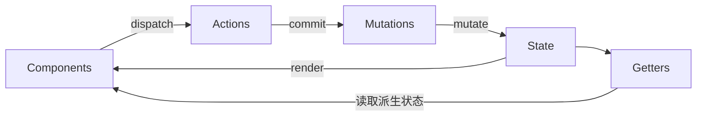

# 核心概念

> Vuex 的核心概念包括 State、Getter、Mutation 和 Action，它们共同构成了 Vuex 的状态管理体系。

## 概述

Vuex 采用单向数据流的设计理念，核心概念之间的关系如下：



| 核心概念 | 职责 | 是否可异步 |
|----------|------|------------|
| State | 存储状态 | - |
| Getter | 派生状态 | - |
| Mutation | 修改状态 | ❌ 必须同步 |
| Action | 异步操作 | ✅ 可异步 |

## State

State 是 Vuex store 中存储应用状态的唯一数据源，是响应式的。

### 定义 State

```javascript
const store = new Vuex.Store({
  state: {
    count: 0,
    user: {
      id: 1,
      name: '张三'
    },
    todos: [
      { id: 1, text: '学习 Vuex', done: true },
      { id: 2, text: '学习 Vue Router', done: false }
    ]
  }
})
```

### 在组件中获取 State

#### 方式一：通过 this.$store

```vue
<template>
  <div>
    <p>Count: {{ $store.state.count }}</p>
    <p>User: {{ $store.state.user.name }}</p>
  </div>
</template>
```

#### 方式二：通过计算属性

```vue
<script>
export default {
  computed: {
    count() {
      return this.$store.state.count
    },
    user() {
      return this.$store.state.user
    }
  }
}
</script>
```

#### 方式三：使用 mapState 辅助函数

```vue
<template>
  <div>
    <p>Count: {{ count }}</p>
    <p>User: {{ user.name }}</p>
  </div>
</template>

<script>
import { mapState } from 'vuex'

export default {
  computed: {
    // 对象展开运算符
    ...mapState(['count', 'user']),
    
    // 重命名
    ...mapState({
      currentCount: 'count',
      currentUser: 'user'
    }),
    
    // 使用函数获取
    ...mapState({
      countPlusLocalState(state) {
        return state.count + this.localCount
      }
    })
  }
}
</script>
```

### mapState 使用方式对比

```javascript
// 数组形式
...mapState(['count', 'user', 'todos'])

// 对象形式 - 重命名
...mapState({
  currentCount: 'count',
  currentUser: 'user'
})

// 对象形式 - 函数（注意：要访问组件的 this 必须用普通函数，箭头函数没有自己的 this）
...mapState({
  countWithLocal(state) {
    return state.count + this.localCount
  }
})
```

## Getter

Getter 类似于 Vue 的计算属性，用于从 store 中的 state 派生出一些状态，并且具有缓存特性。

### 定义 Getter

```javascript
const store = new Vuex.Store({
  state: {
    todos: [
      { id: 1, text: '学习 Vuex', done: true },
      { id: 2, text: '学习 Vue Router', done: false }
    ]
  },
  getters: {
    // 获取完成的 todos
    doneTodos: state => {
      return state.todos.filter(todo => todo.done)
    },
    
    // 获取完成的 todos 数量
    doneTodosCount: (state, getters) => {
      return getters.doneTodos.length
    },
    
    // 通过 id 获取 todo
    getTodoById: state => id => {
      return state.todos.find(todo => todo.id === id)
    }
  }
})
```

### 在组件中使用 Getter

#### 方式一：通过 this.$store

```vue
<template>
  <div>
    <p>完成的任务数: {{ $store.getters.doneTodosCount }}</p>
  </div>
</template>

<script>
export default {
  computed: {
    doneTodos() {
      return this.$store.getters.doneTodos
    }
  }
}
</script>
```

#### 方式二：使用 mapGetters 辅助函数

```vue
<template>
  <div>
    <p>完成的任务数: {{ doneTodosCount }}</p>
    <p>完成的任务: {{ doneTodos }}</p>
  </div>
</template>

<script>
import { mapGetters } from 'vuex'

export default {
  computed: {
    // 数组形式
    ...mapGetters(['doneTodos', 'doneTodosCount']),
    
    // 对象形式 - 重命名
    ...mapGetters({
      finishedTodos: 'doneTodos',
      finishedCount: 'doneTodosCount'
    })
  }
}
</script>
```

### Getter 返回函数

```javascript
// store
getters: {
  getTodoById: state => id => {
    return state.todos.find(todo => todo.id === id)
  }
}

// 组件中使用
computed: {
  todo() {
    return this.$store.getters.getTodoById(1)
  }
}
```

### Getter 与计算属性对比

| 特性 | Getter | 计算属性 |
|------|--------|----------|
| 缓存 | ✅ 有 | ✅ 有 |
| 作用域 | 全局 | 组件内 |
| 参数 | 支持返回函数 | 不支持 |
| 依赖 | 依赖 state | 依赖组件 data |

## Mutation

Mutation 是更改 Vuex 的 store 中的状态的唯一方法，必须是同步函数。

### 定义 Mutation

```javascript
const store = new Vuex.Store({
  state: {
    count: 0,
    user: null
  },
  mutations: {
    // 无参数
    increment(state) {
      state.count++
    },
    
    // 带参数（载荷）
    incrementBy(state, payload) {
      state.count += payload.amount
    },
    
    // 对象风格的提交方式
    setUser(state, payload) {
      state.user = payload
    },
    
    // 重置状态
    resetState(state) {
      state.count = 0
      state.user = null
    }
  }
})
```

### 提交 Mutation

#### 方式一：普通提交

```javascript
// 无参数
this.$store.commit('increment')

// 带参数
this.$store.commit('incrementBy', { amount: 10 })

// 对象风格提交
this.$store.commit({
  type: 'incrementBy',
  amount: 10
})
```

#### 方式二：使用 mapMutations 辅助函数

```vue
<template>
  <div>
    <button @click="increment">+1</button>
    <button @click="incrementBy({ amount: 10 })">+10</button>
  </div>
</template>

<script>
import { mapMutations } from 'vuex'

export default {
  methods: {
    // 数组形式
    ...mapMutations(['increment', 'incrementBy']),
    
    // 对象形式 - 重命名
    ...mapMutations({
      add: 'increment',
      addBy: 'incrementBy'
    })
  }
}
</script>
```

### Mutation 必须是同步函数

```javascript
// ❌ 错误 - 不要在 Mutation 中使用异步操作
mutations: {
  incrementAsync(state) {
    setTimeout(() => {
      state.count++  // 这会导致调试困难
    }, 1000)
  }
}

// ✅ 正确 - 异步操作应放在 Action 中
actions: {
  incrementAsync({ commit }) {
    setTimeout(() => {
      commit('increment')
    }, 1000)
  }
}
```

### Mutation 命名规范

```javascript
// 推荐使用常量定义 Mutation 类型
// store/mutation-types.js
export const INCREMENT = 'INCREMENT'
export const SET_USER = 'SET_USER'
export const RESET_STATE = 'RESET_STATE'

// store/index.js
import { INCREMENT, SET_USER, RESET_STATE } from './mutation-types'

const store = new Vuex.Store({
  mutations: {
    [INCREMENT](state) {
      state.count++
    },
    [SET_USER](state,%20user) {
      state.user = user
    },
    [RESET_STATE](state) {
      state.count = 0
      state.user = null
    }
  }
})
```

## Action

Action 类似于 Mutation，但可以包含任意异步操作，通过提交 Mutation 来修改状态。

### 定义 Action

```javascript
const store = new Vuex.Store({
  state: {
    count: 0,
    user: null,
    loading: false
  },
  mutations: {
    increment(state) {
      state.count++
    },
    setUser(state, user) {
      state.user = user
    },
    setLoading(state, loading) {
      state.loading = loading
    }
  },
  actions: {
    // 简单 Action
    increment({ commit }) {
      commit('increment')
    },
    
    // 异步 Action
    incrementAsync({ commit }) {
      setTimeout(() => {
        commit('increment')
      }, 1000)
    },
    
    // 带 Promise 的 Action
    fetchUser({ commit }, userId) {
      commit('setLoading', true)
      return fetch(`/api/users/${userId}`)
        .then(response => response.json())
        .then(user => {
          commit('setUser', user)
          commit('setLoading', false)
          return user
        })
        .catch(error => {
          commit('setLoading', false)
          throw error
        })
    },
    
    // 使用 async/await
    async fetchUserAsync({ commit }, userId) {
      commit('setLoading', true)
      try {
        const response = await fetch(`/api/users/${userId}`)
        const user = await response.json()
        commit('setUser', user)
        return user
      } finally {
        commit('setLoading', false)
      }
    },
    
    // 组合多个 Action
    async fetchUserAndPosts({ dispatch }, userId) {
      const user = await dispatch('fetchUserAsync', userId)
      await dispatch('fetchPosts', user.id)
    }
  }
})
```

### 分发 Action

#### 方式一：通过 this.$store.dispatch

```javascript
// 普通分发
this.$store.dispatch('increment')

// 带参数分发
this.$store.dispatch('incrementAsync')
this.$store.dispatch('fetchUser', 1)

// 对象风格分发
this.$store.dispatch({
  type: 'fetchUser',
  userId: 1
})

// 处理返回的 Promise
this.$store.dispatch('fetchUser', 1)
  .then(user => {
    console.log('获取用户成功:', user)
  })
  .catch(error => {
    console.error('获取用户失败:', error)
  })

// 使用 async/await
export default {
  methods: {
    async getUser() {
      try {
        const user = await this.$store.dispatch('fetchUser', 1)
        console.log('获取用户成功:', user)
      } catch (error) {
        console.error('获取用户失败:', error)
      }
    }
  }
}
```

#### 方式二：使用 mapActions 辅助函数

```vue
<template>
  <div>
    <button @click="increment">+1</button>
    <button @click="incrementAsync">异步+1</button>
    <button @click="fetchUser(1)">获取用户</button>
  </div>
</template>

<script>
import { mapActions } from 'vuex'

export default {
  methods: {
    // 数组形式
    ...mapActions(['increment', 'incrementAsync', 'fetchUser']),
    
    // 对象形式 - 重命名
    ...mapActions({
      add: 'increment',
      addAsync: 'incrementAsync',
      loadUser: 'fetchUser'
    })
  }
}
</script>
```

### Action 与 Mutation 对比

| 特性 | Mutation | Action |
|------|----------|--------|
| 是否可异步 | ❌ 必须同步 | ✅ 可异步 |
| 直接修改状态 | ✅ 可以 | ❌ 不可以 |
| 调用方式 | commit | dispatch |
| 返回值 | 无 | 返回 Promise |
| 调试追踪 | 容易追踪 | 需要配合工具 |

### 组合 Action

```javascript
actions: {
  // 顺序执行
  async actionA({ commit }) {
    const data = await fetchData()
    commit('setData', data)
  },
  
  async actionB({ dispatch, commit }) {
    await dispatch('actionA')  // 等待 actionA 完成
    commit('doSomethingElse')
  },
  
  // 并行执行
  async fetchAllData({ dispatch }) {
    const [users, posts] = await Promise.all([
      dispatch('fetchUsers'),
      dispatch('fetchPosts')
    ])
    return { users, posts }
  }
}
```

## 辅助函数总结

### mapState

```javascript
import { mapState } from 'vuex'

export default {
  computed: {
    ...mapState(['count', 'user']),
    ...mapState({ currentCount: 'count' })
  }
}
```

### mapGetters

```javascript
import { mapGetters } from 'vuex'

export default {
  computed: {
    ...mapGetters(['doneTodos', 'doneTodosCount']),
    ...mapGetters({ finished: 'doneTodos' })
  }
}
```

### mapMutations

```javascript
import { mapMutations } from 'vuex'

export default {
  methods: {
    ...mapMutations(['increment', 'setUser']),
    ...mapMutations({ add: 'increment' })
  }
}
```

### mapActions

```javascript
import { mapActions } from 'vuex'

export default {
  methods: {
    ...mapActions(['fetchUser', 'incrementAsync']),
    ...mapActions({ loadUser: 'fetchUser' })
  }
}
```

## 最佳实践

### 1. 使用常量定义类型

```javascript
// mutation-types.js
export const SET_USER = 'SET_USER'
export const SET_LOADING = 'SET_LOADING'
export const INCREMENT = 'INCREMENT'

// store.js
import * as types from './mutation-types'

mutations: {
  [types.SET_USER](state,%20user) {
    state.user = user
  }
}
```

### 2. Mutation 保持简单

```javascript
// ❌ 不推荐 - 复杂逻辑
mutations: {
  updateUserProfile(state, { name, email, avatar }) {
    if (name) state.user.name = name
    if (email) state.user.email = email
    if (avatar) state.user.avatar = avatar
    state.user.updatedAt = new Date()
  }
}

// ✅ 推荐 - 简单直接
mutations: {
  setUser(state, user) {
    state.user = user
  }
}
```

### 3. Action 处理业务逻辑

```javascript
actions: {
  async updateUserProfile({ commit, state }, updates) {
    commit('setLoading', true)
    try {
      const updatedUser = { ...state.user, ...updates, updatedAt: new Date() }
      await api.updateUser(updatedUser)
      commit('setUser', updatedUser)
    } finally {
      commit('setLoading', false)
    }
  }
}
```

### 4. 合理使用 Getter

```javascript
// ✅ 推荐 - 需要计算或过滤时使用 Getter
getters: {
  activeUsers: state => state.users.filter(user => user.active),
  userCount: state => state.users.length
}

// ❌ 不推荐 - 简单的状态直接使用 State
getters: {
  users: state => state.users  // 多此一举
}
```

### 5. 组件中合理使用辅助函数

```vue
<script>
import { mapState, mapGetters, mapMutations, mapActions } from 'vuex'

export default {
  computed: {
    // 优先使用 mapState 和 mapGetters
    ...mapState(['user', 'loading']),
    ...mapGetters(['isLoggedIn', 'userName']),
    
    // 组件内部计算属性
    localComputed() {
      return this.user.name.toUpperCase()
    }
  },
  methods: {
    // 优先使用 mapMutations 和 mapActions
    ...mapMutations(['setUser']),
    ...mapActions(['fetchUser', 'logout']),
    
    // 组件内部方法
    handleClick() {
      this.fetchUser(this.userId)
    }
  }
}
</script>
```

---

## 项目结构

良好的目录结构能让状态管理随着应用规模增长而保持可维护性。

## 推荐结构

### 基础结构

适用于中小型项目：

```
src/
├── store/
│   ├── index.js              # store 入口文件
│   ├── state.js              # 根状态
│   ├── mutations.js          # 根 mutations
│   ├── actions.js            # 根 actions
│   ├── getters.js            # 根 getters
│   └── modules/              # 模块目录
│       ├── user.js           # 用户模块
│       ├── cart.js           # 购物车模块
│       └── products.js       # 商品模块
├── App.vue
└── main.js
```

### 标准结构

适用于中大型项目：

```
src/
├── store/
│   ├── index.js                    # store 入口文件，组装模块并导出 store
│   ├── mutation-types.js           # Mutation 类型常量
│   ├── state.js                    # 根状态
│   ├── mutations.js                # 根 mutations
│   ├── actions.js                  # 根 actions
│   ├── getters.js                  # 根 getters
│   ├── modules/                    # 模块目录
│   │   ├── index.js               # 模块统一导出
│   │   ├── user/                  # 用户模块
│   │   │   ├── index.js           # 模块入口
│   │   │   ├── state.js           # 模块状态
│   │   │   ├── mutations.js       # 模块 mutations
│   │   │   ├── actions.js         # 模块 actions
│   │   │   └── getters.js         # 模块 getters
│   │   ├── cart/                  # 购物车模块
│   │   │   └── ...
│   │   └── products/              # 商品模块
│   │       └── ...
│   └── plugins/                    # 插件目录
│       ├── persist.js             # 持久化插件
│       └── logger.js              # 日志插件
├── api/                            # API 接口
│   ├── user.js
│   ├── cart.js
│   └── products.js
├── utils/                          # 工具函数
├── App.vue
└── main.js
```

### 大型项目结构

适用于企业级大型项目：

```
src/
├── store/
│   ├── index.js                    # store 入口
│   ├── mutation-types.js           # Mutation 类型常量
│   ├── rootState.js                # 根状态
│   ├── rootMutations.js            # 根 mutations
│   ├── rootActions.js              # 根 actions
│   ├── rootGetters.js              # 根 getters
│   │
│   ├── modules/                    # 业务模块
│   │   ├── index.js               # 模块导出
│   │   │
│   │   ├── user/                  # 用户模块
│   │   │   ├── index.js           # 模块入口
│   │   │   ├── state.js
│   │   │   ├── mutations.js
│   │   │   ├── actions.js
│   │   │   ├── getters.js
│   │   │   └── types.js           # 模块私有类型
│   │   │
│   │   ├── cart/                  # 购物车模块
│   │   │   └── ...
│   │   │
│   │   ├── products/              # 商品模块
│   │   │   └── ...
│   │   │
│   │   └── common/                # 公共模块
│   │       ├── app.js             # 应用状态
│   │       ├── error.js           # 错误状态
│   │       └── loading.js         # 加载状态
│   │
│   ├── plugins/                    # 插件
│   │   ├── index.js               # 插件导出
│   │   ├── persist.js             # 持久化
│   │   ├── logger.js              # 日志
│   │   └── error.js               # 错误处理
│   │
│   └── utils/                      # store 工具函数
│       ├── storage.js             # 存储工具
│       └── helpers.js             # 辅助函数
│
├── api/                            # API 接口
│   ├── index.js                   # API 导出
│   ├── request.js                 # 请求封装
│   ├── user.js
│   ├── cart.js
│   └── products.js
│
├── types/                          # TypeScript 类型定义
│   ├── user.d.ts
│   ├── cart.d.ts
│   └── products.d.ts
│
├── App.vue
└── main.js
```

## 文件组织

### 入口文件 (index.js)

```javascript
// store/index.js
import Vue from 'vue'
import Vuex from 'vuex'
import * as actions from './actions'
import * as getters from './getters'
import state from './state'
import mutations from './mutations'
import modules from './modules'
import plugins from './plugins'

Vue.use(Vuex)

const store = new Vuex.Store({
  state,
  mutations,
  actions,
  getters,
  modules,
  plugins,
  strict: process.env.NODE_ENV !== 'production'
})

export default store

// 热重载（hotUpdate 会替换 actions/mutations/getters/modules；state 不会热替换）
if (module.hot) {
  module.hot.accept(['./mutations', './actions', './getters', './modules'], () => {
    const newMutations = require('./mutations').default
    const newActions = require('./actions').default
    const newGetters = require('./getters').default
    const newModules = require('./modules').default

    store.hotUpdate({
      mutations: newMutations,
      actions: newActions,
      getters: newGetters,
      modules: newModules
    })
  })
}
```

### Mutation 类型常量 (mutation-types.js)

```javascript
// store/mutation-types.js

// 用户相关
export const SET_USER = 'SET_USER'
export const SET_TOKEN = 'SET_TOKEN'
export const CLEAR_USER = 'CLEAR_USER'

// 购物车相关
export const ADD_TO_CART = 'ADD_TO_CART'
export const REMOVE_FROM_CART = 'REMOVE_FROM_CART'
export const UPDATE_CART_QUANTITY = 'UPDATE_CART_QUANTITY'
export const CLEAR_CART = 'CLEAR_CART'

// 商品相关
export const SET_PRODUCTS = 'SET_PRODUCTS'
export const SET_CURRENT_PRODUCT = 'SET_CURRENT_PRODUCT'

// 应用状态
export const SET_LOADING = 'SET_LOADING'
export const SET_ERROR = 'SET_ERROR'
```

### State 文件

```javascript
// store/state.js
export default {
  // 应用全局状态
  loading: false,
  error: null,
  
  // 用户信息
  user: null,
  token: null,
  
  // 其他根状态
  sidebarCollapsed: false,
  theme: 'light'
}
```

### Mutations 文件

```javascript
// store/mutations.js
import * as types from './mutation-types'

export default {
  [types.SET_LOADING](state,%20loading) {
    state.loading = loading
  },
  
  [types.SET_ERROR](state,%20error) {
    state.error = error
  },
  
  [types.SET_USER](state,%20user) {
    state.user = user
  },
  
  [types.SET_TOKEN](state,%20token) {
    state.token = token
  },
  
  [types.CLEAR_USER](state) {
    state.user = null
    state.token = null
  }
}
```

### Actions 文件

```javascript
// store/actions.js
import * as types from './mutation-types'
import api from '@/api'

export default {
  // 全局加载状态
  setLoading({ commit }, loading) {
    commit(types.SET_LOADING, loading)
  },
  
  // 全局错误处理
  setError({ commit }, error) {
    commit(types.SET_ERROR, error)
  },
  
  // 用户登录
  async login({ commit, dispatch }, credentials) {
    dispatch('setLoading', true)
    try {
      const response = await api.user.login(credentials)
      commit(types.SET_TOKEN, response.token)
      commit(types.SET_USER, response.user)
      return response
    } catch (error) {
      dispatch('setError', error.message)
      throw error
    } finally {
      dispatch('setLoading', false)
    }
  },
  
  // 用户登出
  async logout({ commit }) {
    await api.user.logout()
    commit(types.CLEAR_USER)
  }
}
```

### Getters 文件

```javascript
// store/getters.js
export default {
  // 用户相关
  isLoggedIn: state => !!state.token,
  userName: state => state.user?.name || '未登录',
  userAvatar: state => state.user?.avatar || '/default-avatar.png',
  
  // 应用状态
  isLoading: state => state.loading,
  hasError: state => !!state.error,
  errorMessage: state => state.error?.message || '',
  
  // 主题
  isDarkTheme: state => state.theme === 'dark'
}
```

### 模块导出文件

```javascript
// store/modules/index.js
import user from './user'
import cart from './cart'
import products from './products'
import common from './common'

export default {
  user,
  cart,
  products,
  common
}
```

### 单个模块文件

```javascript
// store/modules/user/index.js
import state from './state'
import mutations from './mutations'
import actions from './actions'
import getters from './getters'

export default {
  namespaced: true,
  state,
  mutations,
  actions,
  getters
}
```

```javascript
// store/modules/user/state.js
export default {
  userInfo: null,
  token: localStorage.getItem('token') || null,
  preferences: {
    theme: 'light',
    language: 'zh-CN'
  }
}
```

```javascript
// store/modules/user/mutations.js
import { SET_USER, SET_TOKEN, CLEAR_USER } from '@/store/mutation-types'

export default {
  [SET_USER](state,%20user) {
    state.userInfo = user
  },
  
  [SET_TOKEN](state,%20token) {
    state.token = token
    if (token) {
      localStorage.setItem('token', token)
    } else {
      localStorage.removeItem('token')
    }
  },
  
  [CLEAR_USER](state) {
    state.userInfo = null
    state.token = null
    localStorage.removeItem('token')
  }
}
```

## 插件组织

### 持久化插件

```javascript
// store/plugins/persist.js
const STORAGE_KEY = 'vuex-store'

export default function createPersistPlugin(options = {}) {
  const { key = STORAGE_KEY, paths = [] } = options
  
  return store => {
    // 初始化时从存储中恢复状态
    const savedState = localStorage.getItem(key)
    if (savedState) {
      try {
        const parsed = JSON.parse(savedState)
        store.replaceState({
          ...store.state,
          ...parsed
        })
      } catch (e) {
        console.error('Failed to parse persisted state:', e)
      }
    }
    
    // 订阅状态变化，保存到存储
    store.subscribe((mutation, state) => {
      try {
        let stateToPersist = state
        
        // 如果指定了路径，只保存指定路径的状态
        if (paths.length > 0) {
          stateToPersist = paths.reduce((acc, path) => {
            const keys = path.split('.')
            let value = state
            for (const key of keys) {
              value = value[key]
            }
            acc[path] = value
            return acc
          }, {})
        }
        
        localStorage.setItem(key, JSON.stringify(stateToPersist))
      } catch (e) {
        console.error('Failed to persist state:', e)
      }
    })
  }
}
```

### 日志插件

```javascript
// store/plugins/logger.js
export default function createLoggerPlugin(options = {}) {
  const { collapsed = true, filter = () => true } = options
  
  return store => {
    store.subscribe((mutation, state) => {
      if (!filter(mutation, state)) return
      
      const groupMethod = collapsed ? console.groupCollapsed : console.group
      
      groupMethod(`[Vuex] ${mutation.type}`)
      console.log('Payload:', mutation.payload)
      console.log('State:', state)
      console.groupEnd()
    })
  }
}
```

### 使用插件

```javascript
// store/plugins/index.js
import createPersistPlugin from './persist'
import createLoggerPlugin from './logger'

const plugins = []

// 持久化插件
plugins.push(createPersistPlugin({
  key: 'my-app-store',
  paths: ['user.token', 'user.preferences']
}))

// 日志插件（仅开发环境）
if (process.env.NODE_ENV === 'development') {
  plugins.push(createLoggerPlugin())
}

export default plugins
```

## 命名规范

### 文件命名

| 类型 | 命名规范 | 示例 |
|------|----------|------|
| 目录 | 小写，多个单词用连字符 | `user-profile/` |
| 模块文件 | 小写 | `user.js` |
| 类型文件 | 小写，连字符 | `mutation-types.js` |
| 插件文件 | 小写 | `persist.js` |

### Mutation 命名

```javascript
// 使用大写蛇形命名
export const SET_USER = 'SET_USER'
export const ADD_TO_CART = 'ADD_TO_CART'
export const UPDATE_CART_QUANTITY = 'UPDATE_CART_QUANTITY'

// 动词 + 名词
SET_USER      // 设置用户
ADD_ITEM      // 添加项目
REMOVE_ITEM   // 移除项目
UPDATE_DATA   // 更新数据
RESET_STATE   // 重置状态
```

### Action 命名

```javascript
// 使用小驼峰命名
actions: {
  fetchUser() {},        // 获取用户
  fetchUserList() {},    // 获取用户列表
  createUser() {},       // 创建用户
  updateUser() {},       // 更新用户
  deleteUser() {},       // 删除用户
  login() {},            // 登录
  logout() {}            // 登出
}
```

### Getter 命名

```javascript
// 使用小驼峰命名，可以是属性形式
getters: {
  isLoggedIn() {},       // 是否已登录
  userName() {},         // 用户名
  cartTotal() {},        // 购物车总价
  itemCount() {},        // 项目数量
  filteredItems() {}     // 过滤后的项目
}
```

## 最佳实践

### 1. 按功能划分模块

```javascript
// ✅ 推荐 - 按业务功能划分
modules/
├── user/          # 用户相关
├── cart/          # 购物车相关
├── products/      # 商品相关
└── orders/        # 订单相关

// ❌ 不推荐 - 按技术类型划分
modules/
├── states/
├── mutations/
├── actions/
└── getters/
```

### 2. 统一导出模块

```javascript
// store/modules/index.js
const modules = {}

const moduleFiles = require.context('.', true, /index\.js$/)

moduleFiles.keys().forEach(path => {
  // 用正则提取目录路径，同时天然排除 modules/index.js 自身（'./index.js' 不匹配）
  const match = path.match(/^\.\/(.+)\/index\.js$/)
  if (match) {
    modules[match[1]] = moduleFiles(path).default
  }
})

export default modules
```

### 3. 使用严格模式

```javascript
// 仅在开发环境启用
const store = new Vuex.Store({
  // ...
  strict: process.env.NODE_ENV !== 'production'
})
```

### 4. 合理使用根状态

```javascript
// 根状态只存放全局共享的状态
state: {
  loading: false,      // 全局加载状态
  error: null,         // 全局错误
  theme: 'light'       // 全局主题
}

// 业务状态放在模块中
modules: {
  user: { ... },
  cart: { ... }
}
```

### 5. API 与 Action 分离

```javascript
// api/user.js - 纯 API 调用
export default {
  login(credentials) {
    return request.post('/auth/login', credentials)
  },
  logout() {
    return request.post('/auth/logout')
  },
  getUserInfo() {
    return request.get('/user/info')
  }
}

// store/modules/user/actions.js - Action 处理业务逻辑
import api from '@/api/user'

export default {
  async login({ commit }, credentials) {
    const response = await api.login(credentials)
    commit('SET_TOKEN', response.token)
    commit('SET_USER', response.user)
    return response
  }
}
```

### 6. 使用 TypeScript 增强

```typescript
// types/store.d.ts
import { Store } from 'vuex'

interface User {
  id: number
  name: string
  email: string
}

interface RootState {
  loading: boolean
  error: Error | null
}

interface UserState {
  userInfo: User | null
  token: string | null
}

declare module 'vue/types/vue' {
  interface Vue {
    $store: Store<RootState>
  }
}
```

## 常见问题

### Q: 什么时候需要拆分模块？

当单个文件超过 200 行代码，或者多个组件共享同一类状态时，应该考虑拆分模块。

### Q: 根状态和模块状态如何划分？

- **根状态**：全局共享的状态，如 loading、error、theme
- **模块状态**：特定业务领域的状态，如用户、购物车、商品

### Q: 如何处理模块间的依赖？

```javascript
// 通过 rootState 和 rootGetters 访问其他模块
actions: {
  async checkout({ state, rootState, rootGetters }) {
    const isLoggedIn = rootGetters['user/isLoggedIn']
    if (!isLoggedIn) {
      throw new Error('请先登录')
    }
    // ...
  }
}
```

### Q: 如何实现状态的懒加载？

```javascript
// 路由守卫中动态注册模块
router.beforeEach(async (to, from, next) => {
  if (to.meta.requiresModule && !store.hasModule(to.meta.module)) {
    const module = await import(`@/store/modules/${to.meta.module}`)
    store.registerModule(to.meta.module, module.default)
  }
  next()
})
```

---

## 表单处理

表单与 Vuex 的结合需要在"单一数据源"与"输入流畅性"之间权衡，下面介绍几种常用的双向绑定方案。

## 双向绑定的计算属性

### 基本用法

使用计算属性的 getter 和 setter 实现双向绑定：

```vue
<template>
  <form>
    <div>
      <label>用户名：</label>
      <input v-model="userName">
    </div>
    <div>
      <label>邮箱：</label>
      <input v-model="userEmail">
    </div>
  </form>
</template>

<script>
import { mapState, mapMutations } from 'vuex'

export default {
  computed: {
    userName: {
      get() {
        return this.$store.state.user.name
      },
      set(value) {
        this.$store.commit('setUserName', value)
      }
    },
    
    userEmail: {
      get() {
        return this.$store.state.user.email
      },
      set(value) {
        this.$store.commit('setUserEmail', value)
      }
    }
  }
}
</script>
```

### 使用 mapState 和 mapMutations

```vue
<template>
  <form>
    <input v-model="name">
    <input v-model="email">
  </form>
</template>

<script>
import { mapState, mapMutations } from 'vuex'

export default {
  computed: {
    ...mapState('user', ['user']),
    
    name: {
      get() {
        return this.user.name
      },
      set(value) {
        this.setUserName(value)
      }
    },
    
    email: {
      get() {
        return this.user.email
      },
      set(value) {
        this.setUserEmail(value)
      }
    }
  },
  
  methods: {
    ...mapMutations('user', ['setUserName', 'setUserEmail'])
  }
}
</script>
```

## 使用 v-model

### 方式一：计算属性包装

```vue
<template>
  <form @submit.prevent="handleSubmit">
    <div class="form-group">
      <label>姓名：</label>
      <input v-model="name" type="text">
    </div>

    <div class="form-group">
      <label>年龄：</label>
      <input v-model.number="age" type="number">
    </div>

    <div class="form-group">
      <label>性别：</label>
      <select v-model="gender">
        <option value="">请选择</option>
        <option value="male">男</option>
        <option value="female">女</option>
      </select>
    </div>

    <div class="form-group">
      <label>爱好：</label>
      <label v-for="hobby in hobbyOptions" :key="hobby.value">
        <input v-model="hobbies" type="checkbox" :value="hobby.value">
        {{ hobby.label }}
      </label>
    </div>

    <button type="submit">提交</button>
  </form>
</template>

<script>
import { mapState, mapMutations } from 'vuex'

export default {
  data() {
    return {
      hobbyOptions: [
        { value: 'reading', label: '阅读' },
        { value: 'sports', label: '运动' },
        { value: 'music', label: '音乐' }
      ]
    }
  },
  
  computed: {
    ...mapState('user', ['userInfo']),

    // 每个字段一个带 get/set 的计算属性（get/set 必须写在计算属性顶层才对 v-model 生效）
    name: {
      get() {
        return this.userInfo.name
      },
      set(value) {
        this.updateUserField({ field: 'name', value })
      }
    },
    age: {
      get() {
        return this.userInfo.age
      },
      set(value) {
        this.updateUserField({ field: 'age', value })
      }
    },
    gender: {
      get() {
        return this.userInfo.gender
      },
      set(value) {
        this.updateUserField({ field: 'gender', value })
      }
    },
    hobbies: {
      get() {
        return this.userInfo.hobbies || []
      },
      set(value) {
        this.updateUserField({ field: 'hobbies', value })
      }
    }
  },
  
  methods: {
    ...mapMutations('user', ['updateUserField']),
    
    handleSubmit() {
      this.$store.dispatch('user/saveUserInfo')
    }
  }
}
</script>
```

### 方式二：本地状态 + 提交

对于复杂表单，可以先将数据保存在本地，提交时再更新到 store：

```vue
<template>
  <form @submit.prevent="handleSubmit">
    <div class="form-group">
      <label>用户名：</label>
      <input v-model="localForm.username" type="text">
      <span v-if="errors.username" class="error">{{ errors.username }}</span>
    </div>
    
    <div class="form-group">
      <label>邮箱：</label>
      <input v-model="localForm.email" type="email">
      <span v-if="errors.email" class="error">{{ errors.email }}</span>
    </div>
    
    <div class="form-group">
      <label>密码：</label>
      <input v-model="localForm.password" type="password">
      <span v-if="errors.password" class="error">{{ errors.password }}</span>
    </div>
    
    <button type="submit" :disabled="isSubmitting">
      {{ isSubmitting ? '提交中...' : '提交' }}
    </button>
  </form>
</template>

<script>
import { mapState } from 'vuex'

export default {
  data() {
    return {
      localForm: {
        username: '',
        email: '',
        password: ''
      },
      errors: {}
    }
  },
  
  computed: {
    ...mapState('user', ['userInfo', 'isSubmitting'])
  },
  
  created() {
    // 从 store 初始化本地表单数据
    this.localForm = {
      username: this.userInfo.username || '',
      email: this.userInfo.email || '',
      password: ''
    }
  },
  
  methods: {
    validate() {
      this.errors = {}
      
      if (!this.localForm.username) {
        this.errors.username = '请输入用户名'
      }
      
      if (!this.localForm.email) {
        this.errors.email = '请输入邮箱'
      } else if (!this.isValidEmail(this.localForm.email)) {
        this.errors.email = '请输入有效的邮箱地址'
      }
      
      if (!this.localForm.password) {
        this.errors.password = '请输入密码'
      } else if (this.localForm.password.length < 6) {
        this.errors.password = '密码至少6位'
      }
      
      return Object.keys(this.errors).length === 0
    },
    
    isValidEmail(email) {
      return /^[^\s@]+@[^\s@]+\.[^\s@]+$/.test(email)
    },
    
    async handleSubmit() {
      if (!this.validate()) {
        return
      }
      
      try {
        await this.$store.dispatch('user/updateProfile', this.localForm)
        this.$emit('success')
      } catch (error) {
        this.errors.submit = error.message
      }
    }
  }
}
</script>

<style scoped>
.form-group {
  margin-bottom: 16px;
}

.error {
  color: red;
  font-size: 12px;
}
</style>
```

### 方式三：使用 v-model 修饰符

```vue
<template>
  <form>
    <!-- .trim 自动去除首尾空格 -->
    <input v-model.trim="name" placeholder="姓名">
    
    <!-- .number 自动转换为数字 -->
    <input v-model.number="age" type="number" placeholder="年龄">
    
    <!-- .lazy 在 change 事件后同步 -->
    <textarea v-model.lazy="description" placeholder="描述"></textarea>
  </form>
</template>

<script>
export default {
  computed: {
    name: {
      get() { return this.$store.state.user.name },
      set(value) { this.$store.commit('user/setName', value) }
    },
    age: {
      get() { return this.$store.state.user.age },
      set(value) { this.$store.commit('user/setAge', value) }
    },
    description: {
      get() { return this.$store.state.user.description },
      set(value) { this.$store.commit('user/setDescription', value) }
    }
  }
}
</script>
```

## 表单验证

### 基础验证

```vue
<template>
  <form @submit.prevent="handleSubmit">
    <div class="form-group" :class="{ 'has-error': errors.username }">
      <label>用户名：</label>
      <input 
        v-model="form.username" 
        @blur="validateField('username')"
        @input="clearError('username')"
      >
      <span v-if="errors.username" class="error-message">
        {{ errors.username }}
      </span>
    </div>
    
    <button type="submit">提交</button>
  </form>
</template>

<script>
export default {
  data() {
    return {
      form: {
        username: ''
      },
      errors: {},
      touched: {}
    }
  },
  
  methods: {
    validateField(field) {
      this.touched[field] = true
      
      switch (field) {
        case 'username':
          if (!this.form.username) {
            this.errors.username = '用户名不能为空'
          } else if (this.form.username.length < 3) {
            this.errors.username = '用户名至少3个字符'
          } else {
            delete this.errors.username
          }
          break
      }
    },
    
    clearError(field) {
      if (this.touched[field]) {
        delete this.errors[field]
      }
    },
    
    validateAll() {
      this.validateField('username')
      return Object.keys(this.errors).length === 0
    },
    
    handleSubmit() {
      if (this.validateAll()) {
        this.$store.dispatch('user/updateUsername', this.form.username)
      }
    }
  }
}
</script>
```

### 使用 Vuelidate 验证库

```bash
npm install vuelidate@0.7
```

```vue
<template>
  <form @submit.prevent="handleSubmit">
    <div class="form-group" :class="{ 'has-error': $v.form.username.$error }">
      <label>用户名：</label>
      <input 
        v-model="$v.form.username.$model" 
        @blur="$v.form.username.$touch()"
      >
      <span v-if="!$v.form.username.required" class="error">
        用户名不能为空
      </span>
      <span v-if="!$v.form.username.minLength" class="error">
        用户名至少3个字符
      </span>
    </div>
    
    <div class="form-group" :class="{ 'has-error': $v.form.email.$error }">
      <label>邮箱：</label>
      <input 
        v-model="$v.form.email.$model" 
        @blur="$v.form.email.$touch()"
      >
      <span v-if="!$v.form.email.required" class="error">
        邮箱不能为空
      </span>
      <span v-if="!$v.form.email.email" class="error">
        请输入有效的邮箱
      </span>
    </div>
    
    <button type="submit" :disabled="$v.$invalid">
      提交
    </button>
  </form>
</template>

<script>
import { required, minLength, email } from 'vuelidate/lib/validators'
import { mapState } from 'vuex'

export default {
  data() {
    return {
      form: {
        username: '',
        email: ''
      }
    }
  },
  
  validations: {
    form: {
      username: {
        required,
        minLength: minLength(3)
      },
      email: {
        required,
        email
      }
    }
  },
  
  computed: {
    ...mapState('user', ['userInfo'])
  },
  
  created() {
    this.form = {
      username: this.userInfo.username || '',
      email: this.userInfo.email || ''
    }
  },
  
  methods: {
    handleSubmit() {
      this.$v.$touch()
      
      if (this.$v.$invalid) {
        return
      }
      
      this.$store.dispatch('user/updateProfile', this.form)
    }
  }
}
</script>
```

### 异步验证

```vue
<template>
  <form @submit.prevent="handleSubmit">
    <div class="form-group">
      <label>用户名：</label>
      <input 
        v-model="form.username" 
        @blur="validateUsername"
        :class="{ 'is-valid': usernameValid, 'is-invalid': usernameInvalid }"
      >
      <span v-if="checkingUsername" class="checking">检查中...</span>
      <span v-if="usernameValid" class="valid">用户名可用</span>
      <span v-if="usernameInvalid" class="invalid">用户名已存在</span>
    </div>
  </form>
</template>

<script>
import { debounce } from 'lodash'

export default {
  data() {
    return {
      form: {
        username: ''
      },
      checkingUsername: false,
      usernameValid: false,
      usernameInvalid: false
    }
  },
  
  created() {
    this.validateUsername = debounce(this.validateUsername, 500)
  },
  
  methods: {
    async validateUsername() {
      if (!this.form.username) {
        this.usernameValid = false
        this.usernameInvalid = false
        return
      }
      
      this.checkingUsername = true
      
      try {
        const isAvailable = await this.$store.dispatch(
          'user/checkUsername', 
          this.form.username
        )
        
        this.usernameValid = isAvailable
        this.usernameInvalid = !isAvailable
      } catch (error) {
        console.error('验证失败:', error)
      } finally {
        this.checkingUsername = false
      }
    },
    
    handleSubmit() {
      if (this.usernameInvalid) {
        return
      }
      
      this.$store.dispatch('user/updateUsername', this.form.username)
    }
  }
}
</script>
```

## 完整表单示例

### 用户信息表单

```vue
<template>
  <div class="user-form">
    <h2>用户信息</h2>
    
    <form @submit.prevent="handleSubmit">
      <!-- 基本信息 -->
      <fieldset>
        <legend>基本信息</legend>
        
        <div class="form-group" :class="{ 'has-error': $v.form.name.$error }">
          <label>姓名 *</label>
          <input 
            v-model.trim="$v.form.name.$model"
            type="text"
            placeholder="请输入姓名"
          >
          <span v-if="!$v.form.name.required" class="error">
            请输入姓名
          </span>
        </div>
        
        <div class="form-group">
          <label>性别</label>
          <div class="radio-group">
            <label>
              <input v-model="form.gender" type="radio" value="male">
              男
            </label>
            <label>
              <input v-model="form.gender" type="radio" value="female">
              女
            </label>
          </div>
        </div>
        
        <div class="form-group">
          <label>生日</label>
          <input v-model="form.birthday" type="date">
        </div>
      </fieldset>
      
      <!-- 联系方式 -->
      <fieldset>
        <legend>联系方式</legend>
        
        <div class="form-group" :class="{ 'has-error': $v.form.email.$error }">
          <label>邮箱 *</label>
          <input 
            v-model.trim="$v.form.email.$model"
            type="email"
            placeholder="请输入邮箱"
          >
          <span v-if="!$v.form.email.required" class="error">
            请输入邮箱
          </span>
          <span v-if="!$v.form.email.email" class="error">
            请输入有效的邮箱地址
          </span>
        </div>
        
        <div class="form-group">
          <label>手机号</label>
          <input 
            v-model.trim="form.phone"
            type="tel"
            placeholder="请输入手机号"
          >
        </div>
      </fieldset>
      
      <!-- 地址信息 -->
      <fieldset>
        <legend>地址信息</legend>
        
        <div class="form-group">
          <label>省份</label>
          <select v-model="form.province" @change="onProvinceChange">
            <option value="">请选择省份</option>
            <option v-for="p in provinces" :key="p.code" :value="p.code">
              {{ p.name }}
            </option>
          </select>
        </div>
        
        <div class="form-group">
          <label>城市</label>
          <select v-model="form.city" :disabled="!form.province">
            <option value="">请选择城市</option>
            <option v-for="c in cities" :key="c.code" :value="c.code">
              {{ c.name }}
            </option>
          </select>
        </div>
        
        <div class="form-group">
          <label>详细地址</label>
          <textarea v-model.trim="form.address" rows="3"></textarea>
        </div>
      </fieldset>
      
      <div class="form-actions">
        <button type="button" @click="resetForm">重置</button>
        <button type="submit" :disabled="isSubmitting">
          {{ isSubmitting ? '保存中...' : '保存' }}
        </button>
      </div>
    </form>
  </div>
</template>

<script>
import { required, email } from 'vuelidate/lib/validators'
import { mapState, mapActions } from 'vuex'

export default {
  name: 'UserForm',
  
  data() {
    return {
      form: {
        name: '',
        gender: 'male',
        birthday: '',
        email: '',
        phone: '',
        province: '',
        city: '',
        address: ''
      },
      provinces: [],
      cities: []
    }
  },
  
  validations: {
    form: {
      name: { required },
      email: { required, email }
    }
  },
  
  computed: {
    ...mapState('user', ['userInfo', 'isSubmitting'])
  },
  
  async created() {
    await this.loadProvinces()
    this.initForm()
  },
  
  methods: {
    ...mapActions('user', ['updateUserInfo']),
    
    initForm() {
      if (this.userInfo) {
        this.form = {
          name: this.userInfo.name || '',
          gender: this.userInfo.gender || 'male',
          birthday: this.userInfo.birthday || '',
          email: this.userInfo.email || '',
          phone: this.userInfo.phone || '',
          province: this.userInfo.province || '',
          city: this.userInfo.city || '',
          address: this.userInfo.address || ''
        }
        
        if (this.form.province) {
          this.loadCities(this.form.province)
        }
      }
    },
    
    async loadProvinces() {
      const response = await this.$store.dispatch('common/fetchProvinces')
      this.provinces = response.data
    },
    
    async loadCities(provinceCode) {
      const response = await this.$store.dispatch('common/fetchCities', provinceCode)
      this.cities = response.data
    },
    
    onProvinceChange() {
      this.form.city = ''
      this.cities = []
      
      if (this.form.province) {
        this.loadCities(this.form.province)
      }
    },
    
    resetForm() {
      this.initForm()
      this.$v.$reset()
    },
    
    async handleSubmit() {
      this.$v.$touch()
      
      if (this.$v.$invalid) {
        return
      }
      
      try {
        await this.updateUserInfo(this.form)
        this.$emit('success')
      } catch (error) {
        console.error('保存失败:', error)
      }
    }
  }
}
</script>

<style scoped>
.user-form {
  max-width: 600px;
  margin: 0 auto;
  padding: 20px;
}

fieldset {
  border: 1px solid #ddd;
  border-radius: 4px;
  padding: 16px;
  margin-bottom: 20px;
}

legend {
  padding: 0 10px;
  font-weight: bold;
}

.form-group {
  margin-bottom: 16px;
}

.form-group label {
  display: block;
  margin-bottom: 4px;
  font-weight: 500;
}

.form-group input,
.form-group select,
.form-group textarea {
  width: 100%;
  padding: 8px 12px;
  border: 1px solid #ddd;
  border-radius: 4px;
}

.form-group.has-error input {
  border-color: red;
}

.error {
  color: red;
  font-size: 12px;
  margin-top: 4px;
  display: block;
}

.form-actions {
  display: flex;
  justify-content: flex-end;
  gap: 10px;
}

.form-actions button {
  padding: 10px 20px;
  border: none;
  border-radius: 4px;
  cursor: pointer;
}

.form-actions button[type="submit"] {
  background-color: #42b983;
  color: white;
}

.form-actions button[type="submit"]:disabled {
  background-color: #ccc;
}
</style>
```

## 最佳实践

### 1. 选择合适的绑定方式

| 场景 | 推荐方式 |
|------|----------|
| 简单表单，少量字段 | 计算属性 getter/setter |
| 复杂表单，大量字段 | 本地状态 + 提交时同步 |
| 需要实时验证 | 计算属性 + 验证库 |
| 需要撤销功能 | 本地状态 + 重置功能 |

### 2. 表单状态管理

```javascript
// store/modules/form.js
export default {
  namespaced: true,
  
  state: {
    data: {},
    dirty: false,
    submitting: false,
    errors: {}
  },
  
  mutations: {
    SET_FIELD(state, { field, value }) {
      state.data[field] = value
      state.dirty = true
    },
    
    SET_SUBMITTING(state, submitting) {
      state.submitting = submitting
    },
    
    SET_ERRORS(state, errors) {
      state.errors = errors
    },
    
    CLEAR_ERRORS(state) {
      state.errors = {}
    },
    
    RESET_FORM(state) {
      state.dirty = false
      state.errors = {}
    }
  }
}
```

### 3. 表单重置

```vue
<script>
export default {
  methods: {
    resetForm() {
      // 重置为初始值
      this.form = { ...this.initialForm }
      
      // 清除验证状态
      this.$v.$reset()
      
      // 清除错误信息
      this.errors = {}
    }
  }
}
</script>
```

### 4. 表单离开确认

```vue
<script>
export default {
  computed: {
    ...mapState('form', ['dirty'])
  },
  
  beforeRouteLeave(to, from, next) {
    if (this.dirty) {
      const answer = window.confirm('表单未保存，确定要离开吗？')
      if (answer) {
        this.$store.commit('form/RESET_FORM')
        next()
      } else {
        next(false)
      }
    } else {
      next()
    }
  }
}
</script>
```

### 5. 多步骤表单

```vue
<template>
  <div class="multi-step-form">
    <div class="steps">
      <div 
        v-for="(step, index) in steps" 
        :key="index"
        :class="['step', { active: currentStep === index, completed: index < currentStep }]"
      >
        {{ step.title }}
      </div>
    </div>
    
    <div class="step-content">
      <component 
        :is="currentStepComponent" 
        ref="stepForm"
        @next="nextStep"
        @prev="prevStep"
      />
    </div>
    
    <div class="step-actions">
      <button v-if="currentStep > 0" @click="prevStep">上一步</button>
      <button v-if="currentStep < steps.length - 1" @click="nextStep">下一步</button>
      <button v-else @click="submitAll">提交</button>
    </div>
  </div>
</template>

<script>
import { mapState } from 'vuex'
import Step1 from './Step1.vue'
import Step2 from './Step2.vue'
import Step3 from './Step3.vue'

export default {
  components: { Step1, Step2, Step3 },
  
  data() {
    return {
      currentStep: 0,
      steps: [
        { title: '基本信息', component: 'Step1' },
        { title: '联系方式', component: 'Step2' },
        { title: '确认提交', component: 'Step3' }
      ]
    }
  },
  
  computed: {
    ...mapState('form', ['formData']),
    currentStepComponent() {
      return this.steps[this.currentStep].component
    }
  },
  
  methods: {
    nextStep() {
      if (this.$refs.stepForm.validate()) {
        this.currentStep++
      }
    },
    
    prevStep() {
      this.currentStep--
    },
    
    async submitAll() {
      if (this.$refs.stepForm.validate()) {
        await this.$store.dispatch('form/submitAll')
        this.$emit('complete')
      }
    }
  }
}
</script>
```

---

## Vuex 测试

Vuex 把状态与修改逻辑从组件中剥离出来，这让 Mutation、Action、Getter 都可以在没有 Vue 组件的情况下直接测试。

## 测试 Mutation

Mutation 是纯函数，测试起来最简单，只需验证输入和输出。

### 基本测试

```javascript
// store/modules/user/mutations.js
export default {
  SET_USER(state, user) {
    state.userInfo = user
  },
  
  SET_TOKEN(state, token) {
    state.token = token
  },
  
  CLEAR_USER(state) {
    state.userInfo = null
    state.token = null
  }
}
```

```javascript
// tests/store/modules/user/mutations.spec.js
import mutations from '@/store/modules/user/mutations'

describe('User Mutations', () => {
  let state
  
  beforeEach(() => {
    state = {
      userInfo: null,
      token: null
    }
  })
  
  describe('SET_USER', () => {
    it('应该设置用户信息', () => {
      const user = { id: 1, name: '张三' }
      mutations.SET_USER(state, user)
      
      expect(state.userInfo).toEqual(user)
    })
    
    it('应该覆盖已有的用户信息', () => {
      state.userInfo = { id: 1, name: '张三' }
      const newUser = { id: 2, name: '李四' }
      
      mutations.SET_USER(state, newUser)
      
      expect(state.userInfo).toEqual(newUser)
    })
  })
  
  describe('SET_TOKEN', () => {
    it('应该设置 token', () => {
      mutations.SET_TOKEN(state, 'abc123')
      
      expect(state.token).toBe('abc123')
    })
    
    it('应该允许设置 null 值', () => {
      state.token = 'abc123'
      
      mutations.SET_TOKEN(state, null)
      
      expect(state.token).toBeNull()
    })
  })
  
  describe('CLEAR_USER', () => {
    it('应该清除所有用户数据', () => {
      state.userInfo = { id: 1, name: '张三' }
      state.token = 'abc123'
      
      mutations.CLEAR_USER(state)
      
      expect(state.userInfo).toBeNull()
      expect(state.token).toBeNull()
    })
  })
})
```

### 使用常量测试

```javascript
// store/mutation-types.js
export const INCREMENT = 'INCREMENT'
export const SET_COUNT = 'SET_COUNT'

// store/mutations.js
import * as types from './mutation-types'

export default {
  [types.INCREMENT](state) {
    state.count++
  },
  
  [types.SET_COUNT](state,%20count) {
    state.count = count
  }
}
```

```javascript
// tests/store/mutations.spec.js
import mutations from '@/store/mutations'
import * as types from '@/store/mutation-types'

describe('Counter Mutations', () => {
  it('INCREMENT 应该增加计数', () => {
    const state = { count: 0 }
    
    mutations[types.INCREMENT](state)
    
    expect(state.count).toBe(1)
  })
  
  it('SET_COUNT 应该设置指定值', () => {
    const state = { count: 0 }
    
    mutations[types.SET_COUNT](state,%2010)
    
    expect(state.count).toBe(10)
  })
})
```

## 测试 Action

Action 测试需要处理异步操作，通常需要模拟 API 调用。

### 基本测试

```javascript
// store/modules/user/actions.js
import api from '@/api/user'
import * as types from '../mutation-types'

export default {
  async login({ commit }, credentials) {
    const response = await api.login(credentials)
    commit(types.SET_TOKEN, response.token)
    commit(types.SET_USER, response.user)
    return response
  },
  
  async logout({ commit }) {
    await api.logout()
    commit(types.CLEAR_USER)
  },
  
  async fetchUser({ commit, state }) {
    if (!state.token) {
      throw new Error('未登录')
    }
    
    const user = await api.getUserInfo()
    commit(types.SET_USER, user)
    return user
  }
}
```

```javascript
// tests/store/modules/user/actions.spec.js
import actions from '@/store/modules/user/actions'
import api from '@/api/user'
import * as types from '@/store/mutation-types'

// 模拟 API
jest.mock('@/api/user')

describe('User Actions', () => {
  let commit
  let state
  
  beforeEach(() => {
    commit = jest.fn()
    state = { token: 'test-token', userInfo: null }
    jest.clearAllMocks()
  })
  
  describe('login', () => {
    it('登录成功应该提交 token 和用户信息', async () => {
      const mockResponse = {
        token: 'new-token',
        user: { id: 1, name: '张三' }
      }
      api.login.mockResolvedValue(mockResponse)
      
      const result = await actions.login({ commit }, { username: 'test', password: '123' })
      
      expect(commit).toHaveBeenCalledWith(types.SET_TOKEN, 'new-token')
      expect(commit).toHaveBeenCalledWith(types.SET_USER, { id: 1, name: '张三' })
      expect(result).toEqual(mockResponse)
    })
    
    it('登录失败应该抛出错误', async () => {
      const error = new Error('用户名或密码错误')
      api.login.mockRejectedValue(error)
      
      await expect(
        actions.login({ commit }, { username: 'test', password: 'wrong' })
      ).rejects.toThrow('用户名或密码错误')
      
      expect(commit).not.toHaveBeenCalled()
    })
  })
  
  describe('logout', () => {
    it('登出应该清除用户数据', async () => {
      await actions.logout({ commit })
      
      expect(api.logout).toHaveBeenCalled()
      expect(commit).toHaveBeenCalledWith(types.CLEAR_USER)
    })
  })
  
  describe('fetchUser', () => {
    it('有 token 时应该获取用户信息', async () => {
      const mockUser = { id: 1, name: '张三' }
      api.getUserInfo.mockResolvedValue(mockUser)
      
      const result = await actions.fetchUser({ commit, state })
      
      expect(commit).toHaveBeenCalledWith(types.SET_USER, mockUser)
      expect(result).toEqual(mockUser)
    })
    
    it('没有 token 时应该抛出错误', async () => {
      state.token = null
      
      await expect(actions.fetchUser({ commit, state })).rejects.toThrow('未登录')
      
      expect(api.getUserInfo).not.toHaveBeenCalled()
    })
  })
})
```

### 测试异步 Action

```javascript
// store/modules/products/actions.js
import api from '@/api/products'

export default {
  async fetchProducts({ commit }) {
    commit('SET_LOADING', true)
    try {
      const products = await api.getProducts()
      commit('SET_PRODUCTS', products)
      return products
    } catch (error) {
      commit('SET_ERROR', error.message)
      throw error
    } finally {
      commit('SET_LOADING', false)
    }
  },
  
  async updateProduct({ commit, dispatch }, { id, data }) {
    commit('SET_LOADING', true)
    try {
      const product = await api.updateProduct(id, data)
      commit('UPDATE_PRODUCT', product)
      await dispatch('fetchProducts')
      return product
    } finally {
      commit('SET_LOADING', false)
    }
  }
}
```

```javascript
// tests/store/modules/products/actions.spec.js
import actions from '@/store/modules/products/actions'
import api from '@/api/products'

jest.mock('@/api/products')

describe('Products Actions', () => {
  let commit
  let dispatch
  
  beforeEach(() => {
    commit = jest.fn()
    dispatch = jest.fn().mockResolvedValue([])
    jest.clearAllMocks()
  })
  
  describe('fetchProducts', () => {
    it('成功获取商品列表', async () => {
      const mockProducts = [
        { id: 1, name: '商品1' },
        { id: 2, name: '商品2' }
      ]
      api.getProducts.mockResolvedValue(mockProducts)
      
      const result = await actions.fetchProducts({ commit })
      
      expect(commit).toHaveBeenCalledWith('SET_LOADING', true)
      expect(commit).toHaveBeenCalledWith('SET_PRODUCTS', mockProducts)
      expect(commit).toHaveBeenCalledWith('SET_LOADING', false)
      expect(result).toEqual(mockProducts)
    })
    
    it('获取失败应该设置错误', async () => {
      const error = new Error('网络错误')
      api.getProducts.mockRejectedValue(error)
      
      await expect(actions.fetchProducts({ commit })).rejects.toThrow('网络错误')
      
      expect(commit).toHaveBeenCalledWith('SET_LOADING', true)
      expect(commit).toHaveBeenCalledWith('SET_ERROR', '网络错误')
      expect(commit).toHaveBeenCalledWith('SET_LOADING', false)
    })
  })
  
  describe('updateProduct', () => {
    it('更新商品后应该刷新列表', async () => {
      const mockProduct = { id: 1, name: '更新后的商品' }
      api.updateProduct.mockResolvedValue(mockProduct)
      
      const result = await actions.updateProduct(
        { commit, dispatch },
        { id: 1, data: { name: '更新后的商品' } }
      )
      
      expect(commit).toHaveBeenCalledWith('SET_LOADING', true)
      expect(commit).toHaveBeenCalledWith('UPDATE_PRODUCT', mockProduct)
      expect(dispatch).toHaveBeenCalledWith('fetchProducts')
      expect(commit).toHaveBeenCalledWith('SET_LOADING', false)
      expect(result).toEqual(mockProduct)
    })
  })
})
```

## 测试 Getter

Getter 是纯函数，测试方式与 Mutation 类似。

### 基本测试

```javascript
// store/modules/cart/getters.js
export default {
  cartProducts: state => state.items,
  
  cartTotalPrice: (state, getters) => {
    return getters.cartProducts.reduce((total, item) => {
      return total + item.price * item.quantity
    }, 0)
  },
  
  cartItemCount: state => {
    return state.items.reduce((count, item) => count + item.quantity, 0)
  },
  
  hasItems: state => state.items.length > 0
}
```

```javascript
// tests/store/modules/cart/getters.spec.js
import getters from '@/store/modules/cart/getters'

describe('Cart Getters', () => {
  let state
  
  beforeEach(() => {
    state = {
      items: [
        { id: 1, title: '商品1', price: 100, quantity: 2 },
        { id: 2, title: '商品2', price: 200, quantity: 1 }
      ]
    }
  })
  
  describe('cartProducts', () => {
    it('应该返回购物车商品列表', () => {
      const result = getters.cartProducts(state)
      
      expect(result).toEqual(state.items)
    })
  })
  
  describe('cartTotalPrice', () => {
    it('应该计算购物车总价', () => {
      const cartProducts = getters.cartProducts(state)
      const result = getters.cartTotalPrice(state, { cartProducts })
      
      // 100 * 2 + 200 * 1 = 400
      expect(result).toBe(400)
    })
    
    it('空购物车总价应为 0', () => {
      state.items = []
      const cartProducts = getters.cartProducts(state)
      
      expect(getters.cartTotalPrice(state, { cartProducts })).toBe(0)
    })
  })
  
  describe('cartItemCount', () => {
    it('应该计算商品总数量', () => {
      expect(getters.cartItemCount(state)).toBe(3)
    })
  })
  
  describe('hasItems', () => {
    it('有商品时应该返回 true', () => {
      expect(getters.hasItems(state)).toBe(true)
    })
    
    it('无商品时应该返回 false', () => {
      state.items = []
      
      expect(getters.hasItems(state)).toBe(false)
    })
  })
})
```

### 测试依赖其他 Getter 的 Getter

```javascript
// store/modules/products/getters.js
export default {
  allProducts: state => state.products,
  
  productById: state => id => {
    return state.products.find(p => p.id === id)
  },
  
  availableProducts: state => {
    return state.products.filter(p => p.inventory > 0)
  },
  
  productIsAvailable: (state, getters) => id => {
    const product = getters.productById(id)
    return product ? product.inventory > 0 : false
  }
}
```

```javascript
// tests/store/modules/products/getters.spec.js
import getters from '@/store/modules/products/getters'

describe('Products Getters', () => {
  let state
  
  beforeEach(() => {
    state = {
      products: [
        { id: 1, name: '商品1', inventory: 10 },
        { id: 2, name: '商品2', inventory: 0 },
        { id: 3, name: '商品3', inventory: 5 }
      ]
    }
  })
  
  describe('productById', () => {
    it('应该根据 ID 返回商品', () => {
      const result = getters.productById(state)(1)
      
      expect(result).toEqual({ id: 1, name: '商品1', inventory: 10 })
    })
    
    it('找不到商品应该返回 undefined', () => {
      const result = getters.productById(state)(999)
      
      expect(result).toBeUndefined()
    })
  })
  
  describe('availableProducts', () => {
    it('应该只返回有库存的商品', () => {
      const result = getters.availableProducts(state)
      
      expect(result).toHaveLength(2)
      expect(result).toEqual([
        { id: 1, name: '商品1', inventory: 10 },
        { id: 3, name: '商品3', inventory: 5 }
      ])
    })
  })
  
  describe('productIsAvailable', () => {
    it('有库存的商品应该返回 true', () => {
      const mockGetters = {
        productById: getters.productById(state)
      }
      
      expect(getters.productIsAvailable(state, mockGetters)(1)).toBe(true)
    })
    
    it('无库存的商品应该返回 false', () => {
      const mockGetters = {
        productById: getters.productById(state)
      }
      
      expect(getters.productIsAvailable(state, mockGetters)(2)).toBe(false)
    })
    
    it('不存在的商品应该返回 false', () => {
      const mockGetters = {
        productById: getters.productById(state)
      }
      
      expect(getters.productIsAvailable(state, mockGetters)(999)).toBe(false)
    })
  })
})
```

## 测试组件中的 Vuex

### 使用 createLocalVue 和 Vuex

```javascript
// tests/components/UserProfile.spec.js
import { createLocalVue, shallowMount } from '@vue/test-utils'
import Vuex from 'vuex'
import UserProfile from '@/components/UserProfile.vue'

const localVue = createLocalVue()
localVue.use(Vuex)

describe('UserProfile.vue', () => {
  let store
  let actions
  let state
  let getters
  
  beforeEach(() => {
    state = {
      userInfo: { id: 1, name: '张三', email: 'test@example.com' }
    }
    
    getters = {
      isLoggedIn: () => true,
      userName: () => '张三'
    }
    
    actions = {
      fetchUser: jest.fn(),
      updateUser: jest.fn()
    }
    
    store = new Vuex.Store({
      modules: {
        user: {
          namespaced: true,
          state,
          getters,
          actions
        }
      }
    })
  })
  
  it('应该显示用户名', () => {
    const wrapper = shallowMount(UserProfile, {
      store,
      localVue
    })
    
    expect(wrapper.find('.user-name').text()).toBe('张三')
  })
  
  it('点击编辑按钮应该触发编辑模式', async () => {
    const wrapper = shallowMount(UserProfile, {
      store,
      localVue
    })
    
    await wrapper.find('.edit-btn').trigger('click')
    
    expect(wrapper.vm.isEditing).toBe(true)
  })
  
  it('保存时应该调用 updateUser action', async () => {
    const wrapper = shallowMount(UserProfile, {
      store,
      localVue
    })
    
    wrapper.setData({ isEditing: true })
    await wrapper.find('.save-btn').trigger('click')
    
    expect(actions.updateUser).toHaveBeenCalled()
  })
})
```

### 测试 mapState 和 mapGetters

```vue
<!-- components/CartSummary.vue -->
<template>
  <div class="cart-summary">
    <p>商品数量: {{ itemCount }}</p>
    <p>总价: ¥{{ totalPrice }}</p>
    <button @click="checkout" :disabled="!hasItems">结算</button>
  </div>
</template>

<script>
import { mapGetters, mapActions } from 'vuex'

export default {
  computed: {
    ...mapGetters('cart', ['cartItemCount', 'cartTotalPrice', 'hasItems']),
    itemCount() {
      return this.cartItemCount
    },
    totalPrice() {
      return this.cartTotalPrice.toFixed(2)
    }
  },
  methods: {
    ...mapActions('cart', ['checkout'])
  }
}
</script>
```

```javascript
// tests/components/CartSummary.spec.js
import { createLocalVue, shallowMount } from '@vue/test-utils'
import Vuex from 'vuex'
import CartSummary from '@/components/CartSummary.vue'

const localVue = createLocalVue()
localVue.use(Vuex)

describe('CartSummary.vue', () => {
  let store
  let getters
  let actions
  
  const createWrapper = (customGetters = {}) => {
    const defaultGetters = {
      cartItemCount: () => 0,
      cartTotalPrice: () => 0,
      hasItems: () => false,
      ...customGetters
    }
    
    store = new Vuex.Store({
      modules: {
        cart: {
          namespaced: true,
          getters: defaultGetters,
          actions
        }
      }
    })
    
    return shallowMount(CartSummary, {
      store,
      localVue
    })
  }
  
  beforeEach(() => {
    actions = {
      checkout: jest.fn()
    }
  })
  
  it('应该显示商品数量', () => {
    const wrapper = createWrapper({
      cartItemCount: () => 5
    })
    
    expect(wrapper.find('.cart-summary p:first-child').text()).toBe('商品数量: 5')
  })
  
  it('应该显示总价', () => {
    const wrapper = createWrapper({
      cartTotalPrice: () => 199.99
    })
    
    expect(wrapper.find('.cart-summary p:nth-child(2)').text()).toBe('总价: ¥199.99')
  })
  
  it('购物车为空时结算按钮应该禁用', () => {
    const wrapper = createWrapper({
      hasItems: () => false
    })
    
    expect(wrapper.find('button').attributes('disabled')).toBe('disabled')
  })
  
  it('购物车有商品时结算按钮应该可用', () => {
    const wrapper = createWrapper({
      hasItems: () => true
    })
    
    expect(wrapper.find('button').attributes('disabled')).toBeUndefined()
  })
  
  it('点击结算按钮应该调用 checkout action', async () => {
    const wrapper = createWrapper({
      hasItems: () => true
    })
    
    await wrapper.find('button').trigger('click')
    
    expect(actions.checkout).toHaveBeenCalled()
  })
})
```

### 测试组件中的 dispatch 和 commit

```vue
<!-- components/ProductList.vue -->
<template>
  <div class="product-list">
    <div v-for="product in products" :key="product.id" class="product-item">
      <span>{{ product.name }}</span>
      <button @click="addToCart(product)">加入购物车</button>
    </div>
  </div>
</template>

<script>
import { mapState } from 'vuex'

export default {
  computed: {
    ...mapState('products', ['products'])
  },
  methods: {
    addToCart(product) {
      this.$store.dispatch('cart/addProduct', product)
    }
  }
}
</script>
```

```javascript
// tests/components/ProductList.spec.js
import { createLocalVue, shallowMount } from '@vue/test-utils'
import Vuex from 'vuex'
import ProductList from '@/components/ProductList.vue'

const localVue = createLocalVue()
localVue.use(Vuex)

describe('ProductList.vue', () => {
  let store
  let state
  let dispatch
  
  beforeEach(() => {
    dispatch = jest.fn()
    
    state = {
      products: [
        { id: 1, name: '商品1', price: 100 },
        { id: 2, name: '商品2', price: 200 }
      ]
    }
    
    store = new Vuex.Store({
      modules: {
        products: {
          namespaced: true,
          state
        },
        cart: {
          namespaced: true,
          actions: {
            addProduct: jest.fn()
          }
        }
      }
    })
    store.dispatch = dispatch
  })
  
  it('应该渲染商品列表', () => {
    const wrapper = shallowMount(ProductList, {
      store,
      localVue
    })
    
    const items = wrapper.findAll('.product-item')
    expect(items.length).toBe(2)
    expect(items.at(0).find('span').text()).toBe('商品1')
  })
  
  it('点击加入购物车应该 dispatch action', async () => {
    const wrapper = shallowMount(ProductList, {
      store,
      localVue
    })
    
    const product = { id: 1, name: '商品1', price: 100 }
    await wrapper.findAll('.product-item button').at(0).trigger('click')
    
    expect(dispatch).toHaveBeenCalledWith('cart/addProduct', product)
  })
})
```

## 测试完整的 Store

### 集成测试

```javascript
// tests/store/integration.spec.js
import Vuex from 'vuex'
import { createLocalVue } from '@vue/test-utils'
import userModule from '@/store/modules/user'
import api from '@/api/user'

jest.mock('@/api/user')

const localVue = createLocalVue()
localVue.use(Vuex)

describe('User Store Integration', () => {
  let store
  
  beforeEach(() => {
    store = new Vuex.Store({
      modules: {
        user: {
          ...userModule,
          state: {
            userInfo: null,
            token: null
          }
        }
      }
    })
    jest.clearAllMocks()
  })
  
  describe('登录流程', () => {
    it('完整的登录流程', async () => {
      const mockResponse = {
        token: 'test-token',
        user: { id: 1, name: '张三' }
      }
      api.login.mockResolvedValue(mockResponse)
      
      // 初始状态
      expect(store.state.user.userInfo).toBeNull()
      expect(store.state.user.token).toBeNull()
      expect(store.getters['user/isLoggedIn']).toBe(false)
      
      // 执行登录
      await store.dispatch('user/login', { username: 'test', password: '123' })
      
      // 验证状态变化
      expect(store.state.user.userInfo).toEqual(mockResponse.user)
      expect(store.state.user.token).toBe('test-token')
      expect(store.getters['user/isLoggedIn']).toBe(true)
      expect(store.getters['user/userName']).toBe('张三')
    })
    
    it('登出流程', async () => {
      // 先登录
      store.state.user.userInfo = { id: 1, name: '张三' }
      store.state.user.token = 'test-token'
      
      api.logout.mockResolvedValue()
      
      await store.dispatch('user/logout')
      
      expect(store.state.user.userInfo).toBeNull()
      expect(store.state.user.token).toBeNull()
      expect(store.getters['user/isLoggedIn']).toBe(false)
    })
  })
})
```

## 最佳实践

### 1. 测试文件组织

```
tests/
├── unit/
│   ├── store/
│   │   ├── modules/
│   │   │   ├── user/
│   │   │   │   ├── mutations.spec.js
│   │   │   │   ├── actions.spec.js
│   │   │   │   └── getters.spec.js
│   │   │   └── cart/
│   │   │       └── ...
│   │   └── integration.spec.js
│   └── components/
│       └── UserProfile.spec.js
└── setup.js
```

### 2. 测试辅助函数

```javascript
// tests/helpers/store.js
import { createLocalVue } from '@vue/test-utils'
import Vuex from 'vuex'

const localVue = createLocalVue()
localVue.use(Vuex)

export function createTestStore(options = {}) {
  return new Vuex.Store({
    strict: false,
    ...options
  })
}

export function createTestModule(moduleDef, initialState = {}) {
  return {
    ...moduleDef,
    state: {
      ...moduleDef.state,
      ...initialState
    }
  }
}

export function mockAction(commit, payload) {
  return {
    commit,
    dispatch: jest.fn(),
    state: {},
    getters: {},
    rootState: {},
    rootGetters: {}
  }
}
```

### 3. 使用测试工厂函数

```javascript
// tests/factories/user.js
export function createUser(overrides = {}) {
  return {
    id: 1,
    name: '测试用户',
    email: 'test@example.com',
    ...overrides
  }
}

export function createState(overrides = {}) {
  return {
    userInfo: null,
    token: null,
    loading: false,
    error: null,
    ...overrides
  }
}
```

```javascript
// tests/store/modules/user/actions.spec.js
import { createUser, createState } from '../../factories/user'

describe('User Actions', () => {
  it('应该设置用户信息', async () => {
    const state = createState()
    const user = createUser({ name: '自定义名称' })
    
    // ...
  })
})
```

### 4. 模拟 API 响应

```javascript
// tests/__mocks__/api/user.js
const mockUsers = [
  { id: 1, name: '张三', email: 'zhangsan@example.com' },
  { id: 2, name: '李四', email: 'lisi@example.com' }
]

export default {
  login: jest.fn((credentials) => {
    if (credentials.username === 'error') {
      return Promise.reject(new Error('登录失败'))
    }
    return Promise.resolve({
      token: 'mock-token',
      user: mockUsers[0]
    })
  }),
  
  logout: jest.fn(() => Promise.resolve()),
  
  getUserInfo: jest.fn(() => Promise.resolve(mockUsers[0]))
}
```

### 5. 测试覆盖率配置

```javascript
// jest.config.js
module.exports = {
  // ...
  collectCoverage: true,
  coverageDirectory: 'coverage',
  coverageReporters: ['text', 'lcov', 'html'],
  coverageThreshold: {
    global: {
      branches: 70,
      functions: 80,
      lines: 80,
      statements: 80
    }
  }
}
```

### 6. 测试命名规范

```javascript
describe('模块/功能名称', () => {
  describe('方法/功能点', () => {
    it('应该 [期望的行为]', () => {
      // 测试代码
    })
    
    it('当 [条件] 时应该 [期望的行为]', () => {
      // 测试代码
    })
    
    it('应该抛出 [错误] 当 [条件]', () => {
      // 测试代码
    })
  })
})
```

## 常见问题

### Q: 如何测试严格模式下的 Store？

```javascript
// 测试时禁用严格模式
const store = new Vuex.Store({
  ...storeConfig,
  strict: false  // 测试环境禁用
})
```

### Q: 如何测试插件？

```javascript
// tests/store/plugins/persist.spec.js
import createPersistPlugin from '@/store/plugins/persist'

describe('Persist Plugin', () => {
  let store
  let plugin
  let localStorageMock
  
  beforeEach(() => {
    localStorageMock = {
      getItem: jest.fn(),
      setItem: jest.fn(),
      clear: jest.fn()
    }
    global.localStorage = localStorageMock
    
    plugin = createPersistPlugin()
    store = new Vuex.Store({
      state: { user: { name: 'test' } },
      mutations: {
        setUserName(state, name) {
          state.user.name = name
        }
      },
      plugins: [plugin]
    })
  })
  
  it('应该在状态变化时保存到 localStorage', () => {
    store.commit('setUserName', 'new-name')
    
    expect(localStorageMock.setItem).toHaveBeenCalled()
  })
})
```

### Q: 如何测试模块间的交互？

```javascript
describe('模块间交互', () => {
  let store
  
  beforeEach(() => {
    store = new Vuex.Store({
      modules: {
        user: userModule,
        cart: cartModule
      }
    })
  })
  
  it('添加商品到购物车应该检查登录状态', async () => {
    // 未登录状态
    await expect(
      store.dispatch('cart/addProduct', { id: 1 })
    ).rejects.toThrow('请先登录')
    
    // 登录
    store.commit('user/SET_TOKEN', 'test-token')
    
    // 现在应该可以添加
    await store.dispatch('cart/addProduct', { id: 1 })
    expect(store.state.cart.items).toHaveLength(1)
  })
})
```

## 下一步

- [1-Vuex概述](01-Vuex概述.md) - 回顾 Vuex 的核心概念和设计思想
- [4-模块化](04-模块化.md) - 学习 Vuex 模块化管理大型应用状态
