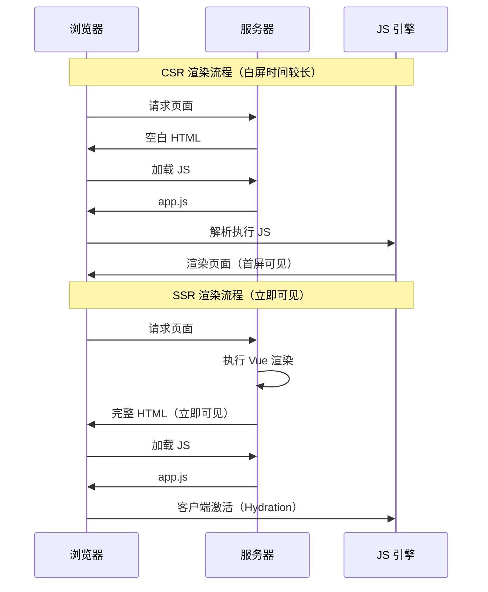
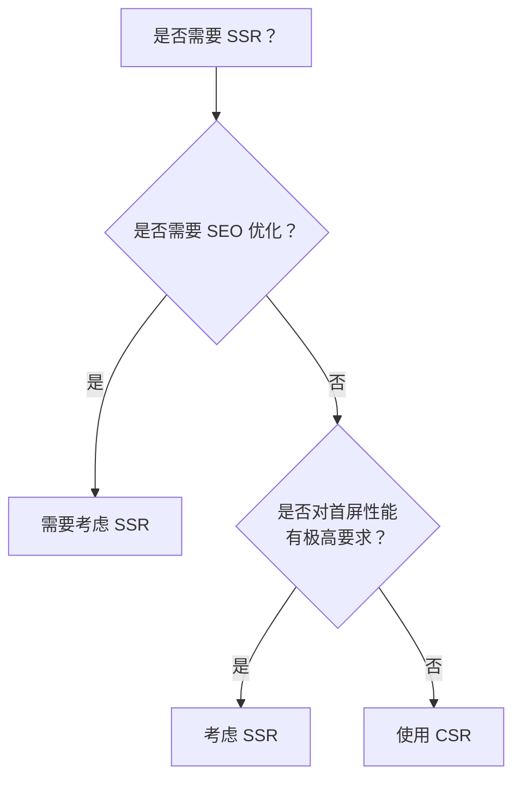
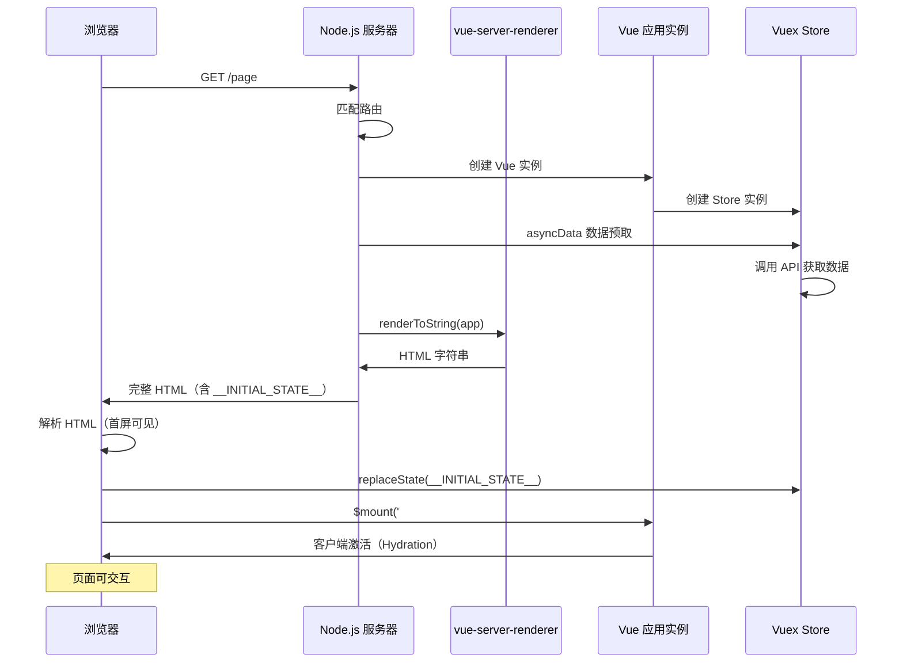

# Vue SSR

> 服务端渲染（Server-Side Rendering）是一种在服务器端生成完整 HTML 页面的技术，能够显著提升首屏加载性能和 SEO 效果。

## 概述

### 什么是 SSR

服务端渲染（SSR）是指在服务器端将 Vue 组件渲染为 HTML 字符串，直接发送给浏览器，浏览器接收到的是完整的 HTML 页面，而非空白的 HTML 加 JavaScript 脚本。

### CSR vs SSR 对比

| 特性 | CSR (客户端渲染) | SSR (服务端渲染) |
|------|-----------------|-----------------|
| 首屏渲染速度 | 较慢（需加载 JS 后渲染） | 快（服务器返回完整 HTML） |
| SEO 友好度 | 较差（爬虫难以解析 JS） | 好（直接获取 HTML 内容） |
| 服务器负载 | 低（静态资源服务器即可） | 高（需执行渲染逻辑） |
| 开发复杂度 | 低 | 高（需处理服务端环境） |
| 页面切换体验 | 流畅（无需刷新） | 需额外处理（客户端路由） |
| 适用场景 | 后台管理、内部系统 | 内容网站、电商平台 |

### 渲染流程对比



## 为什么需要 SSR

### 1. SEO 优化

搜索引擎爬虫在抓取页面时，往往不会执行 JavaScript。对于 CSR 应用，爬虫只能获取到空白的 HTML，导致内容无法被索引。SSR 直接返回渲染后的 HTML，确保内容可被搜索引擎识别。

```javascript
// CSR 返回的 HTML
<!DOCTYPE html>
<html>
  <head><title>App</title></head>
  <body>
    <div id="app"></div>
    <script src="app.js"></script>
  </body>
</html>

// SSR 返回的 HTML
<!DOCTYPE html>
<html>
  <head><title>商品详情 - 我的商城</title></head>
  <body>
    <div id="app">
      <div class="product">
        <h1>iPhone 15 Pro</h1>
        <p class="price">¥8999</p>
        <p class="desc">最新款智能手机...</p>
      </div>
    </div>
    <script src="app.js"></script>
  </body>
</html>
```

### 2. 首屏性能提升

SSR 可以显著减少首屏渲染时间：

- **FCP (First Contentful Paint)**: 用户首次看到内容的时间
- **LCP (Largest Contentful Paint)**: 最大内容元素渲染时间
- **TTI (Time to Interactive)**: 页面可交互时间

```mermaid
gantt
    title CSR vs SSR 时间线
    dateFormat s
    axisFormat %S s

    section CSR
    网络请求     :0, 1s
    JS 解析执行  :1, 2s
    渲染         :2, 3s
    首屏可见     :milestone, 3, 0

    section SSR
    网络请求     :0, 0.5s
    首屏可见     :milestone, 0.5, 0
    JS 加载      :0.5, 1.5s
    客户端激活   :1.5, 2s
    可交互       :milestone, 2, 0
```



### 3. 社交媒体分享

社交媒体（微信、微博等）的分享预览需要读取页面的 meta 标签，SSR 可以动态生成这些标签：

```html
<!-- 服务端动态生成的 meta 标签 -->
<head>
  <meta property="og:title" content="商品详情 - iPhone 15 Pro">
  <meta property="og:description" content="最新款智能手机，搭载A17芯片">
  <meta property="og:image" content="https://example.com/iphone15.jpg">
  <meta name="twitter:card" content="summary_large_image">
</head>
```

### 适用场景判断



## 基本原理

### SSR 生命周期



### 核心概念

Vue SSR 的核心是 `vue-server-renderer` 包提供的 `createRenderer` 方法：

```javascript
// 服务端渲染核心 API
const Vue = require('vue')
const { createRenderer } = require('vue-server-renderer')

// 创建 Vue 实例
const app = new Vue({
  data: {
    message: 'Hello SSR'
  },
  template: '<div>{{ message }}</div>'
})

// 创建渲染器
const renderer = createRenderer()

// 将 Vue 实例渲染为 HTML 字符串
renderer.renderToString(app, (err, html) => {
  if (err) throw err
  console.log(html)
  // 输出: <div data-server-rendered="true">Hello SSR</div>
})
```

### 服务端与客户端代码编写

SSR 应用需要编写两份入口文件：

#### 服务端入口 (entry-server.js)

```javascript
import { createApp } from './app'

export default context => {
  // 返回 Promise，支持异步数据预取
  return new Promise((resolve, reject) => {
    const { app, router, store } = createApp()

    // 设置服务器端 router 的位置
    router.push(context.url)

    // 等待 router 解析可能的异步组件
    router.onReady(() => {
      const matchedComponents = router.getMatchedComponents()

      // 匹配不到路由，返回 404
      if (!matchedComponents.length) {
        return reject({ code: 404 })
      }

      // 对所有匹配的路由组件调用 `asyncData`
      Promise.all(matchedComponents.map(Component => {
        if (Component.asyncData) {
          return Component.asyncData({
            store,
            route: router.currentRoute
          })
        }
      })).then(() => {
        // 将状态挂载到 context，供客户端使用
        context.state = store.state
        resolve(app)
      }).catch(reject)
    }, reject)
  })
}
```

#### 客户端入口 (entry-client.js)

```javascript
import { createApp } from './app'

const { app, router, store } = createApp()

// 恢复服务端状态
if (window.__INITIAL_STATE__) {
  store.replaceState(window.__INITIAL_STATE__)
}

router.onReady(() => {
  // 挂载应用，进行客户端激活
  app.$mount('#app')
})
```

#### 通用应用工厂 (app.js)

```javascript
import Vue from 'vue'
import App from './App.vue'
import { createRouter } from './router'
import { createStore } from './store'

Vue.config.productionTip = false

export function createApp () {
  // 创建 router 和 store 实例
  const router = createRouter()
  const store = createStore()

  // 创建应用程序实例
  const app = new Vue({
    router,
    store,
    render: h => h(App)
  })

  return { app, router, store }
}
```

### 数据预取与状态同步

SSR 的关键挑战是数据预取。服务端需要在渲染前获取数据：

```javascript
// 组件定义
export default {
  name: 'ProductDetail',
  asyncData({ store, route }) {
    // 服务端渲染前调用，获取数据
    return store.dispatch('fetchProduct', route.params.id)
  },
  computed: {
    product() {
      return this.$store.state.product
    }
  }
}

// store 定义
export function createStore() {
  return new Vuex.Store({
    state: {
      product: null
    },
    actions: {
      async fetchProduct({ commit }, id) {
        const res = await fetch(`/api/products/${id}`)
        const product = await res.json()
        commit('SET_PRODUCT', product)
      }
    },
    mutations: {
      SET_PRODUCT(state, product) {
        state.product = product
      }
    }
  })
}
```

服务端将状态注入到 HTML：

```javascript
// 服务端渲染时
context.state = store.state

// 生成的 HTML 中包含
<script>
  window.__INITIAL_STATE__ = {
    "product": { "id": 1, "name": "iPhone 15", "price": 8999 }
  }
</script>
```

### 客户端激活 (Hydration)

客户端激活是指 Vue 在浏览器端接管服务端渲染的 HTML，使其成为动态的、可交互的应用：

```javascript
// 客户端激活
app.$mount('#app')

// 注意：不要使用模板语法
// ❌ 错误：会覆盖已有内容
new Vue({
  template: '<div id="app">...</div>'
}).$mount('#app')

// ✅ 正确：激活已有内容
new Vue({
  render: h => h(App)
}).$mount('#app')
```

激活时会进行对比：

```javascript
// 如果服务端和客户端渲染结果不一致，会有警告
// [Vue warn]: The client-side rendered virtual DOM tree is not matching
// server-rendered content.
```

## Nuxt.js

### 简介

Nuxt.js 是基于 Vue.js 的通用应用框架，简化了 SSR 应用的开发：

- **自动路由生成**：基于文件结构自动生成路由配置
- **数据预取**：支持 asyncData 和 fetch 方法
- **静态生成**：支持生成静态站点（SSG）
- **模块系统**：丰富的插件和模块生态

### 项目结构

```
nuxt-project/
├── assets/              # 需要编译的资源文件
├── components/          # Vue 组件
├── layouts/             # 布局组件
│   └── default.vue
├── pages/               # 路由页面（自动生成路由）
│   ├── index.vue
│   ├── products/
│   │   ├── index.vue
│   │   └── _id.vue      # 动态路由
│   └── user/
│       └── _id.vue
├── plugins/             # 插件
├── static/              # 静态文件
├── store/               # Vuex 状态管理
│   └── index.js
├── nuxt.config.js       # Nuxt 配置文件
└── package.json
```

### 安装与配置

```bash
# 创建项目
npx create-nuxt-app my-ssr-app

# 或使用 yarn
yarn create nuxt-app my-ssr-app
```

### nuxt.config.js 配置详解

```javascript
export default {
  // 目标：server (SSR) 或 static (SSG)
  target: 'server',

  // 页面头部配置
  head: {
    title: '我的应用',
    meta: [
      { charset: 'utf-8' },
      { name: 'viewport', content: 'width=device-width, initial-scale=1' },
      { hid: 'description', name: 'description', content: '应用描述' }
    ],
    link: [
      { rel: 'icon', type: 'image/x-icon', href: '/favicon.ico' }
    ]
  },

  // 全局 CSS
  css: [
    'element-ui/lib/theme-chalk/index.css',
    '@/assets/main.css'
  ],

  // 插件配置
  plugins: [
    '@/plugins/element-ui',
    { src: '@/plugins/ga.js', mode: 'client' }  // 仅客户端
  ],

  // 组件自动导入
  components: true,

  // 模块
  modules: [
    '@nuxtjs/axios',
    '@nuxtjs/pwa'
  ],

  // Axios 配置
  axios: {
    baseURL: process.env.NODE_ENV === 'production'
      ? 'https://api.example.com'
      : 'http://localhost:3000/api'
  },

  // 构建配置
  build: {
    transpile: [/^element-ui/],
    extend(config, { isClient }) {
      // 扩展 webpack 配置
    }
  },

  // 环境变量
  env: {
    apiUrl: process.env.API_URL || 'https://api.example.com'
  }
}
```

### 页面与路由

Nuxt.js 基于文件系统自动生成路由：

```
pages/
├── index.vue              → /
├── about.vue              → /about
├── products/
│   ├── index.vue          → /products
│   └── _id.vue            → /products/:id
└── user/
    └── _id.vue            → /user/:id
```

#### 页面组件

```vue
<template>
  <div class="product">
    <h1>{{ product.name }}</h1>
    <p class="price">¥{{ product.price }}</p>
  </div>
</template>

<script>
export default {
  // 页面配置
  name: 'ProductDetail',

  // 页面特定头部
  head() {
    return {
      title: this.product.name,
      meta: [
        { hid: 'description', name: 'description', content: this.product.description }
      ]
    }
  },

  // 服务端数据预取
  async asyncData({ params, $axios, error }) {
    try {
      const product = await $axios.$get(`/products/${params.id}`)
      return { product }
    } catch (e) {
      error({ statusCode: 404, message: '商品不存在' })
    }
  },

  // 或使用 fetch（可在客户端导航时调用）
  async fetch({ store, params }) {
    await store.dispatch('products/fetchProduct', params.id)
  },

  data() {
    return {
      product: null
    }
  }
}
</script>
```

#### asyncData vs fetch

| 特性 | asyncData | fetch |
|------|-----------|-------|
| 调用时机 | 服务端渲染/路由更新前 | 服务端渲染/路由更新前/客户端 |
| 返回值处理 | 合并到 data | 提交到 store |
| 使用场景 | 页面级别数据 | 组件级别数据 |
| 错误处理 | 使用 error 方法 | 使用 $fetchState.error |

```vue
<template>
  <div>
    <!-- fetch 状态处理 -->
    <div v-if="$fetchState.pending">加载中...</div>
    <div v-else-if="$fetchState.error">加载失败</div>
    <div v-else>
      {{ product.name }}
    </div>
  </div>
</template>

<script>
export default {
  data() {
    return {
      product: {}
    }
  },
  async fetch() {
    this.product = await this.$axios.$get('/api/product/1')
  },
  // 手动刷新数据
  methods: {
    refresh() {
      this.$fetch()
    }
  }
}
</script>
```

### 布局系统

#### 默认布局 (layouts/default.vue)

```vue
<template>
  <div class="app">
    <header>
      <nav>
        <nuxt-link to="/">首页</nuxt-link>
        <nuxt-link to="/products">商品</nuxt-link>
      </nav>
    </header>
    
    <main>
      <nuxt />  <!-- 页面内容渲染位置 -->
    </main>
    
    <footer>
      <p>© 2024 我的应用</p>
    </footer>
  </div>
</template>
```

#### 自定义布局

```vue
<!-- layouts/blog.vue -->
<template>
  <div class="blog-layout">
    <aside>
      <blog-sidebar />
    </aside>
    <article>
      <nuxt />
    </article>
  </div>
</template>
```

```vue
<!-- pages/blog/_slug.vue -->
<template>
  <article>{{ content }}</article>
</template>

<script>
export default {
  layout: 'blog'  // 指定使用 blog 布局
}
</script>
```

#### 错误页面 (layouts/error.vue)

```vue
<template>
  <div class="error-page">
    <h1 v-if="error.statusCode === 404">页面不存在</h1>
    <h1 v-else>发生错误</h1>
    <p>{{ error.message }}</p>
    <nuxt-link to="/">返回首页</nuxt-link>
  </div>
</template>

<script>
export default {
  props: ['error'],
  layout: 'error'  // 可指定为简化布局
}
</script>
```

### 插件系统

#### 自定义插件

```javascript
// plugins/i18n.js
import Vue from 'vue'

export default ({ app }, inject) => {
  // 注入到 Vue 实例
  inject('i18n', {
    t(key) {
      return translations[key] || key
    }
  })
}

// 使用
// this.$i18n.t('hello')
```

#### 第三方库集成

```javascript
// plugins/element-ui.js
import Vue from 'vue'
import { Button, Select, Table } from 'element-ui'

Vue.use(Button)
Vue.use(Select)
Vue.use(Table)
```

### 中间件

```javascript
// middleware/auth.js
export default function ({ store, redirect }) {
  // 如果用户未认证
  if (!store.state.authenticated) {
    return redirect('/login')
  }
}

// 在页面中使用
export default {
  middleware: 'auth'
}
```

### 静态生成 (SSG)

```bash
# 生成静态站点
npm run generate
```

```javascript
// nuxt.config.js
export default {
  target: 'static',
  generate: {
    // 动态路由预渲染
    async routes() {
      const products = await axios.get('/api/products')
      return products.data.map(product => `/products/${product.id}`)
    },
    // 排除路由
    exclude: [
      /^\/admin/  // 排除 admin 路由
    ]
  }
}
```

## 最佳实践

### 1. 避免内存泄漏

```javascript
// ❌ 错误：在模块级别创建实例
// const app = new Vue({ ... })

// ✅ 正确：在函数中创建实例
export function createApp() {
  return new Vue({ ... })
}
```

### 2. 避免单例状态

```javascript
// ❌ 错误：模块级别的状态会被所有请求共享
const store = new Vuex.Store({ ... })

// ✅ 正确：每次请求创建新的 store
export function createStore() {
  return new Vuex.Store({ ... })
}
```

### 3. 处理平台特定代码

```javascript
// 使用 process.client / process.server
if (process.client) {
  // 仅在客户端执行
  window.addEventListener('resize', this.handleResize)
}

// 使用 ClientOnly 组件 (Nuxt.js)
<client-only>
  <browser-specific-component />
</client-only>
```

### 4. 优化首屏加载

```javascript
// 组件懒加载
components: {
  HeavyComponent: () => import('~/components/HeavyComponent')
}

// 路由懒加载
{
  path: '/admin',
  component: () => import('~/pages/admin.vue')
}
```

### 5. 合理的缓存策略

```javascript
// 页面级缓存（适合内容不频繁变化的页面）
const cache = {}

export default {
  async asyncData({ params }) {
    const cacheKey = `product-${params.id}`
    
    if (cache[cacheKey]) {
      return cache[cacheKey]
    }
    
    const data = await fetchProduct(params.id)
    cache[cacheKey] = data
    
    // 设置过期时间
    setTimeout(() => {
      delete cache[cacheKey]
    }, 5 * 60 * 1000) // 5分钟
    
    return data
  }
}
```

### 6. SEO 优化清单

- [ ] 为每个页面设置合适的 `title` 和 `meta` 标签
- [ ] 使用语义化的 HTML 标签
- [ ] 添加 `sitemap.xml`
- [ ] 配置 `robots.txt`
- [ ] 实现 Open Graph 和 Twitter Card 标签
- [ ] 确保关键内容在服务端渲染

## 常见问题

### Q1: SSR 应用中如何使用 window/document？

```javascript
// 方法一：条件判断
if (process.client) {
  console.log(window.location.href)
}

// 方法二：生命周期钩子
mounted() {
  // mounted 只在客户端执行
  console.log(window.innerWidth)
}

// 方法三：ClientOnly 组件 (Nuxt.js)
<client-only>
  <div>{{ new Date() }}</div>
</client-only>
```

### Q2: 为什么会出现 Hydration 不匹配？

```javascript
// 原因：服务端和客户端渲染结果不一致
// 常见情况：

// ❌ 使用了客户端特有的数据
<div>{{ Date.now() }}</div>

// ❌ 使用了 Math.random()
<div>{{ Math.random() }}</div>

// ✅ 解决方案：使用 ClientOnly 或在 mounted 中赋值
<client-only>
  <div>{{ clientOnlyData }}</div>
</client-only>
```

### Q3: 如何处理第三方库的 SSR 兼容性问题？

```javascript
// 在 nuxt.config.js 中配置
export default {
  build: {
    extend(config, { isServer }) {
      if (isServer) {
        // 在服务端忽略某些库
        config.externals = ['some-library']
      }
    }
  },
  plugins: [
    // 仅在客户端加载
    { src: '~/plugins/window-library.js', mode: 'client' }
  ]
}
```

### Q4: 如何调试 SSR 应用？

```bash
# 开启调试模式
DEBUG=nuxt:* npm run dev
```

```javascript
// nuxt.config.js — 渲染相关配置
export default {
  render: {
    resourceHints: false,
    http2: {
      push: true
    }
  }
}
```

## 参考资料

- [Vue SSR 官方文档](https://v2.cn.vuejs.org/v2/guide/ssr.html)
- [Nuxt.js 官方文档](https://nuxtjs.org/)
- [Vue Server Renderer API](https://v2.cn.vuejs.org/v2/api/#服务端渲染)
