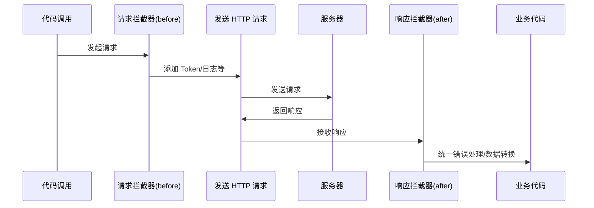

# axios 集成

> Axios 是一个基于 Promise 的 HTTP 客户端，适用于浏览器和 Node.js 环境，是 Vue 项目中最常用的 HTTP 请求库。

## 概述

### 什么是 axios

axios 是一个流行的 HTTP 请求库，具有以下特点：

| 特性 | 描述 |
|------|------|
| Promise API | 支持 Promise，便于异步处理 |
| 请求/响应拦截 | 可在请求发出前和响应返回后进行处理 |
| 数据转换 | 自动转换 JSON 数据 |
| 取消请求 | 支持取消已发出的请求 |
| 客户端防护 | 防止 XSRF 攻击 |
| 双端支持 | 同时支持浏览器和 Node.js |

### axios vs fetch 对比

```javascript
// fetch
fetch('/api/user', {
  method: 'POST',
  headers: {
    'Content-Type': 'application/json'
  },
  body: JSON.stringify({ name: 'test' })
})
  .then(res => res.json())  // 需要手动转换
  .then(data => console.log(data))
  .catch(err => console.error(err))

// axios
axios.post('/api/user', { name: 'test' })  // 自动转换 JSON
  .then(res => console.log(res.data))
  .catch(err => console.error(err))
```

| 对比项 | axios | fetch |
|-------|-------|-------|
| 响应数据处理 | 自动 JSON 转换 | 需手动调用 .json() |
| 错误处理 | 非 2xx 状态码视为错误 | 需手动检查 response.ok |
| 请求超时 | 支持超时设置 | 需配合 AbortController |
| 请求取消 | 支持 CancelToken | 支持 AbortController |
| 拦截器 | 内置支持 | 需自行实现 |
| 体积 | 较大 (~13KB) | 原生支持，无体积 |

## 安装与配置

### 安装

```bash
# npm
npm install axios

# yarn
yarn add axios

# pnpm
pnpm add axios
```

### 基本使用

```javascript
import axios from 'axios'

// GET 请求
axios.get('/api/users')
  .then(response => {
    console.log(response.data)
  })

// POST 请求
axios.post('/api/users', {
  name: 'John',
  email: 'john@example.com'
})
  .then(response => {
    console.log(response.data)
  })

// 使用 async/await
async function fetchUsers() {
  try {
    const response = await axios.get('/api/users')
    return response.data
  } catch (error) {
    console.error(error)
    throw error
  }
}
```

### 响应结构

```javascript
axios.get('/api/user').then(response => {
  // response 包含以下属性
  console.log(response.data)     // 服务器返回的数据
  console.log(response.status)   // HTTP 状态码 (200, 404 等)
  console.log(response.statusText) // 状态文本 ('OK')
  console.log(response.headers)  // 响应头
  console.log(response.config)   // 请求配置
})
```

## 请求封装

### 创建 axios 实例

```javascript
// utils/request.js
import axios from 'axios'

// 创建 axios 实例
const service = axios.create({
  baseURL: process.env.VUE_APP_BASE_API,  // 基础 URL
  timeout: 10000,                          // 请求超时时间
  headers: {
    'Content-Type': 'application/json'
  }
})

export default service
```

### 完整封装示例

```javascript
// utils/request.js
import axios from 'axios'
import { Message } from 'element-ui'
import store from '@/store'
import router from '@/router'

// 创建 axios 实例
const service = axios.create({
  baseURL: process.env.VUE_APP_BASE_API || '/api',
  timeout: 15000,
  withCredentials: false
})

/**
 * 请求拦截器
 */
service.interceptors.request.use(
  config => {
    // 在请求发出前进行处理
    
    // 1. 添加 token
    const token = store.getters.token
    if (token) {
      config.headers['Authorization'] = `Bearer ${token}`
    }
    
    // 2. 添加请求 ID（用于追踪）
    config.headers['X-Request-ID'] = generateUUID()
    
    // 3. 处理 GET 请求的缓存问题
    if (config.method === 'get') {
      config.params = {
        ...config.params,
        _t: Date.now()  // 添加时间戳防止缓存
      }
    }
    
    return config
  },
  error => {
    console.error('请求错误：', error)
    return Promise.reject(error)
  }
)

/**
 * 响应拦截器
 */
service.interceptors.response.use(
  response => {
    const res = response.data
    
    // 根据业务状态码处理
    if (res.code !== 200) {
      Message({
        message: res.message || '请求失败',
        type: 'error',
        duration: 5000
      })
      
      // 特定错误码处理
      if (res.code === 401) {
        // Token 过期，重新登录
        store.dispatch('user/logout')
        router.push('/login')
      }
      
      return Promise.reject(new Error(res.message || 'Error'))
    }
    
    return res
  },
  error => {
    console.error('响应错误：', error)
    
    let message = '请求失败'
    
    if (error.response) {
      // 服务器返回了错误响应
      const status = error.response.status
      const errorMessages = {
        400: '请求参数错误',
        401: '未授权，请重新登录',
        403: '拒绝访问',
        404: '请求资源不存在',
        405: '请求方法不允许',
        408: '请求超时',
        500: '服务器内部错误',
        501: '服务未实现',
        502: '网关错误',
        503: '服务不可用',
        504: '网关超时',
        505: 'HTTP版本不受支持'
      }
      message = errorMessages[status] || `服务器错误 (${status})`
    } else if (error.request) {
      // 请求已发出但没有收到响应
      if (error.code === 'ECONNABORTED') {
        message = '请求超时，请检查网络'
      } else {
        message = '网络错误，请检查网络连接'
      }
    } else {
      // 请求配置出错
      message = error.message
    }
    
    Message({
      message,
      type: 'error',
      duration: 5000
    })
    
    return Promise.reject(error)
  }
)

/**
 * 生成 UUID
 */
function generateUUID() {
  return 'xxxxxxxx-xxxx-4xxx-yxxx-xxxxxxxxxxxx'.replace(/[xy]/g, c => {
    const r = Math.random() * 16 | 0
    const v = c === 'x' ? r : (r & 0x3 | 0x8)
    return v.toString(16)
  })
}

export default service
```

### API 模块化组织

```javascript
// api/user.js
import request from '@/utils/request'

/**
 * 用户相关 API
 */
export function login(data) {
  return request({
    url: '/auth/login',
    method: 'post',
    data
  })
}

export function logout() {
  return request({
    url: '/auth/logout',
    method: 'post'
  })
}

export function getUserInfo() {
  return request({
    url: '/user/info',
    method: 'get'
  })
}

export function updateUserInfo(data) {
  return request({
    url: '/user/info',
    method: 'put',
    data
  })
}

// api/product.js
import request from '@/utils/request'

/**
 * 商品相关 API
 */
export function getProductList(params) {
  return request({
    url: '/products',
    method: 'get',
    params
  })
}

export function getProductDetail(id) {
  return request({
    url: `/products/${id}`,
    method: 'get'
  })
}

export function createProduct(data) {
  return request({
    url: '/products',
    method: 'post',
    data
  })
}

export function updateProduct(id, data) {
  return request({
    url: `/products/${id}`,
    method: 'put',
    data
  })
}

export function deleteProduct(id) {
  return request({
    url: `/products/${id}`,
    method: 'delete'
  })
}
```

### 统一导出

```javascript
// api/index.js
import * as user from './user'
import * as product from './product'

export {
  user,
  product
}

// 使用
import { user, product } from '@/api'

// 调用
await user.login({ username, password })
await product.getProductList({ page: 1, size: 10 })
```

## 拦截器

### 拦截器原理图



### 请求拦截器应用场景

```javascript
// 1. 添加认证信息
service.interceptors.request.use(config => {
  const token = localStorage.getItem('token')
  if (token) {
    config.headers.Authorization = `Bearer ${token}`
  }
  return config
})

// 2. 添加请求日志（开发环境）
if (process.env.NODE_ENV === 'development') {
  service.interceptors.request.use(config => {
    console.log(`[Request] ${config.method?.toUpperCase()} ${config.url}`, config)
    return config
  })
}

// 3. 请求重试机制
service.interceptors.request.use(config => {
  config.__retryCount = config.__retryCount || 0
  config.__retryDelay = config.__retryDelay || 1000
  return config
})

// 4. 加载状态管理
let loadingInstance = null
let requestCount = 0

service.interceptors.request.use(config => {
  if (config.showLoading !== false) {
    requestCount++
    if (requestCount === 1) {
      loadingInstance = Loading.service({ fullscreen: true })
    }
  }
  return config
})
```

### 响应拦截器应用场景

```javascript
// 1. 统一错误处理
service.interceptors.response.use(
  response => response.data,
  error => {
    const { response } = error
    if (response?.status === 401) {
      // 处理未授权
    }
    return Promise.reject(error)
  }
)

// 2. 响应数据解构
service.interceptors.response.use(response => {
  // 统一返回 data 部分
  return response.data.data
})

// 3. 关闭加载状态
service.interceptors.response.use(
  response => {
    requestCount--
    if (requestCount <= 0) {
      loadingInstance?.close()
    }
    return response
  },
  error => {
    requestCount--
    if (requestCount <= 0) {
      loadingInstance?.close()
    }
    return Promise.reject(error)
  }
)
```

### 多个拦截器的执行顺序

```javascript
// 添加多个拦截器
service.interceptors.request.use(config => {
  console.log('拦截器 1 - 请求前')
  return config
})

service.interceptors.request.use(config => {
  console.log('拦截器 2 - 请求前')
  return config
})

// 执行顺序: 拦截器 1 → 拦截器 2 → 发送请求

service.interceptors.response.use(response => {
  console.log('拦截器 A - 响应后')
  return response
})

service.interceptors.response.use(response => {
  console.log('拦截器 B - 响应后')
  return response
})

// 执行顺序: 收到响应 → 拦截器 A → 拦截器 B
```

## 错误处理

### 错误类型分类

```javascript
// 错误处理工具类
class RequestError extends Error {
  constructor(message, code, data) {
    super(message)
    this.name = 'RequestError'
    this.code = code
    this.data = data
  }
}

// 错误处理器
const errorHandler = {
  // 网络错误
  handleNetworkError(error) {
    if (!window.navigator.onLine) {
      return new RequestError('网络连接已断开', 'NETWORK_OFFLINE')
    }
    return new RequestError('网络请求失败，请检查网络设置', 'NETWORK_ERROR')
  },

  // 超时错误
  handleTimeoutError(error) {
    return new RequestError('请求超时，请稍后重试', 'TIMEOUT')
  },

  // HTTP 状态码错误
  handleHttpError(error) {
    const status = error.response?.status
    const errorMap = {
      400: '请求参数错误',
      401: '登录已过期，请重新登录',
      403: '没有权限访问该资源',
      404: '请求的资源不存在',
      500: '服务器内部错误',
      502: '网关错误',
      503: '服务暂时不可用'
    }
    return new RequestError(
      errorMap[status] || `服务器错误 (${status})`,
      `HTTP_${status}`,
      error.response?.data
    )
  },

  // 业务错误
  handleBusinessError(response) {
    return new RequestError(
      response.message || '操作失败',
      response.code,
      response.data
    )
  }
}

// 在响应拦截器中使用
service.interceptors.response.use(
  response => {
    const { data } = response
    
    // 业务状态码判断
    if (data.code !== 0 && data.code !== 200) {
      return Promise.reject(errorHandler.handleBusinessError(data))
    }
    
    return data
  },
  error => {
    let requestError
    
    if (error.code === 'ECONNABORTED') {
      requestError = errorHandler.handleTimeoutError(error)
    } else if (!error.response) {
      requestError = errorHandler.handleNetworkError(error)
    } else {
      requestError = errorHandler.handleHttpError(error)
    }
    
    // 统一错误提示
    Message.error(requestError.message)
    
    return Promise.reject(requestError)
  }
)
```

### 请求重试机制

```javascript
/**
 * 带重试功能的请求封装
 */
async function requestWithRetry(config, retries = 3, delay = 1000) {
  try {
    return await service(config)
  } catch (error) {
    // 判断是否需要重试
    const shouldRetry = 
      retries > 0 &&
      !error.response &&  // 非服务器错误
      error.code !== 'ECONNABORTED'  // 非超时错误
    
    if (shouldRetry) {
      console.log(`请求失败，${delay}ms 后重试，剩余重试次数: ${retries}`)
      await new Promise(resolve => setTimeout(resolve, delay))
      return requestWithRetry(config, retries - 1, delay * 2)  // 指数退避
    }
    
    throw error
  }
}

// 使用
requestWithRetry({
  url: '/api/data',
  method: 'get'
}, 3, 1000)
```

### 请求取消

```javascript
// 方法一：CancelToken（已废弃但仍可用）
const CancelToken = axios.CancelToken
const source = CancelToken.source()

axios.get('/api/data', {
  cancelToken: source.token
}).catch(thrown => {
  if (axios.isCancel(thrown)) {
    console.log('请求已取消:', thrown.message)
  }
})

// 取消请求
source.cancel('用户取消了请求')

// 方法二：AbortController（推荐）
const controller = new AbortController()

axios.get('/api/data', {
  signal: controller.signal
}).catch(error => {
  if (error.name === 'AbortError') {
    console.log('请求已取消')
  }
})

// 取消请求
controller.abort()

// 实际应用：搜索防抖取消
let searchController = null

async function searchProducts(keyword) {
  // 取消上一次请求
  if (searchController) {
    searchController.abort()
  }
  
  searchController = new AbortController()
  
  try {
    const result = await axios.get('/api/search', {
      params: { keyword },
      signal: searchController.signal
    })
    return result.data
  } finally {
    searchController = null
  }
}
```

### 错误边界处理

```vue
<!-- 组件级别错误处理 -->
<template>
  <div>
    <div v-if="error" class="error-container">
      <p>{{ error.message }}</p>
      <el-button @click="retry">重试</el-button>
    </div>
    <slot v-else :data="data" :loading="loading" />
  </div>
</template>

<script>
export default {
  name: 'AsyncDataWrapper',
  props: {
    fetchFn: {
      type: Function,
      required: true
    }
  },
  data() {
    return {
      loading: false,
      error: null,
      data: null
    }
  },
  async created() {
    await this.fetchData()
  },
  methods: {
    async fetchData() {
      this.loading = true
      this.error = null
      try {
        this.data = await this.fetchFn()
      } catch (err) {
        this.error = err
      } finally {
        this.loading = false
      }
    },
    retry() {
      this.fetchData()
    }
  }
}
</script>

<!-- 使用 -->
<async-data-wrapper :fetchFn="fetchProducts" v-slot="{ data, loading }">
  <div v-loading="loading">
    <product-list :products="data" />
  </div>
</async-data-wrapper>
```

## 与 Vuex 集成

### 在 Vuex Action 中使用

```javascript
// store/modules/user.js
import { login, logout, getUserInfo } from '@/api/user'

const state = {
  token: localStorage.getItem('token') || '',
  userInfo: null
}

const mutations = {
  SET_TOKEN(state, token) {
    state.token = token
    localStorage.setItem('token', token)
  },
  SET_USER_INFO(state, info) {
    state.userInfo = info
  },
  CLEAR_USER(state) {
    state.token = ''
    state.userInfo = null
    localStorage.removeItem('token')
  }
}

const actions = {
  // 登录
  async login({ commit }, userInfo) {
    try {
      const { token } = await login(userInfo)
      commit('SET_TOKEN', token)
      return token
    } catch (error) {
      commit('CLEAR_USER')
      throw error
    }
  },

  // 获取用户信息
  async getUserInfo({ commit }) {
    const info = await getUserInfo()
    commit('SET_USER_INFO', info)
    return info
  },

  // 登出
  async logout({ commit }) {
    try {
      await logout()
    } finally {
      commit('CLEAR_USER')
    }
  }
}

export default {
  namespaced: true,
  state,
  mutations,
  actions
}
```

### 组件中使用

```vue
<template>
  <div>
    <div v-if="loading">加载中...</div>
    <div v-else-if="error">
      {{ error }}
      <button @click="fetchData">重试</button>
    </div>
    <div v-else>
      {{ userInfo.name }}
    </div>
  </div>
</template>

<script>
import { mapState, mapActions } from 'vuex'

export default {
  data() {
    return {
      loading: false,
      error: null
    }
  },
  computed: {
    ...mapState('user', ['userInfo'])
  },
  async created() {
    await this.fetchData()
  },
  methods: {
    ...mapActions('user', ['getUserInfo']),
    async fetchData() {
      this.loading = true
      this.error = null
      try {
        await this.getUserInfo()
      } catch (err) {
        this.error = err.message
      } finally {
        this.loading = false
      }
    }
  }
}
</script>
```

### 请求状态管理

```javascript
// store/modules/request.js
const state = {
  pending: {},    // 进行中的请求
  error: {}       // 请求错误
}

const mutations = {
  REQUEST_START(state, key) {
    state.pending = { ...state.pending, [key]: true }
    state.error = { ...state.error, [key]: null }
  },
  REQUEST_END(state, key) {
    state.pending = { ...state.pending, [key]: false }
  },
  REQUEST_ERROR(state, { key, error }) {
    state.error = { ...state.error, [key]: error }
    state.pending = { ...state.pending, [key]: false }
  }
}

const getters = {
  isLoading: state => key => state.pending[key] || false,
  hasError: state => key => !!state.error[key],
  getError: state => key => state.error[key]
}

const actions = {
  async request({ commit }, { key, fn }) {
    commit('REQUEST_START', key)
    try {
      const result = await fn()
      commit('REQUEST_END', key)
      return result
    } catch (error) {
      commit('REQUEST_ERROR', { key, error })
      throw error
    }
  }
}

export default {
  namespaced: true,
  state,
  mutations,
  getters,
  actions
}

// 使用
this.$store.dispatch('request/request', {
  key: 'fetchProducts',
  fn: () => getProducts({ page: 1 })
})
```

## 最佳实践

### 1. 环境变量配置

```javascript
// .env.development
VUE_APP_BASE_API=http://localhost:3000/api
VUE_APP_UPLOAD_URL=http://localhost:3000/upload

// .env.production
VUE_APP_BASE_API=https://api.example.com
VUE_APP_UPLOAD_URL=https://cdn.example.com

// request.js
const service = axios.create({
  baseURL: process.env.VUE_APP_BASE_API,
  timeout: 10000
})
```

### 2. TypeScript 类型定义

```typescript
// types/api.ts
interface ApiResponse<T = any> {
  code: number
  message: string
  data: T
}

interface User {
  id: number
  name: string
  email: string
}

interface Product {
  id: number
  name: string
  price: number
}

// api/user.ts
import request from '@/utils/request'
import type { ApiResponse, User } from '@/types/api'

export function getUserInfo(): Promise<ApiResponse<User>> {
  return request.get('/user/info')
}

// 组件中使用
const { data } = await getUserInfo()
console.log(data.name)  // 有类型提示
```

### 3. 文件上传封装

```javascript
// api/upload.js
import request from '@/utils/request'

/**
 * 文件上传
 * @param {File} file - 文件对象
 * @param {Function} onProgress - 上传进度回调
 */
export function uploadFile(file, onProgress) {
  const formData = new FormData()
  formData.append('file', file)
  
  return request({
    url: '/upload',
    method: 'post',
    data: formData,
    headers: {
      'Content-Type': 'multipart/form-data'
    },
    onUploadProgress: progressEvent => {
      if (onProgress) {
        const percent = Math.round(
          (progressEvent.loaded * 100) / progressEvent.total
        )
        onProgress(percent)
      }
    }
  })
}

/**
 * 多文件上传
 */
export function uploadFiles(files, onProgress) {
  const formData = new FormData()
  files.forEach(file => {
    formData.append('files', file)
  })
  
  return request({
    url: '/upload/multiple',
    method: 'post',
    data: formData,
    headers: {
      'Content-Type': 'multipart/form-data'
    },
    onUploadProgress: progressEvent => {
      if (onProgress) {
        const percent = Math.round(
          (progressEvent.loaded * 100) / progressEvent.total
        )
        onProgress(percent)
      }
    }
  })
}

// 使用
async function handleUpload(event) {
  const file = event.target.files[0]
  try {
    const result = await uploadFile(file, percent => {
      console.log(`上传进度: ${percent}%`)
    })
    console.log('上传成功:', result.url)
  } catch (error) {
    console.error('上传失败:', error)
  }
}
```

### 4. 请求缓存

```javascript
// utils/cache.js
class RequestCache {
  constructor() {
    this.cache = new Map()
  }

  /**
   * 生成缓存 key
   */
  generateKey(config) {
    return `${config.method}:${config.url}:${JSON.stringify(config.params || config.data)}`
  }

  /**
   * 获取缓存
   */
  get(config) {
    const key = this.generateKey(config)
    const cached = this.cache.get(key)
    
    if (cached && Date.now() - cached.timestamp < cached.ttl) {
      return cached.data
    }
    
    this.cache.delete(key)
    return null
  }

  /**
   * 设置缓存
   */
  set(config, data, ttl = 5 * 60 * 1000) {
    const key = this.generateKey(config)
    this.cache.set(key, {
      data,
      timestamp: Date.now(),
      ttl
    })
  }

  /**
   * 清除缓存
   */
  clear(pattern) {
    if (pattern) {
      for (const key of this.cache.keys()) {
        if (key.includes(pattern)) {
          this.cache.delete(key)
        }
      }
    } else {
      this.cache.clear()
    }
  }
}

export const requestCache = new RequestCache()

// 在请求拦截器中使用
service.interceptors.request.use(config => {
  if (config.cache) {
    const cached = requestCache.get(config)
    if (cached) {
      // 使用缓存的适配器直接返回缓存数据
      config.adapter = () => Promise.resolve({
        data: cached,
        status: 200,
        statusText: 'OK (from cache)',
        headers: {},
        config
      })
    }
  }
  return config
})

// 在响应拦截器中缓存
service.interceptors.response.use(response => {
  const { config } = response
  if (config.cache && config.method === 'get') {
    requestCache.set(config, response.data, config.cacheTTL)
  }
  return response
})

// 使用
api.getProducts({ page: 1 }, { 
  cache: true, 
  cacheTTL: 60000  // 缓存 1 分钟
})
```

### 5. 请求并发控制

```javascript
// utils/concurrency.js
class ConcurrencyLimiter {
  constructor(maxConcurrent = 5) {
    this.maxConcurrent = maxConcurrent
    this.current = 0
    this.queue = []
  }

  async run(task) {
    if (this.current >= this.maxConcurrent) {
      await new Promise(resolve => this.queue.push(resolve))
    }

    this.current++
    try {
      return await task()
    } finally {
      this.current--
      const next = this.queue.shift()
      if (next) next()
    }
  }
}

export const limiter = new ConcurrencyLimiter(5)

// 使用
async function fetchAllProducts(ids) {
  const limiter = new ConcurrencyLimiter(3)  // 最多 3 个并发
  
  const results = await Promise.all(
    ids.map(id => limiter.run(() => getProductDetail(id)))
  )
  
  return results
}
```

### 6. 请求日志记录

```javascript
// 开发环境请求日志
if (process.env.NODE_ENV === 'development') {
  service.interceptors.request.use(config => {
    config.metadata = { startTime: Date.now() }  // 记录请求开始时间
    console.group(`%c ${config.method?.toUpperCase()} ${config.url}`, 'color: #4CAF50')
    console.log('请求参数:', config.params || config.data)
    console.log('请求头:', config.headers)
    console.groupEnd()
    return config
  })

  service.interceptors.response.use(response => {
    console.group(`%c 响应 ${response.config.url}`, 'color: #2196F3')
    console.log('响应数据:', response.data)
    console.log('耗时:', `${Date.now() - response.config.metadata?.startTime}ms`)
    console.groupEnd()
    return response
  })
}
```

## 常见问题

### Q1: 如何处理跨域问题？

```javascript
// 方法一：开发环境代理（vue.config.js）
module.exports = {
  devServer: {
    proxy: {
      '/api': {
        target: 'http://localhost:3000',
        changeOrigin: true,
        pathRewrite: {
          '^/api': ''  // 移除 /api 前缀
        }
      }
    }
  }
}

// 方法二：服务端 CORS
// 后端设置响应头
res.setHeader('Access-Control-Allow-Origin', '*')
res.setHeader('Access-Control-Allow-Methods', 'GET, POST, PUT, DELETE')
res.setHeader('Access-Control-Allow-Headers', 'Content-Type, Authorization')

// 方法三：axios 配置
const service = axios.create({
  withCredentials: true  // 跨域请求时携带 cookie
})
```

### Q2: 如何实现请求防抖？

```javascript
// utils/debounce.js
export function debounceRequest(fn, delay = 300) {
  let timer = null
  let lastReject = null

  return function (...args) {
    return new Promise((resolve, reject) => {
      // 取消上一次请求
      if (timer) {
        clearTimeout(timer)
        lastReject?.('请求已取消')
      }

      lastReject = reject
      timer = setTimeout(async () => {
        try {
          const result = await fn.apply(this, args)
          resolve(result)
        } catch (error) {
          reject(error)
        }
      }, delay)
    })
  }
}

// 使用
const debouncedSearch = debounceRequest(searchProducts, 300)

// 在组件中使用（Options API）
export default {
  watch: {
    searchText(text) {
      debouncedSearch(text)
        .then(result => { this.searchResults = result })
        .catch(error => {
          if (error !== '请求已取消') {
            console.error(error)
          }
        })
    }
  }
}
```

### Q3: 如何下载文件？

```javascript
/**
 * 文件下载
 */
export function downloadFile(url, filename) {
  return request({
    url,
    method: 'get',
    responseType: 'blob'  // 重要：设置响应类型
    // 注意：响应拦截器需对 responseType === 'blob' 的请求直接放行，否则会被业务状态码判断拦截
  }).then(response => {
    const blob = new Blob([response])
    const link = document.createElement('a')
    link.href = URL.createObjectURL(blob)
    link.download = filename
    link.click()
    URL.revokeObjectURL(link.href)
  })
}

/**
 * 带进度条的下载
 */
export function downloadWithProgress(url, filename, onProgress) {
  return axios({
    url,
    method: 'get',
    responseType: 'blob',
    onDownloadProgress: progressEvent => {
      if (onProgress) {
        const percent = Math.round(
          (progressEvent.loaded * 100) / progressEvent.total
        )
        onProgress(percent)
      }
    }
  }).then(response => {
    const blob = new Blob([response.data])
    const link = document.createElement('a')
    link.href = URL.createObjectURL(blob)
    link.download = filename
    link.click()
    URL.revokeObjectURL(link.href)
  })
}
```

### Q4: 如何处理大数据量请求？

```javascript
// 分页请求封装
async function fetchAllPages(fetchFn, pageSize = 100) {
  let allData = []
  let page = 1
  let hasMore = true

  while (hasMore) {
    const { data, total } = await fetchFn({ page, size: pageSize })
    allData = [...allData, ...data]
    
    if (allData.length >= total) {
      hasMore = false
    } else {
      page++
    }
  }

  return allData
}

// 使用
const allProducts = await fetchAllPages((params) => 
  api.getProducts(params)
)

// 批量请求封装
async function batchRequests(urls, batchSize = 5) {
  const results = []
  
  for (let i = 0; i < urls.length; i += batchSize) {
    const batch = urls.slice(i, i + batchSize)
    const batchResults = await Promise.all(
      batch.map(url => axios.get(url))
    )
    results.push(...batchResults.map(r => r.data))
  }
  
  return results
}
```

## 参考资料

- [Axios 官方文档](https://axios-http.com/)
- [Axios GitHub](https://github.com/axios/axios)
- [MDN - Fetch API](https://developer.mozilla.org/zh-CN/docs/Web/API/Fetch_API)
- [Vue 官方 - 数据获取](https://v2.cn.vuejs.org/v2/guide/ssr.html#数据预取存储容器-data-store)
