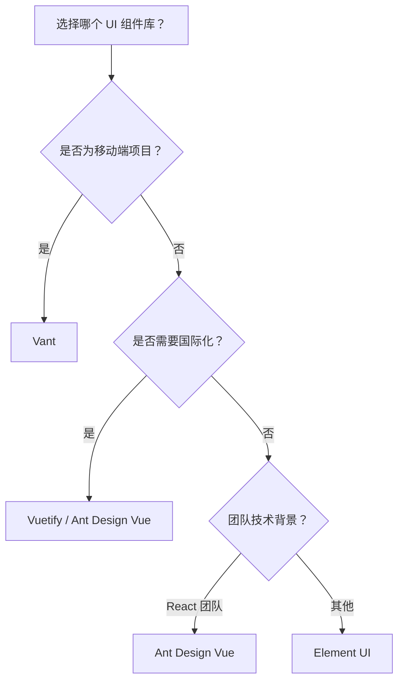
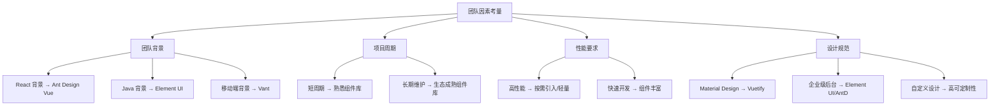

# UI 组件库

> Vue 生态系统中有丰富的 UI 组件库可供选择，合理选择和使用组件库能够大幅提升开发效率。

## 概述

### 主流 UI 组件库概览

| 组件库 | 维护方 | 设计风格 | 特点 | 适用场景 |
|--------|--------|----------|------|----------|
| Element UI | Element团队 | 阿里风格 | 功能全面、文档完善 | 企业后台、中后台系统 |
| Ant Design Vue | 蚂蚁金服 | 蚂蚁设计 | 企业级、国际化 | 企业应用、中后台 |
| Vant | 有赞 | 轻量移动端 | 移动端首选 | 移动端 H5、小程序 |
| Vuetify | Vuetify团队 | Material Design | 组件丰富 | 跨平台、国际化项目 |
| iView (View UI) | ViewUI团队 | 简洁现代 | 上手简单 | 各类 Vue 项目 |

### 选择决策树



## Element UI

### 简介

Element UI 是一套为开发者、设计师和产品经理准备的基于 Vue 2.0 的桌面端组件库，由饿了么前端团队开发、现由 Element 团队维护（Vue 2 已于 2023 年 12 月 31 日停止维护，Element UI 随之进入维护模式；Vue 3 项目请使用 Element Plus）。

**核心特点：**
- 🎨 一致的设计语言
- 📦 丰富的组件（60+）
- 🌐 完善的国际化支持
- 📱 响应式布局
- 🔧 灵活的主题定制

### 安装与配置

#### 安装

```bash
# npm
npm install element-ui

# yarn
yarn add element-ui

# pnpm
pnpm add element-ui
```

#### 完整引入

```javascript
// main.js
import Vue from 'vue'
import ElementUI from 'element-ui'
import 'element-ui/lib/theme-chalk/index.css'
import App from './App.vue'

Vue.use(ElementUI)

new Vue({
  render: h => h(App)
}).$mount('#app')
```

#### 按需引入（推荐）

```bash
# 安装 babel 插件
npm install babel-plugin-component -D
```

```javascript
// babel.config.js
module.exports = {
  presets: ['@vue/cli-plugin-babel/preset'],
  plugins: [
    [
      'component',
      {
        libraryName: 'element-ui',
        styleLibraryName: 'theme-chalk'
      }
    ]
  ]
}
```

```javascript
// main.js
import Vue from 'vue'
import {
  Button,
  Select,
  Table,
  TableColumn,
  Form,
  FormItem,
  Input,
  Message,
  MessageBox
} from 'element-ui'

// 注册组件
Vue.use(Button)
Vue.use(Select)
Vue.use(Table)
Vue.use(TableColumn)
Vue.use(Form)
Vue.use(FormItem)
Vue.use(Input)

// 挂载全局方法
Vue.prototype.$message = Message
Vue.prototype.$msgbox = MessageBox
Vue.prototype.$alert = MessageBox.alert
Vue.prototype.$confirm = MessageBox.confirm
Vue.prototype.$prompt = MessageBox.prompt
```

### 常用组件示例

#### 表单组件

```vue
<template>
  <el-form 
    ref="form" 
    :model="form" 
    :rules="rules" 
    label-width="100px"
    @submit.native.prevent="handleSubmit"
  >
    <el-form-item label="用户名" prop="username">
      <el-input v-model="form.username" placeholder="请输入用户名" />
    </el-form-item>
    
    <el-form-item label="密码" prop="password">
      <el-input 
        v-model="form.password" 
        type="password" 
        placeholder="请输入密码"
        show-password
      />
    </el-form-item>
    
    <el-form-item label="邮箱" prop="email">
      <el-input v-model="form.email" placeholder="请输入邮箱" />
    </el-form-item>
    
    <el-form-item label="性别" prop="gender">
      <el-radio-group v-model="form.gender">
        <el-radio :label="1">男</el-radio>
        <el-radio :label="2">女</el-radio>
      </el-radio-group>
    </el-form-item>
    
    <el-form-item label="爱好" prop="hobbies">
      <el-checkbox-group v-model="form.hobbies">
        <el-checkbox label="reading">阅读</el-checkbox>
        <el-checkbox label="music">音乐</el-checkbox>
        <el-checkbox label="sports">运动</el-checkbox>
      </el-checkbox-group>
    </el-form-item>
    
    <el-form-item label="城市" prop="city">
      <el-select v-model="form.city" placeholder="请选择城市" clearable>
        <el-option label="北京" value="beijing" />
        <el-option label="上海" value="shanghai" />
        <el-option label="广州" value="guangzhou" />
      </el-select>
    </el-form-item>
    
    <el-form-item label="日期" prop="date">
      <el-date-picker
        v-model="form.date"
        type="daterange"
        range-separator="至"
        start-placeholder="开始日期"
        end-placeholder="结束日期"
      />
    </el-form-item>
    
    <el-form-item label="简介" prop="description">
      <el-input 
        v-model="form.description" 
        type="textarea"
        :rows="4"
        placeholder="请输入简介"
      />
    </el-form-item>
    
    <el-form-item>
      <el-button type="primary" native-type="submit">提交</el-button>
      <el-button @click="resetForm">重置</el-button>
    </el-form-item>
  </el-form>
</template>

<script>
export default {
  data() {
    return {
      form: {
        username: '',
        password: '',
        email: '',
        gender: null,
        hobbies: [],
        city: '',
        date: [],
        description: ''
      },
      rules: {
        username: [
          { required: true, message: '请输入用户名', trigger: 'blur' },
          { min: 3, max: 20, message: '长度在 3 到 20 个字符', trigger: 'blur' }
        ],
        password: [
          { required: true, message: '请输入密码', trigger: 'blur' },
          { min: 6, message: '密码长度不能少于 6 位', trigger: 'blur' }
        ],
        email: [
          { required: true, message: '请输入邮箱', trigger: 'blur' },
          { type: 'email', message: '请输入正确的邮箱格式', trigger: 'blur' }
        ],
        city: [
          { required: true, message: '请选择城市', trigger: 'change' }
        ]
      }
    }
  },
  methods: {
    handleSubmit() {
      this.$refs.form.validate(async valid => {
        if (valid) {
          try {
            await this.$api.user.register(this.form)
            this.$message.success('注册成功')
          } catch (error) {
            this.$message.error(error.message)
          }
        }
      })
    },
    resetForm() {
      this.$refs.form.resetFields()
    }
  }
}
</script>
```

#### 表格组件

```vue
<template>
  <div class="table-container">
    <!-- 搜索栏 -->
    <el-form :inline="true" :model="searchForm" class="search-form">
      <el-form-item label="关键词">
        <el-input v-model="searchForm.keyword" placeholder="请输入关键词" clearable />
      </el-form-item>
      <el-form-item label="状态">
        <el-select v-model="searchForm.status" placeholder="请选择状态" clearable>
          <el-option label="启用" :value="1" />
          <el-option label="禁用" :value="0" />
        </el-select>
      </el-form-item>
      <el-form-item>
        <el-button type="primary" @click="handleSearch">搜索</el-button>
        <el-button @click="handleReset">重置</el-button>
      </el-form-item>
    </el-form>

    <!-- 工具栏 -->
    <div class="toolbar">
      <el-button type="primary" icon="el-icon-plus" @click="handleAdd">新增</el-button>
      <el-button 
        type="danger" 
        icon="el-icon-delete"
        :disabled="selectedIds.length === 0"
        @click="handleBatchDelete"
      >
        批量删除
      </el-button>
    </div>

    <!-- 表格 -->
    <el-table
      v-loading="loading"
      :data="tableData"
      border
      stripe
      @selection-change="handleSelectionChange"
    >
      <el-table-column type="selection" width="50" align="center" />
      <el-table-column prop="id" label="ID" width="80" align="center" />
      <el-table-column prop="name" label="名称" min-width="120">
        <template #default="{ row }">
          <el-link type="primary" @click="handleView(row)">{{ row.name }}</el-link>
        </template>
      </el-table-column>
      <el-table-column prop="price" label="价格" width="100" align="right">
        <template #default="{ row }">
          ¥{{ row.price.toFixed(2) }}
        </template>
      </el-table-column>
      <el-table-column prop="stock" label="库存" width="80" align="center">
        <template #default="{ row }">
          <el-tag :type="row.stock > 10 ? 'success' : 'danger'">
            {{ row.stock }}
          </el-tag>
        </template>
      </el-table-column>
      <el-table-column prop="status" label="状态" width="80" align="center">
        <template #default="{ row }">
          <el-switch
            v-model="row.status"
            :active-value="1"
            :inactive-value="0"
            @change="handleStatusChange(row)"
          />
        </template>
      </el-table-column>
      <el-table-column prop="createdAt" label="创建时间" width="160" align="center">
        <template #default="{ row }">
          {{ formatDate(row.createdAt) }}
        </template>
      </el-table-column>
      <el-table-column label="操作" width="200" align="center" fixed="right">
        <template #default="{ row }">
          <el-button type="text" size="small" @click="handleEdit(row)">编辑</el-button>
          <el-button type="text" size="small" @click="handleView(row)">查看</el-button>
          <el-button type="text" size="small" class="danger" @click="handleDelete(row)">
            删除
          </el-button>
        </template>
      </el-table-column>
    </el-table>

    <!-- 分页 -->
    <el-pagination
      class="pagination"
      :current-page="pagination.page"
      :page-sizes="[10, 20, 50, 100]"
      :page-size="pagination.size"
      :total="pagination.total"
      layout="total, sizes, prev, pager, next, jumper"
      @size-change="handleSizeChange"
      @current-change="handlePageChange"
    />
  </div>
</template>

<script>
import { formatDate } from '@/utils/date'

export default {
  data() {
    return {
      loading: false,
      tableData: [],
      selectedIds: [],
      searchForm: {
        keyword: '',
        status: null
      },
      pagination: {
        page: 1,
        size: 10,
        total: 0
      }
    }
  },
  created() {
    this.fetchData()
  },
  methods: {
    formatDate,
    async fetchData() {
      this.loading = true
      try {
        const { data, total } = await this.$api.product.getList({
          ...this.searchForm,
          ...this.pagination
        })
        this.tableData = data
        this.pagination.total = total
      } finally {
        this.loading = false
      }
    },
    handleSearch() {
      this.pagination.page = 1
      this.fetchData()
    },
    handleReset() {
      this.searchForm = {
        keyword: '',
        status: null
      }
      this.handleSearch()
    },
    handleSelectionChange(selection) {
      this.selectedIds = selection.map(item => item.id)
    },
    handleSizeChange(size) {
      this.pagination.size = size
      this.fetchData()
    },
    handlePageChange(page) {
      this.pagination.page = page
      this.fetchData()
    },
    handleAdd() {
      this.$router.push('/product/add')
    },
    handleEdit(row) {
      this.$router.push(`/product/edit/${row.id}`)
    },
    handleView(row) {
      this.$router.push(`/product/detail/${row.id}`)
    },
    async handleStatusChange(row) {
      try {
        await this.$api.product.updateStatus(row.id, row.status)
        this.$message.success('状态更新成功')
      } catch (error) {
        row.status = row.status === 1 ? 0 : 1  // 恢复原状态
      }
    },
    async handleDelete(row) {
      try {
        await this.$confirm('确定要删除该记录吗？', '提示', {
          type: 'warning'
        })
        await this.$api.product.delete(row.id)
        this.$message.success('删除成功')
        this.fetchData()
      } catch (error) {
        if (error !== 'cancel') {
          this.$message.error(error.message)
        }
      }
    },
    async handleBatchDelete() {
      try {
        await this.$confirm(`确定要删除选中的 ${this.selectedIds.length} 条记录吗？`, '提示', {
          type: 'warning'
        })
        await this.$api.product.batchDelete(this.selectedIds)
        this.$message.success('删除成功')
        this.fetchData()
      } catch (error) {
        if (error !== 'cancel') {
          this.$message.error(error.message)
        }
      }
    }
  }
}
</script>

<style scoped>
.table-container {
  padding: 20px;
}
.search-form {
  margin-bottom: 20px;
}
.toolbar {
  margin-bottom: 15px;
}
.pagination {
  margin-top: 20px;
  text-align: right;
}
.danger {
  color: #f56c6c;
}
</style>
```

### 主题定制

#### 使用 SCSS 变量覆盖

```scss
// styles/element-variables.scss
$--color-primary: #1890ff;  // 主题色
$--color-success: #52c41a;
$--color-warning: #faad14;
$--color-danger: #f5222d;
$--color-info: #909399;

$--font-path: '~element-ui/lib/theme-chalk/fonts';

@import '~element-ui/packages/theme-chalk/src/index';
```

```javascript
// main.js
import './styles/element-variables.scss'
```

#### 在线主题生成器

访问 [Element UI 主题生成器](https://element.eleme.cn/#/zh-CN/theme) 在线定制主题：

1. 选择需要定制的基础色
2. 预览组件效果
3. 下载主题包
4. 替换项目中的样式文件

### 国际化

```javascript
// main.js
import Vue from 'vue'
import ElementUI from 'element-ui'
import locale from 'element-ui/lib/locale/lang/en'  // 英文

Vue.use(ElementUI, { locale })

// 动态切换语言（单独文件/场景中）
import lang from 'element-ui/lib/locale/lang/zh-CN'
import elementLocale from 'element-ui/lib/locale'

elementLocale.use(lang)
```

## Ant Design Vue

### 简介

Ant Design Vue 是 Ant Design 的 Vue 实现，提供了一套企业级 UI 设计语言和 React 组件库的 Vue 版本。

**核心特点：**
- 🎯 企业级设计规范
- 🌍 完善的国际化
- 📦 高质量组件
- 🔧 强大的主题定制

### 安装与配置

```bash
# 安装
npm install ant-design-vue@1.x  # Vue 2 使用 1.x 版本
```

#### 完整引入

```javascript
// main.js
import Vue from 'vue'
import Antd from 'ant-design-vue'
import 'ant-design-vue/dist/antd.css'
import App from './App.vue'

Vue.use(Antd)

new Vue({
  render: h => h(App)
}).$mount('#app')
```

#### 按需引入

```javascript
// babel.config.js
module.exports = {
  presets: ['@vue/cli-plugin-babel/preset'],
  plugins: [
    [
      'import',
      {
        libraryName: 'ant-design-vue',
        libraryDirectory: 'es',
        style: 'css'
      }
    ]
  ]
}
```

```javascript
// main.js
import Vue from 'vue'
import {
  Button,
  Input,
  Select,
  Table,
  Form,
  Modal,
  message
} from 'ant-design-vue'

Vue.use(Button)
Vue.use(Input)
Vue.use(Select)
Vue.use(Table)
Vue.use(Form)
Vue.use(Modal)

Vue.prototype.$message = message
```

### 常用组件示例

#### 表格组件

```vue
<template>
  <div class="table-wrapper">
    <a-table
      :columns="columns"
      :data-source="dataSource"
      :loading="loading"
      :pagination="pagination"
      :row-selection="rowSelection"
      @change="handleTableChange"
    >
      <!-- 自定义列 -->
      <template #name="{ text, record }">
        <a @click="handleView(record)">{{ text }}</a>
      </template>
      
      <template #status="{ text }">
        <a-tag :color="text === 1 ? 'green' : 'red'">
          {{ text === 1 ? '启用' : '禁用' }}
        </a-tag>
      </template>
      
      <template #action="{ record }">
        <a-space>
          <a @click="handleEdit(record)">编辑</a>
          <a-divider type="vertical" />
          <a-popconfirm
            title="确定要删除吗？"
            ok-text="确定"
            cancel-text="取消"
            @confirm="handleDelete(record)"
          >
            <a class="danger">删除</a>
          </a-popconfirm>
        </a-space>
      </template>
    </a-table>
  </div>
</template>

<script>
const columns = [
  { title: 'ID', dataIndex: 'id', key: 'id', width: 80 },
  { title: '名称', dataIndex: 'name', key: 'name', scopedSlots: { customRender: 'name' } },
  { title: '价格', dataIndex: 'price', key: 'price', align: 'right' },
  { title: '状态', dataIndex: 'status', key: 'status', scopedSlots: { customRender: 'status' } },
  { title: '操作', key: 'action', scopedSlots: { customRender: 'action' }, width: 150 }
]

export default {
  data() {
    return {
      columns,
      dataSource: [],
      loading: false,
      pagination: {
        current: 1,
        pageSize: 10,
        total: 0,
        showSizeChanger: true,
        showQuickJumper: true,
        showTotal: total => `共 ${total} 条`
      },
      selectedRowKeys: []
    }
  },
  computed: {
    rowSelection() {
      return {
        selectedRowKeys: this.selectedRowKeys,
        onChange: keys => {
          this.selectedRowKeys = keys
        }
      }
    }
  },
  created() {
    this.fetchData()
  },
  methods: {
    async fetchData() {
      this.loading = true
      try {
        const { data, total } = await this.$api.product.getList({
          page: this.pagination.current,
          size: this.pagination.pageSize
        })
        this.dataSource = data
        this.pagination.total = total
      } finally {
        this.loading = false
      }
    },
    handleTableChange(pagination) {
      this.pagination = pagination
      this.fetchData()
    },
    handleEdit(record) {
      // 编辑逻辑
    },
    handleView(record) {
      // 查看逻辑
    },
    async handleDelete(record) {
      await this.$api.product.delete(record.id)
      this.$message.success('删除成功')
      this.fetchData()
    }
  }
}
</script>
```

## Vant

### 简介

Vant 是轻量、可靠的移动端 Vue 组件库，由有赞前端团队开发和维护。

**核心特点：**
- 🚀 轻量级（~60KB gzip）
- 📱 移动端优先
- 🎨 60+ 高质量组件
- 🌍 国际化支持
- 🎯 TypeScript 支持

### 安装与配置

```bash
# 安装
npm install vant@^2.12.54  # Vue 2 使用 2.x 版本
```

#### 自动按需引入

```bash
# 安装插件
npm install babel-plugin-import -D
```

```javascript
// babel.config.js
module.exports = {
  presets: ['@vue/cli-plugin-babel/preset'],
  plugins: [
    [
      'import',
      {
        libraryName: 'vant',
        libraryDirectory: 'es',
        style: true
      },
      'vant'
    ]
  ]
}
```

```javascript
// main.js
import Vue from 'vue'
import { Button, Cell, CellGroup, Field, Form, Toast } from 'vant'

Vue.use(Button)
Vue.use(Cell)
Vue.use(CellGroup)
Vue.use(Field)
Vue.use(Form)

Vue.use(Toast)
```

### 常用组件示例

#### 移动端表单

```vue
<template>
  <div class="page">
    <van-nav-bar title="用户注册" left-arrow @click-left="onClickLeft" />
    
    <van-form @submit="onSubmit">
      <van-cell-group>
        <van-field
          v-model="form.username"
          name="username"
          label="用户名"
          placeholder="请输入用户名"
          :rules="[{ required: true, message: '请输入用户名' }]"
        />
        
        <van-field
          v-model="form.phone"
          name="phone"
          label="手机号"
          placeholder="请输入手机号"
          :rules="[
            { required: true, message: '请输入手机号' },
            { pattern: /^1[3-9]\d{9}$/, message: '手机号格式不正确' }
          ]"
        />
        
        <van-field
          v-model="form.code"
          name="code"
          label="验证码"
          placeholder="请输入验证码"
          :rules="[{ required: true, message: '请输入验证码' }]"
        >
          <template #button>
            <van-button 
              size="small" 
              type="primary" 
              :disabled="countdown > 0"
              @click="sendCode"
            >
              {{ countdown > 0 ? `${countdown}s` : '发送验证码' }}
            </van-button>
          </template>
        </van-field>
        
        <van-field
          v-model="form.password"
          type="password"
          name="password"
          label="密码"
          placeholder="请输入密码"
          :rules="[{ required: true, message: '请输入密码' }]"
        />
      </van-cell-group>
      
      <div class="submit-wrapper">
        <van-button round block type="primary" native-type="submit">
          注册
        </van-button>
      </div>
    </van-form>
  </div>
</template>

<script>
import { Toast } from 'vant'

export default {
  data() {
    return {
      form: {
        username: '',
        phone: '',
        code: '',
        password: ''
      },
      countdown: 0
    }
  },
  methods: {
    onClickLeft() {
      this.$router.back()
    },
    async onSubmit() {
      try {
        await this.$api.user.register(this.form)
        Toast.success('注册成功')
        this.$router.push('/login')
      } catch (error) {
        Toast.fail(error.message)
      }
    },
    async sendCode() {
      if (!this.form.phone) {
        Toast('请先输入手机号')
        return
      }
      
      try {
        await this.$api.user.sendCode(this.form.phone)
        Toast.success('验证码已发送')
        this.startCountdown()
      } catch (error) {
        Toast.fail(error.message)
      }
    },
    startCountdown() {
      this.countdown = 60
      const timer = setInterval(() => {
        this.countdown--
        if (this.countdown <= 0) {
          clearInterval(timer)
        }
      }, 1000)
    }
  }
}
</script>

<style scoped>
.page {
  min-height: 100vh;
  background: #f7f8fa;
}
.submit-wrapper {
  padding: 20px 16px;
}
</style>
```

#### 商品列表

```vue
<template>
  <div class="page">
    <van-nav-bar title="商品列表" />
    
    <van-search
      v-model="keyword"
      placeholder="搜索商品"
      @search="onSearch"
    />
    
    <van-pull-refresh v-model="refreshing" @refresh="onRefresh">
      <van-list
        v-model="loading"
        :finished="finished"
        finished-text="没有更多了"
        @load="onLoad"
      >
        <van-card
          v-for="item in list"
          :key="item.id"
          :price="item.price"
          :title="item.name"
          :thumb="item.image"
          @click="handleDetail(item)"
        >
          <template #desc>
            <div class="desc">{{ item.description }}</div>
          </template>
          <template #tags>
            <van-tag v-for="tag in item.tags" :key="tag" plain type="danger">
              {{ tag }}
            </van-tag>
          </template>
          <template #footer>
            <van-button size="mini" @click.stop="handleAddCart(item)">
              加入购物车
            </van-button>
          </template>
        </van-card>
      </van-list>
    </van-pull-refresh>
  </div>
</template>

<script>
import { Toast } from 'vant'

export default {
  data() {
    return {
      keyword: '',
      list: [],
      loading: false,
      finished: false,
      refreshing: false,
      page: 1,
      size: 10
    }
  },
  methods: {
    async onLoad() {
      try {
        const { data } = await this.$api.product.getList({
          keyword: this.keyword,
          page: this.page,
          size: this.size
        })
        
        this.list.push(...data)
        this.loading = false
        
        if (data.length < this.size) {
          this.finished = true
        } else {
          this.page++
        }
      } catch (error) {
        this.loading = false
        Toast.fail(error.message)
      }
    },
    async onRefresh() {
      this.page = 1
      this.list = []
      this.finished = false
      await this.onLoad()
      this.refreshing = false
      Toast.success('刷新成功')
    },
    onSearch() {
      this.page = 1
      this.list = []
      this.finished = false
      this.onLoad()
    },
    handleDetail(item) {
      this.$router.push(`/product/${item.id}`)
    },
    async handleAddCart(item) {
      await this.$api.cart.add({ productId: item.id, quantity: 1 })
      Toast.success('已加入购物车')
    }
  }
}
</script>

<style scoped>
.page {
  min-height: 100vh;
  background: #f7f8fa;
}
.desc {
  color: #969799;
  font-size: 12px;
  line-height: 16px;
  margin-top: 4px;
}
</style>
```

## Vuetify

### 简介

Vuetify 是基于 Material Design 规范的 Vue UI 组件库，拥有超过 80 个预制组件。

**核心特点：**
- 🎨 完整的 Material Design 实现
- 🌐 强大的国际化支持
- 📱 响应式设计
- 🎯 树摇优化
- 🔌 丰富的插件生态

### 安装与配置

```bash
# 安装
npm install vuetify@^2.6.0
```

```javascript
// src/plugins/vuetify.js
import Vue from 'vue'
import Vuetify from 'vuetify/lib'

Vue.use(Vuetify)

export default new Vuetify({
  theme: {
    dark: false,
    themes: {
      light: {
        primary: '#1976D2',
        secondary: '#424242',
        accent: '#82B1FF',
        error: '#FF5252',
        info: '#2196F3',
        success: '#4CAF50',
        warning: '#FFC107'
      }
    }
  }
})
```

```javascript
// main.js
import Vue from 'vue'
import vuetify from './plugins/vuetify'
import App from './App.vue'

new Vue({
  vuetify,
  render: h => h(App)
}).$mount('#app')
```

## 选择建议

### 按项目类型选择

| 项目类型 | 推荐组件库 | 理由 |
|---------|-----------|------|
| 企业后台管理 | Element UI / Ant Design Vue | 组件丰富、功能完善 |
| 移动端 H5 | Vant | 轻量、专为移动端设计 |
| 跨平台应用 | Vuetify | Material Design、响应式 |
| 内容网站 | 按需选择 | 优先考虑加载性能 |
| 数据可视化 | Element UI + ECharts | 生态兼容性好 |

### 按团队因素选择



## 最佳实践

### 1. 组件库封装

```javascript
// 封装通用表格组件
// components/BaseTable.vue
<template>
  <el-table
    v-loading="loading"
    :data="data"
    v-bind="$attrs"
    v-on="$listeners"
  >
    <slot />
  </el-table>
</template>

<script>
export default {
  name: 'BaseTable',
  props: {
    data: {
      type: Array,
      default: () => []
    },
    loading: {
      type: Boolean,
      default: false
    }
  }
}
</script>

// 使用
<BaseTable :data="tableData" :loading="loading">
  <el-table-column prop="name" label="名称" />
  <el-table-column prop="price" label="价格" />
</BaseTable>
```

### 2. 组件库二次封装

```vue
<!-- components/FormDialog.vue -->
<template>
  <el-dialog
    :title="title"
    :visible.sync="visible"
    :width="width"
    :before-close="handleClose"
  >
    <el-form ref="form" :model="form" :rules="rules" :label-width="labelWidth">
      <slot :form="form" />
    </el-form>
    
    <template #footer>
      <el-button @click="handleCancel">取消</el-button>
      <el-button type="primary" :loading="submitting" @click="handleSubmit">
        确定
      </el-button>
    </template>
  </el-dialog>
</template>

<script>
export default {
  name: 'FormDialog',
  props: {
    title: {
      type: String,
      default: '表单'
    },
    visible: {
      type: Boolean,
      default: false
    },
    width: {
      type: String,
      default: '500px'
    },
    form: {
      type: Object,
      required: true
    },
    rules: {
      type: Object,
      default: () => ({})
    },
    labelWidth: {
      type: String,
      default: '100px'
    },
    submitFn: {
      type: Function,
      default: null
    }
  },
  data() {
    return {
      submitting: false
    }
  },
  methods: {
    handleClose(done) {
      this.$emit('update:visible', false)
      done()
    },
    handleCancel() {
      this.$emit('update:visible', false)
    },
    async handleSubmit() {
      try {
        await this.$refs.form.validate()
        
        if (this.submitFn) {
          this.submitting = true
          await this.submitFn(this.form)
          this.$message.success('操作成功')
          this.$emit('success')
          this.handleCancel()
        }
      } catch (error) {
        if (error !== false) {
          this.$message.error(error.message)
        }
      } finally {
        this.submitting = false
      }
    },
    resetForm() {
      this.$refs.form.resetFields()
    }
  }
}
</script>

<!-- 使用 -->
<FormDialog
  title="新增商品"
  :visible.sync="dialogVisible"
  :form="formData"
  :rules="rules"
  :submit-fn="createProduct"
  @success="fetchData"
>
  <template #default="{ form }">
    <el-form-item label="名称" prop="name">
      <el-input v-model="form.name" />
    </el-form-item>
    <el-form-item label="价格" prop="price">
      <el-input-number v-model="form.price" :min="0" />
    </el-form-item>
  </template>
</FormDialog>
```

### 3. 全局配置

```javascript
// plugins/element.js
import Vue from 'vue'
import {
  Button,
  Message,
  MessageBox,
  Notification
} from 'element-ui'

Vue.use(Button)

// 全局配置
Vue.prototype.$message = function(options) {
  return Message({
    duration: 3000,
    ...options
  })
}

Vue.prototype.$confirm = function(message, title, options = {}) {
  return MessageBox.confirm(message, title, {
    confirmButtonText: '确定',
    cancelButtonText: '取消',
    type: 'warning',
    ...options
  })
}

Vue.prototype.$notify = function(options) {
  return Notification({
    duration: 4500,
    ...options
  })
}
```

### 4. 主题切换

```javascript
// utils/theme.js
const themes = {
  light: {
    '--primary-color': '#409EFF',
    '--bg-color': '#ffffff',
    '--text-color': '#303133'
  },
  dark: {
    '--primary-color': '#409EFF',
    '--bg-color': '#1a1a1a',
    '--text-color': '#E5EAF3'
  }
}

export function setTheme(themeName) {
  const theme = themes[themeName]
  
  Object.entries(theme).forEach(([key, value]) => {
    document.documentElement.style.setProperty(key, value)
  })
  
  localStorage.setItem('theme', themeName)
}

export function getTheme() {
  return localStorage.getItem('theme') || 'light'
}
```

### 5. 组件库按需加载优化

```javascript
// babel.config.js 优化配置
module.exports = {
  presets: ['@vue/cli-plugin-babel/preset'],
  plugins: [
    [
      'component',
      {
        libraryName: 'element-ui',
        styleLibraryName: 'theme-chalk'
      },
      'element-ui'  // 添加标识，支持多组件库
    ]
  ]
}
```

## 常见问题

### Q1: 如何处理组件库样式覆盖问题？

```scss
// 使用 ::v-deep 或 /deep/ 穿透 scoped
<style scoped>
// Vue 2 写法
::v-deep .el-input__inner {
  border-color: #409EFF;
}

// 或使用 >>> (仅 CSS)
>>> .el-input__inner {
  border-color: #409EFF;
}
</style>

// SCSS 写法
<style lang="scss" scoped>
/deep/ .el-input__inner {
  border-color: #409EFF;
}

// 或使用 ::v-deep
::v-deep {
  .el-input__inner {
    border-color: #409EFF;
  }
}
</style>
```

### Q2: 如何解决组件库体积过大的问题？

```javascript
// 1. 按需引入（见上文）

// 2. CDN 引入
// vue.config.js
module.exports = {
  configureWebpack: {
    externals: {
      vue: 'Vue',
      'element-ui': 'ELEMENT'
    }
  }
}

// public/index.html
<script src="https://cdn.jsdelivr.net/npm/vue@2.6.14/dist/vue.min.js"></script>
<script src="https://cdn.jsdelivr.net/npm/element-ui@2.15.13/lib/index.js"></script>
<link href="https://cdn.jsdelivr.net/npm/element-ui@2.15.13/lib/theme-chalk/index.css" rel="stylesheet">

// 3. gzip 压缩
// vue.config.js
const CompressionPlugin = require('compression-webpack-plugin')

module.exports = {
  configureWebpack: {
    plugins: [
      new CompressionPlugin({
        algorithm: 'gzip',
        test: /\.(js|css)$/,
        threshold: 10240,
        minRatio: 0.8
      })
    ]
  }
}
```

### Q3: 如何在组件库基础上实现国际化？

```javascript
// i18n 配置
import Vue from 'vue'
import VueI18n from 'vue-i18n'
import elementEn from 'element-ui/lib/locale/lang/en'
import elementZh from 'element-ui/lib/locale/lang/zh-CN'
import customEn from './locales/en'
import customZh from './locales/zh-CN'

Vue.use(VueI18n)

const messages = {
  en: {
    ...elementEn,
    ...customEn
  },
  'zh-CN': {
    ...elementZh,
    ...customZh
  }
}

const i18n = new VueI18n({
  locale: localStorage.getItem('locale') || 'zh-CN',
  messages
})

// 切换语言时同步组件库语言
import ElementLocale from 'element-ui/lib/locale'

ElementLocale.i18n((key, value) => i18n.t(key, value))

export default i18n
```

### Q4: 多个组件库如何共存？

```javascript
// 避免样式冲突
// 1. 使用 CSS Modules
// 2. 使用不同的前缀
// 3. 分模块使用

// 例如：Element UI 用于后台，Vant 用于移动端
// admin.js - 后台入口
import ElementUI from 'element-ui'
Vue.use(ElementUI)

// mobile.js - 移动端入口  
import Vant from 'vant'
Vue.use(Vant)
```

## 参考资料

- [Element UI 官方文档](https://element.eleme.cn/)
- [Ant Design Vue 官方文档](https://www.antdv.com/)
- [Vant 官方文档](https://vant-contrib.gitee.io/vant/v2/)
- [Vuetify 官方文档](https://vuetifyjs.com/)
- [View Design (iView) 官方文档](https://www.iviewui.com/)
