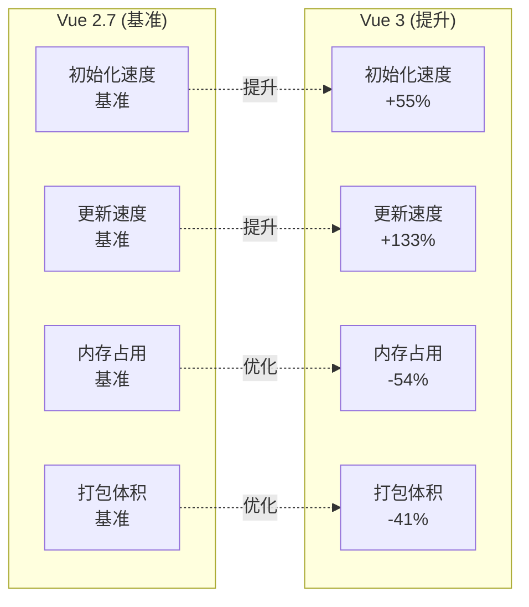

# Vue 3 组合式 API 迁移

## 概述

Vue 2.7 发布于 2022 年 7 月，是 Vue 2 的最后一个次要版本。它将 Vue 3 的部分核心特性移植到了 Vue 2，使开发者能够在 Vue 2 项目中提前体验和使用 Composition API、`<script setup>` 等新特性，为平滑迁移到 Vue 3 做准备。

### 主要更新内容

- ✅ Composition API（组合式 API）
- ✅ `<script setup>` 语法糖
- ✅ Pinia 状态管理支持
- ✅ 新的响应式 API
- ✅ 改进的类型推断（TypeScript 支持）
- ⚠️ 不再支持 IE11

---

## Composition API

Composition API 是 Vue 2.7 最重要的新特性，它提供了一种更灵活的方式来组织组件逻辑。

### 核心概念

Composition API 将组件逻辑分解为可复用的函数，而不是依赖于选项式 API（Options API）的对象结构。

### 基础示例

#### Options API 写法（传统）

```vue
<template>
  <div>
    <p>Count: {{ count }}</p>
    <button @click="increment">增加</button>
  </div>
</template>

<script>
export default {
  data() {
    return {
      count: 0
    }
  },
  methods: {
    increment() {
      this.count++
    }
  },
  mounted() {
    console.log('组件已挂载')
  }
}
</script>
```

#### Composition API 写法（Vue 2.7）

```vue
<template>
  <div>
    <p>Count: {{ count }}</p>
    <button @click="increment">增加</button>
  </div>
</template>

<script>
import { ref, onMounted } from 'vue'

export default {
  setup() {
    // 响应式数据
    const count = ref(0)
    
    // 方法
    function increment() {
      count.value++
    }
    
    // 生命周期钩子
    onMounted(() => {
      console.log('组件已挂载')
    })
    
    // 返回模板需要使用的数据和方法
    return {
      count,
      increment
    }
  }
}
</script>
```

### 组合式函数

Composition API 的真正威力在于逻辑复用：

```vue
<script>
import { ref, onMounted, onUnmounted } from 'vue'

// 可复用的鼠标位置跟踪逻辑
function useMousePosition() {
  const x = ref(0)
  const y = ref(0)
  
  function update(e) {
    x.value = e.pageX
    y.value = e.pageY
  }
  
  onMounted(() => {
    window.addEventListener('mousemove', update)
  })
  
  onUnmounted(() => {
    window.removeEventListener('mousemove', update)
  })
  
  return { x, y }
}

export default {
  setup() {
    const { x, y } = useMousePosition()
    
    return { x, y }
  }
}
</script>

<template>
  <div>鼠标位置: {{ x }}, {{ y }}</div>
</template>
```

### setup() 函数说明

`setup()` 是 Composition API 的入口点：

| 特性 | 说明 |
|------|------|
| 执行时机 | 在 beforeCreate 之前执行 |
| 参数 | `props`（响应式）和 `context`（包含 attrs、slots、emit、expose） |
| 返回值 | 对象中的属性和方法可在模板中使用 |
| this 限制 | 不应使用 `this`，因为组件实例尚未创建 |

### Composition API 实现原理

Vue 2.7 将 Composition API 直接内置进了 Vue 核心（原 `@vue/composition-api` 插件的实现已合并进来，改从 `vue` 导入即可，无需再安装插件），核心机制：

```javascript
// setup() 函数在 beforeCreate 之前执行
// 1. 创建独立的响应式上下文（setupContext）
// 2. 将 setup 返回的 refs/reactive 代理到组件实例上
// 3. 生命周期钩子（onMounted 等）映射到组件选项

// 限制（与 Vue 3 的重要区别）：
// - 响应式仍然是 Object.defineProperty（非 Proxy）
// - 不支持 Teleport、Suspense 等新内置组件
// - 无 createApp，仍使用 new Vue() 创建应用实例
```

> **关键差异**：Vue 2.7 的 Composition API 是运行时层面的内置实现，Vue 3 是编译+运行时的原生支持。Vue 2.7 中的 `ref()` 本质上是创建一个 `{ value: xxx }` 的响应式对象，通过 `Object.defineProperty` 劫持 `.value` 属性。

---

## setup 语法糖

`<script setup>` 是 Composition API 的编译时语法糖，简化了组件编写。

### 基础用法

```vue
<script setup>
import { ref } from 'vue'

// 响应式数据（自动暴露给模板）
const count = ref(0)

// 方法（自动暴露给模板）
function increment() {
  count.value++
}

// 无需 return！
</script>

<template>
  <div>
    <p>Count: {{ count }}</p>
    <button @click="increment">增加</button>
  </div>
</template>
```

### 定义 Props 和 Emits

```vue
<script setup>
// defineProps / defineEmits 是编译器宏，无需导入

// 定义 props
const props = defineProps({
  title: {
    type: String,
    required: true
  },
  count: {
    type: Number,
    default: 0
  }
})

// 定义 emits
const emit = defineEmits(['update:count', 'submit'])

function handleClick() {
  emit('update:count', props.count + 1)
}
</script>

<template>
  <div>
    <h2>{{ title }}</h2>
    <p>Count: {{ count }}</p>
    <button @click="handleClick">更新计数</button>
  </div>
</template>
```

### 使用组件

```vue
<script setup>
import ChildComponent from './ChildComponent.vue'

// 导入的组件直接可用，无需注册
</script>

<template>
  <ChildComponent title="Hello" />
</template>
```

### 对比传统写法

| 特性 | 传统 setup() | `<script setup>` |
|------|-------------|------------------|
| 返回值 | 需要显式 return | 自动暴露顶层绑定 |
| 组件注册 | 需要 `components` 选项 | 导入即自动注册 |
| Props 定义 | 在 `props` 选项中 | `defineProps()` |
| Emits 定义 | 在 `emits` 选项中 | `defineEmits()` |
| 代码量 | 较多 | 更简洁 |

---

## 新增的响应式 API

Vue 2.7 新增了 Vue 3 的响应式 API，提供更强大的响应式能力。

### ref()

用于创建基本类型和对象的响应式引用：

```javascript
import { ref } from 'vue'

const count = ref(0)
console.log(count.value) // 0

const user = ref({ name: 'Alice' })
user.value.name = 'Bob' // 响应式更新
```

### reactive()

用于创建对象的响应式代理：

```javascript
import { reactive } from 'vue'

const state = reactive({
  count: 0,
  user: {
    name: 'Alice'
  }
})

state.count++ // 响应式更新
state.user.name = 'Bob' // 响应式更新
```

### computed()

创建计算属性：

```javascript
import { ref, computed } from 'vue'

const count = ref(1)
const plusOne = computed(() => count.value + 1)

console.log(plusOne.value) // 2
```

### watch() 和 watchEffect()

侦听响应式数据变化：

```javascript
import { ref, watch, watchEffect } from 'vue'

const count = ref(0)

// watch: 显式指定侦听源
watch(count, (newVal, oldVal) => {
  console.log(`count 从 ${oldVal} 变为 ${newVal}`)
})

// watchEffect: 自动追踪依赖
watchEffect(() => {
  console.log(`当前 count 值: ${count.value}`)
})
```

### 生命周期钩子

Composition API 中的生命周期钩子命名规则：`on` + 钩子名：

| Options API | Composition API |
|-------------|-----------------|
| beforeCreate | - (在 setup 中执行) |
| created | - (在 setup 中执行) |
| beforeMount | onBeforeMount |
| mounted | onMounted |
| beforeUpdate | onBeforeUpdate |
| updated | onUpdated |
| beforeDestroy | onBeforeUnmount |
| destroyed | onUnmounted |

示例：

```javascript
import { onMounted, onUnmounted } from 'vue'

setup() {
  onMounted(() => {
    console.log('组件已挂载')
  })
  
  onUnmounted(() => {
    console.log('组件已卸载')
  })
}
```

### 其他实用 API

```javascript
import { 
  ref, 
  toRef, 
  toRefs, 
  unref, 
  isRef, 
  isReactive,
  shallowRef,
  shallowReactive,
  readonly
} from 'vue'

const state = reactive({ count: 0, name: 'Alice' })

// toRefs: 将响应式对象转为普通对象，每个属性都是 ref
const { count, name } = toRefs(state)

// toRef: 为某个属性创建 ref
const countRef = toRef(state, 'count')

// unref: 如果参数是 ref 则返回其值，否则返回参数本身
console.log(unref(count)) // 等同于 isRef(count) ? count.value : count

// isRef: 检查是否为 ref
console.log(isRef(count)) // true

// isReactive: 检查是否为 reactive 对象
console.log(isReactive(state)) // true
```

---

## 与 Vue 3 的差异

虽然 Vue 2.7 移植了许多 Vue 3 特性，但仍存在一些关键差异。

### 功能对比表

| 特性 | Vue 2.7 | Vue 3 |
|------|---------|-------|
| Composition API | ✅ 完整支持 | ✅ 完整支持 |
| `<script setup>` | ✅ 支持 | ✅ 支持 |
| 响应式系统 | ✅ 基于 Object.defineProperty | ✅ 基于 Proxy |
| Teleport 组件 | ❌ 不支持 | ✅ 支持 |
| Fragments (多根节点) | ❌ 不支持 | ✅ 支持 |
| Suspense 组件 | ❌ 不支持 | ✅ 支持 |
| 性能优化 | ⚠️ 有限 | ✅ 显著提升 |
| TypeScript 支持 | ⚠️ 改进但有限 | ✅ 原生支持 |
| Tree-shaking | ⚠️ 有限 | ✅ 完整支持 |
| IE11 支持 | ❌ 不再支持 | ❌ 不支持 |

### 响应式系统的区别

**Vue 2.7 的限制：**

```javascript
import { reactive } from 'vue'

const state = reactive({})

// ❌ Vue 2.7 无法检测属性添加
state.newProperty = 'value' // 非响应式

// ❌ Vue 2.7 无法检测属性删除
delete state.existingProperty // 非响应式

// ❌ Vue 2.7 无法检测数组索引赋值
const arr = reactive([1, 2, 3])
arr[0] = 10 // 非响应式

// ❌ Vue 2.7 无法检测数组长度修改
arr.length = 0 // 非响应式
```

**Vue 3 的优势：**

```javascript
import { reactive } from 'vue'

const state = reactive({})

// ✅ Vue 3 可以检测属性添加
state.newProperty = 'value' // 响应式

// ✅ Vue 3 可以检测属性删除
delete state.existingProperty // 响应式

// ✅ Vue 3 可以检测数组索引赋值
const arr = reactive([1, 2, 3])
arr[0] = 10 // 响应式

// ✅ Vue 3 可以检测数组长度修改
arr.length = 0 // 响应式
```

### 模板差异

**Vue 2.7 必须有单一根节点：**

```vue
<!-- ❌ Vue 2.7 不支持 -->
<template>
  <header>Header</header>
  <main>Content</main>
  <footer>Footer</footer>
</template>

<!-- ✅ Vue 2.7 正确写法 -->
<template>
  <div>
    <header>Header</header>
    <main>Content</main>
    <footer>Footer</footer>
  </div>
</template>
```

**Vue 3 支持多根节点（Fragments）：**

```vue
<!-- ✅ Vue 3 支持 -->
<template>
  <header>Header</header>
  <main>Content</main>
  <footer>Footer</footer>
</template>
```

### 性能差异

Vue 3 相比 Vue 2.7 的性能提升：



---

## 最佳实践

### 1. 渐进式迁移到 Composition API

不要一次性重写所有组件，建议分步骤进行：

```javascript
// 阶段 1: 在新组件中使用 Composition API
export default {
  setup() {
    // 新逻辑使用 Composition API
    const count = ref(0)
    return { count }
  },
  
  // 阶段 2: 保留旧代码
  data() {
    return {
      // 旧数据
    }
  }
}

// 阶段 3: 逐步迁移到 <script setup>
<script setup>
const count = ref(0)
</script>
```

### 2. 逻辑复用优先考虑组合式函数

```javascript
// ✅ 推荐：使用组合式函数
function useCounter(initialValue = 0) {
  const count = ref(initialValue)
  const increment = () => count.value++
  const decrement = () => count.value--
  const reset = () => count.value = initialValue
  
  return { count, increment, decrement, reset }
}

// 使用
<script setup>
const { count, increment } = useCounter(10)
</script>
```

### 3. 合理使用 ref 和 reactive

```javascript
// ✅ 推荐使用 ref 的场景
const count = ref(0)           // 基本类型
const user = ref({ name: '' }) // 需要整体替换的对象

// ✅ 推荐使用 reactive 的场景
const state = reactive({       // 复杂对象，不需要整体替换
  user: { name: '' },
  settings: { theme: 'dark' },
  items: []
})

// ❌ 避免对 reactive 对象解构
const { user } = state         // 失去响应性！

// ✅ 使用 toRefs 保持响应性
const { user } = toRefs(state) // 保持响应性
```

### 4. 生命周期钩子使用建议

```javascript
import { onMounted, onUnmounted } from 'vue'

// ✅ 推荐：相关逻辑组织在一起
function useEventListener(target, event, callback) {
  onMounted(() => {
    target.addEventListener(event, callback)
  })
  
  onUnmounted(() => {
    target.removeEventListener(event, callback)
  })
}

// 而不是分散在组件各处
```

### 5. TypeScript 支持

Vue 2.7 改进了 TypeScript 支持，但仍有局限：

```vue
<script setup lang="ts">
import { ref, computed } from 'vue'

interface User {
  id: number
  name: string
  email: string
}

// ✅ 类型推断
const user = ref<User | null>(null)

// ✅ Props 类型定义
const props = defineProps<{
  title: string
  count?: number
}>()

// ✅ Emits 类型定义
const emit = defineEmits<{
  (e: 'update', value: number): void
  (e: 'submit'): void
}>()
</script>
```

### 6. 避免常见陷阱

```javascript
// ❌ 错误：在 setup 中使用 this
setup() {
  this.count = 1 // 报错！
}

// ❌ 错误：直接解构 reactive
const state = reactive({ count: 0 })
const { count } = state // 失去响应性

// ✅ 正确：使用 toRefs
const { count } = toRefs(state)

// ❌ 错误：在 Vue 2.7 中使用 Teleport
<Teleport to="body">
  <Modal />
</Teleport> <!-- Vue 2.7 不支持 -->

// ❌ 错误：多根节点模板
<template>
  <div>A</div>
  <div>B</div> <!-- Vue 2.7 报错 -->
</template>
```

### 7. 项目配置建议

```javascript
// vue.config.js
module.exports = {
  // 转译 node_modules 中的依赖（如使用了新语法的库）
  transpileDependencies: true,
  
  // 如果使用 TypeScript
  chainWebpack: config => {
    config.resolve.extensions.add('.ts')
  }
}

// babel.config.js
module.exports = {
  presets: [
    '@vue/cli-plugin-babel/preset'
  ]
}
```

---

## 升级指南

### 从 Vue 2.6 升级到 Vue 2.7

```bash
# 使用 npm
npm install vue@2.7

# 或使用 yarn
yarn add vue@2.7
```

### 验证升级

```javascript
// main.js
import Vue from 'vue'

// 检查版本
console.log(Vue.version) // 应显示 2.7.x

// 验证 Composition API 是否可用
import { ref, reactive, computed } from 'vue'
console.log('Composition API 可用:', typeof ref === 'function')
```

### 注意事项

1. **移除 vue-template-compiler**：Vue 2.7 已内置编译器（`vue/compiler-sfc`），`vue-template-compiler` 不再需要，应从 devDependencies 中移除（若仍使用 @vue/test-utils v1 可暂保留）；同时确认 vue-loader ≥ 15.10 以兼容 Vue 2.7
2. **检查依赖兼容性**：验证 UI 库和其他插件是否支持 Vue 2.7
3. **备份项目**：升级前建议创建备份或新分支
4. **清理缓存**：升级后清除构建缓存

```bash
# 清理缓存重新安装
rm -rf node_modules package-lock.json
npm install
```

---

## 常见问题

### Q1: Vue 2.7 支持所有 Vue 3 特性吗？

**A:** 不支持。Vue 2.7 只移植了 Composition API 相关特性。Teleport、Fragments、Suspense 等特性仍不可用。

### Q2: 可以在 Vue 2.7 项目中混用 Options API 和 Composition API 吗？

**A:** 可以。两种 API 可以共存，建议在新组件中使用 Composition API，旧组件保持原样。

### Q3: Vue 2.7 会继续维护吗？

**A:** Vue 2.7 是 Vue 2 的最后一个次要版本。官方维护期到 2023 年 12 月 31 日，之后停止维护。

### Q4: 使用 Composition API 会影响性能吗？

**A:** 不会。Composition API 在 Vue 2.7 中性能与 Options API 相当。在 Vue 3 中性能更优。

### Q5: 如何在 Vue 2.7 中使用 Pinia？

**A:** Pinia 同时支持 Vue 2.7 和 Vue 3：

```javascript
// main.js
import Vue from 'vue'
import { createPinia, PiniaVuePlugin } from 'pinia'

Vue.use(PiniaVuePlugin)
const pinia = createPinia()

new Vue({
  pinia,
  // ...
})
```

---

## 总结

Vue 2.7 为 Vue 2 项目带来了 Vue 3 的核心特性，是平滑迁移的重要桥梁。通过学习 Composition API 和 `<script setup>`，开发者可以：

1. **提前适应 Vue 3**：在 Vue 2 环境中学习和实践新 API
2. **提升代码质量**：使用 Composition API 更好地组织逻辑
3. **渐进式迁移**：逐步迁移项目，降低风险
4. **复用逻辑**：通过组合式函数提高代码复用率

建议在迁移到 Vue 3 之前，先在 Vue 2.7 中充分熟悉新特性，为最终迁移做好准备。

> 系统性迁移的完整内容（主要差异、兼容性构建、迁移策略与检查清单）见同目录《Vue 2 到 Vue 3 迁移策略》。
