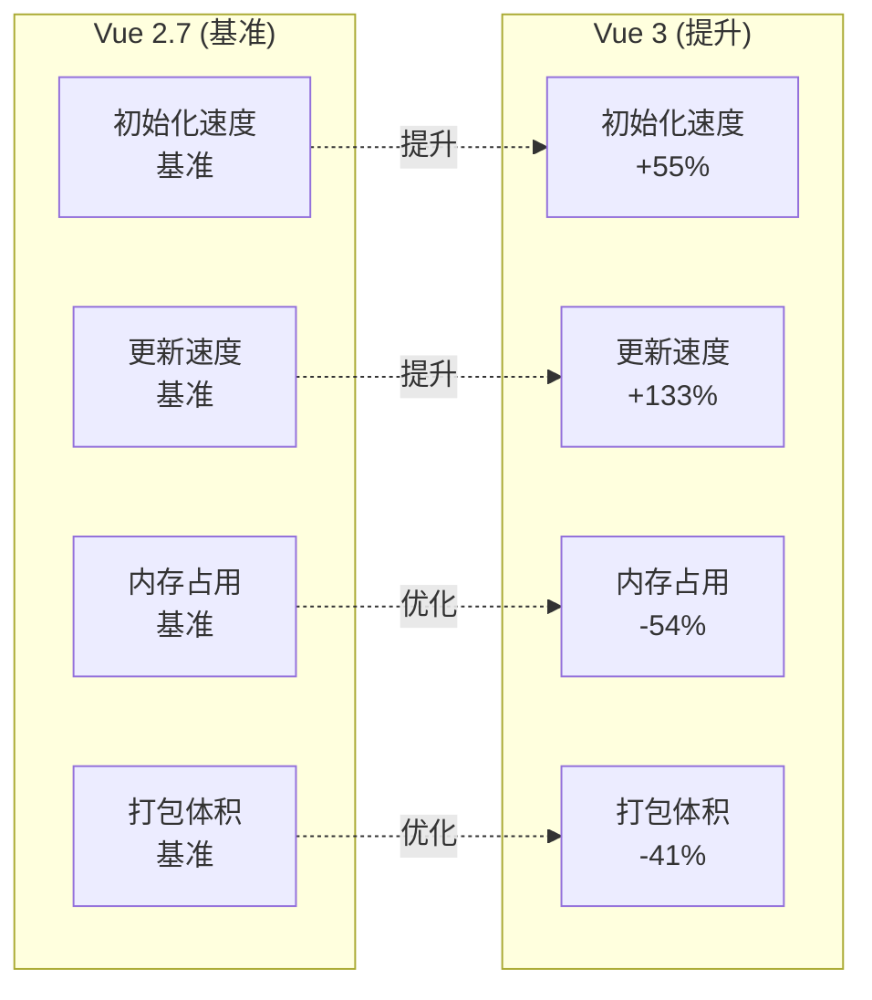
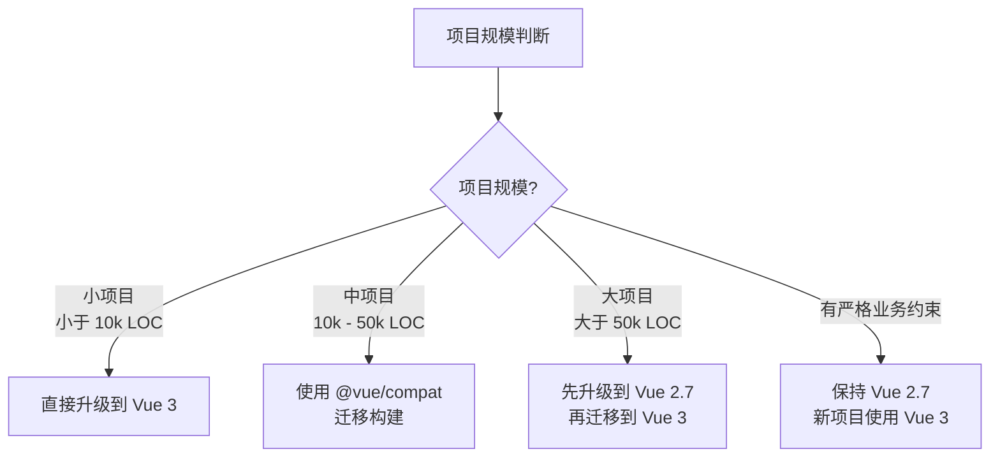
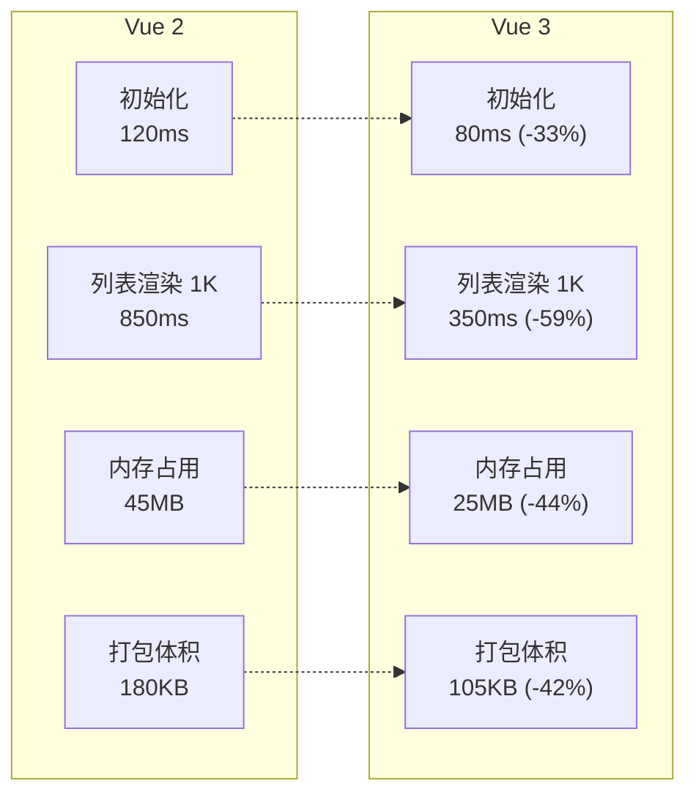

# 迁移指南

> Vue 2.7 是 Vue 2 的最后一个次要版本，为 Vue 2 带来了 Vue 3 的核心特性；本篇同时给出从 Vue 2 系统性过渡到 Vue 3 的迁移指南

## 概述

Vue 2.7 发布于 2022 年 7 月，是 Vue 2 的最后一个次要版本。它将 Vue 3 的部分核心特性移植到了 Vue 2，使开发者能够在 Vue 2 项目中提前体验和使用 Composition API、`<script setup>` 等新特性，为平滑迁移到 Vue 3 做准备。

### 主要更新内容

- ✅ Composition API（组合式 API）
- ✅ `<script setup>` 语法糖
- ✅ Pinia 状态管理支持
- ✅ 新的响应式 API
- ✅ 改进的类型推断（TypeScript 支持）
- ⚠️ 不再支持 IE11

---

## Composition API

Composition API 是 Vue 2.7 最重要的新特性，它提供了一种更灵活的方式来组织组件逻辑。

### 核心概念

Composition API 将组件逻辑分解为可复用的函数，而不是依赖于选项式 API（Options API）的对象结构。

### 基础示例

#### Options API 写法（传统）

```vue
<template>
  <div>
    <p>Count: {{ count }}</p>
    <button @click="increment">增加</button>
  </div>
</template>

<script>
export default {
  data() {
    return {
      count: 0
    }
  },
  methods: {
    increment() {
      this.count++
    }
  },
  mounted() {
    console.log('组件已挂载')
  }
}
</script>
```

#### Composition API 写法（Vue 2.7）

```vue
<template>
  <div>
    <p>Count: {{ count }}</p>
    <button @click="increment">增加</button>
  </div>
</template>

<script>
import { ref, onMounted } from 'vue'

export default {
  setup() {
    // 响应式数据
    const count = ref(0)
    
    // 方法
    function increment() {
      count.value++
    }
    
    // 生命周期钩子
    onMounted(() => {
      console.log('组件已挂载')
    })
    
    // 返回模板需要使用的数据和方法
    return {
      count,
      increment
    }
  }
}
</script>
```

### 组合式函数

Composition API 的真正威力在于逻辑复用：

```vue
<script>
import { ref, onMounted, onUnmounted } from 'vue'

// 可复用的鼠标位置跟踪逻辑
function useMousePosition() {
  const x = ref(0)
  const y = ref(0)
  
  function update(e) {
    x.value = e.pageX
    y.value = e.pageY
  }
  
  onMounted(() => {
    window.addEventListener('mousemove', update)
  })
  
  onUnmounted(() => {
    window.removeEventListener('mousemove', update)
  })
  
  return { x, y }
}

export default {
  setup() {
    const { x, y } = useMousePosition()
    
    return { x, y }
  }
}
</script>

<template>
  <div>鼠标位置: {{ x }}, {{ y }}</div>
</template>
```

### setup() 函数说明

`setup()` 是 Composition API 的入口点：

| 特性 | 说明 |
|------|------|
| 执行时机 | 在 beforeCreate 之前执行 |
| 参数 | `props`（响应式）和 `context`（包含 attrs、slots、emit、expose） |
| 返回值 | 对象中的属性和方法可在模板中使用 |
| this 限制 | 不应使用 `this`，因为组件实例尚未创建 |

### Composition API 实现原理

Vue 2.7 将 Composition API 直接内置进了 Vue 核心（原 `@vue/composition-api` 插件的实现已合并进来，改从 `vue` 导入即可，无需再安装插件），核心机制：

```javascript
// setup() 函数在 beforeCreate 之前执行
// 1. 创建独立的响应式上下文（setupContext）
// 2. 将 setup 返回的 refs/reactive 代理到组件实例上
// 3. 生命周期钩子（onMounted 等）映射到组件选项

// 限制（与 Vue 3 的重要区别）：
// - 响应式仍然是 Object.defineProperty（非 Proxy）
// - 不支持 Teleport、Suspense 等新内置组件
// - 无 createApp，仍使用 new Vue() 创建应用实例
```

> **关键差异**：Vue 2.7 的 Composition API 是运行时层面的内置实现，Vue 3 是编译+运行时的原生支持。Vue 2.7 中的 `ref()` 本质上是创建一个 `{ value: xxx }` 的响应式对象，通过 `Object.defineProperty` 劫持 `.value` 属性。

---

## setup 语法糖

`<script setup>` 是 Composition API 的编译时语法糖，简化了组件编写。

### 基础用法

```vue
<script setup>
import { ref } from 'vue'

// 响应式数据（自动暴露给模板）
const count = ref(0)

// 方法（自动暴露给模板）
function increment() {
  count.value++
}

// 无需 return！
</script>

<template>
  <div>
    <p>Count: {{ count }}</p>
    <button @click="increment">增加</button>
  </div>
</template>
```

### 定义 Props 和 Emits

```vue
<script setup>
// defineProps / defineEmits 是编译器宏，无需导入

// 定义 props
const props = defineProps({
  title: {
    type: String,
    required: true
  },
  count: {
    type: Number,
    default: 0
  }
})

// 定义 emits
const emit = defineEmits(['update:count', 'submit'])

function handleClick() {
  emit('update:count', props.count + 1)
}
</script>

<template>
  <div>
    <h2>{{ title }}</h2>
    <p>Count: {{ count }}</p>
    <button @click="handleClick">更新计数</button>
  </div>
</template>
```

### 使用组件

```vue
<script setup>
import ChildComponent from './ChildComponent.vue'

// 导入的组件直接可用，无需注册
</script>

<template>
  <ChildComponent title="Hello" />
</template>
```

### 对比传统写法

| 特性 | 传统 setup() | `<script setup>` |
|------|-------------|------------------|
| 返回值 | 需要显式 return | 自动暴露顶层绑定 |
| 组件注册 | 需要 `components` 选项 | 导入即自动注册 |
| Props 定义 | 在 `props` 选项中 | `defineProps()` |
| Emits 定义 | 在 `emits` 选项中 | `defineEmits()` |
| 代码量 | 较多 | 更简洁 |

---

## 新增的响应式 API

Vue 2.7 新增了 Vue 3 的响应式 API，提供更强大的响应式能力。

### ref()

用于创建基本类型和对象的响应式引用：

```javascript
import { ref } from 'vue'

const count = ref(0)
console.log(count.value) // 0

const user = ref({ name: 'Alice' })
user.value.name = 'Bob' // 响应式更新
```

### reactive()

用于创建对象的响应式代理：

```javascript
import { reactive } from 'vue'

const state = reactive({
  count: 0,
  user: {
    name: 'Alice'
  }
})

state.count++ // 响应式更新
state.user.name = 'Bob' // 响应式更新
```

### computed()

创建计算属性：

```javascript
import { ref, computed } from 'vue'

const count = ref(1)
const plusOne = computed(() => count.value + 1)

console.log(plusOne.value) // 2
```

### watch() 和 watchEffect()

侦听响应式数据变化：

```javascript
import { ref, watch, watchEffect } from 'vue'

const count = ref(0)

// watch: 显式指定侦听源
watch(count, (newVal, oldVal) => {
  console.log(`count 从 ${oldVal} 变为 ${newVal}`)
})

// watchEffect: 自动追踪依赖
watchEffect(() => {
  console.log(`当前 count 值: ${count.value}`)
})
```

### 生命周期钩子

Composition API 中的生命周期钩子命名规则：`on` + 钩子名：

| Options API | Composition API |
|-------------|-----------------|
| beforeCreate | - (在 setup 中执行) |
| created | - (在 setup 中执行) |
| beforeMount | onBeforeMount |
| mounted | onMounted |
| beforeUpdate | onBeforeUpdate |
| updated | onUpdated |
| beforeDestroy | onBeforeUnmount |
| destroyed | onUnmounted |

示例：

```javascript
import { onMounted, onUnmounted } from 'vue'

setup() {
  onMounted(() => {
    console.log('组件已挂载')
  })
  
  onUnmounted(() => {
    console.log('组件已卸载')
  })
}
```

### 其他实用 API

```javascript
import { 
  ref, 
  toRef, 
  toRefs, 
  unref, 
  isRef, 
  isReactive,
  shallowRef,
  shallowReactive,
  readonly
} from 'vue'

const state = reactive({ count: 0, name: 'Alice' })

// toRefs: 将响应式对象转为普通对象，每个属性都是 ref
const { count, name } = toRefs(state)

// toRef: 为某个属性创建 ref
const countRef = toRef(state, 'count')

// unref: 如果参数是 ref 则返回其值，否则返回参数本身
console.log(unref(count)) // 等同于 isRef(count) ? count.value : count

// isRef: 检查是否为 ref
console.log(isRef(count)) // true

// isReactive: 检查是否为 reactive 对象
console.log(isReactive(state)) // true
```

---

## 与 Vue 3 的差异

虽然 Vue 2.7 移植了许多 Vue 3 特性，但仍存在一些关键差异。

### 功能对比表

| 特性 | Vue 2.7 | Vue 3 |
|------|---------|-------|
| Composition API | ✅ 完整支持 | ✅ 完整支持 |
| `<script setup>` | ✅ 支持 | ✅ 支持 |
| 响应式系统 | ✅ 基于 Object.defineProperty | ✅ 基于 Proxy |
| Teleport 组件 | ❌ 不支持 | ✅ 支持 |
| Fragments (多根节点) | ❌ 不支持 | ✅ 支持 |
| Suspense 组件 | ❌ 不支持 | ✅ 支持 |
| 性能优化 | ⚠️ 有限 | ✅ 显著提升 |
| TypeScript 支持 | ⚠️ 改进但有限 | ✅ 原生支持 |
| Tree-shaking | ⚠️ 有限 | ✅ 完整支持 |
| IE11 支持 | ❌ 不再支持 | ❌ 不支持 |

### 响应式系统的区别

**Vue 2.7 的限制：**

```javascript
import { reactive } from 'vue'

const state = reactive({})

// ❌ Vue 2.7 无法检测属性添加
state.newProperty = 'value' // 非响应式

// ❌ Vue 2.7 无法检测属性删除
delete state.existingProperty // 非响应式

// ❌ Vue 2.7 无法检测数组索引赋值
const arr = reactive([1, 2, 3])
arr[0] = 10 // 非响应式

// ❌ Vue 2.7 无法检测数组长度修改
arr.length = 0 // 非响应式
```

**Vue 3 的优势：**

```javascript
import { reactive } from 'vue'

const state = reactive({})

// ✅ Vue 3 可以检测属性添加
state.newProperty = 'value' // 响应式

// ✅ Vue 3 可以检测属性删除
delete state.existingProperty // 响应式

// ✅ Vue 3 可以检测数组索引赋值
const arr = reactive([1, 2, 3])
arr[0] = 10 // 响应式

// ✅ Vue 3 可以检测数组长度修改
arr.length = 0 // 响应式
```

### 模板差异

**Vue 2.7 必须有单一根节点：**

```vue
<!-- ❌ Vue 2.7 不支持 -->
<template>
  <header>Header</header>
  <main>Content</main>
  <footer>Footer</footer>
</template>

<!-- ✅ Vue 2.7 正确写法 -->
<template>
  <div>
    <header>Header</header>
    <main>Content</main>
    <footer>Footer</footer>
  </div>
</template>
```

**Vue 3 支持多根节点（Fragments）：**

```vue
<!-- ✅ Vue 3 支持 -->
<template>
  <header>Header</header>
  <main>Content</main>
  <footer>Footer</footer>
</template>
```

### 性能差异

Vue 3 相比 Vue 2.7 的性能提升：



---

## 最佳实践

### 1. 渐进式迁移到 Composition API

不要一次性重写所有组件，建议分步骤进行：

```javascript
// 阶段 1: 在新组件中使用 Composition API
export default {
  setup() {
    // 新逻辑使用 Composition API
    const count = ref(0)
    return { count }
  },
  
  // 阶段 2: 保留旧代码
  data() {
    return {
      // 旧数据
    }
  }
}

// 阶段 3: 逐步迁移到 <script setup>
<script setup>
const count = ref(0)
</script>
```

### 2. 逻辑复用优先考虑组合式函数

```javascript
// ✅ 推荐：使用组合式函数
function useCounter(initialValue = 0) {
  const count = ref(initialValue)
  const increment = () => count.value++
  const decrement = () => count.value--
  const reset = () => count.value = initialValue
  
  return { count, increment, decrement, reset }
}

// 使用
<script setup>
const { count, increment } = useCounter(10)
</script>
```

### 3. 合理使用 ref 和 reactive

```javascript
// ✅ 推荐使用 ref 的场景
const count = ref(0)           // 基本类型
const user = ref({ name: '' }) // 需要整体替换的对象

// ✅ 推荐使用 reactive 的场景
const state = reactive({       // 复杂对象，不需要整体替换
  user: { name: '' },
  settings: { theme: 'dark' },
  items: []
})

// ❌ 避免对 reactive 对象解构
const { user } = state         // 失去响应性！

// ✅ 使用 toRefs 保持响应性
const { user } = toRefs(state) // 保持响应性
```

### 4. 生命周期钩子使用建议

```javascript
import { onMounted, onUnmounted } from 'vue'

// ✅ 推荐：相关逻辑组织在一起
function useEventListener(target, event, callback) {
  onMounted(() => {
    target.addEventListener(event, callback)
  })
  
  onUnmounted(() => {
    target.removeEventListener(event, callback)
  })
}

// 而不是分散在组件各处
```

### 5. TypeScript 支持

Vue 2.7 改进了 TypeScript 支持，但仍有局限：

```vue
<script setup lang="ts">
import { ref, computed } from 'vue'

interface User {
  id: number
  name: string
  email: string
}

// ✅ 类型推断
const user = ref<User | null>(null)

// ✅ Props 类型定义
const props = defineProps<{
  title: string
  count?: number
}>()

// ✅ Emits 类型定义
const emit = defineEmits<{
  (e: 'update', value: number): void
  (e: 'submit'): void
}>()
</script>
```

### 6. 避免常见陷阱

```javascript
// ❌ 错误：在 setup 中使用 this
setup() {
  this.count = 1 // 报错！
}

// ❌ 错误：直接解构 reactive
const state = reactive({ count: 0 })
const { count } = state // 失去响应性

// ✅ 正确：使用 toRefs
const { count } = toRefs(state)

// ❌ 错误：在 Vue 2.7 中使用 Teleport
<Teleport to="body">
  <Modal />
</Teleport> <!-- Vue 2.7 不支持 -->

// ❌ 错误：多根节点模板
<template>
  <div>A</div>
  <div>B</div> <!-- Vue 2.7 报错 -->
</template>
```

### 7. 项目配置建议

```javascript
// vue.config.js
module.exports = {
  // 转译 node_modules 中的依赖（如使用了新语法的库）
  transpileDependencies: true,
  
  // 如果使用 TypeScript
  chainWebpack: config => {
    config.resolve.extensions.add('.ts')
  }
}

// babel.config.js
module.exports = {
  presets: [
    '@vue/cli-plugin-babel/preset'
  ]
}
```

---

## 升级指南

### 从 Vue 2.6 升级到 Vue 2.7

```bash
# 使用 npm
npm install vue@2.7

# 或使用 yarn
yarn add vue@2.7
```

### 验证升级

```javascript
// main.js
import Vue from 'vue'

// 检查版本
console.log(Vue.version) // 应显示 2.7.x

// 验证 Composition API 是否可用
import { ref, reactive, computed } from 'vue'
console.log('Composition API 可用:', typeof ref === 'function')
```

### 注意事项

1. **移除 vue-template-compiler**：Vue 2.7 已内置编译器（`vue/compiler-sfc`），`vue-template-compiler` 不再需要，应从 devDependencies 中移除（若仍使用 @vue/test-utils v1 可暂保留）；同时确认 vue-loader ≥ 15.10 以兼容 Vue 2.7
2. **检查依赖兼容性**：验证 UI 库和其他插件是否支持 Vue 2.7
3. **备份项目**：升级前建议创建备份或新分支
4. **清理缓存**：升级后清除构建缓存

```bash
# 清理缓存重新安装
rm -rf node_modules package-lock.json
npm install
```

---

## Vue 2.7 常见问题

### Q1: Vue 2.7 支持所有 Vue 3 特性吗？

**A:** 不支持。Vue 2.7 只移植了 Composition API 相关特性。Teleport、Fragments、Suspense 等特性仍不可用。

### Q2: 可以在 Vue 2.7 项目中混用 Options API 和 Composition API 吗？

**A:** 可以。两种 API 可以共存，建议在新组件中使用 Composition API，旧组件保持原样。

### Q3: Vue 2.7 会继续维护吗？

**A:** Vue 2.7 是 Vue 2 的最后一个次要版本。官方维护期到 2023 年 12 月 31 日，之后停止维护。

### Q4: 使用 Composition API 会影响性能吗？

**A:** 不会。Composition API 在 Vue 2.7 中性能与 Options API 相当。在 Vue 3 中性能更优。

### Q5: 如何在 Vue 2.7 中使用 Pinia？

**A:** Pinia 同时支持 Vue 2.7 和 Vue 3：

```javascript
// main.js
import Vue from 'vue'
import { createPinia, PiniaVuePlugin } from 'pinia'

Vue.use(PiniaVuePlugin)
const pinia = createPinia()

new Vue({
  pinia,
  // ...
})
```

---

## Vue 2.7 小结

Vue 2.7 为 Vue 2 项目带来了 Vue 3 的核心特性，是平滑迁移的重要桥梁。通过学习 Composition API 和 `<script setup>`，开发者可以：

1. **提前适应 Vue 3**：在 Vue 2 环境中学习和实践新 API
2. **提升代码质量**：使用 Composition API 更好地组织逻辑
3. **渐进式迁移**：逐步迁移项目，降低风险
4. **复用逻辑**：通过组合式函数提高代码复用率

建议在迁移到 Vue 3 之前，先在 Vue 2.7 中充分熟悉新特性，为最终迁移做好准备。


---

## Vue 2 到 Vue 3 迁移总览

Vue 3 带来了更好的性能、更小的打包体积、更好的 TypeScript 支持和组合式 API 等重大改进。本指南将帮助你理解 Vue 2 到 Vue 3 的主要变化，并制定合理的迁移策略，降低迁移风险。

### 迁移价值

```mermaid
graph TB
    subgraph "Vue 3 核心优势"
        A[性能提升<br/>初始化 +55% | 更新 +133%]
        B[体积优化<br/>Tree-shaking 支持 | 体积 -41%]
        C[更好的 TS 支持<br/>源码使用 TypeScript 编写]
        D[组合式 API<br/>更灵活的代码组织方式]
        E[新特性<br/>Teleport | Fragments | Suspense]
        F[更好的开发体验<br/>改进的 DevTools 和错误提示]
    end
```

---

## 主要差异

### 1. 全局 API 变更

#### Vue 2 写法

```javascript
// main.js - Vue 2
import Vue from 'vue'
import App from './App.vue'
import router from './router'
import store from './store'

// 全局配置
Vue.config.productionTip = false
Vue.prototype.$http = myHttpLib

// 全局组件
Vue.component('MyButton', MyButton)

// 全局指令
Vue.directive('focus', {
  inserted: el => el.focus()
})

// 全局过滤器
Vue.filter('capitalize', value => {
  if (!value) return ''
  return value.charAt(0).toUpperCase() + value.slice(1)
})

new Vue({
  router,
  store,
  render: h => h(App)
}).$mount('#app')
```

#### Vue 3 写法

```javascript
// main.js - Vue 3
import { createApp } from 'vue'
import App from './App.vue'
import router from './router'
import { createPinia } from 'pinia'

const app = createApp(App)

// 使用插件
app.use(router)
app.use(createPinia())

// 全局配置
app.config.errorHandler = (err) => {
  console.error(err)
}

// 全局属性（替代 Vue.prototype）
app.config.globalProperties.$http = myHttpLib

// 全局组件
app.component('MyButton', MyButton)

// 全局指令
app.directive('focus', {
  mounted: el => el.focus() // 钩子名称改变
})

// ❌ Vue 3 移除了过滤器
// 使用计算属性或方法替代

app.mount('#app')
```

### 2. 生命周期钩子变更

| Vue 2 | Vue 3 | 说明 |
|-------|-------|------|
| beforeCreate | beforeCreate | - |
| created | created | - |
| beforeMount | beforeMount | - |
| mounted | mounted | - |
| beforeUpdate | beforeUpdate | - |
| updated | updated | - |
| **beforeDestroy** | **beforeUnmount** | ⚠️ 更名 |
| **destroyed** | **unmounted** | ⚠️ 更名 |
| errorCaptured | errorCaptured | - |

```javascript
// Vue 2
export default {
  beforeDestroy() {
    console.log('组件即将销毁')
  },
  destroyed() {
    console.log('组件已销毁')
  }
}

// Vue 3
export default {
  beforeUnmount() {
    console.log('组件即将卸载')
  },
  unmounted() {
    console.log('组件已卸载')
  }
}
```

### 3. 自定义指令变更

```javascript
// Vue 2 指令钩子
Vue.directive('focus', {
  bind(el, binding, vnode) {
    // 指令首次绑定到元素时
  },
  inserted(el, binding, vnode) {
    // 元素插入父节点时
    el.focus()
  },
  update(el, binding, vnode, oldVnode) {
    // VNode 更新时
  },
  componentUpdated(el, binding, vnode, oldVnode) {
    // VNode 及其子 VNode 全部更新后
  },
  unbind(el, binding, vnode) {
    // 指令与元素解绑时
  }
})

// Vue 3 指令钩子（命名更统一）
app.directive('focus', {
  created(el, binding, vnode, prevVnode) {
    // 新增：元素创建后、属性绑定前
  },
  beforeMount(el, binding, vnode, prevVnode) {
    // 新增：元素挂载前
  },
  mounted(el, binding, vnode, prevVnode) {
    // 替代 inserted
    el.focus()
  },
  beforeUpdate(el, binding, vnode, prevVnode) {
    // 新增：元素更新前
  },
  updated(el, binding, vnode, prevVnode) {
    // 替代 componentUpdated
  },
  beforeUnmount(el, binding, vnode, prevVnode) {
    // 新增：元素卸载前
  },
  unmounted(el, binding, vnode, prevVnode) {
    // 替代 unbind
  }
})
```

### 4. v-model 变更

#### Vue 2

```vue
<!-- Vue 2: v-model 默认使用 value prop 和 input 事件 -->
<CustomInput v-model="value" />

<!-- 等价于 -->
<CustomInput :value="value" @input="value = $event" />

<!-- Vue 2: 多个 v-model 使用 .sync -->
<CustomInput :value.sync="value" :title.sync="title" />
```

```vue
<!-- 子组件 Vue 2 -->
<template>
  <input :value="value" @input="$emit('input', $event.target.value)" />
</template>

<script>
export default {
  props: ['value']
}
</script>
```

#### Vue 3

```vue
<!-- Vue 3: v-model 默认使用 modelValue prop 和 update:modelValue 事件 -->
<CustomInput v-model="value" />

<!-- 等价于 -->
<CustomInput 
  :modelValue="value" 
  @update:modelValue="value = $event" 
/>

<!-- Vue 3: 多个 v-model 更简洁 -->
<CustomInput v-model:value="value" v-model:title="title" />
```

```vue
<!-- 子组件 Vue 3 -->
<template>
  <input 
    :value="modelValue" 
    @input="$emit('update:modelValue', $event.target.value)" 
  />
</template>

<script>
export default {
  props: ['modelValue'],
  emits: ['update:modelValue']
}
</script>
```

### 5. 移除的特性

#### 5.1 过滤器（Filters）

```javascript
// ❌ Vue 2 写法 - Vue 3 已移除
<template>
  <div>{{ message | capitalize }}</div>
</template>

<script>
export default {
  filters: {
    capitalize(value) {
      return value.charAt(0).toUpperCase() + value.slice(1)
    }
  }
}
</script>

// ✅ Vue 3 替代方案 1: 计算属性
<template>
  <div>{{ capitalizedMessage }}</div>
</template>

<script>
export default {
  computed: {
    capitalizedMessage() {
      return this.message.charAt(0).toUpperCase() + this.message.slice(1)
    }
  }
}
</script>

// ✅ Vue 3 替代方案 2: 方法
<template>
  <div>{{ capitalize(message) }}</div>
</template>

<script>
export default {
  methods: {
    capitalize(value) {
      return value.charAt(0).toUpperCase() + value.slice(1)
    }
  }
}
</script>
```

#### 5.2 $on、$off、$once 实例方法

```javascript
// ❌ Vue 2 写法 - Vue 3 已移除
this.$on('event', handler)
this.$off('event', handler)
this.$once('event', handler)

// ✅ Vue 3 替代方案：使用外部库 mitt 或 tiny-emitter
import mitt from 'mitt'
const emitter = mitt()

emitter.on('event', handler)
emitter.off('event', handler)
emitter.emit('event', payload)
```

#### 5.3 内联模板

```vue
<!-- ❌ Vue 2 写法 - Vue 3 已移除 -->
<MyComponent inline-template>
  <div>
    <p>这些内容将被视为组件模板</p>
  </div>
</MyComponent>

<!-- ✅ Vue 3 替代方案：使用插槽 -->
<MyComponent>
  <template #default>
    <div>
      <p>这些内容将被视为插槽内容</p>
    </div>
  </template>
</MyComponent>
```

### 6. 响应式系统差异

```javascript
// Vue 2 响应式限制
export default {
  data() {
    return {
      user: { name: 'Alice' },
      items: [1, 2, 3]
    }
  },
  methods: {
    // ❌ Vue 2 无法检测新属性添加
    addProperty() {
      this.user.age = 25 // 非响应式
    },
    
    // ❌ Vue 2 无法检测属性删除
    removeProperty() {
      delete this.user.name // 非响应式
    },
    
    // ❌ Vue 2 无法检测数组索引赋值
    updateItem() {
      this.items[0] = 10 // 非响应式
    },
    
    // ✅ Vue 2 正确写法
    addPropertyCorrect() {
      this.$set(this.user, 'age', 25) // 或 Vue.set
    },
    
    updateItemCorrect() {
      this.$set(this.items, 0, 10) // 或 Vue.set
    }
  }
}

// Vue 3 响应式优势（基于 Proxy）
export default {
  data() {
    return {
      user: { name: 'Alice' },
      items: [1, 2, 3]
    }
  },
  methods: {
    // ✅ Vue 3 可以检测新属性添加
    addProperty() {
      this.user.age = 25 // 响应式
    },
    
    // ✅ Vue 3 可以检测属性删除
    removeProperty() {
      delete this.user.name // 响应式
    },
    
    // ✅ Vue 3 可以检测数组索引赋值
    updateItem() {
      this.items[0] = 10 // 响应式
    }
  }
}
```

### 7. 组件其他重要变更

#### 函数式组件

```vue
<!-- Vue 2 函数式组件 -->
<template functional>
  <div>{{ props.message }}</div>
</template>

<script>
export default {
  props: ['message']
}
</script>

<!-- Vue 3：函数式组件只能以纯函数形式创建 -->
<!-- （functional 选项与 <template functional> 写法已移除） -->
<script>
import { h } from 'vue'

export default function FunctionalMessage(props, context) {
  return h('div', props.message)
}

FunctionalMessage.props = ['message']
</script>
```

#### v-if 与 v-for 优先级

```vue
<!-- Vue 2：v-for 优先级高于 v-if，可以在同一元素上用 v-for 的变量做条件 -->
<li v-for="user in users" v-if="user.active" :key="user.id">{{ user.name }}</li>

<!-- Vue 3：v-if 优先级更高，v-if 无法访问 v-for 作用域内的变量，上例会报错 -->
<!-- ✅ Vue 3 正确写法：外层 template 包一层 v-for -->
<template v-for="user in users" :key="user.id">
  <li v-if="user.active">{{ user.name }}</li>
</template>

<!-- 或在 computed 中先过滤 -->
```

#### key 用法变更

```vue
<!-- Vue 2：<template v-for> 的 key 要放在子元素上 -->
<template v-for="item in list">
  <div :key="item.id">{{ item.name }}</div>
</template>

<!-- Vue 3：key 应放在 template 上 -->
<template v-for="item in list" :key="item.id">
  <div>{{ item.name }}</div>
</template>

<!-- 另外：v-if/v-else 分支在 Vue 3 中不再需要手动添加 key -->
<!-- Vue 3 会为分支自动生成唯一 key -->
```

#### Transition 类名变更

```css
/* Vue 2 */
.v-enter,
.v-leave-to {
  opacity: 0;
}

/* Vue 3：v-enter → v-enter-from，v-leave → v-leave-from */
/* v-enter-active / v-enter-to / v-leave-active / v-leave-to 不变 */
.v-enter-from,
.v-leave-to {
  opacity: 0;
}
```

#### 异步组件

```javascript
// Vue 2
const AsyncComponent = () => import('./AsyncComponent.vue')

// 或带配置
const AsyncComponent = () => ({
  component: import('./AsyncComponent.vue'),
  loading: LoadingComponent,
  error: ErrorComponent,
  delay: 200,
  timeout: 3000
})

// Vue 3
import { defineAsyncComponent } from 'vue'

const AsyncComponent = defineAsyncComponent(() => 
  import('./AsyncComponent.vue')
)

// 或带配置
const AsyncComponent = defineAsyncComponent({
  loader: () => import('./AsyncComponent.vue'),
  loadingComponent: LoadingComponent,
  errorComponent: ErrorComponent,
  delay: 200,
  timeout: 3000
})
```

---

## 兼容性构建

Vue 3 提供了 `@vue/compat` 迁移构建版本，允许 Vue 2 代码在 Vue 3 中运行，同时发出迁移警告。

### 安装配置

```bash
# 安装 Vue 3 和兼容性构建
npm install vue@3 @vue/compat@3

# 安装迁移构建工具
npm install -D @vue/compiler-sfc@3
```

### 配置 vue.config.js

```javascript
// vue.config.js
const { defineConfig } = require('@vue/cli-service')

module.exports = defineConfig({
  chainWebpack: config => {
    config.resolve.alias.set('vue', '@vue/compat')
    
    config.module
      .rule('vue')
      .use('vue-loader')
      .tap(options => {
        return {
          ...options,
          compilerOptions: {
            compatConfig: {
              MODE: 2
            }
          }
        }
      })
  }
})
```

### 配置 Vite

```javascript
// vite.config.js
import { defineConfig } from 'vite'
import vue from '@vitejs/plugin-vue'

export default defineConfig({
  plugins: [
    vue({
      template: {
        compilerOptions: {
          compatConfig: {
            MODE: 2
          }
        }
      }
    })
  ],
  resolve: {
    alias: {
      vue: '@vue/compat'
    }
  }
})
```

### 配置项说明

```javascript
// main.js
import { createApp, configureCompat } from 'vue'
import App from './App.vue'

// 全局配置兼容性行为
configureCompat({
  // MODE: 2 启用 Vue 2 行为
  MODE: 2,
  
  // 可针对特定特性配置
  // 'OPTIONS_BEFORE_CREATE': false, // 禁用某个兼容行为
  
  // 全局配置
  GLOBAL_MOUNT: false,
  GLOBAL_EXTEND: false
})

const app = createApp(App)
app.mount('#app')
```

### 常见编译器选项

| 特性标志 | 说明 |
|---------|------|
| MODE | 兼容模式：2 (Vue 2) 或 3 (Vue 3) |
| GLOBAL_MOUNT | 允许 `new Vue().$mount()` |
| GLOBAL_EXTEND | 允许 `Vue.extend()` |
| GLOBAL_PROTOTYPE | 允许 `Vue.prototype` |
| CONFIG_OPTION_MERGE_STRATS | 允许 `Vue.config.optionMergeStrategies` |
| CONFIG_SILENT | 允许 `Vue.config.silent` |
| CONFIG_DEVTOOLS | 允许 `Vue.config.devtools` |

### 迁移警告示例

```javascript
// 运行时会输出警告
[Vue warn]: (deprecation ATTR_FALSE_VALUE) 
Attribute "disabled" with v-bind value 'false' will render 
disabled="" instead of removing it in Vue 3. 
For detailed usage, check: https://v3-migration.vuejs.org/breaking-changes/attribute-coercion.html
```

---

## 迁移策略

### 策略概览



### 阶段一：准备工作（1-2 周）

#### 1. 评估迁移成本

```bash
# 官方没有一键评估工具，常用做法是静态搜索 + 运行时警告：

# 1) 全局搜索已移除/更名的 API 用法
grep -rn "Vue\.filter\|Vue\.directive\|Vue\.component\|\$on(\|\$off(\|\$once(\|beforeDestroy\|destroyed\|inline-template" src/

# 2) 升级到 @vue/compat 迁移构建后运行项目，统计控制台输出的弃用警告
npm run serve

# 控制台输出示例
# [Vue warn]: (deprecation FILTERS) ...
# [Vue warn]: (deprecation ATTR_FALSE_VALUE) ...
```

#### 2. 更新依赖项

```bash
# 检查依赖兼容性
npm outdated

# 查看 Vue 3 兼容的替代库
# Vue Router 3 -> Vue Router 4
# Vuex 3 -> Vuex 4 或 Pinia
# Element UI -> Element Plus
# Vuetify 2 -> Vuetify 3
```

#### 3. 创建迁移分支

```bash
# 创建迁移分支
git checkout -b vue3-migration

# 备份当前版本
git tag vue2-backup
```

### 阶段二：代码迁移（2-4 周）

#### 1. 全局 API 迁移

```javascript
// 步骤 1: 更新 main.js
// Vue 2
import Vue from 'vue'
import App from './App.vue'
import router from './router'
import store from './store'

Vue.config.productionTip = false
new Vue({
  router,
  store,
  render: h => h(App)
}).$mount('#app')

// Vue 3
import { createApp } from 'vue'
import App from './App.vue'
import router from './router'
import { createPinia } from 'pinia'

const app = createApp(App)
app.use(router)
app.use(createPinia())
app.mount('#app')
```

#### 2. 路由迁移

```javascript
// Vue Router 3
import VueRouter from 'vue-router'
Vue.use(VueRouter)

const router = new VueRouter({
  routes: [...]
})

// Vue Router 4
import { createRouter, createWebHistory } from 'vue-router'

const router = createRouter({
  history: createWebHistory(),
  routes: [...]
})

// 路由守卫变更
// Vue Router 3
router.beforeEach((to, from, next) => {
  next()
})

// Vue Router 4
router.beforeEach((to, from) => {
  // return false 取消导航
  // return '/redirect' 重定向
  // 不返回或返回 true 继续导航
})
```

#### 3. 状态管理迁移

```javascript
// Vuex 3
import Vuex from 'vuex'
Vue.use(Vuex)

const store = new Vuex.Store({
  state: { count: 0 },
  mutations: {
    increment(state) {
      state.count++
    }
  }
})

// Vuex 4
import { createStore } from 'vuex'

const store = createStore({
  state: { count: 0 },
  mutations: {
    increment(state) {
      state.count++
    }
  }
})

// Pinia (推荐)
import { createPinia, defineStore } from 'pinia'

const useCounterStore = defineStore('counter', {
  state: () => ({ count: 0 }),
  actions: {
    increment() {
      this.count++
    }
  }
})

// 在组件中使用
const counter = useCounterStore()
counter.increment()
```

#### 4. 组件迁移清单

```markdown
[ ] 更新自定义指令钩子名称
[ ] 移除过滤器，使用计算属性或方法替代
[ ] 更新 v-model 绑定（value -> modelValue）
[ ] 更新生命周期钩子（beforeDestroy -> beforeUnmount）
[ ] 检查函数式组件写法
[ ] 更新异步组件导入方式
[ ] 移除 $on/$off/$once，使用外部事件库
[ ] 检查并修复响应式限制问题
```

#### 5. 使用迁移构建逐步修复

```javascript
// 步骤 1: 启用迁移构建
// package.json
{
  "dependencies": {
    "vue": "^3.1.0",
    "@vue/compat": "^3.1.0"
  }
}

// 步骤 2: 运行项目，查看警告
npm run serve

// 步骤 3: 逐个修复警告
// 例如修复过滤器
// ❌
<div>{{ message | capitalize }}</div>

// ✅
<div>{{ capitalize(message) }}</div>

// 步骤 4: 修复完所有警告后，移除 @vue/compat
npm uninstall @vue/compat
```

### 阶段三：测试与验证（1-2 周）

#### 1. 单元测试更新

```javascript
// Vue Test Utils v1 (Vue 2)
import { mount } from '@vue/test-utils'
import Component from './Component.vue'

test('renders correctly', () => {
  const wrapper = mount(Component)
  expect(wrapper.text()).toContain('Hello')
})

// Vue Test Utils v2 (Vue 3)
import { mount } from '@vue/test-utils'
import Component from './Component.vue'

test('renders correctly', () => {
  const wrapper = mount(Component)
  expect(wrapper.text()).toContain('Hello')
})

// 主要变更：一些 API 方法名变化
// wrapper.vm.$emit() -> wrapper.vm.$emit() (相同)
// wrapper.find() -> 仍支持
// wrapper.findAll() -> 返回数组而非对象
```

#### 2. E2E 测试验证

```javascript
// Cypress 测试示例
describe('Vue 3 Migration', () => {
  it('should render app correctly', () => {
    cy.visit('/')
    cy.get('.app').should('exist')
  })
  
  it('should handle user interactions', () => {
    cy.get('button').click()
    cy.get('.count').should('contain', '1')
  })
})
```

#### 3. 性能对比

```javascript
// 使用 Chrome DevTools Performance 进行对比
// 或使用 lighthouse
npx lighthouse http://localhost:8080 --view

// 记录关键指标
// - First Contentful Paint (FCP)
// - Largest Contentful Paint (LCP)
// - Total Blocking Time (TBT)
```

### 阶段四：部署上线（1 周）

#### 1. 灰度发布策略

```yaml
# 11-Nginx基础概述 配置示例
upstream vue2_backend {
  server 127.0.0.1:8080;
}

upstream vue3_backend {
  server 127.0.0.1:8081;
}

server {
  listen 80;
  server_name example.com;
  
  # 10% 流量到 Vue 3 版本
  split_clients "${remote_addr}" $backend {
    10%    vue3_backend;
    *      vue2_backend;
  }
  
  location / {
    proxy_pass http://$backend;
  }
}
```

#### 2. 监控与回滚

```javascript
// 添加错误监控
app.config.errorHandler = (err, vm, info) => {
  // 发送到错误监控系统
  trackError({
    message: err.message,
    stack: err.stack,
    info,
    vueVersion: 3
  })
}

// 准备回滚方案
// 1. 保留 Vue 2 版本代码
// 2. 准备快速回滚脚本
// 3. 监控关键业务指标
```

---

## 常见问题

### Q1: 迁移到 Vue 3 后，打包体积会变大吗？

**A:** 不会，反而会更小。Vue 3 支持 Tree-shaking，未使用的 API 不会被打包。以下为示意数据，具体收益因项目依赖而异：

```bash
# Vue 2 打包示意
dist/js/app.123abc.js  150kb

# Vue 3 打包示意
dist/js/app.456def.js   90kb  # 减少约 40%（示意）
```

### Q2: Element UI 项目如何迁移？

**A:** Element UI 需要升级到 Element Plus：

```bash
# 安装 Element Plus
npm install element-plus

# main.js
import ElementPlus from 'element-plus'
import 'element-plus/dist/index.css'
import zhCn from 'element-plus/dist/locale/zh-cn.mjs'

app.use(ElementPlus, { locale: zhCn })
```

**注意事项：**
- 部分组件 API 有变化，需参考迁移指南
- 自定义主题方式改变
- 图标使用方式改变

### Q3: TypeScript 项目迁移复杂吗？

**A:** Vue 3 对 TypeScript 支持更好，迁移后类型会更准确：

```typescript
// Vue 2 + TypeScript
import { Vue, Component } from 'vue-property-decorator'

@Component({
  props: {
    title: String
  }
})
export default class MyComponent extends Vue {
  title!: string
  count = 0
  
  increment() {
    this.count++
  }
}

// Vue 3 + TypeScript (更简洁)
<script setup lang="ts">
interface Props {
  title: string
}

const props = defineProps<Props>()
const count = ref(0)

function increment() {
  count.value++
}
</script>
```

### Q4: 如何处理第三方库不兼容问题？

**A:** 分情况处理：

1. **有 Vue 3 版本**：直接升级
2. **无 Vue 3 版本但活跃维护**：提 Issue 或 PR
3. **不再维护**：寻找替代库或自行 fork

```javascript
// 临时方案：使用兼容层
import { createApp } from 'vue'
import LegacyPlugin from 'legacy-vue2-plugin'

// 包装为 Vue 3 插件
const compatPlugin = {
  install(app) {
    // 模拟 Vue 2 API
    app.config.globalProperties.$legacy = LegacyPlugin
  }
}

app.use(compatPlugin)
```

### Q5: 迁移过程中如何保持团队协作？

**A:** 建议采用以下策略：

1. **分支策略**：
```bash
main (Vue 2)
  └── vue3-migration (Vue 3 迁移)
        ├── feature/update-router
        ├── feature/update-store
        └── fix/component-issues
```

2. **文档同步**：
```markdown
# 迁移进度跟踪

## 已完成
- [x] 全局 API 迁移
- [x] 路由升级到 Vue Router 4

## 进行中
- [ ] Vuex 迁移到 Pinia

## 待开始
- [ ] 组件库升级
```

3. **定期同步会议**：
   - 每日站会同步进度
   - 每周总结迁移遇到的问题
   - 共享最佳实践

### Q6: Vue 2.7 和 Vue 3 可以共存吗？

**A:** 不可以，一个项目只能使用一个版本。但可以：

1. **微前端架构**：不同子应用使用不同版本
2. **新功能使用 Vue 3**：老项目保持 Vue 2.7
3. **渐进式迁移**：使用 @vue/compat 过渡

### Q7: 如何处理大型项目的迁移？

**A:** 对于大型项目（> 50k LOC），建议：

```javascript
// 1. 模块化迁移
// 将项目拆分为独立模块
const modules = {
  'user-center': Vue 3,
  'order-system': Vue 2.7,  // 保持
  'product-catalog': Vue 3
}

// 2. 微前端方案
// 使用 qiankun 或 single-spa
import { registerMicroApps, start } from 'qiankun'

registerMicroApps([
  {
    name: 'vue2-app',
    entry: '//localhost:8081',
    container: '#vue2-container',
    activeRule: '/vue2'
  },
  {
    name: 'vue3-app',
    entry: '//localhost:8082',
    container: '#vue3-container',
    activeRule: '/vue3'
  }
])

start()
```

### Q8: 迁移后性能提升明显吗？

**A:** Vue 3 官方基准显示渲染/更新性能与内存占用均有明显提升，以下为示意数据，实际收益因项目而异：



### Q9: 如何确保迁移后功能完整？

**A:** 建议建立完善的测试体系：

```javascript
// 1. 单元测试覆盖率检查
npm run test:unit -- --coverage

// 2. E2E 测试覆盖核心流程
describe('核心业务流程', () => {
  it('用户登录', () => { /* ... */ })
  it('下单流程', () => { /* ... */ })
  it('支付流程', () => { /* ... */ })
})

// 3. 视觉回归测试
// 使用 Percy、BackstopJS 等工具
```

### Q10: 迁移时机如何选择？

**A:** 建议根据项目阶段选择：

✅ **适合迁移的时机：**
- 项目处于维护期，无重大功能开发
- 团队有充足时间进行迁移和测试
- 依赖库已有 Vue 3 兼容版本
- 需要更好的 TypeScript 支持

❌ **不适合迁移的时机：**
- 项目处于紧急开发期
- 重大业务变更期间
- 团队人员流动较大
- 依赖库大量不兼容

---

## 迁移检查清单

### 迁移前检查

```markdown
[ ] 评估项目规模和复杂度
[ ] 检查所有依赖的 Vue 3 兼容性
[ ] 确认团队时间和资源充足
[ ] 创建完整的测试用例
[ ] 备份当前代码
[ ] 制定详细的迁移计划
```

### 代码迁移检查

```markdown
[ ] 更新 main.js 入口文件
[ ] 迁移路由到 Vue Router 4
[ ] 迁移状态管理（Vuex 4 或 Pinia）
[ ] 更新自定义指令
[ ] 移除过滤器
[ ] 更新 v-model 绑定
[ ] 更新生命周期钩子名称
[ ] 检查函数式组件
[ ] 更新异步组件写法
[ ] 替换 $on/$off/$once
[ ] 检查响应式代码
[ ] 更新单元测试
```

### 迁移后验证

```markdown
[ ] 所有单元测试通过
[ ] E2E 测试通过
[ ] 性能指标符合预期
[ ] 浏览器兼容性测试
[ ] 移动端测试（如适用）
[ ] 错误监控正常
[ ] 生产环境灰度测试
[ ] 文档更新完成
```

---

## 总结

Vue 2 到 Vue 3 的迁移是一项系统工程，需要充分准备和规划：

### 核心要点

1. **充分准备**：评估成本、检查依赖、制定计划
2. **渐进迁移**：先升级到 Vue 2.7，再迁移到 Vue 3
3. **利用工具**：使用 @vue/compat 迁移构建降低风险
4. **完善测试**：单元测试、E2E 测试、性能测试缺一不可
5. **团队协作**：保持沟通，共享经验，同步进度

### 迁移收益

- 🚀 更好的性能表现
- 📦 更小的打包体积
- 🎯 更好的 TypeScript 支持
- 🧩 更灵活的代码组织（Composition API）
- 🔧 更强大的工具链支持
- 🎨 更多新特性（Teleport、Fragments、Suspense）

### 建议

- **小型项目**：直接迁移到 Vue 3
- **中型项目**：使用迁移构建逐步迁移
- **大型项目**：先升级到 Vue 2.7，再分模块迁移

迁移不是目的，更好的开发体验和用户体验才是最终目标。合理规划，稳步推进，相信你一定能成功完成迁移！