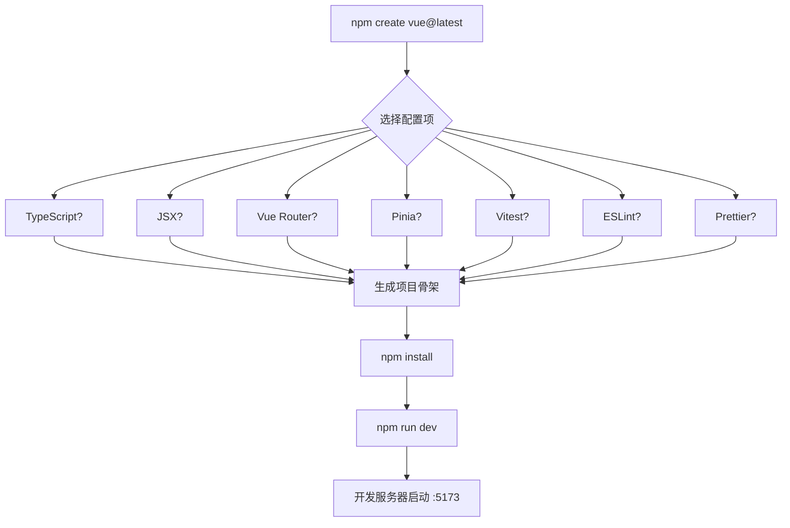
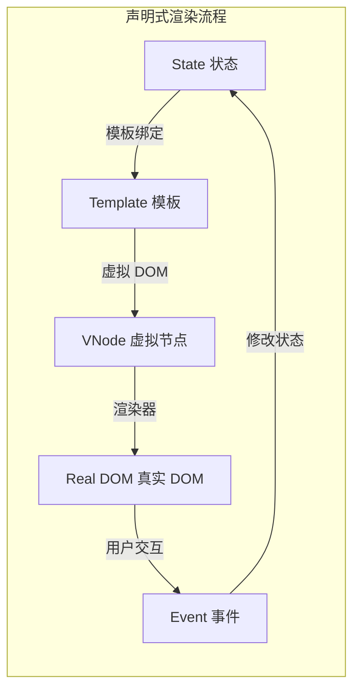
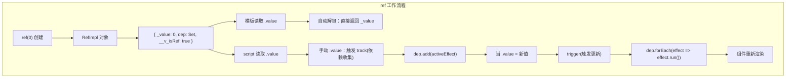
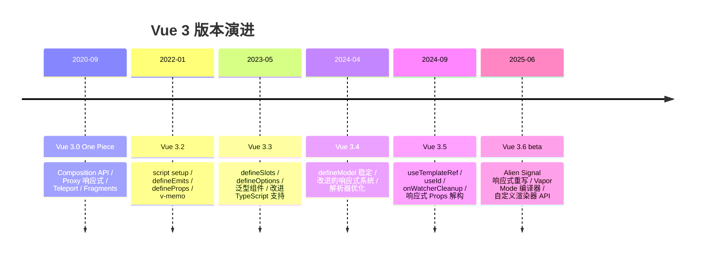

# 快速入门

> 本节将帮助你快速上手 Vue 3，从安装到创建第一个应用。预计阅读时间：20 分钟。
>
> **当前最新稳定版：Vue 3.5.42** | Vue 3.6 已进入 RC 阶段 | Vite 8.x | Pinia 4.x | Vue Router 5.x

## 安装方式对比

| 方式 | 适用场景 | 优点 | 缺点 |
|------|---------|------|------|
| CDN | 学习/原型开发 | 快速上手，无需构建 | 不适合生产环境 |
| Vite | 项目开发（推荐） | 极速启动，HMR，SSR 支持 | 需要学习构建工具 |
| Nuxt | 全栈应用 | 开箱即用 SSR/SSG | 学习曲线较高 |

> **Vue CLI 已被官方弃用**，生产项目请使用 Vite 或 Nuxt。

### 使用 CDN

适用于快速学习和原型开发：

```html
<!-- 全局构建版本 -->
<script src="https://unpkg.com/vue@3/dist/vue.global.js"></script>

<!-- ES Module 版本（推荐） -->
<script type="module">
  import { createApp, ref } from 'https://unpkg.com/vue@3/dist/vue.esm-browser.js'
</script>
```

:::: tip 提示
生产环境建议使用 `.prod.js` 版本，体积更小：
```html
<script src="https://unpkg.com/vue@3/dist/vue.global.prod.js"></script>
```
::::

### 使用 Vite（推荐）

Vite 是 Vue 官方推荐的构建工具，提供极速的开发体验：

```bash
# 方式一：官方 create-vue 脚手架（推荐）
npm create vue@latest my-vue-app

# 方式二：Vite 原生模板
npm create vite@latest my-vue-app -- --template vue-ts

# 安装依赖并启动
cd my-vue-app
npm install
npm run dev
```



### 使用 Nuxt（全栈方案）

Nuxt 3 提供基于 Vue 3 的全栈开发体验：

```bash
npx nuxi@latest init my-nuxt-app
cd my-nuxt-app
npm run dev
```

## 项目结构

使用 Vite 创建的 Vue 3 项目结构：

```
my-vue-app/
├── public/               # 静态资源目录（不经过构建处理）
│   └── favicon.ico
├── src/                  # 源代码目录
│   ├── assets/           # 静态资源（会被构建处理）
│   │   └── logo.png
│   ├── components/       # 组件目录
│   │   └── HelloWorld.vue
│   ├── App.vue           # 根组件
│   └── main.ts           # 入口文件（TypeScript）
├── index.html            # HTML 入口
├── package.json          # 项目配置
├── tsconfig.json         # TypeScript 配置
├── vite.config.ts        # Vite 配置
└── vitest.config.ts      # Vitest 测试配置
```

### 关键文件说明

**main.ts - 应用入口**

```typescript
import { createApp } from 'vue'
import App from './App.vue'

// 创建应用实例
const app = createApp(App)

// 可选：注册全局插件
// app.use(router).use(pinia)

// 挂载到 DOM
app.mount('#app')
```

**App.vue - 根组件**

```vue
<script setup lang="ts">
import HelloWorld from './components/HelloWorld.vue'
</script>

<template>
  <div id="app">
    <HelloWorld msg="Welcome to Vue 3" />
  </div>
</template>

<style>
#app {
  font-family: 'Inter', system-ui, -apple-system, sans-serif;
  -webkit-font-smoothing: antialiased;
  -moz-osx-font-smoothing: grayscale;
}
</style>
```

## 创建应用

### Hello World 示例

最简单的 Vue 3 应用：

```html
<!DOCTYPE html>
<html lang="zh-CN">
<head>
  <meta charset="UTF-8">
  <meta name="viewport" content="width=device-width, initial-scale=1.0">
  <title>Vue 3 快速入门</title>
  <script src="/vue.global.js"></script>
</head>
<body>
  <div id="app">
    <h1>{{ message }}</h1>
    <button @click="count++">点击次数: {{ count }}</button>
  </div>

  <script>
    const { createApp, ref } = Vue

    createApp({
      setup() {
        const message = ref('Hello Vue 3!')
        const count = ref(0)
        return { message, count }
      }
    }).mount('#app')
  </script>
</body>
</html>
```

### 使用单文件组件（SFC）

```vue
<script setup lang="ts">
import { ref } from 'vue'

const message = ref('Hello Vue 3!')
const count = ref(0)

function increment() {
  count.value++
}
</script>

<template>
  <div class="container">
    <h1>{{ message }}</h1>
    <button @click="increment">点击次数: {{ count }}</button>
  </div>
</template>

<style scoped>
.container {
  text-align: center;
  padding: 20px;
}

button {
  padding: 10px 20px;
  font-size: 16px;
  cursor: pointer;
  border-radius: 8px;
  border: 1px solid #ccc;
  background: #fff;
  transition: all 0.2s;
}

button:hover {
  border-color: #42b883;
  color: #42b883;
}
</style>
```

## 声明式渲染

Vue 的核心是声明式渲染：通过模板语法将数据声明式地渲染进 DOM。



### 文本插值与属性绑定

```vue
<template>
  <!-- 文本插值：Mustache 语法 -->
  <p>{{ message }}</p>

  <!-- 原始 HTML -->
  <p v-html="rawHtml"></p>

  <!-- 属性绑定：v-bind -->
  <span v-bind:title="dynamicTitle">悬停查看动态标题</span>

  <!-- 缩写形式 -->
  <span :title="dynamicTitle">悬停查看动态标题</span>

  <!-- 动态绑定多个属性 -->
  <div v-bind="objectOfAttrs">一次性绑定多个属性</div>

  <!-- 动态参数 -->
  <a :[attributeName]="url">动态属性名</a>
</template>

<script setup lang="ts">
import { ref } from 'vue'

const message = ref('Hello Vue!')
const rawHtml = ref('<strong>加粗文本</strong>')
const dynamicTitle = ref('这是一个动态绑定的标题')
const attributeName = ref('href')
const url = ref('https://vuejs.org')
const objectOfAttrs = ref({
  id: 'container',
  class: 'wrapper'
})
</script>
```

## 响应式数据

Vue 3 使用 `ref()` 和 `reactive()` 创建响应式数据。

```vue
<script setup lang="ts">
import { ref, reactive } from 'vue'

// ref：包装基本类型
const count = ref(0)
const name = ref('Vue')

// reactive：包装对象
const state = reactive({
  items: ['a', 'b', 'c'],
  loading: false
})

function increment() {
  // 在 script 中需要 .value 访问 ref
  count.value++
}

function addItem() {
  // reactive 直接访问属性
  state.items.push('d')
}
</script>

<template>
  <!-- 在模板中 ref 自动解包，不需要 .value -->
  <button @click="increment">Count: {{ count }}</button>
  <button @click="addItem">Add Item</button>
  <ul>
    <li v-for="item in state.items" :key="item">{{ item }}</li>
  </ul>
</template>
```

### ref 的工作原理



## 条件与循环

### 条件渲染

```vue
<template>
  <!-- v-if：条件为 false 时元素不存在于 DOM -->
  <p v-if="seen">现在你能看到我了</p>

  <!-- v-else：必须紧跟 v-if -->
  <p v-else>现在你看不到我</p>

  <!-- v-else-if：链式条件 -->
  <div v-if="type === 'A'">Type A</div>
  <div v-else-if="type === 'B'">Type B</div>
  <div v-else>Other</div>

  <!-- v-show：始终渲染，切换 display -->
  <p v-show="visible">始终在 DOM 中</p>
</template>

<script setup lang="ts">
import { ref } from 'vue'
const seen = ref(true)
const type = ref('A')
const visible = ref(true)
</script>
```

:::: tip v-if vs v-show 选择指南
- `v-if`：条件很少改变时使用（有切换开销）
- `v-show`：频繁切换时使用（初始渲染开销，无切换开销）
- `v-if` 支持 `<template>` 包装，`v-show` 不支持
::::

### 列表渲染

```vue
<template>
  <ul>
    <li v-for="todo in todos" :key="todo.id">
      {{ todo.text }}
    </li>
  </ul>

  <!-- 解构写法 -->
  <li v-for="{ id, text } in todos" :key="id">
    {{ text }}
  </li>

  <!-- 带索引 -->
  <li v-for="(todo, index) in todos" :key="todo.id">
    {{ index + 1 }}. {{ todo.text }}
  </li>
</template>

<script setup lang="ts">
import { ref } from 'vue'

const todos = ref([
  { id: 1, text: '学习 JavaScript' },
  { id: 2, text: '学习 Vue' },
  { id: 3, text: '创建一个项目' }
])
</script>
```

:::: warning 重要提示
**始终为 `v-for` 提供唯一且稳定的 `key`**，不要使用索引作为 key。这会影响 Vue 的 diff 算法和组件状态的正确性。
::::

## 双向绑定

使用 `v-model` 实现表单双向绑定：

```vue
<template>
  <input v-model="message" placeholder="输入一些内容">
  <p>你输入的是: {{ message }}</p>
</template>

<script setup lang="ts">
import { ref } from 'vue'
const message = ref('')
</script>
```

### v-model 的本质

`v-model` 是语法糖，等价于：

```vue
<template>
  <!-- v-model -->
  <input v-model="text">

  <!-- 等价于 -->
  <input
    :value="text"
    @input="text = $event.target.value"
  >
</template>
```

## 组件化

### 定义组件

```vue
<!-- TodoItem.vue -->
<script setup lang="ts">
import { ref } from 'vue'

// defineProps 编译器宏，无需导入
const props = defineProps<{
  title: string
  completed?: boolean
}>()

const localCompleted = ref(props.completed ?? false)
</script>

<template>
  <li class="todo-item">
    <input type="checkbox" v-model="localCompleted">
    <span :class="{ done: localCompleted }">{{ title }}</span>
  </li>
</template>

<style scoped>
.done {
  text-decoration: line-through;
  color: #999;
}
</style>
```

### 使用组件

```vue
<script setup lang="ts">
import { ref } from 'vue'
import TodoItem from './TodoItem.vue'

const todos = ref([
  { id: 1, text: '学习 Vue 3' },
  { id: 2, text: '创建项目' }
])
</script>

<template>
  <ul class="todo-list">
    <TodoItem
      v-for="todo in todos"
      :key="todo.id"
      :title="todo.text"
    />
  </ul>
</template>
```

## 开发工具

### Vue DevTools

Vue DevTools 是调试 Vue 应用的必备工具，支持 Vite 插件方式集成：

**功能特性：**
- 组件树和组件状态检查
- 事件追踪和自定义事件
- 路由和 Pinia 状态管理
- 性能分析和帧率监控
- 组件渲染时间线

**安装方式：**

```bash
# 方式一：Vite 插件（推荐）
npm i -D vite-plugin-vue-devtools
```

```ts
// vite.config.ts
import VueDevTools from 'vite-plugin-vue-devtools'

export default {
  plugins: [VueDevTools()]
}
```

- 浏览器扩展：[Chrome Web Store](https://chromewebstore.google.com/detail/vuejs-devtools/nhdogjmejiglipccpnnnanhbledajbpd)
- 独立应用：[Vue DevTools](https://devtools.vuejs.org)

### VS Code 推荐插件

| 插件 | 用途 |
|------|------|
| Vue - Official | Vue 语法高亮、智能提示、类型检查（Volar 替代） |
| Vue VSCode Snippets | 代码片段 |
| ESLint | 代码检查 |
| Prettier | 代码格式化 |
| Vitest | 测试运行与调试 |

> **Vue - Official** 是官方推荐的 Vue 3 插件，已取代 Volar。Vetur 已不再维护，Vue 3 项目请禁用 Vetur。

## Vue 3 版本演进与最新特性



### Vue 3.5 核心新特性

| 特性 | 说明 |
|------|------|
| `useTemplateRef()` | 类型安全的模板引用，替代传统 ref 字符串 |
| `useId()` | 生成应用级唯一 ID，用于无障碍属性 |
| `onWatcherCleanup()` | 在 watch 回调中注册清理函数 |
| 响应式 Props 解构 | 直接解构 `defineProps` 并保持响应性 |
| `defineModel` 稳定 | 正式进入稳定阶段 |
| SSR 改进 | `useId`、Suspense 水合优化 |
| 内存优化 | 响应式系统内存占用降低 56% |

### Vue 3.6 Beta 方向

| 方向 | 说明 |
|------|------|
| Alien Signal | 新的响应式原语，基于信号提案，性能大幅提升 |
| Vapor Mode | 无虚拟 DOM 编译模式，直接生成 DOM 操作 |
| 自定义渲染器 | 支持非 DOM 渲染目标（Canvas、WebGL 等） |

## 与 Vue 2 的区别

| 特性 | Vue 2 | Vue 3 |
|------|-------|-------|
| 创建应用 | `new Vue()` | `createApp()` |
| API 风格 | Options API | Composition API + Options API |
| 响应式 | `Object.defineProperty` | `Proxy` |
| 根节点 | 单根节点要求 | 多根节点（Fragments） |
| 生命周期 | `beforeCreate` 等 | `onBeforeMount` 等组合式钩子 |
| 全局 API | `Vue.xxx` | `app.xxx` 实例方法 |
| TypeScript | 需要额外配置 | 原生支持 |
| 构建工具 | Vue CLI | Vite |
| 状态管理 | Vuex | Pinia |
| 过滤器 | 支持 | ❌ 已移除 |
| 事件总线 | `$on/$off/$once` | ❌ 已移除，推荐 mitt |

### 代码对比

**Vue 2 Options API：**

```javascript
export default {
  data() {
    return {
      count: 0
    }
  },
  methods: {
    increment() {
      this.count++
    }
  },
  mounted() {
    console.log('mounted')
  }
}
```

**Vue 3 Composition API：**

```vue
<script setup lang="ts">
import { ref, onMounted } from 'vue'

const count = ref(0)

function increment() {
  count.value++
}

onMounted(() => {
  console.log('mounted')
})
</script>
```

## 常见问题

### 1. 为什么使用 `ref` 需要 `.value`？

`ref` 将基本类型值包装成一个响应式对象，`.value` 是访问这个值的唯一方式。JavaScript 的 Proxy 只能代理对象，无法直接拦截基本类型的访问。

```javascript
// 基本类型无法被 Proxy 直接代理
let num = 0
// 无法拦截 num = 1

// ref 包装后可以被追踪
const numRef = ref(0)
numRef.value = 1  // 可以追踪
```

### 2. Options API 和 Composition API 如何选择？

| 场景 | 推荐 |
|------|------|
| 新建项目 | Composition API（`<script setup>`） |
| 小型/简单组件 | 两者皆可 |
| 大型复杂项目 | Composition API |
| 逻辑复用 | Composition API（组合式函数） |
| Vue 2 迁移 | 可先用 Options API 过渡 |
| 团队 Vue 2 背景 | 逐步迁移到 Composition API |

### 3. 为什么我的组件没有更新？

排查清单：

1. ✅ 确保使用了响应式 API（`ref`、`reactive`）
2. ✅ 修改 `ref` 时使用了 `.value`
3. ✅ 数组/对象修改符合响应式要求（直接用索引修改数组可能不触发更新）
4. ✅ 没有解构丢失响应式（使用 `toRefs` 或 `reactive` 包装）
5. ✅ 检查是否正确使用了 `computed` 和 `watch`

### 4. Vue 3 支持 IE11 吗？

**不支持。** Vue 3 使用 Proxy 实现响应式，Proxy 无法被 polyfill。如需支持 IE11，请使用 Vue 2.7。

## 下一步

- [应用实例与 createApp](04-应用实例与响应式基础.md) - 深入了解应用实例的创建与配置
- [模板语法](06-模板语法.md) - 学习更多模板语法和指令
- [响应式基础](04-应用实例与响应式基础.md) - 理解响应式系统的核心原理