# 应用实例与 createApp

> Vue 3 使用 `createApp` 创建应用实例，这是 Vue 3 相对于 Vue 2 的核心变化之一。理解应用实例的生命周期与架构对于开发 Vue 应用至关重要。
>
> **相关 API：** `createApp` / `app.mount` / `app.unmount` / `app.use` / `app.config` / `app.provide`

## createApp 基础

### 创建应用实例

```typescript
import { createApp } from 'vue'
import type { App } from 'vue'

const app: App = createApp({
  // 根组件选项
})
```

### 挂载应用

```typescript
app.mount('#app')
```

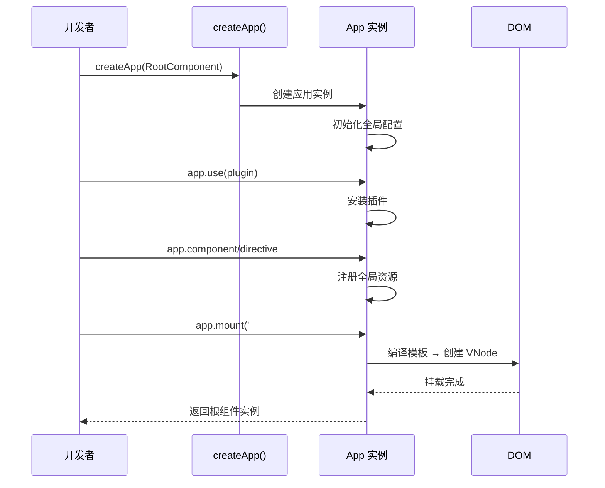

完整示例：

```html
<!DOCTYPE html>
<html lang="zh-CN">
<head>
  <meta charset="UTF-8">
  <title>Vue 3 App</title>
</head>
<body>
  <div id="app">
    {{ message }}
  </div>

  <script type="module">
    import { createApp, ref } from 'vue'

    const app = createApp({
      setup() {
        const message = ref('Hello Vue 3!')
        return { message }
      }
    })

    app.mount('#app')
  </script>
</body>
</html>
```

## 应用实例架构

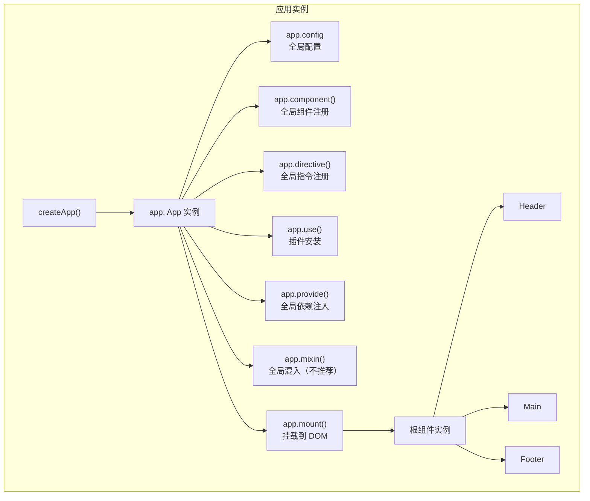

## 应用实例的配置

### app.config

```typescript
import { createApp } from 'vue'
import type { App } from 'vue'

const app: App = createApp({})

// 全局错误处理
app.config.errorHandler = (err: unknown, instance, info: string) => {
  console.error('全局错误:', err)
  // 发送到错误监控服务（Sentry、LogRocket 等）
}

// 警告处理（开发环境）
app.config.warnHandler = (msg: string, instance, trace: string) => {
  console.warn('警告:', msg)
}

// 性能追踪（开发环境）
app.config.performance = true

// 编译器选项：自定义元素识别
app.config.compilerOptions.isCustomElement = (tag: string) => tag.startsWith('x-')

// 全局属性（替代 Vue 2 的 Vue.prototype）
app.config.globalProperties.$http = () => {}
app.config.globalProperties.$translate = (key: string) => {
  // 国际化翻译函数
  return key
}

// TypeScript 类型声明增强
declare module 'vue' {
  interface ComponentCustomProperties {
    $http: () => void
    $translate: (key: string) => string
  }
}
```

### app.component

注册全局组件：

```typescript
import MyComponent from './MyComponent.vue'

// 注册导入的 SFC 组件
app.component('MyComponent', MyComponent)

// 注册内联组件
app.component('MyButton', {
  template: '<button>点击我</button>',
  props: ['label']
})

// 链式注册
app
  .component('ComponentA', ComponentA)
  .component('ComponentB', ComponentB)
  .component('ComponentC', ComponentC)
```

### app.directive

注册全局指令：

```typescript
// 注册自定义指令（完整写法）
app.directive('focus', {
  mounted(el: HTMLElement) {
    el.focus()
  }
})

// 简写形式（mounted + updated）
app.directive('color', (el: HTMLElement, binding) => {
  el.style.color = binding.value
})

// 使用
// <input v-focus>
// <p v-color="'red'">红色文字</p>
```

### app.use

安装插件：

```typescript
import router from './router'
import pinia from './stores'
import i18n from './i18n'

app.use(router)
app.use(pinia)
app.use(i18n, { /* 插件选项 */ })

// 链式调用
app
  .use(router)
  .use(pinia)
  .use(i18n)
```

### app.provide

提供全局依赖注入（应用级）：

```typescript
import type { InjectionKey } from 'vue'

// 使用 InjectionKey 提供类型安全
interface AppConfig {
  theme: 'light' | 'dark'
  locale: string
}

export const configKey: InjectionKey<AppConfig> = Symbol('config')

app.provide(configKey, {
  theme: 'dark',
  locale: 'zh-CN'
})

// 在任何组件中使用
import { inject } from 'vue'
const config = inject(configKey)
// config 类型自动推断为 AppConfig | undefined
```

## 生命周期钩子

### 生命周期流程图

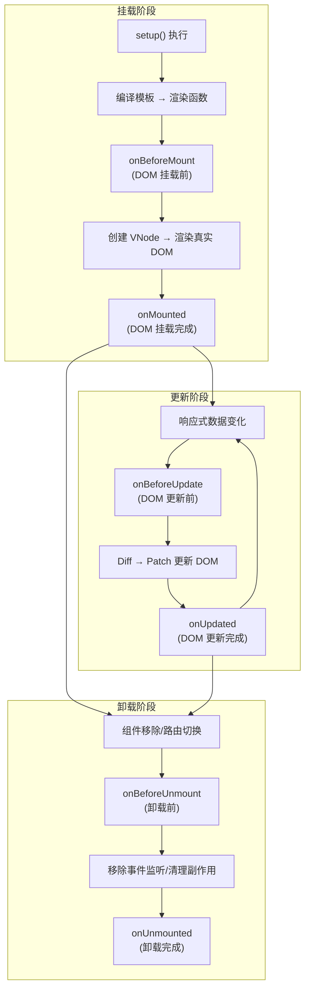

### 组合式 API 钩子

```vue
<script setup lang="ts">
import {
  onBeforeMount,
  onMounted,
  onBeforeUpdate,
  onUpdated,
  onBeforeUnmount,
  onUnmounted,
  onErrorCaptured,
  onRenderTracked,    // 调试用：依赖被追踪时
  onRenderTriggered,  // 调试用：依赖触发更新时
  onActivated,        // KeepAlive 激活时
  onDeactivated       // KeepAlive 停用时
} from 'vue'

// setup 本身替代了 beforeCreate 和 created
console.log('setup 执行，相当于 created 阶段')

onBeforeMount(() => {
  console.log('DOM 挂载前')
})

onMounted(() => {
  console.log('DOM 挂载完成，可安全访问 DOM')
})

onBeforeUpdate(() => {
  console.log('数据变更，DOM 更新前')
})

onUpdated(() => {
  console.log('DOM 更新完成')
})

onBeforeUnmount(() => {
  console.log('组件卸载前，实例仍完全可用')
})

onUnmounted(() => {
  console.log('组件卸载完成')
  // 清理定时器、事件监听器、取消请求等
})

onErrorCaptured((err, instance, info) => {
  console.error('捕获子组件错误:', err, info)
  return false // 阻止错误继续向上传播
})
</script>
```

### Options API 与 Composition API 对照

| Options API | Composition API | 说明 |
|-------------|-----------------|------|
| `beforeCreate` | — | `setup()` 替代 |
| `created` | — | `setup()` 替代 |
| `beforeMount` | `onBeforeMount` | DOM 挂载前，模板编译完成 |
| `mounted` | `onMounted` | DOM 挂载后，可访问 DOM |
| `beforeUpdate` | `onBeforeUpdate` | 数据变更后，DOM 更新前 |
| `updated` | `onUpdated` | DOM 更新完成 |
| `beforeUnmount` | `onBeforeUnmount` | 组件卸载前 |
| `unmounted` | `onUnmounted` | 组件卸载完成 |
| `errorCaptured` | `onErrorCaptured` | 捕获子组件错误 |
| `renderTracked` | `onRenderTracked` | 调试：响应式依赖被追踪 |
| `renderTriggered` | `onRenderTriggered` | 调试：响应式依赖触发更新 |
| `activated` | `onActivated` | KeepAlive 激活时 |
| `deactivated` | `onDeactivated` | KeepAlive 停用时 |
| `serverPrefetch` | `onServerPrefetch` | SSR 服务端预取数据 |

### 生命周期使用场景

```vue
<script setup lang="ts">
import { ref, onMounted, onUnmounted } from 'vue'

const data = ref<Record<string, unknown> | null>(null)
let timer: ReturnType<typeof setInterval> | null = null

// ✅ 数据请求
onMounted(async () => {
  const response = await fetch('/api/data')
  data.value = await response.json()
})

// ✅ DOM 访问
const elementRef = ref<HTMLElement | null>(null)
onMounted(() => {
  // elementRef.value 此时可用
  elementRef.value?.focus()
})

// ✅ 定时器 + 事件监听
onMounted(() => {
  timer = setInterval(() => {
    console.log('定时任务')
  }, 1000)
  window.addEventListener('resize', handleResize)
})

// ✅ 清理工作
onUnmounted(() => {
  if (timer) clearInterval(timer)
  window.removeEventListener('resize', handleResize)
})

function handleResize() {
  console.log('窗口大小改变')
}
</script>
```

## 应用实例 vs Vue 2 全局 API

| Vue 2 | Vue 3 | 说明 |
|-------|-------|------|
| `new Vue()` | `createApp()` | 创建应用 |
| `Vue.component()` | `app.component()` | 注册全局组件 |
| `Vue.directive()` | `app.directive()` | 注册全局指令 |
| `Vue.mixin()` | `app.mixin()` | 全局混入（都不推荐） |
| `Vue.use()` | `app.use()` | 安装插件 |
| `Vue.prototype.$xxx` | `app.config.globalProperties` | 全局属性 |
| `Vue.config.errorHandler` | `app.config.errorHandler` | 错误处理 |
| `Vue.filter()` | ❌ 已移除 | 使用计算属性或方法替代 |
| `Vue.extend()` | ❌ 已移除 | 使用 `defineComponent` 替代 |
| `$on/$off/$once` | ❌ 已移除 | 使用 mitt 或 composition API |

### 为什么使用 createApp？

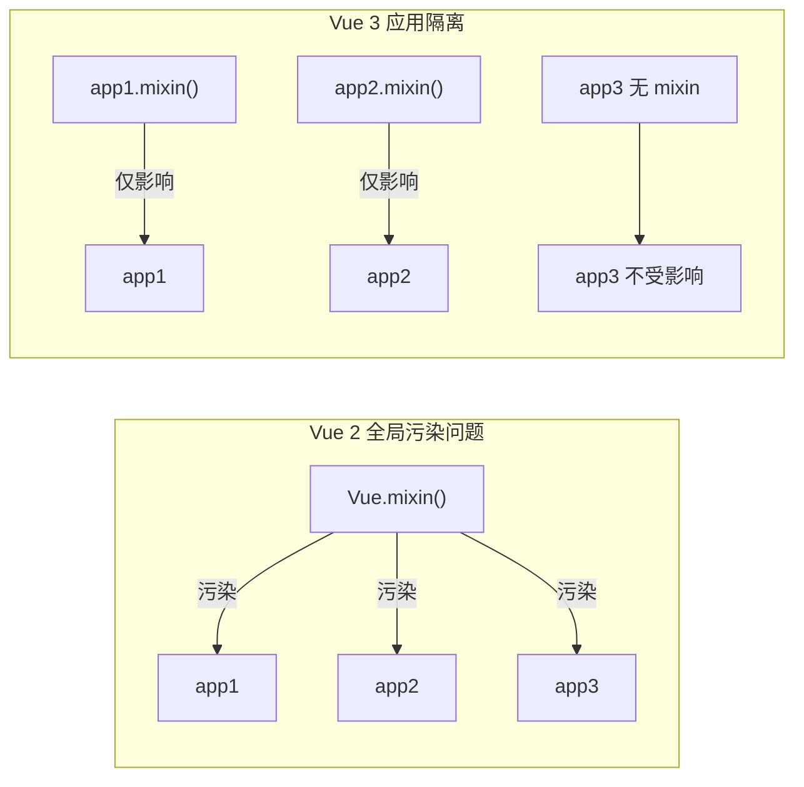

```typescript
// Vue 2 问题：全局 API 影响所有实例
Vue.mixin({ /* 全局混入，影响所有实例 */ })
const app1 = new Vue({ /* ... */ })
const app2 = new Vue({ /* ... */ })
// app1 和 app2 都会受到 mixin 影响

// Vue 3 解决方案：应用实例相互隔离
const app1 = createApp({ /* ... */ })
app1.mixin({ /* 只影响 app1 */ })

const app2 = createApp({ /* ... */ })
// app2 不受 app1 的 mixin 影响
```

## 多应用实例

Vue 3 支持在同一页面创建多个独立的应用实例，每个实例拥有独立的配置、组件和状态：

```typescript
import { createApp } from 'vue'

// 左侧聊天窗口
import ChatApp from './ChatApp.vue'
const chatApp = createApp(ChatApp)
chatApp.use(chatPlugin)
chatApp.mount('#chat-app')

// 右侧仪表板
import DashboardApp from './DashboardApp.vue'
const dashboardApp = createApp(DashboardApp)
dashboardApp.use(dashboardPlugin)
dashboardApp.mount('#dashboard-app')
```

## 根组件

```typescript
import { createApp, ref, defineComponent } from 'vue'

// 方式1：使用单文件组件（推荐 ✅）
import App from './App.vue'
const app = createApp(App)

// 方式2：defineComponent + Options API
const app = createApp(defineComponent({
  data() {
    return { message: 'Hello' }
  }
}))

// 方式3：defineComponent + Composition API
const app = createApp(defineComponent({
  setup() {
    const message = ref('Hello')
    return { message }
  }
}))
```

## 链式调用

```typescript
createApp(App)
  .use(router)
  .use(pinia)
  .component('MyButton', MyButton)
  .directive('focus', focusDirective)
  .provide(configKey, defaultConfig)
  .mount('#app')
```

## mount 的返回值

`mount()` 返回的是根组件实例，而非应用实例，这是一个常见的陷阱：

```typescript
const app = createApp({
  setup() {
    const count = ref(0)
    const increment = () => count.value++
    // 暴露给模板和外部
    return { count, increment }
  }
})

// mount 返回组件实例（不是 app）
const rootInstance = app.mount('#app')

// 可以访问组件的公共属性和方法
console.log(rootInstance.count)       // 0
rootInstance.increment()              // 调用暴露的方法
console.log(rootInstance.count)       // 1

// 但 app 仍然可用，用于后续操作
app.unmount() // 卸载应用
```

## 卸载应用

```typescript
const app = createApp({ /* ... */ })
app.mount('#app')

// 卸载应用：触发所有组件的 onUnmounted 钩子，移除 DOM
app.unmount()

// 注意：卸载后，app 实例不可再 mount
// app.mount('#other') ❌ 开发环境警告 "App has already been mounted"，不会重新挂载
// 如需重新挂载，应重新调用 createApp 创建应用
```

## 在 DOM 中使用模板 vs 字符串模板

### DOM 内模板

```html
<div id="app">
  <p>{{ message }}</p>
</div>

<script type="module">
  import { createApp } from 'vue'
  createApp({
    data() {
      return { message: 'Hello' }
    }
  }).mount('#app')
</script>
```

:::: warning 注意
DOM 内模板会受到 HTML 解析规则的限制：
- 标签名不区分大小写，需要使用 kebab-case
- 不能使用自闭合标签（如 `<my-component />`）
- 部分 HTML 元素对子元素类型有限制（如 `<table>` 内只能有 `<tr>`）

建议使用单文件组件或字符串模板避免这些限制。
::::

### 字符串模板

```typescript
createApp({
  template: `
    <div>
      <p>{{ message }}</p>
    </div>
  `,
  data() {
    return { message: 'Hello' }
  }
}).mount('#app')
```

### 单文件组件（推荐 ✅）

```vue
<!-- App.vue -->
<script setup lang="ts">
import { ref } from 'vue'
const message = ref('Hello')
</script>

<template>
  <div>
    <p>{{ message }}</p>
  </div>
</template>
```

## 最佳实践

### 应用初始化推荐结构

```typescript
// main.ts
import { createApp } from 'vue'
import type { App } from 'vue'
import App from './App.vue'
import router from './router'
import pinia from './stores'
import i18n from './i18n'

// 导入全局样式
import '@/assets/main.css'

// 创建应用实例
const app: App = createApp(App)

// 1. 全局错误处理
app.config.errorHandler = (err, instance, info) => {
  console.error('全局错误:', err)
  // 上报到监控系统
}

// 2. 安装插件（按依赖顺序）
app.use(pinia)
app.use(router)
app.use(i18n)

// 3. 注册全局组件（仅高频使用的 Base 组件）
import BaseButton from '@/components/base/BaseButton.vue'
app.component('BaseButton', BaseButton)

// 4. 提供全局配置
app.provide('apiUrl', import.meta.env.VITE_API_URL)

// 5. 最后挂载
app.mount('#app')
```

### 避免全局污染

```typescript
// ❌ 不推荐：注册过多的全局组件
app.component('Button1', Button1)
app.component('Button2', Button2)
app.component('Button3', Button3)
// ... 污染全局注册表

// ✅ 推荐：按需导入，在需要的组件中局部注册
import Button1 from '@/components/Button1.vue'
// 局部注册不需要显式注册，import 即可使用
```

## 常见问题

### 1. 为什么 `onMounted` 不执行？

确保在 `setup` 函数或 `<script setup>` 中同步调用：

```vue
<script setup lang="ts">
import { onMounted } from 'vue'

// ✅ 正确位置：setup 同步调用
onMounted(() => {
  console.log('mounted')
})
</script>
```

```vue
<script setup lang="ts">
// ❌ 错误位置：异步回调中调用
setTimeout(() => {
  onMounted(() => {}) // 不执行！生命周期钩子必须在 setup 同步阶段注册
}, 0)
</script>
```

### 2. 如何在组件外使用 Vue API？

```typescript
// 在普通 .ts 文件中
import { ref, computed, watch } from 'vue'

// 响应式 API 可以在组件外使用 ✅
const count = ref(0)
const doubled = computed(() => count.value * 2)

// 生命周期钩子需要在组件上下文中调用 ❌
// onMounted(() => {}) // 报错
```

### 3. 如何获取应用实例？

```typescript
import { getCurrentInstance } from 'vue'

// 在组件 setup 中获取
const instance = getCurrentInstance()
const app = instance?.appContext.app

// 获取全局配置
const globalConfig = instance?.appContext.config.globalProperties
```

:::: warning 注意
`getCurrentInstance` 只能在 `setup` 或生命周期钩子中同步调用，主要用于插件和高级场景。在应用代码中应避免使用。
::::

### 4. `createApp` 和 `defineComponent` 的区别？

| API | 用途 | 返回值 |
|-----|------|--------|
| `createApp()` | 创建应用实例 | `App` 实例 |
| `defineComponent()` | 定义组件（类型推断辅助） | 组件选项对象 |

`defineComponent` 主要用于 TypeScript 类型推断，Vue 3 中没有运行时行为，但在 `<script setup>` 中通常不需要显式使用。

## 下一步

- [模板语法](06-模板语法.md) - 学习 Vue 模板语法和指令
- [响应式原理](09-响应式数据实现原理.md) - 理解响应式系统
- [组件通信](12-组件通信机制.md) - 学习组件间通信与生命周期实践

---

## 响应式基础

> Vue 3 使用 Proxy 实现响应式系统，提供 `ref` 和 `reactive` 两种主要的响应式 API。理解响应式原理是掌握 Vue 的关键。
>
> **Vue 3.5 稳定版（最新 3.5.42）** | Vue 3.6 beta 引入 Alien Signal 响应式原语 | 响应式系统内存占用降低 56%

## 响应式系统概述

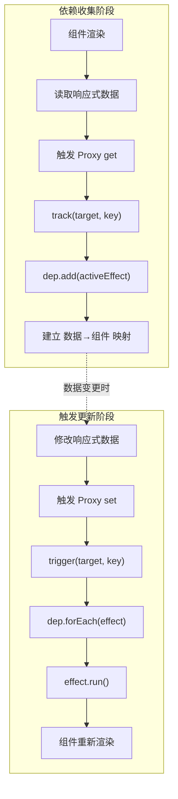

## ref

`ref` 用于创建响应式引用，可以包装任何类型的值。它是 Vue 3 官方推荐的默认响应式 API。

### 基本用法

```vue
<script setup lang="ts">
import { ref, type Ref } from 'vue'

// 类型自动推断：Ref<number>
const count = ref(0)

// 显式类型标注
const message: Ref<string> = ref('Hello')
const user = ref<User | null>(null)

function increment() {
  count.value++
}
</script>

<template>
  <div>{{ count }}</div>
  <button @click="increment">+1</button>
</template>
```

### ref 内部结构

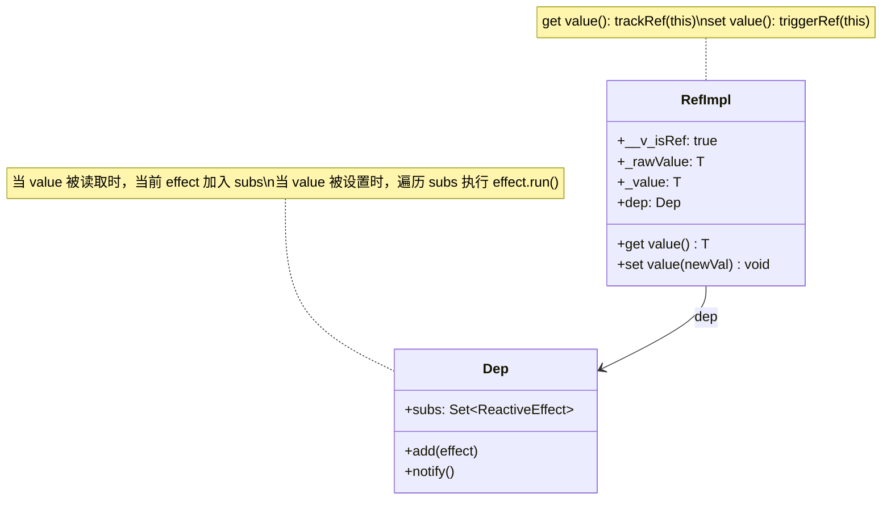

### ref 的类型支持

```typescript
import { ref, type Ref, type MaybeRef } from 'vue'

// 基本类型
const num = ref(0)           // Ref<number>
const str = ref('hello')     // Ref<string>
const bool = ref(true)       // Ref<boolean>

// 对象类型
const obj = ref({ name: 'Vue' })   // Ref<{ name: string }>
const arr = ref([1, 2, 3])         // Ref<number[]>

// 联合类型
const data = ref<string | null>(null)  // Ref<string | null>

// 接口类型
interface User {
  id: number
  name: string
  email?: string
}
const user = ref<User>({ id: 1, name: '张三' })

// 泛型组件中的 ref
function useAsyncData<T>(initialValue: T) {
  const data = ref<T>(initialValue)
  const loading = ref(false)
  // ...
  return { data, loading }
}
```

### 模板中自动解包

```vue
<template>
  <!-- 顶层 ref 自动解包，不需要 .value -->
  <div>{{ count }}</div>

  <!-- 嵌套在对象中的 ref 也会解包 -->
  <div>{{ user.name }}</div>

  <!-- 注意：在插值表达式中作为最终值才解包 -->
  <div>{{ count + 1 }}</div>  <!-- count 先解包再计算 -->
</template>

<script setup lang="ts">
import { ref } from 'vue'

const count = ref(0)
const user = ref({ name: 'Vue' })
</script>
```

### 响应式丢失问题

```typescript
import { ref } from 'vue'

const count = ref(0)

// ❌ 解构丢失响应式
let { value } = count
value = 10 // count 不会更新

// ✅ 保持整个 ref 引用
const countRef = count
countRef.value = 10 // 正常更新

// ❌ 函数参数解构丢失
function badUseCount({ value }: Ref<number>) {
  return value // 返回的是静态值，不是响应式
}

// ✅ 传递整个 ref
function goodUseCount(countRef: Ref<number>) {
  return countRef // 保持响应式
}
```

## reactive

`reactive` 用于创建响应式对象，返回原始对象的 Proxy 代理。

### 基本用法

```vue
<script setup lang="ts">
import { reactive } from 'vue'

interface FormState {
  username: string
  password: string
  remember: boolean
  errors: Record<string, string>
}

const form = reactive<FormState>({
  username: '',
  password: '',
  remember: false,
  errors: {}
})

// 直接访问属性，不需要 .value
form.username = 'admin'
form.errors.username = '用户名不能为空'
</script>

<template>
  <div>{{ form.username }}</div>
</template>
```

### reactive 内部结构

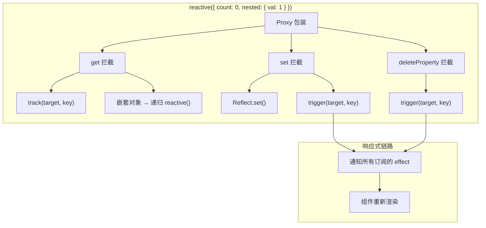

### reactive 的局限性

```typescript
import { reactive, toRefs } from 'vue'

const state = reactive({ count: 0 })

// ❌ 不能直接替换整个对象
// state = reactive({ count: 1 }) // 失去响应式（赋值给变量本身）

// ❌ 解构会失去响应式
let { count } = state
count++ // 不会触发更新！

// ✅ 使用 toRefs 保持响应式
const { count: countRef } = toRefs(state)
countRef.value++ // 触发更新

// ❌ 不能用于基本类型
// const num = reactive(0) // 无效：开发环境警告，原样返回非响应式值

// ❌ 对同一个原始对象调用 reactive 返回同一个 proxy
const raw = { count: 0 }
const proxy1 = reactive(raw)
const proxy2 = reactive(raw)
console.log(proxy1 === proxy2) // true
```

## ref vs reactive 对比

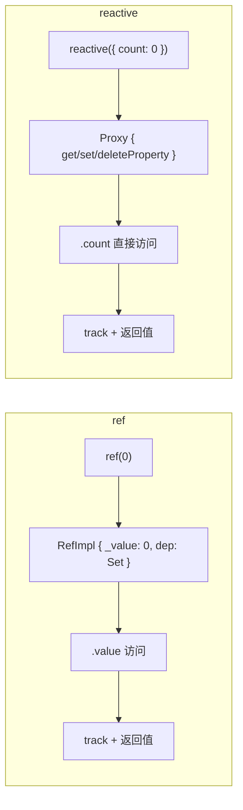

| 特性 | ref | reactive |
|------|-----|----------|
| 适用类型 | **任意类型**（基本类型 + 对象） | **仅对象类型**（Object/Array/Map/Set） |
| 访问方式 | `.value` | 直接访问属性 |
| 解构安全性 | ✅ 安全（RefImpl 本身不会被解构） | ❌ 解构丢失响应式 |
| 整体替换 | ✅ `ref.value = newVal` | ❌ 不能替换整个对象 |
| 模板解包 | ✅ 顶层自动解包 | 不需要解包 |
| 深层响应式 | ✅ 自动（对象值内部转 reactive） | ✅ 自动 |
| TypeScript | `Ref<T>` | `T` 本身 |
| watch 监听 | 需要 `() => ref.value` 或直接传 ref | 需要 getter 函数 |

### 官方推荐

Vue 官方推荐 **统一使用 ref** 作为主要响应式 API：

1. **一致性**：所有响应式数据使用相同方式，降低心智负担
2. **灵活性**：支持任何类型，可整体替换
3. **安全性**：解构不会丢失响应式
4. **可读性**：`.value` 明确表示这是一个响应式引用
5. **TypeScript**：`Ref<T>` 类型更清晰

```typescript
// ✅ 推荐：统一 ref
const count = ref(0)
const user = ref<User | null>(null)
const list = ref<Item[]>([])

// reactive 仅适合特定场景
const form = reactive<FormState>({ /* 表单状态 */ })
```

## toRef 和 toRefs

### toRef

为响应式对象的某个属性创建独立的 ref，保持与原对象的双向同步：

```typescript
import { reactive, toRef } from 'vue'

const state = reactive({
  count: 0,
  name: 'Vue'
})

// 为单个属性创建 ref，双向同步
const countRef = toRef(state, 'count')

countRef.value++
console.log(state.count) // 1

state.count++
console.log(countRef.value) // 2

// 典型场景：将 prop 转为 ref 传给组合式函数
const props = defineProps<{ page: number }>()
const pageRef = toRef(props, 'page')
usePagination(pageRef) // 保持响应式连接
```

### toRefs

将响应式对象转换为普通对象，每个属性都是 ref：

```vue
<script setup lang="ts">
import { reactive, toRefs } from 'vue'

const state = reactive({
  count: 0,
  name: 'Vue'
})

// 解构后每个属性都是 ref，保持响应式
const { count, name } = toRefs(state)

// 现在可以安全解构使用
count.value++
console.log(state.count) // 1
</script>

<template>
  <!-- 模板中自动解包 -->
  <div>{{ count }} - {{ name }}</div>
</template>
```

### toRefs 工作原理

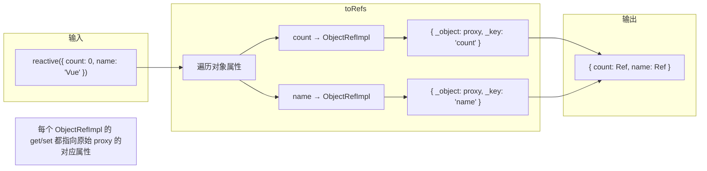

## shallowRef 和 shallowReactive

### shallowRef

只有 `.value` 的访问是响应式的，内部值不做深层响应式处理：

```typescript
import { shallowRef, triggerRef } from 'vue'

const state = shallowRef({ count: 0 })

// ❌ 不会触发更新
state.value.count++

// ✅ 触发更新（替换整个 .value）
state.value = { count: 1 }

// ✅ 手动触发深层更新
state.value.count++
triggerRef(state)
```

### shallowReactive

只有根级别属性是响应式的：

```typescript
import { shallowReactive } from 'vue'

const state = shallowReactive({
  count: 0,
  nested: { value: 1 }
})

state.count++           // ✅ 触发更新
state.nested.value++    // ❌ 不会触发更新
```

### 使用场景

```typescript
// ✅ shallowRef 适用场景

// 1. 大型不可变数据集
const bigDataset = shallowRef<LargeData[]>(immutableData)

// 2. 与第三方库集成（如 Chart.js、Three.js）
const chartInstance = shallowRef<Chart | null>(null)

// 3. 需要手动控制更新时机的场景
const data = shallowRef({ items: [] })
data.value.items.push(newItem)
triggerRef(data) // 手动触发更新

// ✅ shallowReactive 适用场景

// 1. 只有根属性需要响应式的配置对象
const options = shallowReactive({
  theme: 'dark',
  locale: 'zh-CN'
})
```

## 只读响应式

```typescript
import { ref, reactive, readonly } from 'vue'

const original = reactive({ count: 0 })
const copy = readonly(original)

original.count++  // ✅ 可以修改
// copy.count++   // ❌ 警告：目标只读

// readonly 追踪原始对象的响应式变化
// 原始对象变化时，只读副本也会触发更新
```

### 典型使用场景

```typescript
// 1. 组合式函数返回只读状态（封装原则）
function useCounter() {
  const count = ref(0)
  const increment = () => count.value++

  return {
    count: readonly(count),  // 外部只能读不能写
    increment
  }
}

// 2. 全局配置保护
export const appConfig = readonly({
  apiUrl: import.meta.env.VITE_API_URL,
  timeout: 5000,
  retryCount: 3
})

// 3. Provide 只读数据
provide('config', readonly(config))
```

## 响应式判断工具函数

```typescript
import {
  ref, reactive, readonly,
  isRef, isReactive, isReadonly, isProxy,
  toRaw, toRef, toRefs,
  unref
} from 'vue'

const count = ref(0)
const state = reactive({ count: 0 })
const readOnlyState = readonly(state)

// 类型判断
isRef(count)         // true
isReactive(state)    // true
isReadonly(readOnlyState) // true
isProxy(state)       // true
isProxy(readOnlyState) // true
isProxy(count)       // false (ref 不是 proxy)

// 获取原始对象
const raw = toRaw(state)
console.log(raw === state) // false

// unref：ref 则返回 .value，否则返回原值
unref(count)   // 0
unref(123)     // 123

// 类型定义
type MaybeRef<T> = T | Ref<T>
type MaybeRefOrGetter<T> = MaybeRef<T> | (() => T)
```

## 响应式原理：Proxy 实现

### 简化版 reactive 实现

```typescript
// 依赖存储
const targetMap = new WeakMap<object, Map<string | symbol, Set<ReactiveEffect>>>()

function track(target: object, key: string | symbol) {
  if (!activeEffect) return
  let depsMap = targetMap.get(target)
  if (!depsMap) {
    depsMap = new Map()
    targetMap.set(target, depsMap)
  }
  let dep = depsMap.get(key)
  if (!dep) {
    dep = new Set()
    depsMap.set(key, dep)
  }
  dep.add(activeEffect)
}

function trigger(target: object, key: string | symbol) {
  const depsMap = targetMap.get(target)
  if (!depsMap) return
  const dep = depsMap.get(key)
  if (dep) {
    dep.forEach(effect => effect.run())
  }
}

function reactive<T extends object>(target: T): T {
  return new Proxy(target, {
    get(target, key, receiver) {
      track(target, key)
      const result = Reflect.get(target, key, receiver)
      // 深层响应式：嵌套对象自动转为 reactive
      if (typeof result === 'object' && result !== null) {
        return reactive(result)
      }
      return result
    },
    set(target, key, value, receiver) {
      const oldValue = target[key as keyof T]
      const result = Reflect.set(target, key, value, receiver)
      if (oldValue !== value) {
        trigger(target, key)
      }
      return result
    },
    deleteProperty(target, key) {
      const hadKey = Object.prototype.hasOwnProperty.call(target, key)
      const result = Reflect.deleteProperty(target, key)
      if (hadKey && result) {
        trigger(target, key)
      }
      return result
    }
  })
}
```

### Vue 2 vs Vue 3 响应式对比

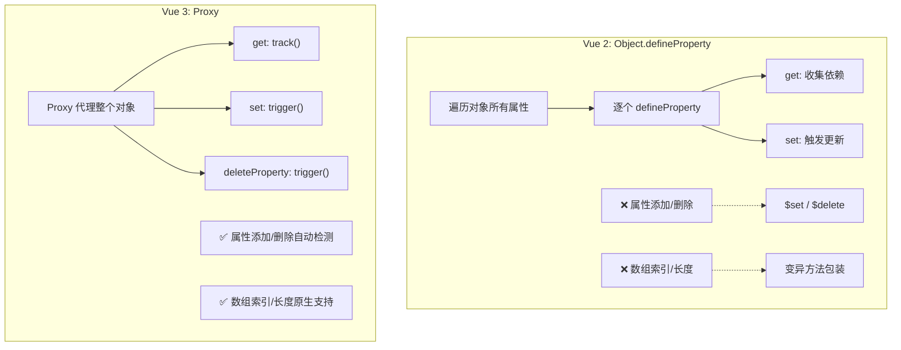

| 操作 | Vue 2 (defineProperty) | Vue 3 (Proxy) |
|------|------------------------|---------------|
| `obj.newProp = value` | ❌ 不响应 | ✅ 响应 |
| `delete obj.prop` | ❌ 不响应 | ✅ 响应 |
| `arr[index] = value` | ❌ 不响应 | ✅ 响应 |
| `arr.length = n` | ❌ 不响应 | ✅ 响应 |
| `Map/Set` 操作 | ❌ 不支持 | ✅ 完整支持 |
| 初始化性能 | 全量遍历 | 惰性代理 |
| 内存占用 | 较高 | 优化后降低 56% |

## Vue 3.5 响应式改进

### 响应式 Props 解构 <Badge text="Vue 3.5+" type="tip"/>

Vue 3.5 允许从 `defineProps` 直接解构并保持响应性：

```vue
<script setup lang="ts">
// Vue 3.5+：直接解构，自动保持响应式
const { title, count = 0 } = defineProps<{
  title: string
  count?: number
}>()

// title 和 count 现在可以直接在 watch 和 computed 中使用
watch(() => title, (newTitle) => {
  console.log('Title changed:', newTitle)
})

// 不需要 toRef 包装！
const doubled = computed(() => count * 2)
</script>
```

### onWatcherCleanup <Badge text="Vue 3.5+" type="tip"/>

在 watch 回调中注册清理函数：

```typescript
import { ref, watch, onWatcherCleanup } from 'vue'

const searchQuery = ref('')

watch(searchQuery, async (query) => {
  let cancelled = false

  // Vue 3.5+：注册清理函数
  onWatcherCleanup(() => {
    cancelled = true
  })

  const results = await fetch(`/api/search?q=${query}`)
  if (!cancelled) {
    // 只有未过期时才更新
    searchResults.value = await results.json()
  }
})
```

## 最佳实践

### 1. 默认使用 ref

```typescript
// ✅ 推荐：ref 作为默认选择
const count = ref(0)
const user = ref<User | null>(null)
const list = ref<Item[]>([])

// reactive 仅在特定场景使用
const form = reactive<FormState>({ /* ... */ })
```

### 2. 避免响应式丢失

```typescript
// ❌ 解构 reactive
const state = reactive({ count: 0 })
const { count } = state  // 丢失响应式

// ✅ 使用 toRefs
const { count } = toRefs(state)

// ✅ 或直接用 ref
const count = ref(0)
```

### 3. 合理使用 shallow API

```typescript
// 大型数据集：shallowRef + 手动触发
const bigData = shallowRef<Row[]>(largeDataset)
function updateData() {
  bigData.value = produceNewData(bigData.value)
}

// 第三方库实例：shallowRef
const chartInstance = shallowRef<Chart | null>(null)
```

### 4. 使用 readonly 封装

```typescript
function useUserStore() {
  const user = ref<User | null>(null)
  const loading = ref(false)

  async function fetchUser(id: string) {
    loading.value = true
    user.value = await api.getUser(id)
    loading.value = false
  }

  return {
    user: readonly(user),     // 外部只读
    loading: readonly(loading), // 外部只读
    fetchUser
  }
}
```

### 5. TypeScript 类型标注

```typescript
import { ref, type Ref, type MaybeRef, type MaybeRefOrGetter } from 'vue'

// 函数参数接受 ref 或普通值
function useFeature<T>(value: MaybeRef<T>) {
  const resolved = computed(() => unref(value))
  // ...
}

// 函数参数接受 ref、普通值或 getter
function useFeature2<T>(source: MaybeRefOrGetter<T>) {
  const resolved = computed(() => toValue(source)) // Vue 3.3+
}
```

## 常见问题

### 1. 为什么 ref 需要 .value？

JavaScript 无法拦截对基本类型的访问。ref 通过将值包装成对象，利用 getter/setter 来追踪变化：

```typescript
let num = 0
num = 1 // 无法拦截！

const numRef = ref(0)
numRef.value = 1 // 可以拦截！通过 RefImpl 的 set value()
```

### 2. reactive 重新赋值后失去响应式怎么办？

```typescript
const state = reactive({ count: 0 })

// ❌ 错误：重新赋值变量
// state = reactive({ count: 1 })

// ✅ 方案1：Object.assign
Object.assign(state, { count: 1 })

// ✅ 方案2：使用 ref（推荐）
const state = ref({ count: 0 })
state.value = { count: 1 } // 保持响应式

// ✅ 方案3：直接修改属性
state.count = 1
```

### 3. ref vs reactive 到底怎么选？

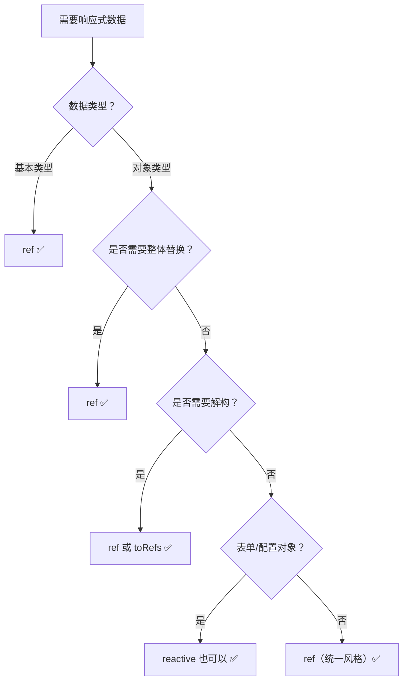

### 4. 如何调试响应式问题？

- 使用 Vue DevTools 查看响应式数据状态
- 使用 `isRef()`、`isReactive()`、`isProxy()` 判断数据类型
- 使用 `toRaw()` 查看原始对象
- 检查是否在 setup 外部使用了响应式 API
- 检查是否解构了 reactive 对象

## 下一步

- [计算属性与侦听器](10-计算属性与侦听器.md) - 学习 computed 和 watch
- [列表渲染](11-条件与列表渲染.md) - 学习列表渲染的响应式特性
- [响应式 API 进阶](../02-Composition-API/01-概述与响应式系统.md) - 深入响应式 API