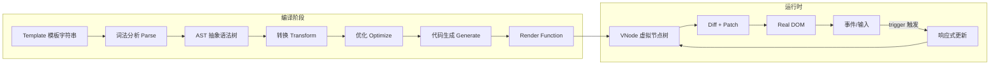
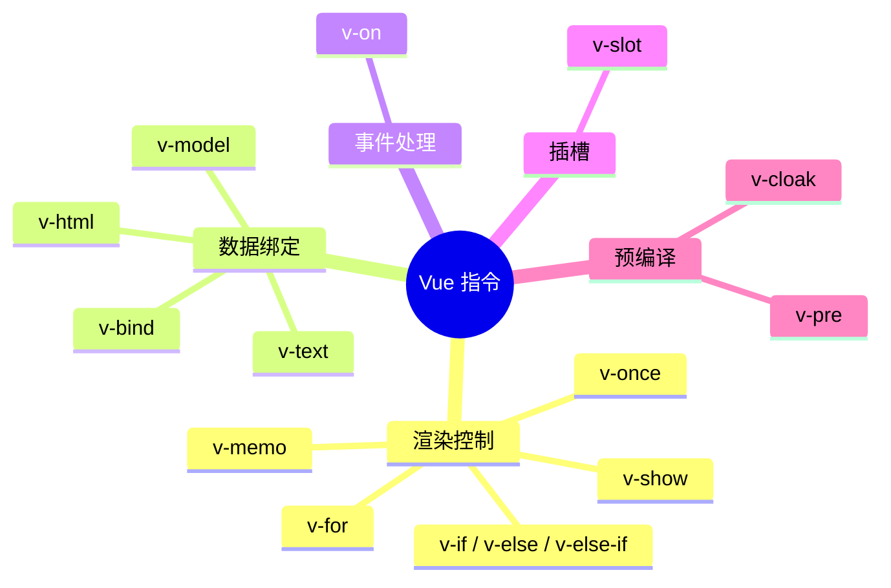
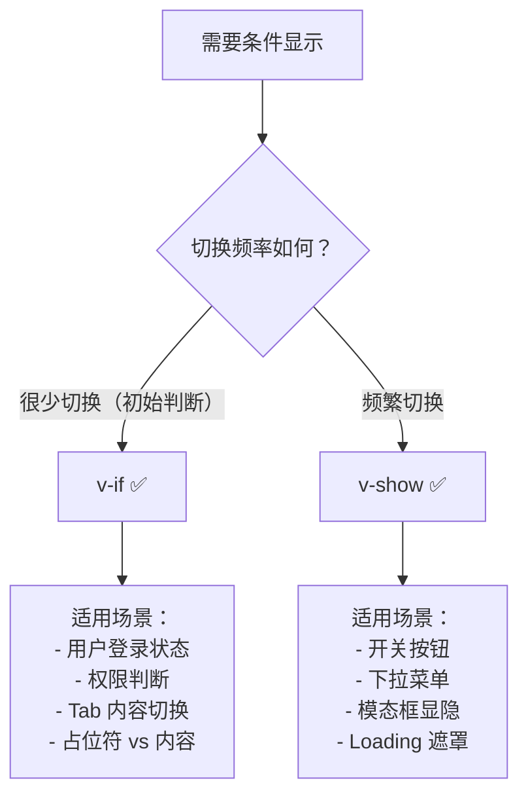
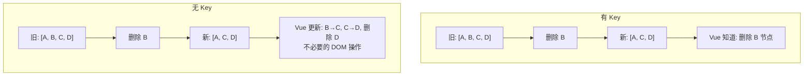

# 模板语法

> Vue 使用基于 HTML 的模板语法，将组件实例的数据声明式地绑定到 DOM。在底层，Vue 会将模板编译为高度优化的虚拟 DOM 渲染函数。
>
> **最新版本：** Vue 3.5 稳定版（最新 3.5.42），Vapor Mode（3.6 beta）提供无虚拟 DOM 的编译路径。

## 模板编译概览



## 文本插值

使用双大括号（Mustache 语法）进行文本插值：

```vue
<template>
  <span>{{ message }}</span>
</template>

<script setup lang="ts">
import { ref } from 'vue'
const message = ref('Hello Vue!')
</script>
```

### JavaScript 表达式

Vue 支持在模板中使用 **单个表达式**：

```vue
<template>
  <!-- ✅ 算术运算 -->
  <p>{{ number + 1 }}</p>

  <!-- ✅ 三元表达式 -->
  <p>{{ ok ? 'YES' : 'NO' }}</p>

  <!-- ✅ 字符串方法 -->
  <p>{{ message.split('').reverse().join('') }}</p>

  <!-- ✅ 调用函数（纯函数） -->
  <p>{{ formatDate(date) }}</p>

  <!-- ✅ 可选链与空值合并 -->
  <p>{{ user?.name ?? '匿名用户' }}</p>

  <!-- ✅ 模板字面量 -->
  <p>{{ `共 ${items.length} 件商品` }}</p>

  <!-- ✅ 数组方法链 -->
  <p>{{ items.map(i => i.price).filter(Boolean).join(', ') }}</p>
</template>

<script setup lang="ts">
import { ref } from 'vue'
const number = ref(10)
const ok = ref(true)
const message = ref('Hello')
const date = ref(new Date())
const user = ref<{ name?: string } | null>(null)
const items = ref([{ price: 100 }, { price: 200 }])

function formatDate(d: Date): string {
  return d.toLocaleDateString('zh-CN')
}
</script>
```

:::: warning 注意
每个绑定只能包含 **单个表达式**，以下写法无效：

```vue
<!-- ❌ 语句 -->
{{ var a = 1 }}

<!-- ❌ 流程控制 -->
{{ if (ok) { return message } }}

<!-- ❌ 复杂逻辑——应放到 computed 或方法中 -->
{{ for (const item of items) { sum += item.price } return sum }}
```
::::

### 原始 HTML

```vue
<template>
  <!-- 使用 v-html 渲染原始 HTML -->
  <div v-html="rawHtml"></div>
</template>

<script setup lang="ts">
import { ref } from 'vue'
const rawHtml = ref('<strong>粗体文本</strong>')
</script>
```

:::: danger 安全警告
`v-html` 可能导致 XSS 攻击。绝不要对用户提供的内容使用 `v-html`，除非你完全信任该内容来源。
::::

## 属性绑定

使用 `v-bind` 指令动态绑定 HTML 属性：

```vue
<template>
  <!-- 完整语法 -->
  <div v-bind:id="dynamicId"></div>

  <!-- 简写语法 -->
  <div :id="dynamicId"></div>
</template>

<script setup lang="ts">
import { ref } from 'vue'
const dynamicId = ref('my-id')
</script>
```

### 动态属性名 <Badge text="Vue 3.0+" type="tip"/>

```vue
<template>
  <!-- 属性名本身也是动态的 -->
  <div :[attributeName]="value"></div>
</template>

<script setup lang="ts">
import { ref } from 'vue'
const attributeName = ref('href')
const value = ref('https://vuejs.org')
</script>
```

### 布尔型属性的特殊处理

```vue
<template>
  <!--
    disabled 为 truthy 时 → <button disabled>
    disabled 为 '' 时      → <button disabled="">
    disabled 为 falsy 时   → 属性被完全移除
  -->
  <button :disabled="isDisabled">按钮</button>

  <!-- 显式绑定 true/false -->
  <button :disabled="true">禁用按钮</button>
  <button :disabled="false">可用按钮</button>
</template>

<script setup lang="ts">
import { ref } from 'vue'
const isDisabled = ref(false)
</script>
```

### 批量绑定属性

```vue
<template>
  <!-- v-bind 无参数时绑定整个对象 -->
  <div v-bind="objectOfAttrs"></div>
</template>

<script setup lang="ts">
import { reactive } from 'vue'

const objectOfAttrs = reactive({
  id: 'container',
  class: 'wrapper primary',
  style: 'color: red; font-size: 14px',
  'data-custom': 'value'
})
</script>
```

## 指令体系

指令是带有 `v-` 前缀的特殊 HTML 属性，Vue 提供了一系列内置指令：



### 指令语法

```
v-directive:argument.modifier1.modifier2="value"
```

```vue
<template>
  <!-- 完整语法 -->
  <a v-bind:href="url">链接</a>

  <!-- 缩写语法 -->
  <a :href="url">链接</a>
  <button @click="handleClick">点击</button>
  <template #header>插槽内容</template>

  <!-- 动态参数：方括号内为 JavaScript 表达式 -->
  <a :[attr]="url">链接</a>
  <button @[event]="handleClick">点击</button>
</template>

<script setup lang="ts">
import { ref } from 'vue'
const attr = ref('href')
const event = ref('click')
const url = ref('https://vuejs.org')

function handleClick() {
  console.log('clicked')
}
</script>
```

### 修饰符大全

```vue
<template>
  <!-- ===== 事件修饰符 ===== -->
  <!-- 阻止事件冒泡 -->
  <div @click.stop="handleClick"></div>

  <!-- 阻止默认行为 -->
  <form @submit.prevent="onSubmit"></form>

  <!-- 事件只在元素自身触发（非子元素） -->
  <div @click.self="handleClick"></div>

  <!-- 捕获阶段触发 -->
  <div @click.capture="handleClick"></div>

  <!-- 只触发一次 -->
  <button @click.once="handleClick"></button>

  <!-- passive：提升滚动性能 -->
  <div @scroll.passive="onScroll"></div>

  <!-- 链式调用（顺序影响行为） -->
  <div @click.stop.prevent="handleClick"></div>

  <!-- ===== 按键修饰符 ===== -->
  <input @keyup.enter="submit" />
  <input @keyup.esc="cancel" />
  <input @keyup.tab="nextInput" />
  <input @keyup.space="add" />
  <input @keyup.delete="deleteItem" />
  <input @keyup.up="moveUp" />
  <input @keyup.down="moveDown" />

  <!-- 系统按键 -->
  <input @keyup.ctrl.enter="ctrlEnter" />
  <input @keyup.alt.enter="altEnter" />
  <input @keyup.shift.enter="shiftEnter" />

  <!-- 鼠标修饰符 -->
  <button @click.left="leftClick">左键</button>
  <button @click.right.prevent="rightClick">右键</button>
  <button @click.middle="middleClick">中键</button>

  <!-- exact：精确匹配 -->
  <button @click.ctrl.exact="ctrlOnly">仅 Ctrl</button>

  <!-- ===== v-model 修饰符 ===== -->
  <input v-model.number="age" />     <!-- 自动转数字 -->
  <input v-model.trim="text" />      <!-- 自动去除空白 -->
  <input v-model.lazy="text" />      <!-- change 时更新而非 input -->
</template>
```

## 条件渲染

### v-if / v-else-if / v-else

```vue
<template>
  <!-- 基础用法 -->
  <p v-if="score >= 90">优秀</p>
  <p v-else-if="score >= 60">及格</p>
  <p v-else>不及格</p>

  <!-- 在 template 上使用 -->
  <template v-if="loggedIn">
    <h1>Welcome back!</h1>
    <p>Here are your notifications</p>
  </template>
</template>

<script setup lang="ts">
import { ref } from 'vue'
const score = ref(85)
const loggedIn = ref(true)
</script>
```

### v-show

```vue
<template>
  <p v-show="visible">通过 CSS display 控制显隐</p>
</template>
```

### v-if vs v-show 选择指南



| 对比维度 | v-if | v-show |
|---------|------|--------|
| 渲染方式 | 条件性渲染（条件假时不渲染） | 始终渲染，仅切换 `display` |
| 切换开销 | 高（销毁/重建组件 + 生命周期） | 低（仅 CSS 属性变化） |
| 初始开销 | 条件假时无开销 | 始终有开销 |
| v-else/v-else-if | ✅ 支持 | ❌ 不支持 |
| template 上使用 | ✅ 支持 | ❌ 不支持 |
| KeepAlive 配合 | ✅ 可以 | 不需要 |

### v-once <Badge text="Vue 3.0+" type="tip"/>

只渲染一次，后续不再更新：

```vue
<template>
  <!-- 只渲染一次，跳过后续更新 -->
  <div v-once>
    <p>{{ expensiveComputation }}</p>
  </div>
</template>
```

### v-memo <Badge text="Vue 3.2+" type="tip"/>

缓存子树，仅在依赖变化时重新渲染：

```vue
<template>
  <!-- 仅当 list 引用变化时才重新渲染 -->
  <div v-memo="[list]">
    <p v-for="item in list" :key="item.id">{{ item.name }}</p>
  </div>

  <!-- 配合空数组 = 永不更新（类似 v-once） -->
  <div v-memo="[]">
    <p>这段内容永远不会更新</p>
  </div>
</template>
```

## 列表渲染

### 基础用法

```vue
<template>
  <!-- 数组遍历 -->
  <li v-for="item in items" :key="item.id">
    {{ item.text }}
  </li>

  <!-- 带索引 -->
  <li v-for="(item, index) in items" :key="item.id">
    {{ index + 1 }}. {{ item.text }}
  </li>

  <!-- 解构 -->
  <li v-for="{ id, text, author: { name } } in items" :key="id">
    {{ name }}: {{ text }}
  </li>
</template>

<script setup lang="ts">
import { ref } from 'vue'

interface Todo {
  id: number
  text: string
  author: { name: string }
}

const items = ref<Todo[]>([
  { id: 1, text: '学习 Vue', author: { name: '张三' } },
  { id: 2, text: '写代码', author: { name: '李四' } }
])
</script>
```

### 遍历对象

```vue
<template>
  <!-- value, key, index -->
  <li v-for="(value, key, index) in user" :key="key">
    {{ index + 1 }}. {{ key }}: {{ value }}
  </li>
</template>

<script setup lang="ts">
import { reactive } from 'vue'

const user = reactive({
  name: '张三',
  age: 25,
  email: 'zhangsan@example.com'
})
</script>
```

### v-for 与 v-if 的优先级

> **Vue 3 中 v-if 优先级高于 v-for（Vue 2 相反）**

```vue
<!-- ❌ 不推荐：Vue 3 中 v-if 先于 v-for 执行，v-if 无法访问 v-for 的作用域变量 item -->
<li v-for="item in items" v-if="item.active" :key="item.id">

<!-- ✅ 推荐：用 computed 先行过滤 -->
<script setup lang="ts">
const activeItems = computed(() => items.value.filter(item => item.active))
</script>

<template>
  <li v-for="item in activeItems" :key="item.id">{{ item.text }}</li>
</template>
```

### key 的重要性



:::: tip key 选择指南
- ✅ 使用唯一的、稳定的标识符（如数据库 ID）
- ✅ 使用 `crypto.randomUUID()` 生成
- ❌ 避免使用数组索引（当列表会重新排序/增删时）
- ❌ 避免使用 `Math.random()` 或 `Date.now()`（每次渲染都不同）
::::

## 事件处理

### 方法处理器

```vue
<template>
  <!-- 内联表达式 -->
  <button @click="count++">{{ count }}</button>

  <!-- 方法绑定 -->
  <button @click="handleClick">点击</button>

  <!-- 访问原生事件对象 -->
  <button @click="handleClick($event, 'custom')">带参数</button>

  <!-- 行内箭头函数 -->
  <button @click="(e) => warn('表单暂不能提交', e)">
    提交
  </button>
</template>

<script setup lang="ts">
import { ref } from 'vue'
const count = ref(0)

function handleClick(event: MouseEvent, customParam: string) {
  console.log(event.target)  // 原生 DOM 元素
  console.log(customParam)   // 'custom'
}
</script>
```

## Class 与 Style 绑定

### 对象语法

```vue
<template>
  <!-- Class 对象绑定 -->
  <div :class="{ active: isActive, 'text-danger': hasError }"></div>

  <!-- 内联 Style 对象绑定（camelCase） -->
  <div :style="{ color: activeColor, fontSize: fontSize + 'px' }"></div>

  <!-- 批量绑定 -->
  <div :class="classObject" :style="styleObject"></div>
</template>

<script setup lang="ts">
import { ref, reactive, computed } from 'vue'

const isActive = ref(true)
const hasError = ref(false)
const activeColor = ref('red')
const fontSize = ref(14)

// 使用 computed 管理复杂 class 逻辑
const classObject = computed(() => ({
  active: isActive.value,
  'text-danger': hasError.value,
  'text-large': fontSize.value > 16
}))

const styleObject = reactive({
  color: 'red',
  fontSize: '14px',
  // CSS 变量
  '--theme-color': '#42b883'
})
</script>
```

### 数组语法

```vue
<template>
  <!-- Class 数组绑定 -->
  <div :class="[activeClass, errorClass]"></div>

  <!-- 条件 class -->
  <div :class="[isActive ? activeClass : '', errorClass]"></div>

  <!-- 数组 + 对象混合 -->
  <div :class="[{ active: isActive }, errorClass]"></div>
</template>
```

## 表单输入绑定

```vue
<template>
  <!-- 文本输入 -->
  <input v-model="text" placeholder="输入文本">

  <!-- 多行文本 -->
  <textarea v-model="text" rows="4"></textarea>

  <!-- 复选框（单个） -->
  <input type="checkbox" v-model="checked" id="agree">
  <label for="agree">同意协议</label>

  <!-- 复选框（多个 - 绑定到数组） -->
  <input type="checkbox" v-model="checkedNames" value="Jack">
  <input type="checkbox" v-model="checkedNames" value="John">

  <!-- 单选按钮 -->
  <input type="radio" v-model="picked" value="one">
  <input type="radio" v-model="picked" value="two">

  <!-- 选择框 -->
  <select v-model="selected">
    <option disabled value="">请选择</option>
    <option value="a">选项 A</option>
    <option value="b">选项 B</option>
  </select>

  <!-- 多选 -->
  <select v-model="multiSelected" multiple>
    <option value="vue">Vue</option>
    <option value="react">React</option>
    <option value="angular">Angular</option>
  </select>
</template>

<script setup lang="ts">
import { ref } from 'vue'
const text = ref('')
const checked = ref(false)
const checkedNames = ref<string[]>([])
const picked = ref('')
const selected = ref('')
const multiSelected = ref<string[]>([])
</script>
```

### v-model 修饰符

| 修饰符 | 作用 | 示例 |
|--------|------|------|
| `.lazy` | `change` 事件后更新（默认 `input`） | `v-model.lazy` |
| `.number` | 自动转为数字类型 | `v-model.number` |
| `.trim` | 自动去除首尾空白字符 | `v-model.trim` |

```vue
<template>
  <input v-model.number="age" type="number">
  <input v-model.trim="text">
  <input v-model.lazy="text">
</template>
```

## 模板引用（Template Refs）

### 基础模板引用

```vue
<template>
  <!-- 声明式模板引用 -->
  <input ref="inputRef" @focus="focusInput" />
</template>

<script setup lang="ts">
import { ref } from 'vue'

// ref 名必须与模板中的 ref 属性值一致
const inputRef = ref<HTMLInputElement | null>(null)

function focusInput() {
  inputRef.value?.focus()
}
</script>
```

### useTemplateRef <Badge text="Vue 3.5+" type="tip"/>

Vue 3.5 新增了 `useTemplateRef`，提供更类型安全的模板引用：

```vue
<template>
  <input ref="myInput" />
  <div ref="myDiv">Content</div>
</template>

<script setup lang="ts">
import { useTemplateRef, onMounted } from 'vue'

// 类型自动推断：Ref<HTMLInputElement | null>
const myInput = useTemplateRef<HTMLInputElement>('myInput')
// 类型自动推断：Ref<HTMLDivElement | null>
const myDiv = useTemplateRef<HTMLDivElement>('myDiv')

onMounted(() => {
  myInput.value?.focus()
  console.log(myDiv.value?.textContent)
})
</script>
```

### v-for 中的模板引用

```vue
<template>
  <li v-for="item in list" ref="itemRefs" :key="item.id">
    {{ item.text }}
  </li>
</template>

<script setup lang="ts">
import { ref, onMounted } from 'vue'

// v-for 中的 ref 会自动收集为数组
const itemRefs = ref<(HTMLElement | null)[]>([])

onMounted(() => {
  // itemRefs.value 是按渲染顺序排列的元素数组
  console.log(itemRefs.value.length)
})
</script>
```

## 编译器选项与 v-pre / v-cloak

### v-pre

跳过元素及其子元素的编译，用于显示原始 Mustache 标签：

```vue
<template>
  <div v-pre>
    <!-- 这将原样显示 {{ rawMustache }} -->
    <span>{{ rawMustache }}</span>
  </div>
</template>
```

### v-cloak

隐藏未编译的模板，直到组件实例就绪：

```vue
<template>
  <!-- 配合 CSS 使用 -->
  <div v-cloak>
    {{ message }}
  </div>
</template>

<style>
[v-cloak] {
  display: none;
}
</style>
```

## 模板语法 vs JSX vs 渲染函数

| 维度 | Template | JSX/TSX | 渲染函数 (h) |
|------|----------|---------|-------------|
| 学习曲线 | 低（类 HTML） | 中 | 高 |
| 编译优化 | ✅ 编译器深度优化 | ⚠️ 部分优化 | ❌ 手动优化 |
| 动态性 | 受限于模板语法 | ✅ 完整 JS 能力 | ✅ 完整 JS 能力 |
| TypeScript | ✅ 支持 | ✅ 完美支持 | ✅ 完美支持 |
| IDE 支持 | ✅ 优秀 | ✅ 良好 | ⚠️ 一般 |
| 适用场景 | 大部分场景 | 高度动态的 UI | 底层库开发 |

## 下一步

- [响应式基础](04-应用实例与响应式基础.md) - 理解 Vue 响应式系统的核心
- [计算属性与侦听器](10-计算属性与侦听器.md) - 学习 computed 和 watch
- [事件处理](08-事件处理与表单绑定.md) - 深入事件系统和修饰符