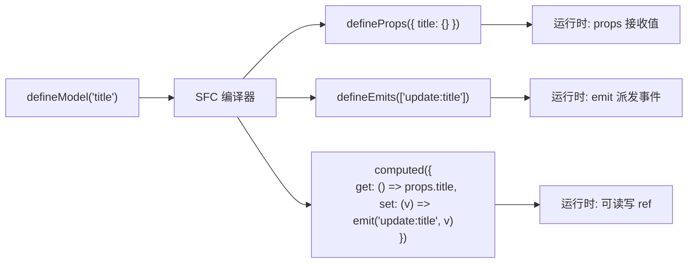
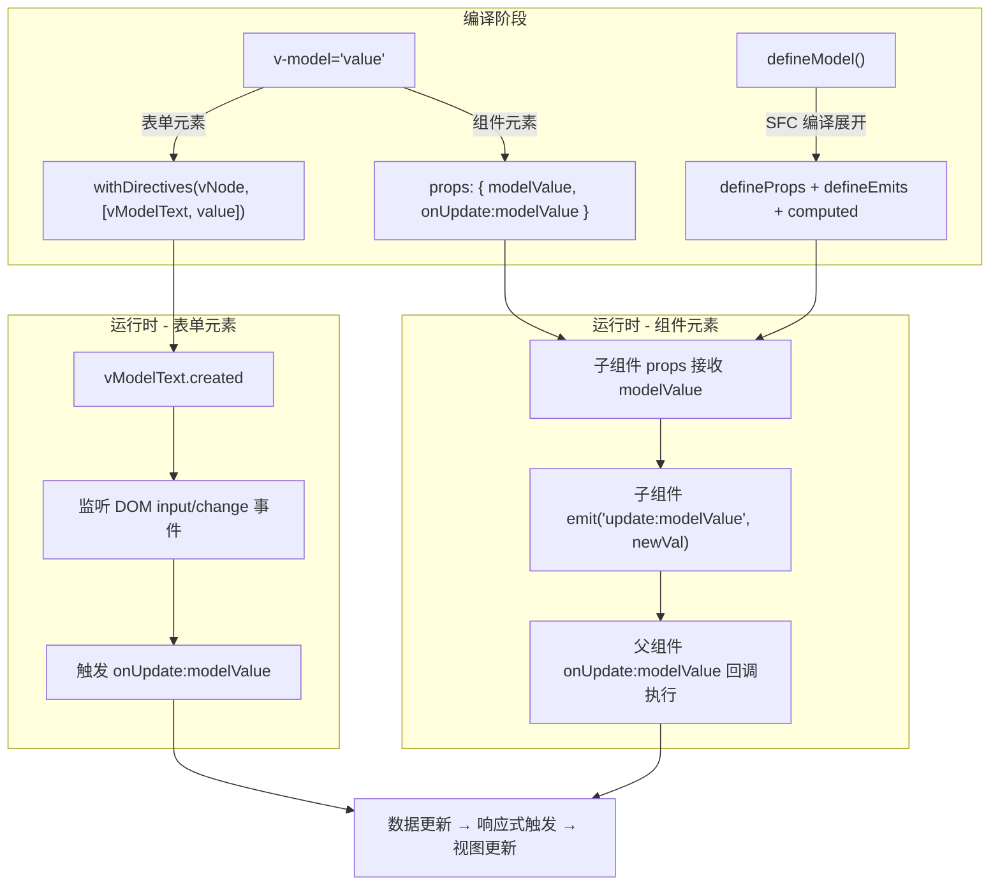
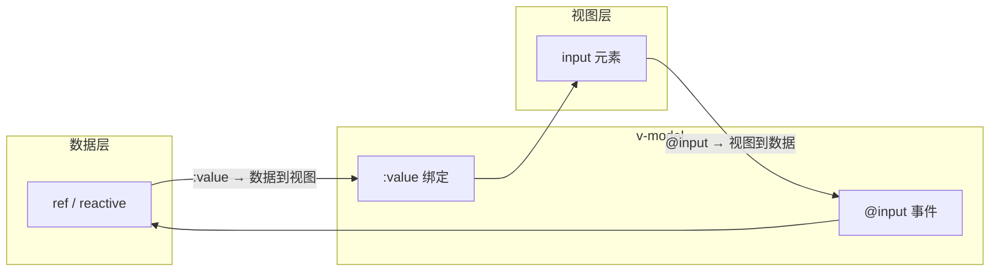

# 事件处理

> Vue 使用 `v-on` 指令（简写 `@`）监听 DOM 事件，支持内联处理器、方法处理器、事件修饰符和按键修饰符。Vue 3 移除了 `.native` 修饰符，组件上的事件直接透传。

## 基本用法

```vue
<template>
  <!-- 内联处理器 -->
  <button @click="count++">{{ count }}</button>

  <!-- 方法处理器 -->
  <button @click="handleClick">点击</button>

  <!-- 传递参数 + 原生事件 -->
  <button @click="handleClick($event, 'custom')">带参数</button>
</template>

<script setup lang="ts">
import { ref } from 'vue'
const count = ref(0)

function handleClick(event: MouseEvent, customParam?: string) {
  console.log(event.target)  // 原生 DOM 元素
  if (customParam) console.log(customParam)
}
</script>
```

## 事件修饰符

| 修饰符 | 作用 | 等价原生代码 |
|--------|------|-------------|
| `.stop` | 阻止事件冒泡 | `event.stopPropagation()` |
| `.prevent` | 阻止默认行为 | `event.preventDefault()` |
| `.capture` | 捕获阶段触发 | `addEventListener(..., true)` |
| `.self` | 仅元素自身触发 | `event.target === event.currentTarget` |
| `.once` | 只触发一次 | — |
| `.passive` | 提升滚动性能 | `addEventListener(..., { passive: true })` |

```vue
<template>
  <!-- 阻止冒泡 -->
  <div @click="handleDiv"><button @click.stop="handleBtn">点击</button></div>

  <!-- 阻止默认行为 -->
  <form @submit.prevent="onSubmit"><input type="submit"></form>

  <!-- 链式调用（顺序敏感） -->
  <div @click.stop.prevent="handleClick"></div>

  <!-- 只触发一次 -->
  <button @click.once="handleOnce">一次性按钮</button>

  <!-- passive：提升滚动性能 -->
  <div @scroll.passive="onScroll"></div>
</template>
```

## 按键修饰符

```vue
<template>
  <!-- 基本按键 -->
  <input @keyup.enter="submit" />
  <input @keyup.esc="cancel" />
  <input @keyup.tab="nextInput" />
  <input @keyup.space="togglePlay" />
  <input @keyup.delete="deleteItem" />
  <input @keyup.up="moveUp" />
  <input @keyup.down="moveDown" />

  <!-- 系统修饰键 -->
  <input @keyup.ctrl.enter="ctrlEnter" />
  <input @keyup.alt.enter="altEnter" />
  <input @keyup.shift.enter="shiftEnter" />
  <input @keyup.meta.enter="metaEnter" /> <!-- Mac: Cmd, Win: Win -->

  <!-- exact：精确匹配 -->
  <button @click.ctrl.exact="ctrlOnly">仅 Ctrl</button>
  <button @click.exact="noModifier">无修饰键</button>
</template>
```

## 鼠标按钮修饰符

```vue
<template>
  <button @click.left="handleLeft">左键</button>
  <button @click.right.prevent="handleRight">右键（阻止默认菜单）</button>
  <button @click.middle="handleMiddle">中键</button>
</template>
```

## 事件处理最佳实践

### 防抖与节流

```typescript
import { ref } from 'vue'

// 防抖组合式函数
function useDebounceFn<T extends (...args: unknown[]) => void>(
  fn: T,
  delay = 300
): T {
  let timer: ReturnType<typeof setTimeout>
  return ((...args) => {
    clearTimeout(timer)
    timer = setTimeout(() => fn(...args), delay)
  }) as T
}

// 使用
const searchQuery = ref('')
const debouncedSearch = useDebounceFn((e: Event) => {
  console.log('搜索:', (e.target as HTMLInputElement).value)
})
```

### 右键菜单

```vue
<script setup lang="ts">
import { ref, onMounted, onUnmounted } from 'vue'

const menuVisible = ref(false)
const menuX = ref(0)
const menuY = ref(0)

function showContextMenu(e: MouseEvent) {
  menuVisible.value = true
  menuX.value = e.clientX
  menuY.value = e.clientY
}

function hideMenu() { menuVisible.value = false }

onMounted(() => document.addEventListener('click', hideMenu))
onUnmounted(() => document.removeEventListener('click', hideMenu))
</script>

<template>
  <div @contextmenu.prevent="showContextMenu" class="area">
    右键点击此处
    <div
      v-show="menuVisible"
      class="context-menu"
      :style="{ left: menuX + 'px', top: menuY + 'px' }"
    >
      <div @click="console.log('复制')">复制</div>
      <div @click="console.log('粘贴')">粘贴</div>
      <div @click="console.log('删除')">删除</div>
    </div>
  </div>
</template>
```

### Vue 3 事件处理变化

| Vue 2 | Vue 3 | 说明 |
|-------|-------|------|
| `@click.native` | 直接 `@click` | Vue 3 移除 `.native`，事件直接透传 |
| `$listeners` | 合并到 `$attrs` | 不需要单独访问 listeners |
| `v-on="listeners"` | 直接用 `$attrs` | 自动绑定 |


---

## 源码深度解析：v-model 实现原理

> 以下内容基于 Vue 3.5 源码，深入 v-model 双向绑定的实现细节。

### 表单元素

在使用 `Vuejs` 编写表单类的 `UI` 控件时，经常会使用 `v-model` 指令来为 `<input>`、`<select>`、`<textarea>` 进行数据的双向绑定。

我们使用 `Vue` 提供的官方[模版转换工具](https://vue-next-template-explorer.netlify.app/)来尝试一下在 `<input>`、`<select>`、`<textarea>` 输入类型的表单中使用 `v-model` 指令会被编译成什么样子：

**模版：**

```html
<input v-model='value1' />
<textarea v-model='value2' />
<select v-model='value3' />
```

**编译结果**

```js
import { vModelText as _vModelText, createElementVNode as _createElementVNode, withDirectives as _withDirectives, vModelSelect as _vModelSelect, Fragment as _Fragment, openBlock as _openBlock, createElementBlock as _createElementBlock } from "vue"

const _hoisted_1 = ["onUpdate:modelValue"]
const _hoisted_2 = ["onUpdate:modelValue"]
const _hoisted_3 = ["onUpdate:modelValue"]

export function render(_ctx, _cache, $props, $setup, $data, $options) {
  return (_openBlock(), _createElementBlock(_Fragment, null, [
    _withDirectives(_createElementVNode("input", {
      "onUpdate:modelValue": $event => ((_ctx.value1) = $event)
    }, null, 8 /* PROPS */, _hoisted_1), [
      [_vModelText, _ctx.value1]
    ]),
    _withDirectives(_createElementVNode("textarea", {
      "onUpdate:modelValue": $event => ((_ctx.value2) = $event)
    }, null, 8 /* PROPS */, _hoisted_2), [
      [_vModelText, _ctx.value2]
    ]),
    _withDirectives(_createElementVNode("select", {
      "onUpdate:modelValue": $event => ((_ctx.value3) = $event)
    }, null, 8 /* PROPS */, _hoisted_3), [
      [_vModelSelect, _ctx.value3]
    ])
  ], 64 /* STABLE_FRAGMENT */))
}
```

可以看到通过 `v-model` 绑定的元素，在转成渲染函数的时候，最外层都被套上了一个 `withDirectives` 函数，这个函数传入了两个变量：一个通过 `createElementVNode` 创建的 `vnode` 节点，另一个是一个数组类型的参数 `directives`。我们先来简单看一下 `withDirectives` 这个函数的实现：

```typescript
export function withDirectives<T extends VNode>(
  vnode: T,
  directives: DirectiveArguments,
): T {
  const internalInstance = currentRenderingInstance
  if (internalInstance === null) {
    return vnode
  }
  const instance = getExposeProxy(internalInstance) || internalInstance.proxy
  // 获取指令集
  const bindings = vnode.dirs || (vnode.dirs = [])
  // 遍历 directives
  for (let i = 0; i < directives.length; i++) {
    let [dir, value, arg, modifiers = EMPTY_OBJ] = directives[i]
    // 如果存在指令
    if (dir) {
      // 指令是个函数，构造 mounted、updated 钩子
      if (isFunction(dir)) {
        dir = {
          mounted: dir,
          updated: dir,
        } as Directive
      }
      // 存在 deep 属性，遍历访问每个属性
      if ((dir as Directive).deep) {
        traverse(value)
      }
      // bindings 中添加构造好的指令元素
      bindings.push({
        dir: dir as Directive,
        instance,
        value,
        oldValue: void 0,
        arg,
        modifiers,
      })
    }
  }
  return vnode
}
```

可以看到 `withDirectives` 函数主要就是为 `vnode` 节点上添加 `dirs` 属性，对于我们示例中的 `<input>` 节点而言，生成的 `dir` 内容大致为（ `select` 节点类似，这里就不再介绍了，有兴趣的可以在源码详细了解）：

```yaml
{
  dir: vModelText,
  value: _ctx.value1,
  ...
}
```

其中 `vModelText` 是一个对象，内置了 `v-model` 指令相关的生命周期的实现：

```typescript
export const vModelText: Directive<HTMLInputElement> = {
  // created 生命周期
  created(el, { modifiers: { lazy, trim, number } }, vnode) {
    // 获取 props 上 onUpdate:modelValue 函数
    el._assign = getModelAssigner(vnode)
    const castToNumber =
      number || (vnode.props && vnode.props.type === 'number')
    // 注册 input/change 事件
    addEventListener(el, lazy ? 'change' : 'input', e => {
      // ...
      let domValue = el.value
      // .trim 修饰符
      if (trim) {
        domValue = domValue.trim()
      }
      if (castToNumber) {
        domValue = looseToNumber(domValue)
      }
      // 执行 onUpdate:modelValue 函数
      el._assign(domValue)
    })
    if (trim) {
      addEventListener(el, 'change', () => {
        el.value = el.value.trim()
      })
    }
    // ...
  },
  mounted(el, { value }) {
    // 赋值
    el.value = value == null ? '' : value
  },
  beforeUpdate(el, { value, modifiers: { lazy, trim, number } }, vnode) {
    // 更新 el._assign
    el._assign = getModelAssigner(vnode)
    if (el.composing) return
    if (document.activeElement === el && el.type !== 'range') {
      if (lazy) {
        return
      }
      if (trim && el.value.trim() === value) {
        return
      }
      if (
        (number || el.type === 'number') &&
        looseToNumber(el.value) === value
      ) {
        return
      }
    }
    // 更新值
    const newValue = value == null ? '' : value
    if (el.value !== newValue) {
      el.value = newValue
    }
  },
}
```

可以看到 `vModelText` 内置了 `created`、`mounted`、`beforeUpdate` 钩子函数。

在 `created` 的时候，会从 `props` 上获取 `onUpdate:modelValue` 函数，这个函数也就是我们在遇到 `v-model` 指令后，`Vue` 的编译器自动转换生成的。然后再监听对应 `DOM` 上的 `change` 或者 `input` 事件，事件触发时再回调执行 `onUpdate:modelValue` 函数。

在 `mounted` 的时候，会将当前的值 `value` 赋值给 `el.value`。

#### 指令生命周期的触发

前面我们提到了 `v-model` 注册的指令节点，会生成一个带有 `dirs` 的属性，属性中会包含类似于 `vModelText` 这样的对象，这个对象内部包含了一些生命周期函数，那这些生命周期函数又是在何时执行？再回到我们之前的 `mountElement` 函数内，这次我们着重看一下与指令相关的代码实现：

```typescript
const mountElement = (
  vnode: VNode,
  container: RendererElement,
  anchor: RendererNode | null,
  parentComponent: ComponentInternalInstance | null,
  parentSuspense: SuspenseBoundary | null,
  isSVG: boolean,
  optimized: boolean,
) => {
  // ...
  const { type, props, shapeFlag, transition, dirs } = vnode

  if (dirs) {
    // 执行 created 钩子函数
    invokeDirectiveHook(vnode, null, parentComponent, 'created')
  }
  // ...
  if (props) {
    // 处理 props，比如 class、style、event 等属性
  }
  if (dirs) {
    // 执行 beforeMount 钩子函数
    invokeDirectiveHook(vnode, null, parentComponent, 'beforeMount')
  }
  // 挂载 dom
  hostInsert(el, container, anchor)

  if (
    (vnodeHook = props && props.onVnodeMounted) ||
    needCallTransitionHooks ||
    dirs
  ) {
    queuePostRenderEffect(() => {
      vnodeHook && invokeVNodeHook(vnodeHook, parentComponent, vnode)
      needCallTransitionHooks && transition!.enter(el)
      // 执行 mounted 钩子函数
      dirs && invokeDirectiveHook(vnode, null, parentComponent, 'mounted')
    }, parentSuspense)
  }
}
```

可以看到指令相关的钩子函数在进行 `vnode` 初始化挂载的时候，会在挂载的各个阶段被分别调用，从而完成生命周期函数的执行过程。

### 组件

我们首先来看一下，`v-model` 在组件中一些常规的使用方式：

```html
<Component v-model="value1" />
<Component v-model:title="bookTitle" />
<Component v-model:first-name="first" v-model:last-name="last" />
```

在组件上，`v-model` 不仅仅可以使用 `modelValue` 作为 `prop`，以 `update:modelValue` 作为对应的事件，还支持了给 `v-model` 一个自定义参数来更改这些名字。因为有了自定义参数的功能，所以也就支持了一个组件多个 `v-model` 绑定的功能。

接下来再看看通过 [Vue 3 Template Explorer](https://vue-next-template-explorer.netlify.app/) 将上述模版转出来的渲染函数的表达形式：

```js
import { resolveComponent as _resolveComponent, createVNode as _createVNode, Fragment as _Fragment, openBlock as _openBlock, createElementBlock as _createElementBlock } from "vue"

export function render(_ctx, _cache, $props, $setup, $data, $options) {
  const _component_Component = _resolveComponent("Component")

  return (_openBlock(), _createElementBlock(_Fragment, null, [
    _createVNode(_component_Component, {
      modelValue: _ctx.value1,
      "onUpdate:modelValue": $event => ((_ctx.value1) = $event)
    }, null, 8 /* PROPS */, ["modelValue", "onUpdate:modelValue"]),
    _createVNode(_component_Component, {
      title: _ctx.bookTitle,
      "onUpdate:title": $event => ((_ctx.bookTitle) = $event)
    }, null, 8 /* PROPS */, ["title", "onUpdate:title"]),
    _createVNode(_component_Component, {
      "first-name": _ctx.first,
      "onUpdate:firstName": $event => ((_ctx.first) = $event),
      "last-name": _ctx.last,
      "onUpdate:lastName": $event => ((_ctx.last) = $event)
    }, null, 8 /* PROPS */, ["first-name", "onUpdate:firstName", "last-name", "onUpdate:lastName"])
  ], 64 /* STABLE_FRAGMENT */))
}
```

可以看到，编译器在处理组件带有 `v-model` 指令的时候，会将其根据相关参数进行解析，最后组成一个 `props` 传入组件中。拿一个 `v-model:title = 'bookTitle'` 举例，生成的 `props` 大致是这样的：

```js
{
  title: value,
  "onUpdate:title": $event => _ctx.bookTitle = $event
}
```

所以这也解释了为什么组件内部需要定义一个 `props` 用来承接 `title` 的值；定义一个 `emit`，在 `title` 值变化的时候，用来触发 `onUpdate:title`，并传入更新后的值。

```html
<!-- Component.vue -->
<script setup>
defineProps(['title'])
defineEmits(['update:title'])
</script>

<template>
  <input
    type="text"
    :value="title"
    @input="$emit('update:title', $event.target.value)"
  />
</template>
```

接下来我们再看看这个 `$emit` 是如何触发 `onUpdate:title` 函数的执行的。先来看看 `emit` 函数的实现：

```typescript
export function emit(
  instance: ComponentInternalInstance,
  event: string,
  ...rawArgs: any[]
): any {
  if (instance.isUnmounted) return
  const props = instance.vnode.props || EMPTY_OBJ

  let args = rawArgs

  // 定义事件名称
  let handlerName: string
  // update:xxx => onUpdate:xxx
  let handler =
    props[(handlerName = toHandlerKey(event))] ||
    props[(handlerName = toHandlerKey(camelize(event)))]
  // 找到了 handler 触发调用
  if (handler) {
    callWithAsyncErrorHandling(
      handler,
      instance,
      ErrorCodes.COMPONENT_EVENT_HANDLER,
      args,
    )
  }
  // ...
}
```

其中第一个参数是当前组件实例，`emit` 自动为我们绑定了当前组件，`event` 为事件名称，`rawArgs` 就是传入的一些参数。整个函数逻辑还是很清晰的，就是将传入的 `event` 名称转成 `onUpdate:xxx` 的写法，然后在 `props` 上找对应的函数，也就是我们传入的那个事件函数。找到了后就通过 `callWithAsyncErrorHandling` 方法进行调用，完成事件的执行。

### defineModel 宏

在前面的示例中，我们可以看到在组件中使用 `v-model` 时，需要手动声明 `defineProps` 和 `defineEmits` 来分别接收值和触发更新事件，这种模板代码比较冗余。`Vue 3.4` 中，`defineModel` 宏正式成为稳定 `API`，极大地简化了这一过程。

#### 基本用法

`defineModel` 返回一个可读写的 `ref`，它的值是父组件通过 `v-model` 传入的值。当我们在子组件中修改这个 `ref` 的值时，会自动触发父组件中对应 `v-model` 的更新：

```html
<!-- ChildComponent.vue -->
<script setup>
// 声明 modelValue，返回一个 ref
const modelValue = defineModel()
</script>

<template>
  <input type="text" v-model="modelValue" />
</template>
```

对比之前需要手动声明 `props` 和 `emits` 的写法，`defineModel` 将其精简为了一行代码。之前的写法是这样的：

```html
<!-- 之前的写法 -->
<script setup>
const props = defineProps(['modelValue'])
const emit = defineEmits(['update:modelValue'])

// 需要手动 computed 或 emit
const modelValue = computed({
  get: () => props.modelValue,
  set: (val) => emit('update:modelValue', val)
})
</script>
```

#### 带参数的 v-model

`defineModel` 同样支持带参数的 `v-model`，通过传入参数名即可：

```html
<!-- 父组件 -->
<ChildComponent v-model:title="bookTitle" />

<!-- ChildComponent.vue -->
<script setup>
const title = defineModel('title')
</script>

<template>
  <input type="text" v-model="title" />
</template>
```

#### 多个 v-model 绑定

一个组件支持多个 `v-model` 也变得更加简洁：

```html
<!-- 父组件 -->
<UserForm v-model:first-name="first" v-model:last-name="last" />

<!-- UserForm.vue -->
<script setup>
const firstName = defineModel('firstName')
const lastName = defineModel('lastName')
</script>
```

#### 修饰符处理

`v-model` 的修饰符也可以通过 `defineModel` 来获取。`defineModel` 返回值中包含一个 `modelModifiers` 属性（如果带参数则是 `参数名Modifiers`），其中包含了修饰符对象：

```html
<!-- 父组件 -->
<ChildComponent v-model.trim="text" v-model:title.capitalize="title" />

<!-- ChildComponent.vue -->
<script setup>
// 默认 v-model：解构获取修饰符对象
const [text, textModifiers] = defineModel({
  set(v) {
    if (textModifiers?.trim) {
      return v.trim()
    }
    return v
  },
})

const [title, titleModifiers] = defineModel('title', {
  // 自定义修饰符的处理逻辑
  set(v) {
    if (titleModifiers?.capitalize) {
      return v.charAt(0).toUpperCase() + v.slice(1)
    }
    return v
  },
})
</script>
```

`defineModel` 的返回值是一个自定义 ref，也可以直接通过解构获取修饰符对象：

```html
<!-- ChildComponent.vue -->
<script setup>
const [modelValue, modelModifiers] = defineModel()

// modelModifiers 包含父组件传入的修饰符，如 { trim: true }
</script>
```

#### defineModel 编译转换

`defineModel` 是一个编译器宏，它并不是一个运行时函数。在编译阶段，`SFC` 编译器会将 `defineModel()` 调用展开为 `props` 和 `emits` 的声明。例如：

```html
<script setup>
const title = defineModel('title')
</script>
```

编译后等价于：

```html
<script setup>
const props = defineProps({ title: {} })
const emit = defineEmits(['update:title'])
const title = computed({
  get() { return props.title },
  set(value) { emit('update:title', value) }
})
</script>
```

可以看到，`defineModel` 并没有改变 `v-model` 的底层实现机制，它仍然是基于 `props` 接收值、`emit` 派发更新事件的双向绑定模式。`defineModel` 只是在编译阶段帮我们生成了这些模板代码，减轻了开发者的负担。

下面用一张流程图来总结 `defineModel` 的编译转换过程：



#### defineModel 的选项

`defineModel` 还支持传入选项对象，用于配置 `prop` 的类型、默认值等：

```typescript
// 带类型和默认值
const count = defineModel<number>({ default: 0 })

// 带参数和选项
const title = defineModel<string>('title', { required: true })

// 带自定义转换
const value = defineModel('value', {
  type: String,
  default: '',
  set(value: string) {
    // 在 emit 之前转换值
    return value.trim()
  },
})
```

### v-model 修饰符

`v-model` 内置了一些修饰符，用于对绑定的值进行特殊处理。下面系统地分析这些修饰符的实现原理。

#### 内置修饰符

| 修饰符 | 适用元素 | 作用 |
|--------|---------|------|
| `.lazy` | `<input>`, `<textarea>` | 将事件从 `input` 切换为 `change` |
| `.number` | `<input>` | 输入值自动通过 `parseFloat()` 转数字 |
| `.trim` | `<input>`, `<textarea>` | 自动去除输入值的首尾空白字符 |
| 任意自定义（如 `.capitalize`） | 组件 | 自定义修饰符，由组件内部处理 |

回顾前面 `vModelText` 的源码，我们可以看到这些内置修饰符的实现细节：

```typescript
// vModelText created 钩子中
created(el, { modifiers: { lazy, trim, number } }, vnode) {
  el._assign = getModelAssigner(vnode)
  const castToNumber =
    number || (vnode.props && vnode.props.type === 'number')
  // .lazy 修饰符：将监听事件从 input 改为 change
  addEventListener(el, lazy ? 'change' : 'input', e => {
    let domValue = el.value
    // .trim 修饰符：去除首尾空白
    if (trim) {
      domValue = domValue.trim()
    }
    // .number 修饰符：转为数字
    if (castToNumber) {
      domValue = looseToNumber(domValue)
    }
    el._assign(domValue)
  })
}
```

#### 组件自定义修饰符

在组件上使用 `v-model` 时，除了内置修饰符外，还可以自定义修饰符，并在组件内部通过 `defineModel` 的解构方式获取修饰符对象：

```html
<!-- 父组件 -->
<ChildComponent v-model.capitalize="text" />

<!-- ChildComponent.vue -->
<script setup>
const [modelValue, modifiers] = defineModel({
  // 在 set 选项中处理自定义修饰符
  set(v) {
    if (modifiers?.capitalize) {
      return v.charAt(0).toUpperCase() + v.slice(1)
    }
    return v
  }
})
</script>
```

### 全景流程

最后，我们用一张流程图来总结 `v-model` 双向绑定的完整实现机制：



## 下一步

- [表单输入绑定](#表单输入绑定) - 本文档后半部分深入学习表单数据绑定
- [组件事件](12-组件通信机制.md) - 深入组件事件机制

---

## 表单输入绑定


> 使用 `v-model` 指令在表单元素上创建双向数据绑定。Vue 3 支持参数化 `v-model`、多个 `v-model` 绑定、以及自定义修饰符。
>
> **Vue 3.4+ `defineModel` 宏稳定**，Vue 3.5+ 响应式 Props 解构进一步简化 v-model 使用。

## v-model 原理



`v-model` 本质是 `:value` + `@input` 的语法糖：

```vue
<template>
  <!-- v-model -->
  <input v-model="text">

  <!-- 等价于 -->
  <input
    :value="text"
    @input="text = $event.target.value"
  >
</template>
```

## 基本用法

### 文本输入

```vue
<script setup lang="ts">
import { ref } from 'vue'
const text = ref('')
const message = ref('')
</script>

<template>
  <input v-model="text" placeholder="输入文本">
  <textarea v-model="message" placeholder="多行文本" rows="4" />
  <p>输入: {{ text }}</p>
</template>
```

### 复选框

```vue
<script setup lang="ts">
import { ref } from 'vue'

// 单个：绑定 boolean
const checked = ref(false)

// 多个：绑定到数组
const selectedFruits = ref<string[]>([])

// true-value / false-value 绑定
const toggle = ref('no')
</script>

<template>
  <!-- 单个复选框 -->
  <input type="checkbox" v-model="checked" id="agree">
  <label for="agree">同意协议</label>

  <!-- 多个复选框绑定数组 -->
  <label><input type="checkbox" v-model="selectedFruits" value="apple"> 苹果</label>
  <label><input type="checkbox" v-model="selectedFruits" value="banana"> 香蕉</label>
  <label><input type="checkbox" v-model="selectedFruits" value="orange"> 橙子</label>
  <p>已选: {{ selectedFruits }}</p>

  <!-- true-value / false-value -->
  <input
    type="checkbox"
    v-model="toggle"
    true-value="yes"
    false-value="no"
  >
</template>
```

### 单选按钮

```vue
<script setup lang="ts">
import { ref } from 'vue'
const picked = ref('one')
</script>

<template>
  <label><input type="radio" v-model="picked" value="one"> One</label>
  <label><input type="radio" v-model="picked" value="two"> Two</label>
  <p>已选: {{ picked }}</p>
</template>
```

### 选择框

```vue
<script setup lang="ts">
import { ref } from 'vue'

const selected = ref('')
const multiSelected = ref<string[]>([])

const options = ref([
  { text: '选项 A', value: 'a' },
  { text: '选项 B', value: 'b' },
  { text: '选项 C', value: 'c' }
])
</script>

<template>
  <!-- 单选 -->
  <select v-model="selected">
    <option disabled value="">请选择</option>
    <option v-for="opt in options" :key="opt.value" :value="opt.value">
      {{ opt.text }}
    </option>
  </select>

  <!-- 多选 -->
  <select v-model="multiSelected" multiple>
    <option value="vue">Vue</option>
    <option value="react">React</option>
    <option value="angular">Angular</option>
  </select>
</template>
```

## 修饰符

| 修饰符 | 作用 | 示例 |
|--------|------|------|
| `.lazy` | `change` 事件后更新（默认 `input`） | `v-model.lazy` |
| `.number` | 自动转为数字类型 | `v-model.number` |
| `.trim` | 自动去除首尾空白 | `v-model.trim` |

```vue
<template>
  <input v-model.lazy="text">     <!-- 失焦时才更新 -->
  <input v-model.number="age">    <!-- 自动转 number -->
  <input v-model.trim="username"> <!-- 自动去空格 -->

  <!-- 组合使用 -->
  <input v-model.lazy.trim="content">
</template>
```

## 组件上的 v-model

### defineModel <Badge text="Vue 3.4+ 稳定" type="tip"/>

Vue 3.4 起 `defineModel` 成为稳定 API，是组件 v-model 的推荐写法：

```vue
<!-- 父组件 -->
<template>
  <CustomInput v-model="text" />
  <CustomInput v-model:title="title" v-model:content="content" />
</template>

<script setup lang="ts">
import { ref } from 'vue'
const text = ref('')
const title = ref('')
const content = ref('')
</script>

<!-- CustomInput.vue -->
<script setup lang="ts">
// 默认 v-model
const model = defineModel<string>({ required: true })

// 具名 v-model
const title = defineModel<string>('title')
const content = defineModel<string>('content')
</script>

<template>
  <input v-model="model">
  <input v-model="title">
  <textarea v-model="content" />
</template>
```

### 手动实现（Vue 3.3 及之前）

```vue
<!-- CustomInput.vue -->
<script setup lang="ts">
const props = defineProps<{ modelValue: string }>()
const emit = defineEmits<{ 'update:modelValue': [value: string] }>()

// 使用 computed 桥接
const value = computed({
  get: () => props.modelValue,
  set: (val) => emit('update:modelValue', val)
})
</script>

<template>
  <input v-model="value">
</template>
```

### 自定义修饰符

```vue
<!-- 父组件 -->
<template>
  <CustomInput v-model.capitalize="text" />
</template>

<!-- CustomInput.vue -->
<script setup lang="ts">
const props = defineProps<{
  modelValue: string
  modelModifiers?: { capitalize: boolean }
}>()
const emit = defineEmits<{ 'update:modelValue': [value: string] }>()

function emitValue(value: string) {
  if (props.modelModifiers?.capitalize) {
    value = value.charAt(0).toUpperCase() + value.slice(1)
  }
  emit('update:modelValue', value)
}
</script>
```

## 表单验证

### 计算属性验证

```vue
<script setup lang="ts">
import { ref, computed } from 'vue'

const email = ref('')
const password = ref('')

const emailError = computed(() => {
  if (!email.value) return '请输入邮箱'
  if (!/^[^\s@]+@[^\s@]+\.[^\s@]+$/.test(email.value)) return '格式不正确'
  return ''
})

const passwordError = computed(() => {
  if (!password.value) return '请输入密码'
  if (password.value.length < 8) return '至少 8 位'
  return ''
})

const isFormValid = computed(() =>
  !emailError.value && !passwordError.value && email.value && password.value
)
</script>

<template>
  <form @submit.prevent="handleSubmit">
    <div>
      <input v-model.trim="email" placeholder="邮箱" type="email">
      <span v-if="emailError" class="error">{{ emailError }}</span>
    </div>
    <div>
      <input v-model="password" type="password" placeholder="密码">
      <span v-if="passwordError" class="error">{{ passwordError }}</span>
    </div>
    <button :disabled="!isFormValid">提交</button>
  </form>
</template>
```

## 实际应用示例

### 登录表单

```vue
<script setup lang="ts">
import { reactive, ref } from 'vue'

const form = reactive({
  username: '',
  password: '',
  remember: false
})

const loading = ref(false)
const error = ref('')

async function handleSubmit() {
  loading.value = true
  error.value = ''
  try {
    await loginApi(form)
  } catch (e) {
    error.value = (e as Error).message
  } finally {
    loading.value = false
  }
}
</script>
```

### 动态表单

```vue
<script setup lang="ts">
import { ref } from 'vue'

interface FormField {
  id: number
  value: string
}

const fields = ref<FormField[]>([{ id: 1, value: '' }])
let nextId = 2

function addField() { fields.value.push({ id: nextId++, value: '' }) }
function removeField(id: number) {
  fields.value = fields.value.filter(f => f.id !== id)
}
</script>

<template>
  <form @submit.prevent="console.log(fields)">
    <div v-for="(field, index) in fields" :key="field.id" class="row">
      <input v-model="field.value" :placeholder="`字段 ${index + 1}`">
      <button type="button" @click="removeField(field.id)"
              v-if="fields.length > 1">删除</button>
    </div>
    <button type="button" @click="addField">+ 添加字段</button>
    <button type="submit">提交</button>
  </form>
</template>
```

## 最佳实践

1. **使用 `defineModel`（Vue 3.4+）** 简化组件 v-model
2. **表单验证用 computed**，声明式且带缓存
3. **使用修饰符优化体验**：`.trim` 去空格、`.number` 转数字、`.lazy` 减少更新
4. **表单重置**：保存初始值，用 `Object.assign` 恢复

```typescript
const initialForm = { username: '', email: '' }
const form = reactive({ ...initialForm })
function resetForm() { Object.assign(form, initialForm) }
```

## 下一步

- [组件通信](12-组件通信机制.md) - 学习组件通信机制
- [组件事件](12-组件通信机制.md) - 深入组件事件与 v-model