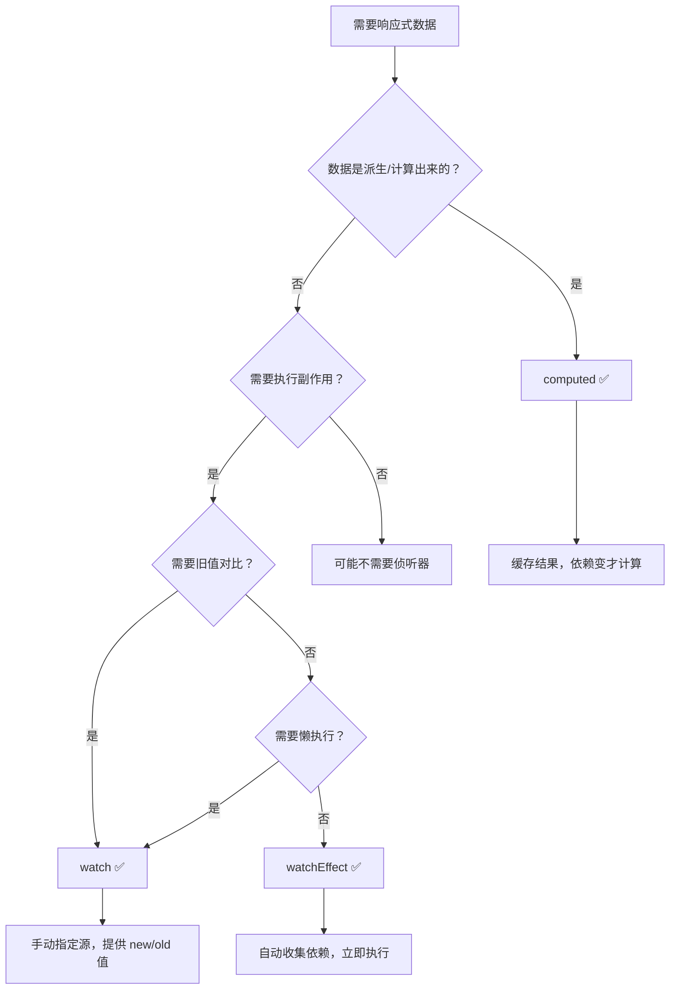
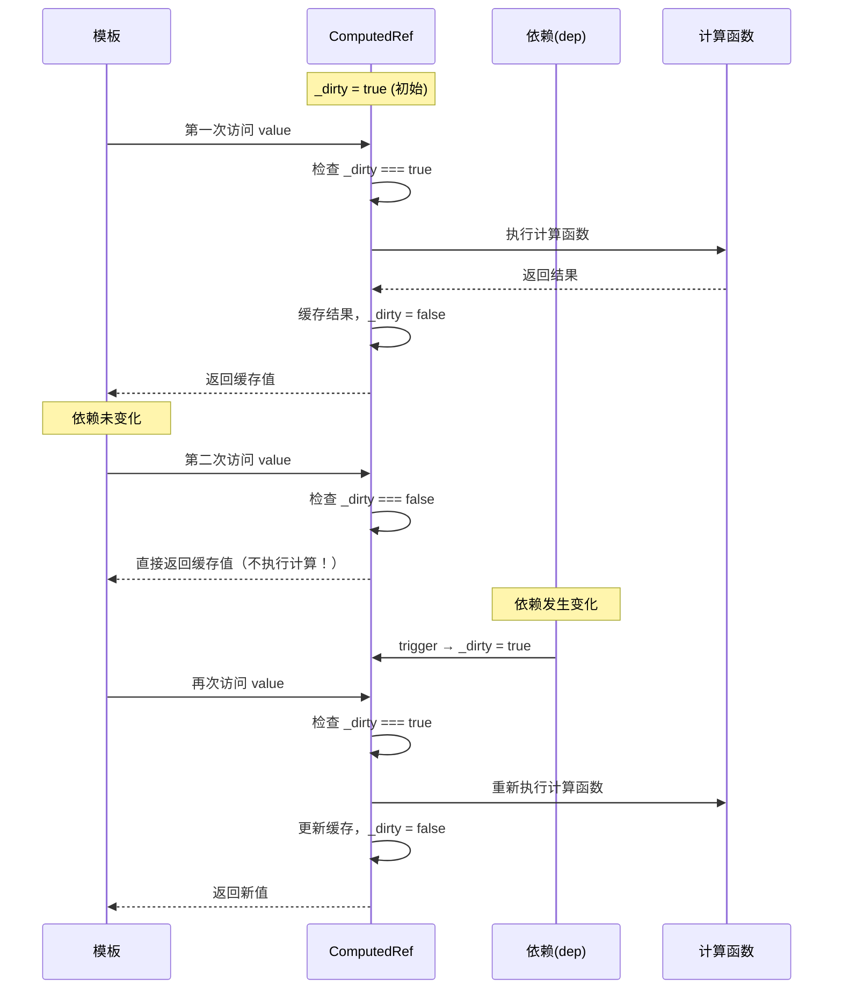
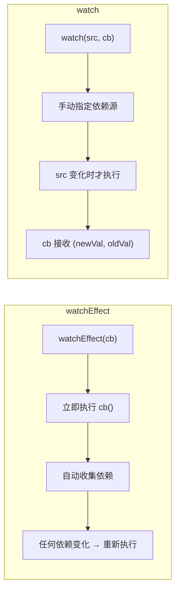
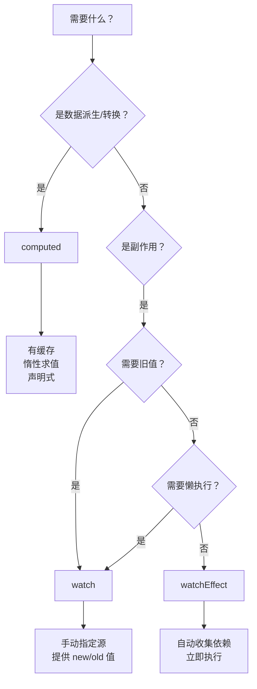

# 计算属性与侦听器

> 计算属性和侦听器是 Vue 响应式系统的核心组件，分别用于声明式数据派生和响应式副作用管理。正确使用它们对构建高性能、可维护的应用至关重要。
>
> **Vue 3.5+ 新增 `onWatcherCleanup` 用于 watch 回调清理**

## 概述



## 计算属性 computed

`computed` 用于声明式地描述一个值依赖于其他值，具有**自动缓存**和**惰性求值**的特性。

### 基本用法

```vue
<script setup lang="ts">
import { ref, computed, type ComputedRef } from 'vue'

const price = ref(100)
const taxRate = ref(0.13)

// 类型自动推断：ComputedRef<number>
const priceWithTax = computed(() => {
  return price.value * (1 + taxRate.value)
})

// 显式类型标注
const shipping = ref(0)
const total: ComputedRef<number> = computed(() => {
  return priceWithTax.value + shipping.value
})
</script>

<template>
  <p>原始价格: {{ price }}</p>
  <p>含税价格: {{ priceWithTax }}</p>
</template>
```

### 计算属性的缓存机制



### 可写计算属性

```vue
<script setup lang="ts">
import { ref, computed } from 'vue'

const firstName = ref('John')
const lastName = ref('Doe')

const fullName = computed({
  get(): string {
    return `${firstName.value} ${lastName.value}`
  },
  set(newValue: string) {
    const parts = newValue.split(' ')
    firstName.value = parts[0] || ''
    lastName.value = parts[1] || ''
  }
})

// 双向绑定
// <input v-model="fullName">
</script>
```

### 计算属性 vs 方法

```vue
<script setup lang="ts">
import { ref, computed } from 'vue'

const message = ref('Hello')

// ✅ 计算属性：基于依赖缓存，依赖不变不重新计算
const reversedMessage = computed(() => {
  console.log('computed 执行')
  return message.value.split('').reverse().join('')
})

// 方法：每次调用都执行，没有缓存
function reverseMessageFn(): string {
  console.log('method 执行')
  return message.value.split('').reverse().join('')
}
</script>

<template>
  <!-- 多次访问 computed，只计算一次 -->
  <p>{{ reversedMessage }}</p>
  <p>{{ reversedMessage }}</p>
  <p>{{ reversedMessage }}</p>

  <!-- 多次调用方法，每次都执行 -->
  <p>{{ reverseMessageFn() }}</p>
  <p>{{ reverseMessageFn() }}</p>
  <p>{{ reverseMessageFn() }}</p>
</template>
```

| 对比维度 | computed | methods |
|---------|----------|---------|
| 缓存 | ✅ 依赖不变时返回缓存 | ❌ 每次调用都执行 |
| 响应式追踪 | ✅ 自动追踪依赖 | ❌ 不追踪 |
| 使用方式 | 属性访问（无括号） | 函数调用（有括号） |
| 性能 | 高（惰性求值） | 低（每次都执行） |
| 适用场景 | 数据派生、过滤、转换 | 事件处理、纯动作 |

### 计算属性的组合使用

```typescript
import { ref, computed } from 'vue'

interface Product {
  id: number
  name: string
  price: number
  inStock: boolean
}

const products = ref<Product[]>([...])
const filterText = ref('')
const sortBy = ref<'price' | 'name'>('price')

// 计算属性可以依赖其他计算属性 —— 构建派生数据管道
const filteredProducts = computed(() =>
  products.value.filter(p =>
    p.name.toLowerCase().includes(filterText.value.toLowerCase())
  )
)

const sortedProducts = computed(() =>
  [...filteredProducts.value].sort((a, b) => {
    if (sortBy.value === 'price') return a.price - b.price
    return a.name.localeCompare(b.name)
  })
)

const totalPrice = computed(() =>
  filteredProducts.value.reduce((sum, p) => sum + p.price, 0)
)

const stats = computed(() => ({
  total: filteredProducts.value.length,
  inStock: filteredProducts.value.filter(p => p.inStock).length,
  averagePrice: filteredProducts.value.length
    ? totalPrice.value / filteredProducts.value.length
    : 0
}))
```

## 侦听器 watch

`watch` 用于监听响应式数据的变化并执行副作用（异步请求、DOM 操作、状态持久化等）。

### 基本用法

```vue
<script setup lang="ts">
import { ref, reactive, watch } from 'vue'

const count = ref(0)

// 监听单个 ref
watch(count, (newValue, oldValue) => {
  console.log(`count: ${oldValue} → ${newValue}`)
})

// 监听 getter 函数
const state = reactive({ user: { name: 'Vue' } })
watch(
  () => state.user.name,
  (newName, oldName) => {
    console.log(`name: ${oldName} → ${newName}`)
  }
)
</script>
```

### 侦听多个数据源

```typescript
import { ref, watch } from 'vue'

const firstName = ref('John')
const lastName = ref('Doe')
const age = ref(25)

// 数组形式监听多个源
watch(
  [firstName, lastName, () => age.value],
  ([newFirst, newLast, newAge], [oldFirst, oldLast, oldAge]) => {
    console.log(`姓名: ${oldFirst} ${oldLast} → ${newFirst} ${newLast}`)
    console.log(`年龄: ${oldAge} → ${newAge}`)
  }
)
```

### watch 选项详解

```typescript
import { ref, watch } from 'vue'

const obj = ref({ nested: { count: 0 } })

watch(
  obj,
  (newValue, oldValue) => {
    // 注意：deep 模式下 newValue === oldValue（同一引用）
  },
  {
    deep: true,       // 深度监听对象内部变化
    immediate: true,  // 立即执行一次回调（oldValue 为 undefined）
    flush: 'post',    // 在 DOM 更新后执行
    once: true,       // Vue 3.4+：只执行一次
  }
)
```

| 选项 | 类型 | 默认值 | 说明 |
|------|------|--------|------|
| `deep` | `boolean` | `false` | 递归深度监听对象内部值变化 |
| `immediate` | `boolean` | `false` | 创建时立即触发回调 |
| `flush` | `'pre' \| 'post' \| 'sync'` | `'pre'` | 回调的执行时机 |
| `once` | `boolean` | `false` | Vue 3.4+：只触发一次，之后自动停止 |
| `onTrack` | `(e) => void` | — | 开发调试：依赖被追踪时调用 |
| `onTrigger` | `(e) => void` | — | 开发调试：依赖触发更新时调用 |

**flush 选项详解：**

```typescript
import { ref, watch } from 'vue'

const count = ref(0)

// 'pre'（默认）：组件更新前执行
watch(count, () => {
  // DOM 尚未更新，适合在渲染前做额外逻辑
}, { flush: 'pre' })

// 'post'：组件更新后执行
watch(count, () => {
  // DOM 已更新，可以安全访问 DOM 元素
}, { flush: 'post' })
// 等价于 watchPostEffect()

// 'sync'：同步执行（谨慎使用）
watch(count, () => {
  // 每次数据变更都同步触发，可能影响性能
}, { flush: 'sync' })
```

### onWatcherCleanup <Badge text="Vue 3.5+" type="tip"/>

Vue 3.5 新增，在 watch 回调中注册清理函数，不需要通过参数传入：

```typescript
import { ref, watch, onWatcherCleanup } from 'vue'

const searchQuery = ref('')

watch(searchQuery, async (query) => {
  let cancelled = false

  // Vue 3.5+：通过 onWatcherCleanup 注册清理
  onWatcherCleanup(() => {
    cancelled = true
  })

  // 模拟 API 请求
  const results = await fetch(`/api/search?q=${query}`)

  if (!cancelled) {
    // 只有未被取消的请求才更新结果
    searchResults.value = await results.json()
  }
})
```

## watchEffect

`watchEffect` 自动追踪回调中的响应式依赖，并立即执行一次。

### 基本用法

```vue
<script setup lang="ts">
import { ref, watchEffect } from 'vue'

const count = ref(0)
const name = ref('Vue')

// 自动追踪 count 和 name
watchEffect(() => {
  // 立即执行，自动收集依赖
  console.log(`count: ${count.value}, name: ${name.value}`)
})

// 不需要显式声明依赖列表
</script>
```

### 清理副作用

```typescript
import { ref, watchEffect, onWatcherCleanup } from 'vue'

const id = ref(1)

// Vue 3.5 之前：通过回调参数
watchEffect((onCleanup) => {
  const timer = setInterval(() => {
    console.log(`轮询 id=${id.value}...`)
  }, 1000)

  onCleanup(() => {
    clearInterval(timer)
  })
})

// Vue 3.5+：通过 onWatcherCleanup
watchEffect(() => {
  const controller = new AbortController()

  fetch(`/api/data/${id.value}`, { signal: controller.signal })
    .then(res => res.json())
    .then(data => { /* ... */ })

  onWatcherCleanup(() => {
    controller.abort()
  })
})
```

### watchEffect vs watch



| 特性 | watchEffect | watch |
|------|-------------|-------|
| 依赖追踪 | 自动 | 手动指定 |
| 首次执行 | 立即执行 | `immediate: true` 才执行 |
| 旧值获取 | ❌ 不支持 | ✅ `(newVal, oldVal)` |
| 回调参数 | `(onCleanup)` 或直接用 `onWatcherCleanup` | `(newVal, oldVal, onCleanup)` |
| 适用场景 | 多依赖副作用、简单的同步副作用 | 需要旧值、懒执行、特定数据源 |

### watchPostEffect / watchSyncEffect

```typescript
import { watchPostEffect, watchSyncEffect } from 'vue'

// 在 DOM 更新后执行（等价于 watchEffect with flush: 'post'）
watchPostEffect(() => {
  // DOM 已更新
})

// 同步执行（等价于 watchEffect with flush: 'sync'）
watchSyncEffect(() => {
  // 每次依赖变化时同步触发
})
```

### 停止侦听

```typescript
import { ref, watchEffect } from 'vue'

const count = ref(0)

// 返回停止函数
const stop = watchEffect(() => {
  console.log(count.value)
})

// 手动停止
function cleanup() {
  stop()
}

// 注意：在 setup 中创建的侦听器会在组件卸载时自动停止
// 但在组件外创建的侦听器需要手动停止！
```

## 性能优化

### 1. 利用 computed 缓存替代复杂 watch

```typescript
const a = ref(1)
const b = ref(2)
const c = ref(3)

// ❌ 用 watch 手动计算
const result = ref(0)
watch([a, b, c], ([newA, newB, newC]) => {
  result.value = newA + newB + newC
})

// ✅ 用 computed 声明式派生（自动缓存）
const result = computed(() => a.value + b.value + c.value)
```

### 2. 精确侦听，避免不必要的深度监听

```typescript
const user = ref({
  profile: {
    name: 'Vue',
    settings: { theme: 'dark', notifications: true }
  }
})

// ❌ 深度监听整个对象——任何属性变化都触发
watch(user, () => {}, { deep: true })

// ✅ 只侦听需要的属性
watch(
  () => user.value.profile.settings.theme,
  (newTheme) => { /* 仅在 theme 变化时触发 */ }
)
```

### 3. 防抖与节流

```typescript
import { ref, watch, type Ref } from 'vue'

function useDebouncedRef<T>(source: Ref<T>, delay = 300): Ref<T> {
  const debounced = ref(source.value) as Ref<T>

  watch(
    source,
    (newVal, oldVal, onCleanup) => {
      const timer = setTimeout(() => {
        debounced.value = newVal
      }, delay)
      // watch 回调的返回值不会被使用，清理函数必须通过 onCleanup 注册
      onCleanup(() => clearTimeout(timer))
    }
  )

  return debounced
}

// 使用
const searchQuery = ref('')
const debouncedQuery = useDebouncedRef(searchQuery, 300)

watch(debouncedQuery, async (query) => {
  // 仅在用户停止输入 300ms 后才执行
  const results = await fetchSearchResults(query)
})
```

### 4. 避免在 computed 中执行副作用

```typescript
// ❌ computed 中执行副作用
const badComputed = computed(() => {
  localStorage.setItem('count', count.value)  // 副作用！
  sendAnalytics('count_changed', count.value) // 副作用！
  return count.value * 2
})

// ✅ 使用 watch 处理副作用
const doubled = computed(() => count.value * 2)

watch(count, (newVal) => {
  localStorage.setItem('count', String(newVal))
  sendAnalytics('count_changed', newVal)
})
```

### 5. 合理使用 v-memo 配合 computed

```vue
<template>
  <!-- v-memo 缓存子树，仅 list 引用变化时重新渲染 -->
  <div v-memo="[sortedList]">
    <p v-for="item in sortedList" :key="item.id">
      {{ item.name }} - {{ item.price }}
    </p>
  </div>
</template>

<script setup lang="ts">
const sortedList = computed(() =>
  [...products.value].sort((a, b) => a.price - b.price)
)
</script>
```

## 实际应用示例

### 搜索防抖 + 竞态处理

```vue
<script setup lang="ts">
import { ref, watch, onWatcherCleanup } from 'vue'

const keyword = ref('')
const results = ref<SearchResult[]>([])
const loading = ref(false)

watch(keyword, async (newKeyword) => {
  if (!newKeyword) {
    results.value = []
    return
  }

  let cancelled = false
  onWatcherCleanup(() => { cancelled = true })

  // 防抖
  await new Promise(resolve => setTimeout(resolve, 300))
  if (cancelled) return

  loading.value = true
  try {
    const data = await fetch(`/api/search?q=${newKeyword}`)
    if (!cancelled) {
      results.value = await data.json()
    }
  } finally {
    if (!cancelled) {
      loading.value = false
    }
  }
})
</script>
```

### 表单验证

```vue
<script setup lang="ts">
import { ref, computed } from 'vue'

const email = ref('')
const password = ref('')

interface ValidationResult {
  valid: boolean
  message: string
}

const emailValidation = computed<ValidationResult>(() => {
  if (!email.value) return { valid: false, message: '请输入邮箱' }
  if (!/^[^\s@]+@[^\s@]+\.[^\s@]+$/.test(email.value))
    return { valid: false, message: '邮箱格式不正确' }
  return { valid: true, message: '' }
})

const passwordValidation = computed<ValidationResult>(() => {
  if (!password.value) return { valid: false, message: '请输入密码' }
  if (password.value.length < 8) return { valid: false, message: '密码至少 8 位' }
  if (!/(?=.*[a-z])(?=.*[A-Z])(?=.*\d)/.test(password.value))
    return { valid: false, message: '密码需包含大小写字母和数字' }
  return { valid: true, message: '' }
})

const isFormValid = computed(() =>
  emailValidation.value.valid && passwordValidation.value.valid
)
</script>

<template>
  <form @submit.prevent="handleSubmit">
    <div>
      <input v-model="email" placeholder="邮箱" type="email">
      <span v-if="emailValidation.message" class="error">
        {{ emailValidation.message }}
      </span>
    </div>
    <div>
      <input v-model="password" type="password" placeholder="密码">
      <span v-if="passwordValidation.message" class="error">
        {{ passwordValidation.message }}
      </span>
    </div>
    <button :disabled="!isFormValid">提交</button>
  </form>
</template>
```

### 本地存储同步

```typescript
import { ref, watch } from 'vue'

// 泛型版本：类型安全的 localStorage 同步
function useLocalStorage<T>(key: string, defaultValue: T) {
  const stored = localStorage.getItem(key)
  const data = ref<T>(stored ? JSON.parse(stored) : defaultValue)

  watch(
    data,
    (newVal) => {
      localStorage.setItem(key, JSON.stringify(newVal))
    },
    { deep: true }
  )

  return data
}

// 使用
const todos = useLocalStorage<Todo[]>('todos', [])
const settings = useLocalStorage<Settings>('settings', {
  theme: 'light',
  language: 'zh-CN'
})
```

## 选择指南



| 场景 | 推荐 API | 原因 |
|------|---------|------|
| 数据派生/过滤/转换 | `computed` | 缓存 + 惰性求值 |
| 表单验证 | `computed` | 声明式验证规则 |
| 异步请求 | `watch` | 支持 async、需要旧值对比 |
| 需要旧值对比 | `watch` | 提供 `(newVal, oldVal)` |
| 简单副作用 | `watchEffect` | 自动依赖追踪，代码简洁 |
| DOM 更新后操作 | `watchPostEffect` | 确保 DOM 已更新 |
| 副作用清理 | `watchEffect` + `onWatcherCleanup` | 防止内存泄漏和竞态 |

## 最佳实践清单

- [ ] 派生数据用 `computed`，副作用用 `watch`/`watchEffect`
- [ ] 不要在 `computed` 中执行副作用（API 请求、DOM 操作、修改状态）
- [ ] 精确侦听，避免不必要的 `deep: true`
- [ ] 对高频操作使用防抖/节流
- [ ] 组件卸载时自动停止，组件外手动停止
- [ ] 利用 `onWatcherCleanup`（Vue 3.5+）处理竞态请求
- [ ] 使用 `once: true`（Vue 3.4+）处理一次性监听

## 常见问题

### 1. computed 为什么不更新？

检查依赖是否正确访问：

```typescript
// ❌ 错误：依赖未正确追踪
const count = ref(0)
const doubled = computed(() => {
  console.log(count) // 没有 .value！不会追踪
  return count.value * 2
})

// ✅ 正确：在 computed 回调中访问 .value
const doubled = computed(() => count.value * 2)
```

### 2. watch 如何监听数组变化？

```typescript
const list = ref([1, 2, 3])

// 方式1：监听整个 ref（数组变异方法会触发）
watch(list, (newList) => {}, { deep: true })

// 方式2：监听长度变化
watch(() => list.value.length, (newLen) => {})

// 注意：浅层监听时，push 等变异方法不会触发 watch
// 需要 deep: true 或使用 getter 返回新数组引用
```

### 3. watchEffect 和 watch 如何选择？

- 需要 `oldValue` → `watch`
- 需要懒执行（不立即运行） → `watch`
- 自动依赖追踪、代码简洁 → `watchEffect`
- 多个依赖 + 简单副作用 → `watchEffect`

### 4. computed 和 watch 的性能差异？

```typescript
// computed：惰性求值，依赖不变不计算
const filtered = computed(() =>
  expensiveFilter(list.value) // 仅在 list 变化时执行
)

// watch：每次变化都执行回调
watch(list, (newList) => {
  result.value = expensiveFilter(newList) // 每次 list 变化都执行
})
```

## 下一步

- [Class与Style绑定](06-模板语法.md) - 学习动态样式绑定
- [列表渲染](11-条件与列表渲染.md) - 学习列表渲染
- [组合式函数](../02-Composition-API/03-组合式函数设计模式.md) - 封装可复用逻辑