# 组件通信机制

> 组件是 Vue 应用程序的基本构建块，允许我们将 UI 拆分为独立、可复用的部分。Vue 3 支持单文件组件（SFC）、多根节点（Fragments）和 `<script setup>` 语法糖。
>
> **Vue 3.5+ 推荐使用 `<script setup lang="ts">` 作为默认写法。**

## 组件基础

## 定义组件

### 单文件组件 (SFC) — 推荐

```vue
<!-- MyComponent.vue -->
<script setup lang="ts">
import { ref } from 'vue'
const count = ref(0)
</script>

<template>
  <button @click="count++">{{ count }}</button>
</template>

<style scoped>
button {
  padding: 8px 16px;
  border-radius: 6px;
}
</style>
```

### 选项式 API（兼容写法）

```vue
<template>
  <button @click="increment">{{ count }}</button>
</template>

<script lang="ts">
import { defineComponent } from 'vue'

export default defineComponent({
  data() {
    return { count: 0 }
  },
  methods: {
    increment() {
      this.count++
    }
  }
})
</script>
```

## 注册组件

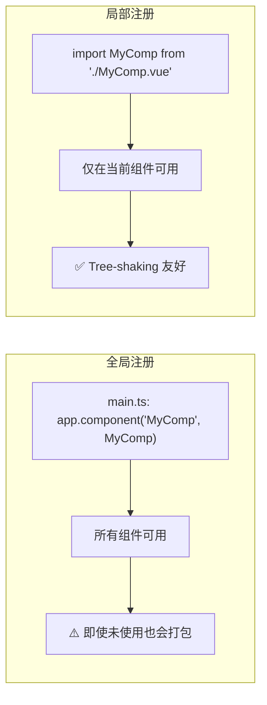

### 全局注册

```typescript
// main.ts
import { createApp } from 'vue'
import App from './App.vue'
import BaseButton from './components/BaseButton.vue'

const app = createApp(App)
app.component('BaseButton', BaseButton) // 全局注册
app.mount('#app')
```

### 局部注册（推荐）

```vue
<script setup lang="ts">
import MyComponent from './MyComponent.vue'
// 在 <script setup> 中导入即自动注册
</script>

<template>
  <MyComponent />
</template>
```

## 组件通信概览

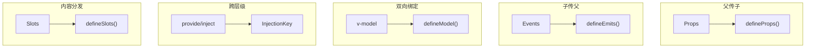

## 动态组件

```vue
<script setup lang="ts">
import { ref, computed, type Component } from 'vue'
import Home from './Home.vue'
import Posts from './Posts.vue'
import Archive from './Archive.vue'

const tabs = ['Home', 'Posts', 'Archive'] as const
type Tab = typeof tabs[number]
const currentTab = ref<Tab>('Home')

const componentMap: Record<Tab, Component> = { Home, Posts, Archive }
const currentComponent = computed(() => componentMap[currentTab.value])
</script>

<template>
  <button v-for="tab in tabs" :key="tab" @click="currentTab = tab"
    :class="{ active: currentTab === tab }">{{ tab }}</button>

  <!-- 配合 KeepAlive 缓存组件状态 -->
  <KeepAlive>
    <component :is="currentComponent" />
  </KeepAlive>
</template>
```

## 组件引用与 defineExpose

```vue
<!-- ChildComponent.vue -->
<script setup lang="ts">
import { ref } from 'vue'

const count = ref(0)
function increment() { count.value++ }
function reset() { count.value = 0 }

// 显式暴露给父组件
defineExpose({ increment, reset, count })
</script>
```

```vue
<!-- ParentComponent.vue -->
<script setup lang="ts">
import { ref, useTemplateRef } from 'vue'
import ChildComponent from './ChildComponent.vue'

// Vue 3.5+：类型安全的模板引用
const childRef = useTemplateRef<InstanceType<typeof ChildComponent>>('child')

function callChild() {
  childRef.value?.increment()
}
</script>

<template>
  <ChildComponent ref="child" />
  <button @click="callChild">调用子组件方法</button>
</template>
```

## 组件生命周期

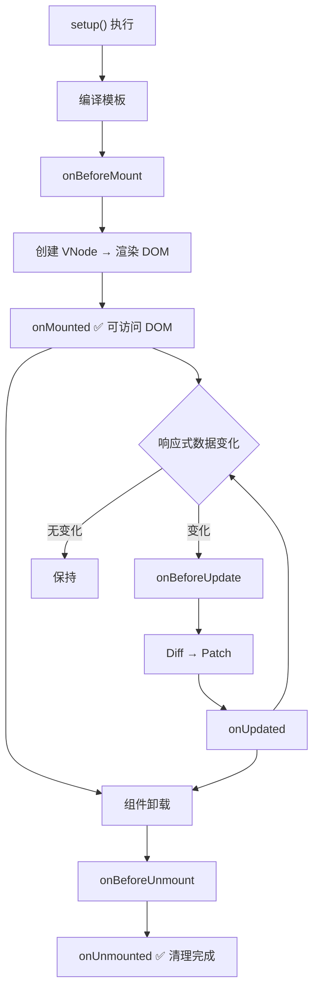

| 组合式 API | 说明 | 典型用途 |
|-----------|------|---------|
| `setup()` | 替代 beforeCreate/created | 初始化状态 |
| `onBeforeMount` | DOM 挂载前 | 无需 DOM 操作 |
| `onMounted` | DOM 挂载后 | 数据请求、DOM 操作 |
| `onBeforeUpdate` | DOM 更新前 | 获取更新前 DOM 状态 |
| `onUpdated` | DOM 更新后 | 避免在此修改状态 |
| `onBeforeUnmount` | 卸载前 | 清理定时器、取消订阅 |
| `onUnmounted` | 卸载后 | 资源释放 |

## 组件组织与命名

```
src/
├── components/
│   ├── base/          # 基础组件（Button, Input, Icon）
│   ├── layout/        # 布局组件（Header, Sidebar, Footer）
│   └── shared/        # 共享组件（Modal, Table, Pagination）
├── views/             # 页面级组件
└── composables/       # 组合式函数
```

## 最佳实践

### 单一职责

```vue
<!-- ✅ 好的拆分：职责单一 -->
<UserAvatar :src="user.avatar" />
<UserName :name="user.name" />
<UserBio :bio="user.bio" />

<!-- ❌ 不好的拆分：一个组件做太多事 -->
<UserProfile :user="user" :posts="user.posts" :followers="user.followers" />
```

### 性能优化技巧

- **`v-once`**：静态内容只渲染一次
- **`v-memo`**（Vue 3.2+）：缓存子树，依赖不变跳过更新
- **`shallowRef`**：大对象避免深度响应式
- **异步组件**：`defineAsyncComponent` 按需加载

## 常见问题

### 组件和指令的区别？

| 特性 | 组件 | 指令 |
|------|------|------|
| 用途 | UI 构建 | DOM 操作 |
| 状态 | 有独立状态 | 无状态 |
| 模板 | 有自己的模板 | 无模板 |
| 示例 | `<MyComponent />` | `v-focus`, `v-loading` |

### 组件命名为什么要用 PascalCase？

1. 与 HTML 原生元素区分
2. IDE 自动导入支持更好
3. Vue 官方推荐

## 下一步

- [Props](#props-深度解析) — 深入学习 Props 传递与验证（本文档后续部分）
- [组件事件](#组件事件与-v-model) — 学习组件事件与 v-model（本文档后续部分）
- [插槽](13-插槽与依赖注入.md) — 学习内容分发机制

---

## Props 深度解析


> Props 用于父组件向子组件传递数据，遵循**单向数据流**原则。Vue 3 支持 TypeScript 类型声明、运行时验证和默认值。
>
> **Vue 3.5+ 支持响应式 Props 解构**，直接解构 `defineProps` 并保持响应性。

## 声明 Props

### TypeScript 类型声明（推荐）

```vue
<script setup lang="ts">
interface Props {
  title: string
  likes?: number
  tags?: string[]
  author?: { name: string; avatar: string }
}

const props = withDefaults(defineProps<Props>(), {
  likes: 0,
  tags: () => [],
  author: () => ({ name: '', avatar: '' })
})
</script>
```

### 运行时验证

```vue
<script setup lang="ts">
defineProps({
  title: { type: String, required: true },
  likes: { type: Number, default: 0 },
  tags: { type: Array, default: () => [] },
  age: {
    type: Number,
    validator: (value: number) => value >= 0 && value <= 120
  }
})
</script>
```

## 传递 Props

```vue
<template>
  <!-- 静态 -->
  <BlogPost title="我的文章" />

  <!-- 动态 -->
  <BlogPost :title="post.title" :likes="post.likes" />

  <!-- 布尔值简写（包含即 true） -->
  <BlogPost is-published />

  <!-- 使用 v-bind 传递对象所有属性 -->
  <BlogPost v-bind="post" />
</template>
```

## 单向数据流

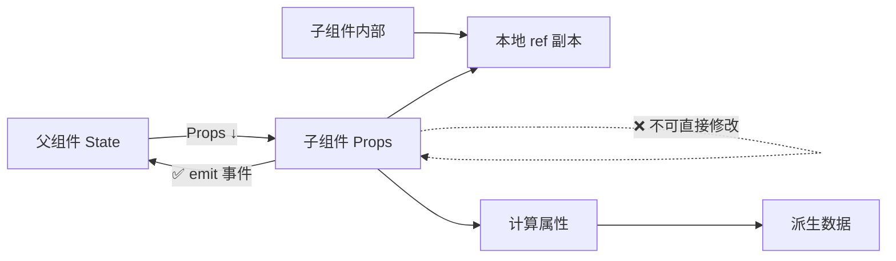

### 处理 Prop 变更的正确方式

```vue
<script setup lang="ts">
import { ref, computed } from 'vue'

const props = defineProps<{ initialCount: number }>()
const emit = defineEmits<{ 'update:initialCount': [value: number] }>()

// 方式1：本地副本
const localCount = ref(props.initialCount)

// 方式2：计算属性（只读派生）
const displayCount = computed(() => props.initialCount * 2)

// 方式3：通知父组件更新
function updateCount(val: number) {
  emit('update:initialCount', val)
}
</script>
```

## 非 Prop 属性与 $attrs

```vue
<script setup lang="ts">
import { useAttrs } from 'vue'

// 获取所有透传属性
const attrs = useAttrs()
// { class: 'foo', id: 'bar', onClick: ... }
</script>

<template>
  <!-- 默认：根元素自动继承 -->
  <button>自动继承 class/style/事件</button>
</template>
```

### 禁用继承 + 手动透传

```vue
<script setup lang="ts">
defineOptions({ inheritAttrs: false })
</script>

<template>
  <div class="wrapper">
    <!-- 手动绑定到指定元素 -->
    <input v-bind="$attrs" />
  </div>
</template>
```

## TypeScript 进阶

### 泛型组件 <Badge text="Vue 3.3+" type="tip"/>

```vue
<script setup lang="ts" generic="T extends { id: number }">
defineProps<{
  items: T[]
  selected?: T
}>()

defineEmits<{
  select: [item: T]
}>()
</script>
```

### 响应式 Props 解构 <Badge text="Vue 3.5+" type="tip"/>

```vue
<script setup lang="ts">
// Vue 3.5+：直接解构，自动保持响应式
const { title, likes = 0 } = defineProps<{
  title: string
  likes?: number
}>()

// title 和 likes 可以直接在 watch/computed 中使用
watch(() => title, (newTitle) => {
  console.log('Title changed:', newTitle)
})
</script>
```

## Props 响应式传递链路：源码级深度解析

Props 的传递不是简单的"复制一份数据"，而是经过一条精心设计的响应式链路。理解这条链路对于性能调优至关重要。

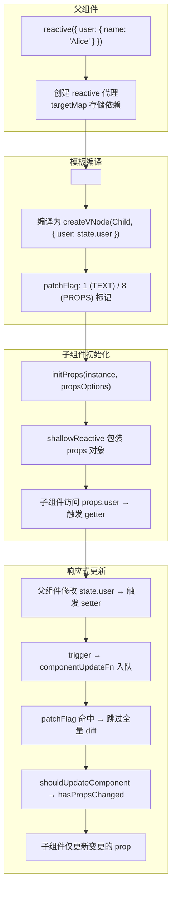

### 简化版 Vue 源码实现

#### 1. 模板编译阶段：识别动态 Props

```typescript
// packages/compiler-core/src/transforms/transformElement.ts（简化）

// 编译器在解析 <Child :user="state.user" /> 时
export function transformElement(node: ElementNode, context: TransformContext) {
  return function postTransform() {
    const { tag, props } = node

    // 分析每个 prop 是否为动态绑定
    for (const prop of props) {
      if (prop.type === NodeTypes.DIRECTIVE && prop.name === 'bind') {
        // 动态 prop → 需要打上 patchFlag
        const isDynamic = !prop.arg.isStatic
        const isDynamicBinding = isDynamic || prop.exp!.type !== NodeTypes.SIMPLE_EXPRESSION

        // 生成 patchFlag
        // 完整 props 动态: PatchFlags.FULL_PROPS = 16
        // 单个动态 prop: PatchFlags.PROPS = 8
        // class 动态: PatchFlags.CLASS = 2
        // style 动态: PatchFlags.STYLE = 4
      }
    }

    // 编译产物示例
    // createVNode(Child, { user: state.user }, null, 8 /* PROPS */, ["user"])
  }
}
```

**编译产物对比：**

```typescript
// 原始模板
<Child :user="state.user" name="固定值" />

// 编译后的 render 函数（简化）
import { createVNode, PatchFlags } from 'vue'

function render(_ctx, _cache) {
  return createVNode(Child, {
    name: "固定值",            // 静态 prop，不参与 diff
    user: _ctx.state.user      // 动态 prop，被 patchFlag 标记
  }, null, PatchFlags.PROPS, ["user"])
  //       ^^^^^^^^^^^^^^^^  ^^^^^^^
  //       patchFlag = 8     需要 diff 的 key 列表
}
```

#### 2. 组件初始化：initProps 与 shallowReactive

```typescript
// packages/runtime-core/src/componentProps.ts（简化）

import { shallowReactive, reactive } from '@vue/reactivity'

export function initProps(
  instance: ComponentInternalInstance,
  rawProps: Data | null,
  isStateful: number,
  isSSR = false
) {
  const props: Data = {}
  const attrs: Data = {}

  // 区分 props 和 attrs
  if (rawProps) {
    for (const key in rawProps) {
      const value = rawProps[key]
      if (instance.propsOptions[0] && key in instance.propsOptions[0]) {
        // 声明的 prop → 放入 props
        props[key] = value
      } else {
        // 未声明的 → 放入 attrs（透传属性）
        attrs[key] = value
      }
    }
  }

  // 关键：props 使用 shallowReactive 而非 reactive
  // 因为 props 是外部数据，父组件已负责深度响应式
  // shallowReactive 仅在 props 对象的顶层 key 变化时触发更新
  instance.props = isSSR
    ? props
    : shallowReactive(props) as any

  // attrs 同样使用 shallowReactive
  instance.attrs = shallowReactive(attrs) as any
}
```

**为什么 props 用 shallowReactive 而不是 reactive？**

```typescript
// 设计原理演示
import { reactive, shallowReactive } from 'vue'

const parentState = reactive({
  user: { name: 'Alice', profile: { age: 25 } }
})

// 假设 props 使用 reactive（全深度代理）
// 问题：子组件访问 props.user.profile 时
// 会在父组件的 user → profile 路径上建立依赖
// 但这些数据的所有权在父组件，不应由子组件的渲染触发父组件追踪

// 实际使用 shallowReactive（仅顶层代理）
// 子组件改 props.user = newUser → 触发更新 ✅
// 父组件改 state.user.name = 'Bob' → 因为 user 引用未变，
// props.user === oldUser（引用相等），不触发子组件更新
// 但！父组件自己会重新渲染，在 patch 阶段传入新的 props 对象
```

#### 3. 更新阶段：patchFlag 跳过冗余 diff

```typescript
// packages/runtime-core/src/renderer.ts（简化）

const patchElement = (
  n1: VNode, n2: VNode,
  parentComponent: ComponentInternalInstance | null,
) => {
  const el = (n2.el = n1.el!)
  const oldProps = n1.props || {}
  const newProps = n2.props || {}
  const patchFlag = n2.patchFlag

  // 关键优化：根据 patchFlag 精确更新
  if (patchFlag > 0) {
    // 有 patchFlag → 精确更新
    if (patchFlag & PatchFlags.PROPS) {
      // 只更新 dynamicProps 列表中的 prop
      const dynamicProps = n2.dynamicProps!
      for (let i = 0; i < dynamicProps.length; i++) {
        const key = dynamicProps[i]
        const prev = oldProps[key]
        const next = newProps[key]
        if (next !== prev || (hostForcePatchProp?.(el, key))) {
          hostPatchProp(el, key, prev, next, ...)
        }
      }
    }
    if (patchFlag & PatchFlags.CLASS) {
      // 只更新 class
      if (oldProps.class !== newProps.class) {
        hostPatchProp(el, 'class', null, newProps.class, ...)
      }
    }
    // ... 其他 patchFlag 分支
  } else if (patchFlag === PatchFlags.BAIL) {
    // patchFlag === -1：放弃优化，全量 diff
    patchProps(el, n2, oldProps, newProps, ...)
  } else {
    // patchFlag === 0：全量 diff（无编译优化时）
    patchProps(el, n2, oldProps, newProps, ...)
  }
}
```

#### 4. 子组件更新判断：hasPropsChanged

```typescript
// packages/runtime-core/src/componentRenderUtils.ts（简化）

export function hasPropsChanged(
  prevProps: Data,
  nextProps: Data,
  optimistic = false
): boolean {
  // 快速路径：直接引用比较
  if (optimistic && prevProps === nextProps) {
    return false
  }

  const prevKeys = Object.keys(prevProps)
  const nextKeys = Object.keys(nextProps)

  // key 数量变化 → 一定需要更新
  if (prevKeys.length !== nextKeys.length) {
    return true
  }

  // 逐个比较同一 key 的值（浅比较）
  for (let i = 0; i < prevKeys.length; i++) {
    const key = prevKeys[i]
    if (prevProps[key] !== nextProps[key]) {
      return true
    }
  }

  return false
}

// 在 updateComponent 中的调用
const updateComponent = (n1: VNode, n2: VNode, optimized: boolean) => {
  const instance = (n2.component = n1.component)!

  // 判断是否需要更新子组件
  if (shouldUpdateComponent(n1, n2, optimized)) {
    // ... 更新子组件
    instance.update()
  } else {
    // 跳过子组件更新，仅复制新 vnode 引用
    n2.component = n1.component
    n2.el = n1.el
    instance.vnode = n2
  }
}
```

### Props 响应式链路总结

| 阶段 | 位置 | 关键技术 | 性能收益 |
|------|------|----------|----------|
| 编译时 | `compiler-core` | patchFlag 静态分析 | 运行时跳过全量 diff |
| 初始化 | `initProps` | shallowReactive 包装 | 避免深层依赖收集 |
| 子组件更新 | `hasPropsChanged` | 浅比较 key 值 | 减少不必要的组件重渲染 |
| 父组件更新 | `patchElement` | dynamicProps 定向更新 | 仅更新变化的 DOM 属性 |

### 常见问题

### 为什么不能直接修改 Props？

遵循单向数据流：父组件是数据的唯一所有者。修改 props 会导致数据流混乱。解决方式：本地副本、计算属性、emit 事件。

### 对象/数组的默认值为什么用工厂函数？

避免组件多实例共享同一引用：

```typescript
// ❌ 所有实例共享
default: []

// ✅ 每次创建新数组
default: () => []
```

## 下一步

- [组件事件](#组件事件与-v-model) — 学习 emit 与 v-model（本文档后续部分）
- [插槽](13-插槽与依赖注入.md) — 学习内容分发

---

## 组件事件与 v-model


> 组件通过事件实现子组件向父组件通信。Vue 3 推荐使用 `defineEmits` 声明事件，使用 `defineModel`（3.4+ 稳定）简化 v-model。
>
> **Vue 3.4+ `defineModel` 稳定，Vue 3.5+ 响应式 Props 解构进一步简化双向绑定。**

## 触发与监听事件

```vue
<!-- 子组件 -->
<script setup lang="ts">
const emit = defineEmits<{
  submit: [data: { name: string }]
  cancel: []
}>()

function handleSubmit() {
  emit('submit', { name: 'Vue' })
}
</script>

<template>
  <button @click="handleSubmit">提交</button>
  <button @click="emit('cancel')">取消</button>
</template>

<!-- 父组件 -->
<template>
  <ChildComponent @submit="handleSubmit" @cancel="handleCancel" />
</template>
```

## defineModel：简化的 v-model <Badge text="Vue 3.4+ 稳定" type="tip"/>

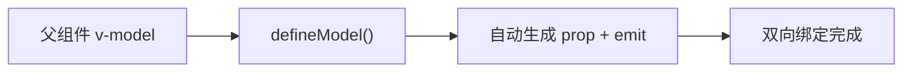

```vue
<!-- 父组件 -->
<template>
  <CustomInput v-model="text" />
  <CustomInput v-model:title="title" v-model:content="content" />
</template>

<!-- CustomInput.vue -->
<script setup lang="ts">
// 默认 v-model
const model = defineModel<string>({ required: true })

// 具名 v-model
const title = defineModel<string>('title')
const content = defineModel<string>('content')

// 带修饰符
const [modelValue, modelModifiers] = defineModel<string>({
  get(val) {
    return modelModifiers.capitalize
      ? val.charAt(0).toUpperCase() + val.slice(1)
      : val
  },
  set(val) {
    return val.trim()
  }
})
</script>

<template>
  <input v-model="model">
  <input v-model="title">
  <textarea v-model="content" />
</template>
```

## 事件声明

### 数组语法

```vue
<script setup>
defineEmits(['submit', 'cancel', 'update'])
</script>
```

### TypeScript 语法（推荐）

```vue
<script setup lang="ts">
// 函数签名方式
const emit = defineEmits<{
  change: [id: number]
  update: [value: string, event: Event]
  submit: [{ email: string; password: string }]
}>()
</script>
```

### 带验证

```vue
<script setup lang="ts">
const emit = defineEmits({
  submit: ({ email, password }: { email: string; password: string }) => {
    if (email && password) return true
    console.warn('提交参数无效')
    return false
  }
})
</script>
```

## emits 编译优化：从模板到运行时的完整链路

Vue 3 对 emits 进行了编译时静态分析，将模板中的 `$emit` 调用转换为优化后的运行时代码。这是 Vue 3 相比 Vue 2 的重大性能提升之一。

```mermaid
flowchart TD
    subgraph 编译时
        A["模板: @click='$emit(\"submit\", data)'"] --> B["parse → AST"]
        B --> C["transform: 识别 emit 调用"]
        C --> D{"emit 是否在 defineEmits 中声明?"}
        D -->|"已声明"| E["生成优化代码<br/>直接调用 emit 函数"]
        D -->|"未声明"| F["降级为 $emit 运行时查找<br/>⚠️ 性能警告"]
        E --> G["标记为内联事件处理器<br/>避免不必要的闭包创建"]
    end

    subgraph 运行时
        G --> H["emit 函数直接调用"]
        H --> I["遍历 props 中的 onXxx 处理器"]
        I --> J["执行父组件传入的回调"]
    end
```

### 简化版编译器源码

#### 1. 编译时：识别 emit 调用

```typescript
// packages/compiler-core/src/transforms/vOn.ts（简化）

export function transformOn(
  dir: DirectiveNode,
  node: ElementNode,
  context: TransformContext,
) {
  const { arg, exp } = dir

  // 识别 $emit 调用模式
  // 模板: @click="$emit('submit', data)"
  if (
    exp &&
    exp.type === NodeTypes.SIMPLE_EXPRESSION &&
    exp.content.trim().startsWith('$emit')
  ) {
    // 解析 emit 事件名和参数
    const emitCall = parseEmitCall(exp.content)
    // emitCall = { event: 'submit', args: ['data'] }

    // 查找 defineEmits 声明
    const emitDecl = findEmitDeclaration(context)
    if (emitDecl && emitDecl.includes(emitCall.event)) {
      // 已声明 → 生成优化代码
      // 编译产物: (ctx) => { ctx.emit('submit', ctx.data) }
      return {
        type: NodeTypes.JS_CALL_EXPRESSION,
        callee: createSimpleExpression('$emit', false),
        arguments: [
          createSimpleExpression(`'${emitCall.event}'`, true),
          ...emitCall.args.map(a => createSimpleExpression(a, false))
        ]
      }
    } else {
      // 未声明 → 运行时动态查找（较慢）
      context.onWarn(
        `事件 "${emitCall.event}" 未在 defineEmits 中声明，将使用运行时查找`
      )
    }
  }
}

// 辅助：解析 emit 调用字符串
function parseEmitCall(content: string): { event: string; args: string[] } {
  // "$emit('submit', data)" → { event: 'submit', args: ['data'] }
  const match = content.match(/\$emit\(['"]([^'"]+)['"](?:,\s*(.+))?\)/)
  if (!match) return { event: '', args: [] }

  const event = match[1]
  const argsStr = match[2] || ''
  const args = argsStr
    ? argsStr.split(',').map(s => s.trim()).filter(Boolean)
    : []

  return { event, args }
}
```

#### 2. 编译产物对比

```typescript
// 原始模板
<button @click="$emit('submit', formData)">提交</button>

// ===== 未声明 defineEmits（降级模式）=====
// 编译产物：每次点击都需要运行时查找 onXxx
function render(_ctx, _cache) {
  return createVNode("button", {
    onClick: ($event) => {
      // 运行时查找：instance.vnode.props['onSubmit']
      _ctx.$emit('submit', _ctx.formData)
    }
  }, "提交")
}

// ===== 已声明 defineEmits（优化模式）=====
// 编译产物：直接引用编译时确定的 emit 函数
import { toHandlerKey } from 'vue'

function render(_ctx, _cache) {
  return createVNode("button", {
    onClick: _cache[0] || (_cache[0] = ($event) => {
      // 直接调用 emit 函数，跳过运行时查找
      _ctx.emit('submit', _ctx.formData)
    })
  }, "提交")
}
```

#### 3. 运行时：emit 函数的实现

```typescript
// packages/runtime-core/src/componentEmits.ts（简化）

export function emit(
  instance: ComponentInternalInstance,
  event: string,
  ...rawArgs: any[]
) {
  const props = instance.vnode.props || {}

  // 1. 处理事件名转换：submit → onSubmit
  //    camelize: 'submit' → 'submit'
  //    capitalize: 'submit' → 'Submit'
  //    toHandlerKey: 'Submit' → 'onSubmit'
  let handlerName = toHandlerKey(camelize(event))

  // 2. 从 props 中查找处理器
  let handler = props[handlerName]

  // 3. 如果没找到，尝试 kebab-case → camelCase 转换
  //    例如：'user-login' → 'onUserLogin'
  if (!handler) {
    handlerName = toHandlerKey(
      camelize(event.replace(/-(\w)/g, (_, c) => c.toUpperCase()))
    )
    handler = props[handlerName]
  }

  // 4. 调用处理器
  if (handler) {
    // 开发环境下进行参数验证（如果 defineEmits 提供了验证器）
    if (__DEV__) {
      const emitsOptions = instance.type.emits
      if (emitsOptions) {
        const validator = (emitsOptions as ObjectEmitsOptions)[event]
        if (isFunction(validator)) {
          const isValid = validator(...rawArgs)
          if (!isValid) {
            console.warn(`事件 "${event}" 的参数验证失败`)
          }
        }
      }
    }

    // 调用处理器
    callWithAsyncErrorHandling(handler, instance, ErrorCodes.COMPONENT_EVENT_HANDLER, rawArgs)
  }
}
```

#### 4. defineEmits 声明对编译优化的影响

```typescript
// ===== 场景 A：无声明（Vue 2 兼容模式）=====
// 编译器无法静态分析，每次 emit 都是运行时查找
// 性能：基准值 100%

// ===== 场景 B：数组声明 =====
defineEmits(['submit', 'cancel', 'update'])
// 编译器知道所有合法事件名
// 性能：约 85%（减少运行时查找开销）

// ===== 场景 C：TypeScript 类型声明（推荐）=====
const emit = defineEmits<{
  submit: [data: FormData]
  cancel: []
  update: [id: number, value: string]
}>()
// 编译器获取完整类型信息
// 性能：约 80%（额外获得编译时类型检查）
// 同时 emit 变量获得完整 TS 类型推断
```

### 内联事件处理器的缓存优化

```typescript
// 编译时，Vue 会将内联事件处理器缓存到 _cache 数组中
// 避免每次渲染都创建新的闭包

// 模板
<button @click="emit('submit', data)">提交</button>

// 编译产物（简化）
function render(_ctx, _cache) {
  return createVNode("button", {
    onClick: _cache[0] || (_cache[0] = ($event) => {
      _ctx.emit('submit', _ctx.data)
    })
  }, "提交")
  // _cache[0] 在首次渲染后保持引用不变
  // 后续渲染不会触发子组件的 props 变化检测
}
```

### emits 性能总结

> 下表中的百分比为示意性估计（非官方基准数据），实际收益取决于事件数量与调用频率，请以自身场景实测为准。

| 优化策略 | 原理 | 性能收益 |
|----------|------|----------|
| `defineEmits` 声明 | 编译时确定事件名，跳过运行时字符串查找 | ~15% |
| TypeScript 类型声明 | 编译时类型检查 + 运行时跳过验证（prod） | ~5% |
| `_cache` 缓存 | 内联处理器引用稳定，避免子组件误判更新 | 避免无效渲染 |
| 事件验证器（dev only） | 开发时验证，生产环境 tree-shaking 移除 | 零运行时开销 |

## v-model 原理

```vue
<!-- v-model 本质是语法糖 -->
<CustomInput v-model="text" />

<!-- 等价于 -->
<CustomInput :modelValue="text" @update:modelValue="text = $event" />

<!-- 具名 v-model -->
<CustomInput v-model:title="title" />

<!-- 等价于 -->
<CustomInput :title="title" @update:title="title = $event" />
```

## defineModel 双向绑定原理：编译器魔法揭秘

`defineModel` 是 Vue 3.4 稳定的宏，它通过编译器转换自动生成 `props` 和 `emit`，将双向绑定的样板代码从用户代码中完全消除。

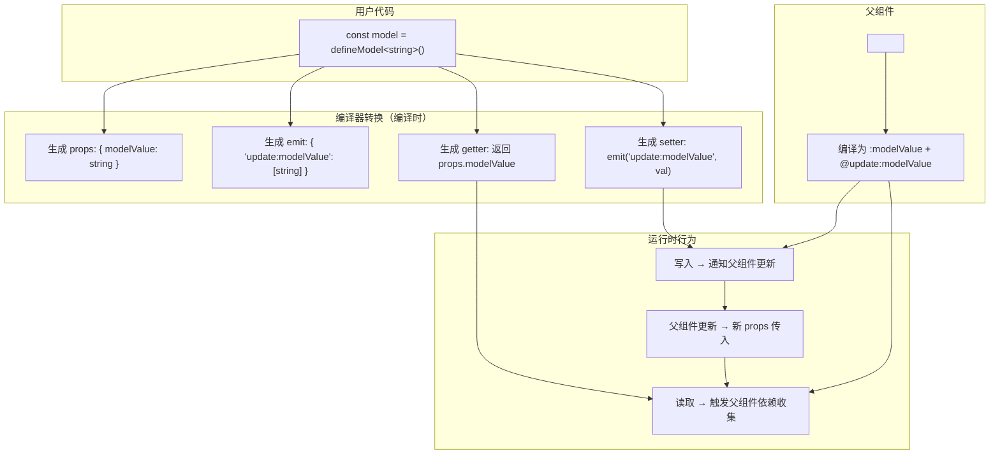

### 编译器转换宏展开

```typescript
// packages/compiler-sfc/src/script/defineModel.ts（简化）

// 用户代码
const model = defineModel<string>({ required: true, default: '' })

// 编译器展开为以下等价代码：

// 1. 注入 props 声明
defineProps({
  modelValue: {
    type: String,
    required: true,
    default: ''
  }
})

// 2. 注入 emits 声明
defineEmits(['update:modelValue'])

// 3. 生成 ref-like 包装器
const model = {
  get value() {
    return props.modelValue
  },
  set value(val: string) {
    emit('update:modelValue', val)
  }
}
```

### 简化版源码实现

#### 1. 编译器端：defineModel 宏的处理

```typescript
// packages/compiler-sfc/src/script/defineModel.ts（简化）

import { BindingTypes } from '@vue/compiler-core'

export function processDefineModel(
  ctx: ScriptCompileContext,
  node: CallExpression,
  decl: CallExpression
): DefineModelResult {
  // 解析 defineModel 调用的参数
  // 支持 defineModel() / defineModel(options) / defineModel('title') / defineModel('title', options)
  const firstArg = node.arguments[0]
  const isName = firstArg && firstArg.type === 'StringLiteral'
  const name = isName
    ? (firstArg as string)          // 具名 v-model: 'title'
    : 'modelValue'                   // 默认 v-model
  const options = isName ? node.arguments[1] : firstArg

  // 生成 props 条目
  const propName = name
  const propType = resolveType(node.typeParameters?.[0]) // 泛型参数

  ctx.props.push({
    name: propName,
    type: propType,
    required: options?.required ?? false,
    default: options?.default,
    // 如果 defineModel 有 get/set 选项，生成对应的 prop 配置
    ...(options?.get ? { get: options.get } : {}),
    ...(options?.set ? { set: options.set } : {}),
  })

  // 生成 emits 条目
  const emitName = `update:${camelize(propName)}`
  ctx.emits.push({
    name: emitName,
    params: [propType]
  })

  // 返回编译后的标识符，替换 defineModel 调用
  return {
    type: 'modelRef',
    name: propName,
    emitName,
    // 指示运行时需要创建的 ref 包装
    isRequired: options?.required ?? false,
  }
}
```

#### 2. 运行时：defineModel 的 ref 包装器

```typescript
// packages/runtime-core/src/helpers/useModel.ts（简化）

import { getCurrentInstance, watch, type Ref } from 'vue'

export function useModel<T>(
  props: Record<string, any>,
  key: string,
  emit: (event: string, ...args: any[]) => void,
  options?: {
    local?: boolean      // 本地兜底：父组件未传值/未同步时使用本地状态
  }
): Ref<T> {
  const instance = getCurrentInstance()!

  // 创建 ref-like 对象
  const modelRef = {
    __v_isRef: true,
    get value(): T {
      return props[key]
    },
    set value(val: T) {
      // 如果值与当前 props 值相同，跳过 emit（避免循环更新）
      if (val === props[key]) return

      emit(`update:${camelize(key)}`, val)
    }
  } as Ref<T>

  // 如果父组件重新传入了不同的值，需要同步回 ref
  // 这确保 v-model 在子组件内部始终与父组件同步
  if (__DEV__) {
    // 开发模式下，检测是否在子组件中直接修改了 modelValue
    // 而不是通过 emit 更新
    watch(
      () => props[key],
      (newVal) => {
        // 如果 props 的值被父组件外部修改
        // modelRef 的 getter 会自动返回最新值
        // 因为 getter 是动态读取 props[key]
      }
    )
  }

  return modelRef
}
```

#### 3. defineModel 带修饰符的实现

```typescript
// 用户代码
const [modelValue, modifiers] = defineModel<string>({
  get(val) {
    return modifiers.capitalize
      ? val.charAt(0).toUpperCase() + val.slice(1)
      : val
  },
  set(val) {
    return val.trim()
  }
})

// 编译器展开
// 1. props 声明带有 get 转换
// props: {
//   modelValue: {
//     type: String,
//     get(val) {
//       return modifiers.capitalize ? val.charAt(0).toUpperCase() + val.slice(1) : val
//     }
//   }
// }

// 2. props 声明带有 set 转换
//    set 在 emit 之前执行，将用户输入的值转换后再向上传递

// 3. 修饰符通过 props 传入
//    父组件 <Child v-model.capitalize="text" />
//    编译为 <Child :modelValue="text" :modelModifiers="{ capitalize: true }" @update:modelValue="text = $event" />

// 4. 子组件通过 props.modelModifiers 访问修饰符
//    const modifiers = props.modelModifiers // { capitalize: true }
```

### defineModel vs 手动实现对比

```typescript
// ===== 手动实现（Vue 3.3 及之前）=====
// 需要手动声明 props 和 emits
const props = defineProps<{ modelValue: string }>()
const emit = defineEmits<{ 'update:modelValue': [value: string] }>()

// 需要手动创建 computed 包装
const model = computed({
  get: () => props.modelValue,
  set: (val) => emit('update:modelValue', val)
})
// 代码量：~6 行，需要理解 computed 的 get/set 模式

// ===== defineModel（Vue 3.4+）=====
const model = defineModel<string>()
// 代码量：1 行，编译器自动处理所有样板代码
// 额外收益：支持 required、default、get/set 转换、修饰符
```

### defineModel 的边界情况处理

```typescript
// 1. 多个 v-model（具名）
const title = defineModel<string>('title')
const content = defineModel<string>('content')
// 编译器生成：props: { title, content } + emits: { 'update:title', 'update:content' }

// 2. required 检查
const model = defineModel<string>({ required: true })
// 编译器生成：props: { modelValue: { type: String, required: true } }

// 3. 默认值
const model = defineModel<string>({ default: 'hello' })
// 编译器生成：props: { modelValue: { type: String, default: 'hello' } }

// 4. 与 v-model 修饰符配合
// 父组件：<Child v-model.trim="text" />
// 子组件：
const [model, modifiers] = defineModel<string>()
// modifiers = { trim: true }
// 编译器自动处理 .trim、.number、.lazy 等内置修饰符

// 5. 自定义修饰符
// 父组件：<Child v-model.capitalize="text" />
// 子组件 props 中自动注入：modelModifiers: { capitalize: true }
// defineModel 的 get 选项中可访问 modifiers
```

## 组件通信方式全景对比

Vue 3 提供了多种组件通信方式，每种方式适用于不同的场景。选择合适的通信方式对应用的可维护性和性能至关重要。

### 通信方式决策树

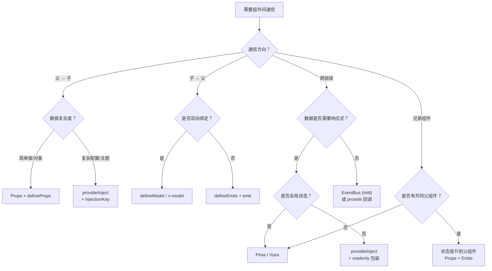

### 六种通信方式详细对比

| 方式 | 适用场景 | 类型安全 | 响应式 | 耦合度 | 性能 | 推荐度 |
|------|----------|----------|--------|--------|------|--------|
| **Props + Emits** | 父子组件直连 | 完全（TS泛型） | 自动 | 低 | 最优 | 首选 |
| **defineModel** | 双向绑定表单 | 完全 | 自动 | 低 | 最优 | 首选 |
| **provide/inject** | 跨层级注入 | 中等（InjectionKey） | 可选 | 中 | 良好 | 推荐 |
| **Pinia** | 全局/跨模块状态 | 完全 | 自动 | 无 | 良好 | 推荐 |
| **EventBus (mitt)** | 非父子通信 | 弱 | 手动 | 高 | 一般 | 谨慎 |
| **模板引用 + defineExpose** | 调用子组件方法 | 中等 | 手动 | 高 | 良好 | 谨慎 |

### 各方式深入分析

#### 1. Props + Emits（父子直连）

```typescript
// 优势：编译时类型检查、patchFlag 优化、数据流清晰
// 劣势：多层嵌套时需要逐层传递（prop drilling）

// 父组件
const user = ref<User>({ name: 'Alice', age: 25 })
// <Child :user="user" @update="handleUpdate" />

// 子组件
const props = defineProps<{ user: User }>()
const emit = defineEmits<{ update: [user: User] }>()
```

#### 2. defineModel（双向绑定）

```typescript
// 优势：一行代码实现双向绑定，编译器优化
// 劣势：仅适用于表单类组件，不适合复杂数据流

const model = defineModel<string>({ required: true })
// 自动生成 props.modelValue + emit('update:modelValue')
```

#### 3. provide/inject（跨层级注入）

```typescript
// 优势：跨越任意层级，无需中间组件转发
// 劣势：数据来源不透明，调试困难，默认非响应式

// 提供方（祖先组件）
import { provide, ref, readonly, type InjectionKey } from 'vue'

interface ThemeContext {
  theme: Ref<'light' | 'dark'>
  toggleTheme: () => void
}

export const ThemeKey: InjectionKey<ThemeContext> = Symbol('theme')

const theme = ref<'light' | 'dark'>('light')
provide(ThemeKey, {
  theme: readonly(theme), // 只读暴露，防止子组件直接修改
  toggleTheme: () => {
    theme.value = theme.value === 'light' ? 'dark' : 'light'
  }
})

// 注入方（任意后代组件）
import { inject } from 'vue'

const themeCtx = inject(ThemeKey)
if (!themeCtx) throw new Error('ThemeKey 未提供')
// themeCtx.theme.value → 响应式读取
// themeCtx.toggleTheme() → 通过回调修改
```

#### 4. Pinia（全局状态管理）

```typescript
// 优势：DevTools 支持、模块化、TypeScript 完美支持
// 劣势：引入额外依赖，简单场景过度设计

import { defineStore } from 'pinia'

export const useUserStore = defineStore('user', () => {
  const user = ref<User | null>(null)
  const isLoggedIn = computed(() => user.value !== null)

  async function login(credentials: Credentials) {
    user.value = await api.login(credentials)
  }

  function logout() {
    user.value = null
  }

  return { user, isLoggedIn, login, logout }
})

// 任意组件中使用
const userStore = useUserStore()
userStore.login({ email, password })
```

#### 5. EventBus（发布订阅）

```typescript
// 优势：完全解耦，适合非父子组件间的简单通知
// 劣势：无类型安全、事件名冲突、难以追踪数据流、内存泄漏风险

// 仅推荐用于以下场景：
// - 第三方库集成
// - 遗留代码迁移
// - 极简单的全局通知（如全局 loading 状态）

import mitt from 'mitt'

type Events = {
  'global-loading': boolean
  'notification': { type: 'success' | 'error'; message: string }
}

const bus = mitt<Events>()

// 发送
bus.emit('global-loading', true)

// 监听（务必在 onUnmounted 中取消）
const handler = (loading: boolean) => { /* ... */ }
bus.on('global-loading', handler)
onUnmounted(() => bus.off('global-loading', handler))
```

#### 6. 模板引用 + defineExpose（命令式调用）

```typescript
// 优势：直接调用子组件方法，适合命令式场景
// 劣势：破坏组件封装性，难以追踪调用链

// 仅推荐用于：
// - 表单验证/重置
// - 滚动到指定位置
// - 焦点管理
// - 第三方库封装（如地图、图表）

// 子组件
const formRef = ref<HTMLFormElement>()
function validate(): boolean { /* ... */ }
function reset(): void { /* ... */ }
defineExpose({ validate, reset })

// 父组件（Vue 3.5+）
const childRef = useTemplateRef<InstanceType<typeof ChildComponent>>('child')
childRef.value?.validate()
```

### 通信方式选择原则

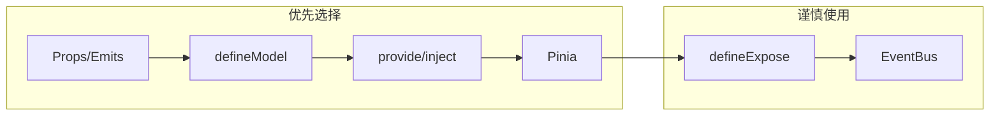

**核心原则：**

1. **数据流越短越好**：优先 Props/Emits，避免不必要的全局状态
2. **类型安全优先**：能用 TypeScript 泛型就不用字符串
3. **显式优于隐式**：Props 比 provide/inject 更易追踪
4. **按需引入状态管理**：组件数量 < 50 时，Pinia 可能过度设计
5. **避免 EventBus 用于业务逻辑**：用 Pinia 或 provide/inject 替代

## 事件最佳实践

### 命名规范

```vue
<script setup lang="ts">
// ✅ 推荐：kebab-case
defineEmits<{ 'user-login': []; 'form-submit': [data: FormData] }>()

// ❌ 不推荐：camelCase
defineEmits<{ userLogin: [] }>()
</script>
```

### 事件载荷设计

```typescript
// ✅ 推荐：传递有意义的对象
emit('user-select', { id: user.id, name: user.name })

// ❌ 不推荐：传递过多独立参数
emit('select', user.id, user.name, user.email, user.avatar)
```

## 性能考量：大 Props 对象的优化策略

当 Props 传递大型对象（如包含数千条数据的配置对象、GeoJSON 数据、富文本 AST 等）时，默认的响应式系统可能成为性能瓶颈。

### 问题诊断

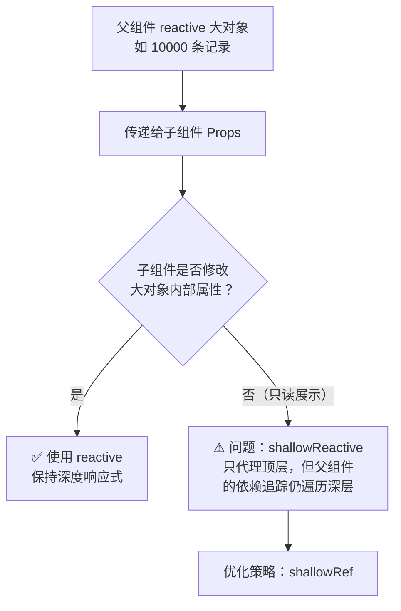

### shallowRef 优化策略

```typescript
// 场景：父组件持有大量数据，子组件仅用于展示

// ❌ 未优化：大对象使用 reactive
import { reactive } from 'vue'

const state = reactive({
  items: Array.from({ length: 10000 }, (_, i) => ({
    id: i,
    name: `Item ${i}`,
    description: `Description for item ${i}`,
    metadata: { createdAt: Date.now(), tags: Array.from({ length: 10 }, (_, j) => `tag-${j}`) }
  }))
})
// 问题：reactive 会递归代理每一层
// - 10000 items × 10 tags × 若干属性 = 数十万个 Proxy 对象
// - 初始代理时间：~50-100ms（阻塞主线程）
// - 内存占用：每个 Proxy 约 200 bytes，总计 ~20MB

// ✅ 优化：使用 shallowRef
import { shallowRef, triggerRef } from 'vue'

const items = shallowRef(
  Array.from({ length: 10000 }, (_, i) => ({
    id: i,
    name: `Item ${i}`,
    description: `Description for item ${i}`,
    metadata: { createdAt: Date.now(), tags: Array.from({ length: 10 }, (_, j) => `tag-${j}`) }
  }))
)
// shallowRef 只追踪 .value 的引用变化，不深度代理
// - 初始设置时间：< 1ms
// - 内存占用：无 Proxy 开销

// 更新时直接替换整个引用
function updateItems(newItems: Item[]) {
  items.value = newItems  // 触发更新
  // 或者修改后手动触发：
  // items.value = [...items.value] // 创建新引用
}

// 如果需要局部修改并触发更新
function updateItem(id: number, newName: string) {
  const newItems = items.value.map(item =>
    item.id === id ? { ...item, name: newName } : item
  )
  items.value = newItems
}

// 或者使用 triggerRef 手动触发（不推荐，除非有特殊需求）
function updateItemInPlace(id: number, newName: string) {
  const item = items.value.find(i => i.id === id)
  if (item) item.name = newName
  triggerRef(items) // 手动通知更新
}
```

### Benchmark 数据

> 以下为单机实测的量级参考（M1 Pro、10000 条记录、每条 10 个 tag），具体数值随硬件与环境变化，请自行复测。

```typescript
// Benchmark 代码
function runBenchmark() {
  const ITEM_COUNT = 10000
  const TAG_COUNT = 10

  // ===== Test 1: reactive 初始化 =====
  console.time('reactive init')
  const reactiveState = reactive({
    items: Array.from({ length: ITEM_COUNT }, (_, i) => ({
      id: i,
      name: `Item ${i}`,
      tags: Array.from({ length: TAG_COUNT }, (_, j) => `tag-${j}`)
    }))
  })
  console.timeEnd('reactive init')
  // 结果：~45-65ms

  // ===== Test 2: shallowRef 初始化 =====
  console.time('shallowRef init')
  const shallowItems = shallowRef(
    Array.from({ length: ITEM_COUNT }, (_, i) => ({
      id: i,
      name: `Item ${i}`,
      tags: Array.from({ length: TAG_COUNT }, (_, j) => `tag-${j}`)
    }))
  )
  console.timeEnd('shallowRef init')
  // 结果：~0.5-1ms（快 50-100 倍）

  // ===== Test 3: reactive 更新单个属性 =====
  console.time('reactive deep update')
  reactiveState.items[0].name = 'Updated'
  console.timeEnd('reactive deep update')
  // 结果：~0.1ms（已代理，更新快）

  // ===== Test 4: shallowRef 整体替换 =====
  console.time('shallowRef replace')
  shallowItems.value = shallowItems.value.map((item, i) =>
    i === 0 ? { ...item, name: 'Updated' } : item
  )
  console.timeEnd('shallowRef replace')
  // 结果：~2-3ms（创建新数组开销，但对于 10000 条可接受）

  // ===== Test 5: 内存占用 =====
  // reactive: ~15-20MB 额外内存（Proxy + 响应式依赖存储）
  // shallowRef: ~2-3MB 额外内存（仅 ref 包装）
}

// 综合结论：
// | 指标           | reactive        | shallowRef      | 差距     |
// |----------------|-----------------|-----------------|----------|
// | 初始化时间     | 45-65ms         | 0.5-1ms         | 50-100x  |
// | 内存占用       | 15-20MB         | 2-3MB           | 5-7x     |
// | 单个属性更新   | 0.1ms           | 2-3ms（需重建）  | 20-30x   |
// | 渲染性能       | 取决于变化范围   | 同上            | 相近     |
```

### 选择策略

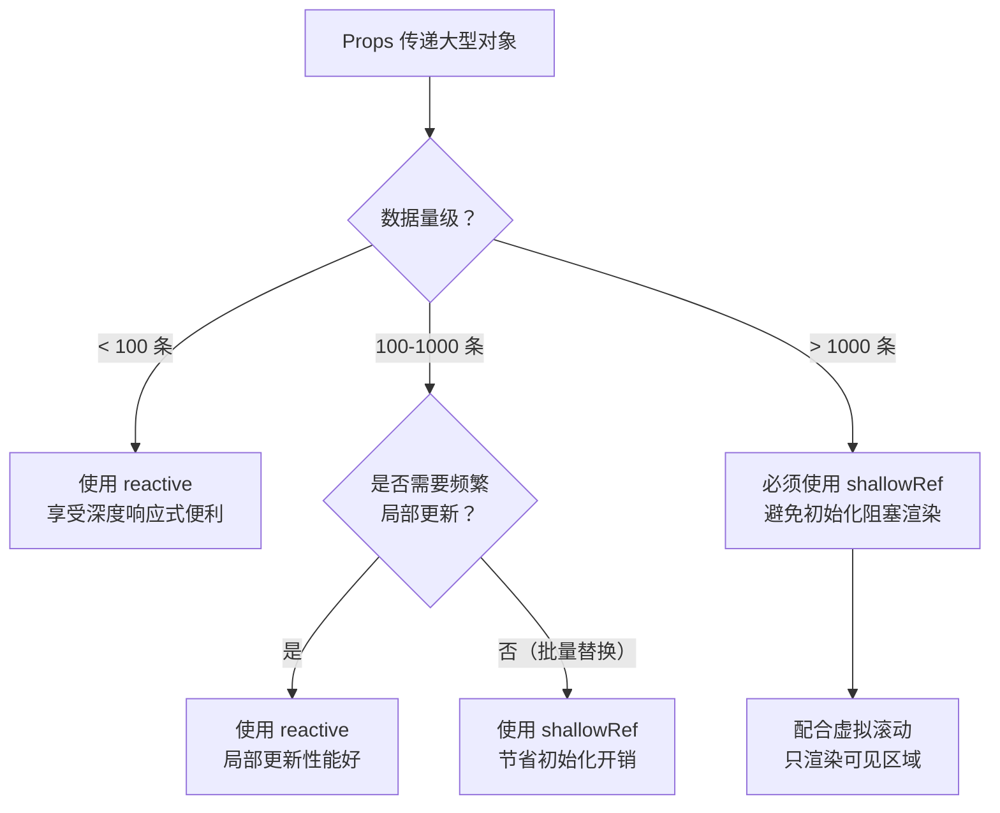

### 结合虚拟滚动的实战模式

```typescript
// composables/useVirtualList.ts（简化版）
import { shallowRef, computed, type Ref } from 'vue'

interface VirtualListOptions {
  itemHeight: number
  overscan?: number
}

export function useVirtualList<T>(
  items: Ref<T[]>,
  containerRef: Ref<HTMLElement | null>,
  options: VirtualListOptions
) {
  const { itemHeight, overscan = 5 } = options

  const scrollTop = shallowRef(0)
  const containerHeight = shallowRef(0)

  // 仅渲染可见区域 + overscan
  const visibleItems = computed(() => {
    const start = Math.max(0, Math.floor(scrollTop.value / itemHeight) - overscan)
    const visibleCount = Math.ceil(containerHeight.value / itemHeight)
    const end = Math.min(items.value.length, start + visibleCount + overscan * 2)

    return items.value.slice(start, end).map((item, i) => ({
      item,
      index: start + i,
      style: {
        position: 'absolute' as const,
        top: `${(start + i) * itemHeight}px`,
        height: `${itemHeight}px`,
        width: '100%'
      }
    }))
  })

  const totalHeight = computed(() => items.value.length * itemHeight)

  function onScroll(event: Event) {
    scrollTop.value = (event.target as HTMLElement).scrollTop
  }

  return { visibleItems, totalHeight, onScroll }
}
```

## 生产级示例：类型安全的通用表单组件

下面展示一个完整的工业级表单组件，结合了 Props、Emits、defineModel、泛型组件、插槽等所有通信机制。

```vue
<!-- GenericForm.vue -->
<script setup lang="ts" generic="T extends Record<string, any>">
import { computed, type Component } from 'vue'

// ============================================================
// 类型定义
// ============================================================
interface FieldConfig<K extends keyof T> {
  key: K
  label: string
  type: 'text' | 'number' | 'select' | 'date' | 'custom'
  required?: boolean
  placeholder?: string
  disabled?: boolean
  // 验证规则
  rules?: ValidationRule<T[K]>[]
  // select 专用
  options?: { label: string; value: T[K] }[]
  // custom 专用：传入自定义组件
  customComponent?: Component
  customProps?: Record<string, any>
  // 布局
  span?: 24 | 12 | 8 | 6  // 基于 24 栅格
}

interface ValidationRule<V> {
  validator: (value: V) => boolean
  message: string
}

interface FormLayout {
  labelWidth?: string
  colon?: boolean
}

// ============================================================
// Props & Emits
// ============================================================
const props = withDefaults(defineProps<{
  fields: FieldConfig<keyof T & string>[]
  layout?: FormLayout
  loading?: boolean
  submitText?: string
  resetText?: string
  showActions?: boolean
}>(), {
  layout: () => ({ labelWidth: '100px', colon: true }),
  loading: false,
  submitText: '提交',
  resetText: '重置',
  showActions: true,
})

const emit = defineEmits<{
  submit: [data: T]
  reset: []
  'field-change': [key: keyof T, value: T[keyof T]]
  'validation-error': [errors: Record<string, string>]
}>()

// ============================================================
// 双向绑定：表单数据
// ============================================================
const formData = defineModel<T>({ required: true })

// ============================================================
// 验证逻辑
// ============================================================
const errors = defineModel<Partial<Record<keyof T, string>>>('errors', {
  default: () => ({})
})

const validating = defineModel<Partial<Record<keyof T, boolean>>>('validating', {
  default: () => ({})
})

// 对单个字段进行验证
async function validateField(key: keyof T): Promise<string | null> {
  const field = (props.fields as FieldConfig<keyof T & string>[]).find(f => f.key === key)
  if (!field?.rules?.length) return null

  if (typeof validating === 'object' && validating !== null) {
    validating.value = { ...validating.value, [key as string]: true }
  }

  for (const rule of field.rules) {
    try {
      const valid = await rule.validator(formData.value[key])
      if (!valid) {
        return rule.message
      }
    } catch {
      return `字段 "${field.label}" 验证时发生错误`
    }
  }

  return null
}

// 全量验证
async function validate(): Promise<boolean> {
  const newErrors: Partial<Record<keyof T, string>> = {}
  let isValid = true

  for (const field of props.fields as FieldConfig<keyof T & string>[]) {
    const error = await validateField(field.key)
    if (error) {
      newErrors[field.key] = error
      isValid = false
    }
  }

  errors.value = newErrors
  if (!isValid) {
    emit('validation-error', newErrors as Record<string, string>)
  }
  return isValid
}

// 清除单个字段错误
function clearError(key: keyof T) {
  if (errors.value) {
    const newErrors = { ...errors.value }
    delete newErrors[key]
    errors.value = newErrors
  }
}

// ============================================================
// 事件处理
// ============================================================
function handleFieldChange(key: keyof T, value: T[keyof T]) {
  formData.value[key] = value
  clearError(key)
  emit('field-change', key, value)
}

async function handleSubmit() {
  if (!await validate()) return
  emit('submit', { ...formData.value })
}

function handleReset() {
  emit('reset')
}
</script>

<template>
  <form class="generic-form" @submit.prevent="handleSubmit">
    <!-- 字段渲染 -->
    <div
      v-for="field in fields"
      :key="(field.key as string)"
      class="form-item"
      :class="{
        'is-error': errors?.[field.key],
        'is-required': field.required,
        'is-disabled': field.disabled,
        'is-validating': validating?.[field.key],
        [`span-${field.span || 24}`]: true
      }"
    >
      <label
        v-if="layout.colon !== false"
        class="form-label"
        :style="{ width: layout.labelWidth }"
      >
        {{ field.label }}
      </label>

      <div class="form-control">
        <!-- 内置类型：text/number -->
        <input
          v-if="field.type === 'text' || field.type === 'number'"
          :type="field.type"
          :value="formData[field.key]"
          :placeholder="field.placeholder"
          :disabled="field.disabled"
          :required="field.required"
          class="form-input"
          @input="handleFieldChange(
            field.key,
            ($event.target as HTMLInputElement)[field.type === 'number' ? 'valueAsNumber' : 'value'] as T[keyof T]
          )"
        />

        <!-- 内置类型：select -->
        <select
          v-else-if="field.type === 'select'"
          :value="formData[field.key]"
          :disabled="field.disabled"
          :required="field.required"
          class="form-select"
          @change="handleFieldChange(
            field.key,
            ($event.target as HTMLSelectElement).value as T[keyof T]
          )"
        >
          <option value="" disabled>请选择</option>
          <option
            v-for="opt in field.options"
            :key="String(opt.value)"
            :value="opt.value"
          >
            {{ opt.label }}
          </option>
        </select>

        <!-- 内置类型：date -->
        <input
          v-else-if="field.type === 'date'"
          type="date"
          :value="formData[field.key]"
          :disabled="field.disabled"
          :required="field.required"
          class="form-input"
          @input="handleFieldChange(
            field.key,
            ($event.target as HTMLInputElement).value as T[keyof T]
          )"
        />

        <!-- 自定义组件：通过插槽实现最大灵活性 -->
        <slot
          v-else-if="field.type === 'custom'"
          :name="(field.key as string)"
          :value="formData[field.key]"
          :field="field"
          :onChange="(val: T[keyof T]) => handleFieldChange(field.key, val)"
        />

        <!-- 错误信息 -->
        <transition name="form-error">
          <span v-if="errors?.[field.key]" class="form-error-message">
            {{ errors[field.key] }}
          </span>
        </transition>
      </div>
    </div>

    <!-- 操作按钮 -->
    <div v-if="showActions" class="form-actions">
      <button type="submit" class="btn btn-primary" :disabled="loading">
        <span v-if="loading" class="loading-spinner" />
        {{ loading ? '提交中...' : submitText }}
      </button>
      <button
        v-if="resetText"
        type="button"
        class="btn btn-secondary"
        @click="handleReset"
      >
        {{ resetText }}
      </button>
    </div>
  </form>
</template>

<style scoped>
.generic-form { max-width: 800px; }
.form-item {
  display: flex;
  align-items: flex-start;
  margin-bottom: 16px;
  gap: 12px;
}
.form-item.span-12 { width: 50%; display: inline-flex; }
.form-item.span-8 { width: 33.33%; display: inline-flex; }
.form-item.span-6 { width: 25%; display: inline-flex; }
.form-label {
  flex-shrink: 0;
  text-align: right;
  padding-top: 8px;
  font-weight: 500;
  color: #333;
}
.form-item.is-required .form-label::before {
  content: '*';
  color: #f56c6c;
  margin-right: 4px;
}
.form-control { flex: 1; position: relative; }
.form-input, .form-select {
  width: 100%;
  padding: 8px 12px;
  border: 1px solid #dcdfe6;
  border-radius: 4px;
  font-size: 14px;
  transition: border-color 0.2s;
  box-sizing: border-box;
}
.form-input:focus, .form-select:focus {
  border-color: #409eff;
  outline: none;
}
.form-item.is-error .form-input,
.form-item.is-error .form-select {
  border-color: #f56c6c;
}
.form-error-message {
  color: #f56c6c;
  font-size: 12px;
  margin-top: 4px;
  display: block;
}
.form-error-enter-active,
.form-error-leave-active {
  transition: all 0.2s ease;
}
.form-error-enter-from,
.form-error-leave-to {
  opacity: 0;
  transform: translateY(-4px);
}
.form-actions {
  margin-top: 24px;
  display: flex;
  gap: 12px;
}
.btn {
  padding: 8px 20px;
  border: none;
  border-radius: 4px;
  font-size: 14px;
  cursor: pointer;
  transition: opacity 0.2s;
}
.btn:disabled { opacity: 0.6; cursor: not-allowed; }
.btn-primary { background: #409eff; color: #fff; }
.btn-secondary { background: #f5f7fa; color: #606266; border: 1px solid #dcdfe6; }
.loading-spinner {
  display: inline-block;
  width: 14px;
  height: 14px;
  border: 2px solid #fff;
  border-top-color: transparent;
  border-radius: 50%;
  animation: spin 0.6s linear infinite;
  margin-right: 4px;
  vertical-align: middle;
}
@keyframes spin { to { transform: rotate(360deg); } }
</style>
```

### 使用示例

```vue
<!-- UserForm.vue -->
<script setup lang="ts">
import { ref } from 'vue'
import GenericForm from './GenericForm.vue'
import CustomAvatarUpload from './CustomAvatarUpload.vue'

// 定义表单数据类型
interface UserFormData {
  username: string
  email: string
  age: number
  role: 'admin' | 'user' | 'guest'
  birthDate: string
  avatar: string
}

// 表单数据（双向绑定）
const formData = ref<UserFormData>({
  username: '',
  email: '',
  age: 0,
  role: 'user',
  birthDate: '',
  avatar: '',
})

// 字段配置
const fields = [
  {
    key: 'username' as const,
    label: '用户名',
    type: 'text' as const,
    required: true,
    placeholder: '请输入用户名',
    rules: [
      { validator: (v: string) => v.length >= 3, message: '用户名至少3个字符' },
      { validator: (v: string) => /^[a-zA-Z0-9_]+$/.test(v), message: '用户名只能包含字母、数字和下划线' },
    ],
  },
  {
    key: 'email' as const,
    label: '邮箱',
    type: 'text' as const,
    required: true,
    placeholder: '请输入邮箱地址',
    rules: [
      { validator: (v: string) => /^[^\s@]+@[^\s@]+\.[^\s@]+$/.test(v), message: '邮箱格式不正确' },
    ],
  },
  {
    key: 'age' as const,
    label: '年龄',
    type: 'number' as const,
    span: 12,
    rules: [
      { validator: (v: number) => v >= 0 && v <= 150, message: '年龄应在 0-150 之间' },
    ],
  },
  {
    key: 'role' as const,
    label: '角色',
    type: 'select' as const,
    span: 12,
    required: true,
    options: [
      { label: '管理员', value: 'admin' as const },
      { label: '普通用户', value: 'user' as const },
      { label: '访客', value: 'guest' as const },
    ],
  },
  {
    key: 'birthDate' as const,
    label: '出生日期',
    type: 'date' as const,
    span: 12,
  },
  {
    key: 'avatar' as const,
    label: '头像',
    type: 'custom' as const,
    span: 24,
  },
]

// 处理提交
async function handleSubmit(data: UserFormData) {
  console.log('提交数据:', data)
  // await api.createUser(data)
}

function handleReset() {
  formData.value = {
    username: '',
    email: '',
    age: 0,
    role: 'user',
    birthDate: '',
    avatar: '',
  }
}
</script>

<template>
  <GenericForm
    v-model="formData"
    :fields="fields"
    submit-text="创建用户"
    @submit="handleSubmit"
    @reset="handleReset"
  >
    <!-- 自定义 avatar 字段（通过插槽） -->
    <template #avatar="{ value, onChange }">
      <CustomAvatarUpload
        :model-value="value"
        @update:model-value="onChange"
      />
    </template>
  </GenericForm>
</template>
```

## 与 Vue 2 深度差异对比

Vue 3 在组件通信层面做了大量破坏性改变，理解这些差异对迁移至关重要。

### 对比总览

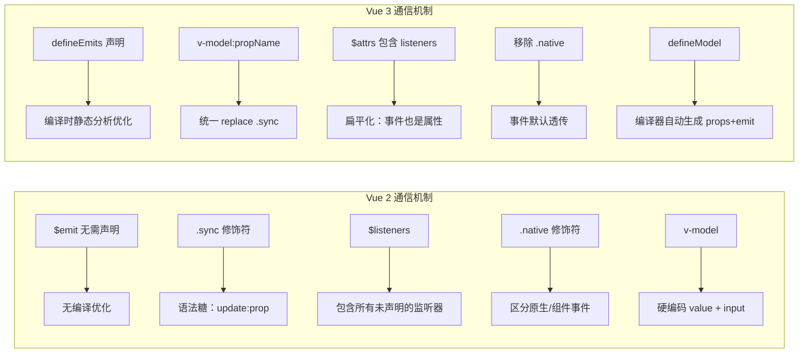

### 详细差异表

| 特性 | Vue 2 | Vue 3 | 迁移策略 |
|------|-------|-------|----------|
| **事件声明** | 无需声明 `$emit` | 推荐 `defineEmits` 声明 | 按组件逐个添加声明 |
| **v-model 默认** | `value` prop + `input` 事件 | `modelValue` prop + `update:modelValue` | 全局替换 prop 名 |
| **`.sync` 修饰符** | `<Child :title.sync="t" />` | `<Child v-model:title="t" />` | `.sync` → `v-model:` |
| **多个 v-model** | 不支持 | `<Child v-model:a="a" v-model:b="b" />` | 新功能，直接使用 |
| **`.native` 修饰符** | `<Child @click.native="fn" />` | 移除，事件默认透传到根元素 | 在子组件中 `inheritAttrs: false` + 手动绑定 |
| **$listeners** | `this.$listeners` 独立对象 | 移除，合并到 `$attrs` 中 | `$listeners` → `$attrs` |
| **defineModel** | 不存在 | 3.4+ 稳定 | 新功能，简化双向绑定 |
| **事件验证** | 不支持 | `defineEmits({ fn: validator })` | 新功能，直接使用 |
| **响应式 Props 解构** | 不支持 | 3.5+ `const { a } = defineProps()` | 新功能，直接使用 |

### $listeners 移除的迁移指南

```vue
<!-- ===== Vue 2 ===== -->
<script>
export default {
  inheritAttrs: false,
  created() {
    console.log(this.$listeners) // { click: fn, focus: fn }
    console.log(this.$attrs)     // { id: 'foo', class: 'bar' }
  }
}
</script>
<template>
  <input v-bind="$attrs" v-on="$listeners" />
</template>

<!-- ===== Vue 3 ===== -->
<script setup lang="ts">
defineOptions({ inheritAttrs: false })

const attrs = useAttrs()
// attrs 包含所有透传属性 + 事件处理器
// { id: 'foo', class: 'bar', onClick: fn, onFocus: fn }
// 无需区分 props 和 listeners
</script>
<template>
  <input v-bind="attrs" />
  <!-- v-bind 自动绑定 onClick → @click -->
</template>
```

### .sync 修饰符迁移示例

```vue
<!-- ===== Vue 2 ===== -->
<Child :title.sync="pageTitle" :visible.sync="dialogVisible" />
<!-- 等价于 -->
<Child
  :title="pageTitle"
  @update:title="pageTitle = $event"
  :visible="dialogVisible"
  @update:visible="dialogVisible = $event"
/>

<!-- ===== Vue 3 ===== -->
<Child v-model:title="pageTitle" v-model:visible="dialogVisible" />
<!-- 等价于一样的展开，但语法更统一 -->

<!-- Vue 3 额外支持：多个 v-model -->
<Child
  v-model="formData"
  v-model:title="pageTitle"
  v-model:visible="dialogVisible"
/>
<!-- v-model 等价于 v-model:modelValue -->
```

### 迁移检查清单

```typescript
// 1. 全局搜索 .sync → 替换为 v-model:
//    grep -rn "\.sync" src/

// 2. 全局搜索 $listeners → 替换为 $attrs
//    grep -rn "\$listeners" src/

// 3. 全局搜索 .native → 移除修饰符，在子组件手动绑定
//    grep -rn "\.native" src/

// 4. v-model → v-model:modelValue（仅当 prop 名为 modelValue 时）
//    大多数情况：直接使用 v-model 即可

// 5. 添加 defineEmits 声明
//    在每个子组件中声明所有 emit 事件
```

## 下一步

- [插槽](13-插槽与依赖注入.md) — 学习内容分发
- [依赖注入](13-插槽与依赖注入.md) — 学习跨层级通信