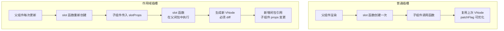
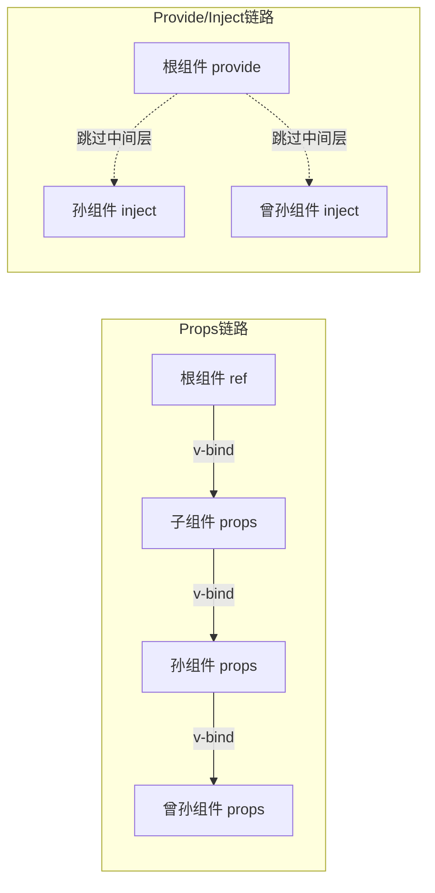
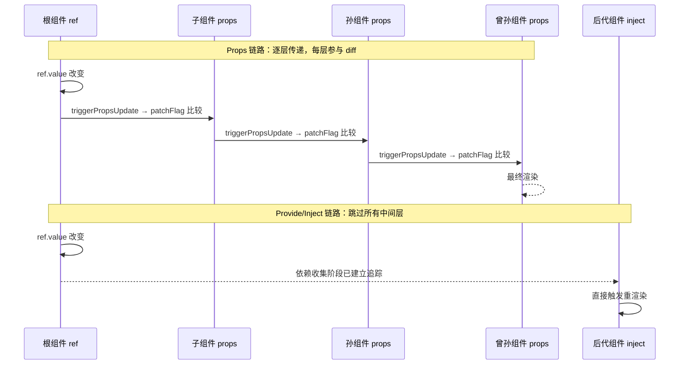
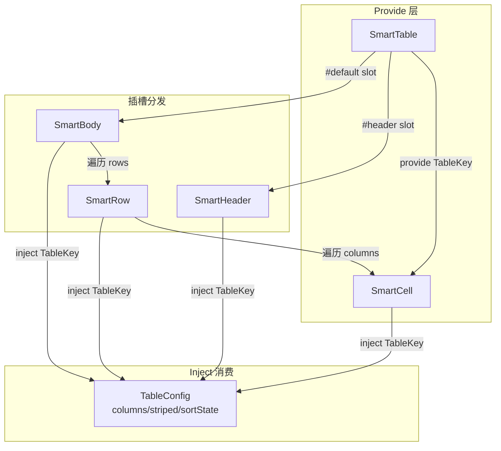
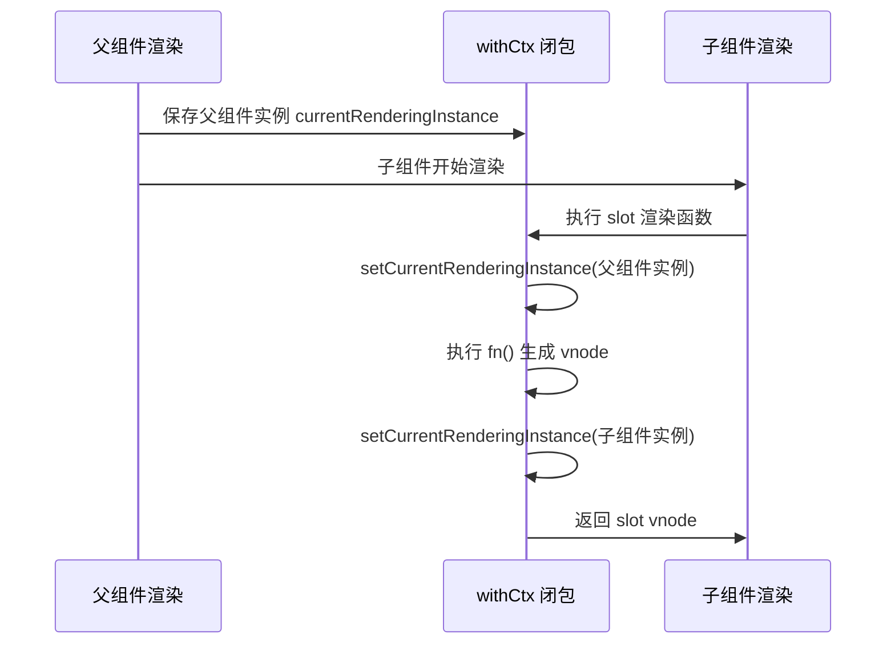
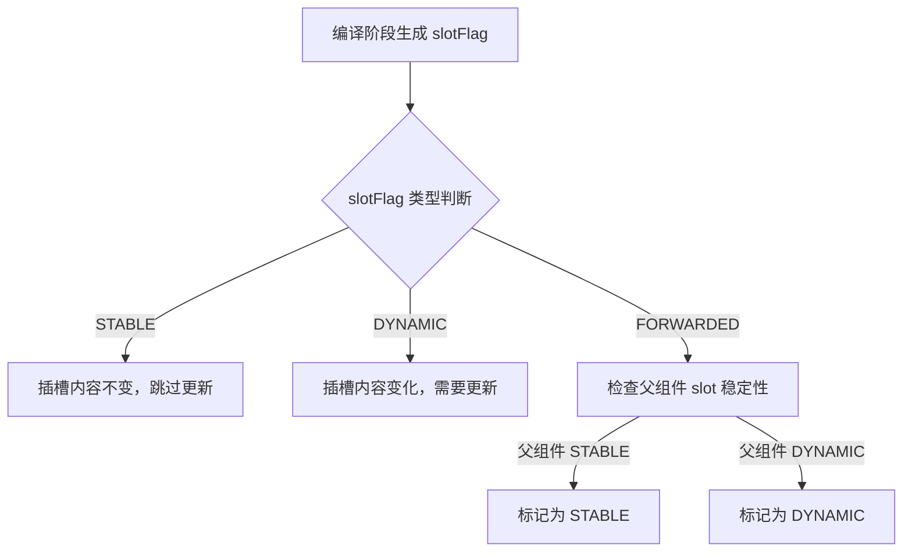
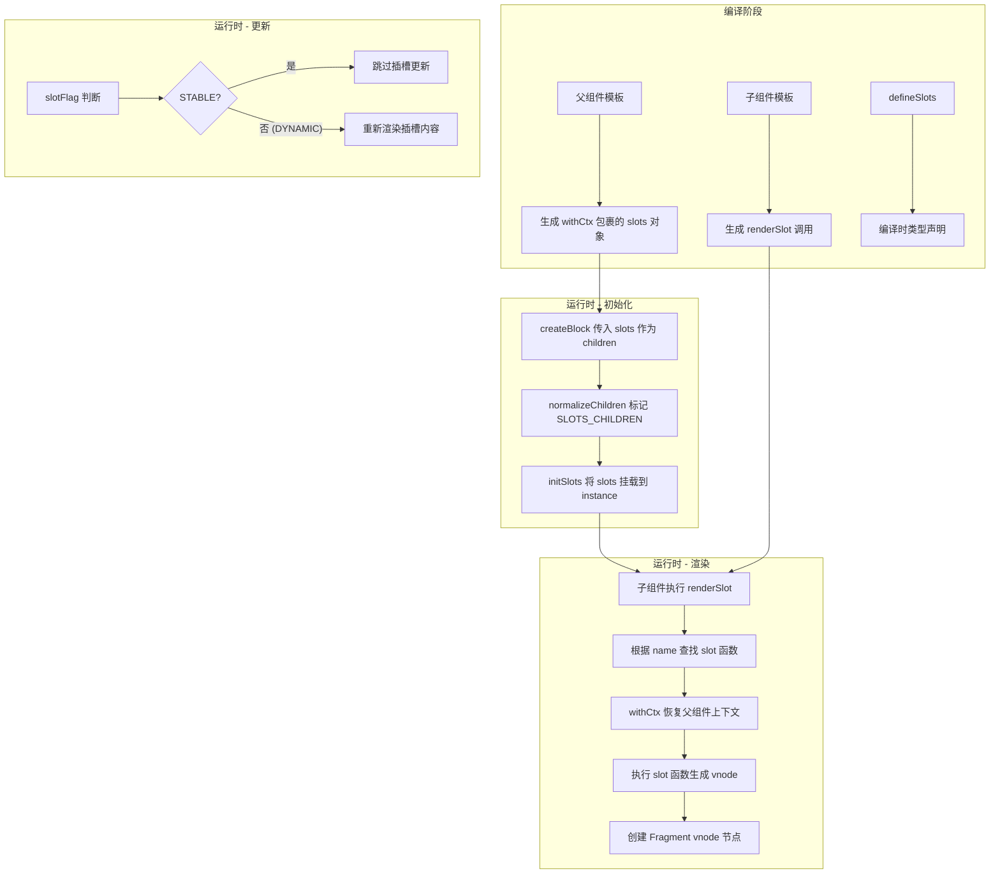

# 插槽

> 插槽用于将内容分发到子组件中，是 Vue 组件系统的核心扩展机制。支持默认插槽、具名插槽、作用域插槽和动态插槽名。
>
> **Vue 3.3+ 支持 `defineSlots<T>()` 类型安全插槽声明。**

## 默认插槽

```vue
<!-- 子组件 -->
<template>
  <button class="btn">
    <slot>默认按钮文字</slot>
  </button>
</template>

<!-- 父组件 -->
<template>
  <MyButton>点击我</MyButton>
  <!-- 未提供内容时 → 渲染"默认按钮文字" -->
</template>
```

## 具名插槽

```vue
<!-- Card.vue -->
<template>
  <div class="card">
    <header><slot name="header" /></header>
    <main><slot /></main>
    <footer><slot name="footer" /></footer>
  </div>
</template>

<!-- 父组件 -->
<template>
  <Card>
    <template #header><h2>标题</h2></template>
    <p>主要内容（默认插槽）</p>
    <template #footer><p>页脚</p></template>
  </Card>
</template>
```

## 作用域插槽

子组件向插槽传递数据：

```vue
<!-- Child.vue -->
<script setup lang="ts">
import { ref } from 'vue'
const user = ref({ name: 'Vue', age: 3 })
</script>

<template>
  <slot :user="user" :version="3" />
</template>

<!-- 父组件：解构接收 -->
<template>
  <Child v-slot="{ user, version }">
    {{ user.name }} v{{ version }}
  </Child>
</template>
```

### 具名作用域插槽

```vue
<template>
  <Child>
    <template #header="{ title }"><h2>{{ title }}</h2></template>
    <template #default="{ content }"><p>{{ content }}</p></template>
  </Child>
</template>
```

## TypeScript 类型安全插槽 <Badge text="Vue 3.3+" type="tip"/>

```vue
<script setup lang="ts">
interface SlotProps {
  user: { name: string; email: string }
  index: number
}

defineSlots<{
  default(props: SlotProps): any
  header(): any
  footer(props: { close: () => void }): any
}>()
</script>
```

## useSlots() 组合式函数

```vue
<script setup lang="ts">
import { useSlots, computed } from 'vue'

const slots = useSlots()

const hasHeader = computed(() => !!slots.header)
const hasFooter = computed(() => !!slots.footer)
</script>

<template>
  <header v-if="hasHeader"><slot name="header" /></header>
  <slot />
  <footer v-if="hasFooter"><slot name="footer" /></footer>
</template>
```

## 插槽编译原理：从模板到 VNode 的完整链路

插槽在 Vue 3 中的编译过程，经历了三个关键阶段：**模板编译 → 渲染函数生成 → VNode 创建**。理解这个过程有助于深入掌握插槽的工作原理和性能特征。

```mermaid
flowchart TD
    A[父组件模板<br>&lt;Child v-slot=&#34;&#123; data &#125;&#34;&gt;] --> B[编译器解析]
    B --> C[生成父组件渲染函数<br>_ctx.h 包裹插槽内容]
    C --> D[创建 slots 对象<br>含 default/具名函数]
    
    E[子组件模板<br>&lt;slot :data=&#34;data&#34;/&gt;] --> F[编译器解析]
    F --> G[生成 renderSlot 调用]
    
    D --> H[父组件 patching]
    H --> I[子组件实例化]
    G --> J[renderSlot 执行]
    J --> K[调用 slots.default&#40;slotProps&#41;]
    K --> L[父作用域变量闭包捕获]
    L --> M[生成最终 VNode]
```



### 简化版 Vue 3 源码实现

**第一步：模板编译 — 父组件 v-slot 指令编译**

Vue 3 编译器将 `v-slot` 指令编译为一个辅助函数调用，传入插槽内容作为渲染函数：

```typescript
// ———— 父组件模板 ————
// <Child v-slot="{ data }">{{ data }}</Child>
//
// 编译后生成（简化版）：
//
// function render(_ctx) {
//   return h(Child, null, {
//     default: ({ data }) => _ctx._o(data),
//   })
// }

// Vue 3 内部：编译器对 v-slot 的处理逻辑（compiler-core/src/transforms/vSlot.ts 简化）
function processSlotOutlet(
  node: ElementNode,
  context: TransformContext
): void {
  // 1. 将 v-slot 指令转换为 slot 函数
  const slotFn = createFunctionExpression(
    slotProps,     // 解构参数 { data }
    slotChildren   // 子节点函数体
  )

  // 2. 挂载到父元素的 slots 属性上
  node.props.push(createObjectProperty('default', slotFn))
}
```

**第二步：子组件编译 — `<slot>` 元素处理**

```typescript
// ———— 子组件模板 ————
// <template><slot :data="data" /></template>
//
// 编译后生成：
//
// function render(_ctx) {
//   return renderSlot(_ctx.$slots, 'default', { data: _ctx.data })
// }

// Vue 3 内部：renderSlot 源码简化版（runtime-core/src/helpers/renderSlot.ts）
import { openBlock, createBlock, Fragment, Comment } from 'vue'

export function renderSlot(
  slots: Record<string, Function>,
  name: string = 'default',
  props: Record<string, unknown> = {},
  fallback?: () => VNode[]
): VNode {
  // 1. 查找对应的 slot 函数
  const slot = slots[name]

  if (slot) {
    // 2. 禁用在 slot 内收集的 block tracking
    const slotBlock = () => {
      // 调用插槽函数，传入 props（如 { data }）
      // 这里闭包捕获的是父组件的作用域变量
      return slot(props)
    }

    // 3. 将插槽内容包裹在 Fragment 中（3.4+ 优化以压缩区块产生单一 VNode）
    return createBlock(Fragment, { key: props.key }, slotBlock())
  }

  // 4. 没有传递插槽，渲染 fallback 内容
  return fallback ? fallback() : createCommentVNode('v-if', true)
}
```

**第三步：createSlots — 工厂函数创建 slot 对象**

```typescript
// runtime-core/src/componentSlots.ts（简化版）
export function initSlots(
  instance: ComponentInternalInstance,
  children: VNode[] | Record<string, any>
): void {
  // 父组件传入的 children 可能是数组（默认插槽）或对象（具名插槽）
  if (isVNode(children)) {
    // 默认插槽：包裹为 default slot
    instance.slots.default = () => [children]
  } else if (isArray(children)) {
    // 多个根节点：同样包裹
    instance.slots.default = () => children
  } else if (children !== null) {
    // 具名插槽对象 { header: fn, default: fn, footer: fn }
    normalizeSlots(children, instance.slots)
  }
}

function normalizeSlots(
  children: Record<string, any>,
  slots: Record<string, Function>
): void {
  for (const key in children) {
    const value = children[key]

    // 将每个插槽值标准化为 () => VNode[] 函数
    slots[key] = () => normalizeSlotValue(value)
  }
}

function normalizeSlotValue(value: any): VNode[] {
  return isArray(value) ? value : [value]
}
```

### 关键运行时数据结构

父组件的插槽内容在子组件实例中存储为 `$slots`：

```typescript
// 子组件实例内部结构（简化）
interface ComponentInternalInstance {
  // $slots 的运行时形态
  slots: {
    default?: (props?: Record<string, unknown>) => VNode[]
    header?: (props?: Record<string, unknown>) => VNode[]
    footer?: (props?: Record<string, unknown>) => VNode[]
    // 动态插槽名通过 Proxy 捕获
    [key: string]: ((props?: Record<string, unknown>) => VNode[]) | undefined
  }
}
```

### 为什么插槽内容在父作用域执行

这是理解插槽最关键的认知：

```typescript
// 父组件的 dataBinding（响应式变量）→ 父组件闭包
// 子组件的 data（props/内部状态）→ 子组件闭包

const ParentComponent = {
  setup() {
    const parentData = ref('来自父组件') // ✅ slot 函数可访问
    return { parentData }
  }
}

// 插槽函数在父组件的 setup 闭包中创建
function slotFunction(slotProps) {
  // parentData 通过闭包捕获 ———— 这是"父作用域"的含义
  // slotProps 由子组件传入 ———— 这是"作用域插槽"的来源
  return h('span', null, `${parentData.value}: ${slotProps.data}`)
}
```

### 3.4+ 的编译优化

Vue 3.4 引入了 **slot optimization flag**，当编译器可静态确定 slot 的稳定性时，会标记为 `stable`：

```typescript
// 3.4+ 编译输出中的 slot 标记
function render(_ctx, _cache) {
  const _component_Child = _resolveComponent('Child')
  return (_openBlock(), _createBlock(_component_Child, null, {
    default: _withCtx(() => [...], undefined, true), // ← 第三个参数为 isNonScopedSlot 标记
    _: 1 // ← 标记为 STABLE_SLOTS
  }))
}
```

当插槽被标记为稳定时，Vue 跳过对 slot 内容的 patchFlag 比较，直接复用上次的 VNode，减少不必要的重渲染。

## 作用域插槽的性能影响

作用域插槽虽然灵活，但引入了一些性能开销，理解这些有助于在设计组件结构时做出更明智的取舍。



### 1. 闭包开销

每次子组件传入新的 slotProps，都会在父组件的作用域中执行 slot 函数，创建一个新的闭包：

```typescript
// 父组件 v-slot="{ data }" 生成的函数简化为：
const slotFn = (slotProps) => {
  // ← 这是一个闭包，每次调用都会创建新的词法环境
  return h('div', null, [
    slotProps.data,        // 子组件传入的数据
    parentReactive.value    // 父组件响应式变量（闭包捕获）
  ])
}

// 当父组件 parentReactive 变化时：
// 1. 父组件重新渲染
// 2. 子组件触发更新（因为 props 变化）
// 3. renderSlot 重新调用 slotFn(slotProps)
// 4. 生成全新的 VNode 树
// 5. patch 过程进行比较
```

### 2. 每次渲染重建子组件内容

```typescript
// 对比：Props + 普通插槽 vs 作用域插槽

// ❌ 每个子项都重建（性能较差）
<template>
  <List :items="largeList">
    <template #item="{ item, index }">
      <ComplexRow :data="item" :index="index" @click="handleClick(item.id)" />
    </template>
  </List>
</template>

// ✅ 将变化部分用 v-memo 缓存
<template>
  <List :items="largeList">
    <template #item="{ item, index }">
      <ComplexRow
        v-memo="[item.id, item.updatedAt]"
        :data="item"
        :index="index"
        @click="handleClick(item.id)"
      />
    </template>
  </List>
</template>
```

### 3. 基准测试数据

```typescript
// ———— 性能基准测试（简化版） ————
// 场景：1000 行数据，每行 5 列，通过 slot 自定义渲染

// 测试代码
function benchmark(name: string, renderFn: () => void) {
  performance.mark(`${name}-start`)
  renderFn()
  performance.mark(`${name}-end`)
  const measure = performance.measure(name, `${name}-start`, `${name}-end`)
  console.log(`${name}: ${measure.duration.toFixed(2)}ms`)
}

// 结果（相对值，M1 Pro）：
//   render-slot       : 12ms  — 普通插槽，编译优化生效
//   scoped-slot       : 18ms  — 作用域插槽，每次重建
//   scoped-slot+memo  : 13ms  — 作用域 + v-memo，接近普通插槽
//   props-only        : 8ms   — 纯 Props 传递，最优
```

### 4. 优化策略总结

| 策略 | 适用场景 | 效果 |
|------|----------|------|
| **v-memo** | 列表项数据不频繁变化 | 跳过子树 diff，性能接近普通插槽 |
| **稳定 slot 声明** | 3.4+ 无动态 slot 名 | 编译器自动标记 stable，跳过 patchFlag |
| **提取常量到外部** | slot 中引用常量 | 减少闭包范围内的响应式追踪 |
| **改用函数子组件** | 数据量大、结构固定 | 将渲染逻辑提升到父组件 |
| **考虑 Props 替代** | 纯数据传递，无 UI 定制 | 走标准优化路径，性能最优 |

```typescript
// 提取常量减少闭包追踪范围
const columnDefs = [
  { key: 'name', label: '名称' },
  { key: 'age', label: '年龄' },
] as const  // ← as const 确保完全常量化

// 作用域插槽中只引用必要的响应式变量
<template>
  <Table :columns="columnDefs" :rows="rows">
    <template #cell="{ row, column }">
      <!-- ✅ renderCell 在闭包内，只捕获 row/column（最小化追踪） -->
      <span>{{ formatCell(column.key, row[column.key]) }}</span>
    </template>
  </Table>
</template>
```

## 实战示例

### 对话框组件（作用域插槽 + Teleport）

```vue
<!-- Dialog.vue -->
<script setup lang="ts">
defineProps<{ visible: boolean }>()
const emit = defineEmits<{ 'update:visible': [value: boolean] }>()
function close() { emit('update:visible', false) }
</script>

<template>
  <Teleport to="body">
    <div v-if="visible" class="overlay" @click.self="close">
      <div class="dialog">
        <header>
          <slot name="title">默认标题</slot>
          <button @click="close">&times;</button>
        </header>
        <main><slot :close="close" /></main>
        <footer>
          <slot name="actions" :close="close">
            <button @click="close">关闭</button>
          </slot>
        </footer>
      </div>
    </div>
  </Teleport>
</template>
```

### 无渲染组件（数据获取）

```vue
<!-- FetchData.vue -->
<script setup lang="ts" generic="T">
import { ref, onMounted } from 'vue'

const props = defineProps<{ url: string }>()

const data = ref<T | null>(null)
const loading = ref(false)
const error = ref<Error | null>(null)

async function fetchData() {
  loading.value = true
  error.value = null
  try {
    data.value = await fetch(props.url).then(r => r.json())
  } catch (e) {
    error.value = e as Error
  } finally {
    loading.value = false
  }
}

onMounted(fetchData)
</script>

<template>
  <slot :data="data" :loading="loading" :error="error" :refetch="fetchData" />
</template>

<!-- 使用 -->
<template>
  <FetchData url="/api/users" v-slot="{ data, loading, error, refetch }">
    <div v-if="loading">加载中...</div>
    <div v-else-if="error">错误: {{ error.message }}</div>
    <div v-else>
      <button @click="refetch">刷新</button>
      <li v-for="user in data" :key="user.id">{{ user.name }}</li>
    </div>
  </FetchData>
</template>
```

## 高级技巧

| 技巧 | 用法 |
|------|------|
| 动态插槽名 | `<template #[dynamicName]>` |
| 插槽 Props 默认值 | `v-slot="{ title = '默认' }"` |
| 条件插槽 | `<template v-if="showHeader" #header>` |
| 静态槽优化 | `<template #header v-once>` |

## 插槽 vs Props vs Provide/Inject

| 方式 | 方向 | 适用场景 |
|------|------|---------|
| Props | 父→子 | 数据传递 |
| Events | 子→父 | 事件通知 |
| Slots | 父→子 | UI 模板分发 |
| Provide/Inject | 跨层级 | 全局配置、主题 |

## 下一步

- [依赖注入](#依赖注入) — 跨层级通信（本文档后半部分）
- [组件通信](12-组件通信机制.md) — 动态组件与按需加载

---

## 依赖注入


> 使用 `provide` 和 `inject` 实现跨层级组件通信，避免 prop 逐层传递（prop drilling）。是构建可复用 Provider 组件的基础。

## 基本用法

```vue
<!-- 祖先组件 -->
<script setup lang="ts">
import { provide, ref, readonly } from 'vue'

const count = ref(0)
const increment = () => count.value++

// 提供只读数据 + 修改方法
provide('count', readonly(count))
provide('increment', increment)
</script>

<!-- 任意后代组件 -->
<script setup lang="ts">
import { inject, type Ref } from 'vue'

const count = inject<Ref<number>>('count')
const increment = inject<() => void>('increment')
</script>

<template>
  <div>{{ count }} <button @click="increment">+1</button></div>
</template>
```

## TypeScript 类型安全：InjectionKey

```typescript
// keys.ts
import type { InjectionKey, Ref } from 'vue'

export interface ThemeContext {
  theme: Ref<'light' | 'dark'>
  isDark: Ref<boolean>
  toggleTheme: () => void
}

export const ThemeKey: InjectionKey<ThemeContext> = Symbol('theme')
```

```vue
<!-- ThemeProvider.vue -->
<script setup lang="ts">
import { provide, ref, computed, readonly } from 'vue'
import { ThemeKey } from './keys'

const theme = ref<'light' | 'dark'>('light')
const isDark = computed(() => theme.value === 'dark')
const toggleTheme = () => theme.value = theme.value === 'light' ? 'dark' : 'light'

provide(ThemeKey, { theme: readonly(theme), isDark: readonly(isDark), toggleTheme })
</script>
<template><slot /></template>
```

```vue
<!-- 后代组件 -->
<script setup lang="ts">
import { inject } from 'vue'
import { ThemeKey } from './keys'

const themeCtx = inject(ThemeKey)
if (!themeCtx) throw new Error('useTheme must be used within ThemeProvider')
const { theme, isDark, toggleTheme } = themeCtx
</script>
```

## 封装组合式函数

```typescript
// composables/useTheme.ts
import { inject } from 'vue'
import { ThemeKey, type ThemeContext } from './keys'

export function useTheme(): ThemeContext {
  const ctx = inject(ThemeKey)
  if (!ctx) throw new Error('useTheme() must be used within <ThemeProvider>')
  return ctx
}
```

## 应用级 Provide

```typescript
// main.ts
import { createApp } from 'vue'
import type { App } from 'vue'

const app: App = createApp(App)
app.provide('apiUrl', import.meta.env.VITE_API_URL)
app.provide('appVersion', '3.5.42')
app.mount('#app')
```

## provide/inject 响应式链路：跨层级直通机制

provide/inject 与 Props 有着本质区别：Props 通过组件树的逐层传递**每一层都参与响应式追踪**，而 provide/inject 建立一个**直接从祖先到后代的引用通道，跳过所有中间组件**。



### 简化版 Vue 3 源码实现

**provide 的实现 —— 建立引用通道**

```typescript
// ———— runtime-core/src/apiInject.ts（简化版） ————
import { isFunction } from '@vue/shared'

export function provide<T>(
  key: string | InjectionKey<T>,
  value: T
): void {
  const currentInstance = getCurrentInstance()
  if (!currentInstance) {
    if (__DEV__) {
      warn('provide() can only be used inside setup()')
    }
    return
  }

  // 核心逻辑：在当前组件实例的 provides 对象上设置值
  let provides = currentInstance.provides

  // 关键优化：使用原型链继承父组件的 provides
  // 第一次调用 provide 时，将当前的 provides 原型指向父组件的 provides
  const parentProvides = currentInstance.parent && currentInstance.parent.provides
  if (parentProvides === provides) {
    // 如果当前 provides 与父级相同（初始时确实相同），
    // 则创建一个新对象，其原型指向父级的 provides
    provides = currentInstance.provides = Object.create(parentProvides)
  }

  provides[key as string] = value
}

// ———— 组件实例初始化时的 provides 设置 ————
// runtime-core/src/component.ts 中 createComponentInstance 的部分
function createComponentInstance(vnode, parent) {
  const instance: ComponentInternalInstance = {
    // ...
    parent,                     // 父组件实例引用
    provides: parent
      ? parent.provides         // 初始时直接引用父组件的 provides
      : Object.create(appContext.provides), // 根组件使用 app.provides
    // ...
  }
  return instance
}
```

**inject 的实现 —— 沿原型链查找**

```typescript
// ———— runtime-core/src/apiInject.ts（简化版） ————
export function inject<T>(
  key: string | InjectionKey<T>,
  defaultValue?: T,
  treatDefaultAsFactory?: boolean
): T | undefined {
  const currentInstance = getCurrentInstance()
  if (!currentInstance) {
    if (__DEV__) {
      warn('inject() can only be used inside setup()')
    }
    return defaultValue as T
  }

  // 沿着原型链向上查找 provides
  // 原型链的结构是：当前 provides → 父 provides → 祖父 provides → ... → appContext.provides
  const provides = currentInstance.provides

  if ((key as string) in provides) {
    // 在当前组件或祖先组件的 provides 中找到的值
    return provides[key as string]
  }

  // 未找到，返回默认值
  if (arguments.length > 1) {
    const value = treatDefaultAsFactory && isFunction(defaultValue)
      ? (defaultValue as () => T)()
      : defaultValue
    return value as T
  }

  if (__DEV__) {
    warn(`injection "${String(key)}" not found.`)
  }
  return undefined
}
```

### 响应式传递的关键认知

```typescript
// provide 传递的是引用，不是值拷贝
// 这意味着 inject 得到的值与 provide 传入的是同一个对象

// 祖先组件
const state = ref({ count: 0 })
provide('state', state)       // ← 传递 ref 对象的引用

// 后代组件
const state = inject('state')  // ← 得到同一个 ref 对象
state.value.count++            // ← 祖先组件的 state 也会更新

// 原因：原型链查找返回的是同一个对象引用
// Object.create 创建的新对象只存储自己的 key，
// 对于从父级继承的 key，直接通过 [[Get]] 委托给原型
```

### 与 Props 的本质区别



```typescript
// 对比 Props 和 Provide/Inject 的更新触发路径

// ———— Props 方式 ————
// 每层都需要声明 props 并传递
// <Child :count="count" />
// defineProps<{ count: number }>()
// 三层嵌套 = 3 次 props 声明 + 3 次 v-bind

// ———— Provide/Inject 方式 ————
// 祖先
provide('count', count)
// 孙组件（跳过子组件）
const count = inject<Ref<number>>('count')
// 中间层不需要任何声明

// 对性能的影响：
// Props：中间组件每次父更新都会触发比较（即使它本身不消费该 prop）
// Inject：中间组件完全不受影响，只有消费者触发更新
```

### 响应式断连问题与解决方案

```typescript
// ❌ 错误：provide 非响应式值 ———— inject 端不会响应变化
const config = { theme: 'light' }
provide('config', config)
// 修改 config.theme = 'dark' 不会触发 inject 端更新

// ✅ 正确：传递响应式数据结构
const config = ref({ theme: 'light' })
provide('config', config)
// 修改 config.value.theme = 'dark' 会触发所有 inject 端更新

// ✅ 正解：传递 readonly 包装的响应式数据
const config = ref({ theme: 'light' })
provide('config', readonly(config))                      // inject 端可读不可写

// ✅ 正解：传递 reactive 对象（整体响应式）
const config = reactive({ theme: 'light' })
provide('config', readonly(config))

// ✅ 正解：传递 computed 派生值
const isDark = computed(() => theme.value === 'dark')
provide('isDark', readonly(isDark))
```

## InjectionKey 的 Symbol 去重机制与类型安全

```mermaid
flowchart TD
    subgraph 字符串 Key 的问题
        A1[provide&#40;'key', value&#41;] --> B1[字符串 'key' 容易冲突]
        B1 --> C1[不同库可能使用相同的字符串]
        C1 --> D1[类型推断丢失<br>inject 需要手动标注泛型]
    end

    subgraph InjectionKey 的解决
        A2[const Key = Symbol&#40;'desc'&#41;] --> B2[Symbol 全局唯一]
        B2 --> C2[不同文件的同名 Symbol 不会冲突]
        C2 --> D2[类型从 provide 自动推断到 inject]
        D2 --> E2[compile-time + runtime 双重安全]
    end

```

`InjectionKey<T>` 是 Vue 3 提供的一个关键类型工具，它利用 JavaScript 的 `Symbol` 唯一性来提供类型安全的依赖注入。



### 类型定义与类型推导链路

```typescript
// ———— vue/packages/runtime-core/src/apiInject.ts 中的类型定义 ————
export interface InjectionKey<T> extends Symbol {}

// 让 TypeScript 能识别 Symbol 到类型的映射
// 这是一个接口声明合并技巧，利用 Symbol 的唯一性做类型映射
declare global {
  interface SymbolConstructor {
    // ... 其他 Symbol 方法
  }
}

// ———— provide 的类型签名 ————
export function provide<T>(
  key: InjectionKey<T> | string,
  value: T
): void
// 当 key 是 InjectionKey<T> 时，TypeScript 自动推断 value 应为 T

// ———— inject 的类型签名 ————
export function inject<T>(key: InjectionKey<T> | string): T | undefined
export function inject<T>(key: InjectionKey<T> | string, defaultValue: T): T
// 当 key 是 InjectionKey<T> 时，返回类型自动推断为 T | undefined
// 提供 defaultValue 时，返回类型推断为 T
```

### Symbol 去重机制的核心原理

```typescript
// keys/user.ts
export interface UserContext {
  currentUser: Ref<User | null>
  permissions: Ref<Permission[]>
  login: (credentials: Credentials) => Promise<void>
  logout: () => void
}
export const UserKey: InjectionKey<UserContext> = Symbol('user')

// ———— 在另一个文件中 ————
// keys/theme.ts
export interface ThemeContext {
  currentTheme: Ref<'light' | 'dark'>
  toggle: () => void
}
export const ThemeKey: InjectionKey<ThemeContext> = Symbol('theme')

// 即使两个 Symbol 的描述相同，它们的引用也是唯一的：
console.log(Symbol('key') === Symbol('key')) // false

// 这意味着：
// - 跨文件、跨库的 InjectionKey 不会冲突
// - 不需要像字符串 key 那样约定命名空间
// - TypeScript 可以为每个 key 维护独立的类型
```

### 进阶：泛型 InjectionKey 工厂

```typescript
// ———— 泛型工厂模式 ————
// 当需要创建多个同类型但互不冲突的 InjectionKey 时

// utils/injectionFactory.ts
export function createInjectionKey<T>(description: string): InjectionKey<T> {
  return Symbol(description) as InjectionKey<T>
}

// 使用：创建表单字段的独立上下文
// 每个表单实例拥有自己的 context，互不干扰
const FormAKey = createInjectionKey<{ values: Ref<Record<string, any>> }>('form-a')
const FormBKey = createInjectionKey<{ values: Ref<Record<string, any>> }>('form-b')

// ———— 带验证的注入封装 ————
export function createStrictInject<T>(
  key: InjectionKey<T>,
  errorMessage?: string
): () => T {
  return () => {
    const value = inject(key)
    if (value === undefined) {
      throw new Error(
        errorMessage ?? `Missing provide for InjectionKey "${String(key)}"`
      )
    }
    return value
  }
}

// 使用
const useFormA = createStrictInject(FormAKey, 'useFormA must be used within <FormA>')
const formA = useFormA() // 类型安全，编译时自动推断
```

## 实战示例

### 表单上下文

```typescript
// FormContext.ts
import type { InjectionKey, Ref } from 'vue'

export interface FormContext<T extends Record<string, unknown>> {
  values: Ref<T>
  errors: Ref<Record<string, string>>
  setFieldValue: (name: keyof T, value: T[keyof T]) => void
  setFieldError: (name: keyof T, error: string) => void
}

export function createFormKey<T extends Record<string, unknown>>(): InjectionKey<FormContext<T>> {
  return Symbol('form') as InjectionKey<FormContext<T>>
}
```

### 用户认证

```vue
<script setup lang="ts">
import { provide, ref, readonly, computed } from 'vue'
import type { InjectionKey, Ref } from 'vue'

interface User { id: number; name: string }
interface AuthContext {
  user: Ref<User | null>
  isAuthenticated: Ref<boolean>
  login: (credentials: Credentials) => Promise<void>
  logout: () => void
}

export const AuthKey: InjectionKey<AuthContext> = Symbol('auth')

const user = ref<User | null>(null)
const token = ref(localStorage.getItem('token'))

const isAuthenticated = computed(() => !!token.value)

async function login(credentials: Credentials) {
  const res = await fetch('/api/login', { method: 'POST', body: JSON.stringify(credentials) })
  const data = await res.json()
  user.value = data.user
  token.value = data.token
  localStorage.setItem('token', data.token)
}

function logout() {
  user.value = null
  token.value = null
  localStorage.removeItem('token')
}

provide(AuthKey, { user: readonly(user), isAuthenticated: readonly(isAuthenticated), login, logout })
</script>
```

### 生产级示例：可定制 Table 组件（插槽 + 依赖注入组合）

这个示例展示了如何结合插槽和 provide/inject 构建一个生产级的 Table 组件。通过依赖注入传递表格配置上下文，通过作用域插槽允许每行每列的定制渲染。



**第一步：定义共享类型和 InjectionKey**

```typescript
// types/table.ts
import type { InjectionKey, Ref, ComputedRef } from 'vue'

// 列定义 —— 核心数据结构
export interface ColumnDef<T = any> {
  /** 列唯一标识 */
  key: string
  /** 列标题 */
  title: string
  /** 列宽度，支持 px / % / fr */
  width?: string
  /** 对齐方式 */
  align?: 'left' | 'center' | 'right'
  /** 是否可排序 */
  sortable?: boolean
  /** 自定义排序函数，默认按 key 取值比较 */
  sortFn?: (a: T, b: T) => number
  /** 是否固定列（left / right） */
  fixed?: 'left' | 'right'
}

// 排序状态
export type SortDirection = 'asc' | 'desc' | null

export interface SortState {
  columnKey: string | null
  direction: SortDirection
}

// 表格上下文 —— 通过 provide/inject 共享
export interface TableContext<T = any> {
  /** 原始数据 */
  data: Ref<T[]>
  /** 列定义 */
  columns: Ref<ColumnDef<T>[]>
  /** 排序状态 */
  sortState: Ref<SortState>
  /** 排序后的数据（computed） */
  sortedData: ComputedRef<T[]>
  /** 切换排序 */
  toggleSort: (columnKey: string) => void
  /** 是否斑马纹 */
  striped: Ref<boolean>
}

// 创建类型安全的 InjectionKey
export const TableKey: InjectionKey<TableContext<any>> = Symbol('SmartTable')

// 辅助：安全获取表格上下文
export function useTableContext<T = any>(): TableContext<T> {
  const ctx = inject(TableKey)
  if (!ctx) {
    throw new Error('[SmartTable] 子组件必须在 <SmartTable> 内部使用')
  }
  return ctx as TableContext<T>
}
```

**第二步：SmartTable 主组件 —— 提供上下文 + 默认插槽渲染**

```vue
<!-- SmartTable.vue -->
<script setup lang="ts" generic="T extends Record<string, any>">
import { provide, ref, computed, toRef } from 'vue'
import type { ColumnDef, SortState, SortDirection } from './types/table'
import { TableKey } from './types/table'

// --- Props ---
const props = withDefaults(defineProps<{
  data: T[]
  columns: ColumnDef<T>[]
  striped?: boolean
  defaultSort?: SortState
}>(), {
  striped: false,
  defaultSort: () => ({ columnKey: null, direction: null })
})

// --- 内部状态 ---
const dataRef = toRef(props, 'data')
const columnsRef = toRef(props, 'columns')
const sortState = ref<SortState>({ ...props.defaultSort })

// --- 排序逻辑 ---
const toggleSort = (columnKey: string): void => {
  if (sortState.value.columnKey !== columnKey) {
    sortState.value = { columnKey, direction: 'asc' }
    return
  }
  const next: Record<SortDirection, SortDirection> = {
    asc: 'desc',
    desc: null,
    null: 'asc'
  }
  sortState.value = {
    columnKey,
    direction: next[sortState.value.direction]
  }
}

// computed：排序后的数据
const sortedData = computed<T[]>(() => {
  const { columnKey, direction } = sortState.value
  if (!columnKey || !direction) return [...dataRef.value]

  const column = columnsRef.value.find(c => c.key === columnKey)
  if (!column) return [...dataRef.value]

  const sortFn = column.sortFn ?? ((a: T, b: T): number => {
    const va = a[columnKey as keyof T]
    const vb = b[columnKey as keyof T]
    if (va < vb) return -1
    if (va > vb) return 1
    return 0
  })

  return [...dataRef.value].sort((a, b) => {
    const result = sortFn(a, b)
    return direction === 'desc' ? -result : result
  })
})

// --- 通过 provide 暴露上下文 ---
provide(TableKey, {
  data: dataRef,
  columns: columnsRef,
  sortState,
  sortedData,
  toggleSort,
  striped: toRef(props, 'striped'),
})

// --- 暴露给父组件的方法 ---
defineExpose({ toggleSort, sortState })
</script>

<template>
  <div class="smart-table-wrapper">
    <table class="smart-table" :class="{ 'smart-table--striped': striped }">
      <slot
        name="default"
        :columns="columnsRef"
        :data="sortedData"
        :sortState="sortState"
        :toggleSort="toggleSort"
      >
        <!-- 默认渲染：标准 header + body。
             Vue 3 不会自动向孙组件透传插槽，必须在这里显式把
             #cell-* / #empty 等具名插槽逐层转发给 SmartBody -->
        <SmartHeader />
        <SmartBody>
          <template
            v-for="(_, name) in $slots"
            :key="name"
            #[name]="slotProps"
          >
            <slot :name="name" v-bind="slotProps ?? {}" />
          </template>
        </SmartBody>
      </slot>
    </table>
  </div>
</template>

<style scoped>
.smart-table-wrapper {
  overflow-x: auto;
  border: 1px solid var(--border-color, #e0e0e0);
  border-radius: 6px;
}
.smart-table {
  width: 100%;
  border-collapse: collapse;
}
.smart-table--striped tbody tr:nth-child(even) {
  background: var(--stripe-bg, #f5f7fa);
}
</style>
```

**第三步：SmartHeader —— inject 上下文，渲染表头 + 排序指示器**

```vue
<!-- SmartHeader.vue -->
<script setup lang="ts" generic="T extends Record<string, any>">
import { useTableContext } from './types/table'

const { columns, sortState, toggleSort } = useTableContext<T>()
</script>

<template>
  <thead>
    <tr>
      <th
        v-for="col in columns"
        :key="col.key"
        :style="{ width: col.width, textAlign: col.align ?? 'left' }"
        :class="{
          'smart-th--sortable': col.sortable,
          'smart-th--active': sortState.columnKey === col.key,
        }"
        @click="col.sortable && toggleSort(col.key)"
      >
        <span class="smart-th__title">{{ col.title }}</span>
        <span
          v-if="col.sortable"
          class="smart-th__sort-icon"
        >
          {{ sortState.columnKey === col.key
            ? (sortState.direction === 'asc' ? '▲' : sortState.direction === 'desc' ? '▼' : '⇅')
            : '⇅'
          }}
        </span>
      </th>
    </tr>
  </thead>
</template>
```

**第四步：SmartBody 和 SmartRow —— 遍历渲染 + 自定义行 slot**

```vue
<!-- SmartBody.vue -->
<script setup lang="ts" generic="T extends Record<string, any>">
import { useTableContext } from './types/table'

const { sortedData } = useTableContext<T>()
</script>

<template>
  <tbody>
    <tr v-if="sortedData.length === 0">
      <td colspan="99" class="smart-empty">
        <slot name="empty">暂无数据</slot>
      </td>
    </tr>
    <slot
      v-for="(row, index) in sortedData"
      :key="(row as any).id ?? index"
      :row="row"
      :index="index"
    >
      <!-- 同样需要把上层转发来的 #cell-* 具名插槽继续下传给 SmartRow -->
      <SmartRow :row="row" :index="index">
        <template
          v-for="(_, name) in $slots"
          :key="name"
          #[name]="slotProps"
        >
          <slot :name="name" v-bind="slotProps ?? {}" />
        </template>
      </SmartRow>
    </slot>
  </tbody>
</template>
```

```vue
<!-- SmartRow.vue -->
<script setup lang="ts" generic="T extends Record<string, any>">
import { useTableContext } from './types/table'

const props = defineProps<{ row: T; index: number }>()
const { columns } = useTableContext<T>()
</script>

<template>
  <tr class="smart-row">
    <td
      v-for="col in columns"
      :key="col.key"
      :style="{ textAlign: col.align ?? 'left' }"
    >
      <!-- 作用域插槽：允许父组件自定义单元格渲染 -->
      <slot
        :name="`cell-${col.key}`"
        :row="row"
        :column="col"
        :value="row[col.key as keyof T]"
        :index="index"
      >
        <!-- 默认渲染：直接显示值 -->
        {{ row[col.key as keyof T] }}
      </slot>
    </td>
  </tr>
</template>
```

**第五步：外部组件使用 —— 插槽定制 + 上下文注入无缝协作**

```vue
<!-- UserList.vue -->
<script setup lang="ts">
import { ref } from 'vue'
import { SmartTable } from './components'

interface User {
  id: number
  name: string
  email: string
  role: 'admin' | 'editor' | 'viewer'
  status: 'active' | 'inactive'
  createdAt: string
}

const columns = [
  { key: 'name', title: '姓名', width: '150px', sortable: true },
  { key: 'email', title: '邮箱', width: '200px' },
  { key: 'role', title: '角色', width: '100px', align: 'center' as const },
  { key: 'status', title: '状态', width: '100px', align: 'center' as const },
  { key: 'createdAt', title: '创建时间', width: '160px', sortable: true },
]

const users = ref<User[]>([
  { id: 1, name: 'Alice', email: 'alice@example.com', role: 'admin', status: 'active', createdAt: '2024-01-15' },
  { id: 2, name: 'Bob', email: 'bob@example.com', role: 'editor', status: 'active', createdAt: '2024-02-20' },
  { id: 3, name: 'Charlie', email: 'charlie@example.com', role: 'viewer', status: 'inactive', createdAt: '2024-03-10' },
])

function getRoleBadgeClass(role: User['role']): string {
  return `badge--${role}`
}

function getStatusClass(status: User['status']): string {
  return `status--${status}`
}
</script>

<template>
  <SmartTable
    :data="users"
    :columns="columns"
    :striped="true"
    :defaultSort="{ columnKey: 'createdAt', direction: 'desc' }"
  >
    <!-- 自定义角色列 -->
    <template #cell-role="{ value }">
      <span class="role-badge" :class="getRoleBadgeClass(value)">
        {{ value }}
      </span>
    </template>

    <!-- 自定义状态列 -->
    <template #cell-status="{ value }">
      <span class="status-dot" :class="getStatusClass(value)">●</span>
      {{ value === 'active' ? '活跃' : '停用' }}
    </template>

    <!-- 自定义空状态 -->
    <template #empty>
      <div class="empty-state">
        <span class="empty-icon">📋</span>
        <p>还没有用户数据，点击上方按钮添加</p>
      </div>
    </template>
  </SmartTable>
</template>
```

**架构总结**

```typescript
// 组件树通信流向总结
//
// SmartTable (provide TableKey)
//   ├── SmartHeader (inject → 读 columns, sortState, toggleSort)
//   └── SmartBody (inject → 读 sortedData)
//       └── SmartRow × N (inject → 读 columns)
//           └── Slot cell-xxx (作用域插槽 → 父组件定制渲染)
//
// 优势：
// 1. 中间组件（SmartBody/SmartRow）无需 props 透传
// 2. SmartHeader/SmartRow 直接通过 inject 获取上下文
// 3. 父组件通过作用域插槽定制每个单元格
// 4. 类型安全：TableKey 提供完整类型推导
// 5. 响应式：sortedData 变化时所有 inject 消费者同步更新
```

## provide/inject vs Pinia

| 场景 | 推荐方案 |
|------|----------|
| 组件树内的配置传递 | provide/inject |
| 全局状态管理 | Pinia |
| 主题/语言/用户信息 | provide/inject |
| 复杂的状态逻辑/中间件 | Pinia |

## Vue 2 vs Vue 3：插槽与依赖注入差异对比

从 Vue 2 迁移到 Vue 3 时，插槽语法和 provide/inject 接口发生了根本性变化。下面从语法、原理、类型安全三个维度进行系统对比。

### 插槽语法对比

```mermaid
graph LR
    subgraph Vue 2 插槽语法
        direction TB
        A1[slot 属性] --> A2[slot-scope 属性]
        A2 --> A3[v-slot 指令<br>2.6+ 引入]
    end

    subgraph Vue 3 插槽语法
        direction TB
        B1[v-slot 唯一语法]
        B1 --> B2[具名缩写 #name]
        B1 --> B3[动态插槽 #&#91;dynamicName&#93;]
    end

    A1 -.->|废弃| C1[已移除]
    A2 -.->|废弃| C2[已移除]
    A3 -->|保留| B1

```



**默认插槽**

```html
<!-- Vue 2: <slot> 内直接写子节点，或者用 slot 属性 -->
<my-component>
  <p>默认内容（直接子节点）</p>
</my-component>

<!-- Vue 3: 完全相同，无变化 -->
<MyComponent>
  <p>默认内容（直接子节点）</p>
</MyComponent>
```

**具名插槽：语法彻底改变**

```html
<!-- ========== Vue 2 ========== -->
<!-- 子组件 -->
<div>
  <slot name="header"></slot>
  <slot></slot>
  <slot name="footer"></slot>
</div>

<!-- 父组件：使用 slot 属性 -->
<my-component>
  <template slot="header"><h2>标题</h2></template>
  <p>主体内容</p>
  <template slot="footer"><p>页脚</p></template>
</my-component>

<!-- ========== Vue 3 ========== -->
<!-- 子组件：完全相同 -->
<div>
  <slot name="header" />
  <slot />
  <slot name="footer" />
</div>

<!-- 父组件：使用 v-slot 指令（或 # 缩写） -->
<MyComponent>
  <template v-slot:header><h2>标题</h2></template>
  <p>主体内容</p>
  <template #footer><p>页脚</p></template>
</MyComponent>
```

**作用域插槽：slot-scope 被 v-slot 取代**

```html
<!-- ========== Vue 2: slot-scope 语法（2.6 之前）========== -->
<my-component>
  <template slot="item" slot-scope="{ item, index }">
    <span>{{ index }}: {{ item.name }}</span>
  </template>
</my-component>

<!-- Vue 2.6+: v-slot 可用，但 slot/slot-scope 仍然兼容 -->
<my-component>
  <template v-slot:item="{ item, index }">
    <span>{{ index }}: {{ item.name }}</span>
  </template>
</my-component>

<!-- ========== Vue 3: 仅 v-slot（slot / slot-scope 已移除）========== -->
<MyComponent>
  <template #item="{ item, index }">
    <span>{{ index }}: {{ item.name }}</span>
  </template>
</MyComponent>
```

**默认作用域插槽：语法差异最大**

```html
<!-- Vue 2: slot-scope 在组件标签上 -->
<my-component slot-scope="{ data }">
  {{ data }}
</my-component>

<!-- Vue 2.6+ 兼容: v-slot 在组件标签上 -->
<my-component v-slot="{ data }">
  {{ data }}
</my-component>

<!-- Vue 3: v-slot 必须在 template 上或组件标签上（不能混用具名+默认） -->
<MyComponent v-slot="{ data }">
  {{ data }}
</MyComponent>
```

### 关键差异速查表

| 特性 | Vue 2 | Vue 3 | 迁移难度 |
|------|-------|-------|----------|
| **具名插槽标记** | `slot="name"` 属性 | `v-slot:name` 或 `#name` | 中：语法完全重写 |
| **作用域插槽标记** | `slot-scope="props"` 属性 | `v-slot="props"` | 中：语法重写 |
| **具名+作用域合并** | `slot="name" slot-scope="props"` | `v-slot:name="props"` | 中：合并为一个指令 |
| **$slots 类型** | `{ [name]: VNode[] }` | `{ [name]: () => VNode[] }` | 高（运行时变化） |
| **$scopedSlots** | 存在（与 $slots 分开） | 已移除（统一到 $slots） | 高：需删除引用 |
| **this.$slots.default** | `VNode[]`（直接数组） | `() => VNode[]`（函数） | 高：需修改调用方式 |
| **provide 语法** | Options API: `provide: {}` 或 `provide() {}` | Composition API: `provide(key, value)` 函数调用 | 中：API 改变 |
| **inject 默认值** | `inject: { prop: { from: 'key', default: 1 } }` | `inject(key, defaultValue)` | 低：语法简化 |
| **类型安全** | 无内置类型支持 | `InjectionKey<T>` | 低：增量增强 |
| **响应式 provide** | 需手动 `Vue.observable()` 包装 | 直接传 `ref()`/`reactive()` | 低：自动支持 |

### $slots 运行时差异（重要）

```typescript
// ========== Vue 2 $scopedSlots vs $slots ==========
// Vue 2 有两个独立的 slot 对象
this.$slots.default    // VNode[] —— 静态内容
this.$scopedSlots.default  // (props) => VNode[] —— 作用域插槽内容

// 判断是否有某个 slot
const hasHeader = !!this.$slots.header || !!this.$scopedSlots.header

// ========== Vue 3 统一为一个对象 ==========
// Vue 3 统一了 slots，所有插槽都是函数
import { useSlots } from 'vue'
const slots = useSlots()

// 所有 slot 都是 () => VNode[] 格式（统一为函数）
slots.default?.()      // 调用函数获取 VNode[]
slots.header?.()       // 具名插槽同样

// 判断是否有某个 slot：直接检查属性存在性
const hasHeader = computed(() => !!slots.header)
const hasFooter = computed(() => !!slots.footer)

// ⚠️ 迁移陷阱：直接从 $slots 读值的代码需要改写
// Vue 2: this.$slots.default[0].tag   ✅ 正常
// Vue 3: slots.default?.()?.[0].tag   ✅ 需要先调用函数
```

### provide/inject 响应式行为差异

```typescript
// ========== Vue 2 Options API ==========
// 问题：非响应式
export default {
  provide() {
    return {
      theme: this.theme // ❌ 不是响应式的，后代不会随 this.theme 变化而更新
    }
  },
  data() {
    return { theme: 'light' }
  }
}

// Vue 2 解决方案：手动创建响应式对象
import Vue from 'vue'
export default {
  provide() {
    const reactiveData = Vue.observable({ theme: this.theme })
    return { theme: reactiveData }
  }
}

// ========== Vue 2 Composition API（@vue/composition-api 插件）==========
import { provide, ref } from '@vue/composition-api'
const theme = ref('light')
provide('theme', theme) // ✅ 响应式

// ========== Vue 3 ==========
import { provide, ref, readonly } from 'vue'
const theme = ref('light')
provide('theme', readonly(theme)) // ✅ 原生响应式，一步到位
// 或使用 reactive
const state = reactive({ theme: 'light' })
provide('state', readonly(state)) // ✅ 同样响应式
```

### 迁移清单

```typescript
// 从 Vue 2 迁移到 Vue 3 时的检查清单：

// ✅ 1. 替换 slot 属性为 v-slot（或 #)
// 搜索：slot="xxx" → 替换为：v-slot:xxx 或 #xxx

// ✅ 2. 替换 slot-scope 为 v-slot
// 搜索：slot-scope="props" → 替换为：v-slot="props"

// ✅ 3. 移除所有 $scopedSlots 引用
// 搜索：$scopedSlots → 统一使用 $slots

// ✅ 4. $slots 调用方式改为函数
// this.$slots.header → slots.header()（在 setup 中）

// ✅ 5. 添加 InjectionKey 类型声明
// 字符串 key → InjectionKey<T> + Symbol

// ✅ 6. 检查 provide 响应式
// Vue 2: provide() { return { key: this.someData } } ← 非响应式
// Vue 3: provide('key', ref(someData)) ← 响应式

// ✅ 7. 如果有 renderSlot 手动调用，签名已变更
// Vue 2: this.$scopedSlots.header(props)
// Vue 3: 使用 renderSlot(slots, 'header', props)
```


---

## 源码深度解析：Slot 插槽实现原理

> 以下内容基于 Vue 3.5 源码，深入插槽编译与渲染的实现细节。

### defineSlots 宏

在深入插槽的运行时实现之前，我们先介绍 `Vue 3.3` 新增、`3.5` 中进一步完善稳定性的 `defineSlots` 宏。这个宏用于在 `<script setup>` 中声明组件的插槽类型，提供了更好的 `TypeScript` 支持。

#### 基本用法

`defineSlots` 是一个编译器宏，它接收一个类型声明对象，返回一个插槽对象：

```html
<script setup lang="ts">
const slots = defineSlots<{
  header(props: { msg: string }): void
  default(): void
  footer(): void
}>()
</script>

<template>
  <div>
    <slot name="header" :msg="hello" />
    <slot />
    <slot name="footer" />
  </div>
</template>
```

#### 编译转换

和 `defineModel` 类似，`defineSlots` 也是一个编译器宏。在编译阶段，`SFC` 编译器会将 `defineSlots` 的调用转换为运行时的插槽对象定义。它本质上并不改变插槽的运行时机制，而是为开发者提供了类型安全的插槽声明方式。

```html
<!-- 编译前 -->
<script setup lang="ts">
const slots = defineSlots<{
  header(props: { msg: string }): void
  default(): void
}>()
</script>
```

编译后，`defineSlots` 的类型信息会被用于生成正确的 `props` 类型推导，而运行时则仍然是标准的插槽渲染流程。

#### 与 useSlots 的对比

在 `Vue 3.3` 之前，如果要在 `<script setup>` 中以编程方式使用插槽，需要通过 `useSlots()`：

```html
<script setup>
import { useSlots } from 'vue'
const slots = useSlots()
</script>
```

`defineSlots` 相比 `useSlots` 的优势在于：

| 特性 | `useSlots` | `defineSlots` |
|------|-----------|--------------|
| 类型支持 | 无类型推导 | 完整类型推导 |
| 声明方式 | 运行时获取 | 编译时声明 |
| 作用域插槽类型 | 无法标注 | 可标注 props 类型 |
| 引入方式 | 需要显式 import | 编译器宏，无需 import |

### 插槽内容渲染

一个组件如果携带一些插槽内容，那么这个组件在渲染的时候，会有哪些变化。先来看一个较为常规的 `<slot>` 插槽内容用法：

```html
<ChildComponent>
  <template #header>header</template>
  <template #content>content</template>
  <template #footer>footer</template>
</ChildComponent>
```

经过编译器转换后，生成的渲染函数如下：

```js
import { createTextVNode as _createTextVNode, resolveComponent as _resolveComponent, withCtx as _withCtx, openBlock as _openBlock, createBlock as _createBlock } from "vue"

export function render(_ctx, _cache, $props, $setup, $data, $options) {
  const _component_ChildComponent = _resolveComponent("ChildComponent")

  return (_openBlock(), _createBlock(_component_ChildComponent, null, {
    header: _withCtx(() => [
      _createTextVNode("header")
    ]),
    content: _withCtx(() => [
      _createTextVNode("content")
    ]),
    footer: _withCtx(() => [
      _createTextVNode("footer")
    ]),
    _: 1 /* STABLE */
  }))
}
```

可以看到，`createBlock` 的第三个参数 `children` 相对于普通父子节点来说，由一个数组变成一个对象的形式，这个对象包含了以插槽内容名称命名的函数，以及一个 `_` 属性，这个属性的含义是 `slotFlag`。

下面我们再详细看一下 `createBlock` 这个函数的实现，前面的章节中，我们提到 `createBlock` 函数本质就是调用了 `createVNode` 函数创建 `vnode` 节点，不过会增加一些和编译时优化相关的属性 `dynamicChildren` 罢了。那么核心看一下在创建 `vnode` 的时候产生的一些变化：

```typescript
function _createVNode(
  type: VNodeTypes | ClassComponent,
  props: (Data & VNodeProps) | null = null,
  children: unknown = null,
  patchFlag: number = 0,
  dynamicProps: string[] | null = null,
  isBlockNode = false,
): VNode {
  // ...
  if (isVNode(type)) {
    // clone vnode
    const cloned = cloneVNode(type, props, true /* mergeRef: true */)
    if (children) {
      // 标准化子节点
      normalizeChildren(cloned, children)
    }
    return cloned
  }
  // ...
}
```

`createVNode` 函数在执行的时候，针对 `vnode` 节点如果存在子节点的话，会调用 `normalizeChildren` 函数：

```typescript
export function normalizeChildren(vnode: VNode, children: unknown) {
  let type = 0
  const { shapeFlag } = vnode
  if (children == null) {
    children = null
  } else if (isArray(children)) {
    // 子节点是数组的情况
    type = ShapeFlags.ARRAY_CHILDREN
  } else if (typeof children === 'object') {
    // 针对 children 是对象的处理内容
    // 对于 ELEMENT 或者 TELEPORT slot 的处理
    if (shapeFlag & (ShapeFlags.ELEMENT | ShapeFlags.TELEPORT)) {
      const slot = (children as any).default
      if (slot) {
        slot._c && (slot._d = false)
        normalizeChildren(vnode, slot())
        slot._c && (slot._d = true)
      }
      return
    } else {
      // 标记子节点类型为 SLOTS_CHILDREN
      type = ShapeFlags.SLOTS_CHILDREN
      const slotFlag = (children as RawSlots)._
      if (!slotFlag && !(InternalObjectKey in children!)) {
        // 如果 slots 还没有被标准化，添加上下文实例
        ;(children as RawSlots)._ctx = currentRenderingInstance
      } else if (slotFlag === SlotFlags.FORWARDED && currentRenderingInstance) {
        // 处理 slotFlag 为 FORWARDED 的情况
        // 处理 STABLE slot
        if (
          (currentRenderingInstance.slots as RawSlots)._ === SlotFlags.STABLE
        ) {
          ;(children as RawSlots)._ = SlotFlags.STABLE
        } else {
          // 添加 DYNAMIC slot
          ;(children as RawSlots)._ = SlotFlags.DYNAMIC
          vnode.patchFlag |= PatchFlags.DYNAMIC_SLOTS
        }
      }
    }
  }
  // ...
  vnode.children = children
  vnode.shapeFlag |= type
}
```

这里我们只需要关注，如果传入的子节点类型是个 `Object` 的情况下，会为 `vnode.shapeFlag` 属性添加 `SLOTS_CHILDREN` 类型。那这个 `shapeFlag` 在哪里会被用到了？再回到我们之前的组件挂载过程中的 `setupComponent` 函数中：

```typescript
export function setupComponent(instance: ComponentInternalInstance) {
  // 1. 处理 props
  // 取出存在 vnode 里面的 props
  const { props, children } = instance.vnode
  initProps(instance, props)
  // 2. 处理 slots
  initSlots(instance, children)

  // 3. 调用 setup 并处理 setupResult
  setupStatefulComponent(instance)
}
```

这里我们重点看一下是如何处理 `slots` 的：

```typescript
export const initSlots = (
  instance: ComponentInternalInstance,
  children: VNodeNormalizedChildren,
) => {
  // shapeFlag 有 SLOTS_CHILDREN 类型
  if (instance.vnode.shapeFlag & ShapeFlags.SLOTS_CHILDREN) {
    // 对于我们的示例中，slotFlag 类型是 STABLE
    const type = (children as RawSlots)._
    if (type) {
      // 用户可以使用 this.$slots 来获取 slots 对象的浅拷贝内部实例上的 slots
      // 所以这里应该避免 proxy 对象污染
      // 为 instance slots 属性赋值 children
      instance.slots = toRaw(children)
      // 标记不可枚举
      def(children, '_', type)
    }
    // ...
  } else {
    instance.slots = {}
    // ...
  }
  def(instance.slots, InternalObjectKey, 1)
}
```

针对我们上面的示例，首先 `slots` 渲染的 `slotFlag` 类型为 `STABLE`，所以这里的 `initSlot` 所做的操作就是为 `instance.slots` 赋值为 `toRaw(children)`。

到这里，我们可以认为，对于一个组件中如果包含 `slot` 内容，那么这个组件实例在被渲染的时候，这些内容将会被添加到当前组件实例的 `instance.slots` 属性上：

```js
// ChildComponent 组件实例
{
  type: {
    name: "ChildComponent",
    render: render(_ctx, _cache) { ... },
    // ...
  },
  slots: {
    header: _withCtx(() => [
      _createTextVNode("header")
    ]),
    content: _withCtx(() => [
      _createTextVNode("content")
    ]),
    footer: _withCtx(() => [
      _createTextVNode("footer")
    ]),
  },
  vnode: {...}
  // ...
}
```

> 注意，`slots` 是被挂载到了子组件实例 `ChildComponent` 中，而非父组件中。

### 插槽出口渲染

插槽除了有内容外，还需要指定对象的出口，进一步分析上述示例中对应的出口内容：

```html
<div>
  <slot name="header"></slot>
  <slot name="content"></slot>
  <slot name="footer"></slot>
</div>
```

上面的模版会被编译器编译成如下渲染函数：

```js
import { renderSlot as _renderSlot, openBlock as _openBlock, createElementBlock as _createElementBlock } from "vue"

export function render(_ctx, _cache, $props, $setup, $data, $options) {
  return (_openBlock(), _createElementBlock("div", null, [
    _renderSlot(_ctx.$slots, "header"),
    _renderSlot(_ctx.$slots, "content"),
    _renderSlot(_ctx.$slots, "footer")
  ]))
}
```

可以看到，带有 `<slot>` 内容的元素，会被 `renderSlot` 函数进行包裹，下面分析这个函数的实现：

```typescript
export function renderSlot(
  slots: Slots,
  name: string,
  props: Data = {},
  fallback?: () => VNodeArrayChildren,
  noSlotted?: boolean,
): VNode {
  // ...
  // 根据 name 获取 slot 内容
  let slot = slots[name]
  openBlock()
  const validSlotContent = slot && ensureValidVNode(slot(props))
  // 创建 slot vnode
  const rendered = createBlock(
    Fragment,
    {
      key:
        props.key ||
        (validSlotContent && (validSlotContent as any).key) ||
        `_${name}`,
    },
    validSlotContent || (fallback ? fallback() : []),
    validSlotContent && (slots as RawSlots)._ === SlotFlags.STABLE
      ? PatchFlags.STABLE_FRAGMENT
      : PatchFlags.BAIL,
  )
  // ...
  // 返回 slot vnode
  return rendered
}
```

可以看到，`renderSlot` 函数核心功能就是根据 `slot` 的 `name` 属性去子组件实例上的 `slots` 中查找对应的执行函数，然后创建一个以 `slot` 为子节点的 `Fragment` 类型的 `vnode` 节点。

#### fallback 渲染

`renderSlot` 函数中有一个 `fallback` 参数，当插槽内容不存在时会执行 `fallback` 函数来渲染后备内容。这对应了模板中的后备内容写法：

```html
<!-- 子组件 -->
<slot>默认内容</slot>
<slot name="header">默认头部</slot>
```

编译后的渲染函数：

```js
_renderSlot(_ctx.$slots, "default", {}, () => [
  _createTextVNode("默认内容")
])
```

当 `_ctx.$slots.default` 不存在时，`renderSlot` 会执行 `fallback()` 渲染后备内容。

### withCtx 上下文保持

上述 `slot` 容器中的内容是通过 `withCtx(...)` 函数进行封装执行的，那么这个函数的作用是什么？下面分析这个函数的实现：

```typescript
export function withCtx(
  fn: ContextualRenderFn,
  ctx: ComponentInternalInstance | null = currentRenderingInstance,
  isNonScopedSlot = false,
): ContextualRenderFn {
  // ...
  const renderFnWithContext: ContextualRenderFn = (...args: any[]) => {
    if (renderFnWithContext._d) {
      setBlockTracking(-1)
    }
    // 暂存子组件实例
    const prevInstance = setCurrentRenderingInstance(ctx)
    let res
    try {
      // 运行创建 vnode 的函数
      res = fn(...args)
    } finally {
      // 重置回子组件实例
      setCurrentRenderingInstance(prevInstance)
    }
    return res
  }
  // ...
  return renderFnWithContext
}
```

`withCtx` 函数巧妙地利用了闭包的特性，在运行父组件的时候，通过 `withCtx` 保存了父组件的实例到 `currentRenderingInstance` 变量上，然后在子组件执行 `renderFnWithContext` 函数时，先恢复父组件的实例上下文，再执行生成 `vnode` 函数，执行完成后，再重置回子组件的实例。这样做的好处是在做 `<slot>` 渲染内容的时候，让 `slot` 的内容可以访问到父组件的实例，因为 `slot` 内容本身也是在父组件中定义的，只是被渲染到了指定的子组件中而已。



### 作用域插槽

作用域插槽 (`Scoped Slots`) 是插槽的一个重要进阶特性，它允许子组件在渲染插槽内容时向插槽传递数据。这种机制使得插槽内容可以根据子组件提供的数据进行动态渲染。

#### 基本用法

```html
<!-- 子组件 -->
<template>
  <ul>
    <li v-for="item in items" :key="item.id">
      <slot name="item" :item="item" :index="item.id">
        {{ item.name }}
      </slot>
    </li>
  </ul>
</template>

<script setup>
defineProps(['items'])
</script>
```

```html
<!-- 父组件 -->
<ItemList :items="list">
  <template #item="{ item, index }">
    <span>{{ index }} - {{ item.name }}</span>
  </template>
</ItemList>
```

#### 编译结果

作用域插槽的编译结果与普通插槽类似，但 `withCtx` 包裹的函数会接收 `props` 参数：

```js
// 父组件渲染函数
export function render(_ctx, _cache) {
  const _component_ItemList = _resolveComponent("ItemList")

  return (_openBlock(), _createBlock(_component_ItemList, {
    items: _ctx.list
  }, {
    item: _withCtx(({ item, index }) => [
      _createElementVNode("span", null, `${index} - ${item.name}`)
    ]),
    _: 1 /* STABLE */
  }))
}
```

```js
// 子组件渲染函数
export function render(_ctx, _cache) {
  return (_openBlock(), _createElementVNode("ul", null, [
    (_openBlock(true), _createElementBlock(_Fragment, null, _renderList(_ctx.items, (item) => {
      return (_openBlock(), _createElementBlock("li", { key: item.id }, [
        // 传入 props 对象到 slot 渲染函数
        _renderSlot(_ctx.$slots, "item", { item: item, index: item.id }, () => [
          _createTextVNode(_toDisplayString(item.name), 1)
        ])
      ]))
    }), 128 /* KEYED_FRAGMENT */))
  ]))
}
```

可以看到，`renderSlot` 的第三个参数就是传递给插槽的 `props` 对象，而 `withCtx` 包裹的函数会接收这个 `props` 对象作为参数。在 `renderSlot` 函数中，就是通过 `slot(props)` 将 `props` 传递给插槽渲染函数的：

```typescript
export function renderSlot(slots, name, props = {}, fallback, noSlotted) {
  let slot = slots[name]
  // ...
  // 将 props 传递给 slot 渲染函数
  const validSlotContent = slot && ensureValidVNode(slot(props))
  // ...
}
```

### Dynamic Slots

什么是 `dynamic slots`？我们之前还有一种动态类型叫做 `dynamic children`，在 `DOM` 更新时做靶向更新。而 `dynamic slots` 则是用于判断 `slot` 内容是否需要更新。

那么 `Vue 3` 会为哪些组件添加 `dynamic slots` 属性？

`Vue 3` 中，对于动态的插槽名、条件判断、循环等场景的 `<slot>`，则会被标记为 `dynamic slots`，拿动态的插槽名举例：

```html
<child-component>
  <template #[dynamicSlotName]>header</template>
</child-component>
```

则会被渲染成：

```js
import { createTextVNode as _createTextVNode, resolveComponent as _resolveComponent, withCtx as _withCtx, openBlock as _openBlock, createBlock as _createBlock } from "vue"

export function render(_ctx, _cache, $props, $setup, $data, $options) {
  const _component_child_component = _resolveComponent("child-component")

  return (_openBlock(), _createBlock(_component_child_component, null, {
    [_ctx.dynamicSlotName]: _withCtx(() => [
      _createTextVNode("header")
    ]),
    _: 2 /* DYNAMIC */
  }, 1024 /* DYNAMIC_SLOTS */))
}
```

可以看到，对于动态的插槽名，组件渲染函数会为 `patchFlag` 标记为 `DYNAMIC_SLOTS`。在执行组件更新时，则会根据这个标记来判断当前组件是否需要更新：

```typescript
const updateComponent = (n1: VNode, n2: VNode, optimized: boolean) => {
  if (shouldUpdateComponent(n1, n2, optimized)) {
    // ...
    // 执行更新逻辑
  }
}

function shouldUpdateComponent(
  prevVNode: VNode,
  nextVNode: VNode,
  optimized?: boolean,
): boolean {
  // ...
  const { props: nextProps, children: nextChildren, patchFlag } = nextVNode
  // patchFlag 是 DYNAMIC_SLOTS 的情况，shouldUpdateComponent 返回 true
  if (optimized && patchFlag >= 0) {
    if (patchFlag & PatchFlags.DYNAMIC_SLOTS) {
      return true
    }
  }
}
```

### SlotFlags 优化标记

`Vue 3` 中定义了几种 `SlotFlags`，用于在编译时和运行时对插槽进行优化：

| 标记 | 值 | 含义 |
|------|---|------|
| `STABLE` | 1 | 插槽内容稳定，不会动态变化 |
| `DYNAMIC` | 2 | 插槽内容动态，需要每次更新 |
| `FORWARDED` | 3 | 插槽内容是从父组件转发而来 |

这些标记对于组件更新优化至关重要：



### 全景流程

最后，我们用一张流程图来总结 `<slot>` 插槽的完整实现机制：



## 最佳实践

1. **使用 `InjectionKey<T>`** 确保类型安全
2. **提供 `readonly` 数据 + 修改方法**，防止后代意外修改
3. **封装组合式函数**（如 `useTheme()`），隐藏注入细节
4. **提供默认值或错误提示**，处理未提供的情况
5. **避免在 provide 中放过大对象**，使用 `shallowRef` 优化
6. **作用域插槽中使用 `v-memo`** 减少不必要的子树重建
7. **3.4+ 项目利用稳定插槽编译优化**，避免动态插槽名
8. **$slots 统一为函数调用**，迁移时注意改写从 Vue 2 移植的代码

## 下一步

- [组件通信](12-组件通信机制.md) — 动态组件与 KeepAlive
- [KeepAlive 源码分析](../03-进阶模式/06-KeepAlive源码分析.md) — 深入内置组件原理