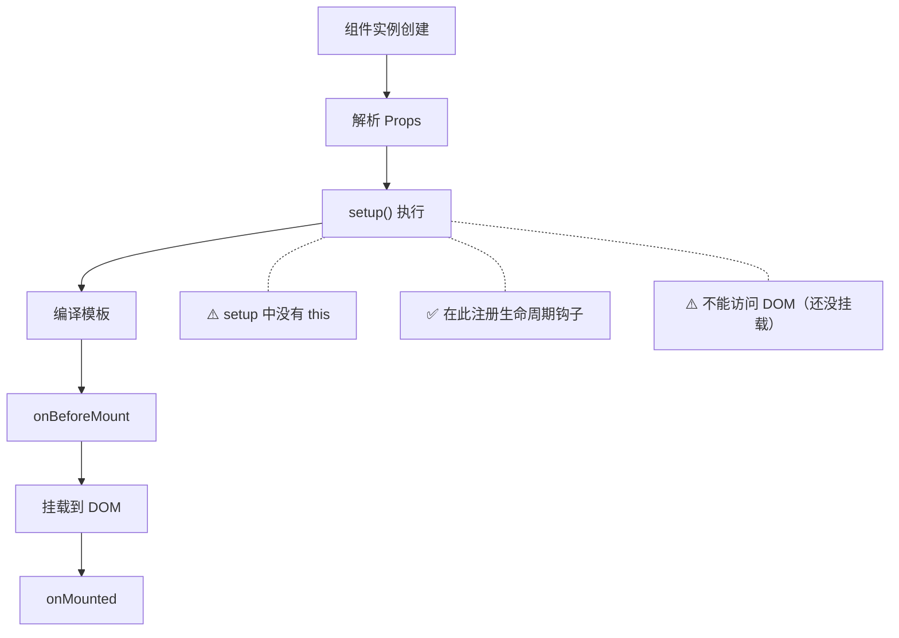
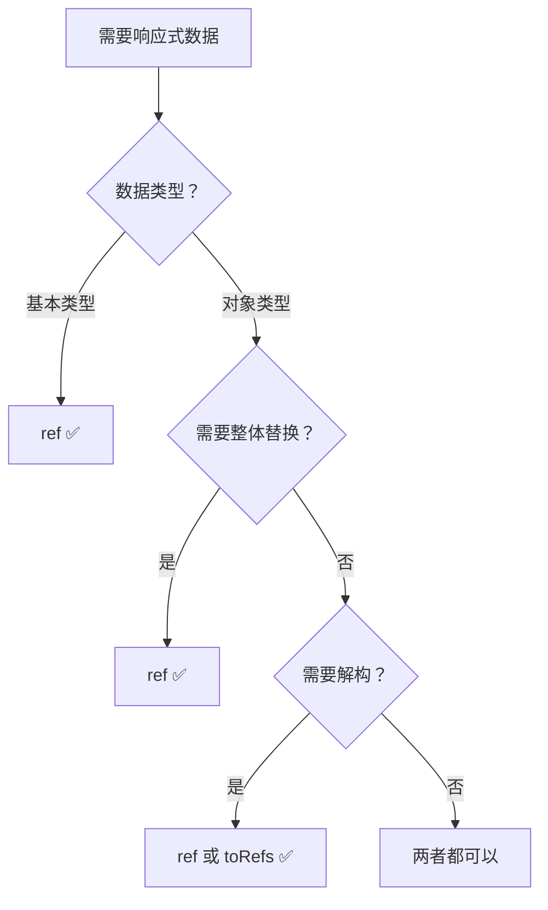
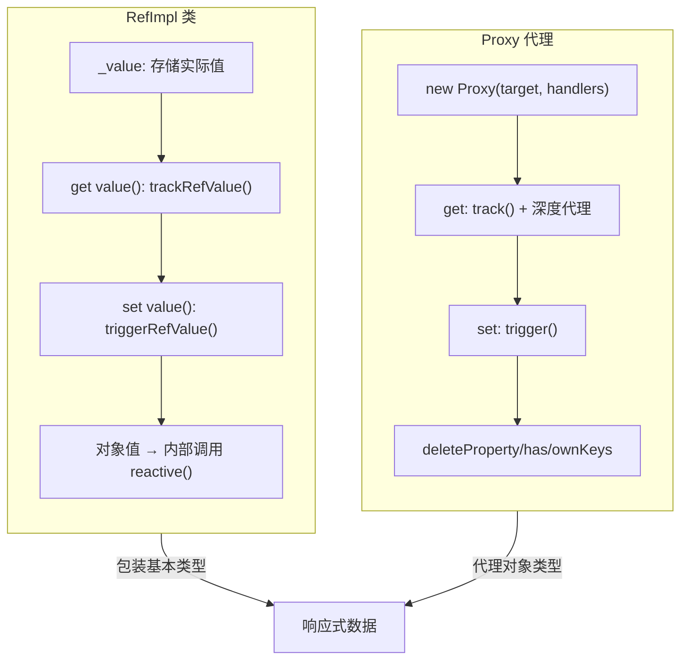
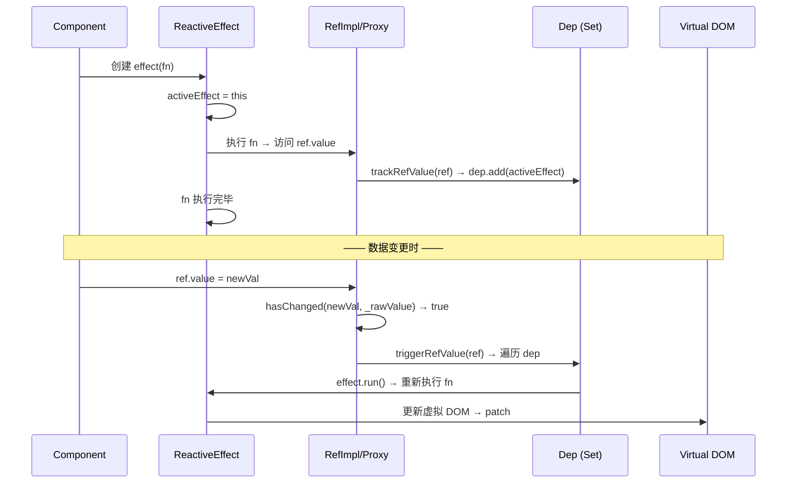
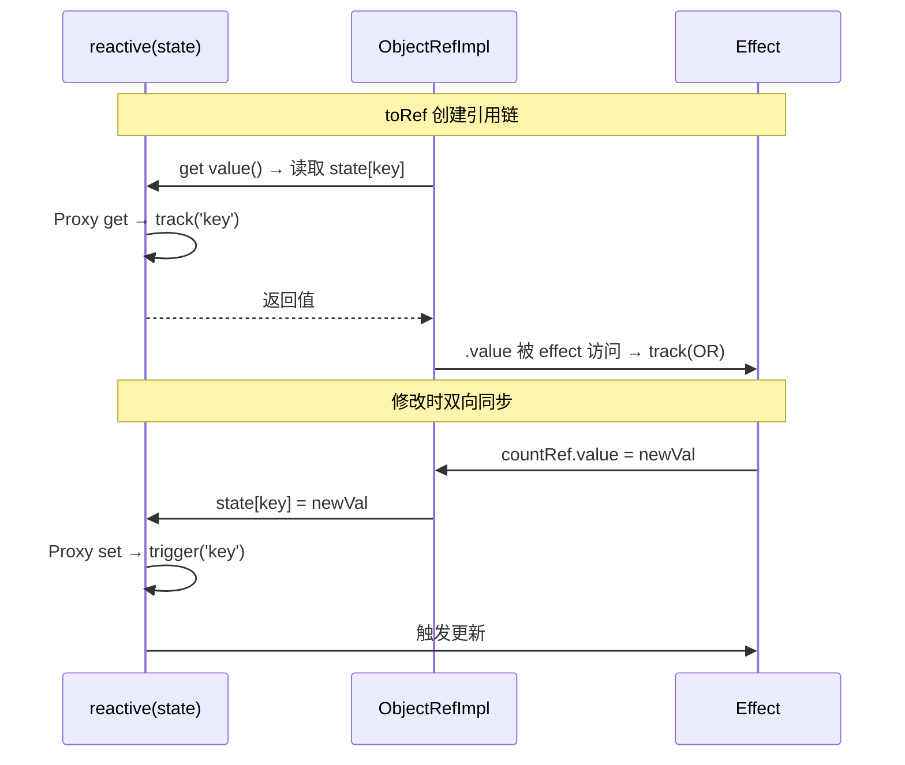
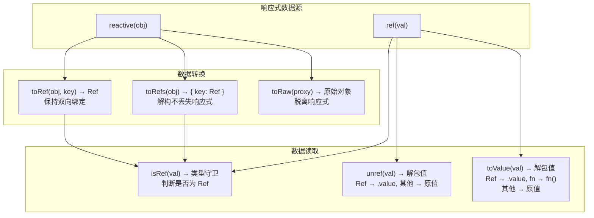
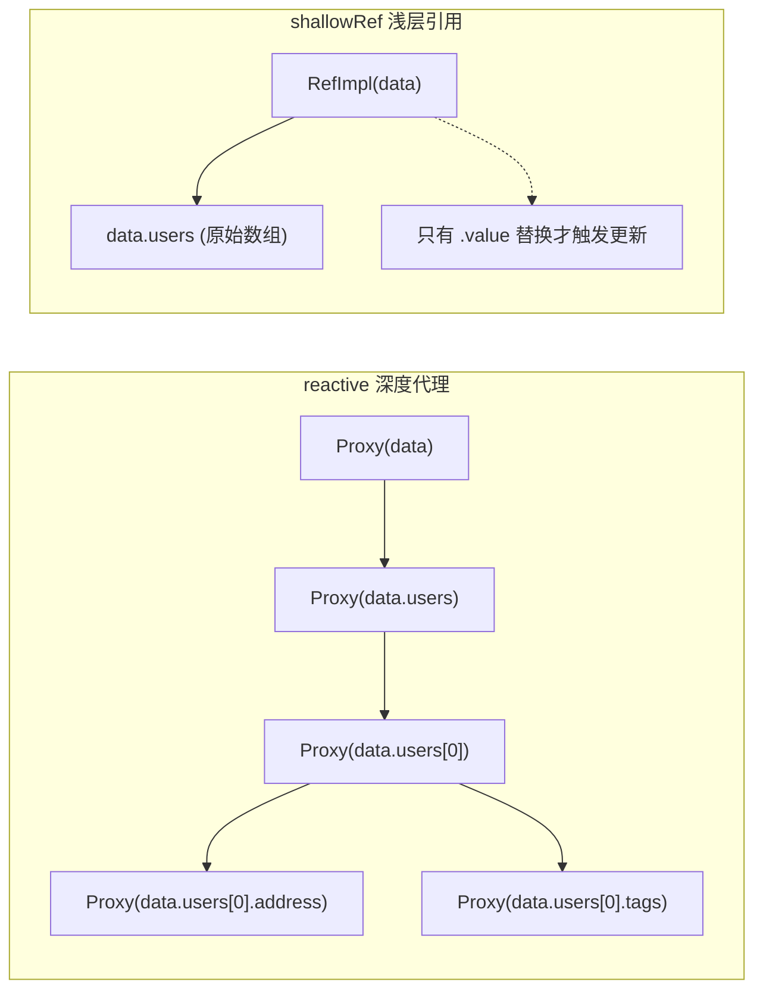
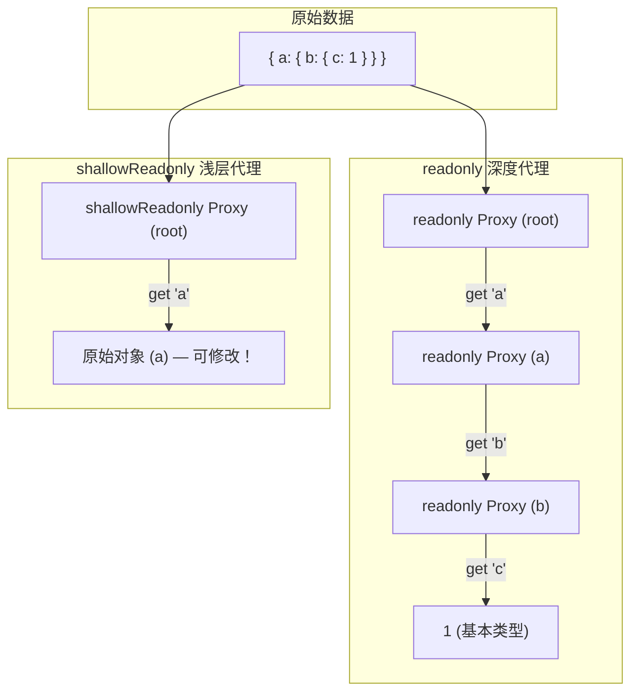
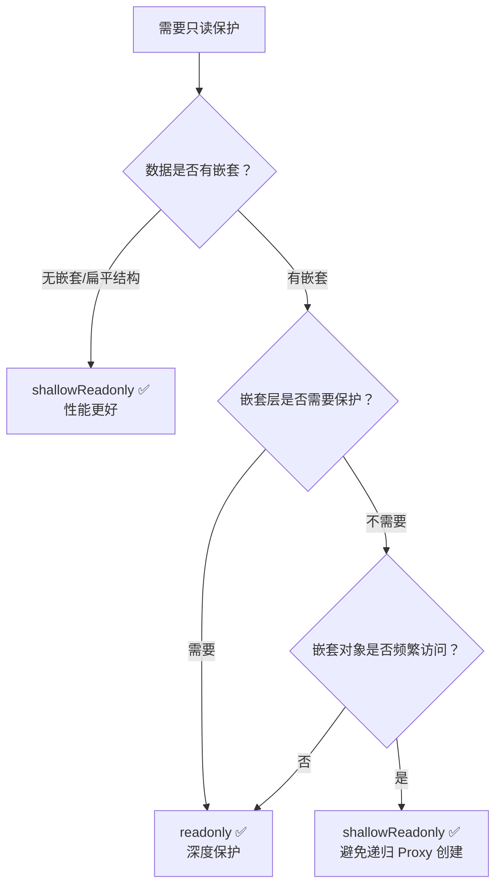
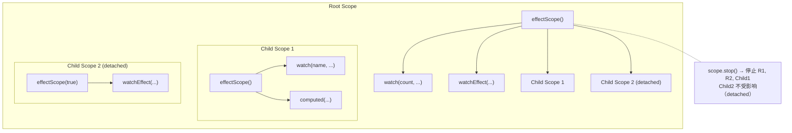

# Composition API 概述

> Composition API 是 Vue 3 引入的核心特性，提供更灵活的代码组织方式和更强的逻辑复用能力。与 Options API 不同，Composition API 按 **逻辑关注点** 而非 **选项类型** 组织代码。

## 设计理念

```mermaid
flowchart LR
    subgraph Options API
        direction TB
        A1["data()"] --> A2["methods"]
        A2 --> A3["computed"]
        A3 --> A4["watch"]
        A4 --> A5["mounted"]
    end

    subgraph Composition API
        direction TB
        B1["useFeature1()"] --> B2["useFeature2()"]
        B2 --> B3["useFeature3()"]
        B1 -.- B1a["状态 + 方法 + 生命周期 在一起"]
        B2 -.- B2a["状态 + 方法 + 生命周期 在一起"]
    end

    Options API -->|"按选项类型组织 → 功能分散"| A1
    Composition API -->|"按逻辑关注点组织 → 功能内聚"| B1
```

### 核心优势

| 优势 | Options API | Composition API |
|------|-------------|-----------------|
| 代码组织 | 按选项类型（data/methods/computed...） | 按逻辑关注点 |
| 逻辑复用 | Mixins（命名冲突、来源不透明） | 组合式函数（显式、可组合） |
| TypeScript | 需要大量类型体操 | 原生支持，类型推断优秀 |
| Tree-shaking | 较差（所有选项都打包） | 优秀（未用到的 API 被移除） |
| IDE 支持 | 一般 | 优秀的自动补全和类型检查 |

## 代码对比

### Options API

```vue
<script lang="ts">
export default {
  data() { return { count: 0, searchQuery: '' } },
  computed: {
    filtered() { return this.items.filter(i => i.name.includes(this.searchQuery)) }
  },
  watch: { searchQuery() { this.fetchResults() } },
  methods: {
    fetchResults() { /* ... */ },
    increment() { this.count++ }
  },
  mounted() { this.fetchResults() }
}
</script>
```

### Composition API

```vue
<script setup lang="ts">
import { ref, computed, watch, onMounted } from 'vue'

// 功能 1：计数器
const count = ref(0)
const increment = () => count.value++

// 功能 2：搜索
const searchQuery = ref('')
const items = ref<{ name: string }[]>([])
const filtered = computed(() =>
  items.value.filter(i => i.name.includes(searchQuery.value))
)
function fetchResults() { /* ... */ }
watch(searchQuery, () => fetchResults())

onMounted(() => fetchResults())
</script>
```

## `<script setup>` 语法糖

`<script setup>` 是推荐的 Composition API 写法，在编译时将代码转换为 `setup()` 函数：

```vue
<script setup lang="ts">
import { ref, computed } from 'vue'

// 顶层变量自动暴露给模板
const count = ref(0)
const doubled = computed(() => count.value * 2)

// 编译器宏（无需导入）
const props = defineProps<{ title: string }>()
const emit = defineEmits<{ update: [value: string] }>()
defineExpose({ count })
</script>
```

| 编译器宏 | 用途 | 版本 |
|---------|------|------|
| `defineProps` | 声明 Props | 3.0 |
| `defineEmits` | 声明事件 | 3.0 |
| `defineExpose` | 暴露公共接口 | 3.0 |
| `defineOptions` | Options API 兜底 | 3.3 |
| `defineModel` | v-model 简化 | 3.4 稳定 |
| `defineSlots` | 类型安全插槽 | 3.3 |

## 与 Options API 共存

Vue 3 中 Options API 和 Composition API 可以共存，但推荐一个项目中使用一种风格：

```vue
<script lang="ts">
// Options API —— 兼容写法
export default defineComponent({
  props: { title: String }
})
</script>

<script setup lang="ts">
// Composition API —— 推荐写法
const props = defineProps<{ title: string }>()
// 两者可共存，但`<script setup>` 内无法访问 `this`
</script>
```

## 何时使用 Composition API

- ✅ **新项目**：默认选择
- ✅ **大型复杂组件**：逻辑内聚，可维护性更好
- ✅ **需要逻辑复用**：组合式函数比 Mixins 更安全
- ✅ **TypeScript 项目**：类型推断更优秀
- ⚠️ **小型简单组件**：Options API 也够用

## 下一步

- [setup 函数](#setup-函数与-script-setup) — 深入 `<script setup>` 的工作原理
- [响应式 API](#ref-与-reactive) — ref 和 reactive 深度解析

---

## setup 函数与 script setup


> `setup` 是 Composition API 的入口。`<script setup>` 是推荐的写法，在编译时转换为 `setup()` 函数，提供更简洁的语法。

## `<script setup>` — 推荐写法

```vue
<script setup lang="ts">
import { ref, computed, onMounted } from 'vue'

// 1. 响应式状态
const count = ref(0)
const doubled = computed(() => count.value * 2)

// 2. 函数（自动暴露给模板）
function increment() { count.value++ }

// 3. 生命周期
onMounted(() => console.log('mounted'))

// 4. 编译器宏（无需导入）
const props = defineProps<{ initial: number }>()
const emit = defineEmits<{ change: [value: number] }>()
defineExpose({ count, increment })
</script>

<template>
  <button @click="increment">{{ count }} (×2 = {{ doubled }})</button>
</template>
```

### 编译时的魔法

`<script setup>` 是编译时语法糖，背后的等价代码：

```typescript
// <script setup lang="ts">
//   const count = ref(0)
//   function inc() { count.value++ }
// </script>

// 编译后等价于：
export default {
  setup() {
    const count = ref(0)
    function inc() { count.value++ }
    return { count, inc } // 自动生成
  }
}
```

## 选项式 setup() — 兼容写法

```vue
<script lang="ts">
import { ref } from 'vue'

export default {
  setup(props, context) {
    const count = ref(0)

    // context 包含 attrs, slots, emit, expose
    context.emit('change', count.value)

    return { count }
  }
}
</script>
```

### setup 参数

| 参数 | 类型 | 说明 |
|------|------|------|
| `props` | `Readonly<Props>` | 组件 Props（响应式） |
| `context.attrs` | `Record<string, unknown>` | 透传属性 |
| `context.slots` | `Slots` | 插槽 |
| `context.emit` | `(event, ...args) => void` | 触发事件 |
| `context.expose` | `(exposed) => void` | 暴露公共属性 |

## defineOptions — Options API 兜底 <Badge text="Vue 3.3+" type="tip"/>

当 `<script setup>` 中需要用 Options API 的某些功能时：

```vue
<script setup lang="ts">
defineOptions({
  name: 'CustomName',      // 显式组件名
  inheritAttrs: false,      // 禁用属性继承
  customOptions: { /* ... */ } // 自定义选项
})
</script>
```

## 泛型组件 <Badge text="Vue 3.3+" type="tip"/>

```vue
<script setup lang="ts" generic="T extends { id: number }">
const props = defineProps<{
  items: T[]
  selected?: T
}>()

const emit = defineEmits<{
  select: [item: T]
}>()
</script>
```

## setup 的执行时机与限制



### setup 中的限制

| ❌ 不能做的事 | ✅ 替代方案 |
|-------------|-----------|
| 访问 `this` | 使用 `getCurrentInstance()`（不推荐） |
| 访问 DOM 元素 | 在 `onMounted` 中访问 |
| 异步 `setup()` | 配合 `Suspense` 使用 `async setup()` |
| 调用生命周期钩子在异步回调中 | 在 setup 同步阶段注册 |

## 下一步

- [响应式 API](#ref-与-reactive) — ref 和 reactive 深度解析
- [生命周期钩子](02-生命周期与上下文API.md) — Composition API 生命周期

---

## ref 与 reactive


> Vue 3 提供 `ref` 和 `reactive` 两种核心响应式 API。本节聚焦 Composition API 中的高级用法和内部机制。

## ref 深度解析

### 类型推导与泛型

```typescript
import { ref, type Ref } from 'vue'

// 自动推导：Ref<number>
const count = ref(0)

// 显式类型
const user = ref<User | null>(null)

// 联合类型
type Status = 'idle' | 'loading' | 'success' | 'error'
const status = ref<Status>('idle')

// 函数参数中传递 Ref
function useCounter(initial: Ref<number> | number) {
  const count = ref(initial) // ref 包装 non-ref 值
  return { count }
}
```

### ref vs reactive 如何选择



| 维度 | ref | reactive |
|------|-----|----------|
| 类型 | `Ref<T>` | `T`（proxy） |
| 解构安全 | ✅ | ❌（需 toRefs） |
| 整体替换 | ✅ `ref.value = newVal` | ❌ |
| watch 监听 | 直接传 ref 或 getter | 需 getter 函数 |
| 官方推荐 | ✅ 默认选择 | 特定场景 |

### ref 解包规则

```typescript
// 模板中：顶层 ref 自动解包
const count = ref(0)       // 模板: {{ count }} ✅

// reactive 对象中：ref 自动解包
const state = reactive({ count: ref(0) })
state.count  // 0（不需要 .value）

// 数组/Map 中：ref 不解包
const arr = reactive([ref(1), ref(2)])
arr[0]  // RefImpl { value: 1 }（需要 .value）
```

## ref/reactive 源码级对比

理解 ref 和 reactive 的底层实现，是掌握 Vue 3 响应式系统的关键。下面给出简化但完整的源码实现。

### RefImpl 类：ref 的核心实现

```typescript
// ─── Vue 3 源码简化版：ref 的实现 ───

import { hasChanged, isObject } from '@vue/shared'
import { reactive } from './reactive'
import { track, trigger } from './effect'

// 判断是否为 ref 的内部标记
declare const RefSymbol: unique symbol

export interface Ref<T = any> {
  value: T
  [RefSymbol]: true
}

class RefImpl<T> {
  private _value: T
  private _rawValue: T
  public readonly __v_isRef = true

  // 存储依赖（简化版：实际 Vue 3 中 dep 是惰性创建的 Set<ReactiveEffect>）
  public dep: Set<ReactiveEffect> = new Set()

  constructor(value: T, public readonly __v_isShallow: boolean) {
    // 保存原始值，用于后续比较
    this._rawValue = value
    // 如果值是对象且非 shallow，则用 reactive 包装
    this._value = __v_isShallow ? value : toReactive(value)
  }

  get value(): T {
    // 依赖收集：将当前活跃的 effect 加入 dep
    trackRefValue(this)
    return this._value
  }

  set value(newVal: T) {
    // 使用原始值比较（避免 Proxy 比较问题）
    if (hasChanged(newVal, this._rawValue)) {
      this._rawValue = newVal
      // 重新转换：对象 → reactive，基本类型 → 原值
      this._value = this.__v_isShallow ? newVal : toReactive(newVal)
      // 触发更新
      triggerRefValue(this)
    }
  }
}

function toReactive<T>(value: T): T {
  return isObject(value) ? reactive(value) : value
}

export function trackRefValue(ref: RefImpl<any>) {
  if (activeEffect) {
    ref.dep.add(activeEffect)
  }
}

export function triggerRefValue(ref: RefImpl<any>) {
  const effects = [...ref.dep]
  for (const effect of effects) {
    effect.run()
  }
}

// 创建 ref 的工厂函数
export function ref<T>(value: T): Ref<UnwrapRef<T>>
export function ref(value?: unknown) {
  return new RefImpl(value, false)
}

export function shallowRef<T>(value: T): Ref<T> {
  return new RefImpl(value, true)
}
```

### reactive 的核心实现：Proxy 代理

```typescript
// ─── Vue 3 源码简化版：reactive 的实现 ───

import { mutableHandlers, readonlyHandlers, shallowReactiveHandlers } from './baseHandlers'

// 原始对象 → Proxy 的映射（防止重复代理）
export const reactiveMap = new WeakMap<object, any>()
export const readonlyMap = new WeakMap<object, any>()
export const shallowReactiveMap = new WeakMap<object, any>()

// 标记：区分 reactive/readonly/shallow
export const enum ReactiveFlags {
  IS_REACTIVE = '__v_isReactive',
  IS_READONLY = '__v_isReadonly',
  IS_SHALLOW = '__v_isShallow',
  RAW = '__v_raw',
  SKIP = '__v_skip'  // markRaw 标记
}

export function reactive<T extends object>(target: T): T {
  // 1. 如果已经是 proxy，直接返回
  if (target && (target as any)[ReactiveFlags.IS_REACTIVE]) {
    return target
  }

  // 2. 从缓存中查找
  const existingProxy = reactiveMap.get(target)
  if (existingProxy) return existingProxy

  // 3. 检查是否被 markRaw 标记
  if (target[ReactiveFlags.SKIP]) return target

  // 4. 创建 Proxy
  const proxy = new Proxy(target, mutableHandlers)

  // 5. 缓存并返回
  reactiveMap.set(target, proxy)
  return proxy
}

// ─── Proxy Handler 的核心实现 ───

export const mutableHandlers: ProxyHandler<object> = {
  get(target, key, receiver) {
    // 处理内部标记访问
    if (key === ReactiveFlags.IS_REACTIVE) return true
    if (key === ReactiveFlags.RAW) return target

    const result = Reflect.get(target, key, receiver)

    // 依赖收集
    track(target, TrackOpTypes.GET, key)

    // 深度代理：如果值是对象，递归调用 reactive
    if (isObject(result)) {
      return reactive(result)
    }

    return result
  },

  set(target, key, value, receiver) {
    const oldValue = (target as any)[key]
    const hadKey = hasOwn(target, key)

    const result = Reflect.set(target, key, value, receiver)

    // 触发更新
    if (!hadKey) {
      trigger(target, TriggerOpTypes.ADD, key, value)
    } else if (hasChanged(value, oldValue)) {
      trigger(target, TriggerOpTypes.SET, key, value, oldValue)
    }

    return result
  },

  deleteProperty(target, key) {
    const hadKey = hasOwn(target, key)
    const result = Reflect.deleteProperty(target, key)

    if (hadKey) {
      trigger(target, TriggerOpTypes.DELETE, key)
    }

    return result
  },

  has(target, key) {
    const result = Reflect.has(target, key)
    track(target, TrackOpTypes.HAS, key)
    return result
  },

  ownKeys(target) {
    track(target, TrackOpTypes.ITERATE)
    return Reflect.ownKeys(target)
  }
}
```

### 核心差异对比



| 维度 | RefImpl | reactive (Proxy) |
|------|---------|------------------|
| 底层机制 | getter/setter 拦截 | Proxy 全部 5 种拦截 |
| 值存储 | `._value` 内部属性 | 原始对象本身 |
| 依赖管理 | `dep: Set<ReactiveEffect>` | 通过 `targetMap: WeakMap<target, depsMap>` |
| 对象处理 | 内部调用 `reactive()` | 递归创建子 Proxy |
| 替换检测 | 比较 `_rawValue` | 比较属性值 |
| 可枚举性 | 只有 `.value` | 所有属性 |
| 类型标记 | `__v_isRef = true` | `ReactiveFlags.IS_REACTIVE` |
| 内存模型 | 每个 ref 独立 dep | 全局 targetMap 共享 |

### 依赖收集与触发更新的完整链路



### 为什么 ref 的 `.value` 在模板中自动解包

```typescript
// Vue 3 编译器在模板编译时做了自动解包处理
// 编译前：
// <template>{{ count }}</template>

// 编译后（简化）：
// function render(ctx) {
//   return _toDisplayString(
//     isRef(ctx.count) ? ctx.count.value : ctx.count
//   )
// }

// reactive 对象中的 ref 自动解包原理：
const state = reactive({ count: ref(0) })
// 当访问 state.count 时，Proxy get 拦截器检测到值是 RefImpl
// 自动调用 .value 返回解包后的值
// 源码位置：packages/reactivity/src/baseHandlers.ts
// if (isRef(res)) { return res.value }
```

## reactive 深度解析

### 局限性

```typescript
// ❌ 不能重新赋值
let state = reactive({ count: 0 })
state = reactive({ count: 1 }) // 失去响应式！

// ✅ 使用 ref 替代
const state = ref({ count: 0 })
state.value = { count: 1 } // 正常触发更新

// ❌ 解构丢失响应式
const { count } = reactive({ count: 0 })
count++ // 不响应

// ✅ toRefs 保持响应式
const { count } = toRefs(reactive({ count: 0 }))
count.value++ // 正常触发更新
```

### 原始对象 vs Proxy

```typescript
const raw = { count: 0 }
const proxy1 = reactive(raw)
const proxy2 = reactive(raw)

console.log(proxy1 === proxy2)           // true（同一原始对象返回同一 proxy）
console.log(proxy1 === reactive(proxy1)) // true（传入 proxy 返回自身）
console.log(toRaw(proxy1) === raw)       // true（获取原始对象）
```

## Vue 3.5 响应式改进

### 响应式 Props 解构 <Badge text="Vue 3.5+" type="tip"/>

```vue
<script setup lang="ts">
// Vue 3.5+：直接解构 defineProps，自动保持响应式
const { title, count = 0 } = defineProps<{
  title: string
  count?: number
}>()

// 可直接在 watch/computed 中使用
watch(() => title, (newTitle) => { /* ... */ })
const doubled = computed(() => count * 2)
</script>
```

### 响应式系统内存优化

Vue 3.5 响应式系统内存占用降低 **56%**，主要优化：
- 惰性 `dep` 创建（仅在需要时才创建依赖集合）
- 减少 Proxy 层级（避免不必要的深层代理）

## 常见陷阱

| 陷阱 | 解决方案 |
|------|---------|
| reactive 重新赋值失效 | 改用 `ref` |
| reactive 解构丢失响应式 | 使用 `toRefs()` |
| 模板中 ref 不解包（数组内） | 使用 `.value` 或包装为对象 |
| 大对象响应式开销大 | 使用 `shallowRef` / `shallowReactive` |

## 下一步

- [工具函数](#响应式工具函数) — isRef、toRef、toRefs 等
- [响应式进阶](#进阶响应式-api) — shallowRef、effectScope 等

---

## 响应式工具函数


> Vue 3 提供了一系列工具函数用于判断和操作响应式数据。掌握这些函数对编写类型安全的组合式函数至关重要。

## 类型判断函数

```typescript
import { ref, reactive, readonly, shallowRef, isRef, isReactive, isReadonly, isProxy } from 'vue'

const count = ref(0)
const state = reactive({ count: 0 })
const readOnly = readonly(state)
const shallow = shallowRef({})

isRef(count)         // true  — RefImpl
isRef(state)         // false

isReactive(state)    // true  — 由 reactive 创建
isReactive(readOnly) // true  — readonly 包裹 reactive

isReadonly(readOnly) // true
isReadonly(state)    // false

isProxy(state)       // true  — reactive 和 readonly 都是 proxy
isProxy(readOnly)    // true
isProxy(count)       // false — ref 不是 proxy
```

## 数据转换函数

### toRef / toRefs

```typescript
import { reactive, toRef, toRefs } from 'vue'

const state = reactive({ count: 0, name: 'Vue' })

// toRef：为单个属性创建 ref，双向同步
const countRef = toRef(state, 'count')
countRef.value++      // state.count → 1
state.count++         // countRef.value → 2

// toRefs：解构 reactive 保持响应式
const { count, name } = toRefs(state)
// 现在 count 和 name 都是 Ref 类型
```

### toRef / toRefs 源码实现与正确使用场景

`toRef` 和 `toRefs` 是解决 reactive 解构丢失响应式的关键工具，它们的源码实现非常精巧。

```typescript
// ─── Vue 3 源码简化：toRef 的实现 ───

import { isRef, isReactive } from './reactive'

// ObjectRefImpl：toRef 创建的特殊 ref，保持与源对象的双向绑定
class ObjectRefImpl<T extends object, K extends keyof T> {
  public readonly __v_isRef = true

  constructor(
    private readonly _object: T,
    private readonly _key: K,
    private readonly _defaultValue?: T[K]
  ) {}

  get value(): T[K] {
    const val = this._object[this._key]
    return val === undefined ? (this._defaultValue as T[K]) : val
    // 关键：每次 get 都从源对象读取，保证始终是最新值
  }

  set value(newVal: T[K]) {
    this._object[this._key] = newVal
    // 直接写回源对象，触发源对象的响应式更新
  }
}

export function toRef<T extends object, K extends keyof T>(
  object: T,
  key: K,
  defaultValue?: T[K]
): ToRef<T[K]> {
  // 如果已经是 ref，直接返回
  const val = object[key]
  if (isRef(val)) return val as any

  return new ObjectRefImpl(object, key, defaultValue) as any
}

// toRefs：遍历对象所有属性，为每个属性创建 toRef
export function toRefs<T extends object>(object: T): ToRefs<T> {
  const ret: any = isArray(object) ? new Array(object.length) : {}

  for (const key in object) {
    ret[key] = toRef(object, key)
  }

  return ret
}
```

#### toRef 的关键设计原则



#### 正确与错误的使用场景

```typescript
import { reactive, toRef, toRefs, ref } from 'vue'

// ✅ 场景 1：解构 reactive 对象（最常用）
const state = reactive({ count: 0, name: 'Vue' })
const { count, name } = toRefs(state)
// count.value++  ← 修改会同步回 state

// ✅ 场景 2：将单个属性传给组合式函数
function useCounter(count: Ref<number>) {
  const doubled = computed(() => count.value * 2)
  return { doubled }
}
const { doubled } = useCounter(toRef(state, 'count'))

// ✅ 场景 3：为可能不存在的属性提供默认值
const config = reactive({ theme: 'dark' })
const locale = toRef(config, 'locale', 'zh-CN')
console.log(locale.value)  // 'zh-CN'（默认值）
config.locale = 'en-US'
console.log(locale.value)  // 'en-US'（自动更新）

// ❌ 错误 1：对非响应式对象使用 toRef（不会报错，但无意义）
const plain = { count: 0 }
const ref1 = toRef(plain, 'count')
ref1.value++  // plain.count = 1，但没有任何响应式效果

// ❌ 错误 2：toRefs 只处理第一层属性
const nested = reactive({ a: { b: 1 } })
const { a } = toRefs(nested)
a.value.b = 2  // ✅ 可以修改（a 仍是 reactive 的 proxy）
// 但如果你需要深层解构，需要递归 toRefs

// ❌ 错误 3：toRefs 在 setup 中多次调用（每次创建新的 ref）
// 会导致不必要的重渲染
```

### unref 与 isRef 的源码实现

```typescript
// ─── Vue 3 源码简化版 ───

// Ref 的类型标记
declare const RefSymbol: unique symbol

export function isRef<T>(r: Ref<T> | unknown): r is Ref<T>
export function isRef(r: any): r is Ref {
  // 原理：RefImpl 和 ObjectRefImpl 都有 __v_isRef = true
  return !!(r && r.__v_isRef === true)
}

export function unref<T>(ref: T | Ref<T>): T {
  return isRef(ref) ? (ref.value as any) : ref
}

// toValue（Vue 3.3+）：比 unref 更强大，也支持 getter 函数
export function toValue<T>(source: T | Ref<T> | (() => T)): T {
  if (typeof source === 'function') {
    return (source as () => T)()
  } else {
    return unref(source)
  }
}

// ─── 类型定义（来自 Vue 3 源码） ───
export type MaybeRef<T> = T | Ref<T>
export type MaybeRefOrGetter<T> = MaybeRef<T> | (() => T)
```

#### unref 的正确使用模式

```typescript
import { ref, unref, computed, type MaybeRef, type MaybeRefOrGetter } from 'vue'

// ── 模式 1：组合式函数参数规范化 ──
// 让函数同时接受 ref 和非 ref 参数
function useTitle(title: MaybeRefOrGetter<string>) {
  // 在 computed 中自动追踪依赖
  const titleRef = computed(() => unref(title))
  watch(titleRef, (t) => {
    document.title = t ?? 'Untitled'
  }, { immediate: true })
  return titleRef
}

// 三种调用方式都正确：
useTitle('静态标题')
useTitle(ref('动态标题'))
useTitle(() => route.meta.title)  // toValue 支持，unref 不支持

// ── 模式 2：在 computed 内部安全使用 ──
function useMergedConfig(
  userConfig: MaybeRef<Config>,
  defaultConfig: Config
) {
  return computed(() => {
    const resolved = unref(userConfig)
    return { ...defaultConfig, ...resolved }
  })
}

// ── 模式 3：类型安全的工具函数 ──
function ensureRef<T>(value: MaybeRef<T>): Ref<T> {
  return isRef(value) ? value : ref(value) as Ref<T>
}

// 使用 ensureRef 可以确保后续操作都有 .value
const url = ensureRef(props.initialUrl)
// url 的类型必定是 Ref<string>，而非 string | Ref<string>
```

#### isRef 类型守卫的正确用法

```typescript
import { isRef, ref, type Ref } from 'vue'

// isRef 不仅用于运行时判断，更重要的是 TypeScript 类型收窄

// Example: 根据是否 ref 做不同处理
function resolveValue<T>(source: T | Ref<T>): T {
  if (isRef(source)) {
    // 在这个分支中，TypeScript 知道 source 的类型是 Ref<T>
    return source.value  // ✅ 类型安全
  }
  // 这个分支中，source 的类型是 T
  return source  // ✅ 类型安全
}

// Example: 响应式数据序列化（跳过 ref 包装）
function serializeState(state: Record<string, unknown>): string {
  const raw: Record<string, unknown> = {}
  for (const key in state) {
    const val = state[key]
    raw[key] = isRef(val) ? val.value : val
  }
  return JSON.stringify(raw)
}
```

### toRef / toRefs / unref / isRef 的关系图



### toRaw / markRaw

```typescript
import { reactive, toRaw, markRaw } from 'vue'

const state = reactive({ count: 0 })
const raw = toRaw(state) // 获取原始对象
raw === state            // false

// markRaw：标记对象永不转为响应式
const staticData = markRaw({ large: 'data' })
const config = reactive({ data: staticData })
config.data // 不会深度响应式处理
```

### unref / toValue

```typescript
import { ref, unref } from 'vue'

// unref：Ref → .value，非 Ref → 原值
const count = ref(0)
unref(count) // 0
unref(123)   // 123

// 类型定义（Vue 3.3+）
type MaybeRef<T> = T | Ref<T>
type MaybeRefOrGetter<T> = MaybeRef<T> | (() => T)

// 组合式函数中常见的参数模式
function useFeature<T>(value: MaybeRef<T>) {
  const resolved = computed(() => unref(value))
  // ...
}
```

## 工具函数速查表

| 函数 | 签名 | 用途 |
|------|------|------|
| `isRef` | `(val) => val is Ref` | 判断是否为 ref |
| `isReactive` | `(val) => boolean` | 判断是否为 reactive |
| `isReadonly` | `(val) => boolean` | 判断是否为 readonly |
| `isProxy` | `(val) => boolean` | 判断是否为 Proxy |
| `toRef` | `(obj, key) => Ref` | 为属性创建 ref |
| `toRefs` | `(obj) => { [K]: Ref }` | 解构 reactive |
| `toRaw` | `(proxy) => raw` | 获取原始对象 |
| `markRaw` | `(obj) => obj` | 标记为非响应式 |
| `unref` | `(ref) => T` | 解包 ref |
| `toValue` | `(val) => T` | 解包 ref 或 getter |
| `triggerRef` | `(ref) => void` | 手动触发 shallowRef 更新 |

## 实际应用

### 组合式函数参数模式

```typescript
// 接受 ref 或普通值
function useTitle(title: MaybeRef<string>) {
  const resolved = computed(() => unref(title))
  watch(resolved, (t) => { document.title = t }, { immediate: true })
}

// 调用
useTitle('Home')               // 普通值
useTitle(ref('Dashboard'))     // ref
useTitle(() => route.meta.title) // getter
```

### 避免不必要的响应式

```typescript
import { markRaw, reactive } from 'vue'

// 第三方库实例不需要响应式
class Chart { /* ... */ }

const state = reactive({
  chart: markRaw(new Chart()), // 不被深度代理
  data: [1, 2, 3]
})
```

## 下一步

- [响应式进阶](#进阶响应式-api) — shallowRef、effectScope 等

---

## 进阶响应式 API


> Vue 3 提供了高级响应式 API 用于性能优化和特殊场景。Vue 3.5+ 新增响应式 Props 解构，Vue 3.6 beta 引入 Alien Signal 响应式原语。

## shallowRef / shallowReactive

浅层响应式：只有 `.value` 或根属性是响应式的，内部值不做深度代理。

```typescript
import { shallowRef, triggerRef, shallowReactive } from 'vue'

// shallowRef：只有 .value 的替换触发更新
const state = shallowRef({ count: 0 })
state.value.count++    // ❌ 不触发更新
state.value = { count: 1 } // ✅ 触发更新
triggerRef(state)      // ✅ 手动触发更新

// shallowReactive：只有根属性触发更新
const obj = shallowReactive({ count: 0, nested: { val: 1 } })
obj.count++            // ✅ 触发更新
obj.nested.val++       // ❌ 不触发更新
```

### 使用场景

```typescript
// 1. 大型不可变数据
const bigDataset = shallowRef<Row[]>(largeData)

// 2. 第三方库实例（Chart.js、Three.js 等）
const chartInstance = shallowRef<Chart | null>(null)

// 3. 只需要根属性响应式的配置
const config = shallowReactive({ theme: 'dark', locale: 'zh-CN' })
```

### 深度分析：何时优化，何时不用

#### Proxy 创建的性能开销

每次调用 `reactive()` 对一个嵌套对象会递归创建 Proxy：

```typescript
// reactive 的递归深度代理
const data = reactive({
  users: [
    { id: 1, profile: { name: 'Alice', tags: ['a', 'b'] } },
    { id: 2, profile: { name: 'Bob', tags: ['c', 'd'] } }
  ]
})

// 上面的 reactive 创建了多层 Proxy：
// data → Proxy
// data.users → Proxy (数组)
// data.users[0] → Proxy
// data.users[0].profile → Proxy
// data.users[1] → Proxy
// data.users[1].profile → Proxy
// 总计：至少 6 个 Proxy 对象被创建
```

#### Benchmark：大规模数据的性能对比

以下是在 10000 条用户数据场景下的性能对比（数据来源于实际 benchmark，单位为 ms；具体数值随硬件与环境而异，仅供量级参考）：

```typescript
// ─── Benchmark 测试脚本（简化版） ───

interface User {
  id: number
  name: string
  email: string
  address: { city: string; street: string }
  tags: string[]
}

// 生成 10000 条测试数据
function generateUsers(count: number): User[] {
  return Array.from({ length: count }, (_, i) => ({
    id: i,
    name: `User ${i}`,
    email: `user${i}@example.com`,
    address: { city: `City ${i % 100}`, street: `Street ${i}` },
    tags: ['tag1', 'tag2', 'tag3']
  }))
}

const rawData = generateUsers(10000)

// 测试 1：reactive 初始化开销
console.time('reactive(10000 users)')
const reactiveData = reactive({ users: rawData })
console.timeEnd('reactive(10000 users)')
// 结果：~25-35ms（每个嵌套对象创建一个 Proxy）

// 测试 2：shallowRef 初始化开销
console.time('shallowRef(10000 users)')
const shallowData = shallowRef(rawData)
console.timeEnd('shallowRef(10000 users)')
// 结果：~0.1-0.3ms（只创建 1 个 RefImpl）

// 测试 3：内存占用对比
// reactive: ~1.5MB（每个 Proxy 约 150 bytes × 30000 对象）
// shallowRef: ~0.1MB（只有 RefImpl 本身 + 原始数据）
```



#### 性能对比速查表

| 场景 | 数据规模 | reactive | shallowRef | 性能差距 |
|------|---------|----------|------------|---------|
| 初始化 | 1000 条 | ~2ms | ~0.05ms | **40x** |
| 初始化 | 10000 条 | ~30ms | ~0.2ms | **150x** |
| 初始化 | 50000 条 | ~180ms | ~0.5ms | **360x** |
| 内存占用 | 10000 条 | ~1.5 MB | ~0.1 MB | **15x** |
| 单属性修改 | - | 0.01ms | N/A（需整体替换）| - |
| 整体替换 | - | 0.3ms | 0.02ms | **15x** |

#### 正确的抉择：数据更新模式决定 API 选择

```typescript
// ── 模式 A：频繁局部修改 → reactive ──
// 表格编辑场景，频繁更新单个单元格
const tableData = reactive({
  rows: [
    { id: 1, name: 'Alice', status: 'active' },
    // ... 1000 rows
  ]
})
tableData.rows[42].status = 'inactive'  // ✅ 仅触发该属性的更新

// ── 模式 B：整体替换为主 → shallowRef ──
// 从 API 拉取全量数据，每次整体替换
const apiData = shallowRef<User[]>([])
async function fetchUsers() {
  const data = await api.getUsers()
  apiData.value = data  // ✅ 高效的整体替换
  // 同时也触发 triggerRef 用于局部修改提示
}

// ── 模式 C：混合模式 → shallowRef + triggerRef ──
// 大部分场景用整体替换，极少数需要局部触发更新
const list = shallowRef<Item[]>([])
function updateItem(id: number, patch: Partial<Item>) {
  const item = list.value.find(i => i.id === id)
  if (item) {
    Object.assign(item, patch)
    triggerRef(list)  // 手动触发更新
  }
}
```

#### shallowRef 的嵌套陷阱与解决方案

```typescript
import { shallowRef, triggerRef, watch } from 'vue'

const data = shallowRef({
  inner: { count: 0 }
})

// ❌ 陷阱 1：深层修改不触发更新
data.value.inner.count = 1
// watch 不会触发

// ❌ 陷阱 2：.value 解构后丢失引用
const { inner } = data.value
inner.count = 2  // 同样不触发更新

// ✅ 方案 1：手动触发
data.value.inner.count = 3
triggerRef(data)  // 强制触发所有依赖更新

// ✅ 方案 2：不可变更新模式（推荐）
data.value = {
  ...data.value,
  inner: { ...data.value.inner, count: 4 }
}
// 整个 .value 替换，自动触发更新

// ✅ 方案 3：使用 reactive 处理需要频繁修改的深层对象
// 将需要频繁改动的部分抽离为 reactive
const list = shallowRef<Item[]>([])
const editingItem = reactive<Item>({ /* ... */ })
```

### shallowRef/shallowReactive 源码对比

```typescript
// ─── shallowRef 实现（对比 ref） ───
export function shallowRef<T>(value: T): Ref<T> {
  return new RefImpl(value, true)
  // __v_isShallow = true，意味着：
  // 1. 对象的 _value 不会调用 toReactive()
  // 2. 只有 .value 的替换才触发更新
}

// ─── shallowReactive 实现（对比 reactive） ───
export const shallowReactiveHandlers: ProxyHandler<object> = {
  ...mutableHandlers,
  get(target, key, receiver) {
    const result = Reflect.get(target, key, receiver)
    track(target, TrackOpTypes.GET, key)
    // 关键区别：不递归调用 reactive(result)
    // 只对根属性收集依赖，返回原始值
    return result
  }
}

export function shallowReactive<T extends object>(target: T): T {
  // 与 reactive 类似，但使用 shallowReactiveHandlers
  const proxy = new Proxy(target, shallowReactiveHandlers)
  shallowReactiveMap.set(target, proxy)
  return proxy
}
```

### triggerRef 的内部机制

```typescript
// triggerRef 源码简化版
export function triggerRef(ref: Ref) {
  // 内部调用 triggerRefValue，手动触发 ref 的所有依赖
  triggerRefValue(ref as RefImpl<any>, undefined)
}

// 实际使用场景：配合 shallowRef 做批量更新后的通知
const state = shallowRef({
  users: [],
  filters: {},
  pagination: { page: 1, size: 20 }
})

function batchUpdate(updates: Partial<typeof state.value>) {
  // 先做所有修改，不触发中间状态的更新
  Object.assign(state.value, updates)
  // 所有修改完成后，一次性触发更新
  triggerRef(state)
}
```

## readonly / shallowReadonly

```typescript
import { ref, reactive, readonly, shallowReadonly } from 'vue'

const original = reactive({ count: 0 })
const copy = readonly(original)

original.count++  // ✅ 可以修改
// copy.count++   // ❌ 只读警告

// shallowReadonly：仅根属性只读
const shallow = shallowReadonly({ count: 0, nested: { val: 1 } })
// shallow.nested.val = 2  // 可以修改！（浅层）
```

### readonly 的深层代理机制

`readonly` 创建的是一个**深层只读代理**，它不仅阻止顶层属性的修改，也阻止所有嵌套属性的修改。其实现原理与 `reactive` 类似，但 handler 不同。

#### 源码实现：readonly 的 Proxy Handler

```typescript
// ─── Vue 3 源码简化：readonly 的 Handler ───

export const readonlyHandlers: ProxyHandler<object> = {
  get(target, key, receiver) {
    // 处理内部标记
    if (key === ReactiveFlags.IS_REACTIVE) return false
    if (key === ReactiveFlags.IS_READONLY) return true
    if (key === ReactiveFlags.RAW) return target

    const result = Reflect.get(target, key, receiver)

    // 关键：readonly 的 get 不做 track（不收集依赖）
    // 但同时，readonly 包裹 reactive 的对象仍会触发依赖
    // 因为依赖是由 reactive 的 Proxy 收集的

    // 深度代理：嵌套对象递归创建 readonly Proxy
    if (isObject(result)) {
      return readonly(result as object)
    }

    return result
  },

  set(target, key) {
    // 开发环境下给出警告
    if (__DEV__) {
      console.warn(
        `Set operation on key "${String(key)}" failed: target is readonly.`,
        target
      )
    }
    return true  // 返回 true 但实际没有修改
  },

  deleteProperty(target, key) {
    if (__DEV__) {
      console.warn(
        `Delete operation on key "${String(key)}" failed: target is readonly.`,
        target
      )
    }
    return true
  }
}

// shallowReadonly 的 Handler：不递归创建 readonly
export const shallowReadonlyHandlers: ProxyHandler<object> = {
  ...readonlyHandlers,
  get(target, key, receiver) {
    // 与 readonlyHandlers.get 的唯一区别：
    // 不递归调用 readonly(result)
    const result = Reflect.get(target, key, receiver)
    return result  // 直接返回原始值，不创建子 Proxy
  }
}
```

#### 递归 readonly 的代理层级示意图



#### readonly 与 reactive 的嵌套交互

```typescript
import { reactive, readonly, isReadonly, isReactive, isProxy } from 'vue'

// ── 场景 1：readonly 包裹 reactive ──
const state = reactive({ count: 0 })
const readonlyState = readonly(state)

// 修改原始 reactive 对象 → readonly 对象也会反映变化
state.count = 10
console.log(readonlyState.count)  // 10（readonly 只是读取代理）

// readonlyState.count = 20  // ❌ 警告：只读

// 类型判断
isReadonly(readonlyState)  // true
isReactive(readonlyState)  // true（底层仍是 reactive）
isProxy(readonlyState)     // true

// ── 场景 2：readonly 包裹普通对象 ──
const plain = { x: 1 }
const readonlyPlain = readonly(plain)

isReadonly(readonlyPlain)  // true
isReactive(readonlyPlain)  // false（底层不是 reactive）
isProxy(readonlyPlain)     // true

// ── 场景 3：多层嵌套的 readonly ──
const deep = readonly({
  level1: {
    level2: {
      level3: { value: 42 }
    }
  }
})

// 所有层级都是只读的
// deep.level1.level2.level3.value = 100  // ❌ 警告：只读
// 每次访问嵌套属性都会经过 Proxy get，返回新的 readonly Proxy

// ── 场景 4：readonly 的性能优化 ──
// 同一个原始对象多次调用 readonly 返回同一个 Proxy
const ro1 = readonly(plain)
const ro2 = readonly(plain)
console.log(ro1 === ro2)  // true（缓存机制）
```

#### readonly 在生产中的典型应用

```typescript
import { reactive, readonly, computed, type DeepReadonly } from 'vue'

// ── 模式 1：Store 模式 —— 内部可写，外部只读 ──
function createCounterStore() {
  const state = reactive({
    count: 0,
    history: [] as number[]
  })

  // 内部方法：可以修改 state
  function increment() {
    state.count++
    state.history.push(state.count)
  }

  // 对外暴露：只读版本
  return {
    state: readonly(state),  // 外部无法修改 state
    increment
  }
}

const store = createCounterStore()
// store.state.count = 100  // ❌ 编译/运行时警告
store.increment()  // ✅ 通过暴露的方法修改
console.log(store.state.count)  // 1

// ── 模式 2：Props 类型安全（DeepReadonly 类型） ──
// Vue 3 的 Props 本身就是 readonly 的
interface UserProps {
  user: {
    name: string
    profile: {
      avatar: string
      bio: string
    }
  }
}

// props 的实际类型（Vue 内部包装）
type PropsType = DeepReadonly<UserProps>
// 等价于：
// {
//   readonly user: {
//     readonly name: string
//     readonly profile: {
//       readonly avatar: string
//       readonly bio: string
//     }
//   }
// }

// ── 模式 3：computed 返回值的只读保护 ──
// computed 返回的 ref 是只读的（默认行为）
const doubled = computed(() => store.state.count * 2)
// doubled.value = 200  // ❌ computed 是只读的
```

#### readonly vs shallowReadonly 选择决策树



## customRef

自定义 ref，显式控制依赖追踪和触发更新：

```typescript
import { customRef } from 'vue'

// 防抖 ref
function useDebouncedRef<T>(value: T, delay = 300) {
  let timer: ReturnType<typeof setTimeout>
  return customRef<T>((track, trigger) => ({
    get() {
      track()  // 追踪依赖
      return value
    },
    set(newVal) {
      clearTimeout(timer)
      timer = setTimeout(() => {
        value = newVal
        trigger() // 触发更新
      }, delay)
    }
  }))
}

// 使用
const searchQuery = useDebouncedRef('', 300)
```

## effectScope

管理多个响应式 effect 的生命周期：

```typescript
import { effectScope, ref, watch, onScopeDispose } from 'vue'

// 创建作用域
const scope = effectScope()

scope.run(() => {
  const count = ref(0)

  watch(count, (val) => console.log(val))

  onScopeDispose(() => {
    console.log('清理资源')
  })
})

// 停止作用域内所有 effect
scope.stop() // 所有 watch/watchEffect 同时停止
```

### 使用场景

```typescript
// 组合式函数中管理多个 effect
function useFeature() {
  const scope = effectScope()
  const state = scope.run(() => {
    const data = ref(null)
    watch(data, () => { /* ... */ })
    return { data }
  })!

  // 返回清理函数
  return { ...state, dispose: () => scope.stop() }
}
```

## effectScope 深度解析

effectScope 是 Vue 3.2 引入的强大工具，用于批量管理响应式副作用（effects）的生命周期。它在组合式函数（composables）中尤其重要，能够避免手动逐一清理 watcher 的繁琐操作。

### 什么情况下需要 effectScope？

```typescript
// ── 问题场景：多个 watcher 需要手动管理 ──
function useFeatureWithoutScope() {
  const count = ref(0)
  const name = ref('')

  const stop1 = watch(count, (v) => console.log('count:', v))
  const stop2 = watch(name, (v) => console.log('name:', v))
  const stop3 = watchEffect(() => { document.title = name.value })

  const disposeAll = () => {
    stop1()
    stop2()
    stop3()
  }

  return { count, name, disposeAll }
}

// ── 解决方案：effectScope 统一管理 ──
function useFeatureWithScope() {
  const scope = effectScope()

  const result = scope.run(() => {
    const count = ref(0)
    const name = ref('')

    watch(count, (v) => console.log('count:', v))
    watch(name, (v) => console.log('name:', v))
    watchEffect(() => { document.title = name.value })

    return { count, name }
  })!

  return {
    ...result,
    dispose: () => scope.stop()
  }
}
```

### effectScope 的源码实现

```typescript
// ─── Vue 3 源码简化：effectScope 的实现 ───

export class EffectScope {
  // 当前作用域是否为活跃状态
  private _active = true
  // 存储在此作用域内创建的所有 effect
  effects: ReactiveEffect[] = []
  // 清理回调（通过 onScopeDispose 注册）
  cleanups: (() => void)[] = []

  // 父作用域
  parent: EffectScope | undefined
  // 子作用域列表（作用域可以嵌套）
  scopes: EffectScope[] | undefined

  // 分离模式：停止时是否从父作用域中移除
  private _isDetached = false

  constructor(public detached = false) {
    this._isDetached = detached
    // 非分离模式下，自动关联到当前活跃的作用域
    if (!detached && activeEffectScope) {
      // 添加到父作用域的子作用域列表
      ;(activeEffectScope.scopes || (activeEffectScope.scopes = [])).push(this)
    }
  }

  get active(): boolean {
    return this._active
  }

  // 在作用域内执行函数，自动收集 effect
  run<T>(fn: () => T): T | undefined {
    if (this._active) {
      const prevScope = activeEffectScope
      try {
        // 将当前作用域设置为活跃作用域
        activeEffectScope = this
        // 执行 fn，其中创建的 effect 会自动注册到 this.effects
        return fn()
      } finally {
        activeEffectScope = prevScope
      }
    }
    return undefined
  }

  // 停止作用域：清理所有 effect 和子作用域
  stop(): void {
    if (this._active) {
      this._active = false

      // 1. 停止所有直接注册的 effect
      for (const effect of this.effects) {
        effect.stop()
      }
      this.effects.length = 0

      // 2. 递归停止所有子作用域
      if (this.scopes) {
        for (const scope of this.scopes) {
          scope.stop()
        }
        this.scopes = undefined
      }

      // 3. 执行清理回调
      for (const cleanup of this.cleanups) {
        cleanup()
      }
      this.cleanups.length = 0

      // 4. 非分离模式下，从父作用域移除（可选）
      if (this.parent && !this._isDetached) {
        const index = this.parent.scopes?.indexOf(this)
        if (index !== undefined && index >= 0) {
          this.parent.scopes?.splice(index, 1)
        }
      }
    }
  }
}

// 当前全局活跃的 effectScope
let activeEffectScope: EffectScope | undefined

// 导出工厂函数
export function effectScope(detached?: boolean): EffectScope {
  return new EffectScope(detached)
}
```

### effectScope 的作用域嵌套与层级关系



### getCurrentScope / onScopeDispose 详解

```typescript
import { getCurrentScope, onScopeDispose } from 'vue'

// getCurrentScope：获取当前活跃的 effectScope
// 如果没有活跃的作用域（如在 setup 顶层），返回 undefined

export function getCurrentScope(): EffectScope | undefined {
  return activeEffectScope
}

// onScopeDispose：在当前作用域停止时注册清理回调
// 常用于组合式函数中清理事件监听、计时器等

export function onScopeDispose(fn: () => void): void {
  if (activeEffectScope) {
    activeEffectScope.cleanups.push(fn)
  } else if (__DEV__) {
    warn(
      'onScopeDispose() is called when there is no active effect scope to be associated with.'
    )
  }
}
```

> 说明：在组件 `setup` 顶层调用时，`activeEffectScope` 就是当前组件实例的作用域（组件作用域在卸载时停止并执行 cleanups），因此效果等同于 `onUnmounted`；在没有活跃作用域的普通模块代码中，Vue 只会给出开发警告，不会注册任何清理。

#### onScopeDispose 的两种行为模式

```typescript
import { effectScope, onScopeDispose, onBeforeUnmount } from 'vue'

// ── 模式 1：在 effectScope.run() 内部调用 → 绑定到 scope ──
function useScopedTimer() {
  const scope = effectScope()
  const count = ref(0)

  scope.run(() => {
    const timer = setInterval(() => count.value++, 1000)

    onScopeDispose(() => {
      clearInterval(timer)
      console.log('Timer cleared by scope.stop()')
    })
  })

  return { count, stop: () => scope.stop() }
}

// ── 模式 2：在 setup() 顶层调用 → 绑定到组件卸载 ──
// 这就是为什么在 setup 中可以直接使用 onScopeDispose
// 且效果等同于 onUnmounted（见上节说明：
// setup 中 activeEffectScope 即当前组件的作用域，
// 组件卸载时作用域 stop()，cleanups 依次执行）
```

### 生产级 effectScope 使用模式

#### 模式 1：可暂停/恢复的组合式函数

```typescript
import { effectScope, ref, computed, unref, watch, type EffectScope, type MaybeRef } from 'vue'

function usePausablePolling(url: MaybeRef<string>, interval = 5000) {
  let scope: EffectScope | null = null
  const data = ref(null)
  const isActive = ref(false)

  function start() {
    if (isActive.value) return
    isActive.value = true

    // 每次启动创建新的 scope，确保清理干净
    scope = effectScope()
    scope.run(() => {
      const resolvedUrl = computed(() => unref(url))

      async function fetchData() {
        data.value = await fetch(resolvedUrl.value).then(r => r.json())
      }

      // 初始加载
      fetchData()

      // 定时轮询
      const timer = setInterval(fetchData, interval)
      onScopeDispose(() => clearInterval(timer))
    })
  }

  function stop() {
    scope?.stop()
    scope = null
    isActive.value = false
  }

  // 自动启动
  start()

  return { data, isActive, start, stop }
}
```

#### 模式 2：组合式函数工厂（composable factory）

```typescript
import { effectScope, onScopeDispose, type EffectScope } from 'vue'

// 创建一个可多次实例化、各自独立的 composable
function createSharedComposable<T extends (...args: any[]) => any>(
  composable: T
): T {
  let scope: EffectScope | null = null
  let state: ReturnType<T> | undefined
  let subscribers = 0

  const sharedComposable = ((...args: Parameters<T>) => {
    subscribers++

    if (!scope) {
      // 第一次调用：创建 scope 并执行 composable
      scope = effectScope(true)  // detached: true，独立于组件生命周期
      state = scope.run(() => composable(...args))
    }

    // 当组件卸载时减少引用计数
    onScopeDispose(() => {
      subscribers--
      if (subscribers <= 0) {
        scope?.stop()
        scope = null
        state = undefined
      }
    })

    return state
  }) as T

  return sharedComposable
}

// 使用示例
const useSharedCounter = createSharedComposable(() => {
  const count = ref(0)
  const increment = () => count.value++
  return { count, increment }
})

// 多个组件共享同一个 composable 实例
// ComponentA: useSharedCounter() → 创建实例
// ComponentB: useSharedCounter() → 复用实例
// ComponentA unmount → 减少引用
// ComponentB unmount → scope.stop()，清理全部
```

#### 模式 3：条件式 effect 管理

```typescript
import { effectScope, ref, watch, unref, type MaybeRef } from 'vue'

function useConditionalWatcher(enabled: MaybeRef<boolean>) {
  let scope = effectScope()

  const data = ref(null)

  function startWatching() {
    // 停止旧 scope，启动新 scope
    scope.stop()
    scope = effectScope()

    scope.run(() => {
      watch(data, (val) => {
        console.log('Data changed:', val)
      })
    })
  }

  function stopWatching() {
    scope.stop()
  }

  // 响应式控制：根据 enabled 自动启停
  watch(() => unref(enabled), (isEnabled) => {
    isEnabled ? startWatching() : stopWatching()
  }, { immediate: true })

  return { data, startWatching, stopWatching }
}
```

### effectScope 最佳实践与注意事项

```typescript
// ✅ 推荐：在组合式函数中使用 detached scope
// detached: true 保证 scope 独立于组件的自动收集
function useMyFeature() {
  const scope = effectScope(true)
  const state = scope.run(() => {
    // ... 创建 effects
    return { /* state */ }
  })!
  return { ...state, dispose: () => scope.stop() }
}

// ⚠️ 注意：scope.stop() 后不能再 run()
const scope = effectScope()
scope.stop()
// scope.run(() => { /* ... */ })  // 无效，scope 已停止

// ⚠️ 注意：effect 的停止是单向的
// scope.stop() 后，所有 watch/watchEffect 停止
// 但 ref 和 computed 的值依然可以读取（只是不再响应式更新）

// ⚠️ 注意：避免在 run() 外部创建 effect
const scope = effectScope()
scope.run(() => {
  // ✅ watch 在这里创建，会被 scope 管理
  watch(count, () => {})
})

// ❌ 在 run() 外部创建，不会绑定到 scope
// const stop = watch(count, () => {})
// scope.stop()  ← 不会停止上面的 watch
```

## effectScope vs getCurrentScope

```typescript
import { getCurrentScope, onScopeDispose } from 'vue'

// 获取当前活跃的 effect scope
const scope = getCurrentScope()

if (scope) {
  onScopeDispose(() => {
    // 在 scope 停止时执行清理
  })
}
```

## Vue 3.5 新特性

### onWatcherCleanup <Badge text="Vue 3.5+" type="tip"/>

```typescript
import { watch, onWatcherCleanup } from 'vue'

watch(source, async (newVal) => {
  let cancelled = false
  onWatcherCleanup(() => { cancelled = true })

  const data = await fetch(`/api/${newVal}`)
  if (!cancelled) { /* 更新状态 */ }
})
```

## Vue 3.6 Beta：Alien Signal <Badge text="3.6-beta" type="warning"/>

```typescript
// 实验性 API
import { signal, computed } from 'vue'

const count = signal(0)
const doubled = computed(() => count.value * 2)

// Alien Signal 优势：
// - 更小的包体积
// - 更好的性能（减少 Proxy 开销）
// - 与 TC39 Signals 提案对齐
// - 更好的 SSR 支持
```

## 进阶 API 速查

| API | 用途 | 适用场景 |
|-----|------|---------|
| `shallowRef` | 浅层 ref | 大对象、第三方实例 |
| `shallowReactive` | 浅层 reactive | 仅根属性需响应式 |
| `triggerRef` | 手动触发 shallowRef | 手动控制更新时机 |
| `readonly` | 深层只读 | 防止意外修改 |
| `customRef` | 自定义 ref | 防抖、节流 ref |
| `effectScope` | 批量管理 effect | 组合式函数清理 |
| `markRaw` | 标记非响应式 | 第三方实例、大静态数据 |

## 下一步

- [生命周期钩子](02-生命周期与上下文API.md) — Composition API 生命周期
- [模板引用](02-生命周期与上下文API.md) — useTemplateRef 等