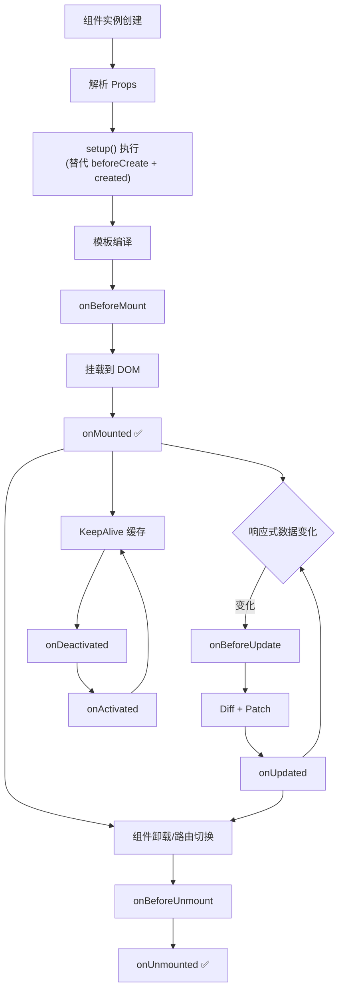
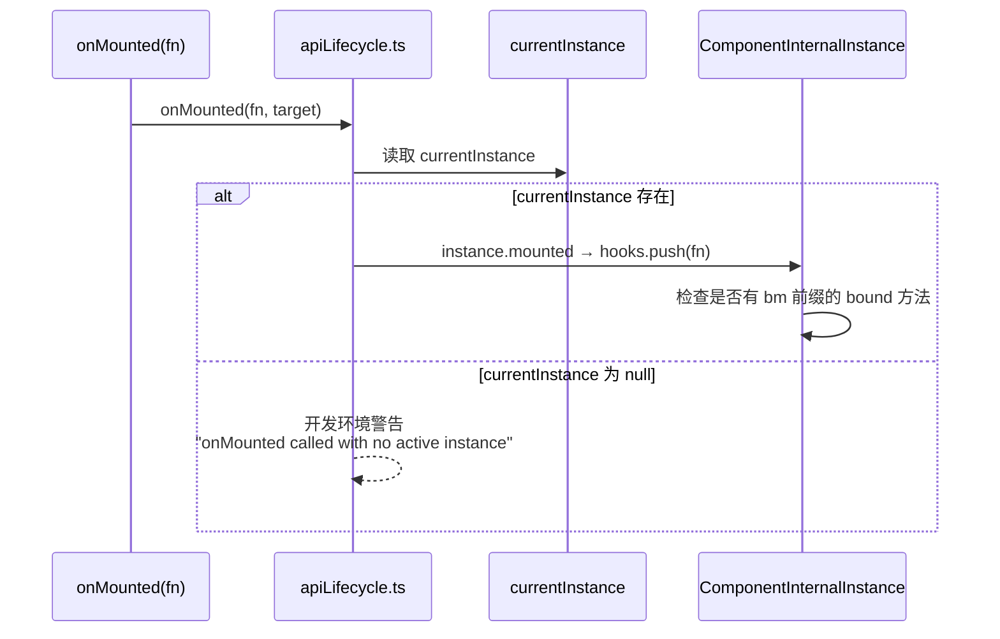
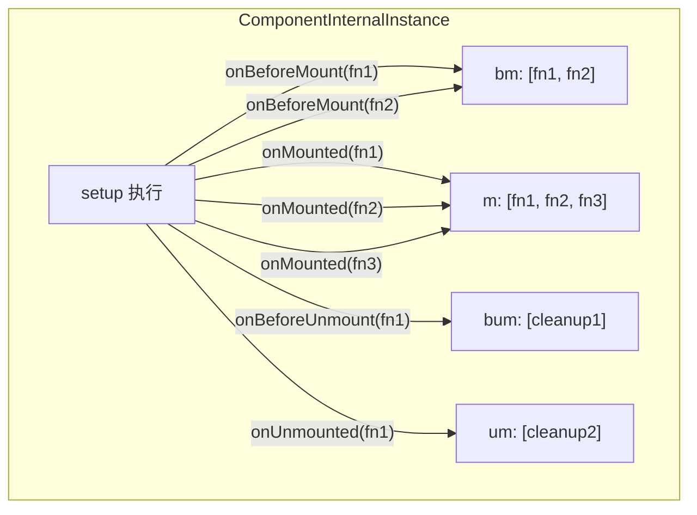
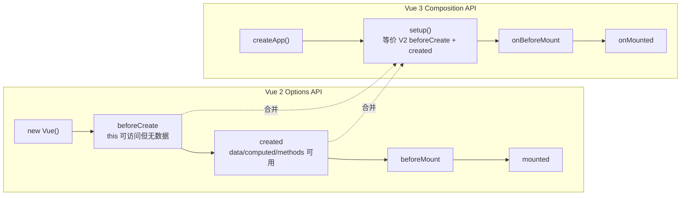
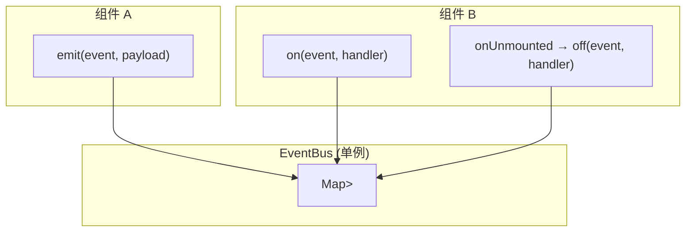
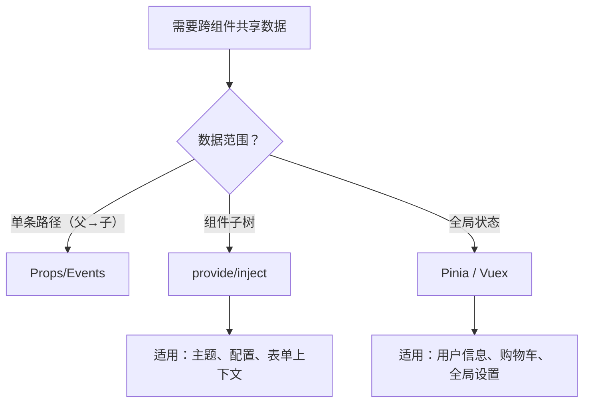
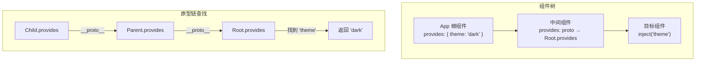
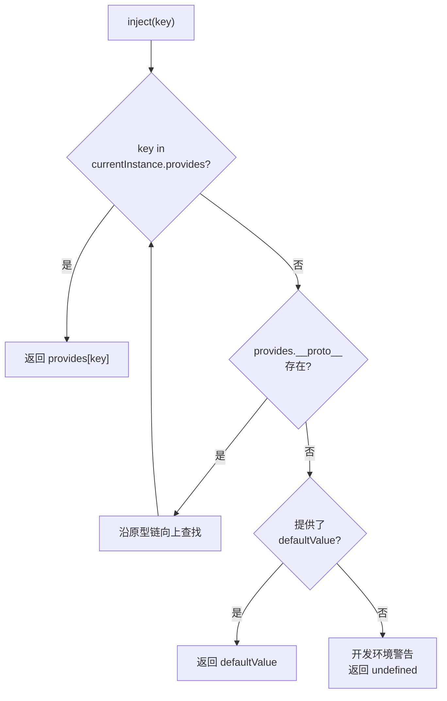
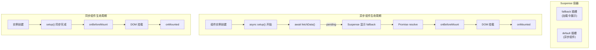

# 生命周期钩子

> Vue 3 Composition API 中的生命周期钩子以 `on` 前缀的函数形式使用。`setup()` 本身替代了 `beforeCreate` 和 `created`。

## 生命周期流程图



## 钩子详解

### 基础钩子

```vue
<script setup lang="ts">
import {
  onBeforeMount, onMounted,
  onBeforeUpdate, onUpdated,
  onBeforeUnmount, onUnmounted
} from 'vue'

// setup 执行 ≈ created
console.log('setup 执行，响应式数据已可用')

onBeforeMount(() => console.log('模板编译完成，即将挂载'))
onMounted(() => console.log('DOM 已挂载，可安全访问'))
onBeforeUpdate(() => console.log('数据变更，DOM 更新前'))
onUpdated(() => console.log('DOM 已更新'))
onBeforeUnmount(() => console.log('即将卸载，实例仍可用'))
onUnmounted(() => console.log('已卸载，清理完成'))
</script>
```

### 钩子使用场景速查

| 钩子 | 典型场景 |
|------|---------|
| `setup()` | 初始化状态、注册钩子 |
| `onMounted` | 数据请求、DOM 操作、事件监听 |
| `onUpdated` | DOM 更新后的操作（避免修改状态） |
| `onBeforeUnmount` | 清理定时器、取消订阅、移除监听 |
| `onUnmounted` | 最终清理 |

### KeepAlive 钩子

```vue
<script setup lang="ts">
import { onActivated, onDeactivated } from 'vue'

onActivated(() => {
  // 组件从缓存中被激活（重新进入）
  console.log('组件激活')
})

onDeactivated(() => {
  // 组件被缓存（离开但未销毁）
  console.log('组件缓存')
})
</script>
```

### 调试钩子

```typescript
import { onRenderTracked, onRenderTriggered } from 'vue'

// 当响应式依赖被追踪时调用（调试用）
onRenderTracked((e) => {
  console.log('依赖被追踪:', e.key)
})

// 当响应式依赖触发更新时调用（调试用）
onRenderTriggered((e) => {
  console.log('触发更新:', e.key)
})
```

### 错误处理钩子

```vue
<script setup lang="ts">
import { onErrorCaptured, ref } from 'vue'

const error = ref<Error | null>(null)

onErrorCaptured((err, instance, info) => {
  error.value = err as Error
  return false // 阻止错误向上传播
})
</script>

<template>
  <div v-if="error">
    <p>出错了: {{ error.message }}</p>
    <button @click="error = null">重试</button>
  </div>
  <slot v-else />
</template>
```

### 服务端渲染钩子

```typescript
import { onServerPrefetch } from 'vue'

// 仅在 SSR 时调用，用于在服务端预取数据
onServerPrefetch(async () => {
  data.value = await fetchData()
})
```

## Options API 对照

| Options API | Composition API | 备注 |
|-------------|-----------------|------|
| `beforeCreate` | — | `setup()` 替代 |
| `created` | — | `setup()` 替代 |
| `beforeMount` | `onBeforeMount` | |
| `mounted` | `onMounted` | |
| `beforeUpdate` | `onBeforeUpdate` | |
| `updated` | `onUpdated` | |
| `beforeUnmount` | `onBeforeUnmount` | |
| `unmounted` | `onUnmounted` | |
| `errorCaptured` | `onErrorCaptured` | |
| `activated` | `onActivated` | KeepAlive |
| `deactivated` | `onDeactivated` | KeepAlive |
| `serverPrefetch` | `onServerPrefetch` | SSR |

---

## 源码深度：生命周期钩子的注册机制

> 本节揭示 Composition API 生命周期钩子如何在没有 `this` 的情况下，精确绑定到当前组件实例。

### 核心原理：currentInstance 全局变量

Vue 3 内部维护一个全局变量 `currentInstance`，在 `setup()` 执行期间指向当前组件实例。`onMounted` 等函数正是通过这个变量把回调注入组件的生命周期队列。



### 简化版源码实现

```typescript
// ── runtime-core/src/component.ts ──

// 全局当前实例（setup 执行期间非 null）
export let currentInstance: ComponentInternalInstance | null = null

export function setCurrentInstance(instance: ComponentInternalInstance | null) {
  currentInstance = instance
}

// 组件实例中维护的生命周期 hooks 数组
export interface ComponentInternalInstance {
  // ...其他属性
  isMounted: boolean
  // 各个阶段的 hooks 数组，每个元素是 bound 过的函数
  bc: Function[] | null  // beforeCreate
  c: Function[] | null   // created
  bm: Function[] | null  // beforeMount
  m: Function[] | null   // mounted
  bu: Function[] | null  // beforeUpdate
  u: Function[] | null   // updated
  bum: Function[] | null // beforeUnmount
  um: Function[] | null  // unmounted
  da: Function[] | null  // deactivated
  a: Function[] | null   // activated
  ec: Function[] | null  // errorCaptured
  sp: Function[] | null  // serverPrefetch
}

// 创建组件实例时初始化 hooks 数组
export function createComponentInstance(vnode: VNode): ComponentInternalInstance {
  const instance: ComponentInternalInstance = {
    // ...
    bc: null, c: null, bm: null, m: null,
    bu: null, u: null, bum: null, um: null,
    da: null, a: null, ec: null, sp: null,
  }
  return instance
}
```

```typescript
// ── runtime-core/src/apiLifecycle.ts ──

import { currentInstance } from './component'

// 核心工厂函数：创建生命周期钩子注册器
function createLifecycleHook(
  lifecycle: keyof ComponentInternalInstance
) {
  return (hook: Function, target?: ComponentInternalInstance | null) => {
    // 优先用传入的 target，否则用全局 currentInstance
    const instance = target || currentInstance

    if (instance) {
      // 在开发环境下，用 bind 保证 hook 内的 this 不会被错误使用
      const wrappedHook = __DEV__
        ? createHookWithBoundThis(instance, hook)
        : hook
      // 将 hook 推入组件实例对应生命周期的 hooks 数组
      const hooks = instance[lifecycle] || (instance[lifecycle] = [])
      hooks.push(wrappedHook)
    } else if (__DEV__) {
      warn(
        `on${capitalize(lifecycle)} is called when there is no active ` +
        `component instance to be associated with. ` +
        `Lifecycle injection APIs can only be used during setup().`
      )
    }
  }
}

// 所有生命周期注册函数的底层实现
export const onBeforeMount  = createLifecycleHook('bm')
export const onMounted      = createLifecycleHook('m')
export const onBeforeUpdate = createLifecycleHook('bu')
export const onUpdated      = createLifecycleHook('u')
export const onBeforeUnmount = createLifecycleHook('bum')
export const onUnmounted    = createLifecycleHook('um')
export const onDeactivated  = createLifecycleHook('da')
export const onActivated    = createLifecycleHook('a')
export const onErrorCaptured = createLifecycleHook('ec')
export const onServerPrefetch = createLifecycleHook('sp')
```

### 钩子触发流程

生命周期钩子在组件的 `setup` 阶段注册，在渲染器的特定时机被调用：

```typescript
// ── runtime-core/src/renderer.ts ──

// 挂载组件时，按顺序调用挂载相关的 hooks
function setupRenderEffect(instance: ComponentInternalInstance) {
  const { bm, m } = instance

  // 1. beforeMount hooks
  if (bm) {
    invokeArrayFns(bm)
  }

  // 2. 执行 DOM 挂载（patch）
  patch(/* ... */)

  // 3. mounted hooks（放到 nextTick 中，确保 DOM 已插入）
  if (m) {
    queuePostRenderEffect(() => {
      invokeArrayFns(m)
    })
  }
}

// 更新组件时触发 beforeUpdate / updated hooks
function componentUpdateFn() {
  const { bu, u } = instance

  // beforeUpdate hooks（同步执行）
  if (bu) {
    invokeArrayFns(bu)
  }

  // 执行 patch 更新 DOM
  patch(/* ... */)

  // updated hooks（异步执行，放入微任务队列）
  if (u) {
    queuePostRenderEffect(() => {
      invokeArrayFns(u)
    })
  }
}

// 通用的 hook 调用工具
function invokeArrayFns(fns: Function[], ...args: any[]) {
  for (let i = 0; i < fns.length; i++) {
    fns[i](...args)
  }
}
```

### 为什么异步钩子注册不生效

```typescript
// ❌ 错误：API 已经被调用，但 currentInstance 为 null
setTimeout(() => {
  onMounted(() => console.log('不会执行')) // 当前无活动的组件实例
}, 0)

// ❌ 错误：Promise.then 也是异步的
Promise.resolve().then(() => {
  onMounted(() => console.log('也不会执行'))
})

// ✅ 正确：在异步回调的外部注册钩子，回调内部处理异步逻辑
const data = ref(null)
onMounted(async () => {
  data.value = await fetchData() // 钩子本身同步注册，回调内可以是 async
})
```

### 内存布局：hooks 数组在实例中的结构



---

## 源码深度：onMounted vs watchEffect 的时序差异

> 理解这两个 API 在首次执行时序上的本质区别，对避免常见 bug 至关重要。

### 核心差异

| 维度 | `onMounted(fn)` | `watchEffect(fn)` |
|------|-----------------|-------------------|
| **首次执行时机** | DOM 插入后，微任务回调 | 组件 setup 阶段，**同步执行** |
| **首次 fn 参数** | 无依赖，直接执行 | 立即执行一次，收集依赖 |
| **flush 行为** | 固定为 post（DOM 之后） | 默认 pre（DOM 更新前），可配置 |
| **re-render 触发** | 不会 | 依赖变更时重新执行 |
| **DOM 访问** | 始终可以 | 首次调用时 DOM 不可用（ref 为 null） |

### 时间线对比

```mermaid
gantt
    title setup → 首次渲染 时序对比
    dateFormat X
    axisFormat %L

    section setup 阶段
    watchEffect 首次同步执行 : 0, 1
    模板编译 + VNode 创建 : 1, 3

    section 挂载阶段
    beforeMount hooks         : 3, 4
    DOM 插入(patch)          : 4, 5
    微任务队列排队           : 5, 6

    section 异步回调
    watchEffect flush=post   : 6, 7
    onMounted hooks          : 6, 7
```



### 代码验证

```typescript
import { ref, watchEffect, onMounted, onBeforeMount } from 'vue'

const el = ref<HTMLDivElement | null>(null)

// 首次执行时序演示
console.log('1. setup 开始')

watchEffect(() => {
  // ⚠️ 首次同步执行，此时 ref 为 null
  console.log('2. watchEffect 首次:', el.value) // null
})

onBeforeMount(() => {
  console.log('3. onBeforeMount:', el.value)     // null
})

onMounted(() => {
  console.log('4. onMounted:', el.value)          // <div>✅ 有值
})

// 对应模板：<div ref="el">Hello</div>

// 输出顺序：
// 1. setup 开始
// 2. watchEffect 首次: null      ← 同步执行，ref 未赋值
// 3. onBeforeMount: null         ← DOM 尚未创建
// 4. onMounted: <div>            ← DOM 已挂载
```

### 利用 watchEffect 的 flush 参数控制时序

```typescript
import { ref, watchEffect } from 'vue'

const count = ref(0)
const log: string[] = []

// flush: 'pre' (默认) — 组件更新前执行
watchEffect(() => {
  log.push(`pre: ${count.value}`)
})

// flush: 'post' — 组件更新后执行（类似 onUpdated）
watchEffect(() => {
  log.push(`post: ${count.value}`)
  // 这里可以安全访问更新后的 DOM
}, { flush: 'post' })

// flush: 'sync' — 依赖变化时同步执行（谨慎使用）
watchEffect(() => {
  log.push(`sync: ${count.value}`)
}, { flush: 'sync' })
```

### watchEffect 的调度器源码简化

```typescript
// ── runtime-core/src/apiWatch.ts ──

function doWatch(
  source: WatchSource,
  cb: WatchCallback | null,
  { flush }: WatchOptions = {}
) {
  // ...生成 getter 和 job

  let scheduler: (job: () => void) => void

  switch (flush) {
    case 'post':
      // post: 推迟到组件更新后执行
      scheduler = (job) => {
        queuePostRenderEffect(job, instance && instance.suspense)
      }
      break
    case 'sync':
      // sync: 直接同步执行
      scheduler = (job) => job()
      break
    default: // 'pre'
      // pre: 放入组件更新前的队列
      scheduler = (job) => {
        queueJob(job)
      }
  }

  // watchEffect 的 effect.run() 在 setup 阶段同步执行
  // 随后的依赖变化触发时，通过 scheduler 调度
}
```

### 实际场景：何时用哪个

```typescript
import { ref, watchEffect, onMounted } from 'vue'

// ✅ 用 onMounted：需要在 DOM 中就绪后执行一次性初始化
onMounted(() => {
  // 初始化第三方库（需要 DOM 元素）
  new Chart(canvasRef.value!, config)
  // 添加全局事件监听
  window.addEventListener('resize', handler)
})

// ✅ 用 watchEffect：需要随响应式数据变化持续响应的逻辑
const searchQuery = ref('')
watchEffect(() => {
  // 首次执行时 query 可能是空字符串，不需要 DOM
  if (searchQuery.value.length > 2) {
    fetchSuggestions(searchQuery.value)
  }
})

// ✅ 用 watchEffect { flush: 'post' }：逻辑依赖 DOM 且需要持续响应
watchEffect(() => {
  // 需要访问更新后的 scrollHeight
  if (listRef.value) {
    listRef.value.scrollTop = listRef.value.scrollHeight
  }
}, { flush: 'post' })
```

---

## 与 Vue2 生命周期对比

> Vue 3 消除 `beforeCreate` / `created`，原因是 `setup()` 本身既是这两个阶段的等价替代，而且比它们更早地暴露了响应式 API。

### 时序映射



### 迁移对照表

| Vue 2 模式 | Vue 3 Composition API 等价 | 说明 |
|------------|--------------------------|------|
| `beforeCreate() { this.loading = true }` | `const loading = ref(true)` | 在 setup 顶部声明即可 |
| `created() { this.fetchData() }` | `fetchData()` | 直接在 setup 中调用 |
| `beforeCreate() { this.$on('hook:...') }` | `onMounted()` 直接注册 | 不再需要事件总线 |
| `data() { return { x: 1 } }` | `const x = ref(1)` | 不用 data 函数包装 |
| `methods: { fn() {} }` | `function fn() {}` | 普通函数 |
| `computed: { d() {} }` | `const d = computed()` | composition computed |
| `watch: { x() {} }` | `watch(x, (nv) => {})` | composition watch |

### 完整迁移示例

```vue
<!-- ── Vue 2 Options API ── -->
<script>
export default {
  data() {
    return {
      user: null,
      loading: true,
      error: null
    }
  },
  computed: {
    displayName() {
      return this.user?.name ?? '未登录'
    }
  },
  watch: {
    user(newVal) {
      if (newVal) this.trackLogin(newVal.id)
    }
  },
  beforeCreate() {
    // Vue 2: 通常用于混入初始化
    console.log('实例刚创建')
  },
  created() {
    this.loading = true
    this.fetchUser()
  },
  mounted() {
    this.$refs.input.focus()
  },
  methods: {
    async fetchUser() {
      try {
        this.user = await api.getUser()
      } catch (e) {
        this.error = e
      } finally {
        this.loading = false
      }
    },
    trackLogin(id) { /* ... */ }
  }
}
</script>
```

```vue
<!-- ── Vue 3 Composition API 等价 ── -->
<script setup lang="ts">
import { ref, computed, watch, onMounted, useTemplateRef } from 'vue'

// data → ref / reactive
const user = ref<User | null>(null)
const loading = ref(true)
const error = ref<Error | null>(null)

// computed → computed()
const displayName = computed(() => user.value?.name ?? '未登录')

// watch → watch()
watch(user, (newVal) => {
  if (newVal) trackLogin(newVal.id)
})

// beforeCreate + created → setup 体内直接执行
console.log('组件初始化')
loading.value = true
fetchUser()

// methods → 普通函数
async function fetchUser() {
  try {
    user.value = await api.getUser()
  } catch (e) {
    error.value = e as Error
  } finally {
    loading.value = false
  }
}

function trackLogin(id: string) { /* ... */ }

// mounted → onMounted；模板引用推荐使用 useTemplateRef
const inputRef = useTemplateRef<HTMLInputElement>('input')
onMounted(() => {
  inputRef.value?.focus()
})
</script>
```

### 关键变化要点

1. **`this` 消失** — Composition API 中无 `this` 上下文，数据访问用 `ref.value` / `reactive`
2. **`setup()` 是同步入口** — 所有状态声明和钩子注册必须在同步阶段完成
3. **`data()` 的替代** — `ref()` 提供单值响应式，`reactive()` 提供对象级响应式
4. **`methods` 的替代** — 直接声明函数，无需挂在对象上
5. **模板引用** — 从 `this.$refs.xxx` 变为 `ref<HTMLElement>` 或 `useTemplateRef`

---

## 生产级示例：基于生命周期的类型安全事件总线

> 利用 Composition API 的生命周期钩子，构建一个可自动清理、类型安全的事件总线，适合中型项目的跨组件通信。

### 设计思路



### 类型安全实现

```typescript
// ── utils/EventBus.ts ──

/**
 * 类型安全的事件总线
 * 
 * 特性：
 * - 完整的 TypeScript 类型推断
 * - 组件卸载自动清理（利用 onUnmounted）
 * - 支持 payload 类型约束
 * - 支持通配符 '*' 监听所有事件
 */

// 1. 定义事件映射类型
export interface EventMap {
  'user:login': { userId: string; timestamp: number }
  'user:logout': { userId: string }
  'notification:show': { message: string; type: 'success' | 'error' | 'warning' }
  'modal:open': { id: string; props?: Record<string, unknown> }
  'modal:close': { id: string }
  'route:changed': { from: string; to: string }
  // 通配符事件的 payload
  '*': { event: string; payload: unknown }
}

type EventHandler<K extends keyof EventMap> = (payload: EventMap[K]) => void
type UnsubscribeFn = () => void

// 2. 事件总线核心
class EventBus {
  private handlers = new Map<keyof EventMap, Set<EventHandler<any>>>()
  private onceHandlers = new Map<keyof EventMap, Set<EventHandler<any>>>()

  // 注册事件监听
  on<K extends keyof EventMap>(event: K, handler: EventHandler<K>): UnsubscribeFn {
    const set = this.handlers.get(event) ?? new Set()
    set.add(handler)
    this.handlers.set(event, set)

    return () => this.off(event, handler)
  }

  // 注册一次性监听
  once<K extends keyof EventMap>(event: K, handler: EventHandler<K>): UnsubscribeFn {
    const wrappedHandler: EventHandler<K> = (payload) => {
      this.off(event, wrappedHandler)
      handler(payload)
    }

    const set = this.onceHandlers.get(event) ?? new Set()
    set.add(wrappedHandler)
    this.onceHandlers.set(event, set)

    return () => this.off(event, wrappedHandler)
  }

  // 触发事件
  emit<K extends keyof EventMap>(event: K, payload: EventMap[K]): void {
    // 触发精确匹配的 handler
    const handlers = this.handlers.get(event)
    if (handlers) {
      for (const handler of handlers) {
        try {
          handler(payload)
        } catch (err) {
          console.error(`[EventBus] Handler error for "${String(event)}":`, err)
        }
      }
    }

    // 触发一次性 handler
    const onces = this.onceHandlers.get(event)
    if (onces) {
      for (const handler of [...onces]) {
        try {
          handler(payload)
        } catch (err) {
          console.error(`[EventBus] Once handler error for "${String(event)}":`, err)
        }
      }
    }

    // 触发通配符 handler
    const wildcardHandlers = this.handlers.get('*')
    if (wildcardHandlers) {
      const wildcardPayload: EventMap['*'] = { event: String(event), payload }
      for (const handler of wildcardHandlers) {
        try {
          handler(wildcardPayload)
        } catch (err) {
          console.error(`[EventBus] Wildcard handler error:`, err)
        }
      }
    }
  }

  // 移除事件监听
  off<K extends keyof EventMap>(event: K, handler: EventHandler<K>): void {
    this.handlers.get(event)?.delete(handler)
    this.onceHandlers.get(event)?.delete(handler)
  }

  // 清空指定事件的所有监听
  clear(event: keyof EventMap): void {
    this.handlers.delete(event)
    this.onceHandlers.delete(event)
  }

  // 销毁总线（清空全部）
  destroy(): void {
    this.handlers.clear()
    this.onceHandlers.clear()
  }
}

// 3. 全局单例
export const eventBus = new EventBus()
```

### Vue Composable 封装（自动清理）

```typescript
// ── composables/useEventBus.ts ──

import { onUnmounted } from 'vue'
import { eventBus, type EventMap } from '@/utils/EventBus'

/**
 * 在组件中使用事件总线
 * 组件卸载时自动清理本组件注册的所有监听器
 */
export function useEventBus() {
  // 收集本组件注册的所有取消函数
  const cleanupFns: (() => void)[] = []

  // 组件卸载时自动清理
  onUnmounted(() => {
    for (const fn of cleanupFns) {
      fn()
    }
    cleanupFns.length = 0
  })

  /**
   * 注册事件监听（自动清理版本）
   */
  function on<K extends keyof EventMap>(
    event: K,
    handler: (payload: EventMap[K]) => void
  ): void {
    const unsubscribe = eventBus.on(event, handler)
    cleanupFns.push(unsubscribe)
  }

  /**
   * 注册一次性监听（自动清理版本）
   */
  function once<K extends keyof EventMap>(
    event: K,
    handler: (payload: EventMap[K]) => void
  ): void {
    let unsubscribe: (() => void) | null = null
    // 包装 handler，触发后从清理列表中移除
    const wrapped: typeof handler = (payload) => {
      handler(payload)
      if (unsubscribe) {
        const idx = cleanupFns.indexOf(unsubscribe)
        if (idx !== -1) cleanupFns.splice(idx, 1)
      }
    }
    unsubscribe = eventBus.once(event, wrapped)
    cleanupFns.push(unsubscribe)
  }

  /**
   * 手动取消特定监听
   */
  function off<K extends keyof EventMap>(
    event: K,
    handler: (payload: EventMap[K]) => void
  ): void {
    eventBus.off(event, handler)
  }

  /**
   * 发送事件
   */
  function emit<K extends keyof EventMap>(event: K, payload: EventMap[K]): void {
    eventBus.emit(event, payload)
  }

  return { on, once, off, emit }
}
```

### 使用示例

```vue
<!-- ── 组件 A：发送通知 ── -->
<script setup lang="ts">
import { useEventBus } from '@/composables/useEventBus'

const { emit } = useEventBus()

function handleLoginSuccess(userId: string) {
  emit('user:login', { userId, timestamp: Date.now() })
}
</script>

<template>
  <button @click="handleLoginSuccess('user-123')">登录</button>
</template>
```

```vue
<!-- ── 组件 B：接收通知（自动清理） ── -->
<script setup lang="ts">
import { ref } from 'vue'
import { useEventBus } from '@/composables/useEventBus'

const { on } = useEventBus()
const lastLoginTime = ref<string>('')

// 注册监听器——组件卸载时自动清理，无需手动 off
on('user:login', ({ userId, timestamp }) => {
  lastLoginTime.value = new Date(timestamp).toLocaleTimeString()
  console.log(`用户 ${userId} 在 ${lastLoginTime.value} 登录`)
})
</script>

<template>
  <p>最近登录：{{ lastLoginTime || '无' }}</p>
</template>
```

```vue
<!-- ── 调试工具：监听所有事件 ── -->
<script setup lang="ts">
import { useEventBus } from '@/composables/useEventBus'

const { on } = useEventBus()

// 通配符监听：捕获所有事件，用于开发调试
if (import.meta.env.DEV) {
  on('*', ({ event, payload }) => {
    console.log(`[EventBus Debug] ${event}`, payload)
  })
}
</script>
```

### 架构优点

1. **零内存泄漏** — `onUnmounted` 自动清理，无需手动维护取消函数列表
2. **类型安全** — `EventMap` 提供编译时检查，emit / on 的 payload 类型完全匹配
3. **可观测性** — 通配符监听 + 错误捕获，调试友好
4. **轻量** — 不依赖第三方库，~150 行 TypeScript 即可实现
5. **可测试** — EventBus 是纯 TS 类，单元测试无需 DOM 环境

## 最佳实践

```vue
<script setup lang="ts">
import { ref, onMounted, onUnmounted } from 'vue'

// ✅ 在 setup 同步阶段注册钩子
const data = ref(null)
let timer: ReturnType<typeof setInterval> | null = null

onMounted(() => {
  // 数据请求
  fetchData().then(d => data.value = d)

  // 定时器
  timer = setInterval(() => {}, 1000)

  // DOM 事件
  window.addEventListener('resize', handleResize)
})

// ✅ 在 onUnmounted 中清理
onUnmounted(() => {
  if (timer) clearInterval(timer)
  window.removeEventListener('resize', handleResize)
})

// ❌ 不要在异步回调中注册钩子
// setTimeout(() => { onMounted(() => {}) }, 0) // 不会执行！
</script>
```

## 下一步

- [依赖注入](#依赖注入-composition-api) — Composition API 中的 provide/inject
- [模板引用](#模板引用) — useTemplateRef

---

## 依赖注入（Composition API）


> 在 Composition API 中使用 `provide` 和 `inject` 实现跨层级依赖注入。配合 TypeScript 的 `InjectionKey` 实现类型安全。

## 基本用法

```vue
<!-- 祖先组件 -->
<script setup lang="ts">
import { provide, ref, readonly } from 'vue'

const count = ref(0)
const increment = () => count.value++

provide('count', readonly(count))
provide('increment', increment)
</script>

<!-- 后代组件 -->
<script setup lang="ts">
import { inject, type Ref } from 'vue'

const count = inject<Ref<number>>('count')
const increment = inject<() => void>('increment', () => {})
</script>
```

## TypeScript 类型安全：InjectionKey

```typescript
// keys.ts
import type { InjectionKey, Ref } from 'vue'

export interface ThemeContext {
  theme: Ref<'light' | 'dark'>
  toggleTheme: () => void
}

// InjectionKey 提供类型映射
export const ThemeKey: InjectionKey<ThemeContext> = Symbol('theme')
```

```vue
<!-- Provider -->
<script setup lang="ts">
import { provide, ref } from 'vue'
import { ThemeKey } from './keys'

const theme = ref<'light' | 'dark'>('light')
provide(ThemeKey, { theme, toggleTheme: () => theme.value = theme.value === 'light' ? 'dark' : 'light' })
</script>

<!-- Consumer -->
<script setup lang="ts">
import { inject } from 'vue'
import { ThemeKey } from './keys'

// 类型自动推断为 ThemeContext | undefined
const themeCtx = inject(ThemeKey)
if (!themeCtx) throw new Error('必须在 ThemeProvider 内使用')
const { theme, toggleTheme } = themeCtx
</script>
```

## 封装组合式函数

```typescript
// composables/useTheme.ts
import { inject } from 'vue'
import { ThemeKey, type ThemeContext } from './keys'

export function useTheme(): ThemeContext {
  const ctx = inject(ThemeKey)
  if (!ctx) throw new Error('useTheme() 必须在 <ThemeProvider> 内使用')
  return ctx
}

// 使用
const { theme, toggleTheme } = useTheme()
```

## 应用级 Provide

```typescript
// main.ts
import { createApp } from 'vue'

const app = createApp(App)

// 应用级注入（所有组件可用）
app.provide('apiBase', import.meta.env.VITE_API_BASE)
app.provide('appVersion', '3.5.42')

app.mount('#app')
```

## provide/inject vs Props vs Pinia



## 最佳实践

1. **使用 `InjectionKey<T>`** — 类型安全，避免字符串冲突
2. **提供 `readonly` 数据 + 修改方法** — 控制数据流方向
3. **封装组合式函数** — `useTheme()` 而非直接 `inject(ThemeKey)`
4. **注入失败时友好报错** — 帮助调试
5. **避免在 provide 中放大对象** — 使用 `shallowRef` 优化

---

## 源码深度：provide/inject 的组件树遍历机制

> provide/inject 通过组件实例的 `provides` 属性和原型链实现跨层级查找，时间复杂度 O(h)，h 为层级深度。

### 核心数据结构



### 简化版源码实现

```typescript
// ── runtime-core/src/apiInject.ts ──

import { currentInstance } from './component'

/**
 * provide 实现：
 * 1. 获取当前组件实例
 * 2. 将父组件的 provides 作为当前组件 provides 的原型
 * 3. 在当前 provides 上设置 key-value
 *
 * 这样 inject 时通过原型链自然向上查找
 */
export function provide<T>(key: InjectionKey<T> | string, value: T): void {
  const instance = currentInstance
  if (!instance) {
    __DEV__ && warn('provide() can only be used inside setup()')
    return
  }

  let provides = instance.provides
  const parentProvides = instance.parent && instance.parent.provides

  // 关键优化：首次 provide 时建立原型链
  // 如果当前 provides 和父级 provides 是同一个引用（默认情况）
  // 则创建一个新对象，其原型指向父级 provides
  if (provides === parentProvides) {
    provides = instance.provides = Object.create(parentProvides)
  }

  // 在当前实例的 provides 上设置（不会影响父级）
  provides[key as string] = value
}

/**
 * inject 实现：
 * 1. 获取当前组件实例
 * 2. 从 provides 链上查找 key
 * 3. 如果找不到，返回 defaultValue
 *
 * 查找算法：沿原型链向上，O(h) 时间复杂度
 */
export function inject<T>(
  key: InjectionKey<T> | string,
  defaultValue?: T,
  treatDefaultAsFactory?: boolean
): T | undefined {
  const instance = currentInstance || getCurrentRenderingInstance()

  if (instance) {
    // 沿原型链查找 provides
    const provides = instance.provides

    // 在当前 provides 及其原型链上查找
    if ((key as string) in provides) {
      return provides[key as string]
    } else if (arguments.length > 1) {
      // 提供了默认值
      return treatDefaultAsFactory
        ? (defaultValue as () => T)()  // 工厂函数
        : defaultValue
    } else if (__DEV__) {
      warn(`injection "${String(key)}" not found.`)
    }
  } else if (__DEV__) {
    warn('inject() can only be used inside setup() or functional components.')
  }

  return undefined
}
```

### 原型链查找的完整示例

```typescript
// 组件树结构：
// App (provide theme: 'dark')
//   └── Layout
//        └── Sidebar (inject theme → 'dark')

// App.vue setup:
provide('theme', 'dark')
// App.provides = { theme: 'dark' }

// Layout.vue setup:
// 没有调用 provide，Layout.provides === App.provides（同一个引用）
// 此时 Layout.provides 就是 App.provides

// Sidebar.vue setup:
const theme = inject('theme')
// Sidebar.provides 指向 Layout.provides（即 App.provides）
// 查找 'theme' → 在 App.provides 中找到 → 返回 'dark'
```

```typescript
// 中间组件覆盖 provide 的情况

// App.vue:
provide('theme', 'dark')
// App.provides = { theme: 'dark' }

// Layout.vue:
provide('theme', 'light')
// 首次 provide 时：Layout.provides === App.provides
// 触发 Object.create(App.provides)
// Layout.provides = { theme: 'light' } (原型链指向 App.provides)

// Sidebar.vue:
const theme = inject('theme') // 'light'
// Sidebar.provides → Layout.provides → 找到 'theme' = 'light'
// 原型链上的 'dark' 被遮蔽（shadowed）

// Footer.vue (Layout 的另一个子组件):
const theme = inject('theme') // 'light'
// 同样从 Layout.provides 找到 'light'
```

### 查找算法可视化



### 应用级 provide 的实现

```typescript
// ── runtime-core/src/apiCreateApp.ts ──

// app.provide() 将数据注入到 App 根组件的 provides 上
// 所有后代组件都可以通过 inject 访问

export function createAppAPI(render: RootRenderFunction) {
  return function createApp(rootComponent: Component) {
    const context = createAppContext()
    const app: App = {
      // ...
      provide(key, value) {
        // 直接写入 app context 的 provides
        context.provides[key as string] = value
        return app
      }
    }

    // 挂载时，将 context.provides 作为根组件的 provides
    const vnode = createVNode(rootComponent)
    vnode.appContext = context
    // 根组件的 provides 初始化为 context.provides
    // 后续 provide 调用会通过 Object.create 建立原型链

    return app
  }
}
```

### 性能考量

| 场景 | 时间复杂度 | 说明 |
|------|-----------|------|
| `provide()` | O(1) | 直接在当前 provides 上设置属性 |
| `inject()` | O(h) | h 为组件层级深度，原型链查找 |
| 大量 provide | O(n) | n 为 provide 调用次数，每次 O(1) |
| 深层嵌套 inject | O(h) | 实际项目中 h 通常 < 20，性能无感 |

### 注意事项

```typescript
// ❌ 错误：provide 的响应式数据不会被自动追踪
const count = ref(0)
provide('count', count.value) // 传递的是值，不是 ref 本身
// 后代组件 inject 后拿到的是初始值 0，后续变化不会响应

// ✅ 正确：传递 ref 本身或 reactive 对象
provide('count', count)       // 传递 ref，后代组件 .value 访问
provide('state', reactive({ count: 0 })) // 传递 reactive 对象

// ✅ 正确：传递 readonly 包装（防止后代直接修改）
provide('count', readonly(count))

// ✅ 正确：传递 computed（派生状态）
provide('doubleCount', computed(() => count.value * 2))
```

---

## 生命周期与 Suspense 的交互

> Suspense 改变了异步组件的生命周期时序。理解这些变化对于正确使用 SSR 和异步 setup 至关重要。

### Suspense 下的生命周期流程



### 关键差异

```typescript
// ── 异步 setup 组件 ──
<script setup lang="ts">
import { ref, onMounted, onBeforeMount } from 'vue'

const data = ref(null)

// async setup：组件的挂载被推迟到 Promise resolve 之后
const result = await fetch('/api/data')
data.value = result

// 这些钩子在 Promise resolve 之后才注册和执行
onBeforeMount(() => {
  console.log('beforeMount: 在 await 之后才触发')
})

onMounted(() => {
  console.log('mounted: 组件真正挂载到 DOM')
})
</script>
```

### onServerPrefetch 与 Suspense 的协同

```typescript
// ── 服务端：onServerPrefetch 在 SSR 渲染期间被调用 ──
<script setup lang="ts">
import { ref, onServerPrefetch } from 'vue'

const product = ref<Product | null>(null)

// SSR 期间：在组件渲染为 HTML 之前预取数据
onServerPrefetch(async () => {
  product.value = await fetchProduct(props.id)
})

// 客户端 hydrate 时：如果数据已在服务端获取，不会重复请求
// 如果是在 Suspense 内，客户端也会等待 onServerPrefetch 的 Promise
</script>
```

### 完整的 Suspense + 生命周期示例

```vue
<!-- ── App.vue ── -->
<script setup lang="ts">
import { defineAsyncComponent } from 'vue'

// 异步组件：在 Suspense 中才会触发特殊生命周期
const AsyncDashboard = defineAsyncComponent(() =>
  import('./components/AsyncDashboard.vue')
)
</script>

<template>
  <Suspense @pending="onPending" @resolve="onResolve" @fallback="onFallback">
    <!-- 默认插槽：异步组件 -->
    <AsyncDashboard />

    <!-- fallback 插槽：加载状态 -->
    <template #fallback>
      <div class="skeleton">
        <SkeletonLoader :rows="5" />
      </div>
    </template>
  </Suspense>
</template>
```

```vue
<!-- ── AsyncDashboard.vue ── -->
<script setup lang="ts">
import { ref, onMounted, onBeforeMount, onServerPrefetch } from 'vue'

interface DashboardData {
  stats: { users: number; revenue: number }
  charts: Array<{ label: string; value: number }>
}

const dashboardData = ref<DashboardData | null>(null)
const loadStartTime = ref(Date.now())

// 1. async setup：Suspense 会等待这个 Promise
//    在此期间，父组件显示 fallback 内容
const rawData = await fetch('/api/dashboard').then(r => r.json())

// 2. 数据到达后，以下代码才会执行
dashboardData.value = rawData

// 3. onServerPrefetch：SSR 时在此获取数据
//    客户端 hydrate 时如果数据已存在则跳过
onServerPrefetch(async () => {
  if (!dashboardData.value) {
    dashboardData.value = await fetch('/api/dashboard').then(r => r.json())
  }
})

// 4. onBeforeMount：在 Suspense resolve 后、DOM 挂载前触发
onBeforeMount(() => {
  console.log('Dashboard beforeMount: 数据已就绪，即将渲染')
})

// 5. onMounted：DOM 挂载完成后触发
onMounted(() => {
  const loadDuration = Date.now() - loadStartTime.value
  console.log(`Dashboard mounted: 总加载时间 ${loadDuration}ms`)
  // 此时可以安全初始化图表等依赖 DOM 的库
  initCharts()
})

function initCharts() {
  // 使用 dashboardData 初始化图表
}
</script>

<template>
  <div class="dashboard" v-if="dashboardData">
    <h2>Dashboard</h2>
    <p>用户数: {{ dashboardData.stats.users }}</p>
    <p>收入: ¥{{ dashboardData.stats.revenue }}</p>
  </div>
</template>
```

### Suspense 事件钩子

```vue
<script setup lang="ts">
// Suspense 组件本身也暴露了三个事件钩子
function onPending() {
  // 进入 pending 状态（显示 fallback）
  console.log('Suspense: 进入加载状态')
}

function onResolve() {
  // 异步依赖全部 resolve（隐藏 fallback，显示内容）
  console.log('Suspense: 加载完成')
}

function onFallback() {
  // fallback 内容被显示
  console.log('Suspense: 显示 fallback')
}
</script>

<template>
  <Suspense @pending="onPending" @resolve="onResolve" @fallback="onFallback">
    <AsyncComponent />
    <template #fallback>Loading...</template>
  </Suspense>
</template>
```

### 时序总结

| 阶段 | 同步组件 | 异步组件 (Suspense 内) |
|------|---------|----------------------|
| setup 执行 | 立即同步完成 | 遇到 await 暂停 |
| 模板渲染 | setup 后立即 | await resolve 后 |
| onBeforeMount | setup 后、DOM 插入前 | await resolve 后、DOM 插入前 |
| onMounted | DOM 插入后 | DOM 插入后 |
| Suspense fallback | 不适用 | await pending 期间显示 |
| onServerPrefetch | SSR 渲染期间 | SSR 渲染期间 |

## 下一步

- [模板引用](#模板引用) — useTemplateRef 与组件引用
- [自定义组合式函数](03-组合式函数设计模式.md) — 逻辑复用模式

---

## 模板引用


> 使用模板引用获取 DOM 元素或组件实例。Vue 3.5+ 推荐使用 `useTemplateRef()` 替代传统的 `ref` 模式，获得更好的类型安全。

## 基本用法

### 传统 ref 方式

```vue
<script setup lang="ts">
import { ref, onMounted } from 'vue'

// ref 名必须与模板中 ref 属性值一致
const inputRef = ref<HTMLInputElement | null>(null)

onMounted(() => {
  inputRef.value?.focus()
})
</script>

<template>
  <input ref="inputRef" />
</template>
```

### useTemplateRef <Badge text="Vue 3.5+ 推荐" type="tip"/>

```vue
<script setup lang="ts">
import { useTemplateRef, onMounted } from 'vue'

// 类型安全，无需手动声明 ref 变量名
const inputRef = useTemplateRef<HTMLInputElement>('input')
const divRef = useTemplateRef<HTMLDivElement>('container')

onMounted(() => {
  inputRef.value?.focus()
  console.log(divRef.value?.textContent)
})
</script>

<template>
  <input ref="input" />
  <div ref="container">Content</div>
</template>
```

## v-for 中的模板引用

```vue
<script setup lang="ts">
import { ref, onMounted } from 'vue'

interface Item { id: number; text: string }
const items = ref<Item[]>([{ id: 1, text: 'A' }, { id: 2, text: 'B' }])

// v-for 中的 ref 自动收集为数组
const itemRefs = ref<(HTMLElement | null)[]>([])

onMounted(() => {
  console.log(itemRefs.value.length) // 2
  itemRefs.value[0]?.scrollIntoView()
})
</script>

<template>
  <li v-for="item in items" :key="item.id" ref="itemRefs">
    {{ item.text }}
  </li>
</template>
```

### 函数式 ref（更灵活）

```vue
<script setup lang="ts">
import { ref, onBeforeUpdate } from 'vue'

const itemRefs = ref<HTMLElement[]>([])

// 函数式 ref：每次渲染时调用
function setItemRef(el: HTMLElement | null) {
  if (el) itemRefs.value.push(el)
}

// 更新前清空，避免重复
onBeforeUpdate(() => { itemRefs.value = [] })
</script>

<template>
  <li v-for="item in items" :key="item.id" :ref="setItemRef">
    {{ item.text }}
  </li>
</template>
```

## 组件引用与 defineExpose

```vue
<!-- ChildComponent.vue -->
<script setup lang="ts">
import { ref } from 'vue'

const count = ref(0)
function increment() { count.value++ }
function reset() { count.value = 0 }

// 显式暴露给父组件
defineExpose({ count, increment, reset })
</script>
```

```vue
<!-- ParentComponent.vue -->
<script setup lang="ts">
import { useTemplateRef } from 'vue'
import ChildComponent from './ChildComponent.vue'

// Vue 3.5+：类型安全的组件引用
const childRef = useTemplateRef<InstanceType<typeof ChildComponent>>('child')

function callChild() {
  childRef.value?.increment()
  console.log(childRef.value?.count)
}
</script>

<template>
  <ChildComponent ref="child" />
  <button @click="callChild">调用子组件方法</button>
</template>
```

## 侦听模板引用

```vue
<script setup lang="ts">
import { ref, watchEffect } from 'vue'

const divRef = ref<HTMLDivElement | null>(null)

// watchEffect 在 onMounted 前执行一次（ref 为 null）
// 在 onMounted 后 ref 有值时再执行一次
watchEffect(() => {
  if (divRef.value) {
    console.log('元素已挂载:', divRef.value)
  }
})
</script>

<template>
  <div ref="divRef">内容</div>
</template>
```

## 类型标注速查

```typescript
import { ref, useTemplateRef, type Ref } from 'vue'

// DOM 元素
const el = ref<HTMLDivElement | null>(null)
const input = useTemplateRef<HTMLInputElement>('input')

// 组件实例
import MyComponent from './MyComponent.vue'
const comp = ref<InstanceType<typeof MyComponent> | null>(null)

// 函数式 ref
const setRef = (el: HTMLElement | null) => { /* ... */ }

// 条件 ref
const conditionalRef = ref<HTMLDivElement | null>(null)
```

## 常见问题

| 问题 | 答案 |
|------|------|
| ref 在 onMounted 前为 null？ | 正常，DOM 还没挂载 |
| v-for 中 ref 的顺序？ | 按渲染顺序排列 |
| 子组件 ref 只能访问 defineExpose 的内容？ | 是的，这是设计如此 |
| useTemplateRef vs ref？ | 3.5+ 推荐 useTemplateRef，类型更安全 |

---

## 源码深度：useTemplateRef 实现解析 <Badge text="Vue 3.5+" type="tip"/>

> `useTemplateRef` 是 Vue 3.5 引入的新 API，解决了传统 `ref` 方式的命名耦合问题，并提供更好的 TypeScript 类型推断。

### 问题：传统 ref 的命名耦合

```typescript
// ❌ 传统方式：变量名必须与模板 ref 属性值完全一致
const myInput = ref<HTMLInputElement | null>(null)
// <input ref="myInput" />
//    ^ 这里的字符串必须匹配变量名 "myInput" → 隐式约定，编译器无法检查
```

```typescript
// ✅ useTemplateRef：变量名与模板 ref 属性名解耦
const input = useTemplateRef<HTMLInputElement>('myInput')
// 变量名可以是 input，模板中 ref="myInput"
// 编译器可以检查类型
```

### 简化版源码实现

```typescript
// ── runtime-core/src/helpers/useTemplateRef.ts ──

import { getCurrentInstance } from '../component'
import { onMounted, onBeforeUpdate } from '../apiLifecycle'

/**
 * useTemplateRef 核心实现
 * 
 * 原理：
 * 1. 在 setup 中通过 getCurrentInstance 获取组件实例
 * 2. 从实例的 setupState 中获取对应 key 的 ref
 * 3. 由于模板编译时已将 ref 属性映射为 setupState 中的同名 ref，
 *    useTemplateRef 实际上是读取实例内部的状态引用
 * 
 * 优势：
 * - 变量名与模板 ref 属性名解耦
 * - 类型参数 T 直接约束 ref 值的类型
 * - 省去手动声明 ref() 的样板代码
 */
export function useTemplateRef<T = Element>(
  key: string
): Readonly<ShallowRef<T | null>> {
  const instance = getCurrentInstance()

  if (!instance) {
    __DEV__ && warn(
      `useTemplateRef() is called without an active component instance.`
    )
    // 返回一个空的 shallowRef，保证返回值始终可用
    return shallowRef(null) as ShallowRef<T | null>
  }

  // 核心逻辑：
  // 1. 在 instance.refs（组件实例的 refs 代理对象）上读取 key
  // 2. instance.refs 是一个特殊代理，模板中的 ref="key" 会自动
  //    绑定到 instance.refs[key]
  // 3. 返回的是一个 ShallowRef，.value 指向实际的 DOM 元素或组件实例
  //
  // 注意：这里实际上包装了一层 getter，因为 instance.refs[key]
  // 在 setup 阶段尚未被赋值（要等到挂载后），所以不能直接返回。
  //
  // 实际源码中的处理：在 instance.refs 上通过 defineProperty
  // 把模板 ref 的读写代理到返回的 shallowRef 上。

  // 简化版实现
  const i = instance

  // 利用已有的 setupState 或创建一个新的 shallowRef
  let r = shallowRef<T | null>(null)

  // 挂载后同步 ref 值
  onMounted(() => {
    // 从组件实例的 refs 中获取实际 DOM/组件引用
    const el = i.refs[key] as T | null
    r.value = el
  })

  return r as Readonly<ShallowRef<T | null>>
}
```

### Vue 3.5 的实际实现（refs 代理）

Vue 3.5 中 `useTemplateRef` 是**纯运行时实现**：它返回一个 `shallowRef`，并在组件实例的 `refs` 对象上通过 `defineProperty` 建立代理——模板 `ref="key"` 挂载时对 `refs[key]` 的读写会被转发到这个 `shallowRef`：

```typescript
// ── runtime-core/src/helpers/useTemplateRef.ts（简化） ──
export function useTemplateRef<T = Element>(key: string) {
  const i = getCurrentInstance()!
  const r = shallowRef(null) as ShallowRef<T | null>

  if (i) {
    const refs = i.refs
    Object.defineProperty(refs, key, {
      enumerable: true,
      get: () => r.value,
      set: value => (r.value = value),
    })
  }

  return r as Readonly<ShallowRef<T | null>>
}
```

这样，渲染器在 patch 阶段对 `refs[key]` 的赋值会自动同步到返回的 ref 上，无需组件作者手动对齐变量名与模板 ref 属性名。

### 编译层面的绑定机制

```typescript
// ── compiler-core/src/transforms/vBind.ts ──

// 模板 <input ref="input" /> 在编译阶段的处理：
// 1. transformElement 识别 ref 属性
// 2. 生成 props 中的 ref 绑定：
//    {
//      key: 'ref',
//      value: {
//        type: NodeTypes.SIMPLE_EXPRESSION,
//        content: 'inputRef' // 指向 setupState 中的同名变量
//      }
//    }
// 3. 渲染器在 patch 阶段调用 setRef(rawRef, oldRawRef, parentSuspense, vnode)

// ── runtime-core/src/renderer.ts ──
function setRef(
  rawRef: VNodeNormalizedRef,
  oldRawRef: VNodeNormalizedRef | null,
  parentSuspense: SuspenseBoundary | null,
  vnode: VNode
) {
  // 处理字符串 ref
  if (isString(rawRef)) {
    // 通过 setupState 或 ctx 查找对应的 ref
    const refValue = vnode.shapeFlag & ShapeFlags.STATEFUL_COMPONENT
      ? // 组件实例：返回组件实例的 exposed
        // 只在 defineExpose 暴露的属性可用
        (vnode.component!.exposed || vnode.component!.proxy)
      : // 普通元素：返回 DOM 元素本身
        vnode.el

    // 将 refValue 赋值给 setupState 或 ctx 中的对应变量
    // 这个变量正是 useTemplateRef 或 ref() 声明的那个
  }
}
```

### useTemplateRef vs 传统 ref 的对比

```typescript
// ── 场景 1：类型推断示例 ──

// 传统 ref：需要手动声明类型
const btn = ref<HTMLButtonElement | null>(null)
//              ^^^^^^^^^^^^^^^^^^^^^^^^ 必须手动标注

// useTemplateRef：类型参数即可
const btn = useTemplateRef<HTMLButtonElement>('submitBtn')
//         ^^^^^^^^^^^^^^^^^^^^^^^^^^^^^^^^ 编译时类型约束


// ── 场景 2：多 ref 管理 ──

// 传统 ref：每个都需要单独声明
const nameInput = ref<HTMLInputElement | null>(null)
const emailInput = ref<HTMLInputElement | null>(null)
const submitBtn = ref<HTMLButtonElement | null>(null)

// useTemplateRef：更清晰的意图表达
const nameInput = useTemplateRef<HTMLInputElement>('name')
const emailInput = useTemplateRef<HTMLInputElement>('email')
const submitBtn = useTemplateRef<HTMLButtonElement>('submit')


// ── 场景 3：动态 ref 名称 ──

// 传统 ref：需要函数式 ref
<script setup>
const dynamicRefs = ref<Record<string, HTMLElement>>({})
function setRef(el: HTMLElement | null) {
  if (el) dynamicRefs.value[el.dataset.id!] = el
}
</script>

// useTemplateRef：不支持动态名称，但类型更安全
// 对于动态 ref，仍然使用函数式 ref 方式
```

### 性能对比

| 方面 | 传统 ref() | useTemplateRef |
|------|-----------|----------------|
| 内存分配 | 1 个 ref 对象 | 1 个 shallowRef 对象 |
| 响应式追踪 | shallowRef（不深度追踪） | shallowRef（不深度追踪） |
| 绑定机制 | 依赖变量名与 ref 属性名一致 | 实例 refs 代理，运行时开销可忽略 |
| 类型安全 | 手动标注 | 泛型约束 + 编译器推断 |

---

## 下一步

- [自定义组合式函数](03-组合式函数设计模式.md) — 逻辑复用模式