# 自定义组合式函数

> 组合式函数（Composables）是 Vue 3 中复用有状态逻辑的主要方式，替代 Vue 2 的 Mixins。命名以 `use` 开头，利用 Composition API 封装和复用逻辑。

## 响应式追踪原理：依赖收集与副作用触发

组合式函数之所以能"自动响应式"，核心在于 Vue 3 的响应式系统。理解其内部机制，是写出高性能、无 Bug 组合式函数的前提。

### 从 `ref` 到 `effect`：完整的依赖追踪链路

```mermaid
flowchart TB
    subgraph 编译阶段
        A["<div>{{ count }}</div>"] --> B["编译为 render 函数"]
        B --> C["render 函数被 effect() 包裹"]
    end

    subgraph 运行时：依赖收集
        C --> D["effect 执行 render"]
        D --> E["读取 count.value"]
        E --> F["触发 Proxy get 拦截"]
        F --> G["track(target, key)"]
        G --> H["将 activeEffect 存入 targetMap"]
    end

    subgraph 运行时：派发更新
        I["count.value = 1"] --> J["触发 Proxy set 拦截"]
        J --> K["trigger(target, key)"]
        K --> L["从 targetMap 取出依赖"]
        L --> M["scheduler 调度 effect 重新执行"]
        M --> D
    end
```

### 简化版 Vue 响应式核心实现

```typescript
// ──── 全局状态 ────
let activeEffect: ReactiveEffect | null = null

// 存储结构：targetMap: WeakMap<object, Map<key, Set<ReactiveEffect>>>
const targetMap = new WeakMap<object, Map<string | symbol, Set<ReactiveEffect>>>()

class ReactiveEffect<T = any> {
  deps: Set<ReactiveEffect>[] = []  // 该 effect 依赖了哪些 dep
  private onStop?: () => void

  constructor(
    public fn: () => T,
    public scheduler?: () => void
  ) {}

  run(): T {
    // 1. 设置为当前活跃 effect
    activeEffect = this
    // 2. 执行函数，触发 getter → track
    const result = this.fn()
    // 3. 清理
    activeEffect = null
    return result
  }

  stop() {
    // 从所有 dep 中移除自己
    this.deps.forEach(dep => dep.delete(this))
    this.deps.length = 0
    this.onStop?.()
  }
}

// ──── track：依赖收集 ────
function track(target: object, key: string | symbol) {
  if (!activeEffect) return  // 不在 effect 中执行，无需收集

  let depsMap = targetMap.get(target)
  if (!depsMap) {
    depsMap = new Map()
    targetMap.set(target, depsMap)
  }

  let deps = depsMap.get(key)
  if (!deps) {
    deps = new Set()
    depsMap.set(key, deps)
  }

  deps.add(activeEffect)
  activeEffect.deps.push(deps) // 双向记录，用于 cleanup
}

// ──── trigger：派发更新 ────
function trigger(target: object, key: string | symbol) {
  const depsMap = targetMap.get(target)
  if (!depsMap) return

  const deps = depsMap.get(key)
  if (!deps) return

  // 创建副本以避免无限循环（scheduler 可能修改原 Set）
  const effectsToRun = new Set<ReactiveEffect>()
  deps.forEach(effect => {
    if (effect !== activeEffect) effectsToRun.add(effect)
  })

  effectsToRun.forEach(effect => {
    if (effect.scheduler) {
      effect.scheduler()  // 异步调度（nextTick）
    } else {
      effect.run()
    }
  })
}

// ──── ref 简化实现 ────
class RefImpl<T> {
  private _value: T
  public readonly __v_isRef = true

  constructor(value: T) {
    this._value = value
  }

  get value(): T {
    track(this, 'value')  // ★ 读取时收集依赖
    return this._value
  }

  set value(newVal: T) {
    if (newVal !== this._value) {
      this._value = newVal
      trigger(this, 'value')  // ★ 设置时触发更新
    }
  }
}

function ref<T>(value: T) {
  return new RefImpl(value)
}
```

### 组合式函数中的依赖追踪实例

```typescript
function useCounter() {
  const count = ref(0)
  const doubled = computed(() => count.value * 2)

  // ★ 当这个组合式函数在 setup 中调用时：
  // 1. count 和 doubled 的 getter 会在 render effect 中被 track
  // 2. 组件模板中的 {{ count }} 建立了 effect → count 的依赖
  // 3. 任何地方修改 count.value 都会自动更新视图

  return { count, doubled }
}
```

### effect 嵌套与栈式管理

```typescript
// Vue 使用栈来管理嵌套的 effect（如 watchEffect 内再 watchEffect）
const effectStack: ReactiveEffect[] = []

class ReactiveEffect {
  run() {
    // ...清理旧依赖...
    effectStack.push(this)
    activeEffect = this         // ★ 设置为当前 effect
    try {
      return this.fn()
    } finally {
      effectStack.pop()
      activeEffect = effectStack[effectStack.length - 1] ?? null
      // ★ 恢复到父级 effect
    }
  }
}
```

有了这个理解，我们来看 `effectScope` 如何实现批量管理。

### watchEffect 与 watch 的依赖追踪差异

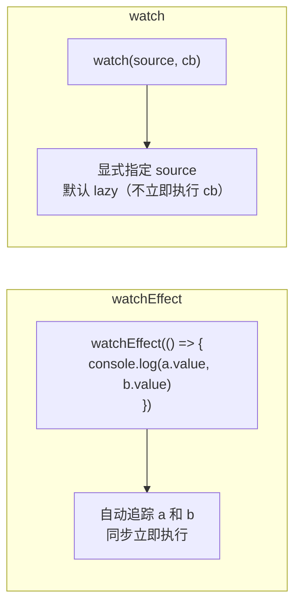

```typescript
// watchEffect: 自动收集所有在回调中被读取的响应式数据
watchEffect(() => {
  // 自动追踪 a, b, c —— 任意一个变化都重新执行
  console.log(a.value, b.value, c.value)
})

// watch: 显式指定 source，可精确控制
watch([a, b], ([newA, newB], [oldA, oldB]) => {
  // 只有 a 或 b 变化时才执行
  // c.value 变化不会触发
})
```

## effectScope 隔离机制详解

`effectScope` 是 Vue 3.2+ 引入的高级 API，用于批量管理响应式副作用。它是实现"单例 vs 工厂模式"底层的核心工具。

### effectScope 的内部实现

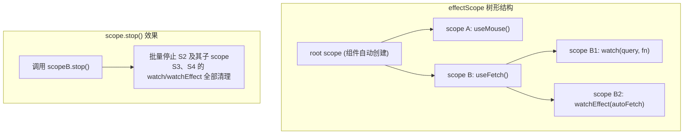

### 简化版 effectScope 源码实现

```typescript
class EffectScope {
  // 当前 scope 是否活跃
  private _active = true

  // 收集当前 scope 下的所有 effect
  effects: ReactiveEffect[] = []

  // 父子 scope 关系
  parent: EffectScope | undefined
  scopes: EffectScope[] = []

  constructor(public detached: boolean = false) {
    // detached: true → 不挂到父 scope，独立生命周期
    if (!detached && activeEffectScope) {
      this.parent = activeEffectScope
      activeEffectScope.scopes.push(this)
    }
  }

  get active(): boolean {
    return this._active
  }

  /**
   * 在当前 scope 中执行一个函数。
   * 函数内部创建的所有 effect 都会注册到这个 scope。
   */
  run<T>(fn: () => T): T | undefined {
    if (!this._active) return undefined

    const prevScope = activeEffectScope
    activeEffectScope = this
    try {
      return fn()
    } finally {
      activeEffectScope = prevScope
    }
  }

  /**
   * 停止当前 scope 及所有子 scope
   */
  stop() {
    if (!this._active) return
    this._active = false

    // ★ 递归停止所有子 scope
    this.scopes.forEach(scope => scope.stop())

    // ★ 停止当前 scope 收集的所有 effect
    this.effects.forEach(effect => effect.stop())
    this.effects.length = 0
    this.scopes.length = 0
  }
}

// ──── 全局状态 ────
let activeEffectScope: EffectScope | undefined

// ──── recordEffectScope：effect 注册到当前 scope ────
function recordEffectScope(effect: ReactiveEffect, scope?: EffectScope) {
  const targetScope = scope ?? activeEffectScope
  if (targetScope && targetScope.active) {
    targetScope.effects.push(effect)
  }
}
```

### 单例 vs 工厂模式：完整对比

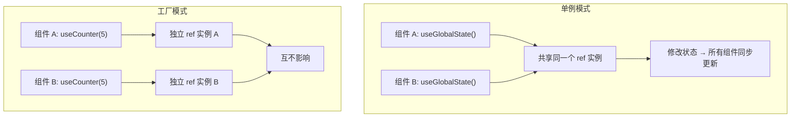

```typescript
// ──── 模式一：模块级单例（全局共享状态）────
// composables/useGlobalNotification.ts
import { ref, readonly } from 'vue'

interface Notification {
  id: number
  message: string
  type: 'info' | 'success' | 'error'
}

// ★ 模块作用域的 ref，所有调用者共享同一个实例
const notifications = ref<Notification[]>([])
let nextId = 0

export function useGlobalNotification() {
  function addNotification(message: string, type: Notification['type'] = 'info') {
    const id = nextId++
    notifications.value = [...notifications.value, { id, message, type }]
    // 自动移除
    setTimeout(() => removeNotification(id), 5000)
    return id
  }

  function removeNotification(id: number) {
    notifications.value = notifications.value.filter(n => n.id !== id)
  }

  return {
    notifications: readonly(notifications),  // ★ readonly 防止外部直接修改
    addNotification,
    removeNotification
  }
}
```

```vue
<!-- 组件 A -->
<script setup lang="ts">
const { notifications, addNotification } = useGlobalNotification()
</script>

<!-- 组件 B：共享同一个 notifications 列表 -->
<script setup lang="ts">
const { notifications } = useGlobalNotification()
// notifications 与组件 A 是同一个 reactive ref
</script>
```

```typescript
// ──── 模式二：effectScope 工厂（独立隔离）────
// composables/useFeatureWithScope.ts
import { effectScope, ref, watch, onScopeDispose } from 'vue'

export function useFeatureWithScope() {
  // ★ 每次调用创建全新的 scope，effect 完全隔离
  const scope = effectScope()

  const data = scope.run(() => {
    const state = ref(0)
    const derived = ref(0)

    // 这些 watch 只在当前 scope 中生效
    watch(state, (val) => { derived.value = val * 2 })
    watch(derived, (val) => { console.log('derived changed:', val) })

    onScopeDispose(() => {
      console.log('scope 已清理，所有 effect 已停止')
    })

    return { state, derived }
  })!

  // ★ 返回 dispose 方法，调用方可手动清理
  function dispose() {
    scope.stop()
  }

  return { ...data, dispose }
}
```

```typescript
// ──── 模式三：detached scope（独立于组件生命周期）────
import { effectScope, ref } from 'vue'

// detached scope 不绑定到组件，即使组件卸载，副作用仍继续运行
const detachedScope = effectScope(true)  // ★ detached: true

const globalIntervalState = ref(0)

detachedScope.run(() => {
  // 这个 interval 不会随组件卸载而停止
  setInterval(() => {
    globalIntervalState.value++
  }, 1000)
})

export function useGlobalInterval() {
  return { count: globalIntervalState }
}
```

### scope.stop() 的调用时机

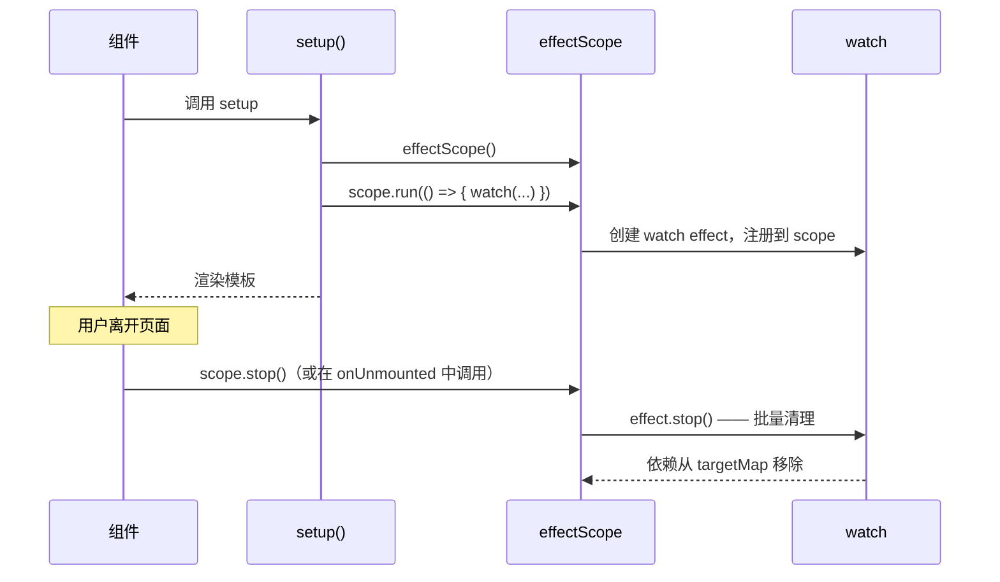

```typescript
// 最佳实践：在 onUnmounted 中调用 scope.stop()
import { effectScope, onUnmounted, ref, watch } from 'vue'

export function useAutoCleanedFeature() {
  const scope = effectScope()

  const state = scope.run(() => {
    const count = ref(0)
    watch(count, () => { /* ... */ })
    return { count }
  })!

  // ★ 自动绑定到组件生命周期
  onUnmounted(() => {
    scope.stop()
  })

  return state
}
```

## 基础示例：useMouse

```typescript
// composables/useMouse.ts
import { ref, onMounted, onUnmounted } from 'vue'

export function useMouse() {
  const x = ref(0)
  const y = ref(0)

  function update(event: MouseEvent) {
    x.value = event.pageX
    y.value = event.pageY
  }

  onMounted(() => window.addEventListener('mousemove', update))
  onUnmounted(() => window.removeEventListener('mousemove', update))

  return { x, y }
}
```

```vue
<script setup lang="ts">
import { useMouse } from './composables/useMouse'

const { x, y } = useMouse()
</script>

<template>
  <p>鼠标位置: {{ x }}, {{ y }}</p>
</template>
```

## 实战示例

### useFetch — 数据请求

```typescript
import { ref, watchEffect, toValue, type MaybeRefOrGetter } from 'vue'

export function useFetch<T>(url: MaybeRefOrGetter<string>) {
  const data = ref<T | null>(null)
  const error = ref<Error | null>(null)
  const loading = ref(false)

  async function execute() {
    loading.value = true
    error.value = null
    try {
      const res = await fetch(toValue(url))
      if (!res.ok) throw new Error(`HTTP ${res.status}`)
      data.value = await res.json()
    } catch (e) {
      error.value = e as Error
    } finally {
      loading.value = false
    }
  }

  watchEffect(() => { execute() })

  return { data, error, loading, refetch: execute }
}
```

### useLocalStorage — 持久化

```typescript
import { ref, watch, type Ref } from 'vue'

export function useLocalStorage<T>(key: string, defaultValue: T): Ref<T> {
  const stored = localStorage.getItem(key)
  const data = ref<T>(stored ? JSON.parse(stored) : defaultValue)

  watch(data, (newVal) => {
    localStorage.setItem(key, JSON.stringify(newVal))
  }, { deep: true })

  return data
}

// 使用
const theme = useLocalStorage('theme', 'light')
const todos = useLocalStorage<Todo[]>('todos', [])
```

### useDebounce — 防抖

```typescript
import { ref, watch, type Ref } from 'vue'

export function useDebounce<T>(source: Ref<T>, delay = 300): Ref<T> {
  const debounced = ref(source.value) as Ref<T>
  let timer: ReturnType<typeof setTimeout>

  watch(source, (val) => {
    clearTimeout(timer)
    timer = setTimeout(() => { debounced.value = val }, delay)
  })

  return debounced
}
```

### useMediaQuery — 响应式媒体查询

```typescript
import { ref, onMounted, onUnmounted } from 'vue'

export function useMediaQuery(query: string) {
  const matches = ref(false)

  function update(e: MediaQueryListEvent | MediaQueryList) {
    matches.value = e.matches
  }

  onMounted(() => {
    const mql = window.matchMedia(query)
    update(mql)
    mql.addEventListener('change', update)
    onUnmounted(() => mql.removeEventListener('change', update))
  })

  return matches
}

// const isDark = useMediaQuery('(prefers-color-scheme: dark)')
```

## 组合式函数的组合：设计模式

组合式函数的真正威力在于"组合"——将多个小的组合式函数组装成更大的、更专用的组合式函数。这一节深入探讨组合模式和设计原则。

### 组合层级模型

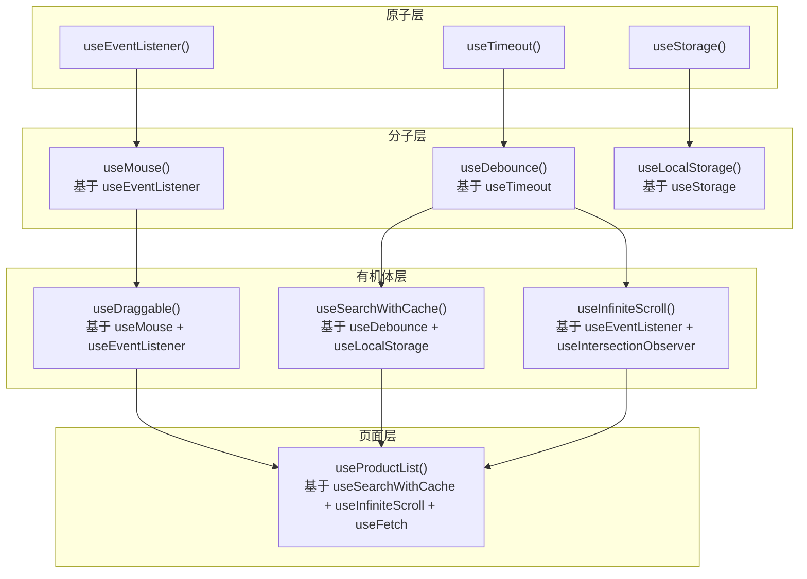

### 模式一：管道组合（Pipeline Composition）

多个独立 composable 串联，每个处理一个关注点。

```typescript
// ──── 基础 composables ────

// 1. 原始数据获取
function useRawPosts() {
  const { data, loading, error, refresh } = useFetch<RawPost[]>('/api/posts')
  return { rawPosts: data, loading, error, refresh }
}

// 2. 数据过滤
function useFilteredPosts<T extends { title: string }>(
  posts: Ref<T[]>,
  searchQuery: Ref<string>
) {
  const filtered = computed(() =>
    posts.value.filter(p =>
      p.title.toLowerCase().includes(searchQuery.value.toLowerCase())
    )
  )
  return { filteredPosts: filtered }
}

// 3. 排序
function useSortedPosts<T extends { createdAt: string }>(
  posts: Ref<T[]>,
  sortOrder: Ref<'asc' | 'desc'>
) {
  const sorted = computed(() =>
    [...posts.value].sort((a, b) => {
      const diff = new Date(a.createdAt).getTime() - new Date(b.createdAt).getTime()
      return sortOrder.value === 'asc' ? diff : -diff
    })
  )
  return { sortedPosts: sorted }
}

// 4. 分页
function usePaginatedPosts<T>(posts: Ref<T[]>, pageSize = 10) {
  const currentPage = ref(1)
  const totalPages = computed(() => Math.ceil(posts.value.length / pageSize))

  const paginated = computed(() => {
    const start = (currentPage.value - 1) * pageSize
    return posts.value.slice(start, start + pageSize)
  })

  return { paginatedPosts: paginated, currentPage, totalPages }
}

// ──── 管道组合：将所有层串联 ────
export function usePostList() {
  const searchQuery = ref('')
  const sortOrder = ref<'asc' | 'desc'>('desc')

  // ★ 管道流：raw → filtered → sorted → paginated
  const { rawPosts, loading, error, refresh } = useRawPosts()
  const { filteredPosts } = useFilteredPosts(rawPosts, searchQuery)
  const { sortedPosts } = useSortedPosts(filteredPosts, sortOrder)
  const { paginatedPosts, currentPage, totalPages } = usePaginatedPosts(sortedPosts)

  return {
    posts: paginatedPosts,  // ★ 最终暴露处理后的数据
    loading,
    error,
    refresh,
    searchQuery,
    sortOrder,
    currentPage,
    totalPages
  }
}
```

### 模式二：混合组合（Cross-cutting Composition）

多个 composable 共同操作同一个共享状态。

```typescript
// ──── 共享状态 + 多种操作方式 ────
import { ref, computed, watchEffect, onMounted, readonly } from 'vue'

export function useShoppingCart() {
  // ★ 共享的核心状态
  const items = ref<CartItem[]>([])

  // 领域逻辑1：增删改查
  function addItem(product: Product, quantity = 1) {
    const existing = items.value.find(i => i.productId === product.id)
    if (existing) {
      existing.quantity += quantity
    } else {
      items.value.push({
        productId: product.id,
        name: product.name,
        price: product.price,
        quantity
      })
    }
  }

  function removeItem(productId: string) {
    items.value = items.value.filter(i => i.productId !== productId)
  }

  // 领域逻辑2：计算派生状态
  const totalPrice = computed(() =>
    items.value.reduce((sum, i) => sum + i.price * i.quantity, 0)
  )

  const totalItems = computed(() =>
    items.value.reduce((sum, i) => sum + i.quantity, 0)
  )

  // 领域逻辑3：持久化（复用 useLocalStorage）
  const savedItems = useLocalStorage<CartItem[]>('shopping-cart', [])

  // ★ 同步：从 localStorage 恢复，变更时保存
  watchEffect(() => {
    if (items.value.length > 0) {
      savedItems.value = items.value
    }
  })

  onMounted(() => {
    if (savedItems.value.length > 0) {
      items.value = savedItems.value
    }
  })

  return {
    items: readonly(items),
    addItem,
    removeItem,
    totalPrice,
    totalItems
  }
}
```

### 模式三：适配器组合（Adapter Composition）

将一个 composable 的输出适配为另一个 composable 期望的输入。

```typescript
// ──── 将任何数据源适配为 useInfiniteScroll ────
function useInfiniteScroll(
  loadMore: () => Promise<void>,
  options?: { threshold?: number }
) {
  const sentinel = ref<HTMLElement | null>(null)
  const isLoadingMore = ref(false)

  // IntersectionObserver 实现
  useIntersectionObserver(sentinel, async ([entry]) => {
    if (entry.isIntersecting && !isLoadingMore.value) {
      isLoadingMore.value = true
      await loadMore()
      isLoadingMore.value = false
    }
  }, { threshold: options?.threshold ?? 0.1 })

  return { sentinel, isLoadingMore }
}

// ──── useIntersectionObserver 基础实现 ────
function useIntersectionObserver(
  target: Ref<HTMLElement | null>,
  callback: IntersectionObserverCallback,
  options?: IntersectionObserverInit
) {
  let observer: IntersectionObserver | null = null

  onMounted(() => {
    observer = new IntersectionObserver(callback, options)
    if (target.value) observer.observe(target.value)
  })

  watch(target, (el, oldEl) => {
    if (oldEl) observer?.unobserve(oldEl)
    if (el) observer?.observe(el)
  })

  onUnmounted(() => {
    observer?.disconnect()
  })
}

// ──── 将两者组合 ────
export function useInfinitePosts() {
  const page = ref(1)
  const posts = ref<Post[]>([])
  const hasMore = ref(true)

  async function loadMore() {
    const newPosts = await fetch(`/api/posts?page=${page.value}`).then(r => r.json())
    if (newPosts.length === 0) {
      hasMore.value = false
      return
    }
    posts.value.push(...newPosts)
    page.value++
  }

  // ★ 适配：loadMore 作为 useInfiniteScroll 的参数
  const { sentinel, isLoadingMore } = useInfiniteScroll(loadMore)

  // 初始加载
  onMounted(() => loadMore())

  return { posts, hasMore, isLoadingMore, sentinel }
}
```

```vue
<template>
  <div>
    <PostCard v-for="post in posts" :key="post.id" :post="post" />
    <div v-if="isLoadingMore">加载中...</div>
    <!-- ★ sentinel 是滚动监听的锚点元素 -->
    <div ref="sentinel" v-if="hasMore" style="height: 1px" />
  </div>
</template>
```

### 组合设计原则

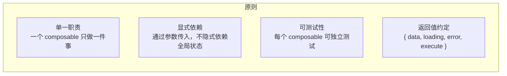

```typescript
// ❌ 违反原则：职责混乱
function useBadComposable() {
  const posts = ref([])
  const theme = ref('light')
  const mouse = useMouse()

  // 做了太多事情：数据获取 + 主题管理 + 鼠标追踪
  fetch('/api/posts').then(...)
  localStorage.setItem('theme', ...)

  return { posts, theme, mouse }
}

// ✅ 遵循原则：职责清晰，可组合
function usePosts() {
  const { data: posts, loading } = useFetch<Post[]>('/api/posts')
  return { posts, loading }
}

function useTheme() {
  return useLocalStorage('theme', 'light')
}

// 组合使用
const { posts, loading } = usePosts()
const theme = useTheme()
const { x, y } = useMouse()
```

## 异步组合式函数：深入解析

异步组合式函数是最常见但也最容易出问题的场景。核心挑战有三：竞态处理、错误边界、loading/error 状态管理。

### 竞态条件（Race Condition）的本质

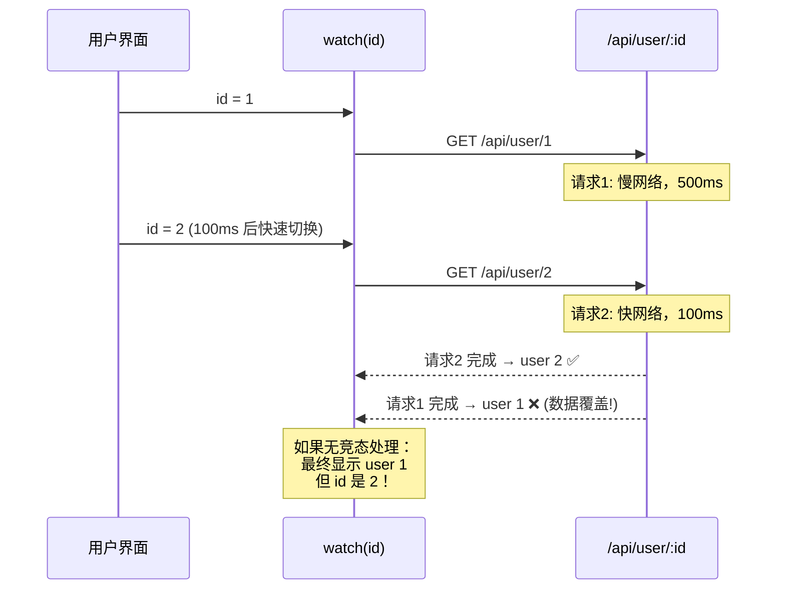

### 竞态处理策略

#### 策略一：布尔标志位（手动模式）

```typescript
import { ref, watch, type Ref } from 'vue'

export function useFetchWithFlag<T>(url: Ref<string>) {
  const data = ref<T | null>(null)
  const error = ref<Error | null>(null)
  const loading = ref(false)

  watch(url, async (newUrl, oldUrl, onCleanup) => {
    let cancelled = false  // ★ 闭包变量
    // ★ watch 回调不支持返回值形式的清理函数，
    //    必须通过第三个参数 onCleanup 注册
    onCleanup(() => {
      cancelled = true
    })

    loading.value = true
    error.value = null

    try {
      const res = await fetch(newUrl)
      if (!res.ok) throw new Error(`HTTP ${res.status}`)
      const result = await res.json()
      // ★ 只有未取消时才更新状态
      if (!cancelled) {
        data.value = result
      }
    } catch (e) {
      if (!cancelled) {
        error.value = e as Error
      }
    } finally {
      if (!cancelled) {
        loading.value = false
      }
    }
  })

  return { data, error, loading }
}
```

#### 策略二：onWatcherCleanup（Vue 3.5+ 推荐）

```typescript
import { ref, watch, onWatcherCleanup, type Ref } from 'vue'

export function useFetchWithCleanup<T>(url: Ref<string>) {
  const data = ref<T | null>(null)
  const error = ref<Error | null>(null)
  const loading = ref(false)

  watch(url, async (newUrl) => {
    // ★ 声明式的清理注册 —— 比手动 cancelled 标志更简洁
    let cancelled = false
    onWatcherCleanup(() => { cancelled = true })

    loading.value = true
    error.value = null

    try {
      const res = await fetch(newUrl)
      if (!res.ok) throw new Error(`HTTP ${res.status}`)
      const result = await res.json()
      if (!cancelled) data.value = result
    } catch (e) {
      if (!cancelled) error.value = e as Error
    } finally {
      if (!cancelled) loading.value = false
    }
  })

  return { data, error, loading }
}
```

#### 策略三：AbortController（底层原生方案）

```typescript
import { ref, watch, onWatcherCleanup, type Ref } from 'vue'

export function useFetchWithAbort<T>(url: Ref<string>) {
  const data = ref<T | null>(null)
  const error = ref<Error | null>(null)
  const loading = ref(false)

  watch(url, async (newUrl) => {
    const controller = new AbortController()

    // ★ 注册清理 → 取消前一次请求
    onWatcherCleanup(() => controller.abort())

    loading.value = true
    error.value = null

    try {
      const res = await fetch(newUrl, { signal: controller.signal })
      if (!res.ok) throw new Error(`HTTP ${res.status}`)
      data.value = await res.json()
    } catch (e) {
      // ★ AbortError 是预期的取消，不应视为错误
      if (e instanceof DOMException && e.name === 'AbortError') return
      error.value = e as Error
    } finally {
      loading.value = false
    }
  })

  return { data, error, loading }
}
```

### 统一的状态管理：useAsyncState

```typescript
import { ref, shallowRef, type Ref, type ShallowRef } from 'vue'

interface AsyncState<T> {
  data: ShallowRef<T | null>  // ★ shallowRef 避免对大型数据的深层响应式开销
  error: ShallowRef<Error | null>
  loading: Ref<boolean>
  retryCount: Ref<number>
}

export function useAsyncState<T>(
  fn: (signal: AbortSignal) => Promise<T>
) {
  const state: AsyncState<T> = {
    data: shallowRef<T | null>(null),
    error: shallowRef<Error | null>(null),
    loading: ref(false),
    retryCount: ref(0)
  }

  let abortController: AbortController

  async function execute() {
    // 取消上一次请求
    abortController?.abort()
    abortController = new AbortController()

    state.loading.value = true
    state.error.value = null

    try {
      state.data.value = await fn(abortController.signal)
    } catch (e) {
      if (e instanceof DOMException && e.name === 'AbortError') return
      state.error.value = e as Error
    } finally {
      state.loading.value = false
    }
  }

  function retry() {
    state.retryCount.value++
    execute()
  }

  function cancel() {
    abortController?.abort()
  }

  return { ...state, execute, retry, cancel }
}

// ──── 使用示例 ────
const { data, error, loading, retry } = useAsyncState(async (signal) => {
  const res = await fetch('/api/data', { signal })
  return res.json()
})
```

### 错误边界模式

```typescript
import { ref, onErrorCaptured } from 'vue'

// ──── 组合式函数级别的错误捕获 ────
export function useErrorBoundary() {
  const error = ref<Error | null>(null)

  function wrap<T extends (...args: any[]) => any>(fn: T): T {
    return (async (...args: Parameters<T>) => {
      try {
        error.value = null
        return await fn(...args)
      } catch (e) {
        error.value = e as Error
        console.error('[useErrorBoundary]', e)
        throw e  // ★ 重新抛出，让上游也可以处理
      }
    }) as T
  }

  return { error, wrap }
}
```

### useAsyncData（从基础到完整版）

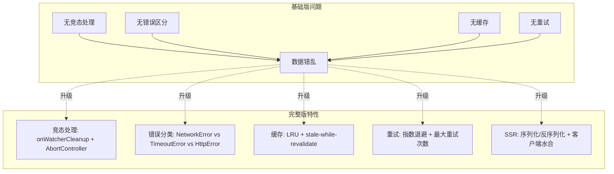

### 从基础到完整的演进

```typescript
// ──── 基础版：只处理 loading/data/error ────
function useAsyncDataBasic<T>(
  fetcher: () => Promise<T>,
  enabled: MaybeRefOrGetter<boolean> = true
) {
  const data = ref<T | null>(null)
  const error = ref<Error | null>(null)
  const loading = ref(false)

  watchEffect(async () => {
    if (!toValue(enabled)) return
    loading.value = true
    error.value = null
    try {
      data.value = await fetcher()
    } catch (e) {
      error.value = e as Error
    } finally {
      loading.value = false
    }
  })

  return { data, error, loading }
}

// ──── 进阶版：加入竞态处理 ────
function useAsyncDataRaceSafe<T>(
  fetcher: (signal: AbortSignal) => Promise<T>,
  enabled: MaybeRefOrGetter<boolean> = true
) {
  const data = ref<T | null>(null)
  const error = ref<Error | null>(null)
  const loading = ref(false)

  watchEffect((onCleanup) => {
    if (!toValue(enabled)) return

    const controller = new AbortController()
    onCleanup(() => controller.abort())

    loading.value = true
    error.value = null

    fetcher(controller.signal)
      .then(result => { data.value = result })
      .catch(e => {
        if (e.name !== 'AbortError') error.value = e
      })
      .finally(() => { loading.value = false })
  })

  return { data, error, loading }
}
```

## 最佳实践

### 命名规范

```typescript
// ✅ 以 use 开头
useMouse()
useFetch()
useLocalStorage()

// ❌ 不以 use 开头
getMouse()  // 看起来像普通函数
handleData() // 看起来像事件处理器
```

### 返回值设计

```typescript
// ✅ 返回 ref 对象，保持响应式
export function useCounter() {
  const count = ref(0)
  return { count, increment: () => count.value++ }
}

// ✅ 需要只读时用 readonly
export function useCounter() {
  const count = ref(0)
  return { count: readonly(count), increment: () => count.value++ }
}

// ❌ 返回普通值（丢失响应式）
export function useCounter() {
  const count = ref(0)
  return { count: count.value } // 静态值！
}
```

### 副作用清理

```typescript
import { onUnmounted } from 'vue'

export function useEventListener(
  target: EventTarget,
  event: string,
  handler: EventListener
) {
  onMounted(() => target.addEventListener(event, handler))
  onUnmounted(() => target.removeEventListener(event, handler))
}
```

### 测试组合式函数

```typescript
import { describe, it, expect } from 'vitest'
import { useCounter } from './useCounter'

describe('useCounter', () => {
  it('should increment', () => {
    const { count, increment } = useCounter()
    expect(count.value).toBe(0)
    increment()
    expect(count.value).toBe(1)
  })
})
```

## 常见陷阱

| 陷阱 | 解决方案 |
|------|---------|
| 返回普通值丢失响应式 | 返回 `ref` / `reactive` |
| 忘记清理副作用 | 在 `onUnmounted` 中清理 |
| 组合式函数中修改 props | 通过 emit 通知父组件 |
| 在条件语句中调用 | 组合式函数必须在 setup 同步阶段调用 |

## 下一步

- [过渡与动画](../03-进阶模式/01-Transition动画系统.md) — 动画效果实现
- [自定义指令](../03-进阶模式/03-自定义指令.md) — DOM 逻辑复用、插件

---

## 高级模式


> 组合式函数是 Vue 3 中复用有状态逻辑的推荐方式。本节聚焦于本文件上半部分未覆盖的高级模式：异步组合式函数、副作用管理、测试和与第三方库的集成。

## 与 Mixin 对比

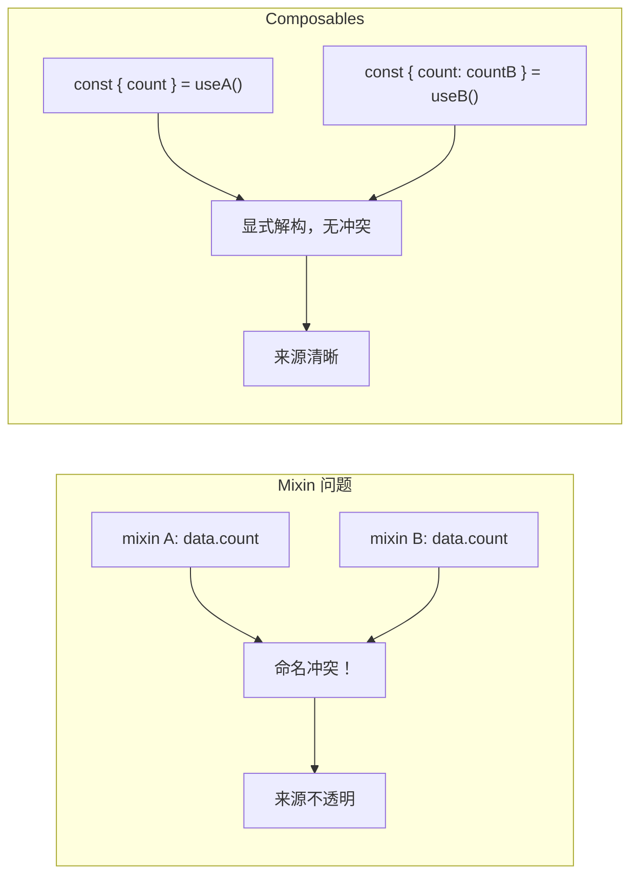

## 副作用管理

### effectScope 批量管理

```typescript
import { effectScope, ref, watch, onScopeDispose } from 'vue'

function useFeatureWithCleanup() {
  const scope = effectScope()
  const data = scope.run(() => {
    const count = ref(0)
    const doubled = ref(0)

    watch(count, (val) => { doubled.value = val * 2 })

    onScopeDispose(() => console.log('所有 effect 已清理'))

    return { count, doubled }
  })!

  return { ...data, dispose: () => scope.stop() }
}
```

### onWatcherCleanup — Vue 3.5+ 竞态处理 <Badge text="Vue 3.5+" type="tip"/>

`onWatcherCleanup` 是 Vue 3.5 引入的 API，用于在 watcher 重新执行或停止时注册清理回调。这在异步场景中处理竞态条件至关重要。

#### 使用示例

```typescript
import { watch, onWatcherCleanup } from 'vue'

function useSearch(query: Ref<string>) {
  const results = ref([])

  watch(query, async (q) => {
    let cancelled = false
    // ★ 当 query 再次变化（导致 watcher 重新执行）时，
    //     或 watcher 被停止时，此回调自动被调用
    onWatcherCleanup(() => { cancelled = true })

    const data = await fetch(`/api/search?q=${q}`)
    // 如果在上面的 fetch 完成期间 query 又变了，
    // cancelled 会被设为 true，结果将被丢弃
    if (!cancelled) results.value = await data.json()
  })

  return { results }
}
```

#### onWatcherCleanup 源码解析

```typescript
// ──── 简化版 Vue 3.5 onWatcherCleanup 实现 ────

// 全局存储当前 watcher 的 cleanup 队列
let currentWatcherCleanup: (() => void)[] | null = null

/**
 * 在 watcher 回调内部调用，注册一个清理函数。
 * 该清理函数会在 watcher 重新执行前或 watcher 停止时被调用。
 *
 * 这是 Vue 3.5 新增的 API，替代了之前需要在回调中手动维护 cancelled 标志的模式。
 */
function onWatcherCleanup(fn: () => void) {
  if (!currentWatcherCleanup) {
    if (__DEV__) {
      console.warn(
        'onWatcherCleanup() 必须在 watch() 或 watchEffect() 的回调函数内同步调用。'
      )
    }
    return
  }
  currentWatcherCleanup.push(fn)
}

// ──── watch 内部实现中如何使用 cleanup ────
function doWatch(
  source: WatchSource | WatchSource[],
  cb: WatchCallback | null,
  options?: WatchOptions
): WatchHandle {
  const cleanup: (() => void)[] = []

  // 执行清理函数（在 watcher 重新执行前调用）
  const runCleanup = () => {
    cleanup.forEach(fn => {
      try { fn() } catch (e) { /* 静默处理 */ }
    })
    cleanup.length = 0
  }

  const job = () => {
    // ★ 步骤1：先执行上次注册的清理函数
    runCleanup()

    // ★ 步骤2：设置当前 watcher 的 cleanup 队列为全局变量
    //     这样在 cb 内部调用 onWatcherCleanup 时就能注册到正确的位置
    currentWatcherCleanup = cleanup

    try {
      // ★ 步骤3：执行 watcher 回调
      //     在回调内部，用户可以调用 onWatcherCleanup(fn) 注册清理逻辑
      const newValue = getValue()
      const oldValue = getOldValue()
      cb?.(newValue, oldValue, onWatcherCleanup) // 也作为参数传入
    } finally {
      // ★ 步骤4：清理全局引用
      currentWatcherCleanup = null
    }
  }

  const runner = (effect: ReactiveEffect) => {
    if (effect.active) job()
  }

  const effect = new ReactiveEffect(getter, scheduler)

  // 注册到 scope
  recordEffectScope(effect)

  // 首次执行
  if (!options?.lazy) effect.run()

  const stop = () => {
    // ★ watcher 停止时也会执行 cleanup
    runCleanup()
    effect.stop()
  }

  return { stop, effect }
}
```

#### 竞态处理：完整模式对比

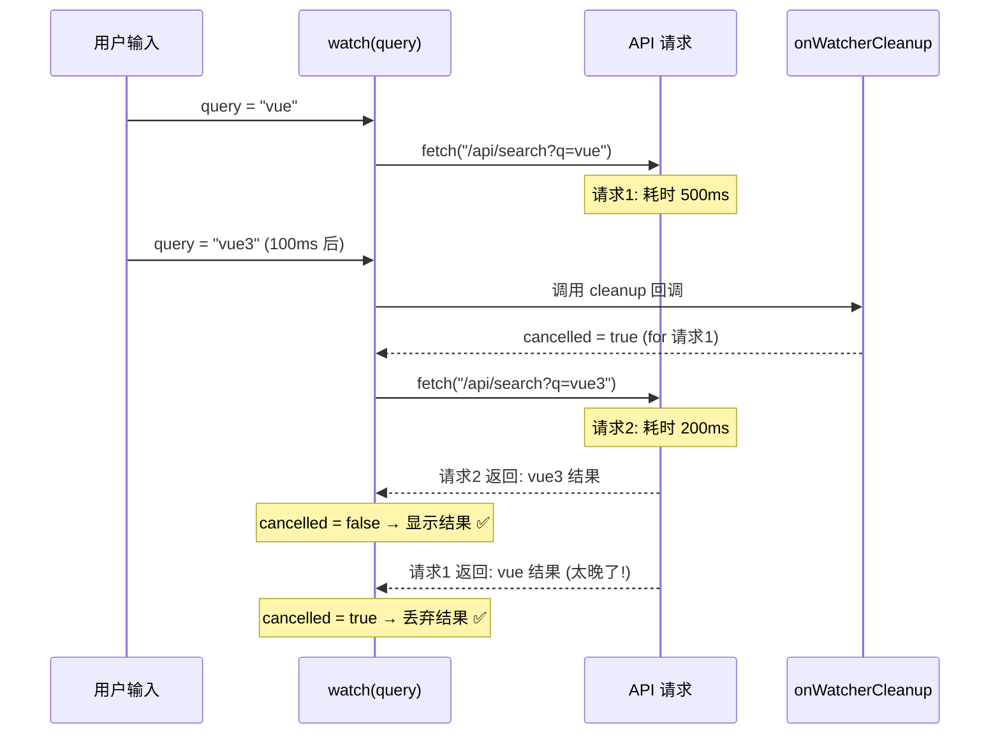

#### onWatcherCleanup vs onScopeDispose 的区别

| API | 触发时机 | 适用场景 |
|-----|---------|---------|
| `onWatcherCleanup` | watcher 重新执行前 / watcher 停止时 | 清理上一次异步操作的副作用（如取消请求） |
| `onScopeDispose` | scope 停止时 | 清理整个 scope 的资源（如断开 WebSocket） |

```typescript
import { effectScope, watch, onWatcherCleanup, onScopeDispose } from 'vue'

export function useLiveSearch(query: Ref<string>) {
  const scope = effectScope()
  const results = ref<SearchResult[]>([])
  const abortController = ref<AbortController>()

  scope.run(() => {
    watch(query, async (newQuery) => {
      // ★ onWatcherCleanup: 用于取消本次异步操作
      onWatcherCleanup(() => {
        abortController.value?.abort()
      })

      const controller = new AbortController()
      abortController.value = controller

      try {
        const res = await fetch(`/api/search?q=${newQuery}`, {
          signal: controller.signal
        })
        results.value = await res.json()
      } catch (e) {
        if (!(e instanceof DOMException && e.name === 'AbortError')) {
          // 真正的错误，非取消导致
        }
      }
    })

    // ★ onScopeDispose: 用于清理整个 scope 的资源
    onScopeDispose(() => {
      abortController.value?.abort()
      results.value = []
    })
  })

  return { results, dispose: () => scope.stop() }
}
```

## 测试组合式函数

```typescript
import { describe, it, expect } from 'vitest'
import { useCounter } from './useCounter'

describe('useCounter', () => {
  it('should increment', () => {
    const { count, increment } = useCounter()
    expect(count.value).toBe(0)
    increment()
    expect(count.value).toBe(1)
  })

  it('should work with initial value', () => {
    const { count } = useCounter(10)
    expect(count.value).toBe(10)
  })
})
```

## 状态管理模式

```typescript
// 1. 单例模式（全局共享状态）
const globalCount = ref(0)

export function useGlobalCount() {
  return { count: readonly(globalCount), increment: () => globalCount.value++ }
}

// 2. 工厂模式（每次调用独立状态）
export function useCounter(initial = 0) {
  const count = ref(initial)
  return { count, increment: () => count.value++ }
}

// 3. 接收外部状态（可控）
export function useCounterState(count: Ref<number>) {
  return { doubled: computed(() => count.value * 2) }
}
```

## 生产级 useFetch：完整实现

以下是一个生产环境可用的 `useFetch` 实现，涵盖缓存策略、重试机制、请求取消、SSR 兼容和完整的 TypeScript 类型安全。

### 架构总览

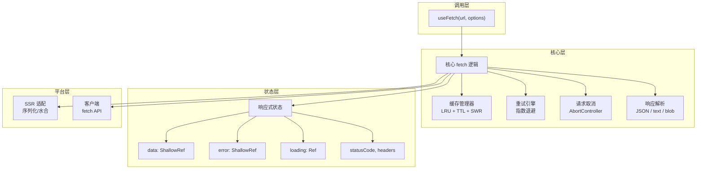

### 类型定义

```typescript
// ──── composables/useFetch.types.ts ────

import type { MaybeRefOrGetter } from 'vue'

// 请求方法
export type HttpMethod = 'GET' | 'POST' | 'PUT' | 'DELETE' | 'PATCH'

// 缓存策略
export interface CacheConfig {
  /** 缓存过期时间（毫秒），默认 5 分钟 */
  ttl?: number
  /** 缓存键生成函数 */
  key?: (url: string, options: FetchOptions) => string
  /** 是否启用 stale-while-revalidate */
  swr?: boolean
  /** 最大缓存条目数 */
  maxSize?: number
}

// 重试配置
export interface RetryConfig {
  /** 最大重试次数 */
  maxRetries?: number
  /** 初始延迟（毫秒） */
  initialDelay?: number
  /** 退避倍数 */
  backoffMultiplier?: number
  /** 最大延迟（毫秒） */
  maxDelay?: number
  /** 可重试的错误判断 */
  retryOn?: (error: Error) => boolean
}

// 请求配置
export interface FetchOptions {
  method?: HttpMethod
  headers?: Record<string, string>
  body?: unknown
  /** 超时时间（毫秒） */
  timeout?: number
  /** 响应类型 */
  responseType?: 'json' | 'text' | 'blob' | 'arrayBuffer'
  /** 缓存配置 */
  cache?: CacheConfig | false
  /** 重试配置 */
  retry?: RetryConfig | false
  /** 是否立即执行 */
  immediate?: boolean
  /** 请求前拦截 */
  beforeFetch?: (ctx: { url: string; options: RequestInit }) => void | Promise<void>
  /** 响应后拦截 */
  afterFetch?: <T>(ctx: { data: T; response: Response }) => T | Promise<T>
  /** 错误处理 */
  onFetchError?: (ctx: { error: Error; data: unknown; response?: Response }) => void
}

// 返回状态
export interface UseFetchReturn<T> {
  data: import('vue').ShallowRef<T | null>
  error: import('vue').ShallowRef<Error | null>
  loading: import('vue').Ref<boolean>
  statusCode: import('vue').Ref<number | null>
  isFinished: import('vue').Ref<boolean>
  execute: (overrideUrl?: string) => Promise<void>
  cancel: () => void
  refresh: () => Promise<void>
}
```

### 缓存管理器

```typescript
// ──── composables/useFetch.cache.ts ────

interface CacheEntry<T = unknown> {
  data: T
  timestamp: number
  ttl: number
  stale: boolean
}

class FetchCache {
  private store = new Map<string, CacheEntry>()
  private maxSize: number
  private accessOrder: string[] = []  // LRU 访问顺序

  constructor(maxSize = 100) {
    this.maxSize = maxSize
  }

  get<T>(key: string, swr = false): T | null {
    const entry = this.store.get(key)
    if (!entry) return null

    const age = Date.now() - entry.timestamp
    const isExpired = age > entry.ttl

    if (isExpired && !swr) {
      this.store.delete(key)
      this.accessOrder = this.accessOrder.filter(k => k !== key)
      return null
    }

    // LRU: 移到队尾
    this.accessOrder = this.accessOrder.filter(k => k !== key)
    this.accessOrder.push(key)

    return entry.data as T
  }

  set<T>(key: string, data: T, ttl: number): void {
    // LRU 淘汰
    while (this.store.size >= this.maxSize) {
      const oldest = this.accessOrder.shift()
      if (oldest) this.store.delete(oldest)
    }

    this.store.set(key, { data, timestamp: Date.now(), ttl, stale: false })
    this.accessOrder.push(key)
  }

  clear(): void {
    this.store.clear()
    this.accessOrder = []
  }

  get size(): number {
    return this.store.size
  }
}

// 全局缓存实例（单例）
const globalFetchCache = new FetchCache(200)
```

### 重试引擎

```typescript
// ──── composables/useFetch.retry.ts ────

import type { RetryConfig } from './useFetch.types'

const defaultRetryConfig: Required<RetryConfig> = {
  maxRetries: 3,
  initialDelay: 1000,
  backoffMultiplier: 2,
  maxDelay: 30000,
  retryOn: (error) => {
    // 默认只重试网络错误和 5xx
    if (error instanceof TypeError) return true  // 网络错误
    if (error.message.includes('5')) return true
    return false
  }
}

export async function withRetry<T>(
  fn: (signal: AbortSignal) => Promise<T>,
  signal: AbortSignal,
  config: RetryConfig = {}
): Promise<T> {
  const cfg = { ...defaultRetryConfig, ...config }
  let lastError: Error
  let delay = cfg.initialDelay

  for (let attempt = 0; attempt <= cfg.maxRetries; attempt++) {
    // 检查是否已取消
    if (signal.aborted) throw new DOMException('Aborted', 'AbortError')

    try {
      return await fn(signal)
    } catch (error) {
      lastError = error as Error

      // 最后一次尝试，不再重试
      if (attempt === cfg.maxRetries) break

      // 检查是否可重试
      if (!cfg.retryOn(lastError)) break

      // 指数退避等待
      await new Promise<void>((resolve, reject) => {
        const timer = setTimeout(resolve, delay)
        // 如果被取消，清除定时器
        const onAbort = () => {
          clearTimeout(timer)
          reject(new DOMException('Aborted', 'AbortError'))
        }
        signal.addEventListener('abort', onAbort, { once: true })
        // 定时器完成时移除监听
        setTimeout(() => signal.removeEventListener('abort', onAbort), delay)
      })

      // 指数退避：delay = min(delay * multiplier, maxDelay)
      delay = Math.min(delay * cfg.backoffMultiplier, cfg.maxDelay)
    }
  }

  throw lastError!
}
```

### 核心实现

```typescript
// ──── composables/useFetch.ts ────

import {
  ref,
  shallowRef,
  isRef,
  watch,
  onUnmounted,
  toValue,
  type MaybeRefOrGetter,
  type ShallowRef,
  type Ref
} from 'vue'
import type { FetchOptions, UseFetchReturn, HttpMethod } from './useFetch.types'
import { globalFetchCache } from './useFetch.cache'
import { withRetry } from './useFetch.retry'

export function useFetch<T = unknown>(
  url: MaybeRefOrGetter<string>,
  options: FetchOptions = {}
): UseFetchReturn<T> {
  // ──── 响应式状态 ────
  const data = shallowRef<T | null>(null) as ShallowRef<T | null>
  const error = shallowRef<Error | null>(null)
  const loading = ref(false)
  const statusCode = ref<number | null>(null)
  const isFinished = ref(false)

  // ──── 内部状态 ────
  let abortController: AbortController | null = null
  let timeoutTimer: ReturnType<typeof setTimeout> | null = null

  // ──── 缓存键生成 ────
  function getCacheKey(): string {
    if (options.cache?.key) {
      return options.cache.key(toValue(url), options)
    }
    return `${options.method ?? 'GET'}:${toValue(url)}:${JSON.stringify(options.body ?? '')}`
  }

  // ──── 核心执行函数 ────
  async function execute(overrideUrl?: string): Promise<void> {
    const targetUrl = overrideUrl ?? toValue(url)

    // 取消上一次请求
    cancel()

    abortController = new AbortController()
    const signal = abortController.signal

    // 超时控制
    if (options.timeout && options.timeout > 0) {
      timeoutTimer = setTimeout(() => abortController!.abort(), options.timeout)
    }

    // ──── 缓存检查 ────
    if (options.cache !== false) {
      const cacheKey = getCacheKey()
      const cached = globalFetchCache.get<T>(cacheKey, options.cache?.swr)
      if (cached !== null) {
        data.value = cached
        isFinished.value = true
        // SWR: 返回缓存数据，同时在后台刷新
        if (options.cache?.swr) {
          fetchAndUpdate(targetUrl, signal, cacheKey).catch(() => {})
        }
        return
      }
    }

    await fetchAndUpdate(targetUrl, signal, getCacheKey())
  }

  async function fetchAndUpdate(
    targetUrl: string,
    signal: AbortSignal,
    cacheKey: string
  ): Promise<void> {
    loading.value = true
    error.value = null
    isFinished.value = false

    try {
      const result = await withRetry(
        async (s) => {
          // 构建请求
          const requestInit: RequestInit = {
            method: options.method ?? 'GET',
            headers: {
              'Content-Type': 'application/json',
              ...options.headers
            },
            signal: s
          }

          if (options.body && options.method !== 'GET') {
            requestInit.body = JSON.stringify(options.body)
          }

          // 请求前拦截
          if (options.beforeFetch) {
            await options.beforeFetch({ url: targetUrl, options: requestInit })
          }

          const response = await fetch(targetUrl, requestInit)
          statusCode.value = response.status

          if (!response.ok) {
            throw new Error(`HTTP ${response.status}: ${response.statusText}`)
          }

          // 解析响应
          let parsed: T
          switch (options.responseType) {
            case 'text':
              parsed = await response.text() as unknown as T
              break
            case 'blob':
              parsed = await response.blob() as unknown as T
              break
            case 'arrayBuffer':
              parsed = await response.arrayBuffer() as unknown as T
              break
            default:
              parsed = await response.json() as T
          }

          // 响应后拦截
          if (options.afterFetch) {
            parsed = await options.afterFetch({ data: parsed, response })
          }

          return parsed
        },
        signal,
        options.retry ?? undefined
      )

      data.value = result

      // 写入缓存
      if (options.cache !== false) {
        globalFetchCache.set(cacheKey, result, options.cache?.ttl ?? 5 * 60 * 1000)
      }
    } catch (e) {
      if (e instanceof DOMException && e.name === 'AbortError') return

      const err = e as Error
      error.value = err
      options.onFetchError?.({ error: err, data: data.value, response: undefined })
    } finally {
      loading.value = false
      isFinished.value = true
      clearTimeout(timeoutTimer!)
      timeoutTimer = null
    }
  }

  // ──── 取消请求 ────
  function cancel(): void {
    abortController?.abort()
    clearTimeout(timeoutTimer!)
    timeoutTimer = null
  }

  // ──── 刷新（跳过缓存）────
  async function refresh(): Promise<void> {
    if (options.cache !== false) {
      globalFetchCache.get(getCacheKey()) // 清除缓存
    }
    await execute()
  }

  // ──── 监听 URL 变化 ────
  if (isRef(url) || typeof url === 'function') {
    watch(
      () => toValue(url),
      () => {
        if (options.immediate !== false) execute()
      },
      { immediate: options.immediate !== false }
    )
  } else if (options.immediate !== false) {
    // 静态 URL，立即执行
    execute()
  }

  // ──── 组件卸载时清理 ────
  onUnmounted(() => cancel())

  return {
    data,
    error,
    loading,
    statusCode,
    isFinished,
    execute,
    cancel,
    refresh
  }
}
```

### 使用示例

```typescript
// ──── 基础用法 ────
const { data, error, loading, refresh } = useFetch<User[]>('/api/users')

// ──── 带缓存和重试 ────
const { data: posts } = useFetch<Post[]>(
  () => `/api/posts?page=${currentPage.value}`,
  {
    cache: { ttl: 60_000, swr: true, maxSize: 50 },
    retry: { maxRetries: 3, initialDelay: 500 }
  }
)

// ──── POST 请求 ────
const { execute, loading } = useFetch<User>('/api/users', {
  method: 'POST',
  immediate: false  // 不自动执行
})

async function createUser(userData: CreateUserDTO) {
  await execute()  // 手动触发
}
```

### SSR 兼容性

```typescript
// ──── SSR 适配层 ────
// Vue 未导出 isServer，通常用以下方式判断 SSR 环境：
const isServer = typeof window === 'undefined'

// 服务端渲染时，数据需要序列化到客户端
export function useFetchSSR<T>(
  url: MaybeRefOrGetter<string>,
  options: FetchOptions = {}
) {
  const result = useFetch<T>(url, options)

  if (isServer) {
    // 服务端：使用 useAsyncData 或 useFetch 的 SSR 模式
    // Nuxt 的 useFetch 会自动处理 SSR 数据传输
    // 手动实现：
    // 1. 服务端执行 fetch
    // 2. 将结果序列化到 __NUXT__ 或 window.__INITIAL_STATE__
    // 3. 客户端水合时读取初始数据
  }

  return result
}

// ──── 类型安全的请求/响应 ────
interface User {
  id: number
  name: string
  email: string
}

interface CreateUserDTO {
  name: string
  email: string
}

// ★ 完整的类型推导
const { data } = useFetch<User>('/api/user/1')
// data.value 类型: User | null

const { execute } = useFetch<User>('/api/users', {
  method: 'POST',
  body: { name: 'Alice', email: 'alice@example.com' } satisfies CreateUserDTO,
  immediate: false
})
```

## 与 React Hooks 的深度对比

Vue 3 的组合式函数和 React Hooks 都是解决"有状态逻辑复用"的方案，但底层机制截然不同。理解差异有助于在两个框架间迁移或同时使用。

### 核心差异：依赖追踪 vs 依赖数组

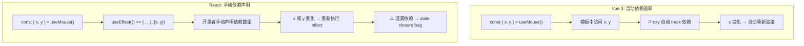

### 详细对比表

| 维度 | Vue 3 Composables | React Hooks |
|------|------------------|-------------|
| **响应式追踪** | Proxy 自动收集依赖 | 手动声明依赖数组 |
| **调用位置限制** | 必须在 `setup` 同步阶段 | 必须在组件顶层，不能条件调用 |
| **重渲染粒度** | 组件级（模板编译优化后精确到节点） | 组件级（需 `React.memo` 手动优化） |
| **执行次数** | `setup()` 只执行一次 | 每次渲染都重新执行 |
| **闭包陷阱** | 无（ref 是引用，始终拿到最新值） | 有（stale closure，需 `useRef` 或 eslint 规则） |
| **清理机制** | `onUnmounted` / `onWatcherCleanup` / `effectScope` | `useEffect` 返回清理函数 |
| **状态管理** | `ref` / `reactive` 可变 | `useState` 不可变（每次新对象） |
| **条件逻辑** | 支持（`if (enabled) watch(...)`） | 不支持（hooks 规则：不能条件调用） |

### 闭包陷阱对比

```typescript
// ──── React: stale closure 问题 ────
function useIntervalReact(callback: () => void, delay: number) {
  const savedCallback = useRef(callback)

  useEffect(() => {
    savedCallback.current = callback  // ★ 必须用 ref 保存最新回调
  }, [callback])

  useEffect(() => {
    const id = setInterval(() => savedCallback.current(), delay)
    return () => clearInterval(id)
  }, [delay])  // ★ 依赖数组不能包含 callback，否则频繁重建
}

// ──── Vue 3: 无闭包陷阱 ────
function useInterval(callback: () => void, delay: number) {
  let timer: ReturnType<typeof setInterval>

  // ★ watchEffect 自动追踪，无需手动声明依赖
  watchEffect(() => {
    clearInterval(timer)
    timer = setInterval(callback, delay)
  })

  onUnmounted(() => clearInterval(timer))
}
```

### 调用位置限制对比

```typescript
// ──── React: 严格限制 ────
function MyComponent({ enabled }: { enabled: boolean }) {
  // ❌ 不能在条件语句中调用 hooks
  // if (enabled) {
  //   const data = useFetch('/api/data')  // 违反 hooks 规则！
  // }

  // ✅ 必须始终调用，在内部处理条件
  const { data } = useFetch(enabled ? '/api/data' : null)
  return <div>{data}</div>
}

// ──── Vue 3: 灵活的条件调用 ────
const props = defineProps<{ enabled: boolean }>()

// ✅ 可以在条件中使用
if (props.enabled) {
  const { data } = useFetch('/api/data')
  // 只有 enabled 为 true 时才创建这些响应式状态
}

// ✅ 也可以在 watchEffect 内部条件判断
watchEffect(() => {
  if (props.enabled) {
    // 条件性地执行副作用
  }
})
```

### 重渲染机制对比

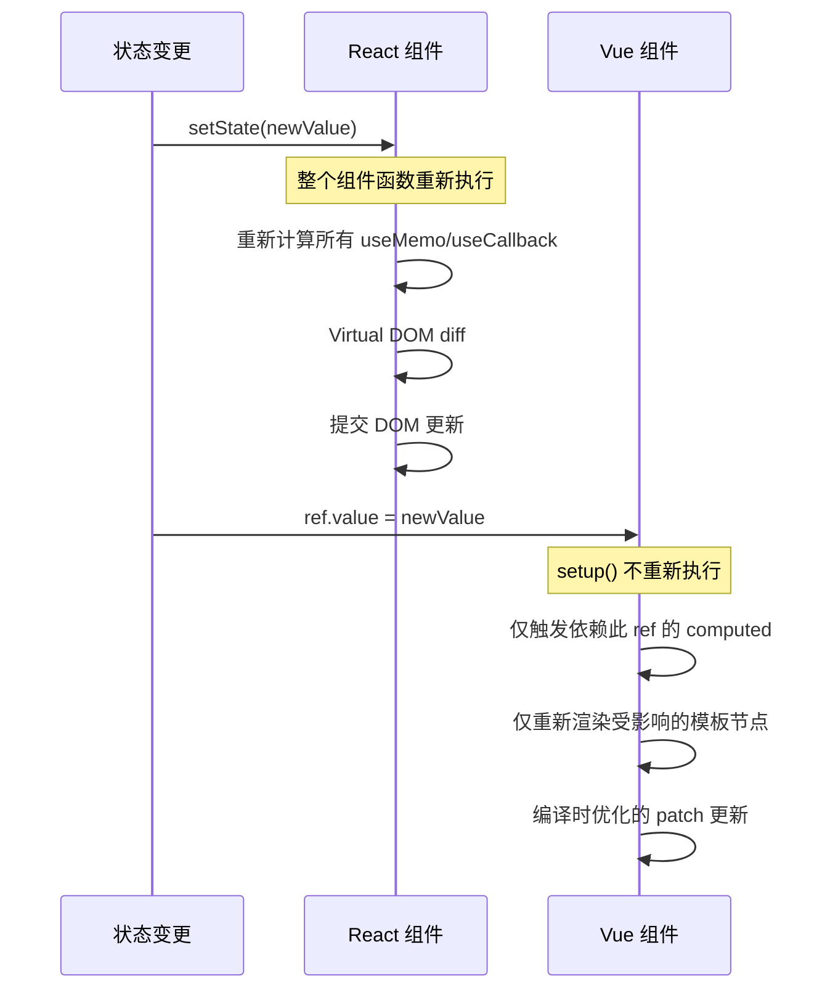

```typescript
// ──── 性能影响示例 ────

// React: 每次渲染都创建新对象
function useMouseReact() {
  const [position, setPosition] = useState({ x: 0, y: 0 })
  // position 每次 setState 都是新对象
  // 依赖 position 的 useEffect 都会重新执行
  return position
}

// Vue 3: ref 保持引用稳定
function useMouse() {
  const x = ref(0)
  const y = ref(0)
  // x 和 y 始终是同一个 ref 对象
  // 只有 .value 变化时才触发更新
  return { x, y }
}
```

### 互操作性：在 Vue 中使用 React 思维

```typescript
// ──── 如果你从 React 迁移到 Vue ────

// React 思维（在 Vue 中不需要）
// ❌ 不需要 useMemo
const expensive = computed(() => heavyComputation(props.list))
// ❌ 不需要 useCallback
function handleClick() { /* Vue 中函数引用稳定 */ }
// ❌ 不需要依赖数组
watch([a, b], ([newA, newB]) => { /* 显式声明，但可选 */ })

// Vue 思维
// ✅ computed 自动缓存，仅在依赖变化时重新计算
const expensive = computed(() => heavyComputation(props.list))
// ✅ 函数引用天然稳定
function handleClick() { /* ... */ }
// ✅ watchEffect 自动追踪，无需依赖数组
watchEffect(() => { console.log(a.value, b.value) })
```

### 迁移指南：React Hook → Vue Composable

```typescript
// ──── React ────
function useWindowSizeReact() {
  const [size, setSize] = useState({ width: 0, height: 0 })

  useEffect(() => {
    function handler() {
      setSize({ width: window.innerWidth, height: window.innerHeight })
    }
    window.addEventListener('resize', handler)
    handler()
    return () => window.removeEventListener('resize', handler)
  }, [])  // ★ 空依赖数组 = 只在挂载时执行

  return size
}

// ──── Vue 3 等价实现 ────
function useWindowSize() {
  const width = ref(window.innerWidth)
  const height = ref(window.innerHeight)

  function handler() {
    width.value = window.innerWidth
    height.value = window.innerHeight
  }

  onMounted(() => window.addEventListener('resize', handler))
  onUnmounted(() => window.removeEventListener('resize', handler))

  return { width, height }
  // ★ 返回 ref，不是普通对象
  // ★ 无需依赖数组，onMounted/onUnmounted 语义更清晰
}
```

### 选择建议

| 场景 | 推荐 |
|------|------|
| 需要自动依赖追踪，减少心智负担 | Vue 3 Composables |
| 需要显式控制副作用执行时机 | React Hooks（但 Vue 的 `watch` 也支持） |
| 大量条件性逻辑 | Vue 3（支持条件调用） |
| 函数式编程风格 | React Hooks（每次渲染都是纯函数调用） |
| 性能敏感场景 | Vue 3（更细粒度的更新） |

## 检查清单

- ✅ 命名以 `use` 开头
- ✅ 返回 `ref`/`reactive`，不返回普通值
- ✅ 在 `onUnmounted` 中清理副作用
- ✅ 使用 `readonly` 保护内部状态
- ✅ 考虑单例 vs 工厂模式
- ✅ 编写单元测试

## 下一步

- [自定义指令](../03-进阶模式/03-自定义指令.md) — DOM 操作复用