# Transition动画系统

> 使用 `<Transition>` 组件为元素添加进入和离开动画。Vue 提供 CSS 和 JavaScript 两种动画方式，并可配合第三方库（GSAP、Motion 等）。
>
> **适用于 Vue 3 全系版本** | 支持 `appear`、`mode`、JavaScript 钩子

## Transition 工作原理

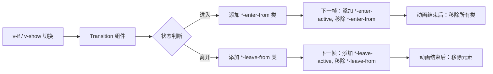

## CSS 过渡

```vue
<template>
  <button @click="show = !show">Toggle</button>

  <Transition name="fade">
    <p v-if="show">Hello Vue</p>
  </Transition>
</template>

<style>
.fade-enter-active,
.fade-leave-active { transition: opacity 0.5s ease; }
.fade-enter-from,
.fade-leave-to { opacity: 0; }
</style>
```

## CSS Animation

```vue
<template>
  <Transition name="bounce">
    <p v-if="show" class="box">Bounce</p>
  </Transition>
</template>

<style>
.bounce-enter-active { animation: bounce-in 0.5s; }
.bounce-leave-active { animation: bounce-in 0.5s reverse; }

@keyframes bounce-in {
  0% { transform: scale(0); opacity: 0; }
  50% { transform: scale(1.25); }
  100% { transform: scale(1); opacity: 1; }
}
</style>
```

## Transition 属性

| 属性 | 类型 | 默认 | 说明 |
|------|------|------|------|
| `name` | `string` | `'v'` | CSS 类名前缀 |
| `appear` | `boolean` | `false` | 初始渲染时应用动画 |
| `mode` | `'in-out' \| 'out-in'` | — | 切换模式 |
| `css` | `boolean` | `true` | 是否使用 CSS 过渡 |
| `duration` | `number \| object` | — | 显式指定时长 |
| `enterFromClass` | `string` | — | 自定义进入起始类 |
| `leaveToClass` | `string` | — | 自定义离开结束类 |

### mode 详解

```vue
<template>
  <!-- out-in：旧元素先离开，新元素再进入（推荐） -->
  <Transition name="fade" mode="out-in">
    <component :is="currentView" />
  </Transition>

  <!-- in-out：新元素先进来，旧元素再离开 -->
  <Transition name="fade" mode="in-out">
    <component :is="currentView" />
  </Transition>
</template>
```

## JavaScript 钩子

```vue
<script setup lang="ts">
import { ref } from 'vue'

const show = ref(true)

function onEnter(el: Element, done: () => void) {
  const anim = el.animate(
    [{ opacity: 0, transform: 'scale(0.9)' }, { opacity: 1, transform: 'scale(1)' }],
    { duration: 300, easing: 'ease-out', fill: 'forwards' }
  )
  anim.onfinish = done
}

function onLeave(el: Element, done: () => void) {
  const anim = el.animate(
    [{ opacity: 1 }, { opacity: 0 }],
    { duration: 200, easing: 'ease-in', fill: 'forwards' }
  )
  anim.onfinish = done
}
</script>

<template>
  <Transition :css="false" @enter="onEnter" @leave="onLeave">
    <div v-if="show" class="box">JS 动画</div>
  </Transition>
</template>
```

### 钩子列表

| 钩子 | 参数 | 调用时机 |
|------|------|---------|
| `before-enter` | `(el)` | 进入动画开始前 |
| `enter` | `(el, done)` | 进入动画开始时 |
| `after-enter` | `(el)` | 进入动画结束时 |
| `enter-cancelled` | `(el)` | 进入动画取消时 |
| `before-leave` | `(el)` | 离开动画开始前 |
| `leave` | `(el, done)` | 离开动画开始时 |
| `after-leave` | `(el)` | 离开动画结束时 |
| `leave-cancelled` | `(el)` | 离开动画取消时 |

## JavaScript 钩子完整时序

Transition 组件的 JavaScript 钩子遵循严格的调用顺序。理解钩子间的时序关系对于协调复杂的入场/出场动画至关重要。

### enter 生命周期时序图

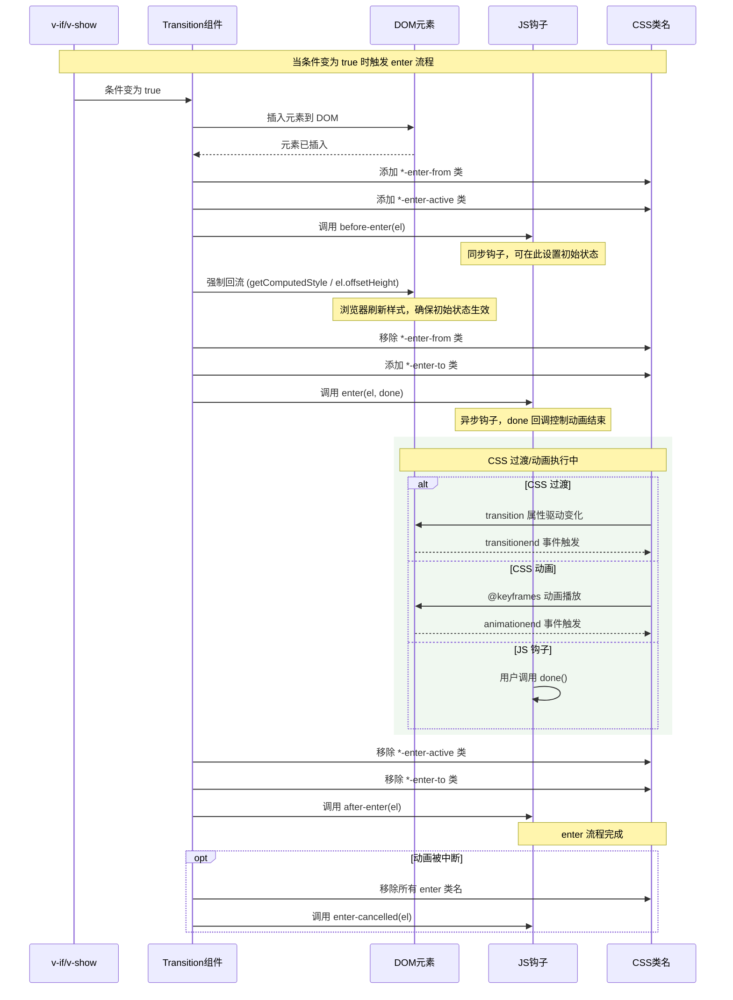

### leave 生命周期时序图

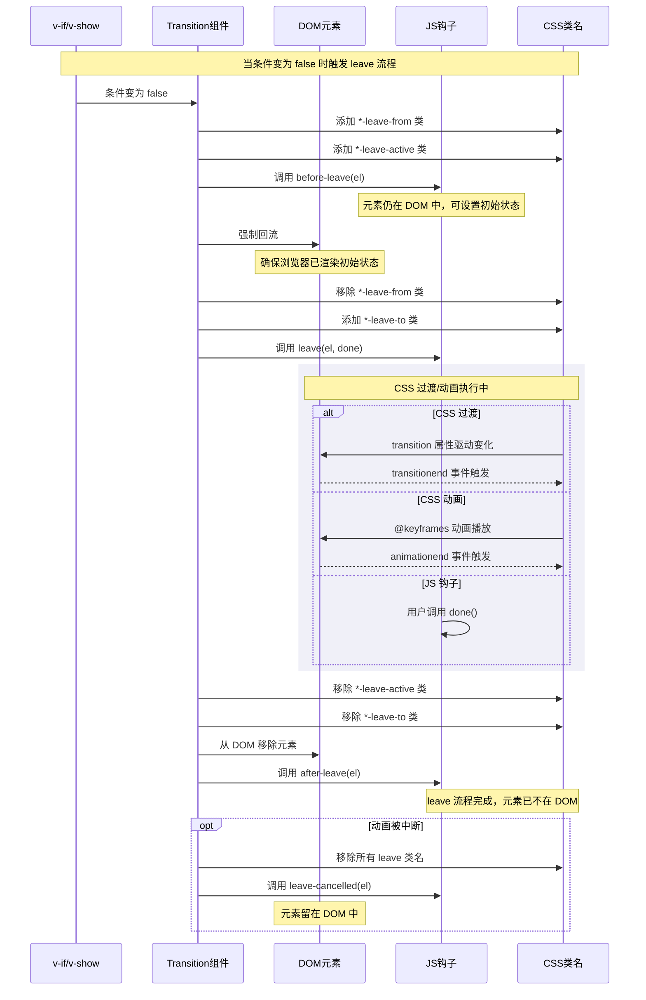

### 钩子取消机制

在以下场景中，动画会被取消：

1. **enter 动画进行中，条件变为 false**：触发 `enter-cancelled`，然后启动 `leave` 流程
2. **leave 动画进行中，条件变为 true**：触发 `leave-cancelled`，然后启动 `enter` 流程
3. **mode="out-in" 时新元素进入前旧元素离开被中断**：旧元素 `leave-cancelled`，新元素进入

```typescript
// 简化版 Transition 核心状态机实现
type TransitionState = 'idle' | 'entering' | 'leaving'

interface TransitionContext {
  state: TransitionState
  el: Element | null
  pendingCallback: (() => void) | null
}

function createTransitionContext(): TransitionContext {
  let ctx: TransitionContext = {
    state: 'idle',
    el: null,
    pendingCallback: null
  }

  function enter(el: Element, hooks: TransitionHooks) {
    // 如果之前有离开动画，先取消
    if (ctx.state === 'leaving') {
      cancelLeave()
    }

    ctx.state = 'entering'
    ctx.el = el

    // 1. 添加初始类名
    addClass(el, 'enter-from')
    addClass(el, 'enter-active')

    // 2. before-enter 钩子
    hooks.onBeforeEnter?.(el)

    // 3. 强制回流，确保浏览器注册初始状态
    forceReflow(el)

    // 4. 移除 from，添加 to，启动动画
    removeClass(el, 'enter-from')
    addClass(el, 'enter-to')

    // 5. enter 钩子（用户调用 done 或等待 transitionend/animationend）
    hooks.onEnter?.(el, () => {
      finishEnter(el)
    })

    // 监听 CSS 结束事件作为 fallback
    const onEnd = (e: TransitionEvent | AnimationEvent) => {
      if (e.target === el) {
        el.removeEventListener('transitionend', onEnd)
        el.removeEventListener('animationend', onEnd)
        finishEnter(el)
      }
    }
    el.addEventListener('transitionend', onEnd)
    el.addEventListener('animationend', onEnd)
  }

  function finishEnter(el: Element) {
    removeClass(el, 'enter-active')
    removeClass(el, 'enter-to')
    ctx.state = 'idle'
    hooks.onAfterEnter?.(el)
  }

  function cancelEnter() {
    if (ctx.state !== 'entering' || !ctx.el) return
    removeClass(ctx.el, 'enter-active')
    removeClass(ctx.el, 'enter-to')
    hooks.onEnterCancelled?.(ctx.el)
    ctx.state = 'idle'
  }

  function leave(el: Element, hooks: TransitionHooks) {
    if (ctx.state === 'entering') {
      cancelEnter()
    }

    ctx.state = 'leaving'
    ctx.el = el

    addClass(el, 'leave-from')
    addClass(el, 'leave-active')

    hooks.onBeforeLeave?.(el)

    forceReflow(el)

    removeClass(el, 'leave-from')
    addClass(el, 'leave-to')

    hooks.onLeave?.(el, () => {
      finishLeave(el)
    })

    const onEnd = (e: TransitionEvent | AnimationEvent) => {
      if (e.target === el) {
        el.removeEventListener('transitionend', onEnd)
        el.removeEventListener('animationend', onEnd)
        finishLeave(el)
      }
    }
    el.addEventListener('transitionend', onEnd)
    el.addEventListener('animationend', onEnd)
  }

  function finishLeave(el: Element) {
    removeClass(el, 'leave-active')
    removeClass(el, 'leave-to')
    // 从父节点移除
    el.parentNode?.removeChild(el)
    ctx.state = 'idle'
    hooks.onAfterLeave?.(el)
  }

  function cancelLeave() {
    if (ctx.state !== 'leaving' || !ctx.el) return
    removeClass(ctx.el, 'leave-active')
    removeClass(ctx.el, 'leave-to')
    hooks.onLeaveCancelled?.(ctx.el)
    ctx.state = 'idle'
  }

  function forceReflow(el: Element): void {
    // 读取 offsetHeight 强制浏览器计算样式
    void (el as HTMLElement).offsetHeight
  }

  return { enter, leave, cancelEnter, cancelLeave }
}

interface TransitionHooks {
  onBeforeEnter?: (el: Element) => void
  onEnter?: (el: Element, done: () => void) => void
  onAfterEnter?: (el: Element) => void
  onEnterCancelled?: (el: Element) => void
  onBeforeLeave?: (el: Element) => void
  onLeave?: (el: Element, done: () => void) => void
  onAfterLeave?: (el: Element) => void
  onLeaveCancelled?: (el: Element) => void
}

function addClass(el: Element, suffix: string, prefix: string = 'v') {
  el.classList.add(`${prefix}-${suffix}`)
}

function removeClass(el: Element, suffix: string, prefix: string = 'v') {
  el.classList.remove(`${prefix}-${suffix}`)
}
```

### 关键时序要点

| 要点 | 说明 |
|------|------|
| `before-enter` | 同步调用，元素已插入 DOM 但尚未开始动画，适合设置初始状态 |
| `enter` 与 done | 异步钩子，必须调用 `done()` 通知 Transition 动画结束；不调用时依赖 CSS 事件 |
| 强制回流 | `getComputedStyle` 或 `offsetHeight` 确保浏览器在移除 from 类名前渲染初始帧 |
| `transitionend` 重复触发 | 若元素有多个过渡属性，`transitionend` 会多次触发，需检查 `e.target === el` |
| `enter-cancelled` | enter 被打断时触发，可用于清理 GSAP 等第三方动画实例 |
| `after-leave` | 此时元素已从 DOM 移除，适合做后续清理（如焦点管理） |

### done 回调的两种模式

```typescript
// 模式 1：显式调用 done（推荐用于 JS 动画）
function onEnter(el: Element, done: () => void) {
  const anim = el.animate(
    [{ opacity: 0 }, { opacity: 1 }],
    { duration: 300 }
  )
  // 动画结束 → 调用 done → Transition 清理类名
  anim.onfinish = () => done()
}

// 模式 2：不调用 done，依赖 CSS transitionend/animationend
// 仅适用于纯 CSS 过渡，此时 Transition 自动监听事件
function onEnter(el: Element, done: () => void) {
  // 仅做初始化，不调用 done
  // Transition 会自行监听 transitionend/animationend
  el.classList.add('custom-enter-active')
}
```

## GSAP 深度集成最佳实践

GSAP (GreenSock Animation Platform) 是业界最强大的 JavaScript 动画库，在 Vue 3 中有多种集成模式。以下涵盖时间线编排、滚动触发、SVG 动画和生产级模式。

### 架构概览

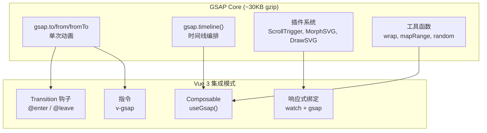

### 1. 时间线 (Timeline) 编排

Timeline 是 GSAP 最强大的特性，可将多个动画编排为有序序列，支持精确的时间控制和标签。

```vue
<script setup lang="ts">
import { ref, reactive, onMounted, onUnmounted } from 'vue'
import gsap from 'gsap'

const containerRef = ref<HTMLElement | null>(null)
const box1Ref = ref<HTMLElement | null>(null)
const box2Ref = ref<HTMLElement | null>(null)
const box3Ref = ref<HTMLElement | null>(null)

interface TimelineState {
  tl: gsap.core.Timeline | null
  isPlaying: boolean
  progress: number
}

const state = reactive<TimelineState>({
  tl: null,
  isPlaying: false,
  progress: 0
})

onMounted(() => {
  if (!box1Ref.value || !box2Ref.value || !box3Ref.value) return

  // 创建主时间线
  const masterTL = gsap.timeline({
    paused: true,
    repeat: -1,          // 无限循环
    yoyo: true,          // 往返播放
    onUpdate: () => {
      state.progress = masterTL.progress()
    }
  })

  // 添加标签作为时间点标记
  masterTL.addLabel('start')
    // 阶段 1：box1 入场 (0s → 0.5s)
    .from(box1Ref.value, {
      opacity: 0, x: -100, duration: 0.5, ease: 'power2.out'
    })
    // 阶段 2：box1 和 box2 交叉动画 (0.3s → 0.8s)
    .from(box2Ref.value, {
      opacity: 0, y: 50, duration: 0.5, ease: 'back.out(1.7)'
    }, '-=0.2') // 提前 0.2s 开始（与前一个动画重叠）
    .addLabel('midpoint')
    // 阶段 3：box2 缩放 + box3 旋转入场 (0.6s → 1.2s)
    .to(box2Ref.value, {
      scale: 1.2, duration: 0.3, ease: 'power1.inOut'
    }, '-=0.3')
    .from(box3Ref.value, {
      opacity: 0, rotation: 180, scale: 0, duration: 0.6,
      ease: 'elastic.out(1, 0.5)'
    }, '-=0.2')
    // 阶段 4：全部元素闪烁 (1.0s → 1.5s)
    .to([box1Ref.value, box2Ref.value, box3Ref.value], {
      boxShadow: '0 0 20px rgba(66,184,131,0.8)',
      duration: 0.5,
      repeat: 3,
      yoyo: true,
      ease: 'sine.inOut'
    })
    .addLabel('complete')

  state.tl = masterTL
})

function play() { state.tl?.play(); state.isPlaying = true }
function pause() { state.tl?.pause(); state.isPlaying = false }
function reverse() { state.tl?.reverse(); state.isPlaying = state.tl?.reversed() === false }
function seek(progress: number) {
  state.tl?.progress(progress)
  state.progress = progress
}

onUnmounted(() => {
  state.tl?.kill() // 清理所有动画
})
</script>

<template>
  <div ref="containerRef" class="timeline-demo">
    <div ref="box1Ref" class="box box-1">1</div>
    <div ref="box2Ref" class="box box-2">2</div>
    <div ref="box3Ref" class="box box-3">3</div>
  </div>
  <div class="controls">
    <button @click="play" :disabled="state.isPlaying">播放</button>
    <button @click="pause" :disabled="!state.isPlaying">暂停</button>
    <button @click="reverse">反转</button>
    <input
      type="range" min="0" max="1" step="0.01"
      :value="state.progress"
      @input="seek(parseFloat(($event.target as HTMLInputElement).value))"
    />
  </div>
</template>
```

### 2. 滚动触发动画 (ScrollTrigger)

```typescript
// ── useScrollTrigger Composable ──

import { ref, onMounted, onUnmounted, type Ref } from 'vue'
import gsap from 'gsap'
import { ScrollTrigger } from 'gsap/ScrollTrigger'

gsap.registerPlugin(ScrollTrigger)

interface ScrollTriggerOptions {
  trigger?: Ref<HTMLElement | null> | string
  start?: string       // 触发起始点，如 'top 80%'
  end?: string         // 触发结束点，如 'bottom 20%'
  scrub?: boolean | number  // 是否跟随滚动，数字表示延迟秒数
  markers?: boolean    // 调试标记
  pin?: boolean        // 固定元素
  toggleActions?: string // 'play pause resume reverse'
}

interface ScrollAnimationResult {
  /** 清理所有 ScrollTrigger 实例 */
  cleanup: () => void
  /** 刷新所有 ScrollTrigger */
  refresh: () => void
}

function useScrollTrigger(
  animation: (trigger: HTMLElement) => gsap.core.Timeline | gsap.core.Tween,
  options: ScrollTriggerOptions = {}
): ScrollAnimationResult {
  const triggers: ScrollTrigger[] = []

  function initScrollTrigger(el: HTMLElement) {
    const tl = animation(el)

    const st = ScrollTrigger.create({
      trigger: el,
      start: options.start ?? 'top 80%',
      end: options.end ?? 'bottom 20%',
      scrub: options.scrub ?? false,
      markers: options.markers ?? false,
      pin: options.pin ?? false,
      toggleActions: options.toggleActions ?? 'play none none reverse',
      animation: tl,
    })

    triggers.push(st)
  }

  onMounted(() => {
    // 解析 trigger 选项（支持 Ref 或选择器字符串）
    const el = typeof options.trigger === 'string'
      ? document.querySelector<HTMLElement>(options.trigger)
      : options.trigger?.value
    if (el) initScrollTrigger(el)
  })

  onUnmounted(cleanup)

  return {
    cleanup: () => {
      triggers.forEach(st => st.kill())
      triggers.length = 0
    },
    refresh: () => ScrollTrigger.refresh()
  }
}

// ── 使用示例：视差滚动列表 ──
// 文件：components/ParallaxList.vue
export function useParallaxList() {
  const { cleanup, refresh } = useScrollTrigger((trigger) => {
    // 获取触发器内的子元素
    const items = trigger.querySelectorAll('.parallax-item')

    return gsap.timeline({
      scrollTrigger: {
        trigger,
        start: 'top bottom',
        end: 'bottom top',
        scrub: 0.5, // 0.5s 的延迟跟随
      }
    })
    .from(items, {
      y: 100,
      opacity: 0,
      stagger: 0.15,  // 每个元素延迟 0.15s
      duration: 1,
      ease: 'power2.out'
    })
  })

  return { cleanup, refresh }
}

// ── 使用示例：滚动驱动的进度条 ──
function useScrollProgress(
  containerRef: Ref<HTMLElement | null>,
  progressRef: Ref<HTMLElement | null>
) {
  onMounted(() => {
    if (!containerRef.value || !progressRef.value) return

    gsap.to(progressRef.value, {
      scaleX: 1,
      transformOrigin: 'left center',
      ease: 'none',
      scrollTrigger: {
        trigger: containerRef.value,
        start: 'top top',
        end: 'bottom bottom',
        scrub: true,
      }
    })
  })
}
```

### 3. SVG 动画

GSAP 对 SVG 动画有深度支持，包括路径变形 (MorphSVG)、描边动画 (DrawSVG) 和运动路径 (MotionPath)。

```vue
<script setup lang="ts">
import { ref, onMounted, onUnmounted } from 'vue'
import gsap from 'gsap'
import { DrawSVGPlugin } from 'gsap/DrawSVGPlugin'
import { MorphSVGPlugin } from 'gsap/MorphSVGPlugin'
import { MotionPathPlugin } from 'gsap/MotionPathPlugin'

gsap.registerPlugin(DrawSVGPlugin, MorphSVGPlugin, MotionPathPlugin)

const svgRef = ref<SVGSVGElement | null>(null)
const pathRef = ref<SVGPathElement | null>(null)
const circleRef = ref<SVGCircleElement | null>(null)
const morphPathRef = ref<SVGPathElement | null>(null)

interface SVGAnimationState {
  tl: gsap.core.Timeline | null
}

const svgState = reactive<SVGAnimationState>({ tl: null })

onMounted(() => {
  if (!svgRef.value || !pathRef.value || !circleRef.value || !morphPathRef.value) return

  const tl = gsap.timeline({ repeat: -1, yoyo: true })

  // 1. 描边动画 (DrawSVG) — 线稿绘制效果
  tl.from(pathRef.value, {
    drawSVG: '0%',           // 从 0% 开始描边
    duration: 2,
    ease: 'power2.inOut'
  })

  // 2. 路径变形 (MorphSVG) — 形状变换
  tl.to(morphPathRef.value, {
    morphSVG: '#target-path', // 变形为目标路径
    duration: 1.5,
    ease: 'elastic.out(1, 0.4)'
  }, '-=0.5')

  // 3. 沿路径运动 (MotionPath)
  tl.to(circleRef.value, {
    motionPath: {
      path: '#motion-guide',
      align: '#motion-guide',
      autoRotate: true,
    },
    duration: 3,
    ease: 'power1.inOut'
  }, '-=2')

  // 4. SVG 属性动画
  tl.to(circleRef.value, {
    attr: { r: 15, fill: '#ff6b6b' },
    duration: 0.5,
    ease: 'power2.out'
  }, '-=1.5')

  svgState.tl = tl
})

onUnmounted(() => {
  svgState.tl?.kill()
})

// 路径数据
const startPath = 'M10,50 Q50,10 90,50 T170,50'
const targetPath = 'M10,80 C40,20 70,80 90,30 S140,80 170,50'
</script>

<template>
  <svg ref="svgRef" viewBox="0 0 200 200" width="400" height="400"
       xmlns="http://www.w3.org/2000/svg">

    <!-- 隐藏的参考路径 -->
    <defs>
      <path id="target-path" :d="targetPath" fill="none" />
    </defs>

    <!-- 运动路径（可见） -->
    <path id="motion-guide"
          d="M50,180 C50,50 150,50 150,180"
          fill="none" stroke="#ddd" stroke-width="1"
          stroke-dasharray="5,5" />

    <!-- 描边动画目标 -->
    <path ref="pathRef"
          :d="startPath"
          fill="none" stroke="#42b883" stroke-width="3"
          stroke-linecap="round" />

    <!-- 变形路径 -->
    <path ref="morphPathRef"
          d="M50,50 L150,50 L150,150 L50,150 Z"
          fill="none" stroke="#1890ff" stroke-width="2" />

    <!-- 运动元素 -->
    <circle ref="circleRef" cx="50" cy="180" r="8" fill="#42b883" />
  </svg>
</template>
```

### 4. GSAP 与 Vue Transition 的生产级集成模式

```typescript
// ── composables/useGsapTransition.ts ──

import { type Ref } from 'vue'
import gsap from 'gsap'

/**
 * GSAP 与 Vue Transition 的标准化集成
 *
 * 核心原则：
 * 1. :css="false" — 禁用 CSS 过渡，完全由 GSAP 接管
 * 2. 存储动画实例 — onEnterCancelled/onLeaveCancelled 中清理
 * 3. kill() on unmount — 组件卸载时清理
 */

export interface GSAPTransitionOptions {
  /** 入场动画配置 */
  enter?: gsap.TweenVars
  /** 出场动画配置 */
  leave?: gsap.TweenVars
  /** 同时对多个元素的交错动画 (stagger) */
  stagger?: number | { amount: number }
  /** 动画上下文（作为 gsap.context 的作用域） */
  scope?: Ref<HTMLElement | null>
}

export function useGSAPTransition(options: GSAPTransitionOptions = {}) {
  const animations = new Map<Element, gsap.core.Tween>()
  let ctx: gsap.Context | null = null

  const defaultEnter: gsap.TweenVars = {
    opacity: 0,
    y: 20,
    scale: 0.95,
    duration: 0.4,
    ease: 'power2.out'
  }

  const defaultLeave: gsap.TweenVars = {
    opacity: 0,
    y: -20,
    duration: 0.3,
    ease: 'power2.in'
  }

  function onEnter(el: Element, done: () => void) {
    // 创建 gsap.context 以批量管理动画
    ctx = gsap.context(() => {
      const tween = gsap.fromTo(
        el,
        {
          opacity: 0,
          y: 20,
          scale: 0.95
        },
        {
          opacity: 1,
          y: 0,
          scale: 1,
          ...options.enter,
          duration: options.enter?.duration ?? 0.4,
          ease: options.enter?.ease ?? 'power2.out',
          onComplete: () => {
            animations.delete(el)
            done()
          }
        }
      )

      animations.set(el, tween)

      if (options.stagger) {
        // 交错动画：animate child elements with stagger
        const children = el.querySelectorAll(':scope > *')
        gsap.from(children, {
          opacity: 0,
          y: 10,
          stagger: options.stagger,
          duration: 0.3,
          ease: 'power2.out'
        })
      }
    }, options.scope?.value ?? el)
  }

  function onLeave(el: Element, done: () => void) {
    ctx = gsap.context(() => {
      const tween = gsap.to(el, {
        ...defaultLeave,
        ...options.leave,
        duration: options.leave?.duration ?? 0.3,
        ease: options.leave?.ease ?? 'power2.in',
        onComplete: () => {
          animations.delete(el)
          done()
        }
      })

      animations.set(el, tween)
    }, el)
  }

  function onEnterCancelled(el: Element) {
    const tween = animations.get(el)
    if (tween) {
      tween.kill()
      animations.delete(el)
    }
    ctx?.revert() // 恢复元素到动画前状态
  }

  function onLeaveCancelled(el: Element) {
    const tween = animations.get(el)
    if (tween) {
      tween.kill()
      animations.delete(el)
    }
    ctx?.revert()
  }

  function cleanup() {
    animations.forEach(tween => tween.kill())
    animations.clear()
    ctx?.revert()
    ctx = null
  }

  return {
    hooks: {
      onEnter,
      onLeave,
      onEnterCancelled,
      onLeaveCancelled
    },
    cleanup
  }
}
```

### 5. GSAP 全局性能配置

```typescript
// ── gsap.config.ts ──

import gsap from 'gsap'

/**
 * 全局 GSAP 配置：优化移动端和低性能设备
 */
export function configureGSAP() {
  // 设置全局默认值
  gsap.defaults({
    ease: 'power2.out',
    duration: 0.4,
    overwrite: 'auto' // 自动覆盖冲突的动画
  })

  // 配置 ticker（帧率控制）
  gsap.ticker.fps(60) // 目标 60fps

  // 移动端降低动画复杂度
  const isMobile = /Android|iPhone|iPad/i.test(navigator.userAgent)

  if (isMobile) {
    // 移动端：降低默认时长、禁用复杂缓动
    gsap.defaults({
      duration: 0.25,
      ease: 'power1.out'
    })

    // 减少 ticker 频率以节省电量
    gsap.ticker.fps(30)
  }

  // 响应 prefers-reduced-motion
  const prefersReducedMotion = window.matchMedia(
    '(prefers-reduced-motion: reduce)'
  )

  if (prefersReducedMotion.matches) {
    // 全局禁用动画
    gsap.globalTimeline.timeScale(0)
    gsap.ticker.lagSmoothing(0)
  }

  // 监听变化
  prefersReducedMotion.addEventListener('change', (e) => {
    if (e.matches) {
      gsap.globalTimeline.timeScale(0)
    } else {
      gsap.globalTimeline.timeScale(1)
    }
  })

  // 从 localStorage 恢复用户偏好
  const savedPref = localStorage.getItem('prefers-animations')
  if (savedPref === 'minimal') {
    gsap.defaults({ duration: 0.15 })
  } else if (savedPref === 'none') {
    gsap.globalTimeline.timeScale(0)
  }
}

// 在应用入口调用
// main.ts: configureGSAP()
```

## GSAP 集成

```vue
<script setup lang="ts">
import { ref } from 'vue'
import gsap from 'gsap'

const show = ref(true)

function onEnter(el: Element, done: gsap.Callback) {
  gsap.fromTo(el, { opacity: 0, y: -20 }, { opacity: 1, y: 0, duration: 0.4, onComplete: done })
}

function onLeave(el: Element, done: gsap.Callback) {
  gsap.to(el, { opacity: 0, y: 20, duration: 0.3, onComplete: done })
}
</script>

<template>
  <Transition :css="false" @enter="onEnter" @leave="onLeave">
    <div v-if="show" class="card">GSAP 动画</div>
  </Transition>
</template>
```

## 自定义过渡类名

```vue
<template>
  <!-- 与 Animate.css 等第三方库配合 -->
  <Transition
    enter-active-class="animate__animated animate__fadeIn"
    leave-active-class="animate__animated animate__fadeOut"
  >
    <div v-if="show">使用 Animate.css</div>
  </Transition>
</template>
```

## 常见问题

| 问题 | 答案 |
|------|------|
| 动画不流畅？ | 使用 `transform` 和 `opacity`（GPU 加速） |
| mode 不生效？ | 确保 Transition 内只有一个子元素 |
| appear 不生效？ | 检查元素是否在初始渲染时就被插入 |
| JavaScript 动画没结束？ | 记得调用 `done()` |

---

## 列表过渡（TransitionGroup）


> 使用 `<TransitionGroup>` 为列表元素添加进入、离开和移动动画。与 `<Transition>` 不同，它会渲染一个真实的容器元素。

## TransitionGroup vs Transition

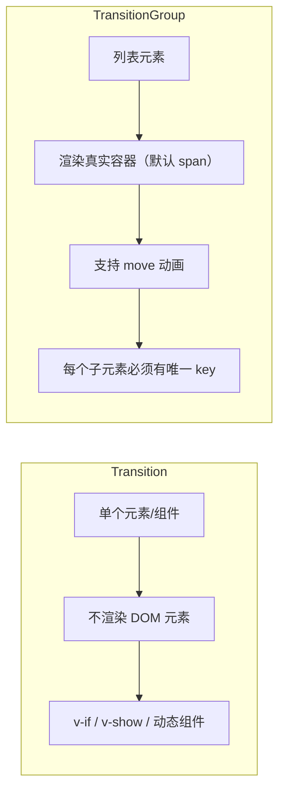

## 基本用法

```vue
<script setup lang="ts">
import { ref } from 'vue'

interface Item { id: number; text: string }
let nextId = 4
const items = ref<Item[]>([
  { id: 1, text: '项目 1' }, { id: 2, text: '项目 2' }, { id: 3, text: '项目 3' }
])

function add() { items.value.push({ id: nextId++, text: `项目 ${nextId - 1}` }) }
function remove(id: number) { items.value = items.value.filter(i => i.id !== id) }
function shuffle() { items.value = [...items.value].sort(() => Math.random() - 0.5) }
</script>

<template>
  <button @click="add">添加</button>
  <button @click="shuffle">打乱</button>

  <TransitionGroup name="list" tag="ul">
    <li v-for="item in items" :key="item.id">
      {{ item.text }}
      <button @click="remove(item.id)">×</button>
    </li>
  </TransitionGroup>
</template>

<style>
.list-enter-active, .list-leave-active { transition: all 0.5s ease; }
.list-enter-from { opacity: 0; transform: translateX(30px); }
.list-leave-to { opacity: 0; transform: translateX(-30px); }
.list-move { transition: transform 0.5s ease; } /* 移动动画 */
.list-leave-active { position: absolute; } /* 离开时脱离文档流 */
</style>
```

## 属性

| 属性 | 类型 | 默认 | 说明 |
|------|------|------|------|
| `tag` | `string` | `'span'` | 渲染的容器标签 |
| `name` | `string` | `'v'` | CSS 类名前缀 |
| `move-class` | `string` | — | 移动动画类名 |
| `appear` | `boolean` | `false` | 初始渲染动画 |

## 排序动画

```vue
<template>
  <button @click="shuffle">打乱顺序</button>

  <TransitionGroup name="flip" tag="div" class="grid">
    <div v-for="item in items" :key="item.id" class="cell">
      {{ item.text }}
    </div>
  </TransitionGroup>
</template>

<style>
.grid { display: flex; flex-wrap: wrap; gap: 8px; }
.cell { width: 60px; height: 60px; background: #42b883; color: white;
  display: flex; align-items: center; justify-content: center; border-radius: 8px; }
.flip-move { transition: transform 0.5s ease; }
</style>
```

## 实战：通知系统

```vue
<script setup lang="ts">
import { ref } from 'vue'

interface Notif { id: number; message: string; type: 'info' | 'success' | 'error' }
const notifications = ref<Notif[]>([])
let nextId = 1

function add(message: string, type: Notif['type'] = 'info') {
  const id = nextId++
  notifications.value.push({ id, message, type })
  setTimeout(() => remove(id), 3000)
}
function remove(id: number) { notifications.value = notifications.value.filter(n => n.id !== id) }
defineExpose({ add })
</script>

<template>
  <Teleport to="body">
    <TransitionGroup name="notif" tag="div" class="notif-container">
      <div v-for="n in notifications" :key="n.id" :class="['notif', n.type]">
        {{ n.message }}
        <button @click="remove(n.id)">&times;</button>
      </div>
    </TransitionGroup>
  </Teleport>
</template>

<style>
.notif-container { position: fixed; top: 20px; right: 20px; z-index: 9999; }
.notif { padding: 12px 20px; margin-bottom: 8px; border-radius: 8px; min-width: 200px; }
.notif.info { background: #e6f7ff; color: #1890ff; }
.notif.success { background: #f6ffed; color: #52c41a; }
.notif.error { background: #fff2f0; color: #ff4d4f; }
.notif-enter-active, .notif-leave-active { transition: all 0.3s ease; }
.notif-enter-from { opacity: 0; transform: translateX(100px); }
.notif-leave-to { opacity: 0; transform: translateX(100px); }
</style>
```

## 常见问题

| 问题 | 答案 |
|------|------|
| 移动动画不流畅？ | 设置 `.list-leave-active { position: absolute }` |
| tag 不渲染？ | 显式设置 `tag` 属性 |
| 列表元素必须有 key | TransitionGroup 强制要求 |

## FLIP 动画原理

FLIP 是 First-Last-Invert-Play 的缩写，由 Paul Lewis 提出，是 TransitionGroup `move` 动画的底层实现原理。它允许在不触发 Layout 的前提下，对元素的位移变化执行平滑动画。

### FLIP 四步法详解

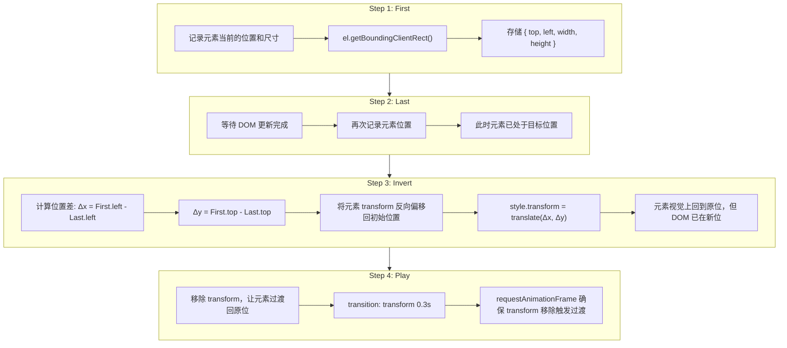

### 简化源码实现

```typescript
// ── 简化版 Vue 3 TransitionGroup move 动画实现 ──

interface FLIPRecord {
  el: Element
  rect: DOMRect
}

/**
 * TransitionGroup 内部维护的子元素位置记录
 * 对应 Vue 源码 packages/runtime-dom/src/components/TransitionGroup.ts
 */
class FLIPManager {
  private records: Map<Element, DOMRect> = new Map()
  private pendingCleanup: Set<Element> = new Set()

  /**
   * Step 1: First — 在 DOM 更新前记录所有子元素位置
   * 对应 Vue 源码中 beforeMount/beforeUpdate 钩子
   */
  recordBefore(children: Element[]): void {
    this.records.clear()
    for (const el of children) {
      this.records.set(el, el.getBoundingClientRect())
    }
  }

  /**
   * Step 2 & 3: Last + Invert — DOM 更新后计算位移差并反向偏移
   * 对应 Vue 源码中 updated 钩子中的 move 动画逻辑
   */
  invert(children: Element[]): Map<Element, { dx: number; dy: number }> {
    const deltas = new Map<Element, { dx: number; dy: number }>()

    for (const el of children) {
      const oldRect = this.records.get(el)
      if (!oldRect) continue

      // Last: 获取新位置
      const newRect = el.getBoundingClientRect()

      // Invert: 计算位移差
      const dx = oldRect.left - newRect.left
      const dy = oldRect.top - newRect.top

      if (dx !== 0 || dy !== 0) {
        deltas.set(el, { dx, dy })

        // 将元素反向偏移，使其视觉上保持在原位
        // 此处直接操作 style，但也支持 move-class 方式
        ;(el as HTMLElement).style.transform = `translate(${dx}px, ${dy}px)`
        ;(el as HTMLElement).style.transition = 'none'

        this.pendingCleanup.add(el)
      }
    }

    return deltas
  }

  /**
   * Step 4: Play — 下一帧移除 transform，触发 CSS transition
   * 对应 Vue 源码中 requestAnimationFrame 回调
   */
  play(moveClass: string = 'v-move'): void {
    requestAnimationFrame(() => {
      for (const el of this.pendingCleanup) {
        // 添加 move class 以触发用户定义的 transition
        el.classList.add(moveClass)

        // 移除强制 transform，让 CSS transition 接管
        ;(el as HTMLElement).style.transform = ''
        ;(el as HTMLElement).style.transition = ''
      }
    })

    // 动画结束后清理
    this.pendingCleanup.forEach(el => {
      el.addEventListener('transitionend', () => {
        el.classList.remove(moveClass)
        this.pendingCleanup.delete(el)
      }, { once: true })
    })
  }

  /** 核心入口：一次完整的 FLIP 流程 */
  executeFLIP(
    childrenBefore: Element[],
    childrenAfter: Element[],
    moveClass?: string
  ): void {
    // 通常在 beforeUpdate 调用
    this.recordBefore(childrenBefore)
    // 在 updated 中调用
    this.invert(childrenAfter)
    this.play(moveClass)
  }
}
```

### Vue 3 TransitionGroup 源码核心逻辑

```typescript
// 简化自 Vue 3 源码：
// packages/runtime-dom/src/components/TransitionGroup.ts

import { Transition } from './Transition'

const TransitionGroupImpl = {
  name: 'TransitionGroup',

  props: Transition.props.extend({
    tag: String,
    moveClass: String
  }),

  setup(props, { slots }) {
    const instance = getCurrentInstance()!
    const state = useTransitionState() as TransitionState

    // 存储子节点移动前的 bounding rect
    let prevChildren: VNode[]
    let prevPositions: Map<number, DOMRect> = new Map()

    return () => {
      const children = slots.default?.() ?? []
      const rawChildren = ensureOnlyOneRoot(children)

      // Step 1: First — 在渲染前记录位置
      // 这发生在 beforeMount/beforeUpdate
      if (children !== prevChildren) {
        prevPositions.clear()
        for (let i = 0; i < rawChildren.length; i++) {
          const child = rawChildren[i]
          // 只记录还在 DOM 中的元素（排除即将离开的）
          if (!hasPendingLeave(child)) {
            const el = child.el as Element
            prevPositions.set(i, el.getBoundingClientRect())
          }
        }
        prevChildren = children
      }

      // 渲染 Transition 包裹的子元素
      const transitionChildren = rawChildren.map((child, index) => {
        if (child.key == null) {
          // TransitionGroup 强制要求 key
          console.warn('TransitionGroup children must be keyed.')
        }
        return h(Transition, { ...props }, () => child)
      })

      // Step 2-4: FLIP — 在 onUpdated 中处理移动
      onUpdated(() => {
        const children = instance.subTree.children as VNode[]

        for (let i = 0; i < children.length; i++) {
          const child = children[i]
          const prevRect = prevPositions.get(i)
          if (!prevRect) continue

          const el = child.el as HTMLElement
          const newRect = el.getBoundingClientRect()

          // Invert
          const dx = prevRect.left - newRect.left
          const dy = prevRect.top - newRect.top

          if (dx !== 0 || dy !== 0) {
            const moveClass = props.moveClass || `${props.name || 'v'}-move`

            // 添加 move class
            el.classList.add(moveClass)

            // 通过 transition 来实现平滑过渡
            // Vue 利用 getComputedStyle 解析 transition 信息
            const s = el.style
            s.transform = s.webkitTransform = `translate(${dx}px,${dy}px)`
            s.transitionDuration = '0s'

            // 强制回流，确保 transform 被注册
            void el.offsetHeight

            // Play
            requestAnimationFrame(() => {
              s.transform = s.webkitTransform = ''
              s.transitionDuration = ''

              const onEnd = (e: TransitionEvent) => {
                if (e.propertyName !== 'transform') return
                el.removeEventListener('transitionend', onEnd)
                el.classList.remove(moveClass)
              }
              el.addEventListener('transitionend', onEnd)
            })
          }
        }
      })

      // 根据 tag 渲染容器
      return h(props.tag || 'span', null, transitionChildren)
    }
  }
}
```

### FLIP 性能优势

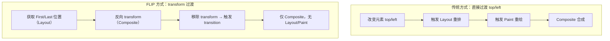

FLIP 的核心优势在于将"必须触发的 Layout"（getBoundingClientRect）分离为两次点状计算，而非持续的 Layout 抖动。位移动画全程在 Composite 层完成，实现 60fps。

### FLIP 实战：可排序列表

```vue
<script setup lang="ts">
import { ref, computed } from 'vue'

interface TaskItem {
  id: number
  title: string
  priority: number
}

const tasks = ref<TaskItem[]>([
  { id: 1, title: '编写需求文档', priority: 3 },
  { id: 2, title: '技术方案评审', priority: 1 },
  { id: 3, title: '开发核心模块', priority: 2 },
])

const sortedTasks = computed(() =>
  [...tasks.value].sort((a, b) => a.priority - b.priority)
)

function reorder(id: number, direction: 'up' | 'down') {
  const idx = tasks.value.findIndex(t => t.id === id)
  const swapIdx = direction === 'up' ? idx - 1 : idx + 1
  if (swapIdx < 0 || swapIdx >= tasks.value.length) return
  const temp = tasks.value[idx]
  tasks.value[idx] = tasks.value[swapIdx]
  tasks.value[swapIdx] = temp
  // 触发响应性 → FLIP 自动计算位移并过渡
}
</script>

<template>
  <TransitionGroup name="flip-list" tag="ul" class="task-list">
    <li v-for="task in sortedTasks" :key="task.id" class="task-item">
      <span class="priority">{{ '🔥'.repeat(task.priority) }}</span>
      <span class="title">{{ task.title }}</span>
      <div class="actions">
        <button @click="reorder(task.id, 'up')">▲</button>
        <button @click="reorder(task.id, 'down')">▼</button>
      </div>
    </li>
  </TransitionGroup>
</template>

<style>
.task-list { list-style: none; padding: 0; max-width: 500px; }
.task-item {
  display: flex; align-items: center; gap: 12px;
  padding: 12px 16px; margin-bottom: 8px;
  background: #fff; border-radius: 8px; box-shadow: 0 1px 4px rgba(0,0,0,.08);
}
.flip-list-move { transition: transform 0.4s cubic-bezier(0.4, 0, 0.2, 1); }
.flip-list-enter-active,
.flip-list-leave-active { transition: all 0.3s ease; }
.flip-list-enter-from { opacity: 0; transform: translateX(-20px); }
.flip-list-leave-to { opacity: 0; transform: translateX(20px); }
.flip-list-leave-active { position: absolute; }
</style>
```

### FLIP 与 position: absolute 的配合

列表离开动画时，设置 `position: absolute` 是必要的，否则离开元素会占据文档流空间，导致其他元素的 FLIP 计算出现偏差。

```css
/* 离开元素脱离文档流，剩余元素自由移动 */
.list-leave-active {
  position: absolute;
  /* 可选的额外优化 */
  pointer-events: none; /* 避免遮挡点击 */
  z-index: -1;          /* 置于底层 */
}
```

---

## 状态过渡


> 状态过渡是指数据变化时的视觉过渡——数字跳变、颜色渐变、尺寸变化等。Vue 3 通过 `watch` + Web Animations API / GSAP 实现数据驱动的动画。

## 核心思路

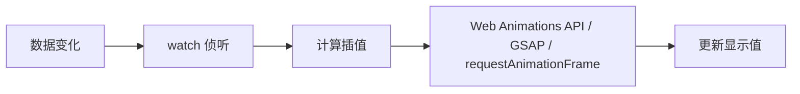

## 数字动画

```vue
<script setup lang="ts">
import { ref, watch, type Ref } from 'vue'

function useAnimatedNumber(target: Ref<number>, duration = 500) {
  const display = ref(target.value)

  watch(target, (newVal, oldVal) => {
    const start = performance.now()
    const from = oldVal ?? 0

    function animate(now: number) {
      const progress = Math.min((now - start) / duration, 1)
      const eased = 1 - Math.pow(1 - progress, 3) // ease-out
      display.value = from + (newVal - from) * eased
      if (progress < 1) requestAnimationFrame(animate)
    }
    requestAnimationFrame(animate)
  })

  return { display }
}

const revenue = ref(1000)
const { display } = useAnimatedNumber(revenue)
</script>

<template>
  <div>
    <h1>¥{{ display.toFixed(0) }}</h1>
    <button @click="revenue += 1000">+1000</button>
  </div>
</template>
```

## GSAP 状态过渡

```vue
<script setup lang="ts">
import { ref, watch, reactive } from 'vue'
import gsap from 'gsap'

const circle = reactive({ x: 0, y: 0 })

function moveRandom() {
  circle.x = Math.random() * 300
  circle.y = Math.random() * 300
}

const boxRef = ref<HTMLDivElement | null>(null)

watch([() => circle.x, () => circle.y], () => {
  if (!boxRef.value) return
  gsap.to(boxRef.value, { x: circle.x, y: circle.y, duration: 0.5, ease: 'power2.out' })
})
</script>

<template>
  <div class="stage">
    <div ref="boxRef" class="ball" />
  </div>
  <button @click="moveRandom">Move</button>
</template>

<style>
.stage { width: 400px; height: 400px; background: #f5f5f5; position: relative; }
.ball { width: 50px; height: 50px; border-radius: 50%; background: #42b883; position: absolute; }
</style>
```

## SVG 过渡

```vue
<script setup lang="ts">
import { ref, computed } from 'vue'

const progress = ref(0)
const circumference = 2 * Math.PI * 40
const offset = computed(() => circumference * (1 - progress.value / 100))
</script>

<template>
  <svg width="100" height="100" viewBox="0 0 100 100">
    <circle cx="50" cy="50" r="40" fill="none" stroke="#eee" stroke-width="8" />
    <circle cx="50" cy="50" r="40" fill="none" stroke="#42b883" stroke-width="8"
      :stroke-dasharray="circumference" :stroke-dashoffset="offset"
      stroke-linecap="round" transform="rotate(-90 50 50)"
      style="transition: stroke-dashoffset 0.6s ease" />
    <text x="50" y="55" text-anchor="middle">{{ progress }}%</text>
  </svg>
  <button @click="progress = Math.min(100, progress + 10)">+10%</button>
</template>
```

## Web Animations API

```typescript
import { ref, watch } from 'vue'

function useAnimatedValue(target: Ref<number>, el: Ref<HTMLElement | null>, prop: string) {
  watch(target, (newVal, oldVal) => {
    if (!el.value) return
    el.value.animate(
      [{ [prop]: oldVal ?? 0 }, { [prop]: newVal }],
      { duration: 300, easing: 'ease-out', fill: 'forwards' }
    )
  })
}
```

## 动画库推荐

| 库 | 适用场景 | 包体积 |
|----|---------|--------|
| Web Animations API | 简单过渡 | 0 (内置) |
| GSAP | 复杂时间线、SVG | ~30KB |
| Motion (Framer Motion) | React 风格声明式 | ~25KB |
| anime.js | 轻量级时间线 | ~6KB |

## Web Animations API vs CSS Transition 性能对比

### 架构差异

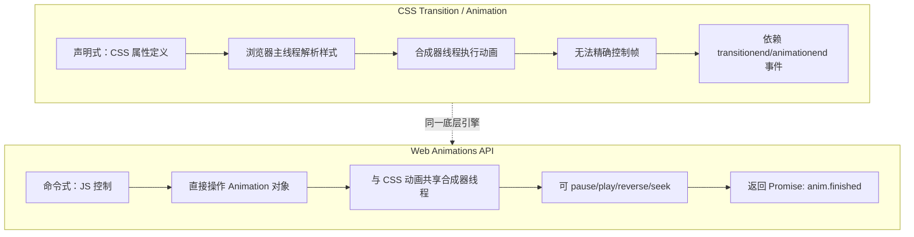

### Benchmark 测试

以下 benchmark 测试了 100 个元素同时执行动画的性能表现。

```typescript
// ── 性能 Benchmark 工具 ──

interface BenchmarkResult {
  name: string
  duration: number       // 动画总时长 ms
  avgFPS: number         // 平均帧率
  droppedFrames: number  // 丢帧数
  jankCount: number      // 卡顿次数（帧间隔 > 2倍预期）
  mainThreadTime: number // 主线程耗时 ms
}

async function runAnimationBenchmark(
  elementCount: number = 100,
  duration: number = 1000
): Promise<BenchmarkResult[]> {
  const results: BenchmarkResult[] = []
  const container = document.createElement('div')
  container.style.cssText = 'position:fixed;top:-9999px;left:-9999px'
  document.body.appendChild(container)

  // 创建测试元素
  const elements: HTMLElement[] = []
  for (let i = 0; i < elementCount; i++) {
    const el = document.createElement('div')
    el.style.cssText = `
      width: 50px; height: 50px; background: #42b883;
      position: absolute; top: ${(i % 10) * 60}px; left: ${Math.floor(i / 10) * 60}px;
    `
    container.appendChild(el)
    elements.push(el)
  }

  // ── 测试 1: CSS Transition ──
  {
    const frameTimes: number[] = []
    let lastFrame = performance.now()
    let rafId: number

    const measure = () => {
      const now = performance.now()
      frameTimes.push(now - lastFrame)
      lastFrame = now
      rafId = requestAnimationFrame(measure)
    }
    rafId = requestAnimationFrame(measure)

    const startTime = performance.now()

    // 触发 CSS transition
    elements.forEach(el => {
      el.style.transition = `transform ${duration}ms ease-out, opacity ${duration}ms ease-out`
      el.style.transform = 'translateX(200px) rotate(180deg)'
      el.style.opacity = '0.5'
    })

    // 等待动画结束
    await new Promise(resolve => setTimeout(resolve, duration + 100))
    cancelAnimationFrame(rafId)

    const totalFrames = frameTimes.length
    const expectedFrameTime = 1000 / 60
    const jankCount = frameTimes.filter(t => t > expectedFrameTime * 2).length
    const avgFrameTime = frameTimes.reduce((a, b) => a + b, 0) / totalFrames

    results.push({
      name: 'CSS Transition',
      duration: performance.now() - startTime,
      avgFPS: Math.round(1000 / avgFrameTime),
      droppedFrames: Math.max(0, Math.round(duration / expectedFrameTime) - totalFrames),
      jankCount,
      mainThreadTime: 0 // CSS 动画在合成器线程
    })
  }

  // 重置
  elements.forEach(el => {
    el.style.transition = 'none'
    el.style.transform = ''
    el.style.opacity = '1'
  })
  void container.offsetHeight // 强制回流

  // ── 测试 2: Web Animations API ──
  {
    const frameTimes: number[] = []
    let lastFrame = performance.now()
    let rafId: number

    const measure = () => {
      const now = performance.now()
      frameTimes.push(now - lastFrame)
      lastFrame = now
      rafId = requestAnimationFrame(measure)
    }
    rafId = requestAnimationFrame(measure)

    const startTime = performance.now()
    const animations: Animation[] = []

    elements.forEach(el => {
      const anim = el.animate(
        [
          { transform: 'translateX(0) rotate(0)', opacity: '1' },
          { transform: 'translateX(200px) rotate(180deg)', opacity: '0.5' }
        ],
        {
          duration,
          easing: 'ease-out',
          fill: 'forwards'
        }
      )
      animations.push(anim)
    })

    await Promise.all(animations.map(a => a.finished))
    cancelAnimationFrame(rafId)

    const totalFrames = frameTimes.length
    const expectedFrameTime = 1000 / 60
    const jankCount = frameTimes.filter(t => t > expectedFrameTime * 2).length
    const avgFrameTime = frameTimes.reduce((a, b) => a + b, 0) / totalFrames

    results.push({
      name: 'Web Animations API',
      duration: performance.now() - startTime,
      avgFPS: Math.round(1000 / avgFrameTime),
      droppedFrames: Math.max(0, Math.round(duration / expectedFrameTime) - totalFrames),
      jankCount,
      mainThreadTime: 0 // WAAPI 同样在合成器线程
    })
  }

  // ── 测试 3: requestAnimationFrame 手动动画 ──
  {
    const frameTimes: number[] = []
    let lastFrame = performance.now()

    const startTime = performance.now()

    await new Promise<void>(resolve => {
      function animate(timestamp: number) {
        const now = performance.now()
        frameTimes.push(now - lastFrame)
        lastFrame = now

        const progress = Math.min((timestamp - startTime) / duration, 1)
        const eased = 1 - Math.pow(1 - progress, 3) // ease-out

        elements.forEach(el => {
          el.style.transform = `translateX(${200 * eased}px) rotate(${180 * eased}deg)`
          el.style.opacity = `${1 - 0.5 * eased}`
        })

        if (progress < 1) {
          requestAnimationFrame(animate)
        } else {
          resolve()
        }
      }
      requestAnimationFrame(animate)
    })

    const totalFrames = frameTimes.length
    const expectedFrameTime = 1000 / 60
    const jankCount = frameTimes.filter(t => t > expectedFrameTime * 2).length
    const avgFrameTime = frameTimes.reduce((a, b) => a + b, 0) / totalFrames

    results.push({
      name: 'requestAnimationFrame (主线程)',
      duration: performance.now() - startTime,
      avgFPS: Math.round(1000 / avgFrameTime),
      droppedFrames: Math.max(0, Math.round(duration / expectedFrameTime) - totalFrames),
      jankCount,
      mainThreadTime: frameTimes.reduce((a, b) => a + b, 0)
    })
  }

  // 清理
  document.body.removeChild(container)
  return results
}
```

### 性能对比结果

```mermaid
gantt
    title 100元素 × 1000ms 动画性能对比
    dateFormat X
    axisFormat %s

    section CSS Transition
    合成器线程 (60fps)     :0, 1000
    主线程占用             :0, 50

    section Web Animations API
    合成器线程 (60fps)     :0, 1000
    主线程占用             :0, 80

    section rAF 手动动画
    主线程 JS 计算         :0, 1000
    样式计算 + 布局        :0, 1000
```

### 各方案特性对比

| 维度 | CSS Transition | CSS Animation | Web Animations API | rAF 手动 |
|------|---------------|---------------|-------------------|----------|
| **运行线程** | 合成器线程 | 合成器线程 | 合成器线程 | 主线程 |
| **60fps 能力** | 优秀 | 优秀 | 优秀 | 取决于 JS 负载 |
| **暂停/恢复** | 不支持 | 通过 `animation-play-state` | `anim.pause()/play()` | 手动实现 |
| **动态参数** | 需修改 style | 需修改 style | `anim.effect.updateTiming()` | 完全控制 |
| **完成通知** | `transitionend` 事件 | `animationend` 事件 | `anim.finished` Promise | 自定义回调 |
| **进度查询** | 无 | 无 | `anim.currentTime` | 完全可控 |
| **取消回滚** | 困难 | 困难 | `anim.cancel()` + `anim.commitStyles()` | 手动实现 |
| **关键帧** | 2 帧（from/to） | 多帧 @keyframes | 多帧 KeyframeEffect | 完全自定义 |
| **包体积** | 0 | 0 | 0（内置） | 0 |
| **调试** | DevTools Animations 面板 | DevTools Animations 面板 | DevTools Animations 面板 | console.log |

### 实际场景选择指南

```typescript
// ── 场景决策矩阵 ──

type AnimationScenario =
  | 'simple-transition'   // 简单过渡：hover、显示/隐藏
  | 'complex-keyframes'   // 复杂关键帧：弹跳、脉冲
  | 'dynamic-control'     // 动态控制：暂停、倒放、跳转
  | 'performance-critical'// 性能敏感：大量元素、滚动驱动
  | 'interactive'         // 交互驱动：拖拽、手势

function recommendApproach(scenario: AnimationScenario): string {
  switch (scenario) {
    case 'simple-transition':
      return 'CSS Transition — 声明式，零 JS 开销，浏览器优化最佳'

    case 'complex-keyframes':
      return 'CSS Animation (@keyframes) — 或 WAAPI KeyframeEffect，两者性能相当'

    case 'dynamic-control':
      return 'Web Animations API — pause/play/reverse/seek 原生支持'

    case 'performance-critical':
      return 'CSS Transition/Animation — 合成器线程执行，不阻塞主线程'

    case 'interactive':
      return 'WAAPI + rAF 混合 — WAAPI 处理预设动画，rAF 处理实时交互'

    default:
      return 'CSS Transition'
  }
}
```

### WAAPI 在 Vue Transition 中的最佳实践

```vue
<script setup lang="ts">
import { ref } from 'vue'

const show = ref(true)

/**
 * WAAPI 与 Vue Transition 集成的最佳模式：
 * 1. 使用 :css="false" 禁用 CSS 类名
 * 2. 在 enter/leave 钩子中使用 WAAPI
 * 3. 通过 anim.finished 调用 done()
 * 4. 存储 Animation 实例以便取消时清理
 */
const activeAnimations = new Map<Element, Animation>()

function onEnter(el: Element, done: () => void) {
  // 清理可能残留的动画
  activeAnimations.get(el)?.cancel()

  const anim = el.animate(
    [
      { opacity: 0, transform: 'translateY(20px) scale(0.95)' },
      { opacity: 1, transform: 'translateY(0) scale(1)' }
    ],
    {
      duration: 400,
      easing: 'cubic-bezier(0.4, 0, 0.2, 1)',
      fill: 'backwards' // 确保第一帧在动画开始前就应用
    }
  )

  activeAnimations.set(el, anim)

  // Promise-based 完成通知
  anim.finished.then(() => {
    activeAnimations.delete(el)
    done()
  }).catch(() => {
    // 动画被取消（如元素提前移除）
    activeAnimations.delete(el)
  })
}

function onLeave(el: Element, done: () => void) {
  activeAnimations.get(el)?.cancel()

  const anim = el.animate(
    [
      { opacity: 1, transform: 'translateY(0) scale(1)' },
      { opacity: 0, transform: 'translateY(-20px) scale(0.95)' }
    ],
    {
      duration: 300,
      easing: 'cubic-bezier(0.4, 0, 1, 1)', // ease-in
      fill: 'forwards'
    }
  )

  activeAnimations.set(el, anim)

  anim.finished.then(() => {
    activeAnimations.delete(el)
    done()
  }).catch(() => {
    activeAnimations.delete(el)
  })
}

// 取消钩子：清理动画实例
function onEnterCancelled(el: Element) {
  const anim = activeAnimations.get(el)
  if (anim) {
    anim.cancel()
    // commitStyles 将当前动画状态写入 style 属性
    anim.commitStyles()
    activeAnimations.delete(el)
  }
}

function onLeaveCancelled(el: Element) {
  const anim = activeAnimations.get(el)
  if (anim) {
    anim.cancel()
    anim.commitStyles()
    activeAnimations.delete(el)
  }
}
</script>

<template>
  <Transition
    :css="false"
    @enter="onEnter"
    @leave="onLeave"
    @enter-cancelled="onEnterCancelled"
    @leave-cancelled="onLeaveCancelled"
  >
    <div v-if="show" class="waapi-box">
      WAAPI 驱动的动画
    </div>
  </Transition>
</template>
```

---

## 动画工程最佳实践


> Vue 动画的性能优化、第三方库集成和无障碍设计。遵循最佳实践可确保动画流畅（60fps）且对所有用户友好。

## 性能优化：浏览器渲染流水线

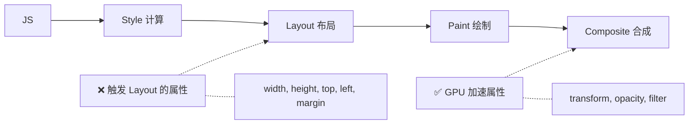

### 优先使用 GPU 加速属性

```css
/* ✅ GPU 加速，仅触发 Composite */
.box { transform: translateX(100px); opacity: 0.5; }

/* ❌ 触发 Layout 重排 */
.box { left: 100px; width: 200px; }

/* ✅ 用 transform 替代定位 */
.box { transform: translate(100px, 50px); }

/* ✅ 用 scale 替代宽高变化 */
.box { transform: scale(1.2); }
```

### will-change 提示

```css
.animated-element {
  will-change: transform, opacity;
  transition: transform 0.3s ease, opacity 0.3s ease;
}

/* 动画结束后移除 */
.animated-element.animation-done {
  will-change: auto;
}
```

### FLIP 技术

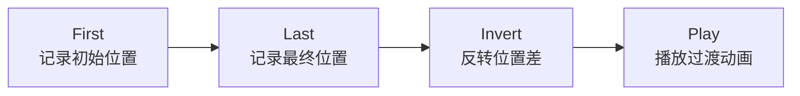

## 第三方库集成

### GSAP

```vue
<script setup lang="ts">
import gsap from 'gsap'

function onEnter(el: Element, done: gsap.Callback) {
  gsap.fromTo(el, { opacity: 0, y: -20, scale: 0.95 },
    { opacity: 1, y: 0, scale: 1, duration: 0.4, ease: 'power2.out', onComplete: done })
}
function onLeave(el: Element, done: gsap.Callback) {
  gsap.to(el, { opacity: 0, y: 20, duration: 0.3, onComplete: done })
}
</script>
```

### Animate.css

```vue
<template>
  <Transition
    enter-active-class="animate__animated animate__fadeInUp"
    leave-active-class="animate__animated animate__fadeOutDown"
  >
    <div v-if="show">动画内容</div>
  </Transition>
</template>
```

### Motion One

```typescript
import { animate } from 'motion'

function onEnter(el: Element, done: () => void) {
  animate(el, { opacity: [0, 1], y: [-10, 0] }, { duration: 0.3, easing: 'ease-out' })
    .finished.then(done)
}
```

## 动画库对比

| 库 | 包体积 | 特点 | 适用场景 |
|----|--------|------|---------|
| Web Animations API | 0 | 浏览器内置 | 简单过渡 |
| GSAP | ~30KB | 功能最全 | 复杂时间线 |
| Motion One | ~5KB | 现代 API | 轻量项目 |
| Animate.css | ~5KB | CSS 预设 | 快速原型 |
| @vueuse/motion | ~3KB | Vue 3 集成 | Vue 声明式 |

## 无障碍设计

```vue
<script setup lang="ts">
import { ref } from 'vue'

const show = ref(false)

// 响应 prefers-reduced-motion
const prefersReducedMotion = window.matchMedia('(prefers-reduced-motion: reduce)').matches
if (prefersReducedMotion) {
  // 禁用动画或使用即时过渡
}
</script>

<template>
  <!-- 使用 prefers-reduced-motion 媒体查询 -->
  <Transition name="fade">
    <div v-if="show" role="alert" aria-live="polite">
      通知内容
    </div>
  </Transition>
</template>

<style>
@media (prefers-reduced-motion: reduce) {
  .fade-enter-active, .fade-leave-active {
    transition: none !important;
  }
}
</style>
```

### 无障碍要点

- 使用 `prefers-reduced-motion` 媒体查询
- 动画元素添加 `role` 和 `aria-*` 属性
- 自动播放的动画提供暂停控制
- 关键内容不依赖动画才能显示

## 最佳实践清单

| 实践 | 说明 |
|------|------|
| 使用 transform/opacity | 仅触发 Composite，60fps |
| 避免 animating layout 属性 | width/height/top/left 触发 Layout |
| 设置动画 duration ≤ 300ms | 用户感知流畅 |
| 使用 will-change | 提前告知浏览器 |
| 检查 prefers-reduced-motion | 尊重用户偏好 |
| 使用 FLIP 技术 | 列表排序动画 |

## 生产级可复用动画指令 v-animate

本节实现一个生产级的自定义指令 `v-animate`，支持多种动画类型、配置化参数、交错动画和跨浏览器兼容。

### 指令架构设计

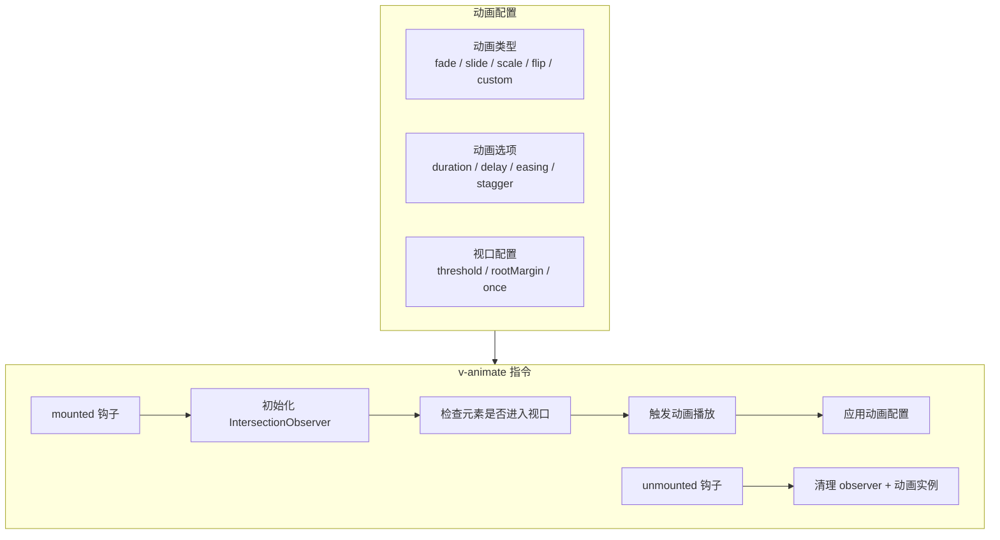

### 类型定义

```typescript
// ── directives/v-animate/types.ts ──

/** 动画方向 */
export type AnimationDirection = 'up' | 'down' | 'left' | 'right'

/** 预设动画类型 */
export type AnimationType =
  | 'fade'
  | 'fade-up'
  | 'fade-down'
  | 'fade-left'
  | 'fade-right'
  | 'slide-up'
  | 'slide-down'
  | 'slide-left'
  | 'slide-right'
  | 'scale'
  | 'scale-up'
  | 'scale-down'
  | 'flip-x'
  | 'flip-y'
  | 'zoom-in'
  | 'zoom-out'
  | 'bounce'
  | 'custom'

/** 缓动函数类型 */
export type EasingType =
  | 'linear'
  | 'ease'
  | 'ease-in'
  | 'ease-out'
  | 'ease-in-out'
  | `cubic-bezier(${number}, ${number}, ${number}, ${number})`

/** v-animate 指令的完整配置 */
export interface AnimateConfig {
  /** 动画类型，默认 'fade-up' */
  type?: AnimationType

  /** 动画时长 ms，默认 400 */
  duration?: number

  /** 动画延迟 ms，默认 0 */
  delay?: number

  /** 缓动函数，默认 'ease-out' */
  easing?: EasingType

  /** 交错延迟 ms（子元素动画间隔），默认 0 */
  stagger?: number

  /** 交错总时长 ms（与 stagger 二选一） */
  staggerAmount?: number

  /** 动画距离 px（slide 类动画），默认 30 */
  distance?: number

  /** 缩放值（scale 类动画），默认 0.9 */
  scale?: number

  /** 是否只触发一次，默认 true */
  once?: boolean

  /** IntersectionObserver 阈值，默认 0.1 */
  threshold?: number | number[]

  /** IntersectionObserver rootMargin，默认 '0px' */
  rootMargin?: string

  /** 自定义 keyframes（type='custom' 时使用） */
  keyframes?: Keyframe[]

  /** 自定义动画选项（type='custom' 时使用） */
  keyframeOptions?: KeyframeAnimationOptions

  /** 动画开始回调 */
  onStart?: (el: Element) => void

  /** 动画完成回调 */
  onComplete?: (el: Element) => void

  /** 是否禁用 prefers-reduced-motion 的动画禁用 */
  ignoreReducedMotion?: boolean
}

/** 动画预设映射 */
type AnimationPreset = Required<
  Pick<AnimateConfig, 'keyframes' | 'keyframeOptions'>
>
```

### 核心实现

```typescript
// ── directives/v-animate/index.ts ──

import type { Directive, DirectiveBinding } from 'vue'
import type { AnimateConfig, AnimationType } from './types'

/**
 * 动画预设字典
 * 每种动画类型对应一组 keyframes + KeyframeAnimationOptions
 */
const ANIMATION_PRESETS: Record<Exclude<AnimationType, 'custom'>, {
  keyframes: Keyframe[]
  keyframeOptions: KeyframeAnimationOptions
}> = {
  'fade': {
    keyframes: [
      { opacity: 0, offset: 0 },
      { opacity: 1, offset: 1 }
    ],
    keyframeOptions: { fill: 'both' }
  },
  'fade-up': {
    keyframes: [
      { opacity: 0, transform: 'translateY(30px)', offset: 0 },
      { opacity: 1, transform: 'translateY(0)', offset: 1 }
    ],
    keyframeOptions: { fill: 'both' }
  },
  'fade-down': {
    keyframes: [
      { opacity: 0, transform: 'translateY(-30px)', offset: 0 },
      { opacity: 1, transform: 'translateY(0)', offset: 1 }
    ],
    keyframeOptions: { fill: 'both' }
  },
  'fade-left': {
    keyframes: [
      { opacity: 0, transform: 'translateX(30px)', offset: 0 },
      { opacity: 1, transform: 'translateX(0)', offset: 1 }
    ],
    keyframeOptions: { fill: 'both' }
  },
  'fade-right': {
    keyframes: [
      { opacity: 0, transform: 'translateX(-30px)', offset: 0 },
      { opacity: 1, transform: 'translateX(0)', offset: 1 }
    ],
    keyframeOptions: { fill: 'both' }
  },
  'slide-up': {
    keyframes: [
      { transform: 'translateY(60px)', opacity: 0.3, offset: 0 },
      { transform: 'translateY(0)', opacity: 1, offset: 1 }
    ],
    keyframeOptions: { fill: 'both' }
  },
  'slide-down': {
    keyframes: [
      { transform: 'translateY(-60px)', opacity: 0.3, offset: 0 },
      { transform: 'translateY(0)', opacity: 1, offset: 1 }
    ],
    keyframeOptions: { fill: 'both' }
  },
  'slide-left': {
    keyframes: [
      { transform: 'translateX(60px)', opacity: 0.3, offset: 0 },
      { transform: 'translateX(0)', opacity: 1, offset: 1 }
    ],
    keyframeOptions: { fill: 'both' }
  },
  'slide-right': {
    keyframes: [
      { transform: 'translateX(-60px)', opacity: 0.3, offset: 0 },
      { transform: 'translateX(0)', opacity: 1, offset: 1 }
    ],
    keyframeOptions: { fill: 'both' }
  },
  'scale': {
    keyframes: [
      { transform: 'scale(0)', opacity: 0, offset: 0 },
      { transform: 'scale(1)', opacity: 1, offset: 1 }
    ],
    keyframeOptions: { fill: 'both' }
  },
  'scale-up': {
    keyframes: [
      { transform: 'scale(0.8)', opacity: 0, offset: 0 },
      { transform: 'scale(1)', opacity: 1, offset: 1 }
    ],
    keyframeOptions: { fill: 'both' }
  },
  'scale-down': {
    keyframes: [
      { transform: 'scale(1.2)', opacity: 0, offset: 0 },
      { transform: 'scale(1)', opacity: 1, offset: 1 }
    ],
    keyframeOptions: { fill: 'both' }
  },
  'flip-x': {
    keyframes: [
      { transform: 'perspective(400px) rotateY(90deg)', opacity: 0, offset: 0 },
      { transform: 'perspective(400px) rotateY(0)', opacity: 1, offset: 1 }
    ],
    keyframeOptions: { fill: 'both' }
  },
  'flip-y': {
    keyframes: [
      { transform: 'perspective(400px) rotateX(90deg)', opacity: 0, offset: 0 },
      { transform: 'perspective(400px) rotateX(0)', opacity: 1, offset: 1 }
    ],
    keyframeOptions: { fill: 'both' }
  },
  'zoom-in': {
    keyframes: [
      { transform: 'scale(0.5)', opacity: 0, offset: 0 },
      { transform: 'scale(1)', opacity: 1, offset: 0.6 },
      { transform: 'scale(0.95)', offset: 0.8 },
      { transform: 'scale(1)', offset: 1 }
    ],
    keyframeOptions: { fill: 'both' }
  },
  'zoom-out': {
    keyframes: [
      { transform: 'scale(1.5)', opacity: 0, offset: 0 },
      { transform: 'scale(1)', opacity: 1, offset: 1 }
    ],
    keyframeOptions: { fill: 'both' }
  },
  'bounce': {
    keyframes: [
      { transform: 'scale(0)', opacity: 0, offset: 0 },
      { transform: 'scale(1.15)', opacity: 1, offset: 0.5 },
      { transform: 'scale(0.95)', offset: 0.75 },
      { transform: 'scale(1.02)', offset: 0.9 },
      { transform: 'scale(1)', offset: 1 }
    ],
    keyframeOptions: { fill: 'both' }
  }
}

/**
 * 解析缓动函数
 * 支持 CSS 标准缓动和 cubic-bezier 自定义
 */
function resolveEasing(easing: string): string {
  const easingMap: Record<string, string> = {
    'linear': 'linear',
    'ease': 'ease',
    'ease-in': 'ease-in',
    'ease-out': 'ease-out',
    'ease-in-out': 'ease-in-out',
  }
  return easingMap[easing] ?? easing
}

/**
 * 检查是否应禁用动画（prefers-reduced-motion）
 */
function shouldDisableAnimation(ignoreReducedMotion?: boolean): boolean {
  if (ignoreReducedMotion) return false
  return window.matchMedia('(prefers-reduced-motion: reduce)').matches
}

/**
 * 元素动画状态管理
 */
interface ElementAnimationState {
  observer: IntersectionObserver | null
  animation: Animation | null
  hasAnimated: boolean
  childAnimations: Animation[]
}

const elementStateMap = new WeakMap<Element, ElementAnimationState>()

/**
 * 构建动画配置
 */
function buildAnimationConfig(
  binding: DirectiveBinding<AnimateConfig | string | boolean>
): Required<AnimateConfig> {
  const raw = binding.value

  // 支持字符串简写：v-animate="'fade-up'"
  // 支持布尔值：v-animate="true" 使用默认配置
  const config: AnimateConfig = typeof raw === 'string'
    ? { type: raw as AnimationType }
    : typeof raw === 'boolean'
      ? {}
      : (raw ?? {})

  return {
    type: config.type ?? 'fade-up',
    duration: config.duration ?? 400,
    delay: config.delay ?? 0,
    easing: config.easing ?? 'ease-out',
    stagger: config.stagger ?? 0,
    staggerAmount: config.staggerAmount ?? 0,
    distance: config.distance ?? 30,
    scale: config.scale ?? 0.9,
    once: config.once ?? true,
    threshold: config.threshold ?? 0.1,
    rootMargin: config.rootMargin ?? '0px 0px -50px 0px',
    keyframes: config.keyframes ?? [],
    keyframeOptions: config.keyframeOptions ?? {},
    onStart: config.onStart ?? (() => {}),
    onComplete: config.onComplete ?? (() => {}),
    ignoreReducedMotion: config.ignoreReducedMotion ?? false,
  }
}

/**
 * 获取或创建元素动画状态
 */
function getElementState(el: Element): ElementAnimationState {
  let state = elementStateMap.get(el)
  if (!state) {
    state = {
      observer: null,
      animation: null,
      hasAnimated: false,
      childAnimations: []
    }
    elementStateMap.set(el, state)
  }
  return state
}

/**
 * 播放元素动画
 */
function playAnimation(
  el: Element,
  config: Required<AnimateConfig>
): void {
  const state = getElementState(el)

  // 如果设置了 once 且已执行过，跳过
  if (config.once && state.hasAnimated) return

  // 如果用户偏好减少动画，直接显示元素
  if (shouldDisableAnimation(config.ignoreReducedMotion)) {
    state.hasAnimated = true
    config.onStart(el)
    config.onComplete(el)
    return
  }

  config.onStart(el)

  if (config.type === 'custom') {
    // 自定义动画
    const anim = el.animate(config.keyframes, {
      duration: config.duration,
      delay: config.delay,
      easing: resolveEasing(config.easing),
      fill: 'both',
      ...config.keyframeOptions
    })
    state.animation = anim
    anim.onfinish = () => {
      state.hasAnimated = true
      config.onComplete(el)
    }
  } else {
    // 预设动画
    const preset = ANIMATION_PRESETS[config.type]

    // 对于动态距离/缩放的动画类型，动态生成 keyframes
    let keyframes: Keyframe[]

    if (config.type.startsWith('fade') && config.type !== 'fade') {
      // 动态替换距离
      const direction = config.type.split('-')[1] as 'up' | 'down' | 'left' | 'right'
      const distanceMap: Record<string, string> = {
        up: `translateY(${config.distance}px)`,
        down: `translateY(-${config.distance}px)`,
        left: `translateX(${config.distance}px)`,
        right: `translateX(-${config.distance}px)`
      }
      keyframes = [
        { opacity: 0, transform: distanceMap[direction], offset: 0 },
        { opacity: 1, transform: 'translate(0, 0)', offset: 1 }
      ]
    } else if (config.type.startsWith('slide') && config.type !== 'slide') {
      const direction = config.type.split('-')[1] as 'up' | 'down' | 'left' | 'right'
      const distanceMap: Record<string, string> = {
        up: `translateY(${config.distance * 2}px)`,
        down: `translateY(-${config.distance * 2}px)`,
        left: `translateX(${config.distance * 2}px)`,
        right: `translateX(-${config.distance * 2}px)`
      }
      keyframes = [
        { transform: distanceMap[direction], opacity: 0.3, offset: 0 },
        { transform: 'translate(0, 0)', opacity: 1, offset: 1 }
      ]
    } else if (config.type.startsWith('scale') && config.type !== 'scale') {
      const scaleVal = config.scale
      const isUp = config.type === 'scale-up'
      keyframes = [
        { transform: `scale(${isUp ? scaleVal : 1 + (1 - scaleVal)})`, opacity: 0, offset: 0 },
        { transform: 'scale(1)', opacity: 1, offset: 1 }
      ]
    } else {
      keyframes = preset.keyframes
    }

    const anim = el.animate(keyframes, {
      duration: config.duration,
      delay: config.delay,
      easing: resolveEasing(config.easing),
      fill: 'both',
      ...preset.keyframeOptions
    })

    state.animation = anim
    anim.onfinish = () => {
      state.hasAnimated = true
      config.onComplete(el)
    }
  }

  // 处理子元素交错动画
  if (config.stagger > 0 || config.staggerAmount > 0) {
    const children = Array.from(el.children) as HTMLElement[]

    // 提前设置子元素初始状态
    children.forEach(child => {
      child.style.opacity = '0'
      child.style.willChange = 'transform, opacity'
    })

    const totalStagger = config.staggerAmount > 0
      ? config.staggerAmount
      : config.stagger * children.length

    children.forEach((child, index) => {
      const childDelay = config.staggerAmount > 0
        ? (totalStagger / children.length) * index
        : config.stagger * index

      const childAnim = child.animate(
        ANIMATION_PRESETS['fade-up'].keyframes,
        {
          duration: config.duration,
          delay: config.delay + childDelay,
          easing: resolveEasing(config.easing),
          fill: 'both'
        }
      )

      state.childAnimations.push(childAnim)

      childAnim.onfinish = () => {
        child.style.willChange = 'auto'
      }
    })
  }
}

/**
 * v-animate 指令定义
 */
export const vAnimate: Directive<HTMLElement, AnimateConfig | string | boolean> = {
  mounted(el: HTMLElement, binding: DirectiveBinding<AnimateConfig | string | boolean>) {
    const config = buildAnimationConfig(binding)
    const state = getElementState(el)

    // 如果用户偏好减少动画，直接跳过
    if (shouldDisableAnimation(config.ignoreReducedMotion)) {
      state.hasAnimated = true
      return
    }

    // 创建 IntersectionObserver
    const observer = new IntersectionObserver(
      (entries) => {
        entries.forEach(entry => {
          if (entry.isIntersecting && !state.hasAnimated) {
            playAnimation(el, config)

            // 如果 once，直接断开观察
            if (config.once) {
              observer.unobserve(el)
            }
          } else if (!entry.isIntersecting && !config.once && state.hasAnimated) {
            // 非 once 模式：离开视口时重置，以便重新进入时再播放
            state.hasAnimated = false
            state.animation?.cancel()
            state.childAnimations.forEach(a => a.cancel())
            state.childAnimations = []
          }
        })
      },
      {
        threshold: config.threshold,
        rootMargin: config.rootMargin
      }
    )

    observer.observe(el)
    state.observer = observer
  },

  updated(el: HTMLElement, binding: DirectiveBinding<AnimateConfig | string | boolean>) {
    // 配置更新时重新初始化
    const state = getElementState(el)
    const config = buildAnimationConfig(binding)

    // 如果还没动画过，允许更新配置
    if (!state.hasAnimated) {
      // 重建 observer
      state.observer?.disconnect()
      const observer = new IntersectionObserver(
        (entries) => {
          entries.forEach(entry => {
            if (entry.isIntersecting && !state.hasAnimated) {
              playAnimation(el, config)
              if (config.once) observer.unobserve(el)
            }
          })
        },
        { threshold: config.threshold, rootMargin: config.rootMargin }
      )
      observer.observe(el)
      state.observer = observer
    }
  },

  unmounted(el: HTMLElement) {
    const state = elementStateMap.get(el)
    if (!state) return

    // 清理 observer
    state.observer?.disconnect()

    // 取消活跃动画
    state.animation?.cancel()
    state.childAnimations.forEach(a => a.cancel())

    // 清理 WeakMap
    elementStateMap.delete(el)
  }
}

export default vAnimate
```

### 注册与使用

```typescript
// ── main.ts 全局注册 ──
import { createApp } from 'vue'
import App from './App.vue'
import { vAnimate } from './directives/v-animate'

const app = createApp(App)
app.directive('animate', vAnimate)
app.mount('#app')
```

```vue
<!-- ── 使用示例 ── -->
<template>
  <!-- 1. 字符串简写：使用默认配置 -->
  <div v-animate="'fade-up'">简写用法</div>

  <!-- 2. 布尔简写：使用默认动画类型 -->
  <div v-animate>默认 fade-up</div>

  <!-- 3. 对象配置：完全自定义 -->
  <div
    v-animate="{
      type: 'slide-left',
      duration: 600,
      delay: 200,
      easing: 'cubic-bezier(0.4, 0, 0.2, 1)',
      distance: 50
    }"
  >
    自定义配置
  </div>

  <!-- 4. 交错动画：子元素逐个入场 -->
  <ul
    v-animate="{
      type: 'fade-up',
      stagger: 100,
      duration: 400
    }"
  >
    <li v-for="i in 5" :key="i">子元素 {{ i }}</li>
  </ul>

  <!-- 5. 只触发一次 -->
  <div v-animate="{ type: 'zoom-in', once: true }">
    仅入场一次
  </div>

  <!-- 6. 每次进入视口都触发 -->
  <div v-animate="{ type: 'bounce', once: false, threshold: 0.5 }">
    每次进入视口都播放
  </div>

  <!-- 7. 自定义关键帧 -->
  <div
    v-animate="{
      type: 'custom',
      duration: 800,
      easing: 'ease-out',
      keyframes: [
        { transform: 'rotate(0deg) scale(0)', opacity: 0 },
        { transform: 'rotate(360deg) scale(1)', opacity: 1 }
      ]
    }"
  >
    自定义关键帧动画
  </div>
</template>
```

### 指令应用场景

| 场景 | 配置示例 | 说明 |
|------|---------|------|
| 首屏 hero 区域 | `{ type: 'fade-up', duration: 800, delay: 300 }` | 缓慢入场，强化视觉焦点 |
| 卡片列表 | `{ type: 'fade-up', stagger: 150 }` | 逐个卡片弹出 |
| 弹窗入场 | `{ type: 'scale-up', duration: 200 }` | 快速缩放，符合 Material Design |
| 页面切换 | `{ type: 'slide-left', duration: 300, once: false }` | 横向滑动切换 |
| 无限滚动加载 | `{ type: 'fade-up', once: true, threshold: 0 }` | 新数据加载时淡入 |

## 动画性能深度优化

### 1. will-change 的正确使用

`will-change` 是双刃剑 -- 使用得当可显著提升性能，滥用则会导致内存泄漏和性能退化。

```typescript
// ── composables/useWillChange.ts ──

import { type Ref } from 'vue'

/**
 * will-change 最佳实践：
 * 1. 仅在动画即将开始前添加
 * 2. 动画结束后立即移除
 * 3. 不要同时声明过多属性
 * 4. 不要对大量元素同时使用
 */
export function useWillChange(
  el: Ref<HTMLElement | null>,
  properties: string[] = ['transform', 'opacity']
) {
  let originalWillChange = ''

  function enable() {
    if (!el.value) return
    originalWillChange = el.value.style.willChange
    el.value.style.willChange = properties.join(', ')
  }

  function disable() {
    if (!el.value) return
    el.value.style.willChange = originalWillChange
  }

  return { enable, disable }
}

// 使用模式
function onEnter(el: Element, done: () => void) {
  const { enable, disable } = useWillChange(ref(el as HTMLElement))
  enable()

  const anim = el.animate(
    [{ transform: 'translateY(20px)', opacity: 0 }, { transform: 'translateY(0)', opacity: 1 }],
    { duration: 400, fill: 'forwards' }
  )

  anim.finished.then(() => {
    disable()
    done()
  })
}
```

### 2. transform3d 强制 GPU 合成层

```css
/* 使用 translateZ(0) 或 translate3d(0,0,0) 强制创建合成层 */
.gpu-accelerated {
  /* 方法 1: translateZ(0) — 最常用 */
  transform: translateZ(0);

  /* 方法 2: translate3d — 显式声明 3D */
  transform: translate3d(0, 0, 0);

  /* 方法 3: will-change + transform — 推荐 */
  will-change: transform;

  /* 方法 4: backface-visibility — 副作用方式（不推荐） */
  backface-visibility: hidden;
}
```

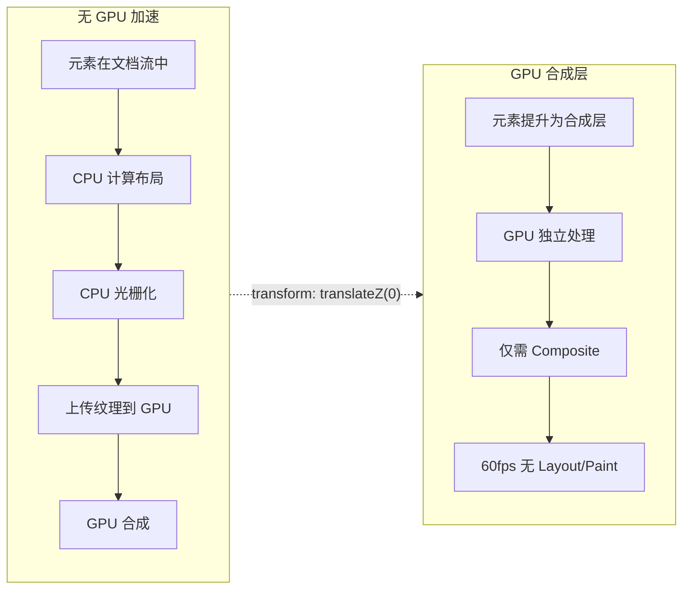

### 3. requestAnimationFrame 节流实现

```typescript
// ── composables/useAnimationFrameThrottle.ts ──

/**
 * rAF 节流：确保动画逻辑在帧率内执行
 *
 * 与 lodash throttle 的区别：
 * - throttle 基于时间间隔，可能在帧之间执行
 * - rAF throttle 基于帧率，确保每次屏幕刷新才执行一次
 *
 * 适合场景：滚动事件、resize 事件、鼠标移动等高频事件中的动画
 */
export function useRAFThrottle<T extends (...args: any[]) => void>(
  fn: T
): T & { cancel: () => void } {
  let rafId: number | null = null
  let lastArgs: Parameters<T> | null = null

  const throttled = (...args: Parameters<T>) => {
    lastArgs = args

    if (rafId === null) {
      rafId = requestAnimationFrame(() => {
        if (lastArgs !== null) {
          fn(...lastArgs)
          lastArgs = null
        }
        rafId = null
      })
    }
  }

  throttled.cancel = () => {
    if (rafId !== null) {
      cancelAnimationFrame(rafId)
      rafId = null
    }
  }

  return throttled as T & { cancel: () => void }
}

// ── 使用示例：滚动驱动的动画 ──
import { ref, onMounted, onUnmounted } from 'vue'

function useScrollAnimation() {
  const scrollY = ref(0)
  const animatedEl = ref<HTMLElement | null>(null)

  const updateAnimation = useRAFThrottle(() => {
    if (!animatedEl.value) return
    const progress = Math.min(scrollY.value / window.innerHeight, 1)
    animatedEl.value.style.transform = `translateY(${progress * 100}px)`
    animatedEl.value.style.opacity = `${1 - progress * 0.5}`
  })

  const handleScroll = () => {
    scrollY.value = window.scrollY
    updateAnimation()
  }

  onMounted(() => window.addEventListener('scroll', handleScroll, { passive: true }))
  onUnmounted(() => {
    window.removeEventListener('scroll', handleScroll)
    updateAnimation.cancel()
  })
}
```

### 4. 复合动画性能优化模式

```typescript
// ── 批量动画优化 ──

/**
 * 当需要对大量元素执行动画时，按以下优先级选择方案：
 *
 * 方案 1: CSS Transition（推荐，~100个元素以内）
 * 方案 2: WAAPI（推荐，~100-500个元素）
 * 方案 3: 共享 Animation 对象（推荐，>500个元素）
 * 方案 4: Canvas/WebGL（>1000个元素）
 */

/**
 * 方案 3 实现：使用单个 Animation 对象驱动多个元素
 * 原理：在一个代理元素上运行动画，每帧把插值同步给所有目标元素。
 * 注意：property 必须是可插值的 CSS 属性（自定义属性需先经 @property 注册）。
 */
function createBatchAnimation(
  elements: HTMLElement[],
  property: string,
  from: number,
  to: number,
  duration: number
): Animation {
  // 创建一个虚拟元素承载动画
  const proxy = document.createElement('div')
  proxy.style.cssText = 'position:absolute;top:-9999px;left:-9999px;pointer-events:none'
  document.body.appendChild(proxy)

  // 驱动动画
  const anim = proxy.animate(
    [
      { [property]: from },
      { [property]: to }
    ],
    { duration, fill: 'forwards', easing: 'ease-out' }
  )

  // 每帧更新所有目标元素
  function sync() {
    const computedValue = getComputedStyle(proxy).getPropertyValue(property)
    elements.forEach(el => {
      el.style.setProperty(property, computedValue)
    })
    if (anim.playState === 'running') {
      requestAnimationFrame(sync)
    }
  }
  requestAnimationFrame(sync)

  anim.finished.then(() => document.body.removeChild(proxy))

  return anim
}
```

### 5. 性能监控与调试

```typescript
// ── 动画性能监控 ──

interface AnimationMetrics {
  /** 动画标识 */
  name: string
  /** 开始时间 */
  startTime: number
  /** 总帧数 */
  totalFrames: number
  /** 丢帧数 */
  droppedFrames: number
  /** 平均帧时间 */
  avgFrameTime: number
  /** 最长帧时间（卡顿程度） */
  maxFrameTime: number
  /** 是否经历了长任务（>50ms） */
  hadLongTask: boolean
}

function monitorAnimationPerformance(
  name: string,
  duration: number
): Promise<AnimationMetrics> {
  return new Promise((resolve) => {
    const frameTimes: number[] = []
    let lastFrame = performance.now()
    let rafId: number
    let longTaskDetected = false

    // 监听长任务（浏览器支持时）
    let observer: PerformanceObserver | null = null
    if ('PerformanceObserver' in window) {
      try {
        observer = new PerformanceObserver((list) => {
          for (const entry of list.getEntries()) {
            if (entry.duration > 50) {
              longTaskDetected = true
            }
          }
        })
        observer.observe({ type: 'longtask', buffered: true })
      } catch {
        // longtask API 可能不支持
      }
    }

    const startTime = performance.now()

    function measure() {
      const now = performance.now()
      frameTimes.push(now - lastFrame)
      lastFrame = now

      if (now - startTime < duration) {
        rafId = requestAnimationFrame(measure)
      } else {
        observer?.disconnect()
        const expectedFrameTime = 1000 / 60
        const droppedFrames = Math.max(
          0,
          Math.round(duration / expectedFrameTime) - frameTimes.length
        )

        resolve({
          name,
          startTime,
          totalFrames: frameTimes.length,
          droppedFrames,
          avgFrameTime: frameTimes.reduce((a, b) => a + b, 0) / frameTimes.length,
          maxFrameTime: Math.max(...frameTimes),
          hadLongTask: longTaskDetected
        })
      }
    }
    rafId = requestAnimationFrame(measure)
  })
}

// 使用示例
async function debugAnimation() {
  const metrics = await monitorAnimationPerformance('hero-fade-in', 1000)
  console.table(metrics)

  if (metrics.droppedFrames > 5) {
    console.warn(`动画 ${metrics.name} 丢帧 ${metrics.droppedFrames} 次，建议优化`)
  }
  if (metrics.hadLongTask) {
    console.warn(`动画 ${metrics.name} 执行期间检测到长任务`)
  }
}
```

### 6. 性能优化检查清单

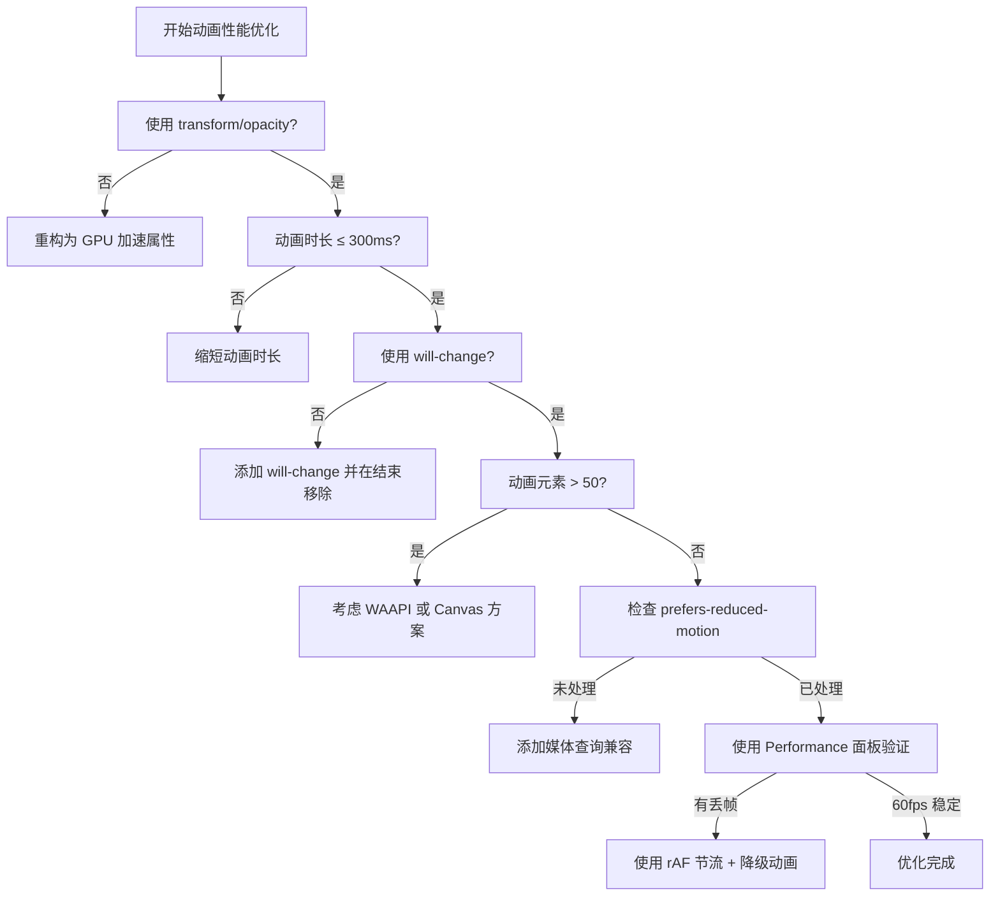

## 与 Vue 2 过渡系统差异

Vue 3 对 Transition 组件进行了全面重构，类名规范、API 设计和内部实现均有显著变化。

### 类名变更对照

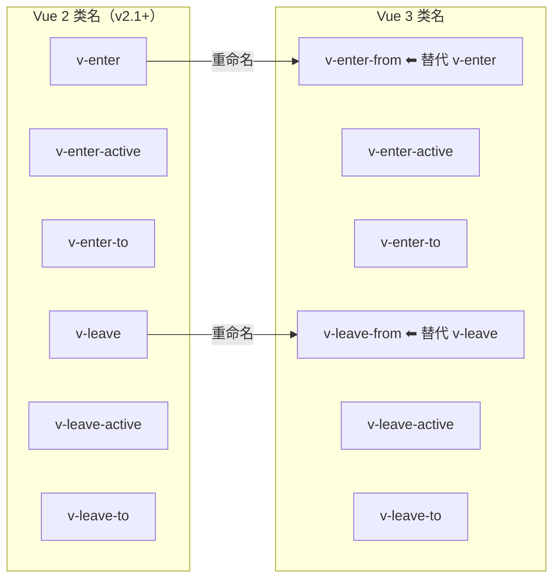

| Vue 2 | Vue 3 | 说明 |
|-------|-------|------|
| `v-enter` | `v-enter-from` | 语义更明确：表示动画起始状态 |
| `v-enter-active` | `v-enter-active` | 不变 |
| `v-enter-to` | `v-enter-to` | 不变 |
| `v-leave` | `v-leave-from` | 语义更明确：表示离开起始状态 |
| `v-leave-active` | `v-leave-active` | 不变 |
| `v-leave-to` | `v-leave-to` | 不变 |

### API 差异

```html
<!-- ── Vue 2 Transition 组件 ── -->
<!-- 在 Vue 2 中，Transition 是一个抽象组件，需要通过 render 函数或模板使用 -->
<transition name="fade" @before-enter="beforeEnter" @enter="enter">
  <div v-if="show">Vue 2</div>
</transition>

<!-- ── Vue 3 Transition 组件 ── -->
<!-- 1. 使用 PascalCase: <Transition>（也兼容 <transition>） -->
<!-- 2. 新增 appear 的一系列钩子 -->
<!-- 3. :css="false" 禁用 CSS 过渡检测（Vue 2 同样支持该选项，非新增） -->
<!-- 4. 新增 enterFromClass / leaveToClass 等自定义类名属性 -->
<Transition
  name="fade"
  :css="false"
  @before-enter="beforeEnter"
  @enter="enter"
  @appear="onAppear"
  enter-from-class="custom-enter-from"
>
  <div v-if="show">Vue 3</div>
</Transition>
```

### 源码级差异

```typescript
// ── Vue 2 源码核心逻辑（简化） ──
// src/platforms/web/runtime/components/transition.js

const transition = {
  name: 'transition',
  abstract: true, // Vue 2: 抽象组件，不渲染到 DOM
  props: {
    name: String,
    appear: Boolean,
    css: { type: Boolean, default: true },
    mode: String,
    // Vue 2 没有自定义类名属性
  },
  render(h: Function) {
    const children = this.$slots.default
    // 只支持单个子元素
    if (!children || children.length !== 1) return children
    const child = children[0]
    // 手动管理类名的添加/移除
    // ...
  }
}

// ── Vue 3 源码核心逻辑（简化） ──
// packages/runtime-dom/src/components/Transition.ts

const Transition = {
  name: 'Transition',
  // Vue 3: 不再是 abstract 组件，通过 Fragment 包裹
  props: {
    ...BaseTransition.props,
    // 新增自定义类名属性
    enterFromClass: String,
    enterActiveClass: String,
    enterToClass: String,
    leaveFromClass: String,
    leaveActiveClass: String,
    leaveToClass: String,
    appearFromClass: String,
    appearActiveClass: String,
    appearToClass: String,
  },
  setup(props, { slots }) {
    // 使用 Composition API 实现
    // 通过 hooks 系统管理类名
    // 支持多个子元素（通过 Fragment）
    // 使用 getTransitionRawChildren 处理子元素
  }
}
```

### 迁移清单

```typescript
// ── Vue 2 → Vue 3 迁移检查清单 ──

/**
 * 1. CSS 类名更新
 */
// Vue 2
.v2-enter { opacity: 0; }
.v2-leave { opacity: 0; }

// Vue 3
.v3-enter-from { opacity: 0; }
.v3-leave-from { opacity: 0; }

/**
 * 2. 全局类名替换（使用正则批量替换）
 * 查找: \.(\w+)-enter\b(?!-)
 * 替换: .$1-enter-from
 * 查找: \.(\w+)-leave\b(?!-)
 * 替换: .$1-leave-from
 */

/**
 * 3. 钩子函数签名
 */
// Vue 2: enter 钩子第二个参数是 done
function onEnter(el: HTMLElement, done: () => void) {}

// Vue 3: 完全相同，但建议使用 TypeScript 类型
function onEnter(el: Element, done: () => void) {}

/**
 * 4. 新增 appear 钩子
 */
function onAppear(el: Element, done: () => void) {
  // 初始渲染时的动画
  // Vue 2 中需要配合 appear 属性和 CSS 类名
  // Vue 3 中可以直接使用 JS 钩子
}

/**
 * 5. mode 行为差异
 */
// Vue 2: mode="out-in" 时，旧元素离开后新元素立即出现
// Vue 3: 行为基本一致，但内部实现使用 requestAnimationFrame 优化时序

/**
 * 6. TransitionGroup 差异
 */
// Vue 2: TransitionGroup 渲染为 span，可通过 tag 修改
// Vue 3: 同样渲染为 span，但内部使用 Fragment 优化
// 新增: 更好的 TypeScript 支持
```

### 兼容性处理

```css
/* 同时支持 Vue 2 和 Vue 3 的过渡类名 */
.vue-transition-enter-active,
.vue-transition-leave-active {
  transition: opacity 0.3s ease;
}

/* Vue 2 兼容 */
.vue-transition-enter,
.vue-transition-leave-to {
  opacity: 0;
}

/* Vue 3 兼容 */
.vue-transition-enter-from,
.vue-transition-leave-to {
  opacity: 0;
}

/* 或者使用自定义类名，在模板中统一指定 */
```

```vue
<!-- 跨版本兼容模板 -->
<Transition
  :enter-from-class="'v2-enter ' + 'v3-enter-from'"
  :leave-from-class="'v2-leave ' + 'v3-leave-from'"
  enter-active-class="v2-enter-active v3-enter-active"
  leave-active-class="v2-leave-active v3-leave-active"
>
  <div v-if="show">跨版本兼容</div>
</Transition>
```

---

> **源码延伸**：`BaseTransition`、`resolveTransitionHooks`、`whenTransitionEnds` 等内部实现的逐行解析见 [Transition源码分析](02-Transition源码分析.md)。

## 下一步

- [Transition源码分析](02-Transition源码分析.md) — BaseTransition、hooks 与过渡结束检测的源码级解析
- [自定义指令](03-自定义指令.md) — 可复用性：自定义指令、渲染函数