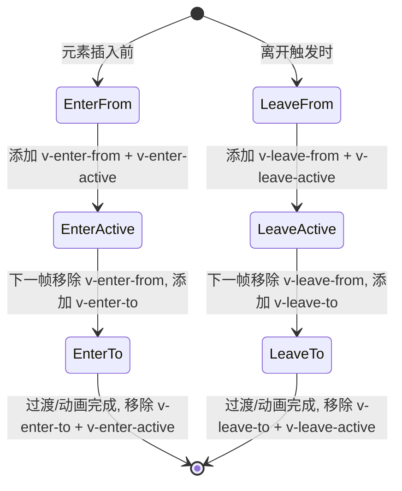
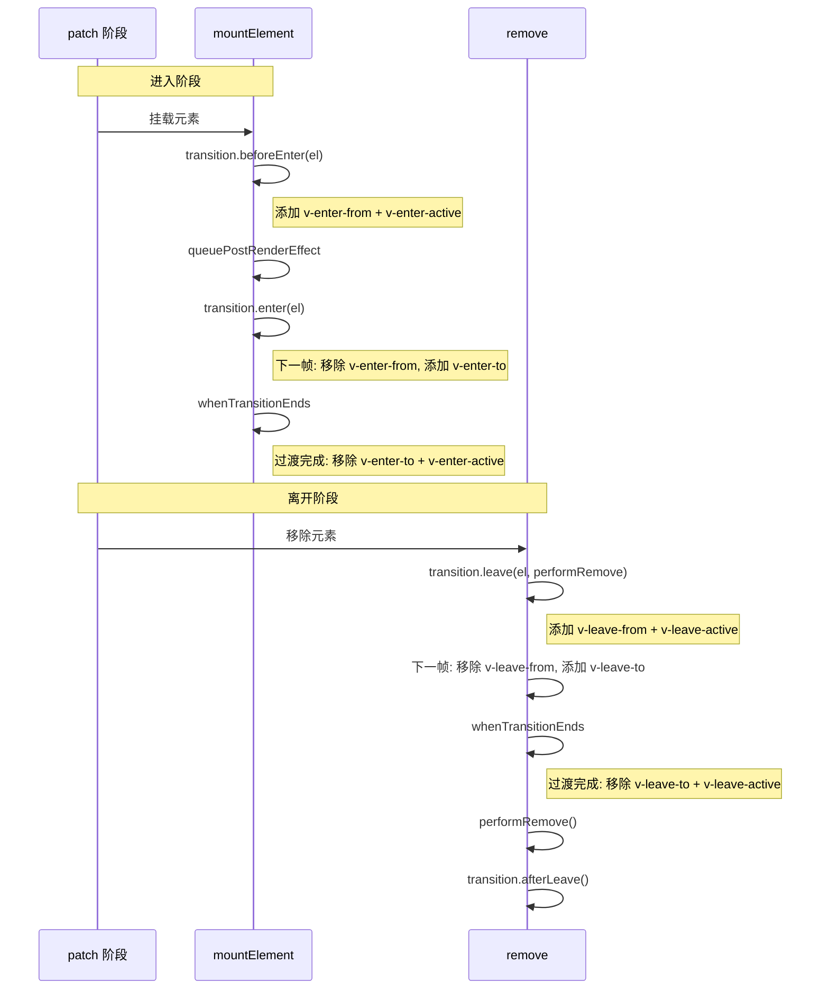

# Transition源码分析

## 前言

`Vue` 内置了 `Transition` 组件，可以帮助我们快速简单地实现基于状态变换的动画效果。该组件支持 `CSS 过渡动画`、`CSS 动画`、`JavaScript 钩子` 几种模式，接下来我们将逐步介绍这几种模式的实现原理。

## 基于 CSS 的过渡效果

首先来看官网上一个简单的关于 `CSS Transition` 过渡动画的示例：

```html
<template>
  <button @click="show = !show">Toggle</button>
  <Transition>
    <p v-if="show">hello</p>
  </Transition>
</template>

<style>
  .v-enter-active,
  .v-leave-active {
    transition: opacity 0.5s ease;
  }

  .v-enter-from,
  .v-leave-to {
    opacity: 0;
  }
</style>
```

然后再看官网上对于这些类名的实现定义：

1. `v-enter-from`：进入动画的起始状态。在元素插入之前添加，在元素插入完成后的下一帧移除。
2. `v-enter-active`：进入动画的生效状态。应用于整个进入动画阶段。在元素被插入之前添加，在过渡或动画完成之后移除。这个 `class` 可以被用来定义进入动画的持续时间、延迟与速度曲线类型。
3. `v-enter-to`：进入动画的结束状态。在元素插入完成后的下一帧被添加（也就是 `v-enter-from` 被移除的同时），在过渡或动画完成之后移除。
4. `v-leave-from`：离开动画的起始状态。在离开过渡效果被触发时立即添加，在一帧后被移除。
5. `v-leave-active`：离开动画的生效状态。应用于整个离开动画阶段。在离开过渡效果被触发时立即添加，在过渡或动画完成之后移除。这个 class 可以被用来定义离开动画的持续时间、延迟与速度曲线类型。
6. `v-leave-to`：离开动画的结束状态。在一个离开动画被触发后的下一帧被添加（也就是 `v-leave-from` 被移除的同时），在过渡或动画完成之后移除。

抛开源码不谈，如果在一个普通的 `Vue` 组件中，我们如何实现一个上述功能的过渡状态的 `CSS` 动画效果？按照官网的描述，整个流程可以用下面的状态流转图来表示：



可以看到，我们参考官网的描述，也可以简单地实现一个基于 `CSS` 的过渡动画，但这里存在了几个问题：

1. 硬编码了 `transition` 动画，没有实现 `animation` 动画。
2. 不够抽象，难以复用到后续组件。

接下来分析 `Vue` 源码是如何实现的，首先找到关于 `Transition` 组件的定义：

```js
export const Transition: FunctionalComponent<TransitionProps> =
  decorate((props, { slots }) =>
    h(BaseTransition, resolveTransitionProps(props), slots)
  )
```

代码很简单，`Transition` 组件是一个函数式组件，本身就是一个渲染函数。还记得我们之前说过吗，`Vue` 组件分为了有状态组件和函数组件，有状态组件内部会存储组件的状态，而函数组件不会。

我们知道 `Vue` 对 `Transition` 内置组件的功能定义就是一个**容器**，一个搬运工，需要渲染 `DOM`，那就不需要 `template`，本身不需要维护任何状态。所以这里直接通过一个函数式组件定义了 `Transition` 组件。

接着，我们看到该组件核心功能就是渲染 `BaseTransition` 组件，并为其传入**处理好的 `props`** 和内部挂载的 `slot`。先来看看 `BaseTransition` 组件，这里我们只关心与 `CSS` 动画相关的逻辑。

```js
const BaseTransitionImpl: ComponentOptions = {
  name: `BaseTransition`,

  props: BaseTransitionPropsValidators,

  setup(props: BaseTransitionProps, { slots }: SetupContext) {
    const instance = getCurrentInstance()!
    const state = useTransitionState()

    return () => {
      const children =
        slots.default && getTransitionRawChildren(slots.default(), true)
      if (!children || !children.length) {
        return
      }

      const child: VNode = findNonCommentChild(children)
      // 这里 props 不需要响应式追踪，为了更好的性能，去除响应式
      const rawProps = toRaw(props)
      const { mode } = rawProps

      // 检查 mode 参数合法性
      if (
        __DEV__ &&
        mode &&
        mode !== 'in-out' &&
        mode !== 'out-in' &&
        mode !== 'default'
      ) {
        warn(`invalid <transition> mode: ${mode}`)
      }

      // 如果正在离开中，返回空占位符
      if (state.isLeaving) {
        return emptyPlaceholder(child)
      }

      // 在 <transition><keep-alive/></transition> 的情况下，
      // 需要比较被 keep-alive 缓存的子节点类型
      const innerChild = getInnerChild(child)
      if (!innerChild) {
        return emptyPlaceholder(child)
      }

      // 获取进入状态的 hooks
      let enterHooks = resolveTransitionHooks(
        innerChild,
        rawProps,
        state,
        instance,
        // #11061, 确保 clone 后 enterHooks 是最新的
        hooks => (enterHooks = hooks),
      )

      if (innerChild.type !== Comment) {
        setTransitionHooks(innerChild, enterHooks)
      }

      let oldInnerChild = instance.subTree && getInnerChild(instance.subTree)

      // 处理 mode 模式
      if (
        oldInnerChild &&
        oldInnerChild.type !== Comment &&
        !isSameVNodeType(innerChild, oldInnerChild) &&
        recursiveGetSubtree(instance).type !== Comment
      ) {
        let leavingHooks = resolveTransitionHooks(
          oldInnerChild,
          rawProps,
          state,
          instance,
        )
        // 更新旧节点的 hooks，以支持动态 transition
        setTransitionHooks(oldInnerChild, leavingHooks)

        // out-in 模式
        if (mode === 'out-in' && innerChild.type !== Comment) {
          state.isLeaving = true
          // 返回占位符节点，当离开过渡结束后重新渲染组件
          leavingHooks.afterLeave = () => {
            state.isLeaving = false
            // #6835 即使 active 为 undefined 也需要更新
            if (!(instance.job.flags! & SchedulerJobFlags.DISPOSED)) {
              instance.update()
            }
            delete leavingHooks.afterLeave
            oldInnerChild = undefined
          }
          return emptyPlaceholder(child)
        } else if (mode === 'in-out' && innerChild.type !== Comment) {
          // in-out 模式，延迟移除
          leavingHooks.delayLeave = (
            el: TransitionElement,
            earlyRemove,
            delayedLeave,
          ) => {
            const leavingVNodesCache = getLeavingNodesForType(
              state,
              oldInnerChild!,
            )
            leavingVNodesCache[String(oldInnerChild!.key)] = oldInnerChild!
            // 提前移除的回调
            el[leaveCbKey] = () => {
              earlyRemove()
              el[leaveCbKey] = undefined
              delete enterHooks.delayedLeave
              oldInnerChild = undefined
            }
            enterHooks.delayedLeave = () => {
              delayedLeave()
              delete enterHooks.delayedLeave
              oldInnerChild = undefined
            }
          }
        } else {
          oldInnerChild = undefined
        }
      } else if (oldInnerChild) {
        oldInnerChild = undefined
      }

      // 返回子节点
      return child
    }
  }
}
```

可以看到 `BaseTransitionImpl` 的 `setup` 函数，核心就干了三件事：

**Step 1:** 为 `Transition` 下的子节点添加 `enterHooks`。

**Step 2:** 为 `Transition` 下的旧子节点添加 `leavingHooks`。

**Step 3:** 处理完成后直接返回子节点作为渲染内容。

那么，这些 `hooks` 到底做了些什么？以及这些 `hooks` 是在什么时候被执行的？逐一分析。

### 1. hooks 到底做了些什么？

要回答这些 `hooks` 到底做了什么，首先需要了解这些 `hooks` 是从哪里来的。再回到上述源码，我们知道 `hooks` 是通过：

```js
const leavingHooks = resolveTransitionHooks(
  oldInnerChild,
  rawProps,
  state,
  instance
)
```

这样的函数调用产生的，现在我们先不讨论这个函数的具体实现，先看看该函数的入参，有一个 `rawProps` 的参数，这个就是上文所说的 `Transition` 组件 `render` 函数中传入的 `props` 参数。

接下来就需要分析 `props` 中有些什么东西：

```js
export function resolveTransitionProps(
  rawProps: TransitionProps
): BaseTransitionProps<Element> {
  const baseProps: BaseTransitionProps<Element> = {}
  for (const key in rawProps) {
    if (!(key in DOMTransitionPropsValidators)) {
      ;(baseProps as any)[key] = (rawProps as any)[key]
    }
  }

  // 如果 css 为 false，则直接返回 baseProps，不添加 CSS 类名逻辑
  if (rawProps.css === false) {
    return baseProps
  }

  const {
    name = 'v',
    type,
    duration,
    enterFromClass = `${name}-enter-from`,
    enterActiveClass = `${name}-enter-active`,
    enterToClass = `${name}-enter-to`,
    appearFromClass = enterFromClass,
    appearActiveClass = enterActiveClass,
    appearToClass = enterToClass,
    leaveFromClass = `${name}-leave-from`,
    leaveActiveClass = `${name}-leave-active`,
    leaveToClass = `${name}-leave-to`,
  } = rawProps

  // ...
  return extend(baseProps, {
    onBeforeEnter(el) {
      addTransitionClass(el, enterFromClass)
      addTransitionClass(el, enterActiveClass)
    },
    onEnter: makeEnterHook(false),
    onAppear: makeEnterHook(true),
    onLeave(el, done) {
      el._isLeaving = true
      const resolve = () => finishLeave(el, done)
      addTransitionClass(el, leaveFromClass)
      // force reflow 以确保 *-leave-from 类名立即生效
      if (!el._enterCancelled) {
        forceReflow()
        addTransitionClass(el, leaveActiveClass)
      } else {
        addTransitionClass(el, leaveActiveClass)
        forceReflow()
      }
      nextFrame(() => {
        if (!el._isLeaving) return // 已取消
        removeTransitionClass(el, leaveFromClass)
        addTransitionClass(el, leaveToClass)
        if (!hasExplicitCallback(onLeave)) {
          whenTransitionEnds(el, type, leaveDuration, resolve)
        }
      })
      callHook(onLeave, [el, resolve])
    },
    // ...
  })
}
```

根据我们前面了解到的，`Vue` 会在特定阶段为节点增加或删除特定 `class`。而这个 `props` 正是为了所谓的**特定阶段**量身打造的**钩子**函数。举个例子，我们需要实现进入节点的 `v-enter-from`、`v-enter-active`、`v-enter-to` 类名的添加，我们只需要在 `onEnter` 进入钩子内实现逻辑：

```js
const makeEnterHook = (isAppear: boolean) => {
  return (el: Element, done: () => void) => {
    const hook = isAppear ? onAppear : onEnter
    const resolve = () => finishEnter(el, isAppear, done)
    callHook(hook, [el, resolve])
    nextFrame(() => {
      // 删除 v-enter-from 类名
      removeTransitionClass(el, isAppear ? appearFromClass : enterFromClass)
      // 添加 v-enter-to 类名
      addTransitionClass(el, isAppear ? appearToClass : enterToClass)
      // 动画结束时，执行 resolve 函数，即删除 v-enter-to、v-enter-active 类名
      if (!hasExplicitCallback(hook)) {
        whenTransitionEnds(el, type, enterDuration, resolve)
      }
    })
  }
}
```

这里的流程与上面的描述完全一致。

值得注意的是，`Vue 3.5` 中对 `onLeave` 钩子做了改进：在添加 `leaveActiveClass` 之前会检查 `el._enterCancelled` 状态，如果进入动画被取消过，则调整 `forceReflow` 的调用时机，确保 `CSS` 能正确获取最终状态（修复了 #10677）。

### 2. hooks 何时执行？

前面我们提到 `hooks` 将会在特定时间执行，用来对 `class` 进行增加或删除。比如 `enter-from` 至 `enter-to` 阶段的过渡或者动画效果的 `class` 被添加到 `DOM` 元素上。考虑到 `Vue` 在 `patch` 阶段已经有生成对应的 `DOM`（只不过还没有被真实地挂载到页面上而已），所以我们只需要在 `patch` 阶段做对应的 `class` 增删即可。

比如进入阶段的钩子函数，将会在 `mountElement` 中被调用：

```js
// 挂载元素节点
const mountElement = (vnode, ...) => {
  let el;
  let vnodeHook;
  const { type, props, shapeFlag, transition, patchFlag, dirs } = vnode;
  // ...
  if (needCallTransitionHooks) {
    // 执行 beforeEnter 钩子
    transition.beforeEnter(el);
  }
  // ...
  if ((vnodeHook = props && props.onVnodeMounted) || needCallTransitionHooks || dirs) {
    // post 各种钩子至后置执行任务池
    queuePostRenderEffect(() => {
      // 执行 enter 钩子
      needCallTransitionHooks && transition.enter(el);
    }, parentSuspense);
  }
};
```

离开阶段的钩子函数，在 `remove` 节点的时候被调用：

```js
// 移除 Vnode
const remove = vnode => {
  const { type, el, anchor, transition } = vnode;
  // ...

  const performRemove = () => {
    hostRemove(el);
    if (transition && !transition.persisted && transition.afterLeave) {
      // 执行 afterLeave 钩子
      transition.afterLeave();
    }
  };

  if (vnode.shapeFlag & ShapeFlags.ELEMENT && transition && !transition.persisted) {
    const { leave, delayLeave } = transition;
    // 执行 leave 钩子
    const performLeave = () => leave(el, performRemove);
    if (delayLeave) {
      // 执行 delayLeave 钩子
      delayLeave(vnode.el, performRemove, performLeave);
    } else {
      performLeave();
    }
  }
};
```

为了更加清晰地看懂这个流程，我们可以用下面的时序图来表示：



## JavaScript 钩子

`<Transition>` 组件在动画过渡的各个阶段定义了很多钩子函数，我们可以通过在钩子函数内部自定义实现各种动画效果。

```html
<Transition
  @before-enter="onBeforeEnter"
  @enter="onEnter"
  @after-enter="onAfterEnter"
  @enter-cancelled="onEnterCancelled"
  @before-leave="onBeforeLeave"
  @leave="onLeave"
  @after-leave="onAfterLeave"
  @leave-cancelled="onLeaveCancelled"
>
  <!-- ... -->
</Transition>
```

前面其实已经稍微提及到了部分钩子函数，比如 `onEnter`，这些钩子函数在源码中会被合并到 `Transition` 下子节点的 `transition` 属性上。这块的实现主要是通过 `setTransitionHooks` 函数来实现的：

```js
// 为 vnode 添加 transition 属性
export function setTransitionHooks(vnode: VNode, hooks: TransitionHooks): void {
  if (vnode.shapeFlag & ShapeFlags.COMPONENT && vnode.component) {
    vnode.transition = hooks
    setTransitionHooks(vnode.component.subTree, hooks)
  } else if (__FEATURE_SUSPENSE__ && vnode.shapeFlag & ShapeFlags.SUSPENSE) {
    vnode.ssContent!.transition = hooks.clone(vnode.ssContent!)
    vnode.ssFallback!.transition = hooks.clone(vnode.ssFallback!)
  } else {
    vnode.transition = hooks
  }
}
```

其中 `hooks` 包含了哪些内容？`hooks` 是通过 `resolveTransitionHooks` 函数调用生成的：

```js
export function resolveTransitionHooks(
  vnode: VNode,
  props: BaseTransitionProps<any>,
  state: TransitionState,
  instance: ComponentInternalInstance,
  postClone?: (hooks: TransitionHooks) => void,
): TransitionHooks {
  // 传入的各个钩子函数
  const {
    appear,
    mode,
    persisted = false,
    onBeforeEnter,
    onEnter,
    onAfterEnter,
    onEnterCancelled,
    onBeforeLeave,
    onLeave,
    onAfterLeave,
    onLeaveCancelled,
    onBeforeAppear,
    onAppear,
    onAfterAppear,
    onAppearCancelled,
  } = props

  const key = String(vnode.key)
  const leavingVNodesCache = getLeavingNodesForType(state, vnode)

  // 定义调用钩子函数的方法
  const callHook: TransitionHookCaller = (hook, args) => {
    hook &&
      callWithAsyncErrorHandling(
        hook,
        instance,
        ErrorCodes.TRANSITION_HOOK,
        args,
      )
  }

  const callAsyncHook = (
    hook: Hook<(el: any, done: () => void) => void>,
    args: [TransitionElement, () => void],
  ) => {
    const done = args[1]
    callHook(hook, args)
    if (isArray(hook)) {
      if (hook.every(hook => hook.length <= 1)) done()
    } else if (hook.length <= 1) {
      done()
    }
  }

  // 钩子函数定义
  const hooks: TransitionHooks<TransitionElement> = {
    mode,
    persisted,

    beforeEnter(el) {
      let hook = onBeforeEnter
      if (!state.isMounted) {
        if (appear) {
          hook = onBeforeAppear || onBeforeEnter
        } else {
          return
        }
      }
      // 对于相同元素 (v-show)，取消正在进行的离开动画
      if (el[leaveCbKey]) {
        el[leaveCbKey](true%20/*%20cancelled%20*)
      }
      // 对于相同 key 的切换元素 (v-if)，强制提前移除
      const leavingVNode = leavingVNodesCache[key]
      if (
        leavingVNode &&
        isSameVNodeType(vnode, leavingVNode) &&
        (leavingVNode.el as TransitionElement)[leaveCbKey]
      ) {
        ;(leavingVNode.el as TransitionElement)[leaveCbKey]!()
      }
      callHook(hook, [el])
    },

    enter(el) {
      let hook = onEnter
      let afterHook = onAfterEnter
      let cancelHook = onEnterCancelled
      if (!state.isMounted) {
        if (appear) {
          hook = onAppear || onEnter
          afterHook = onAfterAppear || onAfterEnter
          cancelHook = onAppearCancelled || onEnterCancelled
        } else {
          return
        }
      }
      let called = false
      const done = (el[enterCbKey] = (cancelled?) => {
        if (called) return
        called = true
        if (cancelled) {
          callHook(cancelHook, [el])
        } else {
          callHook(afterHook, [el])
        }
        if (hooks.delayedLeave) {
          hooks.delayedLeave()
        }
        el[enterCbKey] = undefined
      })
      if (hook) {
        callAsyncHook(hook, [el, done])
      } else {
        done()
      }
    },

    leave(el, remove) {
      const key = String(vnode.key)
      // 取消正在进行的进入动画
      if (el[enterCbKey]) {
        el[enterCbKey](true%20/*%20cancelled%20*)
      }
      // 如果正在卸载，直接移除
      if (state.isUnmounting) {
        return remove()
      }
      callHook(onBeforeLeave, [el])
      let called = false
      const done = (el[leaveCbKey] = (cancelled?) => {
        if (called) return
        called = true
        remove()
        if (cancelled) {
          callHook(onLeaveCancelled, [el])
        } else {
          callHook(onAfterLeave, [el])
        }
        el[leaveCbKey] = undefined
        if (leavingVNodesCache[key] === vnode) {
          delete leavingVNodesCache[key]
        }
      })
      leavingVNodesCache[key] = vnode
      if (onLeave) {
        callAsyncHook(onLeave, [el, done])
      } else {
        done()
      }
    },

    clone(vnode) {
      const hooks = resolveTransitionHooks(
        vnode,
        props,
        state,
        instance,
        postClone,
      )
      if (postClone) postClone(hooks)
      return hooks
    },
  }

  return hooks
}
```

一个最基础的 `hooks` 主要包含 `beforeEnter`、`enter`、`leave` 这几个阶段，将会在 `patch` 的环节中被执行，执行的逻辑就是 `Vue` 官网上描述的逻辑。

值得注意的是，`Vue 3.5` 中 `resolveTransitionHooks` 相较于早期版本有以下改进：

1. **Symbol 键名替代字符串属性**：使用 `leaveCbKey = Symbol('_leaveCb')` 和 `enterCbKey = Symbol('_enterCb')` 替代了之前的 `el._leaveCb` 和 `el._enterCb` 字符串属性，避免了与用户代码的属性名冲突。
2. **enter 钩子中增加 cancelled 回调**：`done` 函数现在支持 `cancelled` 参数，当进入动画被取消时会调用 `onEnterCancelled` 钩子。
3. **leave 钩子中增加取消进入动画的逻辑**：在离开动画开始时，如果检测到有正在进行的进入动画（`el[enterCbKey]`），会先取消它。
4. **clone 钩子支持 postClone 回调**：允许在克隆钩子后执行额外的逻辑，确保 `enterHooks` 在 `clone` 后保持最新。

另外，值得注意的是，除了这几个关键阶段之外，`Transition` 还支持一个 `mode` 来指定动画的过渡时机，举个例子，如果 `mode === 'out-in'`，先执行离开动画，然后在其完成**之后**再执行元素的进入动画。那么这个时候就需要**延迟渲染进入动画**，则会为 `leavingHooks` 额外添加一个新的钩子：`afterLeave`，该钩子将会在离开后执行，表示着离开后再更新 `DOM`。

```js
const BaseTransitionImpl = {
  setup() {
    // ...
    if (mode === 'out-in' && innerChild.type !== Comment) {
      state.isLeaving = true
      // 返回空的占位符节点，当离开过渡结束后，重新渲染组件
      leavingHooks.afterLeave = () => {
        state.isLeaving = false
        // #6835 即使 active 为 undefined 也需要更新
        if (!(instance.job.flags! & SchedulerJobFlags.DISPOSED)) {
          instance.update()
        }
        delete leavingHooks.afterLeave
        oldInnerChild = undefined
      }
      return emptyPlaceholder(child)
    }
  }
}
```

## 过渡结束的检测机制

前面多次提到 `whenTransitionEnds` 函数，它是 `Transition` 组件检测过渡或动画何时结束的关键机制。下面分析它的实现：

```js
function whenTransitionEnds(
  el: Element & { _endId?: number },
  expectedType: TransitionProps['type'] | undefined,
  explicitTimeout: number | null,
  resolve: () => void,
) {
  const id = (el._endId = ++endId)
  const resolveIfNotStale = () => {
    if (id === el._endId) {
      resolve()
    }
  }

  // 如果用户显式指定了 duration，则直接使用 setTimeout
  if (explicitTimeout != null) {
    return setTimeout(resolveIfNotStale, explicitTimeout)
  }

  // 否则，通过 getTransitionInfo 自动检测过渡类型和时长
  const { type, timeout, propCount } = getTransitionInfo(el, expectedType)
  if (!type) {
    return resolve()
  }

  const endEvent = type + 'end'
  let ended = 0
  const end = () => {
    el.removeEventListener(endEvent, onEnd)
    resolveIfNotStale()
  }
  const onEnd = (e: Event) => {
    if (e.target === el && ++ended >= propCount) {
      end()
    }
  }
  // 设置超时保底，防止 transitionend 事件未触发
  setTimeout(() => {
    if (ended < propCount) {
      end()
    }
  }, timeout + 1)
  el.addEventListener(endEvent, onEnd)
}
```

`whenTransitionEnds` 的检测策略如下：

1. 如果用户通过 `duration` prop 显式指定了过渡时长，则直接使用 `setTimeout`。
2. 否则，通过 `getTransitionInfo` 函数自动检测元素的 `CSS transition` 或 `animation` 的类型和时长。
3. 监听对应的 `transitionend` 或 `animationend` 事件。
4. 设置一个超时保底机制（`timeout + 1` 毫秒），防止事件未触发导致过渡永远无法结束。
5. 使用 `endId` 来防止过时的回调被执行。

`getTransitionInfo` 函数会通过 `window.getComputedStyle` 读取元素的 `transition-duration`、`transition-delay`、`animation-duration`、`animation-delay` 等属性，计算出实际的过渡超时时间。

## 总结

本小节我们核心介绍了 `Transition` 内置组件的实现原理：

1. `Transition` 组件本身是一个无状态组件（函数式组件），内部本身不渲染任何额外的 `DOM` 元素，`Transition` 渲染的是组件嵌套的第一个子元素节点。
2. 如果子元素是应用了 `CSS` 过渡或动画，`Transition` 组件会在子元素节点渲染的适当时机，动态为子元素节点增加或删除对应的 `class`。
3. 如果为 `Transition` 定义了一些钩子函数，那么这些钩子函数会被合入到子节点的关键生命周期 `beforeEnter`、`enter`、`leave` 中调用执行，通过 `setTransitionHooks` 被设置到子节点的 `transition` 属性中。
4. `Vue 3.5` 中使用 `Symbol` 键名替代了字符串属性来存储回调，避免了属性名冲突；同时改进了进入/离开动画的取消逻辑，确保动画状态切换的正确性。
5. 过渡结束的检测通过 `whenTransitionEnds` 实现，支持显式 `duration` 指定和自动检测两种方式，并设有超时保底机制。
