# 自定义指令

> 自定义指令用于封装底层 DOM 操作逻辑，实现跨组件的 DOM 行为复用。Vue 3 中指令钩子函数已与组件生命周期对齐。

## 指令钩子

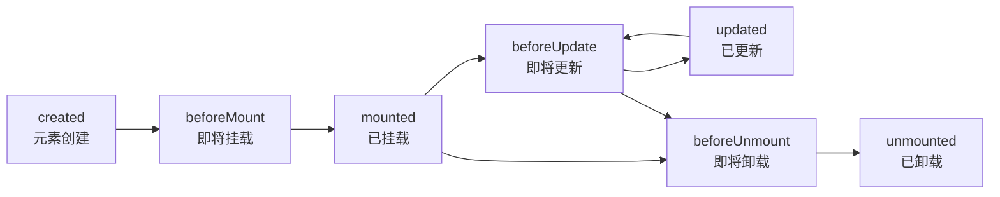

### 指令钩子与组件生命周期的对应关系

指令钩子并非孤立存在，它们与组件生命周期紧密耦合。理解这种映射关系是编写可靠指令的基础。

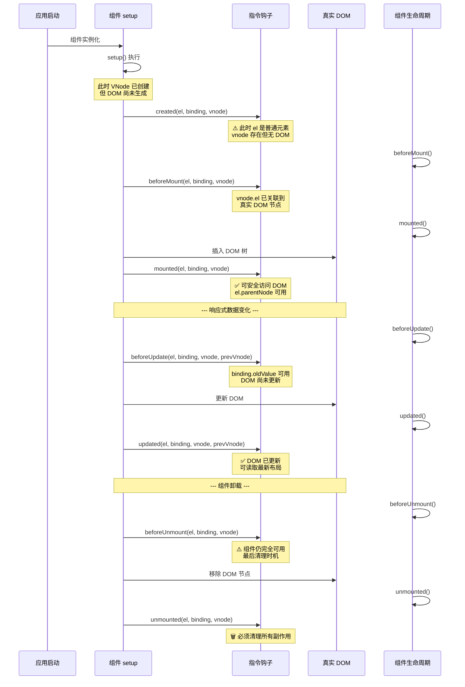

**关键时序规则：**

| 钩子 | 组件对应阶段 | DOM 状态 | 典型用途 |
|------|-------------|----------|---------|
| `created` | setup() 之后 | 无 DOM，仅有普通元素 | 初始化状态，极少使用 |
| `beforeMount` | beforeMount | VNode 已关联 DOM 节点 | 在挂载前修改元素 |
| `mounted` | mounted | 完全挂载，可访问父节点 | 注册事件、启动观察器、测量布局 |
| `beforeUpdate` | beforeUpdate | 旧 DOM 状态 | 记录更新前状态（如滚动位置） |
| `updated` | updated | 新 DOM 状态 | 根据新数据调整 DOM |
| `beforeUnmount` | beforeUnmount | 仍在 DOM 中 | 最后的机会访问组件状态 |
| `unmounted` | unmounted | 已从 DOM 移除 | 清理事件、观察器、定时器 |

**源码级实现：指令钩子的调用时机**

Vue 3 在 `renderer.ts` 中通过 `invokeDirectiveHook` 统一调度指令钩子。以下是简化版实现：

```typescript
// 简化自 Vue 3 源码 packages/runtime-core/src/directives.ts

interface VNode {
  dirs?: DirectiveBinding[] | null
  el: Node | null
  // ...
}

interface DirectiveBinding {
  dir: ObjectDirective
  instance: ComponentInternalInstance | null
  value: unknown
  oldValue: unknown
  arg: string
  modifiers: DirectiveModifiers
}

function invokeDirectiveHook(
  vnode: VNode,
  prevVNode: VNode | null,
  name: 'created' | 'beforeMount' | 'mounted' | 'beforeUpdate' | 'updated' | 'beforeUnmount' | 'unmounted'
) {
  const bindings = vnode.dirs
  const prevBindings = prevVNode?.dirs

  for (let i = 0; i < bindings!.length; i++) {
    const binding = bindings![i]
    const hook = binding.dir[name]

    if (hook) {
      // 在 update 系列钩子中注入 oldValue
      if (name === 'beforeUpdate' || name === 'updated') {
        binding.oldValue = prevBindings![i]?.value
      }

      // 调用钩子函数，传入 (el, binding, vnode, prevVnode)
      hook(
        vnode.el,
        binding as DirectiveBinding,
        vnode,
        prevVNode
      )
    }
  }
}
```

**调用链路：**

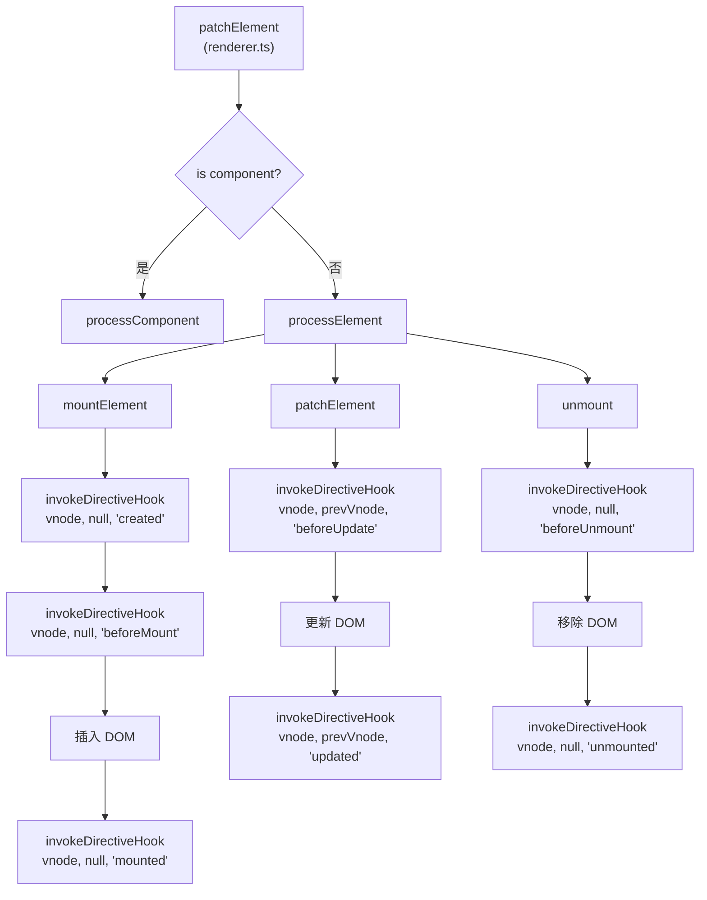

**钩子执行顺序实验：**

```typescript
// 验证钩子执行顺序的测试指令
const vLifecycle: Directive<HTMLElement, string> = {
  created(el, binding, vnode) {
    console.log('1. created — el:', el.tagName, 'parent:', el.parentNode) // parent: null
  },
  beforeMount(el, binding, vnode) {
    console.log('2. beforeMount — parent:', el.parentNode) // parent: null (尚未插入)
  },
  mounted(el, binding, vnode) {
    console.log('3. mounted — parent:', el.parentNode?.nodeName) // parent: DIV (已插入)
  },
  beforeUpdate(el, binding, vnode, prevVnode) {
    console.log('4. beforeUpdate — oldValue:', binding.oldValue, 'value:', binding.value)
  },
  updated(el, binding, vnode, prevVnode) {
    console.log('5. updated — DOM已更新')
  },
  beforeUnmount(el, binding, vnode) {
    console.log('6. beforeUnmount — 组件仍可用')
  },
  unmounted(el, binding, vnode) {
    console.log('7. unmounted — 清理完毕')
  }
}
```

**注意事项：**

1. **`created` 钩子中 `el.parentNode` 为 `null`**：此时元素尚未插入 DOM 树，无法访问父节点或进行布局计算。
2. **`mounted` 钩子保证子组件已挂载**：与组件的 `mounted` 行为一致，此时整个子树都已就绪。
3. **`updated` 不保证子组件已更新**：与组件的 `updated` 行为一致，子组件可能尚未完成更新。
4. **`beforeUnmount` 中组件实例仍完整**：可以访问 `binding.instance` 获取组件数据，适合做最后的持久化操作。

## 基本用法

```vue
<script setup lang="ts">
import { ref } from 'vue'

const vFocus = {
  mounted: (el: HTMLElement) => el.focus()
}
</script>

<template>
  <input v-focus />
</template>
```

### 指令的响应式更新机制

指令的 `mounted` 只执行一次，但 `updated` 钩子会在响应式数据变化时反复触发。理解触发条件对于编写高效指令至关重要。

**触发 `updated` 钩子的条件：**

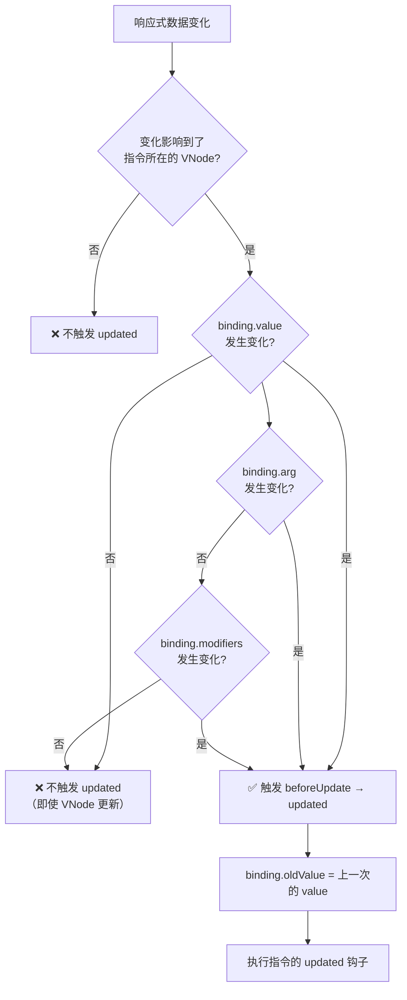

**核心原理：**

Vue 3 在 `patchElement` 阶段会比较新旧 VNode 上的指令绑定。只有 `value`、`arg` 或 `modifiers` 中至少一项发生变化时，才会触发 `beforeUpdate` 和 `updated` 钩子。

```typescript
// 简化自 Vue 3 源码：packages/runtime-core/src/directives.ts

function resolveDirectiveBinding(
  dir: ObjectDirective,
  instance: ComponentInternalInstance | null,
  node: VNode,
  prevVNode: VNode | null
): DirectiveBinding | undefined {
  // 从 VNode.props 中提取指令参数
  const rawArgs = node.props?.[`onVnode${capitalize(dir.name)}`]
  // ...

  const binding: DirectiveBinding = {
    instance,
    value: evaluateValue(rawArgs),  // 重新求值
    oldValue: undefined,
    arg: parseArg(rawArgs),
    modifiers: parseModifiers(rawArgs),
    dir
  }

  return binding
}

// 在 patchElement 中的比较逻辑
function patchElement(n1: VNode, n2: VNode) {
  // ...
  if (n2.dirs) {
    for (let i = 0; i < n2.dirs.length; i++) {
      const newBinding = n2.dirs[i]
      const oldBinding = n1.dirs?.[i]

      // 浅比较 value、arg、modifiers
      if (
        !hasChanged(newBinding.value, oldBinding?.value) &&
        !hasChanged(newBinding.arg, oldBinding?.arg) &&
        !hasChanged(newBinding.modifiers, oldBinding?.modifiers)
      ) {
        // 跳过：指令参数未变化
        continue
      }

      // 触发 beforeUpdate 和 updated
      invokeDirectiveHook(n2, n1, 'beforeUpdate')
      // ... DOM 更新 ...
      invokeDirectiveHook(n2, n1, 'updated')
    }
  }
}
```

**`binding.value` 的变化检测机制：**

```typescript
// Vue 3 使用 Object.is 进行浅比较
function hasChanged(x: unknown, y: unknown): boolean {
  if (x === y) {
    return x === 0 && 1 / x !== 1 / (y as number) // 区分 +0 和 -0
  } else {
    return x === x || y === y // 处理 NaN
  }
}
```

**重要：引用类型的变化检测陷阱**

```typescript
// ❌ 错误：对象引用未变，不会触发 updated
const config = reactive({ color: 'red' })
// v-my-directive="config"
// 修改 config.color = 'blue' → 不会触发 updated，因为 config 引用未变

// ✅ 正确：使用计算属性创建新引用
const config = reactive({ color: 'red' })
const directiveValue = computed(() => ({ ...config }))
// v-my-directive="directiveValue"
// 修改 config.color → computed 重新计算 → 新对象引用 → 触发 updated

// ✅ 正确：直接使用原始值
const color = ref('red')
// v-my-directive="color"
// 修改 color.value → 新字符串值 → 触发 updated
```

**updated 钩子的性能优化策略：**

```typescript
// 策略 1：在 updated 中做早期返回
const vOptimized: Directive<HTMLElement, string> = {
  mounted(el, binding) {
    // 昂贵的初始化操作
    el.style.transform = `translateX(${binding.value})`
  },
  updated(el, binding) {
    // 仅在实际值变化时执行
    if (binding.value === binding.oldValue) return
    el.style.transform = `translateX(${binding.value})`
  }
}

// 策略 2：使用函数简写时自动处理 mounted + updated
// 函数简写 = { mounted, updated } 共用同一函数
const vAuto: Directive<HTMLElement, string> = (el, binding) => {
  // 这个函数在 mounted 和 updated 时都会执行
  el.style.color = binding.value
}
// 等价于：
// const vAuto = {
//   mounted(el, binding) { el.style.color = binding.value },
//   updated(el, binding) { el.style.color = binding.value }
// }
```

**完整示例：响应式指令的更新链路追踪**

```typescript
import { ref, type Directive } from 'vue'

const vTrackUpdate: Directive<HTMLElement, number> = {
  mounted(el, binding) {
    console.log('[mounted] value:', binding.value)
    el.textContent = `Count: ${binding.value}`
    el.style.background = '#e0f7fa'
  },

  beforeUpdate(el, binding) {
    console.log('[beforeUpdate] oldValue:', binding.oldValue, '→ value:', binding.value)
    // 保存更新前的滚动位置
    ;(el as any).__scrollTop = el.scrollTop
  },

  updated(el, binding) {
    console.log('[updated] DOM已更新, value:', binding.value)
    el.textContent = `Count: ${binding.value}`

    // 恢复滚动位置
    if ((el as any).__scrollTop !== undefined) {
      el.scrollTop = (el as any).__scrollTop
    }

    // 根据值变化幅度调整样式
    const delta = binding.value - (binding.oldValue ?? 0)
    if (delta > 0) {
      el.style.background = '#c8e6c9' // 增加：绿色
    } else if (delta < 0) {
      el.style.background = '#ffcdd2' // 减少：红色
    }
  },

  unmounted(el) {
    console.log('[unmounted] 清理')
  }
}

// 使用：
// <div v-track-update="count"></div>
// 当 count 从 0 → 1 → 3 → 2 变化时，每次都会触发完整的钩子链路
```

**指令的响应式依赖追踪：**

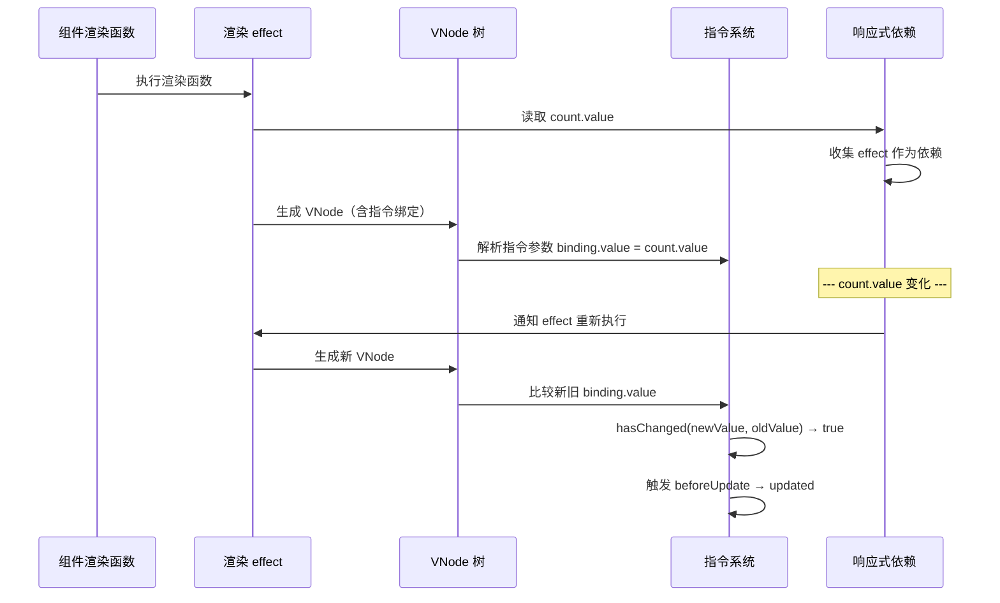

**关键结论：**

1. **指令的响应式更新依赖组件渲染**：指令本身不建立独立的响应式依赖，而是通过组件的渲染 effect 间接追踪。
2. **函数简写 = mounted + updated**：`app.directive('name', fn)` 等价于 `{ mounted: fn, updated: fn }`。
3. **引用类型需注意引用相等性**：修改对象属性不会触发 updated，需要创建新引用。
4. **`binding.oldValue` 仅在 `beforeUpdate` 和 `updated` 中可用**：在 `mounted` 中为 `undefined`。

## 全局注册

```typescript
// main.ts
import { createApp } from 'vue'

const app = createApp(App)

// 完整写法
app.directive('focus', {
  mounted(el: HTMLElement) { el.focus() }
})

// 简写（mounted + updated）
app.directive('color', (el: HTMLElement, binding) => {
  el.style.color = binding.value
})
```

## 钩子参数

```typescript
const vTooltip: Directive<HTMLElement, string> = {
  mounted(el, binding) {
    // binding.value — 指令值
    // binding.arg — 参数（v-tooltip:top 中的 top）
    // binding.modifiers — 修饰符对象
    // binding.instance — 组件实例
    // binding.oldValue — 上一个值
    // vnode — 底层 VNode
    // prevVnode — 上一个 VNode

    const tooltip = document.createElement('div')
    tooltip.textContent = binding.value
    tooltip.className = `tooltip ${binding.arg || 'top'}`
    el.appendChild(tooltip)
  }
}
```

### 指令参数的类型推导

Vue 3 提供了完整的 TypeScript 类型支持，通过 `Directive` 泛型接口实现类型安全的指令开发。

**`Directive` 类型定义（简化自源码）：**

```typescript
// 来自 packages/runtime-core/src/directives.ts

export interface Directive<T = any, V = any> {
  created?: DirectiveHook<T, null, V>
  beforeMount?: DirectiveHook<T, null, V>
  mounted?: DirectiveHook<T, null, V>
  beforeUpdate?: DirectiveHook<T, DirectiveBinding<V>, V>
  updated?: DirectiveHook<T, DirectiveBinding<V>, V>
  beforeUnmount?: DirectiveHook<T, null, V>
  unmounted?: DirectiveHook<T, null, V>
  getSSRProps?: SSRDirectiveHook
  deep?: boolean
}

// 函数简写类型
export type FunctionDirective<T = any, V = any> = DirectiveHook<T, any, V>

// 钩子函数签名
export type DirectiveHook<T = any, Prev = DirectiveBinding<any> | null, V = any> = (
  el: T,
  binding: DirectiveBinding<V>,
  vnode: VNode<any, T>,
  prevVnode: VNode<any, T> | null
) => void

// Binding 完整类型
export interface DirectiveBinding<V = any> {
  instance: ComponentPublicInstance | null
  value: V
  oldValue: V | null
  arg?: string
  modifiers: DirectiveModifiers
  dir: ObjectDirective<any, V>
}
```

**泛型参数说明：**

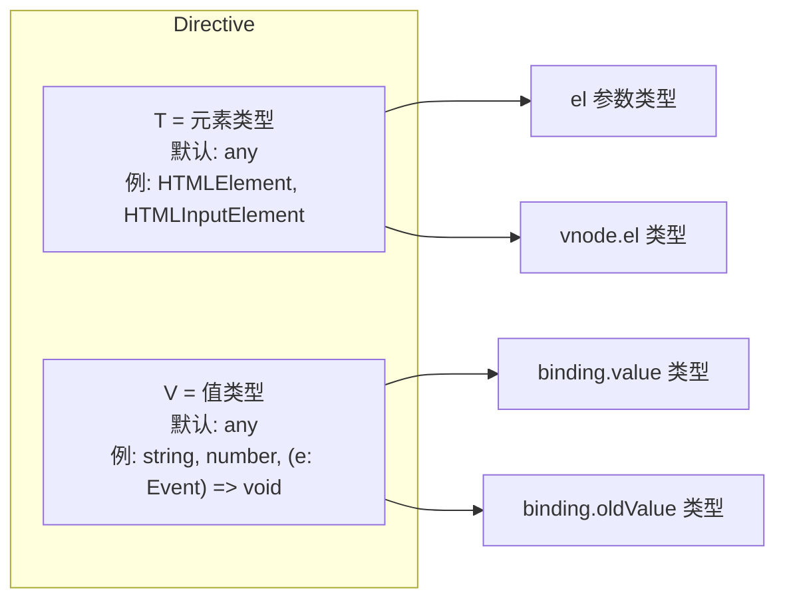

**类型安全实践：**

```typescript
import type { Directive, DirectiveBinding } from 'vue'

// 1. 基础类型约束
const vColor: Directive<HTMLElement, string> = {
  mounted(el, binding) {
    // el: HTMLElement ✅
    // binding.value: string ✅
    el.style.color = binding.value // ✅ 类型安全
  }
}

// 2. 特定元素类型
const vInputFocus: Directive<HTMLInputElement, boolean> = {
  mounted(el, binding) {
    // el: HTMLInputElement ✅
    if (binding.value) {
      el.focus()     // ✅ HTMLInputElement 有 focus()
      el.select()    // ✅ HTMLInputElement 有 select()
      el.value = ''  // ✅ HTMLInputElement 有 value
    }
  }
}

// 3. 函数类型值（事件处理器）
const vClickOutside: Directive<HTMLElement, (e: MouseEvent) => void> = {
  mounted(el, binding) {
    // binding.value: (e: MouseEvent) => void ✅
    const handler = (e: MouseEvent) => {
      if (!el.contains(e.target as Node)) {
        binding.value(e) // ✅ 类型安全的调用
      }
    }
    document.addEventListener('click', handler)
  }
}

// 4. 复杂值类型
interface TooltipOptions {
  text: string
  position: 'top' | 'bottom' | 'left' | 'right'
  delay?: number
  theme?: 'light' | 'dark'
}

const vTooltip: Directive<HTMLElement, TooltipOptions> = {
  mounted(el, binding) {
    const { text, position, delay = 0, theme = 'dark' } = binding.value
    // ✅ 完整的类型推导和自动补全
    const tooltip = createTooltipElement(text, position, theme)
    setTimeout(() => el.appendChild(tooltip), delay)
  },
  updated(el, binding) {
    if (binding.value.text !== binding.oldValue?.text) {
      updateTooltipText(el, binding.value.text)
    }
  }
}

// 5. 使用 satisfies 进行类型检查（TypeScript 4.9+ 特性，与 Vue 版本无关）
const vLazy = {
  mounted(el: HTMLImageElement, binding: DirectiveBinding<string>) {
    const observer = new IntersectionObserver(([entry]) => {
      if (entry.isIntersecting) {
        el.src = binding.value
        observer.disconnect()
      }
    })
    observer.observe(el)
  },
  unmounted(el: HTMLImageElement) {
    // 清理逻辑
  }
} satisfies Directive<HTMLImageElement, string>
```

**类型安全的 arg 和 modifiers：**

```typescript
// 定义指令参数和修饰符的联合类型
type TooltipArg = 'top' | 'bottom' | 'left' | 'right'
type TooltipModifiers = 'hover' | 'click' | 'focus'

interface TypedDirectiveBinding<V, A extends string = string, M extends string = string>
  extends DirectiveBinding<V> {
  arg: A
  modifiers: Record<M, boolean>
}

// 封装类型安全的指令工厂
function createTypedDirective<
  T extends HTMLElement,
  V,
  A extends string = string,
  M extends string = string
>(
  config: {
    mounted?: (
      el: T,
      binding: TypedDirectiveBinding<V, A, M>,
      vnode: VNode
    ) => void
    updated?: (
      el: T,
      binding: TypedDirectiveBinding<V, A, M>,
      vnode: VNode,
      prevVnode: VNode
    ) => void
    unmounted?: (el: T, binding: TypedDirectiveBinding<V, A, M>) => void
  }
): Directive<T, V> {
  return config as Directive<T, V>
}

// 使用工厂函数
const vPosition = createTypedDirective<
  HTMLElement,
  string,
  'top' | 'bottom' | 'left' | 'right',
  'hover' | 'click'
>({
  mounted(el, binding) {
    // binding.arg: 'top' | 'bottom' | 'left' | 'right' ✅
    // binding.modifiers.hover: boolean ✅
    // binding.modifiers.click: boolean ✅
    const position = binding.arg ?? 'top'
    const trigger = binding.modifiers.hover ? 'mouseenter' : 'click'

    el.addEventListener(trigger, () => {
      showTooltip(el, binding.value, position)
    })
  }
})

// 使用：
// v-position:top.hover="'提示文本'"
// 注意：该工厂主要约束钩子内部 binding.arg / modifiers 的类型推导；
// 模板中 arg 的拼写（如误写 center）TypeScript 无法静态检查，需配合运行时校验或 ESLint 插件
```

**`vnode` 和 `prevVnode` 的类型信息：**

```typescript
import type { VNode } from 'vue'

const vInspect: Directive<HTMLElement, unknown> = {
  mounted(el, binding, vnode) {
    // vnode.type — 组件/元素类型
    // vnode.props — 所有 props
    // vnode.children — 子节点
    // vnode.el — 对应的 DOM 元素
    // vnode.component — 组件实例（如果是组件）

    console.log('VNode 信息:', {
      type: vnode.type,           // 如 'div', 'span', 或组件对象
      props: vnode.props,         // { class: 'foo', id: 'bar', ... }
      hasComponent: !!vnode.component,
      key: vnode.key,
      el: vnode.el === el         // true
    })
  },

  updated(el, binding, vnode, prevVnode) {
    // prevVnode 提供更新前的 VNode 信息
    console.log('Props 变化:', {
      old: prevVnode?.props,
      new: vnode.props
    })
  }
}
```

**全局注册时的类型增强：**

```typescript
// types/directives.d.ts

// 方式一：为全局指令提供实例属性类型
import type { Directive } from 'vue'

declare module 'vue' {
  interface ComponentCustomProperties {
    vFocus: Directive<HTMLElement>
    vLazyLoad: Directive<HTMLImageElement, string>
    vDebounce: Directive<HTMLInputElement, (value: string) => void>
  }
}

// 方式二：使用 GlobalDirectives 接口，为模板中的指令提供 binding 类型检查
// 注意：键名为模板中 v-xxx 对应的驼峰写法，值为 binding 的形状描述
declare module 'vue' {
  interface GlobalDirectives {
    vFocus: {}
    vLazyLoad: {
      value: string
    }
    vDebounce: {
      value: (value: string) => void
    }
  }
}
```

**类型推导决策图：**

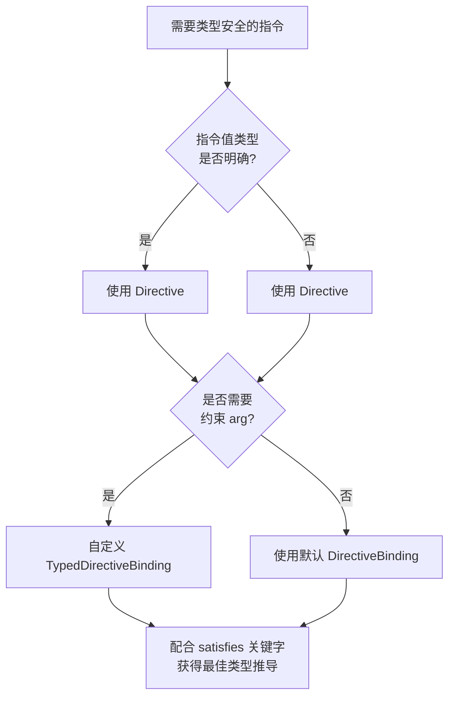

## 实战示例

### v-click-outside（点击外部检测）

生产级的点击外部检测指令，支持触摸事件、动态触发条件、排除元素列表和微任务时序处理。

```typescript
// directives/vClickOutside.ts
import type { Directive, DirectiveBinding } from 'vue'

interface ClickOutsideOptions {
  /** 回调函数 */
  handler: (event: MouseEvent | TouchEvent) => void
  /** 排除的元素列表（点击这些元素不触发） */
  exclude?: (HTMLElement | string)[]
  /** 触发的事件类型 */
  events?: ('click' | 'touchstart' | 'pointerdown')[]
  /** 是否启用 */
  enabled?: boolean
}

// 存储元素对应的处理器映射
const handlerMap = new WeakMap<
  HTMLElement,
  (event: MouseEvent | TouchEvent) => void
>()

function resolveExcludeElements(
  exclude: ClickOutsideOptions['exclude']
): HTMLElement[] {
  if (!exclude) return []
  return exclude.map((item) => {
    if (typeof item === 'string') {
      const el = document.querySelector<HTMLElement>(item)
      if (!el) {
        console.warn(`[v-click-outside] 未找到排除元素: ${item}`)
      }
      return el
    }
    return item
  }).filter(Boolean) as HTMLElement[]
}

export const vClickOutside: Directive<
  HTMLElement,
  ClickOutsideOptions | ((event: MouseEvent | TouchEvent) => void)
> = {
  mounted(el, binding) {
    const resolveOptions = (): ClickOutsideOptions => {
      const value = binding.value
      if (typeof value === 'function') {
        return { handler: value, events: ['click', 'touchstart'] }
      }
      return {
        handler: value.handler,
        exclude: value.exclude ?? [],
        events: value.events ?? ['click', 'touchstart'],
        enabled: value.enabled ?? true
      }
    }

    const options = resolveOptions()
    const excludeElements = resolveExcludeElements(options.exclude)

    const listener = (event: MouseEvent | TouchEvent) => {
      // 检查启用状态
      if (!options.enabled) return

      const target = event.target as Node

      // 检查是否点击在元素内部
      if (el.contains(target)) return

      // 检查是否点击在排除元素上
      if (excludeElements.some(excludeEl => excludeEl?.contains(target))) {
        return
      }

      // 使用微任务延迟执行，避免与其他事件冲突
      Promise.resolve().then(() => {
        options.handler(event)
      })
    }

    // 注册多个事件类型
    options.events!.forEach((eventType) => {
      document.addEventListener(eventType, listener, true)
    })

    handlerMap.set(el, listener)
  },

  updated(el, binding) {
    const oldOptions = typeof binding.oldValue === 'function'
      ? { handler: binding.oldValue, events: ['click', 'touchstart'] as const }
      : binding.oldValue

    const newOptions = typeof binding.value === 'function'
      ? { handler: binding.value, events: ['click', 'touchstart'] as const }
      : binding.value

    // 仅在 handler 引用变化时更新监听器
    if (oldOptions?.handler !== newOptions?.handler) {
      // 移除旧监听器
      const oldListener = handlerMap.get(el)
      if (oldListener) {
        (oldOptions?.events ?? ['click', 'touchstart']).forEach((eventType) => {
          document.removeEventListener(eventType, oldListener, true)
        })
      }

      // 注册新监听器
      const newListener = (event: MouseEvent | TouchEvent) => {
        if (newOptions?.enabled === false) return

        const target = event.target as Node
        if (el.contains(target)) return

        const excludeEls = resolveExcludeElements(newOptions?.exclude ?? [])
        if (excludeEls.some(excludeEl => excludeEl?.contains(target))) return

        Promise.resolve().then(() => {
          newOptions?.handler(event)
        })
      }

      (newOptions?.events ?? ['click', 'touchstart']).forEach((eventType) => {
        document.addEventListener(eventType, newListener, true)
      })

      handlerMap.set(el, newListener)
    }
  },

  unmounted(el, binding) {
    const listener = handlerMap.get(el)
    if (listener) {
      const options = typeof binding.value === 'function'
        ? { events: ['click', 'touchstart'] as const }
        : binding.value ?? { events: ['click', 'touchstart'] as const }

      ;(options.events ?? ['click', 'touchstart']).forEach((eventType) => {
        document.removeEventListener(eventType, listener, true)
      })

      handlerMap.delete(el)
    }
  }
}

// 使用示例：
// <div v-click-outside="{ handler: closeModal, exclude: ['.dropdown'], enabled: isOpen }">
```

**指令架构图：**

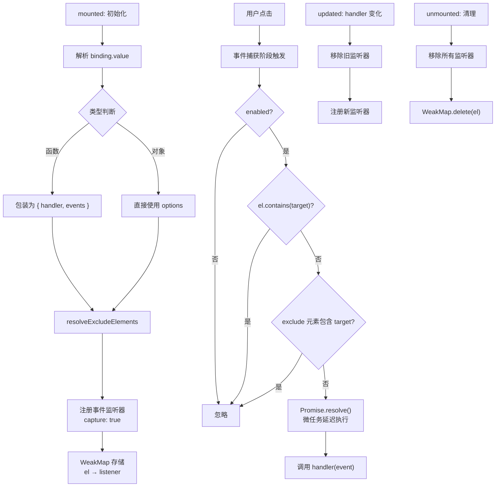

---

### v-intersect（IntersectionObserver 懒加载与曝光追踪）

基于 IntersectionObserver 的生产级指令，支持图片懒加载、元素曝光埋点、无限滚动等多种场景。

```typescript
// directives/vIntersect.ts
import type { Directive, DirectiveBinding } from 'vue'

interface IntersectOptions {
  /** 进入视口的回调 */
  onEnter?: (entry: IntersectionObserverEntry) => void
  /** 离开视口的回调 */
  onLeave?: (entry: IntersectionObserverEntry) => void
  /** 只触发一次（用于懒加载） */
  once?: boolean
  /** IntersectionObserver 配置 */
  root?: Element | null
  rootMargin?: string
  threshold?: number | number[]
  /** 是否启用观察 */
  enabled?: boolean
}

// 全局 Observer 管理：相同配置共享同一 Observer 实例
const observerCache = new Map<string, IntersectionObserver>()
const elementObserverMap = new WeakMap<Element, IntersectionObserver>()
const elementCallbackMap = new WeakMap<Element, IntersectOptions>()

function getObserverKey(options: IntersectOptions): string {
  return JSON.stringify({
    root: options.root ?? null,
    rootMargin: options.rootMargin ?? '0px',
    threshold: options.threshold ?? 0
  })
}

function getOrCreateObserver(options: IntersectOptions): IntersectionObserver {
  const key = getObserverKey(options)
  if (!observerCache.has(key)) {
    const observer = new IntersectionObserver(
      (entries) => {
        entries.forEach((entry) => {
          const callbackOptions = elementCallbackMap.get(entry.target)
          if (!callbackOptions) return

          if (entry.isIntersecting) {
            callbackOptions.onEnter?.(entry)
            if (callbackOptions.once) {
              observer.unobserve(entry.target)
              elementObserverMap.delete(entry.target)
              elementCallbackMap.delete(entry.target)
            }
          } else {
            callbackOptions.onLeave?.(entry)
          }
        })
      },
      {
        root: options.root ?? null,
        rootMargin: options.rootMargin ?? '0px',
        threshold: options.threshold ?? 0
      }
    )
    observerCache.set(key, observer)
  }
  return observerCache.get(key)!
}

export const vIntersect: Directive<
  HTMLElement,
  IntersectOptions | ((entry: IntersectionObserverEntry) => void)
> = {
  mounted(el, binding) {
    const options: IntersectOptions = typeof binding.value === 'function'
      ? { onEnter: binding.value, threshold: 0.1 }
      : {
          onEnter: binding.value.onEnter,
          onLeave: binding.value.onLeave,
          once: binding.value.once ?? false,
          root: binding.value.root ?? null,
          rootMargin: binding.value.rootMargin ?? '0px',
          threshold: binding.value.threshold ?? 0,
          enabled: binding.value.enabled ?? true
        }

    if (options.enabled === false) return

    elementCallbackMap.set(el, options)
    const observer = getOrCreateObserver(options)

    observer.observe(el)
    elementObserverMap.set(el, observer)
  },

  updated(el, binding) {
    const oldOptions: IntersectOptions = typeof binding.oldValue === 'function'
      ? { onEnter: binding.oldValue }
      : (binding.oldValue ?? {})

    const newOptions: IntersectOptions = typeof binding.value === 'function'
      ? { onEnter: binding.value }
      : binding.value

    // enabled 变化处理
    if (oldOptions.enabled !== newOptions.enabled) {
      const observer = elementObserverMap.get(el)
      if (observer) {
        if (newOptions.enabled === false) {
          observer.unobserve(el)
        } else {
          observer.observe(el)
        }
      }
    }

    // 回调变化：更新存储的回调
    elementCallbackMap.set(el, newOptions)

    // Observer 配置变化：切换 Observer
    if (
      oldOptions.rootMargin !== newOptions.rootMargin ||
      oldOptions.threshold !== newOptions.threshold ||
      oldOptions.root !== newOptions.root
    ) {
      const oldObserver = elementObserverMap.get(el)
      oldObserver?.unobserve(el)
      elementObserverMap.delete(el)

      const newObserver = getOrCreateObserver(newOptions)
      newObserver.observe(el)
      elementObserverMap.set(el, newObserver)
    }
  },

  unmounted(el) {
    const observer = elementObserverMap.get(el)
    observer?.unobserve(el)
    elementObserverMap.delete(el)
    elementCallbackMap.delete(el)
  }
}

// ===== 使用场景 =====

// 1. 图片懒加载
// 

// 2. 元素曝光埋点
// <div v-intersect="{ onEnter: reportExposure, onLeave: reportLeave, threshold: 0.5 }">

// 3. 无限滚动
// <div v-intersect="{ onEnter: loadMore, rootMargin: '100px' }">加载更多</div>

// 4. 滚动动画触发
// <div v-intersect="{ onEnter: playAnimation, once: true, threshold: 0.2 }">
```

**IntersectionObserver 共享架构：**

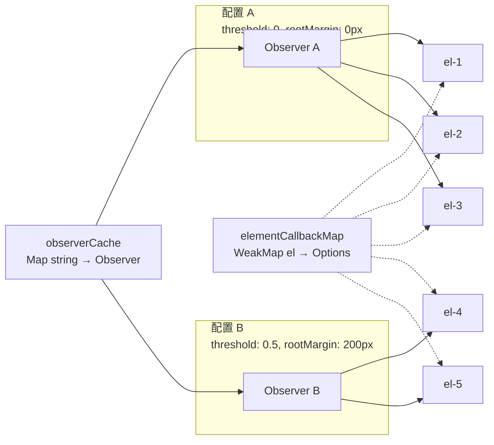

---

### v-debounce（防抖输入）

生产级防抖指令，支持自定义延迟、即时首次触发（leading edge）、取消机制和异步验证。

```typescript
// directives/vDebounce.ts
import type { Directive } from 'vue'

interface DebounceOptions {
  /** 防抖回调，接收当前输入值 */
  handler: (value: string, event: Event) => void | Promise<void>
  /** 防抖延迟（毫秒） */
  delay?: number
  /** 是否在首次触发时立即执行 (leading edge) */
  leading?: boolean
  /** 异步验证函数，返回 false 则取消执行 */
  validate?: (value: string) => boolean
  /** 加载状态回调 */
  onLoading?: (loading: boolean) => void
}

// 存储每个元素的状态
interface DebounceState {
  timer: ReturnType<typeof setTimeout> | null
  leadingExecuted: boolean
  loading: boolean
  inputHandler: (event: Event) => void
  clearHandler: (event: Event) => void
}

const stateMap = new WeakMap<HTMLElement, DebounceState>()

export const vDebounce: Directive<
  HTMLInputElement | HTMLTextAreaElement,
  DebounceOptions | ((value: string, event: Event) => void)
> = {
  mounted(el, binding) {
    const resolveOptions = (): DebounceOptions => {
      const value = binding.value
      if (typeof value === 'function') {
        return { handler: value, delay: 300, leading: false }
      }
      return {
        handler: value.handler,
        delay: value.delay ?? 300,
        leading: value.leading ?? false,
        validate: value.validate,
        onLoading: value.onLoading
      }
    }

    const options = resolveOptions()

    const execute = async (event: Event) => {
      const inputEl = event.target as HTMLInputElement | HTMLTextAreaElement
      const value = inputEl.value

      // 执行验证
      if (options.validate && !options.validate(value)) {
        return
      }

      // 更新加载状态
      if (options.onLoading) {
        state.loading = true
        options.onLoading(true)
        el.classList.add('is-debouncing')
      }

      try {
        await options.handler(value, event)
      } finally {
        if (options.onLoading) {
          state.loading = false
          options.onLoading(false)
          el.classList.remove('is-debouncing')
        }
      }
    }

    const inputHandler = (event: Event) => {
      // Leading edge：首次输入立即执行
      if (options.leading && !state.leadingExecuted) {
        state.leadingExecuted = true
        execute(event)
        // 重置 leading 标记（在下一次空闲时）
        if (state.timer) clearTimeout(state.timer)
        state.timer = setTimeout(() => {
          state.leadingExecuted = false
        }, options.delay)
        return
      }

      // 标准防抖
      if (state.timer) clearTimeout(state.timer)
      state.timer = setTimeout(() => {
        execute(event)
        state.leadingExecuted = false
        state.timer = null
      }, options.delay)
    }

    // 清除按钮逻辑（type="search" 时的 X 按钮）
    const clearHandler = (event: Event) => {
      if (state.timer) {
        clearTimeout(state.timer)
        state.timer = null
      }
      state.leadingExecuted = false
      if (options.onLoading) {
        options.onLoading(false)
        el.classList.remove('is-debouncing')
      }
    }

    const state: DebounceState = {
      timer: null,
      leadingExecuted: false,
      loading: false,
      inputHandler,
      clearHandler
    }

    stateMap.set(el, state)

    el.addEventListener('input', inputHandler)
    el.addEventListener('search', clearHandler) // type="search" 的清除事件

    // 处理表单重置
    const form = el.closest('form')
    if (form) {
      const resetHandler = () => {
        if (state.timer) {
          clearTimeout(state.timer)
          state.timer = null
        }
        state.leadingExecuted = false
      }
      form.addEventListener('reset', resetHandler, { once: false })
      ;(el as any).__debounceFormReset = resetHandler
      ;(el as any).__debounceForm = form
    }
  },

  updated(el, binding) {
    const oldValue = binding.oldValue
    const newValue = binding.value

    // 比较 handler 引用
    const oldHandler = typeof oldValue === 'function' ? oldValue : oldValue?.handler
    const newHandler = typeof newValue === 'function' ? newValue : newValue?.handler
    const oldDelay = typeof oldValue === 'function' ? 300 : (oldValue?.delay ?? 300)
    const newDelay = typeof newValue === 'function' ? 300 : (newValue?.delay ?? 300)

    // handler 或 delay 变化时重建输入处理器
    if (oldHandler !== newHandler || oldDelay !== newDelay) {
      const state = stateMap.get(el)
      if (!state) return

      el.removeEventListener('input', state.inputHandler)
      el.removeEventListener('search', state.clearHandler)

      // 清除挂起的定时器
      if (state.timer) {
        clearTimeout(state.timer)
        state.timer = null
      }

      const options: DebounceOptions = typeof newValue === 'function'
        ? { handler: newValue, delay: newDelay }
        : newValue

      const newInputHandler = (event: Event) => {
        if (options.leading && !state.leadingExecuted) {
          state.leadingExecuted = true
          options.handler(
            (event.target as HTMLInputElement).value,
            event
          )
          if (state.timer) clearTimeout(state.timer)
          state.timer = setTimeout(() => {
            state.leadingExecuted = false
          }, options.delay!)
          return
        }

        if (state.timer) clearTimeout(state.timer)
        state.timer = setTimeout(() => {
          options.handler(
            (event.target as HTMLInputElement).value,
            event
          )
          state.leadingExecuted = false
          state.timer = null
        }, options.delay!)
      }

      const newClearHandler = () => {
        if (state.timer) {
          clearTimeout(state.timer)
          state.timer = null
        }
        state.leadingExecuted = false
      }

      state.inputHandler = newInputHandler
      state.clearHandler = newClearHandler

      el.addEventListener('input', newInputHandler)
      el.addEventListener('search', newClearHandler)
    }
  },

  unmounted(el) {
    const state = stateMap.get(el)
    if (!state) return

    el.removeEventListener('input', state.inputHandler)
    el.removeEventListener('search', state.clearHandler)

    if (state.timer) {
      clearTimeout(state.timer)
      state.timer = null
    }

    // 清理表单重置监听器
    const form = (el as any).__debounceForm as HTMLFormElement | undefined
    const resetHandler = (el as any).__debounceFormReset as (() => void) | undefined
    if (form && resetHandler) {
      form.removeEventListener('reset', resetHandler)
    }

    el.classList.remove('is-debouncing')
    stateMap.delete(el)
  }
}

// 使用示例：
// <input v-debounce="{ handler: searchAPI, delay: 500, leading: true, onLoading: setLoading }" />
// <input v-debounce="handleInput" />  <!-- 简单用法：默认 300ms -->
```

**防抖时序图：**

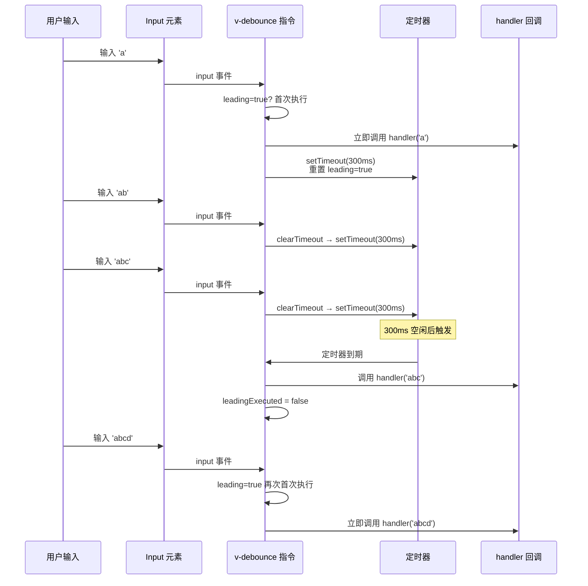

---

### v-auto-resize（自动调整 textarea 高度）

基于 CSS 技巧和 DOM 测量的自动高度调整指令，比常见的 scrollHeight 方案更稳定。

```typescript
// directives/vAutoResize.ts
import type { Directive } from 'vue'

interface AutoResizeOptions {
  /** 最小高度 */
  minHeight?: number
  /** 最大高度 */
  maxHeight?: number
  /** 行高（用于计算行数） */
  lineHeight?: number
}

const mirrorMap = new WeakMap<HTMLElement, HTMLDivElement>()

function createMirror(el: HTMLTextAreaElement, options: AutoResizeOptions): HTMLDivElement {
  const computed = window.getComputedStyle(el)
  const mirror = document.createElement('div')

  // 复制所有影响高度的样式
  const copyStyles = [
    'box-sizing', 'width', 'font-family', 'font-size', 'font-weight',
    'font-style', 'letter-spacing', 'text-transform', 'word-spacing',
    'text-indent', 'padding-top', 'padding-bottom', 'padding-left',
    'padding-right', 'border-top-width', 'border-bottom-width',
    'line-height'
  ]

  copyStyles.forEach((prop) => {
    mirror.style[prop as any] = computed[prop as any]
  })

  mirror.style.position = 'absolute'
  mirror.style.top = '0'
  mirror.style.left = '0'
  mirror.style.visibility = 'hidden'
  mirror.style.height = 'auto'
  mirror.style.whiteSpace = 'pre-wrap'
  mirror.style.overflowWrap = 'break-word'
  mirror.style.pointerEvents = 'none'
  mirror.style.width = `${el.clientWidth}px`

  if (options.minHeight) {
    mirror.style.minHeight = `${options.minHeight}px`
  }

  document.body.appendChild(mirror)
  return mirror
}

function updateHeight(
  el: HTMLTextAreaElement,
  mirror: HTMLDivElement,
  options: AutoResizeOptions
) {
  // mirror 配合 white-space: pre-wrap 使用 textContent，可原样保留换行
  const value = el.value || el.placeholder || ' '
  mirror.textContent = value
  // 在末尾添加换行，确保最后一行的高度也计入
  mirror.textContent += '\n'

  let height = mirror.scrollHeight

  if (options.minHeight && height < options.minHeight) {
    height = options.minHeight
  }
  if (options.maxHeight && height > options.maxHeight) {
    height = options.maxHeight
    el.style.overflowY = 'auto'
  } else {
    el.style.overflowY = 'hidden'
  }

  el.style.height = `${height}px`
}

export const vAutoResize: Directive<HTMLTextAreaElement, AutoResizeOptions | undefined> = {
  mounted(el, binding) {
    const options: AutoResizeOptions = binding.value ?? {}
    const mirror = createMirror(el, options)
    mirrorMap.set(el, mirror)

    // 初始调整
    updateHeight(el, mirror, options)

    // 监听输入
    const inputHandler = () => updateHeight(el, mirror, options)
    el.addEventListener('input', inputHandler)
    ;(el as any).__autoResizeHandler = inputHandler

    // 监听窗口大小变化（宽度变化影响换行）
    const resizeObserver = new ResizeObserver(() => {
      mirror.style.width = `${el.clientWidth}px`
      updateHeight(el, mirror, options)
    })
    resizeObserver.observe(el)
    ;(el as any).__autoResizeObserver = resizeObserver
  },

  updated(el, binding) {
    const mirror = mirrorMap.get(el)
    if (!mirror) return

    const options = binding.value ?? {}
    // 选项变化可能导致高度限制变化
    updateHeight(el, mirror, options)
  },

  unmounted(el) {
    const mirror = mirrorMap.get(el)
    if (mirror) {
      mirror.remove()
      mirrorMap.delete(el)
    }

    const handler = (el as any).__autoResizeHandler
    if (handler) {
      el.removeEventListener('input', handler)
    }

    const observer = (el as any).__autoResizeObserver as ResizeObserver | undefined
    observer?.disconnect()
  }
}

// 使用：
// <textarea v-auto-resize="{ minHeight: 80, maxHeight: 300 }"></textarea>
```

## Vue 3 指令钩子对照

| Vue 2 | Vue 3 | 说明 |
|-------|-------|------|
| `bind` | `beforeMount` | 首次绑定 |
| `inserted` | `mounted` | 插入 DOM |
| `update` | — | 已移除（合并到 updated） |
| `componentUpdated` | `updated` | 组件更新后 |
| `unbind` | `unmounted` | 卸载 |

### 与 Vue 2 指令系统的深度差异

除了钩子函数重命名，Vue 3 在指令系统的底层实现上有多个重要变化。

**1. 钩子函数重命名对照表（完整版）：**

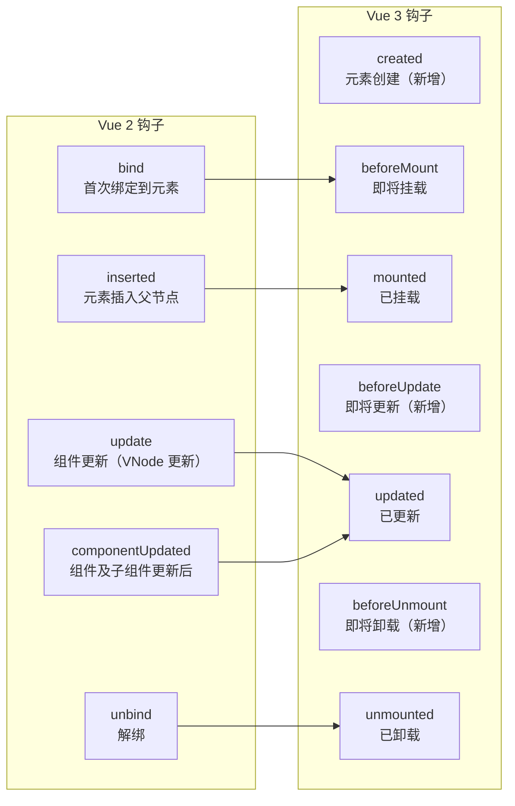

**2. 钩子参数变化：**

```typescript
// Vue 2 钩子参数
Vue.directive('my-dir', {
  bind(el, binding, vnode, oldVnode) {
    // binding.name — 指令名
    // binding.value — 指令值
    // binding.oldValue — 上一个值（仅在 update/componentUpdated 中可用）
    // binding.expression — 表达式字符串
    // binding.arg — 参数
    // binding.modifiers — 修饰符
    // vnode.context — 组件实例（Vue 2 特有）
  }
})

// Vue 3 钩子参数
const vMyDir: Directive = {
  mounted(el, binding, vnode, prevVnode) {
    // binding.instance — 组件实例（替代 vnode.context）
    // binding.dir — 指令对象本身（新增）
    // vnode.el — DOM 元素（与 el 相同）
    // prevVnode — 上一个 VNode（替代 oldVnode）
    // ⚠️ binding.expression 已移除
    // ⚠️ binding.name 已移除
  }
}
```

**3. 组件实例访问方式变化：**

```typescript
// Vue 2：通过 vnode.context 访问组件实例
Vue.directive('my-dir', {
  bind(el, binding, vnode) {
    const vm = vnode.context  // Vue 2 组件实例
    vm.$emit('custom-event')
    vm.someData = 'new value'
  }
})

// Vue 3：通过 binding.instance 访问组件实例
const vMyDir: Directive = {
  mounted(el, binding) {
    const instance = binding.instance  // ComponentPublicInstance | null
    // instance 是组件的公共代理，可以访问暴露的属性
    if (instance) {
      // 访问组件暴露的数据
      console.log(instance.$el)
      // 调用组件方法（需在 defineExpose 中暴露）
    }
  }
}
```

**4. 函数简写的行为差异：**

```typescript
// Vue 2：函数简写 = bind + update
Vue.directive('color', function (el, binding) {
  el.style.color = binding.value
})
// 等价于 { bind: fn, update: fn }

// Vue 3：函数简写 = mounted + updated
app.directive('color', (el, binding) => {
  el.style.color = binding.value
})
// 等价于 { mounted: fn, updated: fn }
```

**5. 多根节点组件中的指令行为：**

```typescript
// Vue 3 支持多根节点（Fragment），指令行为有变化

// Vue 2：单根节点，指令始终绑定到根元素
// <template><div v-my-dir>A</div><div>B</div></template> ❌ 编译错误

// Vue 3：多根节点，指令需要显式指定绑定目标
// <template><div v-my-dir>A</div><div>B</div></template> ✅ 合法
// 指令只作用于第一个 div
```

**6. 与 vnode 生命周期的一致性：**

```typescript
// Vue 3 指令钩子与组件生命周期完全对齐
// 这是 Vue 2 没有的设计

// 组件生命周期：        指令钩子：
// setup()               —
// beforeMount           beforeMount
// mounted               mounted
// beforeUpdate          beforeUpdate
// updated               updated
// beforeUnmount         beforeUnmount
// unmounted             unmounted
// —                     created（在 setup 之后、beforeMount 之前）

// 这种对齐使得指令的行为更可预测
// 例如：在组件的 mounted 中访问 DOM 时，指令的 mounted 已经执行完毕
```

**7. 迁移指南：**

```typescript
// Vue 2 → Vue 3 迁移模式

// 模式 1：简单重命名
// Vue 2
Vue.directive('highlight', {
  bind(el, binding) { /* ... */ },
  inserted(el) { /* ... */ },
  unbind(el) { /* ... */ }
})

// Vue 3
app.directive('highlight', {
  beforeMount(el, binding) { /* ... */ },
  mounted(el) { /* ... */ },
  unmounted(el) { /* ... */ }
})

// 模式 2：update 钩子迁移
// Vue 2 中 update 和 componentUpdated 的职责
// 在 Vue 3 中需要合并到 updated

// Vue 2
Vue.directive('scroll', {
  update(el, binding) {
    // 组件更新时（VNode 更新，DOM 未更新）
    el.__scrollPos = el.scrollTop
  },
  componentUpdated(el, binding) {
    // 组件及子组件更新后（DOM 已更新）
    el.scrollTop = el.__scrollPos
  }
})

// Vue 3
const vScroll: Directive = {
  beforeUpdate(el) {
    // 替代 update：DOM 未更新，保存状态
    ;(el as any).__scrollPos = el.scrollTop
  },
  updated(el) {
    // 替代 componentUpdated：DOM 已更新，恢复状态
    el.scrollTop = (el as any).__scrollPos
  }
}
```

**8. 全局指令的注册时机：**

```typescript
// Vue 2：可以在应用创建后随时注册
Vue.directive('focus', { /* ... */ })
new Vue({ /* ... */ }).$mount('#app')

// Vue 3：必须在 app.mount() 之前注册
const app = createApp(App)
app.directive('focus', { /* ... */ })
app.mount('#app')

// ❌ 以下在 Vue 3 中无效
// app.mount('#app')
// app.directive('focus', { /* ... */ }) // 不会生效
```

---

## 指令 vs 组件的选择决策树

指令和组件是 Vue 中两种不同的代码复用方式。选择错误会导致代码复杂度和维护成本上升。

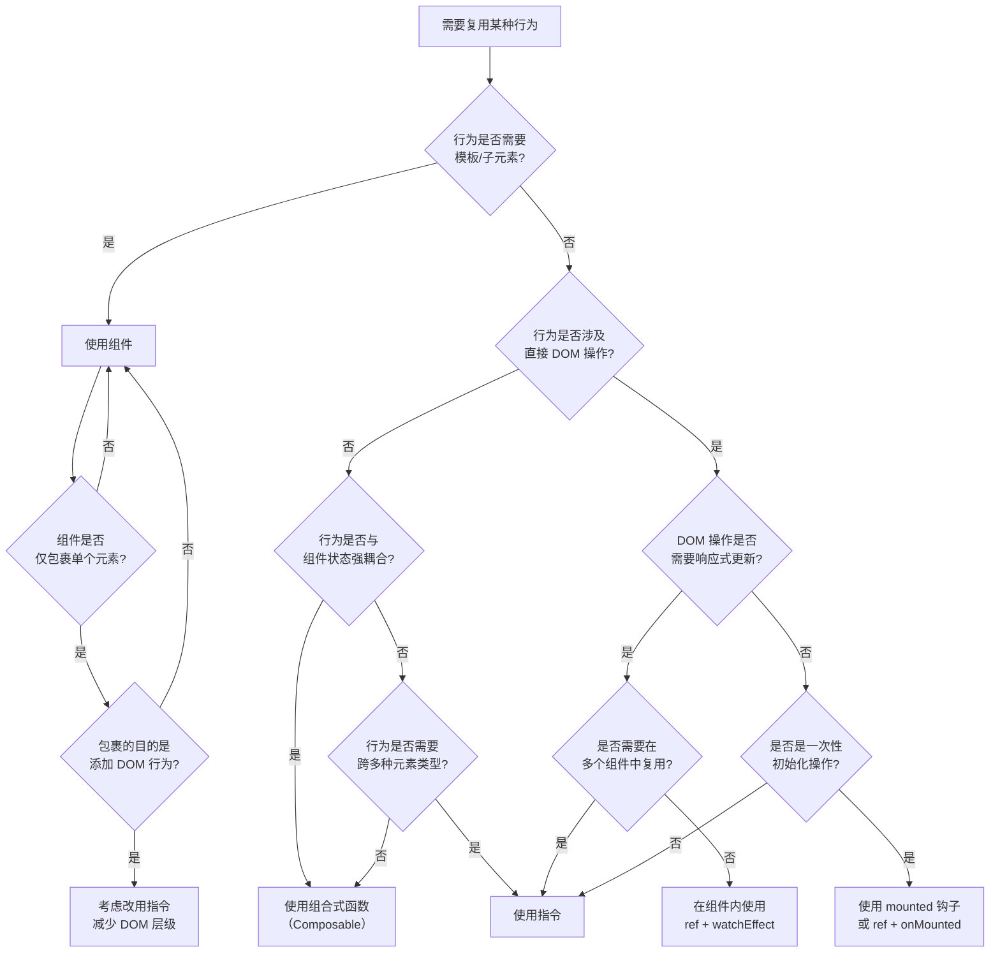

**决策矩阵：**

| 场景 | 推荐方案 | 原因 |
|------|---------|------|
| 点击外部关闭 | 指令 `v-click-outside` | 纯 DOM 事件，无模板需求 |
| 图片懒加载 | 指令 `v-lazy` | 直接操作 `img.src`，无需包裹元素 |
| 输入防抖 | 指令 `v-debounce` | 直接绑定 input 事件 |
| 权限控制（显示/隐藏） | 指令 `v-permission` | 直接操作 `el.style.display` 或 `el.remove()` |
| 表单验证 | 组合式函数 `useValidation` | 需要管理复杂状态和规则 |
| 数据请求 | 组合式函数 `useFetch` | 与组件状态紧密耦合 |
| 模态框 | 组件 `<Modal>` | 需要模板、插槽、子元素 |
| 下拉菜单 | 组件 `<Dropdown>` | 需要模板和子元素结构 |
| 虚拟滚动 | 组件 `<VirtualList>` | 需要复杂的 DOM 结构管理 |
| 埋点追踪 | 指令 `v-track` | 轻量级，直接绑定到元素 |
| 自动聚焦 | 指令 `v-focus` | 一次性 DOM 操作 |
| 复制到剪贴板 | 指令 `v-copy` | 纯 DOM 操作，无状态管理 |
| 拖拽排序 | 组件 `<Draggable>` | 需要管理复杂的子元素状态 |
| 水印 | 指令 `v-watermark` | 直接操作 Canvas 绘制到元素背景 |

**选择原则总结：**

```typescript
// 1. 指令的黄金法则：需要直接操作原生 DOM 元素
// ✅ 适合用指令
const vTooltip: Directive = {
  mounted(el) {
    el.addEventListener('mouseenter', showTooltip)
    el.addEventListener('mouseleave', hideTooltip)
  }
}

// 2. 组件的黄金法则：需要模板、插槽或子元素结构
// ✅ 适合用组件
// <Tooltip>
//   <template #trigger><button>悬停</button></template>
//   <template #content>提示内容</template>
// </Tooltip>

// 3. 组合式函数的黄金法则：需要管理响应式状态
// ✅ 适合用组合式函数
function useMouse() {
  const x = ref(0)
  const y = ref(0)
  // 管理响应式状态
  return { x, y }
}

// 4. 边界案例：指令 + 组合式函数组合
// 复杂指令可以内部使用组合式函数
function useIntersectionObserver() {
  const isVisible = ref(false)
  // ...
  return { isVisible, observe, unobserve }
}

const vLazy: Directive = {
  mounted(el, binding) {
    const { observe } = useIntersectionObserver()
    observe(el, () => { el.src = binding.value })
  }
}
```

**反模式警示：**

```typescript
// ❌ 反模式 1：用组件做纯 DOM 操作
// 增加了不必要的 DOM 层级
// <FocusWrapper><input /></FocusWrapper>
// 应该用 v-focus 指令

// ❌ 反模式 2：用指令管理复杂状态
// 指令不应维护复杂的响应式状态
const vBadForm: Directive = {
  mounted(el) {
    // ❌ 指令中管理表单验证状态
    const errors = reactive({})
    const validate = () => { /* ... */ }
    // 应该用 useFormValidation 组合式函数
  }
}

// ❌ 反模式 3：指令中发起网络请求
const vBadFetch: Directive = {
  mounted(el, binding) {
    // ❌ 指令中直接 fetch
    fetch('/api/data').then(/* ... */)
    // 应该用 useFetch 组合式函数
  }
}

// ✅ 正确：指令只做 DOM 操作，状态管理交给组合式函数
function useLazyLoad(src: Ref<string>) {
  const loaded = ref(false)
  const error = ref<Error | null>(null)
  // 管理加载状态
  return { loaded, error }
}

const vLazy: Directive<HTMLImageElement, string> = {
  mounted(el, binding) {
    // 指令只负责 DOM 操作
    const observer = new IntersectionObserver(([entry]) => {
      if (entry.isIntersecting) {
        el.src = binding.value
        observer.disconnect()
      }
    })
    observer.observe(el)
  }
}
```

## 最佳实践

### 原则 1：仅在需要直接 DOM 操作时使用指令

```typescript
// ✅ 正确：需要直接操作 DOM API
const vFocus: Directive<HTMLElement> = {
  mounted: (el) => el.focus()
}

// ✅ 正确：需要访问原生 DOM 事件
const vCopy: Directive<HTMLElement, string> = {
  mounted(el, binding) {
    el.addEventListener('click', async () => {
      await navigator.clipboard.writeText(binding.value)
    })
  }
}

// ❌ 错误：纯逻辑操作，不需要 DOM
const vCalculate: Directive = {
  mounted(el, binding) {
    const result = binding.value * 2 // 纯计算，应该用 computed
    el.textContent = String(result)
  }
}
// 应该改用：const doubled = computed(() => value * 2)
```

### 原则 2：能用组合式函数解决的优先用组合式函数

```typescript
// 指令版本（不推荐）
const vHover: Directive<HTMLElement, (hovering: boolean) => void> = {
  mounted(el, binding) {
    el.addEventListener('mouseenter', () => binding.value(true))
    el.addEventListener('mouseleave', () => binding.value(false))
  }
}

// 组合式函数版本（推荐）
function useHover(el: Ref<HTMLElement | null>) {
  const isHovering = ref(false)
  onMounted(() => {
    if (!el.value) return
    el.value.addEventListener('mouseenter', () => isHovering.value = true)
    el.value.addEventListener('mouseleave', () => isHovering.value = false)
  })
  return { isHovering }
}
// 优势：类型安全、可测试、可组合、可管理状态
```

### 原则 3：指令函数以 `v` 开头命名

```typescript
// ✅ 正确：以 v 开头，明确表示这是一个指令
const vClickOutside = { /* ... */ }
const vIntersect = { /* ... */ }
const vDebounce = { /* ... */ }

// ❌ 错误：不符合 Vue 约定
const clickOutside = { /* ... */ }
const handleIntersect = { /* ... */ }
```

### 原则 4：在 `unmounted` 中清理所有副作用

```typescript
const vSafe: Directive<HTMLElement, unknown> = {
  mounted(el, binding) {
    // 记录所有需要清理的资源
    const cleanup: (() => void)[] = []

    // 1. 事件监听器
    const handler = () => { /* ... */ }
    el.addEventListener('click', handler)
    cleanup.push(() => el.removeEventListener('click', handler))

    // 2. IntersectionObserver
    const observer = new IntersectionObserver(() => { /* ... */ })
    observer.observe(el)
    cleanup.push(() => observer.disconnect())

    // 3. MutationObserver
    const mutationObserver = new MutationObserver(() => { /* ... */ })
    mutationObserver.observe(el, { attributes: true })
    cleanup.push(() => mutationObserver.disconnect())

    // 4. 定时器
    const timer = setInterval(() => { /* ... */ }, 1000)
    cleanup.push(() => clearInterval(timer))

    // 5. 自定义事件
    const customHandler = (e: Event) => { /* ... */ }
    document.addEventListener('custom-event', customHandler)
    cleanup.push(() => document.removeEventListener('custom-event', customHandler))

    // 存储清理函数
    ;(el as any).__cleanup = cleanup
  },

  unmounted(el) {
    const cleanup: (() => void)[] = (el as any).__cleanup ?? []
    cleanup.forEach(fn => fn())
    delete (el as any).__cleanup
  }
}
```

### 原则 5：避免在指令中维护复杂状态

```typescript
// ❌ 错误：指令中维护复杂的响应式状态
const vBadState: Directive<HTMLElement, unknown> = {
  mounted(el) {
    const state = reactive({
      loading: false,
      error: null,
      data: null,
      retryCount: 0
    })
    // 这种状态应该用组合式函数管理
    ;(el as any).__state = state
  }
}

// ✅ 正确：指令只做 DOM 操作，状态外部管理
const vLoading: Directive<HTMLElement, boolean> = {
  mounted(el, binding) {
    if (binding.value) {
      el.classList.add('is-loading')
      el.setAttribute('aria-busy', 'true')
    }
  },
  updated(el, binding) {
    if (binding.value) {
      el.classList.add('is-loading')
      el.setAttribute('aria-busy', 'true')
    } else {
      el.classList.remove('is-loading')
      el.removeAttribute('aria-busy')
    }
  }
}
```

### 原则 6：提供 SSR 兼容性

```typescript
// 为指令提供 getSSRProps 钩子，确保 SSR 时也能输出正确的属性
const vTooltip: Directive<HTMLElement, string> & {
  getSSRProps?: (binding: DirectiveBinding) => Record<string, unknown>
} = {
  mounted(el, binding) {
    // 客户端逻辑
    const tooltip = createTooltip(binding.value)
    el.appendChild(tooltip)
  },
  // SSR 钩子：在服务端渲染时输出 data 属性
  getSSRProps(binding) {
    return {
      'data-tooltip': binding.value,
      'data-tooltip-position': binding.arg ?? 'top'
    }
  }
}
```

### 原则 7：使用 WeakMap 管理元素级别的状态

```typescript
// ✅ 推荐：WeakMap 不会阻止垃圾回收
const elementStates = new WeakMap<HTMLElement, { timer: number; count: number }>()

const vTrack: Directive<HTMLElement, unknown> = {
  mounted(el) {
    elementStates.set(el, { timer: 0, count: 0 })
  },
  unmounted(el) {
    elementStates.delete(el) // 显式清理（可选，WeakMap 会自动回收）
  }
}

// ❌ 避免：直接在元素上挂载属性
// el.__state = { timer: 0, count: 0 } // 污染元素，可能冲突
```

---

## 指令内部架构与渲染管线

理解指令在 Vue 3 渲染管线中的位置，有助于编写高性能指令和排查边界问题。

**指令在渲染管线中的位置：**

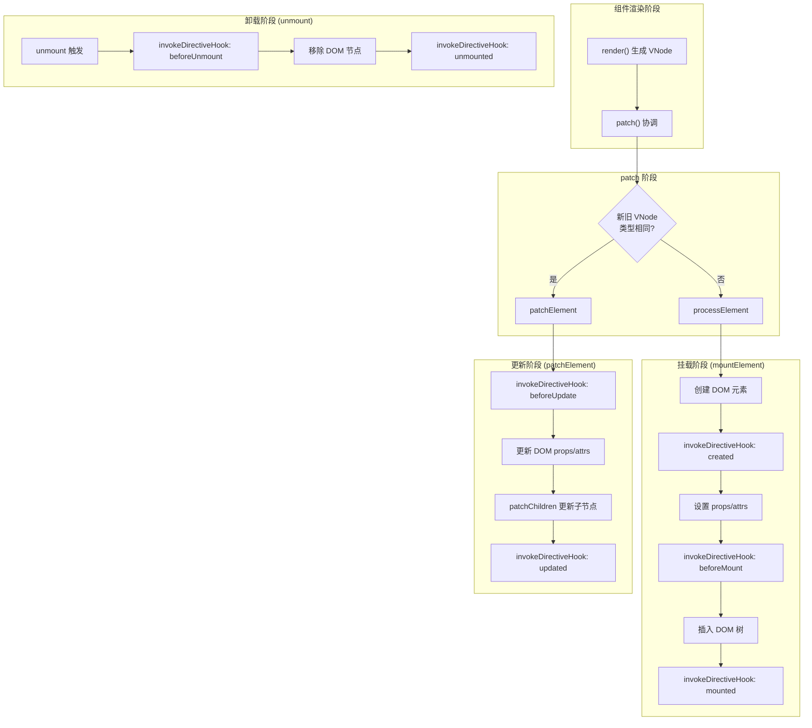

**指令的生命周期与 VNode 的关联：**

```typescript
// 指令绑定存储在 VNode.dir 中
interface VNode {
  dirs?: Array<{
    dir: ObjectDirective     // 指令对象
    instance: ComponentInternalInstance | null
    value: unknown
    oldValue: unknown
    arg: string
    modifiers: DirectiveModifiers
  }> | null
  // ...
}

// 在渲染函数编译阶段，v-my-dir="value" 被编译为
// {
//   dirs: [{
//     dir: vMyDir,
//     instance: currentInstance,
//     value: ctx.value,
//     oldValue: undefined,
//     arg: undefined,
//     modifiers: {}
//   }]
// }
```

**指令的编译产物：**

```typescript
// 模板：
// <div v-my-dir:top.click="message"></div>

// 编译后的渲染函数（简化版）：
function render(_ctx) {
  return withDirectives(
    createVNode('div', null, null),
    [
      [
        vMyDir,           // 指令对象
        _ctx.message,     // 值
        'top',            // arg
        { click: true }   // modifiers
      ]
    ]
  )
}

// withDirectives 的实现（简化自源码）：
function withDirectives(vnode: VNode, directives: DirectiveArguments): VNode {
  const internalInstance = currentRenderingInstance
  if (internalInstance === null) {
    return vnode
  }
  const instance = internalInstance.proxy
  const bindings = vnode.dirs || (vnode.dirs = [])
  for (let i = 0; i < directives.length; i++) {
    const [dir, value, arg, modifiers = {}] = directives[i]
    bindings.push({
      dir,
      instance,
      value,
      oldValue: undefined,
      arg,
      modifiers
    })
  }
  return vnode
}
```

---

## 高级模式

### 模式 1：指令 + 组合式函数的组合

复杂的指令可以通过组合式函数实现逻辑复用和测试。

```typescript
// composables/useIntersectionObserver.ts
import { ref, onUnmounted, type Ref } from 'vue'

interface UseIntersectionObserverOptions {
  root?: Element | null
  rootMargin?: string
  threshold?: number | number[]
}

export function useIntersectionObserver(
  target: Ref<Element | null>,
  options: UseIntersectionObserverOptions = {}
) {
  const isIntersecting = ref(false)
  const entry = ref<IntersectionObserverEntry | null>(null)

  let observer: IntersectionObserver | null = null

  const start = () => {
    if (!target.value) return

    observer = new IntersectionObserver(
      (entries) => {
        isIntersecting.value = entries[0].isIntersecting
        entry.value = entries[0]
      },
      options
    )
    observer.observe(target.value)
  }

  const stop = () => {
    observer?.disconnect()
    observer = null
  }

  onUnmounted(stop)

  return { isIntersecting, entry, start, stop }
}

// directives/vLazy.ts
import { ref, watch, type Directive } from 'vue'
import { useIntersectionObserver } from '../composables/useIntersectionObserver'

export const vLazy: Directive<HTMLImageElement, string> = {
  mounted(el, binding) {
    const { isIntersecting, start, stop } = useIntersectionObserver(
      ref(el),
      { rootMargin: '200px' }
    )

    const unwatch = watch(isIntersecting, (intersecting) => {
      if (intersecting) {
        el.src = binding.value
        stop()
        unwatch()
      }
    })

    start()
    ;(el as any).__lazyCleanup = () => {
      stop()
      unwatch()
    }
  },

  unmounted(el) {
    ;(el as any).__lazyCleanup?.()
  }
}

// ⚠️ 注意：指令钩子执行期间没有"活跃组件实例"，组合式函数内部的
// onUnmounted / onMounted 等生命周期注册不会生效（会收到警告）。
// 因此清理逻辑必须由指令自身的 unmounted 钩子负责，如上例所示。
```

### 模式 2：指令工厂函数

创建可配置、可复用的指令生成器。

```typescript
// directives/createDebounceDirective.ts
import type { Directive } from 'vue'

interface DebounceConfig {
  defaultDelay: number
  defaultLeading: boolean
  eventType?: string
}

export function createDebounceDirective(
  config: DebounceConfig = { defaultDelay: 300, defaultLeading: false }
): Directive<HTMLInputElement, ((value: string) => void) | {
  handler: (value: string) => void
  delay?: number
  leading?: boolean
}> {
  const timers = new WeakMap<HTMLElement, ReturnType<typeof setTimeout>>()
  const leadingFlags = new WeakMap<HTMLElement, boolean>()

  return {
    mounted(el, binding) {
      const resolveOptions = () => {
        if (typeof binding.value === 'function') {
          return {
            handler: binding.value,
            delay: config.defaultDelay,
            leading: config.defaultLeading
          }
        }
        return {
          handler: binding.value.handler,
          delay: binding.value.delay ?? config.defaultDelay,
          leading: binding.value.leading ?? config.defaultLeading
        }
      }

      const options = resolveOptions()

      const handler = (event: Event) => {
        const inputEl = event.target as HTMLInputElement

        if (options.leading && !leadingFlags.get(el)) {
          leadingFlags.set(el, true)
          options.handler(inputEl.value)
          const timer = setTimeout(() => {
            leadingFlags.set(el, false)
          }, options.delay)
          timers.set(el, timer)
          return
        }

        const existingTimer = timers.get(el)
        if (existingTimer) clearTimeout(existingTimer)

        const timer = setTimeout(() => {
          leadingFlags.set(el, false)
          options.handler(inputEl.value)
        }, options.delay)
        timers.set(el, timer)
      }

      el.addEventListener(config.eventType ?? 'input', handler)
      ;(el as any).__debounceHandler = handler
    },

    unmounted(el) {
      const timer = timers.get(el)
      if (timer) clearTimeout(timer)
      timers.delete(el)
      leadingFlags.delete(el)

      const handler = (el as any).__debounceHandler
      if (handler) {
        el.removeEventListener(config.eventType ?? 'input', handler)
      }
    }
  }
}

// 使用工厂函数创建不同的防抖指令
export const vDebounce = createDebounceDirective({ defaultDelay: 300 })
export const vDebounceSlow = createDebounceDirective({ defaultDelay: 1000 })
export const vDebounceImmediate = createDebounceDirective({
  defaultDelay: 500,
  defaultLeading: true
})
export const vDebounceChange = createDebounceDirective({
  defaultDelay: 300,
  eventType: 'change'
})
```

### 模式 3：指令管道（多个指令组合）

```typescript
// 多个指令可以同时作用于同一个元素
// <input v-focus v-debounce="handleInput" v-tooltip:top="'请输入内容'" />

// 执行顺序由元素上指令的书写顺序决定：编译产物按书写顺序生成
// withDirectives 的数组，同一钩子按数组顺序逐个调用
// 1. v-focus 的钩子先于 v-debounce、v-tooltip 执行
// 2. 同一指令的不同钩子按生命周期顺序执行

// 验证执行顺序的调试指令
const vOrder: Directive<HTMLElement, string> = {
  created(el, binding) { console.log(`[${binding.value}] created`) },
  beforeMount(el, binding) { console.log(`[${binding.value}] beforeMount`) },
  mounted(el, binding) { console.log(`[${binding.value}] mounted`) },
  updated(el, binding) { console.log(`[${binding.value}] updated`) },
  unmounted(el, binding) { console.log(`[${binding.value}] unmounted`) }
}
```

### 模式 4：动态切换指令行为

```typescript
// ⚠️ 注意：Vue 不支持"动态指令名"。
// 动态参数 :[attrName] 只适用于普通属性与事件绑定（如 :[attrName]="value"），
// 绑定的是同名 attribute，而不是 v-xxx 指令，也不能在运行时切换指令。

// 需要动态改变 DOM 行为时，常见的两种做法：

// 做法 1：单个指令内部根据 binding.value 分发行为
import { type Directive } from 'vue'

const vBehavior: Directive<HTMLElement, 'focus' | 'highlight' | 'tooltip'> = {
  mounted(el, binding) { apply(el, binding.value) },
  updated(el, binding) { apply(el, binding.value) }
}

function apply(el: HTMLElement, behavior: string) {
  if (behavior === 'focus') {
    el.focus()
  } else if (behavior === 'highlight') {
    el.style.background = '#fff3cd'
  } else if (behavior === 'tooltip') {
    el.title = '提示'
  }
}

// 模板中切换 behavior 的值即可：
// <input v-behavior="currentBehavior" />

// 做法 2：条件渲染不同的元素，各自挂不同指令
// <input v-if="mode === 'focus'" v-focus />
// <input v-else v-highlight="'#fff3cd'" />
```

### 模式 5：指令 + Teleport 的边界处理

```typescript
// 当指令用于 Teleport 内的元素时，需要特别注意

const vPortalAware: Directive<HTMLElement, unknown> = {
  mounted(el, binding, vnode) {
    // Teleport 内的元素，其 parentNode 是传送目标容器（如 body），
    // 而不是组件模板中的父节点
    const actualParent = el.parentNode

    // 需要组件上下文时，优先使用 binding.instance（组件公共实例代理）
    const instance = binding.instance
    const rootEl = instance?.$el
  }
}
```

---

## 性能优化指南

### 1. 避免在 `updated` 中执行昂贵的操作

```typescript
// ❌ 性能差：每次更新都重新计算布局
const vBadPerf: Directive<HTMLElement, unknown> = {
  updated(el) {
    // 强制回流（reflow）
    const rect = el.getBoundingClientRect()
    const styles = window.getComputedStyle(el)
    el.style.left = `${rect.left + 10}px`
  }
}

// ✅ 性能好：使用 early return 和 RAF
const vGoodPerf: Directive<HTMLElement, unknown> = {
  updated(el, binding) {
    if (binding.value === binding.oldValue) return

    // 使用 requestAnimationFrame 批量处理
    requestAnimationFrame(() => {
      const rect = el.getBoundingClientRect()
      el.style.transform = `translateX(${rect.left + 10}px)`
    })
  }
}
```

### 2. 使用事件委托减少监听器数量

```typescript
// 列表场景：在父元素上使用事件委托
const vListClick: Directive<HTMLElement, (item: HTMLElement) => void> = {
  mounted(el, binding) {
    const handler = (event: Event) => {
      const target = event.target as HTMLElement
      const item = target.closest('[data-item]') as HTMLElement
      if (item && el.contains(item)) {
        binding.value(item)
      }
    }
    el.addEventListener('click', handler)
    ;(el as any).__listClickHandler = handler
  },
  unmounted(el) {
    const handler = (el as any).__listClickHandler
    if (handler) el.removeEventListener('click', handler)
  }
}
```

### 3. Observer 实例的复用

```typescript
// 全局单例 IntersectionObserver
let globalObserver: IntersectionObserver | null = null
const callbacks = new WeakMap<Element, (entry: IntersectionObserverEntry) => void>()

function getGlobalObserver(): IntersectionObserver {
  if (!globalObserver) {
    globalObserver = new IntersectionObserver(
      (entries) => {
        entries.forEach((entry) => {
          const callback = callbacks.get(entry.target)
          callback?.(entry)
        })
      },
      { rootMargin: '200px' }
    )
  }
  return globalObserver
}
```

### 4. 使用 `v-memo` 配合指令优化

```vue
<template>
  <!-- v-memo 可以阻止指令的 updated 触发 -->
  <div v-memo="[stableValue]" v-expensive-directive="stableValue">
    {{ stableValue }}
  </div>
</template>
```

---

## 安全注意事项

### 1. 防止 XSS 攻击

```typescript
// ❌ 危险：直接插入用户输入
const vInsert: Directive<HTMLElement, string> = {
  mounted(el, binding) {
    el.innerHTML = binding.value // XSS 漏洞！
  }
}

// ✅ 安全：使用 textContent
const vSafeInsert: Directive<HTMLElement, string> = {
  mounted(el, binding) {
    el.textContent = binding.value
  }
}

// ✅ 安全：需要 HTML 时使用 DOMPurify
import DOMPurify from 'dompurify'

const vRichContent: Directive<HTMLElement, string> = {
  mounted(el, binding) {
    el.innerHTML = DOMPurify.sanitize(binding.value)
  }
}
```

### 2. 防止内存泄漏

```typescript
// 泄漏检测模式
const vLeakProof: Directive<HTMLElement, unknown> = {
  mounted(el) {
    const resources = new Set<{ destroy: () => void }>()

    // 注册资源
    const register = (resource: { destroy: () => void }) => {
      resources.add(resource)
      return resource
    }

    const observer = register({
      destroy: () => observer.disconnect()
    } as any) as MutationObserver

    // 存储清理函数
    ;(el as any).__destroy = () => {
      resources.forEach(r => r.destroy())
      resources.clear()
    }
  },

  unmounted(el) {
    ;(el as any).__destroy?.()
  }
}
```

---

## 调试与测试

### 调试指令

```typescript
// 开发环境下的指令调试包装器
function withDebug<T extends Directive>(
  name: string,
  directive: T
): T {
  if (import.meta.env.PROD) return directive

  const hooks = ['created', 'beforeMount', 'mounted', 'beforeUpdate', 'updated', 'beforeUnmount', 'unmounted'] as const

  const debugged = { ...directive }
  hooks.forEach((hook) => {
    const original = (directive as any)[hook]
    if (original) {
      (debugged as any)[hook] = (...args: any[]) => {
        console.group(`[v-${name}] ${hook}`)
        console.log('el:', args[0])
        console.log('binding:', args[1])
        console.groupEnd()
        return original(...args)
      }
    }
  })

  return debugged as T
}

// 使用
const vClickOutside = withDebug('click-outside', {
  mounted(el, binding) { /* ... */ },
  unmounted(el) { /* ... */ }
})
```

### 单元测试指令

```typescript
// directives/__tests__/vClickOutside.spec.ts
import { describe, it, expect, vi } from 'vitest'
import { mount } from '@vue/test-utils'
import { defineComponent, h, withDirectives } from 'vue'
import { vClickOutside } from '../vClickOutside'

describe('vClickOutside', () => {
  // 方式 1：通过组件测试（用 withDirectives 把指令挂到真实元素上）
  it('should trigger handler when clicking outside', async () => {
    const handler = vi.fn()

    const wrapper = mount(
      defineComponent({
        setup() {
          return () =>
            withDirectives(h('div', { 'data-test': 'inner' }, 'inside'), [
              [vClickOutside, handler]
            ])
        }
      }),
      { attachTo: document.body }
    )

    // 点击外部
    document.body.click()
    expect(handler).toHaveBeenCalled()

    wrapper.unmount()
  })

  // 方式 2：直接测试指令对象
  it('should clean up on unmount', () => {
    const el = document.createElement('div')
    const removeSpy = vi.spyOn(document, 'removeEventListener')

    vClickOutside.mounted!(el, {
      value: () => {},
      arg: undefined,
      modifiers: {},
      instance: null,
      oldValue: null,
      dir: vClickOutside
    } as any, null as any, null)

    vClickOutside.unmounted!(el, null as any, null as any, null)

    expect(removeSpy).toHaveBeenCalled()
    removeSpy.mockRestore()
  })
})
```

## 下一步

- [渲染函数与 JSX](04-渲染函数与JSX.md) — 底层渲染能力