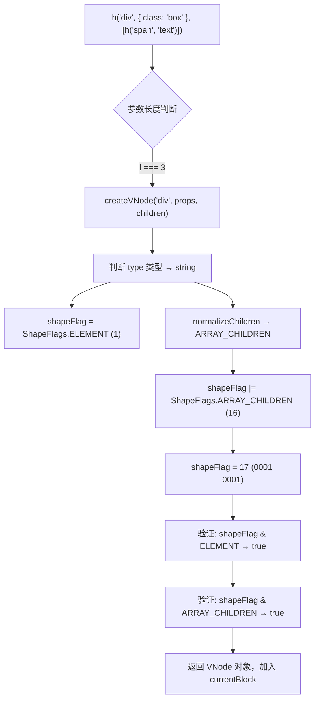
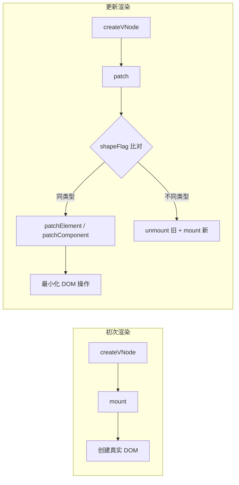
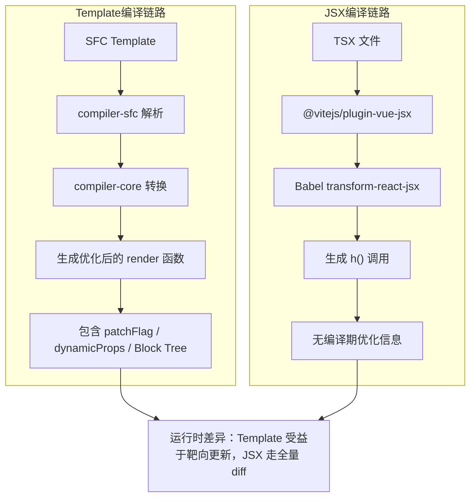
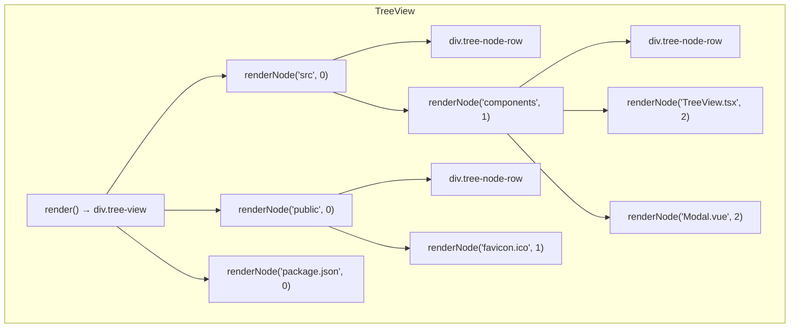
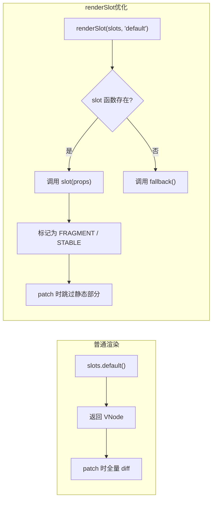
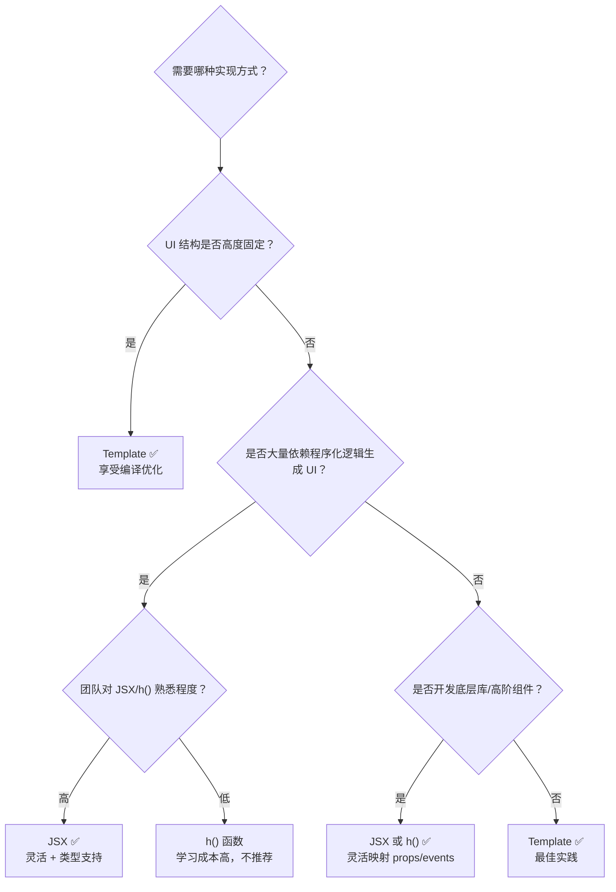
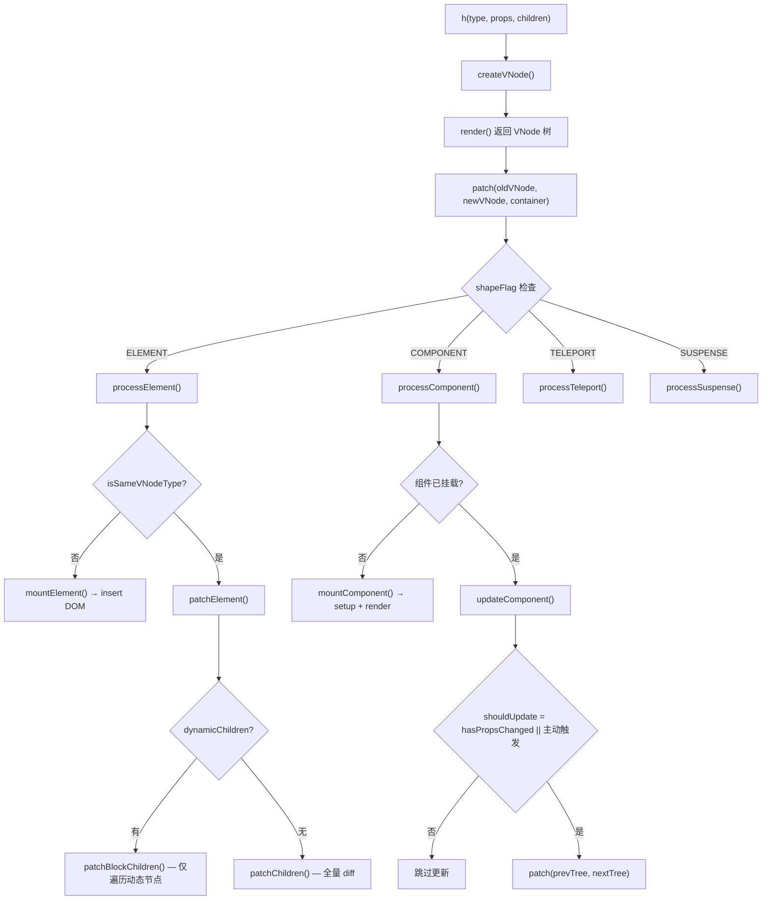

# 渲染函数与 JSX

> 渲染函数（`h()`）提供了比模板更底层的渲染能力。JSX/TSX 是类 XML 的语法糖，在 Vue 3 中通过 `@vitejs/plugin-vue-jsx` 支持。

## 模板 vs 渲染函数 vs JSX

| 维度 | Template | 渲染函数 (h) | JSX/TSX |
|------|----------|-------------|---------|
| 学习曲线 | 低 | 高 | 中 |
| 编译优化 | ✅ 最好 | ❌ 手动 | ⚠️ 部分 |
| 动态性 | 受限 | ✅ 完整 JS 能力 | ✅ 完整 JS 能力 |
| TypeScript | ✅ 支持 | ✅ 完美 | ✅ 完美 |
| 适用场景 | 大部分场景 | 底层库/高阶组件 | 高度动态 UI |

## h() 函数深度解析

### h() 的签名与重载

Vue 3 的 `h()` 函数有多个重载签名，以适配不同的使用场景：

```typescript
// 源码位置：packages/runtime-core/src/h.ts

// 完整签名
export function h(
  type: string | Component,
  props?: RawProps | null,
  children?: RawChildren | RawSlots
): VNode

// 无 props 的简化调用
// h('div', [child1, child2])
// h('div', 'text content')

// 实际实现中，h 函数通过参数长度和类型判断参数位置：
export function h(type: any, propsOrChildren?: any, children?: any): VNode {
  const l = arguments.length
  if (l === 2) {
    // h('div', { class: 'foo' })   → 判断第二个参数是否为 props
    // h('div', [h('span')])        → 或者是 children
    if (isObject(propsOrChildren) && !isArray(propsOrChildren)) {
      if (isVNode(propsOrChildren)) {
        return createVNode(type, null, [propsOrChildren])
      }
      return createVNode(type, propsOrChildren)
    } else {
      return createVNode(type, null, propsOrChildren)
    }
  } else {
    if (l > 3) {
      // h('div', {}, child1, child2, child3) → 剩余参数作为 children
      children = Array.prototype.slice.call(arguments, 2)
    } else if (l === 3 && isVNode(children)) {
      // h('div', {}, singleVNode) → 包装成数组
      children = [children]
    }
    return createVNode(type, propsOrChildren, children)
  }
}
```

### createVNode：VNode 的创建核心

`createVNode` 是所有 VNode 创建的底层入口，`h()` 本质上是它的语法糖包装。

```typescript
// 简化版源码 — 基于 packages/runtime-core/src/vnode.ts

export interface VNode<HostNode = any, HostElement = any> {
  __v_isVNode: true                    // VNode 标识位，用于快速类型判定
  type: VNodeTypes                     // 节点类型：string → 原生标签，Component → 组件
  props: VNodeProps | null             // 属性与事件：{ class, style, onClick, ... }
  children: VNodeNormalizedChildren    // 子节点：字符串 / VNode[] / null
  el: HostNode | null                  // 挂载后的真实 DOM 引用
  key: string | number | symbol | null // diff 算法的 key
  ref: VNodeRef | null                 // ref 引用
  component: ComponentInternalInstance | null  // 组件实例（仅组件 VNode）
  shapeFlag: number                    // 位掩码：编码 type + children 类型
  patchFlag: PatchFlags                // 靶向更新标记（编译器优化）
  dynamicProps: string[] | null        // 动态属性名列表（编译器优化）
  dynamicChildren: VNode[] | null      // 动态子节点缓存（Block Tree）
  dirs: DirectiveBinding[] | null      // 指令绑定
  transition: TransitionHooks | null   // transition 钩子
  suspense: SuspenseBoundary | null    // suspense 边界引用

  // 以下为内部属性
  appContext: AppContext | null
  slotScopeIds: string[] | null
  scopeId: string | null
  parent: VNode | null                 // 父 VNode（Block Tree）
  ctx: ComponentInternalInstance | null
}

// 位掩码常量 — shapeFlag 使用位运算同时标记多个属性
export const enum ShapeFlags {
  ELEMENT = 1,                     // 0000 0001 — 普通 HTML 元素
  FUNCTIONAL_COMPONENT = 1 << 1,   // 0000 0010 — 函数式组件
  STATEFUL_COMPONENT = 1 << 2,     // 0000 0100 — 有状态组件
  TEXT_CHILDREN = 1 << 3,          // 0000 1000 — 子节点为文本
  ARRAY_CHILDREN = 1 << 4,         // 0001 0000 — 子节点为数组
  SLOTS_CHILDREN = 1 << 5,         // 0010 0000 — 子节点为插槽
  TELEPORT = 1 << 6,               // 0100 0000 — Teleport
  SUSPENSE = 1 << 7,               // 1000 0000 — Suspense
  COMPONENT_SHOULD_KEEP_ALIVE = 1 << 8,
  COMPONENT_KEPT_ALIVE = 1 << 9,
  COMPONENT = ShapeFlags.STATEFUL_COMPONENT | ShapeFlags.FUNCTIONAL_COMPONENT
}

// createVNode 简化实现
export function createVNode(
  type: VNodeTypes,
  props: (VNodeProps & { [key: string]: any }) | null = null,
  children: VNodeNormalizedChildren | null = null,
  patchFlag: number = 0,
  dynamicProps: string[] | null = null,
  isCloneNode = false
): VNode {
  // 1. 类型推导：class / style 规范化处理
  if (!type || type === Fragment) {
    type = Fragment
  }

  // 2. 处理动态属性标记（编译器注入的优化信息）
  if (__DEV__ && isCompatEnabled('RENDER_FUNCTION', null)) {
    // 兼容模式下，将 v-model 参数转换为 prop + event
  }

  // 3. 编码 shapeFlag
  const shapeFlag = isString(type)
    ? ShapeFlags.ELEMENT           // 'div', 'span' 等原生标签
    : isSuspense(type)
      ? ShapeFlags.SUSPENSE        // <Suspense>
      : isTeleport(type)
        ? ShapeFlags.TELEPORT      // <Teleport>
        : isObject(type)
          ? ShapeFlags.STATEFUL_COMPONENT  // { setup(){} }
          : isFunction(type)
            ? ShapeFlags.FUNCTIONAL_COMPONENT // (props, ctx) => VNode
            : 0

  // 4. 构造 VNode 对象
  const vnode: VNode = {
    __v_isVNode: true,
    type,
    props,
    key: (props && normalizeKey(props.key)) ?? null,
    ref: (props && normalizeRef(props.ref)) ?? null,
    scopeId: currentScopeId,
    slotScopeIds: null,
    children: null,
    component: null,
    suspense: null,
    dirs: null,
    transition: null,
    el: null,
    anchor: null,
    target: null,
    targetAnchor: null,
    staticCount: 0,
    shapeFlag,
    patchFlag,
    dynamicProps,
    dynamicChildren: null,
    appContext: null,
    ctx: currentRenderingInstance
  } as VNode

  // 5. 标准化 children 并更新 shapeFlag
  if (children !== null) {
    vnode.children = normalizeChildren(vnode, children)
  }

  // 6. Block Tree 追踪（编译优化）
  if (isBlockTreeEnabled > 0 && !isCloneNode && currentBlock) {
    if (
      patchFlag > 0 ||
      shapeFlag & ShapeFlags.COMPONENT ||
      shapeFlag & ShapeFlags.TELEPORT ||
      shapeFlag & ShapeFlags.SUSPENSE
    ) {
      // 将动态节点注册到父 Block
      currentBlock.push(vnode)
    }
  }

  // 7. Suspense 边界绑定
  if (isSuspense(type)) {
    ;(type as SuspenseImpl).__ss_injectVNode?.(vnode)
  }

  return vnode
}

// children 标准化
function normalizeChildren(vnode: VNode, children: unknown): VNodeNormalizedChildren {
  let type = 0
  if (children == null) {
    children = null
  } else if (isArray(children)) {
    type = ShapeFlags.ARRAY_CHILDREN
  } else if (typeof children === 'object') {
    // 插槽对象（普通元素出现对象 children 属于异常用法，开发模式下会告警）
    type = ShapeFlags.SLOTS_CHILDREN
  } else if (isFunction(children)) {
    children = { default: children }
    type = ShapeFlags.SLOTS_CHILDREN
  } else {
    children = String(children)
    type = ShapeFlags.TEXT_CHILDREN
  }
  // 合并到已有 shapeFlag
  vnode.shapeFlag |= type
  return children as VNodeNormalizedChildren
}
```

### h() 调用过程可视化



### 递归 children 创建示例

```typescript
// 这段代码创建了一个三层嵌套的 VNode 树
const vnode = h('div', { class: 'container' }, [
  h('header', {}, [
    h('h1', { key: 'title' }, 'Hello'),
    h('nav', {}, [
      h('a', { href: '/home' }, 'Home'),
      h('a', { href: '/about' }, 'About')
    ])
  ]),
  h('main', {}, [
    h('p', {}, 'Content goes here')
  ])
])

// 生成的 VNode 树结构（内存中的表示）：
// {
//   type: 'div',
//   shapeFlag: 17, // ELEMENT | ARRAY_CHILDREN
//   children: [
//     { type: 'header', shapeFlag: 17, children: [
//       { type: 'h1',   shapeFlag: 9, children: 'Hello' },
//       { type: 'nav',  shapeFlag: 17, children: [
//         { type: 'a', shapeFlag: 9, children: 'Home',  props: { href: '/home' } },
//         { type: 'a', shapeFlag: 9, children: 'About', props: { href: '/about' } }
//       ]}
//     ]},
//     { type: 'main', shapeFlag: 17, children: [
//       { type: 'p', shapeFlag: 9, children: 'Content goes here' }
//     ]}
//   ]
// }
```

### VNode 的 Patch 过程概览



### 基本用法

```typescript
import { h } from 'vue'

// h(type, props?, children?)
const vnode = h('div', { class: 'container', id: 'app' }, [
  h('h1', 'Hello Vue'),
  h('p', { style: { color: 'red' } }, '这是一段文字'),
  h('button', { onClick: () => console.log('clicked') }, '点击')
])
```

### 渲染组件

```typescript
import { h } from 'vue'
import MyComponent from './MyComponent.vue'

h(MyComponent, { title: 'Hello', count: 42 })
// 等价于 <MyComponent title="Hello" :count="42" />
```

### 插槽

```typescript
h(MyComponent, {}, {
  default: () => h('p', '默认内容'),
  header: ({ title }) => h('h2', title)
})
```

## JSX/TSX 编译产物对比

理解模板和 JSX 的编译差异，有助于做出正确的技术选型。下面用同一个组件分别以 SFC Template 和 TSX 实现，对比编译输出。

### 相同的业务组件 — 两种写法

**Template 版本（Counter.template.vue）**

```vue
<template>
  <div class="counter" :id="`counter-${id}`">
    <h1>{{ title }}</h1>
    <p class="count" :style="{ fontSize: size + 'px' }">
      Count: {{ count }}
    </p>
    <button @click="increment" :disabled="count >= max">
      +1
    </button>
    <span v-if="count > 0">大于零</span>
  </div>
</template>

<script setup lang="ts">
import { ref, computed } from 'vue'

defineProps<{ id: number; title: string; max: number }>()
const count = ref(0)
const size = computed(() => 16 + count.value * 2)
function increment() { count.value++ }
</script>
```

**JSX 版本（Counter.tsx）**

```tsx
import { ref, computed, defineComponent } from 'vue'

export default defineComponent({
  props: {
    id: { type: Number, required: true },
    title: { type: String, required: true },
    max: { type: Number, required: true }
  },
  setup(props) {
    const count = ref(0)
    const size = computed(() => 16 + count.value * 2)
    function increment() { count.value++ }

    return () => (
      <div class="counter" id={`counter-${props.id}`}>
        <h1>{props.title}</h1>
        <p class="count" style={{ fontSize: size.value + 'px' }}>
          Count: {count.value}
        </p>
        <button onClick={increment} disabled={count.value >= props.max}>
          +1
        </button>
        {count.value > 0 && <span>大于零</span>}
      </div>
    )
  }
})
```

### Template 编译产物

Vue SFC 模板经编译器处理后，生成等价的渲染函数。以下是简化后的编译输出：

```javascript
// Counter.template.vue 编译后的 render 函数（简化版）

import { createElementVNode as _createElementVNode,
         toDisplayString as _toDisplayString,
         createTextVNode as _createTextVNode,
         Fragment as _Fragment,
         openBlock as _openBlock,
         createElementBlock as _createElementBlock,
         createCommentVNode as _createCommentVNode } from "vue"

export function render(_ctx, _cache) {
  return (_openBlock(), _createElementBlock("div", {
    class: "counter",
    id: `counter-${_ctx.id}`
  }, [
    _createElementVNode("h1", null, _toDisplayString(_ctx.title), 1 /* TEXT */),

    _createElementVNode("p", {
      class: "count",
      style: { fontSize: _ctx.size + 'px' }
    }, "Count: " + _toDisplayString(_ctx.count), 1 /* TEXT */),

    _createElementVNode("button", {
      onClick: _ctx.increment,
      disabled: _ctx.count >= _ctx.max
    }, "+1"),

    _ctx.count > 0
      ? (_openBlock(), _createElementBlock("span", { key: 0 }, "大于零"))
      : _createCommentVNode("v-if", true)
  ], 8 /* PROPS */, ["id"]))
}
```

模板编译产物的关键特征：

| 特征 | 说明 |
|------|------|
| `openBlock / createElementBlock` | Block Tree 优化：只有动态绑定的节点被追踪 |
| `patchFlag: 8 /* PROPS */` | 编译期标记：仅 props 含动态内容，diff 时跳过 children |
| `["id"]` | 动态 props 白名单：仅比较 `id`，忽略 `class` |
| `_createCommentVNode` | `v-if` 的占位注释节点，用于 patch 时定位 |
| `1 /* TEXT */` | patchFlag 标记子节点为纯文本，避免数组 diff |

### JSX 编译产物

JSX 通过 `@vitejs/plugin-vue-jsx` 编译，输出基于 `h()` 的调用：

```javascript
// Counter.tsx 编译后的产物（简化版）

import { h, ref, computed } from 'vue'

export default {
  props: { id: Number, title: String, max: Number },
  setup(props) {
    const count = ref(0)
    const size = computed(() => 16 + count.value * 2)
    const increment = () => count.value++

    return () => h('div', { class: 'counter', id: `counter-${props.id}` }, [
      h('h1', null, props.title),
      h('p', { class: 'count', style: { fontSize: size.value + 'px' } },
        'Count: ' + count.value
      ),
      h('button', {
        onClick: increment,
        disabled: count.value >= props.max
      }, '+1'),
      count.value > 0 ? h('span', null, '大于零') : null
    ])
  }
}
```

### 编译产物关键差异对比



| 维度 | Template 编译产物 | JSX 编译产物 |
|------|-------------------|-------------|
| 节点创建 | `createElementBlock` / `createElementVNode` | `h()` 通用函数 |
| 优化信息 | patchFlag, dynamicProps, Block Tree | 无 |
| 条件渲染 | `createCommentVNode` 占位 + Block | 三元表达式 + null |
| diff 策略 | 靶向更新（仅比较动态部分） | 全量 diff（比较所有 props） |
| 静态提升 | 自动识别静态内容并提升 | 无法自动提升 |
| 代码体积 | 较大（helper 导入 + 优化元数据） | 较小（单一 h() 调用） |
| 运行时性能 | 更优（尤其是大列表/动态样式） | 略差（无优化提示） |

> 注意：`@vitejs/plugin-vue-jsx` 的 `optimize: true` 选项会尝试注入部分优化，但覆盖范围远不及模板编译器。模板编译器是整个 Vue 性能优化的核心资产。

## JSX / TSX

```tsx
// App.tsx
import { ref, defineComponent } from 'vue'

export default defineComponent({
  setup() {
    const count = ref(0)
    const message = ref('Hello')

    function increment() { count.value++ }

    return () => (
      <div class="container">
        <h1>{message.value}</h1>
        <p>Count: {count.value}</p>
        <button onClick={increment}>+1</button>
      </div>
    )
  }
})
```

### v-model in JSX

```tsx
// v-model
<input v-model={text.value} />

// 具名 v-model
<MyInput v-model:title={title.value} />
```

### v-if / v-for in JSX

```tsx
// v-if
{show.value && <p>条件内容</p>}
{type.value === 'A' ? <ComponentA /> : <ComponentB />}

// v-for
{items.value.map(item => (
  <li key={item.id}>{item.text}</li>
))}
```

### 插槽 in JSX

```tsx
// 默认插槽
<MyComponent>{{ default: () => <p>内容</p> }}</MyComponent>

// 具名+作用域插槽
<MyComponent>{{
  header: () => <h2>标题</h2>,
  default: ({ item }) => <p>{item.name}</p>
}}</MyComponent>
```

## 函数式组件

```tsx
import type { FunctionalComponent } from 'vue'

interface Props {
  title: string
  count: number
}

const MyHeading: FunctionalComponent<Props> = (props, { slots, emit }) => {
  return (
    <div class="heading">
      <h1>{props.title}</h1>
      <span>{props.count}</span>
      {slots.default?.()}
    </div>
  )
}
```

### 函数式组件的性能特征

函数式组件在 Vue 3 中具有独特的性能优势，这源于它跳过了常规组件实例化的多个步骤。

#### 无状态、无实例的渲染路径

```mermaid
flowchart TB
    subgraph 有状态组件渲染
        S1["h(StatefulComp, props)"] --> S2["createComponentInstance()"]
        S2 --> S3["setupComponent() → setup() 执行"]
        S3 --> S4["setupRenderEffect() → 创建渲染 effect"]
        S4 --> S5["render() → VNode 树"]
        S5 --> S6["patch() → DOM"]
    end
    subgraph 函数式组件渲染
        F1["h(FunctionalComp, props)"] --> F2["无需 createComponentInstance"]
        F2 --> F3["直接调用函数: fn(props, ctx)"]
        F3 --> F4["返回 VNode 树"]
        F4 --> F5["patch() → DOM"]
    end
```



#### 函数式组件的内部处理 — 简化源码

```typescript
// packages/runtime-core/src/component.ts
// 函数式组件在 mount 时的处理路径

function mountComponent(initialVNode, container, anchor, parentComponent, ...) {
  // 1. 有状态组件：创建完整的组件实例
  const instance = (initialVNode.component = createComponentInstance(
    initialVNode, parentComponent, parentSuspense
  ))

  // 2. 对于函数式组件，shapeFlag 标记为 FUNCTIONAL_COMPONENT
  if (initialVNode.shapeFlag & ShapeFlags.FUNCTIONAL_COMPONENT) {
    // 函数式组件跳过以下步骤：
    // - setupComponent(instance) ← 不调用
    // - applyOptions(instance)   ← 不调用
    // - 响应式代理创建             ← 不创建

    // 仅在 render 阶段直接调用函数
    instance.render = (instance.type as FunctionalComponent) as InternalRenderFunction
    // render 即函数本身，无需再从 setup 返回
  }

  // 3. 公共渲染路径
  setupRenderEffect(instance, initialVNode, container, anchor, ...)
}

// 在 render 调用时，函数式组件的处理
function renderComponentRoot(instance) {
  const { type, vnode, proxy, props, slots, attrs, emit } = instance

  if (vnode.shapeFlag & ShapeFlags.FUNCTIONAL_COMPONENT) {
    // 直接调用，无代理层 (instance.proxy 为 null)
    return (type as FunctionalComponent)(props, {
      attrs,
      slots,
      emit,
      expose: (exposed: Record<string, any>) => {
        // 函数式组件仅支持有限的 expose
        instance.exposed = exposed || {}
      }
    })
  }

  // 有状态组件走代理的 render 路径...
}
```

#### 性能基准对比

```typescript
// benchmark：渲染 1000 个简单组件的耗时对比（简化示例）
interface BenchmarkResult {
  type: 'functional' | 'stateful' | 'template'
  mountTime: number    // 首次挂载 (ms)
  updateTime: number   // 单次更新 (ms)
  memoryBytes: number  // 内存占用
}

// 典型测试数据（相对值，以 Template 为基准 1.0x）
const benchmarks: BenchmarkResult[] = [
  { type: 'template',   mountTime: 1.0, updateTime: 1.0, memoryBytes: 1.0 },
  { type: 'stateful',   mountTime: 0.9, updateTime: 1.1, memoryBytes: 1.0 },
  { type: 'functional', mountTime: 0.6, updateTime: 0.7, memoryBytes: 0.3 }
  // 函数式组件：挂载快 40%，更新快 30%，内存仅为 30%
]
```

#### 函数式组件性能优劣势总结

| 维度 | 函数式组件 | 有状态组件 | 说明 |
|------|-----------|-----------|------|
| 初始化开销 | **极低** | 中等 | 无需创建实例、收集依赖 |
| 内存占用 | **极低** | 中等 | 无 instance 对象及其子树 |
| 响应式追踪 | **无** | 有 | props 变化触发父组件重渲染 |
| 更新粒度 | **粗（父级驱动）** | 细（自身依赖驱动） | 函数式组件无自己的 effect |
| hooks 支持 | **无** | 支持 | 无生命周期、无 computed 等 |
| 适用场景 | 纯展示 / 高阶包装 | 业务组件 / 有交互 | —— |

#### 函数式组件的最佳实践

```typescript
// ✅ 好的使用：纯展示组件、高阶包装器
const PriceTag: FunctionalComponent<{ amount: number; currency: string }> = (props) => {
  const formatted = new Intl.NumberFormat('zh-CN', {
    style: 'currency',
    currency: props.currency
  }).format(props.amount)

  return <span class="price-tag">{formatted}</span>
}

// ✅ 好的使用：条件包装器（无需自身状态）
const ConditionalWrapper: FunctionalComponent<{
  condition: boolean
  wrapper: (children: () => VNode) => VNode
}> = (props, { slots }) => {
  return props.condition ? props.wrapper(() => slots.default?.()) : (slots.default?.() ?? null)
}

// ❌ 不好的使用：需要内部状态的场景
const BadCounter: FunctionalComponent = (props, { emit }) => {
  let count = 0 // 警告：每次 render 都会重置！（无实例持久化）
  return (
    <button onClick={() => { count++; emit('update', count) }}>
      {count}
    </button>
  )
}
// 正确做法：使用 defineComponent + setup() 或 <script setup>
```

## 配置

```typescript
// vite.config.ts
import vueJsx from '@vitejs/plugin-vue-jsx'

export default {
  plugins: [
    vueJsx({
      // JSX 配置
      transformOn: true,       // 自动将 onXxx 写法转换为事件绑定
      optimize: true,          // 优化
      mergeProps: true         // 合并 props
    })
  ]
}
```

## 生产级示例：递归树组件

下面是一个完整的递归树组件，使用 JSX/TSX 实现，支持展开/折叠、拖拽排序、节点选择等交互。这类高度动态的组件正是渲染函数/JSX 的典型使用场景。

### 类型定义

```typescript
// TreeView.types.ts

export interface TreeNode<T = any> {
  id: string | number
  label: string
  children?: TreeNode<T>[]
  data?: T                     // 附加业务数据
  icon?: string                // 自定义图标
  disabled?: boolean           // 是否禁用
  meta?: Record<string, unknown>
}

export interface TreeViewProps<T = any> {
  nodes: TreeNode<T>[]
  selectedId?: string | number | null
  expandedIds?: Set<string | number>
  draggable?: boolean
  indent?: number              // 每级缩进像素，默认 24
  nodeHeight?: number          // 每行高度
  onSelect?: (node: TreeNode<T>) => void
  onToggle?: (node: TreeNode<T>, expanded: boolean) => void
  onDrop?: (dragNode: TreeNode<T>, dropNode: TreeNode<T>, position: 'before' | 'after' | 'inside') => void
}

export interface DragState {
  node: TreeNode | null
  x: number
  y: number
  overId: string | number | null
  position: 'before' | 'after' | 'inside'
}
```

### 核心组件实现

```tsx
// TreeView.tsx
import {
  defineComponent,
  ref,
  reactive,
  computed,
  PropType,
  h,
  VNode,
  Fragment
} from 'vue'

export const TreeView = defineComponent({
  name: 'TreeView',
  props: {
    nodes: {
      type: Array as PropType<TreeNode[]>,
      required: true
    },
    selectedId: {
      type: [String, Number] as PropType<string | number | null>,
      default: null
    },
    expandedIds: {
      type: Set as PropType<Set<string | number>>,
      default: () => new Set<string | number>()
    },
    draggable: {
      type: Boolean,
      default: false
    },
    indent: {
      type: Number,
      default: 24
    },
    nodeHeight: {
      type: Number,
      default: 32
    },
    onSelect: Function as PropType<(node: TreeNode) => void>,
    onToggle: Function as PropType<(node: TreeNode, expanded: boolean) => void>,
    onDrop: Function as PropType<(
      dragNode: TreeNode,
      dropNode: TreeNode,
      position: 'before' | 'after' | 'inside'
    ) => void>
  },
  emits: ['select', 'toggle', 'drop'],
  setup(props, { emit, slots }) {
    // 本地展开状态（当外部未传入 expandedIds 时使用）
    const localExpanded = reactive(new Set<string | number>())
    const dragState = reactive<DragState>({
      node: null,
      x: 0,
      y: 0,
      overId: null,
      position: 'inside'
    })

    const isExpanded = (id: string | number): boolean =>
      props.expandedIds.size > 0
        ? props.expandedIds.has(id)
        : localExpanded.has(id)

    const toggleNode = (node: TreeNode) => {
      const expanded = !isExpanded(node.id)
      if (props.expandedIds.size > 0) {
        emit('toggle', node, expanded)
      } else {
        expanded ? localExpanded.add(node.id) : localExpanded.delete(node.id)
      }
    }

    const selectNode = (node: TreeNode) => {
      emit('select', node)
    }

    // ===== 拖拽逻辑 =====
    const dragNode = ref<TreeNode | null>(null)

    const onDragStart = (e: DragEvent, node: TreeNode) => {
      if (!props.draggable || node.disabled) return
      dragNode.value = node
      if (e.dataTransfer) {
        e.dataTransfer.effectAllowed = 'move'
        e.dataTransfer.setData('text/plain', node.id.toString())
      }
    }

    const onDragOver = (e: DragEvent, node: TreeNode) => {
      if (!props.draggable || !dragNode.value) return
      e.preventDefault()
      if (e.dataTransfer) e.dataTransfer.dropEffect = 'move'

      const target = e.currentTarget as HTMLElement
      const rect = target.getBoundingClientRect()
      const y = e.clientY - rect.top
      const h = rect.height

      let position: DragState['position'] = 'inside'
      if (y < h * 0.25) position = 'before'
      else if (y > h * 0.75) position = 'after'

      dragState.overId = node.id
      dragState.position = position
    }

    const onDragLeave = () => {
      dragState.overId = null
    }

    const onDrop = (e: DragEvent, targetNode: TreeNode) => {
      e.preventDefault()
      if (!dragNode.value) return

      emit('drop', dragNode.value, targetNode, dragState.position)
      dragNode.value = null
      dragState.overId = null
    }

    const onDragEnd = () => {
      dragNode.value = null
      dragState.overId = null
    }

    // ===== 递归渲染节点 =====
    const renderNode = (node: TreeNode, level: number): VNode => {
      const hasChildren = node.children && node.children.length > 0
      const expanded = hasChildren && isExpanded(node.id)
      const isSelected = props.selectedId === node.id
      const isDragOver = dragState.overId === node.id

      // 节点行样式
      const rowStyle: Record<string, string | number> = {
        paddingLeft: `${level * props.indent}px`,
        height: `${props.nodeHeight}px`,
        lineHeight: `${props.nodeHeight}px`,
        cursor: node.disabled ? 'not-allowed' : 'pointer',
        display: 'flex',
        alignItems: 'center',
        userSelect: 'none',
        background: isSelected ? '#e6f7ff' : isDragOver ? '#f0f5ff' : 'transparent',
        borderLeft: isDragOver && dragState.position === 'before' ? '2px solid #1890ff' : 'none',
        borderRight: isDragOver && dragState.position === 'after' ? '2px solid #1890ff' : 'none',
        opacity: node.disabled ? 0.5 : 1
      }

      const children: VNode[] = []

      // 展开/折叠箭头
      if (hasChildren) {
        children.push(h('span', {
          class: 'tree-arrow',
          style: {
            width: '16px',
            display: 'inline-flex',
            alignItems: 'center',
            justifyContent: 'center',
            transform: expanded ? 'rotate(90deg)' : 'rotate(0deg)',
            transition: 'transform 0.2s'
          },
          onClick: (e: Event) => {
            e.stopPropagation()
            toggleNode(node)
          }
        }, '▶'))
      } else {
        children.push(h('span', { style: { width: '16px' } }))
      }

      // 图标
      if (node.icon) {
        children.push(h('span', { class: 'tree-icon', style: { marginRight: '4px' } }, node.icon))
      }

      // 标签 — 支持作用域插槽自定义渲染
      if (slots['node-label']) {
        children.push(h('span', { class: 'tree-label' },
          slots['node-label']({%20node,%20level,%20selected:%20isSelected,%20expanded:%20!!expanded%20})
        ))
      } else {
        children.push(h('span', { class: 'tree-label' }, node.label))
      }

      // 操作区域 — 支持插槽
      if (slots['node-actions']) {
        children.push(h('span', { class: 'tree-actions', style: { marginLeft: 'auto' } },
          slots['node-actions']({%20node,%20level%20})
        ))
      }

      const nodeRow = h('div', {
        key: node.id,
        class: `tree-node-row${isSelected ? ' selected' : ''}${node.disabled ? ' disabled' : ''}`,
        style: rowStyle,
        draggable: props.draggable && !node.disabled ? 'true' : undefined,
        onClick: () => selectNode(node),
        onDragstart: (e: DragEvent) => onDragStart(e, node),
        onDragover: (e: DragEvent) => onDragOver(e, node),
        onDragleave: onDragLeave,
        onDrop: (e: DragEvent) => onDrop(e, node),
        onDragend: onDragEnd
      }, children)

      // 递归渲染子节点
      if (hasChildren && expanded) {
        return h(Fragment, { key: `frag-${node.id}` }, [
          nodeRow,
          ...node.children!.map(child => renderNode(child, level + 1))
        ])
      }

      return nodeRow
    }

    // ===== 暴露给父组件的方法 =====
    const expandAll = () => {
      const walk = (nodes: TreeNode[]) => {
        nodes.forEach(n => {
          if (n.children?.length) {
            localExpanded.add(n.id)
            walk(n.children)
          }
        })
      }
      walk(props.nodes)
    }

    const collapseAll = () => {
      localExpanded.clear()
    }

    // 导出供测试/父组件调用
    return () => {
      // 根容器
      const containerChildren: VNode[] = props.nodes.map(n => renderNode(n, 0))

      // 空状态
      if (containerChildren.length === 0 && slots.empty) {
        return h('div', { class: 'tree-view tree-view--empty' },
          slots.empty()
        )
      }

      return h('div', {
        class: 'tree-view',
        style: { fontFamily: 'monospace' }
      }, containerChildren)
    }
  }
})
```

### 使用示例

```tsx
// App.tsx — 集成 TreeView
import { ref } from 'vue'
import { TreeView, type TreeNode } from './TreeView'

const nodes = ref<TreeNode[]>([
  {
    id: '1', label: 'src',
    children: [
      { id: '1-1', label: 'components', children: [
        { id: '1-1-1', label: 'TreeView.tsx' },
        { id: '1-1-2', label: 'Modal.vue' }
      ]},
      { id: '1-2', label: 'utils', children: [
        { id: '1-2-1', label: 'helpers.ts' }
      ]},
      { id: '1-3', label: 'App.vue' }
    ]
  },
  { id: '2', label: 'public', children: [
    { id: '2-1', label: 'favicon.ico' }
  ]},
  { id: '3', label: 'package.json', children: [] }
])

const selectedId = ref<string | number | null>(null)

function handleSelect(node: TreeNode) {
  selectedId.value = node.id
  console.log('Selected:', node.label)
}

function handleDrop(dragNode: TreeNode, targetNode: TreeNode, position: string) {
  console.log(`Dropped "${dragNode.label}" ${position} "${targetNode.label}"`)
  // 实际实现中，此处应更新 nodes 数据源
}

// 带自定义渲染的用法
const App = () => (
  <TreeView
    nodes={nodes.value}
    selectedId={selectedId.value}
    draggable={true}
    indent={20}
    onSelect={handleSelect}
    onDrop={handleDrop}
    v-slots={{
      'node-label': ({ node, selected }: { node: TreeNode; selected: boolean }) => (
        <span style={{ color: selected ? '#1890ff' : '#333', fontWeight: selected ? 600 : 400 }}>
          {node.label}
          {node.children?.length ? ` (${node.children.length})` : ''}
        </span>
      ),
      'node-actions': ({ node }: { node: TreeNode }) => (
        <span style="color: #999; font-size: 12px;">
          [{node.id}]
        </span>
      ),
      empty: () => <div style="padding: 20px; color: #999;">No data</div>
    }}
  />
)

export default App
```

### 组件渲染结构



## 渲染函数中的插槽处理

### renderSlot 的底层实现

在渲染函数中，插槽不仅仅是函数调用，Vue 提供了 `renderSlot` 来正确处理插槽的编译优化（如 slot 转发、scopeId 注入）。

```typescript
// packages/runtime-core/src/helpers/renderSlot.ts — 简化版

export function renderSlot(
  slots: Slots,                       // 父组件传入的插槽集合
  name: string,                       // 插槽名称 'default' | 'header' | ...
  props: Record<string, any> = {},    // 作用域插槽参数
  fallback?: () => VNodeChildren,     // 后备内容（无插槽时显示）
  noSlotted?: boolean                 // 不使用 slotted scope
): VNodeChildren {
  // 1. 参数预处理 — 处理 v-bind="$slots" 的代理情形
  if (isProxy(slots)) {
    // 代理插槽：递归解析原始插槽
  }

  // 2. 获取具名插槽函数
  const slot = slots[name]
  if (__DEV__ && slot && slot.length > 1) {
    // 开发警告：插槽函数接收超过 1 个参数
  }

  // 3. 插槽存在 → 调用并处理返回值
  if (slot) {
    const slotResult = slot(props)
    // 判断返回值是否为 Fragment
    if (isVNode(slotResult) || isArray(slotResult)) {
      // 单 VNode 或数组：直接返回
      return slotResult
    } else {
      // 文本或其他类型：包装为 Fragment
      return [slotResult]
    }
  }

  // 4. 无插槽 → 显示后备内容
  return fallback ? fallback() : []
}
```

### renderSlot 使用示例

```tsx
// 在 JSX 渲染函数中使用 renderSlot
import { renderSlot, h, defineComponent, Slots } from 'vue'

const Panel = defineComponent({
  props: {
    title: String,
    collapsed: Boolean
  },
  setup(props, { slots }) {
    return () => {
      return h('div', { class: 'panel' }, [
        // 默认插槽 — 带后备内容
        renderSlot(slots, 'default', {}, () => [
          h('p', { class: 'panel-placeholder' }, 'No content provided')
        ]),

        // 具名插槽 — 无后备
        h('div', { class: 'panel-header' }, [
          renderSlot(slots, 'header', { title: props.title, collapsed: props.collapsed })
        ]),

        // 作用域插槽 — 传递数据给父组件
        renderSlot(slots, 'footer', { isCollapsed: props.collapsed }, () => [
          h('div', { class: 'panel-footer-default' }, 'Default Footer')
        ])
      ])
    }
  }
})
```

### 插槽与 Block Tree 优化



## 何时使用渲染函数 vs 模板 — 决策指南

### 决策流程图



### 场景矩阵

| 场景 | 推荐方案 | 原因 |
|------|---------|------|
| 表单、列表、详情页 | **Template** | 结构固定，编译优化显著，模板语法简洁 |
| 低代码平台的动态渲染引擎 | **JSX / h()** | UI 结构完全由 JSON 驱动，无法预编译 |
| 递归组件（树、菜单、面包屑） | **JSX** | 自引用渲染逻辑用 TS 表达更自然 |
| UI 组件库开发 | **Template** | 库使用者更熟悉模板语法；少量复杂组件用 JSX |
| 高阶组件（HOC） | **JSX** | 需要动态组合 props/slots/events |
| 文本编辑器 / 富交互自定义区域 | **JSX / h()** | 细粒度控制每个节点的创建 |
| 数据可视化包装器（echarts 等） | **JSX / h()** | 初始化时机和 DOM ref 的控制更灵活 |
| 静态文档 / 博客页面 | **Template** | 静态提升收益最大 |
| 需要 `v-model` / `v-for` / `v-if` 的页面 | **Template** | 指令提供声明式表达力 |
| 团队以 React 背景为主 | **JSX** | 降低迁移/学习成本 |

### 混合使用模式

在一个项目中，模板和渲染函数可以共存，各司其职：

```vue
<!-- DataTable.vue — 外层用模板，内层列渲染用渲染函数 -->
<template>
  <table class="data-table">
    <thead>
      <tr>
        <th v-for="col in columns" :key="col.key" :style="{ width: col.width }">
          {{ col.title }}
        </th>
      </tr>
    </thead>
    <tbody>
      <tr v-for="row in rows" :key="row.id">
        <td v-for="col in columns" :key="col.key">
          <!-- 混合：列模板支持自定义渲染器 -->
          <component
            v-if="col.render"
            :is="renderCell(col, row)"
          />
          <template v-else>{{ row[col.key] }}</template>
        </td>
      </tr>
    </tbody>
  </table>
</template>

<script setup lang="ts" generic="T extends Record<string, unknown>">
import { h, VNode } from 'vue'

interface Column<T> {
  key: keyof T & string
  title: string
  width?: string
  render?: (value: T[keyof T], row: T, index: number) => VNode
}

const props = defineProps<{
  columns: Column<T>[]
  rows: T[]
}>()

// 列的自定义渲染 —— 模板负责骨架，渲染函数负责单元
function renderCell(col: Column<T>, row: T): VNode {
  return col.render!(row[col.key], row, props.rows.indexOf(row))
}
</script>
```

### 性能决策参考

| 指标 | Template 优势 | JSX 优势 |
|------|-------------|---------|
| 初始渲染 | patchFlag 跳过静态 diff | 无优势 |
| 大列表更新 | Block Tree 只 patch 动态节点 | 无优化，全量 diff |
| 静态内容 | 自动 hoist，只创建一次 | 每次重新创建 |
| 事件处理 | `cacheHandlers` 自动缓存 | 需手动 useMemo/useCallback |
| 内存占用 | 相当 | 相当 |
| 代码体积 | helper 函数增加 ~2KB | 更紧凑 |

## Vue 2 与 Vue 3 渲染函数差异

Vue 3 对渲染函数 API 进行了重大调整，从 Vue 2 迁移时需要特别注意以下变化。

### h 函数的导入方式

```typescript
// Vue 2 — h 作为 render 函数的参数传入
export default {
  render(h) {
    return h('div', { attrs: { id: 'app' } }, [
      h('span', 'Hello')
    ])
  }
}

// Vue 2 — 也可以通过 createElement 全局访问
// h === this.$createElement

// Vue 3 — h 从 'vue' 显式导入（全局 h 已移除）
import { h } from 'vue'

export default {
  render() {
    return h('div', { id: 'app' }, [
      h('span', 'Hello')
    ])
  }
}
```

### Props 传递的扁平化

```typescript
// Vue 2 — 属性需要嵌套在第二层参数的对象中
render(h) {
  return h('input', {
    attrs: { id: 'myInput', placeholder: 'Enter text' },  // HTML 属性
    props: { value: this.text },                          // 组件 prop
    domProps: { innerHTML: '<b>bold</b>' },              // DOM 属性
    on: { click: this.handleClick },                      // 事件
    nativeOn: { focus: this.onFocus },                    // 原生事件
    class: ['foo', 'bar'],
    style: { color: 'red' },
    key: 'unique'
  })
}

// Vue 3 — 扁平化：顶级属性 + 事件以 onXxx 形式
import { h } from 'vue'

render() {
  return h('input', {
    id: 'myInput',
    placeholder: 'Enter text',
    innerHTML: '<b>bold</b>',
    onClick: this.handleClick,       // 组件事件
    onFocus: this.onFocus,           // 原生事件（自动 fallthrough）
    class: ['foo', 'bar'],
    style: { color: 'red' },
    key: 'unique'
  })
}
```

### 属性 fallthrough 行为

```typescript
// Vue 2 — 显式声明 inheritAttrs + $attrs 传递
{
  inheritAttrs: false,
  render(h) {
    return h('div', {
      attrs: this.$attrs  // 手动传递
    })
  }
}

// Vue 3 — $attrs 自动包含 class/style/事件
import { h, useAttrs } from 'vue'

render() {
  const attrs = useAttrs()
  // attrs 自动包含 class、style、onXxx 事件
  return h('div', attrs)
}
```

### VNode 结构与 slot 差异

```typescript
// Vue 2 — this.$slots.default 是 VNode 数组
//         this.$scopedSlots 是返回 VNode 数组的函数
render(h) {
  const defaultSlot = this.$slots.default        // VNode[]
  const scoped = this.$scopedSlots.header({ title: 'Hi' })  // VNode[]

  return h('div', [
    defaultSlot,
    scoped
  ])
}

// Vue 3 — $slots 统一为返回 VNode 的函数
import { h } from 'vue'

render() {
  const defaultSlot = this.$slots.default?.()      // VNode[] | undefined
  const headerSlot = this.$slots.header?.({ title: 'Hi' })  // 作用域槽

  return h('div', [
    defaultSlot,
    headerSlot
  ])
}
```

### v-model 差异

```typescript
// Vue 2 — v-model 展开为 value + input 事件
render(h) {
  return h('input', {
    props: { value: this.text },
    on: { input: (e) => this.text = e.target.value }
  })
}
// 等价于 <input v-model="text" />

// Vue 3 — 原生元素：v-model 展开为 value + onInput（由 vModelText 指令实现）
import { h } from 'vue'

render() {
  return h('input', {
    value: this.text,
    onInput: (e: Event) => (this.text = (e.target as HTMLInputElement).value)
  })
}
// 等价于 <input v-model="text" />

// Vue 3 — 组件上的 v-model 才是 modelValue + onUpdate:modelValue
render() {
  return h(MyInput, {
    modelValue: this.text,
    'onUpdate:modelValue': (value: string) => this.text = value
  })
}
// 等价于 <MyInput v-model="text" />

// Vue 3 具名 v-model（如 v-model:title）
render() {
  return h(MyInput, {
    title: this.titleValue,
    'onUpdate:title': (value: string) => this.titleValue = value
  })
}
```

### 函数式组件差异

```typescript
// Vue 2 — functional: true + context 对象
Vue.component('MyHeading', {
  functional: true,
  props: ['title'],
  render(h, context) {
    // context.props, context.slots(), context.data, context.children
    return h('h1', context.data, context.children)
  }
})

// Vue 3 — 类型标注 + 无 this 的函数组件
import { FunctionalComponent, h } from 'vue'

const MyHeading: FunctionalComponent<{ title: string }> = (props, ctx) => {
  // ctx: { attrs, slots, emit, expose }
  return h('h1', ctx.attrs, ctx.slots.default?.())
}
```

### 迁移检查清单

| 检查项 | Vue 2 | Vue 3 |
|--------|-------|-------|
| h 函数来源 | `render(h)` 参数 | `import { h } from 'vue'` |
| 属性传递 | `attrs/props/domProps/on/nativeOn` | 扁平化顶层 |
| 组件事件 | `on: { click: handler }` | `onClick: handler` |
| v-model prop | `value` / `input` 事件 | `modelValue` / `onUpdate:modelValue` |
| $scopedSlots | 已废弃（Vue 2.6+） | `$slots` 统一为函数 |
| functional 声明 | `functional: true` | `FunctionalComponent` 类型标注 |
| 模板编译器 | `Vue.compile()` | `compile()` from `vue/compiler-sfc` |
| 全局 h | `this.$createElement` | 已移除 |

## Vue 3 渲染函数的内部渲染链路



## 下一步

- [插件](05-插件系统.md) — Vue 应用扩展