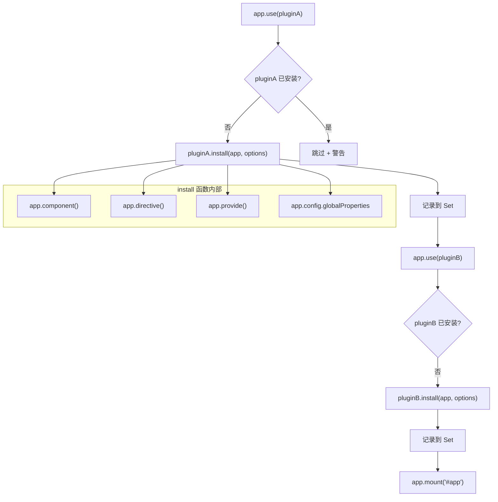
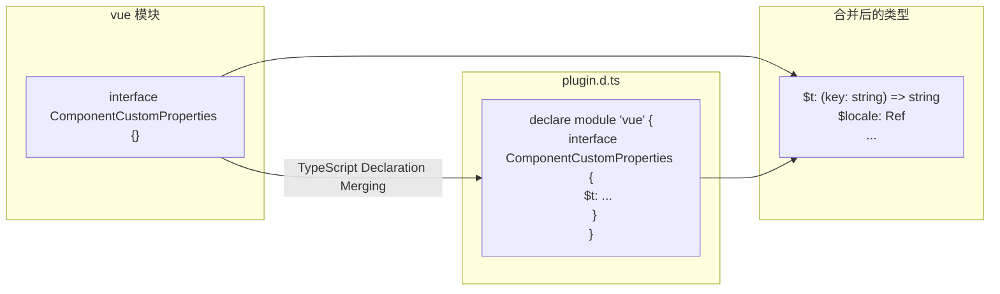
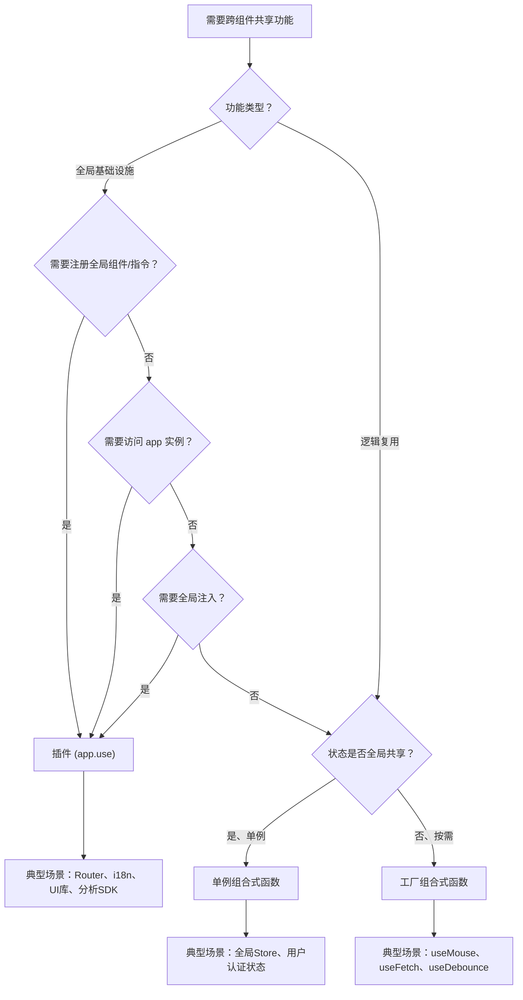

# 插件系统

> 插件用于为 Vue 应用添加全局功能，是扩展 Vue 应用的标准方式。插件可以注册全局组件、指令、注入依赖，或添加全局属性和方法。

## 插件定义

```typescript
import type { App, Plugin } from 'vue'

interface MyPluginOptions {
  prefix?: string
  enableLog?: boolean
}

const myPlugin: Plugin = {
  install(app: App, options?: MyPluginOptions) {
    const { prefix = 'My', enableLog = false } = options ?? {}

    // 1. 注册全局组件
    app.component(`${prefix}Button`, MyButton)

    // 2. 注册全局指令
    app.directive('focus', {
      mounted(el: HTMLElement) { el.focus() }
    })

    // 3. 全局依赖注入
    app.provide('pluginOptions', options)

    // 4. 全局属性
    app.config.globalProperties.$log = (msg: string) => {
      if (enableLog) console.log(`[${prefix}]`, msg)
    }

    if (enableLog) console.log(`Plugin installed with prefix: ${prefix}`)
  }
}
```

## app.use() 插件链机制

`app.use()` 是插件系统的入口，Vue 3 的简化实现如下：

```typescript
// Vue 3 源码简化：runtime-core/src/apiCreateApp.ts
interface App {
  _installedPlugins: Set<Plugin>  // 已安装插件去重集合
  use(plugin: Plugin, ...options: any[]): this
}

const installedPlugins = new Set<Plugin>()

function createAppAPI() {
  return {
    use(plugin: Plugin, ...options: any[]) {
      // 1. 去重检查：同一插件只安装一次
      if (installedPlugins.has(plugin)) {
        if (__DEV__) {
          console.warn(`Plugin "${plugin.name || 'Anonymous'}" has already been installed.`)
        }
        return this
      }

      // 2. 调用插件的 install 方法（或插件本身如果是函数）
      if (typeof plugin === 'function') {
        plugin(this, ...options)
      } else if (plugin.install) {
        plugin.install(this, ...options)
      }

      // 3. 记录已安装
      installedPlugins.add(plugin)
      return this  // 链式调用支持
    }
  }
}
```

### 插件链调用流程



**关键设计点：**

| 设计 | 说明 |
|------|------|
| `Set` 去重 | 已安装插件记录在应用上下文的去重集合中（源码为 `Set`），同一插件只安装一次 |
| 函数优先判断 | 插件可以是函数（`plugin(app)`）或带 `install` 的对象 — 兼容两种范式 |
| 链式调用 | `return this` 支持 `app.use(A).use(B).use(C)` |
| 开发环境警告 | 重复安装仅在 `__DEV__` 下警告，生产环境静默跳过 |

## 使用插件

```typescript
// main.ts
import { createApp } from 'vue'
import App from './App.vue'

const app = createApp(App)

app.use(myPlugin, { prefix: 'App', enableLog: true })
app.use(router)
app.use(pinia)

app.mount('#app')
```

## 插件注册内容一览

| 能力 | API | 说明 |
|------|-----|------|
| 全局组件 | `app.component()` | 任何组件可直接使用 |
| 全局指令 | `app.directive()` | 模板中直接使用 |
| 依赖注入 | `app.provide()` | 所有后代组件可 inject |
| 全局属性 | `app.config.globalProperties` | 模板中通过 `$xxx` 访问 |
| 混入 | `app.mixin()` | 不推荐，优先用组合式函数 |

## 实战：生产级 i18n 插件

以下是一个可直接用于生产环境的 i18n 插件，覆盖语言检测、懒加载、SSR 安全和类型安全：

```typescript
// plugins/i18n/index.ts
import type { App, Plugin, InjectionKey, Ref, ComputedRef } from 'vue'
import { ref, computed } from 'vue'

// ============= 类型定义 =============
interface I18nOptions {
  /** 默认语言 */
  locale: string
  /** 回退语言（懒加载缺失时使用） */
  fallbackLocale: string
  /** 内联翻译（用于首屏关键文案） */
  messages?: Record<string, Record<string, string>>
  /** 翻译文件懒加载函数 */
  loadLocaleMessages?: (locale: string) => Promise<Record<string, string>>
  /** SSR 安全：服务端默认语言 */
  ssrLocale?: string
}

export interface I18nContext {
  locale: Ref<string>
  fallbackLocale: string
  t: (key: string, params?: Record<string, string | number>) => string
  setLocale: (locale: string) => Promise<void>
  isLoading: Ref<boolean>
  availableLocales: ComputedRef<string[]>
}

export const I18nKey: InjectionKey<I18nContext> = Symbol('i18n')

// ============= 插件实现 =============
export const i18nPlugin: Plugin = {
  install(app: App, options: I18nOptions) {
    const {
      locale: defaultLocale,
      fallbackLocale,
      messages = {},
      loadLocaleMessages,
      ssrLocale,
    } = options

    // SSR 安全：服务端不执行浏览器语言检测
    const locale = ref(typeof window === 'undefined' ? (ssrLocale ?? defaultLocale) : defaultLocale)
    const isLoading = ref(false)
    const loadedLocales = new Set<string>([defaultLocale, fallbackLocale])

    // 合并所有已加载的翻译
    const allMessages = ref<Record<string, Record<string, string>>>({ ...messages })

    // 翻译函数：支持参数插值
    function t(key: string, params?: Record<string, string | number>): string {
      const msg = allMessages.value[locale.value]?.[key]
        ?? allMessages.value[fallbackLocale]?.[key]
        ?? key

      if (!params) return msg

      // 参数插值：t('greeting', { name: 'Vue' }) → "Hello, Vue"
      return msg.replace(/\{(\w+)\}/g, (_, k) => String(params[k] ?? `{${k}}`))
    }

    // 切换语言：先检查缓存，再懒加载
    async function setLocale(newLocale: string): Promise<void> {
      if (newLocale === locale.value) return

      if (!loadedLocales.has(newLocale) && loadLocaleMessages) {
        isLoading.value = true
        try {
          const msgs = await loadLocaleMessages(newLocale)
          allMessages.value = { ...allMessages.value, [newLocale]: msgs }
          loadedLocales.add(newLocale)
        } catch (e) {
          console.error(`[i18n] Failed to load locale "${newLocale}":`, e)
          return // 加载失败，保持当前语言
        } finally {
          isLoading.value = false
        }
      }

      locale.value = newLocale
      // 同步到 HTML lang 属性（SEO）
      if (typeof document !== 'undefined') {
        document.documentElement.lang = newLocale
      }
    }

    // 可用语言列表
    const availableLocales = computed(() =>
      Array.from(loadedLocales).sort()
    )

    const ctx: I18nContext = { locale, fallbackLocale, t, setLocale, isLoading, availableLocales }

    app.provide(I18nKey, ctx)
    app.config.globalProperties.$t = t
    app.config.globalProperties.$locale = locale
  }
}
```

### 使用方式

```typescript
// main.ts
import { createApp } from 'vue'
import { i18nPlugin } from './plugins/i18n'

const app = createApp(App)

// 语言检测：浏览器语言 → URL参数 → 默认值
function detectLocale(): string {
  if (typeof window === 'undefined') return 'en' // SSR 安全
  const urlParam = new URLSearchParams(window.location.search).get('lang')
  if (urlParam) return urlParam
  const navLang = navigator.language.split('-')[0]
  return ['zh', 'en', 'ja'].includes(navLang) ? navLang : 'en'
}

app.use(i18nPlugin, {
  locale: detectLocale(),
  fallbackLocale: 'en',
  messages: {
    en: { greeting: 'Hello, {name}!', welcome: 'Welcome to Vue 3' },
    zh: { greeting: '你好, {name}！', welcome: '欢迎来到 Vue 3' },
  },
  // 懒加载非首屏语言
  loadLocaleMessages: async (locale: string) => {
    const module = await import(`./locales/${locale}.json`)
    return module.default
  },
})

app.mount('#app')
```

```vue
<!-- 组件中使用 -->
<script setup lang="ts">
import { inject } from 'vue'
import { I18nKey } from './plugins/i18n'

const i18n = inject(I18nKey)!
const { t, locale, setLocale, isLoading } = i18n
</script>

<template>
  <div>
    <p>{{ t('greeting', { name: 'Vue' }) }}</p>
    <select :value="locale" @change="setLocale(($event.target as HTMLSelectElement).value)">
      <option v-for="loc in i18n.availableLocales.value" :key="loc" :value="loc">
        {{ loc }}
      </option>
    </select>
    <span v-if="isLoading">Loading...</span>
  </div>
</template>
```

## 插件类型声明增强

Vue 3 通过 TypeScript 模块增强（Module Augmentation）让插件声明全局类型：

```typescript
// types/plugin.d.ts
import type { Ref } from 'vue'

// 1. 增强全局属性类型（模板中 $xxx 的类型）
declare module 'vue' {
  interface ComponentCustomProperties {
    $t: (key: string, params?: Record<string, string | number>) => string
    $locale: Ref<string>
    $log: (msg: string) => void
  }

  // 2. 增强全局组件类型（app.component() 注册的组件）
  interface GlobalComponents {
    AppButton: typeof import('../components/AppButton.vue')['default']
    AppModal: typeof import('../components/AppModal.vue')['default']
  }
}

// 3. 插件自身类型导出
export {}
```

**类型增强原理：**



TypeScript 的 Declaration Merging 机制让同一 interface 的多次声明自动合并。在插件库的 `index.d.ts` 中声明 `$t` 后，用户 `inject` 和 `this.$t` 都能获得自动补全。

## 插件 vs 组合式函数：选择决策树



| 特性 | 插件 | 组合式函数 |
|------|------|----------|
| 注册方式 | `app.use()` 全局安装 | `import + useXxx()` |
| 作用范围 | 全局（所有组件） | 按需导入 |
| 全局组件/指令 | ✅ 支持 | ❌ 不支持 |
| 访问 app 实例 | ✅ 安装时可访问 | ❌ 需要 `getCurrentInstance()` |
| 应用级 provide | ✅ `app.provide()` | ❌ |
| Tree-shaking | 困难（全局安装） | 优秀（按需导入） |
| TypeScript 类型增强 | 需要 `declare module 'vue'` | 原生类型推导 |
| 测试难度 | 较难（需要 mock app 实例） | 简单（直接调用） |
| 适用场景 | 全局功能、生态集成 | 逻辑复用 |

## 插件性能考量

### 全局注册的 Bundle 体积影响

```typescript
// ❌ 全局注册：所有组件都打包，无法 tree-shake
app.component('HeavyChart', HeavyChart)  // 200KB
app.component('RichEditor', RichEditor)  // 150KB
// 即使页面不使用这些组件，也会打包进 bundle

// ✅ 按需注册：只在需要的组件中导入
// 配合 defineAsyncComponent 实现懒加载
const HeavyChart = defineAsyncComponent(() => import('./HeavyChart.vue'))
```

**性能对比：**

| 策略 | 首屏 Bundle | 组件加载时机 | 适用场景 |
|------|-----------|-------------|---------|
| 全局注册 | 包含所有组件 | 应用启动时 | 高频使用的 UI 组件（Button/Input） |
| 按需导入 | 仅包含使用的组件 | 使用时加载 | 低频使用的大型组件 |
| 异步全局 | 组件代码分离 | 首次渲染时 | 全局布局组件 |

### 插件性能最佳实践

1. **避免全局混入（mixin）**：`app.mixin()` 会污染每个组件实例，应使用组合式函数替代
2. **全局属性只放常量**：`app.config.globalProperties` 是响应式代理的，频繁访问有开销
3. **provide 使用 shallowRef**：如果注入的数据是大对象，使用 `shallowRef` 避免深层响应式开销
4. **插件安装只执行一次**：所有初始化逻辑放在 `install()` 中，不在组件生命周期中重复执行

## 与 Vue 2 插件系统的差异

| 特性 | Vue 2 | Vue 3 |
|------|-------|-------|
| 插件接收 | `Vue` 构造函数 | `app` 应用实例 |
| 全局方法 | `Vue.prototype.$xxx` | `app.config.globalProperties.$xxx` |
| 全局组件 | `Vue.component()` | `app.component()` |
| 全局指令 | `Vue.directive()` | `app.directive()` |
| 全局混入 | `Vue.mixin()` | `app.mixin()`（不推荐） |
| 安装方式 | `Vue.use(plugin)` | `app.use(plugin)` |
| 多应用实例 | 不支持（全局 Vue 污染） | ✅ 每个 app 独立 |
| 类型声明 | `Vue.prototype` 无类型 | `declare module 'vue'` 类型增强 |

### 迁移示例

```typescript
// Vue 2 插件
const vue2Plugin = {
  install(Vue, options) {
    Vue.prototype.$http = axios
    Vue.component('my-button', MyButton)
    Vue.mixin({ created() { /* ... */ } })
  }
}
Vue.use(vue2Plugin)

// Vue 3 插件（等价迁移）
const vue3Plugin: Plugin = {
  install(app, options) {
    app.config.globalProperties.$http = axios
    app.component('MyButton', MyButton)
    // app.mixin() 不推荐，改用组合式函数
  }
}
const app = createApp(App)
app.use(vue3Plugin)
```

**关键变化：**
- `Vue.prototype` → `app.config.globalProperties`：多应用实例隔离，不再污染全局
- `Vue.mixin()` → 不推荐：使用组合式函数实现逻辑复用
- `Vue.use()` → `app.use()`：每个应用独立安装插件

## 发布插件到 npm

```typescript
// package.json
{
  "name": "vue-my-plugin",
  "version": "1.0.0",
  "main": "./dist/index.js",
  "types": "./dist/index.d.ts",
  "peerDependencies": { "vue": "^3.5.0" }
}

// src/index.ts
export { myPlugin as default } from './plugin'
export { useMyFeature } from './composables'
```

## 下一步

- [原理与工程化](../04-原理与工程化/01-响应式系统原理.md) — 响应式系统、虚拟 DOM 等底层原理