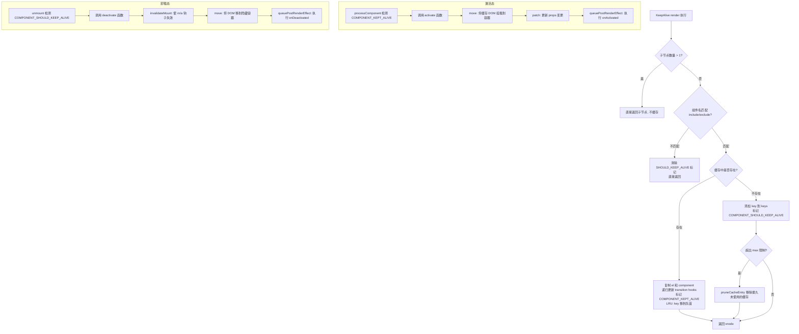

# KeepAlive源码分析

## 前言

`Vue` 内置了 `KeepAlive` 组件，帮助我们实现缓存多个组件实例切换时，完成对卸载组件实例的缓存，从而使得组件实例在来回切换时不会被重复创建，又是一个空间换时间的典型例子。在介绍源码之前，我们先来了解一下 `KeepAlive` 使用的基础示例：

```html
<template>
  <KeepAlive>
    <component :is="activeComponent" />
  </KeepAlive>
</template>
```

当动态组件在随着 `activeComponent` 变化时，如果没有 `KeepAlive` 做缓存，那么组件在来回切换时就会进行重复的实例化，这里就是通过 `KeepAlive` 实现了对不活跃组件的缓存。

这里需要思考几个问题：

1. 组件是如何被缓存的，以及是如何被重新激活的？
2. 既然缓存可以提高组件渲染的性能，是否缓存越多越好？
3. 如果不是越多越好，如何合理地丢弃多余的缓存？

接下来我们通过对源码的分析，一步步找到答案。先找到定义 `KeepAlive` 组件的地方，然后看一下其大致内容：

```js
const KeepAliveImpl: ComponentOptions = {
  name: `KeepAlive`,
  // 区别于其他组件的标记
  __isKeepAlive: true,
  // 组件的 props 定义
  props: {
    include: [String, RegExp, Array],
    exclude: [String, RegExp, Array],
    max: [String, Number],
  },
  setup(props: KeepAliveProps, { slots }: SetupContext) {
    // ...
    // setup 返回一个函数
    return () => {
      // ...
    }
  }
}
```

可以看到，`KeepAlive` 组件中，通过 `__isKeepAlive` 属性来完成对这个内置组件的特殊标记，这样外部可以通过 `isKeepAlive` 函数来做区分：

```js
export const isKeepAlive = (vnode: VNode): boolean =>
  (vnode.type as any).__isKeepAlive
```

紧接着定义了 `KeepAlive` 的一些 `props`：

1. `include` 表示包含哪些组件可被缓存
2. `exclude` 表示排除哪些组件
3. `max` 则表示最大的缓存数

后面我们将可以详细地看到这些 `props` 是如何被发挥作用的。

最后实现了一个 `setup` 函数，该函数返回了一个函数，前面提到 `setup` 返回函数的话，那么这个函数将会被当做节点 `render` 函数。了解了 `KeepAlive` 的整体骨架后，首先分析这个 `render` 函数具体做了哪些事情。

## KeepAlive 的 render 函数

先来看看 `render` 函数的源码实现：

```js
const KeepAliveImpl: ComponentOptions = {
  // ...
  setup(props: KeepAliveProps, { slots }: SetupContext) {
    const instance = getCurrentInstance()!
    const sharedContext = instance.ctx as KeepAliveContext

    const cache: Cache = new Map()
    const keys: Keys = new Set()
    let current: VNode | null = null

    // ...
    return () => {
      // 记录需要被缓存的 key
      pendingCacheKey = null

      if (!slots.default) {
        return (current = null)
      }

      const children = slots.default()
      const rawVNode = children[0]
      if (children.length > 1) {
        // 子节点数量大于 1 个，不会进行缓存，直接返回
        current = null
        return children
      } else if (
        !isVNode(rawVNode) ||
        (!(rawVNode.shapeFlag & ShapeFlags.STATEFUL_COMPONENT) &&
          !(rawVNode.shapeFlag & ShapeFlags.SUSPENSE))
      ) {
        current = null
        return rawVNode
      }

      // suspense 特殊处理，正常节点就是返回节点 vnode
      let vnode = getInnerChild(rawVNode)
      // #6028 Suspense ssContent 可能是注释 VNode，应避免缓存
      if (vnode.type === Comment) {
        current = null
        return vnode
      }

      const comp = vnode.type as ConcreteComponent

      // 获取 Component.name 值
      const name = getComponentName(
        isAsyncWrapper(vnode)
          ? (vnode.type as ComponentOptions).__asyncResolved || {}
          : comp,
      )
      // 获取 props 中的属性
      const { include, exclude, max } = props
      // 如果组件 name 不在 include 中或者存在于 exclude 中，则直接返回
      if (
        (include && (!name || !matches(include, name))) ||
        (exclude && name && matches(exclude, name))
      ) {
        // #11717 清除 SHOULD_KEEP_ALIVE 标记
        vnode.shapeFlag &= ~ShapeFlags.COMPONENT_SHOULD_KEEP_ALIVE
        current = vnode
        return rawVNode
      }

      // 缓存相关，定义缓存 key
      const key = vnode.key == null ? comp : vnode.key
      // 从缓存中取值
      const cachedVNode = cache.get(key)

      // clone vnode，因为需要重用
      if (vnode.el) {
        vnode = cloneVNode(vnode)
        if (rawVNode.shapeFlag & ShapeFlags.SUSPENSE) {
          rawVNode.ssContent = vnode
        }
      }
      // 给 pendingCacheKey 赋值，将在 beforeMount/beforeUpdate 中被使用
      pendingCacheKey = key

      if (cachedVNode) {
        // 复制挂载状态
        // 复制 DOM
        vnode.el = cachedVNode.el
        // 复制 component
        vnode.component = cachedVNode.component
        // 递归更新 transition hooks
        if (vnode.transition) {
          setTransitionHooks(vnode, vnode.transition!)
        }
        // 增加 shapeFlag 类型 COMPONENT_KEPT_ALIVE
        vnode.shapeFlag |= ShapeFlags.COMPONENT_KEPT_ALIVE
        // 把缓存的 key 移动到队首（LRU 策略）
        keys.delete(key)
        keys.add(key)
      } else {
        // 如果缓存不存在，则添加缓存
        keys.add(key)
        // 如果超出了最大的限制，则移除最早被缓存的值
        if (max && keys.size > parseInt(max as string, 10)) {
          pruneCacheEntry(keys.values().next().value!)
        }
      }
      // 增加 shapeFlag 类型 COMPONENT_SHOULD_KEEP_ALIVE，避免被卸载
      vnode.shapeFlag |= ShapeFlags.COMPONENT_SHOULD_KEEP_ALIVE

      current = vnode
      // 返回 vnode 节点
      return isSuspense(rawVNode.type) ? rawVNode : vnode
    }
  }
}
```

可以看到返回的这个 `render` 函数执行的结果就是返回被 `KeepAlive` 包裹的子节点的 `vnode`，只不过在返回子节点的过程中做了很多处理而已。如果子节点数量大于一个，那么将不会被 `keepAlive`，直接返回子节点的 `vnode`；如果组件 `name` 不在用户定义的 `include` 中或者存在于 `exclude` 中，也会直接返回子节点的 `vnode`。

### 缓存设计

接着来看后续的缓存步骤，首先定义了一个 `pendingCacheKey` 变量，用来作为 `cache` 的缓存 `key`。对于初始化的 `KeepAlive` 组件的时候，此时还没有缓存，那么只会将 `key` 添加到 `keys` 这样一个 `Set` 的数据结构中，在组件 `onMounted` 和 `onUpdated` 钩子中进行缓存组件的 `vnode` 收集，因为这个时候收集到的 `vnode` 节点是稳定不会变的缓存。

```js
let pendingCacheKey: CacheKey | null = null
const cacheSubtree = () => {
  // fix #1621, the pendingCacheKey could be 0
  if (pendingCacheKey != null) {
    // 如果 KeepAlive 子节点是 Suspense，需要在 Suspense resolve 后再缓存
    // 避免缓存尚未挂载的 vnode
    if (isSuspense(instance.subTree.type)) {
      queuePostRenderEffect(() => {
        cache.set(pendingCacheKey!, getInnerChild(instance.subTree))
      }, instance.subTree.suspense)
    } else {
      cache.set(pendingCacheKey, getInnerChild(instance.subTree))
    }
  }
}

onMounted(cacheSubtree)
onUpdated(cacheSubtree)
```

可以看到，`Vue 3.5` 中对 `cacheSubtree` 做了重要改进：当 `KeepAlive` 的子节点是 `Suspense` 时，会等待 `Suspense` 解析完成后再进行缓存，避免缓存尚未挂载的 `vnode`。

另外，注意到 `props` 中还有一个 `max` 变量用来标记最大的缓存数量，这个缓存策略就是类似于 [LRU 缓存](https://en.wikipedia.org/wiki/Cache_replacement_policies#Least_recently_used_(LRU)) 的方式实现的。在缓存重新被激活时，之前缓存的 `key` 会被重新添加到队首，标记为最近的一次缓存，如果缓存的实例数量即将超过指定的那个最大数量，则最久没有被访问的缓存实例将被销毁，以便为新的实例腾出空间。

最后，当缓存的节点被重新激活时，则会将缓存中的节点的 `el` 属性赋值给新的 `vnode` 节点，从而减少了再进行 `patch` 生成 `DOM` 的过程，这里也说明了 `KeepAlive` 核心目的就是缓存 `DOM` 元素。

同时，当缓存被命中时，如果 `vnode` 上存在 `transition` 属性，`Vue 3.5` 会递归更新 `transition hooks`，确保动画效果正确工作：

```js
if (vnode.transition) {
  // 递归更新 transition hooks on subTree
  setTransitionHooks(vnode, vnode.transition!)
}
```

### include/exclude 的缓存清理

`KeepAlive` 还会通过 `watch` 监听 `include` 和 `exclude` 的变化，当它们发生变化时，会立即清理不满足条件的缓存：

```js
watch(
  () => [props.include, props.exclude],
  ([include, exclude]) => {
    include && pruneCache(name => matches(include, name))
    exclude && pruneCache(name => !matches(exclude, name))
  },
  // 在 `current` 更新后执行，确保当前活跃组件不被误删
  { flush: 'post', deep: true },
)
```

其中 `matches` 函数支持字符串、正则和数组三种匹配模式：

```js
function matches(pattern: MatchPattern, name: string): boolean {
  if (isArray(pattern)) {
    return pattern.some((p: string | RegExp) => matches(p, name))
  } else if (isString(pattern)) {
    return pattern.split(',').includes(name)
  } else if (isRegExp(pattern)) {
    pattern.lastIndex = 0
    return pattern.test(name)
  }
  return false
}
```

## 激活态设计

上述源码中，当组件被添加到 `KeepAlive` 缓存池中时，也会为 `vnode` 节点的 `shapeFlag` 添加两个额外的属性，分别是 `COMPONENT_KEPT_ALIVE` 和 `COMPONENT_SHOULD_KEEP_ALIVE`。我们先说 `COMPONENT_KEPT_ALIVE` 这个属性，当一个节点被标记为 `COMPONENT_KEPT_ALIVE` 时，会在 `processComponent` 时进行特殊处理：

```js
const processComponent = (...) => {
  if (n1 == null) {
    // 处理 KeepAlive 组件
    if (n2.shapeFlag & ShapeFlags.COMPONENT_KEPT_ALIVE) {
      // 执行 activate 钩子
      ;(parentComponent!.ctx as KeepAliveContext).activate(
        n2,
        container,
        anchor,
        namespace,
        optimized,
      )
    } else {
      mountComponent(
        n2,
        container,
        anchor,
        parentComponent,
        parentSuspense,
        namespace,
        optimized,
      )
    }
  } else {
    // 更新组件
  }
}
```

可以看到，在 `processComponent` 阶段如果是 `keepAlive` 的组件，在挂载过程中，不会执行 `mountComponent` 的逻辑，因为已经缓存好了，所以只需要再次调用 `activate` 激活就好了。接下来看看这个激活函数做了哪些事：

```js
sharedContext.activate = (
  vnode,
  container,
  anchor,
  namespace,
  optimized,
) => {
  const instance = vnode.component!
  // 将缓存的组件挂载到容器中
  move(vnode, container, anchor, MoveType.ENTER, parentSuspense)
  // 如果 props 有变动，还是需要对 props 进行 patch
  patch(
    instance.vnode,
    vnode,
    container,
    anchor,
    instance,
    parentSuspense,
    namespace,
    vnode.slotScopeIds,
    optimized,
  )
  // 执行组件的钩子函数
  queuePostRenderEffect(() => {
    instance.isDeactivated = false
    if (instance.a) {
      invokeArrayFns(instance.a)
    }
    const vnodeHook = vnode.props && vnode.props.onVnodeMounted
    if (vnodeHook) {
      invokeVNodeHook(vnodeHook, instance.parent, vnode)
    }
  }, parentSuspense)
}
```

可以直观地看到 `activate` 激活函数，核心就是通过 `move` 方法，将缓存中的 `vnode` 节点直接挂载到容器中，同时为了防止 `props` 变化导致组件变化，也会执行 `patch` 方法来更新组件，注意此时的 `patch` 函数的调用是会传入新老子节点的，所以只会进行 `diff` 而不会进行重新创建。

当这一切都执行完成后，最后再通过 `queuePostRenderEffect` 函数，将用户定义的 `onActivated` 钩子放到状态更新流程后执行。

## 卸载态设计

接下来我们再看另一个标记态：`COMPONENT_SHOULD_KEEP_ALIVE`，我们看一下组件的卸载函数 `unmount` 的设计：

```js
const unmount = (vnode, parentComponent, parentSuspense, doRemove = false) => {
  // ...
  const { shapeFlag } = vnode
  if (shapeFlag & ShapeFlags.COMPONENT_SHOULD_KEEP_ALIVE) {
    ;(parentComponent!.ctx as KeepAliveContext).deactivate(vnode)
    return
  }
  // ...
}
```

可以看到，如果 `shapeFlag` 上存在 `COMPONENT_SHOULD_KEEP_ALIVE` 属性的话，那么将会执行 `ctx.deactivate` 方法，下面分析 `deactivate` 函数的定义：

```js
// 创建一个隐藏容器
const storageContainer = createElement('div')

sharedContext.deactivate = (vnode: VNode) => {
  const instance = vnode.component!
  // 使 mounted 和 activated 钩子失效，避免在 deactivate 后被触发
  invalidateMount(instance.m)
  invalidateMount(instance.a)

  // 将组件移动到隐藏容器中
  move(vnode, storageContainer, null, MoveType.LEAVE, parentSuspense)
  // 执行组件的钩子函数
  queuePostRenderEffect(() => {
    // 执行组件的 onDeactivated 钩子
    if (instance.da) {
      invokeArrayFns(instance.da)
    }
    const vnodeHook = vnode.props && vnode.props.onVnodeUnmounted
    if (vnodeHook) {
      invokeVNodeHook(vnodeHook, instance.parent, vnode)
    }
    instance.isDeactivated = true
  }, parentSuspense)
}
```

卸载态函数 `deactivate` 核心工作就是将页面中的 `DOM` 移动到一个隐藏不可见的容器 `storageContainer` 当中，这样页面中的元素就被移除了。

值得注意的是，`Vue 3.5` 中对 `deactivate` 函数做了重要改进：

1. **`invalidateMount` 调用**：在将组件移动到隐藏容器之前，会调用 `invalidateMount(instance.m)` 和 `invalidateMount(instance.a)`，使得组件的 `mounted` 和 `activated` 钩子失效。这是为了防止在组件被停用后，之前排入队列的 `mounted/activated` 钩子仍然被触发，导致状态不一致。

2. **标记 `isDeactivated` 的时机调整**：`isDeactivated = true` 仍然是在 `queuePostRenderEffect` 中设置的，但有了 `invalidateMount` 的配合，即使有延迟执行的钩子，也不会出现问题。

当这一切都执行完成后，最后再通过 `queuePostRenderEffect` 函数，将用户定义的 `onDeactivated` 钩子放到状态更新流程后执行。

## KeepAlive 卸载时的缓存清理

当 `KeepAlive` 组件自身被卸载时，需要清理所有缓存的组件实例。这个逻辑通过 `onBeforeUnmount` 钩子实现：

```js
onBeforeUnmount(() => {
  cache.forEach(cached => {
    const { subTree, suspense } = instance
    const vnode = getInnerChild(subTree)
    if (cached.type === vnode.type && cached.key === vnode.key) {
      // 当前实例将作为 keep-alive 卸载的一部分被卸载
      resetShapeFlag(vnode)
      // 但在这里调用其 deactivated 钩子
      const da = vnode.component!.da
      da && queuePostRenderEffect(da, suspense)
      return
    }
    unmount(cached)
  })
})
```

这段代码的逻辑是：遍历缓存中的所有组件实例，如果缓存的是当前正在活跃的组件，则重置其 `shapeFlag`（移除 `KEEP_ALIVE` 标记），并确保调用其 `deactivated` 钩子；否则直接卸载缓存的组件。

## 整体流程图

我们可以用下面的流程图来梳理 `KeepAlive` 的整体工作机制：



## 总结

现在我们尝试着再回答文中开篇提到的三个问题：

1. 组件是通过类似于 `LRU` 的缓存机制来缓存的，并为缓存的组件 `vnode` 的 `shapeFlag` 属性打上 `COMPONENT_KEPT_ALIVE` 属性，当组件在 `processComponent` 挂载时，如果存在 `COMPONENT_KEPT_ALIVE` 属性，则会执行激活函数，激活函数内执行具体的缓存节点挂载逻辑。
2. 缓存不是越多越好，因为所有的缓存节点都会被存在 `cache` 中，如果过多，则会增加内存负担。
3. 丢弃的方式就是在缓存重新被激活时，之前缓存的 `key` 会被重新添加到队首，标记为最近的一次缓存，如果缓存的实例数量即将超过指定的那个最大数量，则最久没有被访问的缓存实例将被丢弃。

此外，`Vue 3.5` 对 `KeepAlive` 做了多项改进：

1. **Suspense 子节点缓存优化**：当 `KeepAlive` 的子节点是 `Suspense` 时，会在 `Suspense` 解析完成后再进行缓存，避免缓存尚未完成挂载的 `vnode`。
2. **deactivate 生命周期改进**：在停用组件时，会调用 `invalidateMount` 使 `mounted/activated` 钩子失效，防止组件停用后仍触发这些钩子。
3. **transition hooks 递归更新**：缓存命中时会递归更新 `transition hooks`，确保动画效果正确。
4. **include/exclude 不匹配时清除标记**：当组件不满足 `include/exclude` 条件时，会主动清除 `SHOULD_KEEP_ALIVE` 标记，避免组件被错误地保活。
