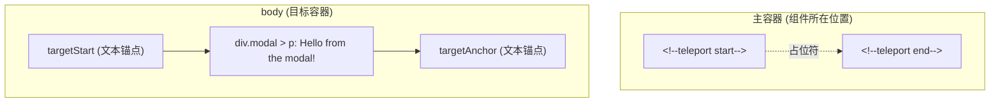
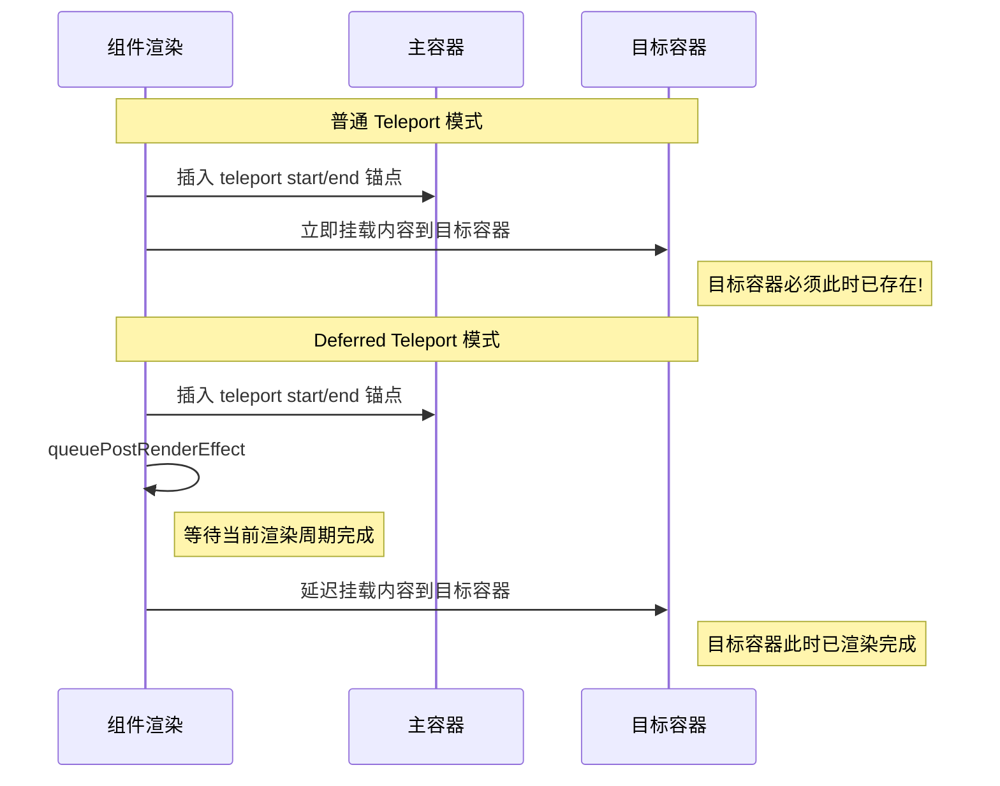

# Teleport源码分析

## 前言

`Teleport` 内置组件的功能是可以将一个组件内部的一部分 `vnode` 元素"传送"到该组件的 `DOM` 结构外层的位置去挂载。那么什么场景下会用到该组件？开发过组件库的读者可能有深刻体会，当开发全局 `Dialog` 组件时，希望 `Dialog` 的组件可以渲染到全局 `<body>` 标签上，这个时候我们写的 `Dialog` 组件的源代码可能是这样的：

```html
<template>
  <div>
    <!-- 这里是 dialog 组件的容器逻辑 -->
  </div>
</template>
<script>
  export default {
    mounted() {
      // 在 dom 被挂载完成后，再转移到 body 上
      document.body.appendChild(this.$el);
    },
    unmounted() {
      // 在组件被卸载之后，移除 DOM
      this.$el.parentNode.removeChild(this.$el);
    }
  }
</script>
```

这么做确实可以实现挂载到特定容器中，但这样一方面让 `Dialog` 组件内部需要维护复杂的 `DOM` 节点转换的逻辑，另一方面导致了浏览器需要进行 `2` 次刷新操作，一次初始化挂载，一次迁移。

所以 `Vue 3` 很贴心地为我们提供了 `Teleport` 组件，帮助我们以简便的方式**高性能**地完成节点的转移工作：

```html
<Teleport to="body">
  <div class="modal">
    <p>Hello from the modal!</p>
  </div>
</Teleport>
```

接下来将深入分析 `Teleport` 组件是如何实现"传送"挂载的。

## Teleport 的挂载

先来看看 `Teleport` 组件的源码定义：

```js
export const TeleportImpl = {
  name: 'Teleport',
  // 组件标记
  __isTeleport: true,

  process(...) {
    // ...
    // 初始化的逻辑
    if (n1 === null) {
      // ...
    } else {
      // ...
      // 更新逻辑
    }
  },

  // 卸载的逻辑
  remove(...) {
    // ...
  },

  // 移动的逻辑
  move: moveTeleport,
  // ...
}
```

接下来，我们看一下这个内部组件是如何实现组件挂载的，这块的逻辑集中在组件的 `process` 函数中，`process` 函数是在渲染器 `renderer` 的 `patch` 函数中被调用的。在前面渲染器章节中，我们提到过 `patch` 函数内部会根据 `vnode` 的 `type` 和 `shapeFlag` 的类型调用不同的处理函数，而 `<Teleport>` 组件的 `process` 正是在这里被判断调用的：

```js
const patch = (n1, n2, container, anchor, ...) => {
  // ...
  const { type, ref, shapeFlag } = n2
  switch (type) {
    // 根据 type 类型处理
    case Text:
      processText(n1, n2, container, anchor)
      break
    // 这里省略了一些其他节点处理
    // ...
    default:
      // 根据 shapeFlag 来处理
      // ...
      else if (shapeFlag & ShapeFlags.TELEPORT) {
        // 对 Teleport 节点进行处理
        type.process(
          n1,
          n2,
          container,
          anchor,
          parentComponent,
          parentSuspense,
          namespace,
          slotScopeIds,
          optimized,
          internals,
        )
      }
  }
}
```

然后分析 `process` 中是如何完成对 `Teleport` 中的节点进行挂载的，这里我们先只关注挂载逻辑，对于更新逻辑后面再介绍：

```js
export const TeleportImpl = {
  name: 'Teleport',
  __isTeleport: true,

  process(n1, n2, container, anchor, parentComponent, parentSuspense, namespace, slotScopeIds, optimized, internals) {
    const {
      mc: mountChildren,
      pc: patchChildren,
      pbc: patchBlockChildren,
      o: { insert, querySelector, createText, createComment }
    } = internals

    // 是否禁用
    const disabled = isTeleportDisabled(n2.props)
    let { shapeFlag, children, dynamicChildren } = n2

    // 初始化的逻辑
    if (n1 == null) {
      // 向主视图中插入锚点
      const placeholder = (n2.el = __DEV__
        ? createComment('teleport start')
        : createText(''))
      const mainAnchor = (n2.anchor = __DEV__
        ? createComment('teleport end')
        : createText(''))
      insert(placeholder, container, anchor)
      insert(mainAnchor, container, anchor)

      const mount = (container: RendererElement, anchor: RendererNode) => {
        // Teleport 子节点必须是数组
        if (shapeFlag & ShapeFlags.ARRAY_CHILDREN) {
          mountChildren(
            children as VNodeArrayChildren,
            container,
            anchor,
            parentComponent,
            parentSuspense,
            namespace,
            slotScopeIds,
            optimized,
          )
        }
      }

      const mountToTarget = () => {
        // 获取需要挂载的位置元素
        const target = (n2.target = resolveTarget(n2.props, querySelector))
        // 创建目标节点的锚点（包括 targetStart 和 targetAnchor）
        const targetAnchor = prepareAnchor(target, n2, createText, insert)
        if (target) {
          // #2652 从非 SVG 树传送到 SVG 树时需要更新 namespace
          if (namespace !== 'svg' && isTargetSVG(target)) {
            namespace = 'svg'
          } else if (namespace !== 'mathml' && isTargetMathML(target)) {
            namespace = 'mathml'
          }
          if (!disabled) {
            mount(target, targetAnchor)
          }
        }
      }

      // 如果禁用 teleport 则直接挂载到当前渲染节点中
      if (disabled) {
        mount(container, mainAnchor)
      }

      // 判断是否是延迟挂载模式
      if (isTeleportDeferred(n2.props)) {
        // 延迟到渲染更新完成后挂载到目标容器
        queuePostRenderEffect(() => {
          mountToTarget()
          n2.el!.__isMounted = true
        }, parentSuspense)
      } else {
        mountToTarget()
      }
    } else {
      // 进入更新逻辑
    }
  },
}
```

这里，先不急于看源码，先看看一个 `teleport` 节点在开发环境会被渲染成什么样子：

```html
<template>
  <Teleport to="body">
    <div class="modal">
      <p>Hello from the modal!</p>
    </div>
  </Teleport>
</template>
```

上述的模板，渲染结果如下：



可以看到，内容已经被渲染到 `body` 元素当中。除了这个变化外，之前的容器中还多了两个额外的注释符：

```html
<!--teleport start-->
<!--teleport end-->
```

这样再来看源码，或许就能更好地理解这些变化了。首先，在初始化中，会先创建两个占位符，分别是 `placeholder` 和 `mainAnchor`，然后再将这两个占位符挂载到组件容器中，这两个占位符也就是上文中的注释节点。

接着通过 `prepareAnchor` 函数在目标容器中创建 `targetStart` 和 `targetAnchor` 两个锚点。`Vue 3.5` 对锚点的实现做了改进：现在目标容器中有两个锚点（`targetStart` 和 `targetAnchor`），而不是之前只有一个 `targetAnchor`。`targetStart` 上还附加了一个特殊属性 `TeleportEndKey`，指向 `targetAnchor`，这样渲染器在搜索兄弟节点时可以跳过传送的内容：

```js
function prepareAnchor(
  target: RendererElement | null,
  vnode: TeleportVNode,
  createText: RendererOptions['createText'],
  insert: RendererOptions['insert'],
) {
  const targetStart = (vnode.targetStart = createText(''))
  const targetAnchor = (vnode.targetAnchor = createText(''))

  // 附加特殊属性，以便渲染器在搜索 nextSibling 时跳过传送的内容
  targetStart[TeleportEndKey] = targetAnchor

  if (target) {
    insert(targetStart, target)
    insert(targetAnchor, target)
  }

  return targetAnchor
}
```

最后根据 `disabled` 这个 `props` 属性来判断当前的节点需要采用哪种方式渲染。如果 `disabled = true`，则会以 `mainAnchor` 为参考节点进行挂载，也就是挂载到主容器中；否则会以 `targetAnchor` 为参考节点进行挂载，挂载到目标元素容器中。至此，完成节点的初始化挂载逻辑。

## Teleport 的更新

如果 `Teleport` 组件需要进行更新，则会进入更新的逻辑：

```js
export const TeleportImpl = {
  // ...
  process(n1, n2, container, anchor, parentComponent, parentSuspense, namespace, slotScopeIds, optimized, internals) {
    const {
      mc: mountChildren,
      pc: patchChildren,
      pbc: patchBlockChildren,
      o: { insert, querySelector, createText, createComment }
    } = internals

    const disabled = isTeleportDisabled(n2.props)
    let { shapeFlag, children, dynamicChildren } = n2

    if (n1 == null) {
      // 初始化逻辑...
    } else {
      // 处理 defer 模式下尚未完成首次挂载的情况
      if (isTeleportDeferred(n2.props) && !n1.el!.__isMounted) {
        queuePostRenderEffect(() => {
          TeleportImpl.process(
            n1,
            n2,
            container,
            anchor,
            parentComponent,
            parentSuspense,
            namespace,
            slotScopeIds,
            optimized,
            internals,
          )
          delete n1.el!.__isMounted
        }, parentSuspense)
        return
      }

      // 从老节点上获取相关参照系等属性
      n2.el = n1.el
      n2.targetStart = n1.targetStart
      const mainAnchor = (n2.anchor = n1.anchor)!
      const target = (n2.target = n1.target)!
      const targetAnchor = (n2.targetAnchor = n1.targetAnchor)!
      // 之前是不是禁用态
      const wasDisabled = isTeleportDisabled(n1.props)
      const currentContainer = wasDisabled ? container : target
      const currentAnchor = wasDisabled ? mainAnchor : targetAnchor

      if (namespace === 'svg' || isTargetSVG(target)) {
        namespace = 'svg'
      } else if (namespace === 'mathml' || isTargetMathML(target)) {
        namespace = 'mathml'
      }

      // 通过 dynamicChildren 更新节点
      if (dynamicChildren) {
        patchBlockChildren(
          n1.dynamicChildren!,
          dynamicChildren,
          currentContainer,
          parentComponent,
          parentSuspense,
          namespace,
          slotScopeIds,
        )
        traverseStaticChildren(n1, n2, true)
      } else if (!optimized) {
        // 全量更新
        patchChildren(
          n1,
          n2,
          currentContainer,
          currentAnchor,
          parentComponent,
          parentSuspense,
          namespace,
          slotScopeIds,
          false,
        )
      }

      if (disabled) {
        if (!wasDisabled) {
          // enabled -> disabled
          // 移动回主容器
          moveTeleport(
            n2,
            container,
            mainAnchor,
            internals,
            TeleportMoveTypes.TOGGLE,
          )
        } else {
          // #7835 当 teleport 禁用时，to 可能会变化
          // 为了确保启用时 to 正确，需要同步更新
          if (n2.props && n1.props && n2.props.to !== n1.props.to) {
            n2.props.to = n1.props.to
          }
        }
      } else {
        // 目标元素被改变
        if ((n2.props && n2.props.to) !== (n1.props && n1.props.to)) {
          // 获取新的目标元素
          const nextTarget = (n2.target = resolveTarget(
            n2.props,
            querySelector,
          ))
          // 移动到新的元素当中
          if (nextTarget) {
            moveTeleport(
              n2,
              nextTarget,
              null,
              internals,
              TeleportMoveTypes.TARGET_CHANGE,
            )
          }
        } else if (wasDisabled) {
          // disabled -> enabled
          // 移动到目标元素中
          moveTeleport(
            n2,
            target,
            targetAnchor,
            internals,
            TeleportMoveTypes.TOGGLE,
          )
        }
      }
    }
  },
}
```

代码量虽然挺多的，但所做的事情是特别明确的，首先 `Teleport` 组件的更新需要和普通节点更新一样进行子节点的 `diff`。然后会判断 `Teleport` 组件的 `props` 是否有变更，主要就是 `disabled` 和 `to` 这两个参数。

如果 `disabled` 变化，无非就是从 `可用 -> 不可用` 或者从 `不可用 -> 可用`。从 `可用 -> 不可用` 就是将原来挂在 `target` 容器中的节点重新移动到主容器中，而从 `不可用 -> 可用` 就是将主容器中的节点再挂载到 `target` 中。

如果 `to` 这个参数变化了，那么就需要重新寻找目标节点，再进行挂载。

值得注意的是，`Vue 3.5` 还修复了一个边界情况（#7835）：当 `teleport` 处于禁用状态时，`to` 属性可能会变化，此时需要将新的 `to` 值同步回旧值，以确保后续启用时能正确找到目标容器。

## Teleport 的移除

当组件卸载时，需要移除 `Teleport` 组件，再来看卸载中对于 `Teleport` 组件的处理：

```js
const unmount = (vnode, parentComponent, parentSuspense, doRemove, optimized) => {
  // ...

  if (shapeFlag & ShapeFlags.TELEPORT) {
    vnode.type.remove(
      vnode,
      parentComponent,
      parentSuspense,
      { um: unmount, o: { remove: hostRemove } },
      doRemove,
    )
  }
  // ...
}
```

`unmount` 卸载函数对于 `Teleport` 组件的处理就是直接调用 `remove` 方法：

```js
export const TeleportImpl = {
  // ...
  remove(vnode, parentComponent, parentSuspense, { um: unmount, o: { remove: hostRemove } }, doRemove) {
    const { shapeFlag, children, anchor, targetStart, targetAnchor, target, props } = vnode

    // 如果存在 target，移除 targetStart 和 targetAnchor
    if (target) {
      hostRemove(targetStart!)
      hostRemove(targetAnchor!)
    }

    // 卸载时总是需要移除子元素，无论是否禁用
    doRemove && hostRemove(anchor!)
    if (shapeFlag & ShapeFlags.ARRAY_CHILDREN) {
      const shouldRemove = doRemove || !isTeleportDisabled(props)
      for (let i = 0; i < (children as VNode[]).length; i++) {
        const child = (children as VNode[])[i]
        unmount(
          child,
          parentComponent,
          parentSuspense,
          shouldRemove,
          !!child.dynamicChildren,
        )
      }
    }
  }
}
```

`remove` 方法的操作看起来也比较好理解：首先移除掉 `targetStart` 和 `targetAnchor` 锚点内容，然后调用 `unmount` 函数挨个卸载子组件，从而完成卸载功能。

注意，`Vue 3.5` 中 `remove` 方法会同时移除 `targetStart` 和 `targetAnchor` 两个锚点（之前的版本只移除 `targetAnchor`），并且卸载时会始终卸载子元素，无论 `teleport` 是否处于禁用状态。

## Vue 3.5 新特性：Deferred Teleport

`Vue 3.5` 为 `Teleport` 组件引入了一个重要的新特性 —— **Deferred Teleport**（延迟传送），通过新增的 `defer` prop 实现。

### 问题背景

在正常情况下，`Teleport` 的目标容器必须在组件挂载时就已经存在于 `DOM` 中。这意味着如果目标容器是由当前组件树的某个部分渲染的（例如目标容器是组件自身渲染的元素），那么在 `Teleport` 内容挂载时目标容器还不存在，就会导致传送失败。

### defer prop 的使用

```html
<Teleport defer to="#late-target">
  <p>这段内容会在目标容器渲染后再传送</p>
</Teleport>

<!-- 目标容器在同一个组件树中稍后才被渲染 -->
<div id="late-target"></div>
```

当设置了 `defer` prop 后，`Teleport` 的内容不会在组件初始化时立即传送到目标容器，而是会延迟到当前渲染周期结束后（通过 `queuePostRenderEffect`），此时目标容器已经被渲染到 `DOM` 中了。

### 源码实现

回到前面介绍的 `process` 函数，我们可以看到 `defer` 模式的核心实现：

```js
// 判断是否是延迟挂载模式
const isTeleportDeferred = (props: VNode['props']): boolean =>
  props && (props.defer || props.defer === '')

// 在初始化挂载时
if (n1 == null) {
  // ...

  // 如果禁用 teleport，先挂载到主容器
  if (disabled) {
    mount(container, mainAnchor)
  }

  // 判断是否是延迟挂载模式
  if (isTeleportDeferred(n2.props)) {
    // 延迟到渲染更新完成后挂载到目标容器
    queuePostRenderEffect(() => {
      mountToTarget()
      n2.el!.__isMounted = true
    }, parentSuspense)
  } else {
    // 立即挂载到目标容器
    mountToTarget()
  }
} else {
  // 更新时，如果 defer 模式下尚未完成首次挂载
  if (isTeleportDeferred(n2.props) && !n1.el!.__isMounted) {
    queuePostRenderEffect(() => {
      TeleportImpl.process(
        n1,
        n2,
        container,
        anchor,
        parentComponent,
        parentSuspense,
        namespace,
        slotScopeIds,
        optimized,
        internals,
      )
      delete n1.el!.__isMounted
    }, parentSuspense)
    return
  }
  // ...正常更新逻辑
}
```

`defer` 模式的实现要点：

1. **初始化挂载**：当 `defer` 为 `true` 时，不在初始化阶段立即将内容传送到目标容器，而是通过 `queuePostRenderEffect` 将挂载操作推迟到当前渲染周期结束后执行。这样，目标容器即使是由当前组件树渲染的，也已经存在于 `DOM` 中了。

2. **`__isMounted` 标记**：使用 `n2.el.__isMounted` 来记录是否已经完成了到目标容器的首次挂载。

3. **更新阶段的保护**：在更新阶段，如果检测到 `defer` 模式但尚未完成首次挂载（`!n1.el.__isMounted`），则继续将更新操作推迟，直到首次挂载完成。

### 流程对比

我们可以通过下面的流程图对比普通模式和 `defer` 模式的差异：



## 总结

本小节，我们分析了 `Teleport` 组件的核心实现原理，`Teleport` 相比于之前的那种挂载方式，它的性能优势就在于 `Teleport` 节点的挂载是在 `patch` 阶段进行的，也就是在 `patch` 阶段就确定了需要挂载到哪里，而不会出现先挂载到主容器再迁移到目标容器的情况。

此外，`Vue 3.5` 对 `Teleport` 组件做了多项重要改进：

1. **Deferred Teleport（`defer` prop）**：允许 `Teleport` 的目标容器在当前组件树中渲染，内容会在渲染周期结束后再传送到目标容器，解决了目标容器晚于 `Teleport` 内容渲染的时序问题。
2. **双锚点机制**：目标容器中现在使用 `targetStart` 和 `targetAnchor` 两个锚点，并通过 `TeleportEndKey` 属性关联，使渲染器可以正确跳过传送内容。
3. **MathML 命名空间支持**：新增了 `isTargetMathML` 检测，支持传送到 `MathML` 元素。
4. **禁用态 `to` 属性同步**：修复了禁用状态下 `to` 属性变化导致启用后目标容器错误的边界情况。
